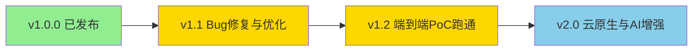

# 路线图

> 数擎大数据平台演进规划。本路线图描述 v1.1 至 v2.0 的主要里程碑与特性方向。

## 版本规划总览

| 版本 | 主题 | 预计状态 |
| --- | --- | --- |
| v1.0.0 | 首个正式版本，21 组件 + 59 Chart + 43 设计文档 | 已发布（2026-08-06） |
| v1.1 | Bug 修复 + 性能优化 + 真实外部依赖接入 | 规划中 |
| v1.2 | 端到端 PoC 真实跑通 + 更多集成测试 | 规划中 |
| v2.0 | 云原生增强 + AI 能力增强 + 数据联邦 + 实时数仓 + 更多行业模板 | 规划中 |

## v1.1.0 - Bug 修复与性能优化

**主题**：稳定化与真实依赖接入，替换 Mock 实现。

### Bug 修复

- [ ] 修复封装层 Workspace / Project / Task 的 K8s 资源翻译边界条件。
- [ ] 修复 SQL 网关跨源结果归并中的列对齐与类型转换问题。
- [ ] 修复规则引擎并发执行时的租户上下文串扰。
- [ ] 修复资产目录全文检索中文分词准确率问题。
- [ ] 修复前端工作空间上下文切换时的状态残留。

### 性能优化

- [ ] 封装层批量 K8s API 调用改为 informer watch 模式，降低 API Server 压力。
- [ ] SQL 网关引入查询结果缓存（基于 Calcite 物化视图）。
- [ ] 规则引擎规则执行改为异步 + 批量模式。
- [ ] 资产目录检索引入 Elasticsearch 倒排索引加速。
- [ ] 前端路由懒加载细化至组件级，减小首屏 bundle 体积。
- [ ] Helm Chart 全部启用资源 requests / limits 与 HPA。

### 真实外部依赖接入

- [ ] 封装层接入真实 K8s client（替换内存模拟），完整实现 Namespace / ResourceQuota / NetworkPolicy / LimitRange 翻译。
- [ ] SQL 网关接入真实 Trino / Doris / Spark / Flink 后端（替换 Mock 后端代理）。
- [ ] 规则引擎接入真实数据源执行（替换 Mock 数据源）。
- [ ] 资产目录接入真实 PostgreSQL / Elasticsearch 存储（替换内存存储）。
- [ ] 元数据采集器接入真实引擎 Hook（Hive Metastore / Iceberg REST / Doris Catalog）。
- [ ] 血缘解析器接入真实 SQL 解析（ANTLR4）与图存储（NebulaGraph）。
- [ ] Keycloak Realm 配置落地，JWT 鉴权全链路打通。
- [ ] APISIX 插件链配置落地（jwt-auth / keycloak-auth / limit-req / prometheus）。

### 预期成果

- 全部自研组件接入真实外部依赖，Mock 实现清零。
- 端到端 API 调用链路可独立验证（单组件级）。
- 性能基准基线建立。

## v1.2.0 - 端到端 PoC 真实跑通

**主题**：端到端数据流真实跑通，覆盖集成测试。

### 端到端数据流

- [ ] 数据集成链路：MySQL → SeaTunnel → Iceberg（统一存储）真实跑通。
- [ ] 批计算链路：Iceberg → Spark → Doris（OLAP）真实跑通。
- [ ] 流计算链路：Kafka → Flink → Iceberg 真实跑通。
- [ ] 交互查询链路：Iceberg → Trino → 统一 SQL 网关 → 前端真实跑通。
- [ ] 治理闭环链路：元数据采集 → 资产入目录 → 质量校验 → 血缘解析 → 质量分回写真实跑通。
- [ ] BI 可视化链路：统一 SQL 网关 → Superset → 仪表盘真实跑通。
- [ ] 多租户链路：租户创建 → 工作空间隔离 → SQL 查询 → 资源配额生效真实跑通。

### 集成测试扩展

- [ ] 新增封装层 K8s 资源翻译集成测试（Namespace / ResourceQuota / NetworkPolicy 生成验证）。
- [ ] 新增 SQL 网关联邦查询集成测试（跨 Trino + Doris 联邦）。
- [ ] 新增治理闭环集成测试（元数据 → 质量 → 血缘 → 资产目录全链路）。
- [ ] 新增多租户隔离集成测试（跨租户访问拒绝、资源配额超限拒绝）。
- [ ] 新增四环境一致性集成测试（信创 / 本地 / 公有云 / 私有云 Profile 验证）。
- [ ] 集成测试数量从 38 个扩展至 80+ 个。

### PoC 验证脚本增强

- [ ] PoC SQL 占位符渲染逻辑实现，表命名衔接修复。
- [ ] PoC 验证脚本覆盖完整端到端数据流。
- [ ] PoC 验收标准与设计文档对齐。

### 预期成果

- 端到端数据流（MySQL → Iceberg → Spark → Doris → 治理闭环 → 统一 SQL → BI 看板）真实跑通。
- 集成测试覆盖核心链路，CI 中自动运行。
- 平台达到 MVP（最小可运行产品）标准。

## v2.0.0 - 云原生与 AI 增强

**主题**：云原生能力增强、AI 能力深化、数据联邦与实时数仓、行业生态扩展。

### 云原生增强

- [ ] **Service Mesh**：引入 Istio / Linkerd，实现服务间 mTLS、流量治理（灰度 / 熔断 / 重试）、可观测增强。
- [ ] **Serverless**：引入 Knative / OpenFaaS，支持事件驱动的数据处理函数（如轻量 ETL、Webhook 处理）。
- [ ] **GitOps**：引入 ArgoCD / Flux，实现部署声明式 Git 驱动与自动漂移回滚。
- [ ] **多集群联邦**：引入 Karmada / KubeFed，支持跨集群数据联邦与故障迁移。
- [ ] **FinOps**：引入成本可视化与优化建议，按租户 / 工作空间 / 任务维度计量计费。

### AI 能力增强

- [ ] **Agent 编排**：支持多 Agent 协作编排，实现复杂数据分析任务的自主规划与执行。
- [ ] **RAG 增强**：知识工程支持多模态 RAG（文本 / 表格 / 图像）、混合检索（向量 + 关键词 + 图谱）、重排序。
- [ ] **多模态**：大模型网关支持文本 / 图像 / 语音 / 视频多模态输入输出。
- [ ] **模型评测**：LLMOps 支持自动化模型评测（准确率 / 召回率 / 延迟 / 成本），评测报告可视化。
- [ ] **模型微调**：LLMOps 支持 LoRA / QLoRA / 全参微调，微调任务 on K8s 编排。
- [ ] **AI 数据分析助手**：控制台集成 AI 助手，支持自然语言转 SQL、智能数据解读、智能图表推荐。

### 数据联邦

- [ ] **跨源联邦查询**：SQL 网关基于 Calcite 实现跨 Iceberg / Doris / Trino / IoTDB / Elasticsearch 联邦查询与下推优化。
- [ ] **跨集群联邦**：支持跨 K8s 集群数据联邦查询，数据不动查询动。
- [ ] **数据虚拟化**：支持不迁移数据即对外提供统一查询接口。

### 实时数仓

- [ ] **实时入仓**：Flink CDC → Iceberg V2 表（行级 upsert）实时入仓，延迟秒级。
- [ ] **流批一体**：同一份 Iceberg 表同时支撑批计算（Spark）与流计算（Flink），无需双份存储。
- [ ] **实时 OLAP**：Doris 实时物化视图自动同步 Iceberg 变更，查询延迟毫秒级。
- [ ] **实时治理**：元数据 / 血缘 / 质量规则实时触发，治理闭环延迟从分钟级降至秒级。

### 行业模板扩展

- [ ] **金融行业模板**：风控数据集市 + 监管报表 + 客户画像 DDL + DAG + Dashboard。
- [ ] **制造行业模板**：设备 OEE 分析 + 质量追溯 + 供应链协同。
- [ ] **零售行业模板**：商品画像 + 会员分析 + 营销效果评估。
- [ ] **能源行业模板**：设备监测 + 用能分析 + 碳排放核算。
- [ ] **政务行业模板**：人口分析 + 经济运行 + 民生服务。
- [ ] 行业模板数量从 0 扩展至 10+ 个，覆盖主要数据密集型行业。

### 其他增强

- [ ] **数据资产流通**：资产登记 / 上架 / 流通 / 变现 / 分账全流程落地，支持数据交易。
- [ ] **开放 API 服务目录**：API 发布管理 + 服务目录 + 订阅计费落地。
- [ ] **安全合规**：等保三级 + 密评 + 数据合规三线框架落地，SecurityFacade 统一封装。
- [ ] **国密支持**：SM2 / SM3 / SM4 可插拔，CryptoSpiFactory 抽象落地。
- [ ] **可观测增强**：Grafana 双视图（平台方全局 + 客户方业务健康）、Alertmanager 分级路由、统一查询 API。

### 预期成果

- 平台从 MVP 演进至生产级 GA。
- AI 能力成为旗舰版核心差异化卖点。
- 行业生态初步形成，覆盖 5+ 行业。
- 云原生能力对标主流数据平台。

## 长期愿景

- **数据操作系统**：将数擎大数据平台打造为数据领域的"操作系统"，屏蔽底层引擎复杂性，让数据从业者聚焦业务价值。
- **开源生态**：核心组件开源，吸引社区贡献，建立数据平台开源生态。
- **信创标杆**：成为信创环境下大数据平台的事实标准，推动国产化替代。
- **AI 原生**：从"数据平台 + AI 能力"演进为"AI 原生数据平台"，AI 贯穿数据全生命周期。

## 反馈

路线图会根据社区反馈与实际进展动态调整。欢迎在 GitHub Issue 中提出建议，标注 `roadmap` 标签。