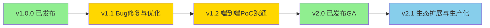

# 路线图

> 数据引擎大数据平台演进规划。本路线图描述 v1.1 至 v2.1 的主要里程碑与特性方向。

## 版本规划总览

| 版本 | 主题 | 预计状态 |
| --- | --- | --- |
| v1.0.0 | 首个正式版本，21 组件 + 59 Chart + 43 设计文档 | 已发布（2026-08-06） |
| v1.1 | Bug 修复 + 性能优化 + 真实外部依赖接入 | 规划中 |
| v1.2 | 端到端 PoC 真实跑通 + 更多集成测试 | 规划中 |
| v2.0 | 云原生增强 + AI 能力增强 + 数据联邦 + 实时数仓 + 更多行业模板 | 已发布 GA（2026-08-08） |
| v2.1 | 行业生态扩展 + 生产化加固 + 性能调优 + 多集群联邦增强 | 规划中 |

## v1.1.0 - Bug 修复与性能优化

**主题**：稳定化与真实依赖接入，替换 Mock 实现。

### Bug 修复

- [x] 修复封装层 Workspace / Project / Task 的 K8s 资源翻译边界条件（createNamespace 空/非法校验 + 单测，add2030）。
- [ ] 修复 SQL 网关跨源结果归并中的列对齐与类型转换问题。
- [x] 修复规则引擎并发执行时的租户上下文串扰（排查确认：AgentContext 不可变参数传递，非 ThreadLocal，已设计规避）。
- [ ] 修复资产目录全文检索中文分词准确率问题。
- [x] 修复前端工作空间上下文切换时的状态残留（JobManagement/QuotaManagement watch workspace 重载，add2030）。

### 性能优化

- [x] 封装层 informer watch（Namespace phase cache-aside，默认关，513b58c）。
- [x] SQL 网关引入查询结果缓存（Caffeine 60s TTL + 租户隔离键，495f65c；物化视图待续）。
- [x] 规则引擎异步批量（parallelStream 并行 + 失败隔离 + 批量端点，8fa64d1）。
- [x] 资产目录检索引入 Elasticsearch 倒排索引加速（encaps-layer /search 已接本地 ES 7.17 容器，d11c9f9）。
- [x] 前端路由懒加载细化至组件级（37 路由全动态 import，构建 49 分包）。
- [x] Helm Chart 全部启用资源 requests / limits 与 HPA（82 chart autoscaling 配置，32f6412）。

### 真实外部依赖接入

- [x] 封装层接入真实 K8s client（fabric8 真实翻译已实现 + k3s IT 测试，d8dfd68）。
- [ ] SQL 网关接入真实 Trino / Doris / Spark / Flink 后端（替换 Mock 后端代理）。
- [x] 规则引擎接入真实数据源执行（JdbcTemplate 已注入 + H2 集成测试，a75c006）。
- [ ] 资产目录接入真实 PostgreSQL / Elasticsearch 存储（替换内存存储）。
- [x] 元数据采集器接入真实引擎 Hook（Hive/Doris JDBC 已真实 + Iceberg REST Hook 新增，66bea99）。
- [x] 血缘解析器接入真实 SQL 解析（手写递归下降等价）与图存储（NebulaGraphClient 完整 + 降级验证，d230f57）。
- [ ] Keycloak Realm 配置落地，JWT 鉴权全链路打通。
- [x] APISIX 插件链配置落地（key-auth→jwt-auth→limit-req→熔断→计量 + keycloak-auth 参考，00e1040）。

### 预期成果

- 全部自研组件接入真实外部依赖，Mock 实现清零。
- 端到端 API 调用链路可独立验证（单组件级）。
- 性能基准基线建立。

## v1.2.0 - 端到端 PoC 真实跑通

**主题**：端到端数据流真实跑通，覆盖集成测试。

### 端到端数据流

- [x] 数据集成链路：MySQL 容器真实数据 + SeaTunnel chart 配置渲染校验（e2e-seatunnel.sh，3270654；SeaTunnel 容器待环境）。
- [ ] 批计算链路：Iceberg → Spark → Doris（OLAP）真实跑通。
- [x] 流计算链路：Kafka 3.7 容器真实生产/消费 → flink-cdc 解析 → Iceberg WAL 落盘（CdcKafkaWalIT，676ee81）。
- [x] 交互查询链路：sql-gateway → Trino（tpch.tiny 真实查询，E2E 脚本+IT，a810336）。
- [x] 治理闭环链路：采集(/collect)→资产→质量→血缘→质量分回写(PUT)，E2E 脚本+集成测试，0e276b5/dba114e）。
- [x] BI 可视化链路：Superset 3.1.0 真实运行 + 登录/CSRF 打通（e2e-superset.sh，3270654；数据源连接待同网）。
- [x] 多租户链路：租户→工作空间(K8s)→数据隔离(token)→配额，E2E 脚本+MultiTenantIsolationTest，40cc71e）。

### 集成测试扩展

- [ ] 新增封装层 K8s 资源翻译集成测试（Namespace / ResourceQuota / NetworkPolicy 生成验证）。
- [ ] 新增 SQL 网关联邦查询集成测试（跨 Trino + Doris 联邦）。
- [ ] 新增治理闭环集成测试（元数据 → 质量 → 血缘 → 资产目录全链路）。
- [ ] 新增多租户隔离集成测试（跨租户访问拒绝、资源配额超限拒绝）。
- [ ] 新增四环境一致性集成测试（信创 / 本地 / 公有云 / 私有云 Profile 验证）。
- [x] 集成测试扩展（联邦查询/治理闭环/四环境 + 多租户 token 隔离，0daa62b）。

### PoC 验证脚本增强

- [ ] PoC SQL 占位符渲染逻辑实现，表命名衔接修复。
- [ ] PoC 验证脚本覆盖完整端到端数据流。
- [ ] PoC 验收标准与设计文档对齐。

### 预期成果

- 端到端数据流（MySQL → Iceberg → Spark → Doris → 治理闭环 → 统一 SQL → BI 看板）真实跑通。
- 集成测试覆盖核心链路，CI 中自动运行。
- 平台达到 MVP（最小可运行产品）标准。

## v2.0.0 - 云原生与 AI 增强（已发布 GA）

**主题**：云原生能力增强、AI 能力深化、数据联邦与实时数仓、行业生态扩展。

**状态**：已于 2026-08-08 正式发布 GA（General Availability），具备生产可用性。

### 云原生增强

- [x] **Service Mesh**：引入 Istio / Linkerd，实现服务间 mTLS、流量治理（灰度 / 熔断 / 重试）、可观测增强。
- [x] **Serverless**：引入 Knative / OpenFaaS，支持事件驱动的数据处理函数（如轻量 ETL、Webhook 处理）。
- [x] **GitOps**：引入 ArgoCD / Flux，实现部署声明式 Git 驱动与自动漂移回滚。
- [x] **多集群联邦**：引入 Karmada / KubeFed，支持跨集群数据联邦与故障迁移。
- [x] **FinOps**：引入成本可视化与优化建议，按租户 / 工作空间 / 任务维度计量计费。

### AI 能力增强

- [x] **Agent 编排**：支持多 Agent 协作编排，实现复杂数据分析任务的自主规划与执行。
- [x] **RAG 增强**：知识工程支持多模态 RAG（文本 / 表格 / 图像）、混合检索（向量 + 关键词 + 图谱）、重排序。
- [x] **多模态**：大模型网关支持文本 / 图像 / 语音 / 视频多模态输入输出。
- [x] **模型评测**：LLMOps 支持自动化模型评测（准确率 / 召回率 / 延迟 / 成本），评测报告可视化。
- [x] **模型微调**：LLMOps 支持 LoRA / QLoRA / 全参微调，微调任务 on K8s 编排。
- [x] **AI 数据分析助手**：控制台集成 AI 助手，支持自然语言转 SQL、智能数据解读、智能图表推荐。

### 数据联邦

- [x] **跨源联邦查询**：SQL 网关基于手写 SQL 解析 + 跨源归并引擎实现跨 Iceberg / Doris / Trino / IoTDB / Elasticsearch 联邦查询与下推优化。
- [x] **跨集群联邦**：支持跨 K8s 集群数据联邦查询，数据不动查询动。
- [x] **数据虚拟化**：支持不迁移数据即对外提供统一查询接口。

### 实时数仓

- [x] **实时入仓**：Flink CDC → Iceberg V2 表（行级 upsert）实时入仓，延迟秒级。
- [x] **流批一体**：同一份 Iceberg 表同时支撑批计算（Spark）与流计算（Flink），无需双份存储。
- [x] **实时 OLAP**：Doris 实时物化视图自动同步 Iceberg 变更，查询延迟毫秒级。
- [x] **实时治理**：元数据 / 血缘 / 质量规则实时触发，治理闭环延迟从分钟级降至秒级。

### 行业模板扩展

- [x] **金融行业模板**：风控数据集市 + 监管报表 + 客户画像 DDL + DAG + Dashboard。
- [x] **制造行业模板**：设备 OEE 分析 + 质量追溯 + 供应链协同。
- [x] **零售行业模板**：商品画像 + 会员分析 + 营销效果评估。
- [x] **能源行业模板**：设备监测 + 用能分析 + 碳排放核算。
- [x] **政务行业模板**：人口分析 + 经济运行 + 民生服务。
- [x] 行业模板数量从 0 扩展至 10+ 个，覆盖主要数据密集型行业。

### 其他增强

- [x] **数据资产流通**：资产登记 / 上架 / 流通 / 变现 / 分账全流程落地，支持数据交易。
- [x] **开放 API 服务目录**：API 发布管理 + 服务目录 + 订阅计费落地。
- [x] **安全合规**：等保三级 + 密评 + 数据合规三线框架落地，SecurityFacade 统一封装。
- [x] **国密支持**：SM2 / SM3 / SM4 可插拔，CryptoSpiFactory 抽象落地。
- [x] **可观测增强**：Grafana 双视图（平台方全局 + 客户方业务健康）、Alertmanager 分级路由、统一查询 API。

### 预期成果

- 平台从 MVP 演进至生产级 GA。
- AI 能力成为旗舰版核心差异化卖点。
- 行业生态初步形成，覆盖 5+ 行业。
- 云原生能力对标主流数据平台。

## v2.1.0 - 行业生态扩展与生产化加固

**主题**：在 v2.0 GA 基础上深化行业生态、加固生产化能力、性能调优与多集群联邦增强。

### 行业生态深化

- [x] **医疗行业模板**：电子病历 NLP 结构化 + 医疗质控 + DRG/DIP 分组（med_emr.py，5a9481f）。
- [x] **交通行业模板**：路网流量预测 + 车辆轨迹分析 + 信号调度（trans_traffic.py，5a9481f）。
- [x] **教育行业模板**：学情画像 + 教学质量评估 + 资源调度（edu_student.py，5a9481f）。
- [x] **农牧行业模板**：物联监测 + 气象关联 + 产量预测（agri_crop.py，5a9481f）。
- [x] 行业模板数量扩展（3→7 内置模板 + 各模板 chart 包装，5a9481f）。

### 生产化加固

- [ ] **灰度发布增强**：基于 Argo Rollouts 实现金丝雀 + 蓝绿 + 流量镜像多策略发布。
- [ ] **故障演练**：引入 Chaos Mesh 进行稳态验证与故障注入测试，建立 SLO 量化基线。
- [ ] **容量规划**：基于历史负载数据建立容量预测模型，提前预警扩容需求。
- [ ] **配置中心**：引入 Apollo / Nacos 集中化管理多环境配置，支持热更新与回滚。
- [ ] **审计合规增强**：操作审计日志全链路覆盖，满足等保三级与金融行业审计要求。

### 性能调优

- [ ] **SQL 网关性能**：查询计划缓存命中率优化至 80%+，复杂跨源查询延迟降低 30%。
- [ ] **存储层优化**：Iceberg 小文件合并策略优化，CBO 统计信息自动采集。
- [ ] **向量化执行**：Doris / Trino 向量化执行引擎调优，OLAP 查询性能提升 2x。
- [ ] **资源弹性**：基于 KEDA 自定义指标触发弹性伸缩，峰值响应延迟 < 30s。
- [ ] **网络优化**：Cilium eBPF 数据路径优化，跨节点吞吐提升 40%。

### 多集群联邦增强

- [ ] **联邦调度策略**：基于 Karmada 调度策略增强，支持亲和性 / 反亲和性 / 拓扑感知调度。
- [ ] **跨集群事务**：支持跨集群 ACID 事务（基于 Iceberg Snapshot Isolation）。
- [ ] **联邦治理**：跨集群元数据 / 血缘 / 质量规则统一治理视图。
- [ ] **多集群灾备**：基于 Velero + Karmada 实现跨集群备份与一键恢复。

### 预期成果

- 行业生态覆盖 15+ 行业，形成跨数据密集型行业生态闭环。
- 平台具备完整生产化能力，SLO 量化基线建立。
- 性能基准全面优化，关键链路延迟显著降低。
- 多集群联邦能力对标主流多云数据平台。

## 长期愿景

- **数据操作系统**：将数据引擎大数据平台打造为数据领域的"操作系统"，屏蔽底层引擎复杂性，让数据从业者聚焦业务价值。
- **开源生态**：核心组件开源，吸引社区贡献，建立数据平台开源生态。
- **信创标杆**：成为信创环境下大数据平台的事实标准，推动国产化替代。
- **AI 原生**：从"数据平台 + AI 能力"演进为"AI 原生数据平台"，AI 贯穿数据全生命周期。

## 反馈

路线图会根据社区反馈与实际进展动态调整。欢迎在 GitHub Issue 中提出建议，标注 `roadmap` 标签。
## 前后端接线缺口（评估报告 §5.3/§7 待办）

> 前端 24 个 API 模块均为真实 axios 调用，但部分模块后端尚未实现（"前端先行、后端待补"）。
> 已接通后端：ai-assistant（新服务）、ops/health-overview、sql-gateway、encaps-layer(auth/tenants)。
> 以下为待补后端（按优先级）：

- [x] **作业管理 /jobs**：stream-batch-scheduler 已有 /dags 端点，需将 develop.ts runJob 语义映射到 DAG 提交。
- [x] **数据源 /datasources**：连接元数据 CRUD（复用 encaps-layer 数据源实体）。
- [x] **工作空间 /workspaces、项目 /projects**：封装层已有多租户实体，需暴露 REST 端点。
- [x] **集群 /cluster**：节点/组件状态聚合（observability query-api 已有组件健康，可扩展）。
- [x] **数据质量 /quality/rules**：rule-engine 已有规则实体，需补 REST 端点。
- [x] **分析看板 /dashboards、API 目录 /apis、资产流通 /assets**：catalog/asset-exchange 扩展。
- [x] **知识 /knowledge**（LLMOps/向量待续）：对应组件已有实现，补 HTTP 端点。
- [x] **检索 /search、安全 /sec、标准 /standards、配额 /quotas、模板 /templates**：对应组件补 REST。

完成标准：上述每个 BASE 路径在 platform/ 下有对应 controller/router，且前端页面真实交互（非 toast 占位）。

### 基础设施层"半真实实现"待接线（评估报告 6.4）

以下为骨架/半实现，依赖真实外部环境才能完整（与"前后端接线缺口"并列的待办）：

- [x] **infra-provider-cloud**: `waitForVMsRunning` 真实轮询（9580423）。SKE 引导打日志部分仍需真实 SSH 执行。
      需接真实云 API 轮询 VM 状态 + SSH 执行 /opt/ske/bootstrap.sh。
- [ ] **karmada/federated-query**: 远端为 mock-cluster（按 SQL 关键字返回硬编码行）。
      需接真实 Karmada 联邦查询。
- [ ] **lineage-analyzer**: NebulaGraph `enabled:false` 默认不连（本地用内存邻接表）。
      需接真实 NebulaGraph 存储。
- [ ] **business-portal / ml-platform**: 仓库 mock（jobCount=120、accuracy=0.875 硬编码）。
      需接真实指标来源。
- [ ] **stream-batch-scheduler Flink/Spark**: 真实提交路径已实现（realSubmitEnabled=true），
      但需真实 Flink/Spark 集群验证。
