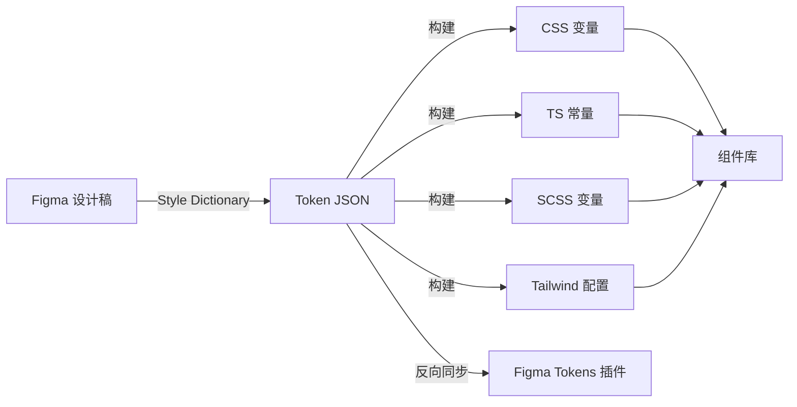

# 设计 Token Figma 同步

> 归属：多平台多租户大数据平台 · UI 设计文档
> 版本：v1.0 ｜ 日期：2026-08-18 ｜ 状态：已完成
> 关联：`design/UI设计/设计系统规范.md`；`design/UI设计/组件库Storybook.md`；`frontend/src/styles/tokens/`
> 适用范围：设计 Token 在 Figma 与代码之间的双向同步

---

## 1. 概述

### 1.1 目标

建立 Figma 设计稿与前端代码之间的设计 Token 同步机制，确保：

- **单一事实源**：Figma 为视觉 token 的单一事实源，代码消费方自动同步。
- **零手工翻译**：禁止手工将 Figma 数值翻译到代码，必须走自动化同步。
- **变更可追溯**：每次 token 变更走 PR 流程，可追溯设计决策。
- **多主题一致**：深色/浅色/品牌定制主题通过 token 切换实现。

### 1.2 适用 Token 范围

| Token 类型 | 数量 | 示例 |
| --- | --- | --- |
| 颜色 color | 86 | `--color-bg-primary: #f8fafc` |
| 字体 typography | 24 | `--font-size-body: 14px` |
| 间距 spacing | 12 | `--spacing-md: 16px` |
| 圆角 radius | 8 | `--radius-md: 8px` |
| 阴影 shadow | 6 | `--shadow-card: 0 2px 8px rgba(...)` |
| 动效 motion | 10 | `--motion-fast: 150ms` |
| 层级 z-index | 12 | `--z-modal: 1000` |
| 断点 breakpoint | 5 | `--bp-md: 768px` |
| **合计** | **163** | — |

---

## 2. 同步架构

### 2.1 同步流向



### 2.2 工具链

| 工具 | 版本 | 用途 |
| --- | --- | --- |
| Figma | — | 设计稿 |
| Figma Tokens Plugin | 1.20+ | Figma 端 token 管理 |
| Style Dictionary | 4.x | token 转译 |
| Token Transformer | — | W3C Token 格式转换 |
| GitHub Actions | — | CI 同步 |

---

## 3. Token 组织

### 3.1 文件结构

```text
frontend/src/styles/tokens/
├── color/
│   ├── base.json         # 基础色板
│   ├── semantic.json     # 语义色（引用 base）
│   └── alias.json        # 别名（引用 semantic）
├── typography/
│   ├── family.json       # 字体族
│   ├── size.json         # 字号
│   ├── weight.json       # 字重
│   └── lineheight.json   # 行高
├── spacing.json
├── radius.json
├── shadow.json
├── motion.json
├── zindex.json
├── breakpoint.json
├── theme/
│   ├── light.json        # 浅色主题覆盖
│   └── dark.json         # 深色主题覆盖
└── index.json            # 入口聚合
```

### 3.2 Token 命名

采用 W3C Design Tokens Format Module 草案：

```json
{
  "color": {
    "bg": {
      "primary": { "$value": "#f8fafc", "$type": "color" },
      "secondary": { "$value": "#e2e8f0", "$type": "color" }
    },
    "text": {
      "primary": { "$value": "#0f172a", "$type": "color" },
      "secondary": { "$value": "#475569", "$type": "color" }
    }
  }
}
```

### 3.3 引用关系

```json
{
  "color": {
    "button": {
      "primary": {
        "$value": "{color.bg.primary}",
        "$type": "color"
      }
    }
  }
}
```

---

## 4. 同步流程

### 4.1 Figma → 代码（正向同步）

```bash
# 1. 设计师在 Figma 修改 token
# 2. 使用 Figma Tokens Plugin 导出 JSON
# 3. 提交到 tokens/ 目录
git add frontend/src/styles/tokens/
git commit -m "design(tokens): 更新主色板"

# 4. CI 触发 Style Dictionary 构建
npm run build:tokens

# 5. 自动生成 CSS 变量 + TS 常量
# 6. PR 自动创建，含变更 diff 与视觉回归
```

### 4.2 代码 → Figma（反向同步）

```bash
# 1. 开发在代码修改 token（如临时调优）
# 2. CI 校验：禁止直接改 generated 文件，须改 source JSON
# 3. PR 合并后触发反向同步
npm run sync:figma

# 4. 自动推送到 Figma Tokens Plugin
# 5. 设计师在 Figma 接收变更
```

### 4.3 同步频率

| 场景 | 频率 | 触发方式 |
| --- | --- | --- |
| 设计稿变更 | 按需 | 设计师推送 |
| 主分支构建 | 每次合并 | CI 自动 |
| 主题切换 | 按需 | 主题 owner 推送 |
| 全量校对 | 每月 | 文档工程师执行 |

---

## 5. Style Dictionary 配置

### 5.1 配置文件

```javascript
// style-dictionary.config.js
const StyleDictionary = require('style-dictionary');

StyleDictionary.extend({
  source: ['src/styles/tokens/**/*.json'],
  platforms: {
    css: {
      transformGroup: 'css',
      buildPath: 'src/styles/generated/',
      files: [{
        destination: 'variables.css',
        format: 'css/variables',
        options: { outputReferences: true },
      }],
    },
    ts: {
      transformGroup: 'ts',
      buildPath: 'src/styles/generated/',
      files: [{
        destination: 'tokens.ts',
        format: 'typescript/es6-declarations',
      }],
    },
    scss: {
      transformGroup: 'scss',
      buildPath: 'src/styles/generated/',
      files: [{
        destination: '_variables.scss',
        format: 'scss/variables',
      }],
    },
    tailwind: {
      transformGroup: 'tailwind',
      buildPath: 'src/styles/generated/',
      files: [{
        destination: 'tailwind.config.js',
        format: 'javascript/module',
      }],
    },
  },
}).buildAllPlatforms();
```

### 5.2 生成产物示例

```css
/* generated/variables.css */
:root {
  --color-bg-primary: #f8fafc;
  --color-bg-secondary: #e2e8f0;
  --color-text-primary: #0f172a;
  --color-text-secondary: #475569;
  --font-size-body: 14px;
  --spacing-md: 16px;
  --radius-md: 8px;
  /* ... */
}

[data-theme="dark"] {
  --color-bg-primary: #0f172a;
  --color-bg-secondary: #1e293b;
  --color-text-primary: #f8fafc;
  --color-text-secondary: #cbd5e1;
}
```

```typescript
// generated/tokens.ts
export const color = {
  bg: { primary: '#f8fafc', secondary: '#e2e8f0' },
  text: { primary: '#0f172a', secondary: '#475569' },
} as const;

export const fontSize = { body: '14px' } as const;
export const spacing = { md: '16px' } as const;
```

---

## 6. CI 自动化

### 6.1 PR 流水线

```yaml
name: Token Sync
on: pull_request
paths:
  - 'frontend/src/styles/tokens/**'
jobs:
  build:
    runs-on: ubuntu-latest
    steps:
      - uses: actions/checkout@v4
      - run: npm ci
      - run: npm run build:tokens
      - run: npm run check:tokens       # 校验生成产物与提交一致
      - run: npm run test:visual         # 视觉回归
      - uses: actions/upload-artifact@v4
        with: { name: token-diff, path: token-diff/ }
```

### 6.2 主分支同步

```yaml
name: Token Sync to Figma
on:
  push:
    branches: [main]
    paths: ['frontend/src/styles/tokens/**']
jobs:
  sync:
    runs-on: ubuntu-latest
    steps:
      - uses: actions/checkout@v4
      - run: npm run sync:figma
        env:
          FIGMA_TOKEN: ${{ secrets.FIGMA_TOKEN }}
          FIGMA_FILE_KEY: ${{ secrets.FIGMA_FILE_KEY }}
```

---

## 7. 主题管理

### 7.1 主题定义

| 主题 | 用途 | 状态 |
| --- | --- | --- |
| light | 默认浅色 | ✅ |
| dark | 深色科技风 | ✅ |
| brand-xxx | 客户品牌定制 | 按需 |

### 7.2 主题切换

```typescript
// composables/useTheme.ts
export function useTheme() {
  const theme = ref<'light' | 'dark'>('light');
  function toggle() {
    theme.value = theme.value === 'light' ? 'dark' : 'light';
    document.documentElement.dataset.theme = theme.value;
    localStorage.setItem('theme', theme.value);
  }
  return { theme, toggle };
}
```

### 7.3 主题覆盖规则

- 主题文件仅覆盖需要变更的 token，未覆盖的继承默认值。
- 禁止在主题文件中新增 token，须先在主 token 文件定义。
- 主题文件命名：`theme/<theme-name>.json`。

---

## 8. 校验与治理

### 8.1 校验规则

| 规则 | 工具 | 失败处理 |
| --- | --- | --- |
| Token 命名符合 W3C 格式 | 自定义脚本 | 失败 |
| 引用关系闭环无死链 | 自定义脚本 | 失败 |
| 颜色对比度 ≥ WCAG AA | axe | 失败 |
| 生成产物与提交一致 | git diff | 失败 |
| 视觉回归通过 | playwright | 失败 |

### 8.2 治理指标

| 指标 | 目标 | 度量 |
| --- | --- | --- |
| Token 同步延迟 | < 1 工作日 | Figma 变更到代码合并 |
| 手工翻译数 | 0 | 代码中硬编码颜色数 |
| Token 使用率 | > 90% | 用 token 的样式 / 总样式 |
| 视觉回归通过率 | > 95% | 通过快照 / 总快照 |

---

## 9. 版本与变更

| 版本 | 日期 | 变更内容 | 作者 |
| --- | --- | --- | --- |
| v1.0 | 2026-08-18 | 首次发布，覆盖 163 token + 双向同步 | UI 组 |

> 本文档由 UI 组维护，token 变更须走 PR 流程并经 UI 组 + 前端组联合评审。

---

## 10. 落地实施清单

> 状态：**未落地** ｜ 日期：2026-09-11
> 说明：本文档 §1–§9 已完成方案描述，但代码层面尚未实现。当前 `frontend/` 下无 `src/styles/tokens/` 目录、无 `style-dictionary.config.js`、无 `.github/workflows/token-sync.yml`，`package.json` 无相关依赖与脚本。本章节列出落地所需的全部交付物，供前端组按优先级实施。

### 10.1 现状差距

| 交付物 | 方案描述 | 代码现状 |
| --- | --- | --- |
| `frontend/src/styles/tokens/` 目录 | §3.1 定义 | ❌ 不存在 |
| `style-dictionary.config.js` | §5.1 定义 | ❌ 不存在 |
| `package.json` 依赖 `style-dictionary` | §2.2 定义 | ❌ 未安装 |
| `package.json` 依赖 `@tokens-studio/format` | §3.2 W3C 格式 | ❌ 未安装 |
| `package.json` 脚本 `build:tokens` | §4.1 步骤 4 | ❌ 未定义 |
| `package.json` 脚本 `sync:figma` | §4.2 步骤 3 | ❌ 未定义 |
| `package.json` 脚本 `check:tokens` | §8.1 校验 | ❌ 未定义 |
| `.github/workflows/token-sync.yml` | §6 定义 | ❌ 不存在 |
| `frontend/src/styles/generated/` 产物 | §5.2 定义 | ❌ 不存在（由 build:tokens 生成） |

### 10.2 需安装的 npm 依赖

在 `frontend/package.json` 的 `devDependencies` 中新增：

| 依赖 | 建议版本 | 用途 | 安装命令 |
| --- | --- | --- | --- |
| `style-dictionary` | `^4.0.0` | Token 转译核心（CSS/TS/SCSS/Tailwind 多平台产物） | `npm i -D style-dictionary` |
| `@tokens-studio/format` | `^0.2.0` | W3C Design Tokens Format 解析与格式化 | `npm i -D @tokens-studio/format` |

> 安装时需联网，建议在干净分支执行并锁定 `package-lock.json`。

### 10.3 需新建的配置文件

#### 10.3.1 `frontend/style-dictionary.config.js`

按 §5.1 配置，source 指向 `src/styles/tokens/**/*.json`，buildPath 指向 `src/styles/generated/`，输出 4 个平台产物（css/ts/scss/tailwind）。完整内容见 §5.1，落地时需补充：

- 注册 `@tokens-studio/format` 的 W3C 预处理器（`preprocessors`）。
- 注册自定义 `transformGroup`（如 `tailwind`）以输出 Tailwind 配置。
- 配置 `options.outputReferences: true` 使 CSS 变量引用关系保留。

#### 10.3.2 `frontend/src/styles/tokens/` 目录结构

按 §3.1 创建以下 JSON 文件（初始可为空对象或从 `design-tokens.css` 反向抽取）：

```text
frontend/src/styles/tokens/
├── color/{base,semantic,alias}.json
├── typography/{family,size,weight,lineheight}.json
├── spacing.json
├── radius.json
├── shadow.json
├── motion.json
├── zindex.json
├── breakpoint.json
├── theme/{light,dark}.json
└── index.json
```

> 初始化策略：优先由设计师在 Figma Tokens Plugin 导出；若暂无 Figma 源，可由前端组从现有 `design-tokens.css` 的 `--ds-*` 变量反向编写 JSON，作为过渡。

### 10.4 需在 `package.json` 添加的脚本

在 `scripts` 块新增以下 3 条（与现有 `build`、`test` 等脚本并列）：

```jsonc
{
  "scripts": {
    // ... 现有脚本 ...
    "build:tokens": "style-dictionary build --config style-dictionary.config.js",
    "sync:figma": "node scripts/sync-figma.mjs",
    "check:tokens": "node scripts/check-tokens.mjs"
  }
}
```

| 脚本 | 作用 | 对应章节 |
| --- | --- | --- |
| `build:tokens` | 调用 Style Dictionary 构建，生成 `src/styles/generated/` 下 CSS/TS/SCSS/Tailwind 产物 | §4.1 步骤 4、§5 |
| `sync:figma` | 反向同步：将代码 token 推送回 Figma Tokens Plugin（需 `FIGMA_TOKEN`、`FIGMA_FILE_KEY`） | §4.2 步骤 3 |
| `check:tokens` | 校验生成产物与提交一致（`git diff` 无差异）+ W3C 命名合规 + 引用无死链 | §8.1 |

> `sync:figma` 与 `check:tokens` 需配套新建 `frontend/scripts/sync-figma.mjs` 与 `frontend/scripts/check-tokens.mjs` 两个脚本文件。

### 10.5 需新建的 CI 工作流

#### 10.5.1 `.github/workflows/token-sync.yml`（PR 流水线）

按 §6.1 定义，触发条件 `pull_request` + paths `frontend/src/styles/tokens/**`，步骤：checkout → `npm ci` → `npm run build:tokens` → `npm run check:tokens` → `npm run test:visual` → 上传 token-diff 产物。

#### 10.5.2 `.github/workflows/token-sync-figma.yml`（主分支反向同步）

按 §6.2 定义，触发条件 `push` to `main` + paths `frontend/src/styles/tokens/**`，步骤：checkout → `npm run sync:figma`（注入 `FIGMA_TOKEN`、`FIGMA_FILE_KEY` secrets）。

> 两个工作流可合并为单文件多 job，但建议拆分以降低触发频率与权限范围。

### 10.6 实施步骤与优先级

| 优先级 | 步骤 | 交付物 | 责责 | 预估 |
| --- | --- | --- | --- | --- |
| P0 | 1. 安装 npm 依赖 | `package.json` + `package-lock.json` | 前端组 | 0.5h |
| P0 | 2. 新建 `style-dictionary.config.js` | 配置文件 | 前端组 | 1h |
| P0 | 3. 新建 `tokens/` 目录与初始 JSON | `frontend/src/styles/tokens/**` | UI 组 + 前端组 | 4h |
| P0 | 4. 添加 `build:tokens` 脚本并跑通 | `package.json` + `generated/` 产物 | 前端组 | 1h |
| P1 | 5. 新建 `check-tokens.mjs` + `check:tokens` 脚本 | 校验脚本 | 前端组 | 2h |
| P1 | 6. 新建 PR 流水线 `token-sync.yml` | `.github/workflows/token-sync.yml` | 前端组 | 1h |
| P2 | 7. 新建 `sync-figma.mjs` + `sync:figma` 脚本 | 反向同步脚本 | 前端组 | 3h |
| P2 | 8. 新建主分支同步 `token-sync-figma.yml` | `.github/workflows/token-sync-figma.yml` | 前端组 | 0.5h |
| P3 | 9. 视觉回归接入 `test:visual` | playwright 快照 | 前端组 | 2h |

### 10.7 落地验收标准

1. `npm run build:tokens` 成功生成 `frontend/src/styles/generated/{variables.css,tokens.ts,_variables.scss,tailwind.config.js}`。
2. `generated/variables.css` 的 `:root` 变量与 `design-tokens.css` 的 `--ds-*` 体系一致（或建立引用关系）。
3. `npm run check:tokens` 在无改动时通过，改动 token JSON 后未重新 build 则失败。
4. PR 修改 `tokens/**` 时 CI 自动触发 `token-sync.yml` 并产出 token-diff 产物。
5. 主分支合并 token 变更后 `token-sync-figma.yml` 自动推送 Figma（需配置 secrets）。

> 落地完成后，将本章节状态由"未落地"改为"已落地"，并在 §9 版本表追加变更记录。