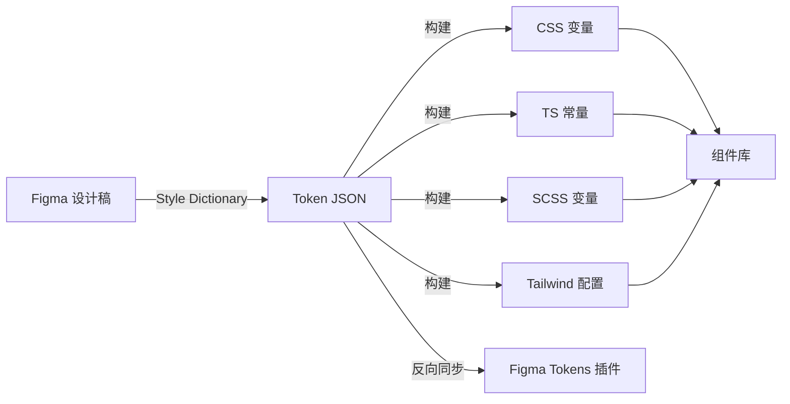

# 设计 Token Figma 同步

> 归属：多平台多租户大数据平台 · UI 设计文档
> 版本：v1.0 ｜ 日期：2026-08-18 ｜ 状态：已完成
> 关联：`design/UI设计/设计系统规范.md`；`design/UI设计/组件库Storybook.md`；`frontend/src/styles/tokens/`
> 适用范围：设计 Token 在 Figma 与代码之间的双向同步

---

## 1. 概述

### 1.1 目标

建立 Figma 设计稿与前端代码之间的设计 Token 同步机制，确保：

- **单一事实源**：Figma 为视觉 token 的单一事实源，代码消费方自动同步。
- **零手工翻译**：禁止手工将 Figma 数值翻译到代码，必须走自动化同步。
- **变更可追溯**：每次 token 变更走 PR 流程，可追溯设计决策。
- **多主题一致**：深色/浅色/品牌定制主题通过 token 切换实现。

### 1.2 适用 Token 范围

| Token 类型 | 数量 | 示例 |
| --- | --- | --- |
| 颜色 color | 86 | `--color-bg-primary: #f8fafc` |
| 字体 typography | 24 | `--font-size-body: 14px` |
| 间距 spacing | 12 | `--spacing-md: 16px` |
| 圆角 radius | 8 | `--radius-md: 8px` |
| 阴影 shadow | 6 | `--shadow-card: 0 2px 8px rgba(...)` |
| 动效 motion | 10 | `--motion-fast: 150ms` |
| 层级 z-index | 12 | `--z-modal: 1000` |
| 断点 breakpoint | 5 | `--bp-md: 768px` |
| **合计** | **163** | — |

---

## 2. 同步架构

### 2.1 同步流向



### 2.2 工具链

| 工具 | 版本 | 用途 |
| --- | --- | --- |
| Figma | — | 设计稿 |
| Figma Tokens Plugin | 1.20+ | Figma 端 token 管理 |
| Style Dictionary | 4.x | token 转译 |
| Token Transformer | — | W3C Token 格式转换 |
| GitHub Actions | — | CI 同步 |

---

## 3. Token 组织

### 3.1 文件结构

```text
frontend/src/styles/tokens/
├── color/
│   ├── base.json         # 基础色板
│   ├── semantic.json     # 语义色（引用 base）
│   └── alias.json        # 别名（引用 semantic）
├── typography/
│   ├── family.json       # 字体族
│   ├── size.json         # 字号
│   ├── weight.json       # 字重
│   └── lineheight.json   # 行高
├── spacing.json
├── radius.json
├── shadow.json
├── motion.json
├── zindex.json
├── breakpoint.json
├── theme/
│   ├── light.json        # 浅色主题覆盖
│   └── dark.json         # 深色主题覆盖
└── index.json            # 入口聚合
```

### 3.2 Token 命名

采用 W3C Design Tokens Format Module 草案：

```json
{
  "color": {
    "bg": {
      "primary": { "$value": "#f8fafc", "$type": "color" },
      "secondary": { "$value": "#e2e8f0", "$type": "color" }
    },
    "text": {
      "primary": { "$value": "#0f172a", "$type": "color" },
      "secondary": { "$value": "#475569", "$type": "color" }
    }
  }
}
```

### 3.3 引用关系

```json
{
  "color": {
    "button": {
      "primary": {
        "$value": "{color.bg.primary}",
        "$type": "color"
      }
    }
  }
}
```

---

## 4. 同步流程

### 4.1 Figma → 代码（正向同步）

```bash
# 1. 设计师在 Figma 修改 token
# 2. 使用 Figma Tokens Plugin 导出 JSON
# 3. 提交到 tokens/ 目录
git add frontend/src/styles/tokens/
git commit -m "design(tokens): 更新主色板"

# 4. CI 触发 Style Dictionary 构建
npm run build:tokens

# 5. 自动生成 CSS 变量 + TS 常量
# 6. PR 自动创建，含变更 diff 与视觉回归
```

### 4.2 代码 → Figma（反向同步）

```bash
# 1. 开发在代码修改 token（如临时调优）
# 2. CI 校验：禁止直接改 generated 文件，须改 source JSON
# 3. PR 合并后触发反向同步
npm run sync:figma

# 4. 自动推送到 Figma Tokens Plugin
# 5. 设计师在 Figma 接收变更
```

### 4.3 同步频率

| 场景 | 频率 | 触发方式 |
| --- | --- | --- |
| 设计稿变更 | 按需 | 设计师推送 |
| 主分支构建 | 每次合并 | CI 自动 |
| 主题切换 | 按需 | 主题 owner 推送 |
| 全量校对 | 每月 | 文档工程师执行 |

---

## 5. Style Dictionary 配置

### 5.1 配置文件

```javascript
// style-dictionary.config.js
const StyleDictionary = require('style-dictionary');

StyleDictionary.extend({
  source: ['src/styles/tokens/**/*.json'],
  platforms: {
    css: {
      transformGroup: 'css',
      buildPath: 'src/styles/generated/',
      files: [{
        destination: 'variables.css',
        format: 'css/variables',
        options: { outputReferences: true },
      }],
    },
    ts: {
      transformGroup: 'ts',
      buildPath: 'src/styles/generated/',
      files: [{
        destination: 'tokens.ts',
        format: 'typescript/es6-declarations',
      }],
    },
    scss: {
      transformGroup: 'scss',
      buildPath: 'src/styles/generated/',
      files: [{
        destination: '_variables.scss',
        format: 'scss/variables',
      }],
    },
    tailwind: {
      transformGroup: 'tailwind',
      buildPath: 'src/styles/generated/',
      files: [{
        destination: 'tailwind.config.js',
        format: 'javascript/module',
      }],
    },
  },
}).buildAllPlatforms();
```

### 5.2 生成产物示例

```css
/* generated/variables.css */
:root {
  --color-bg-primary: #f8fafc;
  --color-bg-secondary: #e2e8f0;
  --color-text-primary: #0f172a;
  --color-text-secondary: #475569;
  --font-size-body: 14px;
  --spacing-md: 16px;
  --radius-md: 8px;
  /* ... */
}

[data-theme="dark"] {
  --color-bg-primary: #0f172a;
  --color-bg-secondary: #1e293b;
  --color-text-primary: #f8fafc;
  --color-text-secondary: #cbd5e1;
}
```

```typescript
// generated/tokens.ts
export const color = {
  bg: { primary: '#f8fafc', secondary: '#e2e8f0' },
  text: { primary: '#0f172a', secondary: '#475569' },
} as const;

export const fontSize = { body: '14px' } as const;
export const spacing = { md: '16px' } as const;
```

---

## 6. CI 自动化

### 6.1 PR 流水线

```yaml
name: Token Sync
on: pull_request
paths:
  - 'frontend/src/styles/tokens/**'
jobs:
  build:
    runs-on: ubuntu-latest
    steps:
      - uses: actions/checkout@v4
      - run: npm ci
      - run: npm run build:tokens
      - run: npm run check:tokens       # 校验生成产物与提交一致
      - run: npm run test:visual         # 视觉回归
      - uses: actions/upload-artifact@v4
        with: { name: token-diff, path: token-diff/ }
```

### 6.2 主分支同步

```yaml
name: Token Sync to Figma
on:
  push:
    branches: [main]
    paths: ['frontend/src/styles/tokens/**']
jobs:
  sync:
    runs-on: ubuntu-latest
    steps:
      - uses: actions/checkout@v4
      - run: npm run sync:figma
        env:
          FIGMA_TOKEN: ${{ secrets.FIGMA_TOKEN }}
          FIGMA_FILE_KEY: ${{ secrets.FIGMA_FILE_KEY }}
```

---

## 7. 主题管理

### 7.1 主题定义

| 主题 | 用途 | 状态 |
| --- | --- | --- |
| light | 默认浅色 | ✅ |
| dark | 深色科技风 | ✅ |
| brand-xxx | 客户品牌定制 | 按需 |

### 7.2 主题切换

```typescript
// composables/useTheme.ts
export function useTheme() {
  const theme = ref<'light' | 'dark'>('light');
  function toggle() {
    theme.value = theme.value === 'light' ? 'dark' : 'light';
    document.documentElement.dataset.theme = theme.value;
    localStorage.setItem('theme', theme.value);
  }
  return { theme, toggle };
}
```

### 7.3 主题覆盖规则

- 主题文件仅覆盖需要变更的 token，未覆盖的继承默认值。
- 禁止在主题文件中新增 token，须先在主 token 文件定义。
- 主题文件命名：`theme/<theme-name>.json`。

---

## 8. 校验与治理

### 8.1 校验规则

| 规则 | 工具 | 失败处理 |
| --- | --- | --- |
| Token 命名符合 W3C 格式 | 自定义脚本 | 失败 |
| 引用关系闭环无死链 | 自定义脚本 | 失败 |
| 颜色对比度 ≥ WCAG AA | axe | 失败 |
| 生成产物与提交一致 | git diff | 失败 |
| 视觉回归通过 | playwright | 失败 |

### 8.2 治理指标

| 指标 | 目标 | 度量 |
| --- | --- | --- |
| Token 同步延迟 | < 1 工作日 | Figma 变更到代码合并 |
| 手工翻译数 | 0 | 代码中硬编码颜色数 |
| Token 使用率 | > 90% | 用 token 的样式 / 总样式 |
| 视觉回归通过率 | > 95% | 通过快照 / 总快照 |

---

## 9. 版本与变更

| 版本 | 日期 | 变更内容 | 作者 |
| --- | --- | --- | --- |
| v1.0 | 2026-08-18 | 首次发布，覆盖 163 token + 双向同步 | UI 组 |

> 本文档由 UI 组维护，token 变更须走 PR 流程并经 UI 组 + 前端组联合评审。