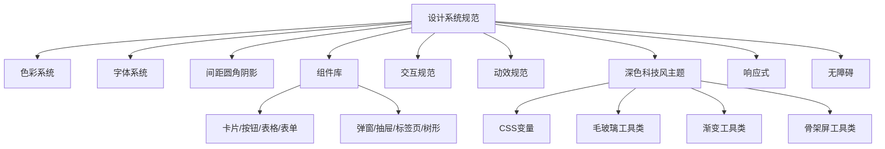

# 设计系统规范

> 归属：多平台多租户大数据平台 · UI 设计文档
> 版本：v1.1 ｜ 日期：2026-09-12 ｜ 状态：已完成
> 关联：`frontend/src/styles/main.css`（深色科技风主题 v1.0）；`design/多平台多租户大数据平台_产品原型设计_v0.4.md` §10 控制台信息架构；`design/详细设计/多平台多租户大数据平台_控制台信息架构_v0.1.md`
> 适用范围：统一控制台（L5.1）、运营后台（L5.2）、对内业务线门户、IDE 插件界面、登录页
> 变更：v1.1（2026-09-12）与 `main.css` 实现对齐——H1 字号 24px/800、H2 字重 700、正文 500/1.6、表格表头 12px/700、响应式断点三档（≤640/641-1440/≥1441）、平板自动折叠 + 移动端抽屉化机制

---

## 1. 设计目标与原则

### 1.1 设计目标

为多平台多租户大数据平台提供一套**收敛低调、统一一致、深色科技风**的设计系统，覆盖从基础变量到组件、从交互到动效的全链路视觉规范，确保：

- **一致性**：所有页面、所有租户、所有环境（信创/本地/云/私有云）呈现同一视觉语言。
- **可复用**：组件库 + 工具类 + CSS 变量三层抽象，新增页面零硬编码样式。
- **可访问**：满足 WCAG 2.1 AA 对比度，键盘可达，焦点可见，ARIA 语义完整。
- **可主题化**：通过 `:root` 变量切换即可适配深色/浅色/品牌定制，业务无感。

### 1.2 设计原则

1. **收敛低调**：拒绝浮夸视觉效果，强调信息密度与可读性，动效服务于反馈而非炫技。
2. **左右等宽**：所有页面左右两栏宽度保持一致（桌面端侧边栏 232px 固定，平板自动折叠为 64px 图标模式），形成稳定视觉骨架。
3. **首尾突出**：首栏（顶栏 54px）、尾栏（页脚）、左侧边栏的功能区域鲜明突出，与内容区形成层次。
4. **图标统一**：图标风格统一化、唯一化、简约小众，全部走 1.5px 描边线性图标，拒绝花哨填充。
5. **科技感适度**：以蓝蓝渐变 + 毛玻璃 + 微发光传达科技感，但不过度发光、不闪烁刺眼。

---

## 2. 色彩系统

### 2.1 基础配色

采用 Tailwind slate 色系为底，配合 blue/indigo 双主色构成"稳重蓝蓝渐变"主调。

| 变量 | 值 | 用途 |
| --- | --- | --- |
| `--bg` | `#f8fafc` | 内容区浅灰白底 |
| `--panel` | `#ffffff` | 卡片/面板白底 |
| `--ink` | `#0f172a` | 主文字深色 slate-900 |
| `--muted` | `#64748b` | 次要文字 slate-500 |
| `--line` | `#e2e8f0` | 分割线 slate-200 |

### 2.2 主色与渐变

主色采用 blue-500 → indigo-500 的 135° 蓝蓝渐变，避免单一蓝色的扁平感，也避免蓝紫过艳。

| 变量 | 值 | 用途 |
| --- | --- | --- |
| `--primary` | `#3b82f6` | blue-500 主操作色 |
| `--primary-2` | `#6366f1` | indigo-500 渐变终点 |
| `--primary-soft` | `#eff6ff` | blue-50 软背景 |
| `--gradient-primary` | `linear-gradient(135deg, #3b82f6 0%, #6366f1 100%)` | 主渐变（按钮/头像/激活态） |
| `--gradient-primary-soft` | `linear-gradient(135deg, rgba(59,130,246,0.12) 0%, rgba(99,102,241,0.12) 100%)` | 软渐变（工作空间切换器背景） |

### 2.3 状态色

| 变量 | 值 | 语义 |
| --- | --- | --- |
| `--green` | `#10b981` | emerald-500 成功/运行中/通过 |
| `--amber` | `#f59e0b` | amber-500 警告/待审/降级 |
| `--red` | `#ef4444` | red-500 错误/失败/告警/徽章 |
| `--c-violet` | `#8b5cf6` | violet-500 辅助强调（智能层） |

### 2.4 侧边栏深色渐变

侧边栏采用深蓝黑垂直渐变，与亮色内容区形成强对比，强化"功能区域鲜明突出"。

| 变量 | 值 | 用途 |
| --- | --- | --- |
| `--sidebar-bg` | `linear-gradient(180deg, #0f172a 0%, #1e293b 100%)` | 侧边栏背景渐变 |
| `--sidebar-ink` | `#e2e8f0` | 侧边栏主文字 |
| `--sidebar-muted` | `#94a3b8` | 侧边栏次要文字 |
| `--sidebar-active-bg` | `rgba(59, 130, 246, 0.22)` | 半透明高亮（蓝蓝更鲜明） |
| `--sidebar-hover-bg` | `rgba(148, 163, 184, 0.10)` | hover 半透明 |
| `--sidebar-line` | `rgba(148, 163, 184, 0.15)` | 侧边栏分割线 |

### 2.5 色彩使用约束

- 主操作（主按钮、激活态、品牌标识）一律用 `--gradient-primary`，禁止单色平铺。
- 状态色仅用于状态指示（标签、徽章、Toast），禁止用于大面积背景。
- 文字色仅用 `--ink` / `--muted` / `#fff`（深色背景上），禁止自定义灰度。
- 信创环境如需替换品牌色，仅替换 `--primary` / `--primary-2` 两个变量即可全局生效。

---

## 3. 字体系统

### 3.1 字体族

```css
font-family: -apple-system, "Segoe UI", "PingFang SC", "Microsoft YaHei", sans-serif;
```

- 优先使用系统字体，避免网络字体加载延迟，保证信创离线环境可用。
- 中文优先 PingFang SC（macOS）/ Microsoft YaHei（Windows），与英文 Segoe UI 视觉协调。

### 3.2 字号阶梯

| 用途 | 字号 | 行高 | 字重 |
| --- | --- | --- | --- |
| 页面标题 H1 | 24px | 1.4 | 800 |
| 区块标题 H2 | 16px | 1.4 | 700 |
| 卡片标题 H3 | 14px | 1.5 | 600 |
| 正文 | 14px | 1.6 | 500 |
| 辅助文字 | 14px | 1.55 | 500 |
| 侧边栏导航 | 13px | 1.5 | 400/600（激活） |
| 侧边栏分组标题 | 10.5px | 1.4 | 400（uppercase + letter-spacing 0.5px） |
| 表格表头 | 12px | 1.4 | 700 |
| 标签/徽章 | 10px | 1.4 | 600 |
| 页脚小字 | 11px | 1.6 | 500 |

### 3.3 字重约束

使用 400 / 500 / 600 / 700 / 800 五档字重，禁止 300 等中间字重，保证层次清晰且渲染一致。

| 字重 | 语义 | 用途 |
| --- | --- | --- |
| 400（Regular） | 正文常规 | 侧边栏导航（非激活） |
| 500（Medium） | 强调常规 | 正文、辅助文字、按钮文字、表单标签、页脚小字等强调但非标题的文字 |
| 600（Semibold） | 次级标题 | 卡片标题 H3、表头、激活态导航 |
| 700（Bold） | 区块标题 | 区块标题 H2、表格表头 |
| 800（ExtraBold） | 主标题 | 页面标题 H1 |

---

## 4. 间距与圆角阴影

### 4.1 间距系统

采用 4px 基准网格，所有间距必须为 4 的倍数：

| Token | 值 | 用途 |
| --- | --- | --- |
| `xs` | 4px | 图标与文字微间距 |
| `sm` | 8px | 行内元素间距 |
| `md` | 12px | 卡片内 padding |
| `lg` | 16px | 区块间距 |
| `xl` | 20px | 顶栏 padding |
| `2xl` | 24px | 视图区 padding（垂直） |
| `3xl` | 28px | 视图区 padding（水平） |

> 阶梯约束：所有间距必须为 4 的倍数。原 `2xl=22px`、`3xl=26px` 不成阶梯（非 4 的倍数），已于 2026-09-11 修正为 24px / 28px，与 `design-tokens.css` 的 `--ds-spacing-6` / `--ds-spacing-7` 对齐。完整阶梯见 §4.4 数值阶梯规范。

### 4.2 圆角

圆角变量定义于 `design-tokens.css` 的 `--ds-radius-*` 体系（`main.css` 中 `--radius` 引用 `--ds-radius-lg`）。

| 变量 | 值 | 用途 |
| --- | --- | --- |
| `--radius`（`--ds-radius-lg`） | 12px | 卡片/按钮/输入框统一圆角 |
| 小圆角 | 6px | 标签/徽章/骨架屏 |
| 胶囊圆角（`--ds-radius-2xl`） | 20px | 环境标签 `.env-tag` |
| 圆形（`--ds-radius-full`） | 9999px | 头像/圆点指示 |

### 4.3 阴影

| 变量 | 值 | 用途 |
| --- | --- | --- |
| `--shadow` | `0 1px 3px rgba(15,23,42,0.08), 0 1px 2px rgba(15,23,42,0.04)` | 卡片默认 |
| `--shadow-md` | `0 4px 12px rgba(15,23,42,0.08)` | 卡片 hover / 浮层 |
| `--shadow-lg` | `0 12px 32px rgba(15,23,42,0.12)` | 弹窗/抽屉 |
| `--shadow-glow` | `0 0 10px rgba(59,130,246,0.12)` | 微发光（克制） |
| `--shadow-glow-strong` | `0 0 14px rgba(59,130,246,0.18)` | hover 强化发光 |

> 发光阴影克制使用，仅在主操作 hover、激活态边框处出现，禁止大面积发光。

### 4.4 数值阶梯规范

> 归属：本节为 2026-09-11 新增，统一间距 / 圆角 / 阴影 / 字号四类数值的阶梯定义，作为 `main.css` 硬编码值迁移到 `design-tokens.css` 的 `--ds-*` token 的依据。
> 源：阶梯定义与 `frontend/src/styles/design-tokens.css` 的 `--ds-spacing-*` / `--ds-radius-*` / `--ds-shadow-*` / `--ds-font-size-*` 体系保持一致。

#### 4.4.1 间距阶梯（4px 基准）

所有布局间距必须为 4 的倍数。`design-tokens.css` 定义了 `--ds-spacing-0` ~ `--ds-spacing-20` 共 21 档，常用主阶梯如下：

| Token | 值 | 语义 |
| --- | --- | --- |
| `--ds-spacing-0` | 0px | 无间距 |
| `--ds-spacing-1` | 4px | 微间距（图标与文字） |
| `--ds-spacing-2` | 8px | 行内元素间距 |
| `--ds-spacing-3` | 12px | 卡片内 padding |
| `--ds-spacing-4` | 16px | 区块间距 |
| `--ds-spacing-5` | 20px | 顶栏 padding |
| `--ds-spacing-6` | 24px | 视图区 padding（垂直） |
| `--ds-spacing-7` | 28px | 视图区 padding（水平） |
| `--ds-spacing-8` | 32px | 大区块间距 |
| `--ds-spacing-10` | 40px | 页面级间距 |
| `--ds-spacing-12` | 48px | 大页面级间距 |
| `--ds-spacing-16` | 64px | 巨型间距 |

> 完整阶梯（含 36/44/52/56/60/68/72/76/80px 等扩展档）见 `design-tokens.css` §5。禁止使用非 4 倍数值（如 22px、26px、14px 作为间距）。

#### 4.4.2 圆角阶梯

| Token | 值 | 语义 |
| --- | --- | --- |
| `--ds-radius-sm` | 4px | 小圆角（标签/徽章/骨架屏） |
| `--ds-radius-md` | 8px | 中圆角 |
| `--ds-radius-lg` | 12px | 卡片/按钮/输入框统一圆角（`--radius` 引用） |
| `--ds-radius-xl` | 16px | 大圆角 |
| `--ds-radius-2xl` | 20px | 胶囊圆角（环境标签） |
| `--ds-radius-full` | 9999px | 圆形（头像/圆点） |

> 禁止使用 6px、10px 等非阶梯圆角；§4.2 中"小圆角 6px"应迁移至 `--ds-radius-sm`（4px）或新增档位。

#### 4.4.3 阴影阶梯

| Token | 语义 |
| --- | --- |
| `--ds-shadow-sm` | 卡片默认 |
| `--ds-shadow-md` | 卡片 hover / 浮层 |
| `--ds-shadow-lg` | 弹窗 / 抽屉 |
| `--ds-shadow-xl` | 强浮层 |

> 阴影仅 4 档，禁止自定义中间值。`main.css` 中 `--shadow-glow` / `--shadow-glow-strong` 为发光特效，不属于通用阴影阶梯，单独管理。

#### 4.4.4 字号阶梯

| Token | 值 | 语义 |
| --- | --- | --- |
| `--ds-font-size-xs` | 12px | 标签 / 徽章 / 页脚小字 / 表格表头 |
| `--ds-font-size-sm` | 13px | 辅助文字 / 侧边栏导航 |
| `--ds-font-size-base` | 14px | 正文 / 卡片标题 H3 |
| `--ds-font-size-lg` | 16px | 区块标题 H2 |
| `--ds-font-size-xl` | 18px | 次级大标题 |
| `--ds-font-size-2xl` | 20px | 大数值 / 强调标题 |
| `--ds-font-size-3xl` | 24px | 页面标题 H1（`--typo-h1` 实际使用 24px） |
| `--ds-font-size-4xl` | 30px | 超大标题（慎用） |

> 理想字号阶梯为 12 / 14 / 16 / 18 / 20 / 24 / 32px。当前 `design-tokens.css` 含 13px（`--ds-font-size-sm`）与 30px（`--ds-font-size-4xl`）两档过渡值，已服务于侧边栏导航与大标题场景，保留但不再扩展。
> **注意**：`main.css` 中 `--typo-h1` 使用 24px/800（对应 `--ds-font-size-3xl`），而非 20px/700（`--ds-font-size-2xl`）；`--typo-h2` 使用 700 字重而非 600。文档 §3.2 已与实际实现对齐。

#### 4.4.5 `main.css` 非阶梯值映射表

`main.css` 中存在大量硬编码像素值不成阶梯（非 4 倍数或不在字号阶梯内）。本节列出映射表，供后续迁移至 `--ds-*` token 时参考。**当前仅记录映射，不修改 `main.css` 实际值**，避免破坏现有布局；迁移应在组件级重构时逐处替换并视觉回归。

**间距类非阶梯值（作为 padding / margin / gap / 宽高使用时）：**

| 现值 | 建议值 | 对应 Token | 说明 |
| --- | --- | --- | --- |
| 7px | 8px | `--ds-spacing-2` | 向上靠档 |
| 9px | 8px | `--ds-spacing-2` | 向下靠档 |
| 10px | 8px 或 12px | `--ds-spacing-2` / `--ds-spacing-3` | 视布局紧凑度二选一 |
| 13px | 12px | `--ds-spacing-3` | 向下靠档 |
| 14px | 16px | `--ds-spacing-4` | 作为间距时向上靠档（14px 作为字号见下表） |
| 18px | 16px 或 20px | `--ds-spacing-4` / `--ds-spacing-5` | 视布局二选一 |
| 22px | 24px | `--ds-spacing-6` | 向上靠档（本节 §4.1 已修正） |
| 26px | 28px | `--ds-spacing-7` | 向上靠档（本节 §4.1 已修正） |
| 12.5px | 12px | `--ds-spacing-3` | 小数像素禁止，向下靠档 |
| 11px | 12px | `--ds-spacing-3` | 向上靠档 |
| 11.5px | 12px | `--ds-spacing-3` | 小数像素禁止，向上靠档 |

**字号类非阶梯值（作为 font-size 使用时）：**

| 现值 | 建议值 | 对应 Token | 说明 |
| --- | --- | --- | --- |
| 10px | 12px | `--ds-font-size-xs` | 标签/徽章统一至最小档 |
| 10.5px | 12px | `--ds-font-size-xs` | 侧边栏分组标题，小数像素禁止 |
| 11px | 12px | `--ds-font-size-xs` | 页脚小字统一至 xs |
| 11.5px | 12px | `--ds-font-size-xs` | 小数像素禁止 |
| 13px | 13px | `--ds-font-size-sm` | 已在阶梯内，保留 |
| 14px | 14px | `--ds-font-size-base` | 已在阶梯内，保留 |

> 迁移优先级：先消除小数像素（12.5px / 11.5px / 10.5px），再统一间距非 4 倍数（7/9/13/18/22/26px），最后收敛字号（10/11px → 12px）。
> 迁移方式：每类值用 `grep` 定位命中，再用 `Edit`（相同处用 `replaceAll`）批量替换为 `var(--ds-*)`，并跑视觉回归。（来源：tailwind-v4-utility-class-to-design-token-migration 经验）

---

## 5. 组件库视觉规范

### 5.1 卡片（Card）

- 背景 `--panel`，圆角 `--radius`，阴影 `--shadow`。
- padding 12px（紧凑）/ 16px（默认）/ 24px（宽松）三档。
- hover 触发 `floatUp` 动画：上浮 4px + 阴影升至 `--shadow-lg` + 微发光 `--shadow-glow`。
- 标题区右侧操作区右对齐，标题与操作区间距 12px。

### 5.2 按钮（Button）

| 类型 | 背景 | 文字 | 用途 |
| --- | --- | --- | --- |
| 主按钮 | `--gradient-primary` | `#fff` | 主操作（提交/确认/创建） |
| 次按钮 | `--panel` + 1px `--line` 边 | `--ink` | 辅助操作（取消/关闭） |
| 文字按钮 | 透明 | `--primary` | 行内轻量操作 |
| 危险按钮 | `--red` | `#fff` | 删除/销毁 |

- 圆角 `--radius`，padding `6px 12px`（小）/ `8px 16px`（默认）。
- hover：主按钮 `translateY(-1px)` + `box-shadow 0 4px 12px rgba(99,102,241,0.2)`。
- 点击：触发 `ripple` 涟漪动画（0.6s）。
- disabled：opacity 0.5，cursor not-allowed，禁止 hover 位移。

### 5.3 表格（Table）

- 表头背景 `--c-surface`，字重 700，字号 12px，颜色 `--ds-color-primary-900`（对应 `--typo-table-th` token）。
- 行高 44px，行间分割线 1px `--line`。
- 行 hover 背景 `--c-surface-hover`，禁止整行高亮渐变。
- 空态：居中插画 + 文字 + 主按钮，禁止裸露"暂无数据"。
- 分页器右对齐，与表格间距 16px。

### 5.4 表单（Form）

- 标签 13px `--muted`，输入框 14px `--ink`，圆角 `--radius`，高度 36px。
- focus：wrapper 边框转 `--ds-color-primary-500` + 4px `rgba(59,130,246,0.12)` 内阴影（`.el-input__wrapper.is-focus`），inner 仅在 `:focus` 时显示 `outline: 2px solid var(--ds-border-focus)`，禁止未聚焦时始终显示蓝色外框。
- 校验错误：边框 `--red`，下方 12px 红色错误文字 + 图标。
- 必填标记 `*` 红色，紧跟标签后。
- 表单组间距 16px，标签与输入框间距 6px。

### 5.5 弹窗（Modal）

- 遮罩 `rgba(15,23,42,0.45)` + `backdrop-filter: blur(2px)`，0.25s `fadeInSlide` 入场。
- 弹窗主体 `--panel`，圆角 `--radius`，阴影 `--shadow-lg`，最大宽度 520px（确认）/ 720px（表单）/ 1080px（复杂）。
- 头部 54px 高，标题 16px 600，关闭按钮右上角 24px。
- 底部操作区右对齐，主按钮在右，次按钮在左，间距 12px。

### 5.6 抽屉（Drawer）

- 从右滑入，宽度 480px（默认）/ 720px（宽），动画 0.3s `--ease-drawer`。
- 遮罩同弹窗，主体 `--panel`，左侧 1px `--line` 边。
- 头部 54px，内容区可滚动，底部操作区固定。

### 5.7 标签页（Tabs）

- 标签文字 14px，padding `8px 16px`，激活态底部 3px `--gradient-primary` 指示条。
- 激活文字 `--ink` 600，非激活 `--muted` 400。
- 切换内容区 0.3s `fadeInSlide` 过渡。
- 标签间无分割线，仅底部 1px `--line` 共享边。

### 5.8 树形控件（Tree）

- 节点高度 32px，缩进每级 20px，展开/折叠图标 16px 三角形。
- 节点 hover 背景 `--c-surface-hover`，激活背景 `--primary-soft` + 左 3px `--primary` 边。
- 复选框 16px，半选状态 indeterminate。
- 连接线 1px `--line`，dashed 风格，颜色克制。

---

## 6. 交互规范

### 6.1 状态定义

| 状态 | 视觉表现 | 触发 |
| --- | --- | --- |
| default | 基础样式 | 静止 |
| hover | 上浮 1-4px / 背景变浅 / 边框加深 / 流光横移 | 鼠标悬停 |
| active | 内陷 1px / 背景加深 / 主色填充 | 鼠标按下 |
| focus | 2px `--primary` 30% 透明外框 + 边框转主色 | 键盘 Tab |
| disabled | opacity 0.5 / cursor not-allowed / 禁止动效 | `disabled` 属性 |
| loading | 骨架屏 `shimmer` / 旋转 spinner / 文字"加载中" | 异步请求中 |
| error | 边框 `--red` / 红色错误文字 / `--red-50` 软背景 | 校验失败 / 请求错误 |
| selected | 背景 `--primary-soft` / 左 3px 主色边 / 字重 600 | 选中行/节点 |

### 6.2 过渡动效

| 动效 | 曲线 | 时长 | 用途 |
| --- | --- | --- | --- |
| 淡入滑动 | `--ease-smooth` cubic-bezier(0.4,0,0.2,1) | 0.3s | 页面/视图切换、弹窗入场 |
| 浮起 | `--ease-smooth` | 0.2s | 卡片/按钮 hover |
| 弹簧 | `--ease-spring` cubic-bezier(0.34,1.56,0.64,1) | 0.45s | Toast 入场、重要元素强调 |
| 抽屉 | `--ease-drawer` cubic-bezier(0.22,1,0.36,1) | 0.3s | 抽屉滑入 |
| 涟漪 | `--ease-smooth` | 0.6s | 按钮点击 |
| 流光 | `--ease-smooth` | 0.8s | 菜单 hover 横向流光 |
| 网格脉冲 | ease-in-out | 4s | 登录页背景循环 |

### 6.3 反馈规范

- **轻反馈**：Toast（顶部居中，3s 自动消失，spring 入场）。
- **中反馈**：Message Bar（页面顶部，需手动关闭，含操作按钮）。
- **重反馈**：Modal 确认框（危险操作必经此确认）。
- **进度反馈**：进度条（线性/环形）+ 百分比 + 当前步骤文字。
- **空反馈**：禁止静默，所有异步必须有 loading → success/error 状态切换。

---

## 7. 动效规范（11 个关键帧动画）

`main.css` 定义了 11 个关键帧动画（10 个业务动画 + 1 个兼容 `fade`），每个动画有明确的使用场景与参数约束。

| # | 动画名 | 时长 | 曲线 | 使用场景 | 参数说明 |
| --- | --- | --- | --- | --- | --- |
| 1 | `fadeInSlide` | 0.3s | smooth | 页面切入、视图切换、弹窗入场 | opacity 0→1 + translateY 12px→0 |
| 2 | `flipIn` | 0.4s | smooth | 卡片 3D 翻转入场（仪表盘卡片） | perspective(800px) rotateY 90deg→0 |
| 3 | `floatUp` | 0.2s | smooth | 卡片 hover 浮起 | translateY 0→-4px + 阴影升级 |
| 4 | `glowPulse` | 2s | ease-in-out | 激活态边框呼吸（在线状态点） | box-shadow 6px→14px→6px 循环 |
| 5 | `shimmer` | 1.4s | linear | 骨架屏闪烁、加载占位 | background-position 横向循环 |
| 6 | `ripple` | 0.6s | smooth | 按钮点击涟漪 | scale 0→2 + opacity 1→0 |
| 7 | `countUp` | 0.5s | smooth | 数字滚动（指标卡数值） | opacity 0→1 + translateY 8px→0 |
| 8 | `springIn` | 0.45s | spring | Toast 入场、弹窗强调 | scale 0.8→1.05→1 弹簧 |
| 9 | `flowLight` | 0.8s | smooth | 菜单 hover 横向流光 | background-position -100%→200% |
| 10 | `gridPulse` | 4s | ease-in-out | 登录页网格背景循环 | opacity 0.4→0.7 + scale 1→1.02 |
| 11 | `fade` | 0.3s | smooth | 兼容旧 Toast 动画名 | 同 fadeInSlide |

### 7.1 动效使用约束

- 同屏同时运行的动画不超过 3 个，避免视觉混乱。
- 循环动画（`glowPulse` / `shimmer` / `gridPulse`）仅在必要场景使用，禁止装饰性循环。
- 入场动画一次性触发，禁止重复播放。
- 尊重 `prefers-reduced-motion`：用户设置降低动效时，所有动画降级为 0.01s 即时切换。

```css
@media (prefers-reduced-motion: reduce) {
  *, *::before, *::after {
    animation-duration: 0.01ms !important;
    transition-duration: 0.01ms !important;
  }
}
```

---

## 8. 深色科技风主题

### 8.1 CSS 变量定义

所有主题色经 `:root` 变量集中定义，主题切换仅需替换变量值，业务组件零改动。变量分四组：

1. **基础配色**：`--bg` / `--panel` / `--ink` / `--muted` / `--line`
2. **主色与渐变**：`--primary` / `--primary-2` / `--gradient-primary` 等
3. **侧边栏深色**：`--sidebar-bg` / `--sidebar-ink` / `--sidebar-active-bg` 等
4. **动效曲线**：`--ease-spring` / `--ease-smooth` / `--ease-drawer`

### 8.2 毛玻璃工具类

```css
.glass {
  backdrop-filter: blur(12px);
  -webkit-backdrop-filter: blur(12px);
  background: var(--glass-bg);           /* rgba(255,255,255,0.72) */
  border: 1px solid var(--glass-border); /* rgba(255,255,255,0.5) */
}
```

适用场景：顶栏（`.topbar`）、浮层、登录页卡片。信创环境若 `backdrop-filter` 不支持，降级为半透明白底，保持可用。

### 8.3 渐变工具类

| 类名 | 效果 | 用途 |
| --- | --- | --- |
| `.gradient-text` | 文字渐变（background-clip: text） | 品牌名、大标题强调 |
| `.gradient-bg` | 背景渐变 + 白字 | 主按钮、横幅 |
| `.glow-border` | 主色边框 + 微发光 | 强调卡片 |
| `.flow-light` | hover 横向流光 | 菜单项 |

### 8.4 骨架屏工具类

```css
.skeleton {
  background: linear-gradient(90deg, var(--c-surface-alt) 25%, var(--c-surface-hover) 37%, var(--c-surface-alt) 63%);
  background-size: 936px 100%;
  animation: shimmer 1.4s infinite linear;
  border-radius: 6px;
}
```

适用场景：数据加载中的表格行、卡片内容、列表项。禁止整页骨架，仅占位数据区域。

---

## 9. 响应式断点策略

平台主要面向桌面端数据工作者，但需兼顾平板巡检与移动端告警查看。

| 断点 | 范围 | 布局策略 |
| --- | --- | --- |
| `xs`（移动端） | ≤ 640px | 侧边栏抽屉化（汉堡菜单触发，`position: fixed` + `transform: translateX(-100%)`，`.is-open` 滑入），单列卡片，表格横向滚动，隐藏次要操作 |
| `sm`（平板） | 641–1440px | 侧边栏自动折叠为图标 only（64px，由 `matchMedia` 驱动 `ui.sidebarAutoCollapsed`），双列卡片，表格保留 |
| `lg`（桌面） | ≥ 1441px | 侧边栏 232px 固定，三/四列卡片，标准布局 |

```css
/* 默认桌面（≥1441px）：侧边栏 232px + 主区域 + 右侧面板 auto */
.app { grid-template-columns: 232px 1fr auto; }
/* 平板（641–1440px）：侧边栏折叠 64px + 主区域 + 右侧面板 auto */
@media (min-width: 641px) and (max-width: 1440px) {
  .app { grid-template-columns: 64px 1fr auto; }
}
/* 移动端（≤640px）：侧边栏抽屉化，grid 列宽归零 */
@media (max-width: 640px) {
  .app { grid-template-columns: 0 1fr auto !important; }
  .app .side { position: fixed; transform: translateX(-100%); }
  .app .side.is-open { transform: translateX(0); }
}
```

> **实现说明**：
> - 平板断点下通过 `DefaultLayout.vue` 的 `matchMedia('(min-width: 641px) and (max-width: 1440px)')` 监听器自动设置 `ui.sidebarAutoCollapsed = true`，触发 `Sidebar.vue` 的 `:class="{ collapsed: ui.sidebarFolded }"`，复用 `.side.collapsed` 折叠态样式。用户手动 `toggleSidebar` 时清除自动折叠标记，让用户偏好优先。
> - 移动端断点下侧边栏改为 `position: fixed` 抽屉模式，由 `TopBar.vue` 的汉堡菜单按钮（仅 ≤640px 显示）触发 `ui.toggleSidebarOpen()`，通过 `:class="{ 'is-open': ui.sidebarOpen }"` 控制滑入/移出。遮罩层 `.side-overlay` 覆盖主区域，点击关闭抽屉。路由跳转后自动关闭。
> - 关键约束：所有页面左右两栏宽度保持一致，禁止个别页面自定义侧边栏宽度。

---

## 10. 无障碍规范

### 10.1 对比度

所有文字与背景对比度满足 WCAG 2.1 AA（正常文字 ≥ 4.5:1，大文字 ≥ 3:1）：

| 组合 | 前景 | 背景 | 对比度 | 合规 |
| --- | --- | --- | --- | --- |
| 正文 | `#0f172a` | `#f8fafc` | 15.3:1 | AAA |
| 次要文字 | `#64748b` | `#f8fafc` | 4.6:1 | AA |
| 侧边栏文字 | `#e2e8f0` | `#0f172a` | 13.1:1 | AAA |
| 侧边栏次要 | `#94a3b8` | `#0f172a` | 6.5:1 | AA |
| 白字 on 主渐变 | `#ffffff` | `#3b82f6` | 4.6:1 | AA |

### 10.2 焦点可见

- 所有可交互元素必须可见焦点环：`outline: 2px solid var(--primary); outline-offset: 2px;`。
- 禁止 `outline: none`，如需自定义焦点样式须替换为 `box-shadow` 等效可见环。
- Tab 顺序与视觉顺序一致，禁止 `tabindex` 正整数乱序。

### 10.3 ARIA 语义

| 组件 | ARIA 属性 |
| --- | --- |
| 弹窗 | `role="dialog"` `aria-modal="true"` `aria-labelledby` |
| 抽屉 | `role="dialog"` `aria-modal="true"` |
| 标签页 | `role="tablist"` / `role="tab"` `aria-selected` / `role="tabpanel"` |
| 树形 | `role="tree"` / `role="treeitem"` `aria-expanded` `aria-level` |
| Toast | `role="status"` `aria-live="polite"` |
| 错误 Toast | `role="alert"` `aria-live="assertive"` |
| 加载中 | `aria-busy="true"` |
| 图标按钮 | `aria-label` 描述操作 |

### 10.4 键盘操作

- 所有操作鼠标可达即键盘可达：Enter 触发主操作，Esc 关闭弹窗/抽屉，Tab/Shift+Tab 切换焦点。
- 树形控件：上下方向键切换节点，左右展开/折叠，Enter 选中。
- 表格：上下方向键切换行，Enter 进入行详情。

---

## 11. 主题切换与多环境适配

### 11.1 主题切换

通过替换 `:root` 变量集实现主题切换，业务组件零改动：

```css
/* 默认深色科技风 */
:root { --primary: #3b82f6; --sidebar-bg: linear-gradient(180deg, #0f172a 0%, #1e293b 100%); ... }

/* 客户品牌定制（如信创客户要求红色品牌） */
:root.brand-red { --primary: #dc2626; --primary-2: #ea580c; --gradient-primary: linear-gradient(135deg, #dc2626 0%, #ea580c 100%); }
```

### 11.2 多环境适配

| 环境 | 主题差异 | 实现方式 |
| --- | --- | --- |
| 信创 | 默认主题，图标走国产字体回退 | Profile 加载 `theme-xinchang.css` 覆盖变量 |
| 本地数据中心 | 默认主题 | 无覆盖 |
| 公有云 VM | 默认主题 | 无覆盖 |
| 私有云 | 默认主题 | 无覆盖 |

> 关键约束：主题差异仅通过变量覆盖实现，禁止组件级条件分支样式。

---

## 12. 设计系统落地清单



| 交付物 | 状态 | 责责 |
| --- | --- | --- |
| `frontend/src/styles/main.css` | 已实现 v1.0 | 前端组 |
| 本设计系统规范文档 | 已完成 v1.0 | UI 设计组 |
| 组件库 Storybook（规划中） | 待编写 | 前端组 |
| 设计 Token Figma 同步（规划中） | 待编写 | UI 设计组 |

---

## 13. 风险与对策

| 风险 | 影响 | 对策 |
| --- | --- | --- |
| 信创浏览器不支持 `backdrop-filter` | 毛玻璃失效 | 降级为半透明白底，保持可用性 |
| 国产字体图标渲染差异 | 图标错位 | 图标统一 SVG 内联，不依赖字体 |
| 主题变量遗漏 | 切换主题局部未生效 | CI 校验所有颜色引用必须走变量，禁止硬编码 |
| 动效过多影响性能 | 页面卡顿 | 同屏动画上限 3 个 + `prefers-reduced-motion` 降级 |
| 对比度不达标 | 无障碍审计失败 | CI 跑 axe-core 自动扫描对比度 |

---

## 14. 与 UI 的对应

控制台 v0.3 全部页面（控制台首页、数据集成、数据开发、治理、安全、运维、身份权限等）、运营后台、登录页均基于本设计系统实现。`main.css` 是本规范的代码落地，本文件是其设计契约依据。