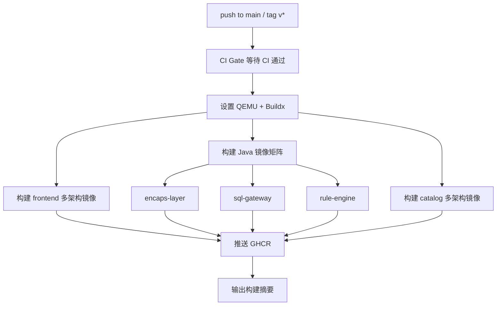

# 多架构镜像构建说明

> 归属：多平台多租户大数据平台 · 部署文档
> 版本：v1.0 ｜ 日期：2026-08-18 ｜ 状态：已完成
> 关联：`.github/workflows/multi-arch-build.yml`；`.github/workflows/build.yml`；`design/deploy/DEPLOY_GUIDE.md`
> 适用范围：信创 ARM 部署 + x86 部署 + 多架构 CI/CD

---

## 1. 概述

为支持信创 ARM 服务器（如鲲鹏、飞腾）与 x86 服务器统一部署，平台核心组件镜像构建为多架构（multi-arch）镜像，单 tag 同时包含 `linux/amd64` 与 `linux/arm64` 两个架构的镜像清单。部署时 Docker / containerd 根据节点架构自动拉取对应镜像，无需区分 tag。

### 1.1 支持的架构

| 架构 | 说明 | 典型服务器 |
| --- | --- | --- |
| linux/amd64 | x86-64 架构 | Intel Xeon、AMD EPYC |
| linux/arm64 | ARM 64 架构 | 华为鲲鹏 920、飞腾 2500、AWS Graviton |

### 1.2 多架构镜像清单

| 镜像 | 组件 | 技术栈 | 基础镜像 | 多架构支持 |
| --- | --- | --- | --- | --- |
| sq-frontend | Vue3 前端控制台 | Node.js 22 + Nginx | node:22-alpine / nginx:alpine | 官方镜像天然支持 |
| sq-encaps-layer | Java 后端封装层 | Spring Boot 3 + JDK 17 | maven:3.9-eclipse-temurin-17 / eclipse-temurin:17-jre | 官方镜像天然支持 |
| sq-sql-gateway | SQL 网关 | Spring Boot 3 + JDK 17 | 同上 | 官方镜像天然支持 |
| sq-catalog | 元数据 Catalog | Go 1.25 | golang:1.25-alpine / alpine:3.19 | TARGETARCH 交叉编译 |
| sq-rule-engine | 规则引擎 | Spring Boot 3 + JDK 17 | 同 encaps-layer | 官方镜像天然支持 |

---

## 2. 构建流程

### 2.1 构建流水线

多架构构建由 `.github/workflows/multi-arch-build.yml` 驱动，流程如下：



### 2.2 触发条件

| 触发方式 | 条件 | 说明 |
| --- | --- | --- |
| 自动触发 | push 到 main 分支 | 每次主分支推送构建 latest + sha tag |
| 自动触发 | 打 tag v*（如 v1.0.0） | 发布版本，构建 latest + 版本 tag |
| 手动触发 | workflow_dispatch | 可指定 platforms 和是否推送 |

### 2.3 构建技术

- **QEMU 模拟**：通过 `docker/setup-qemu-action` 在 x86 runner 上模拟 arm64 环境，实现单 runner 多架构构建。
- **Docker Buildx**：通过 `docker/setup-buildx-action` 启用 buildx，支持 `--platform` 多架构构建。
- **docker/build-push-action**：使用 `platforms` 参数指定目标架构，单次构建生成多架构 manifest list。
- **缓存**：使用 GitHub Actions cache（`type=gha`）加速重复构建，每个组件独立 scope。

### 2.4 与 build.yml 的关系

| 流水线 | 构建范围 | 架构 | 用途 |
| --- | --- | --- | --- |
| build.yml | 所有组件（前端/Java/Go/Python） | Go 多架构，其余单架构 | 日常主分支快速构建 |
| multi-arch-build.yml | 5 个核心组件 | 全部多架构 | 发布与信创部署 |

---

## 3. Dockerfile 多架构适配

### 3.1 适配情况

所有 5 个核心组件的 Dockerfile **无需修改**，已天然支持多架构：

| 组件 | 适配方式 | 说明 |
| --- | --- | --- |
| frontend | 官方多架构基础镜像 | node:22-alpine / nginx:alpine 官方提供 amd64+arm64 |
| encaps-layer | 官方多架构基础镜像 | eclipse-temurin 官方提供 amd64+arm64 JDK |
| sql-gateway | 官方多架构基础镜像 | 同 encaps-layer |
| rule-engine | 官方多架构基础镜像 | 同 encaps-layer |
| catalog | TARGETARCH 交叉编译 | Dockerfile 已使用 `ARG TARGETARCH` + `GOARCH=${TARGETARCH}` |

### 3.2 基础镜像多架构支持

所有基础镜像均来自 Docker Hub 官方仓库（通过 DaoCloud 加速），官方镜像天然支持多架构：

```text
node:22-alpine          → linux/amd64 + linux/arm64  ✓
nginx:alpine            → linux/amd64 + linux/arm64  ✓
maven:3.9-eclipse-temurin-17 → linux/amd64 + linux/arm64  ✓
eclipse-temurin:17-jre  → linux/amd64 + linux/arm64  ✓
golang:1.26-alpine      → linux/amd64 + linux/arm64  ✓
alpine:3.19             → linux/amd64 + linux/arm64  ✓
```

### 3.3 Go 交叉编译说明

catalog 的 Dockerfile 已适配多架构：

```dockerfile
ARG TARGETARCH
RUN CGO_ENABLED=0 GOOS=linux GOARCH=${TARGETARCH} go build -trimpath -ldflags="-s -w" -o /out/catalog .
```

`TARGETARCH` 由 Buildx 自动注入（amd64 或 arm64），Go 交叉编译生成对应架构静态二进制。

---

## 4. 构建验证

### 4.1 验证镜像多架构清单

使用 `docker buildx imagetools inspect` 验证镜像包含多架构 manifest：

```bash
# 验证前端镜像
docker buildx imagetools inspect ghcr.io/<org>/sq-frontend:latest

# 验证 Java 镜像
docker buildx imagetools inspect ghcr.io/<org>/sq-encaps-layer:latest

# 验证 Go 镜像
docker buildx imagetools inspect ghcr.io/<org>/sq-catalog:latest
```

预期输出包含：

```json
{
  "manifest": {
    "mediaType": "application/vnd.oci.image.index.v1+json",
    "manifests": [
      { "platform": { "architecture": "amd64", "os": "linux" } },
      { "platform": { "architecture": "arm64", "os": "linux" } }
    ]
  }
}
```

### 4.2 验证镜像可运行

在 amd64 节点验证：

```bash
docker pull --platform linux/amd64 ghcr.io/<org>/sq-frontend:latest
docker run --rm ghcr.io/<org>/sq-frontend:latest
```

在 arm64 节点验证：

```bash
docker pull --platform linux/arm64 ghcr.io/<org>/sq-frontend:latest
docker run --rm ghcr.io/<org>/sq-frontend:latest
```

### 4.3 CI 自动验证

`multi-arch-build.yml` 的 `build-summary` job 会输出构建摘要，可在 GitHub Actions 日志中确认所有组件构建成功。

---

## 5. arm64 环境部署注意事项

### 5.1 镜像拉取

多架构镜像无需指定平台，containerd / Docker 自动根据节点架构选择：

```bash
# 在 arm64 节点自动拉取 arm64 镜像
docker pull ghcr.io/<org>/sq-frontend:latest
```

如需强制指定平台（排查用）：

```bash
docker pull --platform linux/arm64 ghcr.io/<org>/sq-frontend:latest
```

### 5.2 K8s 部署

K8s 调度器自动识别节点架构，多架构镜像无需特殊配置：

```yaml
# deployment.yaml 示例
spec:
  containers:
    - name: frontend
      image: ghcr.io/<org>/sq-frontend:latest  # 自动匹配节点架构
```

如需将特定组件调度到 arm64 节点：

```yaml
spec:
  nodeSelector:
    kubernetes.io/arch: arm64
```

### 5.3 性能注意事项

| 组件 | arm64 注意事项 |
| --- | --- |
| frontend | Nginx 静态服务，arm64 性能与 amd64 持平 |
| Java 组件 | JDK 17 arm64 为原生编译，性能接近 amd64；注意 MaxRAMPercentage 在不同实例规格下的堆内存 |
| catalog | Go 静态二进制，arm64 性能与 amd64 持平 |

### 5.4 构建性能注意事项

- **QEMU 模拟构建较慢**：在 x86 runner 上模拟 arm64 构建 Java 镜像（Maven）耗时约为原生的 3-5 倍，`multi-arch-build.yml` 的 Java 构建 timeout 设为 360min。
- **缓存加速**：每个组件使用独立的 GHA cache scope，重复构建可复用层缓存。
- **发布建议**：日常开发使用 `build.yml`（单架构快速构建），发布时使用 `multi-arch-build.yml`（多架构完整构建）。

### 5.5 信创环境兼容性

| 信创 CPU | 架构 | 兼容性 | 备注 |
| --- | --- | --- | --- |
| 华为鲲鹏 920 | arm64 | ✓ | 主流信创服务器 |
| 飞腾 2500 | arm64 | ✓ | 国产 ARM 服务器 |
| 海光 | amd64 | ✓ | 国产 x86 服务器 |
| 兆芯 | amd64 | ✓ | 国产 x86 服务器 |

---

## 6. 故障排查

### 6.1 常见问题

| 问题 | 原因 | 解决方案 |
| --- | --- | --- |
| arm64 节点拉取 amd64 镜像 | 镜像非多架构 | 确认使用 multi-arch-build.yml 构建的镜像 |
| QEMU 构建超时 | Maven 在模拟下过慢 | 增大 timeout 或拆分构建 |
| manifest 不含 arm64 | 构建时未指定 platforms | 检查 workflow platforms 参数 |
| arm64 节点 OOM | JVM 堆内存配置不当 | 调整 MaxRAMPercentage |

### 6.2 验证命令速查

```bash
# 查看镜像支持的架构
docker buildx imagetools inspect <image>:<tag>

# 查看本机架构
uname -m  # x86_64 / aarch64

# 强制拉取特定架构
docker pull --platform linux/arm64 <image>:<tag>

# 查看已拉取镜像的架构
docker image inspect <image>:<tag> --format '{{.Architecture}}'
```

---

## 7. 参考

- `.github/workflows/multi-arch-build.yml`：多架构构建流水线。
- `.github/workflows/build.yml`：日常构建流水线（含 Go 多架构）。
- `design/deploy/DEPLOY_GUIDE.md`：部署指南。
- Docker 多架构构建文档：https://docs.docker.com/build/building/multi-platform/
- Buildx 文档：https://github.com/docker/buildx