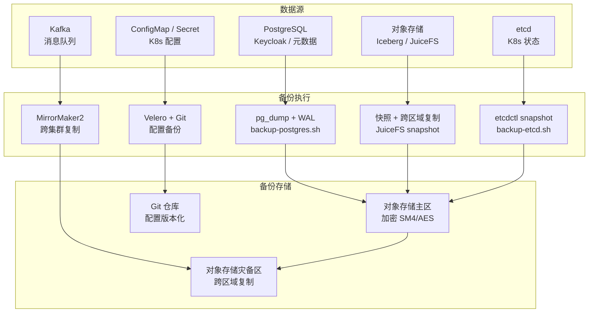

# 备份恢复策略

> 归属：多平台多租户大数据平台 · 运维文档
> 版本：v1.0 ｜ 日期：2026-08-17 ｜ 状态：已完成
> 关联：`design/运维/运维手册.md` §4 备份恢复；`design/deploy/monitoring/alerts/prometheus-rules.yaml`（备份告警）
> 适用范围：平台运维团队 + SRE 值班

---

## 1. 备份目标

保障多平台多租户大数据平台在任意故障场景下可恢复，达成以下 RPO/RTO：

| 数据类型 | RPO | RTO | 备份频率 | 保留时长 |
| --- | --- | --- | --- | --- |
| PostgreSQL（Keycloak / 元数据库） | < 5min | < 1h | 每日全量 + WAL 实时归档 | 30 天 |
| 对象存储（Iceberg 表 / JuiceFS） | < 1h | < 4h | 实时跨区域复制 + 每日快照 | 90 天 |
| Iceberg 表快照 | 0 | < 5min | 每次写入即快照 | 7 天 |
| Kafka 数据 | < 5min | < 1h | MirrorMaker2 跨集群备份 | 7 天 |
| etcd（K8s 集群状态） | < 1h | < 30min | 每小时快照 | 7 天 |
| K8s Secret / ConfigMap | 0 | < 5min | Git 仓库版本化 + 每日导出 | 永久 |
| Grafana / Prometheus | < 1d | < 2h | 每日快照 | 90 天 |
| 审计日志 | 0 | < 1h | WORM 实时写入 + 归档 | 180 天 + 1 年 |

---

## 2. 备份架构

---

## 3. 备份策略详解

### 3.1 PostgreSQL 备份

**策略**：每日全量 `pg_dump` + 实时 WAL 归档（Point-in-Time Recovery）

- **全量备份**：每日 02:00 执行 `pg_dump`，导出所有数据库（keycloak、metadata、governance、audit）。
- **WAL 归档**：开启 `archive_mode=on`，WAL 段实时归档到对象存储，支持 PITR 任意时间点恢复。
- **加密**：备份文件经 SM4（信创）或 AES-256（非信创）加密后上传对象存储。
- **保留**：30 天滚动保留，7 天内的备份支持 PITR。
- **验证**：每日备份后自动执行 `pg_restore --list` 验证备份完整性。

**相关脚本**：`backup-scripts/backup-postgres.sh`

### 3.2 对象存储备份（Iceberg / JuiceFS）

**策略**：跨区域实时复制 + 每日快照

- **跨区域复制**：对象存储配置跨区域复制规则，写入实时同步到灾备区域。
- **JuiceFS 快照**：每日 03:00 执行 JuiceFS 元数据快照，保留 90 天。
- **Iceberg 快照**：Iceberg 表格式原生支持时间旅行（time travel），每次写入自动产生快照，保留 7 天。
  - 恢复：`CALL system.rollback_to_snapshot('db.table', snapshot_id)`，秒级回滚。
- **一致性**：快照前执行 `fsync` 确保数据落盘。

### 3.3 Kafka 备份

**策略**：MirrorMaker2 跨集群异步复制

- **主集群 → 灾备集群**：MirrorMaker2 持续复制 topic 数据到灾备集群。
- **topic 映射**：`<topic>` → `backup.<topic>`，保留 offset 对齐。
- **offset 同步**：使用 `sync_group_offsets.enabled=true` 确保消费者 offset 可恢复。
- **RPO**：< 5min（异步复制，有少量延迟）。
- **故障切换**：主集群不可用时，消费者切换到灾备集群 `backup.*` topic。

### 3.4 etcd 备份

**策略**：每小时快照

- **快照**：每小时执行 `etcdctl snapshot save`，保存 K8s 集群状态。
- **加密**：快照文件加密后上传对象存储。
- **保留**：7 天滚动保留（168 份快照）。
- **验证**：快照后执行 `etcdctl snapshot status` 验证完整性。

**相关脚本**：`backup-scripts/backup-etcd.sh`

### 3.5 K8s 配置备份（Secret / ConfigMap）

**策略**：Git 仓库版本化 + Velero 每日导出

- **GitOps**：所有 Helm values 经 Git 仓库版本化（ArgoCD 管理），Secret 经 KMS / Sealed Secrets 加密。
- **Velero**：每日 04:00 执行 Velero 备份，导出所有 namespace 的 Secret / ConfigMap / PVC 元数据。
- **保留**：Git 永久保留；Velero 备份保留 30 天。

### 3.6 Grafana / Prometheus 备份

**策略**：每日快照

- **Grafana**：每日导出所有 dashboard JSON 到 Git 仓库 + 对象存储。
- **Prometheus**：每日执行 `promsnapshot` 远程存储快照，保留 90 天。

---

## 4. 备份存储与加密

### 4.1 存储分层

| 层级 | 存储 | 用途 | 加密 |
| --- | --- | --- | --- |
| 热备份 | 本地 SSD | 最近 1 天备份，快速恢复 | LUKS 磁盘加密 |
| 温备份 | 对象存储主区 | 7-30 天备份 | SM4 / AES-256 |
| 冷备份 | 对象存储灾备区 | 90 天归档 | SM4 / AES-256 + 跨区域复制 |

### 4.2 加密策略

- **信创环境**：使用国密 SM4 算法，密钥经 KMS（华为云 KMS / 自建 Vault）管理。
- **非信创环境**：使用 AES-256-GCM，密钥经 Vault KMS 管理。
- **密钥轮换**：每 90 天轮换一次加密密钥，旧密钥保留用于解密历史备份。

---

## 5. 备份监控与告警

备份任务通过 Prometheus exporter 暴露指标，告警规则见 `design/deploy/monitoring/alerts/prometheus-rules.yaml`：

| 指标 | 告警条件 | 级别 |
| --- | --- | --- |
| `backup_success` | `== 0` for 5m | P1 |
| `backup_last_success_timestamp_seconds` | `time() - ts > 3600` | P0（超过 RPO） |
| `backup_duration_seconds` | `> 3600` | P2（备份超时） |
| `backup_size_bytes` | `== 0` | P1（空备份） |

---

## 6. 备份执行计划

| 时间 | 任务 | 脚本 | 输出 |
| --- | --- | --- | --- |
| 每日 02:00 | PostgreSQL 全量备份 | backup-postgres.sh | `pg-YYYYMMDD.dump.gz.enc` |
| 实时 | PostgreSQL WAL 归档 | postgresql.conf archive_command | `wal/00000001000000000000000X` |
| 每日 03:00 | JuiceFS 快照 | juicefs snapshot | `juicefs-snapshot-YYYYMMDD` |
| 每小时 | etcd 快照 | backup-etcd.sh | `etcd-YYYYMMDDHH.snapshot.gz.enc` |
| 每日 04:00 | Velero K8s 配置备份 | velero backup create | `k8s-config-YYYYMMDD.tar.gz` |
| 实时 | Kafka MirrorMaker2 | MirrorMaker2 | 灾备集群 `backup.*` topic |
| 每日 05:00 | 备份完整性验证 | verify-backup.sh | 验证报告 |

---

## 7. 恢复 RTO/RPO 矩阵

| 故障场景 | 影响范围 | RPO | RTO | 恢复方式 |
| --- | --- | --- | --- | --- |
| 单 Pod 故障 | 单服务 | 0 | < 5min | K8s 自动重启 / 重新调度 |
| 单节点故障 | 节点上所有 Pod | < 5min | < 15min | K8s 重新调度到健康节点 |
| PostgreSQL 主库故障 | 元数据读写 | < 5min | < 1h | 主备切换 + WAL 重放 |
| 对象存储故障 | 数据读写 | < 1h | < 4h | 跨区域复制回切 |
| Kafka 集群故障 | 消息读写 | < 5min | < 1h | MirrorMaker2 切换到灾备集群 |
| K8s 集群故障 | 全平台 | < 1h | < 4h | etcd 恢复 + Velero 恢复 + 重新部署 |
| 机房故障 | 全平台 | < 1h | < 4h | 灾备区域接管 |

---

## 8. 备份验证

### 8.1 自动验证

每日 05:00 自动执行备份验证：

1. **PostgreSQL**：`pg_restore --list` 验证备份文件可解析 + 随机抽样数据校验。
2. **etcd**：`etcdctl snapshot status` 验证快照完整性。
3. **对象存储**：MD5 校验备份文件与源文件一致。
4. **Kafka**：对比主备集群 topic offset 差距 < 1000。

### 8.2 恢复演练

- **频率**：每季度执行一次完整恢复演练。
- **范围**：在隔离环境恢复全平台，验证数据完整性 + 服务可用性。
- **记录**：演练报告归档到 `docs/operations/drill-reports/`，含时间线 / 步骤 / 结果 / 改进项。
- **信创验证**：信创环境演练使用国产存储 + 国密加密，验证全栈可恢复。

---

## 9. 文件清单

| 文件 | 用途 |
| --- | --- |
| `backup-strategy.md` | 本文档，备份策略总纲 |
| `backup-scripts/backup-postgres.sh` | PostgreSQL 备份脚本 |
| `backup-scripts/backup-etcd.sh` | etcd 备份脚本 |
| `restore-procedure.md` | 恢复操作步骤手册 |