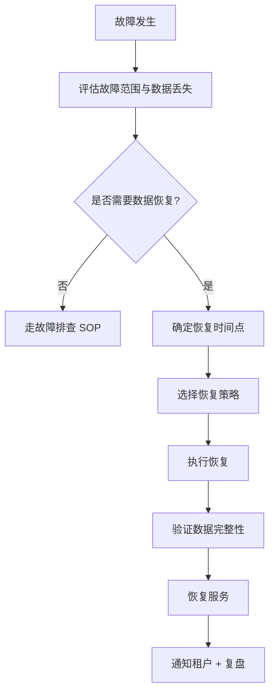

# 恢复操作步骤手册

> 归属：多平台多租户大数据平台 · 运维文档
> 版本：v1.0 ｜ 日期：2026-08-17 ｜ 状态：已完成
> 关联：`design/deploy/backup/backup-strategy.md`；`design/运维/运维手册.md` §4.3 恢复 SOP
> 适用范围：平台运维团队 + SRE 值班
> 优先级：恢复操作需两人复核（一人执行、一人确认）

---

## 1. 恢复决策流程



---

## 2. PostgreSQL 恢复

### 2.1 全量恢复（指定日期的备份）

**适用场景**：数据库完全损坏，需恢复到某天 02:00 的全量备份。

**前置条件**：
- 已停止写入服务（避免恢复期间数据不一致）
- 已获取加密密钥（`/etc/backup/encryption-key`）
- 对象存储可访问

**操作步骤**：

```bash
# 命令示例：PostgreSQL 全量恢复
# 1. 下载备份文件
mc cp backup-target/shuqing-backup/postgres/metadata/metadata-20260817-020000.dump.gz.enc /tmp/

# 2. 解密
openssl enc -d -aes-256-cbc -pbkdf2 \
  -in /tmp/metadata-20260817-020000.dump.gz.enc \
  -out /tmp/metadata-20260817-020000.dump.gz \
  -pass file:/etc/backup/encryption-key

# 3. 解压
gunzip /tmp/metadata-20260817-020000.dump.gz

# 4. 停止写入服务（停止依赖 metadata 的应用 Pod）
kubectl scale deployment console -n sq-platform --replicas=0

# 5. 恢复（自定义格式，支持并行恢复）
pg_restore \
  -h postgresql.sq-engine.svc.cluster.local \
  -U postgres \
  -d metadata \
  --clean --if-exists --no-owner --no-privileges \
  --jobs=4 \
  /tmp/metadata-20260817-020000.dump

# 6. 验证数据完整性
psql -h postgresql.sq-engine.svc.cluster.local -U postgres -d metadata \
  -c "SELECT count(*) FROM information_schema.tables WHERE table_schema='public';"

# 7. 恢复写入服务
kubectl scale deployment console -n sq-platform --replicas=2
```

### 2.2 PITR 时间点恢复

**适用场景**：误删数据，需恢复到误删前的时间点。

**操作步骤**：

```bash
# 命令示例：PostgreSQL PITR 恢复到 2026-08-17 10:30:00
# 1. 恢复基础全量备份（同 §2.1 步骤 1-5，但创建新实例而非覆盖）
# 2. 配置 recovery_target_time
cat > /tmp/recovery.conf <<EOF
restore_command = 'mc cat backup-target/shuqing-backup/postgres/wal/%f > %p'
recovery_target_time = '2026-08-17 10:30:00+08'
recovery_target_action = 'pause'
EOF

# 3. 启动 PostgreSQL 进入恢复模式
# （在备用实例上执行，避免影响主库）
pg_ctl -D /var/lib/postgresql/data -o "-c config_file=/tmp/recovery.conf" start

# 4. 验证恢复到正确时间点后，提升为主库
pg_ctl promote -D /var/lib/postgresql/data
```

---

## 3. etcd 恢复

**适用场景**：K8s 集群状态损坏，控制面不可用。

**操作步骤**：

```bash
# 命令示例：etcd 快照恢复
# 1. 下载快照
mc cp backup-target/shuqing-backup/etcd/etcd-20260817-020000.snapshot.gz.enc /tmp/

# 2. 解密解压
openssl enc -d -aes-256-cbc -pbkdf2 \
  -in /tmp/etcd-20260817-020000.snapshot.gz.enc \
  -out /tmp/etcd-20260817-020000.snapshot.gz \
  -pass file:/etc/backup/encryption-key
gunzip /tmp/etcd-20260817-020000.snapshot.gz

# 3. 停止所有 etcd 实例
# （在每台 master 节点执行）
systemctl stop etcd

# 4. 恢复快照到新数据目录
ETCDCTL_API=3 etcdctl snapshot restore /tmp/etcd-20260817-020000.snapshot \
  --data-dir=/var/lib/etcd-restored \
  --initial-cluster=etcd-0=https://etcd-0:2380,etcd-1=https://etcd-1:2380,etcd-2=https://etcd-2:2380 \
  --initial-cluster-token=etcd-cluster \
  --initial-advertise-peer-urls=https://etcd-0:2380

# 5. 替换数据目录
mv /var/lib/etcd /var/lib/etcd.bak
mv /var/lib/etcd-restored /var/lib/etcd

# 6. 启动 etcd
systemctl start etcd

# 7. 验证集群健康
ETCDCTL_API=3 etcdctl endpoint health --cluster
```

---

## 4. 对象存储恢复（Iceberg / JuiceFS）

### 4.1 Iceberg 表时间旅行恢复

**适用场景**：误删表数据或写入脏数据，需回滚到某个快照。

```bash
# 命令示例：Iceberg 表回滚到指定快照
# 1. 查看表快照列表
spark-sql -e "CALL system.snapshots('metadata.iceberg_tables');"

# 2. 回滚到指定快照
spark-sql -e "CALL system.rollback_to_snapshot('metadata.iceberg_tables', 123456789);"

# 3. 验证数据
spark-sql -e "SELECT count(*) FROM metadata.iceberg_tables;"
```

### 4.2 跨区域复制回切

**适用场景**：主区域对象存储故障，需切换到灾备区域。

```bash
# 命令示例：对象存储跨区域回切
# 1. 更新 JuiceFS 配置指向灾备区域
juicefs config sqlite3:///var/jfs/meta --bucket=s3://shuqing-backup-region2

# 2. 重新挂载
umount /mnt/jfs
juicefs mount sqlite3:///var/jfs/meta /mnt/jfs --bucket=s3://shuqing-backup-region2

# 3. 验证数据可读写
ls /mnt/jfs/iceberg/ | head
```

---

## 5. Kafka 恢复

**适用场景**：主 Kafka 集群故障，需切换到 MirrorMaker2 灾备集群。

```bash
# 命令示例：Kafka 灾备集群切换
# 1. 验证灾备集群健康
kafka-topics --bootstrap-server kafka-backup:9092 --list

# 2. 更新消费者配置指向灾备集群
kubectl edit configmap kafka-consumer-config -n sq-engine
# 修改 bootstrap.servers=kafka-backup:9092
# 修改 group.id=original-group（MirrorMaker2 已同步 offset）

# 3. 重启消费者服务
kubectl rollout restart deployment all-consumers -n sq-engine

# 4. 验证消费 lag 正常
kafka-consumer-groups --bootstrap-server kafka-backup:9092 --describe --all-groups
```

---

## 6. K8s 集群恢复（Velero）

**适用场景**：K8s 集群完全故障，需恢复集群状态和工作负载。

```bash
# 命令示例：Velero 恢复 K8s 配置
# 1. 恢复 etcd（同 §3）
# 2. 安装 Velero
velero install \
  --provider aws \
  --bucket shuqing-backup \
  --backup-location-config region=minio,s3ForcePathStyle=true,s3Url=http://minio:9000

# 3. 恢复指定备份
velero restore create --from-backup k8s-config-20260817

# 4. 等待恢复完成
velero restore get
velero restore describe k8s-config-20260817 --details

# 5. 验证所有 namespace 恢复
kubectl get ns
kubectl get pods -A
```

---

## 7. 恢复验证清单

恢复操作完成后，按以下清单逐项验证：

| 序号 | 验证项 | 验证方法 | 通过标准 |
| --- | --- | --- | --- |
| 1 | 数据库连接 | `psql -c "SELECT 1"` | 返回 1 |
| 2 | 数据完整性 | 关键表 count + 抽样对比 | 与备份前一致 |
| 3 | K8s 集群健康 | `kubectl get nodes` | 全部 Ready |
| 4 | 所有 Pod Running | `kubectl get pods -A` | 无 CrashLoopBackOff |
| 5 | API 可用 | `curl /health` | 200 OK |
| 6 | 业务功能 | 控制台登录 + 查询作业 | 功能正常 |
| 7 | 监控恢复 | Grafana 大盘有数据 | 指标正常 |
| 8 | 日志正常 | Loki 可查询最新日志 | 日志在写入 |
| 9 | 告警正常 | Alertmanager 无误报 | 告警规则生效 |

---

## 8. 恢复演练流程

### 8.1 演练计划

- **频率**：每季度一次（Q1/Q2/Q3/Q4）。
- **范围**：在隔离环境（staging）执行全平台恢复。
- **人员**：运维组 + SRE + DBA，至少 3 人参与。

### 8.2 演练步骤

1. **准备**：在隔离环境部署空集群，准备最新备份文件。
2. **执行**：按本手册逐项恢复（PostgreSQL → etcd → K8s 配置 → 对象存储 → Kafka）。
3. **验证**：按 §7 验证清单逐项检查。
4. **计时**：记录每步耗时，验证 RTO 是否达标。
5. **报告**：输出演练报告，含时间线 / 问题 / 改进项。
6. **归档**：演练报告归档到 `docs/operations/drill-reports/YYYY-Qn.md`。

### 8.3 演练报告模板

```markdown
# 恢复演练报告 YYYY-Qn

## 演练信息
- 日期：YYYY-MM-DD
- 参与人员：xxx、xxx、xxx
- 演练环境：staging
- 备份来源：生产 YYYY-MM-DD 02:00

## 演练结果
| 恢复项 | RTO 目标 | 实际耗时 | 是否达标 |
| --- | --- | --- | --- |
| PostgreSQL | < 1h | xx min | ✅/❌ |
| etcd | < 30min | xx min | ✅/❌ |
| K8s 配置 | < 5min | xx min | ✅/❌ |
| 对象存储 | < 4h | xx min | ✅/❌ |

## 问题与改进
1. 问题描述 → 改进措施 → 责任人 → 截止日期
```