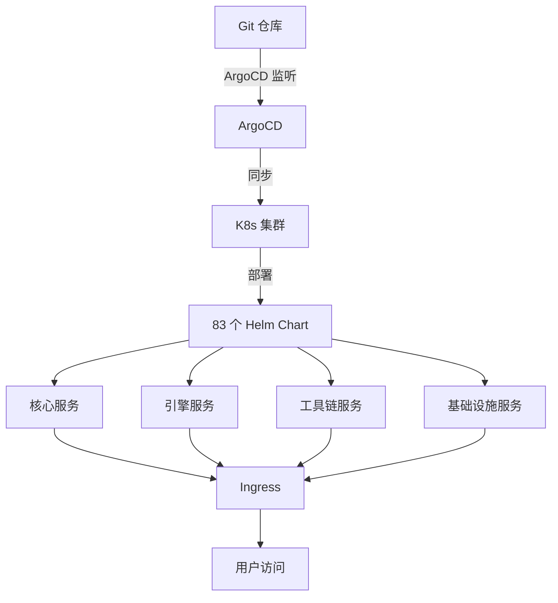
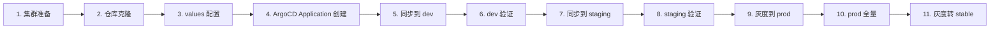

# 部署手册

> 归属：多平台多租户大数据平台 · 部署文档
> 版本：v1.0 ｜ 日期：2026-08-18 ｜ 状态：已完成
> 关联：`design/deploy/README.md`；`design/deploy/DEPLOY_GUIDE.md`；`design/deploy/MULTI_ARCH_BUILD.md`；`design/deploy/JWT鉴权配置指南.md`（AUTH_MODE fail-fast 配套）；`design/部署/灰度发布方案.md`；`design/运维/运维手册.md`
> 适用范围：v1.0 GA 全量部署，覆盖 dev/staging/prod 三环境 + 信创/本地/云/私有云四部署形态

---

## 1. 概述

### 1.1 目的

本手册为多平台多租户大数据平台 v1.0 GA 的全量部署操作手册，确保：

- **可重复**：任意环境按本手册操作可得到一致结果。
- **可回滚**：任意步骤失败可回滚到上一稳定状态。
- **可审计**：每步操作有记录，满足等保三级变更管理要求。
- **多形态**：覆盖信创/本地/云/私有云四种部署形态。

### 1.2 部署形态

| 形态 | K8s 发行版 | 架构 | 镜像仓库 | 备注 |
| --- | --- | --- | --- | --- |
| 信创 | 鲲鹏 K8s | arm64 | 内部 Harbor | 国密必选 |
| 本地 | K8s 1.28+ | amd64 | docker.m.daocloud.io | 开发/演示 |
| 公有云 | 云厂商托管 K8s | amd64 | 云厂商 ECR | 生产可选 |
| 私有云 | 自建 K8s 1.28+ | amd64/arm64 | 内部 Harbor | 生产主推 |

### 1.3 部署架构



---

## 2. 前置条件

### 2.1 集群要求

| 项 | 最低版本 | 推荐 | 验证命令 |
| --- | --- | --- | --- |
| Kubernetes | 1.28 | 1.30 | `kubectl version --short` |
| Helm | 3.12 | 3.14 | `helm version` |
| ArgoCD | 2.7 | 2.9 | `argocd version` |
| kubectl | 1.28 | 1.30 | `kubectl version --client` |
| git | 2.40 | 2.45 | `git --version` |
| Container Runtime | containerd 1.7 | 1.7 | `crictl version` |

### 2.2 集群资源

| 角色 | 节点数 | 规格 | 用途 |
| --- | --- | --- | --- |
| master | 3 | 8C / 16G / 100G | 控制面 |
| worker-infra | 3 | 16C / 64G / 500G | 基础设施服务 |
| worker-engine | 3+ | 32C / 128G / 1T | 引擎服务 |
| worker-tool | 2+ | 16C / 32G / 200G | 工具链服务 |

### 2.3 集群插件

| 插件 | 用途 | 安装验证 |
| --- | --- | --- |
| ArgoCD | GitOps | `kubectl get pods -n argocd` |
| APISIX Ingress | Ingress 控制器 | `kubectl get pods -n ingress-apisix` |
| Cert-Manager | 证书管理 | `kubectl get pods -n cert-manager` |
| Prometheus | 监控 | `kubectl get pods -n monitoring` |
| Loki | 日志 | `kubectl get pods -n loki` |
| StorageClass `sq-fast-ssd` | PVC | `kubectl get sc` |

### 2.4 网络与存储

- 集群节点间网络延迟 < 1ms。
- StorageClass `sq-fast-ssd` 可用。
- 镜像仓库可达（内部 Harbor 或 `docker.m.daocloud.io`）。
- DNS 解析 `*.nexus.internal` 指向 Ingress LB。

---

## 3. 部署流程

### 3.1 总体流程



### 3.2 步骤 1：集群准备

```bash
# 1.1 验证集群可达
kubectl cluster-info

# 1.2 验证节点就绪
kubectl get nodes -o wide

# 1.3 验证插件
kubectl get pods -n argocd
kubectl get pods -n ingress-apisix
kubectl get sc sq-fast-ssd

# 1.4 配置 StorageClass 为默认
kubectl patch sc sq-fast-ssd -p '{"metadata": {"annotations":{"storageclass.kubernetes.io/is-default-class":"true"}}}'
```

### 3.3 步骤 2：仓库克隆

```bash
# 2.1 克隆部署仓库
git clone https://github.com/Levango7/DataEngineBDP.git
cd DataEngineBDP/design/deploy

# 2.2 切换到发布 tag
git checkout v1.0.0

# 2.3 验证目录结构
ls -la
# 预期：charts/ values/ argocd/ scripts/ README.md
```

### 3.4 步骤 3：values 配置

```bash
# 3.1 复制基础 values
cp values-base.yaml values/prod/my-values.yaml

# 3.2 修改关键配置（必改项）
vim values/prod/my-values.yaml
```

必改配置项：

```yaml
# 镜像仓库地址
global:
  imageRegistry: harbor.nexus.internal    # 改为你的镜像仓库
  imagePullSecrets: [{ name: harbor-secret }]

# 域名
ingress:
  domain: nexus.internal                  # 改为你的域名
  tls:
    enabled: true
    secretName: nexus-tls

# 数据库
postgresql:
  enabled: true
  auth:
    postgresPassword: "<CHANGE_ME>"       # 必改
    replicationPassword: "<CHANGE_ME>"   # 必改

# 对象存储
minio:
  enabled: true
  accessKey: "<CHANGE_ME>"                # 必改
  secretKey: "<CHANGE_ME>"                # 必改

# 国密（信创环境必选）
security:
  nationalCrypto:
    enabled: true                         # 信创环境设为 true
    sm2:
      privateKey: "<CHANGE_ME>"           # 必改
```

### 3.5 步骤 4：ArgoCD Application 创建

```bash
# 4.1 登录 ArgoCD
argocd login $ARGOCD_SERVER --username $ARGOCD_USER --password $ARGOCD_PASSWORD

# 4.2 创建命名空间
kubectl create namespace nexus-prod

# 4.3 创建 ArgoCD Application
kubectl apply -f argocd/applications/prod.yaml

# 4.4 验证 Application 创建
argocd app get nexus-prod
```

### 3.6 步骤 5：同步到 dev

```bash
# 5.1 手动触发同步
argocd app sync nexus-dev

# 5.2 等待同步完成
argocd app wait nexus-dev --sync --health

# 5.3 验证部署
kubectl get pods -n nexus-dev
kubectl get ingress -n nexus-dev
```

### 3.7 步骤 6：dev 验证

```bash
# 6.1 健康检查
curl https://dev.nexus.internal/health

# 6.2 冒烟测试
curl -X POST https://dev.nexus.internal/api/v1/auth/login \
  -H "Content-Type: application/json" \
  -d '{"username":"admin","password":"<password>"}'

# 6.3 E2E 测试
npm run test:e2e -- --base-url=https://dev.nexus.internal
```

### 3.8 步骤 7-10：staging → prod 灰度

详见 `design/部署/灰度发布方案.md`，关键步骤：

```bash
# 7. 同步到 staging
argocd app sync nexus-staging
argocd app wait nexus-staging --sync --health

# 8. staging 验证（含全量回归）
npm run test:regression -- --base-url=https://staging.nexus.internal

# 9. 灰度到 prod 1%
argocd app set nexus-prod --sync-policy none
kubectl -n nexus-prod set image deployment/api-gateway \
  api-gateway=harbor.nexus.internal/api-gateway:v1.0.0
# 配置 ArgoCD 灰度策略 1% → 10% → 50% → 100%

# 10. 灰度 100% 后观察 24h
# 11. 标记 stable
git tag v1.0.0-stable
git push origin v1.0.0-stable
```

---

## 4. 多架构镜像

### 4.1 镜像清单

| 服务 | 镜像 | 架构 | 备注 |
| --- | --- | --- | --- |
| api-gateway | `api-gateway:v1.0.0` | amd64 + arm64 | — |
| auth-service | `auth-service:v1.0.0` | amd64 + arm64 | — |
| sql-gateway | `sql-gateway:v1.0.0` | amd64 + arm64 | — |
| lakehouse-engine | `lakehouse-engine:v1.0.0` | amd64 + arm64 | — |
| ... | ... | ... | 共 83 个镜像 |

### 4.2 镜像构建

详见 `design/deploy/MULTI_ARCH_BUILD.md`：

```bash
# 使用 buildx 构建多架构镜像
docker buildx build \
  --platform linux/amd64,linux/arm64 \
  --tag harbor.nexus.internal/api-gateway:v1.0.0 \
  --push .
```

### 4.3 镜像签名

```bash
# 使用 cosign 签名
cosign sign --key cosign.key harbor.nexus.internal/api-gateway:v1.0.0

# 部署前验证签名
cosign verify --key cosign.pub harbor.nexus.internal/api-gateway:v1.0.0
```

---

## 5. 信创环境特殊配置

### 5.1 国密启用

```yaml
# values/prod/xinchang-values.yaml
security:
  nationalCrypto:
    enabled: true
    sm2:
      privateKey: "<SM2_PRIVATE_KEY>"
      publicKey: "<SM2_PUBLIC_KEY>"
    sm3:
      algorithm: "SM3"
    sm4:
      algorithm: "SM4"
      key: "<SM4_KEY>"
```

### 5.2 鲲鹏优化

```yaml
# 鲲鹏 arm64 优化
engine:
  spark:
    executor:
      extraJavaOptions: "-XX:+UseGCMaxLiveRatio -XX:G1HeapRegionSize=32m"
  flink:
    executor:
      extraJavaOptions: "-XX:+UseGCMaxLiveRatio -XX:G1HeapRegionSize=32m"
```

---

## 6. 部署验证

### 6.1 健康检查清单

| 检查项 | 命令 | 预期 |
| --- | --- | --- |
| 所有 Pod Running | `kubectl get pods -n nexus-prod` | STATUS = Running |
| 所有 Deployment 可用 | `kubectl get deploy -n nexus-prod` | READY = x/x |
| Ingress 配置 | `kubectl get ingress -n nexus-prod` | ADDRESS 非空 |
| PVC 绑定 | `kubectl get pvc -n nexus-prod` | STATUS = Bound |
| Service Endpoints | `kubectl get ep -n nexus-prod` | ENDPOINTS 非空 |
| 健康端点 | `curl https://prod.nexus.internal/health` | 200 OK |
| API 文档 | `curl https://prod.nexus.internal/api/docs` | 200 OK |

### 6.2 功能验证

```bash
# 1. 登录
TOKEN=$(curl -sX POST https://prod.nexus.internal/api/v1/auth/login \
  -H "Content-Type: application/json" \
  -d '{"username":"admin","password":"<pwd>"}' | jq -r .data.token)

# 2. 创建租户
curl -X POST https://prod.nexus.internal/api/v1/tenants \
  -H "Authorization: Bearer $TOKEN" \
  -H "Content-Type: application/json" \
  -d '{"name":"test-tenant"}'

# 3. 提交 SQL 查询
curl -X POST https://prod.nexus.internal/api/v1/sql/execute \
  -H "Authorization: Bearer $TOKEN" \
  -H "Content-Type: application/json" \
  -d '{"sql":"SELECT 1"}'

# 4. 查看任务
curl https://prod.nexus.internal/api/v1/tasks \
  -H "Authorization: Bearer $TOKEN"
```

---

## 7. 回滚

### 7.1 ArgoCD 一键回滚

```bash
# 回滚到上一稳定版本
argocd app rollback nexus-prod

# 或指定版本
argocd app rollback nexus-prod v0.9.0
```

### 7.2 Helm 回滚

```bash
# 查看历史
helm history nexus-prod -n nexus-prod

# 回滚到指定 revision
helm rollback nexus-prod <REVISION> -n nexus-prod
```

### 7.3 数据库回滚

数据库变更须配合应用回滚：

```bash
# 1. 应用回滚到上一版本（不含 DB 变更）
argocd app rollback nexus-prod

# 2. DB 回滚（仅向后兼容变更可回滚）
# 注意：破坏性 DB 变更不可回滚，须走数据迁移流程
```

---

## 8. 故障排查

### 8.1 常见问题

| 问题 | 排查 | 解决 |
| --- | --- | --- |
| Pod CrashLoopBackOff | `kubectl logs <pod> -n nexus-prod` | 检查配置/依赖 |
| ImagePullBackOff | `kubectl describe pod <pod>` | 检查镜像仓库/secret |
| PVC Pending | `kubectl describe pvc <pvc>` | 检查 StorageClass/容量 |
| Ingress 502 | `kubectl get ep -n nexus-prod` | 检查 Service/Pod |
| 同步失败 | `argocd app logs nexus-prod` | 检查 manifest/values |

### 8.2 详细排查

详见 `design/运维/故障排查手册.md`。

---

## 9. 附录

### 9.1 环境变量

```bash
export GIT_REPO="https://github.com/Levango7/DataEngineBDP"
export GIT_TAG="v1.0.0"
export ARGOCD_SERVER="argocd.nexus.internal"
export ARGOCD_USER="admin"
export ARGOCD_PASSWORD="<password>"
export HARBOR_URL="harbor.nexus.internal"
export HARBOR_USER="admin"
export HARBOR_PASSWORD="<password>"
```

### 9.2 命令速查

| 操作 | 命令 |
| --- | --- |
| 同步应用 | `argocd app sync nexus-prod` |
| 等待就绪 | `argocd app wait nexus-prod --sync --health` |
| 查看状态 | `argocd app get nexus-prod` |
| 查看日志 | `argocd app logs nexus-prod` |
| 回滚 | `argocd app rollback nexus-prod` |
| 删除应用 | `argocd app delete nexus-prod` |
| 列出应用 | `argocd app list` |

### 9.3 资源清单

| 资源 | 数量 | 备注 |
| --- | --- | --- |
| Helm Chart | 83 | — |
| ArgoCD Application | 30 | 10 组件 × 3 环境 |
| 命名空间 | 5 | nexus-dev/staging/prod/infra/monitoring |
| 镜像 | 83 | 多架构 amd64 + arm64 |
| 配置项 | 200+ | values 合计 |

---

## 10. 版本与变更

| 版本 | 日期 | 变更内容 | 作者 |
| --- | --- | --- | --- |
| v1.0 | 2026-08-18 | 首次发布，覆盖 v1.0 GA 全量部署 | 部署组 |

> 本手册由部署组维护，每次版本发布须同步更新。