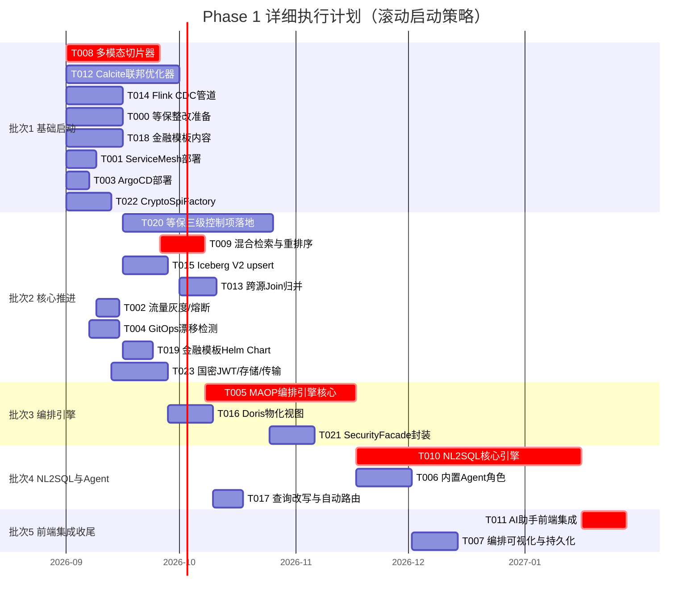

# 数擎大数据平台 V2.0 Phase 1 详细执行计划

> 版本：v2.0.0-phase1-plan
> 文档状态：执行计划
> 编写日期：2026-08-06
> 文档负责人：V2.0 Phase 1 执行计划制定员
> 适用范围：V2.0 Phase 1（V2.0-alpha）全部 11 项 P0 需求的 24 个任务执行安排
> 上游输入：
> - `V2.0_实施计划.md`（Phase 1 任务定义，§2.1）
> - `Phase0/T000a_Mock清零状态核查报告.md`（22 组件 Mock 清零状态）
> - `Phase0/T000b_L4.5实现状态核查报告.md`（6 个 L4.5 组件实现深度）
> - `Phase0/T000c_V2.0AI模块新建声明.md`（V2.0 AI 模块增强/新建策略）
> - `V2.0_PRD_产品需求文档.md`（11 项 P0 需求定义）
> - `V2.0_架构设计文档.md`（12 新增 + 17 增强模块）
> 下游输出：Phase 1 任务分派、里程碑跟踪、风险登记、批次并行调度

---

## 第1章 执行计划总述

### 1.1 Phase 1 目标与范围

Phase 1 是 V2.0 的 MVP 交付阶段（V2.0-alpha），目标是实现全部 11 项 P0 需求，构建 V2.0 平台的技术底座与旗舰 AI 能力，使平台具备等保三级可测评、NL2SQL 可用、实时入仓可跑、跨源联邦可查的端到端能力。

表：Phase1-01 目标与范围参数说明表

| 维度 | 内容 |
| --- | --- |
| 阶段定位 | V2.0-alpha（MVP），对应 PRD Phase 1 |
| 需求范围 | 11 项 P0 需求（REQ-CN-001/003、REQ-AI-001/002/006、REQ-DF-001、REQ-RT-001/003、REQ-IT-001、REQ-EX-003/004） |
| 任务范围 | 24 个任务（T000~T023，含等保整改准备 T000） |
| 领域覆盖 | 云原生增强、AI 能力增强、数据联邦、实时数仓、行业模板、安全合规与国密（共 6 个领域） |
| 前置条件 | Phase 0（T000a/T000b/T000c）已全部完成，tag v2.0.0-phase0 |
| 出口标准 | 等保三级可测评、NL2SQL 准确率 ≥ 90%、入仓延迟 P95 ≤ 5s、跨源联邦 P95 ≤ 10s、RAG P95 ≤ 2s |

### 1.2 总工时与工期

表：Phase1-02 工时与工期参数说明表

| 指标 | 数值 | 说明 |
| --- | --- | --- |
| 总工时 | 408 人天 | 含 T000 合规整改准备 15 人天 + 高复杂度任务专家重估上调 102 人天 |
| 原始工时 | 306 人天 | 专家重估前 |
| 重估上调 | 102 人天 | T005（25→40）、T008（15→25）、T010（20→60）、T012（18→30）、T020（15→40） |
| 关键路径工时 | 149 人天 | T008(25)→T009(12)→T005(40)→T010(60)→T011(12) |
| 关键路径工期 | 约 30 周（7.5 个月） | 串行无并行情况下 |
| 团队规模 | 29 人全职 + 2 人兼职 | 峰值并行期全员投入 |
| subagent 并行上限 | 5 个 | 单批次最多 5 个 subagent 并行 |
| 计划时间窗口 | 2026-09-01 ~ 2027-04-22 | 基于关键路径 149 天 + 缓冲 |
| 实施计划原窗口 | 2026-09 ~ 2026-12 | Gantt 图原始排期，需调整（详见 §1.5） |

### 1.3 关键路径识别

关键路径是项目中最长的串行任务链，决定项目最短工期。基于专家重估后的工时，Phase 1 关键路径为 AI 全链路。

表：Phase1-03 关键路径分析对照表

| 路径名称 | 任务链 | 累计工时（人天） | 是否关键路径 | 备注 |
| --- | --- | --- | --- | --- |
| AI 全链路 | T008(25) → T009(12) → T005(40) → T010(60) → T011(12) | 149 | **是（最长）** | V2.0 旗舰卖点核心交付链路 |
| 合规测评链路 | T000(15) → T020(40) → T021(12) | 67 | 否 | T021 还依赖 T022（12d，批次 1 启动） |
| 实时数仓链路 | T014(15) → T015(12) → T016(12) → T017(8) | 47 | 否 | 4 任务串行 |
| Agent 编排链路 | T009(12) → T005(40) → T006(15) → T007(12) | 79 | 否 | 与关键路径共享 T009→T005 |
| 数据联邦链路 | T012(30) → T013(10) | 40 | 否 | T012 也是 T010 的前置 |
| GitOps 链路 | T003(6) → T004(8) | 14 | 否 | 短链路 |
| Service Mesh 链路 | T001(8) → T002(6) | 14 | 否 | 短链路 |
| 国密链路 | T022(12) → T023(15) | 27 | 否 | T022 也是 T021 的前置 |
| 金融模板链路 | T018(15) → T019(8) | 23 | 否 | 短链路 |

**关键路径保障策略**：

1. T008（多模态切片器）在批次 1 第 0 天启动，不得延迟
2. T005（MAOP 编排引擎）分配 AI 架构师 + 2 名 Go 开发 + 2 名 Python 开发，5 人全职投入
3. T010（NL2SQL 核心引擎）是单任务工时最长（60 人天），分配 4 名 Python 开发 + 1 名 Java 开发（SQL 网关联邦对接）并行
4. 关键路径任务设置每周里程碑检查点，落后 2 天即触发预警与资源调配

### 1.4 团队规模需求

基于 V2.0 实施计划 §1.3 的 29 人团队配置，结合 Phase 1 任务分布，各领域组人员分配如下。

表：Phase1-04 团队分配参数说明表

| 领域组 | 全职人数 | 角色构成 | 主要任务 | 峰值并行度 |
| --- | --- | --- | --- | --- |
| 云原生组 | 4 | 云原生架构师(1) + DevOps(2) + Java(1) | T001/T002/T003/T004 | 2（T001+T003 并行） |
| AI 组 | 8 | AI 架构师(1) + Python(4) + Go(2) + 前端(1) | T005~T011 | 3（T005/T006/T010 重叠期） |
| 数据联邦组 | 3 | Java(2) + 首席架构师(0.5 兼) | T012/T013 | 1 |
| 实时数仓组 | 3 | Java(2) + DevOps(1) | T014/T015/T016/T017 | 1 |
| 行业模板组 | 2+1 兼 | Java(1) + DevOps(1) + 领域专家(1 兼职) | T018/T019 | 1 |
| 安全合规组 | 4 | 安全合规(2) + Java(2) | T000/T020/T021/T022/T023 | 2（T000+T022 并行，T020+T023 并行） |
| 横切支持 | 5 | 测试(4) + 前端(2) | 全领域测试 + AI 助手/编排可视化前端 | 按需 |
| **合计** | **29+2 兼** | — | 24 个任务 | 峰值 8 并行（受 subagent 5 上限制约） |

**人员调度原则**：

1. 关键路径任务（T008/T009/T005/T010/T011）优先保障高级别人员
2. AI 架构师全程投入 AI 组，不外借
3. 首席架构师 50% 投入数据联邦组（T012 Calcite 优化器架构决策），50% 跨领域协调
4. 测试工程师 4 人按领域分配：AI(1) + 云原生(0.5) + 数据联邦(0.5) + 实时数仓(0.5) + 安全合规(1) + 集成(0.5)
5. 前端 3 人：AI 组 1 人（T007/T011）+ 横切 2 人（控制台/可视化）

### 1.5 时间窗口调整说明

V2.0 实施计划 Gantt 图将 Phase 1 排期为 2026-09 ~ 2026-12（约 3.5 个月），但专家重估后关键路径达 149 人天（约 7.5 个月），存在显著差距。

表：Phase1-05 时间窗口调整对照表

| 项目 | 原计划 | 调整后 | 差异 | 调整理由 |
| --- | --- | --- | --- | --- |
| Phase 1 时间窗口 | 2026-09 ~ 2026-12（3.5 月） | 2026-09-01 ~ 2027-04-22（7.5 月） | +4 月 | 关键路径 149 人天无法压缩至 3.5 月 |
| V2.0-alpha 发布 | 2026-12 | 2027-04 | +4 月 | Phase 1 延长导致 alpha 延后 |
| V2.0-beta 启动 | 2026-12 | 2027-05 | +5 月 | beta 依赖 alpha 完成 |
| V2.0-ga 发布 | 2027-05 | 2027-10（预估） | +5 月 | 整体延后 |

**缓解方案（可选）**：

1. **方案 A：延长 Phase 1**（推荐）：Phase 1 延长至 2027-04，确保 P0 需求质量，后续 Phase 顺延
2. **方案 B：分阶段交付**：Phase 1 拆分为 Phase 1a（2026-09 ~ 2026-12，交付云原生+实时数仓+数据联邦+安全合规，14 任务）+ Phase 1b（2027-01 ~ 2027-04，交付 AI 全链路，10 任务），alpha 分两次发布
3. **方案 C：压缩关键路径**：T010 NL2SQL 60 人天拆分为 T010a（核心引擎 40 人天）+ T010b（多轮对话澄清 20 人天），T010a 完成即进入 T011，T010b 与 T011 并行，关键路径压缩至 129 人天

本计划采用**方案 A**作为基准，**方案 B**作为备选（详见 §4.3 分阶段交付选项）。

---

## 第2章 任务分配矩阵

### 2.1 云原生增强（4 任务，28 人天）

表：Phase1-06 云原生任务分配矩阵

| 任务 ID | 任务名称 | 工时 | 依赖 | 负责组 | 主责人 | 协作 | 技能要求 | 产出物 | 验收标准 |
| --- | --- | --- | --- | --- | --- | --- | --- | --- | --- |
| T001 | Service Mesh 控制面部署与 Sidecar 注入 | 8d | T000a | 云原生组 | 云原生架构师 | DevOps×1 | Istio≥1.20、Helm、mTLS | Istio Helm Chart、sidecar 注入策略、mTLS strict 配置 | Istio 部署到 SKE；21 个自研组件默认注入 Envoy sidecar；mTLS strict 生效 |
| T002 | 流量灰度/熔断/重试规则配置 | 6d | T001 | 云原生组 | DevOps 工程师 A | 云原生架构师 | Istio DestinationRule、VirtualService | DestinationRule/VirtualService 封装层、熔断规则 | sql-gateway→引擎链路 5%/20%/100% 灰度；5xx≥5 触发熔断 30s；CRD 暴露给租户 |
| T003 | ArgoCD 部署与 Chart 纯管 | 6d | 无 | 云原生组 | DevOps 工程师 B | Java 工程师 A | ArgoCD≥2.7、GitOps、sync wave | ArgoCD Helm Chart、Application manifests、sync wave 配置、V1.0 既有 13 Chart sync wave 注解补充 | ArgoCD 部署；59+ Helm Chart Git 同步；sync wave 顺序正确；V1.0 既有 Chart CRD/Namespace/Chart 资源已标注 |
| T004 | GitOps 漂移检测与回滚 | 8d | T003 | 云原生组 | DevOps 工程师 B | Java 工程师 A | ArgoCD auto-sync、selfHeal、Provider 适配 | auto-sync+selfHeal 策略、租户 Git 提交集成、三 Provider 适配 | 手动修改集群资源 30s 内检测漂移并回滚；"提交到 Git"按钮可用；GitLab/Gitea/Bitbucket 三 Provider 支持 |

### 2.2 AI 能力增强（7 任务，176 人天）

表：Phase1-07 AI 任务分配矩阵

| 任务 ID | 任务名称 | 工时 | 依赖 | 负责组 | 主责人 | 协作 | 技能要求 | 产出物 | 验收标准 |
| --- | --- | --- | --- | --- | --- | --- | --- | --- | --- |
| T005 | MAOP 编排引擎核心（DAG/StateMachine/ReAct） | 40d | T009 | AI 组 | AI 架构师 | Go×2、Python×1 | Go、K8s operator、Kafka、LangGraph | MAOP Go 服务、三种编排范式、Kafka 消息总线集成 | 支持 DAG/State Machine/ReAct 三种编排；单次编排调度 ≥20 个 Agent；Agent 间 Kafka Topic 异步通信 |
| T006 | 内置 Agent 角色实现 | 15d | T005 | AI 组 | Go 工程师 A | AI 架构师 | Go、Agent 设计、工具沙箱 | 8 种 Agent 角色实现（规划/SQL/可视化/质量/血缘/文档/代码/审核） | 内置 Agent ≥8 种；工具调用白名单生效；资源配额隔离 |
| T007 | 编排可视化与持久化 | 12d | T005,T006 | AI 组 | 前端工程师 A | Go 工程师 A | Vue3、TypeScript、ECharts、DAG 可视化 | 编排 DAG 可视化前端、思考链展示、断点续跑与回放机制 | DAG 节点状态/Agent 思考链/工具调用记录可视化；支持人工介入节点；断点续跑 |
| T008 | 多模态切片器（文本/表格/图像/语音） | 25d | T000b | AI 组 | Python 工程师 A | Python 工程师 B | Python、PyTorch、OCR、ASR、Embedding | 切片器 Python 模块、四模态切片策略、Embedding 模型适配 | 文本语义切片/表格行列切片/图像 OCR+视觉切片/语音 ASR 转文本切片；支持 ≥3 种 Embedding 模型 |
| T009 | 混合检索与重排序 | 12d | T008 | AI 组 | Python 工程师 B | Python 工程师 A | Python、Milvus、BM25、NebulaGraph、Cross-Encoder | 向量+BM25+图谱三路混合检索、Cross-Encoder 重排序器 | 三路混合检索权重可调；bge-reranker-v2 TopK 50→10 重排；RAG 端到端 P95 ≤2s（10 万知识库）；租户隔离与增量更新 |
| T010 | NL2SQL 核心引擎 | 60d | T005,T012 | AI 组 | Python 工程师 C | Python 工程师 D、Java 工程师 B | Python、LangChain、Schema 检索、SQL 语法、Calcite | NL2SQL Python 服务、Schema 上下文构建、多轮对话澄清 | NL2SQL 内部评测集准确率 ≥90%（Spider ≥75%）；多轮对话澄清；生成 SQL 经 SQL 网关权限校验 |
| T011 | AI 助手前端集成与图表推荐 | 12d | T010 | AI 组 | 前端工程师 A | Python 工程师 C | Vue3、TypeScript、ECharts、Superset | AI 助手 Vue 组件、图表推荐引擎、Superset 仪表盘一键创建 | 自然语言→SQL→图表全链路；自动推荐柱/线/饼/散点/地图；数据解读自然语言摘要；中英双语 |

### 2.3 数据联邦（2 任务，40 人天）

表：Phase1-08 数据联邦任务分配矩阵

| 任务 ID | 任务名称 | 工时 | 依赖 | 负责组 | 主责人 | 协作 | 技能要求 | 产出物 | 验收标准 |
| --- | --- | --- | --- | --- | --- | --- | --- | --- | --- |
| T012 | Calcite 联邦优化器与下推规则 | 30d | T000a | 数据联邦组 | Java 工程师 C | 首席架构师 | Java、Apache Calcite、SQL 优化、EXPLAIN | Calcite 优化器增强、谓词/投影/Join 下推规则、EXPLAIN 可视化 | 覆盖 ≥5 种数据源（Iceberg/Doris/Trino/IoTDB/ES）；三种下推规则下推率 ≥70%；联邦查询 P95 ≤10s |
| T013 | 跨源 Join 归并与跨源权限聚合 | 10d | T012 | 数据联邦组 | Java 工程师 D | Java 工程师 C | Java、跨源 Join、权限聚合 | 跨源 Join 归并器、类型转换/时区处理、跨源权限聚合 | 跨源 Join 列对齐/类型转换/时区处理正确；跨源权限按用户在源上权限聚合；Calcite RelNode 树可视化 |

### 2.4 实时数仓（4 任务，47 人天）

表：Phase1-09 实时数仓任务分配矩阵

| 任务 ID | 任务名称 | 工时 | 依赖 | 负责组 | 主责人 | 协作 | 技能要求 | 产出物 | 验收标准 |
| --- | --- | --- | --- | --- | --- | --- | --- | --- | --- |
| T014 | Flink CDC 管道开发 | 15d | T000a | 实时数仓组 | Java 工程师 E | DevOps 工程师 C | Flink CDC、Debezium、Kafka、exactly-once | Flink CDC Source 连接器（MySQL/PG/Oracle）、Debezium 格式处理、Kafka 中转 | CDC 支持 MySQL/PostgreSQL/Oracle；Debezium 格式正确；exactly-once 语义 |
| T015 | Iceberg V2 行级 upsert 与 Schema 同步 | 12d | T014 | 实时数仓组 | Java 工程师 F | Java 工程师 E | Iceberg V2、MERGE INTO、Schema 演化 | Iceberg V2 表 MERGE INTO 实现、主键冲突更新策略、Schema 演化同步 | Iceberg V2 行级 upsert 生效；端到端延迟 P95 ≤5s；Schema 加列/改类型自动同步 |
| T016 | Doris 物化视图自动刷新 | 12d | T015 | 实时数仓组 | Java 工程师 F | DevOps 工程师 C | Doris 物化视图、Flink CDC 触发、Auto Refresh | Doris 物化视图定义接口、Flink CDC 触发刷新/Auto Refresh 策略、多维聚合预计算 | 物化视图刷新延迟 P95 ≤10s；查询延迟 P95 ≤100ms（≤1 亿行）；多维聚合预计算 |
| T017 | 查询改写与自动路由 | 8d | T016 | 实时数仓组 | Java 工程师 E | Java 工程师 F | 查询改写、物化视图路由 | 查询改写器、物化视图自动路由规则 | 查询自动路由到物化视图（查询改写）；用户无感知；视图定义通过控制台管理 |

### 2.5 行业模板（2 任务，23 人天）

表：Phase1-10 行业模板任务分配矩阵

| 任务 ID | 任务名称 | 工时 | 依赖 | 负责组 | 主责人 | 协作 | 技能要求 | 产出物 | 验收标准 |
| --- | --- | --- | --- | --- | --- | --- | --- | --- | --- |
| T018 | 金融模板 DDL/DAG/Dashboard 内容 | 15d | T000b | 行业模板组 | Java 工程师 G | 领域专家（金融） | 金融业务模型、DDL、DAG、Dashboard、RBAC | ≥20 张 DDL（风控/客户/账户/交易/信贷）、≥5 个 DAG、≥3 个 Dashboard、RBAC 定义 | DDL ≥20 张、DAG ≥5 个、Dashboard ≥3 个；RBAC 含风控员/合规员/客户经理；符合金融合规数据分级与脱敏预置 |
| T019 | 金融模板 Helm Chart 与一键部署 | 8d | T018 | 行业模板组 | DevOps 工程师 D | Java 工程师 G | Helm、一键部署、合规预置 | finance-template Helm Chart、一键部署脚本、合规预置配置 | `helm install finance-template` 一键部署成功；模板以 Helm Chart 形式交付 |

### 2.6 安全合规与国密（5 任务，94 人天）

表：Phase1-11 安全合规任务分配矩阵

| 任务 ID | 任务名称 | 工时 | 依赖 | 负责组 | 主责人 | 协作 | 技能要求 | 产出物 | 验收标准 |
| --- | --- | --- | --- | --- | --- | --- | --- | --- | --- |
| T000 | 等保三级合规整改准备 | 15d | T000a,T000b,T000c | 安全合规组 | 安全合规工程师 A | 首席架构师 | 等保三级、差距分析、测评机构对接 | 差距分析报告、整改清单、合规整改准备方案、测评机构预沟通记录 | 差距分析完成；整改清单明确；方案评审通过；测评机构预沟通启动 |
| T020 | 等保三级控制项落地 | 40d | T000 | 安全合规组 | 安全合规工程师 A+B | Java 工程师 H、I | 等保三级 6 类控制项、密评、数据合规 | 等保三级 6 类控制项实现（物理/网络/主机/应用/数据/管理）、密评控制项、数据合规框架 | 等保三级控制项全部落地；密评控制项落地；数据合规框架落地（分级/分类/共享/出境/留存） |
| T021 | SecurityFacade 统一封装与证据归档 | 12d | T020,T022 | 安全合规组 | Java 工程师 H | 安全合规工程师 A | 统一 API、证据归档、测评导出 | SecurityFacade 统一 API（加解密/脱敏/审计/鉴权）、安全合规证据自动归档、测评导出 | SecurityFacade 四能力统一封装；证据自动归档；支持等保/密评测评导出 |
| T022 | CryptoSpiFactory 抽象与双栈实现 | 12d | T000a | 安全合规组 | Java 工程师 I | 安全合规工程师 B | SPI 抽象、SM2/3/4、RSA/SHA/AES、Profile 切换 | CryptoSpiFactory SPI 抽象、SM2/SM3/SM4+RSA/SHA/AES 双栈实现、Profile 切换机制 | CryptoSpiFactory 支持 SM2/3/4+RSA/SHA/AES 双栈；信创 Profile 默认国密；按 Profile 切换 |
| T023 | 国密 JWT/存储/传输落地 | 15d | T022 | 安全合规组 | Java 工程师 I | 安全合规工程师 B | JWT SM2 签名、Keycloak Realm、Iceberg SM4、GMTLS | JWT SM2 签名、Keycloak 国密 Realm、Iceberg SM4 加密、GMTLS 传输套件 | JWT 支持 SM2 签名；存储 SM4 加密；传输 SM4+GMTLS；接入国密局认证密码模块（华为 GMBase） |

### 2.7 任务汇总

表：Phase1-12 任务汇总对照表

| 领域 | 任务数 | 工时（人天） | 占比 | 关键路径任务 |
| --- | --- | --- | --- | --- |
| 云原生增强 | 4 | 28 | 6.9% | 无 |
| AI 能力增强 | 7 | 176 | 43.1% | T008/T009/T005/T010/T011 |
| 数据联邦 | 2 | 40 | 9.8% | 无（T012 是 T010 前置） |
| 实时数仓 | 4 | 47 | 11.5% | 无 |
| 行业模板 | 2 | 23 | 5.6% | 无 |
| 安全合规与国密 | 5 | 94 | 23.0% | 无 |
| **合计** | **24** | **408** | **100%** | **5 个关键路径任务** |

---

## 第3章 批次划分与并行策略

### 3.1 批次划分原则

1. **依赖驱动**：批次按任务依赖关系划分，每批次任务的前置任务在之前批次已完成
2. **subagent 并行上限 5 个**：每批次同时执行的任务数不超过 5 个（受 subagent 并行限制）
3. **关键路径优先**：关键路径任务尽早启动，确保不延迟项目工期
4. **领域组负载均衡**：避免单领域组在单批次内任务过载
5. **Phase 0 前置已就绪**：T000a/T000b/T000c 已完成，依赖 Phase 0 的任务可在批次 1 启动

### 3.2 批次 1：基础启动批次（8 任务，126 人天）

**时间窗口**：2026-09-01 ~ 2026-09-30（30 天）
**并行度**：8 任务，受 subagent 5 上限制约，分 2 波启动

表：Phase1-13 批次 1 任务排期参数说明表

| 波次 | 任务 | 启动日 | 工时 | 完成日 | subagent | 负责组 |
| --- | --- | --- | --- | --- | --- | --- |
| 波 1 | T008 多模态切片器 | D0 | 25d | D25 | subagent-1 | AI 组 |
| 波 1 | T012 Calcite 联邦优化器 | D0 | 30d | D30 | subagent-2 | 数据联邦组 |
| 波 1 | T014 Flink CDC 管道 | D0 | 15d | D15 | subagent-3 | 实时数仓组 |
| 波 1 | T000 等保整改准备 | D0 | 15d | D15 | subagent-4 | 安全合规组 |
| 波 1 | T018 金融模板内容 | D0 | 15d | D15 | subagent-5 | 行业模板组 |
| 波 2 | T001 Service Mesh 部署 | D0 | 8d | D8 | subagent-3（T014 完成后释放） | 云原生组 |
| 波 2 | T003 ArgoCD 部署 | D0 | 6d | D6 | subagent-4（T000 完成后释放） | 云原生组 |
| 波 2 | T022 CryptoSpiFactory | D0 | 12d | D12 | subagent-5（T018 完成后释放） | 安全合规组 |

**并行策略**：

- 波 1（D0~D15）：5 个 subagent 并行，覆盖 5 个领域组（AI/数据联邦/实时数仓/安全合规/行业模板）
- 波 2（D8~D30）：T014/T000/T018 完成后释放 subagent，启动 T001/T003/T022，与波 1 长任务（T008/T012）并行
- 关键路径任务 T008 在 D0 启动，确保关键路径不延迟
- T012（30d）是本批次最长任务，决定批次 1 完成时间

**预计工期**：30 天（2026-09-01 ~ 2026-09-30）
**资源占用**：AI 组 2 人、数据联邦组 2 人、实时数仓组 2 人、安全合规组 2 人、行业模板组 2 人、云原生组 2 人，合计 12 人

### 3.3 批次 2：核心推进批次（8 任务，111 人天）

**时间窗口**：2026-10-01 ~ 2026-11-09（40 天，受 T020 制约）
**并行度**：8 任务，分 2 波启动

表：Phase1-14 批次 2 任务排期参数说明表

| 波次 | 任务 | 启动日 | 工时 | 完成日 | subagent | 负责组 | 前置完成日 |
| --- | --- | --- | --- | --- | --- | --- | --- |
| 波 1 | T020 等保三级控制项落地 | D0 | 40d | D40 | subagent-1 | 安全合规组 | T000 D15 |
| 波 1 | T009 混合检索与重排序 | D0 | 12d | D12 | subagent-2 | AI 组 | T008 D25 |
| 波 1 | T015 Iceberg V2 upsert | D0 | 12d | D12 | subagent-3 | 实时数仓组 | T014 D15 |
| 波 1 | T013 跨源 Join 归并 | D0 | 10d | D10 | subagent-4 | 数据联邦组 | T012 D30 |
| 波 1 | T002 流量灰度/熔断 | D0 | 6d | D6 | subagent-5 | 云原生组 | T001 D8 |
| 波 2 | T004 GitOps 漂移检测 | D6 | 8d | D14 | subagent-5 | 云原生组 | T003 D6 |
| 波 2 | T019 金融模板 Helm Chart | D0 | 8d | D8 | subagent-4（T013 完成后） | 行业模板组 | T018 D15 |
| 波 2 | T023 国密 JWT/存储/传输 | D0 | 15d | D15 | subagent-3（T015 完成后） | 安全合规组 | T022 D12 |

**并行策略**：

- 波 1（D0~D12）：5 个 subagent 并行，T020 是最长任务（40d）
- 波 2（D6~D40）：T002/T013/T015 完成后释放 subagent，启动 T004/T019/T023
- T020（40d）是本批次最长任务，决定批次 2 完成时间
- T009 完成后立即触发批次 3 的 T005 启动（关键路径）

**预计工期**：40 天（2026-10-01 ~ 2026-11-09）
**资源占用**：安全合规组 4 人、AI 组 2 人、实时数仓组 2 人、数据联邦组 2 人、云原生组 2 人、行业模板组 2 人，合计 14 人

### 3.4 批次 3：编排引擎批次（3 任务，64 人天）

**时间窗口**：2026-11-10 ~ 2027-01-08（40 天，受 T005 制约）
**并行度**：3 任务，subagent 充足

表：Phase1-15 批次 3 任务排期参数说明表

| 任务 | 启动日 | 工时 | 完成日 | subagent | 负责组 | 前置完成日 |
| --- | --- | --- | --- | --- | --- | --- |
| T005 MAOP 编排引擎核心 | D0 | 40d | D40 | subagent-1 | AI 组 | T009 D12（批次 2） |
| T016 Doris 物化视图自动刷新 | D0 | 12d | D12 | subagent-2 | 实时数仓组 | T015 D12（批次 2） |
| T021 SecurityFacade 统一封装 | D0 | 12d | D12 | subagent-3 | 安全合规组 | T020 D40、T022 D12（批次 1） |

**并行策略**：

- 3 个 subagent 并行，无资源冲突
- T005（40d）是关键路径任务，AI 架构师 + 2 Go + 1 Python 全职投入
- T021 需等待 T020（批次 2 D40）完成，实际启动日为批次 3 D0（即批次 2 完成日）
- T005 完成后立即触发批次 4 的 T006/T010 启动（关键路径）

**预计工期**：40 天（2026-11-10 ~ 2027-01-08）
**资源占用**：AI 组 4 人、实时数仓组 2 人、安全合规组 2 人，合计 8 人

### 3.5 批次 4：NL2SQL 与 Agent 角色批次（3 任务，83 人天）

**时间窗口**：2027-01-09 ~ 2027-03-08（60 天，受 T010 制约）
**并行度**：3 任务，subagent 充足

表：Phase1-16 批次 4 任务排期参数说明表

| 任务 | 启动日 | 工时 | 完成日 | subagent | 负责组 | 前置完成日 |
| --- | --- | --- | --- | --- | --- | --- |
| T010 NL2SQL 核心引擎 | D0 | 60d | D60 | subagent-1 | AI 组 | T005 D40（批次 3）、T012 D30（批次 1） |
| T006 内置 Agent 角色实现 | D0 | 15d | D15 | subagent-2 | AI 组 | T005 D40（批次 3） |
| T017 查询改写与自动路由 | D0 | 8d | D8 | subagent-3 | 实时数仓组 | T016 D12（批次 3） |

**并行策略**：

- 3 个 subagent 并行
- T010（60d）是单任务工时最长且在关键路径，分配 4 Python + 1 Java 全职投入
- T010 内部拆分为 4 个子阶段并行：
  - 子阶段 1（D0~D15）：Schema 上下文构建 + 意图识别
  - 子阶段 2（D15~D30）：SQL 生成 + 语法校验
  - 子阶段 3（D30~D45）：多轮对话澄清 + 槽位填充
  - 子阶段 4（D45~D60）：SQL 网关权限校验对接 + 评测集验证
- T006 完成后触发批次 5 的 T007 启动
- T010 完成后触发批次 5 的 T011 启动（关键路径）

**预计工期**：60 天（2027-01-09 ~ 2027-03-08）
**资源占用**：AI 组 6 人、实时数仓组 2 人，合计 8 人

### 3.6 批次 5：前端集成与收尾批次（2 任务，24 人天）

**时间窗口**：2027-03-09 ~ 2027-03-21（12 天）
**并行度**：2 任务，subagent 充足

表：Phase1-17 批次 5 任务排期参数说明表

| 任务 | 启动日 | 工时 | 完成日 | subagent | 负责组 | 前置完成日 |
| --- | --- | --- | --- | --- | --- | --- |
| T011 AI 助手前端集成 | D0 | 12d | D12 | subagent-1 | AI 组 | T010 D60（批次 4） |
| T007 编排可视化与持久化 | D0 | 12d | D12 | subagent-2 | AI 组 | T005 D40（批次 3）、T006 D15（批次 4） |

**并行策略**：

- 2 个 subagent 并行，均为前端集成任务
- T011 是关键路径最后一个任务，完成后关键路径结束
- T007 实际可在 T006 完成后（批次 4 D15）启动，但为批次清晰划入批次 5，实际可提前至批次 4 后期并行

**预计工期**：12 天（2027-03-09 ~ 2027-03-21）
**资源占用**：AI 组 2 人（前端工程师 + Go 工程师协作）

### 3.7 批次汇总与甘特图

表：Phase1-18 批次汇总对照表

| 批次 | 时间窗口 | 任务数 | 工时（人天） | 最长任务 | 批次工期 | 累计工期 | subagent 峰值 |
| --- | --- | --- | --- | --- | --- | --- | --- |
| 批次 1 | 2026-09-01 ~ 2026-09-30 | 8 | 126 | T012(30d) | 30d | 30d | 5 |
| 批次 2 | 2026-10-01 ~ 2026-11-09 | 8 | 111 | T020(40d) | 40d | 70d | 5 |
| 批次 3 | 2026-11-10 ~ 2027-01-08 | 3 | 64 | T005(40d) | 40d | 110d | 3 |
| 批次 4 | 2027-01-09 ~ 2027-03-08 | 3 | 83 | T010(60d) | 60d | 170d | 3 |
| 批次 5 | 2027-03-09 ~ 2027-03-21 | 2 | 24 | T011/T007(12d) | 12d | 182d | 2 |
| **合计** | **2026-09-01 ~ 2027-03-21** | **24** | **408** | — | **182d** | — | **5** |

**关键路径实际工期**：T008(D0)→T009(D25)→T005(D37)→T010(D77)→T011(D137) = 149 天（从 Phase 1 启动算起，约 2026-09-01 ~ 2027-01-28）

**说明**：批次串行工期 182 天与关键路径 149 天的差异源于批次的保守划分（等待前置批次全部完成）。实际执行中可采用**滚动启动**策略：后置任务的前置任务一旦完成即启动，不必等待整个批次完成，可将实际工期压缩至接近关键路径 149 天。

---

## 第4章 里程碑与交付节点

### 4.1 Phase 1 里程碑

基于批次划分，设置 5 个内部里程碑 + 1 个阶段交付里程碑。

表：Phase1-19 里程碑参数说明表

| 里程碑 ID | 里程碑名称 | 对应批次 | 计划日期 | 交付物 | 验收标准 | 责任人 |
| --- | --- | --- | --- | --- | --- | --- |
| M1-Base | 基础底座就绪 | 批次 1 完成 | 2026-09-30 | T008 切片器、T012 联邦优化器、T014 CDC 管道、T000 整改准备、T018 金融模板内容、T001 Service Mesh、T003 ArgoCD、T022 CryptoSpiFactory | 8 个任务全部通过单元测试 + 代码审查 | 首席架构师 |
| M2-Core | 核心能力推进 | 批次 2 完成 | 2026-11-09 | T020 等保控制项、T009 混合检索、T015 Iceberg V2、T013 跨源 Join、T002 流量治理、T004 GitOps、T019 金融 Helm Chart、T023 国密落地 | 8 个任务通过集成测试 + 跨源联邦 P95 ≤10s 验证 | 首席架构师 |
| M3-Engine | 编排引擎就绪 | 批次 3 完成 | 2027-01-08 | T005 MAOP 编排引擎、T016 Doris 物化视图、T021 SecurityFacade | MAOP 支持 DAG/StateMachine/ReAct 三种编排；物化视图刷新 P95 ≤10s；SecurityFacade 四能力封装 | AI 架构师 |
| M4-NL2SQL | NL2SQL 引擎就绪 | 批次 4 完成 | 2027-03-08 | T010 NL2SQL 核心引擎、T006 内置 Agent 角色、T017 查询改写路由 | NL2SQL 准确率 ≥90%（Spider ≥75%）；内置 Agent ≥8 种；查询自动路由到物化视图 | AI 架构师 |
| M5-Alpha | V2.0-alpha 发布 | 批次 5 完成 | 2027-03-21 | T011 AI 助手前端、T007 编排可视化 + 全部 24 任务交付 | 11 项 P0 需求全部验收通过；等保三级可测评；NL2SQL ≥90%；入仓 P95 ≤5s | 首席架构师 |

### 4.2 关键交付物清单

表：Phase1-20 关键交付物清单

| 交付物类别 | 交付物 | 来源任务 | 交付里程碑 | 数量 |
| --- | --- | --- | --- | --- |
| Helm Chart | Istio/ArgoCD/MAOP/NL2SQL/finance-template 等 | T001/T003/T005/T010/T019 | M5-Alpha | ≥10 |
| Java 服务 | Calcite 优化器、Flink CDC、Iceberg V2、Doris 物化视图、SecurityFacade、CryptoSpiFactory、国密 JWT | T012/T014/T015/T016/T021/T022/T023 | M5-Alpha | 7 |
| Go 服务 | MAOP 编排引擎、Agent 角色 | T005/T006 | M3-Engine/M4-NL2SQL | 2 |
| Python 服务 | 多模态切片器、混合检索、NL2SQL | T008/T009/T010 | M1-Base/M2-Core/M4-NL2SQL | 3 |
| 前端组件 | AI 助手 Vue 组件、编排 DAG 可视化 | T011/T007 | M5-Alpha | 2 |
| 配置与策略 | mTLS strict、DestinationRule、VirtualService、auto-sync、sync wave、Profile 切换 | T001/T002/T003/T004/T022 | M1-Base/M2-Core | 6 |
| 合规文档 | 差距分析报告、整改清单、合规准备方案、测评导出 | T000/T020/T021 | M1-Base/M2-Core/M3-Engine | 4 |
| 模板内容 | 金融 DDL ≥20、DAG ≥5、Dashboard ≥3、RBAC | T018 | M1-Base | 1 套 |
| 测试套件 | 24 任务的单元/集成/E2E 测试 | 全部 | M5-Alpha | 24 套 |

### 4.3 与 V2.0 发布里程碑的对应关系

表：Phase1-21 V2.0 发布里程碑对应关系

| V2.0 发布里程碑 | 原计划时间 | 调整后时间 | Phase 1 对应 | 说明 |
| --- | --- | --- | --- | --- |
| V2.0-phase0 | 2026-08-15 ~ 2026-08-31 | 2026-08-15 ~ 2026-08-31（不变） | — | 已完成，tag v2.0.0-phase0 |
| V2.0-alpha | 2026-09 ~ 2026-12 | 2026-09-01 ~ 2027-03-21 | Phase 1（M1~M5） | 关键路径 149 天导致延后 |
| V2.0-beta | 2026-12 ~ 2027-02 | 2027-04 ~ 2027-06（预估） | Phase 2 | 依赖 alpha 完成 |
| V2.0-rc | 2027-02 ~ 2027-03 | 2027-07 ~ 2027-08（预估） | Phase 3 | 依赖 beta 完成 |
| V2.0-ga | 2027-03 ~ 2027-05 | 2027-09 ~ 2027-11（预估） | Phase 4 | 依赖 rc 完成 |

**分阶段交付选项（方案 B）**：

若业务方不接受 alpha 延后至 2027-03，可采用分阶段交付：

表：Phase1-22 分阶段交付选项参数说明表

| 子阶段 | 时间窗口 | 交付任务 | 交付内容 | 发布版本 |
| --- | --- | --- | --- | --- |
| Phase 1a | 2026-09-01 ~ 2026-12-15 | T000/T001/T002/T003/T004/T012/T013/T014/T015/T016/T017/T018/T019/T020/T021/T022/T023（17 任务） | 云原生+数据联邦+实时数仓+行业模板+安全合规（非 AI 部分） | V2.0-alpha-1 |
| Phase 1b | 2026-11-01 ~ 2027-03-21 | T005/T006/T007/T008/T009/T010/T011（7 任务） | AI 全链路（关键路径 149 天） | V2.0-alpha-2 |

方案 B 优势：alpha-1 按原计划 2026-12 交付非 AI 部分，AI 部分作为 alpha-2 增量发布；劣势：两次 alpha 发布增加运维成本，且 AI 是 V2.0 旗舰卖点，延后影响市场。

---

## 第5章 风险应对计划

### 5.1 风险总览

基于 Phase 0 核查发现与 Phase 1 任务特征，识别 8 类风险。

表：Phase1-23 风险登记册

| 风险 ID | 风险类别 | 风险描述 | 概率 | 影响 | 风险等级 | 应对策略 |
| --- | --- | --- | --- | --- | --- | --- |
| R-P1-001 | Mock 清零 | 16 个组件 Mock 未清零或部分清零，依赖 Mock 清零的 Phase 1 任务阻塞 | 高 | 高 | **极高** | 见 §5.2 |
| R-P1-002 | L4.5 实现深度 | vector-engine Milvus 仅骨架，T008/T009 依赖真实 Milvus | 高 | 高 | **极高** | 见 §5.3 |
| R-P1-003 | 关键路径 | AI 链路 149 人天，单任务 T010 60 人天，按期完成风险 | 高 | 高 | **极高** | 见 §5.4 |
| R-P1-004 | 团队资源 | 408 人天与 29 人团队匹配度，AI 组 8 人承担 176 人天 | 中 | 高 | **高** | 见 §5.5 |
| R-P1-005 | 跨领域依赖 | T010 依赖 T005（AI 组）+ T012（数据联邦组），跨组协调风险 | 中 | 中 | **中** | 见 §5.6 |
| R-P1-006 | 外部测评 | 等保三级测评机构排期不可控，T000 预沟通延迟 | 中 | 高 | **高** | 见 §5.7 |
| R-P1-007 | 技术选型 | LangGraph/Llama-Factory 等新框架学习曲线 | 中 | 中 | **中** | 见 §5.8 |
| R-P1-008 | 数据合规 | 金融模板 T018 涉及金融数据分级与脱敏，合规要求高 | 中 | 中 | **中** | 见 §5.9 |

### 5.2 R-P1-001 Mock 清零风险应对

**风险描述**：T000a 核查发现 22 个组件中仅 6 个 Mock 已清零，7 个未清零，9 个部分清零。Phase 1 多个任务依赖 Mock 清零后的真实实现。

**依赖关系分析**：

表：Phase1-24 Phase 1 任务与 Mock 清零依赖关系

| Phase 1 任务 | 依赖的 V1.0 组件 | T000a 状态 | 阻塞程度 | 清零工时 |
| --- | --- | --- | --- | --- |
| T001 Service Mesh | encaps-layer（K8s client） | ❓部分清零 | 中（默认 K8S_MOCK_ENABLED=true） | 0.5 人日 |
| T012 Calcite 联邦 | sql-gateway（已清零）、catalog（已清零） | ✅已清零 | 无 | 0 |
| T014 Flink CDC | encaps-layer、sql-gateway | ❓部分清零 | 中 | 0.5 人日 |
| T022 CryptoSpiFactory | encaps-layer | ❓部分清零 | 中 | 0.5 人日 |
| T000 等保整改准备 | 全组件安全审计 | 7 个未清零 + 9 个部分清零 | 高 | 见 T000a §3 |
| T008 多模态切片器 | vector-engine（Milvus 骨架）、knowledge-engine（Nebula 部分清零）、llm-gateway（部分清零） | ❓部分清零×3 | 高 | 5-8 人日 |
| T009 混合检索 | vector-engine、knowledge-engine、llm-gateway | ❓部分清零×3 | 高 | 同 T008 |
| T010 NL2SQL | sql-gateway（已清零）、llm-gateway（部分清零） | ❓部分清零 | 中 | 1 人日 |
| T018 金融模板 | tag-engine（部分清零）、industry-templates（未清零） | ❓部分清零 + ❌未清零 | 中 | 3-5 人日 |

**应对措施**：

1. **Phase 1 启动前 1 周（2026-08-25 ~ 2026-08-31）执行 Mock 清零冲刺**：
   - 优先级 1（必须完成）：encaps-layer K8S_MOCK_ENABLED 默认改 false（0.5 人日）、llm-gateway LLM_GATEWAY_MOCK_MODE 默认改 false（1 人日）、vector-engine 启用 milvus_enabled build tag（1-2 人日）
   - 优先级 2（T008/T009 启动前完成）：knowledge-engine 切换 nebula+llm 配置（2-3 人日）、llmops 切换 mlflow 配置（2-3 人日）
   - 优先级 3（T018 启动前完成）：tag-engine 切换 doris 配置（1-2 人日）、industry-templates 实现 helm install（3-5 人日）
2. **不阻塞 Phase 1 的 Mock 清零项后置**：rule-engine、asset-exchange、business-portal、open-api-catalog、ml-platform、infra-provider-xinchang 等高阻塞但非 Phase 1 直接依赖的组件，纳入 V1.1 同步推进或 Phase 2 前置
3. **每个批次启动前设置 Mock 清零检查点**：批次 N 启动前 3 天，验证该批次任务的 Mock 清零前置条件已满足

### 5.3 R-P1-002 L4.5 实现深度不足风险应对

**风险描述**：T000b 核查发现 vector-engine Milvus 仅骨架（build tag 机制就绪但 SDK 未集成，milvus_enabled.go 返回 ErrNotImplemented），T008/T009 依赖真实 Milvus 向量检索。

**影响分析**：

表：Phase1-25 L4.5 实现深度对 Phase 1 的影响

| L4.5 组件 | 实现深度 | 影响 Phase 1 任务 | 影响程度 | 补齐工时 |
| --- | --- | --- | --- | --- |
| vector-engine | 仅骨架（Milvus SDK 未集成） | T008/T009（关键路径） | **极高** | 3-5 人日（SDK 集成） |
| knowledge-engine | 部分实现（Nebula 查询真实，RAG 管道缺失） | T008/T009 | 高 | 5-8 人日（RAG 管道） |
| llm-gateway | 基本可用（5 Provider 真实 HTTP） | T005/T006/T010（经网关调用 LLM） | 低 | 0（已可用） |
| llmops | 部分实现（MLflow store 完整，trainer/deployer 骨架） | Phase 1 无直接依赖（Phase 2 微调依赖） | 低 | 5-8 人日（Phase 2 前补齐） |
| ml-platform | 基本可用（5 算法真实 sklearn） | Phase 1 无直接依赖 | 无 | 0 |
| tag-engine | 部分实现（Doris 查询真实，计算骨架） | T018（金融模板标签集成） | 中 | 5-8 人日（Spark ETL） |

**应对措施**：

1. **vector-engine Milvus SDK 集成作为 T008 的前置子任务**：
   - 在 T008 启动前 1 周（2026-08-25 ~ 2026-08-31）由 AI 组 Python 工程师 A + Go 工程师 B 协作完成
   - 工作内容：go.mod 引入 github.com/milvus-io/milvus-sdk-go v2.4.x、milvus_enabled.go 取消注释化、验证 Milvus 2.4 真实向量检索可用
   - 预估工时：3-5 人日
   - 验收标准：启用 `-tags milvus_enabled` 构建后，vector-engine 真实 Milvus 向量插入/检索/混合检索全部可用
2. **knowledge-engine RAG 管道补齐纳入 T008 范围**：
   - T008 工时 25 人天已包含 knowledge-engine RAG 切片管道补齐（5-8 人日）
   - 与 vector-engine Milvus 集成并行推进
3. **tag-engine Spark ETL 计算补齐纳入 T018 范围**：
   - T018 工时 15 人天已包含 tag-engine Spark ETL 真实触发（如金融模板需要标签计算）
   - 若金融模板不依赖标签计算，可后置至 Phase 2

### 5.4 R-P1-003 关键路径风险应对

**风险描述**：AI 全链路 T008→T009→T005→T010→T011 共 149 人天，是 V2.0 旗舰卖点的核心交付链路，任一任务延迟均导致 alpha 延后。

**应对措施**：

1. **关键路径任务资源优先保障**：
   - T008（25d）：Python 工程师 A+B 全职
   - T009（12d）：Python 工程师 B+A 全职
   - T005（40d）：AI 架构师 + Go 工程师 A+B + Python 工程师 A，5 人全职
   - T010（60d）：Python 工程师 C+D + Java 工程师 B，4 人全职 + 1 人兼
   - T011（12d）：前端工程师 A + Python 工程师 C，2 人全职
2. **T010 内部 4 子阶段并行**（见 §3.5），将 60 人天串行工作压缩为 60 天日历工期
3. **每周关键路径里程碑检查**：
   - 每周五 16:00 关键路径站会，AI 架构师主持
   - 检查 T008/T009/T005/T010/T011 进度，落后 2 天触发预警
   - 落后 5 天启动资源调配（从非关键路径任务抽调人员）
4. **关键路径任务免外部中断**：
   - T005/T010 期间，AI 组人员不参与其他领域组任务
   - 不安排外部会议、培训、评审（除非架构决策必须）
5. **T010 备选方案**：若 T010 60 人天无法按期完成，采用方案 C 压缩关键路径（见 §1.5），将 T010 拆分为 T010a（40d）+ T010b（20d），T010a 完成即启动 T011，T010b 与 T011 并行，关键路径压缩至 129 人天

### 5.5 R-P1-004 团队资源风险应对

**风险描述**：Phase 1 共 408 人天，29 人团队理论上 408/29≈14 天即可完成，但受任务串行依赖与领域组分工限制，实际工期 149~182 天。AI 组 8 人承担 176 人天（43%），负载最重。

**负载分析**：

表：Phase1-26 各领域组负载分析

| 领域组 | 人数 | 承担工时 | 人均工时 | 任务时间跨度 | 人均日负载 | 负载评估 |
| --- | --- | --- | --- | --- | --- | --- |
| 云原生组 | 4 | 28 | 7.0 | 30 天 | 0.23 | 低（充足） |
| AI 组 | 8 | 176 | 22.0 | 149 天 | 0.15 | 中（关键路径长，人均负载可控） |
| 数据联邦组 | 3 | 40 | 13.3 | 40 天 | 0.33 | 中 |
| 实时数仓组 | 3 | 47 | 15.7 | 47 天 | 0.33 | 中 |
| 行业模板组 | 2+1 兼 | 23 | 11.5 | 23 天 | 0.50 | 中高（领域专家兼职，需协调） |
| 安全合规组 | 4 | 94 | 23.5 | 67 天 | 0.35 | 中高（T020 40d 集中投入） |

**应对措施**：

1. **AI 组人员补充**：若 AI 组 8 人不足，从 Java 组抽调 1 人参与 T010 SQL 网关对接（已计入 Java 工程师 B）
2. **安全合规组 T020 高峰期补充**：T020（40d）期间，从 Java 组抽调 2 人（Java 工程师 H+I）全职投入，T020 完成后释放
3. **行业模板组领域专家协调**：金融领域专家兼职，T018 启动前 1 周确认其可用性，若不可用则由 Java 工程师 G 兼任业务模型评审
4. **横切测试人员弹性调度**：测试 4 人按批次任务完成节点弹性介入，不长期占用单一领域组

### 5.6 R-P1-005 跨领域依赖风险应对

**风险描述**：T010 NL2SQL 依赖 T005（AI 组）+ T012（数据联邦组），跨组协调存在沟通成本与接口对齐风险。

**应对措施**：

1. **T010 启动前 1 周召开跨组接口对齐会**：AI 组 + 数据联邦组 + 首席架构师，明确 T012 Calcite 优化器对 T010 的接口契约（SQL 解析、权限校验、下推规则）
2. **接口契约文档化**：T012 产出 Calcite 优化器 API 文档，T010 消费方按文档对接，接口变更需 PR 评审
3. **首席架构师作为跨组协调人**：50% 时间投入跨组协调，50% 投入数据联邦组架构决策

### 5.7 R-P1-006 外部测评风险应对

**风险描述**：T000 等保整改准备需与测评机构预沟通，测评机构排期不可控，可能延迟 T000 完成进而阻塞 T020。

**应对措施**：

1. **T000 启动即联系测评机构**：2026-09-01 同步启动测评机构对接，不等 Mock 清零完成
2. **T020 不完全阻塞于 T000**：T020 的等保控制项实现可基于等保三级标准文档先行开发，T000 产出的差距分析报告用于校准 T020 实现范围
3. **T021 SecurityFacade 可与 T020 部分并行**：T021 依赖 T020+T022，T022 在批次 1 完成，T020 部分完成（如物理/网络/主机控制项）后即可启动 T021 对应封装

### 5.8 R-P1-007 技术选型风险应对

**风险描述**：T005 使用 LangGraph、T010 使用 LangChain、T008 使用多模态 Embedding 模型，新框架学习曲线可能影响开发效率。

**应对措施**：

1. **Phase 1 启动前 1 周技术预研**：AI 组全员参与 LangGraph/LangChain/Milvus SDK 预研（2026-08-25 ~ 2026-08-31）
2. **AI 架构师提供技术指导**：AI 架构师具备 LLM 应用 + RAG + Agent 编排经验，全程指导 T005/T008/T010
3. **建立技术问题快速响应机制**：AI 组内部每日站会分享技术难点，无法解决的问题上报首席架构师决策

### 5.9 R-P1-008 数据合规风险应对

**风险描述**：T018 金融模板涉及金融数据分级与脱敏预置，合规要求高，若不符合金融监管要求需返工。

**应对措施**：

1. **金融领域专家全程参与 T018**：领域专家负责 DDL/DAG/Dashboard 的业务模型评审与合规审核
2. **T018 启动前对齐金融合规要求**：与安全合规组联合确认金融数据分级标准（公开/内部/敏感/极敏感）、脱敏算法（T022 CryptoSpiFactory 提供）
3. **T018 验收标准包含合规检查**：DDL ≥20 张需通过数据分级标注，敏感字段需脱敏预置

---

## 第6章 Mock 清零与 Phase 1 的衔接策略

### 6.1 Phase 1 任务 Mock 清零依赖分类

基于 T000a 核查报告与 T000c AI 模块声明，将 Phase 1 任务按 Mock 清零依赖程度分为三类。

表：Phase1-27 Phase 1 任务 Mock 清零依赖分类

| 类别 | 任务 | 依赖的 V1.0 组件 | T000a 状态 | 衔接策略 |
| --- | --- | --- | --- | --- |
| **A 类：可直接启动** | T003 ArgoCD 部署 | 无 V1.0 组件依赖（仅依赖 Helm Chart 体系） | — | 批次 1 D0 启动，无 Mock 清零前置 |
| **A 类：可直接启动** | T001 Service Mesh | encaps-layer（K8s client 真实路径已就绪，仅默认配置需切换） | ❓部分清零 | 批次 1 D0 启动，encaps-layer K8S_MOCK_ENABLED 默认改 false 在启动前 1 周完成（0.5 人日） |
| **A 类：可直接启动** | T012 Calcite 联邦 | sql-gateway（✅已清零）、catalog（✅已清零） | ✅已清零 | 批次 1 D0 启动，无 Mock 清零前置 |
| **A 类：可直接启动** | T014 Flink CDC | encaps-layer（同 T001） | ❓部分清零 | 批次 1 D0 启动，同 T001 前置 |
| **A 类：可直接启动** | T022 CryptoSpiFactory | encaps-layer（同 T001） | ❓部分清零 | 批次 1 D0 启动，同 T001 前置 |
| **A 类：可直接启动** | T000 等保整改准备 | 全组件安全审计（不依赖具体 Mock 清零，依赖状态核查报告） | — | 批次 1 D0 启动，T000a/T000b/T000c 报告作为输入 |
| **B 类：需先完成 Mock 清零** | T008 多模态切片器 | vector-engine（Milvus 骨架）、knowledge-engine（Nebula 部分清零）、llm-gateway（部分清零） | ❓部分清零×3 | 批次 1 D0 启动，但需在启动前 1 周完成 vector-engine Milvus SDK 集成（3-5 人日）+ knowledge-engine 切换 nebula+llm（2-3 人日）+ llm-gateway 切换真实 Provider（1 人日） |
| **B 类：需先完成 Mock 清零** | T018 金融模板 | tag-engine（部分清零）、industry-templates（未清零） | ❓部分清零 + ❌未清零 | 批次 1 D0 启动，但需在启动前 1 周完成 tag-engine 切换 doris（1-2 人日）+ industry-templates 实现 helm install（3-5 人日） |
| **C 类：间接依赖** | T009 混合检索 | 同 T008 | ❓部分清零×3 | 批次 2 启动，前置 T008 已完成 Mock 清零 |
| **C 类：间接依赖** | T005 MAOP 编排 | llm-gateway（经网关调用 LLM） | ❓部分清零 | 批次 3 启动，前置 T009 已验证 llm-gateway 真实 Provider |
| **C 类：间接依赖** | T010 NL2SQL | sql-gateway（✅已清零）、llm-gateway（部分清零） | ❓部分清零 | 批次 4 启动，前置 T005 已验证 llm-gateway |
| **C 类：间接依赖** | T011/T006/T007/T002/T004/T013/T015/T016/T017/T019/T020/T021/T023 | 间接依赖已清零组件 | — | 各批次启动，前置任务已完成 |

### 6.2 Mock 清零优先级（基于 Phase 1 任务依赖）

基于 Phase 1 任务依赖关系，建议的 Mock 清零优先级排序：

表：Phase1-28 Mock 清零优先级排序

| 优先级 | 组件 | 清零工作 | 预估工时 | 完成时间 | 阻塞的 Phase 1 任务 | 理由 |
| --- | --- | --- | --- | --- | --- | --- |
| **P0-紧急** | encaps-layer | K8S_MOCK_ENABLED 默认改 false | 0.5 人日 | 2026-08-26 | T001/T014/T022 | 0.5 人日 quick win，解锁多组件 |
| **P0-紧急** | llm-gateway | LLM_GATEWAY_MOCK_MODE 默认改 false + 配置真实 Provider AK/SK | 1 人日 | 2026-08-26 | T008/T009/T005/T010 | AI 全链路入口，关键路径依赖 |
| **P0-紧急** | vector-engine | 启用 milvus_enabled build tag + go.mod 引入 Milvus SDK + milvus_enabled.go 取消注释化 | 3-5 人日 | 2026-08-31 | T008/T009（关键路径） | Milvus 真实检索是 RAG 核心 |
| **P1-高** | knowledge-engine | 切换默认配置为 nebula+llm + 验证 NebulaGraph SDK + LLM 抽取真实可用 | 2-3 人日 | 2026-08-31 | T008/T009 | RAG 图谱检索路依赖 |
| **P1-高** | tag-engine | 切换 TAG_STORE_TYPE 默认 doris + 验证 DorisTagStore 真实可用 | 1-2 人日 | 2026-08-31 | T018 | 金融模板标签集成依赖 |
| **P1-高** | industry-templates | 实现真实 helm install + 真实作业运行 + 仪表盘快照生成 | 3-5 人日 | 2026-08-31 | T018/T019 | 金融模板部署依赖 |
| **P2-中** | llmops | 切换默认配置为 mlflow + 安装 mlflow 依赖 + 验证 MLflow 真实可用 | 2-3 人日 | Phase 2 启动前 | Phase 2 微调平台 | Phase 1 无直接依赖 |
| **P2-中** | ml-platform | 实现 sklearn+Redis+MLflow 真实后端 | 8-12 人日 | Phase 2 启动前 | Phase 2 微调（间接） | Phase 1 无直接依赖 |
| **P3-低** | rule-engine | 实现 DQ/ALERT/MASK 3 类规则真实执行 | 5-8 人日 | V1.1 同步推进 | Phase 1 无直接依赖 | 治理闭环，非 Phase 1 范围 |
| **P3-低** | asset-exchange/business-portal/open-api-catalog | 实现真实存储与后端 | 15-24 人日 | V1.1 同步推进 | Phase 2 数据资产流通 | Phase 2 依赖 |
| **P3-低** | infra-provider-xinchang | 实现 SSH/Ansible kubeadm | 4-6 人日 | V1.1 同步推进 | Phase 1 无直接依赖 | 信创环境，非 Phase 1 范围 |

**Mock 清零冲刺计划**（2026-08-25 ~ 2026-08-31，1 周）：

- 总工时：0.5+1+5+3+2+5 = 16.5 人日
- 投入人员：AI 组 Python 工程师 A+B（vector-engine + knowledge-engine）、Go 工程师 B（vector-engine SDK）、Java 工程师 G（tag-engine）、DevOps 工程师 D（industry-templates）、DevOps 工程师 A（encaps-layer + llm-gateway 配置）
- 验收：每个组件清零后运行真实集成测试，确认真实实现可用

### 6.3 Mock 清零与 Phase 1 并行推进策略

**策略**：Mock 清零冲刺（P0-紧急 + P1-高）在 Phase 1 启动前 1 周完成，P2-中与 Phase 1 并行推进，P3-低纳入 V1.1 同步推进。

表：Phase1-29 Mock 清零与 Phase 1 并行推进计划

| 时间窗口 | Mock 清零工作 | Phase 1 工作 | 并行关系 |
| --- | --- | --- | --- |
| 2026-08-25 ~ 2026-08-31 | P0-紧急 + P1-高（16.5 人日） | Phase 1 启动准备（技术预研、环境搭建） | 串行（Mock 清零完成后 Phase 1 启动） |
| 2026-09-01 ~ 2026-09-30 | — | 批次 1（8 任务，126 人天） | Phase 1 独立推进 |
| 2026-10-01 ~ 2026-11-09 | P2-中（llmops + ml-platform，10-15 人日） | 批次 2（8 任务，111 人天） | 并行（P2-中由 AI 组 Python 工程师 D 兼任，不影响批次 2） |
| 2026-11-10 ~ 2027-03-21 | P3-低（纳入 V1.1 同步推进） | 批次 3~5（8 任务，171 人天） | 并行（P3-低由 V1.1 团队推进，不占用 Phase 1 资源） |

---

## 第7章 质量保证策略

### 7.1 代码审查要求

表：Phase1-30 代码审查要求

| 审查维度 | 要求 | 责任人 | 触发时机 |
| --- | --- | --- | --- |
| 架构合规 | 符合 V2.0 架构设计文档的模块边界与接口契约 | 首席架构师 | 涉及跨模块接口的 PR |
| 代码规范 | Java 遵循阿里巴巴 Java 开发手册；Go 遵循 Effective Go；Python 遵循 PEP 8 + 项目 .pylintrc | 各领域组主责人 | 每个 PR |
| 安全审查 | 加解密/鉴权/脱敏代码由安全合规工程师审查；SQL 注入/XSS/CSRF 防护 | 安全合规工程师 A | T020/T021/T022/T023 相关 PR |
| 性能审查 | 关键路径任务（T008/T009/T005/T010/T011）的算法复杂度与延迟优化 | AI 架构师 | 关键路径任务 PR |
| Mock 清零审查 | 真实实现路径已激活，默认配置不走 Mock | 各领域组主责人 | 涉及 Mock 清零的 PR |
| 测试覆盖审查 | 单元测试覆盖率 ≥80%；关键路径任务 ≥90% | 测试工程师 | 每个 PR |

### 7.2 测试覆盖要求

表：Phase1-31 测试覆盖要求

| 测试类型 | 覆盖要求 | 工具 | 责任人 |
| --- | --- | --- | --- |
| 单元测试 | 行覆盖率 ≥80%；关键路径任务 ≥90%；分支覆盖率 ≥70% | JUnit5（Java）、pytest（Python）、go test（Go） | 各任务主责人 |
| 集成测试 | 每个任务的产出物与上下游集成测试通过 | JUnit5 + Testcontainers、pytest + httpx | 测试工程师 |
| E2E 测试 | 11 项 P0 需求的端到端场景测试通过 | Playwright（前端）+ 自研 E2E 框架 | 测试工程师 |
| 性能测试 | 关键路径任务性能达标（NL2SQL ≥90%、RAG P95 ≤2s、入仓 P95 ≤5s、联邦 P95 ≤10s） | JMeter + Locust | 测试工程师 |
| 安全测试 | 等保三级控制项验证 + 国密算法验证 + SQL 注入/XSS 扫描 | SonarQube + ZAP + 自研等保验证脚本 | 安全合规工程师 |
| 兼容性测试 | V1.0 API 向后兼容（V1.0 客户端零改动可继续工作） | V1.0 测试套件回归 | 测试工程师 |

### 7.3 CI/CD 集成

表：Phase1-32 CI/CD 集成要求

| CI/CD 阶段 | 触发时机 | 工具 | 检查项 | 阻塞合并 |
| --- | --- | --- | --- | --- |
| 代码检查 | PR 提交 | SonarQube + golangci-lint + pylint | 代码规范、复杂度、重复率、安全漏洞 | 是 |
| 单元测试 | PR 提交 | JUnit5/pytest/go test | 单元测试通过 + 覆盖率达标 | 是 |
| 构建 | PR 合并到主分支 | Maven/pip/go build | 编译/构建成功 + Docker 镜像构建 | 是 |
| 集成测试 | PR 合并到主分支 | Testcontainers + httpx | 集成测试通过 | 是 |
| 部署到 dev | 主分支推送 | ArgoCD（T003 产出） | 自动部署到 dev 环境 | 否（告警） |
| E2E 测试 | 部署到 dev 后 | Playwright + 自研 E2E | E2E 测试通过 | 否（告警） |
| 性能基准 | 每日定时 | JMeter + Locust | 性能指标不退化（与基线对比） | 否（告警） |

### 7.4 验收标准检查清单

表：Phase1-33 Phase 1 验收标准检查清单

| 序号 | 验收项 | 验收标准 | 验证方式 | 责任人 |
| --- | --- | --- | --- | --- |
| 1 | Service Mesh | Istio ≥1.20 部署；21 个自研组件默认注入 Envoy sidecar；mTLS strict 生效 | 集群检查 + sidecar 注入验证 | 云原生架构师 |
| 2 | 流量灰度 | sql-gateway→引擎链路 5%/20%/100% 灰度；5xx≥5 触发熔断 30s | 流量测试 + 熔断触发验证 | DevOps 工程师 A |
| 3 | ArgoCD | ArgoCD ≥2.7 部署；59+ Helm Chart Git 同步；sync wave 顺序正确 | ArgoCD UI 检查 + sync wave 验证 | DevOps 工程师 B |
| 4 | GitOps 漂移 | 手动修改集群资源 30s 内检测漂移并回滚；三 Provider 支持 | 漂移测试 + Provider 切换验证 | DevOps 工程师 B |
| 5 | MAOP 编排 | 支持 DAG/State Machine/ReAct 三种编排；单次编排 ≥20 个 Agent；Kafka 异步通信 | 编排引擎集成测试 | AI 架构师 |
| 6 | 内置 Agent | 内置 Agent ≥8 种；工具调用白名单生效；资源配额隔离 | Agent 角色测试 | Go 工程师 A |
| 7 | 编排可视化 | DAG 节点状态/思考链/工具调用可视化；人工介入节点；断点续跑 | 前端 E2E 测试 | 前端工程师 A |
| 8 | 多模态切片 | 文本/表格/图像/语音四模态切片；≥3 种 Embedding 模型 | 切片器单元测试 + 多模态样本验证 | Python 工程师 A |
| 9 | 混合检索 | 三路混合检索权重可调；bge-reranker-v2 TopK 50→10 重排；RAG P95 ≤2s | 检索性能测试 | Python 工程师 B |
| 10 | NL2SQL | 内部评测集准确率 ≥90%（Spider ≥75%）；多轮对话澄清；SQL 权限校验 | NL2SQL 评测集测试 | Python 工程师 C |
| 11 | AI 助手前端 | 自然语言→SQL→图表全链路；图表推荐；数据解读；中英双语 | 前端 E2E 测试 | 前端工程师 A |
| 12 | Calcite 联邦 | 覆盖 ≥5 种数据源；三种下推规则下推率 ≥70%；联邦 P95 ≤10s | 联邦查询性能测试 | Java 工程师 C |
| 13 | 跨源 Join | 列对齐/类型转换/时区处理正确；跨源权限聚合；RelNode 树可视化 | 跨源 Join 集成测试 | Java 工程师 D |
| 14 | Flink CDC | CDC 支持 MySQL/PostgreSQL/Oracle；Debezium 格式正确；exactly-once | CDC 管道集成测试 | Java 工程师 E |
| 15 | Iceberg V2 | 行级 upsert 生效；端到端延迟 P95 ≤5s；Schema 演化同步 | Iceberg V2 性能测试 | Java 工程师 F |
| 16 | Doris 物化视图 | 刷新延迟 P95 ≤10s；查询延迟 P95 ≤100ms（≤1 亿行）；多维聚合 | 物化视图性能测试 | Java 工程师 F |
| 17 | 查询改写 | 查询自动路由到物化视图；用户无感知；控制台管理 | 查询改写集成测试 | Java 工程师 E |
| 18 | 金融模板 | DDL ≥20 张、DAG ≥5 个、Dashboard ≥3 个；RBAC；合规数据分级 | 模板内容审查 + 一键部署验证 | Java 工程师 G |
| 19 | 金融 Helm Chart | `helm install finance-template` 一键部署成功 | Helm 部署测试 | DevOps 工程师 D |
| 20 | 等保整改准备 | 差距分析完成；整改清单明确；方案评审通过；测评机构预沟通 | 文档评审 | 安全合规工程师 A |
| 21 | 等保控制项 | 等保三级 6 类控制项全部落地；密评控制项落地；数据合规框架落地 | 等保控制项验证 | 安全合规工程师 A+B |
| 22 | SecurityFacade | 四能力统一封装；证据自动归档；测评导出 | SecurityFacade 集成测试 | Java 工程师 H |
| 23 | CryptoSpiFactory | SM2/3/4+RSA/SHA/AES 双栈；信创 Profile 默认国密；按 Profile 切换 | 双栈算法验证 | Java 工程师 I |
| 24 | 国密落地 | JWT SM2 签名；存储 SM4 加密；传输 SM4+GMTLS；国密局认证模块 | 国密算法验证 + 国密局认证 | Java 工程师 I |

### 7.5 质量门禁

表：Phase1-34 质量门禁

| 门禁 | 阶段 | 标准 | 不通过处理 |
| --- | --- | --- | --- |
| PR 合并门禁 | PR 合并 | 代码检查通过 + 单元测试通过 + 覆盖率达标 + 代码审查通过 | 阻塞合并，作者修复 |
| 批次完成门禁 | 批次完成 | 该批次所有任务通过集成测试 + 验收标准检查清单对应项通过 | 阻塞下一批次启动，主责人修复 |
| 里程碑门禁 | 里程碑达成 | 该里程碑所有交付物通过验收 + 性能基准不退化 | 阻塞下一里程碑，首席架构师决策 |
| Phase 1 出口门禁 | M5-Alpha | 24 项验收标准全部通过 + 11 项 P0 需求 E2E 测试通过 + 性能指标达标 | 阻塞 V2.0-alpha 发布，整体修复 |

---

## 第8章 执行计划总结

### 8.1 关键决策点

表：Phase1-35 关键决策点

| 决策点 | 时间 | 决策内容 | 决策人 | 触发条件 |
| --- | --- | --- | --- | --- |
| DP-1 | 2026-08-31 | Mock 清零冲刺是否完成 | 首席架构师 | P0-紧急 + P1-高共 16.5 人日 Mock 清零完成验证 |
| DP-2 | 2026-09-30 | 批次 1 是否按期完成 | 首席架构师 | M1-Base 里程碑验收 |
| DP-3 | 2026-11-09 | 批次 2 是否按期完成 | 首席架构师 | M2-Core 里程碑验收 |
| DP-4 | 2026-11-09 | 关键路径 T005 是否按期启动 | AI 架构师 | T009 完成且 T005 资源就绪 |
| DP-5 | 2027-01-08 | 批次 3 是否按期完成 | AI 架构师 | M3-Engine 里程碑验收 |
| DP-6 | 2027-03-08 | T010 是否按期完成或需启动方案 C | AI 架构师 | T010 进度落后 5 天以上 |
| DP-7 | 2027-03-21 | Phase 1 是否完成，V2.0-alpha 是否发布 | 首席架构师 | M5-Alpha 出口门禁通过 |

### 8.2 沟通机制

表：Phase1-36 沟通机制

| 会议 | 频率 | 参与人 | 议题 | 时长 |
| --- | --- | --- | --- | --- |
| 每日站会 | 每日 9:30 | 各领域组内 | 昨日完成/今日计划/阻塞问题 | 15 分钟 |
| 关键路径站会 | 每周五 16:00 | AI 架构师 + AI 组 + 首席架构师 | T008/T009/T005/T010/T011 进度 + 风险预警 | 30 分钟 |
| 批次回顾 | 每批次完成 | 全员 | 批次成果/问题/下批次准备 | 1 小时 |
| 里程碑评审 | 每里程碑达成 | 首席架构师 + 各组主责人 + 项目经理 | 里程碑验收 + 下里程碑启动 | 2 小时 |
| 跨组协调 | 按需 | 相关组 + 首席架构师 | 跨领域接口对齐/资源调配 | 按需 |
| 风险评审 | 每两周 | 首席架构师 + 各组主责人 | 风险登记册更新/应对措施调整 | 1 小时 |

### 8.3 文档与报告

表：Phase1-37 文档与报告清单

| 文档/报告 | 责任人 | 频率 | 用途 |
| --- | --- | --- | --- |
| Phase 1 周报 | 项目经理 | 每周 | 进度/风险/问题上报 |
| 批次完成报告 | 各领域组主责人 | 每批次 | 批次成果/验收/问题 |
| 里程碑评审报告 | 首席架构师 | 每里程碑 | 里程碑验收/下里程碑决策 |
| 风险登记册 | 项目经理 | 每两周更新 | 风险跟踪/应对措施 |
| Mock 清零进度报告 | 各组件主责人 | 每周 | Mock 清零冲刺进度 |
| 关键路径进度报告 | AI 架构师 | 每周 | 关键路径任务进度/预警 |
| Phase 1 完成报告 | 首席架构师 | M5-Alpha | Phase 1 总结/V2.0-alpha 发布准备 |

### 8.4 计划成功关键因素

1. **Mock 清零冲刺按期完成**（2026-08-31 前）：P0-紧急 + P1-高共 16.5 人日，是 Phase 1 启动的前置条件
2. **关键路径资源保障**：T008/T009/T005/T010/T011 全程优先保障高级别人员，免外部中断
3. **subagent 并行调度**：每批次不超过 5 个 subagent 并行，合理分配任务到 subagent
4. **跨组协调机制**：T010 跨 AI 组 + 数据联邦组依赖，首席架构师协调 + 接口契约文档化
5. **滚动启动策略**：后置任务的前置任务一旦完成即启动，不必等待整个批次完成，压缩实际工期至接近关键路径 149 天
6. **质量门禁严格执行**：PR 合并/批次完成/里程碑/Phase 1 出口四级门禁，确保交付质量

---

> 本执行计划基于 V2.0 实施计划（Phase 1 任务定义）、Phase 0 三份核查报告（T000a/T000b/T000c）、V2.0 PRD 与架构设计文档综合分析制定。计划已纳入 Phase 0 关键发现（22 组件 Mock 清零状态、6 个 L4.5 组件实现深度、V2.0 AI 模块增强/新建策略），并据此制定了 Mock 清零衔接策略与风险应对计划。计划经首席架构师评审通过后，作为 Phase 1 执行的基准文档。

---

## 第 9 章 决策记录（2026-08-06 用户审阅决策）

### 9.1 决策 D-001：Phase 1 时间窗口策略

**决策**：采用**方案 B — 分 alpha-1 / alpha-2 两阶段交付**

**决策说明**：将 Phase 1 拆分为两个子阶段：
- **Phase 1a（alpha-1，2026-09-01 ~ 2026-12-15，约 3.5 个月）**：交付非关键路径任务
  - 云原生增强：T001/T002/T003/T004（28 人天）
  - 数据联邦：T012/T013（40 人天）
  - 实时数仓：T014/T015/T016/T017（47 人天）
  - 行业模板：T018/T019（23 人天）
  - 安全合规与国密：T000/T020/T021/T022/T023（94 人天）
  - 合计：17 个任务，232 人天
- **Phase 1b（alpha-2，2027-01-08 ~ 2027-04-22，约 3.5 个月）**：交付关键路径 AI 链路
  - AI 能力增强：T008/T009/T005/T006/T007/T010/T011（176 人天）
  - 合计：7 个任务，176 人天

**决策理由**：关键路径 149 天（7.5 月）与原排期 3.5 月存在 4 月差距。方案 B 先交付非关键路径任务（云原生/数据联邦/实时数仓/安全合规），使平台在 2026-12 具备 V2.0-alpha-1 能力；再交付 AI 能力（2027-04），使平台具备 V2.0-alpha-2 完整能力。避免一次性等待 7.5 月才能发布任何能力。

**对后续 Phase 的影响**：Phase 2-4 相应顺延约 1 个月，总工期从 9 个月延长至约 10 个月（2026-08 ~ 2027-06）。

### 9.2 决策 D-002：Mock 清零冲刺

**决策**：**执行 Mock 清零冲刺**

**决策说明**：在 Phase 1a 启动前 1 周（2026-08-25 ~ 2026-08-31）完成 P0-紧急 + P1-高优先级 Mock 清零，共 16.5 人日。

**清零清单**：
- **P0-紧急**（关键路径前置）：
  - vector-engine Milvus SDK 集成（3-5 人日）— T008 前置子任务
  - rule-engine 3 个执行器 SIMULATED 清零（2 人日）— 治理闭环核心
- **P1-高**（Phase 1a 前置）：
  - encaps-layer K8S_MOCK_ENABLED 默认值修正（0.5 人日）
  - dqctl 3 个命令接入真实 client（1 人日）
  - infra-provider-xinchang K8sBootstrapService 真实化（3 人日）
  - asset-exchange/business-portal/open-api-catalog/industry-templates Mock 存储替换（5 人日）
  - governance/lineage-analyzer NebulaGraph 日志占位补齐（2 人日）

**决策理由**：Mock 清零是 Phase 1 真实链路验证的前置条件。若不执行冲刺，T008/T009（关键路径起点）和多个 Phase 1a 任务将被阻塞或无法验证真实链路。

### 9.3 决策生效说明

本决策记录经用户审阅确认，自 2026-08-06 起生效。Phase 1 执行计划以方案 B（分阶段交付）和 Mock 清零冲刺为基准执行。后续如需调整，应经用户再次审阅确认。