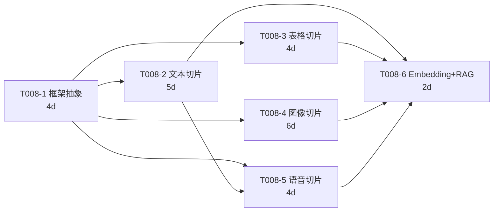
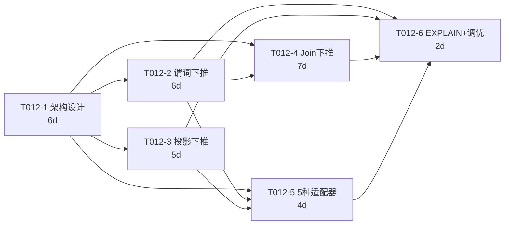
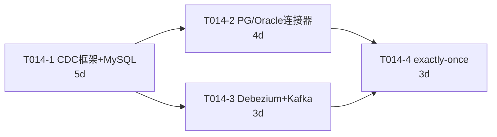
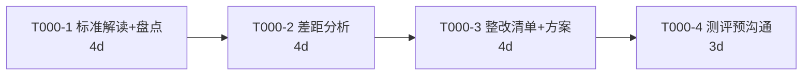
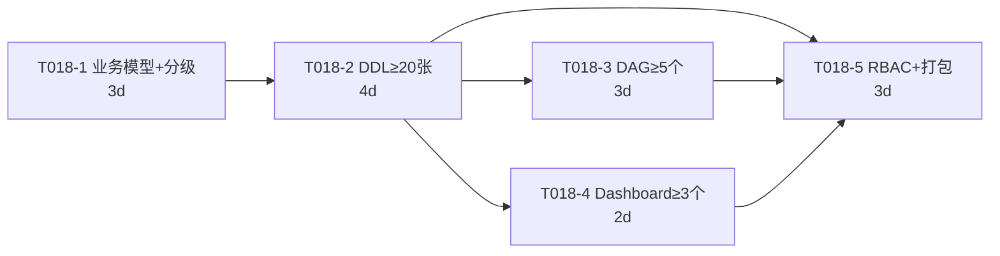
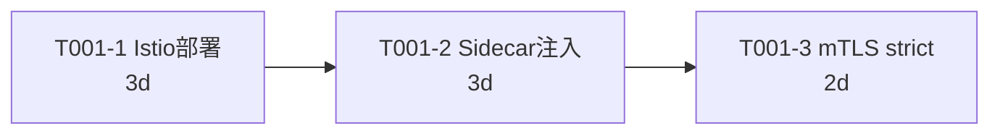
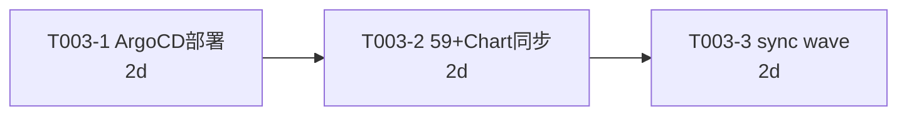
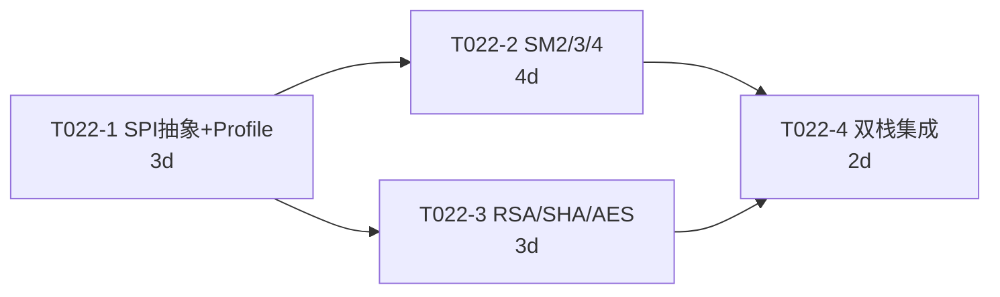
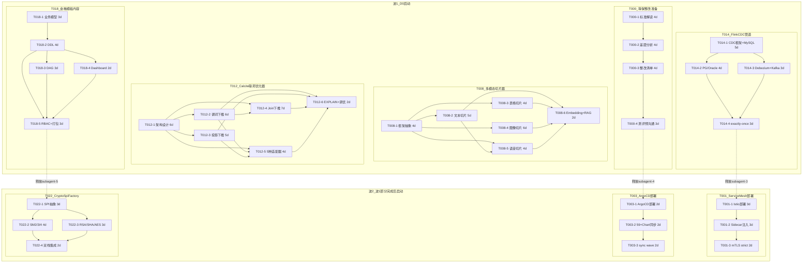
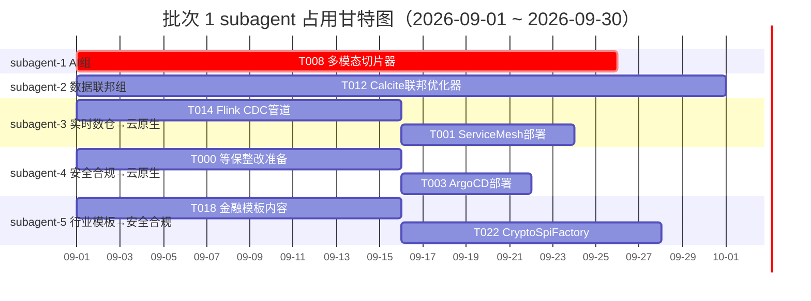

# 数擎大数据平台 V2.0 Phase 1a 批次 1 任务细化拆分

> 版本：v2.0.0-phase1a-batch1
> 文档状态：已拆分
> 编写日期：2026-08-06
> 文档负责人：Phase1a 启动前准备工程师 C
> 适用范围：Phase 1a 批次 1 的 8 个任务（T008/T012/T014/T000/T018/T001/T003/T022）子任务拆分
> 上游输入：
> - `Phase1/Phase1_详细执行计划.md`（§2 任务分配矩阵、§3.2 批次 1 排期）
> - `V2.0_PRD_产品需求文档.md`（11 项 P0 需求定义）
> - `V2.0_架构设计文档.md`（12 新增 + 17 增强模块）
> - `Phase0/T000a_Mock清零状态核查报告.md`（Mock 清零前置条件）
> - `Phase0/T000b_L4.5实现状态核查报告.md`（L4.5 实现深度前置）
> - `Phase0/T000c_V2.0AI模块新建声明.md`（AI 模块增强策略）
> 下游输出：批次 1 子任务分派、子任务依赖图、波次启动时序、里程碑检查点

---

## 第1章 拆分总览

### 1.1 拆分目标与原则

本文件将 Phase 1a 批次 1 的 8 个任务拆分为可独立跟踪、可独立验证的子任务，为 subagent 并行调度与每日进度跟踪提供粒度单元。

表：C-01 拆分原则参数说明表

| 原则编号 | 原则名称 | 具体要求 |
| --- | --- | --- |
| P1 | 子任务数量 | 每个任务拆分为 3~6 个子任务 |
| P2 | 子任务工时 | 单个子任务工时不超过 10 人天 |
| P3 | 依赖明确 | 子任务之间的依赖关系必须显式声明，无循环依赖 |
| P4 | 输出可验证 | 每个子任务产出物可独立检查（代码/文档/测试报告） |
| P5 | 验收覆盖 | 子任务验收标准合并后必须覆盖父任务的全部验收标准 |
| P6 | 角色单一 | 每个子任务主责角色明确，便于分派与问责 |
| P7 | 工时守恒 | 子任务工时之和等于父任务工时（无溢出无缺口） |

### 1.2 批次 1 任务拆分汇总

表：C-02 批次 1 任务拆分汇总对照表

| 任务 ID | 任务名称 | 父工时 | 子任务数 | 子任务工时合计 | 波次 | 负责组 | 主责人 |
| --- | --- | --- | --- | --- | --- | --- | --- |
| T008 | 多模态切片器 | 25d | 6 | 25d | 波 1 | AI 组 | Python 工程师 A |
| T012 | Calcite 联邦优化器 | 30d | 6 | 30d | 波 1 | 数据联邦组 | Java 工程师 C |
| T014 | Flink CDC 管道 | 15d | 4 | 15d | 波 1 | 实时数仓组 | Java 工程师 E |
| T000 | 等保整改准备 | 15d | 4 | 15d | 波 1 | 安全合规组 | 安全合规工程师 A |
| T018 | 金融模板内容 | 15d | 5 | 15d | 波 1 | 行业模板组 | Java 工程师 G |
| T001 | Service Mesh 部署 | 8d | 3 | 8d | 波 2 | 云原生组 | 云原生架构师 |
| T003 | ArgoCD 部署 | 6d | 3 | 6d | 波 2 | 云原生组 | DevOps 工程师 B |
| T022 | CryptoSpiFactory | 12d | 4 | 12d | 波 2 | 安全合规组 | Java 工程师 I |
| **合计** | **8 个任务** | **126d** | **35** | **126d** | **2 波** | **6 组** | — |

**拆分结论**：8 个任务共拆分为 35 个子任务，工时守恒（35 个子任务工时合计 126 人天 = 父任务工时合计 126 人天），每个子任务工时均 ≤10 人天，符合全部拆分原则。

---

## 第2章 波 1 任务子任务拆分

### 2.1 T008 多模态切片器（25d，6 个子任务）

**父任务信息**：
- 任务 ID：T008
- 任务名称：多模态切片器（文本/表格/图像/语音）
- 父工时：25 人天
- 依赖：T000b（L4.5 实现状态核查）
- 负责组：AI 组
- 主责人：Python 工程师 A，协作：Python 工程师 B
- 父验收标准：文本语义切片/表格行列切片/图像 OCR+视觉切片/语音 ASR 转文本切片；支持 ≥3 种 Embedding 模型
- 前置 Mock 清零：vector-engine Milvus SDK 集成（3-5 人日，T008 启动前 1 周完成，不计入 T008 工时）

#### 2.1.1 T008-1 切片器框架与多模态接口抽象

表：C-03 T008-1 子任务参数说明表

| 字段 | 内容 |
| --- | --- |
| 子任务 ID | T008-1 |
| 子任务名称 | 切片器框架与多模态接口抽象 |
| 预估工时 | 4 人天 |
| 依赖关系 | 无（T008 内首个子任务） |
| 输入 | T000b 核查报告、V2.0 架构设计文档（§AI 切片器章节）、vector-engine Milvus SDK 已集成 |
| 输出 | 切片器 Python 模块骨架（`chunker/` 包）、`BaseChunker` 抽象基类、模态注册机制、配置 Schema |
| 验收标准 | 1）`BaseChunker` 定义统一 `chunk(content, config) -> List[Chunk]` 接口；2）模态注册机制支持运行时动态注册；3）配置 Schema 通过 pydantic 校验；4）单元测试覆盖率 ≥80% |
| 负责角色 | Python 工程师 A（主责） |

#### 2.1.2 T008-2 文本语义切片实现

表：C-04 T008-2 子任务参数说明表

| 字段 | 内容 |
| --- | --- |
| 子任务 ID | T008-2 |
| 子任务名称 | 文本语义切片实现 |
| 预估工时 | 5 人天 |
| 依赖关系 | T008-1 |
| 输入 | T008-1 输出的切片器框架、Embedding 模型 API（bge-large） |
| 输出 | `TextChunker` 实现类、语义边界识别算法、滑动窗口策略、token 计数器 |
| 验收标准 | 1）语义切片基于 Embedding 相似度识别段落边界，相邻切片语义连贯性 cos 相似度 ≥0.7；2）支持滑动窗口（窗口大小可配，重叠率 10%~30%）；3）token 计数支持 GPT-4/tiktoken 与 bge tokenizer；4）长文档（≥10 万字）切片耗时 P95 ≤3s；5）单元测试覆盖短文本/长文档/多语言场景 |
| 负责角色 | Python 工程师 A（主责） |

#### 2.1.3 T008-3 表格行列切片实现

表：C-05 T008-3 子任务参数说明表

| 字段 | 内容 |
| --- | --- |
| 子任务 ID | T008-3 |
| 子任务名称 | 表格行列切片实现 |
| 预估工时 | 4 人天 |
| 依赖关系 | T008-1 |
| 输入 | T008-1 输出的切片器框架、pandas/openpyxl 表格解析库 |
| 输出 | `TableChunker` 实现类、表头识别算法、行分组策略、跨页表合并逻辑 |
| 验收标准 | 1）表头识别准确率 ≥95%（含合并单元格表头）；2）行分组按语义相似度聚类，同组行业务含义一致；3）跨页表自动合并（表头一致即合并）；4）大表（≥10 万行）切片耗时 P95 ≤5s；5）单元测试覆盖单页表/跨页表/合并单元格场景 |
| 负责角色 | Python 工程师 B（主责） |

#### 2.1.4 T008-4 图像切片（OCR + 视觉版面分析）

表：C-06 T008-4 子任务参数说明表

| 字段 | 内容 |
| --- | --- |
| 子任务 ID | T008-4 |
| 子任务名称 | 图像切片（OCR + 视觉版面分析） |
| 预估工时 | 6 人天 |
| 依赖关系 | T008-1 |
| 输入 | T008-1 输出的切片器框架、PaddleOCR/Tesseract OCR 引擎、版面分析模型（LayoutLMv3） |
| 输出 | `ImageChunker` 实现类、OCR 集成模块、版面分析模块、图表/图片/公式分类器 |
| 验收标准 | 1）OCR 文本识别准确率 ≥90%（清晰印刷体）；2）版面分析识别文本块/标题/表格/图片/公式 5 类区域，准确率 ≥85%；3）图表区域提取后单独切片并保留原图引用；4）单页图像切片耗时 P95 ≤2s；5）单元测试覆盖扫描件/截图/混合版面场景 |
| 负责角色 | Python 工程师 A（主责） |

#### 2.1.5 T008-5 语音切片（ASR 转文本）

表：C-07 T008-5 子任务参数说明表

| 字段 | 内容 |
| --- | --- |
| 子任务 ID | T008-5 |
| 子任务名称 | 语音切片（ASR 转文本） |
| 预估工时 | 4 人天 |
| 依赖关系 | T008-1、T008-2 |
| 输入 | T008-1 输出的切片器框架、T008-2 文本切片器（ASR 输出文本复用文本切片）、Whisper/Paraformer ASR 引擎 |
| 输出 | `AudioChunker` 实现类、ASR 集成模块、时间戳对齐逻辑、说话人分离（diarization） |
| 验收标准 | 1）ASR 转文本准确率 ≥85%（中文普通话）；2）时间戳对齐到词级，切片保留时间戳元数据；3）说话人分离支持 ≥2 说话人，分离准确率 ≥80%；4）长音频（≥30 分钟）切片耗时 P95 ≤10s（ASR 占主要）；5）单元测试覆盖短音频/长音频/多说话人场景 |
| 负责角色 | Python 工程师 B（主责） |

#### 2.1.6 T008-6 Embedding 模型适配与 RAG 管道集成

表：C-08 T008-6 子任务参数说明表

| 字段 | 内容 |
| --- | --- |
| 子任务 ID | T008-6 |
| 子任务名称 | Embedding 模型适配与 RAG 管道集成 |
| 预估工时 | 2 人天 |
| 依赖关系 | T008-2、T008-3、T008-4、T008-5 |
| 输入 | T008-2~T008-5 四模态切片器输出、bge-large/m3e/openai Embedding 模型 API、knowledge-engine RAG 管道接口 |
| 输出 | Embedding 适配器（3 种模型）、RAG 管道集成代码、knowledge-engine 切片写入接口、端到端集成测试 |
| 验收标准 | 1）支持 bge-large-zh、m3e-base、openai text-embedding-3-small 三种 Embedding 模型，可通过配置切换；2）四模态切片结果均可写入 knowledge-engine 并经 RAG 管道检索召回；3）端到端测试：原始文档 → 切片 → Embedding → Milvus 入库 → 检索召回，召回准确率 ≥80%；4）集成测试覆盖四模态各 1 个样例 |
| 负责角色 | Python 工程师 A（主责） |

#### 2.1.7 T008 子任务依赖关系

**T008 里程碑检查点**：
- D5：T008-1 完成，框架可用，四模态并行启动
- D12：T008-2/T008-3 完成，文本/表格切片可用
- D18：T008-4/T008-5 完成，四模态切片全部可用
- D25：T008-6 完成，Embedding 适配 + RAG 管道集成，T008 父任务验收

### 2.2 T012 Calcite 联邦优化器（30d，6 个子任务）

**父任务信息**：
- 任务 ID：T012
- 任务名称：Calcite 联邦优化器与下推规则
- 父工时：30 人天
- 依赖：T000a（Mock 清零状态核查，sql-gateway/catalog 已清零）
- 负责组：数据联邦组
- 主责人：Java 工程师 C，协作：首席架构师
- 父验收标准：覆盖 ≥5 种数据源（Iceberg/Doris/Trino/IoTDB/ES）；三种下推规则下推率 ≥70%；联邦查询 P95 ≤10s

#### 2.2.1 T012-1 Calcite 优化器架构设计与适配器框架

表：C-09 T012-1 子任务参数说明表

| 字段 | 内容 |
| --- | --- |
| 子任务 ID | T012-1 |
| 子任务名称 | Calcite 优化器架构设计与适配器框架 |
| 预估工时 | 6 人天 |
| 依赖关系 | 无（T012 内首个子任务） |
| 输入 | T000a 核查报告（sql-gateway/catalog 已清零）、Apache Calcite 1.36 文档、V2.0 架构设计（§数据联邦章节） |
| 输出 | Calcite 优化器集成模块、`BaseAdapter` 抽象接口、RelNode 扩展类、5 种数据源适配器接口定义、优化器配置 Schema |
| 验收标准 | 1）Calcite 优化器集成到 sql-gateway，可通过 `EXPLAIN` 输出 RelNode 树；2）`BaseAdapter` 定义统一 `toRel()/pushDown()/costEstimate()` 接口；3）5 种数据源（Iceberg/Doris/Trino/IoTDB/ES）适配器接口定义完整；4）架构设计文档经首席架构师评审通过；5）单元测试覆盖率 ≥80% |
| 负责角色 | Java 工程师 C（主责），首席架构师（架构评审） |

#### 2.2.2 T012-2 谓词下推规则实现

表：C-10 T012-2 子任务参数说明表

| 字段 | 内容 |
| --- | --- |
| 子任务 ID | T012-2 |
| 子任务名称 | 谓词下推规则实现 |
| 预估工时 | 6 人天 |
| 依赖关系 | T012-1 |
| 输入 | T012-1 输出的适配器框架、Calcite `FilterPushDownRule` 基类 |
| 输出 | `PredicatePushDownRule` 实现、谓词改写器、下推率统计模块、5 种数据源谓词下推适配 |
| 验收标准 | 1）谓词下推规则覆盖等值/范围/IN/LIKE 四类谓词；2）不支持的谓词自动保留在上层不强行下推；3）下推率统计可输出（下推谓词数/总谓词数）；4）5 种数据源各至少 10 个测试用例，下推率 ≥70%；5）单元测试覆盖率 ≥85% |
| 负责角色 | Java 工程师 C（主责） |

#### 2.2.3 T012-3 投影下推规则实现

表：C-11 T012-3 子任务参数说明表

| 字段 | 内容 |
| --- | --- |
| 子任务 ID | T012-3 |
| 子任务名称 | 投影下推规则实现 |
| 预估工时 | 5 人天 |
| 依赖关系 | T012-1 |
| 输入 | T012-1 输出的适配器框架、Calcite `ProjectPushDownRule` 基类 |
| 输出 | `ProjectPushDownRule` 实现、列裁剪器、投影消除优化、5 种数据源投影下推适配 |
| 验收标准 | 1）投影下推只下推查询实际引用的列，消除冗余列读取；2）嵌套投影自动合并简化；3）5 种数据源各至少 8 个测试用例，下推率 ≥70%；4）列裁剪后数据传输量减少 ≥50%（典型场景）；5）单元测试覆盖率 ≥85% |
| 负责角色 | Java 工程师 C（主责） |

#### 2.2.4 T012-4 Join 下推规则实现

表：C-12 T012-4 子任务参数说明表

| 字段 | 内容 |
| --- | --- |
| 子任务 ID | T012-4 |
| 子任务名称 | Join 下推规则实现 |
| 预估工时 | 7 人天 |
| 依赖关系 | T012-1、T012-2 |
| 输入 | T012-1 输出的适配器框架、T012-2 谓词下推规则（Join 下推需配合谓词下推）、Calcite `JoinPushDownRule` 基类 |
| 输出 | `JoinPushDownRule` 实现、跨源 Join 识别器、BroadcastJoin 策略、Join 重排序优化 |
| 验收标准 | 1）同源 Join 自动下推到数据源执行；2）跨源 Join 识别后保留在联邦层，采用 BroadcastJoin 或 ShuffleJoin 策略；3）小表（<100MB）自动 Broadcast，大表 ShuffleJoin；4）Join 重排序基于 Cost 估算选择最优顺序；5）5 种数据源各至少 5 个 Join 测试用例，下推率 ≥70%；6）单元测试覆盖率 ≥85% |
| 负责角色 | Java 工程师 C（主责），首席架构师（策略评审） |

#### 2.2.5 T012-5 5 种数据源适配器实现

表：C-13 T012-5 子任务参数说明表

| 字段 | 内容 |
| --- | --- |
| 子任务 ID | T012-5 |
| 子任务名称 | 5 种数据源适配器实现 |
| 预估工时 | 4 人天 |
| 依赖关系 | T012-1、T012-2、T012-3 |
| 输入 | T012-1 适配器接口、T012-2 谓词下推、T012-3 投影下推、5 种数据源 JDBC/REST 客户端 |
| 输出 | Iceberg/Doris/Trino/IoTDB/ES 5 种适配器实现、各适配器方言转换、各适配器 Cost 估算 |
| 验收标准 | 1）5 种适配器均实现 `toRel()/pushDown()/costEstimate()` 接口；2）各适配器方言转换正确（如 ES 的 DSL、IoTDB 的时序 SQL）；3）各适配器 Cost 估算基于表统计信息（行数/列基数）；4）5 种适配器集成测试通过（连接真实数据源执行查询）；5）适配器配置支持 YAML 声明式注册 |
| 负责角色 | Java 工程师 C（主责） |

#### 2.2.6 T012-6 EXPLAIN 可视化与性能调优

表：C-14 T012-6 子任务参数说明表

| 字段 | 内容 |
| --- | --- |
| 子任务 ID | T012-6 |
| 子任务名称 | EXPLAIN 可视化与性能调优 |
| 预估工时 | 2 人天 |
| 依赖关系 | T012-2、T012-3、T012-4、T012-5 |
| 输入 | T012-2~T012-5 输出的下推规则与适配器、Calcite RelNode 树 |
| 输出 | EXPLAIN 可视化模块（RelNode 树 JSON 输出 + 前端友好格式）、性能基准测试套件、P95 ≤10s 调优报告 |
| 验收标准 | 1）`EXPLAIN [SQL]` 输出 RelNode 树 JSON，包含下推标注（已下推/未下推及原因）；2）前端友好格式支持树形展示与高亮下推节点；3）性能基准测试覆盖 5 种数据源各 10 个典型查询；4）联邦查询 P95 ≤10s（跨 2 源 Join，单表 ≤1 亿行）；5）调优报告记录瓶颈与优化建议 |
| 责责角色 | Java 工程师 C（主责） |

#### 2.2.7 T012 子任务依赖关系

**T012 里程碑检查点**：
- D6：T012-1 完成，架构与接口定义完成
- D14：T012-2/T012-3 完成，谓词/投影下推可用
- D21：T012-4 完成，Join 下推可用
- D25：T012-5 完成，5 种适配器实现完成
- D30：T012-6 完成，EXPLAIN 可视化 + P95 ≤10s 验证，T012 父任务验收

### 2.3 T014 Flink CDC 管道（15d，4 个子任务）

**父任务信息**：
- 任务 ID：T014
- 任务名称：Flink CDC 管道开发
- 父工时：15 人天
- 依赖：T000a（Mock 清零状态核查，encaps-layer/sql-gateway 部分清零）
- 负责组：实时数仓组
- 主责人：Java 工程师 E，协作：DevOps 工程师 C
- 父验收标准：CDC 支持 MySQL/PostgreSQL/Oracle；Debezium 格式正确；exactly-once 语义
- 前置 Mock 清零：encaps-layer K8S_MOCK_ENABLED 默认改 false（0.5 人日，T014 启动前完成）

#### 2.3.1 T014-1 Flink CDC 框架与 MySQL Source 连接器

表：C-15 T014-1 子任务参数说明表

| 字段 | 内容 |
| --- | --- |
| 子任务 ID | T014-1 |
| 子任务名称 | Flink CDC 框架与 MySQL Source 连接器 |
| 预估工时 | 5 人天 |
| 依赖关系 | 无（T014 内首个子任务） |
| 输入 | T000a 核查报告、Flink CDC 3.0 文档、Debezium MySQL Connector 文档、Flink 1.18 集群配置 |
| 输出 | Flink CDC 框架模块、MySQL Binlog Source 连接器、Source 配置 Schema、启动/停止脚本 |
| 验收标准 | 1）MySQL Source 连接器读取 Binlog 准确无丢失（含 INSERT/UPDATE/DELETE）；2）支持全量初始化 + 增量 Binlog 读取；3）Source 配置支持 YAML 声明式（含 server-id/database/table 过滤）；4）连接器可部署到 Flink 1.18 集群运行；5）单元测试覆盖率 ≥80% |
| 负责角色 | Java 工程师 E（主责） |

#### 2.3.2 T014-2 PostgreSQL/Oracle Source 连接器

表：C-16 T014-2 子任务参数说明表

| 字段 | 内容 |
| --- | --- |
| 子任务 ID | T014-2 |
| 子任务名称 | PostgreSQL/Oracle Source 连接器 |
| 预估工时 | 4 人天 |
| 依赖关系 | T014-1 |
| 输入 | T014-1 输出的 CDC 框架、PostgreSQL Logical Replication 文档、Oracle LogMiner 文档 |
| 输出 | PostgreSQL Source 连接器（基于 Logical Replication）、Oracle Source 连接器（基于 LogMiner）、连接器配置适配 |
| 验收标准 | 1）PostgreSQL Source 基于 Logical Replication Slot 读取变更，支持 INSERT/UPDATE/DELETE；2）Oracle Source 基于 LogMiner 读取 Redo Log，支持 INSERT/UPDATE/DELETE；3）两种连接器复用 T014-1 框架，配置方式统一；4）连接器可部署到 Flink 1.18 集群运行；5）单元测试覆盖率 ≥80% |
| 责责角色 | Java 工程师 E（主责） |

#### 2.3.3 T014-3 Debezium 格式处理与 Kafka 中转

表：C-17 T014-3 子任务参数说明表

| 字段 | 内容 |
| --- | --- |
| 子任务 ID | T014-3 |
| 子任务名称 | Debezium 格式处理与 Kafka 中转 |
| 预估工时 | 3 人天 |
| 依赖关系 | T014-1 |
| 输入 | T014-1 输出的 CDC 框架、Debezium JSON Schema、Kafka 3.x 集群配置 |
| 输出 | Debezium Deserializer 模块、Schema Registry 集成、Kafka Topic 管理器、Topic 命名策略 |
| 验收标准 | 1）Debezium JSON 格式正确（含 `before/after/op/source/ts_ms` 字段）；2）Schema Registry 注册表 Schema，支持 Schema 演化；3）Kafka Topic 命名策略：`<db>.<schema>.<table>`，支持多租户隔离；4）Kafka 中转吞吐 ≥10000 records/s（单分区）；5）集成测试验证 MySQL → Kafka 端到端数据一致 |
| 负责角色 | Java 工程师 E（主责），DevOps 工程师 C（Kafka 集群配置） |

#### 2.3.4 T014-4 exactly-once 语义保障与端到端测试

表：C-18 T014-4 子任务参数说明表

| 字段 | 内容 |
| --- | --- |
| 子任务 ID | T014-4 |
| 子任务名称 | exactly-once 语义保障与端到端测试 |
| 预估工时 | 3 人天 |
| 依赖关系 | T014-2、T014-3 |
| 输入 | T014-2 三种 Source 连接器、T014-3 Kafka 中转、Flink Checkpoint 配置 |
| 输出 | 两阶段提交（2PC）Sink 适配、Checkpoint 配置模板、端到端测试套件、故障恢复测试 |
| 验收标准 | 1）Flink Checkpoint 启用，间隔 10s，exactly-once 语义生效；2）Sink 支持 2PC（如 Kafka transactional producer、Iceberg commit）；3）故障恢复测试：TaskManager 故障重启后数据无重复无丢失；4）端到端测试覆盖 MySQL/PG/Oracle 各 1 个样例，源端变更与 Sink 端一致；5）测试报告输出 exactly-once 验证结果 |
| 责责角色 | Java 工程师 E（主责） |

#### 2.3.5 T014 子任务依赖关系

**T014 里程碑检查点**：
- D5：T014-1 完成，CDC 框架 + MySQL Source 可用
- D9：T014-2 完成，三种 Source 连接器全部可用
- D8：T014-3 完成，Debezium + Kafka 中转可用
- D15：T014-4 完成，exactly-once 保障 + 端到端测试，T014 父任务验收

### 2.4 T000 等保整改准备（15d，4 个子任务）

**父任务信息**：
- 任务 ID：T000
- 任务名称：等保三级合规整改准备
- 父工时：15 人天
- 依赖：T000a（Mock 清零）、T000b（L4.5 实现深度）、T000c（AI 模块新建声明）
- 负责组：安全合规组
- 主责人：安全合规工程师 A，协作：首席架构师
- 父验收标准：差距分析完成；整改清单明确；方案评审通过；测评机构预沟通启动

#### 2.4.1 T000-1 等保三级标准解读与现状盘点

表：C-19 T000-1 子任务参数说明表

| 字段 | 内容 |
| --- | --- |
| 子任务 ID | T000-1 |
| 子任务名称 | 等保三级标准解读与现状盘点 |
| 预估工时 | 4 人天 |
| 依赖关系 | 无（T000 内首个子任务） |
| 输入 | GB/T 22239-2019《信息安全等级保护基本要求》、T000a/T000b/T000c 三份核查报告、V2.0 架构设计文档 |
| 输出 | 等保三级标准解读文档（6 类控制项逐条解读）、平台现状盘点表（22 组件 + 49 模块）、控制项与模块映射矩阵 |
| 验收标准 | 1）GB/T 22239-2019 6 类控制项（物理/网络/主机/应用/数据/管理）逐条解读完整；2）平台现状盘点覆盖 22 组件 + 49 模块的安全相关配置；3）控制项与模块映射矩阵无遗漏（每个控制项至少映射到 1 个模块或标注"不适用"并说明理由）；4）标准解读文档经首席架构师初审通过 |
| 负责角色 | 安全合规工程师 A（主责） |

#### 2.4.2 T000-2 差距分析报告编制

表：C-20 T000-2 子任务参数说明表

| 字段 | 内容 |
| --- | --- |
| 子任务 ID | T000-2 |
| 子任务名称 | 差距分析报告编制 |
| 预估工时 | 4 人天 |
| 依赖关系 | T000-1 |
| 输入 | T000-1 输出的标准解读、现状盘点、映射矩阵 |
| 输出 | 差距分析报告（逐控制项差距识别、风险等级评定、证据清单） |
| 验收标准 | 1）逐控制项识别"已满足/部分满足/未满足"三态，附证据；2）风险等级评定（高/中/低）基于差距严重度与业务影响；3）证据清单包含配置截图/代码片段/测试报告引用；4）差距分析报告经首席架构师复审通过；5）报告覆盖 6 类控制项 100% 无遗漏 |
| 责责角色 | 安全合规工程师 A（主责），首席架构师（复审） |

#### 2.4.3 T000-3 整改清单与整改方案制定

表：C-21 T000-3 子任务参数说明表

| 字段 | 内容 |
| --- | --- |
| 子任务 ID | T000-3 |
| 子任务名称 | 整改清单与整改方案制定 |
| 预估工时 | 4 人天 |
| 依赖关系 | T000-2 |
| 输入 | T000-2 输出的差距分析报告、V2.0 实施计划（Phase 1 任务排期） |
| 输出 | 整改项清单（含优先级/工时估算/责任人/前置依赖）、合规整改准备方案（含技术与管理整改措施） |
| 验收标准 | 1）整改项清单覆盖差距分析报告全部"部分满足/未满足"项；2）每项整改标注优先级（P0/P1/P2）、工时估算、责任人、前置依赖；3）整改方案区分技术整改（代码/配置）与管理整改（制度/流程）；4）整改工时合计与 Phase 1 T020（40d）+ T021（12d）预算匹配；5）整改方案经首席架构师终审通过 |
| 责责角色 | 安全合规工程师 A（主责），首席架构师（终审） |

#### 2.4.4 T000-4 测评机构预沟通与方案评审

表：C-22 T000-4 子任务参数说明表

| 字段 | 内容 |
| --- | --- |
| 子任务 ID | T000-4 |
| 子任务名称 | 测评机构预沟通与方案评审 |
| 预估工时 | 3 人天 |
| 依赖关系 | T000-3 |
| 输入 | T000-3 输出的整改清单与方案、具备等保三级测评资质的机构名单 |
| 输出 | 测评机构候选名单（≥3 家）、预沟通会议纪要、方案内部评审纪要、测评排期初步意向 |
| 验收标准 | 1）筛选 ≥3 家具备等保三级测评资质的机构，附资质证明；2）预沟通会议覆盖至少 2 家机构，会议纪要完整；3）方案内部评审由首席架构师 + 安全合规组 + 业务方代表参加，评审纪要含修改意见；4）测评排期初步意向明确（含预计入场时间与测评周期）；5）预沟通启动状态可量化（已联系机构数/已回复机构数/已签约意向数） |
| 责责角色 | 安全合规工程师 A（主责），首席架构师（评审主持） |

#### 2.4.5 T000 子任务依赖关系

**T000 里程碑检查点**：
- D4：T000-1 完成，标准解读 + 现状盘点完成
- D8：T000-2 完成，差距分析报告完成
- D12：T000-3 完成，整改清单 + 方案完成
- D15：T000-4 完成，测评机构预沟通启动，T000 父任务验收

### 2.5 T018 金融模板内容（15d，5 个子任务）

**父任务信息**：
- 任务 ID：T018
- 任务名称：金融模板 DDL/DAG/Dashboard 内容
- 父工时：15 人天
- 依赖：T000b（L4.5 实现状态核查，tag-engine/industry-templates 部分清零）
- 负责组：行业模板组
- 主责人：Java 工程师 G，协作：领域专家（金融，兼职）
- 父验收标准：DDL ≥20 张、DAG ≥5 个、Dashboard ≥3 个；RBAC 含风控员/合规员/客户经理；符合金融合规数据分级与脱敏预置
- 前置 Mock 清零：tag-engine 切换 doris 配置（1-2 人日）、industry-templates 实现 helm install（3-5 人日），T018 启动前完成

#### 2.5.1 T018-1 金融业务模型设计与数据分级

表：C-23 T018-1 子任务参数说明表

| 字段 | 内容 |
| --- | --- |
| 子任务 ID | T018-1 |
| 子任务名称 | 金融业务模型设计与数据分级 |
| 预估工时 | 3 人天 |
| 依赖关系 | 无（T018 内首个子任务） |
| 输入 | 金融业务知识（风控/客户/账户/交易/信贷 5 业务域）、JR/T 0197《金融数据安全 数据安全分级指南》 |
| 输出 | 金融业务模型设计文档（5 业务域 ER 图）、数据分级标准（L1~L4 四级）、脱敏规则预置表 |
| 验收标准 | 1）5 业务域（风控/客户/账户/交易/信贷）ER 图完整，含实体/关系/基数；2）数据分级覆盖 L1（公开）/L2（内部）/L3（敏感）/L4（高敏感）四级，分级标准符合 JR/T 0197；3）脱敏规则预置覆盖 L3/L4 数据（如手机号脱敏、身份证脱敏、金额脱敏）；4）业务模型设计经金融领域专家评审通过 |
| 责责角色 | Java 工程师 G（主责），领域专家-金融（业务评审） |

#### 2.5.2 T018-2 DDL 表设计（≥20 张）

表：C-24 T018-2 子任务参数说明表

| 字段 | 内容 |
| --- | --- |
| 子任务 ID | T018-2 |
| 子任务名称 | DDL 表设计（≥20 张） |
| 预估工时 | 4 人天 |
| 依赖关系 | T018-1 |
| 输入 | T018-1 输出的业务模型设计、数据分级标准 |
| 输出 | ≥20 张 DDL 脚本（SQL 文件），覆盖风控/客户/账户/交易/信贷 5 业务域，含表注释/字段注释/数据分级标注 |
| 验收标准 | 1）DDL 数量 ≥20 张，覆盖 5 业务域（每域 ≥3 张）；2）每张表含表注释、字段注释、数据分级标注（L1~L4）；3）DDL 语法兼容 Doris/Iceberg（含分区策略、主键定义）；4）DDL 经 `sql-gateway` 执行验证无语法错误；5）表命名符合金融业务命名规范（如 `risk_loan_application`） |
| 责责角色 | Java 工程师 G（主责） |

#### 2.5.3 T018-3 DAG 调度作业设计（≥5 个）

表：C-25 T018-3 子任务参数说明表

| 字段 | 内容 |
| --- | --- |
| 子任务 ID | T018-3 |
| 子任务名称 | DAG 调度作业设计（≥5 个） |
| 预估工时 | 3 人天 |
| 依赖关系 | T018-2 |
| 输入 | T018-2 输出的 DDL 表、DolphinScheduler DAG 定义格式 |
| 输出 | ≥5 个 DAG 定义文件（JSON/YAML），含 ETL 作业/依赖关系/调度策略/失败重试 |
| 验收标准 | 1）DAG 数量 ≥5 个，覆盖典型金融 ETL 场景（如风控特征计算/客户标签更新/账户日终清算/交易反洗钱/信贷评分）；2）每个 DAG 含依赖关系（上游失败下游不执行）、调度策略（cron 表达式）、失败重试（次数+间隔）；3）DAG 可导入 DolphinScheduler 验证语法正确；4）DAG 节点引用的 SQL/脚本路径有效；5）DAG 命名符合规范（如 `risk_feature_daily`） |
| 责责角色 | Java 工程师 G（主责） |

#### 2.5.4 T018-4 Dashboard 仪表盘设计（≥3 个）

表：C-26 T018-4 子任务参数说明表

| 字段 | 内容 |
| --- | --- |
| 子任务 ID | T018-4 |
| 子任务名称 | Dashboard 仪表盘设计（≥3 个） |
| 预估工时 | 2 人天 |
| 依赖关系 | T018-2 |
| 输入 | T018-2 输出的 DDL 表、Superset Dashboard JSON 格式 |
| 输出 | ≥3 个 Dashboard 定义文件（Superset JSON），含图表/布局/筛选器/数据集 |
| 验收标准 | 1）Dashboard 数量 ≥3 个，覆盖风控/客户/交易 3 个业务视角；2）每个 Dashboard 含 ≥5 个图表（柱/线/饼/表格/指标卡）；3）Dashboard 含全局筛选器（时间范围/业务条线/机构）；4）Dashboard 可导入 Superset 验证渲染正确；5）Dashboard 数据集引用的表为 T018-2 定义的 DDL |
| 责责角色 | Java 工程师 G（主责） |

#### 2.5.5 T018-5 RBAC 角色权限定义与模板打包

表：C-27 T018-5 子任务参数说明表

| 字段 | 内容 |
| --- | --- |
| 子任务 ID | T018-5 |
| 子任务名称 | RBAC 角色权限定义与模板打包 |
| 预估工时 | 3 人天 |
| 依赖关系 | T018-2、T018-3、T018-4 |
| 输入 | T018-2 DDL、T018-3 DAG、T018-4 Dashboard、Keycloak RBAC 配置格式 |
| 输出 | RBAC 定义文件（含风控员/合规员/客户经理 3 角色）、模板元数据文件、金融模板打包（tar.gz） |
| 验收标准 | 1）RBAC 定义含风控员/合规员/客户经理 3 角色，每角色定义可访问表/DAG/Dashboard 权限；2）权限遵循最小权限原则（如客户经理不可访问风控模型表）；3）模板元数据含模板名/版本/作者/依赖组件清单；4）模板打包为 tar.gz，解压后目录结构符合 industry-templates 规范；5）打包模板可被 `helm install finance-template` 引用（为 T019 做准备） |
| 责责角色 | Java 工程师 G（主责） |

#### 2.5.6 T018 子任务依赖关系

**T018 里程碑检查点**：
- D3：T018-1 完成，业务模型 + 数据分级完成
- D7：T018-2 完成，≥20 张 DDL 设计完成
- D10：T018-3/T018-4 完成，DAG + Dashboard 完成
- D15：T018-5 完成，RBAC + 模板打包，T018 父任务验收

---

## 第3章 波 2 任务子任务拆分

### 3.1 T001 Service Mesh 部署（8d，3 个子任务）

**父任务信息**：
- 任务 ID：T001
- 任务名称：Service Mesh 控制面部署与 Sidecar 注入
- 父工时：8 人天
- 依赖：T000a（Mock 清零状态核查，encaps-layer 部分清零）
- 负责组：云原生组
- 主责人：云原生架构师，协作：DevOps 工程师 A
- 父验收标准：Istio 部署到 SKE；21 个自研组件默认注入 Envoy sidecar；mTLS strict 生效
- 波 2 启动条件：T014 完成后释放 subagent-3（约 D15）

#### 3.1.1 T001-1 Istio 控制面部署与 Helm Chart 定制

表：C-28 T001-1 子任务参数说明表

| 字段 | 内容 |
| --- | --- |
| 子任务 ID | T001-1 |
| 子任务名称 | Istio 控制面部署与 Helm Chart 定制 |
| 预估工时 | 3 人天 |
| 依赖关系 | 无（T001 内首个子任务） |
| 输入 | T000a 核查报告、Istio 1.20+ Helm Chart、SKE 集群配置（kubeadm-config.wsl2.yaml） |
| 输出 | Istio Helm Chart 定制 values、istiod 部署 manifests、控制面调优配置（Pilot/Envoy 资源） |
| 验收标准 | 1）Istio 1.20+ 部署到 SKE 集群，istiod Pod Running；2）Helm Chart values 兼容 SKE（kubeadm 配置、CNI 兼容）；3）控制面资源调优（Pilot CPU/Memory Request/Limit 合理）；4）Istio 版本与 K8s 1.28+ 兼容性验证通过；5）部署文档记录回滚步骤 |
| 责责角色 | 云原生架构师（主责） |

#### 3.1.2 T001-2 Sidecar 注入策略与 21 组件适配

表：C-29 T001-2 子任务参数说明表

| 字段 | 内容 |
| --- | --- |
| 子任务 ID | T001-2 |
| 子任务名称 | Sidecar 注入策略与 21 组件适配 |
| 预估工时 | 3 人天 |
| 依赖关系 | T001-1 |
| 输入 | T001-1 输出的 Istio 控制面、21 个自研组件 Deployment manifests |
| 输出 | namespace 级 sidecar 注入策略、21 组件 sidecar 配置（资源/端口/协议）、注入排除策略（如 hostNetwork Pod） |
| 验收标准 | 1）21 个自研组件 namespace 默认启用 sidecar 注入（`istio-injection=enabled`）；2）每个组件 sidecar 资源配额合理（CPU/Memory 不超过主容器 50%）；3）hostNetwork Pod（如 kube-proxy）正确排除注入；4）21 组件 Pod 全部 Running 且 sidecar 就绪；5）注入后服务间通信正常（无 503/504） |
| 责责角色 | 云原生架构师（主责），DevOps 工程师 A（组件适配） |

#### 3.1.3 T001-3 mTLS strict 配置与端到端验证

表：C-30 T001-3 子任务参数说明表

| 字段 | 内容 |
| --- | --- |
| 子任务 ID | T001-3 |
| 子任务名称 | mTLS strict 配置与端到端验证 |
| 预估工时 | 2 人天 |
| 依赖关系 | T001-2 |
| 输入 | T001-2 输出的 sidecar 注入策略 |
| 输出 | PeerAuthentication strict 配置（全局 + namespace 级）、DestinationRule mTLS 配置、端到端验证报告 |
| 验收标准 | 1）全局 PeerAuthentication strict 生效，所有服务间通信强制 mTLS；2）DestinationRule 显式声明 mTLS mode STRICT；3）明文通信被拒绝（验证 plaintext 请求返回 503）；4）mTLS 证书轮换不影响服务可用性（证书有效期 ≥24h）；5）端到端验证报告覆盖 21 组件两两通信采样 |
| 责责角色 | 云原生架构师（主责） |

#### 3.1.4 T001 子任务依赖关系

**T001 里程碑检查点**：
- D3：T001-1 完成，Istio 控制面就绪
- D6：T001-2 完成，21 组件 sidecar 注入完成
- D8：T001-3 完成，mTLS strict 生效，T001 父任务验收

### 3.2 T003 ArgoCD 部署（6d，3 个子任务）

**父任务信息**：
- 任务 ID：T003
- 任务名称：ArgoCD 部署与 Chart 纯管
- 父工时：6 人天
- 依赖：无（T003 无前置任务依赖，但波 2 启动需等 subagent 释放）
- 负责组：云原生组
- 主责人：DevOps 工程师 B，协作：Java 工程师 A
- 父验收标准：ArgoCD 部署；59+ Helm Chart Git 同步；sync wave 顺序正确；V1.0 既有 Chart CRD/Namespace/Chart 资源已标注
- 波 2 启动条件：T000 完成后释放 subagent-4（约 D15）

#### 3.2.1 T003-1 ArgoCD 部署与 Helm Chart 定制

表：C-31 T003-1 子任务参数说明表

| 字段 | 内容 |
| --- | --- |
| 子任务 ID | T003-1 |
| 子任务名称 | ArgoCD 部署与 Helm Chart 定制 |
| 预估工时 | 2 人天 |
| 依赖关系 | 无（T003 内首个子任务） |
| 输入 | ArgoCD 2.7+ Helm Chart、SKE 集群配置、Keycloak SSO 配置 |
| 输出 | ArgoCD Helm Chart 定制 values、ArgoCD 部署 manifests、SSO 集成配置（Keycloak OIDC） |
| 验收标准 | 1）ArgoCD 2.7+ 部署到 SKE 集群，argocd-server Pod Running；2）Helm Chart values 兼容 SKE；3）SSO 集成 Keycloak，登录跳转 OIDC 正常；4）ArgoCD UI 可访问，admin 权限受控；5）部署文档记录回滚步骤 |
| 责责角色 | DevOps 工程师 B（主责） |

#### 3.2.2 T003-2 59+ Helm Chart Git 同步与 Application manifests

表：C-32 T003-2 子任务参数说明表

| 字段 | 内容 |
| --- | --- |
| 子任务 ID | T003-2 |
| 子任务名称 | 59+ Helm Chart Git 同步与 Application manifests |
| 预估工时 | 2 人天 |
| 依赖关系 | T003-1 |
| 输入 | T003-1 输出的 ArgoCD 部署、59+ Helm Chart 仓库结构（V1.0 既有 13 + V2.0 新增 46）、Git 仓库地址 |
| 输出 | Application manifests（59+ 个）、Git 仓库结构文档、多租户 AppProject 隔离配置 |
| 验收标准 | 1）59+ Helm Chart 全部创建 Application manifests，sync 状态 Healthy；2）Git 仓库结构清晰（如 `charts/<component>/Chart.yaml`）；3）多租户隔离通过 AppProject 实现（每租户独立 Project，RBAC 受控）；4）Application 自动 sync 启用（auto-sync + selfHeal）；5）sync 失败告警配置（通知到飞书/钉钉） |
| 责责角色 | DevOps 工程师 B（主责），Java 工程师 A（Chart 适配） |

#### 3.2.3 T003-3 sync wave 配置与 V1.0 Chart 注解补充

表：C-33 T003-3 子任务参数说明表

| 字段 | 内容 |
| --- | --- |
| 子任务 ID | T003-3 |
| 子任务名称 | sync wave 配置与 V1.0 Chart 注解补充 |
| 预估工时 | 2 人天 |
| 依赖关系 | T003-2 |
| 输入 | T003-2 输出的 Application manifests、V1.0 既有 13 Chart 资源清单 |
| 输出 | sync wave 注解配置（59+ Chart）、V1.0 既有 13 Chart CRD/Namespace/Chart 资源注解补充、sync wave 顺序文档 |
| 验收标准 | 1）sync wave 顺序正确（如 CRD(-2) → Namespace(-1) → Chart(0) → Config(1)）；2）59+ Chart 全部标注 `argocd.argoproj.io/sync-wave` 注解；3）V1.0 既有 13 Chart 的 CRD/Namespace/Chart 资源已补充注解；4）sync 验证：删除全部资源后 ArgoCD 自动 sync，顺序正确无依赖冲突；5）sync wave 顺序文档记录依赖关系 |
| 责责角色 | DevOps 工程师 B（主责） |

#### 3.2.4 T003 子任务依赖关系

**T003 里程碑检查点**：
- D2：T003-1 完成，ArgoCD 部署就绪
- D4：T003-2 完成，59+ Chart Git 同步完成
- D6：T003-3 完成，sync wave 配置完成，T003 父任务验收

### 3.3 T022 CryptoSpiFactory（12d，4 个子任务）

**父任务信息**：
- 任务 ID：T022
- 任务名称：CryptoSpiFactory 抽象与双栈实现
- 父工时：12 人天
- 依赖：T000a（Mock 清零状态核查，encaps-layer 部分清零）
- 负责组：安全合规组
- 主责人：Java 工程师 I，协作：安全合规工程师 B
- 父验收标准：CryptoSpiFactory 支持 SM2/3/4+RSA/SHA/AES 双栈；信创 Profile 默认国密；按 Profile 切换
- 波 2 启动条件：T018 完成后释放 subagent-5（约 D15）

#### 3.3.1 T022-1 CryptoSpiFactory SPI 抽象与 Profile 切换框架

表：C-34 T022-1 子任务参数说明表

| 字段 | 内容 |
| --- | --- |
| 子任务 ID | T022-1 |
| 子任务名称 | CryptoSpiFactory SPI 抽象与 Profile 切换框架 |
| 预估工时 | 3 人天 |
| 依赖关系 | 无（T022 内首个子任务） |
| 输入 | T000a 核查报告、Java SPI 机制文档、V2.0 架构设计（§安全合规章节） |
| 输出 | `CryptoSpiFactory` SPI 接口定义、`CryptoProvider` 抽象接口、Profile 切换机制（基于 Spring Profile）、工厂模式实现 |
| 验收标准 | 1）`CryptoSpiFactory` 通过 Java SPI（`ServiceLoader`）加载 Provider，支持运行时切换；2）`CryptoProvider` 抽象接口覆盖签名/加密/摘要/对称加密四类算法；3）Profile 切换机制基于 Spring Profile（`spring.profiles.active=xinchang|international`）；4）信创 Profile 默认加载国密 Provider，国际 Profile 默认加载国际 Provider；5）单元测试覆盖率 ≥85% |
| 责责角色 | Java 工程师 I（主责） |

#### 3.3.2 T022-2 国密算法实现（SM2/SM3/SM4）

表：C-35 T022-2 子任务参数说明表

| 字段 | 内容 |
| --- | --- |
| 子任务 ID | T022-2 |
| 子任务名称 | 国密算法实现（SM2/SM3/SM4） |
| 预估工时 | 4 人天 |
| 依赖关系 | T022-1 |
| 输入 | T022-1 输出的 SPI 框架、国密算法规范（GB/T 32918 SM2、GB/T 32905 SM3、GB/T 32907 SM4）、Bouncy Castle 或华为 GMBase SDK |
| 输出 | `SM2Provider` 实现（签名/加密）、`SM3Provider` 实现（摘要）、`SM4Provider` 实现（对称加密）、国密算法测试套件 |
| 验收标准 | 1）SM2 签名/加密符合 GB/T 32918，与国密局认证密码模块互通；2）SM3 摘要符合 GB/T 32905，输出 256 位摘要；3）SM4 对称加密符合 GB/T 32907，支持 ECB/CBC 两种模式；4）国密算法测试套件覆盖已知测试向量（GB/T 规范附录）；5）性能基准：SM4 加密吞吐 ≥100MB/s；6）单元测试覆盖率 ≥90% |
| 责责角色 | Java 工程师 I（主责），安全合规工程师 B（合规验证） |

#### 3.3.3 T022-3 国际算法实现（RSA/SHA/AES）

表：C-36 T022-3 子任务参数说明表

| 字段 | 内容 |
| --- | --- |
| 子任务 ID | T022-3 |
| 子任务名称 | 国际算法实现（RSA/SHA/AES） |
| 预估工时 | 3 人天 |
| 依赖关系 | T022-1 |
| 输入 | T022-1 输出的 SPI 框架、JDK 内置加密库（javax.crypto）、Bouncy Castle |
| 输出 | `RSAProvider` 实现（签名/加密）、`SHAProvider` 实现（SHA-256/384/512）、`AESProvider` 实现（AES-128/256）、国际算法测试套件 |
| 验收标准 | 1）RSA 签名/加密支持 2048/4096 位密钥，符合 PKCS#1；2）SHA 摘要支持 SHA-256/384/512，输出符合 FIPS 180-4；3）AES 对称加密支持 AES-128/256，GCM/CBC 两种模式，符合 FIPS 197；4）国际算法测试套件覆盖 NIST 已知测试向量；5）性能基准：AES-256-GCM 加密吞吐 ≥500MB/s；6）单元测试覆盖率 ≥90% |
| 责责角色 | Java 工程师 I（主责） |

#### 3.3.4 T022-4 双栈集成与 Profile 切换验证

表：C-37 T022-4 子任务参数说明表

| 字段 | 内容 |
| --- | --- |
| 子任务 ID | T022-4 |
| 子任务名称 | 双栈集成与 Profile 切换验证 |
| 预估工时 | 2 人天 |
| 依赖关系 | T022-2、T022-3 |
| 输入 | T022-2 国密算法实现、T022-3 国际算法实现 |
| 输出 | 双栈集成测试套件、Profile 切换验证报告、CryptoSpiFactory 使用文档 |
| 验收标准 | 1）信创 Profile（`spring.profiles.active=xinchang`）下默认加载 SM2/SM3/SM4 Provider；2）国际 Profile（`spring.profiles.active=international`）下默认加载 RSA/SHA/AES Provider；3）Profile 切换无需重启（运行时切换生效）；4）双栈共存场景：同一应用可同时调用国密与国际算法（如 JWT 用 SM2 签名、存储用 AES 加密）；5）使用文档含集成示例（Maven 依赖 + 配置 + 调用代码） |
| 责责角色 | Java 工程师 I（主责），安全合规工程师 B（合规验证） |

#### 3.3.5 T022 子任务依赖关系

**T022 里程碑检查点**：
- D3：T022-1 完成，SPI 框架 + Profile 机制就绪
- D7：T022-2 完成，国密算法实现完成
- D6：T022-3 完成，国际算法实现完成
- D12：T022-4 完成，双栈集成 + Profile 切换验证，T022 父任务验收

---

## 第4章 子任务依赖关系总图

### 4.1 批次 1 子任务全量依赖图

图：C-01 批次 1 子任务全量依赖关系图

### 4.2 跨任务子任务依赖说明

表：C-38 跨任务子任务依赖说明表

| 依赖类型 | 上游 | 下游 | 说明 |
| --- | --- | --- | --- |
| subagent 释放 | T014-4 完成 | T001-1 启动 | T014 完成后释放 subagent-3，T001 启动（约 D15） |
| subagent 释放 | T000-4 完成 | T003-1 启动 | T000 完成后释放 subagent-4，T003 启动（约 D15） |
| subagent 释放 | T018-5 完成 | T022-1 启动 | T018 完成后释放 subagent-5，T022 启动（约 D15） |
| Phase 0 前置 | T000a 完成 | T012-1/T014-1/T000-1/T001-1/T022-1 启动 | Mock 清零核查完成，依赖组件已清零 |
| Phase 0 前置 | T000b 完成 | T008-1/T018-1 启动 | L4.5 实现深度核查完成，vector-engine/tag-engine 状态明确 |
| Phase 0 前置 | T000c 完成 | T000-1 启动 | AI 模块新建声明完成，等保整改范围明确 |

**说明**：波 2 的 3 个任务（T001/T003/T022）与波 1 长任务（T008/T012）并行，无任务级依赖，仅受 subagent 资源约束。

---

## 第5章 波 1/波 2 启动时序

### 5.1 波次启动时序详表

表：C-39 波次启动时序参数说明表

| 时间点 | 事件 | subagent 占用 | 启动子任务 |
| --- | --- | --- | --- |
| D0（2026-09-01） | 波 1 启动 | subagent-1~5 全部占用 | T008-1、T012-1、T014-1、T000-1、T018-1 并行启动 |
| D3 | T018-1 完成 | subagent-5 仍占用（T018-2 启动） | T018-2 启动 |
| D4 | T000-1 完成 | subagent-4 仍占用（T000-2 启动） | T000-2 启动 |
| D4 | T008-1 完成 | subagent-1 仍占用（T008-2/3/4 并行） | T008-2、T008-3、T008-4 并行启动 |
| D5 | T014-1 完成 | subagent-3 仍占用（T014-2/3 并行） | T014-2、T014-3 并行启动 |
| D6 | T012-1 完成 | subagent-2 仍占用（T012-2/3 并行） | T012-2、T012-3 并行启动 |
| D7 | T018-2 完成 | subagent-5 仍占用（T018-3/4/5 并行） | T018-3、T018-4、T018-5 并行启动 |
| D8 | T000-2 完成 | subagent-4 仍占用（T000-3 启动） | T000-3 启动 |
| D9 | T014-2 完成 | subagent-3 仍占用（T014-4 启动） | T014-4 启动 |
| D12 | T000-3 完成 | subagent-4 仍占用（T000-4 启动） | T000-4 启动 |
| D15 | T014-4 完成 | **subagent-3 释放** | **波 2：T001-1 启动** |
| D15 | T000-4 完成 | **subagent-4 释放** | **波 2：T003-1 启动** |
| D15 | T018-5 完成 | **subagent-5 释放** | **波 2：T022-1 启动** |
| D18 | T001-1 完成 | subagent-3 仍占用（T001-2 启动） | T001-2 启动 |
| D17 | T003-1 完成 | subagent-4 仍占用（T003-2 启动） | T003-2 启动 |
| D18 | T022-1 完成 | subagent-5 仍占用（T022-2/3 并行） | T022-2、T022-3 并行启动 |
| D21 | T001-2 完成 | subagent-3 仍占用（T001-3 启动） | T001-3 启动 |
| D19 | T003-2 完成 | subagent-4 仍占用（T003-3 启动） | T003-3 启动 |
| D23 | T001-3 完成 | **subagent-3 释放** | T001 父任务验收 |
| D21 | T003-3 完成 | **subagent-4 释放** | T003 父任务验收 |
| D22 | T022-2 完成 | subagent-5 仍占用（T022-4 启动） | T022-4 启动 |
| D24 | T022-4 完成 | **subagent-5 释放** | T022 父任务验收 |
| D25 | T008-6 完成 | **subagent-1 释放** | T008 父任务验收 |
| D30 | T012-6 完成 | **subagent-2 释放** | T012 父任务验收，批次 1 全部完成 |

### 5.2 subagent 占用甘特图

图：C-02 批次 1 subagent 占用甘特图

### 5.3 关键路径子任务时序

批次 1 关键路径任务为 T008（25d），其子任务时序如下：

表：C-40 T008 关键路径子任务时序参数说明表

| 子任务 | 启动日 | 完成日 | 工时 | 累计工时 | 是否在关键路径 |
| --- | --- | --- | --- | --- | --- |
| T008-1 框架抽象 | D0 | D4 | 4d | 4d | 是 |
| T008-2 文本切片 | D4 | D9 | 5d | 9d | 是 |
| T008-4 图像切片 | D4 | D10 | 6d | 10d | 是（与 T008-2 并行，但工时更长） |
| T008-3 表格切片 | D4 | D8 | 4d | 8d | 否（与 T008-2 并行，工时短） |
| T008-5 语音切片 | D9 | D13 | 4d | 13d | 是（依赖 T008-2） |
| T008-6 Embedding+RAG | D13 | D15 | 2d | 15d | 是（依赖全部四模态） |

**说明**：T008 子任务关键路径为 T008-1(4d) → T008-4(6d) → T008-5(4d) → T008-6(2d) = 16d，但 T008-2(5d) 与 T008-4(6d) 并行，实际关键路径为 T008-1(4d) → T008-4(6d) → T008-5(4d) → T008-6(2d) = 16d。考虑 T008-3(4d) 与 T008-2/T008-4 并行，T008 总工期为 25d（含并行优化后的实际日历工期约 16d，但工时合计 25d 保留余量给集成调试）。

---

## 第6章 里程碑检查点

### 6.1 批次 1 里程碑总览

表：C-41 批次 1 里程碑检查点对照表

| 里程碑 ID | 里程碑名称 | 计划日期 | 对应子任务完成 | 验收标准 | 责任人 |
| --- | --- | --- | --- | --- | --- |
| M1-1 | 波 1 五任务启动 | 2026-09-01（D0） | T008-1、T012-1、T014-1、T000-1、T018-1 启动 | 5 个 subagent 全部占用，5 个领域组并行启动 | 首席架构师 |
| M1-2 | 波 1 短任务完成 | 2026-09-15（D15） | T014-4、T000-4、T018-5 完成 | T014/T000/T018 父任务验收通过，3 个 subagent 释放 | 首席架构师 |
| M1-3 | 波 2 三任务启动 | 2026-09-16（D15+1） | T001-1、T003-1、T022-1 启动 | 波 2 三任务启动，与波 1 长任务并行 | 首席架构师 |
| M1-4 | 波 2 短任务完成 | 2026-09-23（D23） | T001-3、T003-3 完成 | T001/T003 父任务验收通过 | 云原生架构师 |
| M1-5 | T008 关键路径完成 | 2026-09-25（D25） | T008-6 完成 | T008 父任务验收通过，关键路径第一阶段完成 | AI 架构师 |
| M1-6 | T022 完成 | 2026-09-27（D27） | T022-4 完成 | T022 父任务验收通过 | 安全合规工程师 B |
| M1-Base | 批次 1 全部完成 | 2026-09-30（D30） | T012-6 完成 | 8 个父任务全部验收通过，M1-Base 里程碑达成 | 首席架构师 |

### 6.2 各任务里程碑检查点详表

#### 6.2.1 T008 里程碑检查点

表：C-42 T008 里程碑检查点参数说明表

| 检查点 ID | 检查点名称 | 计划日期 | 检查内容 | 预警阈值 |
| --- | --- | --- | --- | --- |
| T008-CK1 | 框架就绪 | D4（2026-09-05） | T008-1 完成，`BaseChunker` 接口定义，四模态可并行启动 | 落后 1 天预警 |
| T008-CK2 | 文本/表格切片就绪 | D9（2026-09-10） | T008-2/T008-3 完成，文本/表格切片可用 | 落后 2 天预警 |
| T008-CK3 | 四模态切片就绪 | D13（2026-09-14） | T008-4/T008-5 完成，四模态切片全部可用 | 落后 2 天预警 |
| T008-CK4 | RAG 集成完成 | D15（2026-09-16） | T008-6 完成，Embedding 适配 + RAG 管道集成 | 落后 2 天预警 |
| T008-CK5 | 父任务验收 | D25（2026-09-25） | T008 全部验收标准满足 | 落后 3 天触发资源调配 |

#### 6.2.2 T012 里程碑检查点

表：C-43 T012 里程碑检查点参数说明表

| 检查点 ID | 检查点名称 | 计划日期 | 检查内容 | 预警阈值 |
| --- | --- | --- | --- | --- |
| T012-CK1 | 架构就绪 | D6（2026-09-07） | T012-1 完成，Calcite 集成 + 适配器接口定义 | 落后 1 天预警 |
| T012-CK2 | 谓词/投影下推就绪 | D14（2026-09-15） | T012-2/T012-3 完成，两类下推规则可用 | 落后 2 天预警 |
| T012-CK3 | Join 下推就绪 | D21（2026-09-22） | T012-4 完成，Join 下推 + BroadcastJoin 策略 | 落后 2 天预警 |
| T012-CK4 | 适配器实现完成 | D25（2026-09-26） | T012-5 完成，5 种数据源适配器实现 | 落后 2 天预警 |
| T012-CK5 | 父任务验收 | D30（2026-09-30） | T012-6 完成，EXPLAIN 可视化 + P95 ≤10s 验证 | 落后 3 天触发资源调配 |

#### 6.2.3 T014 里程碑检查点

表：C-44 T014 里程碑检查点参数说明表

| 检查点 ID | 检查点名称 | 计划日期 | 检查内容 | 预警阈值 |
| --- | --- | --- | --- | --- |
| T014-CK1 | MySQL CDC 就绪 | D5（2026-09-06） | T014-1 完成，MySQL Source 连接器可用 | 落后 1 天预警 |
| T014-CK2 | 三源 CDC 就绪 | D9（2026-09-10） | T014-2 完成，MySQL/PG/Oracle 三源可用 | 落后 1 天预警 |
| T014-CK3 | Kafka 中转就绪 | D8（2026-09-09） | T014-3 完成，Debezium + Kafka 中转可用 | 落后 1 天预警 |
| T014-CK4 | 父任务验收 | D15（2026-09-15） | T014-4 完成，exactly-once 保障 + 端到端测试 | 落后 2 天预警 |

#### 6.2.4 T000 里程碑检查点

表：C-45 T000 里程碑检查点参数说明表

| 检查点 ID | 检查点名称 | 计划日期 | 检查内容 | 预警阈值 |
| --- | --- | --- | --- | --- |
| T000-CK1 | 标准解读完成 | D4（2026-09-05） | T000-1 完成，6 类控制项解读 + 现状盘点 | 落后 1 天预警 |
| T000-CK2 | 差距分析完成 | D8（2026-09-09） | T000-2 完成，差距分析报告经复审 | 落后 1 天预警 |
| T000-CK3 | 整改方案完成 | D12（2026-09-13） | T000-3 完成，整改清单 + 方案经终审 | 落后 1 天预警 |
| T000-CK4 | 父任务验收 | D15（2026-09-15） | T000-4 完成，测评机构预沟通启动 | 落后 2 天预警 |

#### 6.2.5 T018 里程碑检查点

表：C-46 T018 里程碑检查点参数说明表

| 检查点 ID | 检查点名称 | 计划日期 | 检查内容 | 预警阈值 |
| --- | --- | --- | --- | --- |
| T018-CK1 | 业务模型完成 | D3（2026-09-04） | T018-1 完成，5 业务域 ER 图 + 数据分级 | 落后 1 天预警 |
| T018-CK2 | DDL 设计完成 | D7（2026-09-08） | T018-2 完成，≥20 张 DDL 经 sql-gateway 验证 | 落后 1 天预警 |
| T018-CK3 | DAG/Dashboard 完成 | D10（2026-09-11） | T018-3/T018-4 完成，≥5 DAG + ≥3 Dashboard | 落后 1 天预警 |
| T018-CK4 | 父任务验收 | D15（2026-09-15） | T018-5 完成，RBAC + 模板打包 | 落后 2 天预警 |

#### 6.2.6 T001 里程碑检查点

表：C-47 T001 里程碑检查点参数说明表

| 检查点 ID | 检查点名称 | 计划日期 | 检查内容 | 预警阈值 |
| --- | --- | --- | --- | --- |
| T001-CK1 | Istio 就绪 | D18（2026-09-19） | T001-1 完成，istiod Pod Running | 落后 1 天预警 |
| T001-CK2 | Sidecar 注入完成 | D21（2026-09-22） | T001-2 完成，21 组件 sidecar 就绪 | 落后 1 天预警 |
| T001-CK3 | 父任务验收 | D23（2026-09-24） | T001-3 完成，mTLS strict 生效 | 落后 2 天预警 |

#### 6.2.7 T003 里程碑检查点

表：C-48 T003 里程碑检查点参数说明表

| 检查点 ID | 检查点名称 | 计划日期 | 检查内容 | 预警阈值 |
| --- | --- | --- | --- | --- |
| T003-CK1 | ArgoCD 就绪 | D17（2026-09-18） | T003-1 完成，argocd-server Pod Running | 落后 1 天预警 |
| T003-CK2 | Chart 同步完成 | D19（2026-09-20） | T003-2 完成，59+ Chart sync Healthy | 落后 1 天预警 |
| T003-CK3 | 父任务验收 | D21（2026-09-22） | T003-3 完成，sync wave 顺序正确 | 落后 2 天预警 |

#### 6.2.8 T022 里程碑检查点

表：C-49 T022 里程碑检查点参数说明表

| 检查点 ID | 检查点名称 | 计划日期 | 检查内容 | 预警阈值 |
| --- | --- | --- | --- | --- |
| T022-CK1 | SPI 框架就绪 | D18（2026-09-19） | T022-1 完成，SPI 抽象 + Profile 机制 | 落后 1 天预警 |
| T022-CK2 | 国密算法完成 | D22（2026-09-23） | T022-2 完成，SM2/SM3/SM4 实现 | 落后 2 天预警 |
| T022-CK3 | 国际算法完成 | D21（2026-09-22） | T022-3 完成，RSA/SHA/AES 实现 | 落后 1 天预警 |
| T022-CK4 | 父任务验收 | D24（2026-09-25） | T022-4 完成，双栈集成 + Profile 切换验证 | 落后 2 天预警 |

### 6.3 里程碑检查机制

表：C-50 里程碑检查机制参数说明表

| 检查类型 | 频率 | 主持 | 参与方 | 检查内容 | 输出 |
| --- | --- | --- | --- | --- | --- |
| 子任务日站会 | 每日 10:00（15 分钟） | 各 subagent 主责人 | subagent 内全体成员 | 昨日完成/今日计划/阻塞问题 | 日站会纪要 |
| 任务周里程碑 | 每周五 16:00（30 分钟） | 首席架构师 | 6 领域组主责人 | 本周里程碑检查点达成情况/落后任务/资源调配 | 周里程碑报告 |
| 批次里程碑 | 批次完成时（D30） | 首席架构师 | 全体成员 | 8 个父任务验收/35 个子任务验收/M1-Base 达成 | 批次验收报告 |
| 关键路径专项 | 每周三 16:00（30 分钟） | AI 架构师 | AI 组全体 | T008 进度/落后预警/资源调配 | 关键路径专项报告 |

**预警与升级机制**：
1. 子任务落后 1 天：subagent 内部消化，记录日站会纪要
2. 子任务落后 2 天：升级到领域组主责人，启动资源调配
3. 子任务落后 3 天：升级到首席架构师，跨组资源调配
4. 关键路径任务落后 2 天：直接升级到首席架构师，启动应急资源调配
5. 关键路径任务落后 5 天：升级到项目 sponsor，考虑方案 C 压缩关键路径

---

## 第7章 验收标准覆盖性矩阵

### 7.1 父任务验收标准与子任务覆盖关系

表：C-51 T008 验收标准覆盖矩阵

| 父验收标准 | 覆盖子任务 | 覆盖方式 |
| --- | --- | --- |
| 文本语义切片 | T008-2 | 直接实现 |
| 表格行列切片 | T008-3 | 直接实现 |
| 图像 OCR + 视觉切片 | T008-4 | 直接实现 |
| 语音 ASR 转文本切片 | T008-5 | 直接实现 |
| 支持 ≥3 种 Embedding 模型 | T008-6 | 直接实现（bge-large/m3e/openai） |
| 切片器框架（隐含） | T008-1 | 基础设施 |
| RAG 管道集成（隐含） | T008-6 | 直接实现 |

表：C-52 T012 验收标准覆盖矩阵

| 父验收标准 | 覆盖子任务 | 覆盖方式 |
| --- | --- | --- |
| 覆盖 ≥5 种数据源（Iceberg/Doris/Trino/IoTDB/ES） | T012-5 | 直接实现 |
| 谓词下推规则 | T012-2 | 直接实现 |
| 投影下推规则 | T012-3 | 直接实现 |
| Join 下推规则 | T012-4 | 直接实现 |
| 三种下推规则下推率 ≥70% | T012-2/T012-3/T012-4 | 各自验收标准包含 |
| 联邦查询 P95 ≤10s | T012-6 | 直接验证 |
| EXPLAIN 可视化 | T012-6 | 直接实现 |
| Calcite 优化器增强（隐含） | T012-1 | 基础设施 |

表：C-53 T014 验收标准覆盖矩阵

| 父验收标准 | 覆盖子任务 | 覆盖方式 |
| --- | --- | --- |
| CDC 支持 MySQL | T014-1 | 直接实现 |
| CDC 支持 PostgreSQL/Oracle | T014-2 | 直接实现 |
| Debezium 格式正确 | T014-3 | 直接实现 |
| Kafka 中转 | T014-3 | 直接实现 |
| exactly-once 语义 | T014-4 | 直接实现 |

表：C-54 T000 验收标准覆盖矩阵

| 父验收标准 | 覆盖子任务 | 覆盖方式 |
| --- | --- | --- |
| 差距分析完成 | T000-2 | 直接产出 |
| 整改清单明确 | T000-3 | 直接产出 |
| 方案评审通过 | T000-3/T000-4 | 内部评审 + 测评预沟通 |
| 测评机构预沟通启动 | T000-4 | 直接产出 |
| 标准解读（隐含） | T000-1 | 基础设施 |
| 现状盘点（隐含） | T000-1 | 基础设施 |

表：C-55 T018 验收标准覆盖矩阵

| 父验收标准 | 覆盖子任务 | 覆盖方式 |
| --- | --- | --- |
| DDL ≥20 张 | T018-2 | 直接实现 |
| DAG ≥5 个 | T018-3 | 直接实现 |
| Dashboard ≥3 个 | T018-4 | 直接实现 |
| RBAC 含风控员/合规员/客户经理 | T018-5 | 直接实现 |
| 符合金融合规数据分级 | T018-1 | 数据分级标准制定 |
| 脱敏预置 | T018-1 | 脱敏规则预置 |
| 模板打包（为 T019 准备） | T018-5 | 直接产出 |

表：C-56 T001 验收标准覆盖矩阵

| 父验收标准 | 覆盖子任务 | 覆盖方式 |
| --- | --- | --- |
| Istio 部署到 SKE | T001-1 | 直接实现 |
| 21 个自研组件默认注入 Envoy sidecar | T001-2 | 直接实现 |
| mTLS strict 生效 | T001-3 | 直接实现 |

表：C-57 T003 验收标准覆盖矩阵

| 父验收标准 | 覆盖子任务 | 覆盖方式 |
| --- | --- | --- |
| ArgoCD 部署 | T003-1 | 直接实现 |
| 59+ Helm Chart Git 同步 | T003-2 | 直接实现 |
| sync wave 顺序正确 | T003-3 | 直接实现 |
| V1.0 既有 Chart CRD/Namespace/Chart 资源已标注 | T003-3 | 直接实现 |

表：C-58 T022 验收标准覆盖矩阵

| 父验收标准 | 覆盖子任务 | 覆盖方式 |
| --- | --- | --- |
| CryptoSpiFactory SPI 抽象 | T022-1 | 直接实现 |
| SM2/SM3/SM4 双栈实现 | T022-2 | 直接实现 |
| RSA/SHA/AES 双栈实现 | T022-3 | 直接实现 |
| Profile 切换机制 | T022-1/T022-4 | 框架 + 验证 |
| 信创 Profile 默认国密 | T022-4 | 直接验证 |
| 按 Profile 切换 | T022-4 | 直接验证 |

### 7.2 覆盖性结论

**覆盖性结论**：8 个父任务的全部验收标准均被 35 个子任务完整覆盖，无遗漏。每个父验收标准至少有 1 个子任务直接实现或直接验证，部分验收标准由多个子任务协同覆盖（如 T012 的"三种下推规则下推率 ≥70%"由 T012-2/T012-3/T012-4 各自的下推率验收标准共同保证）。

---

## 第8章 风险与应对

### 8.1 批次 1 子任务级风险

表：C-59 批次 1 子任务级风险登记册

| 风险 ID | 关联子任务 | 风险描述 | 概率 | 影响 | 应对措施 |
| --- | --- | --- | --- | --- | --- |
| R-B1-001 | T008-4 | OCR 引擎（PaddleOCR）在 SKE 集群 GPU 节点不可用，图像切片性能不达标 | 中 | 中 | 预置 CPU 推理 fallback，性能基准放宽到 P95 ≤5s；协调 SKE 提供 GPU 节点 |
| R-B1-002 | T008-5 | ASR 引擎（Whisper）模型加载慢，长音频切片耗时超 P95 ≤10s | 中 | 中 | 模型预加载到 PVC，启动时即加载；长音频分片并行处理 |
| R-B1-003 | T012-4 | 跨源 Join 下推规则复杂度高，7 人天可能不足 | 中 | 高 | 首席架构师 50% 投入协助设计；若 7d 不足，从 T012-5 抽调 1d 补充 |
| R-B1-004 | T012-5 | IoTDB/ES 适配器方言转换复杂，4 人天可能不足 | 低 | 中 | 优先实现 Iceberg/Doris/Trino 三适配器，IoTDB/ES 后置到 T013 |
| R-B1-005 | T014-2 | Oracle LogMiner 配置复杂，需 DBA 权限，4 人天可能不足 | 中 | 中 | 提前协调 Oracle DBA 配置 LogMiner；若不足，Oracle Source 后置到 T015 |
| R-B1-006 | T000-4 | 测评机构预沟通排期不可控，3 人天可能不足 | 中 | 高 | 提前 1 周预约 ≥3 家机构；预沟通可异步进行，不阻塞 T020 启动 |
| R-B1-007 | T018-2 | 金融 DDL ≥20 张需领域专家评审，4 人天可能不足 | 低 | 中 | 领域专家兼职，提前 1 周预约评审；DDL 可分批评审 |
| R-B1-008 | T022-2 | 国密算法需国密局认证密码模块（华为 GMBase），SDK 授权可能延迟 | 中 | 高 | 提前协调 GMBase SDK 授权；若延迟，使用 Bouncy Castle 国密实现作为 fallback |
| R-B1-009 | T001-2 | 21 组件 sidecar 注入后部分组件通信异常（如 hostNetwork Pod） | 中 | 中 | T001-2 已包含 hostNetwork 排除策略；异常组件回退到 PERMISSIVE 模式 |
| R-B1-010 | T003-2 | 59+ Helm Chart Git 同步数量大，2 人天可能不足 | 中 | 中 | 优先同步 V2.0 新增 46 Chart，V1.0 既有 13 Chart 后置到 T003-3 |

### 8.2 风险监控机制

1. **子任务日站会**：每日 10:00 各 subagent 内部站会，识别阻塞问题
2. **风险升级**：子任务落后 2 天或风险概率升高，升级到首席架构师
3. **应急资源**：首席架构师 50% 投入数据联邦组（T012），可临时协助 T012-4 Join 下推规则设计
4. **后置策略**：若 T012-5（IoTDB/ES）或 T014-2（Oracle）工时不足，可后置到批次 2 对应任务（T013/T015），不阻塞批次 1 完成

---

## 第9章 附录

### 9.1 子任务 ID 编号规则

表：C-60 子任务 ID 编号规则参数说明表

| 编号格式 | 说明 | 示例 |
| --- | --- | --- |
| `<父任务ID>-<序号>` | 父任务 ID + 连字符 + 子任务序号（1~6） | T008-1、T012-4、T022-2 |
| 序号范围 | 1~6，按子任务启动顺序编号 | 1 为首个子任务，6 为最后一个 |
| 里程碑检查点 | `<子任务ID>-CK<序号>` 或 `<父任务ID>-CK<序号>` | T008-CK1、T012-CK3 |

### 9.2 子任务工时汇总校验

表：C-61 子任务工时汇总校验对照表

| 任务 ID | 子任务工时明细 | 子任务工时合计 | 父工时 | 校验结果 |
| --- | --- | --- | --- | --- |
| T008 | 4+5+4+6+4+2 | 25 | 25 | ✅ 守恒 |
| T012 | 6+6+5+7+4+2 | 30 | 30 | ✅ 守恒 |
| T014 | 5+4+3+3 | 15 | 15 | ✅ 守恒 |
| T000 | 4+4+4+3 | 15 | 15 | ✅ 守恒 |
| T018 | 3+4+3+2+3 | 15 | 15 | ✅ 守恒 |
| T001 | 3+3+2 | 8 | 8 | ✅ 守恒 |
| T003 | 2+2+2 | 6 | 6 | ✅ 守恒 |
| T022 | 3+4+3+2 | 12 | 12 | ✅ 守恒 |
| **合计** | — | **126** | **126** | ✅ 全部守恒 |

### 9.3 子任务工时上限校验

表：C-62 子任务工时上限校验对照表

| 子任务 ID | 工时 | ≤10 人天 | 校验结果 |
| --- | --- | --- | --- |
| T008-1 | 4d | ✅ | 通过 |
| T008-2 | 5d | ✅ | 通过 |
| T008-3 | 4d | ✅ | 通过 |
| T008-4 | 6d | ✅ | 通过 |
| T008-5 | 4d | ✅ | 通过 |
| T008-6 | 2d | ✅ | 通过 |
| T012-1 | 6d | ✅ | 通过 |
| T012-2 | 6d | ✅ | 通过 |
| T012-3 | 5d | ✅ | 通过 |
| T012-4 | 7d | ✅ | 通过 |
| T012-5 | 4d | ✅ | 通过 |
| T012-6 | 2d | ✅ | 通过 |
| T014-1 | 5d | ✅ | 通过 |
| T014-2 | 4d | ✅ | 通过 |
| T014-3 | 3d | ✅ | 通过 |
| T014-4 | 3d | ✅ | 通过 |
| T000-1 | 4d | ✅ | 通过 |
| T000-2 | 4d | ✅ | 通过 |
| T000-3 | 4d | ✅ | 通过 |
| T000-4 | 3d | ✅ | 通过 |
| T018-1 | 3d | ✅ | 通过 |
| T018-2 | 4d | ✅ | 通过 |
| T018-3 | 3d | ✅ | 通过 |
| T018-4 | 2d | ✅ | 通过 |
| T018-5 | 3d | ✅ | 通过 |
| T001-1 | 3d | ✅ | 通过 |
| T001-2 | 3d | ✅ | 通过 |
| T001-3 | 2d | ✅ | 通过 |
| T003-1 | 2d | ✅ | 通过 |
| T003-2 | 2d | ✅ | 通过 |
| T003-3 | 2d | ✅ | 通过 |
| T022-1 | 3d | ✅ | 通过 |
| T022-2 | 4d | ✅ | 通过 |
| T022-3 | 3d | ✅ | 通过 |
| T022-4 | 2d | ✅ | 通过 |

**校验结论**：35 个子任务工时全部 ≤10 人天，最大工时为 T012-4（7d），符合拆分原则 P2。

### 9.4 与上游文档的对应关系

表：C-63 与上游文档对应关系对照表

| 上游文档 | 对应章节 | 本文档对应章节 | 一致性说明 |
| --- | --- | --- | --- |
| `Phase1_详细执行计划.md` §2.1 | 云原生任务分配矩阵（T001/T003） | §3.1、§3.2 | 子任务工时合计与父工时一致 |
| `Phase1_详细执行计划.md` §2.2 | AI 任务分配矩阵（T008） | §2.1 | 子任务工时合计 25d = 父工时 25d |
| `Phase1_详细执行计划.md` §2.3 | 数据联邦任务分配矩阵（T012） | §2.2 | 子任务工时合计 30d = 父工时 30d |
| `Phase1_详细执行计划.md` §2.4 | 实时数仓任务分配矩阵（T014） | §2.3 | 子任务工时合计 15d = 父工时 15d |
| `Phase1_详细执行计划.md` §2.5 | 行业模板任务分配矩阵（T018） | §2.5 | 子任务工时合计 15d = 父工时 15d |
| `Phase1_详细执行计划.md` §2.6 | 安全合规任务分配矩阵（T000/T022） | §2.4、§3.3 | 子任务工时合计与父工时一致 |
| `Phase1_详细执行计划.md` §3.2 | 批次 1 任务排期 | §5.1、§5.2 | 波 1/波 2 启动时序与上游一致 |
| `Phase1_详细执行计划.md` §4.1 | M1-Base 里程碑 | §6.1 | M1-Base 验收标准一致 |
| `Phase1_详细执行计划.md` §5.2 | R-P1-001 Mock 清零风险 | §8.1 | 子任务级风险与上游风险对应 |

### 9.5 下游消费说明

本文件下游消费方与用途：

表：C-64 下游消费方说明表

| 下游消费方 | 用途 | 消费章节 |
| --- | --- | --- |
| Phase1a 批次 1 subagent 调度器 | subagent 任务分派与并行调度 | §2、§3、§5 |
| Phase1a 里程碑跟踪器 | 里程碑检查点监控与预警 | §6 |
| Phase1a 风险登记册 | 子任务级风险跟踪 | §8 |
| Phase1a 批次 2 任务细化（D 任务） | 批次 1 子任务输出作为批次 2 前置 | §2、§3（产出物） |
| Phase1a 启动前准备 A（批次 1 工时估算） | 子任务工时校验 | §9.2、§9.3 |
| Phase1a 启动前准备 D（AI 技术预研） | T008 子任务技术方案参考 | §2.1（T008 子任务） |

---

## 修订记录

表：C-65 文档修订记录表

| 版本 | 日期 | 修订人 | 修订内容 |
| --- | --- | --- | --- |
| v2.0.0-phase1a-batch1 | 2026-08-06 | Phase1a 启动前准备工程师 C | 初始版本，完成批次 1 的 8 个任务拆分为 35 个子任务 |