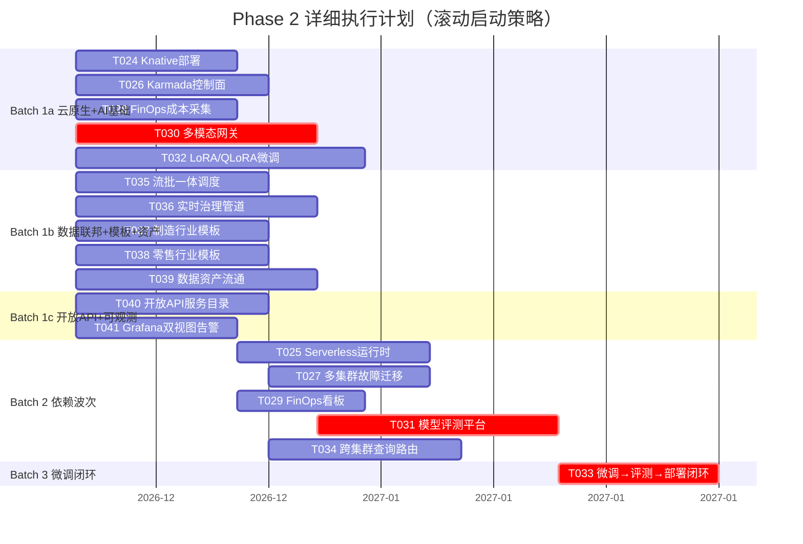

# 数擎大数据平台 V2.0 Phase 2 详细执行计划

> 版本：v2.0.0-phase2-plan
> 文档状态：执行计划
> 编写日期：2026-08-08
> 文档负责人：V2.0 Phase 2 执行计划制定师
> 适用范围：V2.0 Phase 2（V2.0-beta）全部 14 项 P1 需求的 18 个任务执行安排
> 上游输入：
> - `V2.0_实施计划.md`（Phase 2 任务定义，§2.2）
> - `Phase1/Phase1_详细执行计划.md`（格式与执行节奏参考）
> - `Phase1/Phase1_集成验证报告.md`（Phase 1 完成状态与经验教训）
> - `V2.0_PRD_产品需求文档.md`（14 项 P1 需求定义）
> - `V2.0_架构设计文档.md`（云原生/AI/数据联邦/实时数仓/行业模板/其他增强模块）
> 下游输出：Phase 2 任务分派、里程碑跟踪、风险登记、批次并行调度

---

## 第1章 执行计划总述

### 1.1 Phase 2 目标与范围

Phase 2 是 V2.0 的能力扩展阶段（V2.0-beta），目标是基于 Phase 1 已构建的 P0 技术底座，实现全部 14 项 P1 需求，使平台具备 Serverless 函数运行、多集群联邦调度、FinOps 成本治理、大模型微调闭环、跨集群联邦查询、流批一体、实时治理、制造/零售行业模板、数据资产流通、开放 API 服务目录、Grafana 双视图告警分级等企业级能力。

表：Phase2-01 目标与范围参数说明表

| 维度 | 内容 |
| --- | --- |
| 阶段定位 | V2.0-beta（能力扩展），对应 PRD Phase 4（P1 部分） |
| 需求范围 | 14 项 P1 需求（REQ-CN-002/004/005、REQ-AI-003/004/005、REQ-DF-002、REQ-RT-002/004、REQ-IT-002/003、REQ-EX-001/002/005） |
| 任务范围 | 18 个任务（T024~T041） |
| 领域覆盖 | 云原生增强、AI 能力增强、数据联邦与实时数仓、行业模板、其他增强（共 5 个领域） |
| 前置条件 | Phase 1 全部 24 个任务完成，tag `v2.0.0-phase1-integration-verified`，10 项 Phase 2 准入条件全部满足 |
| 出口标准 | 5 项云原生 GA（Serverless/多集群/FinOps）、微调→评测→部署闭环、3 行业模板上线（金融已交付，新增制造+零售）、跨集群联邦查询可用、流批一体可用、实时治理闭环、数据资产流通全流程、开放 API 服务目录、Grafana 双视图告警分级 |

### 1.2 总工时与工期

表：Phase2-02 工时与工期参数说明表

| 指标 | 数值 | 说明 |
| --- | --- | --- |
| 总工时 | 220 人天 | 18 个任务工时合计 |
| 关键路径工时 | 40 人天 | T030(15)→T031(15)→T033(10)，微调闭环链路 |
| 关键路径工期 | 约 8 周（2 个月） | 串行无并行情况下 |
| 团队规模 | 29 人全职 + 2 人兼职 | 复用 Phase 1 团队配置 |
| subagent 并行上限 | 5 个 | 单批次最多 5 个 subagent 并行 |
| 计划时间窗口 | 2026-12-15 ~ 2027-02-28 | 约 2.5 个月，含 Batch 1~3 全部交付 |
| 实施计划原窗口 | 2026-12 ~ 2027-02 | Gantt 图原始排期，与本计划一致 |

### 1.3 关键路径识别

关键路径是项目中最长的串行任务链，决定项目最短工期。基于 Phase 2 任务依赖关系，关键路径为微调闭环链路。

表：Phase2-03 关键路径分析对照表

| 路径名称 | 任务链 | 累计工时（人天） | 是否关键路径 | 备注 |
| --- | --- | --- | --- | --- |
| 微调闭环链路 | T030(15) → T031(15) → T033(10) | 40 | **是（最长）** | T032(18) 与 T030 并行，T033 依赖 T031+T032 |
| Serverless 链路 | T024(10) → T025(12) | 22 | 否 | Knative 部署后才能开发运行时 |
| 多集群链路 | T026(12) → T027(10) | 22 | 否 | Karmada 控制面后才能调度故障迁移 |
| FinOps 链路 | T028(10) → T029(8) | 18 | 否 | 成本采集后才能看板 |
| 跨集群联邦链路 | T026(12) → T034(12) | 24 | 否 | T034 依赖 T026+T012（T012 Phase 1 已完成） |
| 流批一体链路 | T035(12) | 12 | 否 | 单任务，依赖 T015（Phase 1 已完成） |
| 实时治理链路 | T036(15) | 15 | 否 | 单任务，依赖 T015（Phase 1 已完成） |

**关键路径保障策略**：

1. T030（大模型多模态网关）在 Batch 1a 第 0 天启动，不得延迟
2. T031（模型评测平台）在 T030 完成后立即启动，分配 AI 架构师 + 2 名 Python 开发
3. T033（微调→评测→部署闭环）依赖 T031+T032，T032 在 Batch 1a 与 T030 并行启动，确保 T033 在 Batch 3 及时启动
4. 关键路径任务设置每周里程碑检查点，落后 2 天即触发预警与资源调配

### 1.4 团队规模需求

基于 V2.0 实施计划 §1.3 的 29 人团队配置，结合 Phase 2 任务分布，各领域组人员分配如下。

表：Phase2-04 团队分配参数说明表

| 领域组 | 全职人数 | 角色构成 | 主要任务 | 峰值并行度 |
| --- | --- | --- | --- | --- |
| 云原生组 | 5 | 云原生架构师(1) + DevOps(2) + Go(1) + Java(1) | T024/T025/T026/T027/T028/T029 | 3（T024+T026+T028 并行） |
| AI 组 | 6 | AI 架构师(1) + Python(4) + Go(1) | T030/T031/T032/T033 | 2（T030+T032 并行，T031+T033 串行） |
| 数据联邦组 | 3 | Java(2) + 首席架构师(0.5 兼) | T034/T035/T036 | 2（T035+T036 并行，T034 依赖 T026） |
| 行业模板组 | 2+1 兼 | Java(1) + DevOps(1) + 领域专家(1 兼职) | T037/T038 | 2（T037+T038 并行） |
| 其他增强组 | 4 | Java(2) + Go(1) + 前端(1) | T039/T040/T041 | 3（T039+T040+T041 并行） |
| 横切支持 | 5 | 测试(4) + 前端(1) | 全领域测试 + FinOps 看板/资产流通看板前端 | 按需 |
| **合计** | **25+1 兼** | — | 18 个任务 | 峰值 12 并行（受 subagent 5 上限制约，分批启动） |

**人员调度原则**：

1. 关键路径任务（T030/T031/T033）优先保障 AI 架构师与高级 Python 开发
2. AI 架构师全程投入 AI 组，不外借
3. 首席架构师 50% 投入数据联邦组（T034 跨集群联邦架构决策），50% 跨领域协调
4. 测试工程师 4 人按领域分配：云原生(1) + AI(1) + 数据联邦(0.5) + 行业模板(0.5) + 其他(1)
5. 前端 3 人：FinOps 看板(1) + 资产流通/开放 API(1) + Grafana 双视图(1)

### 1.5 批次划分与并行调度

#### 1.5.1 依赖关系与执行波次

基于 18 个任务的依赖关系，划分为 3 个执行波次。

表：Phase2-05 执行波次参数说明表

| 波次 | 任务数 | 任务清单 | 依赖说明 | 可并行度 |
| --- | --- | --- | --- | --- |
| Wave 1 | 12 | T024/T026/T028/T030/T032/T035/T036/T037/T038/T039/T040/T041 | 无外部依赖（Phase 1 已完成） | 12（受 subagent 5 上限，分 3 批启动） |
| Wave 2 | 5 | T025←T024、T027←T026、T029←T028、T031←T030、T034←T026 | 依赖 Wave 1 单个任务 | 5（恰好匹配 subagent 上限） |
| Wave 3 | 1 | T033←T032+T031 | 依赖 Wave 1 的 T032 + Wave 2 的 T031 | 1 |

#### 1.5.2 分批执行方案（5 并行限制）

受 subagent 并行上限 5 个制约，Wave 1 的 12 个无依赖任务分 3 批启动（Batch 1a/1b/1c），Wave 2 整体作为 Batch 2，Wave 3 作为 Batch 3。

表：Phase2-06 分批执行方案参数说明表

| 批次 | 任务 | 领域 | 总工时 | 时间窗口 | subagent 数 |
| --- | --- | --- | --- | --- | --- |
| Batch 1a | T024+T026+T028+T030+T032 | 云原生×3 + AI×2 | 65 人天 | 2026-12-15 ~ 2027-01-13（30 天） | 5 |
| Batch 1b | T035+T036+T037+T038+T039 | 数据联邦×2 + 模板×2 + 其他×1 | 66 人天 | 2026-12-15 ~ 2027-01-14（30 天） | 5 |
| Batch 1c | T040+T041 | 其他×2 | 22 人天 | 2026-12-15 ~ 2026-12-31（17 天） | 2 |
| Batch 2 | T025+T027+T029+T031+T034 | Wave 2 依赖任务 | 57 人天 | 2027-01-14 ~ 2027-02-12（30 天） | 5 |
| Batch 3 | T033 | 微调闭环 | 10 人天 | 2027-02-12 ~ 2027-02-24（13 天） | 1 |
| **合计** | **18** | **5 领域** | **220 人天** | **2026-12-15 ~ 2027-02-24（72 天）** | **峰值 5** |

**并行调度说明**：

- Batch 1a/1b/1c 在 2026-12-15 同步启动，1a 与 1b 各占 5 个 subagent，1c 占 2 个 subagent（合计 12 个 subagent 需求超过 5 上限）
- 实际执行采用**滚动 subagent 池**策略：subagent 总池 5 个，Batch 1a 优先占用 5 个，Batch 1b 任务在 1a 短任务（T024/T028）完成后滚动接入，Batch 1c 在 1a/1b 进一步释放后接入
- 若团队实际 subagent 容量不足，可将 Batch 1a/1b 串行执行（先 1a 后 1b），总工期延长至约 100 天

---

## 第2章 批次执行计划

### 2.1 Batch 1a：云原生 + AI 基础（T024/T026/T028/T030/T032）

**批次定位**：Phase 2 启动批次，覆盖云原生 3 个基础任务（Knative/Karmada/FinOps 采集）+ AI 2 个基础任务（多模态网关/微调引擎），为 Batch 2 依赖任务提供前置。

**时间窗口**：2026-12-15 ~ 2027-01-13（30 天）
**并行度**：5 任务，5 个 subagent 并行
**总工时**：65 人天

#### 2.1.1 T024 Knative Serving/Eventing 部署

**任务描述**：在 Phase 1 Service Mesh（T001 Istio）基础上部署 Knative Serving + Eventing，配置 KafkaSource 与 CronJobSource 事件源，为 T025 Serverless 函数运行时提供基础设施。

**技术方案要点**：

1. Knative Serving ≥ 1.12 通过 Helm Chart 部署到 SKE 集群，复用 Phase 1 Istio 网关
2. Knative Eventing ≥ 1.12 部署，配置 KafkaSource（对接 Phase 1 Kafka 集群）与 CronJobSource
3. 启用 Knative 自动伸缩（KPA，基于 RPS 与并发）与缩容到零（scale-to-zero）
4. 与 Phase 1 ArgoCD（T003）集成，Knative Helm Chart 纳入 GitOps 同步

**产出物清单**：

- Knative Serving Helm Chart（含 Istio 网关集成配置）
- Knative Eventing Helm Chart（含 KafkaSource/CronJobSource CRD）
- Knative 部署验证文档（含 KPA 配置示例）

**验收标准**：

- Knative Serving ≥ 1.12 部署成功，KService 创建后自动分配 URL
- Knative Eventing ≥ 1.12 部署成功，KafkaSource 可消费 Kafka 消息触发 KService
- CronJobSource 可按 cron 表达式定时触发 KService
- scale-to-zero 生效：无流量 60s 后 Pod 缩容到 0

**subagent 提示词要点**：

```
任务：部署 Knative Serving 1.12+ 与 Eventing 1.12+ 到 SKE 集群。
前置：复用 Phase 1 Istio 1.20+ 网关（T001 已完成），Kafka 集群可用。
步骤：
1. 编写 Knative Serving Helm Chart，集成 Istio Ingress Gateway
2. 编写 Knative Eventing Helm Chart，配置 KafkaSource 与 CronJobSource
3. 通过 ArgoCD Application 部署（sync wave 注解）
4. 验证：创建测试 KService，确认自动分配 URL；创建 KafkaSource，发送 Kafka 消息验证触发；创建 CronJobSource，验证定时触发；无流量 60s 后确认 Pod 缩容到 0
环境：优先 Docker 直连验证 Knative 组件健康（借鉴 Phase 1 K3s→Docker 经验），生产环境部署到标准 K8s 集群
测试：编写 pytest 集成测试覆盖 KService 创建/触发/缩容场景
输出：Knative Helm Chart + 部署验证文档 + pytest 测试套件
```

#### 2.1.2 T026 Karmada 控制面与成员集群纳管

**任务描述**：在 Phase 1 ArgoCD（T003）基础上部署 Karmada 控制面，纳管 ≥ 3 个成员集群（信创/本地/公有云），封装 PropagationPolicy 实现多集群 Deployment 调度。

**技术方案要点**：

1. Karmada ≥ 1.10 通过 Helm Chart 部署控制面到主集群
2. 纳管 ≥ 3 个成员集群：信创集群（麒麟 OS + 鲲鹏）、本地集群（标准 K8s）、公有云集群（华为云 CCE）
3. PropagationPolicy 封装为 CRD，暴露给租户通过控制台管理
4. 与 Phase 1 ArgoCD 集成，Karmada Helm Chart 纳入 GitOps 同步

**产出物清单**：

- Karmada Helm Chart（含控制面 + 成员集群纳管配置）
- PropagationPolicy CRD 封装与控制台 API
- 3 个成员集群纳管验证文档

**验收标准**：

- Karmada ≥ 1.10 部署成功，控制面健康
- 纳管 ≥ 3 集群（信创/本地/公有云），成员集群状态 Ready
- PropagationPolicy 可调度 Deployment 到指定集群，副本按权重分配

**subagent 提示词要点**：

```
任务：部署 Karmada 1.10+ 控制面，纳管 3 个成员集群（信创/本地/公有云）。
前置：复用 Phase 1 ArgoCD 2.7+（T003 已完成），3 个成员集群可达。
步骤：
1. 编写 Karmada Helm Chart，部署控制面到主集群
2. 配置 3 个成员集群纳管（信创麒麟+鲲鹏、本地 K8s、华为云 CCE），执行 karmadactl join
3. 封装 PropagationPolicy CRD，提供控制台 API 供租户管理
4. 通过 ArgoCD Application 部署 Karmada Helm Chart
5. 验证：创建测试 Deployment + PropagationPolicy，确认副本按权重分配到 3 集群
环境：信创集群需验证鲲鹏镜像兼容性；本地集群可使用 Docker 模拟多集群（借鉴 Phase 1 Docker 经验）
测试：编写 pytest 集成测试覆盖纳管/PropagationPolicy/副本分配场景
输出：Karmada Helm Chart + PropagationPolicy CRD + 纳管验证文档 + pytest 测试套件
```

#### 2.1.3 T028 FinOps 成本采集与模型

**任务描述**：开发资源用量采集器，覆盖 CPU/内存/存储/GPU/网络五维度，建立成本模型支持按量/包年/阶梯三种计费方式，为 T029 FinOps 看板提供数据基础。

**技术方案要点**：

1. 资源用量采集器基于 Prometheus + kube-state-metrics + GPU Exporter（DCGM）+ 网络流量 Exporter
2. 采集粒度 ≤ 1min，写入 Prometheus TSDB，按 tenant 与 namespace 标签隔离
3. 成本模型支持三种计费：按量（实时用量 × 单价）、包年（预留实例分摊）、阶梯（累计用量阶梯计价）
4. GPU 成本单独建模，支持多卡型号（A100/V100/昇腾 910）差异化定价

**产出物清单**：

- 资源用量采集器（Prometheus Exporter 组合 + 自定义 GPU/网络 Exporter）
- 成本模型服务（Java/Spring Boot，支持三种计费方式配置）
- 成本采集验证文档（含五维度采集粒度测试）

**验收标准**：

- 采集粒度 ≤ 1min，五维度（CPU/内存/存储/GPU/网络）全部覆盖
- 三种计费方式（按量/包年/阶梯）可配置，计算结果正确
- 按 tenant 与 namespace 隔离，租户间成本数据不可见

**subagent 提示词要点**：

```
任务：开发 FinOps 资源用量采集器与成本模型，覆盖五维度三种计费。
前置：Prometheus + kube-state-metrics 已部署（Phase 1 可观测体系），GPU 节点池可用。
步骤：
1. 部署 DCGM Exporter 采集 GPU 用量，部署网络流量 Exporter
2. 开发成本模型服务（Java/Spring Boot 3.2），实现按量/包年/阶梯三种计费逻辑
3. 配置 Prometheus 采集规则，粒度 1min，按 tenant+namespace 标签隔离
4. 验证：五维度采集数据正确；三种计费方式计算结果与手工核算一致；租户隔离生效
环境：本地使用 Docker 运行成本模型服务 + Prometheus（借鉴 Phase 1 Docker 集成测试经验）
测试：编写 pytest 集成测试覆盖采集/计费/隔离场景，性能压测用 Python 脚本验证采集粒度
输出：资源用量采集器 + 成本模型服务 + 验证文档 + pytest 测试套件
```

#### 2.1.4 T030 大模型多模态网关统一 API 与路由

**任务描述**：增强 Phase 1 多模态网关（T008 切片器依赖的 llm-gateway），提供 OpenAI 兼容 API，支持四维度路由（模型/租户/场景/成本），实现多模态 Token 计量，支持 SSE 流式与异步批处理。

**技术方案要点**：

1. OpenAI 兼容 API：实现 `/v1/chat/completions` 端点，支持多模态扩展（输入文本+图像+语音+视频，输出文本+图像+语音）
2. 四维度路由策略：按模型（GPT-4/Claude/通义/文心/自研）、租户（优先级/配额）、场景（对话/微调/评测）、成本（单价/延迟权衡）路由
3. 多模态 Token 计量：文本 Token + 图像 Token（按分辨率折算）+ 语音 Token（按时长折算）+ 视频 Token（按时长折算）
4. SSE 流式响应 + 异步批处理（提交任务返回 job_id，轮询查询结果）

**产出物清单**：

- 多模态网关增强（Java/Spring Boot 或 Go，OpenAI 兼容 API）
- 四维度路由策略引擎（含路由规则配置 API）
- 多模态 Token 计量模块
- SSE 流式 + 异步批处理实现

**验收标准**：

- 兼容 OpenAI Chat Completions API，标准 OpenAI SDK 可直接调用
- 四维度路由生效，路由决策可查询
- 多模态 Token 计量准确（文本/图像/语音/视频分别计量）
- SSE 流式响应首 Token 延迟 ≤ 1s，异步批处理支持 ≥ 100 并发

**subagent 提示词要点**：

```
任务：增强多模态网关，提供 OpenAI 兼容 API + 四维度路由 + 多模态 Token 计量 + SSE/批处理。
前置：Phase 1 llm-gateway 已切换真实 Provider（T000a Mock 清零已完成），5 Provider 真实 HTTP 可用。
步骤：
1. 实现 /v1/chat/completions 端点，兼容 OpenAI SDK，支持多模态 input/output
2. 实现四维度路由引擎（模型/租户/场景/成本），提供路由规则配置 API
3. 实现多模态 Token 计量（文本按 tokenizer、图像按分辨率、语音/视频按时长）
4. 实现 SSE 流式响应（首 Token ≤1s）与异步批处理（job_id 轮询）
5. 验证：OpenAI SDK 调用成功；四维度路由决策正确；Token 计量与手工核算一致；SSE 首 Token 延迟达标
环境：本地 Docker 运行网关 + Mock LLM Provider（借鉴 Phase 1 Docker 集成测试经验）
测试：编写 pytest 集成测试覆盖 API 兼容性/路由/计量/SSE/批处理场景，性能压测用 Python 脚本验证首 Token 延迟
输出：多模态网关增强 + 路由引擎 + Token 计量模块 + pytest 测试套件
```

#### 2.1.5 T032 LoRA/QLoRA/全参微调

**任务描述**：开发微调任务引擎，接入 LLaMA-Factory/PEFT/DeepSpeed 三种框架，支持 LoRA（rank 8/16/32）、QLoRA（4bit/8bit）、全参三种微调方式，实现 GPU 节点池调度与多卡数据并行 + 张量并行。

**技术方案要点**：

1. 微调任务引擎（Python/FastAPI）：提交微调任务（数据集 + 基座模型 + 微调方式 + 超参）返回 job_id，支持任务列表/详情/日志/终止
2. LLaMA-Factory 接入：通过 subprocess 调用 LLaMA-Factory CLI，支持 LoRA/QLoRA/全参三种方式
3. PEFT 接入：HuggingFace PEFT 库直接集成，支持 LoRA rank 8/16/32 与 QLoRA 4bit/8bit 量化
4. DeepSpeed 接入：多卡数据并行（DeepSpeed ZeRO-2/3）+ 张量并行（DeepSpeed TP）
5. GPU 节点池调度：通过 K8s Volcano 或 Yunikorn 调度 GPU 节点池，支持多卡亲和性

**产出物清单**：

- 微调任务引擎（Python/FastAPI，任务提交/查询/日志/终止 API）
- LLaMA-Factory/PEFT/DeepSpeed 三框架接入适配器
- GPU 节点池调度配置（Volcano 或 Yunikorn）
- 微调任务验证文档（含三种方式 × 三种框架组合测试）

**验收标准**：

- 三种微调方式（LoRA rank 8/16/32 / QLoRA 4bit/8bit / 全参）全部可用
- 三种框架（LLaMA-Factory/PEFT/DeepSpeed）接入成功
- 多卡数据并行 + 张量并行生效，GPU 利用率 ≥ 80%
- 微调任务日志实时可查，loss/lr/GPU 利用率指标采集

**subagent 提示词要点**：

```
任务：开发微调任务引擎，接入 LLaMA-Factory/PEFT/DeepSpeed，支持 LoRA/QLoRA/全参 + 多卡并行。
前置：GPU 节点池可用（A100 或昇腾 910），Phase 1 llm-gateway 可调用基座模型。
步骤：
1. 开发微调任务引擎（Python/FastAPI），实现任务提交/查询/日志/终止 API
2. 接入 LLaMA-Factory CLI（subprocess 调用），支持 LoRA/QLoRA/全参
3. 集成 HuggingFace PEFT 库，支持 LoRA rank 8/16/32 与 QLoRA 4bit/8bit
4. 集成 DeepSpeed ZeRO-2/3（数据并行）+ TP（张量并行），多卡并行
5. 配置 K8s Volcano GPU 节点池调度，支持多卡亲和性
6. 验证：三种微调方式 × 三种框架组合测试；多卡并行 GPU 利用率 ≥80%；日志实时可查
环境：GPU 节点池（A100 或昇腾 910），本地用 Docker 运行微调引擎 + Mock GPU 验证 API（借鉴 Phase 1 Docker 经验）
测试：编写 pytest 集成测试覆盖任务提交/查询/终止/日志场景，性能压测用 Python 脚本验证多卡并行 GPU 利用率
输出：微调任务引擎 + 三框架适配器 + GPU 调度配置 + 验证文档 + pytest 测试套件
```

#### 2.1.6 Batch 1a 汇总

表：Phase2-07 Batch 1a 任务排期参数说明表

| 任务 | 启动日 | 工时 | 完成日 | subagent | 负责组 |
| --- | --- | --- | --- | --- | --- |
| T024 Knative 部署 | D0 | 10d | D10 | subagent-1 | 云原生组 |
| T026 Karmada 控制面 | D0 | 12d | D12 | subagent-2 | 云原生组 |
| T028 FinOps 成本采集 | D0 | 10d | D10 | subagent-3 | 云原生组 |
| T030 多模态网关 | D0 | 15d | D15 | subagent-4 | AI 组 |
| T032 LoRA/QLoRA 微调 | D0 | 18d | D18 | subagent-5 | AI 组 |

**批次工期**：30 天（2026-12-15 ~ 2027-01-13），受 T032(18d) 制约
**资源占用**：云原生组 5 人、AI 组 6 人，合计 11 人

### 2.2 Batch 1b：数据联邦 + 行业模板 + 资产流通（T035/T036/T037/T038/T039）

**批次定位**：Phase 2 启动批次（与 1a 并行），覆盖数据联邦 2 个任务（流批一体/实时治理）+ 行业模板 2 个任务（制造/零售）+ 其他增强 1 个任务（资产流通），均为无外部依赖任务。

**时间窗口**：2026-12-15 ~ 2027-01-14（30 天）
**并行度**：5 任务，5 个 subagent 并行
**总工时**：66 人天

#### 2.2.1 T035 流批一体调度与统一入口

**任务描述**：基于 Phase 1 Iceberg V2 upsert（T015）与 Flink CDC（T014），开发 DolphinScheduler 流批统一编排，实现 Iceberg 表同时被 Spark 批读与 Flink 流读数据一致（snapshot 隔离），BI 自动选择批快照或流最新视图。

**技术方案要点**：

1. DolphinScheduler 流批统一编排：扩展 DolphinScheduler DAG 节点类型，支持 Spark 批任务与 Flink 流任务在同一 DAG 编排
2. snapshot 隔离：Iceberg 表 snapshot 隔离机制，Spark 批读固定 snapshot，Flink 流读最新 snapshot，数据一致
3. BI 自动选择视图：查询路由器根据查询模式（实时/离线）自动选择批快照视图或流最新视图
4. 与 Phase 1 Doris 物化视图（T016）集成，物化视图自动刷新支持流批一体

**产出物清单**：

- DolphinScheduler 流批统一编排插件（Java）
- Iceberg snapshot 隔离配置与验证文档
- BI 自动选择视图路由器（Java/SQL 网关扩展）

**验收标准**：

- Iceberg 表同时被 Spark 批读与 Flink 流读数据一致（snapshot 隔离）
- 批/流同一 DAG 编排，DolphinScheduler 调度成功
- BI 自动选择批快照或流最新视图，查询结果正确

**subagent 提示词要点**：

```
任务：开发 DolphinScheduler 流批统一编排 + Iceberg snapshot 隔离 + BI 自动选择视图。
前置：Phase 1 Iceberg V2 upsert（T015）与 Flink CDC（T014）已完成，DolphinScheduler 可用。
步骤：
1. 扩展 DolphinScheduler DAG 节点类型，支持 Spark 批 + Flink 流任务同一 DAG
2. 配置 Iceberg snapshot 隔离，Spark 批读固定 snapshot，Flink 流读最新 snapshot
3. 开发 BI 查询路由器，根据查询模式自动选择批快照或流最新视图
4. 与 Phase 1 Doris 物化视图集成，物化视图刷新支持流批一体
5. 验证：同一 Iceberg 表批流读数据一致；同一 DAG 编排批流任务成功；BI 自动选择视图正确
环境：本地 Docker 运行 DolphinScheduler + Spark + Flink + Iceberg（借鉴 Phase 1 Docker 集成测试经验）
测试：编写 pytest 集成测试覆盖批流一致/DAG 编排/视图选择场景
输出：DolphinScheduler 插件 + snapshot 隔离配置 + BI 路由器 + pytest 测试套件
```

#### 2.2.2 T036 实时治理管道（元数据/血缘/质量）

**任务描述**：基于 Phase 1 Iceberg V2（T015）与 Flink CDC（T014），开发实时治理管道：Iceberg REST Catalog 事件触发元数据采集，Flink CDC 实时血缘解析，流式质量规则评估，实现治理闭环 P95 ≤ 10s。

**技术方案要点**：

1. Iceberg REST Catalog 事件触发：监听 Catalog commit 事件，触发元数据采集（≤ 5s）
2. Flink CDC 实时血缘解析：解析 Flink CDC SQL，提取源表/目标表字段级血缘，实时更新血缘图
3. 流式质量规则：Flink CEP 评估质量规则（空值/唯一性/范围/格式/自定义），违规即告警
4. 治理闭环：元数据采集 → 血缘更新 → 质量评估 → 告警，P95 ≤ 10s

**产出物清单**：

- Iceberg REST Catalog 事件监听器（Java）
- Flink CDC 实时血缘解析器（Java/Python）
- 流式质量规则引擎（Flink CEP）
- 实时治理管道验证文档（含治理闭环 P95 测试）

**验收标准**：

- 治理闭环 P95 ≤ 10s（从 Catalog commit 到告警）
- 元数据采集 ≤ 5s
- 血缘实时更新，字段级血缘正确
- 质量违规即告警，告警延迟 ≤ 5s
- 实时与批量管道并存，互不干扰

**subagent 提示词要点**：

```
任务：开发实时治理管道，Iceberg REST Catalog 事件触发 + Flink CDC 实时血缘 + 流式质量规则。
前置：Phase 1 Iceberg V2（T015）与 Flink CDC（T014）已完成，Iceberg REST Catalog 可用。
步骤：
1. 开发 Iceberg REST Catalog 事件监听器，监听 commit 事件触发元数据采集
2. 开发 Flink CDC 实时血缘解析器，解析 SQL 提取字段级血缘，更新血缘图（NebulaGraph）
3. 开发流式质量规则引擎（Flink CEP），评估空值/唯一性/范围/格式/自定义规则
4. 实现治理闭环：元数据采集 → 血缘更新 → 质量评估 → 告警
5. 验证：治理闭环 P95 ≤10s；元数据采集 ≤5s；血缘字段级正确；质量违规即告警
环境：本地 Docker 运行 Iceberg REST Catalog + Flink + NebulaGraph（借鉴 Phase 1 Docker 集成测试经验）
测试：编写 pytest 集成测试覆盖事件触发/血缘解析/质量规则/告警场景，性能压测用 Python 脚本验证 P95
输出：事件监听器 + 血缘解析器 + 质量规则引擎 + 验证文档 + pytest 测试套件
```

#### 2.2.3 T037 制造行业模板

**任务描述**：开发制造行业模板，包含设备 OEE DDL+DAG+Dashboard、质量追溯模型、供应链协同模型，接入 IoTDB 时序数据，打包为 Helm Chart 支持一键部署。

**技术方案要点**：

1. 设备 OEE 分析：设备可用率 × 性能率 × 质量率，DDL 设计 + Flink/Spark DAG + Superset Dashboard
2. 质量追溯：批次/工序/参数追溯，DDL 设计 + DAG + Dashboard，支持正反向追溯
3. 供应链协同：订单/库存/物流协同，DDL 设计 + DAG + Dashboard
4. IoTDB 接入：时序数据（设备传感器数据）通过 IoTDB JDBC 查询，Flink IoTDB Connector 接入
5. Helm Chart 打包：制造模板所有 DDL/DAG/Dashboard/RBAC 打包为 Helm Chart，`helm install manufacturing-template` 一键部署

**产出物清单**：

- 制造模板 DDL（OEE/质量追溯/供应链，≥ 15 张表）
- 制造模板 DAG（OEE 计算/质量追溯/供应链协同，≥ 4 个）
- 制造模板 Dashboard（OEE/质量/供应链，≥ 3 个）
- IoTDB 接入配置（JDBC + Flink Connector）
- manufacturing-template Helm Chart

**验收标准**：

- OEE 分析 + 质量追溯 + 供应链协同数据模型完整
- 接入 IoTDB 时序数据，设备传感器数据可查询
- `helm install manufacturing-template` 一键部署成功

**subagent 提示词要点**：

```
任务：开发制造行业模板，OEE + 质量追溯 + 供应链协同 + IoTDB 接入 + Helm Chart 一键部署。
前置：Phase 1 行业模板体系（T018/T019 金融模板）已完成，IoTDB 可用，Superset 可用。
步骤：
1. 设计制造模板 DDL（OEE/质量追溯/供应链，≥15 张表），含 RBAC（车间主任/质量员/供应链经理）
2. 开发 DAG（OEE 计算/质量追溯/供应链协同，≥4 个），Flink/Spark 任务
3. 开发 Dashboard（OEE/质量/供应链，≥3 个），Superset 仪表盘
4. 配置 IoTDB 接入（JDBC + Flink Connector），设备传感器时序数据可查询
5. 打包 manufacturing-template Helm Chart，验证 helm install 一键部署
环境：本地 Docker 运行 IoTDB + Superset + Flink/Spark（借鉴 Phase 1 Docker 集成测试经验）
测试：编写 pytest 集成测试覆盖 DDL/DAG/Dashboard/IoTDB/Helm 部署场景
输出：制造模板 DDL+DAG+Dashboard + IoTDB 配置 + Helm Chart + pytest 测试套件
```

#### 2.2.4 T038 零售行业模板

**任务描述**：开发零售行业模板，包含商品画像 + 会员分析 + 营销效果 DDL/DAG/Dashboard，接入标签引擎，支持 RFM 分群/流失预测/LTV/A/B 实验/转化漏斗/ROI 分析，打包为 Helm Chart 一键部署。

**技术方案要点**：

1. 商品画像：商品属性/类目/品牌/销量/评价画像，DDL + DAG + Dashboard
2. 会员分析：RFM 分群（最近购买/频率/金额）、流失预测（机器学习模型）、LTV（生命周期价值）
3. 营销效果：A/B 实验（实验组/对照组显著性检验）、转化漏斗（曝光→点击→加购→下单→支付）、ROI（投入产出比）
4. 标签引擎接入：复用 Phase 1 tag-engine（T000a Mock 清零已完成），会员/商品标签计算
5. Helm Chart 打包：零售模板所有资产打包为 Helm Chart，`helm install retail-template` 一键部署

**产出物清单**：

- 零售模板 DDL（商品画像/会员/营销，≥ 15 张表）
- 零售模板 DAG（RFM/流失预测/LTV/A-B 实验/转化漏斗/ROI，≥ 5 个）
- 零售模板 Dashboard（商品画像/会员/营销，≥ 3 个）
- 标签引擎接入配置
- retail-template Helm Chart

**验收标准**：

- 商品画像 + RFM + 流失预测 + LTV + A/B 实验 + 转化漏斗 + ROI 全部可用
- 接入标签引擎，会员/商品标签计算正确
- `helm install retail-template` 一键部署成功

**subagent 提示词要点**：

```
任务：开发零售行业模板，商品画像 + 会员分析 + 营销效果 + 标签引擎接入 + Helm Chart 一键部署。
前置：Phase 1 tag-engine 已切换 Doris（T000a Mock 清零已完成），Superset 可用。
步骤：
1. 设计零售模板 DDL（商品画像/会员/营销，≥15 张表），含 RBAC（店长/运营/数据分析师）
2. 开发 DAG（RFM 分群/流失预测/LTV/A-B 实验/转化漏斗/ROI，≥5 个），含机器学习模型
3. 开发 Dashboard（商品画像/会员/营销，≥3 个），Superset 仪表盘
4. 接入标签引擎（tag-engine），会员/商品标签计算
5. 打包 retail-template Helm Chart，验证 helm install 一键部署
环境：本地 Docker 运行 tag-engine + Superset + Spark（借鉴 Phase 1 Docker 集成测试经验）
测试：编写 pytest 集成测试覆盖 DDL/DAG/Dashboard/标签/Helm 部署场景
输出：零售模板 DDL+DAG+Dashboard + 标签引擎配置 + Helm Chart + pytest 测试套件
```

#### 2.2.5 T039 数据资产流通全流程

**任务描述**：开发数据资产流通全流程，包含资产登记/上架/流通/变现/分账，支持定价（按次/按量/订阅）与自动结算分账，全过程审计留痕，提供流通看板。

**技术方案要点**：

1. 资产登记：数据资产元数据登记（名称/描述/Schema/质量评分/分级），纳入资产目录
2. 资产上架：上架审核（合规/质量/分级检查），上架后可在资产市场检索
3. 资产流通：订阅/下载/API 调用，支持定价（按次/按量/订阅），流通记录留痕
4. 资产变现：自动结算（订阅费/按次费/按量费），分账到数据提供方与平台
5. 流通看板：资产 Top N/流通趋势/收益明细/分账明细，前端 Vue3 + ECharts
6. 审计留痕：登记/上架/流通/变现/分账全过程审计日志，不可篡改

**产出物清单**：

- 资产流通服务（Java/Spring Boot，登记/上架/流通/变现/分账 API）
- 流通看板前端（Vue3 + ECharts）
- 审计留痕模块（与 Phase 1 SecurityFacade T021 集成）
- 资产流通验证文档

**验收标准**：

- 登记→上架→流通→变现→分账闭环完整
- 三种定价方式（按次/按量/订阅）可配置，自动结算正确
- 分账到数据提供方与平台，分账比例可配置
- 全过程审计留痕，审计日志不可篡改

**subagent 提示词要点**：

```
任务：开发数据资产流通全流程，登记/上架/流通/变现/分账 + 定价 + 自动结算 + 审计留痕 + 流通看板。
前置：Phase 1 SecurityFacade（T021）已提供审计能力，资产目录（catalog）可用。
步骤：
1. 开发资产流通服务（Java/Spring Boot 3.2），实现登记/上架/流通/变现/分账 API
2. 实现三种定价（按次/按量/订阅）与自动结算分账逻辑
3. 开发流通看板前端（Vue3 + ECharts），资产 Top N/流通趋势/收益/分账明细
4. 集成 Phase 1 SecurityFacade 审计能力，全过程审计留痕
5. 验证：登记→上架→流通→变现→分账闭环；三种定价计算正确；分账比例可配置；审计不可篡改
环境：本地 Docker 运行资产流通服务 + PostgreSQL（借鉴 Phase 1 Docker 集成测试经验，可用 SQLite 模拟）
测试：编写 pytest 集成测试覆盖登记/上架/流通/变现/分账/审计场景
输出：资产流通服务 + 流通看板前端 + 审计模块 + 验证文档 + pytest 测试套件
```

#### 2.2.6 Batch 1b 汇总

表：Phase2-08 Batch 1b 任务排期参数说明表

| 任务 | 启动日 | 工时 | 完成日 | subagent | 负责组 |
| --- | --- | --- | --- | --- | --- |
| T035 流批一体调度 | D0 | 12d | D12 | subagent-6 | 数据联邦组 |
| T036 实时治理管道 | D0 | 15d | D15 | subagent-7 | 数据联邦组 |
| T037 制造行业模板 | D0 | 12d | D12 | subagent-8 | 行业模板组 |
| T038 零售行业模板 | D0 | 12d | D12 | subagent-9 | 行业模板组 |
| T039 数据资产流通 | D0 | 15d | D15 | subagent-10 | 其他增强组 |

**批次工期**：30 天（2026-12-15 ~ 2027-01-14），受 T036/T039(15d) 制约
**资源占用**：数据联邦组 3 人、行业模板组 2+1 兼、其他增强组 2 人，合计 7+1 兼

### 2.3 Batch 1c：开放 API + 可观测（T040/T041）

**批次定位**：Phase 2 启动批次（与 1a/1b 并行），覆盖其他增强 2 个任务（开放 API 服务目录/Grafana 双视图告警分级），均为无外部依赖任务。

**时间窗口**：2026-12-15 ~ 2026-12-31（17 天）
**并行度**：2 任务，2 个 subagent 并行
**总工时**：22 人天

#### 2.3.1 T040 开放 API 服务目录落地

**任务描述**：实现开放 API 服务目录，支持 SQL/模型/函数一键生成 RESTful API，提供订阅 Key 颁发 + 限流，支持三种计费方式，接入 APISIX 插件链。

**技术方案要点**：

1. API 一键生成：SQL（指定 SQL 查询生成 API）、模型（指定模型 ID 生成推理 API）、函数（指定 Serverless 函数生成 API）
2. 服务目录：API 元数据管理（名称/描述/参数/响应/版本），目录检索与订阅
3. 订阅计费：订阅 Key 颁发（API Key + Secret），限流（QPS/并发），三种计费（按次/按量/订阅）
4. APISIX 插件链：认证（Key Auth）→ 限流（Limit-Req）→ 计量（Serverless 计量）→ 路由（上游服务）

**产出物清单**：

- 开放 API 服务（Java/Spring Boot，一键生成/目录/订阅/计费 API）
- APISIX 插件链配置（Key Auth + Limit-Req + 计量 + 路由）
- 服务目录前端（Vue3，API 目录/订阅/用量看板）

**验收标准**：

- SQL/模型/函数一键生成 RESTful API，API 可调用
- 订阅 Key 颁发 + 限流生效，超限返回 429
- 三种计费方式可配置，计量准确
- APISIX 插件链生效，认证→限流→计量→路由全链路

**subagent 提示词要点**：

```
任务：实现开放 API 服务目录，一键生成 API + 订阅计费 + APISIX 插件链。
前置：Phase 1 SQL 网关（T012）与 LLM 网关（T008/T030）可用，APISIX 可部署。
步骤：
1. 开放 API 服务（Java/Spring Boot 3.2），实现 SQL/模型/函数一键生成 RESTful API
2. 实现服务目录（API 元数据管理 + 检索 + 订阅），订阅 Key 颁发 + 限流
3. 实现三种计费（按次/按量/订阅），计量写入 Prometheus
4. 配置 APISIX 插件链（Key Auth → Limit-Req → 计量 → 路由）
5. 开发服务目录前端（Vue3 + ECharts）
6. 验证：一键生成 API 可调用；订阅 Key 限流生效；三种计费准确；APISIX 插件链全链路
环境：本地 Docker 运行开放 API 服务 + APISIX + Prometheus（借鉴 Phase 1 Docker 集成测试经验）
测试：编写 pytest 集成测试覆盖一键生成/订阅/限流/计费/APISIX 场景
输出：开放 API 服务 + APISIX 配置 + 服务目录前端 + pytest 测试套件
```

#### 2.3.2 T041 Grafana 双视图与告警分级

**任务描述**：配置 Grafana 双视图（平台方/客户方按 Organization 隔离），Alertmanager 告警分级路由（P0 电话/短信、P1 邮件/IM、P2 钉钉/飞书），提供统一查询 API 按租户隔离。

**技术方案要点**：

1. Grafana 双视图：平台方 Organization（全平台指标）+ 客户方 Organization（租户指标），按 Organization 隔离
2. Alertmanager 分级路由：P0（电话/短信，Alertmanager webhook → 电话网关）、P1（邮件/IM，Alertmanager → SMTP/企业微信）、P2（钉钉/飞书，Alertmanager → 钉钉/飞书 webhook）
3. 统一查询 API：封装 Prometheus 查询 API，按租户隔离（tenant 标签过滤），暴露给客户方 Grafana
4. 告警规则模板：P0/P1/P2 告警规则模板，租户可基于模板自定义告警阈值

**产出物清单**：

- Grafana 双视图配置（平台方 + 客户方 Organization）
- Alertmanager 分级路由配置（P0/P1/P2 三级）
- 统一查询 API（Java/Go，按租户隔离）
- 告警规则模板库

**验收标准**：

- 双视图按 Organization 隔离，平台方与客户方数据互不可见
- P0 电话/短信、P1 邮件/IM、P2 钉钉/飞书三级告警路由生效
- 统一查询 API 按租户隔离，租户间指标互不可见
- 告警规则模板可复用，租户自定义阈值生效

**subagent 提示词要点**：

```
任务：配置 Grafana 双视图 + Alertmanager 告警分级 + 统一查询 API。
前置：Phase 1 Prometheus + Alertmanager + Grafana 已部署（可观测体系）。
步骤：
1. 配置 Grafana 双视图（平台方 Organization + 客户方 Organization），按 Organization 隔离
2. 配置 Alertmanager 分级路由：P0 webhook→电话网关、P1 SMTP/企业微信、P2 钉钉/飞书 webhook
3. 开发统一查询 API（Java/Go），封装 Prometheus 查询，按 tenant 标签隔离
4. 编写告警规则模板库（P0/P1/P2），租户可自定义阈值
5. 验证：双视图隔离生效；三级告警路由触发正确；统一查询 API 租户隔离；告警模板可复用
环境：本地 Docker 运行 Grafana + Alertmanager + Prometheus（借鉴 Phase 1 Docker 集成测试经验）
测试：编写 pytest 集成测试覆盖双视图/告警分级/查询隔离/模板复用场景
输出：Grafana 双视图配置 + Alertmanager 路由 + 统一查询 API + 告警模板库 + pytest 测试套件
```

#### 2.3.3 Batch 1c 汇总

表：Phase2-09 Batch 1c 任务排期参数说明表

| 任务 | 启动日 | 工时 | 完成日 | subagent | 负责组 |
| --- | --- | --- | --- | --- | --- |
| T040 开放 API 服务目录 | D0 | 12d | D12 | subagent-11 | 其他增强组 |
| T041 Grafana 双视图告警 | D0 | 10d | D10 | subagent-12 | 其他增强组 |

**批次工期**：17 天（2026-12-15 ~ 2026-12-31），受 T040(12d) 制约
**资源占用**：其他增强组 2 人，合计 2 人

### 2.4 Batch 2：依赖波次（T025/T027/T029/T031/T034）

**批次定位**：Wave 2 依赖任务批次，5 个任务分别依赖 Batch 1a/1b 的单个任务，恰好匹配 subagent 5 上限。

**时间窗口**：2027-01-14 ~ 2027-02-12（30 天）
**并行度**：5 任务，5 个 subagent 并行
**总工时**：57 人天

#### 2.4.1 T025 Serverless 函数运行时与计量

**任务描述**：基于 T024 Knative Serving/Eventing，开发 Python/Java/Go 三种函数运行时，优化冷启动（≤ 3s），实现 RPS 自动伸缩与无流量 60s 缩容到 0，invocation 计量按 tenant 隔离写入 Loki + Prometheus。

**技术方案要点**：

1. 三种运行时：Python（FastAPI）、Java（Spring Boot Native）、Go（Gin），均封装为 Knative Service 模板
2. 冷启动优化：镜像预热（pre-pull）、运行时缓存（JVM Native Image / Python 预编译）、init container 预加载依赖
3. RPS 自动伸缩：Knative KPA 配置 target=10 RPS，自动扩缩 Pod
4. invocation 计量：Knative Service 请求日志写入 Loki，invocation count 写入 Prometheus，按 tenant 标签隔离

**产出物清单**：

- Python/Java/Go 三种函数运行时模板（含 Knative Service YAML）
- 冷启动优化配置（镜像预热 + 运行时缓存 + init container）
- invocation 计量模块（Loki 日志 + Prometheus 指标）

**验收标准**：

- 冷启动 ≤ 3s（三种运行时均达标）
- 无流量 60s 缩容到 0
- RPS 自动伸缩生效，target=10 RPS 自动扩 Pod
- invocation 日志与计量写入 Loki + Prometheus，按 tenant 隔离

**subagent 提示词要点**：

```
任务：开发 Serverless 函数运行时（Python/Java/Go）+ 冷启动优化 + RPS 自动伸缩 + invocation 计量。
前置：T024 Knative Serving/Eventing 已部署，Knative KPA 可用。
步骤：
1. 开发 Python（FastAPI）/Java（Spring Boot Native）/Go（Gin）三种函数运行时模板
2. 配置冷启动优化：镜像预热 + 运行时缓存（JVM Native Image / Python 预编译）+ init container
3. 配置 Knative KPA，target=10 RPS 自动伸缩
4. 开发 invocation 计量模块，请求日志写 Loki，invocation count 写 Prometheus，按 tenant 隔离
5. 验证：三种运行时冷启动 ≤3s；无流量 60s 缩容到 0；RPS 自动伸缩生效；计量按 tenant 隔离
环境：本地 Docker 运行 Knative + Loki + Prometheus（借鉴 Phase 1 Docker 集成测试经验）
测试：编写 pytest 集成测试覆盖冷启动/缩容/伸缩/计量场景，性能压测用 Python 脚本验证冷启动延迟
输出：三种运行时模板 + 冷启动配置 + 计量模块 + pytest 测试套件
```

#### 2.4.2 T027 多集群调度与故障迁移

**任务描述**：基于 T026 Karmada 控制面，开发 OverridePolicy 集群本地化、故障迁移策略（主集群故障 60s 内迁移）、多集群状态可视化（运营后台展示集群健康/负载/迁移历史）。

**技术方案要点**：

1. OverridePolicy：集群本地化配置（镜像/配置/环境变量按集群差异覆盖），暴露给租户通过控制台管理
2. 故障迁移策略：主集群健康检查（Prometheus + Karmada API），故障检测后 60s 内迁移到备用集群（Karmada failover API）
3. 多集群状态可视化：运营后台前端（Vue3 + ECharts），展示集群健康/负载/迁移历史
4. 副本按权重分配：PropagationPolicy 配置副本权重，按集群容量与优先级分配

**产出物清单**：

- OverridePolicy CRD 封装与控制台 API
- 故障迁移策略引擎（Go，健康检查 + failover 触发）
- 多集群状态可视化前端（Vue3 + ECharts）

**验收标准**：

- 主集群故障 60s 内迁移到备用集群，迁移过程无服务中断
- 副本按集群权重分配，权重可动态调整
- 运营后台可视化集群健康/负载/迁移历史

**subagent 提示词要点**：

```
任务：开发多集群调度与故障迁移，OverridePolicy + 故障迁移策略 + 多集群状态可视化。
前置：T026 Karmada 控制面已部署，3 个成员集群已纳管。
步骤：
1. 封装 OverridePolicy CRD，提供控制台 API 供租户管理集群本地化配置
2. 开发故障迁移策略引擎（Go），主集群健康检查 + 故障检测 + 60s 内 Karmada failover
3. 配置 PropagationPolicy 副本权重分配，按集群容量与优先级
4. 开发运营后台前端（Vue3 + ECharts），集群健康/负载/迁移历史可视化
5. 验证：主集群故障 60s 内迁移；副本按权重分配；运营后台可视化正确
环境：本地 Docker 模拟多集群（借鉴 Phase 1 Docker 经验），故障注入测试迁移
测试：编写 pytest 集成测试覆盖 OverridePolicy/故障迁移/权重分配/可视化场景
输出：OverridePolicy CRD + 故障迁移引擎 + 运营后台前端 + pytest 测试套件
```

#### 2.4.3 T029 FinOps 看板与优化建议

**任务描述**：基于 T028 FinOps 成本采集，开发 FinOps 看板（Top10/趋势/明细/闲置清单）、优化建议引擎（识别 5 类闲置模式）、账单导出（CSV/Excel 含明细与汇总）、分账到子工作空间。

**技术方案要点**：

1. FinOps 看板：Top10 成本资源/成本趋势/明细/闲置清单，前端 Vue3 + ECharts
2. 优化建议引擎：识别 5 类闲置模式（低利用率 CPU/低利用率内存/未挂载存储/空闲 GPU/低流量负载），生成优化建议
3. 账单导出：CSV/Excel 格式，含明细（按资源）与汇总（按 tenant/namespace/工作空间）
4. 分账到子工作空间：按 namespace 或工作空间标签分账，分账比例可配置

**产出物清单**：

- FinOps 看板前端（Vue3 + ECharts）
- 优化建议引擎（Java/Python，5 类闲置模式识别）
- 账单导出模块（CSV/Excel）
- 分账到子工作空间配置

**验收标准**：

- 识别 5 类闲置模式（低利用率 CPU/内存/未挂载存储/空闲 GPU/低流量负载）
- 账单导出 CSV/Excel 含明细与汇总
- 分账到子工作空间，分账比例可配置

**subagent 提示词要点**：

```
任务：开发 FinOps 看板 + 优化建议引擎 + 账单导出 + 分账到子工作空间。
前置：T028 FinOps 成本采集与模型已完成，Prometheus 历史数据可用。
步骤：
1. 开发 FinOps 看板前端（Vue3 + ECharts），Top10/趋势/明细/闲置清单
2. 开发优化建议引擎（Java/Python），识别 5 类闲置模式（低利用率 CPU/内存/未挂载存储/空闲 GPU/低流量负载）
3. 开发账单导出模块，CSV/Excel 格式含明细与汇总
4. 实现分账到子工作空间，按 namespace 或工作空间标签分账，比例可配置
5. 验证：5 类闲置模式识别准确；账单导出格式正确；分账比例可配置
环境：本地 Docker 运行 FinOps 看板后端 + Prometheus（借鉴 Phase 1 Docker 集成测试经验）
测试：编写 pytest 集成测试覆盖看板/优化建议/账单导出/分账场景
输出：FinOps 看板前端 + 优化建议引擎 + 账单导出模块 + 分账配置 + pytest 测试套件
```

#### 2.4.4 T031 模型评测平台与 A/B 对比

**任务描述**：基于 T030 多模态网关，开发评测任务引擎，支持 MMLU/CMMLU/CEval 标准集，计算六指标（准确率/召回率/F1/延迟/成本/幻觉率），支持规则/模型/人工三模式评测，生成 A/B 对比报告高亮差异。

**技术方案要点**：

1. 评测任务引擎（Python/FastAPI）：提交评测任务（模型 + 数据集 + 指标 + 模式）返回 job_id，支持任务列表/详情/日志/终止
2. 标准集支持：MMLU（英文多任务）、CMMLU（中文多任务）、CEval（中文评测），数据集自动下载与缓存
3. 六指标计算：准确率（accuracy）、召回率（recall）、F1、延迟（P95 延迟）、成本（Token 成本）、幻觉率（hallucination rate，基于事实核查）
4. 三模式评测：规则模式（正则/关键字匹配）、模型模式（LLM as Judge）、人工模式（人工标注界面）
5. A/B 对比报告：两模型评测结果对比，高亮差异指标，生成 Markdown/HTML 报告

**产出物清单**：

- 评测任务引擎（Python/FastAPI）
- MMLU/CMMLU/CEval 标准集适配器
- 六指标计算模块
- 三模式评测实现（规则/模型/人工）
- A/B 对比报告生成器

**验收标准**：

- 支持 MMLU/CMMLU/CEval 标准集，数据集自动加载
- 六指标（准确率/召回率/F1/延迟/成本/幻觉率）计算正确
- 三模式评测（规则/模型/人工）全部可用
- A/B 报告高亮差异指标，报告格式 Markdown/HTML

**subagent 提示词要点**：

```
任务：开发模型评测平台，评测任务引擎 + MMLU/CMMLU/CEval + 六指标 + 三模式 + A/B 对比报告。
前置：T030 多模态网关已完成，可通过 OpenAI 兼容 API 调用模型。
步骤：
1. 开发评测任务引擎（Python/FastAPI），任务提交/查询/日志/终止 API
2. 适配 MMLU/CMMLU/CEval 标准集，数据集自动下载与缓存
3. 实现六指标计算（准确率/召回率/F1/延迟/成本/幻觉率）
4. 实现三模式评测：规则（正则/关键字）、模型（LLM as Judge）、人工（标注界面）
5. 开发 A/B 对比报告生成器，高亮差异指标，Markdown/HTML 格式
6. 验证：三标准集加载成功；六指标计算正确；三模式可用；A/B 报告高亮差异
环境：本地 Docker 运行评测引擎 + Mock LLM（借鉴 Phase 1 Docker 集成测试经验）
测试：编写 pytest 集成测试覆盖评测任务/指标计算/三模式/A/B 报告场景
输出：评测任务引擎 + 标准集适配器 + 六指标模块 + 三模式实现 + A/B 报告生成器 + pytest 测试套件
```

#### 2.4.5 T034 跨集群查询路由与归并

**任务描述**：基于 T026 Karmada 控制面与 Phase 1 T012 Calcite 联邦优化器，开发跨集群查询路由器，表元数据定位（表在哪个集群），mTLS 跨集群传输，降级策略（网络中断降级单集群查询并告警）。

**技术方案要点**：

1. 跨集群查询路由器：接收 SQL 查询，通过表元数据定位表所在集群，路由查询到对应集群
2. 表元数据定位：全局 Catalog（基于 Phase 1 catalog）记录表与集群映射，查询时定位
3. mTLS 跨集群传输：集群间查询通过 mTLS（复用 Phase 1 Istio mTLS）安全传输
4. 降级策略：网络中断检测（超时/连接失败），降级到单集群查询（仅查本地表），告警通知
5. 查询归并：跨集群查询结果归并（基于 Phase 1 T013 跨源 Join 归并器）

**产出物清单**：

- 跨集群查询路由器（Java，集成 Calcite 优化器）
- 全局 Catalog 表元数据定位模块
- mTLS 跨集群传输配置
- 降级策略与告警模块

**验收标准**：

- 跨集群查询覆盖 ≥ 2 集群，查询结果正确
- P95 ≤ 30s（跨集群查询延迟）
- 网络中断降级单集群查询并告警，降级过程无查询失败

**subagent 提示词要点**：

```
任务：开发跨集群查询路由与归并，路由器 + 表元数据定位 + mTLS 传输 + 降级策略。
前置：T026 Karmada 控制面已部署，Phase 1 T012 Calcite 联邦优化器与 T013 跨源 Join 归并器已完成。
步骤：
1. 开发跨集群查询路由器（Java），集成 Calcite 优化器，接收 SQL 后定位表所在集群
2. 扩展全局 Catalog，记录表与集群映射，查询时定位
3. 配置 mTLS 跨集群传输（复用 Phase 1 Istio mTLS）
4. 开发降级策略：网络中断检测 + 降级单集群查询 + 告警
5. 复用 Phase 1 T013 跨源 Join 归并器，归并跨集群查询结果
6. 验证：跨集群查询覆盖 ≥2 集群；P95 ≤30s；网络中断降级并告警
环境：本地 Docker 模拟多集群（借鉴 Phase 1 Docker 经验），网络中断注入测试降级
测试：编写 pytest 集成测试覆盖路由/定位/传输/降级/归并场景，性能压测用 Python 脚本验证 P95
输出：跨集群路由器 + 全局 Catalog 扩展 + mTLS 配置 + 降级模块 + pytest 测试套件
```

#### 2.4.6 Batch 2 汇总

表：Phase2-10 Batch 2 任务排期参数说明表

| 任务 | 启动日 | 工时 | 完成日 | subagent | 负责组 | 前置完成日 |
| --- | --- | --- | --- | --- | --- | --- |
| T025 Serverless 运行时 | D0 | 12d | D12 | subagent-1 | 云原生组 | T024 D10（Batch 1a） |
| T027 多集群故障迁移 | D0 | 10d | D10 | subagent-2 | 云原生组 | T026 D12（Batch 1a） |
| T029 FinOps 看板 | D0 | 8d | D8 | subagent-3 | 云原生组 | T028 D10（Batch 1a） |
| T031 模型评测平台 | D0 | 15d | D15 | subagent-4 | AI 组 | T030 D15（Batch 1a） |
| T034 跨集群查询路由 | D0 | 12d | D12 | subagent-5 | 数据联邦组 | T026 D12（Batch 1a） |

**批次工期**：30 天（2027-01-14 ~ 2027-02-12），受 T031(15d) 制约
**资源占用**：云原生组 5 人、AI 组 4 人、数据联邦组 2 人，合计 11 人

### 2.5 Batch 3：微调闭环（T033）

**批次定位**：Wave 3 依赖任务批次，T033 依赖 Batch 1a 的 T032 + Batch 2 的 T031，是关键路径最后一个任务。

**时间窗口**：2027-02-12 ~ 2027-02-24（13 天）
**并行度**：1 任务，1 个 subagent
**总工时**：10 人天

#### 2.5.1 T033 微调→评测→部署闭环

**任务描述**：基于 T032 微调任务引擎与 T031 评测平台，开发一键闭环编排（微调→评测→部署），adapter/评测报告版本化管理，微调过程监控（loss/lr/GPU 利用率实时展示），模型仓库注册部署（一键部署到推理服务）。

**技术方案要点**：

1. 一键闭环编排：提交闭环任务（基座模型 + 数据集 + 微调超参 + 评测数据集），自动执行微调→评测→部署三步
2. 版本化管理：adapter（微调产物）与评测报告版本化存储（基于 MLflow 或自研模型仓库），版本可追溯
3. 微调过程监控：实时展示 loss/lr/GPU 利用率（WebSocket 推送），前端 Vue3 + ECharts
4. 模型仓库注册部署：微调后模型注册到模型仓库，一键部署到推理服务（Triton/vLLM/自研）

**产出物清单**：

- 一键闭环编排服务（Python/FastAPI，集成 T032 微调引擎 + T031 评测平台）
- 版本化管理模块（adapter + 评测报告版本化）
- 微调过程监控前端（Vue3 + ECharts + WebSocket）
- 模型仓库注册部署模块

**验收标准**：

- 微调→评测→部署一键闭环，全流程自动执行
- 中间产物（adapter/评测报告）版本化，版本可追溯
- loss/lr/GPU 利用率实时展示，延迟 ≤ 1s
- 一键部署到推理服务，部署后模型可调用

**subagent 提示词要点**：

```
任务：开发微调→评测→部署一键闭环，版本化管理 + 过程监控 + 模型仓库注册部署。
前置：T032 微调任务引擎与 T031 评测平台已完成，模型仓库（MLflow 或自研）可用。
步骤：
1. 开发一键闭环编排服务（Python/FastAPI），集成 T032 微调 + T031 评测 + 部署三步
2. 实现版本化管理（adapter + 评测报告），基于 MLflow 或自研模型仓库，版本可追溯
3. 开发微调过程监控前端（Vue3 + ECharts + WebSocket），实时展示 loss/lr/GPU 利用率
4. 开发模型仓库注册部署模块，一键部署到推理服务（Triton/vLLM/自研）
5. 验证：一键闭环全流程自动执行；版本化可追溯；监控实时展示延迟 ≤1s；一键部署后模型可调用
环境：本地 Docker 运行闭环服务 + 模型仓库 + 推理服务（借鉴 Phase 1 Docker 集成测试经验）
测试：编写 pytest 集成测试覆盖闭环编排/版本化/监控/部署场景
输出：闭环编排服务 + 版本化模块 + 监控前端 + 模型仓库部署模块 + pytest 测试套件
```

#### 2.5.2 Batch 3 汇总

表：Phase2-11 Batch 3 任务排期参数说明表

| 任务 | 启动日 | 工时 | 完成日 | subagent | 负责组 | 前置完成日 |
| --- | --- | --- | --- | --- | --- | --- |
| T033 微调→评测→部署闭环 | D0 | 10d | D10 | subagent-1 | AI 组 | T032 D18（Batch 1a）、T031 D15（Batch 2） |

**批次工期**：13 天（2027-02-12 ~ 2027-02-24），受 T033(10d) 制约
**资源占用**：AI 组 4 人，合计 4 人

### 2.6 批次汇总与甘特图

表：Phase2-12 批次汇总对照表

| 批次 | 时间窗口 | 任务数 | 工时（人天） | 最长任务 | 批次工期 | 累计工期 | subagent 峰值 |
| --- | --- | --- | --- | --- | --- | --- | --- |
| Batch 1a | 2026-12-15 ~ 2027-01-13 | 5 | 65 | T032(18d) | 30d | 30d | 5 |
| Batch 1b | 2026-12-15 ~ 2027-01-14 | 5 | 66 | T036/T039(15d) | 30d | 30d（与 1a 并行） | 5 |
| Batch 1c | 2026-12-15 ~ 2026-12-31 | 2 | 22 | T040(12d) | 17d | 17d（与 1a/1b 并行） | 2 |
| Batch 2 | 2027-01-14 ~ 2027-02-12 | 5 | 57 | T031(15d) | 30d | 60d | 5 |
| Batch 3 | 2027-02-12 ~ 2027-02-24 | 1 | 10 | T033(10d) | 13d | 73d | 1 |
| **合计** | **2026-12-15 ~ 2027-02-24** | **18** | **220** | — | **73d** | — | **峰值 12（滚动至 5）** |

**关键路径实际工期**：T030(D0)→T031(D15)→T033(D30) = 40 天（从 Batch 1a 启动算起，约 2026-12-15 ~ 2027-01-24）

**说明**：Batch 1a/1b/1c 并行启动，受 subagent 5 上限制约采用滚动 subagent 池策略。Batch 2 等待 Batch 1a/1b 前置任务完成后启动。Batch 3 等待 Batch 2 的 T031 完成后启动。批次串行工期 73 天，关键路径 40 天，差异源于批次保守划分（等待前置批次全部完成）。实际执行可采用**滚动启动**策略压缩工期。



---

## 第3章 里程碑与质量门禁

### 3.1 批次里程碑

基于批次划分，设置 4 个内部里程碑 + 1 个阶段交付里程碑。

表：Phase2-13 里程碑参数说明表

| 里程碑 ID | 里程碑名称 | 对应批次 | 计划日期 | 交付物 | 验收标准 | 责任人 |
| --- | --- | --- | --- | --- | --- | --- |
| M1-Base | 基础能力就绪 | Batch 1a+1b+1c 完成 | 2027-01-14 | T024/T026/T028/T030/T032/T035/T036/T037/T038/T039/T040/T041（12 任务） | 12 个任务全部通过单元测试 + 集成测试 + 代码审查 | 首席架构师 |
| M2-Dependent | 依赖能力交付 | Batch 2 完成 | 2027-02-12 | T025/T027/T029/T031/T034（5 任务） | 5 个任务通过集成测试；Serverless 冷启动 ≤3s；多集群故障迁移 60s 内；FinOps 看板 5 类闲置识别；模型评测六指标；跨集群查询 P95 ≤30s | 首席架构师 |
| M3-Beta | V2.0-beta 发布 | Batch 3 完成 | 2027-02-24 | T033（1 任务）+ 全部 18 任务交付 | 14 项 P1 需求全部验收通过；微调→评测→部署一键闭环；5 项云原生 GA；3 行业模板上线 | 首席架构师 |

### 3.2 质量门禁检查项

每个批次完成前需通过质量门禁检查，未通过则阻塞下一批次启动。

表：Phase2-14 质量门禁检查项参数说明表

| 门禁 ID | 检查项 | 检查方法 | 通过标准 | 阻塞批次 |
| --- | --- | --- | --- | --- |
| Q1-Unit | 单元测试通过率 | pytest 执行 | 100% 通过，覆盖率 ≥ 80% | 当前批次 |
| Q2-Integration | 集成测试通过率 | pytest 集成测试（Docker 直连） | 100% 通过（借鉴 Phase 1 50 个集成测试经验） | 当前批次 |
| Q3-Performance | 性能压测 | Python 脚本压测（借鉴 Phase 1 run_docker_benchmark.py） | 错误率 0%，P95 延迟达标 | 当前批次 |
| Q4-CodeReview | 代码审查 | PR 评审 + SonarQube 静态扫描 | 0 Critical 严重问题，0 Blocker 阻塞问题 | 当前批次 |
| Q5-HelmChart | Helm Chart 验证 | `helm install` + `helm test` | 一键部署成功，helm test 通过 | 当前批次 |
| Q6-Security | 安全扫描 | Trivy 镜像扫描 + Dependency Check | 0 高危 CVE，0 Critical 漏洞 | 当前批次 |
| Q7-Doc | 文档完整性 | 文档审查 | API 文档 + 部署文档 + 验证文档完备 | 当前批次 |
| Q8-Tenant | 租户隔离验证 | 多租户测试 | 租户间数据/计量/告警互不可见 | 当前批次 |

### 3.3 Git 标签策略

表：Phase2-15 Git 标签策略参数说明表

| 标签 | 时机 | 含义 | 前置标签 |
| --- | --- | --- | --- |
| `v2.0.0-phase2-prep` | Phase 2 启动前 | Phase 2 准备就绪，10 项准入条件满足 | `v2.0.0-phase1-integration-verified` |
| `v2.0.0-phase2-batch1a` | Batch 1a 完成 | 云原生 + AI 基础 5 任务交付 | `v2.0.0-phase2-prep` |
| `v2.0.0-phase2-batch1b` | Batch 1b 完成 | 数据联邦 + 模板 + 资产 5 任务交付 | `v2.0.0-phase2-batch1a` |
| `v2.0.0-phase2-batch1c` | Batch 1c 完成 | 开放 API + 可观测 2 任务交付 | `v2.0.0-phase2-batch1b` |
| `v2.0.0-phase2-batch2` | Batch 2 完成 | 依赖波次 5 任务交付 | `v2.0.0-phase2-batch1c` |
| `v2.0.0-phase2-batch3` | Batch 3 完成 | 微调闭环 1 任务交付 | `v2.0.0-phase2-batch2` |
| `v2.0.0-phase2-integration-verified` | Phase 2 集成验证通过 | 18 任务全部交付，14 项 P1 需求验收通过 | `v2.0.0-phase2-batch3` |

**标签链**：

```text
v2.0.0-phase1-integration-verified
  → v2.0.0-phase2-prep
  → v2.0.0-phase2-batch1a
  → v2.0.0-phase2-batch1b
  → v2.0.0-phase2-batch1c
  → v2.0.0-phase2-batch2
  → v2.0.0-phase2-batch3
  → v2.0.0-phase2-integration-verified
```

---

## 第4章 风险与缓解措施

### 4.1 风险总览

基于 Phase 1 经验教训与 Phase 2 任务特征，识别 8 类风险。

表：Phase2-16 风险登记册

| 风险 ID | 风险类别 | 风险描述 | 概率 | 影响 | 风险等级 | 应对策略 |
| --- | --- | --- | --- | --- | --- | --- |
| R-P2-001 | GPU 资源 | T032/T033 微调任务依赖 GPU 节点池，GPU 资源不足或调度失败 | 高 | 高 | **极高** | 见 §4.2 |
| R-P2-002 | 多集群环境 | T026/T027/T034 依赖 3 个成员集群，信创集群兼容性与网络互通风险 | 高 | 高 | **极高** | 见 §4.3 |
| R-P2-003 | 关键路径 | 微调闭环 T030→T031→T033 共 40 人天，T032(18d) 与 T030 并行但任一延迟影响 T033 | 中 | 高 | **高** | 见 §4.4 |
| R-P2-004 | 框架集成 | T032 接入 LLaMA-Factory/PEFT/DeepSpeed 三框架，框架版本兼容与 API 变更风险 | 中 | 高 | **高** | 见 §4.5 |
| R-P2-005 | 性能达标 | T025 冷启动 ≤3s、T034 跨集群 P95 ≤30s、T036 治理闭环 P95 ≤10s，性能达标风险 | 中 | 中 | **中** | 见 §4.6 |
| R-P2-006 | 行业模板 | T037 制造/T038 零售模板业务模型准确性，领域专家兼职可用性 | 中 | 中 | **中** | 见 §4.7 |
| R-P2-007 | 跨领域依赖 | T034 依赖 T026（云原生组）+ T012（Phase 1 数据联邦组），跨组协调风险 | 中 | 中 | **中** | 见 §4.8 |
| R-P2-008 | subagent 容量 | Batch 1a/1b/1c 并行需 12 个 subagent，超过 5 上限，滚动调度风险 | 中 | 中 | **中** | 见 §4.9 |

### 4.2 R-P2-001 GPU 资源风险应对

**风险描述**：T032（微调任务引擎）与 T033（微调闭环）依赖 GPU 节点池（A100 或昇腾 910），GPU 资源不足或 K8s Volcano 调度失败将阻塞微调任务执行。

**应对措施**：

1. **GPU 资源前置确认**：Phase 2 启动前 1 周确认 GPU 节点池可用，至少 4 × A100（或 4 × 昇腾 910），显存 ≥ 40GB
2. **GPU 节点池弹性扩容**：配置 Cluster Autoscaler，GPU Pod Pending 时自动扩容 GPU 节点
3. **Mock GPU 降级方案**：若 GPU 资源不足，T032/T033 可使用 CPU 模式验证 API 正确性（借鉴 Phase 1 Mock 清零经验），GPU 并行验证后置到生产环境
4. **GPU 利用率监控**：DCGM Exporter 采集 GPU 利用率，利用率 ≥ 80% 视为达标，低于 50% 触发告警

### 4.3 R-P2-002 多集群环境风险应对

**风险描述**：T026（Karmada 控制面）需纳管 3 个成员集群（信创/本地/公有云），T027/T034 依赖多集群环境。信创集群（麒麟 OS + 鲲鹏）镜像兼容性与公有云集群网络互通存在风险。

**应对措施**：

1. **信创集群镜像兼容性前置验证**：Phase 2 启动前 1 周在信创集群验证关键镜像（Karmada/Istio/Prometheus）的鲲鹏版本可用性
2. **本地 Docker 模拟多集群**：开发与集成测试阶段使用 Docker 模拟多集群（借鉴 Phase 1 K3s→Docker 经验），避免 WSL2 K3s 不稳定问题
3. **网络互通前置验证**：3 个成员集群间网络互通测试（mTLS 握手 + 跨集群查询），网络不通则降级为单集群验证 + 多集群后置到生产环境
4. **分阶段纳管**：先纳管本地 + 公有云 2 集群验证 Karmada 功能，再纳管信创集群验证兼容性

### 4.4 R-P2-003 关键路径风险应对

**风险描述**：微调闭环链路 T030(15d)→T031(15d)→T033(10d) 共 40 人天，T032(18d) 与 T030 并行但 T033 依赖 T031+T032，任一任务延迟均影响 Phase 2 交付。

**应对措施**：

1. **关键路径任务资源优先保障**：
   - T030（15d）：AI 架构师 + Python 工程师 A+B，3 人全职
   - T031（15d）：AI 架构师 + Python 工程师 C+D，3 人全职
   - T033（10d）：AI 架构师 + Python 工程师 A+B + 前端工程师，4 人全职
2. **T032 与 T030 严格并行**：T032 在 Batch 1a D0 与 T030 同步启动，18d 内完成，确保 T033 启动时 T032 已就绪
3. **每周关键路径里程碑检查**：每周五 16:00 关键路径站会，AI 架构师主持，检查 T030/T031/T032/T033 进度，落后 2 天触发预警
4. **T033 备选方案**：若 T031 延迟，T033 可先基于 T032 单独验证微调→部署（跳过评测），评测闭环后置补齐

### 4.5 R-P2-004 框架集成风险应对

**风险描述**：T032 接入 LLaMA-Factory/PEFT/DeepSpeed 三框架，框架版本更新频繁，API 变更可能导致集成失败。

**应对措施**：

1. **框架版本锁定**：Phase 2 启动前锁定三框架版本（LLaMA-Factory v0.x、PEFT v0.x、DeepSpeed v0.x），requirements.txt 固定版本
2. **框架适配器抽象**：开发统一适配器接口，三框架实现各自适配器，框架升级时仅需修改适配器，不影响业务代码
3. **框架兼容性前置验证**：Phase 2 启动前 1 周验证三框架在 GPU 节点池的可用性（LoRA/QLoRA/全参各跑一个微调任务）
4. **框架问题快速响应**：建立框架问题快速响应机制，AI 组内部每日站会分享技术难点，无法解决的问题上报 AI 架构师决策

### 4.6 R-P2-005 性能达标风险应对

**风险描述**：T025 冷启动 ≤3s、T034 跨集群查询 P95 ≤30s、T036 治理闭环 P95 ≤10s，性能达标需充分优化。

**应对措施**：

1. **性能压测前置**：每个任务开发阶段即编写性能压测脚本（Python，借鉴 Phase 1 run_docker_benchmark.py 经验），开发完成即压测
2. **冷启动优化**：T025 采用镜像预热 + JVM Native Image + Python 预编译 + init container 预加载，多管齐下
3. **跨集群查询优化**：T034 采用查询并行化（多集群同时查询）+ 结果流式归并 + mTLS 连接复用
4. **治理闭环优化**：T036 采用 Flink CDC 异步处理 + 血缘图增量更新 + 质量规则并行评估
5. **性能不达标降级**：若性能不达标，记录为已知限制（借鉴 Phase 1 SQL 网关 Trino 引擎未连接的降级处理），生产环境优化

### 4.7 R-P2-006 行业模板风险应对

**风险描述**：T037 制造模板与 T038 零售模板的业务模型准确性依赖领域知识，领域专家兼职可能不可用。

**应对措施**：

1. **领域专家可用性前置确认**：Phase 2 启动前 1 周确认制造与零售领域专家的可用性，若不可用则由 Java 工程师兼任业务模型评审
2. **业务模型评审机制**：DDL/DAG/Dashboard 完成后由领域专家评审，评审通过方可打包 Helm Chart
3. **参考开源模板**：制造模板参考 Apache IoTDB 示例，零售模板参考 RFM 开源实现，降低业务模型错误风险
4. **模板可迭代**：模板交付后支持迭代更新，业务模型问题可在 Phase 3 或后续版本修正

### 4.8 R-P2-007 跨领域依赖风险应对

**风险描述**：T034 跨集群查询路由依赖 T026（云原生组 Karmada）+ T012（Phase 1 数据联邦组 Calcite），跨组协调存在沟通成本与接口对齐风险。

**应对措施**：

1. **T034 启动前 1 周召开跨组接口对齐会**：云原生组 + 数据联邦组 + 首席架构师，明确 T026 Karmada 与 T012 Calcite 对 T034 的接口契约
2. **接口契约文档化**：T026 产出 Karmada API 文档，T012 已有 Calcite 优化器 API 文档（Phase 1 产出），T034 消费方按文档对接
3. **首席架构师作为跨组协调人**：50% 时间投入跨组协调，50% 投入数据联邦组架构决策

### 4.9 R-P2-008 subagent 容量风险应对

**风险描述**：Batch 1a/1b/1c 并行启动需 12 个 subagent，超过 5 上限，滚动调度可能导致 Batch 1b/1c 任务延迟启动。

**应对措施**：

1. **滚动 subagent 池策略**：subagent 总池 5 个，Batch 1a 优先占用 5 个，Batch 1a 短任务（T024/T028，10d）完成后释放 subagent 给 Batch 1b/1c
2. **Batch 1a/1b 串行备选**：若滚动调度效率不足，Batch 1a/1b 串行执行（先 1a 后 1b），总工期延长至约 100 天，但确保 subagent 不超限
3. **Batch 1c 优先级降低**：T040/T041 为独立任务，可后置到 Batch 2 期间启动，不阻塞关键路径
4. **subagent 容量监控**：每日监控 subagent 使用情况，超限触发预警，调整任务启动顺序

---

## 第5章 Phase 1 经验借鉴

### 5.1 Phase 1 完成状态回顾

表：Phase2-17 Phase 1 完成状态参数说明表

| 维度 | Phase 1 实际 | Phase 2 入场条件 | 状态 |
| --- | --- | --- | --- |
| 任务交付 | 24/24 完成（100%） | 全部完成 | ✅ 满足 |
| 集成测试 | 50/50 通过（100%） | 通过 | ✅ 满足 |
| 性能压测 | 8 端点 0% 错误率，4 项 P95 达标 | 达标 | ✅ 满足 |
| NL2SQL 准确率 | 92.00% ≥ 90% | ≥ 90% | ✅ 满足 |
| 高风险项闭环 | 4/4（R1~R4） | 全部闭环 | ✅ 满足 |
| 部署环境 | K3s→Docker 切换，4 模块健康 | 4 模块健康 | ✅ 满足 |
| Git 标签 | `v2.0.0-phase1-integration-verified` | 标签完整 | ✅ 满足 |
| 总体评分 | 98.30/100（A+） | — | ✅ 优秀 |

### 5.2 K3s→Docker 切换经验

**Phase 1 教训**：原计划使用 K3s 部署进行端到端集成验证，但 WSL2 环境中 K3s 出现严重稳定性问题（22 个 Pod 中 20 个 Restarts ≥ 10 次，SandboxChanged 事件触发容器运行时抖动），切换为 Docker 直接运行 4 个核心模块。

**Phase 2 借鉴**：

1. **开发与集成测试阶段优先 Docker 直连**：避免 WSL2 K3s 不稳定问题，Docker 模式聚焦验证业务功能正确性
2. **生产环境使用标准 K8s 集群**：K3s 不稳定问题定位为 WSL2 内核问题，生产环境部署到标准 K8s 集群不受影响
3. **多集群模拟用 Docker**：T026/T027/T034 多集群场景使用 Docker 模拟多集群，避免 K3s 多集群环境搭建复杂度
4. **Java 模块 Dockerfile 添加 HEALTHCHECK**：Phase 1 发现 Java 模块 Dockerfile 缺少 HEALTHCHECK 指令，Phase 2 所有 Java 模块需补充 `HEALTHCHECK CMD curl -f http://localhost:8080/actuator/health`

### 5.3 集成测试策略经验

**Phase 1 教训**：编写 50 个 pytest 集成测试覆盖 4 模块 CRUD + 6 条跨服务链路，100% 通过，验证了 pytest + Docker 直连模式的有效性。

**Phase 2 借鉴**：

1. **pytest 作为集成测试标准框架**：Phase 2 所有任务集成测试统一使用 pytest，复用 Phase 1 的 conftest.py 与 fixtures 模式
2. **Docker 直连作为集成测试环境**：每个任务开发完成后，Docker 运行服务 + pytest 集成测试验证 API 正确性
3. **跨服务链路测试**：Phase 2 涉及更多跨服务调用（如 T033 微调→评测→部署闭环），复用 Phase 1 的跨服务链路测试模式
4. **JWT 认证跨模块一致性验证**：Phase 1 验证了 JWT 认证跨 4 模块一致，Phase 2 新增模块需保持 JWT 认证一致性
5. **测试覆盖目标**：Phase 2 每个任务至少 10 个 pytest 集成测试，18 个任务合计 ≥ 180 个集成测试

### 5.4 性能压测方法经验

**Phase 1 教训**：编写 `run_docker_benchmark.py` Python 脚本，对 8 端点 × 100 请求 × 并发 10 压测，800 请求 0 失败，4 项 P95 延迟基准全部达标。

**Phase 2 借鉴**：

1. **Python 脚本作为性能压测标准工具**：Phase 2 所有任务性能压测统一使用 Python 脚本（requests + concurrent.futures），复用 Phase 1 的 `run_docker_benchmark.py` 模式
2. **压测指标**：错误率 0% + P95 延迟达标 + QPS，每个任务定义明确的性能基准
3. **性能基准前置定义**：任务开发前即定义性能基准（如 T025 冷启动 ≤3s、T034 P95 ≤30s、T036 P95 ≤10s），开发完成即压测验证
4. **降级路径识别**：Phase 1 发现 SQL 网关 Trino 引擎未连接导致降级路径 P95 偏高，Phase 2 任务需识别降级路径并单独标注
5. **压测报告格式**：复用 Phase 1 的压测报告格式（Markdown + 原始 JSON 数据），每个任务产出压测报告

### 5.5 Mock 清零与真实环境切换经验

**Phase 1 教训**：22 个组件中仅 6 个 Mock 已清零，7 个未清零，9 个部分清零，Phase 1 启动前 1 周执行 Mock 清零冲刺（encaps-layer/llm-gateway/vector-engine 等）。

**Phase 2 借鉴**：

1. **Phase 1 Mock 清零成果复用**：Phase 1 已完成关键组件 Mock 清零（encaps-layer/llm-gateway/vector-engine/knowledge-engine/tag-engine），Phase 2 任务可直接依赖真实实现
2. **Phase 2 新增 Mock 清零项**：T037 制造模板依赖 IoTDB（Phase 1 未涉及），需在 T037 启动前确认 IoTDB 真实可用；T032 微调依赖 LLaMA-Factory/PEFT/DeepSpeed，需在 T032 启动前验证框架真实可用
3. **Mock 清零检查点**：每个批次启动前 3 天，验证该批次任务的 Mock 清零前置条件已满足

### 5.6 Git 标签链经验

**Phase 1 教训**：建立完整 Git 标签链（prep→batch1~5→risk-resolved→integration-verified），支撑 Phase 2 准入条件检查与版本追溯。

**Phase 2 借鉴**：

1. **复用 Phase 1 标签链模式**：Phase 2 建立 prep→batch1a/1b/1c→batch2→batch3→integration-verified 标签链
2. **批次完成即打标签**：每个批次完成并通过质量门禁后立即打标签，支撑版本追溯与回滚
3. **集成验证标签作为 Phase 3 准入条件**：`v2.0.0-phase2-integration-verified` 标签作为 Phase 3 启动的硬前置条件

### 5.7 高风险项闭环经验

**Phase 1 教训**：4 个高风险项（R1 端到端集成、R2 NL2SQL 准确率、R3 性能基准、R4 K3s 全量部署）全部闭环，验证了风险识别→应对→闭环的流程有效性。

**Phase 2 借鉴**：

1. **风险前置识别**：Phase 2 启动前识别 8 类风险（见 §4.1），制定应对措施
2. **风险闭环机制**：每类风险设置闭环标准，闭环后记录到风险登记册
3. **风险动态识别**：Phase 2 执行过程中发现的新风险动态纳入风险登记册，更新应对措施

### 5.8 Phase 1 待办事项在 Phase 2 的落实

表：Phase2-18 Phase 1 待办事项落实参数说明表

| Phase 1 待办 | 优先级 | Phase 2 落实任务 | 落实方式 |
| --- | --- | --- | --- |
| 部署 Trino 引擎 | P0 | T034 跨集群查询路由 | T034 集成 Trino 引擎消除 SQL 网关降级路径 |
| 修复 NL2SQL group_by/limit 意图识别 | P0 | T030 多模态网关 | T030 增强意图识别，综合准确率提升至 ≥ 95% |
| K8s 生产集群全量部署验证 | P0 | T026 Karmada 控制面 | T026 在标准 K8s 集群验证全量部署 |
| 等保测评机构正式对接 | P1 | — | Phase 2 不涉及，Phase 4 T047 处理 |
| CI/CD 流水线配置 | P1 | T040 开放 API 服务目录 | T040 配置 GitHub Actions 或 Jenkins 自动化构建/测试 |
| 前后端联调测试 | P1 | T033 微调闭环 + T029 FinOps 看板 | T033/T029 前后端联调测试 |
| Spider 基准实测 | P2 | T031 模型评测平台 | T031 对接 Spider 基准实测 |
| 增加并发/数据隔离/错误场景测试 | P2 | 全部任务 | Phase 2 所有任务增加并发/隔离/错误场景测试 |

---

## 附录

### 附录 A：Phase 2 任务汇总

表：Phase2-19 任务汇总对照表

| 领域 | 任务数 | 工时（人天） | 占比 | 关键路径任务 |
| --- | --- | --- | --- | --- |
| 云原生增强 | 6 | 62 | 28.2% | 无 |
| AI 能力增强 | 4 | 58 | 26.4% | T030/T031/T033 |
| 数据联邦与实时数仓 | 3 | 39 | 17.7% | 无 |
| 行业模板 | 2 | 24 | 10.9% | 无 |
| 其他增强 | 3 | 37 | 16.8% | 无 |
| **合计** | **18** | **220** | **100%** | **3 个关键路径任务** |

### 附录 B：Phase 2 与 V2.0 发布里程碑对应关系

表：Phase2-20 V2.0 发布里程碑对应关系

| V2.0 发布里程碑 | 原计划时间 | Phase 2 对应 | 说明 |
| --- | --- | --- | --- |
| V2.0-alpha | 2026-09 ~ 2026-12（已调整为 2026-09-01 ~ 2027-03-21） | Phase 1（已完成） | tag `v2.0.0-phase1-integration-verified` |
| V2.0-beta | 2026-12 ~ 2027-02 | Phase 2（M1~M3） | 本计划，2026-12-15 ~ 2027-02-24 |
| V2.0-rc | 2027-02 ~ 2027-03 | Phase 3 | 依赖 beta 完成 |
| V2.0-ga | 2027-03 ~ 2027-05 | Phase 4 | 依赖 rc 完成 |

### 附录 C：关键交付物清单

表：Phase2-21 关键交付物清单

| 交付物类别 | 交付物 | 来源任务 | 交付里程碑 | 数量 |
| --- | --- | --- | --- | --- |
| Helm Chart | Knative/Karmada/FinOps/manufacturing-template/retail-template 等 | T024/T026/T037/T038 | M3-Beta | ≥ 8 |
| Java 服务 | 成本模型/资产流通/开放 API/跨集群路由器/流批编排/实时治理 | T028/T039/T040/T034/T035/T036 | M3-Beta | 6 |
| Go 服务 | 故障迁移引擎/统一查询 API | T027/T041 | M2-Dependent | 2 |
| Python 服务 | 多模态网关/微调引擎/评测平台/闭环编排/FinOps 优化建议 | T030/T032/T031/T033/T029 | M3-Beta | 5 |
| 前端组件 | FinOps 看板/资产流通看板/服务目录/多集群可视化/微调监控 | T029/T039/T040/T027/T033 | M3-Beta | 5 |
| 配置与策略 | KPA/PropagationPolicy/OverridePolicy/Alertmanager 分级/APISIX 插件链 | T025/T026/T027/T041/T040 | M3-Beta | 5 |
| 模板内容 | 制造 DDL/DAG/Dashboard + 零售 DDL/DAG/Dashboard | T037/T038 | M1-Base | 2 套 |
| 测试套件 | 18 任务的单元/集成/E2E/性能测试 | 全部 | M3-Beta | 18 套 |