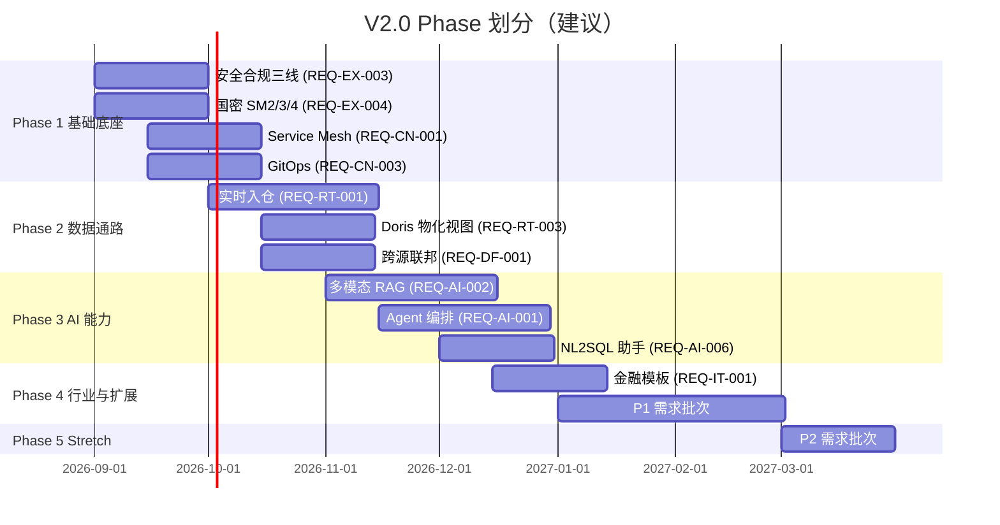

# 数擎大数据平台 V2.0 产品需求文档（PRD）

> 版本：v2.0.0-draft  
> 文档状态：草案  
> 编写日期：2026-08-06  
> 文档负责人：V2.0 首席架构师  
> 适用范围：数擎大数据平台 V2.0 全部新增与增强特性  
> 上游输入：`ROADMAP.md` v2.0.0 章节、`docs/architecture.md` V1.0 架构现状  

---

## 第1章 版本概述

### 1.1 V2.0 愿景

将数擎大数据平台从 V1.0 的"工程成熟度 95/100 的 MVP"演进为"生产级 GA + AI 原生 + 云原生 + 行业生态"四位一体的数据操作系统。V2.0 在不破坏 V1.0 五层架构与四环境零改动交付契约的前提下，向下深化云原生底座（Service Mesh / Serverless / GitOps / 多集群联邦 / FinOps），向上注入 AI 原生能力（Agent 编排 / 多模态 RAG / 模型微调 / NL2SQL 助手），横向扩展数据联邦与实时数仓两条数据通路，并以 5 个新行业模板完成行业生态首轮覆盖。

### 1.2 V2.0 目标

| 目标维度 | V1.0 现状 | V2.0 目标 | 衡量指标 |
| --- | --- | --- | --- |
| 工程成熟度 | 95/100 | ≥ 98/100 | 测试覆盖 ≥ 3000、设计文档 ≥ 60 份、Helm Chart ≥ 75 |
| 云原生能力 | K8s + Helm + HPA | + Service Mesh + Serverless + GitOps + 多集群联邦 + FinOps | 5 项云原生能力全部 GA |
| AI 能力 | 单模态 RAG + LLMOps 基础 | + Agent 编排 + 多模态 RAG + 模型微调 + NL2SQL 助手 | AI 助手查询准确率 ≥ 90% |
| 数据联邦 | Calcite 跨源联邦（Mock） | + 跨集群联邦 + 数据虚拟化（真实） | 联邦查询覆盖 ≥ 5 种数据源 |
| 实时数仓 | Flink → Iceberg V1 | Flink CDC → Iceberg V2 实时入仓 + Doris 实时物化视图 | 入仓延迟 P95 ≤ 5s，查询延迟 P95 ≤ 100ms |
| 行业生态 | 0 个行业模板 | 5 个新行业模板（金融/制造/零售/能源/政务） | 行业模板总数 ≥ 10 |
| 安全合规 | 设计文档定义 | 等保三级 + 密评 + 国密 SM2/3/4 落地 | 通过等保三级测评 |
| 可观测 | 单视图 Grafana | Grafana 双视图 + Alertmanager 分级路由 | 平台方/客户方双视图上线 |

### 1.3 V2.0 与 V1.0 的差异

V2.0 严格遵循"V1.0 五层 + 一横切"架构契约，所有新增模块以"插件式扩展"方式注入到既有层级，不重写既有层职责边界。差异点如下：

| 维度 | V1.0 | V2.0 | 变更性质 |
| --- | --- | --- | --- |
| L0 基础设施层 | 12 个模块（信创/本地/公有/私有 + SKE + 封装层 + 弹性调度） | +4 模块（Service Mesh 控制面 / Serverless 运行时 / GitOps 控制器 / 多集群联邦控制面） | 新增 |
| L2 引擎层 | 10 个模块（Iceberg/Spark/Flink/Trino/Doris/Kafka/IoTDB/多模型 + SQL 网关 + 湖仓集一体） | +3 模块（联邦查询优化器 / 实时入仓管道 / 流批一体调度）+ SQL 网关增强 | 新增 + 增强 |
| L3 治理层 | 7 个模块（元数据/标准/质量/血缘/资产/主数据/安全脱敏） | 治理闭环实时化（延迟从分钟级降至秒级） | 增强 |
| L4 开发分析层 | 6 个模块（集成/调度/IDE/BI + 智能数据层 6 子项） | +4 模块（Agent 编排引擎 / 多模态 RAG 管道 / 模型微调平台 / AI 助手服务） | 新增 |
| L5 产品层 | 6 个模块（控制台/运营/行业模板/业务线/开放 API/资产流通） | +5 行业模板 + FinOps 看板 + 资产流通全流程落地 + 开放 API 落地 | 新增 + 落地 |
| X 横切层 | 4 个模块（身份/安全/运维/网关） | + 国密 CryptoSpiFactory + SecurityFacade 统一封装 + 实时治理管道 + Grafana 双视图 | 新增 + 落地 |
| 外部依赖 | 全部 Mock | V1.1/V1.2 已清零 Mock，V2.0 在真实依赖之上扩展 | 前置依赖 |
| 测试规模 | 2000+ | 3000+ | 扩展 |
| Helm Chart | 59 | ≥ 75 | 扩展 |

### 1.4 V2.0 与长期愿景的对齐

V2.0 是 ROADMAP.md "长期愿景"四条主张的关键落地版本：

- **数据操作系统**：NL2SQL 助手 + Agent 编排让数据从业者用自然语言完成数据分析，进一步屏蔽底层引擎复杂性。
- **开源生态**：5 个行业模板以 Helm Chart 形式开源，吸引行业 ISV 贡献。
- **信创标杆**：国密 SM2/3/4 + 等保三级 + 密评三线落地，巩固信创环境下事实标准地位。
- **AI 原生**：从"数据平台 + AI 能力"演进为"AI 原生数据平台"，AI 贯穿数据全生命周期（采集 → 治理 → 分析 → 应用）。

---

## 第2章 需求清单

> 需求 ID 规范：`REQ-<领域>-<序号>`，领域缩写 CN（云原生）/ AI（AI 能力）/ DF（数据联邦）/ RT（实时数仓）/ IT（行业模板）/ EX（其他增强）。  
> 优先级：P0 = MVP 必做；P1 = V2.0 必做但可后置；P2 = V2.0 stretch / V2.1 候选。

### 2.1 云原生增强领域（CN）

#### REQ-CN-001 Service Mesh 流量治理

| 字段 | 内容 |
| --- | --- |
| 需求 ID | REQ-CN-001 |
| 描述 | 引入 Istio 作为 Service Mesh 控制面，为平台全部自研组件间通信提供 mTLS、流量灰度、熔断、重试、超时、可观测增强能力。 |
| 优先级 | P0 |
| 验收标准 | 1. Istio 控制面以 Helm Chart 形式部署到 SKE 集群，版本 ≥ 1.20。2. 全部 21 个自研组件默认注入 Envoy sidecar，mTLS strict 模式生效。3. sql-gateway → 引擎（Trino/Doris/Spark/Flink）链路支持按流量比例灰度（5%/20%/100%）。4. 熔断规则（连续 5xx ≥ 5 触发熔断 30s）在测试环境验证通过。5. 控制面 CRD（DestinationRule/VirtualService）通过封装层暴露给租户，租户仅能操作本 Namespace 资源。 |
| 依赖 | V1.0 封装层（encaps-layer）、V1.1 真实 K8s client 接入 |

#### REQ-CN-002 Serverless 事件驱动函数

| 字段 | 内容 |
| --- | --- |
| 需求 ID | REQ-CN-002 |
| 描述 | 引入 Knative Serving + Eventing，支持租户以 Serverless 函数形式运行轻量 ETL、Webhook 处理、数据质量校验等事件驱动任务，按需启停、按 invocation 计量。 |
| 优先级 | P1 |
| 验收标准 | 1. Knative Serving ≥ 1.12 + Eventing ≥ 1.12 部署到 SKE。2. 租户可通过控制台提交函数（Python/Java/Go 三种运行时），函数从 0 冷启动到就绪 ≤ 3s。3. 函数支持 Kafka 事件源触发（Knative KafkaSource）与定时 CronJobSource 触发。4. 函数实例数按 RPS 自动伸缩（0 → N），无流量 60s 后缩容到 0。5. 函数 invocation 日志与计量数据写入 Loki 与 Prometheus，按 tenant label 隔离。 |
| 依赖 | REQ-CN-001（Service Mesh）、L2.8 Kafka |

#### REQ-CN-003 GitOps 声明式部署

| 字段 | 内容 |
| --- | --- |
| 需求 ID | REQ-CN-003 |
| 描述 | 引入 ArgoCD 作为 GitOps 控制器，将平台自身与租户工作空间的部署态全部纳管到 Git 仓库，实现声明式 Git 驱动部署、自动漂移检测与回滚。 |
| 优先级 | P0 |
| 验收标准 | 1. ArgoCD ≥ 2.7 部署到运维 Namespace。2. 平台自身 59+ Helm Chart 全部由 ArgoCD Application 纳 Git 同步，sync wave 顺序正确。3. 手动修改集群资源后，ArgoCD 在 30s 内检测到漂移并按策略自动回滚（auto-sync selfHeal=true）。4. 租户工作空间的部署态（DAG/SQL/模型）通过 Git 仓库版本化，控制台提供"提交到 Git"按钮触发 ArgoCD sync。5. Git 仓库支持 GitLab/Gitea/Bitbucket 三种 Provider。 |
| 依赖 | V1.0 Helm Chart 体系、design/deploy/charts |

#### REQ-CN-004 多集群联邦控制面

| 字段 | 内容 |
| --- | --- |
| 需求 ID | REQ-CN-004 |
| 描述 | 引入 Karmada 作为多集群联邦控制面，支持跨 K8s 集群工作负载调度、数据联邦与故障迁移，满足"两地三中心"与"跨地域数据就近分析"场景。 |
| 优先级 | P1 |
| 验收标准 | 1. Karmada ≥ 1.10 控制面部署，纳管 ≥ 3 个成员集群（信创/本地/公有云各 1）。2. 通过 Karmada PropagationPolicy 可将同一 Deployment 调度到指定集群，副本数按集群权重分配。3. 主集群故障时，工作负载在 60s 内迁移到备用集群（OverridePolicy 调整集群本地化配置）。4. Karmada 资源调度策略通过封装层暴露给平台管理员，租户无感知。5. 多集群联邦状态在运营后台可视化（集群健康/负载分布/故障迁移历史）。 |
| 依赖 | REQ-CN-003（GitOps）、L0.5 跨环境供给抽象 |

#### REQ-CN-005 FinOps 成本可视化与优化

| 字段 | 内容 |
| --- | --- |
| 需求 ID | REQ-CN-005 |
| 描述 | 引入 FinOps 能力，按租户 / 工作空间 / 任务 / 引擎四维度采集资源用量与成本，提供成本可视化看板、优化建议（闲置资源/超配资源/可缩容任务）与按租户账单导出。 |
| 优先级 | P1 |
| 验收标准 | 1. 资源用量采集覆盖 CPU/内存/存储/GPU/网络出口五维度，采集粒度 ≤ 1min。2. 成本模型支持按量计费 + 包年包月 + 阶梯价三种计费方式，可配置。3. FinOps 看板展示租户成本 Top10、工作空间成本趋势、任务成本明细、闲置资源清单。4. 优化建议引擎识别"连续 7 天 CPU 利用率 < 5% 的 Pod"等 5 类闲置模式，输出可执行建议。5. 按租户账单可导出 CSV/Excel，含明细行与汇总行，支持分账到子工作空间。 |
| 依赖 | L0.9 可观测基座（Prometheus）、L5.2 运营后台 |

### 2.2 AI 能力增强领域（AI）

#### REQ-AI-001 Agent 编排引擎

| 字段 | 内容 |
| --- | --- |
| 需求 ID | REQ-AI-001 |
| 描述 | 新增 Agent 编排引擎（MAOP，Multi Agents Orchestration Platform），支持多 Agent 协作编排，实现复杂数据分析任务的自主规划、工具调用、子任务分发与结果汇总。 |
| 优先级 | P0 |
| 验收标准 | 1. 编排引擎支持 DAG/State Machine/ReAct 三种编排范式。2. 内置 Agent 角色 ≥ 8 种（规划 Agent/SQL Agent/可视化 Agent/质量 Agent/血缘 Agent/文档 Agent/代码 Agent/审核 Agent）。3. Agent 间通信通过消息总线（Kafka Topic）异步解耦，单次编排可调度 ≥ 20 个 Agent。4. 编排过程可视化（DAG 节点状态/Agent 思考链/工具调用记录），支持人工介入节点。5. 编排任务持久化，支持断点续跑与回放。6. 编排任务通过封装层隔离到租户 Namespace。 |
| 依赖 | L4.5.6 大模型网关、L2.8 Kafka、REQ-AI-003 多模态 RAG |

#### REQ-AI-002 多模态 RAG 管道

| 字段 | 内容 |
| --- | --- |
| 需求 ID | REQ-AI-002 |
| 描述 | 增强知识工程（knowledge-engine）为多模态 RAG 管道，支持文本/表格/图像/语音四模态切片与向量化，混合检索（向量 + 关键词 + 图谱）+ 重排序（Cross-Encoder）。 |
| 优先级 | P0 |
| 验收标准 | 1. 切片器支持文本（语义切片）/表格（行/列/单元格切片）/图像（OCR + 视觉切片）/语音（ASR 转文本后切片）四模态。2. 向量化支持 ≥ 3 种 Embedding 模型（bge-m3/text-embedding-3/multimodal-e5），可配置切换。3. 检索策略支持向量 + BM25 关键词 + NebulaGraph 图谱三路混合，权重可调。4. 重排序器接入 Cross-Encoder（bge-reranker-v2），TopK 从 50 重排到 10。5. RAG 端到端延迟 P95 ≤ 2s（10 万知识库）。6. 知识库按租户隔离，支持增量更新与版本管理。 |
| 依赖 | L4.5.3 向量库 Milvus、L2.10 多模型引擎（NebulaGraph/ES） |

#### REQ-AI-003 大模型多模态网关

| 字段 | 内容 |
| --- | --- |
| 需求 ID | REQ-AI-003 |
| 描述 | 增强 llm-gateway 支持文本/图像/语音/视频多模态输入输出，统一封装 OpenAI/Anthropic/Qwen/智谱/自研模型 API 差异。 |
| 优先级 | P1 |
| 验收标准 | 1. 网关统一 API 兼容 OpenAI Chat Completions 多模态扩展规范。2. 输入支持文本 + 图像（URL/Base64）+ 语音（wav/mp3）+ 视频（mp4 URL），输出支持文本 + 图像（DALL-E/SD）+ 语音（TTS）。3. 模型路由支持按租户/任务类型/成本/延迟四维度策略路由。4. Token 计量覆盖多模态（图像按分辨率折算 token、语音按秒折算 token）。5. 网关支持流式输出（SSE）与异步批处理两种模式。 |
| 依赖 | L4.5.6 大模型网关（V1.0） |

#### REQ-AI-004 模型评测平台

| 字段 | 内容 |
| --- | --- |
| 需求 ID | REQ-AI-004 |
| 描述 | 增强 LLMOps 支持自动化模型评测，覆盖准确率/召回率/F1/延迟/成本/幻觉率六指标，评测报告可视化，支持 A/B 模型对比。 |
| 优先级 | P1 |
| 验收标准 | 1. 评测任务支持自定义评测集与标准评测集（MMLU/CMMLU/CEval 接入）。2. 评测指标计算支持规则评测（exact match/F1）+ 模型评测（LLM-as-Judge）+ 人工评测三种模式。3. 评测报告含指标雷达图/错误样例/延迟分布/成本明细。4. A/B 对比报告高亮两模型差异指标与样例。5. 评测任务 on K8s 编排，支持并发评测多模型。 |
| 依赖 | L4.5.5 LLMOps、REQ-AI-003 多模态网关 |

#### REQ-AI-005 模型微调平台

| 字段 | 内容 |
| --- | --- |
| 需求 ID | REQ-AI-005 |
| 描述 | 增强 LLMOps 支持 LoRA/QLoRA/全参微调三种微调方式，微调任务 on K8s（GPU 节点池）编排，支持微调 → 评测 → 部署闭环。 |
| 优先级 | P1 |
| 验收标准 | 1. 微调方式支持 LoRA（rank 8/16/32 可配）/QLoRA（4bit/8bit 量化）/全参微调三种。2. 微调框架接入 LLaMA-Factory/PEFT/DeepSpeed 三种。3. 微调任务调度到 GPU 节点池，支持多卡数据并行与张量并行。4. 微调 → 评测 → 部署形成一键闭环，中间产物（adapter/评测报告）版本化管理。5. 微调过程监控（loss/lr/gpu 利用率）实时展示。6. 微调模型可注册到模型仓库并一键部署到推理服务。 |
| 依赖 | L4.5.5 LLMOps、L0.12 弹性调度（GPU）、REQ-AI-004 模型评测 |

#### REQ-AI-006 AI 数据分析助手（NL2SQL）

| 字段 | 内容 |
| --- | --- |
| 需求 ID | REQ-AI-006 |
| 描述 | 在统一控制台集成 AI 数据分析助手，支持自然语言转 SQL（NL2SQL）、智能数据解读、智能图表推荐，让业务用户用自然语言完成数据分析。 |
| 优先级 | P0 |
| 验收标准 | 1. NL2SQL 准确率在内部评测集 ≥ 90%（Spider 基准 ≥ 75%）。2. 助手理解上下文（当前工作空间/选中表/历史查询），支持多轮对话澄清。3. 生成的 SQL 自动经过 SQL 网关的权限校验与引擎路由，不绕过治理。4. 查询结果自动推荐图表类型（柱/线/饼/散点/地图），可一键创建 Superset 仪表盘。5. 数据解读功能对查询结果生成自然语言摘要（趋势/异常/对比）。6. 助手支持中文/英文双语，默认中文。 |
| 依赖 | REQ-AI-001 Agent 编排、L2.7 SQL 网关、L4.4 Superset、L3.5 资产目录（Schema 上下文） |

### 2.3 数据联邦领域（DF）

#### REQ-DF-001 跨源联邦查询优化器

| 字段 | 内容 |
| --- | --- |
| 需求 ID | REQ-DF-001 |
| 描述 | 增强 sql-gateway 的 Calcite 联邦优化器，实现跨 Iceberg/Doris/Trino/IoTDB/Elasticsearch/MySQL/Oracle 七种数据源联邦查询与下推优化，替换 V1.0 Mock 实现。 |
| 优先级 | P0 |
| 验收标准 | 1. 联邦查询覆盖 ≥ 5 种数据源（Iceberg/Doris/Trino/IoTDB/ES 必选，MySQL/Oracle 可选）。2. Calcite 优化器实现谓词下推/投影下推/Join 下推三种下推规则，下推率 ≥ 70%。3. 跨源 Join 结果归并正确（列对齐/类型转换/时区处理）。4. 联邦查询计划可视化（Calcite RelNode 树），支持 EXPLAIN。5. 联邦查询延迟 P95 ≤ 10s（跨 3 源、单源数据量 ≤ 100 万行）。6. 联邦查询受 SQL 网关权限校验约束，跨源权限按用户在源上的权限聚合。 |
| 依赖 | L2.7 SQL 网关（V1.0 Calcite）、V1.1 真实引擎接入 |

#### REQ-DF-002 跨集群联邦查询

| 字段 | 内容 |
| --- | --- |
| 需求 ID | REQ-DF-002 |
| 描述 | 基于 Karmada 多集群联邦与 Calcite 跨源联邦，实现跨 K8s 集群数据联邦查询，"数据不动查询动"，满足跨地域/跨环境数据分析场景。 |
| 优先级 | P1 |
| 验收标准 | 1. 跨集群联邦查询覆盖 ≥ 2 个集群（如信创集群 + 公有云集群）。2. 查询路由器根据表元数据定位表所在集群，自动生成跨集群执行计划。3. 跨集群数据传输通过 mTLS 加密，结果在 SQL 网关归并。4. 跨集群查询延迟 P95 ≤ 30s（跨 2 集群、单集群数据量 ≤ 100 万行）。5. 集群间网络中断时查询降级为单集群查询并告警。 |
| 依赖 | REQ-CN-004 多集群联邦、REQ-DF-001 跨源联邦 |

#### REQ-DF-003 数据虚拟化

| 字段 | 内容 |
| --- | --- |
| 需求 ID | REQ-DF-003 |
| 描述 | 支持不迁移数据即对外提供统一查询接口，外部数据源（MySQL/Oracle/Kafka/API）通过虚拟表注册到 SQL 网关，对外如本地表一样查询。 |
| 优先级 | P2 |
| 验收标准 | 1. 虚拟表注册支持 MySQL/Oracle/JDBC/Kafka/REST API 五种外部源。2. 虚拟表元数据（Schema/统计信息）缓存到资产目录，支持手动与定时刷新。3. 虚拟表查询与本地表查询 SQL 语法一致，对用户透明。4. 虚拟表支持物化（按策略同步到 Iceberg），物化后查询走本地加速。5. 虚拟表权限纳入资产目录统一管理。 |
| 依赖 | REQ-DF-001 跨源联邦、L3.5 资产目录 |

### 2.4 实时数仓领域（RT）

#### REQ-RT-001 Flink CDC 实时入仓

| 字段 | 内容 |
| --- | --- |
| 需求 ID | REQ-RT-001 |
| 描述 | 实现 Flink CDC → Iceberg V2 表（行级 upsert）实时入仓管道，替代 V1.0 的 Flink → Iceberg V1 追加写入，入仓延迟从分钟级降至秒级。 |
| 优先级 | P0 |
| 验收标准 | 1. Flink CDC 支持 MySQL/PostgreSQL/Oracle 三种源，Debezium 格式。2. Iceberg V2 表启用 row-level upsert（MERGE INTO 语义），主键冲突时更新而非追加。3. 端到端延迟 P95 ≤ 5s（源表 ≤ 100 万行/分钟变更率）。4. 入仓任务支持 exactly-once 语义（Flink checkpoint + Iceberg commit）。5. 入仓任务通过控制台可视化（源/目的/Flink Job 状态/延迟监控）。6. Schema 变更（加列/改类型）自动同步到 Iceberg 表。 |
| 依赖 | L2.3 Flink、L2.1 Iceberg、L2.8 Kafka（CDC 中转） |

#### REQ-RT-002 流批一体调度

| 字段 | 内容 |
| --- | --- |
| 需求 ID | REQ-RT-002 |
| 描述 | 同一份 Iceberg 表同时支撑批计算（Spark）与流计算（Flink），无需双份存储，统一调度入口。 |
| 优先级 | P1 |
| 验收标准 | 1. Iceberg 表同时被 Spark 批读与 Flink 流读，数据一致（snapshot 隔离）。2. 调度入口统一到 DolphinScheduler，批/流任务在同一 DAG 中编排。3. 流任务 checkpoint 与批任务 snapshot 不冲突。4. 流批一体表在资产目录标注，BI 查询自动选择批快照或流最新视图。5. 流批一体场景示例（实时大屏 + 离线报表同源）文档化。 |
| 依赖 | REQ-RT-001 实时入仓、L4.2 DolphinScheduler、L2.2 Spark |

#### REQ-RT-003 Doris 实时物化视图

| 字段 | 内容 |
| --- | --- |
| 需求 ID | REQ-RT-003 |
| 描述 | Doris 实时物化视图自动同步 Iceberg 变更，查询延迟毫秒级，支撑实时大屏与交互式分析。 |
| 优先级 | P0 |
| 验收标准 | 1. Doris 物化视图基于 Iceberg V2 表变更自动刷新（Flink CDC 触发或 Doris Auto Refresh）。2. 物化视图刷新延迟 P95 ≤ 10s。3. 物化视图查询延迟 P95 ≤ 100ms（聚合查询、数据量 ≤ 1 亿行）。4. 物化视图支持多维聚合（按时间/维度/指标预聚合），视图定义通过控制台管理。5. 查询自动路由到物化视图（查询改写），用户无感知。 |
| 依赖 | REQ-RT-001 实时入仓、L2.5 Doris |

#### REQ-RT-004 实时治理管道

| 字段 | 内容 |
| --- | --- |
| 需求 ID | REQ-RT-004 |
| 描述 | 元数据/血缘/质量规则实时触发，治理闭环延迟从分钟级降至秒级，数据变更即触发治理。 |
| 优先级 | P1 |
| 验收标准 | 1. Iceberg 表变更通过 Iceberg REST Catalog 事件触发元数据采集，延迟 ≤ 5s。2. 血缘解析基于 Flink CDC 实时解析 SQL，血缘图实时更新。3. 质量规则支持实时执行模式（Flink 流式规则），违规即告警。4. 治理闭环端到端延迟 P95 ≤ 10s（变更 → 元数据 → 血缘 → 质量 → 告警）。5. 实时治理管道与批量治理管道并存，用户按表选择模式。 |
| 依赖 | REQ-RT-001 实时入仓、L3.1 元数据采集、L3.4 血缘解析、L3.3 数据质量 |

### 2.5 行业模板扩展领域（IT）

#### REQ-IT-001 金融行业模板

| 字段 | 内容 |
| --- | --- |
| 需求 ID | REQ-IT-001 |
| 描述 | 提供金融行业模板，含风控数据集市 DDL + 监管报表 DAG + 客户画像 Dashboard + RBAC，一键部署到租户工作空间。 |
| 优先级 | P0 |
| 验收标准 | 1. 模板含 ≥ 20 张 DDL（风控/客户/账户/交易/信贷主题）。2. 模板含 ≥ 5 个 DAG（监管报表 ETL/风控模型训练/客户画像更新/反欺诈规则/资金流水对账）。3. 模板含 ≥ 3 个 Dashboard（风控大屏/客户 360 视图/监管报表）。4. 模板含 RBAC（风控员/合规员/客户经理角色）。5. 模板以 Helm Chart 形式交付，`helm install finance-template` 一键部署。6. 模板符合金融行业合规（数据分级/脱敏规则预置）。 |
| 依赖 | L5.3 行业应用模板（V1.0 框架） |

#### REQ-IT-002 制造行业模板

| 字段 | 内容 |
| --- | --- |
| 需求 ID | REQ-IT-002 |
| 描述 | 提供制造行业模板，含设备 OEE 分析 + 质量追溯 + 供应链协同。 |
| 优先级 | P1 |
| 验收标准 | 1. 模板含设备 OEE（综合设备效率）分析 DDL + DAG + Dashboard。2. 模板含质量追溯（批次/工序/缺陷）数据模型与追溯查询。3. 模板含供应链协同（订单/库存/物流）数据模型。4. 模板接入 IoTDB 时序数据（设备传感器）。5. 模板以 Helm Chart 形式交付，一键部署。 |
| 依赖 | L5.3 行业应用模板、L2.9 IoTDB |

#### REQ-IT-003 零售行业模板

| 字段 | 内容 |
| --- | --- |
| 需求 ID | REQ-IT-003 |
| 描述 | 提供零售行业模板，含商品画像 + 会员分析 + 营销效果评估。 |
| 优先级 | P1 |
| 验收标准 | 1. 模板含商品画像（标签体系 + 画像 DDL + 人群圈选）。2. 模板含会员分析（RFM 分群 + 流失预测 + LTV）。3. 模板含营销效果评估（A/B 实验 + 转化漏斗 + ROI）。4. 模板接入标签引擎（tag-engine）。5. 模板以 Helm Chart 形式交付。 |
| 依赖 | L5.3 行业应用模板、L4.5.1 标签画像 |

#### REQ-IT-004 能源行业模板

| 字段 | 内容 |
| --- | --- |
| 需求 ID | REQ-IT-004 |
| 描述 | 提供能源行业模板，含设备监测 + 用能分析 + 碳排放核算。 |
| 优先级 | P2 |
| 验收标准 | 1. 模板含设备监测（实时告警 + 健康度评分）。2. 模板含用能分析（多维度能耗对比 + 趋势预测）。3. 模板含碳排放核算（排放因子库 + 核算模型 + 报表）。4. 模板接入 IoTDB 时序数据。5. 模板以 Helm Chart 形式交付。 |
| 依赖 | L5.3 行业应用模板、L2.9 IoTDB |

#### REQ-IT-005 政务行业模板

| 字段 | 内容 |
| --- | --- |
| 需求 ID | REQ-IT-005 |
| 描述 | 提供政务行业模板，含人口分析 + 经济运行 + 民生服务。 |
| 优先级 | P2 |
| 验收标准 | 1. 模板含人口分析（人口结构/流动/预测）。2. 模板含经济运行（GDP/产业/投资/消费指标）。3. 模板含民生服务（政务服务/满意度/热点）。4. 模板符合政务合规（数据分级/脱敏/审计）。5. 模板以 Helm Chart 形式交付。 |
| 依赖 | L5.3 行业应用模板 |

### 2.6 其他增强领域（EX）

#### REQ-EX-001 数据资产流通全流程

| 字段 | 内容 |
| --- | --- |
| 需求 ID | REQ-EX-001 |
| 描述 | 资产登记/上架/流通/变现/分账全流程落地，支持数据资产在平台内与跨平台交易。 |
| 优先级 | P1 |
| 验收标准 | 1. 资产登记支持元数据/质量分/血缘/样品预览。2. 资产上架支持定价（按次/按量/订阅）与上架审核。3. 资产流通支持申请/审批/签约/交付/评价闭环。4. 资产变现支持按合约自动结算与分账（提供方/平台方/经纪方）。5. 流通全过程审计留痕，符合数据合规。6. 资产流通看板展示流通量/成交额/Top 资产。 |
| 依赖 | L5.6 数据资产流通（V1.0 框架）、L3.5 资产目录 |

#### REQ-EX-002 开放 API 服务目录落地

| 字段 | 内容 |
| --- | --- |
| 需求 ID | REQ-EX-002 |
| 描述 | API 发布管理 + 服务目录 + 订阅计费落地，对外提供数据 API 化盘。 |
| 优先级 | P1 |
| 验收标准 | 1. API 发布支持从 SQL/模型/函数一键生成 RESTful API。2. API 服务目录支持分类/检索/试用。3. API 订阅支持申请/审批/Key 颁发/限流配置。4. API 计费支持按调用次数/数据量/时长三种计费方式。5. API 网关接入 APISIX 插件链（jwt-auth/limit-req/prometheus）。6. API 调用日志与计量数据按订阅方隔离。 |
| 依赖 | L5.5 开放 API 目录（V1.0 框架）、X4 APISIX 网关 |

#### REQ-EX-003 安全合规三线落地

| 字段 | 内容 |
| --- | --- |
| 需求 ID | REQ-EX-003 |
| 描述 | 等保三级 + 密评 + 数据合规三线框架落地，SecurityFacade 统一封装安全能力。 |
| 优先级 | P0 |
| 验收标准 | 1. 等保三级控制项全部落地（物理/网络/主机/应用/数据/管理 6 类）。2. 密评控制项落地（密钥管理/加密存储/加密传输/密文检索）。3. 数据合规框架落地（数据分级/分类/共享/出境/留存）。4. SecurityFacade 统一封装加解密/脱敏/审计/鉴权四能力，对上层提供一致 API。5. 安全合规证据自动归档，支持等保/密评测评导出。6. 通过等保三级测评（外部机构）。 |
| 依赖 | X2 安全合规（V1.0 设计）、REQ-EX-004 国密 |

#### REQ-EX-004 国密 SM2/3/4 支持

| 字段 | 内容 |
| --- | --- |
| 需求 ID | REQ-EX-004 |
| 描述 | 国密 SM2（公钥）/SM3（摘要）/SM4（对称）可插拔，CryptoSpiFactory 抽象落地，信创环境默认国密。 |
| 优先级 | P0 |
| 验收标准 | 1. CryptoSpiFactory 抽象支持 SM2/SM3/SM4 + RSA/SHA/AES 双栈，按 Profile 切换。2. 信创 Profile 默认国密（SM2 签名/SM3 摘要/SM4 加密）。3. JWT 签名支持 SM2，Keycloak Realm 可配置国密。4. 存储加密支持 SM4（Iceberg 表数据加密）。5. 传输加密支持 SM4 + TLS 国密套件（GMTLS）。6. 国密实现接入通过国密局认证的密码模块（如华为 GMBase）。 |
| 依赖 | X1 统一身份权限（Keycloak）、L2.1 Iceberg |

#### REQ-EX-005 可观测增强（Grafana 双视图）

| 字段 | 内容 |
| --- | --- |
| 需求 ID | REQ-EX-005 |
| 描述 | Grafana 双视图（平台方全局 + 客户方业务健康）+ Alertmanager 分级路由 + 统一查询 API。 |
| 优先级 | P1 |
| 验收标准 | 1. 平台方 Grafana 看板覆盖集群/引擎/组件/租户四维度全局视图。2. 客户方 Grafana 看板仅展示本租户业务健康（查询延迟/任务成功率/数据质量分）。3. Alertmanager 分级路由（P0 电话/短信/P1 邮件/IM/P2 钉钉/飞书）。4. 统一查询 API（PromQL/LogQL/TraceQL）通过 APISIX 暴露，按租户隔离。5. 双视图通过 Grafana Organization 隔离，RBAC 控制看板访问。 |
| 依赖 | L0.9 可观测基座（V1.0）、X4 APISIX |

### 2.7 需求汇总矩阵

| 领域 | 需求 ID | 优先级 | 一句话描述 |
| --- | --- | --- | --- |
| 云原生 | REQ-CN-001 | P0 | Service Mesh（Istio）流量治理 |
| 云原生 | REQ-CN-002 | P1 | Serverless（Knative）事件驱动函数 |
| 云原生 | REQ-CN-003 | P0 | GitOps（ArgoCD）声明式部署 |
| 云原生 | REQ-CN-004 | P1 | 多集群联邦（Karmada） |
| 云原生 | REQ-CN-005 | P1 | FinOps 成本可视化 |
| AI | REQ-AI-001 | P0 | Agent 编排引擎（MAOP） |
| AI | REQ-AI-002 | P0 | 多模态 RAG 管道 |
| AI | REQ-AI-003 | P1 | 大模型多模态网关 |
| AI | REQ-AI-004 | P1 | 模型评测平台 |
| AI | REQ-AI-005 | P1 | 模型微调平台（LoRA/QLoRA） |
| AI | REQ-AI-006 | P0 | AI 数据分析助手（NL2SQL） |
| 数据联邦 | REQ-DF-001 | P0 | 跨源联邦查询优化器 |
| 数据联邦 | REQ-DF-002 | P1 | 跨集群联邦查询 |
| 数据联邦 | REQ-DF-003 | P2 | 数据虚拟化 |
| 实时数仓 | REQ-RT-001 | P0 | Flink CDC 实时入仓（Iceberg V2） |
| 实时数仓 | REQ-RT-002 | P1 | 流批一体调度 |
| 实时数仓 | REQ-RT-003 | P0 | Doris 实时物化视图 |
| 实时数仓 | REQ-RT-004 | P1 | 实时治理管道 |
| 行业模板 | REQ-IT-001 | P0 | 金融行业模板 |
| 行业模板 | REQ-IT-002 | P1 | 制造行业模板 |
| 行业模板 | REQ-IT-003 | P1 | 零售行业模板 |
| 行业模板 | REQ-IT-004 | P2 | 能源行业模板 |
| 行业模板 | REQ-IT-005 | P2 | 政务行业模板 |
| 其他 | REQ-EX-001 | P1 | 数据资产流通全流程 |
| 其他 | REQ-EX-002 | P1 | 开放 API 服务目录落地 |
| 其他 | REQ-EX-003 | P0 | 安全合规三线落地 |
| 其他 | REQ-EX-004 | P0 | 国密 SM2/3/4 支持 |
| 其他 | REQ-EX-005 | P1 | 可观测增强（Grafana 双视图） |

**需求统计**：共 28 项需求，其中 P0 = 11 项、P1 = 13 项、P2 = 4 项。

---

## 第3章 用户故事

> 用户故事格式：作为 `<角色>`，我希望 `<能力>`，以便 `<价值>`。  
> 角色：平台管理员 / 数据工程师 / 数据分析师 / 业务用户 / AI 工程师。

### 3.1 平台管理员用户故事

| 故事 ID | 用户故事 |
| --- | --- |
| US-ADMIN-001 | 作为平台管理员，我希望通过 GitOps 一键回滚平台到任意历史版本，以便在升级失败时快速恢复服务。 |
| US-ADMIN-002 | 作为平台管理员，我希望通过 Service Mesh 配置灰度发布策略，以便在不停机情况下验证新版本。 |
| US-ADMIN-003 | 作为平台管理员，我希望通过多集群联邦控制面统一管理跨地域集群，以便实现"两地三中心"高可用。 |
| US-ADMIN-004 | 作为平台管理员，我希望通过 FinOps 看板查看租户成本与优化建议，以便优化平台资源利用率与成本。 |
| US-ADMIN-005 | 作为平台管理员，我希望通过 Grafana 平台方视图监控全部集群/引擎/组件健康，以便第一时间发现平台异常。 |
| US-ADMIN-006 | 作为平台管理员，我希望通过 SecurityFacade 一处配置等保三级/密评/数据合规策略，以便应对多线合规测评。 |
| US-ADMIN-007 | 作为平台管理员，我希望通过国密 Profile 一键切换国密/国际算法栈，以便在信创与非信创环境间零改动切换。 |
| US-ADMIN-008 | 作为平台管理员，我希望通过 Alertmanager 分级路由配置 P0/P1/P2 告警通道，以便按严重程度触达不同人员。 |

### 3.2 数据工程师用户故事

| 故事 ID | 用户故事 |
| --- | --- |
| US-ENG-001 | 作为数据工程师，我希望通过 Flink CDC 实时入仓管道配置 MySQL → Iceberg V2 同步，以便秒级延迟支撑实时分析。 |
| US-ENG-002 | 作为数据工程师，我希望同一份 Iceberg 表同时支撑批计算与流计算，以便避免双份存储与数据不一致。 |
| US-ENG-003 | 作为数据工程师，我希望通过 Serverless 函数运行轻量 ETL，以便按需启停节省资源。 |
| US-ENG-004 | 作为数据工程师，我希望通过 GitOps 将我的 DAG/SQL 提交到 Git 仓库版本化，以便追溯变更与回滚。 |
| US-ENG-005 | 作为数据工程师，我希望通过实时治理管道在数据变更时即时触发质量校验，以便第一时间发现数据质量问题。 |
| US-ENG-006 | 作为数据工程师，我希望通过跨集群联邦查询分析跨地域数据，以便数据不动即可跨地域分析。 |
| US-ENG-007 | 作为数据工程师，我希望通过数据虚拟化注册外部 MySQL 为虚拟表，以便不迁移数据即可纳入平台查询。 |

### 3.3 数据分析师用户故事

| 故事 ID | 用户故事 |
| --- | --- |
| US-ANALYST-001 | 作为数据分析师，我希望用自然语言提问"上月销售额 Top10 商品"，AI 助手自动生成 SQL 与图表，以便我不会 SQL 也能分析数据。 |
| US-ANALYST-002 | 作为数据分析师，我希望 AI 助手多轮对话澄清我的分析意图，以便准确理解我的分析需求。 |
| US-ANALYST-003 | 作为数据分析师，我希望 AI 助手对查询结果生成自然语言摘要（趋势/异常/对比），以便快速理解数据含义。 |
| US-ANALYST-004 | 作为数据分析师，我希望通过 Doris 实时物化视图查询毫秒级返回，以便支撑实时大屏与交互式分析。 |
| US-ANALYST-005 | 作为数据分析师，我希望通过跨源联邦查询一次 SQL 跨 Iceberg + Doris + ES 查询，以便不用切换数据源。 |
| US-ANALYST-006 | 作为数据分析师，我希望通过 Grafana 客户方视图查看本租户业务健康，以便了解查询延迟与任务成功率。 |
| US-ANALYST-007 | 作为数据分析师，我希望 AI 助手推荐图表类型并一键创建 Superset 仪表盘，以便快速可视化分析结果。 |

### 3.4 业务用户用户故事

| 故事 ID | 用户故事 |
| --- | --- |
| US-BIZ-001 | 作为业务用户，我希望通过金融行业模板一键部署风控数据集市，以便快速启动风控数据分析。 |
| US-BIZ-002 | 作为业务用户，我希望通过制造行业模板查看设备 OEE 分析，以便监控设备综合效率。 |
| US-BIZ-003 | 作为业务用户，我希望通过零售行业模板圈选人群，以便精准营销。 |
| US-BIZ-004 | 作为业务用户，我希望通过数据资产流通市场订阅外部数据资产，以便丰富我的分析数据。 |
| US-BIZ-005 | 作为业务用户，我希望通过开放 API 服务目录订阅数据 API，以便将数据嵌入我的业务系统。 |
| US-BIZ-006 | 作为业务用户，我希望通过 FinOps 看板查看我的工作空间成本，以便控制数据分析成本。 |

### 3.5 AI 工程师用户故事

| 故事 ID | 用户故事 |
| --- | --- |
| US-AIENG-001 | 作为 AI 工程师，我希望通过 Agent 编排引擎编排多 Agent 协作完成复杂数据分析，以便自动化数据分析全流程。 |
| US-AIENG-002 | 作为 AI 工程师，我希望通过多模态 RAG 管道管理文本/表格/图像混合知识库，以便支撑多模态问答。 |
| US-AIENG-003 | 作为 AI 工程师，我希望通过模型微调平台 LoRA 微调大模型，以便适配业务领域。 |
| US-AIENG-004 | 作为 AI 工程师，我希望通过模型评测平台 A/B 对比两模型，以便选择最优模型上线。 |
| US-AIENG-005 | 作为 AI 工程师，我希望通过大模型多模态网关统一调用多家模型 API，以便切换模型不改动业务代码。 |
| US-AIENG-006 | 作为 AI 工程师，我希望编排过程可视化（DAG 节点状态/Agent 思考链/工具调用记录），以便调试与优化编排。 |
| US-AIENG-007 | 作为 AI 工程师，我希望微调 → 评测 → 部署一键闭环，以便快速迭代模型。 |

---

## 第4章 非功能需求

### 4.1 性能指标

| 指标维度 | 指标项 | V1.0 基线 | V2.0 目标 | 测量方法 |
| --- | --- | --- | --- | --- |
| 查询延迟 | 交互查询 P95（Doris 单源） | 200ms | 100ms | Doris 查询日志 |
| 查询延迟 | 联邦查询 P95（跨 3 源） | N/A | 10s | SQL 网关日志 |
| 查询延迟 | 跨集群联邦查询 P95（跨 2 集群） | N/A | 30s | SQL 网关日志 |
| 查询延迟 | NL2SQL 端到端 P95 | N/A | 5s | AI 助手日志 |
| 入仓延迟 | Flink CDC → Iceberg V2 P95 | 分钟级 | 5s | Flink checkpoint 间隔 |
| 物化视图刷新 | Doris 物化视图刷新 P95 | N/A | 10s | Doris refresh 日志 |
| 治理闭环 | 实时治理端到端 P95 | 分钟级 | 10s | 治理管道日志 |
| RAG 检索 | 多模态 RAG P95（10 万知识库） | N/A | 2s | knowledge-engine 日志 |
| Agent 编排 | 单次编排 P95（10 Agent） | N/A | 30s | MAOP 日志 |
| Serverless 冷启动 | 函数 0 → 就绪 | N/A | 3s | Knative metrics |
| 联邦查询覆盖 | 支持数据源种类 | 4（Mock） | ≥ 5（真实） | 集成测试 |
| NL2SQL 准确率 | Spider 基准 | N/A | ≥ 75% | 评测集 |
| NL2SQL 准确率 | 内部评测集 | N/A | ≥ 90% | 评测集 |

### 4.2 可用性（SLA）

| SLA 项 | V1.0 | V2.0 目标 | 保障机制 |
| --- | --- | --- | --- |
| 平台控制台可用性 | 99.5% | 99.9% | 多副本 + 滚动升级 + 健康检查 |
| SQL 网关可用性 | 99.5% | 99.9% | 多副本 + Service Mesh 熔断 |
| AI 助手可用性 | N/A | 99.5% | 多模型热备 + 降级到规则引擎 |
| 多集群故障迁移 | N/A | RTO ≤ 60s | Karmada + OverridePolicy |
| 数据入仓不丢 | exactly-once | exactly-once | Flink checkpoint + Iceberg commit |
| GitOps 漂移检测 | N/A | ≤ 30s | ArgoCD sync wave + selfHeal |

### 4.3 安全性

| 安全项 | V1.0 | V2.0 目标 | 落地机制 |
| --- | --- | --- | --- |
| 等保合规 | 设计文档定义 | 等保三级通过 | SecurityFacade + 证据归档 |
| 密评合规 | 设计文档定义 | 密评通过 | CryptoSpiFactory + 国密模块 |
| 数据合规 | 设计文档定义 | 数据合规三线 | 数据分级/分类/共享/出境/留存 |
| 国密支持 | SM2/3/4 设计 | SM2/3/4 落地 | CryptoSpiFactory + Profile 切换 |
| 服务间加密 | TLS | mTLS strict | Istio Service Mesh |
| 多租户隔离 | Namespace + Quota + NetworkPolicy | + Service Mesh 租户隔离 + Serverless 函数隔离 | Istio AuthorizationPolicy + Knative Namespace |
| AI 数据安全 | N/A | 提示词审计 + 输出过滤 + 模型隔离 | AI 助手审计日志 + 内容安全过滤 |

### 4.4 兼容性

| 兼容性项 | V2.0 要求 |
| --- | --- |
| V1.0 API 兼容 | V2.0 全部 V1.0 API 向后兼容，不破坏既有调用方 |
| V1.0 Helm Chart 兼容 | V1.0 Chart 可平滑升级到 V2.0（helm upgrade） |
| V1.0 数据兼容 | V1.0 Iceberg 表/V1.0 元数据可被 V2.0 读写 |
| K8s 版本兼容 | 支持 K8s 1.26 ~ 1.30 |
| 四环境兼容 | 信创/本地/公有/私有四环境零改动交付契约保持 |
| 浏览器兼容 | Chrome ≥ 100 / Edge ≥ 100 / Firefox ≥ 100 / Safari ≥ 15 |
| 模型 API 兼容 | OpenAI/Anthropic/Qwen/智谱 API 兼容 |

---

## 第5章 范围与优先级

### 5.1 MVP 范围定义

V2.0 MVP（最小可行版本）范围 = 全部 P0 需求 = 11 项：

| 领域 | MVP 需求 |
| --- | --- |
| 云原生 | REQ-CN-001 Service Mesh、REQ-CN-003 GitOps |
| AI | REQ-AI-001 Agent 编排、REQ-AI-002 多模态 RAG、REQ-AI-006 NL2SQL 助手 |
| 数据联邦 | REQ-DF-001 跨源联邦查询 |
| 实时数仓 | REQ-RT-001 实时入仓、REQ-RT-003 Doris 实时物化视图 |
| 行业模板 | REQ-IT-001 金融行业模板 |
| 其他 | REQ-EX-003 安全合规三线、REQ-EX-004 国密 SM2/3/4 |

MVP 验收标准：以上 11 项需求全部通过验收，平台可在信创环境通过等保三级测评，AI 助手 NL2SQL 准确率 ≥ 90%。

### 5.2 Phase 划分建议

| Phase | 时间窗口 | 范围 | 出口标准 |
| --- | --- | --- | --- |
| Phase 1 基础底座 | 2026-09 ~ 2026-10 | 安全合规 + 国密 + Service Mesh + GitOps | 等保三级可测评、GitOps 接管全部 Chart |
| Phase 2 数据通路 | 2026-10 ~ 2026-11 | 实时入仓 + Doris 物化视图 + 跨源联邦 | 入仓延迟 P95 ≤ 5s、联邦查询覆盖 5 源 |
| Phase 3 AI 能力 | 2026-11 ~ 2026-12 | 多模态 RAG + Agent 编排 + NL2SQL 助手 | NL2SQL 准确率 ≥ 90% |
| Phase 4 行业与扩展 | 2026-12 ~ 2027-02 | 金融模板 + 全部 P1 需求 | 5 行业模板上线、FinOps/Serverless/多集群 GA |
| Phase 5 Stretch | 2027-03 | P2 需求（数据虚拟化/能源/政务） | stretch 目标达成或转入 V2.1 |

### 5.3 优先级决策原则

1. **合规优先**：等保三级 + 国密是信创准入门槛，必须 P0。
2. **数据通路优先**：实时入仓 + 联邦查询是数据平台核心价值，必须 P0。
3. **AI 差异化优先**：Agent 编排 + 多模态 RAG + NL2SQL 是 V2.0 旗舰卖点，必须 P0。
4. **行业生态首轮**：金融行业是数据密集型 + 合规要求最高，作为 P0 验证模板框架，其余行业 P1/P2 滚动。
5. **云原生底座**：Service Mesh + GitOps 是其他云原生能力的基础，P0；Serverless/多集群/FinOps 依赖前者，P1。
6. **stretch 滚动**：数据虚拟化、能源/政务模板可滚动到 V2.1，不影响 V2.0 GA。

---

## 第6章 风险与约束

### 6.1 技术风险

| 风险 ID | 风险描述 | 影响 | 概率 | 缓解措施 |
| --- | --- | --- | --- | --- |
| R-TECH-001 | NL2SQL 准确率不达 90% | AI 助手差异化卖点受损 | 中 | 预置高质量 Schema 上下文 + 多轮澄清 + 人工标注评测集持续优化 |
| R-TECH-002 | Iceberg V2 行级 upsert 在高频变更下性能退化 | 实时入仓延迟超标 | 中 | 压测验证 + 小批量合并 + Compaction 策略调优 |
| R-TECH-003 | Calcite 跨源联邦查询下推率不达 70% | 联邦查询延迟超标 | 中 | 自定义下推规则 + 物化视图加速 + 查询提示 |
| R-TECH-004 | Service Mesh sidecar 对性能损耗 ≥ 10% | 平台吞吐下降 | 低 | 按 Namespace 选择性注入 + eBPF 替代方案预留 |
| R-TECH-005 | 多集群联邦网络延迟导致查询超时 | 跨集群查询不可用 | 中 | 查询超时配置 + 单集群降级 + 就近路由 |
| R-TECH-006 | Agent 编排死循环或工具调用失控 | 编排任务资源耗尽 | 中 | 编排步数上限 + 工具调用白名单 + 资源配额 |
| R-TECH-007 | 国密模块性能损耗 ≥ 30% | 信创环境性能不达标 | 中 | 国密硬件加速 + 算法分离 + 性能压测 |
| R-TECH-008 | 模型微调 GPU 资源不足 | 微调任务排队 | 高 | GPU 节点池弹性 + 微调任务优先级队列 + QLoRA 降 GPU 需求 |

### 6.2 依赖风险

| 风险 ID | 风险描述 | 影响 | 概率 | 缓解措施 |
| --- | --- | --- | --- | --- |
| R-DEP-001 | V1.1/V1.2 Mock 清零未完成 | V2.0 在 Mock 之上扩展，无法验证真实链路 | 高 | V2.0 Phase 1 强依赖 V1.1 完成，并行推进 V1.2 |
| R-DEP-002 | Istio/Karmada/Knative 上游版本不兼容 SKE K8s 版本 | 云原生能力无法落地 | 中 | SKE K8s 版本锁定 1.28 + 上游兼容性矩阵验证 |
| R-DEP-003 | 国密密码模块未通过国密局认证 | 信创合规不达标 | 中 | 提前接入华为 GMBase 等已认证模块 |
| R-DEP-004 | 大模型 API 限流或下线 | AI 能力不可用 | 中 | 多模型热备 + 自研模型兜底 + 模型路由降级 |
| R-DEP-005 | Flink CDC/Iceberg V2 上游 bug | 实时入仓不稳定 | 中 | 锁定稳定版本 + 社区 bug 跟踪 + 补丁回填 |

### 6.3 资源约束

| 约束 ID | 约束描述 | 影响范围 | 应对策略 |
| --- | --- | --- | --- |
| C-RES-001 | V2.0 共 28 项需求，研发人力 ≥ 30 人月 | 全部需求按时交付风险 | Phase 划分 + P0/P1/P2 滚动 + stretch 转入 V2.1 |
| C-RES-002 | GPU 资源有限（微调 + 推理 + Embedding） | AI 能力并发受限 | GPU 节点池弹性 + 任务优先级 + QLoRA + 推理量化 |
| C-RES-003 | 等保三级测评周期 ≥ 3 个月 | V2.0 GA 时间受测评制约 | Phase 1 即启动合规整改，与开发并行 |
| C-RES-004 | 多集群联邦测试环境搭建成本高 | 跨集群能力验证不充分 | 混合云测试环境 + kind 多集群模拟 |
| C-RES-005 | 行业模板需领域专家参与 | 模板业务准确性风险 | 领域专家评审 + 模板 Beta 客户验证 |

### 6.4 约束条件

| 约束类型 | 约束内容 |
| --- | --- |
| 架构契约 | 不破坏 V1.0 五层 + 一横切架构，新增模块以插件式扩展注入既有层级 |
| 环境契约 | 四环境（信创/本地/公有/私有）零改动交付契约保持 |
| 兼容契约 | V1.0 API/Helm Chart/数据向后兼容 |
| 信创契约 | 信创环境默认国密，不依赖国际密码算法 |
| 多租户契约 | 全部新增能力按租户隔离，不破坏 V1.0 三重隔离机制 |
| 开源契约 | 全部新增组件以 Apache 2.0 协议开源 |

---

## 附录 A 术语表

| 术语 | 含义 |
| --- | --- |
| MAOP | Multi Agents Orchestration Platform，多 Agent 编排平台 |
| NL2SQL | Natural Language to SQL，自然语言转 SQL |
| RAG | Retrieval Augmented Generation，检索增强生成 |
| LoRA | Low-Rank Adaptation，低秩适配微调 |
| QLoRA | Quantized LoRA，量化低秩适配微调 |
| FinOps | Financial Operations，云财务运营 |
| GitOps | Git-driven Operations，Git 驱动运维 |
| CDC | Change Data Capture，变更数据捕获 |
| MVP | Minimum Viable Product，最小可行产品 |
| GA | General Availability，正式可用 |
| SLA | Service Level Agreement，服务等级协议 |
| RTO | Recovery Time Objective，恢复时间目标 |
| mTLS | mutual TLS，双向 TLS 加密 |
| SPI | Service Provider Interface，服务提供者接口 |

## 附录 B 变更记录

| 版本 | 日期 | 变更内容 | 作者 |
| --- | --- | --- | --- |
| v2.0.0-draft | 2026-08-06 | 初稿，覆盖 28 项需求 | V2.0 首席架构师 |