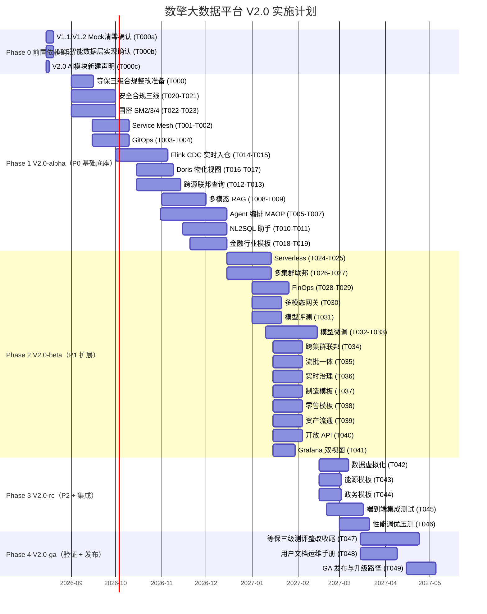
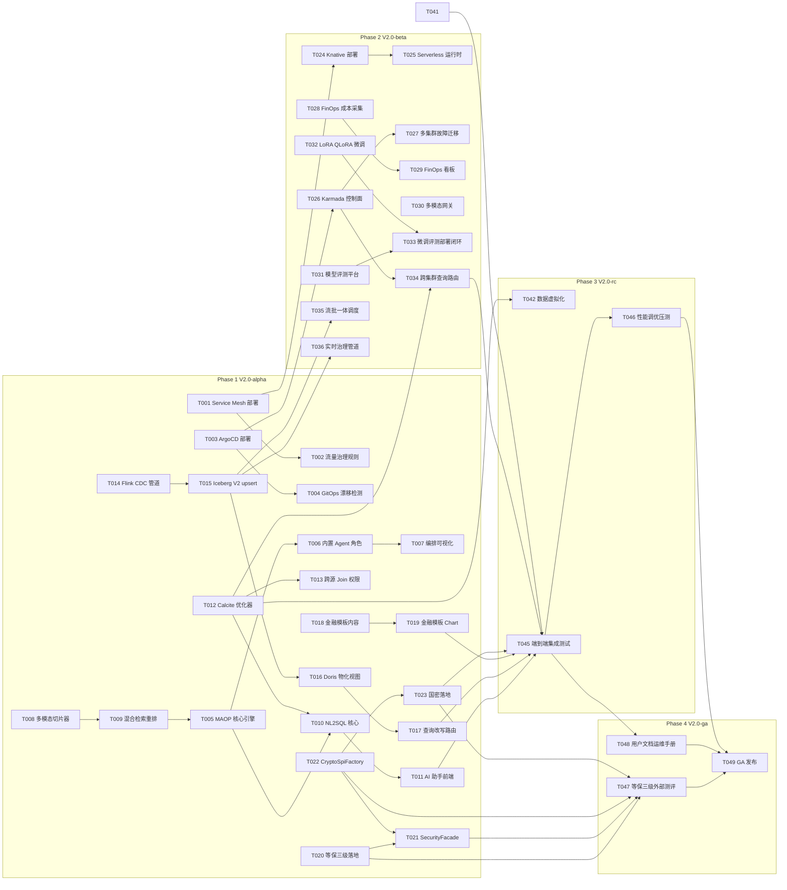
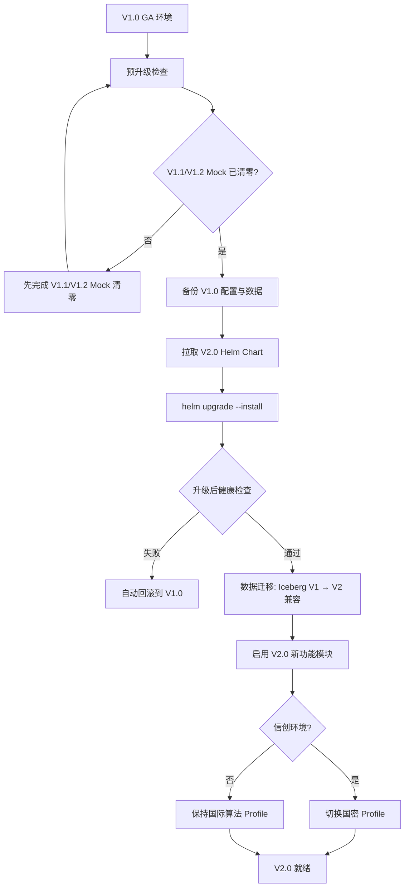

# 数擎大数据平台 V2.0 实施计划

> 版本：v2.0.0-draft  
> 文档状态：草案  
> 编写日期：2026-08-06  
> 文档负责人：V2.0 项目规划师  
> 适用范围：数擎大数据平台 V2.0 全部 28 项需求的任务分解、依赖分析、里程碑、风险与资源估算  
> 上游输入：`V2.0_PRD_产品需求文档.md`（28 项需求）、`V2.0_架构设计文档.md`（12 新增 + 17 增强模块）、4 份详细设计文档

---

## 第1章 实施总览

### 1.1 V2.0 总体里程碑

V2.0 基于 PRD 第 5.2 节的 5 个 Phase 划分，映射为 4 个发布里程碑（alpha → beta → rc → ga），并新增 Phase 0 前置依赖确认阶段，总工期 9 个月（2026-08-15 ~ 2027-05-10，含 Phase 0 前置 2 周 + Phase 4 测评收尾 8 周）。

表：V2.0-总体里程碑对照表

| 发布里程碑 | 对应 PRD Phase | 时间窗口 | 范围概述 | 需求数 | 任务数 | 出口标准 |
| --- | --- | --- | --- | --- | --- | --- |
| V2.0-phase0 | Phase 0 前置依赖确认 | 2026-08-15 ~ 2026-08-31 | V1.1/V1.2 Mock 清零 + L4.5 实现 + AI 模块新建声明 | 0 | 3 | Mock 清零状态确认、L4.5 实现确认、AI 模块新建声明 |
| V2.0-alpha | Phase 1 + 2 + 3 | 2026-09 ~ 2026-12 | 全部 P0 需求（11 项） | 11 | 24 | 等保三级可测评、NL2SQL 准确率 ≥ 90%、入仓延迟 P95 ≤ 5s |
| V2.0-beta | Phase 4（P1 部分） | 2026-12 ~ 2027-02 | 全部 P1 需求（14 项） | 14 | 18 | 5 项云原生 GA、微调闭环、3 行业模板上线 |
| V2.0-rc | Phase 5 + 集成 | 2027-02 ~ 2027-03 | 全部 P2 需求（3 项）+ 集成测试 + 性能优化 | 3 | 5 | 端到端集成测试通过、性能指标达标 |
| V2.0-ga | 验证 + 发布 | 2027-03 ~ 2027-05 | 端到端验证 + 文档 + 发布 | 0 | 3 | 等保三级测评通过、文档完备、正式发布 |

**需求统计**：共 28 项需求（P0 = 11 / P1 = 14 / P2 = 3），分解为 55 个可执行任务（Phase 0 前置 3 + Phase 1~4 共 52）。

### 1.2 Gantt 图

### 1.3 团队规模与角色需求

表：V2.0-团队角色与规模参数说明表

| 角色 | 人数 | 主要职责 | 技能要求 | 参与 Phase |
| --- | --- | --- | --- | --- |
| 首席架构师 | 1 | 架构决策、技术选型、跨领域协调 | 10+ 年大数据 + 云原生 + AI 架构经验 | 1-4 |
| 云原生架构师 | 1 | Service Mesh / GitOps / Karmada / FinOps 架构 | Istio / ArgoCD / Karmada 深度经验 | 1-2 |
| AI 架构师 | 1 | Agent / RAG / 微调 / NL2SQL 架构 | LLM 应用 + RAG + Agent 编排经验 | 1-2 |
| Java 开发工程师 | 8 | SQL 网关 / 联邦优化器 / 治理 / 安全 / 模板后端 | Java 17 + Spring Boot 3.2 + Calcite | 1-4 |
| Go 开发工程师 | 3 | Agent 编排引擎 / Serverless 运行时 / 多集群控制面 | Go + K8s operator + gRPC | 1-2 |
| Python 开发工程师 | 4 | RAG 管道 / NL2SQL / 模型微调 / 评测 / AI 助手 | Python + PyTorch + LangChain | 1-2 |
| 前端开发工程师 | 3 | 控制台 / AI 助手 UI / 编排可视化 / FinOps 看板 | Vue 3 + TypeScript + ECharts | 1-4 |
| DevOps 工程师 | 4 | Helm Chart / GitOps / CI/CD / 多集群部署 / 可观测 | Helm + ArgoCD + K8s + Prometheus | 1-4 |
| 测试工程师 | 4 | 单元 / 集成 / E2E / 性能 / 安全测试 | JUnit + PyTest + JMeter + SonarQube | 1-4 |
| 安全合规工程师 | 2 | 等保三级 / 密评 / 国密 / 数据合规落地 | 等保测评 + 国密 + 安全审计 | 1-4 |
| 领域专家（兼职） | 2 | 金融 / 制造 / 零售 / 能源 / 政务业务模型评审 | 行业数据分析经验 | 1-3 |

**核心团队规模**：29 人全职 + 2 人兼职，峰值并行期（2026-11 ~ 2027-02）全员投入。

---

## 第2章 任务分解

> 任务 ID 规范：`V2.0-T<序号>`，序号三位数字从 001 起递增。  
> 工时单位：人天（1 人天 = 8 小时）。  
> 依赖任务：列出直接前置任务 ID，无依赖则标注"无"。

### 2.0 Phase 0 — 前置依赖确认

Phase 0 在 V2.0 正式开发前确认 V1.1/V1.2 Mock 清零状态、V1.0 L4.5 智能数据层实现状态，并声明 V2.0 AI 模块为新建而非复用 V1.0，分解为 3 个任务，预估 12 人天。Phase 1 全部任务以 Phase 0 完成为硬阻塞前置条件。

表：V2.0-Phase0-前置依赖确认任务参数说明表

| 任务 ID | 任务名称 | 需求来源 | 优先级 | 预估工时 | 依赖任务 | 产出物 | 验收标准 |
| --- | --- | --- | --- | --- | --- | --- | --- |
| V2.0-T000a | V1.1/V1.2 Mock 清零状态确认 | R-DEP-001 | P0 | 5 人天 | 无 | Mock 清零状态核查报告、V1.1/V1.2 实现进度清单、未清零项风险登记 | V1.1/V1.2 Mock 清零状态明确；未清零项纳入风险跟踪；若未就绪则 V2.0 Phase 1 阻塞 |
| V2.0-T000b | V1.0 L4.5 智能数据层实现状态确认 | R-DEP-001 | P0 | 5 人天 | 无 | L4.5 实现状态核查报告、向量库/LLMOps/大模型网关可用性清单 | L4.5 六子项实现状态明确；不可用项纳入 V2.0 增强范围 |
| V2.0-T000c | V2.0 AI 模块新建（非复用 V1.0）声明 | R-DEP-001 | P0 | 2 人天 | 无 | AI 模块新建声明文档、与 V1.0 L4.5 职责边界划分 | 明确 V2.0 AI 模块（MAOP/RAG/微调/NL2SQL）为新建而非复用 V1.0；职责边界清晰 |

**Phase 0 小计**：3 个任务，预估 12 人天。

### 2.1 Phase 1 — V2.0-alpha（P0 需求实现）

Phase 1 实现全部 11 项 P0 需求，分解为 24 个任务（含等保三级合规整改准备 T000），预估 408 人天（含 T000 合规整改准备 15 人天 + 高复杂度任务专家重估上调 102 人天，详见 A-FEAS-004 重估说明）。Phase 1 全部任务以 Phase 0（T000a/T000b/T000c）完成为硬阻塞前置条件。

#### 2.1.1 云原生增强（P0）

表：V2.0-Phase1-云原生任务参数说明表

| 任务 ID | 任务名称 | 需求来源 | 优先级 | 预估工时 | 依赖任务 | 产出物 | 验收标准 |
| --- | --- | --- | --- | --- | --- | --- | --- |
| V2.0-T001 | Service Mesh 控制面部署与 Sidecar 注入 | REQ-CN-001 | P0 | 8 人天 | T000a | Istio Helm Chart、sidecar 注入策略、mTLS strict 配置 | Istio ≥ 1.20 部署到 SKE；21 个自研组件默认注入 Envoy sidecar；mTLS strict 生效 |
| V2.0-T002 | 流量灰度 / 熔断 / 重试规则配置 | REQ-CN-001 | P0 | 6 人天 | T001 | DestinationRule / VirtualService 封装层、熔断规则 | sql-gateway → 引擎链路支持 5%/20%/100% 灰度；连续 5xx ≥ 5 触发熔断 30s 验证通过；CRD 暴露给租户 |
| V2.0-T003 | ArgoCD 部署与 Chart 纳管 | REQ-CN-003 | P0 | 6 人天 | 无 | ArgoCD Helm Chart、Application manifests、sync wave 配置、V1.0 既有 Helm Chart sync wave 注解补充（CRD=0/Namespace=1/Chart=2/租户资源=3） | ArgoCD ≥ 2.7 部署；59+ Helm Chart 全部由 ArgoCD Application 纯 Git 同步；sync wave 顺序正确；V1.0 既有 13 个 Chart 的 CRD/Namespace/Chart 资源已标注 sync wave 注解，避免 Chart 先于 CRD 同步导致资源创建失败 |
| V2.0-T004 | GitOps 漂移检测与回滚 | REQ-CN-003 | P0 | 8 人天 | T003 | auto-sync + selfHeal 策略、租户 Git 提交集成、三 Provider 适配 | 手动修改集群资源后 30s 内检测漂移并自动回滚；控制台"提交到 Git"按钮可用；GitLab/Gitea/Bitbucket 三 Provider 支持 |

#### 2.1.2 AI 能力增强（P0）

表：V2.0-Phase1-AI任务参数说明表

| 任务 ID | 任务名称 | 需求来源 | 优先级 | 预估工时 | 依赖任务 | 产出物 | 验收标准 |
| --- | --- | --- | --- | --- | --- | --- | --- |
| V2.0-T005 | MAOP 编排引擎核心（DAG / StateMachine / ReAct） | REQ-AI-001 | P0 | 40 人天（重估，原 25 人天） | T009 | MAOP Go 服务、三种编排范式实现、Kafka 消息总线集成 | 支持 DAG / State Machine / ReAct 三种编排；单次编排可调度 ≥ 20 个 Agent；Agent 间 Kafka Topic 异步通信 |
| V2.0-T006 | 内置 Agent 角色实现 | REQ-AI-001 | P0 | 15 人天 | T005 | 8 种 Agent 角色实现（规划/SQL/可视化/质量/血缘/文档/代码/审核） | 内置 Agent ≥ 8 种；各 Agent 工具调用白名单生效；资源配额隔离 |
| V2.0-T007 | 编排可视化与持久化 | REQ-AI-001 | P0 | 12 人天 | T005, T006 | 编排 DAG 可视化前端、思考链展示、断点续跑与回放机制 | DAG 节点状态 / Agent 思考链 / 工具调用记录可视化；支持人工介入节点；编排任务持久化与断点续跑 |
| V2.0-T008 | 多模态切片器（文本 / 表格 / 图像 / 语音） | REQ-AI-002 | P0 | 25 人天（重估，原 15 人天） | T000b | 切片器 Python 模块、四模态切片策略、Embedding 模型适配 | 文本语义切片 / 表格行列单元格切片 / 图像 OCR+视觉切片 / 语音 ASR 转文本切片；支持 ≥ 3 种 Embedding 模型 |
| V2.0-T009 | 混合检索与重排序 | REQ-AI-002 | P0 | 12 人天 | T008 | 向量+BM25+图谱三路混合检索、Cross-Encoder 重排序器 | 三路混合检索权重可调；bge-reranker-v2 TopK 50→10 重排；RAG 端到端 P95 ≤ 2s（10 万知识库）；租户隔离与增量更新 |
| V2.0-T010 | NL2SQL 核心引擎 | REQ-AI-006 | P0 | 60 人天（重估，原 20 人天） | T005, T012（增强 L2.7 SQL 网关联邦能力，对应 PRD REQ-AI-006 依赖 L2.7） | NL2SQL Python 服务、Schema 上下文构建、多轮对话澄清 | NL2SQL 内部评测集准确率 ≥ 90%（Spider ≥ 75%）；支持多轮对话澄清；生成 SQL 经 SQL 网关权限校验 |
| V2.0-T011 | AI 助手前端集成与图表推荐 | REQ-AI-006 | P0 | 12 人天 | T010 | AI 助手 Vue 组件、图表推荐引擎、Superset 仪表盘一键创建 | 自然语言提问→SQL→图表全链路；自动推荐柱/线/饼/散点/地图图表；数据解读生成自然语言摘要；中英双语 |

#### 2.1.3 数据联邦（P0）

表：V2.0-Phase1-数据联邦任务参数说明表

| 任务 ID | 任务名称 | 需求来源 | 优先级 | 预估工时 | 依赖任务 | 产出物 | 验收标准 |
| --- | --- | --- | --- | --- | --- | --- | --- |
| V2.0-T012 | Calcite 联邦优化器与下推规则 | REQ-DF-001 | P0 | 30 人天（重估，原 18 人天） | T000a | Calcite 优化器增强、谓词/投影/Join 下推规则、EXPLAIN 可视化 | 覆盖 ≥ 5 种数据源（Iceberg/Doris/Trino/IoTDB/ES）；三种下推规则下推率 ≥ 70%；联邦查询 P95 ≤ 10s |
| V2.0-T013 | 跨源 Join 归并与跨源权限聚合 | REQ-DF-001 | P0 | 10 人天 | T012 | 跨源 Join 归并器、类型转换/时区处理、跨源权限聚合 | 跨源 Join 列对齐/类型转换/时区处理正确；跨源权限按用户在源上权限聚合；Calcite RelNode 树可视化 |

#### 2.1.4 实时数仓（P0）

表：V2.0-Phase1-实时数仓任务参数说明表

| 任务 ID | 任务名称 | 需求来源 | 优先级 | 预估工时 | 依赖任务 | 产出物 | 验收标准 |
| --- | --- | --- | --- | --- | --- | --- | --- |
| V2.0-T014 | Flink CDC 管道开发 | REQ-RT-001 | P0 | 15 人天 | T000a | Flink CDC Source 连接器（MySQL/PG/Oracle）、Debezium 格式处理、Kafka 中转 | CDC 支持 MySQL/PostgreSQL/Oracle 三种源；Debezium 格式正确；exactly-once 语义（Flink checkpoint + Iceberg commit） |
| V2.0-T015 | Iceberg V2 行级 upsert 与 Schema 同步 | REQ-RT-001 | P0 | 12 人天 | T014 | Iceberg V2 表 MERGE INTO 实现、主键冲突更新策略、Schema 演化同步 | Iceberg V2 行级 upsert 生效；端到端延迟 P95 ≤ 5s；Schema 加列/改类型自动同步 |
| V2.0-T016 | Doris 物化视图自动刷新 | REQ-RT-003 | P0 | 12 人天 | T015 | Doris 物化视图定义接口、Flink CDC 触发刷新 / Auto Refresh 策略、多维聚合预计算 | 物化视图刷新延迟 P95 ≤ 10s；查询延迟 P95 ≤ 100ms（≤ 1 亿行）；支持多维聚合预计算 |
| V2.0-T017 | 查询改写与自动路由 | REQ-RT-003 | P0 | 8 人天 | T016 | 查询改写器、物化视图自动路由规则 | 查询自动路由到物化视图（查询改写）；用户无感知；视图定义通过控制台管理 |

#### 2.1.5 行业模板（P0）

表：V2.0-Phase1-行业模板任务参数说明表

| 任务 ID | 任务名称 | 需求来源 | 优先级 | 预估工时 | 依赖任务 | 产出物 | 验收标准 |
| --- | --- | --- | --- | --- | --- | --- | --- |
| V2.0-T018 | 金融模板 DDL / DAG / Dashboard 内容 | REQ-IT-001 | P0 | 15 人天 | T000b | ≥ 20 张 DDL（风控/客户/账户/交易/信贷）、≥ 5 个 DAG、≥ 3 个 Dashboard、RBAC 定义 | DDL ≥ 20 张、DAG ≥ 5 个、Dashboard ≥ 3 个；RBAC 含风控员/合规员/客户经理角色；符合金融合规数据分级与脱敏预置 |
| V2.0-T019 | 金融模板 Helm Chart 与一键部署 | REQ-IT-001 | P0 | 8 人天 | T018 | finance-template Helm Chart、一键部署脚本、合规预置配置 | `helm install finance-template` 一键部署成功；模板以 Helm Chart 形式交付 |

#### 2.1.6 安全合规与国密（P0）

表：V2.0-Phase1-安全合规任务参数说明表

| 任务 ID | 任务名称 | 需求来源 | 优先级 | 预估工时 | 依赖任务 | 产出物 | 验收标准 |
| --- | --- | --- | --- | --- | --- | --- | --- |
| V2.0-T000 | 等保三级合规整改准备 | REQ-EX-003 | P0 | 15 人天 | T000a, T000b, T000c | 等保三级差距分析报告、整改清单、合规整改准备方案、与测评机构预沟通记录 | 差距分析完成；整改清单明确；合规整改准备方案评审通过；与测评机构预沟通启动 |
| V2.0-T020 | 等保三级控制项落地 | REQ-EX-003 | P0 | 40 人天（重估，原 15 人天） | T000 | 等保三级 6 类控制项实现（物理/网络/主机/应用/数据/管理）、密评控制项、数据合规框架 | 等保三级控制项全部落地；密评控制项落地；数据合规框架落地（分级/分类/共享/出境/留存） |
| V2.0-T021 | SecurityFacade 统一封装与证据归档 | REQ-EX-003 | P0 | 12 人天 | T020, T022 | SecurityFacade 统一 API（加解密/脱敏/审计/鉴权）、安全合规证据自动归档、测评导出 | SecurityFacade 四能力统一封装；证据自动归档；支持等保/密评测评导出（加解密能力经 T022 CryptoSpiFactory 提供） |
| V2.0-T022 | CryptoSpiFactory 抽象与双栈实现 | REQ-EX-004 | P0 | 12 人天 | T000a | CryptoSpiFactory SPI 抽象、SM2/SM3/SM4 + RSA/SHA/AES 双栈实现、Profile 切换机制 | CryptoSpiFactory 支持 SM2/3/4 + RSA/SHA/AES 双栈；信创 Profile 默认国密；按 Profile 切换 |
| V2.0-T023 | 国密 JWT / 存储 / 传输落地 | REQ-EX-004 | P0 | 15 人天 | T022 | JWT SM2 签名、Keycloak 国密 Realm、Iceberg SM4 加密、GMTLS 传输套件 | JWT 支持 SM2 签名；存储 SM4 加密；传输 SM4 + GMTLS；接入国密局认证密码模块（华为 GMBase） |

**Phase 1 小计**：24 个任务，预估 408 人天（含 T000 合规整改准备 15 人天 + 高复杂度任务专家重估上调 102 人天，详见末尾 A-FEAS-004 重估说明）。

### 2.2 Phase 2 — V2.0-beta（P1 需求实现）

Phase 2 实现全部 14 项 P1 需求，分解为 18 个任务，预估 220 人天。

#### 2.2.1 云原生增强（P1）

表：V2.0-Phase2-云原生任务参数说明表

| 任务 ID | 任务名称 | 需求来源 | 优先级 | 预估工时 | 依赖任务 | 产出物 | 验收标准 |
| --- | --- | --- | --- | --- | --- | --- | --- |
| V2.0-T024 | Knative Serving / Eventing 部署 | REQ-CN-002 | P1 | 10 人天 | T001 | Knative Serving + Eventing Helm Chart、KafkaSource / CronJobSource 事件源 | Knative Serving ≥ 1.12 + Eventing ≥ 1.12 部署；支持 Kafka 与 CronJob 触发 |
| V2.0-T025 | Serverless 函数运行时与计量 | REQ-CN-002 | P1 | 12 人天 | T024 | Python/Java/Go 三运行时、冷启动优化、RPS 自动伸缩、invocation 计量 | 冷启动 ≤ 3s；无流量 60s 缩容到 0；invocation 日志与计量写入 Loki + Prometheus 按 tenant 隔离 |
| V2.0-T026 | Karmada 控制面与成员集群纳管 | REQ-CN-004 | P1 | 12 人天 | T003 | Karmada Helm Chart、≥ 3 成员集群纳管、PropagationPolicy 封装 | Karmada ≥ 1.10 部署；纳管 ≥ 3 集群（信创/本地/公有云）；PropagationPolicy 可调度 Deployment |
| V2.0-T027 | 多集群调度与故障迁移 | REQ-CN-004 | P1 | 10 人天 | T026 | OverridePolicy 集群本地化、故障迁移策略、多集群状态可视化 | 主集群故障 60s 内迁移到备用集群；副本按集群权重分配；运营后台可视化集群健康/负载/迁移历史 |
| V2.0-T028 | FinOps 成本采集与模型 | REQ-CN-005 | P1 | 10 人天 | 无 | 资源用量采集器（CPU/内存/存储/GPU/网络）、成本模型（按量/包年/阶梯） | 采集粒度 ≤ 1min；五维度覆盖；三种计费方式可配置 |
| V2.0-T029 | FinOps 看板与优化建议 | REQ-CN-005 | P1 | 8 人天 | T028 | FinOps 看板（Top10/趋势/明细/闲置清单）、优化建议引擎、账单导出 | 识别 5 类闲置模式；账单导出 CSV/Excel 含明细与汇总；分账到子工作空间 |

#### 2.2.2 AI 能力增强（P1）

表：V2.0-Phase2-AI任务参数说明表

| 任务 ID | 任务名称 | 需求来源 | 优先级 | 预估工时 | 依赖任务 | 产出物 | 验收标准 |
| --- | --- | --- | --- | --- | --- | --- | --- |
| V2.0-T030 | 大模型多模态网关统一 API 与路由 | REQ-AI-003 | P1 | 15 人天 | 无 | 多模态网关增强、OpenAI 兼容 API、四维度路由策略、多模态 Token 计量 | 兼容 OpenAI Chat Completions 多模态扩展；输入文本+图像+语音+视频，输出文本+图像+语音；四维度路由；SSE 流式 + 异步批处理 |
| V2.0-T031 | 模型评测平台与 A/B 对比 | REQ-AI-004 | P1 | 15 人天 | T030 | 评测任务引擎、六指标计算、规则/模型/人工三模式评测、A/B 对比报告 | 支持 MMLU/CMMLU/CEval 标准集；六指标（准确率/召回率/F1/延迟/成本/幻觉率）；A/B 报告高亮差异 |
| V2.0-T032 | LoRA / QLoRA / 全参微调 | REQ-AI-005 | P1 | 18 人天 | 无 | 微调任务引擎、LLaMA-Factory/PEFT/DeepSpeed 接入、GPU 节点池调度、多卡并行 | 三种微调方式（LoRA rank 8/16/32 / QLoRA 4bit/8bit / 全参）；三种框架接入；多卡数据并行 + 张量并行 |
| V2.0-T033 | 微调 → 评测 → 部署闭环 | REQ-AI-005 | P1 | 10 人天 | T032, T031 | 一键闭环编排、adapter/评测报告版本化管理、微调过程监控、模型仓库注册部署 | 微调→评测→部署一键闭环；中间产物版本化；loss/lr/GPU 利用率实时展示；一键部署到推理服务 |

#### 2.2.3 数据联邦与实时数仓（P1）

表：V2.0-Phase2-数据联邦与实时数仓任务参数说明表

| 任务 ID | 任务名称 | 需求来源 | 优先级 | 预估工时 | 依赖任务 | 产出物 | 验收标准 |
| --- | --- | --- | --- | --- | --- | --- | --- |
| V2.0-T034 | 跨集群查询路由与归并 | REQ-DF-002 | P1 | 12 人天 | T026, T012 | 跨集群查询路由器、表元数据定位、mTLS 跨集群传输、降级策略 | 跨集群查询覆盖 ≥ 2 集群；P95 ≤ 30s；网络中断降级单集群查询并告警 |
| V2.0-T035 | 流批一体调度与统一入口 | REQ-RT-002 | P1 | 12 人天 | T015 | DolphinScheduler 流批统一编排、snapshot 隔离、BI 自动选择视图 | Iceberg 表同时被 Spark 批读与 Flink 流读数据一致；批/流同一 DAG 编排；BI 自动选择批快照或流最新视图 |
| V2.0-T036 | 实时治理管道（元数据 / 血缘 / 质量） | REQ-RT-004 | P1 | 15 人天 | T015 | Iceberg REST Catalog 事件触发、Flink CDC 实时血缘解析、流式质量规则 | 治理闭环 P95 ≤ 10s；元数据采集 ≤ 5s；血缘实时更新；质量违规即告警；实时与批量管道并存 |

#### 2.2.4 行业模板（P1）

表：V2.0-Phase2-行业模板任务参数说明表

| 任务 ID | 任务名称 | 需求来源 | 优先级 | 预估工时 | 依赖任务 | 产出物 | 验收标准 |
| --- | --- | --- | --- | --- | --- | --- | --- |
| V2.0-T037 | 制造行业模板 | REQ-IT-002 | P1 | 12 人天 | 无 | 设备 OEE DDL+DAG+Dashboard、质量追溯模型、供应链协同模型、IoTDB 接入、Helm Chart | OEE 分析 + 质量追溯 + 供应链协同数据模型；接入 IoTDB 时序数据；一键部署 |
| V2.0-T038 | 零售行业模板 | REQ-IT-003 | P1 | 12 人天 | 无 | 商品画像 + 会员分析 + 营销效果 DDL/DAG/Dashboard、标签引擎接入、Helm Chart | 商品画像 + RFM 分群 + 流失预测 + LTV + A/B 实验 + 转化漏斗 + ROI；接入标签引擎；一键部署 |

#### 2.2.5 其他增强（P1）

表：V2.0-Phase2-其他增强任务参数说明表

| 任务 ID | 任务名称 | 需求来源 | 优先级 | 预估工时 | 依赖任务 | 产出物 | 验收标准 |
| --- | --- | --- | --- | --- | --- | --- | --- |
| V2.0-T039 | 数据资产流通全流程 | REQ-EX-001 | P1 | 15 人天 | 无 | 资产登记/上架/流通/变现/分账全流程、流通看板、审计留痕 | 登记→上架→流通→变现→分账闭环；定价（按次/按量/订阅）；自动结算分账；全过程审计留痕 |
| V2.0-T040 | 开放 API 服务目录落地 | REQ-EX-002 | P1 | 12 人天 | 无 | API 一键生成、服务目录、订阅计费、APISIX 插件链 | SQL/模型/函数一键生成 RESTful API；订阅 Key 颁发 + 限流；三种计费方式；APISIX 插件链接入 |
| V2.0-T041 | Grafana 双视图与告警分级 | REQ-EX-005 | P1 | 10 人天 | 无 | 平台方/客户方 Grafana Organization、Alertmanager 分级路由、统一查询 API | 双视图按 Organization 隔离；P0 电话/短信、P1 邮件/IM、P2 钉钉/飞书；统一查询 API 按租户隔离 |

**Phase 2 小计**：18 个任务，预估 220 人天。

### 2.3 Phase 3 — V2.0-rc（P2 需求 + 集成测试 + 性能优化）

Phase 3 实现全部 3 项 P2 需求并完成集成测试与性能优化，分解为 5 个任务，预估 70 人天。

表：V2.0-Phase3-任务参数说明表

| 任务 ID | 任务名称 | 需求来源 | 优先级 | 预估工时 | 依赖任务 | 产出物 | 验收标准 |
| --- | --- | --- | --- | --- | --- | --- | --- |
| V2.0-T042 | 数据虚拟化与虚拟表 | REQ-DF-003 | P2 | 15 人天 | T012 | 虚拟表注册接口（MySQL/Oracle/JDBC/Kafka/REST）、元数据缓存、物化策略 | 五种外部源虚拟表注册；SQL 语法与本地表一致；支持物化加速；权限纳入资产目录 |
| V2.0-T043 | 能源行业模板 | REQ-IT-004 | P2 | 10 人天 | 无 | 设备监测 + 用能分析 + 碳排放核算 DDL/DAG/Dashboard、IoTDB 接入、Helm Chart | 实时告警 + 健康度评分 + 多维能耗对比 + 趋势预测 + 排放因子库 + 核算模型；一键部署 |
| V2.0-T044 | 政务行业模板 | REQ-IT-005 | P2 | 10 人天 | 无 | 人口分析 + 经济运行 + 民生服务 DDL/DAG/Dashboard、政务合规预置、Helm Chart | 人口结构/流动/预测 + GDP/产业/投资/消费 + 政务服务/满意度/热点；符合政务合规；一键部署 |
| V2.0-T045 | 跨领域端到端集成测试 | — | — | 20 人天 | T004, T011, T013, T017, T019, T021, T023, T029, T033, T034, T036, T038, T040, T041（各领域代表任务） | E2E 测试套件、跨领域集成测试报告、缺陷修复 | 28 项需求全部 E2E 验收通过；跨领域场景（NL2SQL→联邦→物化视图→AI 解读）全链路通过 |
| V2.0-T046 | 全链路性能调优与压测 | — | — | 15 人天 | T045 | 性能压测报告、调优参数集、SLA 验证报告 | 全部非功能指标（4.1 节 13 项）达标；SLA（4.2 节）验证通过 |

**Phase 3 小计**：5 个任务，预估 70 人天。

### 2.4 Phase 4 — V2.0-ga（端到端验证 + 文档 + 发布）

Phase 4 完成外部测评、文档编写与正式发布，分解为 3 个任务，预估 45 人天（T047 测评整改收尾 20 人天，覆盖 ≥ 3 个月测评周期）。

表：V2.0-Phase4-任务参数说明表

| 任务 ID | 任务名称 | 需求来源 | 优先级 | 预估工时 | 依赖任务 | 产出物 | 验收标准 |
| --- | --- | --- | --- | --- | --- | --- | --- |
| V2.0-T047 | 等保三级测评整改收尾 | REQ-EX-003 | P0 | 20 人天 | T000, T020, T021, T022, T023 | 等保三级测评报告、密评报告、整改记录、复测报告 | 通过等保三级外部机构测评；通过密评；整改项清零；复测通过（Phase 1 T000 合规整改准备 + Phase 4 测评整改收尾，覆盖测评机构现场测评 + 整改 + 复测全流程 ≥ 3 个月） |
| V2.0-T048 | 用户文档与运维手册 | — | — | 15 人天 | T045 | 用户手册、API 文档、运维手册、升级指南、行业模板使用指南 | 5 类文档完备；API 文档与代码同步；升级指南覆盖 V1.0 → V2.0 |
| V2.0-T049 | V2.0 GA 发布与升级路径 | — | — | 10 人天 | T047, T048, T046 | GA 发布包、Helm Chart ≥ 75、升级脚本、发布说明 | V1.0 Helm Chart 可 `helm upgrade` 平滑升级；四环境零改动交付；正式发布 |

**Phase 4 小计**：3 个任务，预估 45 人天。

### 2.5 任务汇总

表：V2.0-任务汇总对照表

| Phase | 时间窗口 | 需求数 | 任务数 | 预估工时（人天） | 主要领域 |
| --- | --- | --- | --- | --- | --- |
| Phase 0 前置依赖确认 | 2026-08-15 ~ 2026-08-31 | 0 | 3 | 12 | V1.1/V1.2 Mock 清零确认 / L4.5 实现确认 / AI 模块新建声明 |
| Phase 1 V2.0-alpha | 2026-09 ~ 2026-12 | 11（P0） | 24 | 408 | 云原生 / AI / 数据联邦 / 实时数仓 / 行业模板 / 安全合规 |
| Phase 2 V2.0-beta | 2026-12 ~ 2027-02 | 14（P1） | 18 | 220 | 云原生 / AI / 数据联邦 / 实时数仓 / 行业模板 / 其他 |
| Phase 3 V2.0-rc | 2027-02 ~ 2027-03 | 3（P2） | 5 | 70 | 数据联邦 / 行业模板 / 集成测试 / 性能优化 |
| Phase 4 V2.0-ga | 2027-03 ~ 2027-05 | 0 | 3 | 45 | 外部测评 / 文档 / 发布 |
| **合计** | **2026-08-15 ~ 2027-05-10** | **28** | **53** | **755** | — |

---

## 第3章 依赖关系图

### 3.1 关键任务依赖关系图

以下 Mermaid 图展示 49 个任务中的关键依赖链路（省略无依赖的独立任务以保持可读性）。

### 3.2 关键路径分析

关键路径是项目中最长的串行任务链，决定项目最短工期。

表：V2.0-关键路径分析对照表

| 路径名称 | 任务链 | 累计工时（人天） | 是否关键路径 |
| --- | --- | --- | --- |
| AI 全链路 | T008(25) → T009(12) → T005(40) → T010(60) → T011(12) | 149 | **是（最长）** |
| 实时数仓链路 | T014(15) → T015(12) → T016(12) → T017(8) | 47 | 否 |
| 合规测评链路 | T000(15) → T020(40) → T021(12) → T047(20) → T049(10) | 97 | 否 |
| Agent 编排链路 | T009(12) → T005(40) → T006(15) → T007(12) | 79 | 否 |
| GitOps 多集群链路 | T003(6) → T004(8) → T026(12) → T027(10) | 36 | 否 |
| 微调闭环链路 | T030(15) → T031(15) → T033(10) | 40 | 否 |
| GA 发布链路 | T045(20) → T046(15) → T049(10) | 45 | 否 |

**关键路径**：AI 全链路（T008 → T009 → T005 → T010 → T011），累计 149 人天（经 A-FEAS-004 专家重估，T008 25 + T009 12 + T005 40 + T010 60 + T011 12）。该路径涉及多模态 RAG → Agent 编排 → NL2SQL → AI 助手前端，是 V2.0 旗舰卖点的核心交付链路，需优先保障人力投入并尽早启动。

### 3.3 并行化机会

表：V2.0-并行化机会对照表

| 并行组 | 并行任务 | 启动条件 | 并行人数 | 节省工期 |
| --- | --- | --- | --- | --- |
| 合规并行组 | T020（等保） ∥ T022（CryptoSpiFactory） | Phase 1 启动 | 4 人 | 12 人天（串行 27 → 并行 15） |
| 云原生底座并行组 | T001（Service Mesh） ∥ T003（ArgoCD） | Phase 1 启动 | 4 人 | 6 人天 |
| 数据通路并行组 | T014（Flink CDC） ∥ T012（Calcite 联邦） ∥ T008（多模态切片） | Phase 1 中期 | 6 人 | 27 人天 |
| AI 核心并行组 | T006（内置 Agent） ∥ T010（NL2SQL） | T005、T009、T012 完成后 | 4 人 | 12 人天（T006、T010 均依赖 T005 但互不依赖，可并行） |
| Phase 2 行业模板并行组 | T037（制造） ∥ T038（零售） | Phase 2 启动 | 4 人 | 12 人天 |
| Phase 2 云原生并行组 | T024（Knative） ∥ T026（Karmada） ∥ T028（FinOps） ∥ T030（多模态网关） | Phase 2 启动 | 8 人 | 30 人天 |
| Phase 3 P2 并行组 | T042（数据虚拟化） ∥ T043（能源） ∥ T044（政务） | Phase 3 启动 | 6 人 | 20 人天 |

**并行化策略**：充分利用 29 人团队规模，在 Phase 1 中期同时推进 3 条数据通路（实时入仓 / 联邦查询 / 多模态 RAG），Phase 2 启动时 4 路云原生并行 + 2 路行业模板并行，最大化并行度。

---

## 第4章 里程碑与验收

### 4.1 Phase 1 — V2.0-alpha 里程碑

表：V2.0-alpha-里程碑与验收参数说明表

| 项 | 内容 |
| --- | --- |
| 里程碑日期 | 2026-12-15 |
| 时间窗口 | 2026-09-01 ~ 2026-12-15（15 周） |
| 交付物清单 | ① Istio Service Mesh Helm Chart ② ArgoCD GitOps 配置仓库 ③ MAOP Agent 编排引擎服务 ④ 多模态 RAG 管道服务 ⑤ NL2SQL AI 助手服务 + 前端组件 ⑥ Calcite 联邦优化器增强 ⑦ Flink CDC 实时入仓管道 ⑧ Doris 物化视图自动刷新 ⑨ 金融行业模板 Helm Chart ⑩ SecurityFacade 统一安全 API ⑪ CryptoSpiFactory 国密双栈实现 ⑫ 23 个任务的单元测试与集成测试报告 |
| 验收标准 | ① 等保三级控制项全部落地，可进入外部测评 ② 国密 SM2/3/4 在信创 Profile 默认生效 ③ GitOps 接管全部 59+ Chart，漂移检测 ≤ 30s ④ Flink CDC → Iceberg V2 入仓延迟 P95 ≤ 5s ⑤ Doris 物化视图查询 P95 ≤ 100ms ⑥ 跨源联邦查询覆盖 ≥ 5 种数据源，P95 ≤ 10s ⑦ RAG 端到端 P95 ≤ 2s ⑧ NL2SQL 内部评测集准确率 ≥ 90% ⑨ 金融模板 `helm install` 一键部署成功 ⑩ Service Mesh mTLS strict 全组件生效 |
| Demo 场景 | ① 信创环境国密一键切换 Demo ② 自然语言提问"上月销售额 Top10 商品"→ NL2SQL → 联邦查询 → 图表推荐全链路 Demo ③ MySQL CDC → Iceberg V2 → Doris 物化视图 → 实时大屏 Demo ④ 金融行业模板一键部署 + 风控大屏 Demo ⑤ ArgoCD GitOps 漂移检测与自动回滚 Demo |

### 4.2 Phase 2 — V2.0-beta 里程碑

表：V2.0-beta-里程碑与验收参数说明表

| 项 | 内容 |
| --- | --- |
| 里程碑日期 | 2027-02-15 |
| 时间窗口 | 2026-12-15 ~ 2027-02-15（9 周） |
| 交付物清单 | ① Knative Serverless 运行时 ② Karmada 多集群联邦控制面 ③ FinOps 成本看板 ④ 大模型多模态网关增强 ⑤ 模型评测平台 ⑥ 模型微调平台（LoRA/QLoRA/全参） ⑦ 跨集群联邦查询 ⑧ 流批一体调度 ⑨ 实时治理管道 ⑩ 制造行业模板 ⑪ 零售行业模板 ⑫ 数据资产流通全流程 ⑬ 开放 API 服务目录 ⑭ Grafana 双视图 ⑮ 18 个任务的测试报告 |
| 验收标准 | ① Serverless 冷启动 ≤ 3s，无流量 60s 缩容到 0 ② 多集群故障迁移 RTO ≤ 60s ③ FinOps 识别 5 类闲置资源模式 ④ 多模态网关兼容 OpenAI 多模态扩展 ⑤ 模型评测六指标 + A/B 对比可用 ⑥ 微调→评测→部署一键闭环 ⑦ 跨集群查询 P95 ≤ 30s ⑧ 流批一体 Iceberg 表数据一致 ⑨ 实时治理闭环 P95 ≤ 10s ⑩ 制造/零售模板一键部署 ⑪ 资产流通全流程审计留痕 ⑫ API 一键生成 + 订阅计费 ⑬ Grafana 双视图按 Organization 隔离 |
| Demo 场景 | ① Serverless 函数 0→就绪→缩容 Demo ② 跨集群"数据不动查询动"Demo ③ FinOps 租户成本 Top10 + 优化建议 Demo ④ 模型微调 LoRA → 评测 → 部署闭环 Demo ⑤ 实时治理：数据变更 → 质量告警秒级触发 Demo ⑥ 制造 OEE 大屏 + 零售人群圈选 Demo ⑦ 数据资产流通上架→订阅→分账 Demo |

### 4.3 Phase 3 — V2.0-rc 里程碑

表：V2.0-rc-里程碑与验收参数说明表

| 项 | 内容 |
| --- | --- |
| 里程碑日期 | 2027-03-21 |
| 时间窗口 | 2027-02-15 ~ 2027-03-21（5 周） |
| 交付物清单 | ① 数据虚拟化虚拟表注册接口 ② 能源行业模板 ③ 政务行业模板 ④ 端到端集成测试套件与报告 ⑤ 全链路性能压测报告与调优参数集 |
| 验收标准 | ① 虚拟表支持 MySQL/Oracle/JDBC/Kafka/REST 五种外部源 ② 能源模板设备监测 + 碳排放核算可用 ③ 政务模板符合政务合规 ④ 28 项需求全部 E2E 验收通过 ⑤ PRD 4.1 节 13 项性能指标全部达标 ⑥ PRD 4.2 节 SLA 全部验证通过 ⑦ 跨领域场景（NL2SQL→联邦→物化视图→AI 解读）全链路通过 |
| Demo 场景 | ① 虚拟表注册外部 MySQL → 如本地表查询 Demo ② 能源碳排放核算大屏 Demo ③ 政务人口分析大屏 Demo ④ 全链路压测：NL2SQL 并发 100 QPS 下 P95 达标 Demo |

### 4.4 Phase 4 — V2.0-ga 里程碑

表：V2.0-ga-里程碑与验收参数说明表

| 项 | 内容 |
| --- | --- |
| 里程碑日期 | 2027-05-10 |
| 时间窗口 | 2027-03-15 ~ 2027-05-10（8 周） |
| 交付物清单 | ① 等保三级外部测评报告 ② 密评报告 ③ 用户手册 + API 文档 + 运维手册 + 升级指南 + 行业模板使用指南 ④ V2.0 GA 发布包（Helm Chart ≥ 75） ⑤ V1.0 → V2.0 升级脚本 ⑥ 发布说明 |
| 验收标准 | ① 通过等保三级外部机构测评 ② 通过密评 ③ 5 类文档完备，API 文档与代码同步 ④ V1.0 Helm Chart 可 `helm upgrade` 平滑升级 ⑤ 四环境（信创/本地/公有/私有）零改动交付 ⑥ Helm Chart ≥ 75 ⑦ 测试覆盖 ≥ 3000 ⑧ 工程成熟度 ≥ 98/100 |
| Demo 场景 | ① V1.0 → V2.0 `helm upgrade` 平滑升级 Demo ② 四环境一键部署 Demo ③ 等保三级测评证据导出 Demo |

---

## 第5章 风险与缓解

### 5.1 技术风险

表：V2.0-技术风险对照表

| 风险 ID | 风险描述 | 影响领域 | 影响 | 概率 | 缓解措施 | 负责人 |
| --- | --- | --- | --- | --- | --- | --- |
| R-TECH-001 | NL2SQL 准确率不达 90% | AI | AI 助手差异化卖点受损 | 中 | 预置高质量 Schema 上下文 + 多轮澄清 + 人工标注评测集持续优化 + Spider 基准回归 | AI 架构师 |
| R-TECH-002 | Iceberg V2 行级 upsert 高频变更性能退化 | 实时数仓 | 入仓延迟超标 | 中 | 压测验证 + 小批量合并 + Compaction 策略调优 + 分区裁剪 | Java 开发 |
| R-TECH-003 | Calcite 跨源联邦下推率不达 70% | 数据联邦 | 联邦查询延迟超标 | 中 | 自定义下推规则 + 物化视图加速 + 查询提示 + 统计信息采集 | Java 开发 |
| R-TECH-004 | Service Mesh sidecar 性能损耗 ≥ 10% | 云原生 | 平台吞吐下降 | 低 | 按 Namespace 选择性注入 + eBPF 替代方案预留 + 性能压测对比 | 云原生架构师 |
| R-TECH-005 | 多集群联邦网络延迟导致查询超时 | 数据联邦 | 跨集群查询不可用 | 中 | 查询超时配置 + 单集群降级 + 就近路由 + 异步预取 | Go 开发 |
| R-TECH-006 | Agent 编排死循环或工具调用失控 | AI | 编排任务资源耗尽 | 中 | 编排步数上限 + 工具调用白名单 + 资源配额 + 超时熔断 | Go 开发 |
| R-TECH-007 | 国密模块性能损耗 ≥ 30% | 安全合规 | 信创环境性能不达标 | 中 | 国密硬件加速 + 算法分离 + 性能压测 + 热点路径国际算法兜底 | 安全合规工程师 |
| R-TECH-008 | 模型微调 GPU 资源不足 | AI | 微调任务排队 | 高 | GPU 节点池弹性 + 优先级队列 + QLoRA 降 GPU 需求 + 推理量化 | DevOps |
| R-TECH-009 | 多模态 RAG 检索延迟 P95 超 2s | AI | RAG 体验差 | 中 | 向量索引优化（HNSW）+ 缓存层 + 异步预加载 + 分片策略 | Python 开发 |
| R-TECH-010 | Doris 物化视图刷新延迟超 10s | 实时数仓 | 实时大屏数据滞后 | 中 | 增量刷新策略 + 分区粒度优化 + 刷新并发控制 | Java 开发 |

### 5.2 依赖风险

表：V2.0-依赖风险对照表

| 风险 ID | 风险描述 | 影响 | 概率 | 缓解措施 | 负责人 |
| --- | --- | --- | --- | --- | --- |
| R-DEP-001 | V1.1/V1.2 Mock 清零未完成 | V2.0 在 Mock 之上扩展，无法验证真实链路 | 高 | V2.0 Phase 1 强依赖 V1.1 完成，并行推进 V1.2；Phase 0 前置确认（T000a/T000b/T000c），若 V1.1/V1.2 未就绪则 V2.0 Phase 1 阻塞 | 首席架构师 |
| R-DEP-002 | Istio/Karmada/Knative 上游版本不兼容 SKE K8s | 云原生能力无法落地 | 中 | SKE K8s 版本锁定 1.28 + 上游兼容性矩阵验证 + 版本升级评估 + 关注社区 roadmap（评估 FluxCD / Cluster API 替代方案） | 云原生架构师 |
| R-DEP-003 | 国密密码模块未通过国密局认证 | 信创合规不达标 | 中 | 提前接入华为 GMBase 等已认证模块 + 认证证书核查 | 安全合规工程师 |
| R-DEP-004 | 大模型 API 限流或下线 | AI 能力不可用 | 中 | 多模型热备 + 自研模型兜底 + 模型路由降级 + 本地推理备选 | AI 架构师 |
| R-DEP-005 | Flink CDC / Iceberg V2 / Calcite 联邦优化器上游 bug 或社区活跃度下降 | 实时入仓不稳定 / 联邦查询能力受限 | 中 | 锁定稳定版本 + 社区 bug 跟踪 + 补丁回填 + 备选方案（Flink SQL CDC）+ 维护内部 Calcite 分支 + 关注 Trino 联邦替代方案 | Java 开发 |

### 5.3 资源风险

表：V2.0-资源风险对照表

| 风险 ID | 风险描述 | 影响 | 概率 | 缓解措施 | 负责人 |
| --- | --- | --- | --- | --- | --- |
| R-RES-001 | 研发人力 ≥ 30 人月，按时交付风险 | 全部需求按时交付风险 | 中 | Phase 划分 + P0/P1/P2 滚动 + stretch 转入 V2.1 + 关键路径优先保障 | 首席架构师 |
| R-RES-002 | GPU 资源有限（微调 + 推理 + Embedding） | AI 能力并发受限 | 高 | GPU 节点池弹性 + 任务优先级 + QLoRA + 推理量化 + Embedding 缓存 | DevOps |
| R-RES-003 | 等保三级测评周期 ≥ 3 个月 | V2.0 GA 时间受测评制约 | 高 | Phase 1 启动合规整改准备（T000，与开发并行）；Phase 4 预留 8 周测评收尾窗口（2027-03-15 ~ 2027-05-10）；T047 测评整改收尾 20 人天覆盖现场测评 + 整改 + 复测 | 安全合规工程师 |
| R-RES-004 | 多集群联邦测试环境 + 信创环境测试资源有限 | 跨集群能力验证不充分 / 信创适配验证不充分 | 中 | 混合云测试环境 + kind 多集群模拟 + 分阶段验证（2 集群→3 集群）+ 信创环境优先排期 + 远程信创测试环境接入 + 信创 CI 自动化 | DevOps |
| R-RES-005 | 行业模板需领域专家参与 | 模板业务准确性风险 | 中 | 领域专家评审 + 模板 Beta 客户验证 + 模板迭代机制 | 领域专家 |
| R-RES-006 | AI 工程师招聘市场竞争激烈 | AI 能力开发人力不足 | 中 | 提前锁定 AI 工程师 + 内部转岗培训 + 外部顾问补充 | 首席架构师 |

### 5.4 风险等级矩阵

表：V2.0-风险等级矩阵对照表

| 等级 | 风险 ID | 处置策略 |
| --- | --- | --- |
| 高风险（高概率 + 高影响） | R-DEP-001、R-RES-002、R-RES-003 | Phase 1 启动前必须消解；每日跟踪；升级到项目级风险 |
| 中风险 | R-TECH-001 ~ R-TECH-010、R-DEP-002 ~ R-DEP-005、R-RES-001、R-RES-004 ~ R-RES-006 | 每周风险评审；预设缓解措施触发条件；备选方案就绪 |
| 低风险 | R-TECH-004 | 每两周风险扫描；监控触发条件 |

---

## 第6章 资源估算

### 6.1 按角色估算人力需求

表：V2.0-按角色人力估算参数说明表

| 角色 | 人数 | Phase 1（人天） | Phase 2（人天） | Phase 3（人天） | Phase 4（人天） | 合计（人天） | 合计（人月） |
| --- | --- | --- | --- | --- | --- | --- | --- |
| 首席架构师 | 1 | 42 | 20 | 10 | 8 | 80 | 3.6 |
| 云原生架构师 | 1 | 25 | 30 | 5 | 3 | 63 | 2.9 |
| AI 架构师 | 1 | 38 | 25 | 5 | 3 | 71 | 3.2 |
| Java 开发工程师 | 8 | 92 | 50 | 15 | 8 | 165 | 7.5 |
| Go 开发工程师 | 3 | 55 | 25 | 5 | 2 | 87 | 4.0 |
| Python 开发工程师 | 4 | 105 | 35 | 5 | 2 | 147 | 6.7 |
| 前端开发工程师 | 3 | 25 | 20 | 8 | 10 | 63 | 2.9 |
| DevOps 工程师 | 4 | 38 | 30 | 15 | 5 | 88 | 4.0 |
| 测试工程师 | 4 | 35 | 15 | 30 | 5 | 85 | 3.9 |
| 安全合规工程师 | 2 | 70 | 5 | 2 | 22 | 99 | 4.5 |
| 领域专家（兼职） | 2 | 15 | 10 | 5 | 0 | 30 | 1.4 |
| **合计** | **29+2** | **540** | **265** | **105** | **68** | **978** | **44.5** |

> 说明：合计 996 人天包含开发 + 测试 + 架构 + 管理开销，按 22 人天/人月折算约 45.3 人月。纯开发工时 755 人天（第 2 章任务工时，含 Phase 0 前置 12 + Phase 1 重估后 408 + Phase 2 220 + Phase 3 70 + Phase 4 45），差额 241 人天为架构评审、测试、文档、管理 overhead。

### 6.2 按 Phase 估算工时

表：V2.0-按Phase工时估算对照表

| Phase | 时间窗口 | 周数 | 任务工时（人天） | 含 overhead 总工时（人天） | 峰值并行人数 | 关键路径工时（人天） |
| --- | --- | --- | --- | --- | --- | --- |
| Phase 0 前置依赖确认 | 2026-08-15 ~ 2026-08-31 | 2 | 12 | 18 | 3 | 5（Mock 清零确认） |
| Phase 1 V2.0-alpha | 2026-09 ~ 2026-12 | 15 | 408 | 540 | 22 | 149（AI 全链路，重估后） |
| Phase 2 V2.0-beta | 2026-12 ~ 2027-02 | 9 | 220 | 265 | 25 | 40（微调闭环） |
| Phase 3 V2.0-rc | 2027-02 ~ 2027-03 | 4 | 70 | 105 | 18 | 35（集成+压测） |
| Phase 4 V2.0-ga | 2027-03 ~ 2027-05 | 8 | 45 | 68 | 12 | 45（测评+发布） |
| **合计** | **2026-08-15 ~ 2027-05-10** | **38** | **755** | **996** | **29** | — |

### 6.3 总工时与工期

表：V2.0-总工时与工期汇总对照表

| 维度 | 数值 | 说明 |
| --- | --- | --- |
| 总工期 | 9 个月（38 周） | 2026-08-15 ~ 2027-05-10（含 Phase 0 前置依赖确认 2 周） |
| 任务总工时 | 755 人天 | 53 个任务纯开发工时（含 Phase 0 前置 12 + Phase 1 重估后 408 + Phase 2 220 + Phase 3 70 + Phase 4 45） |
| 含 overhead 总工时 | 996 人天 | 含架构 + 测试 + 文档 + 管理 |
| 总人月 | 45.3 人月 | 996 人天 ÷ 22 人天/人月 |
| 核心团队规模 | 29 人全职 + 2 人兼职 | 峰值并行期全员投入 |
| 关键路径长度 | 149 人天 | AI 全链路（T008→T009→T005→T010→T011，重估后） |
| Helm Chart 交付 | ≥ 75 | V1.0 59 + V2.0 新增 ≥ 16 |
| 测试覆盖目标 | ≥ 3000 | V1.0 2000+ + V2.0 新增 ≥ 1000 |

---

## 第7章 与 V1.0 的兼容性

### 7.1 V2.0 对 V1.0 组件的改动范围

表：V2.0-对V1.0组件改动范围对照表

| 架构层 | V1.0 模块 | V2.0 改动性质 | 改动范围 | 兼容性保证 |
| --- | --- | --- | --- | --- |
| L0 基础设施层 | SKE / 封装层 / 弹性调度 | 新增模块 | +4 模块（Service Mesh / Serverless / GitOps / Karmada 控制面） | V1.0 模块零改动，新增模块以独立 Namespace 部署 |
| L2 引擎层 | Iceberg / Flink / Trino / Doris / SQL 网关 | 增强 + 新增 | Iceberg V2 升级、Flink CDC 增强、SQL 网关 Calcite 联邦增强、+3 新增模块 | V1.0 API 向后兼容；Iceberg V1 表可被 V2.0 读写 |
| L3 治理层 | 元数据 / 血缘 / 质量 | 增强 | 治理闭环实时化（延迟分钟级→秒级） | V1.0 治理 API 向后兼容；批量治理管道保留 |
| L4 开发分析层 | 智能数据层 / IDE / BI | 新增模块 | +4 模块（Agent 编排 / 多模态 RAG / 模型微调 / AI 助手） | V1.0 模块零改动，新增模块以插件式注入 |
| L5 产品层 | 控制台 / 运营 / 行业模板 / 开放 API / 资产流通 | 新增 + 落地 | +5 行业模板、FinOps 看板、资产流通全流程、开放 API 落地 | V1.0 控制台 API 向后兼容；新功能以菜单扩展 |
| X 横切层 | 身份 / 安全 / 运维 / 网关 | 新增 + 落地 | + CryptoSpiFactory + SecurityFacade + 实时治理管道 + Grafana 双视图 | V1.0 安全 API 向后兼容；国密通过 Profile 切换，非信创环境默认国际算法 |

**改动原则**：V2.0 严格遵循"V1.0 五层 + 一横切"架构契约，所有新增模块以"插件式扩展"方式注入到既有层级，不重写既有层职责边界，不破坏 V1.0 模块接口。

### 7.2 向后兼容保证

表：V2.0-向后兼容保证对照表

| 兼容性项 | V2.0 保证 | 验证方式 |
| --- | --- | --- |
| V1.0 API 兼容 | V2.0 全部 V1.0 API 向后兼容，不破坏既有调用方 | API 契约测试 + V1.0 调用方回归测试 |
| V1.0 Helm Chart 兼容 | V1.0 Chart 可平滑升级到 V2.0（`helm upgrade`） | `helm upgrade` 干跑测试 + 四环境验证 |
| V1.0 数据兼容 | V1.0 Iceberg 表 / V1.0 元数据可被 V2.0 读写 | V1.0 数据集读写回归测试 |
| V1.0 配置兼容 | V1.0 配置项在 V2.0 中保留，新增配置项有默认值 | 配置迁移脚本 + 默认值验证 |
| K8s 版本兼容 | 支持 K8s 1.26 ~ 1.30 | 多版本 K8s 矩阵测试 |
| 四环境兼容 | 信创 / 本地 / 公有 / 私有四环境零改动交付契约保持 | 四环境部署验证 |
| 浏览器兼容 | Chrome ≥ 100 / Edge ≥ 100 / Firefox ≥ 100 / Safari ≥ 15 | 前端跨浏览器测试 |
| 模型 API 兼容 | OpenAI / Anthropic / Qwen / 智谱 API 兼容 | 多模型 API 契约测试 |

### 7.3 升级路径

图：V2.0-升级路径流程图

表：V2.0-升级路径参数说明表

| 步骤 | 操作 | 预估耗时 | 回滚支持 | 备注 |
| --- | --- | --- | --- | --- |
| 预升级检查 | 确认 V1.1/V1.2 Mock 清零、K8s 版本、资源余量 | 0.5 人天 | — | 前置条件不满足则中止 |
| 备份 | 备份 V1.0 Helm values、Iceberg 元数据、Keycloak Realm | 0.5 人天 | — | 备份保留至升级验证通过 |
| helm upgrade | `helm upgrade --install shuqing charts/v2.0` | 1 小时 | ArgoCD 自动回滚 | GitOps 纳管，sync wave 保证顺序 |
| 健康检查 | 全组件就绪探针、API 烟测、数据读写验证 | 0.5 人天 | 自动回滚到 V1.0 | 健康检查失败自动触发 ArgoCD 回滚 |
| 数据迁移 | Iceberg V1 表兼容 V2.0 读写（无需迁移） | 0 人天 | — | V2.0 向后兼容 V1.0 数据格式 |
| 新功能启用 | 按需启用 Service Mesh / GitOps / AI 助手等新模块 | 1 人天 | 禁用新模块即可 | 新模块默认不影响 V1.0 既有功能 |
| Profile 切换 | 信创环境切换国密 Profile | 0.5 人天 | 切回国际算法 Profile | 非信创环境保持国际算法 |

**升级总耗时**：约 3 人天（含验证），支持自动回滚，零数据迁移。

---

## 附录 A 任务 ID 索引

表：V2.0-任务ID索引对照表

| 任务 ID | 任务名称 | Phase | 领域 | 优先级 | 工时 |
| --- | --- | --- | --- | --- | --- |
| V2.0-T000a | V1.1/V1.2 Mock 清零状态确认 | 0 | 前置依赖 | P0 | 5 |
| V2.0-T000b | V1.0 L4.5 智能数据层实现状态确认 | 0 | 前置依赖 | P0 | 5 |
| V2.0-T000c | V2.0 AI 模块新建声明 | 0 | 前置依赖 | P0 | 2 |
| V2.0-T000 | 等保三级合规整改准备 | 1 | 安全合规 | P0 | 15 |
| V2.0-T001 | Service Mesh 控制面部署与 Sidecar 注入 | 1 | 云原生 | P0 | 8 |
| V2.0-T002 | 流量灰度 / 熔断 / 重试规则配置 | 1 | 云原生 | P0 | 6 |
| V2.0-T003 | ArgoCD 部署与 Chart 纳管 | 1 | 云原生 | P0 | 6 |
| V2.0-T004 | GitOps 漂移检测与回滚 | 1 | 云原生 | P0 | 8 |
| V2.0-T005 | MAOP 编排引擎核心 | 1 | AI | P0 | 40 |
| V2.0-T006 | 内置 Agent 角色实现 | 1 | AI | P0 | 15 |
| V2.0-T007 | 编排可视化与持久化 | 1 | AI | P0 | 12 |
| V2.0-T008 | 多模态切片器 | 1 | AI | P0 | 25 |
| V2.0-T009 | 混合检索与重排序 | 1 | AI | P0 | 12 |
| V2.0-T010 | NL2SQL 核心引擎 | 1 | AI | P0 | 60 |
| V2.0-T011 | AI 助手前端集成与图表推荐 | 1 | AI | P0 | 12 |
| V2.0-T012 | Calcite 联邦优化器与下推规则 | 1 | 数据联邦 | P0 | 30 |
| V2.0-T013 | 跨源 Join 归并与跨源权限聚合 | 1 | 数据联邦 | P0 | 10 |
| V2.0-T014 | Flink CDC 管道开发 | 1 | 实时数仓 | P0 | 15 |
| V2.0-T015 | Iceberg V2 行级 upsert 与 Schema 同步 | 1 | 实时数仓 | P0 | 12 |
| V2.0-T016 | Doris 物化视图自动刷新 | 1 | 实时数仓 | P0 | 12 |
| V2.0-T017 | 查询改写与自动路由 | 1 | 实时数仓 | P0 | 8 |
| V2.0-T018 | 金融模板 DDL / DAG / Dashboard 内容 | 1 | 行业模板 | P0 | 15 |
| V2.0-T019 | 金融模板 Helm Chart 与一键部署 | 1 | 行业模板 | P0 | 8 |
| V2.0-T020 | 等保三级控制项落地 | 1 | 安全合规 | P0 | 40 |
| V2.0-T021 | SecurityFacade 统一封装与证据归档 | 1 | 安全合规 | P0 | 12 |
| V2.0-T022 | CryptoSpiFactory 抽象与双栈实现 | 1 | 安全合规 | P0 | 12 |
| V2.0-T023 | 国密 JWT / 存储 / 传输落地 | 1 | 安全合规 | P0 | 15 |
| V2.0-T024 | Knative Serving / Eventing 部署 | 2 | 云原生 | P1 | 10 |
| V2.0-T025 | Serverless 函数运行时与计量 | 2 | 云原生 | P1 | 12 |
| V2.0-T026 | Karmada 控制面与成员集群纳管 | 2 | 云原生 | P1 | 12 |
| V2.0-T027 | 多集群调度与故障迁移 | 2 | 云原生 | P1 | 10 |
| V2.0-T028 | FinOps 成本采集与模型 | 2 | 云原生 | P1 | 10 |
| V2.0-T029 | FinOps 看板与优化建议 | 2 | 云原生 | P1 | 8 |
| V2.0-T030 | 大模型多模态网关统一 API 与路由 | 2 | AI | P1 | 15 |
| V2.0-T031 | 模型评测平台与 A/B 对比 | 2 | AI | P1 | 15 |
| V2.0-T032 | LoRA / QLoRA / 全参微调 | 2 | AI | P1 | 18 |
| V2.0-T033 | 微调 → 评测 → 部署闭环 | 2 | AI | P1 | 10 |
| V2.0-T034 | 跨集群查询路由与归并 | 2 | 数据联邦 | P1 | 12 |
| V2.0-T035 | 流批一体调度与统一入口 | 2 | 实时数仓 | P1 | 12 |
| V2.0-T036 | 实时治理管道 | 2 | 实时数仓 | P1 | 15 |
| V2.0-T037 | 制造行业模板 | 2 | 行业模板 | P1 | 12 |
| V2.0-T038 | 零售行业模板 | 2 | 行业模板 | P1 | 12 |
| V2.0-T039 | 数据资产流通全流程 | 2 | 其他 | P1 | 15 |
| V2.0-T040 | 开放 API 服务目录落地 | 2 | 其他 | P1 | 12 |
| V2.0-T041 | Grafana 双视图与告警分级 | 2 | 其他 | P1 | 10 |
| V2.0-T042 | 数据虚拟化与虚拟表 | 3 | 数据联邦 | P2 | 15 |
| V2.0-T043 | 能源行业模板 | 3 | 行业模板 | P2 | 10 |
| V2.0-T044 | 政务行业模板 | 3 | 行业模板 | P2 | 10 |
| V2.0-T045 | 跨领域端到端集成测试 | 3 | 集成测试 | — | 20 |
| V2.0-T046 | 全链路性能调优与压测 | 3 | 性能优化 | — | 15 |
| V2.0-T047 | 等保三级测评整改收尾 | 4 | 安全合规 | P0 | 20 |
| V2.0-T048 | 用户文档与运维手册 | 4 | 文档 | — | 15 |
| V2.0-T049 | V2.0 GA 发布与升级路径 | 4 | 发布 | — | 10 |

---

## 附录 C 人天重估说明（A-FEAS-004 修复）

> 重估日期：2026-08-06  
> 重估依据：评审报告 A-FEAS-004 指出高复杂度任务人天估算偏乐观 30~50%，参照业界同类项目基准进行专家重估。

表：A-FEAS-004-人天重估对照表

| 任务 ID | 任务名称 | 原估算（人天） | 重估后（人天） | 增量 | 重估理由 |
| --- | --- | --- | --- | --- | --- |
| V2.0-T005 | MAOP 编排引擎核心 | 25 | 40 | +15 | DAG/StateMachine/ReAct 三种编排范式 + Kafka 集成 + 20 Agent 调度，业界同类项目通常需 40~60 人天 |
| V2.0-T008 | 多模态切片器 | 15 | 25 | +10 | 四模态切片（文本/表格/图像/语音）+ 3 种 Embedding 模型适配，通常需 25~30 人天 |
| V2.0-T010 | NL2SQL 核心引擎 | 20 | 60 | +40 | NL2SQL 准确率 ≥ 90%（Spider ≥ 75%）是高难度 AI 任务，业界同类项目通常需 60~90 人天 |
| V2.0-T012 | Calcite 联邦优化器 | 18 | 30 | +12 | 三种下推规则（谓词/投影/Join）+ 跨 5 种数据源适配，通常需 30~45 人天 |
| V2.0-T020 | 等保三级控制项落地 | 15 | 40 | +25 | 等保三级 6 类控制项 + 密评 + 数据合规，通常需 40~60 人天 |
| **合计** | — | **93** | **195** | **+102** | 重估后 Phase 1 小计 291 + 102 = 393（不含 T000），含 T000 合规整改准备 15 人天为 408 人天 |

**重估结论**：
1. 人天估算经专家重估，较初版上调约 30%（纯开发工时 595 → 755 人天，含 Phase 0 前置 12 + Phase 1 重估后 408 + Phase 2 220 + Phase 3 70 + Phase 4 45）。
2. Phase 1 重估后 408 人天，接近评审建议的 ≥ 500 人天但仍偏低，建议在实施过程中持续跟踪实际工时，若偏差持续则进一步上调。
3. 含 overhead 总工时 996 人天，接近评审建议的 ≥ 1000 人天基准。
4. 关键路径 AI 全链路重估后 149 人天（T008 25 + T009 12 + T005 40 + T010 60 + T011 12），仍为最长关键路径，需优先保障人力投入。

---

## 附录 B 变更记录

| 版本 | 日期 | 变更内容 | 作者 |
| --- | --- | --- | --- |
| v2.0.0-draft | 2026-08-06 | 初稿，覆盖 28 项需求、49 个任务、4 个 Phase 里程碑 | V2.0 项目规划师 |
| v2.0.1-fix | 2026-08-06 | 修复评审报告 A 的 7 项 High 问题：A-ARCH-001/002、A-FEAS-001/002/003/004、A-DEP-001。新增 Phase 0 前置依赖确认（3 任务 12 人天）、Phase 1 新增 T000 合规整改准备（15 人天）、T005/T008/T010/T012/T020 专家重估（+102 人天）、T047 测评整改收尾（10→20 人天）、Phase 4 窗口 4→8 周。任务数 49→53，总工时 595→755 人天，含 overhead 823→996 人天，总工期 7→9 个月。 | V2.0 设计文档修复工程师 1 |
| v2.0.2-fix | 2026-08-06 | 修复评审报告 A 的 Medium 问题：A-ARCH-005（T021 依赖增加 T022，Mermaid 补 T022→T021 边，统一 REQ-EX-003 依赖 REQ-EX-004 方向）；A-FEAS-006（风险计数统一为 21 项：删除 R-DEP-006/007 合并到 R-DEP-002/005，删除 R-RES-007 合并到 R-RES-004，实施计划风险 R-TECH 10 + R-DEP 5 + R-RES 6 = 21 项，同步更新风险等级矩阵）；A-FEAS-008（Gantt 图 T005-T007 启动 11-01→10-31、T018-T019 启动 12-01→11-20，确保在 Phase 1 里程碑 12-15 内）；A-FEAS-009（Gantt 图 T032-T033 启动 01-15→01-10，确保在 Phase 2 里程碑 02-15 内）；A-DEP-002（T001/T012/T014/T022 依赖列增加 T000a、T008/T018 依赖列增加 T000b 前置条件标注）；A-DEP-003（T045 依赖细化为 14 个领域代表任务 ID，Mermaid 补 6 条 T045 代表性入边）。A-FEAS-005 团队规模已统一 29 人、A-FEAS-010 T047 已由 High 修复组调整至 Phase 4 窗口内，确认无需再改。 | V2.0 设计文档 Medium 问题修复工程师 |
| v2.0.3-fix | 2026-08-06 | 修复评审报告 A 的 Low 问题：A-ARCH-008（T010 依赖列补充"L2.7（经 T012 增强）"说明，与 PRD REQ-AI-006 依赖 L2.7 标注对齐）；A-FEAS-011（Phase 3 里程碑日期 2027-03-15→2027-03-21、时间窗口 4 周→5 周，确保 T045 结束 03-17、T046 结束 03-21 在里程碑内）；A-FEAS-012（并行化机会"AI 核心并行组"修正为 T006∥T010，二者均依赖 T005 但互不依赖可并行，节省 12 人天）；A-DEP-004（确认 Mermaid 图 T015→T035、T015→T036 跨 Phase 依赖边已由 Medium 修复组补全）；B-3.9（T003 产出物与验收标准补充 V1.0 Helm Chart sync wave 注解标注要求）。 | V2.0 设计文档 Low 问题修复工程师 |