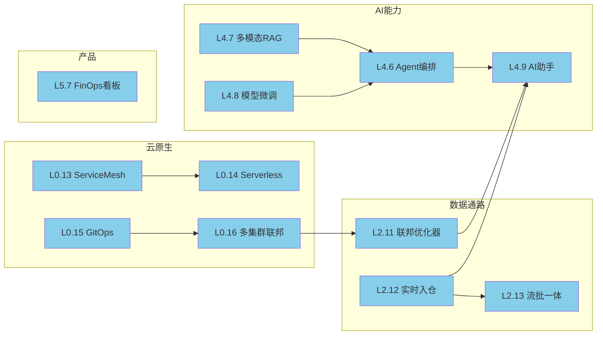
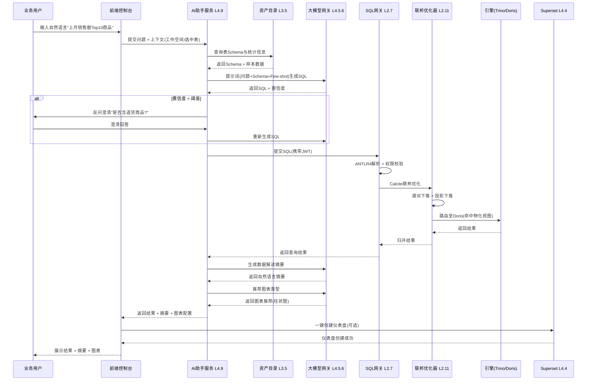
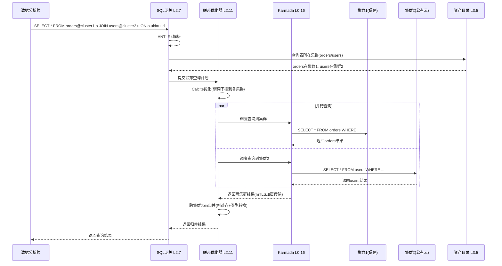
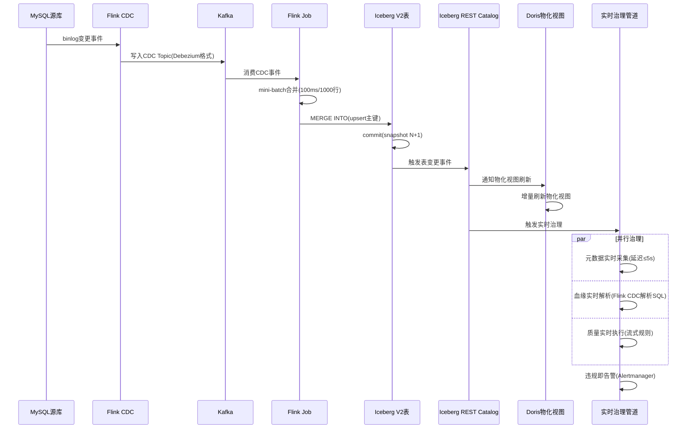
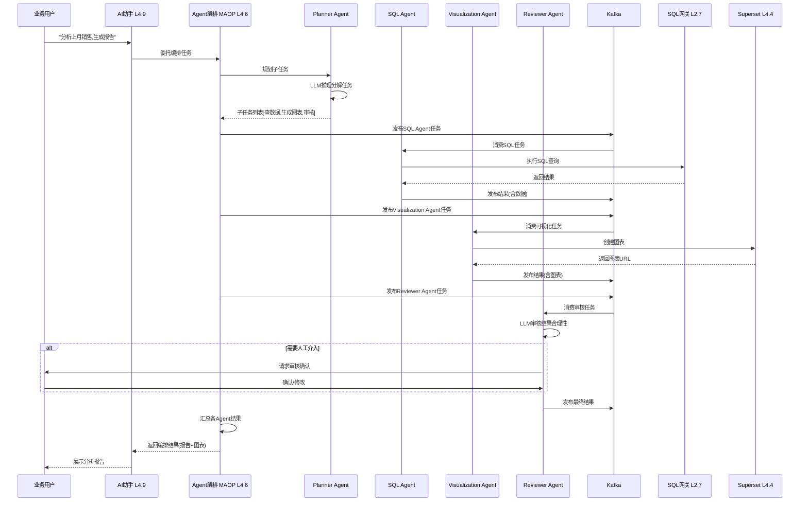
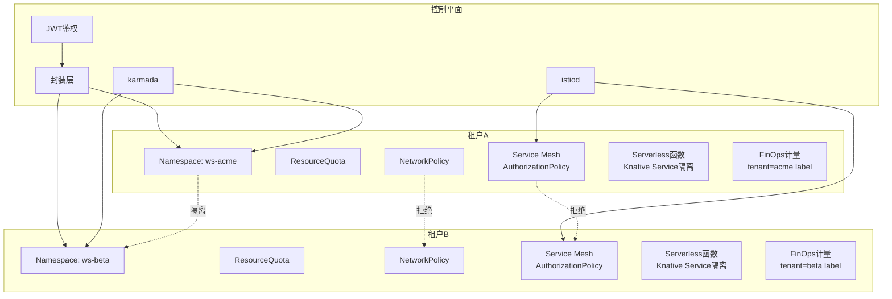
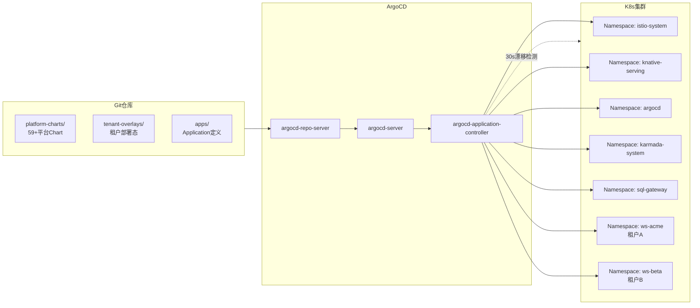
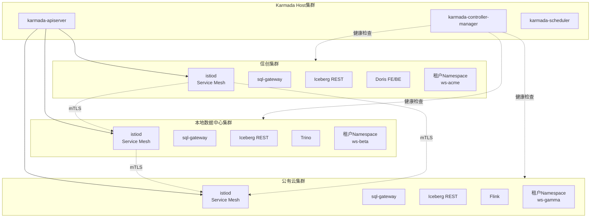

# 数擎大数据平台 V2.0 架构设计文档

> 版本：v2.0.0-draft  
> 文档状态：草案  
> 编写日期：2026-08-06  
> 文档负责人：V2.0 首席架构师  
> 上游输入：`docs/architecture.md` V1.0 架构、`design/v2.0/V2.0_PRD_产品需求文档.md`  
> 架构契约：不破坏 V1.0 五层 + 一横切架构，新增模块以插件式扩展注入既有层级  

---

## 第1章 架构演进概述

### 1.1 V1.0 → V2.0 架构变更原则

V2.0 严格遵循三条变更原则，确保 V1.0 已交付能力的稳定性与 V2.0 新增能力的可演进性：

1. **层级契约不变**：V1.0 五层（L0/L2/L3/L4/L5）+ 一横切（X）的职责边界不变，新增模块按职责归属注入到既有层级，不重写层边界。
2. **插件式扩展**：新增模块以"插件"形式接入既有层，对既有模块零侵入或最小侵入（仅扩展点），可独立启停、独立升级、独立回滚。
3. **四环境零改动契约不变**：全部新增模块通过 L0.5 跨环境供给抽象接入，信创/本地/公有/私有四环境通过 Profile 差异化配置，主代码零改动。

### 1.2 V1.0 → V2.0 架构变更点总览

| 层级 | V1.0 模块数 | V2.0 新增模块 | V2.0 增强模块 | V2.0 模块数 |
| --- | --- | --- | --- | --- |
| L0 基础设施层 | 12 | 4（Service Mesh 控制面 / Serverless 运行时 / GitOps 控制器 / 多集群联邦控制面） | 1（L0.9 可观测基座增强 Grafana 双视图） | 16 |
| L2 大数据引擎层 | 10 | 3（联邦查询优化器 / 实时入仓管道 / 流批一体调度） | 3（L2.1 Iceberg V2 / L2.5 Doris 物化视图 / L2.7 SQL 网关联邦增强） | 13 |
| L3 数据治理层 | 7 | 0 | 4（L3.1 元数据实时采集 / L3.3 质量实时执行 / L3.4 血缘实时解析 / L3.7 安全脱敏国密） | 7 |
| L4 开发分析层 | 6 | 4（Agent 编排引擎 / 多模态 RAG 管道 / 模型微调平台 / AI 助手服务） | 2（L4.5.5 LLMOps 评测增强 / L4.5.6 大模型网关多模态增强） | 10 |
| L5 产品层 | 6 | 1（FinOps 看板） | 4（L5.3 行业模板 +5 / L5.5 开放 API 落地 / L5.6 资产流通落地 / L5.1 控制台集成 AI 助手） | 7 |
| X 横切层 | 4 | 0 | 3（X1 国密 CryptoSpiFactory / X2 SecurityFacade 统一封装 / X3 Grafana 双视图） | 4 |
| **合计** | **45** | **12 新增** | **17 增强** | **57** |

### 1.3 新增模块清单

| 模块 ID | 模块名 | 所属层 | 实现语言 | 对应需求 |
| --- | --- | --- | --- | --- |
| L0.13 | Service Mesh 控制面 | L0 | YAML/Helm（Istio CRD） | REQ-CN-001 |
| L0.14 | Serverless 运行时 | L0 | YAML/Helm（Knative CRD） | REQ-CN-002 |
| L0.15 | GitOps 控制器 | L0 | Go（ArgoCD 扩展） | REQ-CN-003 |
| L0.16 | 多集群联邦控制面 | L0 | Go（Karmada） | REQ-CN-004 |
| L2.11 | 联邦查询优化器 | L2 | Java（Calcite 扩展） | REQ-DF-001/002 |
| L2.12 | 实时入仓管道 | L2 | Java/SQL（Flink CDC + Iceberg V2） | REQ-RT-001 |
| L2.13 | 流批一体调度 | L2 | Java（DolphinScheduler 扩展） | REQ-RT-002 |
| L4.6 | Agent 编排引擎（MAOP） | L4 | Python（FastAPI） | REQ-AI-001 |
| L4.7 | 多模态 RAG 管道 | L4 | Python（knowledge-engine 增强） | REQ-AI-002 |
| L4.8 | 模型微调平台 | L4 | Python（LLMOps 增强） | REQ-AI-005 |
| L4.9 | AI 助手服务 | L4 | Python（FastAPI） | REQ-AI-006 |
| L5.7 | FinOps 看板 | L5 | Vue3/TS + Go 后端 | REQ-CN-005 |

### 1.4 V2.0 架构演进与长期愿景对齐

V2.0 架构演进是 ROADMAP.md 长期愿景"数据操作系统 + 开源生态 + 信创标杆 + AI 原生"四条主张的关键架构落地：

- **数据操作系统**：L4.9 AI 助手 + L4.6 Agent 编排让数据从业者用自然语言完成数据分析，进一步屏蔽底层引擎复杂性。
- **开源生态**：L5.3 行业模板以 Helm Chart 形式开源，5 个新行业模板吸引行业 ISV 贡献。
- **信创标杆**：X1 国密 CryptoSpiFactory + X2 SecurityFacade + L0.16 多集群联邦（信创集群纳管）巩固信创环境下事实标准地位。
- **AI 原生**：L4.6/L4.7/L4.8/L4.9 四个 AI 模块 + L3 治理实时化让 AI 贯穿数据全生命周期（采集 → 治理 → 分析 → 应用）。

---

## 第2章 V2.0 架构总览图

### 2.1 V2.0 五层 + 一横切架构总览

```mermaid
graph TB
    subgraph L5[L5 多租户产品层]
        L51[L5.1 统一控制台<br/>+AI助手入口]
        L52[L5.2 运营后台]
        L53[L5.3 行业应用模板<br/>+5新行业]
        L54[L5.4 业务线门户]
        L55[L5.5 开放API目录<br/>落地]
        L56[L5.6 数据资产流通<br/>全流程落地]
        L57[L5.7 FinOps看板<br/>NEW]
    end

    subgraph L4[L4 数据开发与分析层]
        L41[L4.1 数据集成 SeaTunnel]
        L42[L4.2 调度编排 DolphinScheduler]
        L43[L4.3 数据开发IDE Theia]
        L44[L4.4 BI可视化 Superset]
        L45[L4.5 智能数据层<br/>RAG/LLMOps/网关增强]
        L46[L4.6 Agent编排引擎 MAOP<br/>NEW]
        L47[L4.7 多模态RAG管道<br/>NEW]
        L48[L4.8 模型微调平台<br/>NEW]
        L49[L4.9 AI助手服务<br/>NEW]
    end

    subgraph L3[L3 数据治理层]
        L31[L3.1 元数据采集<br/>实时化]
        L32[L3.2 数据标准]
        L33[L3.3 数据质量<br/>实时执行]
        L34[L3.4 血缘解析<br/>实时化]
        L35[L3.5 资产目录]
        L36[L3.6 主数据]
        L37[L3.7 安全脱敏<br/>国密]
    end

    subgraph L2[L2 大数据引擎层]
        L21[L2.1 统一存储 Iceberg V2]
        L22[L2.2 批计算 Spark]
        L23[L2.3 流计算 Flink CDC]
        L24[L2.4 交互查询 Trino]
        L25[L2.5 OLAP Doris<br/>实时物化视图]
        L26[L2.6 湖仓集一体]
        L27[L2.7 统一SQL网关<br/>联邦增强]
        L28[L2.8 消息流 Kafka]
        L29[L2.9 时序引擎 IoTDB]
        L210[L2.10 多模型引擎]
        L211[L2.11 联邦查询优化器<br/>NEW]
        L212[L2.12 实时入仓管道<br/>NEW]
        L213[L2.13 流批一体调度<br/>NEW]
    end

    subgraph L0[L0 基础设施层]
        L01[L0.1 信创供应]
        L02[L0.2 本地数据中心]
        L03[L0.3 公有云VM]
        L04[L0.4 私有云VM]
        L05[L0.5 跨环境供给抽象]
        L06[L0.6 SKE发行版]
        L07[L0.7 Cilium网络]
        L08[L0.8 容器存储]
        L09[L0.9 可观测基座<br/>Grafana双视图]
        L011[L0.11 封装层]
        L012[L0.12 弹性调度]
        L013[L0.13 ServiceMesh控制面<br/>NEW]
        L014[L0.14 Serverless运行时<br/>NEW]
        L015[L0.15 GitOps控制器<br/>NEW]
        L016[L0.16 多集群联邦控制面<br/>NEW]
    end

    subgraph X[X 横切能力层]
        X1[X1 统一身份权限<br/>国密CryptoSpiFactory]
        X2[X2 安全合规<br/>SecurityFacade统一封装]
        X3[X3 统一运维观测<br/>双视图+分级路由]
        X4[X4 API网关]
    end

    L5 --> L4
    L4 --> L3
    L3 --> L2
    L2 --> L0
    X -.-> L0
    X -.-> L2
    X -.-> L3
    X -.-> L4
    X -.-> L5

    style L013 fill:#87CEEB
    style L014 fill:#87CEEB
    style L015 fill:#87CEEB
    style L016 fill:#87CEEB
    style L211 fill:#87CEEB
    style L212 fill:#87CEEB
    style L213 fill:#87CEEB
    style L46 fill:#87CEEB
    style L47 fill:#87CEEB
    style L48 fill:#87CEEB
    style L49 fill:#87CEEB
    style L57 fill:#87CEEB
```

> 图例：蓝色（NEW）为 V2.0 新增模块，其余为 V1.0 既有模块（部分有增强，标注在节点内）。

### 2.2 V2.0 新增模块依赖图

---

## 第3章 新增模块设计

### 3.1 L0 层新增模块

#### 3.1.1 L0.13 Service Mesh 控制面

| 字段 | 内容 |
| --- | --- |
| 模块 ID | L0.13 |
| 模块名 | Service Mesh 控制面 |
| 实现技术 | Istio 1.20 + Envoy 1.29 |
| 实现语言 | YAML/Helm（Istio CRD） |
| 部署形态 | istiod 控制面（多副本）+ Envoy sidecar（per Pod） |
| 对应需求 | REQ-CN-001 |

**职责**：为平台全部自研组件间通信提供 mTLS、流量灰度、熔断、重试、超时、可观测增强能力。

**关键设计**：

1. **控制面部署**：istiod 部署到 `istio-system` Namespace，多副本 HA，通过 SKE Scheduler Extender 调度到不同节点。
2. **sidecar 注入策略**：按 Namespace label `istio-injection=enabled` 自动注入，平台运维 Namespace（istio-system/argocd/karmada-system）默认注入，租户 Namespace 按需注入（避免 sidecar 资源开销对小租户的影响）。
3. **mTLS 策略**：全局 STRICT 模式，对内全部 mTLS，对外（APISIX 入口）TERMINATE 模式。
4. **流量治理 CRD**：DestinationRule（熔断/重试/超时）+ VirtualService（灰度/分流/镜像）通过封装层暴露给租户，租户仅能操作本 Namespace 的 CRD。
5. **可观测增强**：Envoy access log 写入 Loki，metrics 写入 Prometheus（按 tenant label 隔离），trace 写入 Tempo。
6. **多集群联邦**：Istio Multi-Primary 多集群网格，与 L0.16 Karmada 协同，跨集群服务间 mTLS。

**与既有模块交互**：

- 与 L0.11 封装层：封装层翻译租户流量治理意图为 VirtualService/DestinationRule CRD。
- 与 X4 APISIX：APISIX 作为入口网关，Istio 作为东西向网关，APISIX → Istio 流量透传。
- 与 L0.9 可观测：Envoy metrics/log/trace 接入既有可观测基座。

#### 3.1.2 L0.14 Serverless 运行时

| 字段 | 内容 |
| --- | --- |
| 模块 ID | L0.14 |
| 模块名 | Serverless 运行时 |
| 实现技术 | Knative Serving 1.12 + Eventing 1.12 |
| 实现语言 | YAML/Helm（Knative CRD）+ 函数运行时（Python/Java/Go） |
| 部署形态 | knative-serving + knative-eventing 命名空间，Knative Controller + Autoscaler |
| 对应需求 | REQ-CN-002 |

**职责**：支持租户以 Serverless 函数形式运行轻量 ETL、Webhook 处理、数据质量校验等事件驱动任务，按需启停、按 invocation 计量。

**关键设计**：

1. **Serving 组件**：Knative Serving Controller + Autoscaler（KPA，Knative Pod Autoscaler），activation scale 0 → 1 冷启动 ≤ 3s。
2. **Eventing 组件**：Knative Eventing Broker + Trigger，支持 KafkaSource（Kafka 事件触发）+ CronJobSource（定时触发）+ ApiServerSource（K8s 事件触发）。
3. **函数运行时**：内置 Python 3.11 / Java 17 / Go 1.23 三种运行时基础镜像，租户函数以镜像形式提交，支持从 Git 仓库自动构建（Buildah）。
4. **伸缩策略**：KPA 按 RPS 与并发度伸缩，scale to zero 60s 空闲缩容，scale up 突发流量 1s 内扩到 N。
5. **资源隔离**：函数 Pod 调度到租户 Namespace，受 ResourceQuota 约束，函数 Pod 注入 Envoy sidecar（与 L0.13 协同）。
6. **计量计费**：函数 invocation 次数、执行时长、CPU/内存峰值写入 Prometheus，按 tenant label 隔离，FinOps 看板聚合展示。

**与既有模块交互**：

- 与 L0.13 Service Mesh：函数 Pod 注入 Envoy sidecar，函数间通信 mTLS。
- 与 L2.8 Kafka：Knative KafkaSource 消费 Kafka Topic 触发函数。
- 与 L5.7 FinOps：函数计量数据供 FinOps 看板聚合。

#### 3.1.3 L0.15 GitOps 控制器

| 字段 | 内容 |
| --- | --- |
| 模块 ID | L0.15 |
| 模块名 | GitOps 控制器 |
| 实现技术 | ArgoCD 2.7 + Argo Rollouts 2.4 |
| 实现语言 | Go（ArgoCD 扩展）+ YAML/Helm |
| 部署形态 | argocd 命名空间，argocd-server + argocd-repo-server + argocd-application-controller |
| 对应需求 | REQ-CN-003 |

**职责**：将平台自身与租户工作空间的部署态全部纳管到 Git 仓库，实现声明式 Git 驱动部署、自动漂移检测与回滚。

**关键设计**：

1. **ArgoCD 部署**：argocd-server（API/UI）+ argocd-repo-server（Git 仓库交互）+ argocd-application-controller（同步引擎），多副本 HA。
2. **Git 仓库结构**：`platform-charts/`（平台自身 59+ Chart）+ `tenant-overlays/<tenant>/`（租户工作空间部署态）+ `apps/`（Application 定义）。
3. **同步策略**：auto-sync + selfHeal=true，sync wave 顺序（先 CRD → 再 Namespace → 再 Chart → 最后租户资源），sync window 控制维护窗口。
4. **漂移检测**：argocd-application-controller 每 30s 比对 Git 期望态与集群实际态，漂移即按 selfHeal 策略自动回滚。
5. **多仓库支持**：GitLab/Gitea/Bitbucket 三种 Git Provider，通过 repo-server credential template 配置。
6. **租户隔离**：租户仅能操作本租户目录的 Application，通过 ArgoCD Project（AppProject）限制 source/destination。
7. **渐进式发布**：Argo Rollouts 替代 Deployment，支持 Canary/Blue-Green 渐进式发布，与 Service Mesh 流量灰度协同。

**与既有模块交互**：

- 与 L0.11 封装层：租户通过控制台"提交到 Git"按钮触发封装层生成部署态 YAML 并提交到 Git。
- 与 L0.13 Service Mesh：Argo Rollouts 与 VirtualService 协同控制灰度流量比例。
- 与 design/deploy/charts：ArgoCD Application 引用既有 Helm Chart。

#### 3.1.4 L0.16 多集群联邦控制面

| 字段 | 内容 |
| --- | --- |
| 模块 ID | L0.16 |
| 模块名 | 多集群联邦控制面 |
| 实现技术 | Karmada 1.10 |
| 实现语言 | Go（Karmada）+ YAML/Helm |
| 部署形态 | karmada-system 命名空间（host 集群），karmada-agent（成员集群） |
| 对应需求 | REQ-CN-004 |

**职责**：支持跨 K8s 集群工作负载调度、数据联邦与故障迁移，满足"两地三中心"与"跨地域数据就近分析"场景。

**关键设计**：

1. **Karmada 控制面**：karmada-apiserver + karmada-controller-manager + karmada-scheduler，部署到 host 集群（运维集群），HA 多副本。
2. **成员集群纳管**：karmada-agent 注册成员集群（信创/本地/公有云各 1），成员集群 Push 模式（agent 主动上报）或 Pull 模式（控制面拉取）。
3. **调度策略**：PropagationPolicy（调度到哪些集群 + 副本权重）+ OverridePolicy（按集群覆盖配置，如镜像 registry/存储类），调度算法支持权重/亲和/拓扑域。
4. **故障迁移**：成员集群健康检查（karmada-controller-manager 每 30s 探测），故障集群标记 NotReady，工作负载按 OverridePolicy 迁移到备用集群，RTO ≤ 60s。
5. **资源模板**：Karmada ResourceTemplate（K8s 原生资源）+ PropagationPolicy，不引入新 CRD 学习成本。
6. **多集群 Service**：Karmada MultiClusterService 跨集群服务发现，与 Istio Multi-Primary 协同。
7. **运营可视化**：集群健康/负载分布/故障迁移历史在 L5.2 运营后台可视化。

**与既有模块交互**：

- 与 L0.5 跨环境供给抽象：成员集群由 infra-orchestrator 供应，Karmada 纳管。
- 与 L0.13 Service Mesh：Istio Multi-Primary 多集群网格，Karmada 调度 sidecar。
- 与 L2.11 联邦查询优化器：联邦查询路由器查询 Karmada 资源分布定位表所在集群。

### 3.2 L2 层新增模块

#### 3.2.1 L2.11 联邦查询优化器

| 字段 | 内容 |
| --- | --- |
| 模块 ID | L2.11 |
| 模块名 | 联邦查询优化器 |
| 实现技术 | Apache Calcite 1.36 + 自定义 RelOptRule |
| 实现语言 | Java 17（Spring Boot 3.2） |
| 部署形态 | sql-gateway 子模块，独立 Spring Boot 服务 |
| 对应需求 | REQ-DF-001/002 |

**职责**：基于 Calcite 实现跨 Iceberg/Doris/Trino/IoTDB/Elasticsearch/MySQL/Oracle 七种数据源联邦查询与下推优化，支持跨集群联邦。

**关键设计**：

1. **Catalog 抽象**：每种数据源实现 Calcite Schema + Table 接口，注册到联邦 Catalog，虚拟表元数据缓存到 L3.5 资产目录。
2. **下推规则**：自定义 RelOptRule 实现谓词下推（FilterPushDown）/投影下推（ProjectPushDown）/Join 下推（JoinPushDown）/聚合下推（AggregatePushDown）四类下推，下推率目标 ≥ 70%。
3. **跨源 Join**：不下推的 Join 在 SQL 网关层执行，结果归并处理列对齐/类型转换/时区差异，内存结果集限制（≤ 100 万行，超过报错引导用户优化）。
4. **跨集群路由**：查询路由器查询 Karmada 资源分布定位表所在集群，生成跨集群执行计划，跨集群数据传输 mTLS 加密。
5. **计划可视化**：Calcite RelNode 树通过 EXPLAIN 输出，控制台可视化下推过程与执行计划。
6. **统计信息**：基于资产目录的表/列统计信息（行数/NDV/直方图）驱动 Cost 估算，统计信息定时刷新。
7. **物化视图加速**：识别查询可命中 Doris 物化视图时改写查询，走物化视图加速。

**与既有模块交互**：

- 与 L2.7 SQL 网关：作为 sql-gateway 的优化器子模块，ANTLR4 解析后调用 Calcite 优化。
- 与 L3.5 资产目录：虚拟表元数据与统计信息从资产目录读取。
- 与 L0.16 Karmada：跨集群联邦查询路由器查询 Karmada 资源分布。

#### 3.2.2 L2.12 实时入仓管道

| 字段 | 内容 |
| --- | --- |
| 模块 ID | L2.12 |
| 模块名 | 实时入仓管道 |
| 实现技术 | Flink 1.18 CDC + Iceberg V2 + Kafka 3.6 |
| 实现语言 | Java 17（Flink Job）+ SQL（Flink SQL） |
| 部署形态 | Flink KubernetesOperator 部署 FlinkDeployment CR |
| 对应需求 | REQ-RT-001 |

**职责**：实现 Flink CDC → Iceberg V2 表（行级 upsert）实时入仓，端到端延迟秒级。

**关键设计**：

1. **CDC 源**：Flink CDC Connector 支持 MySQL（Debezium）/PostgreSQL（logical decoding）/Oracle（LogMiner）三种源，源表 Schema 自动同步到 Iceberg 表（加列/改类型）。
2. **Iceberg V2 写入**：Iceberg V2 表启用 row-level upsert，主键冲突时 MERGE INTO 语义（更新而非追加），写入通过 Iceberg Flink Sink。
3. **exactly-once 语义**：Flink checkpoint（间隔 1s）+ Iceberg commit（checkpoint 完成后 commit），checkpoint 失败回滚不写入 Iceberg。
4. **小批量合并**：Flink mini-batch（100ms/1000 行）合并同主键变更，减少 Iceberg commit 次数，提升吞吐。
5. **Compaction 策略**：Iceberg 表定时 Compaction（小文件合并 + 删除标记清理），Compaction 任务独立 Flink Job，避免影响入仓主链路。
6. **监控**：Flink Job metrics（source lag/checkpoint duration/commit duration）写入 Prometheus，入仓延迟 P95 ≤ 5s 监控告警。
7. **控制台管理**：入仓任务通过控制台可视化（源/目的/Flink Job 状态/延迟监控/Schema 变更历史），支持启停/重置 offset/手动 checkpoint。

**与既有模块交互**：

- 与 L2.3 Flink：复用 Flink KubernetesOperator 部署 Flink Job。
- 与 L2.1 Iceberg：写入 Iceberg V2 表，触发 Iceberg REST Catalog 事件。
- 与 L2.8 Kafka：CDC 变更先写 Kafka（解耦 + 削峰），Flink 消费 Kafka 写 Iceberg。
- 与 L3.1 元数据采集：Iceberg 表变更触发元数据实时采集。

#### 3.2.3 L2.13 流批一体调度

| 字段 | 内容 |
| --- | --- |
| 模块 ID | L2.13 |
| 模块名 | 流批一体调度 |
| 实现技术 | DolphinScheduler 3.2 扩展 + Iceberg V2 snapshot 隔离 |
| 实现语言 | Java 17（DolphinScheduler 扩展） |
| 部署形态 | DolphinScheduler Master/Worker 扩展插件 |
| 对应需求 | REQ-RT-002 |

**职责**：同一份 Iceberg 表同时支撑批计算（Spark）与流计算（Flink），统一调度入口。

**关键设计**：

1. **snapshot 隔离**：Iceberg 表 snapshot 隔离保证 Spark 批读 snapshot N 与 Flink 流读 snapshot N+1 不冲突，数据一致。
2. **统一调度入口**：DolphinScheduler DAG 节点支持批任务（Spark）+ 流任务（Flink）+ SQL 任务（SQL 网关）+ 函数任务（Knative），同一 DAG 编排流批混合。
3. **流任务管理**：流任务（Flink Job）支持启停/重置 offset/savepoint，与批任务（一次性 Job）生命周期管理差异。
4. **资产目录标注**：流批一体表在资产目录标注 `stream_batch=true`，BI 查询自动选择批快照（一致性优先）或流最新视图（实时性优先）。
5. **场景示例**：实时大屏（流读最新视图）+ 离线报表（批读 snapshot）同源 Iceberg 表，文档化最佳实践。

**与既有模块交互**：

- 与 L4.2 DolphinScheduler：扩展 DS 任务插件支持流批混合编排。
- 与 L2.1 Iceberg：snapshot 隔离保证流批一致。
- 与 L2.2 Spark / L2.3 Flink：批/流任务执行引擎。

### 3.3 L4 层新增模块

#### 3.3.1 L4.6 Agent 编排引擎（MAOP）

| 字段 | 内容 |
| --- | --- |
| 模块 ID | L4.6 |
| 模块名 | Agent 编排引擎（MAOP，Multi Agents Orchestration Platform） |
| 实现技术 | FastAPI + LangGraph + Kafka |
| 实现语言 | Python 3.11（FastAPI） |
| 部署形态 | maop-server（FastAPI）+ maop-worker（Agent 执行器）+ Kafka Topic |
| 对应需求 | REQ-AI-001 |

**职责**：支持多 Agent 协作编排，实现复杂数据分析任务的自主规划、工具调用、子任务分发与结果汇总。

**关键设计**：

1. **编排范式**：支持 DAG（确定性编排）/State Machine（状态机编排）/ReAct（推理-行动循环）三种编排范式，按任务复杂度选择。
2. **Agent 角色**：内置 8 种 Agent 角色：
   - Planner Agent：任务规划与分解
   - SQL Agent：SQL 生成与执行（调用 L2.7 SQL 网关）
   - Visualization Agent：图表生成（调用 L4.4 Superset）
   - Quality Agent：数据质量校验（调用 L3.3 规则引擎）
   - Lineage Agent：血缘查询（调用 L3.4 血缘解析）
   - Doc Agent：文档检索（调用 L4.7 多模态 RAG）
   - Code Agent：代码生成与执行（受控沙箱）
   - Reviewer Agent：结果审核与人工介入
3. **通信机制**：Agent 间通过 Kafka Topic 异步通信，单次编排可调度 ≥ 20 个 Agent，消息含上下文/工具调用结果/中间产物。
4. **编排可视化**：DAG 节点状态/Agent 思考链（LLM 推理过程）/工具调用记录实时展示，支持人工介入节点（Reviewer Agent 触发审批）。
5. **持久化与回放**：编排任务状态持久化到 PostgreSQL，支持断点续跑与回放（调试用）。
6. **资源隔离**：编排任务通过封装层隔离到租户 Namespace，Agent worker Pod 受 ResourceQuota 约束。
7. **安全控制**：编排步数上限（默认 50 步）+ 工具调用白名单 + 单步超时（默认 60s）+ 总超时（默认 30min），防止死循环与资源耗尽。

**与既有模块交互**：

- 与 L4.5.6 大模型网关：Agent LLM 推理调用大模型网关。
- 与 L2.8 Kafka：Agent 间通信消息总线。
- 与 L4.7 多模态 RAG：Doc Agent 检索知识库。
- 与 L2.7 SQL 网关：SQL Agent 执行 SQL。
- 与 L0.11 封装层：编排任务隔离到租户 Namespace。

#### 3.3.2 L4.7 多模态 RAG 管道

| 字段 | 内容 |
| --- | --- |
| 模块 ID | L4.7 |
| 模块名 | 多模态 RAG 管道 |
| 实现技术 | knowledge-engine 增强 + Milvus + Elasticsearch + NebulaGraph |
| 实现语言 | Python 3.11（FastAPI） |
| 部署形态 | knowledge-engine 服务增强，复用 V1.0 部署 |
| 对应需求 | REQ-AI-002 |

**职责**：支持文本/表格/图像/语音四模态切片与向量化，混合检索（向量 + 关键词 + 图谱）+ 重排序。

**关键设计**：

1. **切片器**：
   - 文本切片：语义切片（按语义边界）+ 固定长度切片（兜底）
   - 表格切片：行切片/列切片/单元格切片三种策略，保留表结构元数据
   - 图像切片：OCR 提取文本 + 视觉切片（按区域分割）+ 图像 Caption 生成
   - 语音切片：ASR 转文本后按文本切片
2. **向量化**：支持 bge-m3（多语言）/text-embedding-3（OpenAI）/multimodal-e5（多模态）三种 Embedding 模型，可配置切换，向量维度统一 1024。
3. **混合检索**：
   - 向量检索：Milvus ANN 检索 TopK 50
   - 关键词检索：Elasticsearch BM25 检索 TopK 50
   - 图谱检索：NebulaGraph 子图检索（实体 + 关系）
   - 三路结果融合：RRF（Reciprocal Rank Fusion）算法融合，权重可调
4. **重排序**：Cross-Encoder（bge-reranker-v2）对融合后 TopK 50 重排到 TopK 10，提升精度。
5. **增量更新**：知识库支持增量更新（新增/修改/删除文档触发增量切片与向量化），版本化管理（快照 + 回滚）。
6. **租户隔离**：知识库按租户隔离（Milvus Collection 按租户命名 `tenant_<tid>_kb_<kbid>`），权限纳入资产目录。
7. **性能**：RAG 端到端延迟 P95 ≤ 2s（10 万知识库），通过向量索引预加载 + 检索并行化达成。

**与既有模块交互**：

- 与 L4.5.3 Milvus：向量存储与检索。
- 与 L2.10 Elasticsearch / NebulaGraph：关键词与图谱检索。
- 与 L4.5.6 大模型网关：Embedding 与 Reranker 模型推理。
- 与 L3.5 资产目录：知识库元数据与权限管理。

#### 3.3.3 L4.8 模型微调平台

| 字段 | 内容 |
| --- | --- |
| 模块 ID | L4.8 |
| 模块名 | 模型微调平台 |
| 实现技术 | LLMOps 增强 + LLaMA-Factory + PEFT + DeepSpeed |
| 实现语言 | Python 3.11 |
| 部署形态 | llmops 服务增强，微调任务 on K8s GPU 节点池 |
| 对应需求 | REQ-AI-005 |

**职责**：支持 LoRA/QLoRA/全参微调三种微调方式，微调 → 评测 → 部署一键闭环。

**关键设计**：

1. **微调方式**：
   - LoRA：rank 8/16/32 可配，alpha=2×rank，target_modules 可选
   - QLoRA：4bit/8bit 量化（bitsandbytes），降低 GPU 显存需求
   - 全参微调：DeepSpeed ZeRO-3 多卡数据并行 + 张量并行
2. **微调框架**：接入 LLaMA-Factory（统一接口）/PEFT（HuggingFace）/DeepSpeed（分布式）三种，按微调方式自动选择。
3. **任务调度**：微调任务调度到 GPU 节点池（L0.12 弹性调度），支持多卡数据并行与张量并行，GPU 节点池弹性伸缩。
4. **微调 → 评测 → 部署闭环**：
   - 微调产物（adapter 权重/全参权重）版本化注册到模型仓库
   - 自动触发评测任务（调用 L4.5.5 LLMOps 评测）
   - 评测通过后一键部署到推理服务（调用 L4.5.6 大模型网关）
5. **监控**：微调过程监控（loss/lr/gpu 利用率/gpu 显存）实时展示，TensorBoard 集成。
6. **数据管理**：微调数据集版本化（DVC），支持数据集预览/统计/格式校验。

**与既有模块交互**：

- 与 L4.5.5 LLMOps：微调任务管理与模型仓库。
- 与 L4.5.6 大模型网关：微调模型部署到推理服务。
- 与 L0.12 弹性调度：GPU 节点池调度。
- 与 REQ-AI-004 模型评测：微调后自动评测。

#### 3.3.4 L4.9 AI 助手服务

| 字段 | 内容 |
| --- | --- |
| 模块 ID | L4.9 |
| 模块名 | AI 助手服务 |
| 实现技术 | FastAPI + L4.6 Agent 编排 + L2.7 SQL 网关 |
| 实现语言 | Python 3.11（FastAPI） |
| 部署形态 | ai-assistant-server（FastAPI），多副本 HA |
| 对应需求 | REQ-AI-006 |

**职责**：在统一控制台集成 AI 助手，支持 NL2SQL、智能数据解读、智能图表推荐。

**关键设计**：

1. **NL2SQL 链路**：
   - 上下文构建：当前工作空间 + 选中表 Schema + 历史查询 + 资产目录元数据
   - 提示词工程：Few-shot 示例 + Schema 描述 + 用户问题 → LLM 生成 SQL
   - SQL 校验：ANTLR4 语法校验 + SQL 网关权限校验 + 引擎路由
   - 多轮澄清：LLM 判断需要澄清时反问用户，多轮对话收敛
2. **数据解读**：查询结果 → LLM 生成自然语言摘要（趋势/异常/对比），摘要含数据洞察与建议。
3. **图表推荐**：查询结果 Schema + 数据分布 → LLM 推荐图表类型（柱/线/饼/散点/地图），生成 ECharts 配置，一键创建 Superset 仪表盘。
4. **双语支持**：中文/英文双语，默认中文，按用户语言偏好切换。
5. **安全审计**：全部提示词与生成 SQL 审计留痕，敏感数据脱敏后记录，输出内容安全过滤（暴力/色情/政治）。
6. **降级策略**：LLM 不可用时降级到规则引擎（关键词匹配预设 SQL 模板），保证可用性 99.5%。

**与既有模块交互**：

- 与 L4.6 Agent 编排：复杂分析任务委托 Agent 编排。
- 与 L2.7 SQL 网关：生成 SQL 经 SQL 网关执行。
- 与 L4.4 Superset：一键创建仪表盘。
- 与 L3.5 资产目录：Schema 上下文。
- 与 L4.5.6 大模型网关：LLM 推理。

### 3.4 L5 层新增模块

#### 3.4.1 L5.7 FinOps 看板

| 字段 | 内容 |
| --- | --- |
| 模块 ID | L5.7 |
| 模块名 | FinOps 看板 |
| 实现技术 | Vue3/TS 前端 + Go 后端 + Prometheus + Kubernetes Metrics API |
| 实现语言 | TypeScript + Go 1.23 |
| 部署形态 | finops-ui（前端）+ finops-server（Go 后端） |
| 对应需求 | REQ-CN-005 |

**职责**：按租户/工作空间/任务/引擎四维度采集资源用量与成本，提供成本可视化与优化建议。

**关键设计**：

1. **用量采集**：CPU/内存/存储/GPU/网络出口五维度，Prometheus + K8s Metrics API 采集，粒度 ≤ 1min。
2. **成本模型**：按量计费 + 包年包月 + 阶梯价三种计费方式，单价可配置（按环境 Profile 差异化）。
3. **看板视图**：
   - 平台方视图：租户成本 Top10、工作空间成本趋势、任务成本明细、闲置资源清单
   - 租户方视图：本租户成本趋势、工作空间成本占比、任务成本明细、优化建议
4. **优化建议引擎**：识别 5 类闲置模式（连续 7 天 CPU < 5% 的 Pod/未使用的 PVC/未调度的 Service/超配的 ResourceQuota/可缩容的 Deployment），输出可执行建议。
5. **账单导出**：按租户账单导出 CSV/Excel，含明细行与汇总行，支持分账到子工作空间。

**与既有模块交互**：

- 与 L0.9 Prometheus：资源用量数据源。
- 与 L5.2 运营后台：FinOps 看板嵌入运营后台。
- 与 L0.11 封装层：租户成本按 Namespace 聚合。

### 3.5 X 层新增/增强模块

#### 3.5.1 X1 国密 CryptoSpiFactory

| 字段 | 内容 |
| --- | --- |
| 模块 ID | X1 增强 |
| 模块名 | 国密 CryptoSpiFactory |
| 实现技术 | CryptoSpiFactory 抽象 + 华为 GMBase / 国密局认证模块 |
| 实现语言 | Java 17（SPI 抽象）+ JNI（国密模块绑定） |
| 对应需求 | REQ-EX-004 |

**职责**：国密 SM2/SM3/SM4 可插拔，信创环境默认国密。

**关键设计**：

1. **SPI 抽象**：`CryptoSpiFactory` 定义 `Signer`/`Digester`/`Cipher` 三个 SPI 接口，实现类按 Profile 加载（ServiceLoader）。
2. **双栈实现**：
   - 国密栈：SM2（签名/验签）+ SM3（摘要）+ SM4（对称加密）+ GMTLS（传输加密）
   - 国际栈：RSA + SHA-256 + AES + TLS 1.3
3. **Profile 切换**：信创 Profile 加载国密栈，其他 Profile 加载国际栈，主代码零改动。
4. **国密模块接入**：通过 JNI 绑定华为 GMBase 等已通过国密局认证的密码模块，不使用纯 Java 实现（不合规）。
5. **应用场景**：
   - JWT 签名：Keycloak Realm 配置国密，JWT 用 SM2 签名
   - 存储加密：Iceberg 表数据用 SM4 加密
   - 传输加密：mTLS 用 GMTLS 套件
   - 数据脱敏：敏感数据用 SM4 加密存储

**与既有模块交互**：

- 与 X1 Keycloak：JWT 签名算法切换。
- 与 L2.1 Iceberg：表数据加密。
- 与 L0.13 Service Mesh：mTLS 套件切换。
- 与 L3.7 安全脱敏：脱敏算法切换。

#### 3.5.2 X2 SecurityFacade 统一封装

| 字段 | 内容 |
| --- | --- |
| 模块 ID | X2 增强 |
| 模块名 | SecurityFacade 统一封装 |
| 实现技术 | Java 17 Spring Boot 3.2 Facade 模式 |
| 实现语言 | Java 17 |
| 对应需求 | REQ-EX-003 |

**职责**：统一封装加解密/脱敏/审计/鉴权四能力，对上层提供一致 API，落地等保三级 + 密评 + 数据合规三线。

**关键设计**：

1. **Facade API**：`SecurityFacade.encrypt()`/`decrypt()`/`mask()`/`audit()`/`authorize()` 五个统一 API，上层不感知底层实现。
2. **等保三级落地**：物理/网络/主机/应用/数据/管理 6 类控制项全部落地，控制项清单与证据自动归档。
3. **密评落地**：密钥管理（生成/存储/轮换/销毁）+ 加密存储 + 加密传输 + 密文检索，密钥通过国密模块管理。
4. **数据合规三线**：数据分级（公开/内部/敏感/机密）+ 分类（个人/业务/系统）+ 共享（共享/不共享/有条件共享）+ 出境（可出境/不可出境）+ 留存（按法规）。
5. **证据归档**：安全合规证据（日志/截图/配置）自动归档到对象存储，支持等保/密评测评导出（按测评机构模板）。

**与既有模块交互**：

- 与 X1 国密 CryptoSpiFactory：加解密能力底层。
- 与 L3.7 安全脱敏：脱敏能力底层。
- 与 X4 APISIX：审计日志接入。
- 与 L5.2 运营后台：合规证据导出。

#### 3.5.3 X3 Grafana 双视图与实时治理管道

| 字段 | 内容 |
| --- | --- |
| 模块 ID | X3 增强 + L3 实时治理 |
| 模块名 | Grafana 双视图 + 实时治理管道 |
| 实现技术 | Grafana Organization + Alertmanager + Flink 实时治理 |
| 实现语言 | YAML/SQL（Flink） |
| 对应需求 | REQ-EX-005/REQ-RT-004 |

**职责**：Grafana 双视图（平台方 + 客户方）+ Alertmanager 分级路由 + 实时治理管道。

**关键设计**：

1. **Grafana 双视图**：
   - 平台方 Organization：全局视图（集群/引擎/组件/租户四维度），仅平台管理员可见
   - 客户方 Organization：本租户业务健康（查询延迟/任务成功率/数据质量分），租户用户可见
   - 通过 Grafana Organization 隔离，RBAC 控制看板访问
2. **Alertmanager 分级路由**：
   - P0 告警：电话 + 短信（如平台宕机/数据丢失）
   - P1 告警：邮件 + IM（如查询延迟超标/任务失败）
   - P2 告警：钉钉/飞书（如资源利用率高/质量分下降）
   - 告警规则按 tenant label 隔离，租户仅收本租户告警
3. **实时治理管道**：
   - 元数据实时采集：Iceberg REST Catalog 事件触发元数据采集，延迟 ≤ 5s
   - 血缘实时解析：Flink CDC 实时解析 SQL，血缘图实时更新到 NebulaGraph
   - 质量实时执行：质量规则支持 Flink 流式执行模式，违规即告警
   - 治理闭环端到端延迟 P95 ≤ 10s（变更 → 元数据 → 血缘 → 质量 → 告警）

**与既有模块交互**：

- 与 L0.9 可观测基座：Grafana/Alertmanager/Prometheus/Loki。
- 与 L3.1/L3.3/L3.4 治理模块：实时治理触发。
- 与 L2.12 实时入仓：Iceberg 变更事件触发实时治理。

---

## 第4章 关键交互设计

### 4.1 NL2SQL 查询链路

**链路说明**：用户自然语言 → AI 助手构建上下文（Schema + 历史）→ LLM 生成 SQL → SQL 网关校验与优化 → 引擎执行 → 结果归并 → LLM 生成解读与图表推荐 → 前端展示。链路全程审计留痕，SQL 不绕过 SQL 网关权限校验。

### 4.2 跨集群联邦查询链路

**链路说明**：SQL 网关解析 → 联邦优化器查询 Karmada 定位表所在集群 → Calcite 优化下推 → Karmada 调度查询到各集群 → 并行执行 → mTLS 加密传输结果 → 联邦优化器归并 Join → 返回用户。"数据不动查询动"，跨集群数据传输最小化。

### 4.3 实时入仓链路

**链路说明**：MySQL binlog → Flink CDC → Kafka（削峰）→ Flink Job mini-batch 合并 → Iceberg V2 upsert → Iceberg REST Catalog 事件 → 并行触发 Doris 物化视图刷新与实时治理（元数据/血缘/质量）。端到端延迟 P95 ≤ 5s，治理闭环延迟 P95 ≤ 10s。

### 4.4 Agent 编排链路

**链路说明**：用户自然语言 → AI 助手委托编排 → Planner Agent 分解子任务 → Kafka 异步分发到 SQL/Visualization/Reviewer Agent → 各 Agent 调用工具（SQL 网关/Superset）执行 → Reviewer Agent 审核与人工介入 → 汇总结果返回。多 Agent 协作通过 Kafka 解耦，单次编排可调度 ≥ 20 个 Agent。

---

## 第5章 多租户增强

### 5.1 V2.0 多租户隔离机制总览

V2.0 在 V1.0 三重隔离（Namespace + ResourceQuota + NetworkPolicy）基础上，新增 Service Mesh 租户隔离、Serverless 函数隔离、FinOps 按租户计量三层隔离。

### 5.2 Service Mesh 租户隔离

| 隔离机制 | 实现 | 说明 |
| --- | --- | --- |
| mTLS 隔离 | Istio AuthorizationPolicy | 每个租户 Namespace 一个 AuthorizationPolicy，仅允许本 Namespace 内服务间 mTLS，跨 Namespace 默认拒绝 |
| 流量治理隔离 | VirtualService/DestinationRule 按 Namespace | 租户仅能操作本 Namespace 的流量治理 CRD，封装层校验 |
| sidecar 资源隔离 | sidecar CPU/内存受 LimitRange 约束 | sidecar 资源计入租户 ResourceQuota，避免 sidecar 开销失控 |

### 5.3 Serverless 函数隔离

| 隔离机制 | 实现 | 说明 |
| --- | --- | --- |
| 函数 Namespace 隔离 | Knative Service 部署到租户 Namespace | 函数 Pod 受租户 ResourceQuota + NetworkPolicy 约束 |
| 事件源隔离 | KafkaSource 消费本租户 Topic | Kafka Topic 命名 `tenant.app.topic.vN`，跨租户不可消费 |
| 函数镜像隔离 | 函数镜像按租户仓库隔离 | 每个租户独立镜像仓库（ Harbor Project），跨租户不可拉取 |

### 5.4 FinOps 按租户计量

| 计量维度 | 实现 | 说明 |
| --- | --- | --- |
| 指标隔离 | Prometheus label `tenant=<tid>` | 全部指标按 tenant label 隔离，FinOps 看板按 label 聚合 |
| 日志隔离 | Loki tenant 分片 | 函数日志按租户分片，跨租户不可查询 |
| 账单隔离 | 账单按 Namespace 聚合 | 账单按 Namespace → 租户映射聚合，跨租户不可见 |
| 成本分账 | 子工作空间成本分摊 | 租户内子工作空间成本按用量比例分摊，支持内部结算 |

### 5.5 AI 能力租户隔离

| 隔离机制 | 实现 | 说明 |
| --- | --- | --- |
| 知识库隔离 | Milvus Collection 按租户命名 | 知识库按租户隔离，跨租户不可检索 |
| Agent 编排隔离 | 编排任务隔离到租户 Namespace | Agent worker Pod 受租户 ResourceQuota 约束 |
| 模型隔离 | 模型仓库按租户隔离 | 微调模型与部署的推理服务按租户隔离 |
| AI 助手隔离 | 助手上下文按租户隔离 | 助手仅访问本租户 Schema 与数据，跨租户不可见 |
| 提示词审计 | 提示词按租户审计留痕 | 全部提示词审计留痕，敏感数据脱敏后记录 |

---

## 第6章 部署架构

### 6.1 GitOps 部署模型

**部署模型说明**：

1. **Git 仓库结构**：`platform-charts/` 存平台自身 Chart，`tenant-overlays/<tenant>/` 存租户部署态，`apps/` 存 ArgoCD Application 定义。
2. **ArgoCD 同步**：argocd-application-controller 每 30s 比对 Git 期望态与集群实际态，漂移即按 selfHeal 策略自动回滚。
3. **sync wave 顺序**：先 CRD → 再 Namespace → 再 Chart → 最后租户资源，通过 sync wave 注解控制。
4. **租户隔离**：租户仅能操作本租户目录的 Application，通过 ArgoCD AppProject 限制 source/destination。
5. **渐进式发布**：Argo Rollouts 替代 Deployment，与 Service Mesh VirtualService 协同控制灰度流量比例。

### 6.2 多集群联邦部署拓扑

**部署拓扑说明**：

1. **Karmada Host 集群**：部署 Karmada 控制面，纳管信创/本地/公有云三个成员集群，不运行业务工作负载。
2. **成员集群**：每个成员集群运行完整的 Istio Service Mesh + sql-gateway + 引擎子集，按环境 Profile 差异化。
3. **多集群网格**：Istio Multi-Primary 多集群网格，跨集群服务间 mTLS，跨集群服务发现通过 Karmada MultiClusterService。
4. **故障迁移**：成员集群故障时，Karmada 将工作负载迁移到备用集群，RTO ≤ 60s，OverridePolicy 调整集群本地化配置（如镜像 registry/存储类）。
5. **数据就近分析**：跨集群联邦查询"数据不动查询动"，查询路由器根据表元数据定位表所在集群，跨集群数据传输最小化。

### 6.3 V2.0 部署 Profile 矩阵

| 模块 | 信创 Profile | 本地 Profile | 公有云 Profile | 私有云 Profile |
| --- | --- | --- | --- | --- |
| L0.13 Service Mesh | Istio + GMTLS | Istio + TLS 1.3 | Istio + TLS 1.3 | Istio + TLS 1.3 |
| L0.14 Serverless | Knative + 国密镜像 | Knative | Knative | Knative |
| L0.15 GitOps | ArgoCD + Gitea | ArgoCD + GitLab | ArgoCD + GitLab | ArgoCD + Bitbucket |
| L0.16 多集群联邦 | Karmada（信创集群纳管） | Karmada（本地集群纳管） | Karmada（公有云集群纳管） | Karmada（私有云集群纳管） |
| X1 国密 | 国密栈（SM2/3/4） | 国际栈（RSA/SHA/AES） | 国际栈（RSA/SHA/AES） | 国际栈（RSA/SHA/AES） |
| L4.6 Agent 编排 | MAOP + 国密 LLM | MAOP | MAOP | MAOP |
| L4.8 模型微调 | 国产 GPU（昇腾） | NVIDIA GPU | 云 GPU | NVIDIA GPU |

---

## 第7章 技术选型矩阵

### 7.1 新增模块技术选型

| 模块 ID | 模块名 | 技术选型 | 版本 | 替代方案 | 选型理由 |
| --- | --- | --- | --- | --- | --- |
| L0.13 | Service Mesh 控制面 | Istio | 1.20 | Linkerd / Cilium Service Mesh | 生态最成熟，CRD 丰富，与 Karmada 协同多集群网格 |
| L0.14 | Serverless 运行时 | Knative | Serving 1.12 + Eventing 1.12 | OpenFaaS / Fission | K8s 原生 CRD，scale-to-zero 与事件驱动一体化 |
| L0.15 | GitOps 控制器 | ArgoCD | 2.7 | Flux / Jenkins X | UI 成熟，AppProject 多租户隔离，Rollouts 渐进式发布 |
| L0.16 | 多集群联邦控制面 | Karmada | 1.10 | KubeFed v2 / Cluster API | 资源模板复用 K8s 原生，调度策略灵活，故障迁移成熟 |
| L2.11 | 联邦查询优化器 | Apache Calcite | 1.36 | Apache Drill / Trino 跨源 | V1.0 已用 Calcite，扩展下推规则成本低 |
| L2.12 | 实时入仓管道 | Flink CDC + Iceberg V2 | Flink 1.18 + Iceberg 1.5 | Debezium + Spark Structured Streaming | Flink exactly-once + Iceberg V2 upsert 原生支持 |
| L2.13 | 流批一体调度 | DolphinScheduler 扩展 | 3.2 | Airflow / DolphinScheduler 原生 | V1.0 已用 DS，扩展插件成本低 |
| L4.6 | Agent 编排引擎 | LangGraph + FastAPI | LangGraph 0.2 + FastAPI 0.110 | LangChain / AutoGen / CrewAI | LangGraph 状态图编排灵活，FastAPI 与 V1.0 Python 组件一致 |
| L4.7 | 多模态 RAG 管道 | knowledge-engine 增强 | V1.0 + 多模态扩展 | LlamaIndex / Haystack | V1.0 已有 knowledge-engine，增强成本低 |
| L4.8 | 模型微调平台 | LLaMA-Factory + PEFT + DeepSpeed | LLaMA-Factory 0.8 + PEFT 0.11 + DeepSpeed 0.14 | Axolotl / Unsupervised-PEFT | LLaMA-Factory 统一接口，PEFT/DeepSpeed 主流 |
| L4.9 | AI 助手服务 | FastAPI + L4.6 Agent 编排 | FastAPI 0.110 | LangServe / Streamlit | FastAPI 与 V1.0 Python 组件一致，SSE 流式输出 |
| L5.7 | FinOps 看板 | Vue3/TS + Go + Prometheus | Vue3.4 + Go 1.23 + Prometheus 2.50 | kube-cost / OpenCost | 自研可控，与既有运营后台技术栈一致 |

### 7.2 增强模块技术选型

| 模块 ID | 模块名 | 增强点 | 技术选型 | 版本 |
| --- | --- | --- | --- | --- |
| L2.1 | Iceberg | V1 → V2（row-level upsert） | Iceberg | 1.5 |
| L2.5 | Doris | 实时物化视图 | Doris | 2.1 |
| L2.7 | SQL 网关 | 联邦查询增强 | Calcite + ANTLR4 | 1.36 + 4.13 |
| L3.1 | 元数据采集 | 实时化 | Iceberg REST Catalog 事件 + Flink | - |
| L3.3 | 数据质量 | 实时执行 | Flink 流式规则 | - |
| L3.4 | 血缘解析 | 实时化 | Flink CDC SQL 解析 | - |
| L3.7 | 安全脱敏 | 国密 | SM4 加密脱敏 | - |
| L4.5.5 | LLMOps | 评测增强 | LLM-as-Judge + MMLU/CMMLU/CEval | - |
| L4.5.6 | 大模型网关 | 多模态 | OpenAI 多模态扩展规范 | - |
| L5.3 | 行业模板 | +5 行业 | Helm Chart | - |
| L5.5 | 开放 API | 落地 | APISIX 插件链 | - |
| L5.6 | 资产流通 | 落地 | 全流程工作流 | - |
| X1 | 身份权限 | 国密 | CryptoSpiFactory + GMBase | - |
| X2 | 安全合规 | SecurityFacade | Java Facade 模式 | - |
| X3 | 运维观测 | Grafana 双视图 | Grafana Organization | 10.4 |

### 7.3 版本兼容性矩阵

| 技术 | V1.0 版本 | V2.0 版本 | 兼容性 |
| --- | --- | --- | --- |
| K8s | 1.26 ~ 1.28 | 1.26 ~ 1.30 | 向前兼容 |
| Istio | 无 | 1.20 | 新增 |
| Knative | 无 | Serving 1.12 + Eventing 1.12 | 新增 |
| ArgoCD | 无 | 2.7 | 新增 |
| Karmada | 无 | 1.10 | 新增 |
| Iceberg | 1.4（V1 表） | 1.5（V2 表） | V1 表可读，V2 表新增 upsert |
| Doris | 2.0 | 2.1 | 物化视图增强，向后兼容 |
| Flink | 1.18 | 1.18 | 不变 |
| Calcite | 1.36 | 1.36 | 不变，扩展下推规则 |
| Java | 17 | 17 | 不变 |
| Go | 1.23 | 1.23 | 不变 |
| Python | 3.11 | 3.11 | 不变 |
| Vue | 3.4 | 3.4 | 不变 |

---

## 第8章 架构决策记录（ADR）

### ADR-001 Service Mesh 选型 Istio 而非 Linkerd

| 字段 | 内容 |
| --- | --- |
| 决策 | 选型 Istio 1.20 作为 Service Mesh 控制面 |
| 背景 | 需要支持多集群网格（与 Karmada 协同）、丰富流量治理 CRD、mTLS strict 模式 |
| 备选 | Linkerd（轻量但 CRD 少）/ Cilium Service Mesh（eBPF 但多集群不成熟） |
| 决策理由 | Istio 生态最成熟，CRD 丰富（VirtualService/DestinationRule/AuthorizationPolicy），Multi-Primary 多集群网格与 Karmada 协同验证充分 |
| 后果 | sidecar 资源开销（每 Pod +100m CPU/128Mi 内存），通过选择性注入缓解 |

### ADR-002 Agent 编排选型 LangGraph 而非 LangChain

| 字段 | 内容 |
| --- | --- |
| 决策 | 选型 LangGraph 0.2 作为 Agent 编排框架 |
| 背景 | 需要支持 DAG/State Machine/ReAct 三种编排范式，多 Agent 协作，状态持久化 |
| 备选 | LangChain（链式编排，多 Agent 弱）/ AutoGen（微软，多 Agent 但状态管理弱）/ CrewAI（角色编排但范式固定） |
| 决策理由 | LangGraph 状态图编排灵活，支持三种范式，状态持久化与回放原生支持，与 FastAPI 集成简单 |
| 后果 | LangGraph 较新，社区生态待完善，自研部分编排工具 |

### ADR-003 实时入仓选型 Flink CDC + Iceberg V2 而非 Spark Structured Streaming

| 字段 | 内容 |
| --- | --- |
| 决策 | 选型 Flink CDC + Iceberg V2 实时入仓 |
| 背景 | 需要秒级延迟、exactly-once 语义、行级 upsert |
| 备选 | Spark Structured Streaming（微批延迟较高）/ Debezium + Kafka Connect（无 upsert 语义） |
| 决策理由 | Flink CDC 原生支持 MySQL/PostgreSQL/Oracle，exactly-once 语义成熟，Iceberg V2 upsert 原生支持，V1.0 已用 Flink |
| 后果 | Flink 状态后端存储成本，通过对象存储 + 增量 checkpoint 缓解 |

### ADR-004 国密选型 CryptoSpiFactory SPI 抽象而非硬编码

| 字段 | 内容 |
| --- | --- |
| 决策 | 选型 CryptoSpiFactory SPI 抽象 + 国密模块 JNI 绑定 |
| 背景 | 需要支持国密/国际双栈，信创环境默认国密，非信创环境默认国际 |
| 备选 | 硬编码国密（不可切换）/ Bouncy Castle 纯 Java 国密（不合规，未通过国密局认证） |
| 决策理由 | SPI 抽象支持双栈按 Profile 切换，JNI 绑定已认证国密模块合规，主代码零改动 |
| 后果 | JNI 绑定平台相关，需为不同 OS/架构构建 native 库 |

### ADR-005 多集群联邦选型 Karmada 而非 KubeFed v2

| 字段 | 内容 |
| --- | --- |
| 决策 | 选型 Karmada 1.10 作为多集群联邦控制面 |
| 背景 | 需要跨集群工作负载调度、故障迁移、资源模板复用 |
| 备选 | KubeFed v2（已停止维护）/ Cluster API（侧重集群生命周期，非联邦调度） |
| 决策理由 | Karmada 资源模板复用 K8s 原生（不引入新 CRD 学习成本），PropagationPolicy/OverridePolicy 调度策略灵活，故障迁移成熟 |
| 后果 | Karmada 控制面资源开销，通过 host 集群独立部署缓解 |

---

## 第9章 架构风险与缓解

| 风险 ID | 风险描述 | 影响 | 缓解措施 |
| --- | --- | --- | --- |
| AR-001 | Service Mesh sidecar 对全部 Pod 注入资源开销 ≥ 10% | 平台吞吐下降 | 按 Namespace 选择性注入，小租户不注入，eBPF 替代方案预留 |
| AR-002 | 多集群联邦网络延迟导致跨集群查询超时 | 跨集群查询不可用 | 查询超时配置 + 单集群降级 + 就近路由 + 数据预分布 |
| AR-003 | Agent 编排死循环或工具调用失控 | 编排任务资源耗尽 | 编排步数上限 + 工具调用白名单 + 资源配额 + 总超时 |
| AR-004 | Iceberg V2 upsert 在高频变更下小文件过多 | 查询性能退化 | Compaction 策略调优 + 小文件合并 + 写入限速 |
| AR-005 | 国密模块性能损耗 ≥ 30% | 信创环境性能不达标 | 国密硬件加速 + 算法分离 + 性能压测 + 关键路径用国际算法 |
| AR-006 | GitOps 漂移回滚误伤手动运维操作 | 运维操作被回滚 | sync window 维护窗口 + selfHeal 按需关闭 + 漂移告警人工确认 |
| AR-007 | 多模态 RAG 向量索引膨胀 | 检索延迟上升 | 增量索引 + 索引重建 + 分区索引 + 向量压缩 |
| AR-008 | 模型微调 GPU 资源不足 | 微调任务排队 | GPU 节点池弹性 + 任务优先级队列 + QLoRA 降 GPU 需求 + 微调排队告警 |

---

## 附录 A 术语表

| 术语 | 含义 |
| --- | --- |
| MAOP | Multi Agents Orchestration Platform，多 Agent 编排平台 |
| NL2SQL | Natural Language to SQL，自然语言转 SQL |
| RAG | Retrieval Augmented Generation，检索增强生成 |
| LoRA | Low-Rank Adaptation，低秩适配微调 |
| QLoRA | Quantized LoRA，量化低秩适配微调 |
| FinOps | Financial Operations，云财务运营 |
| GitOps | Git-driven Operations，Git 驱动运维 |
| CDC | Change Data Capture，变更数据捕获 |
| mTLS | mutual TLS，双向 TLS 加密 |
| GMTLS | 国密 TLS，国密传输加密套件 |
| SPI | Service Provider Interface，服务提供者接口 |
| CRD | Custom Resource Definition，自定义资源定义 |
| RRF | Reciprocal Rank Fusion，倒数排名融合 |
| ADR | Architecture Decision Record，架构决策记录 |
| RTO | Recovery Time Objective，恢复时间目标 |
| KPA | Knative Pod Autoscaler，Knative Pod 自动伸缩器 |

## 附录 B 变更记录

| 版本 | 日期 | 变更内容 | 作者 |
| --- | --- | --- | --- |
| v2.0.0-draft | 2026-08-06 | 初稿，覆盖 12 新增模块 + 17 增强模块 + 4 关键交互链路 + 5 ADR | V2.0 首席架构师 |