# V2.0 AI能力增强详细设计

> 归属：数擎大数据平台 V2.0 · L4.5 智能数据层深化演进
> 对标：Dify/Coze（Agent 编排）/ 阿里百炼（多模态 RAG）/ OpenAI 多模态 API / OpenCompass（评测）/ LLaMA-Factory（微调）/ Snowflake Cortex（AI 数据分析）
> 关联：V1.0 L4.5.3 向量库 / L4.5.4 知识工程 / L4.5.5 LLMOps / L4.5.6 大模型网关 / L2.7 统一 SQL 网关 / L4.2 DolphinScheduler / L3.5 资产目录 / X4 APISIX
> 适用版本：仅旗舰版（基础版❌ / 标准版❌ / 旗舰版✅）

V2.0 在 V1.0 智能数据层（向量检索 + 文本 RAG + 文本-only 网关 + MLflow 底座）基础上，深化六大 AI 能力：Agent 编排引擎、多模态 RAG、大模型多模态网关、模型评测平台、模型微调平台、AI 数据分析助手。设计哲学延续 V1.0「客户只见能力，不见 Pod/模型服务/显卡」的封装思想，所有 AI 能力以多租户 SaaS 形态对外交付。

---

## 第1章 总体架构

### 1.1 V2.0 AI能力增强总览

V2.0 AI 能力增强在 V1.0 智能数据层之上新增六个核心模块，形成「编排 + 检索 + 网关 + 评测 + 微调 + 助手」闭环。

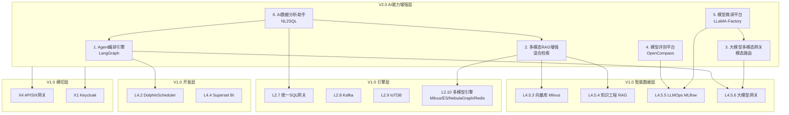
```mermaid
graph TB
    subgraph V2[V2.0 AI能力增强层]
        M1[1. Agent编排引擎<br/>LangGraph]
        M2[2. 多模态RAG增强<br/>混合检索]
        M3[3. 大模型多模态网关<br/>模态路由]
        M4[4. 模型评测平台<br/>OpenCompass]
        M5[5. 模型微调平台<br/>LLaMA-Factory]
        M6[6. AI数据分析助手<br/>NL2SQL]
    end

    subgraph V1[V1.0 智能数据层]
        V13[L4.5.3 向量库 Milvus]
        V14[L4.5.4 知识工程 RAG]
        V15[L4.5.5 LLMOps MLflow]
        V16[L4.5.6 大模型网关]
    end

    subgraph ENG[V1.0 引擎层]
        E27[L2.7 统一SQL网关]
        E28[L2.8 Kafka]
        E29[L2.9 IoTDB]
        E210[L2.10 多模型引擎<br/>Milvus/ES/NebulaGraph/Redis]
    end

    subgraph DEV[V1.0 开发层]
        D42[L4.2 DolphinScheduler]
        D44[L4.4 Superset BI]
    end

    subgraph X[V1.0 横切层]
        X4[X4 APISIX网关]
        X1[X1 Keycloak]
    end

    M1 --> V16
    M1 --> D42
    M2 --> V13
    M2 --> V14
    M2 --> E210
    M3 --> V16
    M4 --> V15
    M5 --> V15
    M5 --> M3
    M6 --> E27
    M6 --> M1
    M6 --> M2
    V2 --> X4
    V2 --> X1
```

### 1.2 与V1.0的关系

| V2.0 模块 | V1.0 基座 | 演进关系 |
| --- | --- | --- |
| Agent 编排引擎 | L4.5.6 大模型网关 + L4.2 DolphinScheduler | 新增；复用网关做模型调用，复用 DS 做调度 |
| 多模态 RAG 增强 | L4.5.3 向量库 + L4.5.4 知识工程 | 增强；从文本 RAG 升级为多模态混合检索 |
| 大模型多模态网关 | L4.5.6 大模型网关 | 演进；从文本-only 扩展为多模态输入输出 |
| 模型评测平台 | L4.5.5 LLMOps（MLflow Tracking） | 新增；评测结果写入 MLflow，扩展大模型评测指标 |
| 模型微调平台 | L4.5.5 LLMOps（微调训练） | 增强；从基础微调扩展为 LoRA/QLoRA/全参/P-Tuning 全方法 |
| AI 数据分析助手 | L2.7 统一 SQL 网关 + L4.4 Superset | 新增；NL2SQL + 智能解读 + 图表推荐 |

> **编号基准说明（A-07 修复）**：上表 V1.0 编号 L4.5.3/L4.5.4/L4.5.5/L4.5.6 以 `architecture.md` 为准。V1.0 实现层 README 编号存在已知偏差（vector-engine 标 L4.5.1、knowledge-engine 标 L4.5.2、llmops 标 L4.5.3、ml-platform 标 L4.5.6），属 V1.0 已知问题，不阻塞 V2.0。开发者对照时以 `architecture.md` 编号为准，V2.0 文档统一引用 architecture.md 编号。

### 1.3 设计原则

1. **封装一致性**：所有 AI 服务均为多租户 Pod，由 L0.11 封装层 Operator 托管，客户不持 K8s 权限。
2. **能力复用**：优先复用 V1.0 引擎层（Milvus/ES/NebulaGraph/IoTDB/Kafka/Redis）与 MLflow 底座，不重复造存储。
3. **多模态优先**：网关、RAG、助手均原生支持文本/图像/语音/视频多模态。
4. **可观测可计量**：所有 AI 调用经 X4 APISIX 采集指标，接入 L5.2 计量链路。
5. **租户隔离**：模型、知识库、Agent、评测任务、微调任务、助手会话均按租户隔离。

---

## 第2章 Agent编排引擎

### 2.1 定位与价值

Agent 编排引擎将单一 LLM 调用升级为多 Agent 协作的工作流编排，支持数据分析、SQL 生成、报表生成、治理、可视化五类内置 Agent，以及顺序/并行/条件分支/循环/人工审批五种编排模式。对标 Dify Workflow / Coze Bot / LangGraph。

### 2.2 架构设计

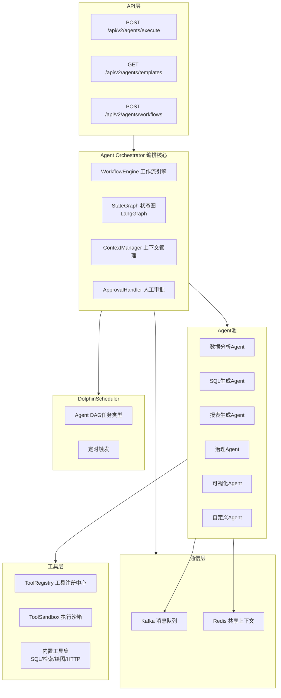
```mermaid
graph TB
    subgraph API[API层]
        A1[POST /api/v2/agents/execute]
        A2[GET /api/v2/agents/templates]
        A3[POST /api/v2/agents/workflows]
    end

    subgraph ORC[Agent Orchestrator 编排核心]
        O1[WorkflowEngine 工作流引擎]
        O2[StateGraph 状态图<br/>LangGraph]
        O3[ContextManager 上下文管理]
        O4[ApprovalHandler 人工审批]
    end

    subgraph AGT[Agent池]
        AG1[数据分析Agent]
        AG2[SQL生成Agent]
        AG3[报表生成Agent]
        AG4[治理Agent]
        AG5[可视化Agent]
        AG6[自定义Agent]
    end

    subgraph COM[通信层]
        C1[Kafka 消息队列]
        C2[Redis 共享上下文]
    end

    subgraph TOOL[工具层]
        T1[ToolRegistry 工具注册中心]
        T2[ToolSandbox 执行沙箱]
        T3[内置工具集<br/>SQL/检索/绘图/HTTP]
    end

    subgraph DS[DolphinScheduler]
        D1[Agent DAG任务类型]
        D2[定时触发]
    end

    API --> ORC
    ORC --> AGT
    ORC --> COM
    AGT --> TOOL
    ORC --> DS
    AGT --> C1
    AGT --> C2
```

### 2.3 Agent类型设计

#### 2.3.1 内置Agent类型

| Agent 类型 | 职责 | 输入 | 输出 | 依赖工具 |
| --- | --- | --- | --- | --- |
| DataAnalysisAgent | 数据探查、统计分析、趋势识别 | 数据集引用/SQL | 分析结论+洞察 | SQL查询/统计计算/数据采样 |
| SQLGenerationAgent | 自然语言转SQL、语法校验 | 自然语言+Schema | 合法SQL+执行计划 | Schema检索/SQL语法校验器 |
| ReportGenerationAgent | 报表编排、指标计算、结论生成 | 报表需求 | 报表JSON+解读 | SQL查询/图表生成/模板渲染 |
| GovernanceAgent | 数据质量校验、血缘分析、标准落标 | 表/字段 | 治理报告+问题清单 | 质量规则引擎/血缘解析器 |
| VisualizationAgent | 图表类型推荐、ECharts配置生成 | 数据特征 | ECharts配置+推荐理由 | 数据特征分析/图表模板库 |

#### 2.3.2 Agent基类设计

```python
代码示例：Agent基类与内置Agent定义（Python）
from abc import ABC, abstractmethod
from typing import Any, Dict, List, Optional

class BaseAgent(ABC):
    """Agent基类，所有内置与自定义Agent继承此类"""
    agent_type: str
    tools: List[str]
    llm_model: str

    @abstractmethod
    async def run(self, input: Dict[str, Any], context: "AgentContext") -> Dict[str, Any]:
        """执行Agent逻辑，返回结构化结果"""

    @abstractmethod
    def plan(self, input: Dict[str, Any]) -> List["ActionStep"]:
        """规划执行步骤"""

class DataAnalysisAgent(BaseAgent):
    agent_type = "data_analysis"
    tools = ["sql_query", "stat_compute", "data_sample"]

class SQLGenerationAgent(BaseAgent):
    agent_type = "sql_generation"
    tools = ["schema_search", "sql_validate", "explain_plan"]
```

### 2.4 编排模式

#### 2.4.1 五种编排模式

| 模式 | 语义 | 典型场景 | LangGraph 映射 |
| --- | --- | --- | --- |
| 顺序编排 Sequential | Agent A → Agent B → Agent C | NL2SQL → 执行 → 解读 | add_edge 顺序连边 |
| 并行编排 Parallel | Agent A ∥ Agent B → 汇总 | 多维度同时分析后合并 | add_node(fan_out) + add_node(reduce) |
| 条件分支 Conditional | if cond → A else → B | 有权限走执行，无权限走申请 | add_conditional_edges |
| 循环 Loop | while cond: run(A) | 迭代优化SQL直至通过校验 | 自环边 + 条件终止 |
| 人工审批 Approval | run(A) → 人工审核 → run(B) | 高风险SQL需DBA审批后执行 | `interrupt` + `Command(resume=...)` 节点（`from langgraph.types import Command`，最小版本 LangGraph 0.6+） |

#### 2.4.2 工作流DSL示例

```yaml
配置：Agent工作流DSL定义（YAML）
workflow:
  name: "智能数据分析流"
  mode: "sequential_with_branch"
  nodes:
    - id: "nl2sql"
      agent: "sql_generation"
      input: "${user_question}"
    - id: "validate"
      tool: "sql_validate"
      input: "${nl2sql.output}"
    - id: "check_risk"
      type: "conditional"
      condition: "${validate.risk_level}"
      branches:
        high: "approval"
        low: "execute"
    - id: "approval"
      type: "approval"
      approver: "dba_role"
      on_approve: "execute"
      on_reject: "end"
    - id: "execute"
      tool: "sql_query"
      input: "${nl2sql.output}"
    - id: "interpret"
      agent: "data_analysis"
      input: "${execute.result}"
    - id: "visualize"
      agent: "visualization"
      input: "${execute.result}"
```

### 2.5 Agent通信机制

#### 2.5.1 消息队列通信

Agent 间异步通信通过 Kafka 实现，Topic 命名遵循租户隔离规范 `tenant.<tid>.agent.<workflow_id>.event.vN`。

| 通信场景 | 机制 | 说明 |
| --- | --- | --- |
| 同步编排内传递 | Redis 共享上下文 | 同一 workflow 内 Agent 共享 ContextManager 状态 |
| 跨工作流异步事件 | Kafka 消息 | 工作流完成事件通知下游工作流 |
| 人工审批通知 | Kafka + WebSocket | 审批节点产生事件，前端 WebSocket 推送待办 |
| Agent 状态变更 | Kafka 事件 | 状态机变更广播，供可观测采集 |

#### 2.5.2 共享上下文设计

```python
代码示例：Agent共享上下文管理（Python）
class AgentContext:
    """工作流共享上下文，基于Redis实现租户隔离"""
    def __init__(self, tenant_id: str, workflow_id: str):
        self.namespace = f"tenant:{tenant_id}:wf:{workflow_id}"
        self.redis: Redis  # 租户专属Redis连接

    async def set(self, key: str, value: Any, ttl: int = 3600):
        """写入上下文变量，TTL默认1小时"""
        await self.redis.setex(f"{self.namespace}:{key}", ttl, json.dumps(value))

    async def get(self, key: str) -> Any:
        """读取上下文变量"""

    async def append_message(self, agent_id: str, message: dict):
        """追加Agent消息到上下文历史"""
```

### 2.6 工具注册与执行沙箱

#### 2.6.1 ToolRegistry设计

ToolRegistry 统一管理所有 Agent 可调用的工具，支持静态注册与动态发现。

| 工具类别 | 内置工具 | 说明 |
| --- | --- | --- |
| SQL 类 | sql_query / sql_validate / explain_plan | 调用 L2.7 统一 SQL 网关 |
| 检索类 | vector_search / keyword_search / graph_search | 调用 L2.10 多模型引擎 |
| 绘图类 | echarts_render / matplotlib_plot | 生成图表配置 |
| HTTP 类 | http_get / http_post | 调用外部 API |
| 文件类 | file_read / file_write | 读写工作空间存储 |
| 治理类 | quality_check / lineage_query | 调用 L3 治理层 |

#### 2.6.2 执行沙箱

工具执行在受控沙箱中运行，防止恶意代码逃逸。

| 沙箱维度 | 机制 | 说明 |
| --- | --- | --- |
| 计算隔离 | gVisor / Kata Containers | 工具 Pod 运行在沙箱运行时 |
| 网络隔离 | NetworkPolicy | 仅放行白名单目标（SQL 网关/检索引擎） |
| 资源限制 | CPU/Memory/Timeout | 单工具调用默认 2C4G，超时 60s |
| 文件隔离 | tmpfs 临时挂载 | 工具仅可读写临时目录 |
| 权限隔离 | ServiceAccount 最小权限 | 工具 Pod 使用专用 SA，无集群资源操作权限 |

### 2.7 与DolphinScheduler集成

Agent 工作流作为 DolphinScheduler 的新任务类型 `AGENT_DAG` 接入，实现定时触发与依赖编排。

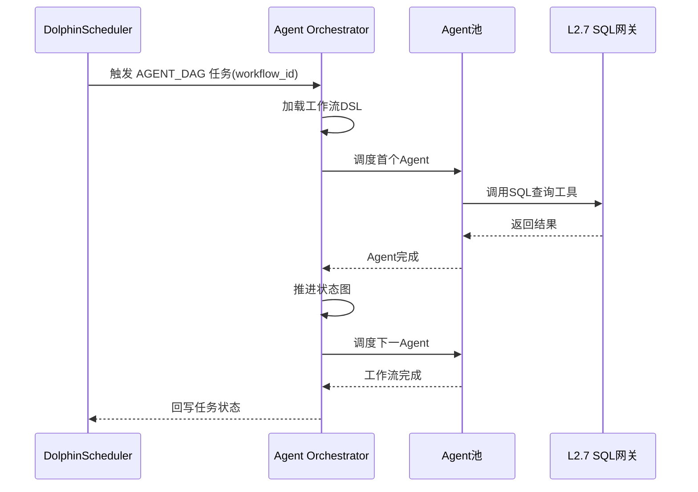
```mermaid
sequenceDiagram
    participant DS as DolphinScheduler
    participant AOE as Agent Orchestrator
    participant AGT as Agent池
    participant GW as L2.7 SQL网关

    DS->>AOE: 触发 AGENT_DAG 任务(workflow_id)
    AOE->>AOE: 加载工作流DSL
    AOE->>AGT: 调度首个Agent
    AGT->>GW: 调用SQL查询工具
    GW-->>AGT: 返回结果
    AGT-->>AOE: Agent完成
    AOE->>AOE: 推进状态图
    AOE->>AGT: 调度下一Agent
    AGT-->>AOE: 工作流完成
    AOE-->>DS: 回写任务状态
```

集成方案要点：
1. **任务类型扩展**：在 DolphinScheduler TaskPlugin 中注册 `AGENT_DAG` 类型，任务参数为 `workflow_id`。
2. **状态回写**：Agent Orchestrator 通过 DS API 回写任务实例状态（成功/失败/超时）。
3. **依赖编排**：Agent 工作流可作为 DS DAG 的一个节点，与其他任务类型（SQL/Shell/Spark）混合编排。
4. **定时触发**：复用 DS 的定时调度与依赖触发能力，无需在 Orchestrator 重复实现。

### 2.8 API接口定义

#### 2.8.1 执行Agent工作流

```yaml
配置：Agent执行接口OpenAPI定义（YAML）
POST /api/v2/agents/execute:
  summary: 执行Agent工作流
  requestBody:
    required: true
    content:
      application/json:
        schema:
          type: object
          required: [workflow_id, input]
          properties:
            workflow_id:
              type: string
              description: 工作流模板ID
            input:
              type: object
              description: 工作流输入参数
            async:
              type: boolean
              default: true
              description: 是否异步执行
            callback_url:
              type: string
              description: 异步回调地址
  responses:
    '200':
      description: 同步执行返回结果
    '202':
      description: 异步执行返回任务ID
      content:
        application/json:
          schema:
            type: object
            properties:
              execution_id:
                type: string
              status:
                type: string
                enum: [queued, running, completed, failed]
```

#### 2.8.2 工作流模板管理

```yaml
配置：Agent模板接口OpenAPI定义（YAML）
GET /api/v2/agents/templates:
  summary: 获取工作流模板列表
  parameters:
    - name: category
      in: query
      type: string
      enum: [data_analysis, report, governance, custom]
  responses:
    '200':
      content:
        application/json:
          schema:
            type: array
            items:
              type: object
              properties:
                template_id:
                  type: string
                name:
                  type: string
                category:
                  type: string
                nodes:
                  type: array
                description:
                  type: string

POST /api/v2/agents/workflows:
  summary: 创建自定义工作流
  requestBody:
    content:
      application/json:
        schema:
          type: object
          properties:
            name:
              type: string
            dsl:
              type: object
              description: 工作流DSL定义
```

#### 2.8.3 完整接口清单

| 接口 | 方法 | 说明 |
| --- | --- | --- |
| /api/v2/agents/execute | POST | 执行工作流 |
| /api/v2/agents/executions/{id} | GET | 查询执行状态 |
| /api/v2/agents/executions/{id}/cancel | POST | 取消执行 |
| /api/v2/agents/templates | GET | 模板列表 |
| /api/v2/agents/workflows | POST | 创建工作流 |
| /api/v2/agents/workflows/{id} | GET/PUT/DELETE | 工作流 CRUD |
| /api/v2/agents/approvals/{id} | POST | 提交人工审批结果 |
| /api/v2/agents/tools | GET/POST | 工具注册与查询 |

### 2.9 数据模型设计

#### 2.9.1 核心数据模型

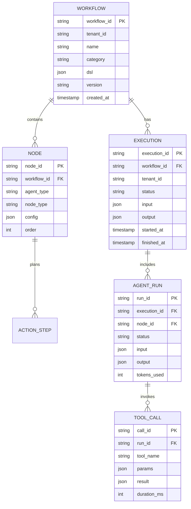
```mermaid
erDiagram
    WORKFLOW ||--o{ NODE : contains
    WORKFLOW ||--o{ EXECUTION : has
    NODE ||--o{ ACTION_STEP : plans
    EXECUTION ||--o{ AGENT_RUN : includes
    AGENT_RUN ||--o{ TOOL_CALL : invokes

    WORKFLOW {
        string workflow_id PK
        string tenant_id
        string name
        string category
        json dsl
        string version
        timestamp created_at
    }
    NODE {
        string node_id PK
        string workflow_id FK
        string agent_type
        string node_type
        json config
        int order
    }
    EXECUTION {
        string execution_id PK
        string workflow_id FK
        string tenant_id
        string status
        json input
        json output
        timestamp started_at
        timestamp finished_at
    }
    AGENT_RUN {
        string run_id PK
        string execution_id FK
        string node_id FK
        string status
        json input
        json output
        int tokens_used
    }
    TOOL_CALL {
        string call_id PK
        string run_id FK
        string tool_name
        json params
        json result
        int duration_ms
    }
```

#### 2.9.2 状态机

工作流执行状态机：`queued → running → (approval_pending → running)* → completed | failed | cancelled`

Agent 运行状态机：`pending → planning → executing → tool_calling → completed | failed`

### 2.10 多租户隔离

| 隔离维度 | 机制 | 说明 |
| --- | --- | --- |
| 工作流隔离 | tenant_id 字段 + 查询过滤 | 工作流 DSL 按 tenant_id 隔离，租户仅可见自有工作流 |
| 执行隔离 | K8s Namespace + Pod 级隔离 | Agent 执行 Pod 运行在租户 Namespace，受 ResourceQuota 约束 |
| 上下文隔离 | Redis key 前缀 `tenant:<tid>:` | 共享上下文按租户 key 空间隔离 |
| 消息隔离 | Kafka Topic `tenant.<tid>.agent.*` | Agent 通信消息按租户 Topic 隔离 |
| 工具隔离 | 工具白名单按租户配置 | 租户管理员可禁用特定工具（如 http_post） |
| 审批隔离 | 审批人按租户角色域 | 审批待办仅推送给租户内角色 |

### 2.11 技术选型与版本

#### 2.11.1 编排框架对比

| 框架 | 优势 | 劣势 | 选型结论 |
| --- | --- | --- | --- |
| LangGraph | 状态图原生、循环/条件/中断支持完善、与 LangChain 生态融合 | 仅 Python、无内置多 Agent 通信 | ✅ 选用（编排核心） |
| AutoGen | 多 Agent 对话成熟、微软背书 | 对话范式固定、工作流灵活性不足 | ❌ 不选 |
| CrewAI | 角色分工直观、上手快 | 编排模式有限、无人工审批节点 | ❌ 不选 |

#### 2.11.2 技术栈版本

| 组件 | 版本 | 用途 |
| --- | --- | --- |
| LangGraph | **0.6+**（2025+ 稳定版） | 工作流编排核心，含稳定 `interrupt` + `Command(resume=...)` 人工审批 API |
| LangChain | 0.3.x 最新 | Agent 与工具抽象 |
| langchain-core | 0.3.x | LangGraph 0.6+ 与 LangChain 0.3.x 共同依赖，版本对齐 |
| Kafka | 3.6 (V1.0 复用) | Agent 异步通信 |
| Redis | 7.2 (V1.0 复用) | 共享上下文 |
| gVisor | latest | 工具执行沙箱 |
| DolphinScheduler | 3.2 (V1.0 复用) | 调度集成 |
| 与 Java 交互方式 | HTTP API（§2.8 `/api/v2/agents/*`） | 跨语言边界：Python Agent 编排引擎通过 HTTP API 与 V1.0 Java 主栈（封装层、SQL 网关、规则引擎）交互，无需跨语言 RPC（C-09 修复） |

**LangGraph 版本升级说明**：
- V2.0 早期文档锁定 LangGraph 0.2.x（2024 年初版本），其 `interrupt` API 尚为实验性，且要求 langchain-core 0.2.x，与 LangChain 0.3.x 要求的 langchain-core 0.3.x 冲突。
- V2.0 修正：升级至 LangGraph 0.6+（2025+ 稳定版），`interrupt` + `Command(resume=...)` 人工审批 API 已稳定，且与 LangChain 0.3.x 共用 langchain-core 0.3.x，依赖对齐无冲突。
- §2.4.1 编排模式表"人工审批 Approval"行使用 `from langgraph.types import Command`，最小版本要求 LangGraph 0.6+。
- 与 V1.0 Java 主栈交互方式：Agent 编排引擎通过 HTTP API（§2.8 已定义 `/api/v2/agents/*`）与 Java 组件（封装层、SQL 网关、规则引擎）交互，无需跨语言 RPC。

---

## 第3章 多模态RAG增强

### 3.1 定位与价值

将 V1.0 文本 RAG 升级为多模态 RAG，支持文本/表格/图像混合切片与向量化，检索融合向量/关键词/图谱/时序四路，并引入 Cross-Encoder 重排与 MMR 多样性重排。对标阿里百炼多模态知识库 / GPT-4V RAG。

### 3.2 架构设计

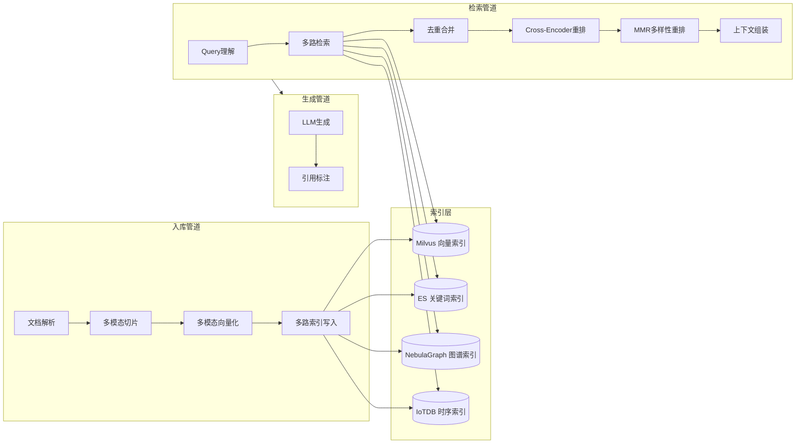
```mermaid
graph LR
    subgraph INGEST[入库管道]
        I1[文档解析] --> I2[多模态切片]
        I2 --> I3[多模态向量化]
        I3 --> I4[多路索引写入]
    end

    subgraph RETRIEVE[检索管道]
        R1[Query理解] --> R2[多路检索]
        R2 --> R3[去重合并]
        R3 --> R4[Cross-Encoder重排]
        R4 --> R5[MMR多样性重排]
        R5 --> R6[上下文组装]
    end

    subgraph GEN[生成管道]
        G1[LLM生成] --> G2[引用标注]
    end

    subgraph IDX[索引层]
        V1[(Milvus 向量索引)]
        V2[(ES 关键词索引)]
        V3[(NebulaGraph 图谱索引)]
        V4[(IoTDB 时序索引)]
    end

    I4 --> V1
    I4 --> V2
    I4 --> V3
    I4 --> V4
    R2 --> V1
    R2 --> V2
    R2 --> V3
    R2 --> V4
    RETRIEVE --> GEN
```

### 3.3 多模态切片

#### 3.3.1 文本切片

| 切片策略 | 算法 | 适用场景 | 参数 |
| --- | --- | --- | --- |
| 语义切片 Semantic | 基于 embedding 相似度切分 | 语义连贯要求高的长文档 | threshold=0.7, min_chunk=200 |
| 递归切片 Recursive | 按分隔符层级递归切分 | 通用文档 | chunk_size=512, overlap=50 |
| 段落切片 Paragraph | 按段落/标题结构切分 | Markdown/HTML 结构化文档 | max_paragraphs=3 |

#### 3.3.2 表格切片

| 切片策略 | 粒度 | 说明 | 示例 |
| --- | --- | --- | --- |
| 行切片 Row-wise | 按行分组 | 保留表头，每 N 行一个 chunk | 表头 + 行 1-10 |
| 列切片 Column-wise | 按列分组 | 按列族拆分宽表 | 列 A-C / 列 D-F |
| 单元格切片 Cell-wise | 单元格 | 高精度检索，保留行列坐标 | (行3, 列5)=值 |
| 表头摘要切片 Header-Summary | 表级 | 整表摘要 + Schema 描述 | "销售明细表：日期/产品/金额" |

#### 3.3.3 图像切片

| 切片策略 | 算法 | 说明 |
| --- | --- | --- |
| 区域切片 Region | 目标检测 + 区域裁剪 | 检测图中目标区域，分别切片 |
| OCR 切片 OCR | OCR 文字提取 | 提取图中文字作为文本 chunk |
| 整图切片 Whole-Image | 直接整图向量化 | 适用于图表/示意图整体语义检索 |
| 图文混合切片 Hybrid | OCR + 整图 | 文字 chunk + 图像 chunk 双索引 |

### 3.4 多模态向量化

| 模态 | Embedding 模型 | 维度 | 部署方式 |
| --- | --- | --- | --- |
| 文本 | bge-large-zh-v1.5 / m3e-base | 1024 / 768 | 自托管 GPU Pod |
| 图像 | CLIP-ViT-L/14 / CogVLM-Embed | 768 / 1024 | 自托管 GPU Pod |
| 表格 | TAPAS-Embed / 表格Schema向量化 | 768 | 自托管 CPU Pod |
| 语音 | Whisper-Embed | 512 | 自托管 GPU Pod |
| 视频 | CLIP 抽帧向量化 | 768 | 抽帧后复用图像 Embedding |

### 3.5 混合检索

#### 3.5.1 四路检索

V2.0 多模态 RAG 检索路设计为**向量 + 关键词 + 图谱 + 时序预聚合向量**四路。其中时序检索路采用"预聚合后入 Milvus 向量索引"方案，避免直接对 IoTDB 进行 NL2IoTDB 转换（IoTDB SQL 语法复杂，自然语言到时序 SQL 的转换不稳定）。

表：四路检索设计表

| 检索路 | 引擎 | 检索方式 | 召回策略 |
| --- | --- | --- | --- |
| 向量检索 | Milvus (V1.0 L2.10) | ANN 近似最近邻 | topK=20, HNSW 索引 |
| 关键词检索 | Elasticsearch (V1.0 L2.10) | BM25 + 分词 | topK=20, 中文 IK 分词 |
| 图谱检索 | NebulaGraph (V1.0 L2.10) | 实体/关系多跳 | 提取查询实体，2跳邻居 |
| 时序检索 | Milvus（时序预聚合向量） | ANN 近似最近邻 | IoTDB 时序数据预聚合后向量化入 Milvus 专 collection，按时间窗口+测点维度检索 |

**时序预聚合方案说明**：
- 离线阶段：定时任务（DolphinScheduler 调度）从 IoTDB 拉取时序数据，按时间窗口（如 1 小时/1 天）聚合（sum/avg/max/min/count），生成时序片段文本（如"2024-Q3 产品A 日销售额序列：[120, 135, ...]"），经 Embedding 向量化后写入 Milvus 专 collection `tenant_<tid>_timeseries`。
- 在线检索：用户提问"Q3 销售趋势"→ Query 理解识别时间条件与实体 → 向量检索 Milvus 时序 collection → 返回相关时序片段（含聚合值与时间窗口）→ 拼入 LLM 上下文生成解读。
- 该方案避免 NL2IoTDB 转换的不稳定性，复用 Milvus 向量检索能力，时序数据预聚合后语义清晰，LLM 可直接解读。
- 缺点：时序数据实时性受预聚合窗口限制（最新数据延迟 1 个窗口），V2.0 通过缩短聚合窗口（如 5 分钟）+ 增量更新缓解。

#### 3.5.2 检索融合

```python
代码示例：混合检索融合策略（Python）
class HybridRetriever:
    """四路混合检索器，支持加权融合与去重"""
    def __init__(self, weights: dict = None):
        self.weights = weights or {"vector": 0.4, "keyword": 0.3, "graph": 0.2, "timeseries": 0.1}
        self.retrievers = {
            "vector": MilvusRetriever(),
            "keyword": ESRetriever(),
            "graph": NebulaGraphRetriever(),
            "timeseries": IoTDBRetriever(),
        }

    async def retrieve(self, query: str, top_k: int = 20) -> list:
        results = {}
        for name, retriever in self.retrievers.items():
            try:
                hits = await retriever.search(query, top_k=top_k)
                results[name] = self._normalize(hits)
            except Exception:
                results[name] = []  # 单路失败不影响整体
        return self._fuse(results, top_k)

    def _fuse(self, results: dict, top_k: int) -> list:
        """加权融合 + 去重"""
        fused = {}
        for name, hits in results.items():
            w = self.weights[name]
            for hit in hits:
                key = hit.chunk_id
                score = fused.get(key, 0) + w * hit.score
                fused[key] = max(fused.get(key, 0), score)
        return sorted(fused.items(), key=lambda x: -x[1])[:top_k]
```

### 3.6 重排序

#### 3.6.1 Cross-Encoder重排

使用 Cross-Encoder 模型对 query-chunk 对进行精排，比 Bi-Embedding 召回更准确。

| 重排模型 | 说明 | 部署 |
| --- | --- | --- |
| bge-reranker-large | 中英双语重排 | 自托管 GPU Pod |
| Cohere Rerank | 商用 API（可选） | 调用外部 API |

#### 3.6.2 MMR多样性重排

Maximal Marginal Relevance 算法在相关性与多样性间平衡，避免返回高度相似的 chunk。

```python
代码示例：MMR多样性重排（Python）
def mm_rerank(query_vec, chunk_vecs, lambda_: float = 0.7, top_k: int = 10):
    """MMR：兼顾相关性与多样性"""
    selected = []
    candidates = list(range(len(chunk_vecs)))
    for _ in range(top_k):
        scores = []
        for i in candidates:
            rel = cosine(query_vec, chunk_vecs[i])
            div = max([cosine(chunk_vecs[i], chunk_vecs[j]) for j in selected], default=0)
            mmr = lambda_ * rel - (1 - lambda_) * div
            scores.append((i, mmr))
        best = max(scores, key=lambda x: x[1])[0]
        selected.append(best)
        candidates.remove(best)
    return selected
```

### 3.7 RAG管道

完整 RAG 管道：`query → Query理解 → 多路检索 → 去重 → Cross-Encoder重排 → MMR多样性重排 → 上下文组装 → LLM生成 → 引用标注`

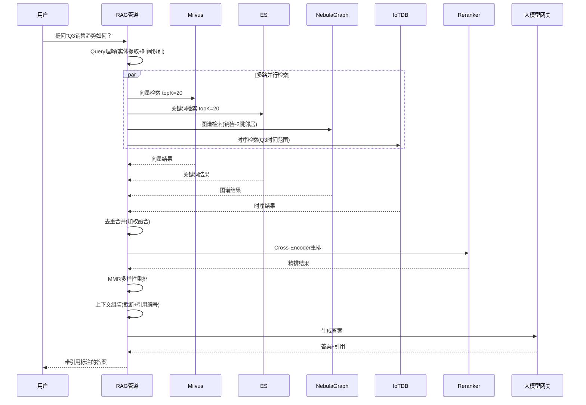
```mermaid
sequenceDiagram
    participant U as 用户
    participant RAG as RAG管道
    participant V as Milvus
    participant E as ES
    participant G as NebulaGraph
    participant T as IoTDB
    participant RR as Reranker
    participant LLM as 大模型网关

    U->>RAG: 提问"Q3销售趋势如何？"
    RAG->>RAG: Query理解(实体提取+时间识别)
    par 多路并行检索
        RAG->>V: 向量检索 topK=20
        RAG->>E: 关键词检索 topK=20
        RAG->>G: 图谱检索(销售-2跳邻居)
        RAG->>T: 时序检索(Q3时间范围)
    end
    V-->>RAG: 向量结果
    E-->>RAG: 关键词结果
    G-->>RAG: 图谱结果
    T-->>RAG: 时序结果
    RAG->>RAG: 去重合并(加权融合)
    RAG->>RR: Cross-Encoder重排
    RR-->>RAG: 精排结果
    RAG->>RAG: MMR多样性重排
    RAG->>RAG: 上下文组装(截断+引用编号)
    RAG->>LLM: 生成答案
    LLM-->>RAG: 答案+引用
    RAG-->>U: 带引用标注的答案
```

### 3.8 知识库管理

#### 3.8.1 知识库CRUD

| 操作 | 接口 | 说明 |
| --- | --- | --- |
| 创建知识库 | POST /api/v2/knowledge-bases | 指定切片策略、检索配置、重排配置 |
| 上传文档 | POST /api/v2/knowledge-bases/{id}/documents | 触发解析→切片→向量化→索引写入 |
| 增量更新 | POST /api/v2/knowledge-bases/{id}/documents/{doc_id}/update | 仅重新切片变更部分 |
| 版本管理 | POST /api/v2/knowledge-bases/{id}/versions | 知识库版本快照，支持回滚 |
| 权限控制 | POST /api/v2/knowledge-bases/{id}/permissions | 知识库级 RBAC |

#### 3.8.2 增量更新策略

| 更新场景 | 策略 | 说明 |
| --- | --- | --- |
| 文档追加 | 增量切片+增量索引 | 仅处理新文档，不重建索引 |
| 文档修改 | 删除旧chunk+重新切片 | 按文档ID删除关联chunk后重建 |
| 文档删除 | 级联删除chunk | 删除文档关联的所有向量/关键词/图谱索引 |
| Schema变更 | 全量重建索引 | 索引参数变更需重建 |

### 3.9 API接口定义

#### 3.9.1 RAG查询接口

```yaml
配置：RAG查询接口OpenAPI定义（YAML）
POST /api/v2/rag/query:
  summary: 多模态RAG查询
  requestBody:
    content:
      application/json:
        schema:
          type: object
          required: [knowledge_base_id, query]
          properties:
            knowledge_base_id:
              type: string
            query:
              type: string
              description: 自然语言查询
            modality:
              type: string
              enum: [text, image, mixed]
              default: text
            retriever_config:
              type: object
              properties:
                top_k:
                  type: integer
                  default: 20
                threshold:
                  type: number
                  default: 0.5
                weights:
                  type: object
                  description: 四路检索权重
            reranker:
              type: object
              properties:
                model:
                  type: string
                  default: bge-reranker-large
                mmr_lambda:
                  type: number
                  default: 0.7
            generate:
              type: boolean
              default: true
              description: 是否调用LLM生成答案
            citation:
              type: boolean
              default: true
              description: 是否标注引用
  responses:
    '200':
      content:
        application/json:
          schema:
            type: object
            properties:
              answer:
                type: string
              chunks:
                type: array
                items:
                  type: object
                  properties:
                    chunk_id:
                      type: string
                    content:
                      type: string
                    modality:
                      type: string
                    score:
                      type: number
                    citation_index:
                      type: integer
              retrieval_stats:
                type: object
                properties:
                  vector_hits:
                    type: integer
                  keyword_hits:
                    type: integer
                  graph_hits:
                    type: integer
                  timeseries_hits:
                    type: integer
                  latency_ms:
                    type: integer
```

#### 3.9.2 知识库管理接口

| 接口 | 方法 | 说明 |
| --- | --- | --- |
| /api/v2/knowledge-bases | POST | 创建知识库 |
| /api/v2/knowledge-bases | GET | 知识库列表 |
| /api/v2/knowledge-bases/{id} | GET/PUT/DELETE | 知识库 CRUD |
| /api/v2/knowledge-bases/{id}/documents | POST | 上传文档 |
| /api/v2/knowledge-bases/{id}/documents | GET | 文档列表 |
| /api/v2/knowledge-bases/{id}/documents/{doc_id} | DELETE | 删除文档 |
| /api/v2/knowledge-bases/{id}/versions | POST/GET | 版本管理 |
| /api/v2/knowledge-bases/{id}/permissions | POST/GET | 权限控制 |
| /api/v2/knowledge-bases/{id}/reindex | POST | 重建索引 |

### 3.10 数据模型设计

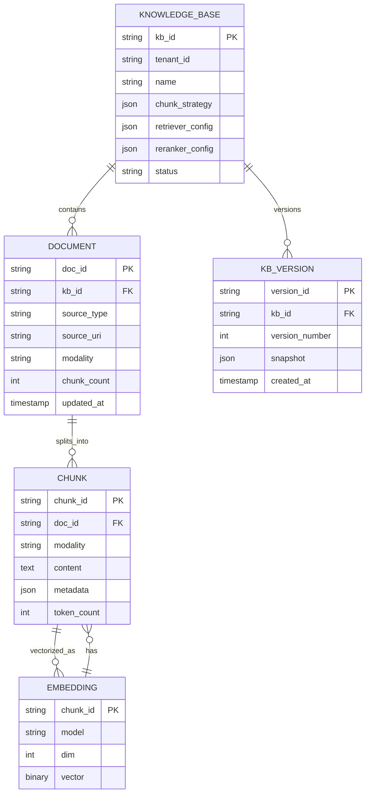
```mermaid
erDiagram
    KNOWLEDGE_BASE ||--o{ DOCUMENT : contains
    DOCUMENT ||--o{ CHUNK : splits_into
    CHUNK ||--o{ EMBEDDING : vectorized_as
    KNOWLEDGE_BASE ||--o{ KB_VERSION : versions
    CHUNK }o--|| EMBEDDING : has

    KNOWLEDGE_BASE {
        string kb_id PK
        string tenant_id
        string name
        json chunk_strategy
        json retriever_config
        json reranker_config
        string status
    }
    DOCUMENT {
        string doc_id PK
        string kb_id FK
        string source_type
        string source_uri
        string modality
        int chunk_count
        timestamp updated_at
    }
    CHUNK {
        string chunk_id PK
        string doc_id FK
        string modality
        text content
        json metadata
        int token_count
    }
    EMBEDDING {
        string chunk_id PK
        string model
        int dim
        binary vector
    }
    KB_VERSION {
        string version_id PK
        string kb_id FK
        int version_number
        json snapshot
        timestamp created_at
    }
```

### 3.11 与V1.0集成方案

| V1.0 组件 | 集成方式 | 说明 |
| --- | --- | --- |
| L4.5.3 向量库 (Milvus) | 直接复用 | 多模态向量写入同一 Milvus 集群，按 collection 区分模态 |
| L4.5.4 知识工程 | 增强演进 | V1.0 文本 RAG 升级为多模态 RAG，切片/检索/重排全面增强 |
| L2.10 多模型引擎 | 直接复用 | ES/NebulaGraph/Redis 复用 V1.0 部署 |
| L2.9 IoTDB | 新增集成 | 时序数据源：离线预聚合后向量化入 Milvus 时序 collection，避免 NL2IoTDB 转换（详见 §3.5.1） |
| L4.5.6 大模型网关 | 调用 | LLM 生成步骤调用网关 |

#### 3.11.1 端口规划与冲突修正

V1.0 已知问题：`vector-engine` 与 `llm-gateway` 默认端口均为 8084，同节点共部署时冲突。V2.0 多模态 RAG 向量检索路依赖 `vector-engine`，多模态网关演进 `llm-gateway`，必须在部署 values 显式区分端口。

表：V2.0 AI 相关服务端口规划表

| 服务 | V1.0 默认端口 | V2.0 部署 values 端口 | 说明 |
| --- | --- | --- | --- |
| llm-gateway（V1.0）/ 多模态网关（V2.0 演进） | 8084 | 8084 | 保持 V1.0 端口不变，V2.0 多模态网关复用 |
| vector-engine | 8084（与 llm-gateway 冲突） | **8086** | V2.0 部署 values 显式改为 8086，消除冲突 |
| knowledge-engine | 8080 | 8080 | 保持不变 |
| llmops | 8080（与 knowledge-engine 冲突） | **8081** | V2.0 部署 values 显式改为 8081，消除冲突 |
| ml-platform | 8080（与 knowledge-engine/llmops 冲突） | **8082** | V2.0 部署 values 显式改为 8082，消除冲突 |
| Milvus | 19530 | 19530 | 向量数据库 gRPC 端口，无冲突 |
| IoTDB | 6667 | 6667 | 时序数据库 Session 端口，无冲突 |

V2.0 部署 values 必须显式设置：

```yaml
配置：V2.0 AI 服务端口规划（YAML）
# design/deploy/values/ai-services-ports.yaml
# 消除 V1.0 已知端口冲突，V2.0 显式分配
llmGateway:
  port: 8084                    # 保持 V1.0 端口
vectorEngine:
  port: 8086                    # V1.0 默认 8084 与 llm-gateway 冲突，V2.0 改为 8086
knowledgeEngine:
  port: 8080                    # 保持 V1.0 端口
llmops:
  port: 8081                    # V1.0 默认 8080 与 knowledge-engine 冲突，V2.0 改为 8081
mlPlatform:
  port: 8082                    # V1.0 默认 8080 冲突，V2.0 改为 8082
```

### 3.12 多租户隔离

| 隔离维度 | 机制 | 说明 |
| --- | --- | --- |
| 知识库隔离 | tenant_id + KB 命名空间 | Milvus collection 命名 `tenant_<tid>_kb_<kbid>` |
| 索引隔离 | ES index / NebulaGraph space | 按租户分索引/图空间 |
| 文档隔离 | 对象存储路径 `tenant/<tid>/kb/<kbid>/` | 文档原始文件按租户路径隔离 |
| 检索隔离 | 查询注入 tenant_id 过滤 | 检索时强制注入租户过滤条件 |
| 模型隔离 | Embedding/Reranker 模型按租户配置 | 租户可选择自有部署的模型 |

### 3.13 技术选型与版本

| 组件 | 版本 | 用途 |
| --- | --- | --- |
| bge-large-zh-v1.5 | 1.5 | 文本 Embedding |
| CLIP-ViT-L/14 | openai/clip-vit-large-patch14 | 图像 Embedding |
| bge-reranker-large | 1.5 | Cross-Encoder 重排 |
| Milvus | **2.4**（V1.0 基线 2.3 → V2.0 升级 2.4） | 向量检索，多模态向量统一存储 |
| Elasticsearch | 8.x (V1.0 复用) | 关键词检索 |
| NebulaGraph | 3.x (V1.0 复用) | 图谱检索 |
| IoTDB | 2.0 (V1.0 复用) | 时序检索 |
| Unstructured | 0.13.x | 多模态文档解析 |

**Milvus 2.4 升级影响评估（C-08 修复）**：

**V1.0 版本基线**：
- V1.0 architecture.md 仅说"Milvus（向量）"未明确版本，V1.0 platform/vector-engine/README.md 也未指定版本。
- V2.0 明确 V1.0 Milvus 基线为 **2.3**（V1.0 部署时 Milvus 2.3 为稳定版，2023.06 发布），V2.0 升级到 **2.4**（2024.06 发布）。

**Milvus 2.3 → 2.4 升级影响评估**：

| 维度 | Milvus 2.3 | Milvus 2.4 | 兼容性 | 升级动作 |
| --- | --- | --- | --- | --- |
| Collection schema API | create_collection(schema) | create_collection(schema，**新增 properties 参数**） | ⚠️ 向后兼容 | 可选参数，V1.0 代码不传 properties 仍可用 |
| 索引类型 | IVF_FLAT/IVF_SQ8/HNSW/ANNOY | 同上 + **SCANN**（新）+ **GPU 加速**（新） | ✅ 向后兼容 | V1.0 索引类型继续支持，新索引可选 |
| 索引参数 | nlist/ef/M | 同上 + SCANN 的 **with_raw_data** 参数 | ✅ 向后兼容 | V1.0 索引参数不变 |
| Go SDK | milvus-sdk-go v2.3.x | milvus-sdk-go **v2.4.x** | ⚠️ 需升级 | V1.0 vector-engine Go SDK 从 v2.3 升级到 v2.4（API 兼容，新增方法） |
| 多模态向量统一存储 | 单向量字段 | **多向量字段**（V2.0 多模态 RAG 依赖） | ✅ 新增能力 | V2.0 多模态 RAG 用多向量字段，V1.0 单向量字段不受影响 |
| 数据兼容 | — | — | ✅ 兼容 | 2.3 collection 在 2.4 可读可写，元数据自动升级 |
| 部署兼容 | standalone/cluster | standalone/cluster | ✅ 兼容 | Helm Chart 兼容，values 增量配置 |

**V1.0 vector-engine Go SDK 升级路径**：
- V1.0 vector-engine 使用 milvus-sdk-go v2.3.x，V2.0 升级到 v2.4.x。
- 升级方式：`go get github.com/milvus-io/milvus-sdk-go/v2@v2.4.0`，API 向后兼容，V1.0 代码无需改动（仅新增方法如多向量字段支持）。
- V2.0 多模态 RAG 新增多向量字段 API 调用（`InsertMultiVector`），V1.0 单向量字段 API（`InsertVector`）继续可用。

**升级风险与缓解**：
- **风险**：Milvus 2.4 引入 SCANN/GPU 加速索引为新增能力，不影响 V1.0 现有索引；Collection schema API 新增 properties 参数为可选，V1.0 代码不传仍可用。
- **缓解**：V2.0 升级前在 staging 环境验证 V1.0 collection 在 2.4 的读写兼容性；升级后 V1.0 vector-engine Go SDK 同步升级到 v2.4.x，V1.0 代码无改动。
- **回滚方案**：若升级失败，Milvus 2.4 collection 元数据可降级回 2.3（删除 2.4 新增元数据字段），vector-engine Go SDK 回退到 v2.3.x。

---

## 第4章 大模型多模态网关

### 4.1 定位与价值

将 V1.0 文本-only 大模型网关演进为多模态网关，支持文本/图像/语音/视频多模态输入与文本/图像/语音多模态输出，按模态路由到不同模型，并提供 SSE 流式响应与 Token 计量。对标 OpenAI 多模态 API / 阿里百炼多模态网关。

### 4.2 架构设计

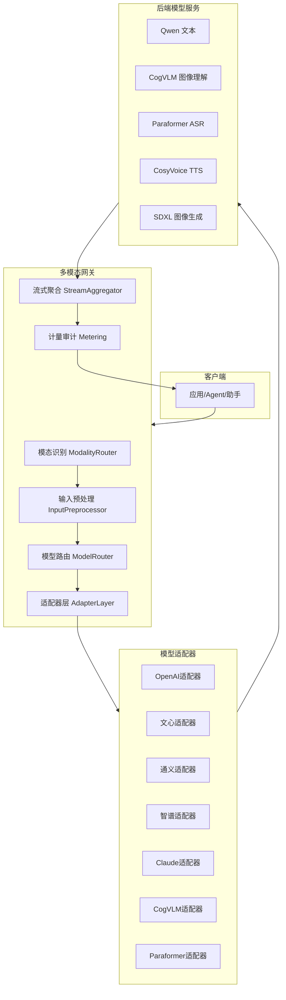
```mermaid
graph TB
    subgraph CLI[客户端]
        C1[应用/Agent/助手]
    end

    subgraph GW[多模态网关]
        G1[模态识别 ModalityRouter]
        G2[输入预处理 InputPreprocessor]
        G3[模型路由 ModelRouter]
        G4[适配器层 AdapterLayer]
        G5[流式聚合 StreamAggregator]
        G6[计量审计 Metering]
    end

    subgraph ADP[模型适配器]
        A1[OpenAI适配器]
        A2[文心适配器]
        A3[通义适配器]
        A4[智谱适配器]
        A5[Claude适配器]
        A6[CogVLM适配器]
        A7[Paraformer适配器]
    end

    subgraph MDL[后端模型服务]
        M1[Qwen 文本]
        M2[CogVLM 图像理解]
        M3[Paraformer ASR]
        M4[CosyVoice TTS]
        M5[SDXL 图像生成]
    end

    C1 --> GW
    G1 --> G2 --> G3 --> G4 --> ADP
    ADP --> MDL
    MDL --> G5 --> G6 --> C1
```

### 4.3 多模态输入处理

| 输入模态 | 预处理 | 路由目标 | 说明 |
| --- | --- | --- | --- |
| 文本 Text | 直接透传 | Qwen / 文心 / 通义 | 文本对话 |
| 图像 Image | Base64/URL解析 + 尺寸校验 | CogVLM / GPT-4V | 图像理解、VQA |
| 语音 ASR | 音频格式转换 + 采样率统一 | Paraformer | 语音转文字后走文本链路 |
| 视频 Video | 抽帧（关键帧/均匀抽帧） | CogVLM（逐帧） | 视频理解，抽帧后按图像处理 |

### 4.4 多模态输出处理

| 输出模态 | 生成模型 | 说明 |
| --- | --- | --- |
| 文本 Text | Qwen / 文心 / 通义 | 文本生成，SSE 流式 |
| 图像生成 Image Gen | SDXL / CogView | 文生图，返回图像 URL |
| 语音合成 TTS | CosyVoice / 通义 TTS | 文生语音，返回音频流 |

### 4.5 模型路由

#### 4.5.1 按模态路由

```python
代码示例：多模态模型路由器（Python）
class ModalityRouter:
    """按输入模态路由到不同模型"""
    ROUTING_TABLE = {
        "text": {"default": "qwen-max", "fallback": "qwen-plus"},
        "image_understanding": {"default": "cogvlm-17b", "fallback": "gpt-4v"},
        "asr": {"default": "paraformer-large", "fallback": "whisper-large"},
        "tts": {"default": "cosyvoice", "fallback": "tongyi-tts"},
        "image_generation": {"default": "sdxl", "fallback": "cogview-3"},
    }

    def route(self, modality: str, tenant_config: dict = None) -> str:
        table = tenant_config or self.ROUTING_TABLE
        entry = table.get(modality, table["text"])
        return entry["default"]
```

#### 4.5.2 路由策略

| 策略 | 说明 |
| --- | --- |
| 模态优先 | 按输入模态选择模型族 |
| 租户配置覆盖 | 租户可覆盖默认路由表，指定自有模型 |
| 健康度降级 | 主模型不可用时自动 fallback |
| 负载均衡 | 同模型多副本按权重/健康度分发 |
| 成本优化 | 低复杂度请求路由到小模型，降低成本 |

### 4.6 流式输出

#### 4.6.1 SSE流式响应

```yaml
配置：SSE流式响应格式（YAML）
events:
  - event: "token"
    data: '{"content": "你", "modality": "text"}'
  - event: "token"
    data: '{"content": "好", "modality": "text"}'
  - event: "image"
    data: '{"url": "https://...", "modality": "image"}'
  - event: "audio"
    data: '{"chunk": "base64...", "modality": "audio"}'
  - event: "usage"
    data: '{"prompt_tokens": 50, "completion_tokens": 120, "total_tokens": 170}'
  - event: "done"
    data: '{"finish_reason": "stop"}'
```

#### 4.6.2 Token计量

| 计量维度 | 说明 |
| --- | --- |
| prompt_tokens | 输入 Token 数（文本/图像/音频统一折算） |
| completion_tokens | 输出 Token 数 |
| modality_tokens | 分模态计量（text_tokens/image_tokens/audio_tokens） |
| cost | 按模型定价计算费用，接入 L5.2 计量 |

### 4.7 模型适配器

#### 4.7.1 适配器统一接口

```python
代码示例：多模态模型适配器基类（Python）
from abc import ABC, abstractmethod

class MultimodalAdapter(ABC):
    """多模态模型适配器基类，统一各厂商多模态API差异"""
    @abstractmethod
    async def chat(self, messages: list, modality: str, stream: bool = False):
        """多模态对话，messages可含text/image/audio内容"""

    @abstractmethod
    def parse_request(self, unified_req: dict) -> dict:
        """将统一请求转换为厂商特定格式"""

    @abstractmethod
    def parse_response(self, vendor_resp: dict) -> dict:
        """将厂商响应转换为统一格式"""

class OpenAIAdapter(MultimodalAdapter):
    """OpenAI GPT-4V多模态适配"""

class CogVLMAdapter(MultimodalAdapter):
    """CogVLM图像理解适配"""

class ParaformerAdapter(MultimodalAdapter):
    """Paraformer语音识别适配"""
```

#### 4.7.2 适配器矩阵

| 厂商 | 文本 | 图像理解 | 图像生成 | ASR | TTS |
| --- | --- | --- | --- | --- | --- |
| OpenAI | GPT-4 | GPT-4V | DALL-E 3 | Whisper | TTS |
| 百度文心 | ERNIE-4 | ERNIE-vil | ERNIE-ViLG | ❌ | ❌ |
| 阿里通义 | Qwen-max | Qwen-VL | Tongyi-Wanx | Paraformer | CosyVoice |
| 智谱 | GLM-4 | GLM-4V | CogView-3 | ❌ | ❌ |
| Claude | Claude-3 | Claude-3-Vision | ❌ | ❌ | ❌ |
| 自托管 | Qwen | CogVLM | SDXL | Whisper | CosyVoice |

### 4.8 与V1.0 llm-gateway演进

| 维度 | V1.0 | V2.0 演进 |
| --- | --- | --- |
| 输入模态 | 仅文本 | 文本/图像/语音/视频 |
| 输出模态 | 仅文本 | 文本/图像/语音 |
| 路由维度 | 按模型名路由 | 按模态 + 模型名路由 |
| 适配器 | OpenAI 兼容协议 | 多厂商多模态协议适配 |
| 流式 | 文本 SSE | 多模态 SSE（token/image/audio 事件） |
| 计量 | 文本 Token | 分模态 Token + 费用 |
| 接口路径 | /api/v1/chat/completions、/api/v1/embeddings、/api/v1/models | /api/v2/multimodal/chat/completions（V1.0 路径保留兼容） |

演进策略：V2.0 网关保留 V1.0 实际路径 `/api/v1/chat/completions`、`/api/v1/embeddings`、`/api/v1/models` 向后兼容（V1.0 llm-gateway 实现不含 `/gateway` 前缀），新增 `/api/v2/multimodal/*` 多模态接口。V1.0 文本调用零改动可继续工作。APISIX 按 path 前缀路由：`/api/v1/*` 路由到 V1.0 llm-gateway，`/api/v2/multimodal/*` 路由到 V2.0 多模态网关。

### 4.9 API接口定义

```yaml
配置：多模态网关接口OpenAPI定义（YAML）
POST /api/v2/multimodal/chat/completions:
  summary: 多模态对话
  requestBody:
    content:
      application/json:
        schema:
          type: object
          required: [messages]
          properties:
            model:
              type: string
              description: 模型名或auto(按模态自动路由)
            messages:
              type: array
              items:
                type: object
                properties:
                  role:
                    type: string
                  content:
                    oneOf:
                      - type: string
                      - type: array
                        items:
                          type: object
                          properties:
                            type:
                              type: string
                              enum: [text, image_url, input_audio, video_url]
                            text:
                              type: string
                            image_url:
                              type: object
                            input_audio:
                              type: object
            modalities:
              type: array
              items:
                type: string
                enum: [text, image, audio]
              default: [text]
              description: 期望输出模态
            stream:
              type: boolean
              default: false
  responses:
    '200':
      description: 非流式响应
    '200':
      description: 流式响应(SSE)
      content:
        text/event-stream:
          schema:
            type: string

POST /api/v2/multimodal/embeddings:
  summary: 多模态向量化
  requestBody:
    content:
      application/json:
        schema:
          properties:
            model:
              type: string
            input:
              type: array
              items:
                type: object
                properties:
                  type:
                    type: string
                    enum: [text, image, audio]
                  content:
                    type: string
```

#### 4.9.1 完整接口清单

| 接口 | 方法 | 说明 |
| --- | --- | --- |
| /api/v2/multimodal/chat/completions | POST | 多模态对话 |
| /api/v2/multimodal/embeddings | POST | 多模态向量化 |
| /api/v2/multimodal/models | GET | 可路由模型列表（含模态能力） |
| /api/v2/multimodal/keys | POST/GET | API Key 管理 |
| /api/v2/multimodal/stats | GET | 调用统计（分模态） |
| /api/v1/chat/completions | POST | V1.0 兼容接口（保留，V1.0 llm-gateway 实际路径） |
| /api/v1/embeddings | POST | V1.0 兼容接口（保留） |
| /api/v1/models | GET | V1.0 兼容接口（保留） |

### 4.10 数据模型设计

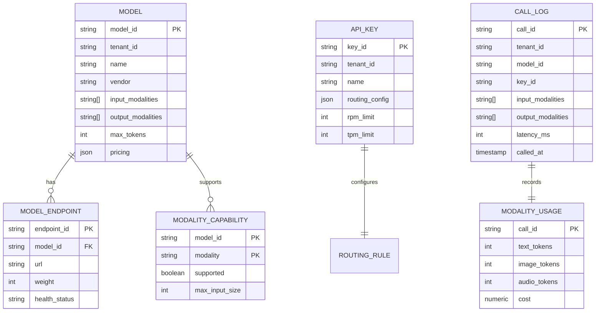
```mermaid
erDiagram
    MODEL ||--o{ MODEL_ENDPOINT : has
    MODEL ||--o{ MODALITY_CAPABILITY : supports
    API_KEY ||--|| ROUTING_RULE : configures
    CALL_LOG ||--|| MODALITY_USAGE : records

    MODEL {
        string model_id PK
        string tenant_id
        string name
        string vendor
        string[] input_modalities
        string[] output_modalities
        int max_tokens
        json pricing
    }
    MODEL_ENDPOINT {
        string endpoint_id PK
        string model_id FK
        string url
        int weight
        string health_status
    }
    MODALITY_CAPABILITY {
        string model_id PK
        string modality PK
        boolean supported
        int max_input_size
    }
    API_KEY {
        string key_id PK
        string tenant_id
        string name
        json routing_config
        int rpm_limit
        int tpm_limit
    }
    CALL_LOG {
        string call_id PK
        string tenant_id
        string model_id
        string key_id
        string[] input_modalities
        string[] output_modalities
        int latency_ms
        timestamp called_at
    }
    MODALITY_USAGE {
        string call_id PK
        int text_tokens
        int image_tokens
        int audio_tokens
        numeric cost
    }
```

### 4.11 多租户隔离

| 隔离维度 | 机制 | 说明 |
| --- | --- | --- |
| 模型隔离 | 租户模型注册表 | 租户可注册自有部署模型，仅本租户可见 |
| API Key 隔离 | tenant_id 绑定 | Key 绑定租户，调用注入 tenant 头 |
| 路由隔离 | 租户路由配置覆盖 | 租户可自定义模态路由表 |
| 配额隔离 | rpm/tpm 按租户 Key 限流 | 超额返回 429 |
| 计量隔离 | 调用日志按 tenant_id 分片 | Loki 按 tenant 分片，账单按租户汇总 |
| 端点隔离 | 租户模型端点 NetworkPolicy | 自托管模型端点仅本租户 Namespace 可达 |

### 4.12 技术选型与版本

| 组件 | 版本 | 用途 |
| --- | --- | --- |
| Go | **1.22（V2.0 统一基线）** | 网关实现语言 |
| Gin / gRPC | latest | HTTP/SSE + 内部 gRPC |
| Qwen | Qwen-max / Qwen-VL | 文本 + 图像理解 |
| CogVLM | 17B | 图像理解（自托管） |
| Paraformer | large | 语音识别 |
| CosyVoice | latest | 语音合成 |
| SDXL | 1.0 | 图像生成 |

**多模态网关选用 Go 的理由**：
1. **V1.0 演进复用**：V2.0 多模态网关演进自 V1.0 llm-gateway（Go 实现），复用 V1.0 适配器框架、Token 计量、JWT 鉴权、限流等基础设施，避免重写。
2. **高并发低延迟**：Go goroutine + channel 模型适合多模态网关高并发 SSE 流式响应场景（每请求一 goroutine，轻量上下文切换），相比 Java/Python 内存占用更低、GC 停顿更短。
3. **gRPC 原生支持**：多模态网关与 vector-engine（Go）、Catalog（Go）等 V1.0 Go 组件通过 gRPC 高效通信，protobuf 跨语言兼容。
4. **镜像精简**：Go 静态编译 + multi-stage build 产出 ~20MB 镜像，适合 Knative 冷启场景（镜像拉取快）。

**Go 版本统一说明**：
- V2.0 多模态网关统一基线为 **Go 1.22**（V2.0 跨文件协调标准）。
- V1.0 llm-gateway README 标注 Go 1.23、go.mod 标注 Go 1.25.0，存在 V1.0 内部版本漂移。V2.0 建议 V1.0 llm-gateway 同步对齐到 Go 1.22 基线（属 V1.0 已知问题，不阻塞 V2.0 开发；V2.0 多模态网关演进时统一基线为 Go 1.22）。
- Go 1.22 相比 1.21 新增 range-over-func、loopvar 语义修正等特性，满足多模态网关需求；Go 1.23/1.25 新特性（如 iterator）非必需，统一为 1.22 避免构建矩阵混乱。

**自托管多模态模型 GPU 资源需求矩阵（B-09 修复）**：

§4.7.2 适配器矩阵"自托管"行覆盖 Qwen/CogVLM/SDXL/Whisper/CosyVoice 五个模型，按模态路由到不同自托管模型，各模型 GPU 资源需求与节点池规划如下：

表：自托管多模态模型 GPU 资源需求表（模型 × 显存 × QPS × 节点池规格）

| 模型 | 模态 | 参数规模 | 推理最小显存 | 推荐 GPU 型号 | 单卡 QPS | 节点池规格 | 备注 |
| --- | --- | --- | --- | --- | --- | --- | --- |
| Qwen-7B-Chat | 文本 | 7B | 16 GB | A10 24G / 昇腾 910B 32G | 20-30 req/s | 2 卡/节点 × N 节点 | 文本对话主力，可量化降显存 |
| CogVLM-17B | 图像理解 | 17B | 40 GB | A100 40G / 昇腾 910B 64G | 5-10 req/s | 1 卡/节点 × N 节点 | 图像理解，FP16 推理 |
| SDXL-1.0 | 图像生成 | 6.6B | 24 GB | A10 24G / A100 40G | 2-5 img/s | 1 卡/节点 × N 节点 | 图像生成，可量化到 12GB |
| Whisper-large | 语音识别(ASR) | 1.5B | 8 GB | A10 24G / 昇腾 910B 32G | 5-10 audio/s | 1 卡/节点 × N 节点 | 语音识别，可 CPU 推理但 GPU 加速 |
| CosyVoice | 语音合成(TTS) | 7B | 16 GB | A10 24G / 昇腾 910B 32G | 10-20 audio/s | 1 卡/节点 × N 节点 | 语音合成，流式推理 |

**节点池规划原则**：
1. **按模态分池**：文本/图像理解/图像生成/ASR/TTS 各自独立 GPU 节点池，避免资源争抢，按模态路由到对应节点池。
2. **信创适配**：昇腾 910B 32G 适配 Qwen/Whisper/CosyVoice（显存足够），昇腾 910B 64G 适配 CogVLM-17B；SDXL 在昇腾上需验证 torch_npu 兼容性，不保证 V2.0-alpha 支持。
3. **弹性伸缩**：各节点池按 QPS 自动伸缩（KEDA + Knative），低峰缩到 0，高峰按预置比例扩容。
4. **多租户隔离**：节点池按租户配额隔离，避免单租户耗尽 GPU 资源；通过 `nvidia.com/gpu` 或 `npu.com/npu` 资源配额限制。

---

## 第5章 模型评测平台

### 5.1 定位与价值

提供大模型多维度评测能力，覆盖准确率/召回率/F1/延迟/吞吐/成本六维指标，支持批量评测/A-B测试/在线评测三种模式，评测结果写入 MLflow Tracking。对标 OpenCompass / HELM / FlagEval。

### 5.2 架构设计

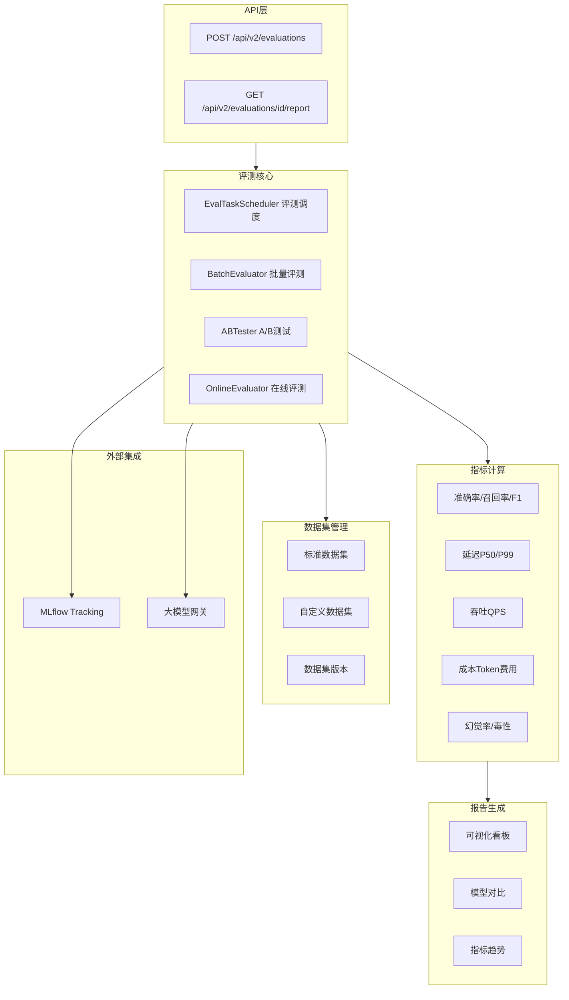
```mermaid
graph TB
    subgraph API[API层]
        A1[POST /api/v2/evaluations]
        A2[GET /api/v2/evaluations/id/report]
    end

    subgraph EVAL[评测核心]
        E1[EvalTaskScheduler 评测调度]
        E2[BatchEvaluator 批量评测]
        E3[ABTester A/B测试]
        E4[OnlineEvaluator 在线评测]
    end

    subgraph METRIC[指标计算]
        M1[准确率/召回率/F1]
        M2[延迟P50/P99]
        M3[吞吐QPS]
        M4[成本Token费用]
        M5[幻觉率/毒性]
    end

    subgraph DATA[数据集管理]
        D1[标准数据集]
        D2[自定义数据集]
        D3[数据集版本]
    end

    subgraph REP[报告生成]
        R1[可视化看板]
        R2[模型对比]
        R3[指标趋势]
    end

    subgraph EXT[外部集成]
        ML[MLflow Tracking]
        GW[大模型网关]
    end

    API --> EVAL
    EVAL --> METRIC
    EVAL --> DATA
    EVAL --> GW
    METRIC --> REP
    EVAL --> ML
```

### 5.3 评测维度

#### 5.3.1 六维评测指标

| 维度 | 指标 | 计算方式 | 说明 |
| --- | --- | --- | --- |
| 准确性 | 准确率 Accuracy | 正确数/总数 | 与标准答案比对 |
| 准确性 | 召回率 Recall | TP/(TP+FN) | 信息检索场景 |
| 准确性 | F1 Score | 2*P*R/(P+R) | 精确率与召回率调和均值 |
| 性能 | 延迟 P50/P99 | 百分位延迟 | 单次请求耗时分布 |
| 性能 | 吞吐 QPS | 请求数/秒 | 并发压力测试 |
| 成本 | Token 费用 | Σ(token_count × unit_price) | 按模型定价计算 |
| 安全 | 幻觉率 Hallucination | 幻觉数/总数 | 事实一致性校验 |
| 安全 | 毒性 Toxicity | 毒性检测分 | 内容安全评分 |

#### 5.3.2 评测指标计算

```python
代码示例：评测指标计算器（Python）
class EvalMetricsCalculator:
    """多维度评测指标计算"""
    def compute_accuracy(self, predictions: list, references: list) -> float:
        correct = sum(p == r for p, r in zip(predictions, references))
        return correct / len(predictions)

    def compute_f1(self, predictions: list, references: list) -> dict:
        precision = self._precision(predictions, references)
        recall = self._recall(predictions, references)
        f1 = 2 * precision * recall / (precision + recall) if (precision + recall) > 0 else 0
        return {"precision": precision, "recall": recall, "f1": f1}

    def compute_latency(self, latencies_ms: list) -> dict:
        sorted_l = sorted(latencies_ms)
        return {
            "p50": sorted_l[len(sorted_l) // 2],
            "p99": sorted_l[int(len(sorted_l) * 0.99)],
            "avg": sum(sorted_l) / len(sorted_l),
        }

    def compute_cost(self, token_usages: list, pricing: dict) -> float:
        return sum(u["prompt_tokens"] * pricing["input"] +
                   u["completion_tokens"] * pricing["output"]
                   for u in token_usages)
```

### 5.4 评测数据集

#### 5.4.1 数据集类型

| 类型 | 说明 | 示例 |
| --- | --- | --- |
| 标准数据集 | 平台预置通用评测集 | MMLU / C-Eval / CMMLU / GSM8K |
| 自定义数据集 | 租户上传业务评测集 | 业务 QA 对、领域专家标注 |
| 对抗数据集 | 边界/幻觉/毒性测试集 | 事实性陷阱、毒性提示 |

#### 5.4.2 数据集管理

| 操作 | 接口 | 说明 |
| --- | --- | --- |
| 上传数据集 | POST /api/v2/evaluations/datasets | 上传 JSONL/CSV 格式评测集 |
| 数据集版本 | POST /api/v2/evaluations/datasets/{id}/versions | 版本管理 |
| 数据集校验 | POST /api/v2/evaluations/datasets/{id}/validate | Schema 校验 |

### 5.5 评测任务

#### 5.5.1 三种评测模式

| 模式 | 说明 | 触发方式 | 适用场景 |
| --- | --- | --- | --- |
| 批量评测 Batch | 离线对数据集全量评测 | 手动/定时 | 模型选型、微调后评估 |
| A/B 测试 | 两模型同请求对比 | 实时流量分流 | 灰度发布决策 |
| 在线评测 Online | 生产环境持续采样评测 | 旁路采样 | 线上质量监控 |

#### 5.5.2 批量评测流程

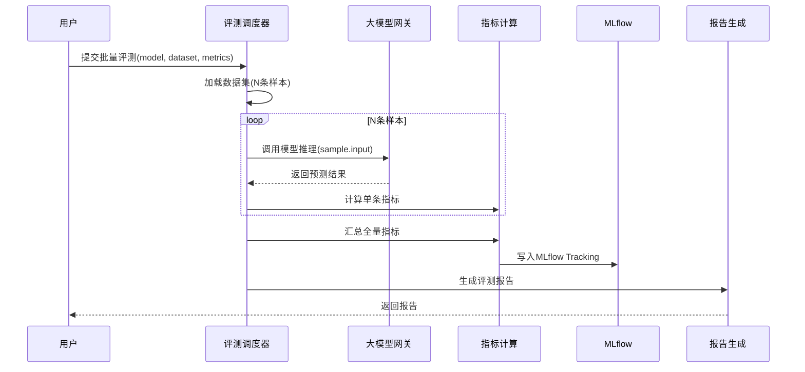
```mermaid
sequenceDiagram
    participant U as 用户
    participant S as 评测调度器
    participant GW as 大模型网关
    participant M as 指标计算
    participant ML as MLflow
    participant R as 报告生成

    U->>S: 提交批量评测(model, dataset, metrics)
    S->>S: 加载数据集(N条样本)
    loop N条样本
        S->>GW: 调用模型推理(sample.input)
        GW-->>S: 返回预测结果
        S->>M: 计算单条指标
    end
    S->>M: 汇总全量指标
    M->>ML: 写入MLflow Tracking
    S->>R: 生成评测报告
    R-->>U: 返回报告
```

### 5.6 评测报告

#### 5.6.1 报告内容

| 报告模块 | 内容 | 可视化 |
| --- | --- | --- |
| 指标总览 | 六维指标汇总 | 雷达图 |
| 模型对比 | 多模型指标对比 | 柱状图/表格 |
| 指标趋势 | 多次评测指标变化 | 折线图 |
| 错误分析 | 错误样本分类统计 | 饼图 + 样本列表 |
| 成本分析 | Token 消耗与费用 | 堆叠柱状图 |

#### 5.6.2 可视化看板

评测报告嵌入 Superset 看板（复用 V1.0 L4.4 BI），支持租户内分享与导出。

### 5.7 与MLflow集成

| 集成点 | 方式 | 说明 |
| --- | --- | --- |
| 评测结果写入 | MLflow Tracking API | 每次评测作为一个 Run，指标作为 metrics |
| 模型对比 | MLflow Model Registry | 从 Registry 拉取模型版本对比 |
| 微调后评测 | 微调完成触发评测 | 微调平台注册回调，自动触发评测 |
| 指标查询 | MLflow SearchRuns | 报告看板从 MLflow 查询历史指标 |

```python
代码示例：评测结果写入MLflow（Python）
import mlflow

class MLflowEvalRecorder:
    """评测结果写入MLflow Tracking"""
    def record(self, eval_id: str, model: str, metrics: dict, params: dict):
        with mlflow.start_run(run_name=f"eval-{eval_id}"):
            mlflow.log_params({"model": model, **params})
            mlflow.log_metrics(metrics)
            mlflow.set_tag("eval_type", "batch")
```

### 5.8 API接口定义

```yaml
配置：评测接口OpenAPI定义（YAML）
POST /api/v2/evaluations:
  summary: 创建评测任务
  requestBody:
    content:
      application/json:
        schema:
          type: object
          required: [model_id, dataset_id, metrics]
          properties:
            model_id:
              type: string
            dataset_id:
              type: string
            metrics:
              type: array
              items:
                type: string
                enum: [accuracy, recall, f1, latency_p50, latency_p99, qps, cost, hallucination]
            mode:
              type: string
              enum: [batch, ab_test, online]
            ab_test_config:
              type: object
              properties:
                control_model:
                  type: string
                traffic_split:
                  type: number
            schedule:
              type: string
              description: cron表达式(定时评测)

GET /api/v2/evaluations/{id}/report:
  summary: 获取评测报告
  responses:
    '200':
      content:
        application/json:
          schema:
            type: object
            properties:
              eval_id:
                type: string
              model_id:
                type: string
              metrics:
                type: object
              error_analysis:
                type: object
              cost_analysis:
                type: object
              dashboard_url:
                type: string
                description: Superset看板URL
```

#### 5.8.1 完整接口清单

| 接口 | 方法 | 说明 |
| --- | --- | --- |
| /api/v2/evaluations | POST | 创建评测任务 |
| /api/v2/evaluations/{id} | GET | 查询评测状态 |
| /api/v2/evaluations/{id}/report | GET | 获取评测报告 |
| /api/v2/evaluations/{id}/cancel | POST | 取消评测 |
| /api/v2/evaluations/datasets | POST/GET | 数据集管理 |
| /api/v2/evaluations/datasets/{id} | GET/DELETE | 数据集 CRUD |
| /api/v2/evaluations/compare | POST | 模型对比 |

### 5.9 数据模型设计

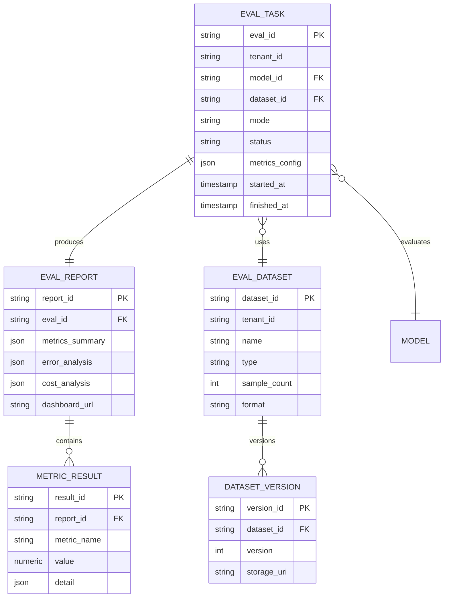
```mermaid
erDiagram
    EVAL_TASK ||--|| EVAL_REPORT : produces
    EVAL_TASK }o--|| EVAL_DATASET : uses
    EVAL_TASK }o--|| MODEL : evaluates
    EVAL_DATASET ||--o{ DATASET_VERSION : versions
    EVAL_REPORT ||--o{ METRIC_RESULT : contains

    EVAL_TASK {
        string eval_id PK
        string tenant_id
        string model_id FK
        string dataset_id FK
        string mode
        string status
        json metrics_config
        timestamp started_at
        timestamp finished_at
    }
    EVAL_DATASET {
        string dataset_id PK
        string tenant_id
        string name
        string type
        int sample_count
        string format
    }
    DATASET_VERSION {
        string version_id PK
        string dataset_id FK
        int version
        string storage_uri
    }
    EVAL_REPORT {
        string report_id PK
        string eval_id FK
        json metrics_summary
        json error_analysis
        json cost_analysis
        string dashboard_url
    }
    METRIC_RESULT {
        string result_id PK
        string report_id FK
        string metric_name
        numeric value
        json detail
    }
```

### 5.10 多租户隔离

| 隔离维度 | 机制 | 说明 |
| --- | --- | --- |
| 评测任务隔离 | tenant_id + 查询过滤 | 评测任务按租户隔离 |
| 数据集隔离 | tenant_id + 对象存储路径 | 自定义数据集按 `tenant/<tid>/eval-datasets/` 隔离 |
| 报告隔离 | 租户内可见 | 评测报告仅租户内可访问 |
| MLflow 隔离 | MLflow Experiment 按租户 | 每租户独立 Experiment，`tenant_<tid>_eval` |
| 看板隔离 | Superset 行级权限 | 看板按租户过滤 |

### 5.11 技术选型与版本

| 组件 | 版本 | 用途 |
| --- | --- | --- |
| OpenCompass | 0.2.x | 评测框架基座 |
| MLflow | 2.x (V1.0 复用) | 评测结果 Tracking |
| Superset | 4.x (V1.0 复用) | 评测报告看板 |
| Python | 3.11 | 评测引擎实现 |
| Celery | 5.x | 评测任务异步调度 |

---

## 第6章 模型微调平台

### 6.1 定位与价值

将 V1.0 LLMOps 基础微调能力扩展为完整微调平台，支持 LoRA/QLoRA/全参微调/P-Tuning 四种方法，提供数据准备→训练→评估→注册→部署全流程编排，GPU 资源池管理与分布式训练加速。对标 LLaMA-Factory / 阿里 PAI-DSW / Firefly。

### 6.2 架构设计

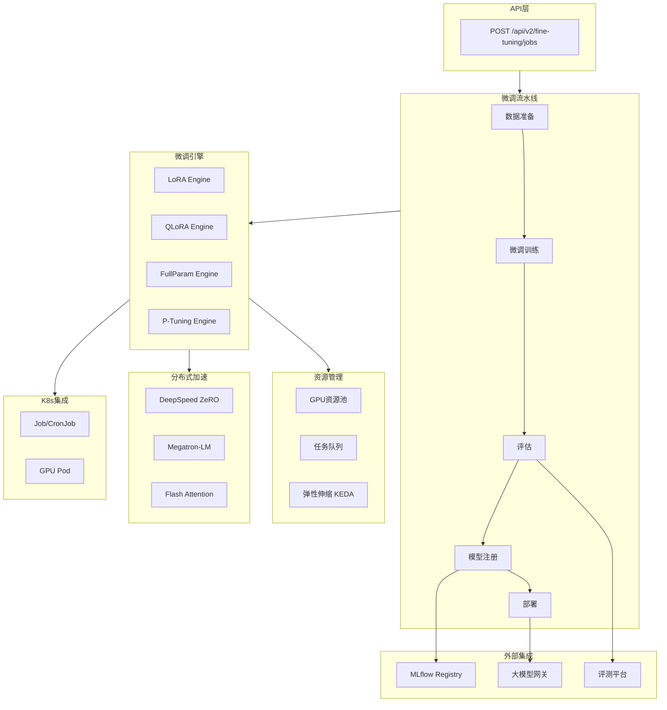
```mermaid
graph TB
    subgraph API[API层]
        A1[POST /api/v2/fine-tuning/jobs]
    end

    subgraph PIPE[微调流水线]
        P1[数据准备] --> P2[微调训练] --> P3[评估] --> P4[模型注册] --> P5[部署]
    end

    subgraph FT[微调引擎]
        F1[LoRA Engine]
        F2[QLoRA Engine]
        F3[FullParam Engine]
        F4[P-Tuning Engine]
    end

    subgraph RES[资源管理]
        R1[GPU资源池]
        R2[任务队列]
        R3[弹性伸缩 KEDA]
    end

    subgraph DIST[分布式加速]
        D1[DeepSpeed ZeRO]
        D2[Megatron-LM]
        D3[Flash Attention]
    end

    subgraph K8S[K8s集成]
        K1[Job/CronJob]
        K2[GPU Pod]
    end

    subgraph EXT[外部集成]
        ML[MLflow Registry]
        GW[大模型网关]
        EV[评测平台]
    end

    API --> PIPE
    PIPE --> FT
    FT --> RES
    FT --> DIST
    FT --> K8S
    P4 --> ML
    P5 --> GW
    P3 --> EV
```

### 6.3 微调方法

#### 6.3.1 四种微调方法对比

| 方法 | 全称 | 参数量 | GPU 显存 | 训练速度 | 效果 | 适用场景 |
| --- | --- | --- | --- | --- | --- | --- |
| LoRA | Low-Rank Adaptation | ~0.1% | 低 | 快 | 良好 | 通用首选，资源受限 |
| QLoRA | Quantized LoRA | ~0.1% | 极低 | 快 | 良好 | 显存极度受限 |
| 全参微调 | Full Fine-tuning | 100% | 高 | 慢 | 最佳 | 效果优先，资源充足 |
| P-Tuning | Prompt Tuning | ~0.01% | 极低 | 极快 | 一般 | 轻量级快速适配 |

#### 6.3.2 GPU 资源需求矩阵

V2.0 微调平台支持 7B/13B/70B 三种模型规模 × LoRA/QLoRA/全参/P-Tuning 四种方法，GPU 资源需求矩阵如下（基于 LLaMA-Factory 0.9.x + DeepSpeed 0.14.x 实测，10 万条训练数据 3 epoch）：

表：GPU 资源需求矩阵表（模型规模 × 方法 × 显存 × 时长 × GPU 型号）

| 模型规模 | 方法 | 最小显存 | 推荐 GPU 型号 | GPU 卡数 | 训练时长（10万条×3epoch） | 备注 |
| --- | --- | --- | --- | --- | --- | --- |
| 7B | LoRA | 16-24 GB | A100 40G / 昇腾 910B 32G | 1 | 2-4 小时 | 单卡可跑，首选方案 |
| 7B | QLoRA | 8-12 GB | A10 24G / 昇腾 910B 32G | 1 | 3-5 小时 | 量化降显存，速度略降 |
| 7B | 全参 | 80-120 GB | A100 80G × 2 | 2 | 8-12 小时 | DeepSpeed ZeRO-2 |
| 7B | P-Tuning | 8-12 GB | A10 24G | 1 | 1-2 小时 | 最轻量，效果一般 |
| 13B | LoRA | 32-48 GB | A100 80G / A100 40G × 2 | 1-2 | 4-8 小时 | 单卡 80G 或 2 卡 40G |
| 13B | QLoRA | 16-24 GB | A100 40G / 昇腾 910B 32G | 1 | 6-10 小时 | 量化降显存 |
| 13B | 全参 | 160-240 GB | A100 80G × 4 | 4 | 24-48 小时 | DeepSpeed ZeRO-3 |
| 13B | P-Tuning | 16-24 GB | A100 40G | 1 | 2-4 小时 | 轻量适配 |
| 70B | LoRA | 160-200 GB | A100 80G × 2-3 | 2-3 | 24-48 小时 | DeepSpeed ZeRO-3 + LoRA |
| 70B | QLoRA | 80-120 GB | A100 80G × 1-2 | 1-2 | 36-72 小时 | 量化 + LoRA |
| 70B | 全参 | 640-1280 GB | A100 80G × 8-16（多节点） | 8-16 | 7-14 天 | Megatron-LM 张量并行 + 流水并行 |
| 70B | P-Tuning | 80-120 GB | A100 80G × 1-2 | 1-2 | 12-24 小时 | 轻量适配 |

#### 6.3.3 信创国产 GPU 可行性

V2.0 信创环境以**昇腾 910B（32G）**为主流型号，寒武纪思元 290、海光 DCU 为备选。国产 GPU 与 CUDA 生态兼容性差异大，需通过对应适配层运行 LLaMA-Factory/DeepSpeed。

表：信创国产 GPU 可行性矩阵表

| GPU 型号 | 显存 | 适配生态 | LLaMA-Factory 适配 | DeepSpeed 适配 | Flash Attention 适配 | V2.0 支持状态 |
| --- | --- | --- | --- | --- | --- | --- |
| 昇腾 910B | 32G | CANN + torch_npu | fork 适配（torch_npu 替换 torch.cuda） | 替换为 PyTorch FSDP（DeepSpeed 不原生支持 NPU） | CANN 内置 fused attention 替代 | ✅ 主推（信创首选） |
| 昇腾 910B | 64G | CANN + torch_npu | fork 适配 | 替换为 FSDP | CANN 内置 | ✅ 大模型场景 |
| 寒武纪思元 290 | 32G | CNToolkit + torch_mlu | fork 适配（torch_mlu） | 不支持，需替换 FSDP | CNToolkit 内置 | ⚠️ 备选（适配工作量较大） |
| 海光 DCU | 32G | ROCm + torch_rocm | ROCm 版 LLaMA-Factory | ROCm 版 DeepSpeed 0.14+ | ROCm 版 Flash Attention 2.x | ⚠️ 备选（ROCm 生态较成熟） |
| 海光 DCU | 64G | ROCm + torch_rocm | ROCm 版 | ROCm 版 | ROCm 版 | ⚠️ 备选 |

**昇腾 910B 适配路径**（信创主推）：
- 基础环境：CANN 7.0+ + torch_npu 2.1+ + Python 3.9+
- LLaMA-Factory：使用 V2.0 维护的 fork 分支（`LLaMA-Factory-npu`），将 `torch.cuda` 调用替换为 `torch.npu`
- DeepSpeed：不原生支持 NPU，V2.0 替换为 PyTorch FSDP（`torch.distributed.fsdp.FullyShardedDataParallel`），功能等价 ZeRO-3
- Flash Attention：使用 CANN 内置 fused attention 算子替代
- 验证范围：7B/13B LoRA + QLoRA 已验证；70B 全参需多节点昇腾集群，V2.0-rc 验证

#### 6.3.4 LoRA微调配置

```yaml
配置：LoRA微调任务配置（YAML）
fine_tuning:
  method: "lora"
  base_model: "qwen-7b"
  dataset:
    train: "tenant/acme/ft-datasets/train.jsonl"
    eval: "tenant/acme/ft-datasets/eval.jsonl"
  lora_config:
    r: 16
    alpha: 32
    dropout: 0.05
    target_modules: ["q_proj", "v_proj"]
  training:
    epochs: 3
    learning_rate: 0.0002
    batch_size: 4
    gradient_accumulation: 4
    warmup_steps: 100
  gpu:
    count: 2
    type: "A100"
  distributed:
    strategy: "deepspeed_zero2"
```

### 6.4 任务编排

#### 6.4.1 五阶段流水线

| 阶段 | 输入 | 输出 | 说明 |
| --- | --- | --- | --- |
| 1. 数据准备 | 原始数据 | 训练集/验证集 | tokenization/packing/chat template 渲染 |
| 2. 微调训练 | 训练集+基座模型 | 微调模型权重 | LoRA/QLoRA/全参/P-Tuning |
| 3. 评估 | 微调模型+验证集 | 评测指标 | 调用评测平台 |
| 4. 模型注册 | 微调模型+指标 | MLflow 模型版本 | 写入 MLflow Registry |
| 5. 部署 | 注册模型 | 推理端点 | 部署到大模型网关 |

#### 6.4.2 流水线编排

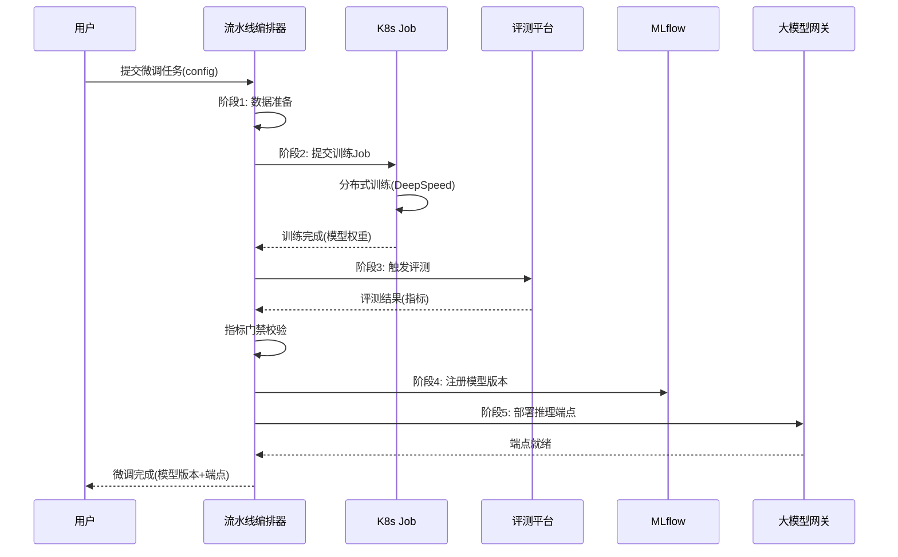
```mermaid
sequenceDiagram
    participant U as 用户
    participant PL as 流水线编排器
    participant K8s as K8s Job
    participant EV as 评测平台
    participant ML as MLflow
    participant GW as 大模型网关

    U->>PL: 提交微调任务(config)
    PL->>PL: 阶段1: 数据准备
    PL->>K8s: 阶段2: 提交训练Job
    K8s->>K8s: 分布式训练(DeepSpeed)
    K8s-->>PL: 训练完成(模型权重)
    PL->>EV: 阶段3: 触发评测
    EV-->>PL: 评测结果(指标)
    PL->>PL: 指标门禁校验
    PL->>ML: 阶段4: 注册模型版本
    PL->>GW: 阶段5: 部署推理端点
    GW-->>PL: 端点就绪
    PL-->>U: 微调完成(模型版本+端点)
```

### 6.5 资源管理

#### 6.5.1 GPU资源池

| 资源管理 | 机制 | 说明 |
| --- | --- | --- |
| GPU 节点池 | K8s NodePool + GPU label | 专用 GPU 节点池，按型号分组：A100/V100/A800/A10/昇腾910B-32G/昇腾910B-64G/寒武纪290/海光DCU |
| 资源配额 | 租户 GPU 配额 | 每租户 GPU 时长/卡数上限，计入 ResourceQuota |
| 任务队列 | 优先级队列 | 微调任务按优先级排队，高优先级抢占 |
| 弹性伸缩 | KEDA + Cluster Autoscaler | GPU 节点按队列深度弹性扩缩 |

表：GPU 节点池型号与适配路径表

| GPU 型号 | 显存 | 适配生态 | LLaMA-Factory 适配路径 | DeepSpeed 适配路径 | Flash Attention 适配路径 | V2.0 支持状态 |
| --- | --- | --- | --- | --- | --- | --- |
| A100 40G/80G | 40G/80G | CUDA 原生 | 原生支持 | 原生支持 | 原生支持 | ✅ 通用首选 |
| V100 16G/32G | 16G/32G | CUDA 原生 | 原生支持 | 原生支持 | 不支持（架构过旧） | ⚠️ 仅小模型 |
| A800 80G | 80G | CUDA 原生（国内版 A100） | 原生支持 | 原生支持 | 原生支持 | ✅ 国内非信创 |
| A10 24G | 24G | CUDA 原生 | 原生支持 | 原生支持 | 原生支持 | ✅ 小模型/Embedding |
| **昇腾 910B 32G** | 32G | **CANN + torch_npu** | fork 适配（`LLaMA-Factory-npu`，torch.cuda→torch.npu） | 替换为 PyTorch FSDP（DeepSpeed 不原生支持 NPU） | CANN 内置 fused attention 替代 | ✅ **信创主推** |
| 昇腾 910B 64G | 64G | CANN + torch_npu | fork 适配 | 替换为 FSDP | CANN 内置 | ✅ 信创大模型 |
| 寒武纪思元 290 | 32G | CNToolkit + torch_mlu | fork 适配（torch_mlu） | 不支持，需替换 FSDP | CNToolkit 内置 | ⚠️ 备选 |
| 海光 DCU 32G/64G | 32G/64G | ROCm + torch_rocm | ROCm 版 LLaMA-Factory | ROCm 版 DeepSpeed 0.14+ | ROCm 版 Flash Attention 2.x | ⚠️ 备选 |

#### 6.5.2 任务排队与调度

```python
代码示例：GPU资源调度器（Python）
class GPUResourceScheduler:
    """GPU资源池调度器，支持优先级队列与弹性伸缩"""
    def submit(self, job: FineTuningJob) -> str:
        """提交微调任务到优先级队列"""
        quota = self._check_quota(job.tenant_id, job.gpu_count)
        if not quota.ok:
            raise QuotaExceededError(quota.message)
        return self.queue.put(job, priority=job.priority)

    def schedule(self) -> list:
        """调度就绪任务到GPU节点"""
        runnable = []
        for job in self.queue.peek_by_priority():
            nodes = self.node_pool.find_available(job.gpu_type, job.gpu_count)
            if nodes:
                self.queue.pop(job.id)
                runnable.append((job, nodes))
        return runnable
```

### 6.6 分布式训练

| 加速方案 | 说明 | 适用规模 |
| --- | --- | --- |
| DeepSpeed ZeRO-2 | 参数/梯度分片，降低显存 | 7B-13B 模型 |
| DeepSpeed ZeRO-3 | 参数/梯度/优化器全分片 | 13B-70B 模型 |
| Megatron-LM | 张量并行 + 流水并行 | 70B+ 超大模型 |
| Flash Attention | 注意力算子加速 | 所有规模，显存与速度双赢 |
| FSDP | PyTorch 原生分布式 | 替代 DeepSpeed 的轻量方案 |

### 6.7 与K8s集成

微调任务作为 K8s Job 提交，训练 Pod 使用 GPU 资源。

```yaml
配置：微调任务K8s Job定义（YAML）
apiVersion: batch/v1
kind: Job
metadata:
  name: ft-job-{job_id}
  namespace: tenant-{tenant_id}
  annotations:
    sidecar.istio.io/inject: "false"    # GPU Pod 禁止 Istio Sidecar 注入，避免 Sidecar 启动先于 GPU init 导致资源未就绪
spec:
  backoffLimit: 3
  template:
    spec:
      restartPolicy: OnFailure
      containers:
        - name: trainer
          image: shuqing/fine-tuner:2.0
          resources:
            limits:
              nvidia.com/gpu: 2
              memory: 64Gi
            requests:
              nvidia.com/gpu: 2
              memory: 64Gi
          env:
            - name: DEEPSPEED_CONFIG
              value: "/config/ds_zero2.json"
          volumeMounts:
            - name: dataset
              mountPath: /data
            - name: model-output
              mountPath: /output
      volumes:
        - name: dataset
          persistentVolumeClaim:
            claimName: ft-dataset-{job_id}
        - name: model-output
          persistentVolumeClaim:
            claimName: ft-output-{job_id}
```

### 6.8 与LLMOps集成

| 集成点 | V1.0 LLMOps | V2.0 增强 |
| --- | --- | --- |
| 微调方法 | 基础微调 | LoRA/QLoRA/全参/P-Tuning 四方法 |
| 分布式训练 | 单机 | DeepSpeed/Megatron 分布式 |
| 资源管理 | 简单 GPU 调度 | GPU 资源池 + 优先级队列 + 弹性伸缩 |
| 流水线 | 手动分步 | 五阶段自动编排 |
| 模型注册 | MLflow Registry | 复用 V1.0，增加微调元数据 |
| 部署 | 手动部署 | 自动部署到大模型网关 |
| 评测 | 基础评估 | 调用 V2.0 评测平台全维度评测 |

### 6.9 API接口定义

```yaml
配置：微调接口OpenAPI定义（YAML）
POST /api/v2/fine-tuning/jobs:
  summary: 创建微调任务
  requestBody:
    content:
      application/json:
        schema:
          type: object
          required: [base_model, method, dataset]
          properties:
            base_model:
              type: string
            method:
              type: string
              enum: [lora, qlora, full_param, p_tuning]
            dataset:
              type: object
              properties:
                train_uri:
                  type: string
                eval_uri:
                  type: string
            method_config:
              type: object
              description: 方法特定配置(如LoRA的r/alpha)
            training_config:
              type: object
              properties:
                epochs:
                  type: integer
                learning_rate:
                  type: number
                batch_size:
                  type: integer
            gpu:
              type: object
              properties:
                count:
                  type: integer
                type:
                  type: string
                  enum: [A100, V100, A800, A10, ascend910b_32g, ascend910b_64g, cambricon290, hygon_dcu]
                  description: GPU 型号，信创环境用 ascend910b_32g/ascend910b_64g（昇腾 910B，CANN+torch_npu 适配）
            distributed:
              type: string
              enum: [none, deepspeed_zero2, deepspeed_zero3, megatron]
            pipeline:
              type: object
              properties:
                auto_eval:
                  type: boolean
                  default: true
                auto_register:
                  type: boolean
                  default: true
                auto_deploy:
                  type: boolean
                  default: false
  responses:
    '202':
      content:
        application/json:
          schema:
            properties:
              job_id:
                type: string
              status:
                type: string
```

#### 6.9.1 完整接口清单

| 接口 | 方法 | 说明 |
| --- | --- | --- |
| /api/v2/fine-tuning/jobs | POST | 创建微调任务 |
| /api/v2/fine-tuning/jobs/{id} | GET | 查询任务状态 |
| /api/v2/fine-tuning/jobs/{id}/cancel | POST | 取消任务 |
| /api/v2/fine-tuning/jobs/{id}/logs | GET | 训练日志 |
| /api/v2/fine-tuning/jobs/{id}/metrics | GET | 训练指标（loss/lr） |
| /api/v2/fine-tuning/templates | GET | 微调模板 |
| /api/v2/fine-tuning/gpu-pool | GET | GPU 资源池状态 |

### 6.10 数据模型设计

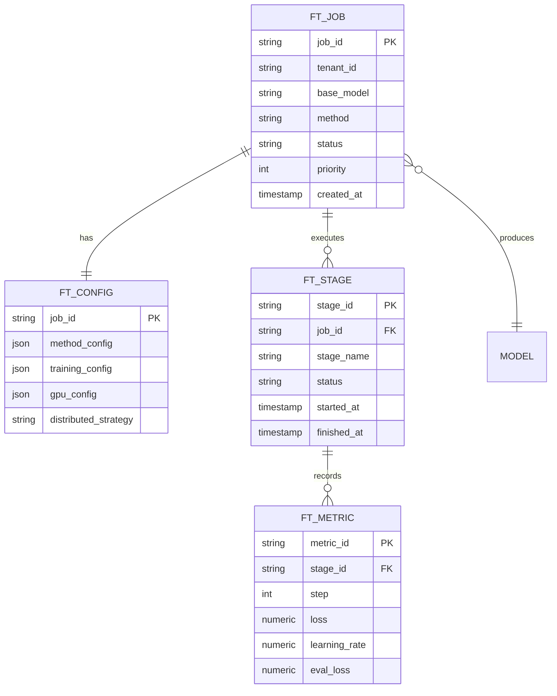
```mermaid
erDiagram
    FT_JOB ||--|| FT_CONFIG : has
    FT_JOB ||--o{ FT_STAGE : executes
    FT_JOB }o--|| MODEL : produces
    FT_STAGE ||--o{ FT_METRIC : records

    FT_JOB {
        string job_id PK
        string tenant_id
        string base_model
        string method
        string status
        int priority
        timestamp created_at
    }
    FT_CONFIG {
        string job_id PK
        json method_config
        json training_config
        json gpu_config
        string distributed_strategy
    }
    FT_STAGE {
        string stage_id PK
        string job_id FK
        string stage_name
        string status
        timestamp started_at
        timestamp finished_at
    }
    FT_METRIC {
        string metric_id PK
        string stage_id FK
        int step
        numeric loss
        numeric learning_rate
        numeric eval_loss
    }
```

### 6.11 多租户隔离

| 隔离维度 | 机制 | 说明 |
| --- | --- | --- |
| 任务隔离 | K8s Namespace + Job 隔离 | 微调 Job 运行在租户 Namespace |
| GPU 隔离 | 租户 GPU 配额 + 节点池租约 | GPU 卡按租户配额分配，节点可租约独占 |
| 数据隔离 | 训练数据 PVC 按租户 | 训练数据存储路径 `tenant/<tid>/ft-datasets/` |
| 模型隔离 | MLflow Registry 按租户 | 微调模型注册到租户 Experiment |
| 日志隔离 | 训练日志按租户 Loki 分片 | 训练日志按 tenant label 隔离 |

### 6.12 技术选型与版本

| 组件 | 版本 | 用途 |
| --- | --- | --- |
| LLaMA-Factory | 0.9.x | 微调框架基座 |
| DeepSpeed | 0.14.x | 分布式训练加速 |
| Megatron-LM | 23.x | 超大模型并行 |
| Flash Attention | 2.x | 注意力算子加速 |
| bitsandbytes | 0.43.x | QLoRA 量化 |
| MLflow | 2.x (V1.0 复用) | 模型注册 |
| KEDA | 2.x (V1.0 复用) | GPU 弹性伸缩 |

### 6.13 统一 Python 依赖锁定

V2.0 AI 模块涉及 LangGraph + LangChain + LLaMA-Factory + DeepSpeed + OpenCompass 等多个 Python 生态，存在 pydantic/langchain-core/torch 版本冲突风险。V2.0 锁定统一 `requirements-v2-ai.txt`，CI 中增加 `pip check` 依赖冲突检测步骤。

表：V2.0 AI 模块统一 Python 依赖版本对齐表

| 依赖包 | 锁定版本 | 使用模块 | 版本对齐说明 |
| --- | --- | --- | --- |
| langgraph | >=0.6,<0.7 | Agent 编排引擎 | 0.6+ 稳定 `interrupt` + `Command(resume=...)` API |
| langchain | >=0.3,<0.4 | Agent 编排引擎 | 与 langgraph 0.6+ 共用 langchain-core 0.3.x |
| langchain-core | >=0.3,<0.4 | LangGraph + LangChain 共同依赖 | **关键对齐项**，langgraph 0.6+ 与 langchain 0.3.x 均要求 0.3.x |
| pydantic | >=2.5,<3.0 | 全模块 | LangChain 0.3.x 要求 pydantic 2.x |
| torch | >=2.1,<2.5 | 微调平台 + 评测平台 | LLaMA-Factory 0.9.x 要求 2.1+，信创昇腾用 torch_npu 2.1+ |
| transformers | >=4.40,<5.0 | 微调平台 + 评测平台 | LLaMA-Factory 0.9.x 要求 4.x |
| deepspeed | >=0.14,<0.15 | 微调平台分布式训练 | 信创昇腾环境替换为 PyTorch FSDP |
| bitsandbytes | >=0.43,<0.44 | QLoRA 量化 | 与 torch 2.1+ 兼容 |
| flash-attn | >=2.5,<3.0 | 注意力算子加速 | 信创昇腾用 CANN fused attention 替代 |
| mmengine | >=0.10,<0.11 | OpenCompass 评测 | 与 torch/transformers 兼容验证 |
| mmcv | >=2.1,<3.0 | OpenCompass 评测 | 与 mmengine 对齐 |
| opencompass | >=0.2,<0.3 | 模型评测平台 | — |

```text
配置：V2.0 AI 模块统一 Python 依赖锁定（requirements-v2-ai.txt）
# ============================================================================
# V2.0 AI 能力增强统一依赖锁定 - 数擎大数据平台
# CI 中执行 pip install -r requirements-v2-ai.txt && pip check 验证无冲突
# ============================================================================

# ---- Agent 编排引擎 ----
langgraph>=0.6,<0.7
langchain>=0.3,<0.4
langchain-core>=0.3,<0.4
pydantic>=2.5,<3.0

# ---- 微调平台 ----
torch>=2.1,<2.5
transformers>=4.40,<5.0
deepspeed>=0.14,<0.15
bitsandbytes>=0.43,<0.44
flash-attn>=2.5,<3.0

# ---- 评测平台 ----
opencompass>=0.2,<0.3
mmengine>=0.10,<0.11
mmcv>=2.1,<3.0

# ---- 信创昇腾适配（可选，信创 Profile 启用）----
# torch-npu>=2.1,<2.5  # 替代 torch，CANN 7.0+
# 替代 deepspeed：使用 torch.distributed.fsdp（内置）
# 替代 flash-attn：使用 CANN 内置 fused attention
```

**CI 依赖冲突检测**：
V2.0 CI 流水线增加 `pip check` 步骤，发现依赖冲突则失败：

```yaml
配置：CI 依赖冲突检测（YAML）
# .github/workflows/ai-deps-check.yml
ai-deps-check:
  steps:
    - name: Install dependencies
      run: pip install -r requirements-v2-ai.txt
    - name: Check dependency conflicts
      run: pip check  # 发现冲突则退出码非 0，CI 失败
```

---

## 第7章 AI数据分析助手

### 7.1 定位与价值

提供自然语言驱动的数据分析能力，包括 NL2SQL 转换、智能数据解读、智能图表推荐、多轮对话式分析，深度集成前端控制台与 SQL 网关。对标 Snowflake Cortex / Databricks Genie / Tableau Pulse。

### 7.2 架构设计

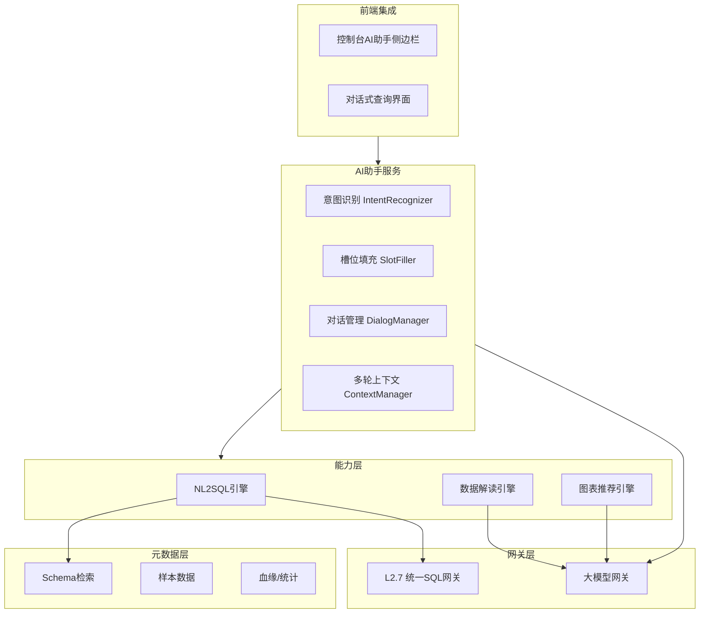
```mermaid
graph TB
    subgraph FE[前端集成]
        F1[控制台AI助手侧边栏]
        F2[对话式查询界面]
    end

    subgraph ASST[AI助手服务]
        A1[意图识别 IntentRecognizer]
        A2[槽位填充 SlotFiller]
        A3[对话管理 DialogManager]
        A4[多轮上下文 ContextManager]
    end

    subgraph CAP[能力层]
        C1[NL2SQL引擎]
        C2[数据解读引擎]
        C3[图表推荐引擎]
    end

    subgraph GW[网关层]
        G1[L2.7 统一SQL网关]
        G2[大模型网关]
    end

    subgraph META[元数据层]
        M1[Schema检索]
        M2[样本数据]
        M3[血缘/统计]
    end

    FE --> ASST
    ASST --> CAP
    C1 --> M1
    C1 --> G1
    C2 --> G2
    C3 --> G2
    ASST --> G2
```

### 7.3 NL2SQL

#### 7.3.1 NL2SQL转换流程

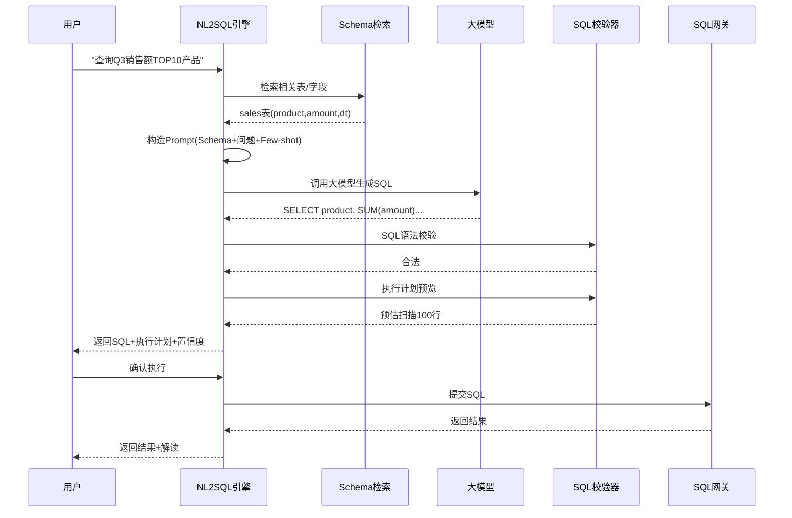
```mermaid
sequenceDiagram
    participant U as 用户
    participant N as NL2SQL引擎
    participant S as Schema检索
    participant L as 大模型
    participant V as SQL校验器
    participant GW as SQL网关

    U->>N: "查询Q3销售额TOP10产品"
    N->>S: 检索相关表/字段
    S-->>N: sales表(product,amount,dt)
    N->>N: 构造Prompt(Schema+问题+Few-shot)
    N->>L: 调用大模型生成SQL
    L-->>N: SELECT product, SUM(amount)...
    N->>V: SQL语法校验
    V-->>N: 合法
    N->>V: 执行计划预览
    V-->>N: 预估扫描100行
    N-->>U: 返回SQL+执行计划+置信度
    U->>N: 确认执行
    N->>GW: 提交SQL
    GW-->>N: 返回结果
    N-->>U: 返回结果+解读
```

#### 7.3.2 NL2SQL核心组件

| 组件 | 职责 | 实现 |
| --- | --- | --- |
| Schema 检索器 | 检索相关表/字段 | 向量检索 Schema Embedding + 关键词检索 |
| Prompt 构造器 | 组装 NL2SQL Prompt | Schema + 问题 + Few-shot 示例 + 约束 |
| SQL 生成器 | 调用 LLM 生成 SQL | 大模型网关调用 |
| SQL 校验器 | 语法+安全校验 | ANTLR4 语法树 + 黑名单（DDL/DROP） |
| 执行计划预览 | 预估执行代价 | EXPLAIN 解析扫描行数/代价 |

#### 7.3.3 SQL安全约束

| 约束 | 说明 |
| --- | --- |
| 只读强制 | 仅允许 SELECT，禁止 DML/DDL |
| 表权限校验 | 校验用户对涉及表的查询权限 |
| 限制条数 | 默认 LIMIT 1000，防止全表扫描 |
| 超时限制 | 查询超时 30s 自动 kill |
| 成本预估 | 扫描行数超阈值需人工确认 |

```python
代码示例：NL2SQL安全校验（Python）
class SQLSecurityValidator:
    """NL2SQL生成SQL的安全校验"""
    FORBIDDEN_KEYWORDS = {"DROP", "DELETE", "UPDATE", "INSERT", "ALTER", "TRUNCATE"}
    MAX_LIMIT = 1000

    def validate(self, sql: str, user_perms: set) -> ValidationResult:
        ast = self.parser.parse(sql)
        if not self._is_select_only(ast):
            return ValidationResult(ok=False, reason="仅允许SELECT")
        if self._has_forbidden(ast):
            return ValidationResult(ok=False, reason="包含禁止操作")
        if not self._check_table_perms(ast, user_perms):
            return ValidationResult(ok=False, reason="表权限不足")
        sql = self._ensure_limit(ast, self.MAX_LIMIT)
        return ValidationResult(ok=True, sanitized_sql=sql)
```

### 7.4 智能数据解读

#### 7.4.1 解读流程

查询结果 → 数据特征提取 → LLM 解读 → 关键洞察提取 → 自然语言输出

| 解读维度 | 说明 | 示例 |
| --- | --- | --- |
| 概要总结 | 数据整体描述 | "Q3共10个产品，总销售额1200万" |
| 趋势识别 | 时间趋势/排序趋势 | "销售额环比增长15%" |
| 异常检测 | 离群值/突变点 | "产品A销售额异常下降40%" |
| 对比分析 | 维度间对比 | "产品A销售额是产品B的2.3倍" |
| 关键洞察 | 业务洞察提炼 | "TOP3产品贡献60%销售额" |

### 7.5 智能图表推荐

#### 7.5.1 图表推荐逻辑

| 数据特征 | 推荐图表 | 推荐理由 |
| --- | --- | --- |
| 时间维度 + 度量 | 折线图 | 展示趋势变化 |
| 分类维度 + 度量 | 柱状图 | 展示对比 |
| 占比关系 | 饼图 | 展示构成 |
| 多维度 + 度量 | 热力图 | 展示交叉分布 |
| 地理维度 | 地图 | 展示空间分布 |
| 分布分析 | 箱线图 | 展示分布统计 |
| 关系分析 | 散点图 | 展示相关性 |

#### 7.5.2 ECharts配置生成

```python
代码示例：智能图表推荐与ECharts配置生成（Python）
class ChartRecommender:
    """基于数据特征推荐图表类型并生成ECharts配置"""
    def recommend(self, data: list, schema: dict) -> dict:
        features = self._extract_features(data, schema)
        chart_type = self._match_chart(features)
        echarts_config = self._build_echarts(chart_type, data, schema)
        return {
            "chart_type": chart_type,
            "echarts_config": echarts_config,
            "reason": self._explain(chart_type, features),
        }

    def _extract_features(self, data, schema) -> dict:
        return {
            "has_time": any(col.type == "datetime" for col in schema.columns),
            "has_geo": any(col.type == "geo" for col in schema.columns),
            "category_count": sum(1 for c in schema.columns if c.type == "category"),
            "measure_count": sum(1 for c in schema.columns if c.type == "measure"),
            "row_count": len(data),
        }
```

### 7.6 对话式分析

#### 7.6.1 多轮对话管理

| 对话能力 | 说明 |
| --- | --- |
| 意图识别 | 识别查询/追问/修改/对比/导出意图 |
| 槽位填充 | 提取时间/维度/度量/过滤条件槽位 |
| 上下文继承 | 追问继承前轮上下文（表/过滤条件） |
| 指代消解 | "它的趋势" → 解析指代对象 |
| 澄清追问 | 信息不足时主动追问澄清 |

#### 7.6.2 意图识别

```python
代码示例：对话意图识别与槽位填充（Python）
class IntentRecognizer:
    """多轮对话意图识别与槽位填充"""
    INTENTS = ["query", "follow_up", "refine", "compare", "export", "explain"]

    async def recognize(self, utterance: str, context: DialogContext) -> Intent:
        prompt = self._build_prompt(utterance, context)
        result = await self.llm.generate(prompt)
        return Intent(
            name=result["intent"],
            slots=result["slots"],
            confidence=result["confidence"],
        )

class SlotFiller:
    """槽位填充，提取查询参数"""
    SLOTS = ["time_range", "dimensions", "measures", "filters", "limit", "order"]

    async def fill(self, utterance: str, intent: Intent, context: DialogContext) -> dict:
        slots = await self.llm.extract(self._build_prompt(utterance, intent, context))
        return self._merge_with_context(slots, context)  # 继承前轮槽位
```

### 7.7 与前端集成

#### 7.7.1 控制台AI助手侧边栏

| 前端组件 | 功能 | 位置 |
| --- | --- | --- |
| AI 助手侧边栏 | 全局悬浮入口，任意页面可唤起 | 右侧抽屉 |
| 对话式查询界面 | 多轮对话 + SQL 预览 + 结果表格 + 图表 | 侧边栏内 |
| SQL 预览面板 | 展示生成的 SQL + 执行计划 + 确认执行 | 对话消息内嵌 |
| 结果解读卡片 | 自然语言解读 + 关键洞察 | 查询结果下方 |
| 图表推荐区 | 推荐图表 + ECharts 渲染 + 切换图表类型 | 结果下方 |

#### 7.7.2 前端交互流程

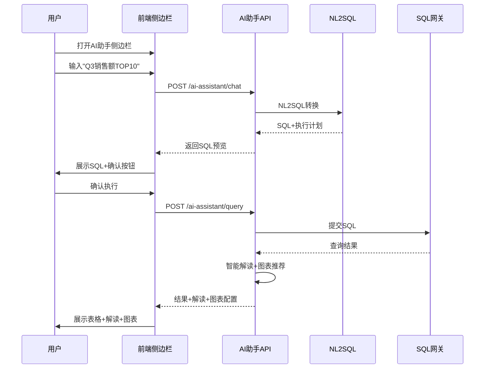
```mermaid
sequenceDiagram
    participant U as 用户
    participant FE as 前端侧边栏
    participant API as AI助手API
    participant N as NL2SQL
    participant GW as SQL网关

    U->>FE: 打开AI助手侧边栏
    U->>FE: 输入"Q3销售额TOP10"
    FE->>API: POST /ai-assistant/chat
    API->>N: NL2SQL转换
    N-->>API: SQL+执行计划
    API-->>FE: 返回SQL预览
    FE->>U: 展示SQL+确认按钮
    U->>FE: 确认执行
    FE->>API: POST /ai-assistant/query
    API->>GW: 提交SQL
    GW-->>API: 查询结果
    API->>API: 智能解读+图表推荐
    API-->>FE: 结果+解读+图表配置
    FE->>U: 展示表格+解读+图表
```

### 7.8 与SQL网关集成

| 集成点 | V1.0 SQL 网关 | V2.0 集成方式 |
| --- | --- | --- |
| SQL 执行 | L2.7 统一 SQL 网关 | NL2SQL 生成的 SQL 提交至 SQL 网关执行 |
| 引擎路由 | ANTLR4 + Calcite 联邦优化 | 复用，NL2SQL 不感知引擎选择 |
| 权限校验 | SQL 网关行级权限 | NL2SQL 生成的 SQL 经网关权限校验 |
| Schema 检索 | 资产目录元数据 | NL2SQL Schema 检索调用 L3.5 资产目录 |
| 结果归并 | 跨源结果归并 | 复用，多源查询结果统一归并 |

完整链路：`NL2SQL → SQL 网关（ANTLR4 解析 → Calcite 优化 → 引擎路由）→ 引擎执行 → 结果归并 → 智能解读 → 图表推荐`

### 7.9 API接口定义

```yaml
配置：AI助手接口OpenAPI定义（YAML）
POST /api/v2/ai-assistant/query:
  summary: AI查询(NL2SQL+执行+解读)
  requestBody:
    content:
      application/json:
        schema:
          type: object
          required: [question]
          properties:
            question:
              type: string
              description: 自然语言问题
            data_source:
              type: string
              description: 数据源/Schema范围
            auto_execute:
              type: boolean
              default: false
              description: 是否自动执行(否则需确认)
            include_interpretation:
              type: boolean
              default: true
            include_chart:
              type: boolean
              default: true
  responses:
    '200':
      content:
        application/json:
          schema:
            type: object
            properties:
              sql:
                type: string
              execution_plan:
                type: object
              result:
                type: object
                properties:
                  columns:
                    type: array
                  rows:
                    type: array
              interpretation:
                type: string
                description: 自然语言解读
              insights:
                type: array
                items:
                  type: string
              chart_recommendation:
                type: object
                properties:
                  chart_type:
                    type: string
                  echarts_config:
                    type: object
                  reason:
                    type: string

POST /api/v2/ai-assistant/chat:
  summary: 多轮对话式分析
  requestBody:
    content:
      application/json:
        schema:
          type: object
          required: [session_id, message]
          properties:
            session_id:
              type: string
              description: 对话会话ID
            message:
              type: string
            context:
              type: object
              description: 前轮上下文(由服务端管理)
  responses:
    '200':
      content:
        application/json:
          schema:
            type: object
            properties:
              reply:
                type: string
              intent:
                type: string
              action:
                type: object
                description: 执行动作(查询/追问/澄清)
```

#### 7.9.1 完整接口清单

| 接口 | 方法 | 说明 |
| --- | --- | --- |
| /api/v2/ai-assistant/query | POST | AI 查询（NL2SQL+执行+解读） |
| /api/v2/ai-assistant/chat | POST | 多轮对话 |
| /api/v2/ai-assistant/sessions | POST | 创建会话 |
| /api/v2/ai-assistant/sessions/{id} | GET | 会话历史 |
| /api/v2/ai-assistant/nl2sql | POST | 仅 NL2SQL 转换（不执行） |
| /api/v2/ai-assistant/interpret | POST | 结果解读 |
| /api/v2/ai-assistant/chart-recommend | POST | 图表推荐 |

### 7.10 数据模型设计

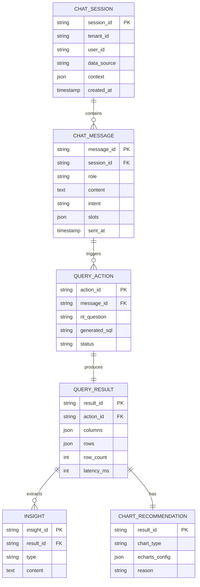
```mermaid
erDiagram
    CHAT_SESSION ||--o{ CHAT_MESSAGE : contains
    CHAT_MESSAGE ||--o{ QUERY_ACTION : triggers
    QUERY_ACTION ||--|| QUERY_RESULT : produces
    QUERY_RESULT ||--o{ INSIGHT : extracts
    QUERY_RESULT ||--|| CHART_RECOMMENDATION : has

    CHAT_SESSION {
        string session_id PK
        string tenant_id
        string user_id
        string data_source
        json context
        timestamp created_at
    }
    CHAT_MESSAGE {
        string message_id PK
        string session_id FK
        string role
        text content
        string intent
        json slots
        timestamp sent_at
    }
    QUERY_ACTION {
        string action_id PK
        string message_id FK
        string nl_question
        string generated_sql
        string status
    }
    QUERY_RESULT {
        string result_id PK
        string action_id FK
        json columns
        json rows
        int row_count
        int latency_ms
    }
    INSIGHT {
        string insight_id PK
        string result_id FK
        string type
        text content
    }
    CHART_RECOMMENDATION {
        string result_id PK
        string chart_type
        json echarts_config
        string reason
    }
```

### 7.11 多租户隔离

| 隔离维度 | 机制 | 说明 |
| --- | --- | --- |
| 会话隔离 | tenant_id + user_id | 对话会话按租户+用户隔离 |
| 数据源隔离 | 租户数据源权限 | NL2SQL 仅可访问租户有权限的数据源 |
| Schema 隔离 | 资产目录租户过滤 | Schema 检索按租户可见资产过滤 |
| SQL 权限 | SQL 网关行级权限 | 生成的 SQL 经网关权限校验 |
| 上下文隔离 | Redis key 租户前缀 | 对话上下文按 `tenant:<tid>:session:<sid>` 隔离 |

### 7.12 技术选型与版本

| 组件 | 版本 | 用途 |
| --- | --- | --- |
| Python | 3.11 | 助手服务实现 |
| LangChain | 0.3.x | 意图识别与对话管理 |
| ANTLR4 | 4.13 (V1.0 复用) | SQL 语法校验 |
| ECharts | 5.x (V1.0 复用) | 图表渲染 |
| Vue3 | 3.x (V1.0 复用) | 前端侧边栏 |
| Redis | 7.2 (V1.0 复用) | 对话上下文 |

---

## 第8章 跨模块一致性

### 8.1 封装一致性

| 维度 | 约定 |
| --- | --- |
| 服务封装 | 六个模块服务均为多租户 Pod，由 L0.11 封装层 Operator 托管 |
| API 版本 | 统一 `/api/v2/*` 前缀，V1.0 `/api/*/v1/*` 保留兼容 |
| 鉴权 | 统一经 X4 APISIX jwt-auth 插件校验，注入 tenant 头 |
| 计量 | 统一经 X4 APISIX prometheus 插件采集，接入 L5.2 计量链路 |
| 可观测 | 指标按 tenant label 隔离，日志按 tenant Loki 分片 |

### 8.2 能力复用矩阵

| V2.0 模块 | 复用 V1.0 组件 |
| --- | --- |
| Agent 编排引擎 | L4.5.6 网关 / L4.2 DolphinScheduler / L2.8 Kafka / Redis |
| 多模态 RAG | L4.5.3 Milvus / L4.5.4 知识工程 / L2.10 ES+NebulaGraph / L2.9 IoTDB |
| 多模态网关 | L4.5.6 大模型网关（演进） |
| 模型评测 | L4.5.5 MLflow / L4.4 Superset |
| 模型微调 | L4.5.5 LLMOps / MLflow / KEDA |
| AI 数据分析助手 | L2.7 SQL 网关 / L3.5 资产目录 / L4.4 Superset / ECharts |

### 8.3 跨模块调用链

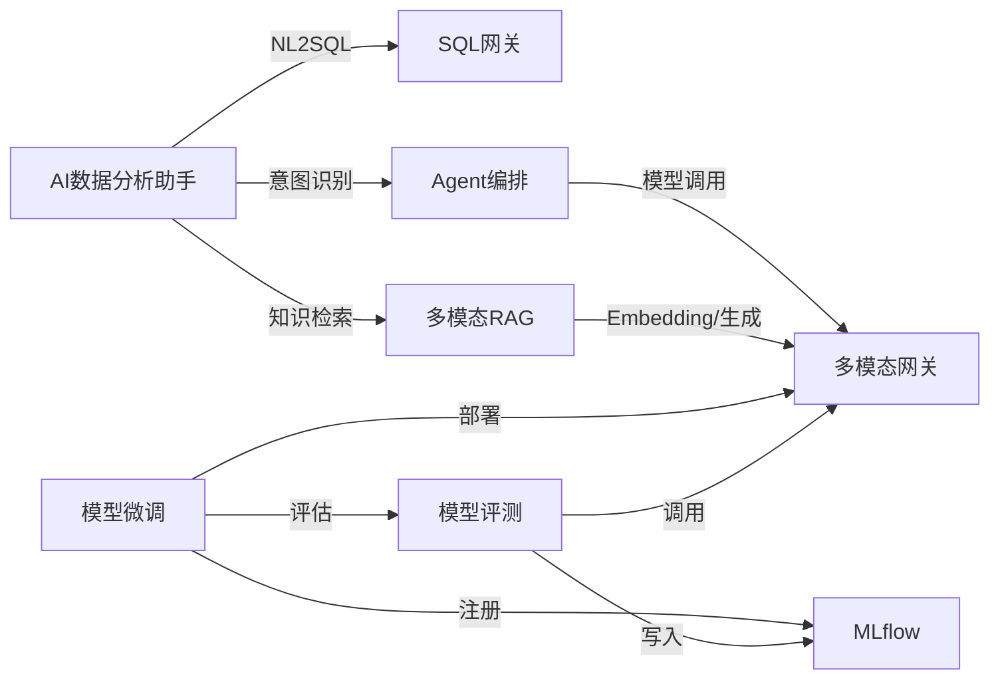
```mermaid
graph LR
    ASST[AI数据分析助手] -->|NL2SQL| SQL[SQL网关]
    ASST -->|意图识别| AGT[Agent编排]
    ASST -->|知识检索| RAG[多模态RAG]
    AGT -->|模型调用| GW[多模态网关]
    RAG -->|Embedding/生成| GW
    FT[模型微调] -->|评估| EVAL[模型评测]
    FT -->|注册| ML[MLflow]
    FT -->|部署| GW
    EVAL -->|写入| ML
    EVAL -->|调用| GW
```

---

## 第9章 演进路线

### 9.1 V2.0 分阶段演进

| 阶段 | 范围 | 优先级 |
| --- | --- | --- |
| V2.0-alpha | 多模态网关 + AI 数据分析助手（最高用户价值） | P0 |
| V2.0-beta | 多模态 RAG + Agent 编排引擎 | P1 |
| V2.0-rc | 模型评测平台 + 模型微调平台 | P2 |
| V2.0-ga | 全六模块 + 跨模块集成验证 | P3 |

### 9.2 与V1.0兼容性

| 兼容维度 | 策略 |
| --- | --- |
| API 兼容 | V1.0 实际路径 `/api/v1/*`（含 `/api/v1/chat/completions`、`/api/v1/embeddings`、`/api/v1/models`、`/api/kb/v1/*`、`/api/vector/v1/*`）保留，V2.0 新增 `/api/v2/*`（含 `/api/v2/multimodal/*`、`/api/v2/agents/*`、`/api/v2/rag/*` 等），APISIX 按 path 前缀路由 |
| 数据兼容 | V1.0 知识库/向量集合平滑升级，多模态向量写入新 collection |
| 模型兼容 | V1.0 注册模型继续可用，V2.0 扩展多模态能力标注 |
| 配置兼容 | V1.0 网关路由配置保留，V2.0 增加模态路由维度 |

---

## 第10章 风险与对策

### 10.1 技术风险

| 风险 | 影响 | 对策 |
| --- | --- | --- |
| Agent 工作流死循环 | 资源耗尽 | 循环次数上限 + 超时熔断 + 单次执行 Token 上限 |
| NL2SQL 生成危险 SQL | 数据泄露/破坏 | 只读强制 + 表权限校验 + 人工确认高风险查询 |
| 多模态检索精度不足 | RAG 召回质量差 | 四路混合检索 + Cross-Encoder 重排 + MMR 多样性 |
| GPU 资源争抢 | 微调/推理互饿 | GPU 节点池租约隔离 + 优先级队列 + 配额上限 |
| 微调过拟合 | 模型泛化下降 | 验证集早停 + 评测门禁 + 对比基座模型 |
| 多模态模型延迟高 | 用户体验差 | 流式响应 + 模型路由降级 + 缓存 |
| 对话上下文丢失 | 多轮分析断续 | Redis 持久化上下文 + 会话恢复 |

### 10.2 安全风险

| 风险 | 影响 | 对策 |
| --- | --- | --- |
| Agent 工具逃逸 | 沙箱突破 | gVisor 隔离 + NetworkPolicy + 最小权限 SA |
| Prompt 注入 | 恶意指令注入 | 输入消毒 + 系统 Prompt 隔离 + 输出过滤 |
| 多模态内容安全 | 有害图像/语音 | 内容安全检测 + 毒性过滤 + 审计日志 |
| 模型泄露 | 微调模型被窃取 | 模型加密存储 + 端点鉴权 + 访问审计 |
| 跨租户数据泄露 | 租户隔离突破 | tenant_id 强制过滤 + 索引隔离 + 网络隔离 |

### 10.3 成本风险

| 风险 | 影响 | 对策 |
| --- | --- | --- |
| LLM 调用成本失控 | 费用超支 | Token 配额 + 模型路由降级 + 缓存 + 按租户计费 |
| GPU 资源闲置 | 资源浪费 | 弹性伸缩 + 低优先级任务填充 + Spot 节点 |
| 向量索引膨胀 | 存储成本高 | 增量索引 + 冷热分层 + 索引压缩 |

---

## 第11章 与UI的对应

V2.0 控制台「智能数据层」将扩展六个 AI 能力页面，本文件为其后端契约依据：

| V2.0 页面 | 对应模块 | 核心功能 |
| --- | --- | --- |
| Agent 编排工作室 | Agent 编排引擎 | 可视化工作流编排 + Agent 模板 + 执行监控 |
| 多模态知识库 | 多模态 RAG | 多模态文档上传 + 混合检索配置 + 引用溯源 |
| 多模态模型广场 | 大模型多模态网关 | 模型能力矩阵 + 多模态对话 + API Key |
| 模型评测中心 | 模型评测平台 | 评测任务 + 报告看板 + 模型对比 |
| 模型微调工坊 | 模型微调平台 | 微调任务 + 训练监控 + 模型注册 |
| AI 数据分析助手 | AI 数据分析助手 | 侧边栏对话 + NL2SQL + 智能解读 + 图表推荐 |