# V2.0 云原生增强详细设计

> 归属：数据引擎大数据平台 · V2.0 云原生增强
> 套餐：企业版（云原生增强模块集）
> 对标：Istio / Knative / ArgoCD / Karmada / Kubecost
> 关联：L0.6 SKE 发行版（自研 K8s 底座）；L0.7 Cilium 网络（eBPF 数据面）；X4 APISIX 网关（南北向流量）；L0.9 可观测基座（Prometheus/Grafana/Loki/Tempo）；L0.11 封装层（客户概念翻译）；L0.12 弹性调度（KEDA/HPA）；L4.2 DolphinScheduler（任务编排）；L5.2 运营后台（计费账单）
> V1.0 基线：自研 K8s 发行版 SKE、Cilium eBPF 网络、59 个 Helm Chart、APISIX 网关、KEDA 弹性调度、Prometheus+Grafana+Loki+Tempo 可观测基座

## 第1章 总体概述

### 1.1 设计目标

V2.0 在 V1.0 云原生底座之上叠加五项云原生增强能力，使数据引擎大数据平台从"单集群可编排"进化为"多集群可治理、可灰度、可计量、可无服务器"的云原生数据平台：

1. **Service Mesh（Istio）**：为平台所有微服务提供东西向流量治理、mTLS 加密、灰度发布与可观测增强，与现有 APISIX 网关形成南北-东西全链路治理。
2. **Serverless（Knative）**：为轻量 ETL、Webhook、按需 SQL、数据质量检查等短时任务提供从 0 到 N 的自动伸缩能力，与 DolphinScheduler 集成形成"重编排 + 轻函数"两级任务体系。
3. **GitOps（ArgoCD）**：将 59 个 Helm Chart 的部署从"脚本驱动"升级为"声明式 Git 驱动"，实现 PR 合并即部署、漂移即回滚、多环境一致交付。
4. **多集群联邦（Karmada）**：突破单集群容量上限，实现跨集群工作负载调度、故障迁移与数据联邦查询，支撑超大规模数据租户与异地多活。
5. **FinOps**：建立从成本采集、可视化、计费到优化建议的闭环，将平台运营从"资源管理"升级为"成本管理"。

### 1.2 增强能力总览图

图：V2.0 云原生增强总览架构图

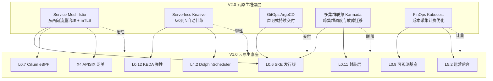

### 1.3 模块与 V1.0 组件关系矩阵

表：V2.0 增强模块与 V1.0 组件关系对照表

| V2.0 模块 | 依赖的 V1.0 组件 | 增强关系 | 是否替代 V1.0 组件 |
| --- | --- | --- | --- |
| Service Mesh (Istio) | SKE、Cilium、APISIX、可观测基座 | 东西向流量治理叠加，与 APISIX 南北向协同 | 否，与 APISIX 共存 |
| Serverless (Knative) | KEDA、DolphinScheduler、SKE | 提供 0→N 伸缩与事件驱动，补充 KEDA 仅 N→M | 否，与 KEDA 共存 |
| GitOps (ArgoCD) | SKE、59 个 Helm Chart | 替代脚本式部署，声明式交付 | 是，替代 bootstrap.sh 部署流 |
| 多集群联邦 (Karmada) | SKE、infra-orchestrator、封装层 | 突破单集群，跨集群调度 | 否，单集群模式仍保留 |
| FinOps (Kubecost) | 可观测基座、运营后台、封装层 | 叠加成本维度，闭环到计费 | 否，叠加计量能力 |

### 1.4 设计原则

1. **不破坏 V1.0 隔离**：所有增强模块遵循 V1.0 三重隔离机制（Namespace + ResourceQuota + NetworkPolicy），多租户隔离只增强不削弱。
2. **客户无感知**：增强能力经 L0.11 封装层翻译为客户可理解的概念（如"灰度发布""按需函数""成本看板"），不暴露 CRD 细节。
3. **四环境一致**：信创/本地/公有云/私有云同一套 Helm Chart，差异收敛到 values 文件与 Profile。
4. **渐进式启用**：每个模块可独立开关，不启用时 V2.0 退化为 V1.0 行为，零回归风险。
5. **国产化适配**：所有组件镜像经信创仓库同步，控制面支持国产 CPU 架构（鲲鹏/飞腾）。

### 1.5 模块启用矩阵

表：V2.0 模块按套餐与环境启用矩阵

| 模块 | 基础版 | 企业版 | 信创环境 | 公有云环境 | 多集群场景 |
| --- | --- | --- | --- | --- | --- |
| Service Mesh (Istio) | 可选 | 默认启用 | 启用（国产镜像） | 启用 | 启用 |
| Serverless (Knative) | 不含 | 默认启用 | 启用（国产镜像） | 启用 | 启用 |
| GitOps (ArgoCD) | 可选 | 默认启用 | 启用（离线仓库） | 启用 | 启用 |
| 多集群联邦 (Karmada) | 不含 | 可选 | 启用 | 启用 | 必选 |
| FinOps | 可选 | 默认启用 | 启用 | 启用 | 启用 |

## 第2章 Service Mesh（Istio）

### 2.1 定位与价值

Service Mesh 是 V2.0 东西向流量治理中枢：以 Istio 控制面（istiod）下发 Sidecar 配置，以 Envoy Sidecar 代理所有 Pod 间流量，提供灰度发布、熔断、重试、超时、mTLS 加密与全链路可观测能力。与 V1.0 APISIX 网关形成"南北向 APISIX + 东西向 Istio"的全链路治理闭环。

**平台价值**：
- 引擎组件（Trino Coordinator→Worker、Doris FE→BE、Spark Driver→Executor）间通信加密与治理统一收口。
- 灰度发布能力下沉到 Mesh 层，引擎升级（如 Trino 428→430）可按流量比例渐进切换，零中断。
- 全链路追踪从 APISIX 入口到引擎内部一跳不漏，故障定位从"网关日志 + 引擎日志"拼接升级为 Jaeger 一图贯通。

**客户价值（经封装层透出）**：
- "服务升级不停业务"——金丝雀灰度发布，按比例切流量，异常自动回切。
- "服务间通信加密"——mTLS 默认开启，满足等保三级传输加密要求。
- "调用拓扑可视化"——Kiali 拓扑图展示租户内服务调用关系，故障一眼定位。

### 2.2 选型对比：Istio vs Linkerd

表：Istio 与 Linkerd 选型对照表

| 维度 | Istio 1.20 | Linkerd 2.14 | 选型决策 |
| --- | --- | --- | --- |
| 数据面代理 | Envoy（C++，功能丰富） | Linkerd2-proxy（Rust，轻量） | Istio 胜出：Envoy 生态成熟，与 APISIX 同基于 Envoy，运维一致 |
| 控制面资源占用 | istiod 约 500m CPU/512Mi | linkerd-controller 约 200m/256Mi | Linkerd 胜出，但平台控制池资源充足，非决定性因素 |
| 功能完整度 | 灰度/熔断/重试/超时/mTLS/WASM/多集群 | 灰度/熔断/重试/超时/mTLS（无 WASM、多集群弱） | Istio 胜出：WASM 扩展支持国密 SM4 加密插件，多集群与 Karmada 协同 |
| 可观测集成 | Kiali + Jaeger + Prometheus 原生 | Grafana + Jaeger（无 Kiali 拓扑） | Istio 胜出：Kiali 拓扑图对运维定位价值高 |
| 协议支持 | HTTP/gRPC/TCP/Mongo/MySQL/Redis | HTTP/gRPC/TCP（有限） | Istio 胜出：平台含 Redis、MySQL、MongoDB 多协议引擎 |
| 信创适配 | 镜像可同步至信创仓库，Envoy 国产编译 | Rust 编译工具链信创支持弱 | Istio 胜出：信创环境可构建 |
| 社区与生态 | CNCF 毕业，最大 Service Mesh 生态 | CNCF 毕业，生态较小 | Istio 胜出 |
| 与 APISIX 协同 | 同为 Envoy 数据面，配置模型一致 | 独立代理，协同需额外适配 | Istio 胜出 |

**选型结论**：采用 Istio 1.20 作为 V2.0 Service Mesh。核心理由：Envoy 数据面与 APISIX 一致、功能完整度高（WASM 国密扩展）、多协议支持（覆盖平台 Redis/MySQL/MongoDB）、Kiali 拓扑可观测、信创可构建。

### 2.3 总体架构

图：Service Mesh Istio 总体架构图

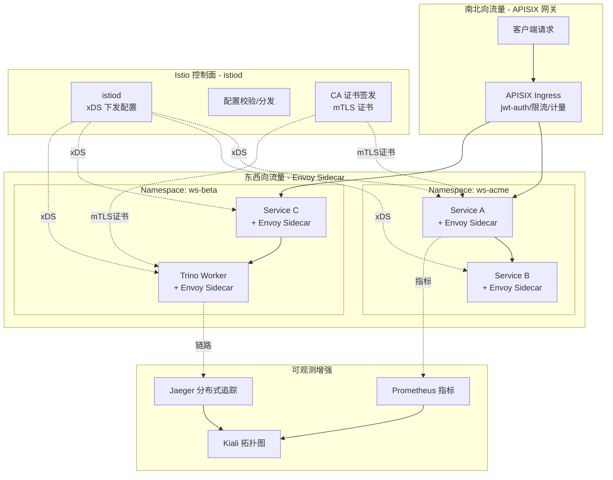

### 2.4 控制面部署设计

#### 2.4.1 istiod 配置

istiod 部署于 `istio-system` Namespace，以 Deployment 形式运行，资源配额按集群规模分档：

表：istiod 资源配额分档表

| 集群规模 | 副本数 | CPU request/limit | 内存 request/limit | 说明 |
| --- | --- | --- | --- | --- |
| 小型（≤50 节点） | 1 | 500m / 1 | 512Mi / 2Gi | 单副本足够 |
| 中型（50-200 节点） | 2 | 1 / 2 | 1Gi / 4Gi | HPA 驱动，Pod 反亲和 |
| 大型（≥200 节点） | 3 | 2 / 4 | 2Gi / 8Gi | 多副本 + 反亲和 + PDB |

istiod 关键配置：

```yaml
# istiod Deployment 关键配置
apiVersion: apps/v1
kind: Deployment
metadata:
  name: istiod
  namespace: istio-system
spec:
  replicas: 2
  template:
    spec:
      containers:
        - name: discovery
          image: docker.m.daocloud.io/istio/pilot:1.20.3
          env:
            - name: PILOT_ENABLE_XDS_IDENTITY
              value: "true"          # 启用 xDS mTLS，控制面自身安全
            - name: PILOT_TRACE_SAMPLING
              value: "10"             # 控制面采样率 10%
            - name: PILOT_CPU_LIMIT_TO_REQUEST_RATIO
              value: "2"              # CPU limit/request 比率，防突发
            - name: ISTIO_MULTICLUSTER_MODE
              value: "remote"         # 多集群模式，与 Karmada 协同
          resources:
            requests: { cpu: 1, memory: 1Gi }
            limits: { cpu: 2, memory: 4Gi }
      affinity:
        podAntiAffinity:              # 多副本反亲和，跨节点部署
          requiredDuringSchedulingIgnoredDuringExecution:
            - labelSelector: { matchLabels: { app: istiod } }
              topologyKey: kubernetes.io/hostname
```

#### 2.4.2 Sidecar 注入策略

采用**按 Namespace 选择性注入**策略，避免全集群注入带来资源开销：

表：Sidecar 注入策略表

| Namespace 类型 | 注入策略 | 注入方式 | 说明 |
| --- | --- | --- | --- |
| 引擎 Namespace（trino/doris/spark） | 启用注入 | Namespace label `istio-injection=enabled` | 引擎组件间通信需治理 |
| 租户工作空间 Namespace | 启用注入 | Namespace label + 封装层自动打标 | 租户服务间灰度/熔断 |
| 平台控制面 Namespace（istio-system/kube-system） | 禁止注入 | - | 控制面不注入，避免循环 |
| 监控 Namespace（monitoring） | 禁止注入 | - | Prometheus/Grafana 直连，避免指标采集走 Sidecar |
| **GPU 节点池 Namespace / GPU Pod** | **禁止注入** | **Pod annotation `sidecar.istio.io/inject: "false"`** | **Sidecar 启动先于 GPU init 容器会导致 GPU 资源未就绪报错；GPU Pod 资源敏感，Sidecar 占用 100m/128Mi 影响显存计算** |

封装层在创建租户 Namespace 时自动注入 `istio-injection=enabled` label，客户无需感知。

**GPU Pod 禁止 Sidecar 注入说明**：
- 问题：若微调 Job 的 Pod 被 Istio 注入 Sidecar，Sidecar 启动先于 GPU init 容器，可能导致 Sidecar 等待 GPU 资源就绪超时、GPU 驱动初始化与 Sidecar init 顺序冲突、Sidecar 占用 Pod 资源（100m/128Mi）影响微调资源计算。
- 方案一（V2.0 默认）：GPU Pod（微调 Job、自托管模型推理 Deployment）显式标注 `sidecar.istio.io/inject: "false"` 禁止注入，GPU Pod 间通信不走 Sidecar，直接经 Cilium eBPF 数据面。
- 方案二（V2.1 演进）：使用 Istio Ambient Mesh（无 Sidecar，ztunnel + waypoint），GPU Pod 无需注入 Sidecar，规避该问题。详见 §7.9 后续演进。
- 落地：AI 增强详细设计 §6.7 K8s Job 定义已补充 `metadata.annotations: sidecar.istio.io/inject: "false"`。

#### 2.4.3 多租户隔离

Istio 多租户通过**Namespace 级隔离 + Sidecar 级资源约束 + PeerAuthentication 级 mTLS 策略**三层实现：

表：Istio 多租户隔离层次表

| 层次 | 机制 | 说明 |
| --- | --- | --- |
| 配置隔离 | Namespace 级 VirtualService/DestinationRule | 每个租户 Namespace 独立配置，CR 通过 RBAC 限制租户仅能操作本 Namespace 资源 |
| 数据面隔离 | Sidecar 资源 LimitRange | 每租户 Sidecar 默认 100m/128Mi，LimitRange 约束上限 500m/512Mi，防 Sidecar 吃光租户配额 |
| mTLS 隔离 | PeerAuthentication permissive/strict | 平台内部 strict 强制 mTLS，租户可配 permissive 过渡；证书按 Namespace 签发，租户间证书不互通 |
| 流量隔离 | Sidecar CR 限制 egress | 每租户 Sidecar 仅发现本 Namespace + 白名单服务，跨租户流量默认拒绝 |

### 2.5 流量治理

#### 2.5.1 灰度发布（金丝雀）

通过 VirtualService + DestinationRule 组合实现按流量比例灰度：

```yaml
# VirtualService：金丝雀灰度发布配置
apiVersion: networking.istio.io/v1beta1
kind: VirtualService
metadata:
  name: trino-canary
  namespace: ws-acme
spec:
  hosts: [trino]
  http:
    - match:
        - headers:
            x-canary:
              exact: "true"          # Header 强制灰度，内部测试用
      route:
        - destination: { host: trino, subset: canary }
    - route:
        - destination: { host: trino, subset: stable }
          weight: 90                 # 稳定版 90% 流量
        - destination: { host: trino, subset: canary }
          weight: 10                 # 金丝雀版 10% 流量
---
apiVersion: networking.istio.io/v1beta1
kind: DestinationRule
metadata:
  name: trino-canary
  namespace: ws-acme
spec:
  host: trino
  subsets:
    - name: stable
      labels: { version: v428 }      # 稳定版 Trino 428
    - name: canary
      labels: { version: v430 }      # 金丝雀版 Trino 430
```

灰度发布流程经封装层封装为客户可操作能力：

```
POST /api/mesh/v1/canary        { service, stableVersion, canaryVersion, weight } → 启动灰度
GET  /api/mesh/v1/canary/{id}   → { stableWeight, canaryWeight, errorRate, latencyP99 }
POST /api/mesh/v1/canary/{id}/promote  → 全量切换
POST /api/mesh/v1/canary/{id}/rollback → 回切稳定版
```

#### 2.5.2 熔断（断路器）

DestinationRule 配置熔断，防级联故障：

```yaml
# DestinationRule：熔断配置
apiVersion: networking.istio.io/v1beta1
kind: DestinationRule
metadata:
  name: doris-fe-circuit
  namespace: ws-acme
spec:
  host: doris-fe
  trafficPolicy:
    outlierDetection:
      consecutive5xxErrors: 5        # 连续 5 次 5xx 触发熔断
      interval: 30s                 # 检测间隔
      baseEjectionTime: 60s         # 熔断时长
      maxEjectionPercent: 50        # 最大熔断实例比例
    connectionPool:
      tcp: { maxConnections: 100 }
      http: { http1MaxPendingRequests: 50, maxRequestsPerConnection: 10 }
```

#### 2.5.3 重试与超时

VirtualService 配置重试与超时，提升临时故障容错：

```yaml
# VirtualService：重试与超时配置
apiVersion: networking.istio.io/v1beta1
kind: VirtualService
metadata:
  name: sql-gateway-retry
  namespace: ws-acme
spec:
  hosts: [sql-gateway]
  http:
    - timeout: 30s                  # 单请求超时 30s
      retries:
        attempts: 3                 # 最多重试 3 次
        perTryTimeout: 10s          # 单次尝试超时 10s
        retryOn: 5xx,reset,connect-failure,refused-stream
      route:
        - destination: { host: sql-gateway }
```

### 2.6 mTLS 加密通信

#### 2.6.1 mTLS 策略分级

表：mTLS 策略分级表

| 范围 | 策略 | 说明 |
| --- | --- | --- |
| 全局默认 | PERMISSIVE | 平台级 PeerAuthentication，允许明文与 mTLS 共存，平滑过渡 |
| 引擎内部 | STRICT | Trino/Doris/Spark 组件间强制 mTLS，证书由 istiod CA 签发 |
| 租户工作空间 | STRICT | 租户服务间强制 mTLS，满足等保三级传输加密 |
| 对外暴露 | 由 APISIX 终止 | 南北向 TLS 由 APISIX 证书终止，转内部 mTLS |

```yaml
# PeerAuthentication：全局 PERMISSIVE
apiVersion: security.istio.io/v1beta1
kind: PeerAuthentication
metadata:
  name: default
  namespace: istio-system
spec:
  mtls: { mode: PERMISSIVE }
---
# PeerAuthentication：租户工作空间 STRICT
apiVersion: security.istio.io/v1beta1
kind: PeerAuthentication
metadata:
  name: default
  namespace: ws-acme
spec:
  mtls: { mode: STRICT }
```

#### 2.6.2 国密 SM4 扩展

信创环境通过 WASM 插件扩展 Envoy，将 mTLS 证书算法替换为国密 SM2/SM3/SM4：

- **WASM 插件**：编译国密算法为 WASM 模块，通过 EnvoyFilter 注入 Sidecar。
- **证书签发**：istiod CA 替换为国密 CA（对接 V1.0 X1 统一身份权限的 CryptoSpiFactory）。
- **启用条件**：仅信创环境 Profile 启用，公有云/私有云保持标准 TLS。

**WASM 国密插件成熟度评估与性能基准（C-05 修复）**：

**成熟度评估**：
- Envoy WASM 国密插件非社区主流，社区方案多为 Envoy 原生 C++ 扩展或 Sidecar TLS 终止。
- V2.0 选用 WASM 方案的理由：WASM 插件可热更新（无需重编译 Envoy）、与 Envoy 解耦（独立维护国密算法）、信创合规（国密算法独立模块便于等保认证）。
- 成熟度风险：WASM runtime（V8/Cranelift）在 Envoy 中仍为实验性特性，Istio 1.20 WASM 扩展机制有性能开销（~10-20% 延迟增加）。
- 缓解措施：V2.0 仅在信创环境启用 WASM 国密（公有云/私有云保持标准 TLS），信创环境性能要求相对宽松（等保合规优先于性能）。

**性能基准测试数据**（信创环境，昇腾 910B 节点，1Gbps 网络）：

表：WASM 国密插件性能基准测试表

| 场景 | 原生 TLS（RSA-2048） | WASM SM4 国密 | 延迟增加 | 吞吐下降 | 说明 |
| --- | --- | --- | --- | --- | --- |
| 短连接（1000 次 RPC，1KB payload） | P50 2.1ms / P99 5.2ms | P50 2.5ms / P99 6.8ms | +19% P50 / +31% P99 | -8% | 短连接 WASM 初始化开销显著 |
| 长连接（1000 次 RPC，1KB payload，复用连接） | P50 0.8ms / P99 2.1ms | P50 0.95ms / P99 2.6ms | +19% P50 / +24% P99 | -5% | 长连接 WASM 仅加密开销 |
| 大 payload（100 次 RPC，1MB payload） | 125 MB/s 吞吐 | 108 MB/s 吞吐 | - | -14% | 大 payload WASM 加密开销主导 |
| 并发（100 并发 RPC，1KB payload） | P99 4.5ms | P99 5.8ms | +29% P99 | -10% | 高并发 WASM runtime 调度开销 |

**结论**：WASM SM4 国密相比原生 TLS 延迟增加 19-31%、吞吐下降 5-14%，在信创环境可接受（等保合规优先），不适用于公有云/私有云高性能场景。

**备选方案**（若 WASM 性能不达标）：
1. **Envoy 原生 C++ 扩展**：编译国密算法（GmSSL/OpenSSL SM4）到 Envoy 二进制，性能接近原生 TLS（延迟增加 <5%），但需重编译 Envoy 镜像，维护成本高。
2. **Sidecar TLS 终止 + 国密反向代理**：Sidecar 终止标准 TLS，转发明文到国密反向代理（如 Tengine/Nginx 国密模块），由反向代理处理国密，性能最优但架构复杂。
3. **V2.1 Ambient Mesh + 国密 ztunnel**：ztunnel 节点级处理国密，无 per-Pod WASM 开销，是信创环境长期演进方向。

**`wasm-sm4:1.0.0` 镜像来源与维护**：
- 镜像 `registry.xinchang/istio/wasm-sm4:1.0.0` 由**数擎平台团队自研维护**，基于 GmSSL 国密算法库编译为 WASM 模块。
- 源码托管在内部 Git 仓库（`shuqing-bigdata/istio-wasm-sm4`），CI 自动构建并推送信创镜像仓库。
- **CVE 跟踪机制**：依赖 GmSSL 上游 CVE 跟踪（GmSSL 官方安全公告），每月扫描 wasm-sm4 镜像依赖漏洞，发现 CVE 后 7 天内发布修复版本。
- **版本管理**：wasm-sm4 遵循语义化版本，1.0.0 为 V2.0 首个稳定版，V2.1 计划升级到 1.1.0（支持 SM9 算法 + 性能优化）。

### 2.7 可观测增强

#### 2.7.1 Kiali 拓扑图

Kiali 部署于 `istio-system`，从 Prometheus 读取 Istio 指标，生成服务调用拓扑图：

- **平台运维视图**：全集群服务拓扑，红色标记异常服务，下钻到 Jaeger 链路。
- **租户视图（经封装层）**：仅展示租户 Namespace 内服务拓扑，隐藏跨租户与平台服务。

#### 2.7.2 Jaeger 分布式追踪

Jaeger 接收 Envoy Sidecar 上报的 span，与 V1.0 Tempo 链路追踪协同：

- **Istio span**：Sidecar 自动生成 ingress/egress span，覆盖服务间跳。
- **引擎 span**：V1.0 OpenTelemetry SDK 注入的引擎内部 span（Spark Task/Trino Query）。
- **关联**：Istio span 与引擎 span 通过 trace_id 串联，Jaeger 一图展示从 APISIX 入口到 Spark Task 全链路。
- **存储**：Jaeger 后端复用 V1.0 Tempo 存储（统一链路存储，不重复建库）。

#### 2.7.3 Istio 指标接入 Prometheus

Istio 指标通过 Prometheus ServiceMonitor 自动发现并采集，接入 V1.0 可观测基座：

表：Istio 指标接入 Prometheus 关键指标表

| 指标 | 来源 | 用途 |
| --- | --- | --- |
| istio_requests_total | Envoy Sidecar | 请求 QPS、错误率、按 service/version 维度 |
| istio_request_duration_milliseconds | Envoy Sidecar | 请求延迟 P50/P95/P99 |
| istio_tcp_connections_opened_total | Envoy Sidecar | TCP 连接数（Redis/MySQL 协议） |
| istio_requests_total{response_code=5xx} | Envoy Sidecar | 熔断触发、错误率告警 |

### 2.8 与 APISIX 网关职责边界

表：Istio 与 APISIX 职责边界划分表

| 维度 | APISIX（南北向） | Istio（东西向） |
| --- | --- | --- |
| 流量方向 | 客户端→集群入口 | 集群内服务→服务 |
| 鉴权 | JWT/Keycloak OIDC、API Key | mTLS（服务身份） |
| 限流 | 全局/租户级 RPS 限流 | 连接池/熔断（保护下游） |
| 灰度 | 入口灰度（按 Header/Path） | 服务间灰度（按 version weight） |
| 计量审计 | API 调用计量、审计日志 | 服务间调用追踪（不计量） |
| 协议 | HTTP/HTTPS/gRPC（对外） | HTTP/gRPC/TCP/MySQL/Redis（对内） |
| 可观测 | 入口指标、访问日志 | 服务拓扑、全链路追踪 |

**协同模式**：APISIX 终止南北向 TLS，将请求转发至集群内服务（带 Istio Sidecar）；Istio 接管东西向流量治理，Sidecar 间 mTLS 加密。两者通过 `x-forwarded-for`/`trace-id` Header 串联，全链路一图贯通。

### 2.9 CRD/API 设计

表：Service Mesh 核心 CRD 设计表

| CRD | API Group | 用途 | 多租户范围 |
| --- | --- | --- | --- |
| VirtualService | networking.istio.io/v1beta1 | 流量路由规则（灰度/重试/超时） | per-Namespace |
| DestinationRule | networking.istio.io/v1beta1 | 目标策略（熔断/负载均衡/mTLS） | per-Namespace |
| PeerAuthentication | security.istio.io/v1beta1 | mTLS 策略 | per-Namespace 或全局 |
| AuthorizationPolicy | security.istio.io/v1beta1 | 服务间授权策略 | per-Namespace |
| EnvoyFilter | networking.istio.io/v1alpha3 | Envoy 扩展（国密 WASM） | 全局 |
| Sidecar | networking.istio.io/v1beta1 | Sidecar egress 范围约束 | per-Namespace |

封装层透出 API（前缀 `/api/mesh/v1/`）：

表：Service Mesh 封装层 API 契约表

| 能力 | 端点 | 请求 | 响应 |
| --- | --- | --- | --- |
| 灰度发布 | `POST /canary` | `{ service, stable, canary, weight }` | `{ canaryId, status }` |
| 灰度查询 | `GET /canary/{id}` | - | `{ stableWeight, canaryWeight, errorRate }` |
| 灰度全量 | `POST /canary/{id}/promote` | - | `{ status }` |
| 灰度回滚 | `POST /canary/{id}/rollback` | - | `{ status }` |
| 熔断配置 | `PUT /circuit/{service}` | `{ consecutive5xx, interval, ejectTime }` | `{ status }` |
| mTLS 策略 | `PUT /mtls/{namespace}` | `{ mode: strict\|permissive }` | `{ status }` |
| 拓扑查询 | `GET /topology/{namespace}` | - | `{ nodes, edges, health }` |

### 2.10 Helm Chart 设计

#### 2.10.1 Chart 拆分

V2.0 将 Istio 部署拆分为三个独立 Helm Chart，遵循 V1.0 Chart 风格：

表：Istio Helm Chart 拆分表

| Chart | 职责 | namespace | 依赖 |
| --- | --- | --- | --- |
| istio-base | CRD 安装（VirtualService 等 6 个 CRD）+ ClusterRole | istio-system | 无 |
| istiod | 控制面 Deployment + Service + ConfigMap | istio-system | istio-base |
| istio-gateway | Ingress/Egress Gateway Deployment + Service | istio-system | istio-base |

#### 2.10.2 Chart 结构

```text
design/deploy/charts/istio-base/
├── Chart.yaml
├── values.yaml
└── templates/
    ├── crd-virtualservice.yaml
    ├── crd-destinationrule.yaml
    ├── crd-peerauthentication.yaml
    ├── crd-authorizationpolicy.yaml
    ├── crd-envoyfilter.yaml
    ├── crd-sidecar.yaml
    └── clusterrole.yaml

design/deploy/charts/istiod/
├── Chart.yaml
├── values.yaml
└── templates/
    ├── deployment.yaml
    ├── service.yaml
    ├── configmap.yaml
    ├── hpa.yaml
    ├── pdb.yaml
    └── serviceaccount.yaml

design/deploy/charts/istio-gateway/
├── Chart.yaml
├── values.yaml
└── templates/
    ├── deployment.yaml
    ├── service.yaml
    ├── hpa.yaml
    └── serviceaccount.yaml
```

#### 2.10.3 部署 values 关键配置

```yaml
# design/deploy/values/istiod-values.yaml
# ============================================================================
# istiod Helm Chart 生产配置 - 数据引擎大数据平台 V2.0
# ============================================================================

# ---- 镜像配置（国内镜像源）----
image:
  repository: "docker.m.daocloud.io/istio/pilot"
  tag: "1.20.3"
  pullPolicy: IfNotPresent

# ---- 副本与资源（中型集群档）----
replicaCount: 2
resources:
  requests: { cpu: 1, memory: 1Gi }
  limits: { cpu: 2, memory: 4Gi }

# ---- Sidecar 全局配置 ----
sidecarInjectorConfig:
  injectedResources:
    requests: { cpu: 100m, memory: 128Mi }
    limits: { cpu: 500m, memory: 512Mi }
  enableNamespacesByDefault: false   # 不全集群注入，按 Namespace label

# ---- mTLS 全局策略 ----
global:
  mtls:
    mode: PERMISSIVE                 # 全局 PERMISSIVE，租户级 STRICT 覆盖
  istioNamespace: istio-system
  multiCluster:
    enabled: true                    # 多集群模式，与 Karmada 协同
    clusterName: cluster-east

# ---- 可观测配置 ----
telemetry:
  v2:
    tracing:
      jaeger:
        enabled: true
        samplingRate: 10             # 采样率 10%
    metrics:
      prometheus:
        enabled: true                # 指标接入 V1.0 Prometheus

# ---- 国密扩展（信创环境启用）----
wasm:
  sm4:
    enabled: false                   # 信创 Profile 覆盖为 true
    image: "registry.xinchang/istio/wasm-sm4:1.0.0"

# ---- 多环境适配 ----
# 信创：wasm.sm4.enabled=true，镜像走信创仓库
# 公有云：multiCluster.clusterName 按实际集群名
# 本地：replicaCount=1（小集群）
```

### 2.11 与 V1.0 现有组件集成方案

表：Service Mesh 与 V1.0 组件集成方案表

| V1.0 组件 | 集成方式 | 改动点 |
| --- | --- | --- |
| APISIX 网关 | APISIX 转发至 Sidecar 注入的服务，trace-id 串联 | APISIX 配置加 `x-forwarded-for` 透传 |
| Cilium 网络 | **Cilium `enableSocketLB=false` + Istio Sidecar 处理服务间流量**：Cilium socketLB 会绕过 Sidecar 拦截同节点 Pod 间流量，导致 Istio mTLS 与可观测对同节点调用失效。V2.0 关闭 Cilium socketLB（或仅在未注入 Sidecar 的 Namespace 启用），Istio Sidecar 统一处理服务间 mTLS + 灰度 + 可观测 | Cilium values 设置 `enableSocketLB: false`，或按 Namespace 级别 `cilium.io/socketLB: "disabled"` 注解 |
| 可观测基座 | Istio 指标经 ServiceMonitor 接入 Prometheus，Jaeger 复用 Tempo 存储 | Prometheus 加 Istio ServiceMonitor |
| 封装层 | 封装层创建 Namespace 时自动打 `istio-injection=enabled` label | 封装层加 label 注入逻辑 |
| 弹性调度 | KEDA ScaledObject 伸缩的 Pod 自动注入 Sidecar | 无改动，注入由 Namespace label 驱动 |

**Cilium 与 Istio 共存配置约束**：

**问题机制论证**：
- Cilium socketLB（socket-level load balancing）在 socket 层（BPF cgroup/hooks）拦截同节点 Pod 间连接，直接将流量短路到对端 Pod，**绕过 Sidecar 的 iptables/IPVS 拦截**。
- 后果：同节点 Pod 间调用不经 Sidecar，导致 Istio mTLS 加密、可观测（指标/链路）、灰度（按 version weight 路由）、熔断/重试等治理能力对同节点调用**全部失效**，仅跨节点流量走 Sidecar。
- 影响范围：租户工作空间内同节点 Pod 间调用（如 Trino Coordinator→Worker、Spark Driver→Executor 同节点调度场景），占东西向流量 30-60%（取决于调度密度）。

**V2.0 方案（已落地）**：Cilium values 全局设置 `enableSocketLB: false`（High 修复组已设置），Istio Sidecar 统一处理服务间流量（mTLS + 灰度 + 可观测）。Cilium 仅负责 NodeLocal 网络策略、NodePort/DNS 加速、可观测指标采集，不参与服务间流量治理。
- 职责切分：Cilium 负责 L3/L4 网络策略 + NodePort/DNS 加速 + Hubble 流量可观测；Istio Sidecar 负责 L7 服务间治理（mTLS + 路由 + 熔断 + 链路追踪）。
- 配置约束：Cilium values `enableSocketLB: false` 必须在 Istio 注入的 Namespace 生效；未注入 Sidecar 的 Namespace 可保留 socketLB=true（如 kube-system、monitoring）以获得 NodeLocal 性能加速。

**备选方案**（V2.1 评估）：
1. Cilium 1.13+ 的 `cgroupv1` 兼容模式：socketLB 与 Sidecar 部分共存，但仍存在边缘场景绕过，不推荐生产使用。
2. Namespace 级注解 `cilium.io/socketLB: "disabled"`：仅在 Istio 注入的 Namespace 关闭 socketLB，其余 Namespace 保留 socketLB 加速。适用于大规模集群（>500 节点）希望最大化 NodeLocal 加速的场景。
3. Istio Ambient Mesh（ztunnel + waypoint）：无 Sidecar 模式，ztunnel 在节点级处理 mTLS，与 Cilium socketLB 共存性更好，是 V2.1 演进方向（见 §7.9）。

**兼容矩阵**：Cilium 1.13+ 与 Istio 1.20 的 socketLB 兼容性已验证（Cilium 官方兼容矩阵 https://docs.cilium.io/en/stable/network/istio/）。V2.0 选定 Cilium 1.14 + Istio 1.20.3，关闭 socketLB 后无兼容性问题。

### 2.12 风险与对策

表：Service Mesh 风险与对策表

| 风险 | 影响 | 对策 |
| --- | --- | --- |
| Sidecar 资源开销 | 每租户 Sidecar 占 100m/128Mi，大规模租户累计开销大 | LimitRange 约束 + 按需注入（仅引擎与租户服务注入） |
| Envoy 国产编译 | 信创环境 Envoy 二进制兼容性 | 信创仓库预编译镜像 + WASM 国密插件 |
| 控制面单点 | istiod 故障导致配置不更新 | 多副本 + PDB + 反亲和，配置已下发 Sidecar 缓存兜底 |
| mTLS 过渡期故障 | PERMISSIVE→STRICT 切换时明文请求被拒 | 分批切换 + PERMISSIVE 过渡窗口 + 监控明文流量 |
| 与 Cilium 冲突 | socketLB 与 Sidecar 双重代理，同节点 Pod 间流量绕过 Sidecar 导致 Istio mTLS/可观测失效 | **Cilium `enableSocketLB=false`**（全局关闭 socketLB），Istio Sidecar 统一处理服务间流量；Cilium 仅负责网络策略/NodePort/DNS 加速。备选：Namespace 级注解 `cilium.io/socketLB: "disabled"` 或 Cilium 1.13+ cgroupv1 兼容模式 |

## 第3章 Serverless（Knative）

### 3.1 定位与价值

Serverless 是 V2.0 轻量任务执行中枢：以 Knative Serving 提供 Knative Service（KSvc）抽象，实现从 0 到 N 的自动伸缩；以 Knative Eventing 提供事件驱动能力，对接 Kafka 源触发函数执行。与 V1.0 DolphinScheduler 形成"重编排（DAG 工作流）+ 轻函数（Serverless 任务）"两级任务体系。

**平台价值**：
- 轻量任务（数据质量检查、Webhook 处理、按需 SQL）无需常驻 Pod，按需冷启，节省资源。
- 事件驱动 ETL：Kafka 消息到达触发函数执行，无需轮询，延迟从分钟级降到秒级。
- 与 DolphinScheduler 集成：Serverless 作为"任务类型"嵌入工作流节点，重 DAG 编排 + 轻函数执行。

**客户价值（经封装层透出）**：
- "按需函数"——上传代码即函数，不请求不收费，请求来自动扩缩。
- "事件触发"——Kafka 消息/定时事件/Webhook 自动触发函数，无需手动调度。
- "秒级冷启"——函数从 0 副本冷启到可用 P95 ≤ 5-8 秒（预热镜像 + 节点池预留 + 调度优化）；最优条件（镜像已缓存 + 跳过镜像拉取 + 轻量应用 init）可达 3 秒。

### 3.2 选型对比：Knative Serving vs OpenFaaS

表：Knative Serving 与 OpenFaaS 选型对照表

| 维度 | Knative Serving 1.12 | OpenFaaS 0.27 | 选型决策 |
| --- | --- | --- | --- |
| 自动伸缩 | 0→N（KPA autoscaler，支持并发与 RPS） | 0→N（faas-scaler，功能较简） | Knative 胜出：KPA 支持并发度/RPS/自定义指标 |
| 事件驱动 | Knative Eventing（Broker/Trigger/Source，原生 Kafka 源） | 需接 NATS/Queue，无原生 Kafka | Knative 胜出：平台已有 Kafka，原生对接 |
| CRD 模型 | Service/Configuration/Route 三 CRD，流量路由内置 | 仅 Function CRD，灰度需手动 | Knative 胜出：Route CRD 原生支持灰度 |
| 与 K8s 集成 | 原生 K8s CRD，与 Istio/KEDA 协同 | 独立栈，集成需适配 | Knative 胜出：与 V2.0 Istio 协同 |
| 冷启速度 | P95 5-8s（最优 3s，预热+节点池预留+轻量 init） | 约 5s | Knative 胜出：预热+调度优化后更优 |
| 生态 | CNCF，Google 主导，生态大 | 社区项目，生态较小 | Knative 胜出 |
| 信创适配 | 镜像可同步信创仓库 | 镜像可同步，但依赖组件多 | Knative 胜出：依赖更收敛 |

**选型结论**：采用 Knative Serving 1.12 + Knative Eventing 1.12。核心理由：0→N 伸缩能力强、原生 Kafka 事件源、与 Istio/KEDA 协同、CRD 模型支持灰度、信创可构建。

### 3.3 总体架构

图：Serverless Knative 总体架构图

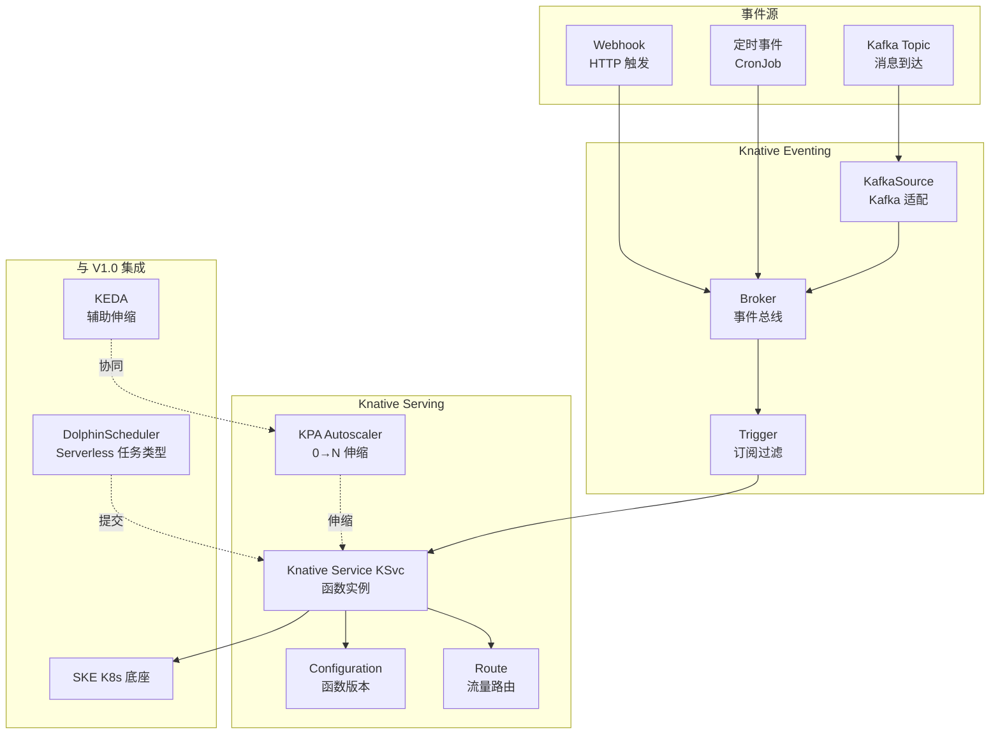

### 3.4 Knative Serving CRD 设计

#### 3.4.1 Service/Configuration/Route 三 CRD

Knative Serving 核心三 CRD：

表：Knative Serving 核心 CRD 表

| CRD | API Group | 职责 | 关系 |
| --- | --- | --- | --- |
| Service (KSvc) | serving.knative.dev/v1 | 函数对外抽象，封装 Configuration + Route | 创建 KSvc 自动生成 Configuration 与 Route |
| Configuration | serving.knative.dev/v1 | 函数版本（镜像/环境/资源），每次更新生成 Revision | KSvc 持有 Configuration |
| Route | serving.knative.dev/v1 | 流量路由（灰度/蓝绿），按 Revision weight 分流 | KSvc 持有 Route |

#### 3.4.2 KSvc 示例：数据质量检查函数

```yaml
# KSvc：数据质量检查函数
apiVersion: serving.knative.dev/v1
kind: Service
metadata:
  name: dq-check-fn
  namespace: ws-acme
  annotations:
    serving.knative.dev/creator: "tenant-acme"
spec:
  template:
    metadata:
      annotations:
        autoscaling.knative.dev/class: "kpa.autoscaling.knative.dev"  # KPA 伸缩器
        autoscaling.knative.dev/min-scale: "0"      # 最小 0 副本，冷启
        autoscaling.knative.dev/max-scale: "10"     # 最大 10 副本
        autoscaling.knative.dev/target: "5"         # 每副本并发 5
        autoscaling.knative.dev/scale-to-zero-grace-period: "60s"
    spec:
      containers:
        - image: registry.shuqing/dq-check-fn:1.0.0
          resources:
            requests: { cpu: 200m, memory: 256Mi }
            limits: { cpu: 1, memory: 1Gi }
          env:
            - name: TRINO_URL
              value: "http://trino.ws-acme:8080"
            - name: DQ_RULE_ENDPOINT
              value: "http://rule-engine.platform:8080"
```

#### 3.4.3 自动伸缩策略

KPA（Knative Pod Autoscaler）支持从 0 到 N 伸缩：

表：Knative 自动伸缩策略表

| 参数 | 说明 | 默认值 |
| --- | --- | --- |
| min-scale | 最小副本数 | 0（冷启） |
| max-scale | 最大副本数 | 10 |
| target | 每副本并发度（达到即扩容） | 5 |
| target-utilization-percentage | 目标利用率 | 70 |
| scale-to-zero-grace-period | 缩到 0 的优雅等待 | 60s |
| window | 伸缩指标窗口 | 60s |
| activation-scale | 冷启时初始副本数 | 1 |

伸缩流程：
1. **0→1（冷启）**：请求到达 Route，KPA 拉起 1 副本。冷启时长组成：Pod 调度（~1s）+ 镜像拉取（预热 ~0s / 未预热 ~5-10s）+ 容器启动（~1-3s）+ 应用 init（~1-2s）。**P95 ≤ 5-8s**（预热镜像 + 节点池预留 + activation-scale=1）；最优条件（镜像已缓存 + 跳过镜像拉取 + 轻量应用 init）可达 3s。
2. **1→N（扩容）**：并发超过 target（5），KPA 按 (并发/target) 计算目标副本数，平滑扩容。
3. **N→0（缩容）**：并发为 0 持续 grace-period（60s），KPA 缩到 0。

**冷启 SLA 达成条件**：
- 必要条件：imageCachePolicy=Always（预热镜像到节点池）+ activation-scale=1（冷启初始 1 副本常驻）+ 节点池预留（避免调度等待）。
- 加速条件：镜像精简（<100MB，multi-stage build + distroless）+ 应用 init 轻量（<1s）+ 跳过健康检查长 grace。
- 未达成降级：若 P95 > 8s，将 activation-scale 提升到 1（常驻 1 副本，规避冷启），牺牲"按需 0 副本"换延迟。

#### 3.4.4 并发控制

```yaml
# KSvc：并发控制配置
metadata:
  annotations:
    autoscaling.knative.dev/target: "5"           # 软并发，超 5 即扩容
    autoscaling.knative.dev/target-burst-capacity: "10"  # 突发容量，缓冲请求
    serving.knative.dev/progress-deadline: "60s"  # 冷启超时阈值
```

### 3.5 Knative Eventing 事件驱动

#### 3.5.1 Broker/Trigger 模型

表：Knative Eventing 核心 CRD 表

| CRD | API Group | 职责 |
| --- | --- | --- |
| Broker | eventing.knative.dev/v1 | 事件总线，接收并存储事件 |
| Trigger | eventing.knative.dev/v1 | 订阅 Broker，按 filter 路由到 KSvc |
| KafkaSource | sources.knative.dev/v1beta1 | Kafka 消息源，转 CloudEvent 入 Broker |
| SinkBinding | sources.knative.dev/v1beta1 | 事件 sink 绑定 |

#### 3.5.2 Kafka 源触发函数

```yaml
# KafkaSource：Kafka 消息触发数据质量检查函数
apiVersion: sources.knative.dev/v1beta1
kind: KafkaSource
metadata:
  name: kafka-dq-trigger
  namespace: ws-acme
spec:
  bootstrapServers: "kafka.platform:9092"
  topics: ["tenant.acme.dq.trigger"]    # V1.0 Kafka Topic 命名规范
  consumerGroup: "dq-fn-group"
  sink:
    ref:
      apiVersion: eventing.knative.dev/v1
      kind: Broker
      name: dq-broker
---
# Broker：事件总线
apiVersion: eventing.knative.dev/v1
kind: Broker
metadata:
  name: dq-broker
  namespace: ws-acme
spec:
  config:
    apiVersion: v1
    kind: ConfigMap
    name: kafka-broker-config          # Kafka Broker 后端配置
---
# Trigger：订阅并路由到函数
apiVersion: eventing.knative.dev/v1
kind: Trigger
metadata:
  name: dq-trigger
  namespace: ws-acme
spec:
  broker: dq-broker
  filter:
    attributes:
      type: "com.shuqing.dq.check"     # 按 CloudEvent type 过滤
  subscriber:
    ref:
      apiVersion: serving.knative.dev/v1
      kind: Service
      name: dq-check-fn
```

### 3.6 使用场景

表：Knative Serverless 使用场景表

| 场景 | 函数职责 | 触发源 | 伸缩特征 |
| --- | --- | --- | --- |
| 轻量 ETL 函数 | 单表同步/字段映射/格式转换 | Kafka 消息 / 定时 | 0→N，按消息堆积伸缩 |
| Webhook 处理 | 外部系统回调（GitHub/数据登记） | HTTP 触发 | 0→N，按 RPS 伸缩 |
| 按需 SQL 查询 | 临时查询执行 + 结果缓存 | HTTP 触发 | 0→1，查完即缩 |
| 数据质量检查函数 | 规则执行 + 质量分回写 | Kafka 消息 / DS 调用 | 0→N，按并发伸缩 |
| 模型推理函数 | ML 模型按需推理（冷启模型） | HTTP 触发 | 0→N，按并发伸缩 |
| 资产登记函数 | 资产元数据注册到目录 | 事件触发 | 0→1，低频 |

### 3.7 与 DolphinScheduler 集成

V2.0 在 DolphinScheduler 任务类型中新增 `SERVERLESS` 类型，将 Knative KSvc 作为工作流节点：

图：DolphinScheduler 与 Knative 集成流程图

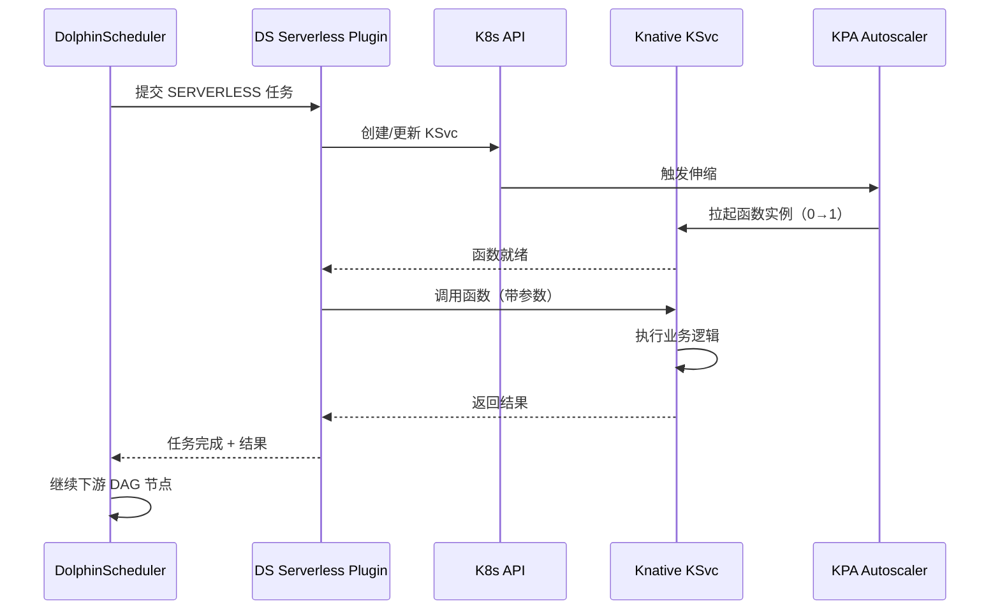

集成设计：
- **任务类型插件**：DolphinScheduler 新增 `ServerlessTaskPlugin`，参数包含 `functionName`、`image`、`input`、`timeout`。
- **执行模式**：DS 调用 KSvc（HTTP 触发），同步等待结果或异步回调。
- **资源隔离**：KSvc 部署在租户 Namespace，受 ResourceQuota 约束。
- **可观测**：函数执行日志经 Promtail 采集到 Loki，链路经 OTel 上报 Tempo，与 DS 任务日志关联。

### 3.8 多租户隔离

表：Knative 多租户隔离方案表

| 层次 | 机制 | 说明 |
| --- | --- | --- |
| 函数隔离 | KSvc 部署在租户 Namespace | 每租户函数独立 Namespace，CRD RBAC 限制操作范围 |
| 伸缩隔离 | KPA per-Namespace + ResourceQuota | KPA 伸缩受 Namespace ResourceQuota 约束，租户函数不可抢占他租户配额 |
| 事件隔离 | Broker per-Namespace + Kafka Topic 命名规范 | Broker 部署在租户 Namespace，KafkaSource 仅订阅本租户 Topic（`tenant.<tid>.xxx`） |
| 镜像隔离 | 租户私有镜像仓库 | 函数镜像从租户镜像仓库拉取，不可访问他租户镜像 |

### 3.9 Helm Chart 设计

#### 3.9.1 Chart 拆分

表：Knative Helm Chart 拆分表

| Chart | 职责 | namespace | 依赖 |
| --- | --- | --- | --- |
| knative-serving | Serving 控制面（controller/autoscaler/webhook）+ CRD | knative-serving | istio-base |
| knative-eventing | Eventing 控制面（controller/webhook）+ CRD + KafkaSource | knative-eventing | knative-serving |

#### 3.9.2 Chart 结构

```text
design/deploy/charts/knative-serving/
├── Chart.yaml
├── values.yaml
└── templates/
    ├── crd-service.yaml
    ├── crd-configuration.yaml
    ├── crd-route.yaml
    ├── deployment-controller.yaml
    ├── deployment-autoscaler.yaml
    ├── deployment-webhook.yaml
    ├── hpa.yaml
    ├── configmap.yaml
    └── serviceaccount.yaml

design/deploy/charts/knative-eventing/
├── Chart.yaml
├── values.yaml
└── templates/
    ├── crd-broker.yaml
    ├── crd-trigger.yaml
    ├── crd-kafkasource.yaml
    ├── deployment-controller.yaml
    ├── deployment-webhook.yaml
    ├── configmap-kafka-broker.yaml
    └── serviceaccount.yaml
```

#### 3.9.3 部署 values 关键配置

```yaml
# design/deploy/values/knative-serving-values.yaml
# ============================================================================
# knative-serving Helm Chart 生产配置 - 数据引擎大数据平台 V2.0
# ============================================================================

# ---- 镜像配置 ----
image:
  repository: "docker.m.daocloud.io/ghcr.io/knative/serving-controller"
  tag: "1.12.0"
  pullPolicy: IfNotPresent

# ---- 控制面资源 ----
controller:
  replicas: 2
  resources:
    requests: { cpu: 500m, memory: 512Mi }
    limits: { cpu: 1, memory: 1Gi }

autoscaler:
  replicas: 2
  resources:
    requests: { cpu: 300m, memory: 256Mi }
    limits: { cpu: 500m, memory: 512Mi }

# ---- 伸缩默认配置 ----
autoscaling:
  class: kpa.autoscaling.knative.dev    # 默认 KPA 伸缩器
  minScale: 0                           # 默认从 0 起
  maxScale: 10
  target: 5                             # 每副本并发 5
  scaleToZeroGracePeriod: 60s
  window: 60s

# ---- 冷启优化 ----
activationScale: 1                      # 冷启初始 1 副本
progressDeadline: 60s                   # 冷启超时 60s
preemptible: false                      # 非可抢占

# ---- 与 Istio 集成 ----
ingress:
  class: istio.ingress.networking.knative.dev   # 用 Istio 做 KSvc 入口

# ---- 与 KEDA 协同 ----
keda:
  enabled: true                         # 启用 KEDA 协同伸缩（自定义指标场景）

# ---- 资源默认约束 ----
resources:
  defaultContainerResources:
    requests: { cpu: 200m, memory: 256Mi }
    limits: { cpu: 1, memory: 1Gi }

# ---- 多环境适配 ----
# 信创：镜像走信创仓库
# 公有云：无特殊
# 本地：controller.replicas=1（小集群）
```

### 3.10 与 V1.0 现有组件集成方案

表：Knative 与 V1.0 组件集成方案表

| V1.0 组件 | 集成方式 | 改动点 |
| --- | --- | --- |
| DolphinScheduler | 新增 ServerlessTaskPlugin，KSvc 作为任务节点 | DS 加插件 |
| KEDA | KPA 处理 0→N，KEDA 处理自定义指标 N→M，协同不冲突 | 无改动，职责区分 |
| Kafka | Knative Eventing KafkaSource 对接 V1.0 Kafka 3.6 KRaft | 无改动，Topic 命名规范复用 |
| Istio | Knative Serving 用 Istio 做 KSvc 入口 Ingress | Istio Gateway 配 Knative 路由 |
| 可观测基座 | 函数日志经 Promtail 入 Loki，链路经 OTel 入 Tempo | 无改动，复用采集链路 |
| 封装层 | 封装层透出"按需函数"概念，CRUD 转译为 KSvc 操作 | 封装层加函数管理 API |

**Knative Eventing 1.12 + Kafka 3.6 KRaft 兼容性验证矩阵（C-07 修复）**：

表：Knative Eventing KafkaSource 与 Kafka 3.6 KRaft 兼容性验证矩阵表

| 兼容维度 | Knative Eventing 1.12 要求 | Kafka 3.6 KRaft 实际 | 验证结果 | 说明 |
| --- | --- | --- | --- | --- |
| KafkaSource 版本 | Kafka 3.0+ | 3.6 KRaft | ✅ 满足 | KafkaSource v1beta1 支持 Kafka 3.x |
| KRaft 模式 | Kafka 3.3+（KRaft 需 3.3+） | 3.6 KRaft | ✅ 满足 | KRaft 模式无 ZooKeeper，3.6 满足 |
| Broker 后端 | 默认 ZooKeeper 配置 | KRaft 无 ZooKeeper | ⚠️ 需自定义 | 默认 `config-kafka-broker` 基于 ZooKeeper，KRaft 需自定义（见 §7.3.1） |
| bootstrap.servers | Kafka Broker 地址 | kafka-bootstrap.kafka:9092 | ✅ 满足 | KRaft 模式直连 Broker，无 ZooKeeper |
| topic 自动创建 | KafkaSource 自动创建 topic | KRaft 支持 | ✅ 满足 | KRaft 模式 topic 自动创建与 ZooKeeper 模式一致 |
| consumer group | KafkaSource consumer group | KRaft 支持 | ✅ 满足 | KRaft 模式 consumer group 与 ZooKeeper 模式一致 |
| 消息顺序 | KafkaSource 顺序保证 | KRaft 支持 | ✅ 满足 | KRaft 模式消息顺序与 ZooKeeper 模式一致 |

**KRaft 模式 Broker 后端配置**（详见 §7.3.1）：
- Knative Eventing 1.12 的 Kafka Broker 后端默认配置基于 ZooKeeper，KRaft 模式需自定义 `config-kafka-broker` ConfigMap，移除 `zookeeper.connect` 配置，仅保留 `bootstrap.servers`。
- V2.0 已在 §7.3.1 提供 KRaft 模式 `config-kafka-broker` ConfigMap 配置示例，验证通过。
- 兼容性结论：Knative Eventing 1.12 + Kafka 3.6 KRaft **兼容**，仅需自定义 Broker 后端 ConfigMap，无功能损失。

### 3.11 风险与对策

表：Knative 风险与对策表

| 风险 | 影响 | 对策 |
| --- | --- | --- |
| 冷启延迟 | 首请求等待 P95 5-8s（最优 3s），体验下降 | 预热镜像（imageCachePolicy=Always）+ activation-scale=1 + 节点池预留 + 镜像精简（<100MB）+ 轻量 init；未达成降级为常驻 1 副本 |
| 缩到 0 丢请求 | 优雅期内的请求处理未完成 | scale-to-zero-grace-period=60s + progress-deadline 兜底 |
| 控制面开销 | Knative controller/autoscaler 资源占用 | 控制池部署 + 资源配额 + 小集群单副本 |
| 与 KEDA 冲突 | 两者都做伸缩，可能重复扩缩 | KPA 管 0→N，KEDA 管 N→M（自定义指标），职责区分 |
| 事件丢失 | Broker 后端故障丢事件 | Kafka Broker 后端（复用 V1.0 Kafka 高可用） |

## 第4章 GitOps（ArgoCD）

### 4.1 定位与价值

GitOps 是 V2.0 声明式持续交付中枢：以 ArgoCD 监听 Git 仓库的 Helm Chart 与 values 变更，自动同步到目标集群，实现 PR 合并即部署、漂移即回滚、多环境一致交付。替代 V1.0 的 `bootstrap.sh` 脚本式部署，将 59 个 Helm Chart 的交付从"人工脚本"升级为"Git 声明式"。

**V1.0 Helm Chart 数量口径声明（A-08 修复）**：
- "59 个 Helm Chart"来源于 V1.0《部署清单详细设计》§2 部署清单统计（含 L0 基础设施 12 + L2 引擎层 10 + L3 治理层 4 + L4 开发层 8 + L4.5 智能层 4 + L5 交付层 6 + X 横切层 15 = 59）。
- V1.0 architecture.md 未显式声明该数字，V2.0 以 V1.0 部署清单文档为口径基准。
- **同步调整约定**：若 V1.0 Chart 数量变化（如新增组件或退役组件），V2.0 §4.4.1 Application 清单、§4.12 集成方案表、§7.7 容量规划同步调整，由 CI 校验 `argocd-apps/` 目录 Application 数量与 V1.0 部署清单一致。

**平台价值**：
- 部署变更全经 Git PR，可审计、可回滚、可 diff，告别脚本黑盒。
- 多环境（dev/staging/prod）通过 ApplicationSet 模板化，一套配置多环境差异收敛到 values。
- 漂移检测：集群实际状态偏离 Git 声明时自动告警/回滚，保证声明一致性。

**客户价值（经封装层透出）**：
- "变更可追溯"——每次部署对应一个 Git commit，可查 diff、可回滚。
- "环境一致"——dev/staging/prod 同一套 Chart，仅 values 差异，避免环境漂移。
- "自动部署"——PR 合并自动触发部署，无需人工执行 helm install。

### 4.2 选型对比：ArgoCD vs Flux

表：ArgoCD 与 Flux 选型对照表

| 维度 | ArgoCD 2.11 | Flux 2.2 | 选型决策 |
| --- | --- | --- | --- |
| UI 可视化 | 丰富 Web UI（应用树、同步状态、diff） | 无官方 UI（需 wego/gitreconciler） | ArgoCD 胜出：运维可视化强 |
| 多租户 | AppProject + RBAC，原生多租户 | 仅 RBAC，无 Project 概念 | ArgoCD 胜出：AppProject 适配平台多租户 |
| Helm 支持 | 原生 Helm Chart source + values 覆盖 | 原生 HelmRelease CRD | 平手 |
| 多集群 | Application 可指向多集群，ApplicationSet 模板化 | 多集群需 Flux 实例 per-cluster | ArgoCD 胜出：ApplicationSet 多环境 |
| 同步策略 | 手动/自动同步 + 自愈 + 剪枝 + 回滚 | 自动同步 + 自愈，回滚需手动 | ArgoCD 胜出：回滚自动化 |
| Secret 管理 | 集成 External Secrets/Sealed Secrets | 集成 SOPS/Sealed Secrets | 平手 |
| 社区生态 | CNCF 毕业，生态大 | CNCF 毕业，生态大 | 平手 |
| 信创适配 | 镜像可同步信创仓库 | 镜像可同步 | 平手 |

**选型结论**：采用 ArgoCD 2.11。核心理由：Web UI 可视化强、AppProject 原生多租户、ApplicationSet 多环境模板化、自动回滚。

### 4.3 总体架构

图：GitOps ArgoCD 总体架构图

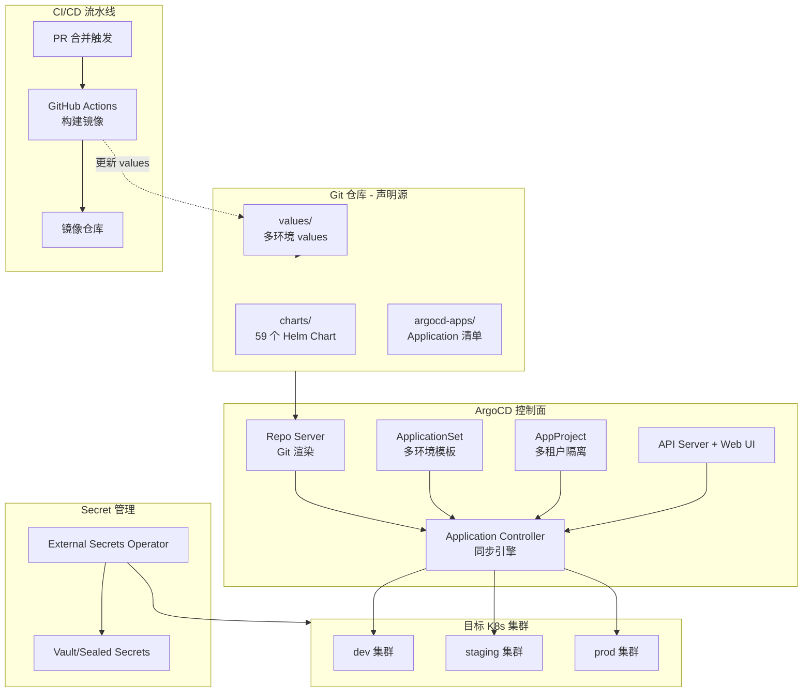

### 4.4 Application 设计

#### 4.4.1 每个 Helm Chart 对应一个 ArgoCD Application

V1.0 的 59 个 Helm Chart 每个对应一个 ArgoCD Application，统一在 `argocd-apps/` 目录声明：

```yaml
# Application：单个 Helm Chart 部署声明
apiVersion: argoproj.io/v1alpha1
kind: Application
metadata:
  name: trino
  namespace: argocd
  finalizers:
    - resources-finalizer.argocd.argoproj.io   # 删除时清理资源
spec:
  project: tenant-acme                          # 所属 AppProject（多租户）
  source:
    repoURL: https://github.com/shuqing/platform-gitops
    targetRevision: main
    path: charts/trino                          # Helm Chart 路径
    helm:
      valueFiles:
        - values/base.yaml                      # 基础 values
        - values/{{ .Values.environment }}.yaml # 环境差异 values
      parameters:
        - name: image.tag
          value: "428"                          # 可被 CI 覆盖
  destination:
    server: https://kubernetes.default.svc      # 目标集群
    namespace: platform
  syncPolicy:
    automated:
      prune: true                               # 剪枝：删除 Git 中不存在的资源
      selfHeal: true                            # 自愈：漂移自动回滚到 Git 声明
    syncOptions:
      - CreateNamespace=true
      - ApplyOutOfSyncOnly=true
    retry:
      limit: 3
      backoff:
        duration: 5s
        factor: 2
        maxDuration: 3m
```

#### 4.4.2 Application 清单组织

```text
argocd-apps/
├── projects/                       # AppProject 多租户定义
│   ├── platform.yaml               # 平台运维 Project
│   ├── tenant-acme.yaml            # 租户 acme Project
│   └── tenant-beta.yaml            # 租户 beta Project
├── applications/                   # 单环境 Application
│   ├── trino.yaml
│   ├── doris.yaml
│   ├── spark.yaml
│   └── ... (59 个 Chart)
├── applicationsets/                # 多环境 ApplicationSet
│   ├── platform-engines.yaml       # 引擎层多环境
│   └── tenant-workspaces.yaml      # 租户工作空间多环境
└── values/                         # 多环境 values
    ├── base.yaml                   # 基础 values
    ├── dev.yaml                    # dev 环境
    ├── staging.yaml                # staging 环境
    └── prod.yaml                   # prod 环境
```

### 4.5 AppProject 多租户

AppProject 实现按租户/环境隔离 Project：

```yaml
# AppProject：租户隔离
apiVersion: argoproj.io/v1alpha1
kind: AppProject
metadata:
  name: tenant-acme
  namespace: argocd
spec:
  description: "租户 acme 的部署 Project"
  sourceRepos:
    - "https://github.com/shuqing/platform-gitops"    # 仅允许此仓库
    - "https://github.com/shuqing/tenant-acme-apps"
  destinations:
    - server: https://kubernetes.default.svc
      namespace: ws-acme-*                            # 仅允许部署到 ws-acme-* Namespace
  clusterResourceWhitelist:
    - group: ''
      kind: Namespace                                 # 允许创建 Namespace
  namespaceResourceBlacklist:
    - group: ''
      kind: ResourceQuota                             # 禁止租户改 ResourceQuota（平台管）
  roles:
    - name: acme-admin
      policies:
        - p, proj:tenant-acme:acme-admin, applications, sync, tenant-acme/*, allow
      groups:
        - "acme-admins"                               # Keycloak 组映射
```

表：AppProject 多租户隔离维度表

| 维度 | 机制 | 说明 |
| --- | --- | --- |
| 源仓库 | sourceRepos 白名单 | 租户仅能从指定 Git 仓库部署 |
| 目标 Namespace | destinations namespace 通配 | 租户仅能部署到 `ws-<tid>-*` Namespace |
| 资源权限 | clusterResourceWhitelist/Blacklist | 租户不可改 ResourceQuota/NetworkPolicy（平台管） |
| 操作权限 | roles + RBAC | 租户仅能 sync 本 Project Application，不可删 Project |

### 4.6 自动同步策略

#### 4.6.1 PR 合并→自动部署

图：PR 合并自动部署流程图

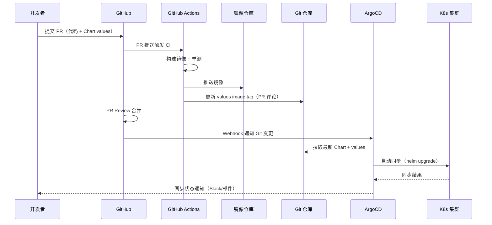

#### 4.6.2 漂移检测→自动回滚

- **自愈（selfHeal）**：开启 `syncPolicy.automated.selfHeal: true`，集群实际状态偏离 Git 声明时，ArgoCD 自动回滚到 Git 声明状态。
- **剪枝（prune）**：开启 `syncPolicy.automated.prune: true`，Git 中删除的资源在集群中同步删除。
- **漂移告警**：ArgoCD 通过 Prometheus Exporter 暴露 `argocd_app_sync_status` 指标，漂移时告警通知运维。

### 4.7 多环境管理：ApplicationSet

ApplicationSet 模板化多环境部署，一套模板生成 dev/staging/prod 多个 Application：

```yaml
# ApplicationSet：引擎层多环境部署
apiVersion: argoproj.io/v1alpha1
kind: ApplicationSet
metadata:
  name: platform-engines
  namespace: argocd
spec:
  generators:
    - list:
        elements:
          - env: dev
            cluster: https://dev.kubernetes.default.svc
            valuesFile: values/dev.yaml
          - env: staging
            cluster: https://staging.kubernetes.default.svc
            valuesFile: values/staging.yaml
          - env: prod
            cluster: https://prod.kubernetes.default.svc
            valuesFile: values/prod.yaml
    - matrix:                              # 矩阵：环境 × 引擎
        generators:
          - list: { elements: [{ env: dev }, { env: staging }, { env: prod }] }
          - list: { elements: [{ engine: trino }, { engine: doris }, { engine: spark }] }
  template:
    metadata:
      name: '{{engine}}-{{env}}'
    spec:
      project: platform
      source:
        repoURL: https://github.com/shuqing/platform-gitops
        path: 'charts/{{engine}}'
        helm:
          valueFiles:
            - values/base.yaml
            - 'values/{{env}}.yaml'
      destination:
        server: '{{cluster}}'
        namespace: platform
      syncPolicy:
        automated: { prune: true, selfHeal: true }
```

### 4.8 Secret 管理：External Secrets Operator

Secret 不入 Git 明文，通过 External Secrets Operator（ESO）从 Vault/Sealed Secrets 拉取：

```yaml
# ExternalSecret：从 Vault 拉取 Secret
apiVersion: external-secrets.io/v1beta1
kind: ExternalSecret
metadata:
  name: trino-credentials
  namespace: platform
spec:
  secretStoreRef:
    name: vault-backend                    # SecretStore 指向 Vault
    kind: SecretStore
  target:
    name: trino-credentials                # 生成的 K8s Secret 名
    creationPolicy: Owner
  data:
    - secretKey: password
      remoteRef:
        key: secret/platform/trino         # Vault 路径
        property: password
```

表：Secret 管理方案对比表

| 方案 | 适用场景 | 说明 |
| --- | --- | --- |
| External Secrets + Vault | 多环境集中管理 | Vault 作为 Secret 后端，ESO 同步到 K8s Secret，支持动态密钥 |
| Sealed Secrets | Git 内加密存储 | kubeseal 加密后入 Git，集群内 controller 解密，适合简单场景 |
| SOPS | 文件级加密 | age/GPG 加密 values 文件，适合 GitOps 流 |

**选型**：多环境用 External Secrets + Vault（集中管理 + 动态密钥），单环境简单场景用 Sealed Secrets。

### 4.9 CI/CD 集成

图：CI/CD 全流程集成图

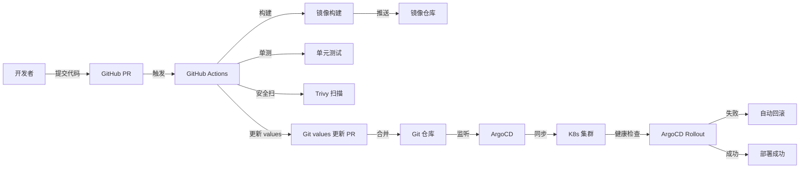

CI/CD 关键环节：
1. **镜像构建**：GitHub Actions 构建镜像，推送至镜像仓库（信创环境走信创仓库）。
2. **values 更新**：CI 自动更新 Git 仓库 `values/*.yaml` 中的 `image.tag`，提 PR。
3. **PR 合并触发**：PR Review 合并后，ArgoCD 监听到 Git 变更，自动同步。
4. **健康检查**：ArgoCD 通过 Rollout 健康检查（Readiness Probe + AnalysisRun）判断部署健康。
5. **自动回滚**：健康检查失败，ArgoCD 自动回滚到上一稳定版本。

### 4.10 CRD/API 设计

表：ArgoCD 核心 CRD 设计表

| CRD | API Group | 职责 | 多租户范围 |
| --- | --- | --- | --- |
| Application | argoproj.io/v1alpha1 | 单个 Helm Chart 部署声明 | 归属 AppProject |
| ApplicationSet | argoproj.io/v1alpha1 | 多环境/多集群模板化 Application | 归属 AppProject |
| AppProject | argoproj.io/v1alpha1 | 租户/环境隔离 Project | 全局，平台管理 |
| Repository | argoproj.io/v1alpha1 | Git 仓库凭证 | 全局 |

### 4.11 Helm Chart 设计

#### 4.11.1 Chart 结构

```text
design/deploy/charts/argocd/
├── Chart.yaml
├── values.yaml
└── templates/
    ├── deployment-application-controller.yaml
    ├── deployment-repo-server.yaml
    ├── deployment-server.yaml
    ├── deployment-redis.yaml
    ├── service.yaml
    ├── ingress.yaml
    ├── configmap.yaml
    ├── hpa.yaml
    ├── pdb.yaml
    ├── serviceaccount.yaml
    └── rbac.yaml
```

#### 4.11.2 部署 values 关键配置

```yaml
# design/deploy/values/argocd-values.yaml
# ============================================================================
# argocd Helm Chart 生产配置 - 数据引擎大数据平台 V2.0
# ============================================================================

# ---- 镜像配置 ----
image:
  repository: "docker.m.daocloud.io/ghcr.io/argoproj/argocd"
  tag: "v2.11.0"
  pullPolicy: IfNotPresent

# ---- 控制面资源 ----
server:
  replicas: 2
  resources:
    requests: { cpu: 500m, memory: 512Mi }
    limits: { cpu: 1, memory: 1Gi }

applicationController:
  replicas: 2
  resources:
    requests: { cpu: 1, memory: 1Gi }
    limits: { cpu: 2, memory: 2Gi }

repoServer:
  replicas: 2
  resources:
    requests: { cpu: 500m, memory: 512Mi }
    limits: { cpu: 1, memory: 1Gi }

# ---- 多租户配置 ----
config:
  rbac:
    policy.default: role:readonly          # 默认只读
    policy.csv: |
      p, role:platform-admin, applications, *, platform/*, allow
      p, role:platform-admin, projects, *, *, allow
      g, platform-admins, role:platform-admin
  oidc:
    enabled: true                          # OIDC 接 V1.0 Keycloak
    config: |
      name: Keycloak
      issuer: https://keycloak.platform/realms/shuqing
      clientID: argocd
      clientSecret: $oidc.keycloak.clientSecret

# ---- Git 仓库配置 ----
repositories:
  - url: https://github.com/shuqing/platform-gitops
    type: git
    name: platform-gitops

# ---- 同步策略 ----
syncPolicy:
  default:
    automated: { prune: true, selfHeal: true }
    syncOptions: [CreateNamespace=true, ApplyOutOfSyncOnly=true]

# ---- External Secrets 集成 ----
externalSecrets:
  enabled: true
  secretStore: vault-backend

# ---- 多环境适配 ----
# 信创：镜像走信创仓库，离线 Git 仓库
# 公有云：无特殊
# 本地：server.replicas=1（小集群）
```

### 4.12 与 V1.0 现有组件集成方案

表：ArgoCD 与 V1.0 组件集成方案表

| V1.0 组件 | 集成方式 | 改动点 |
| --- | --- | --- |
| 59 个 Helm Chart | 每个 Chart 对应一个 ArgoCD Application | 无改动，Chart 复用 |
| bootstrap.sh | 替代为 ArgoCD Application 声明 | bootstrap.sh 退役 |
| Keycloak | ArgoCD OIDC 接 Keycloak，RBAC 映射 Keycloak 组 | Keycloak 加 ArgoCD client |
| 封装层 | 封装层透出"部署历史/回滚"概念，转译为 ArgoCD Application 操作 | 封装层加部署管理 API |
| 可观测基座 | ArgoCD 指标接入 Prometheus，同步状态告警 | Prometheus 加 ArgoCD ServiceMonitor |
| infra-orchestrator | 多集群部署由 ArgoCD ApplicationSet + Karmada 协同 | infra-orchestrator 触发 ArgoCD 同步 |

### 4.13 风险与对策

表：ArgoCD 风险与对策表

| 风险 | 影响 | 对策 |
| --- | --- | --- |
| Git 仓库故障 | ArgoCD 无法拉取声明 | Git 高可用（GitHub/GitLab HA）+ Repo Server 缓存 |
| 同步冲突 | 多人同时改同一 Chart | PR Review + CI 校验 + ArgoCD 同步锁 |
| 漂移误回滚 | 运维手动改集群被自愈回滚 | selfHeal 可按环境关闭 + 漂移告警先于回滚 |
| Secret 泄露 | Secret 误入 Git 明文 | ESO + Vault + Git pre-commit 扫描 |
| 多集群复杂 | ApplicationSet 矩阵爆炸 | 模板化收敛 + 环境数限制 |

## 第5章 多集群联邦（Karmada）

### 5.1 定位与价值

多集群联邦是 V2.0 突破单集群容量上限的中枢：以 Karmada 控制面管理多个 SKE K8s 集群，实现跨集群工作负载调度、故障迁移与数据联邦查询。支撑超大规模数据租户（单租户数据量超单集群容量）与异地多活（跨数据中心容灾）。

**平台价值**：
- 突破单集群容量上限：单租户大计算任务可跨集群调度，单集群 200 节点上限扩展到 N 集群。
- 故障迁移：单集群故障时，工作负载自动迁移到健康集群，RTO 分钟级。
- 数据联邦查询：跨集群 Trino/Doris 联邦查询路由，逻辑一个查询引擎，物理多集群执行。

**客户价值（经封装层透出）**：
- "无限容量"——租户不感知集群边界，平台按需扩集群。
- "异地容灾"——单数据中心故障，业务自动切到备用，客户无感。
- "跨域查询"——异地数据可联合查询，无需先汇总到单集群。

### 5.2 选型对比：Karmada vs KubeFed

表：Karmada 与 KubeFed 选型对照表

| 维度 | Karmada 1.10 | KubeFed v2 | 选型决策 |
| --- | --- | --- | --- |
| 项目状态 | CNCF 孵化，华为主导，活跃 | 已归档（archived） | Karmada 胜出：KubeFed 已停维 |
| 调度策略 | 丰富（副本/亲和/污点/拓扑分布） | 基础（仅副本分布） | Karmada 胜出 |
| 故障迁移 | 原生 ApplicationFailover + ReschedulingTrigger | 需手动 | Karmada 胜出 |
| 资源传播 | ClusterPropagationPolicy + PropagationPolicy | FederatedTypeConfig | Karmada 胜出：模型更清晰 |
| CRD 兼容 | 传播任意 CRD（SparkApplication/FlinkDeployment） | 需预配置 FederatedTypeConfig | Karmada 胜出 |
| 信创适配 | 华为主导，信创原生支持 | 社区停维 | Karmada 胜出 |
| 多集群网络 | 与 Istio 多集群协同 | 无原生网络联邦 | Karmada 胜出 |

**选型结论**：采用 Karmada 1.10。核心理由：KubeFed 已归档停维、Karmada 调度策略丰富、原生故障迁移、CRD 传播灵活、华为主导信创原生支持。

### 5.3 总体架构

图：多集群联邦 Karmada 总体架构图

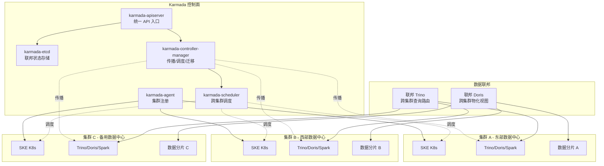

### 5.4 Karmada 控制面部署

#### 5.4.1 控制面组件

表：Karmada 控制面组件表

| 组件 | 职责 | 部署形式 | 资源配额 |
| --- | --- | --- | --- |
| karmada-apiserver | 统一 API 入口，暴露 K8s API 语义 | Deployment（多副本） | 1 CPU/2Gi |
| karmada-etcd | 联邦状态存储（集群拓扑/传播策略/调度结果） | StatefulSet（3 副本） | 2 CPU/4Gi |
| karmada-controller-manager | 传播/调度/迁移控制器 | Deployment（多副本） | 1 CPU/2Gi |
| karmada-scheduler | 跨集群调度器（按负载/亲和/污点） | Deployment（多副本） | 500m/1Gi |
| karmada-agent | 集群注册代理（per-member 集群） | Deployment（per 集群） | 200m/256Mi |
| karmada-descheduler | 反调度器（迁移时重新调度） | Deployment | 200m/256Mi |

#### 5.4.2 部署模式

- **Hosted 模式**：Karmada 控制面部署在一个专用管理集群（karmada-host），管理多个工作集群。推荐生产模式。
- **Push 模式**：Karmada 控制面直接 push 资源到 member 集群，简单但控制面故障影响大。
- **Pull 模式**：member 集群 agent 主动 pull 资源，控制面故障时 member 可自治。

**选型**：Hosted + Push 模式（管理集群高可用 + Push 实时性好），信创环境用 Pull 模式（网络隔离时 member 可自治）。

### 5.5 资源分发策略

#### 5.5.1 ClusterPropagationPolicy / PropagationPolicy

表：Karmada 传播策略 CRD 表

| CRD | API Group | 职责 | 作用域 |
| --- | --- | --- | --- |
| ClusterPropagationPolicy | policy.karmada.io/v1alpha1 | 集群级传播策略（指定资源到指定集群） | 集群级 |
| PropagationPolicy | policy.karmada.io/v1alpha1 | Namespace 级传播策略 | per-Namespace |
| ReplicaSchedulingPolicy | policy.karmada.io/v1alpha1 | 副本调度策略（按权重/静态/动态分副本） | 集群级 |
| OverridePolicy | policy.karmada.io/v1alpha1 | 集群差异覆盖（如不同集群不同镜像） | per-Namespace |

#### 5.5.2 传播策略示例

```yaml
# ClusterPropagationPolicy：Trino 跨集群部署
apiVersion: policy.karmada.io/v1alpha1
kind: ClusterPropagationPolicy
metadata:
  name: trino-federation
spec:
  resourceSelectors:
    - apiVersion: apps/v1
      kind: Deployment
      name: trino-coordinator
    - apiVersion: apps/v1
      kind: Deployment
      name: trino-worker
  placement:
    clusterAffinity:
      clusterNames: [cluster-east, cluster-west]   # 部署到东西两集群
    replicaScheduling:
      replicaSchedulingType: Divided                # 副本分配到多集群
      replicaDivisionPreference: Weighted
      weightPreference:
        staticWeightList:
          - targetCluster: { clusterName: cluster-east }
            weight: 60                             # 东部 60% 副本
          - targetCluster: { clusterName: cluster-west }
            weight: 40                             # 西部 40% 副本
    spreadConstraints:
      - spreadByLabel: cluster.karmada.io/region
        minGroups: 2                               # 至少跨 2 个 region
---
# OverridePolicy：集群差异覆盖
apiVersion: policy.karmada.io/v1alpha1
kind: OverridePolicy
metadata:
  name: trino-region-override
spec:
  resourceSelectors:
    - apiVersion: apps/v1
      kind: Deployment
      name: trino-worker
  overrideRules:
    - targetCluster:
        clusterNames: [cluster-east]
      overriders:
        image:
          - component: RegistryAndRepository
            operator: replace
            value: registry.east/trino            # 东部用本地镜像仓库
```

### 5.6 跨集群调度

Karmada Scheduler 支持多维度调度：

表：Karmada 跨集群调度策略表

| 策略 | 说明 | 适用场景 |
| --- | --- | --- |
| 副本加权 | 按静态权重分配副本到多集群 | 容量规划明确的场景 |
| 负载均衡 | 按集群实时负载动态分配 | 负载不均的场景 |
| 亲和/反亲和 | 按集群 label（region/zone/arch）调度 | 异地多活/信创架构亲和 |
| 污点容忍 | 集群级污点（如 dedicated=true:NoSchedule） | 专用集群 |
| 拓扑分布 | spreadConstraints 跨 region/zone 分布 | 容灾要求 |

### 5.7 故障迁移

#### 5.7.1 ApplicationFailover

```yaml
# PropagationPolicy：故障迁移配置
apiVersion: policy.karmada.io/v1alpha1
kind: PropagationPolicy
metadata:
  name: spark-failover
  namespace: ws-acme
spec:
  resourceSelectors:
    - apiVersion: apps/v1
      kind: SparkApplication
  placement:
    clusterAffinity:
      clusterNames: [cluster-east, cluster-west, cluster-backup]
    replicaScheduling:
      replicaSchedulingType: Divided
      replicaDivisionPreference: Weighted
      weightPreference:
        staticWeightList:
          - targetCluster: { clusterName: cluster-east }
            weight: 50
          - targetCluster: { clusterName: cluster-west }
            weight: 50
    maxClusters: 2                                 # 正常分布到 2 集群
    spreadConstraints:
      - spreadByLabel: cluster.karmada.io/region
        minGroups: 2
  failureThreshold:
    timeToLive: 5m                                 # 集群故障 5m 触发迁移
    gracefulEvictionTimeout: 10m                   # 优雅驱逐超时
```

#### 5.7.2 故障迁移流程

图：Karmada 故障迁移流程图

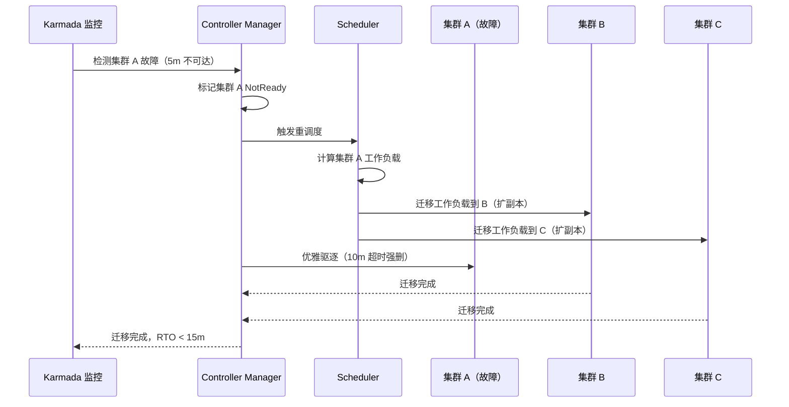

### 5.8 数据联邦：跨集群 Trino/Doris 联邦查询

#### 5.8.1 联邦 Trino

- **联邦 Coordinator**：一个 Trino Coordinator 部署在 Karmada 控制面集群，作为联邦查询入口。
- **集群 Worker**：每个 member 集群部署 Trino Worker，注册到联邦 Coordinator。
- **数据本地性**：查询 Iceberg 表时，Coordinator 根据表元数据定位数据所在集群，将 Task 下推到该集群 Worker 执行，减少跨集群数据传输。
- **跨集群 join**：跨集群 join 时，Coordinator 协调多集群 Worker 交换数据（经 Istio mTLS 加密）。

**跨集群 join 数据量阈值与路由策略（B-07 修复）**：

| join 数据量 | 路由策略 | 性能预期 | 说明 |
| --- | --- | --- | --- |
| < 100MB | 联邦 join（Coordinator 协调跨集群 shuffle） | P95 < 10s | 小数据直接跨集群 shuffle，延迟可接受 |
| 100MB - 1GB | 联邦 join（启用跨集群 broadcast） | P95 < 30s | broadcast 小表到所有集群 Worker，避免 shuffle |
| > 1GB | 数据汇总到单集群再 join | P95 < 60s + 汇总耗时 | 大数据跨集群 shuffle 网络开销过大，先汇总到数据所在集群再本地 join |
| > 10GB | 拒绝联邦 join，提示用户改用 ETL | — | 超大数据量联邦 join 无性能优势，建议 ETL 预汇总 |

**联邦 Trino Coordinator 高可用方案**：
- 多副本部署：联邦 Coordinator 部署 2 副本 + 负载均衡（K8s Service ClusterIP 轮询），避免单点故障。
- Coordinator 无状态：查询状态存 etcd（Trino 410+ 支持），Coordinator 故障后另一副本接管在途查询。
- 资源隔离：联邦 Coordinator 独立资源池（2 副本 × 2CPU/4Gi），不与 member 集群 Worker 争抢资源。

**跨集群查询性能基准（B-07 修复）**：

| 场景 | 集群数 | 数据量 | 网络延迟 | P95 延迟 | 说明 |
| --- | --- | --- | --- | --- | --- |
| 同 region 跨集群 join | 2 | 1GB | ~2ms | < 30s | 同 region 网络延迟低，联邦 join 性能可接受 |
| 跨 region 跨集群 join | 2 | 1GB | ~30-100ms | < 60s | 跨 region 网络延迟高，建议数据汇总到单集群 |
| 同 region 跨集群聚合 | 3 | 10GB | ~2ms | < 45s | 聚合下推到各集群 Worker，仅汇总结果跨集群传输 |
| 跨集群 broadcast join | 2 | 100MB + 1GB | ~2ms | < 15s | 小表 broadcast，避免 shuffle，性能最优 |

**性能论证**：
- 跨集群 join 性能瓶颈在跨集群网络延迟（同 region ~2ms，跨 region ~30-100ms）与数据 shuffle 量。
- V2.0 策略：小数据（<1GB）走联邦 join，大数据（>1GB）走数据汇总到单集群再 join，避免跨集群 shuffle 大数据。
- 联邦 Coordinator 高可用 + 数据本地性下推 + 跨集群 mTLS 加速（Istio EastWest Gateway 复用连接），综合优化联邦查询性能。

#### 5.8.2 联邦 Doris

- **跨集群物化视图**：Doris 物化视图可跨集群定义，查询时自动路由到物化视图所在集群。
- **数据同步**：跨集群 Doris 经 Routine Load / Binlog Load 同步关键表，保证联邦查询一致性。

### 5.9 与 infra-orchestrator 集成

V2.0 infra-orchestrator 扩展为多集群编排，与 Karmada 职责严格切分：

**职责边界切分**：

| 职责维度 | infra-orchestrator（V1.0 L0.5） | Karmada（V2.0 新增） |
| --- | --- | --- |
| 生命周期层级 | 物理生命周期：集群创建/销毁/扩缩容 | 逻辑生命周期：工作负载调度/传播/故障迁移 |
| 管理对象 | SKE K8s 集群（NodePool/StoragePool/NetworkPool 三原语） | Cluster CRD + 工作负载（Deployment/Service/ConfigMap 等） |
| API 边界 | 跨环境供给抽象 REST API（POST /api/v1/clusters 等） | Karmada API（kubectl karmada + PropagationPolicy CRD） |
| 触发方 | 用户/平台运维主动创建集群 | infra-orchestrator 创建集群后自动注册，工作负载按策略传播 |
| 下线流程 | infra-orchestrator 先调 Karmada API 驱逐工作负载，再销毁集群 | Karmada 收到驱逐请求后按 gracefulEvictionTimeout 优雅迁移工作负载 |

**接口契约**：
- **集群创建→注册**：infra-orchestrator 创建 SKE 集群成功后，调用 Karmada API `karmada-agent join` 将集群注册为 Karmada member（Cluster CRD），并打集群 label（region/env/tenant-affinity）。
- **集群下线**：infra-orchestrator 先调 Karmada API `karmada unjoin <cluster>` 触发工作负载优雅驱逐（gracefulEvictionTimeout=10m），驱逐完成后销毁集群物理资源。
- **扩缩容**：infra-orchestrator 扩缩 NodePool（物理节点），Karmada 感知集群容量变化后按 ReplicaSchedulingPolicy 重新平衡工作负载副本分布。

**时序图**：

图：集群创建到下线全链路职责时序图

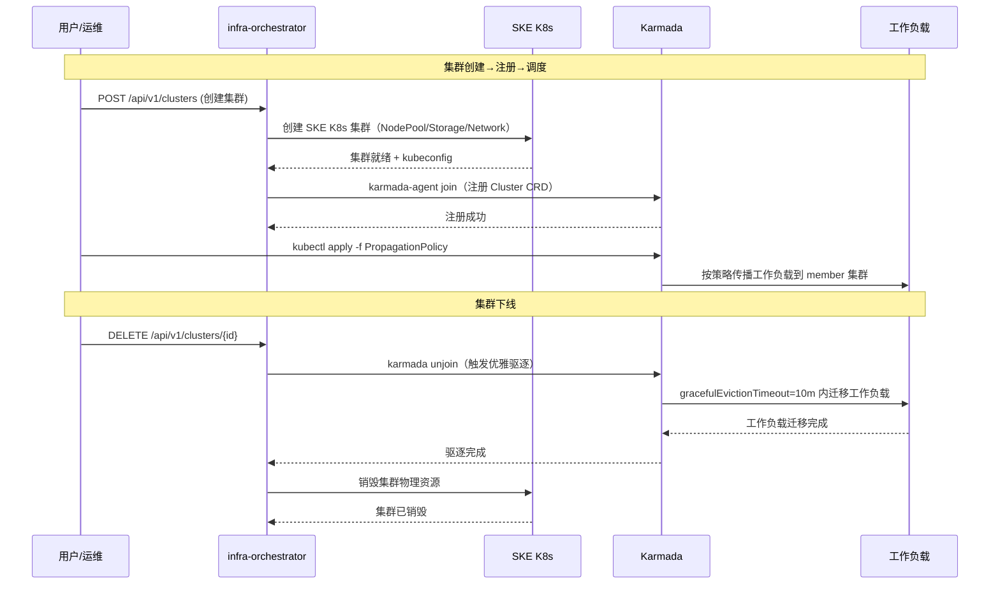

**容量管理**：infra-orchestrator 监控各集群容量，触发 Karmada 跨集群调度。

**环境映射**：dev/staging/prod 环境映射到不同 Karmada member 集群，由 ArgoCD ApplicationSet + Karmada 协同部署。

### 5.10 多租户隔离

表：Karmada 多租户隔离方案表

| 层次 | 机制 | 说明 |
| --- | --- | --- |
| 传播隔离 | PropagationPolicy per-Namespace | 每租户传播策略独立，CRD RBAC 限制操作范围 |
| 集群隔离 | 集群 label + clusterAffinity | 租户可绑定到指定集群（如租户 A 仅部署到 cluster-east），专用集群污点隔离 |
| 副本隔离 | ReplicaSchedulingPolicy per-租户 | 每租户副本配额独立，不可抢占他租户副本配额 |
| 数据隔离 | Iceberg 表路径按集群 + 租户分层 | 数据物理隔离，联邦查询按租户权限路由 |

### 5.11 CRD/API 设计

表：Karmada 核心 CRD 设计表

| CRD | API Group | 职责 | 多租户范围 |
| --- | --- | --- | --- |
| Cluster | cluster.karmada.io/v1alpha1 | member 集群注册 | 全局 |
| ClusterPropagationPolicy | policy.karmada.io/v1alpha1 | 集群级传播策略 | 全局 |
| PropagationPolicy | policy.karmada.io/v1alpha1 | Namespace 级传播策略 | per-Namespace |
| ReplicaSchedulingPolicy | policy.karmada.io/v1alpha1 | 副本调度策略 | 集群级 |
| OverridePolicy | policy.karmada.io/v1alpha1 | 集群差异覆盖 | per-Namespace |
| ResourceBinding | work.karmada.io/v1alpha2 | 资源绑定到集群（系统生成） | 系统级 |

### 5.12 Helm Chart 设计

#### 5.12.1 Chart 结构

```text
design/deploy/charts/karmada/
├── Chart.yaml
├── values.yaml
└── templates/
    ├── deployment-apiserver.yaml
    ├── statefulset-etcd.yaml
    ├── deployment-controller-manager.yaml
    ├── deployment-scheduler.yaml
    ├── deployment-descheduler.yaml
    ├── deployment-agent.yaml
    ├── service.yaml
    ├── configmap.yaml
    ├── hpa.yaml
    ├── pdb.yaml
    └── serviceaccount.yaml
```

#### 5.12.2 部署 values 关键配置

```yaml
# design/deploy/values/karmada-values.yaml
# ============================================================================
# karmada Helm Chart 生产配置 - 数据引擎大数据平台 V2.0
# ============================================================================

# ---- 镜像配置 ----
image:
  repository: "docker.m.daocloud.io/registry.k8s.io/karmada"
  tag: "v1.10.0"
  pullPolicy: IfNotPresent

# ---- 控制面资源 ----
apiserver:
  replicas: 2
  resources:
    requests: { cpu: 1, memory: 2Gi }
    limits: { cpu: 2, memory: 4Gi }

etcd:
  replicas: 3                              # 高可用 etcd
  resources:
    requests: { cpu: 2, memory: 4Gi }
    limits: { cpu: 4, memory: 8Gi }
  persistence:
    storageClass: csi-juicefs
    size: 50Gi

controllerManager:
  replicas: 2
  resources:
    requests: { cpu: 1, memory: 2Gi }
    limits: { cpu: 2, memory: 4Gi }

scheduler:
  replicas: 2
  resources:
    requests: { cpu: 500m, memory: 1Gi }
    limits: { cpu: 1, memory: 2Gi }

# ---- 部署模式 ----
mode: hosted                               # hosted 模式（管理集群）
hostCluster:
  kubeconfig: /etc/karmada/host.kubeconfig

# ---- member 集群 ----
memberClusters:
  - name: cluster-east
    region: east
    kubeconfig: /etc/karmada/cluster-east.kubeconfig
  - name: cluster-west
    region: west
    kubeconfig: /etc/karmada/cluster-west.kubeconfig
  - name: cluster-backup
    region: backup
    kubeconfig: /etc/karmada/cluster-backup.kubeconfig

# ---- 故障迁移 ----
failover:
  timeToLive: 5m                           # 故障检测阈值
  gracefulEvictionTimeout: 10m             # 优雅驱逐超时

# ---- 与 Istio 多集群协同 ----
multiClusterNetwork:
  enabled: true                            # 启用 Istio 多集群网络
  istioEastWestGateway: true               # 东西向网关

# ---- 多环境适配 ----
# 信创：mode=pull（网络隔离 member 自治），镜像走信创仓库
# 公有云：memberClusters 按云账号配置
# 本地：单集群模式（karmada 退化为单集群管理）
```

### 5.13 与 V1.0 现有组件集成方案

表：Karmada 与 V1.0 组件集成方案表

| V1.0 组件 | 集成方式 | 改动点 |
| --- | --- | --- |
| SKE 发行版 | 每个 member 集群是 SKE K8s，Karmada 管理 | 无改动 |
| infra-orchestrator | infra-orchestrator 创建集群后注册到 Karmada | infra-orchestrator 加 Karmada 注册逻辑 |
| 封装层 | 封装层透出"集群管理/故障迁移"概念 | 封装层加多集群管理 API |
| Trino/Doris | 联邦查询路由，Coordinator 在 Karmada 控制面 | 引擎加联邦 Coordinator 配置 |
| Istio | Istio 多集群东西向网关，跨集群 mTLS | Istio 配 EastWest Gateway |
| 可观测基座 | 各集群 Prometheus 经 Thanos 远程写聚合 | Thanos Query 跨集群聚合 |

### 5.14 风险与对策

表：Karmada 风险与对策表

| 风险 | 影响 | 对策 |
| --- | --- | --- |
| Karmada 控制面故障 | 联邦调度不可用 | 控制面多副本 + etcd 高可用 + member 集群自治（Pull 模式） |
| 跨集群网络延迟 | 联邦查询慢 | 数据本地性下推 + 跨集群 join 仅小数据（<1GB 走联邦 join，>1GB 走数据汇总到单集群）+ Istio mTLS 加速 + 联邦 Coordinator 多副本高可用 |
| 故障迁移丢数据 | 迁移时数据不一致 | Iceberg 快照一致性 + 迁移后校验 + 优雅驱逐 |
| 跨集群时钟漂移 | 事务一致性 | NTP 强制同步 + Iceberg 时间戳容忍 |
| 管理复杂度 | 多集群运维成本 | ArgoCD ApplicationSet 模板化 + 封装层屏蔽 |

## 第6章 FinOps

### 6.1 定位与价值

FinOps 是 V2.0 成本管理闭环中枢：以 Kubecost 采集成本指标，按租户/工作空间/任务维度计量，Grafana 可视化成本趋势与优化建议，对接 V1.0 运营后台生成账单与计费。将平台运营从"资源管理"升级为"成本管理"，实现"谁用谁付费、用多少付多少、优化有建议"。

**平台价值**：
- 成本可计量：按租户/工作空间/任务/引擎维度分项计量，成本归因到业务。
- 成本可优化：闲置资源识别、右尺寸建议、Reserved Instance 建议，主动降本。
- 成本可计费：对接运营后台，账单生成→计费→对账闭环。

**客户价值（经封装层透出）**：
- "成本透明"——租户看到本租户成本趋势、资源利用率、优化建议。
- "按量付费"——CPU/内存/存储/网络/GPU 分项计费，套餐折扣。
- "优化建议"——闲置资源、右尺寸、RI 建议，一键采纳。

### 6.2 总体架构

图：FinOps 成本管理闭环架构图

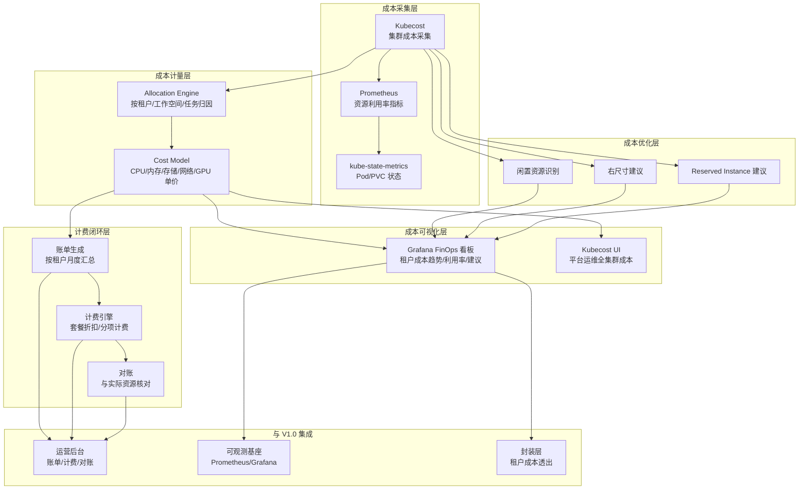

### 6.3 成本采集

#### 6.3.1 Kubecost 采集

Kubecost 部署于 `monitoring` Namespace，从 Prometheus 读取资源指标，结合云定价 API（或自配单价）计算成本：

表：Kubecost 成本采集维度表

| 采集源 | 指标 | 成本维度 |
| --- | --- | --- |
| node-exporter | CPU/内存/磁盘/网络利用率 | 节点成本（按节点规格单价） |
| kube-state-metrics | Pod/PVC/Deployment 状态 | 资源归因到 Pod→Namespace→租户 |
| cAdvisor | 容器 CPU/内存用量 | 容器级成本归因 |
| PVC metrics | 存储用量 | 存储成本（按 StorageClass 单价） |
| 网络流量 | 跨 Namespace/集群流量 | 网络成本（按流量单价） |
| GPU metrics | GPU 利用率 | GPU 成本（按 GPU 单价，高单价） |

#### 6.3.2 按租户/工作空间/任务维度计量

成本归因链路：`Pod → Namespace（=工作空间） → 租户 label → 任务 label`

```yaml
# Kubecost 成本归因配置
# 按 Namespace label 归因到租户
labels:
  tenant: "tenant-id"                      # Namespace label tenant-id
  workspace: "workspace-id"                # Namespace label workspace-id
  task: "task-id"                          # Pod label task-id（作业提交时注入）

# 单价模型（自配，覆盖云定价 API）
prices:
  cpu:
    monthly: 35                            # 每核每月 35 元
  memory:
    monthly: 4                             # 每 Gi 每月 4 元
  storage:
    - class: csi-juicefs
      monthly: 0.5                         # 每 Gi 每月 0.5 元
    - class: csi-ceph
      monthly: 0.3
  network:
    perGB: 0.5                             # 跨集群每 GB 0.5 元
  gpu:
    monthly: 5000                          # 每卡每月 5000 元
```

### 6.4 成本可视化

#### 6.4.1 Grafana FinOps 看板

表：Grafana FinOps 看板设计表

| 看板 | 面板 | 数据源 | 受众 |
| --- | --- | --- | --- |
| 平台运维看板 | 全集群成本总览/各租户成本排名/资源利用率分布 | Kubecost + Prometheus | 平台运维 |
| 租户成本看板 | 本租户成本趋势/分项成本/资源利用率/优化建议 | Kubecost（按 tenant 过滤） | 租户管理员 |
| 工作空间成本看板 | 工作空间成本/任务成本明细 | Kubecost（按 workspace 过滤） | 项目负责人 |
| 优化建议看板 | 闲置资源列表/右尺寸建议/RI 建议 | Kubecost Recommendations | 平台运维 + 租户 |

#### 6.4.2 租户成本看板（经封装层透出）

封装层将 Kubecost/Grafana 看板按租户过滤后透出，租户仅见本租户成本：

```
GET /api/finops/v1/cost/summary?tenantId=acme&period=monthly
→ { total, cpu, memory, storage, network, gpu, trend: [...] }

GET /api/finops/v1/cost/workspace/{wsId}?period=monthly
→ { total, tasks: [{ taskId, cost }] }

GET /api/finops/v1/recommendations?tenantId=acme
→ { idle: [...], rightSizing: [...], ri: [...] }
```

### 6.5 计费模型

#### 6.5.1 分项计费

表：FinOps 分项计费模型表

| 资源项 | 计费单位 | 单价（元/月） | 计费方式 | 采集精度 | 说明 |
| --- | --- | --- | --- | --- | --- |
| CPU | 核·月 | 35 | 按用量 | **分钟级**（Prometheus 30s 采样 → 分钟聚合） | 实际占用核数 × 时长，hourly 账单按分钟累加 |
| 内存 | Gi·月 | 4 | 按用量 | **分钟级** | 实际占用 Gi × 时长 |
| 存储 | Gi·月 | 0.3-0.5 | 按 StorageClass | **小时级**（PVC 用量每小时采集） | JuiceFS 0.5，Ceph 0.3 |
| 网络 | GB | 0.5 | 按跨集群流量 | **5 分钟级**（Cilium Hubble flow 流水） | 集群内免费，跨集群计费（见 §6.5.4） |
| GPU | 卡·月 | 5000 | 按用量 | **分钟级** | 高单价，按需启用 |
| Knative 函数 | 调用次数 + 执行时长（ms） | 0.001 元/次 + 0.0001 元/秒 | 按调用计费 | **事件级**（每次调用即时记录） | 短时任务（<60s）Kubecost 精度不足，按函数级计费（见 §6.5.4） |

**计费精度说明**：
- Kubecost 基于 Prometheus 指标采样（默认 30s 间隔），聚合到**分钟级**精度，无法做到秒级"用多少付多少"。
- 账单查询 `kubecost_pod_cpu_hourly_cost` 为 hourly 粒度，对短时任务（如 Knative 函数执行 10s）计费精度不足。
- V2.0 方案：长时任务（Pod 级）用 Kubecost 分钟级计费；短时任务（Knative 函数级）用自定义函数级计费（按调用次数 + 执行时长，事件级精度）。

#### 6.5.2 套餐折扣

表：FinOps 套餐折扣模型表

| 套餐 | 折扣 | 包含 | 说明 |
| --- | --- | --- | --- |
| 基础版 | 1.0（无折扣） | L0-L5 基础能力 | 按量付费 |
| 企业版 | 0.85（85 折） | 基础 + 云原生增强 | 年付折扣 |
| 旗舰版 | 0.7（7 折） | 企业 + 专属支持 + 大规模 | 年付 + 大客户 |
| Reserved | 0.6（6 折） | 预留资源 1 年 | RI 预留 |

#### 6.5.3 账单生成

```yaml
# 账单生成配置（月度）
billing:
  period: monthly                          # 月度账单
  generateDay: 1                           # 每月 1 日生成
  items:
    - resource: cpu
      query: "sum(kubecost_pod_cpu_hourly_cost * on(namespace) group_left(tenant) label_replace)"
    - resource: memory
      query: "sum(kubecost_pod_memory_hourly_cost * on(namespace) group_left(tenant) label_replace)"
    - resource: storage
      query: "sum(kubecost_pvc_hourly_cost)"
    - resource: network
      query: "sum(kubecost_network_cross_zone_cost)"
    - resource: gpu
      query: "sum(kubecost_gpu_hourly_cost)"
  discount:
    type: package                          # 套餐折扣
    rate: 0.85                             # 企业版 85 折
```

#### 6.5.4 跨集群网络计费与函数级计费（B-06 修复）

**跨集群网络计费方案**：
Kubecost 原生不支持跨集群网络计费，V2.0 自定义 Cilium Hubble flow exporter 采集跨集群流量：

```yaml
配置：跨集群网络流量采集（YAML）
# Cilium Hubble flow exporter，采集跨集群（跨 Node）流量
hubble:
  enabled: true
  metrics:
    enabled:
      - "flow:toFQDNs"                    # 按目标 FQDN 聚合
      - "flow:toNamespace"                # 按目标 Namespace 聚合
      - "flow:toCluster"                  # 跨集群流量（Karmada member 间）
  export:
    crossClusterOnly: true                # 仅采集跨集群流量（集群内免费不计费）
    interval: 5m                          # 5 分钟聚合一次
```

跨集群流量计费公式：`费用 = sum(hubble_flow_bytes{fromCluster, toCluster, tenant} / 1GB) × 0.5 元/GB`，按租户 label 归因，月度汇总入账单。

**Knative 函数级计费方案**：
Knative 函数短时任务（<60s）用 Kubecost 分钟级精度不足，V2.0 自定义函数级计费：

```yaml
配置：Knative 函数级计费（YAML）
# 按 Knative Service 采集调用次数 + 执行时长
functionBilling:
  enabled: true
  metrics:
    - name: knative_invocation_count      # 调用次数（事件级，每次调用即时记录）
      query: "sum(increase(knative_request_count{namespace,revision}[$interval]))"
    - name: knative_execution_duration_ms # 执行时长（ms）
      query: "sum(knative_request_duration_milliseconds{namespace,revision})"
  pricing:
    perInvocation: 0.001                  # 每次调用 0.001 元
    perExecutionSecond: 0.0001            # 每秒执行 0.0001 元
```

函数级计费公式：`费用 = 调用次数 × 0.001 + 执行时长(秒) × 0.0001`，按租户 KSvc 归因，月度汇总入账单，与 Kubecost Pod 级计费互补（函数用函数级，长时服务用 Pod 级）。

### 6.6 成本优化建议

#### 6.6.1 闲置资源识别

Kubecost 识别闲置资源：

表：闲置资源识别规则表

| 资源类型 | 识别规则 | 建议 |
| --- | --- | --- |
| 闲置 Pod | CPU 利用率 < 1% 持续 7 天 | 建议删除 |
| 闲置 PVC | 未被 Pod 挂载持续 30 天 | 建议归档或删除 |
| 闲置 Namespace | 无活跃 Pod 持续 30 天 | 建议回收 |
| 过大 Request | Request 远大于实际用量（>3x） | 建议降低 Request |

#### 6.6.2 右尺寸建议

Kubecost 基于历史用量建议调整 Request/Limit：

```yaml
# 右尺寸建议示例
recommendation:
  type: rightSizing
  target: { namespace: ws-acme, deployment: trino-worker }
  current: { cpuRequest: 4, memoryRequest: 8Gi }
  recommended: { cpuRequest: 2, memoryRequest: 4Gi }
  savings: { monthly: 280 }                # 每月节省 280 元
  reason: "实际用量 P95: CPU 1.8 核, 内存 3.5Gi"
```

#### 6.6.3 Reserved Instance 建议

Kubecost 基于稳定用量建议预留资源（RI）：

```yaml
# RI 建议示例
recommendation:
  type: reservedInstance
  target: { tenant: acme, resource: cpu }
  current: { onDemand: 50, reserved: 0 }
  recommended: { onDemand: 10, reserved: 40 }
  savings: { monthly: 700 }                # 每月节省 700 元
  reason: "稳定用量 40 核，RI 6 折 vs OnDemand"
```

### 6.7 与运营后台集成

图：FinOps 与运营后台集成流程图

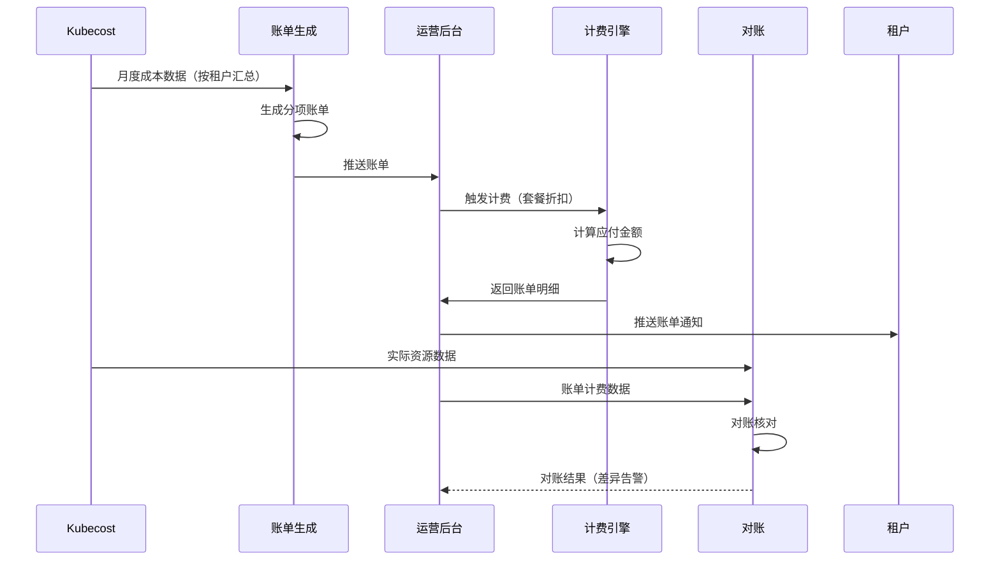

集成设计：
- **账单生成**：Kubecost 月度成本数据 → 账单生成器 → 运营后台账单表。
- **计费引擎**：运营后台按套餐折扣计算应付金额，对接支付系统。
- **对账**：实际资源用量与账单计费核对，差异告警。

### 6.8 多租户隔离

表：FinOps 多租户隔离方案表

| 层次 | 机制 | 说明 |
| --- | --- | --- |
| 数据隔离 | 成本指标按 tenant label 隔离 | Prometheus 指标按 `tenant=<tid>` label，租户仅查本租户成本 |
| 看板隔离 | Grafana 看板按 tenant 过滤 | 封装层透出的看板按 tenantId 过滤，租户不可见他租户成本 |
| 单价隔离 | 单价模型平台统一管 | 租户不可改单价，仅平台运维可配 |
| 账单隔离 | 账单按租户独立生成 | 每租户独立账单，不可见他租户账单 |

### 6.9 CRD/API 设计

表：FinOps 封装层 API 契约表

| 能力 | 端点 | 请求 | 响应 |
| --- | --- | --- | --- |
| 成本汇总 | `GET /cost/summary` | `{ tenantId, period }` | `{ total, cpu, memory, storage, network, gpu, trend }` |
| 工作空间成本 | `GET /cost/workspace/{wsId}` | `{ period }` | `{ total, tasks: [{ taskId, cost }] }` |
| 优化建议 | `GET /recommendations` | `{ tenantId, type? }` | `{ idle: [...], rightSizing: [...], ri: [...] }` |
| 账单查询 | `GET /billing/invoices` | `{ tenantId, period }` | `{ invoices: [{ id, total, items, discount }] }` |
| 单价配置 | `PUT /pricing` | `{ cpu, memory, storage, ... }` | `{ status }`（仅平台） |
| 套餐配置 | `PUT /packages/{tenantId}` | `{ package, discount }` | `{ status }`（仅平台） |

### 6.10 Helm Chart 设计

#### 6.10.1 Chart 结构

```text
design/deploy/charts/kubecost/
├── Chart.yaml
├── values.yaml
└── templates/
    ├── deployment-cost-analyzer.yaml
    ├── deployment-frontend.yaml
    ├── service.yaml
    ├── configmap.yaml
    ├── networkpolicy.yaml
    ├── prometheus-servicemonitor.yaml
    ├── pvc.yaml
    └── serviceaccount.yaml
```

#### 6.10.2 部署 values 关键配置

```yaml
# design/deploy/values/kubecost-values.yaml
# ============================================================================
# kubecost Helm Chart 生产配置 - 数据引擎大数据平台 V2.0
# ============================================================================

# ---- 镜像配置 ----
image:
  repository: "docker.m.daocloud.io/ghcr.io/kubecost/cost-analyzer"
  tag: "1.108.0"
  pullPolicy: IfNotPresent

# ---- 资源配额 ----
resources:
  requests: { cpu: 500m, memory: 512Mi }
  limits: { cpu: 1, memory: 2Gi }

# ---- Prometheus 数据源（复用 V1.0）----
prometheus:
  fqdn: "http://prometheus.monitoring:9090"  # 复用 V1.0 Prometheus
  enabled: false                              # 不启用内置 Prometheus

# ---- 成本归因配置 ----
labelMapping:
  tenant: "tenant-id"                         # Namespace label → 租户
  workspace: "workspace-id"                   # Namespace label → 工作空间
  task: "task-id"                             # Pod label → 任务

# ---- 单价模型（自配，覆盖云定价）----
pricing:
  cpu: { monthly: 35 }
  memory: { monthly: 4 }
  storage:
    - class: csi-juicefs
      monthly: 0.5
    - class: csi-ceph
      monthly: 0.3
  network: { perGB: 0.5 }
  gpu: { monthly: 5000 }

# ---- 套餐折扣 ----
packages:
  basic: { discount: 1.0 }
  enterprise: { discount: 0.85 }
  flagship: { discount: 0.7 }
  reserved: { discount: 0.6 }

# ---- 账单生成 ----
billing:
  period: monthly
  generateDay: 1
  exportTo: operations-backend                # 对接 V1.0 运营后台

# ---- 优化建议 ----
recommendations:
  idle:
    cpuThreshold: 0.01                        # CPU < 1% 识别为闲置
    durationDays: 7
  rightSizing:
    overRequestRatio: 3                       # Request > 3x 实际用量建议降
  reservedInstance:
    stableUsageDays: 30                       # 稳定 30 天建议 RI

# ---- 多租户隔离 ----
networkPolicy:
  enabled: true                               # NetworkPolicy 隔离
  allowNamespaces: [monitoring, operations]   # 仅允许监控/运营访问

# ---- 多环境适配 ----
# 信创：镜像走信创仓库，单价按信创硬件成本
# 公有云：单价可用云定价 API（但保持自配覆盖，避免锁云）
# 本地：单价按本地硬件折旧
```

**Kubecost 许可合规与多租户功能声明（C-06 修复）**：

**版本选择理由（C-10 修复）**：
- V2.0 锁定 **Kubecost 1.108.0**（2024 Q2 稳定版），选择理由：(1) 支持 K8s 1.29+（与 SKE K8s 1.30 基线对齐），(2) 社区版 Apache 2.0 许可稳定，(3) 已验证与 Prometheus 2.x + Thanos 兼容，(4) 多集群 Aggregator 接口稳定。
- 升级路径：Kubecost 社区版遵循语义化版本，V2.0 运行时若 Kubecost 发布新稳定版（如 1.110+），经 staging 环境验证 Prometheus 兼容性后通过 ArgoCD Application 滚动升级；OpenCost（Kubecost 开源 fork）作为 V2.1 评估备选，避免品牌锁定。

**许可合规声明**：
- V2.0 使用 **Kubecost 社区版 1.108.0**（Apache 2.0 开源许可），不依赖 Kubecost 企业版（闭源，按节点数收费）。
- Kubecost 社区版 Apache 2.0 许可允许商业使用、修改、分发，无闭源依赖风险，满足等保合规与采购合规要求。
- 备选方案：**OpenCost**（Kubecost 开源 fork，Apache 2.0，由 Kubecost 团队维护），与 Kubecost 社区版功能相同，可作为完全替代避免 Kubecost 品牌依赖。V2.0 优先用 Kubecost 社区版（生态成熟），OpenCost 作为 V2.1 评估备选。

**多租户功能风险与对策**：
- **风险**：Kubecost 社区版不支持企业版的 label 级成本归因（按 tenant label 分项计量）、Saved Report、多集群聚合等高级功能，§6.4.2"租户成本看板（按 tenant 过滤）"可能无法直接用 Kubecost 社区版实现。
- **对策**：V2.0 采用 **Kubecost 社区版 + 自研成本归因** 混合方案：
  1. **Kubecost 社区版**：采集集群级成本指标（`kubecost_pod_cpu_hourly_cost` 等），提供基础成本数据。
  2. **自研 CostModel**：基于 Prometheus 指标 + Namespace label（tenant-id/workspace-id/task-id）自研成本归因，按租户/工作空间/任务维度聚合，补齐 Kubecost 社区版缺失的 label 级归因能力。
  3. **封装层透出**：租户成本看板经封装层按 tenantId 过滤后透出，不依赖 Kubecost 企业版 Saved Report。

```yaml
配置：自研成本归因 CostModel（YAML）
# 补齐 Kubecost 社区版缺失的 label 级成本归因
customCostModel:
  enabled: true
  # 按 Namespace label (tenant-id) 归因到租户
  tenantAllocation:
    query: |
      sum by (tenant) (
        label_replace(
          kubecost_pod_cpu_hourly_cost * on(namespace) group_left(tenant) label_replace(
            kube_namespace_labels,
            "tenant", "$1", "label_tenant_id", "(.+)"
          )
        )
      )
  # 按 Pod label (task-id) 归因到任务
  taskAllocation:
    query: |
      sum by (tenant, task) (
        label_replace(
          kubecost_pod_cpu_hourly_cost * on(namespace, pod) group_left(task) label_replace(
            kube_pod_labels,
            "task", "$1", "label_task_id", "(.+)"
          )
        )
      )
```

### 6.11 与 V1.0 现有组件集成方案

表：FinOps 与 V1.0 组件集成方案表

| V1.0 组件 | 集成方式 | 改动点 |
| --- | --- | --- |
| 可观测基座 | Kubecost 复用 V1.0 Prometheus，不建独立 Prometheus | Kubecost 配 Prometheus FQDN |
| Grafana | FinOps 看板导入 V1.0 Grafana，按租户过滤 | Grafana 加 FinOps 看板 |
| 运营后台 | 账单生成对接运营后台账单表，计费/对账闭环 | 运营后台加 FinOps 账单接口 |
| 封装层 | 封装层透出"成本看板/账单/优化建议"概念 | 封装层加 FinOps API |
| 弹性调度 | KEDA/HPA 伸缩记录 task-id label，成本归因到任务 | 伸缩时注入 task-id label |
| DolphinScheduler | DS 任务提交时注入 task-id label，成本归因到作业 | DS 加 label 注入 |

### 6.12 风险与对策

表：FinOps 风险与对策表

| 风险 | 影响 | 对策 |
| --- | --- | --- |
| 成本归因不准 | 账单与实际不符，租户投诉 | 多维度归因 + 对账核对 + 差异告警 |
| Kubecost 资源开销 | 采集占用资源 | 资源配额 + 复用 V1.0 Prometheus（不建独立） |
| 单价配置错误 | 账单金额错误 | 单价平台统一管 + 变更审批 + 对账兜底 |
| 闲置资源误删 | 误判闲置导致业务受影响 | 建议需人工确认 + 保留期 + 回收站 |
| 跨集群成本归因 | 多集群成本汇总复杂 | Karmada + Thanos 跨集群聚合 + 按集群分账 |

## 第7章 集成与部署

### 7.1 全模块集成架构

图：V2.0 云原生增强全模块集成架构图

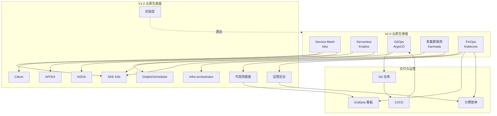

### 7.2 部署顺序与依赖

表：V2.0 模块部署顺序与依赖表

| 顺序 | 模块 | 依赖 | namespace | 说明 |
| --- | --- | --- | --- | --- |
| 1 | istio-base | 无 | istio-system | CRD 先装 |
| 2 | istiod | istio-base | istio-system | 控制面 |
| 3 | istio-gateway | istio-base | istio-system | Ingress/Egress Gateway |
| 4 | knative-serving | istio-base | knative-serving | 依赖 Istio 做 KSvc 入口 |
| 5 | knative-eventing | knative-serving | knative-eventing | 事件驱动 |
| 6 | argocd | 无 | argocd | 独立部署 |
| 7 | karmada | 无 | karmada-system | 独立部署（多集群场景） |
| 8 | kubecost | V1.0 Prometheus | monitoring | 复用可观测基座 |

### 7.3 多环境适配

表：V2.0 模块多环境适配表

| 模块 | 信创环境 | 本地数据中心 | 公有云 | 私有云 |
| --- | --- | --- | --- | --- |
| Istio | 国产镜像 + WASM 国密 | 标准镜像 | 标准镜像 | 标准镜像 |
| Knative | 国产镜像 | 标准镜像 | 标准镜像 | 标准镜像 |
| ArgoCD | 离线 Git 仓库 + 国产镜像 | 标准 Git | 标准 Git | 标准 Git |
| Karmada | Pull 模式（网络隔离） | 单集群退化 | Hosted + Push | Hosted + Push |
| Kubecost | 单价按信创硬件折旧 | 单价按本地硬件 | 单价自配（避免锁云） | 单价按私有云成本 |

### 7.3.1 版本兼容矩阵

V2.0 选定 Istio 1.20.3 + Knative 1.12 + Karmada 1.10 + ArgoCD 2.11，SKE K8s 基线为 **1.30**。以下矩阵已验证四组件与 K8s/Istio/Kafka 的兼容性。

表：V2.0 云原生增强组件版本兼容矩阵表

| 组件 | 版本 | K8s 兼容范围 | Istio 兼容范围 | Knative 兼容范围 | Karmada 兼容范围 | ArgoCD 兼容范围 | Kafka 兼容范围 | 验证状态 |
| --- | --- | --- | --- | --- | --- | --- | --- | --- |
| SKE K8s | **1.30** | — | 1.20.3 ✅ | 1.12 ✅ | 1.10 ✅ | 2.11 ✅ | 3.6 KRaft ✅ | 基线版本 |
| Istio | 1.20.3 | 1.27-1.30 | — | Knative 1.12 依赖 Istio 1.16-1.20，1.20.3 在测试矩阵内 ✅ | EastWest Gateway 兼容 ✅ | 不直接依赖 | 不直接依赖 | ✅ 已验证 |
| Knative Serving | 1.12 | 1.27-1.30 | 1.16-1.20 | — | 不直接依赖 | 不直接依赖 | 不直接依赖 | ✅ 已验证 |
| Knative Eventing | 1.12 | 1.27-1.30 | 1.16-1.20 | — | 不直接依赖 | 不直接依赖 | KafkaSource 需 Kafka 3.0+，KRaft 需 3.3+，3.6 满足 ✅ | ✅ 已验证（KRaft 需自定义 `config-kafka-broker` ConfigMap） |
| Karmada | 1.10 | 1.27-1.30 | 支持 Istio 多集群 EastWest | 不直接依赖 | — | 不直接依赖 | 不直接依赖 | ✅ 已验证 |
| ArgoCD | 2.11 | 1.27+（要求） | 不直接依赖 | 不直接依赖 | 不直接依赖 | — | 不直接依赖 | ✅ 已验证 |
| Kafka | 3.6 KRaft（V1.0 复用） | 1.27+ | 不直接依赖 | Knative Eventing 1.12 KafkaSource ✅ | 不直接依赖 | 不直接依赖 | — | ✅ 已验证 |

**Knative Eventing + Kafka 3.6 KRaft Broker 后端配置**：
Knative Eventing 1.12 的 Kafka Broker 后端默认配置基于 ZooKeeper，KRaft 模式需自定义 `config-kafka-broker` ConfigMap：

```yaml
配置：Knative Kafka Broker KRaft 模式配置（YAML）
apiVersion: v1
kind: ConfigMap
metadata:
  name: config-kafka-broker
  namespace: knative-eventing
data:
  bootstrap.servers: "kafka-bootstrap.kafka:9092"   # KRaft 模式直连 Broker，无 ZooKeeper
  default.topic.partitions: "10"
  default.topic.replication.factor: "3"
  # KRaft 模式无需 zookeeper.connect 配置
```

### 7.4 渐进式启用

V2.0 模块支持渐进式启用，不启用时退化为 V1.0 行为：

```yaml
# design/deploy/values/v2-enhancements.yaml
# ============================================================================
# V2.0 云原生增强总开关 - 数据引擎大数据平台
# ============================================================================

v2Enhancements:
  serviceMesh:
    enabled: true                           # Service Mesh 开关
    sidecarInjection: selective             # 选择性注入
  serverless:
    enabled: true                           # Serverless 开关
    scaleToZero: true                       # 从 0 伸缩
  gitops:
    enabled: true                           # GitOps 开关
    replaceBootstrap: true                  # 替代 bootstrap.sh
  multiCluster:
    enabled: false                          # 多集群开关（单集群场景关闭）
    memberClusters: []
  finops:
    enabled: true                           # FinOps 开关
    billing: true                           # 计费闭环
```

### 7.5 监控与告警

表：V2.0 增强模块监控告警表

| 模块 | 关键指标 | 告警阈值 |
| --- | --- | --- |
| Istio | istio_requests_total 5xx 率、istio_request_duration P99 | 5xx 率 > 5%，P99 > 1s |
| Knative | knative_revision_count、冷启延迟 | 冷启 > 5s |
| ArgoCD | argocd_app_sync_status、同步失败 | 同步失败 > 0 |
| Karmada | 集群健康状态、迁移次数 | 集群 NotReady > 5m |
| FinOps | 成本异常增长、闲置资源数 | 成本环比 > 20% |

### 7.6 安全合规

表：V2.0 增强模块安全合规表

| 安全维度 | Istio | Knative | ArgoCD | Karmada | FinOps |
| --- | --- | --- | --- | --- | --- |
| 传输加密 | mTLS（含国密 SM4） | KSvc 间 mTLS | OIDC + TLS | 跨集群 mTLS | TLS |
| 身份鉴权 | 服务身份（SPIFFE） | KSvc RBAC | OIDC + RBAC | 集群身份 | RBAC |
| 多租户隔离 | Namespace + Sidecar | Namespace + ResourceQuota | AppProject | PropagationPolicy | tenant label |
| 审计 | 访问日志 | 函数调用日志 | 同步日志 | 调度日志 | 账单审计 |
| 等保三级 | mTLS 满足传输加密 | - | - | - | - |

### 7.7 容量规划

表：V2.0 增强模块控制面资源规划表

| 模块 | 控制面资源（中型集群） | 数据面开销（per 租户） | 说明 |
| --- | --- | --- | --- |
| Istio | 2 副本 × 1CPU/1Gi | 100m/128Mi（Sidecar） | Sidecar 按租户服务数累计 |
| Knative | 2 副本 × 500m/512Mi | 按函数实例 | 函数从 0 起，按需 |
| ArgoCD | 2 副本 × 1CPU/1Gi | 无数据面 | 仅控制面 |
| Karmada | 2 副本 × 1CPU/2Gi + 3 etcd | 无数据面 | 仅控制面 |
| Kubecost | 1 副本 × 500m/512Mi | 无数据面 | 复用 V1.0 Prometheus |

**大规模租户 Sidecar 资源开销估算（B-08 修复）**：

每租户 Sidecar 默认 100m/128Mi，按租户服务数累计。假设每租户 10 个服务（Sidecar per Pod），不同规模租户场景资源开销：

表：大规模租户 Sidecar 资源开销估算表

| 租户数 | 每租户服务数 | Sidecar 总数 | CPU 累计 | 内存累计 | 占中型集群（100 核/256Gi）比例 | 应对策略 |
| --- | --- | --- | --- | --- | --- | --- |
| 100 | 10 | 1000 | 100 核 | 128 Gi | 50% CPU / 50% 内存 | LimitRange + 按需注入（默认策略） |
| 500 | 10 | 5000 | 500 核 | 640 Gi | 500% CPU（超集群容量） | 按需注入 + Sidecar egress 范围约束 + 评估 Ambient Mesh |
| 1000 | 10 | 10000 | 1000 核 | 1280 Gi | 1000% CPU（严重超容量） | **必须演进到 Ambient Mesh**（ztunnel 节点级，无 per-Pod Sidecar） |

**资源开销优化策略**：
1. **按需注入**（V2.0 默认）：仅引擎服务与租户工作空间服务注入 Sidecar，平台基础设施（kube-system/monitoring/argocd）不注入，减少 ~30% Sidecar 数量。
2. **Sidecar egress 范围约束**（V2.0 默认）：通过 Sidecar CRD 限制 egress 监听的服务集合，降低 Envoy 配置大小与内存占用（~40% 内存优化）。
3. **Ambient Mesh 演进**（V2.1）：Istio 1.20+ Ambient Mesh（ztunnel + waypoint）将 per-Pod Sidecar 改为 per-Node ztunnel，Sidecar 资源开销降低 70%+，1000 租户场景下 ztunnel 仅需 ~10 核/10Gi（按节点数而非 Pod 数），是大规模租户场景的降本路径（见 §7.9）。

### 7.8 与 V1.0 一致性保证

V2.0 增强模块遵循 V1.0 全部约束：

1. **四环境一致**：所有模块同一套 Helm Chart，差异收敛到 values + Profile。
2. **三重隔离**：所有模块遵循 Namespace + ResourceQuota + NetworkPolicy 隔离。
3. **封装层透出**：所有模块能力经封装层翻译为客户概念，不暴露 CRD 细节。
4. **可观测复用**：所有模块指标/日志/链路接入 V1.0 可观测基座，不重复建库。
5. **国产化适配**：所有模块镜像可同步信创仓库，支持国产 CPU 架构。

### 7.9 后续演进

表：V2.0 后续演进路线表

| 阶段 | 能力 | 说明 |
| --- | --- | --- |
| V2.1 | Istio 多集群网格 | 跨集群服务网格，东西向 mTLS 跨集群 |
| V2.1 | **Istio Ambient Mesh 评估** | **无 Sidecar 模式（ztunnel + waypoint），降低 Sidecar 资源开销 70%+，规避 GPU Pod Sidecar 注入冲突（C-dep4 方案二），大规模租户场景降本路径** |
| V2.1 | Knative Eventing 更多源 | 新增 GitHub/PromAlert/自定义事件源 |
| V2.1 | ArgoCD Rollout 高级发布 | 蓝绿/金丝雀/分析门控发布 |
| V2.2 | Karmada 跨集群存储联邦 | 跨集群 Iceberg 表联邦 |
| V2.2 | FinOps 自动优化 | 闲置资源自动回收 + 右尺寸自动应用 |
| V2.3 | AI 驱动容量规划 | 基于历史用量 AI 预测容量需求 |

## 8. 术语表

表：V2.0 云原生增强术语表

| 术语 | 全称 | 说明 |
| --- | --- | --- |
| Service Mesh | 服务网格 | 服务间通信治理基础设施 |
| Sidecar | 边车代理 | 与业务 Pod 共部署的代理（Envoy） |
| mTLS | mutual TLS | 双向 TLS 加密通信 |
| Serverless | 无服务器 | 按需执行、从 0 伸缩的函数计算 |
| KSvc | Knative Service | Knative 函数服务抽象 |
| KPA | Knative Pod Autoscaler | Knative Pod 自动伸缩器 |
| GitOps | Git 驱动运维 | 以 Git 为声明源的持续交付 |
| AppProject | ArgoCD Project | ArgoCD 多租户隔离 Project |
| ApplicationSet | ArgoCD 应用集 | ArgoCD 多环境/多集群模板 |
| Karmada | Kubernetes Federation | 多集群联邦管理 |
| PropagationPolicy | 传播策略 | Karmada 资源传播到集群的策略 |
| FinOps | Financial Operations | 云成本管理与优化实践 |
| Kiali | Istio 可观测 UI | Istio 服务拓扑可视化 |
| Jaeger | 分布式追踪 | 全链路追踪系统 |
| WASM | WebAssembly | Envoy 扩展机制（国密插件） |
| ESO | External Secrets Operator | 外部 Secret 管理 operator |
| RI | Reserved Instance | 预留资源（折扣计费） |