# V2.0 数据联邦与实时数仓 · 详细设计

> 归属：数擎大数据平台 · V2.0 · L2 大数据引擎层 + L3 数据治理层增强
> 对标：Starburst联邦查询 / Databricks Delta Live Tables / 阿里 Hologres+MaxCompute 流批一体 / DataWorks 实时治理
> 适用套餐：标准版、旗舰版（基础版仅含跨源联邦查询子集，对齐 §11.5.1 套餐矩阵）
> 关联：V1.0 L2.7 统一 SQL 网关（联邦优化宿主）；L2.1 统一存储 Iceberg（流批一体底座）；L2.3 Flink（CDC 实时入仓）；L2.4 Trino（联邦执行器）；L2.5 Doris（实时 OLAP）；L2.8 Kafka（治理事件总线）；L3.1~L3.4 治理中台（实时治理对象）；L0.5 跨环境供给抽象（跨集群联邦底座）；L0.11 封装层（多集群注册与路由）

## 0. 文档导航

| 章节 | 主题 | 关键能力 |
| --- | --- | --- |
| 第 1 章 | 跨源联邦查询增强 | Calcite 联邦优化器、谓词/投影/Join/聚合下推、CBO、查询缓存 |
| 第 2 章 | 跨集群联邦查询 | 多 K8s 集群注册、Karmada 调度、数据不动查询动、故障转移 |
| 第 3 章 | 数据虚拟化 | 虚拟表、查询重写、热数据物化、资产目录逻辑资产 |
| 第 4 章 | 实时入仓 Flink CDC → Iceberg V2 | 行级 UPSERT、MERGE INTO、Schema 演进、Exactly-Once |
| 第 5 章 | 流批一体 | 同表流批共存、Event Time 统一、Snapshot 版本管理 |
| 第 6 章 | 实时 OLAP Doris 物化视图 | 自动同步、增量刷新、透明路由、多租户隔离 |
| 第 7 章 | 实时治理 | 元数据/血缘/质量秒级闭环、Kafka 事件总线、自动阻断 |
| 第 8 章 | 端到端集成与演进 | SLA 总览、风险对策、演进路线 |

## 1. V2.0 总览

### 1.1 设计目标

V1.0 已具备"湖仓集一体"基础能力：sql-gateway 做简单路由、Iceberg 统一存储、Spark 批 + Flink 流、Trino 交互、Doris OLAP、Kafka 消息流。V2.0 在此基础上增强**联邦查询智能化**与**实时数仓秒级闭环**两大主线，目标如下：

1. **联邦查询从"路由"升级为"智能优化"**：V1.0 sql-gateway 仅按规则选引擎，V2.0 引入完整 Calcite 联邦优化器，实现谓词/投影/Join/聚合下推 + CBO 最优计划选择，跨源查询时延下降 50%+。
2. **跨集群联邦"数据不动查询动"**：多 K8s 集群注册管理，按数据位置与负载路由查询，借助 Karmada 调度策略实现跨集群 Shuffle Join，单集群故障自动转移。
3. **数据虚拟化屏蔽物理存储**：虚拟表对查询用户透明，热数据自动物化、冷数据按需查询，与资产目录集成作为逻辑资产。
4. **实时入仓从"分钟级"降至"秒级"**：Flink CDC 直写 Iceberg V2 表，行级 UPSERT + MERGE INTO 语义，Schema 演进自动同步，Exactly-Once 保障。
5. **流批一体同表共存**：同一 Iceberg 表同时支撑 Spark 批处理与 Flink 流处理，Event Time 与 Watermark 统一，Snapshot 版本统一管理。
6. **实时 OLAP 毫秒级查询**：Doris 物化视图自动同步 Iceberg 变更，定时/触发/增量三种刷新策略，查询透明路由至物化视图。
7. **实时治理秒级闭环**：元数据/血缘/质量从分钟级降至秒级，Kafka 作为治理事件总线，质量不达标可自动阻断下游。

### 1.2 V2.0 总体架构

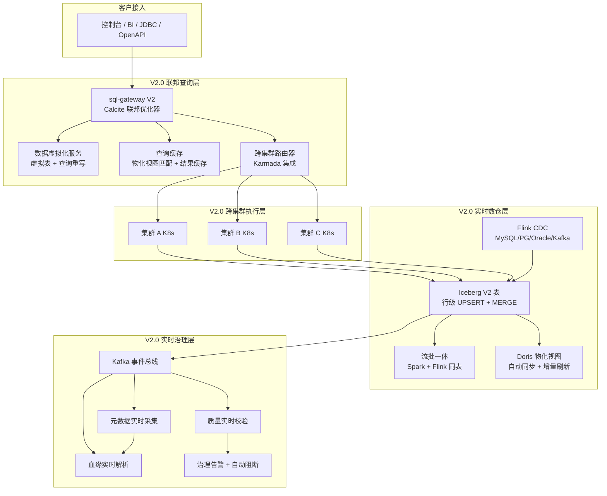

### 1.3 V1.0 → V2.0 演进对照

表：V1.0 → V2.0 能力演进对照表

| 维度 | V1.0 能力 | V2.0 增强 | 演进价值 |
| --- | --- | --- | --- |
| SQL 网关 | ANTLR4 解析 + 简单路由 + Calcite 基础优化 | 完整 Calcite 联邦优化器 + 谓词/投影/Join/聚合下推 + CBO | 跨源查询时延下降 50%+，数据扫描量下降 70%+ |
| 跨源 Join | Trino 内存 Join 为主 | 内存/Broadcast/Shuffle 三策略自动选择 | 大表跨源 Join 不再 OOM，TB 级可跑 |
| 集群范围 | 单 K8s 集群 | 多 K8s 集群注册 + Karmada 调度 | 跨数据中心查询，数据不动查询动 |
| 数据抽象 | 物理表直查 | 虚拟表 + 查询重写 + 自动物化 | 屏蔽物理存储，热数据自动加速 |
| 实时入仓 | Flink CDC → Iceberg V1（仅 Append） | Flink CDC → Iceberg V2（行级 UPSERT + MERGE INTO） | 支持更新删除，Changelog 查询 |
| 流批关系 | 流批分离，各自独立作业 | 同一 Iceberg 表流批共存，Event Time 统一 | 一份数据两套计算，结果一致 |
| OLAP 加速 | Doris 物化视图手动建 + 手动刷新 | Iceberg 变更自动触发物化视图增量刷新 | 物化视图新鲜度从小时级降至秒级 |
| 治理闭环 | 分钟级（定时采集 + 批量校验） | 秒级（事件驱动 + 流式校验） | 质量问题秒级发现，可自动阻断 |

### 1.4 与 V1.0 现有组件的关系

V2.0 不推翻 V1.0，而是在 V1.0 组件上**增强 + 扩展**：

- **sql-gateway**：从"ANTLR4 + 简单路由"升级为"ANTLR4 + 完整 Calcite 联邦优化器 + 跨集群路由 + 虚拟表重写 + 查询缓存"，对外 API 保持 `/api/sql/v1/query` 兼容，新增 `/api/v2/federation/*` 与 `/api/v2/unified-tables`。
- **Iceberg**：从 V1 表格式升级到 V2 表格式（行级删除 + upsert），REST Catalog 不变。
- **Flink**：CDC 连接器从 V1 的"Append Only"扩展为"Changelog 流 + Iceberg V2 Sink"，作业提交方式不变。
- **Trino**：作为联邦执行器，新增跨集群 Connector 与虚拟表 Connector。
- **Doris**：物化视图从手动刷新升级为自动监听 Iceberg Snapshot 事件增量刷新。
- **Kafka**：从业务消息流扩展为同时承载治理事件总线。
- **治理中台**：从定时采集扩展为事件驱动 + 流式校验。

---

## 2. 跨源联邦查询增强

### 2.1 模块定位

V1.0 sql-gateway 的 Calcite 仅做基础下推（投影 + 简单过滤），跨源 Join 一律走 Trino 内存 Join，大表跨源查询性能差。V2.0 引入**完整 Calcite 联邦优化器**，实现四类下推 + CBO 最优计划选择 + 三种 Join 策略 + 查询缓存，跨源查询性能对齐 Starburst 联邦引擎。

### 2.2 总体架构

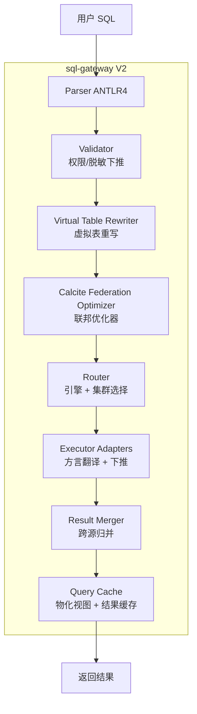

图：sql-gateway V2 联邦查询流程图

### 2.3 Calcite 联邦优化器

#### 2.3.1 优化器架构

Calcite 联邦优化器基于 Apache Calcite 的 `VolcanoPlanner` + 自研联邦规则集，将逻辑计划转化为物理计划，核心流程如下：

```mermaid
sequenceDiagram
    participant SQL as 用户 SQL
    participant PAR as Parser
    participant VAL as Validator
    participant CAT as Catalog
    participant VOL as VolcanoPlanner
    participant RUL as 联邦规则集
    participant STA as 统计信息
    participant PHY as 物理计划

    SQL->>PAR: 解析为 AST
    PAR->>VAL: 校验 + 权限/脱敏注入
    VAL->>CAT: 获取涉及表的 Schema + 统计
    CAT-->>VAL: 返回元数据
    VAL->>VOL: 构造 RelNode 逻辑计划
    VOL->>STA: 请求行数/选择率/列基数
    STA-->>VOL: 返回统计
    VOL->>RUL: 应用谓词下推规则
    RUL-->>VOL: 谓词推至 Source
    VOL->>RUL: 应用投影下推规则
    RUL-->>VOL: 只拉取需要的列
    VOL->>RUL: 应用 Join 下推规则
    RUL-->>VOL: Join 推至支持的数据源
    VOL->>RUL: 应用聚合下推规则
    RUL-->>VOL: GroupBy/Sum 推至 OLAP
    VOL->>VOL: CBO 枚举所有等价计划
    VOL->>PHY: 输出最低代价物理计划
```

图：Calcite 联邦优化器执行序列图

#### 2.3.2 谓词下推

将过滤条件推至数据源层，减少回传数据量。规则：`Filter(Scan(t, p1) ∧ p2) → Scan(t, p1 ∧ p2)`，其中 `p1` 是可下推谓词（Source 支持），`p2` 是不可下推谓词（含 UDF/复杂表达式）。

```sql
-- SQL示例：谓词下推
-- 原始查询
SELECT u.city, SUM(o.amount) AS gmv
FROM   iceberg.dws.orders o
JOIN   doris.dim.user u ON o.user_id = u.user_id
WHERE  o.dt = '2026-08-06' AND u.region = '华东' AND o.amount > 100
GROUP BY u.city;

-- Calcite 优化后等价计划（谓词已下推）
-- Scan(iceberg.dws.orders, dt='2026-08-06' AND amount>100)   ← 谓词下推至 Iceberg
-- Scan(doris.dim.user, region='华东')                         ← 谓词下推至 Doris
-- Join(on user_id)                                            ← 跨源 Join
-- Aggregate(group by city, sum amount)                        ← 聚合下推至 Doris（若 city 在 Doris）
```

谓词可下推性判定规则：

| 谓词类型 | 可下推至 | 不可下推情形 |
| --- | --- | --- |
| 等值/范围 `=, <, >, BETWEEN` | 所有 Source | 含 UDF、含跨表列引用 |
| IN 列表 | Iceberg/Doris/MySQL/Oracle | 列表超 1000 项（走临时表 Join） |
| LIKE/RLIKE | Iceberg/Doris/ES | 复杂正则（仅 ES 支持） |
| IS NULL/IS NOT NULL | 所有 Source | 无 |
| 时间函数 | Iceberg/Doris/Trino | 自定义时间 UDF |

表：谓词下推能力对照表

#### 2.3.3 投影下推

只拉取查询实际使用的列，避免全列回传。规则：`Project([a,b], Scan(t, [a,b,c,d])) → Project([a,b], Scan(t, [a,b]))`。

```java
// 代码示例：投影下推规则（Java Calcite RelOptRule）
public class ProjectionPushDownRule extends RelOptRule {
    public static final ProjectionPushDownRule INSTANCE =
        new ProjectionPushDownRule(
            operand(Project.class,
                operand(Scan.class, none())));

    @Override
    public void onMatch(RelOptRuleCall call) {
        Project project = call.rel(0);
        Scan scan = call.rel(1);
        // 计算实际需要的列
        ImmutableBitSet requiredCols = project.getChildExps().stream()
            .flatMap(e -> e.getInputs().stream())
            .collect(ImmutableBitSet.toImmutableBitSet());
        // 若 Scan 已包含多余列，裁剪
        if (!scan.getColumns().equals(requiredCols)) {
            Scan newScan = scan.withColumns(requiredCols);
            call.transformTo(project.copy(project.getTraitSet(), ImmutableList.of(newScan)));
        }
    }
}
```

#### 2.3.4 Join 下推

将 Join 操作推至支持的数据源（如 Doris Colocate Join、Iceberg 同 catalog Join），避免在 sql-gateway 侧内存 Join。判定条件：两表同属一个 Source 且该 Source 支持原生 Join。

```sql
-- SQL示例：Join 下推至 Doris
-- 原始查询（两表都在 Doris）
SELECT a.uid, a.amt, b.region
FROM   doris.online.fact_order a
JOIN   doris.online.dim_region b ON a.region_id = b.region_id
WHERE  a.dt = CURRENT_DATE;

-- 优化后：整个 Join 下推至 Doris FE 执行
-- DorisAdapter 转写为 Doris SQL，由 Doris BE Colocate Join 加速
-- sql-gateway 仅做结果透传
```

#### 2.3.5 聚合下推

将 GroupBy/Sum/Count/Min/Max 推至 OLAP 引擎（Doris/Trino），减少回传行数。规则：`Aggregate(Scan(t), group, agg) → Scan(t, group, agg)` 当 Source 支持 OLAP 聚合。

```sql
-- SQL示例：聚合下推至 Doris
-- 原始查询
SELECT city, COUNT(*) AS cnt, SUM(amount) AS total
FROM   doris.ads.user_order
WHERE  dt = CURRENT_DATE
GROUP BY city;

-- 优化后：聚合下推至 Doris BE 执行
-- sql-gateway 仅透传结果，避免在网关侧聚合爆内存
```

聚合下推能力对照：

| 聚合函数 | Iceberg | Doris | Trino | MySQL/Oracle |
| --- | --- | --- | --- | --- |
| SUM/COUNT/AVG/MIN/MAX | 通过 Spark/Trino | 原生 | 原生 | 原生 |
| COUNT DISTINCT | 通过 Spark | 原生（HyperLogLog） | 原生 | 原生（性能差） |
| PERCENTILE | 不支持 | 原生 | 原生 | 不支持 |
| COLLECT_LIST/SET | 通过 Spark | 原生 | 不支持 | 不支持 |

表：聚合下推能力对照表

#### 2.3.6 Cost-Based 优化

CBO 基于统计信息（行数、列基数、选择率、数据分布）枚举所有等价执行计划，选择代价最低者。统计信息来源：

1. **Iceberg Manifest**：表级行数、分区数、文件数（实时）。
2. **Doris 统计**：列级 NDV、Min/Max、直方图（自动采集）。
3. **Trino 统计**：Connector 提供的表/列统计。
4. **外部库统计**：JDBC `ANALYZE TABLE` 或手工录入。

代价模型：`Cost = CPU + IO + Memory + Network`，各维度权重可配置。

```yaml
# federation-optimizer.yaml（Config：联邦优化器配置）
optimizer:
  cbo:
    enabled: true
    statsRefreshInterval: 300s        # 统计信息刷新周期
    planCacheSize: 1000               # 计划缓存大小
    maxPlanEnum: 10000                # 最大枚举计划数
  costWeights:
    cpu: 1.0
    io: 5.0
    memory: 2.0
    network: 10.0                     # 跨源网络代价权重最高
  pushdown:
    predicate: true
    projection: true
    join: true
    aggregate: true
  joinStrategy:
    broadcastThreshold: 512MB         # 小于阈值走 Broadcast Join
    shuffleThreshold: 100GB           # 小于阈值走 Shuffle Join，超阈值走分块
    memoryLimit: 4GB                  # 内存 Join 上限
```

#### 2.3.7 自研联邦规则集成熟度评估与分阶段实施路径

> 修复说明：从 V1.0 "基础优化"升级到"完整联邦优化器 + 四类下推 + CBO"是大量自研工作，自研规则集的成熟度、正确性、性能需充分测试，否则可能导致查询计划错误（下推到不支持的 Source）或优化器计划生成慢。本节显式给出分阶段实施路径（先复用 Trino 内置规则 + 逐步自研扩展）与成熟度评估指标。

##### 2.3.7.1 分阶段实施路径

表：Calcite 联邦优化器分阶段实施路径表

| 阶段 | 版本 | 规则集来源 | 覆盖能力 | 成熟度标注 | 风险 |
| --- | --- | --- | --- | --- | --- |
| 阶段 1 | V2.0.0-alpha | 复用 Trino 428 内置优化规则（谓词/投影下推）+ Calcite VolcanoPlanner 基础 | 谓词下推 + 投影下推 | alpha：可能产生次优计划 | 计划生成时间 P99 ≤ 500ms 需验证 |
| 阶段 2 | V2.0.0-beta | 阶段 1 + 自研 Join 下推规则（Doris Colocate/Iceberg 同 catalog） | + Join 下推 | beta：Join 下推规则单元测试覆盖率 ≥ 90% | 跨源 Join 计划错误需 TPC-DS 回归 |
| 阶段 3 | V2.0.0-rc | 阶段 2 + 自研聚合下推规则 + CBO 代价模型 | + 聚合下推 + CBO | rc：全规则集 TPC-DS 跨源版本回归通过 | CBO 代价权重需调参 |
| 阶段 4 | V2.0.0 | 阶段 3 + 查询缓存 + 物化视图自动改写 | 全四类下推 + CBO + 缓存 | GA：与 Starburst/Trino 原生优化器性能基准对照达标 | — |

##### 2.3.7.2 成熟度评估指标

| 指标 | 目标 | 验证方法 |
| --- | --- | --- |
| 规则集单元测试覆盖率 | ≥ 90% | JaCoCo 覆盖率报告 |
| TPC-DS 跨源版本回归 | Q1-Q99 全部通过，结果与 Trino 原生一致 | TPC-DS 跨源版本测试套件 |
| 计划生成时间 P99 | ≤ 500ms | 查询规划阶段埋点统计 |
| 优化器正确性 | 无下推到不支持的 Source（如 UDF 谓词误下推） | 规则可下推性判定表（§2.3.2）+ 模糊测试 |
| 性能基准对照 | 跨源查询时延 ≤ Starburst 同等场景 1.5 倍 | 与 Starburst 联邦引擎基准对照 |

表：Calcite 联邦优化器成熟度评估指标表

> alpha/beta 版本标注：优化器可能产生次优计划，建议仅在非生产环境或可接受次优计划的场景启用；rc 版本经 TPC-DS 回归后可在生产灰度；GA 版本经性能基准对照达标后全量启用。

### 2.4 联邦适配器

V2.0 在 V1.0 12 个 Executor Adapter 基础上，新增 Elasticsearch 联邦适配器，并增强现有适配器（含 V1.0 已有的 IoTDBAdapter）的下推能力。

> 口径澄清：V1.0 L2.7 统一 SQL 网关§2 总体架构图与§3 组件职责表已含 IoTDB Adapter（时序联邦路由），故 IoTDBAdapter 在 V2.0 属于"增强"而非"新增"。V2.0 真正新增的联邦适配器仅为 ESAdapter（Elasticsearch）。下表"V2.0 增强"列已据此统一口径。

表：V2.0 联邦适配器清单

| Adapter | 目标引擎 | 下推能力 | V2.0 增强 |
| --- | --- | --- | --- |
| IcebergAdapter | Iceberg V2 | 谓词/投影/聚合（经 Trino） | 支持 V2 表行级 UPSERT 下推 |
| TrinoAdapter | Trino 428 | 全部下推 | 新增跨集群 Connector |
| DorisAdapter | Doris 2.1 | 谓词/投影/Join/聚合 | 物化视图自动改写下推 |
| SparkAdapter | Spark 3.5 | 谓词/投影/Join/聚合 | AQE + DPP 联邦下推 |
| IoTDBAdapter | IoTDB 2.0 | 谓词/投影/降采样 | 增强（V1.0 已有路由，V2.0 新增谓词/投影/降采样下推） |
| ESAdapter | Elasticsearch | 谓词/投影/全文检索 | 新增，检索联邦查询 |
| MySQLAdapter | MySQL | 谓词/投影/Join/聚合 | 增强 Index Hint 透传 |
| OracleAdapter | Oracle | 谓词/投影/Join/聚合 | 新增，支持 Hint 下推 |
| KafkaAdapter | Kafka | 谓词（时间窗）/投影 | 增强 KSQL 联邦 |
| FlinkAdapter | Flink 1.18 | 流式聚合下推 | 增强 Stream SQL 联邦 |
| NebulaAdapter | NebulaGraph | nGQL 翻译 | 图联邦查询 |
| MilvusAdapter | Milvus | 向量相似度 | 向量联邦查询 |
| RedisAdapter | Redis | 键值点查 | 缓存联邦 |
| JdbcAdapter | 任意 JDBC | 谓词/投影 | 通用联邦 |

**ESAdapter 依赖与复用说明（Low 修复）**：
- ESAdapter 依赖 **Elasticsearch Java Client 8.x**（`co.elastic.clients:elasticsearch-java:8.x`），引入到 sql-gateway 镜像，增加约 15MB 依赖体积。
- **与 V1.0 L2.10 多模型引擎复用**：V1.0 L2.10 多模型引擎已含 ES/OpenSearch 搜索能力（部署 ES 集群），ESAdapter 直接复用 V1.0 ES 集群，不新建 ES 集群，避免重复建设。
- V1.0 L2.7 SQL 网关无 ES Adapter（V1.0 12 个 Adapter 不含 ES），V2.0 ESAdapter 为真正新增，需在 sql-gateway Helm Chart values 中配置 ES 连接信息（`elasticsearch.hosts`、`elasticsearch.auth`）。
- 多租户隔离：ESAdapter 按 `tenant-id` 索引前缀路由（如 `tenant-{tid}-*`），复用 V1.0 L2.10 多模型引擎的租户隔离机制。

### 2.5 跨源 Join 策略

V2.0 实现三种跨源 Join 策略，由 CBO 基于表大小自动选择：

#### 2.5.1 内存 Join

适用场景：两表都较小（< 100MB），在 sql-gateway 侧内存完成。

```text
Scan(t1, 50MB) ──┐
                  ├──→ HashJoin(memory) ──→ Result
Scan(t2, 80MB) ──┘
```

风险：超内存阈值 OOM，需设硬限 `memoryLimit`。

#### 2.5.2 Broadcast Join

适用场景：一侧小表（< 512MB），广播至所有执行节点与大表本地 Join。

```text
Scan(small, 200MB) ──Broadcast──→ [node1, node2, node3]
                                     │
Scan(large, 50GB) ──Shuffle───→ ────┤
                                     ▼
                              LocalJoin ──→ Result
```

实现：小表拉取后广播，大表分片拉取，各节点本地 Join 后合并。

#### 2.5.3 Shuffle Join

适用场景：两表都大（> 512MB），按 Join Key Shuffle 后分布式 Join。

```text
Scan(t1, 500GB) ──Shuffle by key──→ [partition1...N]
                                       │
Scan(t2, 800GB) ──Shuffle by key──→ ──┤
                                       ▼
                                ShuffleJoin ──→ Result
```

实现：委托 Trino Worker 做分布式 Shuffle Join，sql-gateway 仅协调。

#### 2.5.4 策略选择算法

```python
# 代码示例：跨源 Join 策略选择（Python）
def choose_join_strategy(t1_stats, t2_stats, config):
    small, large = (t1_stats, t2_stats) if t1_stats.size < t2_stats.size else (t2_stats, t1_stats)

    if small.size <= config.memory_threshold:           # 默认 100MB
        return "memory_join"
    if small.size <= config.broadcast_threshold:        # 默认 512MB
        return "broadcast_join"
    if large.size <= config.shuffle_threshold:          # 默认 100GB
        return "shuffle_join"
    # 超大表跨源 Join，返回风险提示，建议预物化
    return "shuffle_join_with_hint", "建议将热点表预物化至 Doris"
```

### 2.6 结果归并

跨源查询结果归并处理：

| 归并维度 | 处理逻辑 | 示例 |
| --- | --- | --- |
| 列对齐 | 按输出 Schema 顺序重排列 | Iceberg 返回 `[user_id, city]`，Doris 返回 `[city, user_id]`，归并时统一为查询声明顺序 |
| 类型转换 | 跨源类型统一为 Calcite RelDataType | MySQL `TINYINT(1)` → Iceberg `BOOLEAN`；Oracle `NUMBER` → Iceberg `DECIMAL` |
| 空值处理 | NULL 语义统一（三值逻辑） | Oracle `""` 视为 NULL，需转换为 Iceberg `""` |
| 排序合并 | 多源有序结果归并排序 | 各 Source 已按 `order_key` 排序，归并时用堆排序合并 |
| 分页截断 | 流式归并 + maxRows 硬限 | 超过 maxRows 截断并标记 `truncated=true` |

表：跨源结果归并处理对照表

### 2.7 查询缓存

#### 2.7.1 物化视图自动匹配

V2.0 在查询规划阶段自动匹配物化视图，若查询可由已有物化视图回答，则改写查询指向物化视图。

```sql
-- SQL示例：物化视图自动匹配
-- 已有物化视图（Doris）
CREATE MATERIALIZED VIEW mv_city_gmv AS
SELECT city, SUM(amount) AS gmv, COUNT(*) AS cnt
FROM   iceberg.dws.orders
GROUP BY city;

-- 用户查询
SELECT city, SUM(amount) AS gmv FROM iceberg.dws.orders GROUP BY city;

-- Calcite 自动改写为
SELECT city, gmv FROM doris.mv_city_gmv;   -- 命中物化视图，毫秒级返回
```

匹配算法：基于 Calcite `Substitution` 规则，判断查询是否为物化视图的"投影 + 选择"子集。

#### 2.7.2 结果缓存

对完全相同的查询（SQL 指纹 + 参数 + 数据版本），缓存查询结果 TTL 秒。

```yaml
# query-cache.yaml（Config：查询缓存配置）
queryCache:
  resultCache:
    enabled: true
    ttl: 300s                          # 结果缓存 TTL
    maxSize: 1GB                       # 缓存最大内存
    keyStrategy: "sql_fingerprint + snapshot_id"   # 缓存键含数据版本
    invalidateOnWrite: true            # 源表写入时失效
  materializedView:
    autoMatch: true                    # 自动匹配物化视图
    rewriteRules: ["substitution", "union", "join"]
    candidateLimit: 10                 # 单查询最多匹配 10 个候选 MV
```

### 2.8 API 接口定义

V2.0 在 V1.0 `/api/sql/v1/*` 基础上新增联邦查询管理 API：

```
POST /api/v2/federation/query
  Body: {
    "workspaceId": "ws-hd-prod",
    "sql": "SELECT ...",
    "options": {
      "enablePushdown": true,
      "enableCBO": true,
      "enableCache": true,
      "joinStrategy": "auto",         // auto|memory|broadcast|shuffle
      "maxRows": 10000,
      "timeoutMs": 120000
    }
  }
  Response: {
    "queryId": "q-8f2a",
    "status": "RUNNING",
    "plan": {                         // 查询计划可视化
      "optimized": "...\nFilterPushDown\nJoinPushDown\n...",
      "cost": { "cpu": 1200, "io": 5000, "memory": 200, "network": 100 },
      "engine": "trino+doris",        // 实际执行引擎
      "pushdowns": ["predicate", "projection", "join", "aggregate"]
    }
  }

GET /api/v2/federation/query/{queryId}/plan
  → { "logicalPlan": "...", "physicalPlan": "...", "stats": {...} }

POST /api/v2/federation/cache/invalidate
  Body: { "tables": ["iceberg.dws.orders"] }
  → { "invalidated": 5 }

GET /api/v2/federation/adapters
  → [{ "name": "iceberg", "type": "iceberg", "pushdown": ["predicate","projection","aggregate"], "health": "healthy" }]
```

### 2.9 与 V1.0 sql-gateway 的集成方案

V2.0 sql-gateway 是 V1.0 的**原地增强**，不新增独立服务：

1. **Parser/Validator**：复用 V1.0 ANTLR4 解析与权限/脱敏下推。
2. **Planner**：V1.0 的简单 Calcite 优化器替换为完整联邦优化器（§2.3）。
3. **Router**：V1.0 的规则路由增强为 CBO + 跨集群路由（§3）。
4. **Executor Adapter**：V1.0 的 12 个 Adapter 全部保留，新增 IoTDB/ES 适配器并增强下推能力。
5. **Result Merger**：V1.0 的归并逻辑保留，增强类型转换与排序合并。
6. **新增组件**：Virtual Table Rewriter、Query Cache、Cross-Cluster Router。
7. **API 兼容**：`/api/sql/v1/query` 行为不变（默认开启 V2.0 优化），`/api/v2/federation/*` 为新增管理 API。

### 2.10 性能指标与 SLA

| 指标 | V1.0 基线 | V2.0 目标 | 测量方法 |
| --- | --- | --- | --- |
| 跨源查询 P50 延迟 | 8s | 3s | TPC-DS Q1-Q99 跨源版本 |
| 跨源查询 P99 延迟 | 60s | 20s | 同上 |
| 谓词下推命中率 | 60% | 95% | 统计下推成功的谓词数 / 总谓词数 |
| 跨源 Join 数据扫描量 | 100% | 30% | 对比下推前后扫描字节数 |
| 查询缓存命中率 | N/A | 40%+ | 缓存命中次数 / 总查询次数 |
| 物化视图匹配率 | N/A | 60%+ | 命中 MV 的查询数 / 可命中 MV 的查询数 |

表：跨源联邦查询性能指标与 SLA 表

### 2.11 配置示例

```yaml
# sql-gateway-v2.yaml（Config：sql-gateway V2 部署配置）
apiVersion: apps/v1
kind: Deployment
metadata:
  name: sql-gateway-v2
  namespace: ws-hd-prod
spec:
  replicas: 3
  template:
    spec:
      containers:
      - name: gateway
        image: sq-sql-gateway:2.0.0
        env:
        - name: FEDERATION_OPTIMIZER_ENABLED
          value: "true"
        - name: CBO_ENABLED
          value: "true"
        - name: QUERY_CACHE_ENABLED
          value: "true"
        - name: VIRTUAL_TABLE_ENABLED
          value: "true"
        - name: CROSS_CLUSTER_ROUTER_ENABLED
          value: "true"
        resources:
          requests: { cpu: "2", memory: "4Gi" }
          limits:   { cpu: "4", memory: "8Gi" }
        volumeMounts:
        - name: optimizer-config
          mountPath: /etc/gateway/optimizer
      volumes:
      - name: optimizer-config
        configMap:
          name: federation-optimizer-config
```

---

## 3. 跨集群联邦查询

### 3.1 模块定位

V1.0 仅支持单 K8s 集群，数据跨集群需手工搬运。V2.0 引入**跨集群联邦查询**：多 K8s 集群注册管理，按数据位置路由查询（"数据不动查询动"），借助 Karmada 调度策略实现跨集群 Shuffle Join，单集群故障自动转移。

### 3.2 总体架构

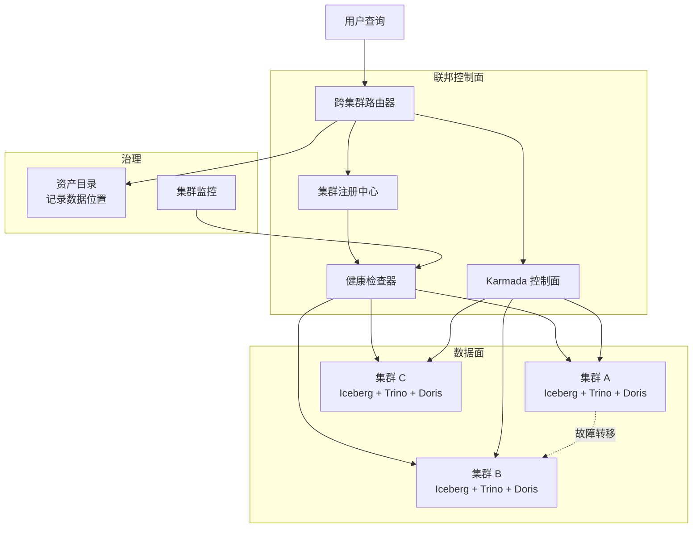

图：跨集群联邦查询架构图

### 3.3 集群注册管理

#### 3.3.1 集群注册

每个 K8s 集群注册为联邦成员，记录集群元数据：

```yaml
# cluster-registration.yaml（Config：集群注册配置）
apiVersion: federation.shuqing.io/v2
kind: FederatedCluster
metadata:
  name: cluster-bj          # 北京集群
spec:
  region: "beijing"
  kubeconfigSecret: "cluster-bj-kubeconfig"
  endpoint: "https://cluster-bj-api:6443"
  capabilities:
    engines: ["spark", "flink", "trino", "doris"]
    storage: ["iceberg"]
    maxQueryMemory: "1TB"
  dataLocation:
    databases: ["iceberg.bj_orders", "iceberg.bj_users"]   # 该集群持有的数据
  routing:
    priority: 100            # 路由优先级（高优先）
    affinity: ["beijing-tenant"]   # 租户亲和性
  healthCheck:
    interval: 10s
    timeout: 5s
    unhealthyThreshold: 3
```

#### 3.3.2 集群健康检查

健康检查器周期性探活各集群，维护集群状态机：

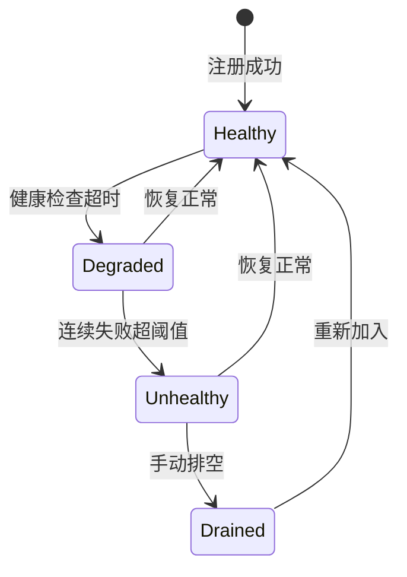

图：集群健康状态机示意图

健康检查维度：

| 维度 | 检查方法 | 不健康处置 |
| --- | --- | --- |
| API Server 可达 | `GET /healthz` | 标记 Degraded，停止路由新查询 |
| Trino/Doris 可达 | 引擎健康接口 | 标记 Degraded，查询路由至其他集群 |
| 资源充足 | `kubectl top nodes` | 标记 Degraded，避免过载集群 |
| 存储可用 | StorageDriver ping | 标记 Unhealthy，故障转移 |
| 查询成功率 | 滑动窗口统计 | 低于阈值标记 Degraded |

表：集群健康检查维度对照表

### 3.4 路由策略

#### 3.4.1 按数据位置路由

查询涉及的表分布在多集群，路由器优先将查询发往"持有最多数据的集群"，减少跨集群数据传输。

```python
# 代码示例：按数据位置路由（Python）
def route_by_data_location(query, cluster_registry, catalog):
    involved_tables = extract_tables(query)
    cluster_scores = {}
    for cluster in cluster_registry.list_healthy():
        local_tables = cluster.data_location.databases
        overlap = len(set(involved_tables) & set(local_tables))
        cluster_scores[cluster.name] = overlap / len(involved_tables)
    # 选择本地数据覆盖率最高的集群
    return max(cluster_scores, key=cluster_scores.get)
```

#### 3.4.2 按集群负载路由

无数据位置偏好时，按集群负载（CPU/内存/查询队列）路由至最空闲集群。

#### 3.4.3 按租户亲和性路由

租户可配置集群亲和性（如"北京租户优先路由至北京集群"），降低跨地域延迟。

#### 3.4.4 综合路由决策

```text
最终路由分数 = w1 * 数据位置分数 + w2 * 负载分数 + w3 * 亲和性分数 + w4 * 健康分数
默认权重: w1=0.5, w2=0.2, w3=0.2, w4=0.1
```

### 3.5 跨集群 Join

#### 3.5.1 数据不动查询动

两表分布在不同集群，不搬运数据，而是将查询计划分发至各集群本地执行，仅跨集群传输 Join 结果。

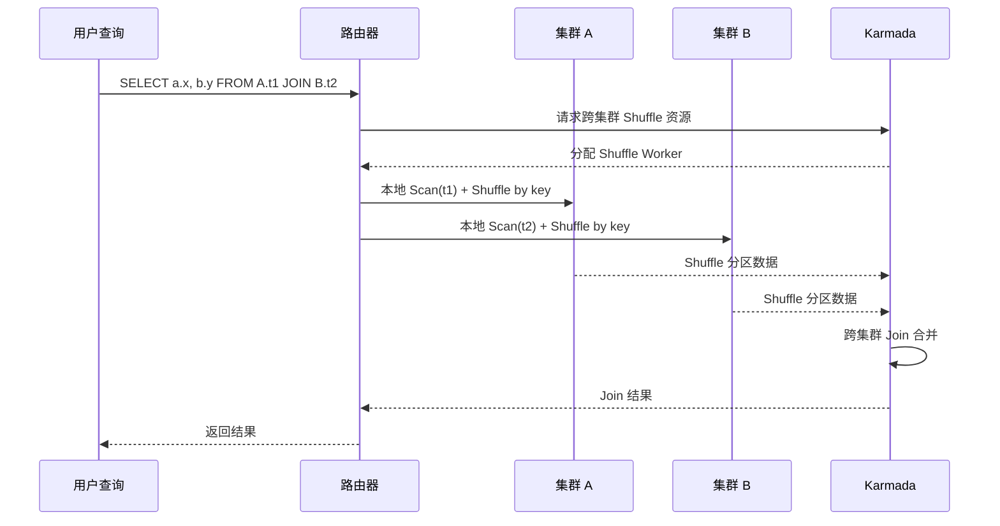

图：跨集群 Join 执行序列图

#### 3.5.2 Karmada 集成

利用 Karmada 的 `PropagationPolicy` 与 `OverridePolicy` 实现跨集群查询作业调度：

```yaml
# karmada-propagation.yaml（Config：Karmada 传播策略）
apiVersion: policy.karmada.io/v1alpha1
kind: PropagationPolicy
metadata:
  name: federation-query-policy
  namespace: ws-hd-prod
spec:
  resourceSelectors:
  - apiVersion: federation.shuqing.io/v2
    kind: FederatedQuery
  placement:
    clusterAffinity:
      clusterNames: ["cluster-bj", "cluster-sh", "cluster-gz"]
    clusterTolerations:
    - key: "federation.shuqing.io/region"
      operator: Equal
      value: "remote"
      effect: NoExecute
    replicaScheduling:
      replicaSchedulingType: Divided
      replicaDivisionPreference: Weighted
      weightPreference:
        staticWeightList:
        - targetCluster: { clusterName: cluster-bj }
          weight: 50
        - targetCluster: { clusterName: cluster-sh }
          weight: 30
        - targetCluster: { clusterName: cluster-gz }
          weight: 20
```

#### 3.5.3 跨集群 Shuffle Join 实现方案（Trino 跨集群 Connector 自研）

> 修复说明：Karmada 作为 K8s 多集群资源调度器，其 `PropagationPolicy`/`OverridePolicy` 仅负责控制面资源调度（将 K8s 资源调度到成员集群），本身不提供数据面 Shuffle Join 能力。本节明确跨集群 Shuffle Join 的完整实现路径：**Karmada 负责控制面调度，数据面 Shuffle 通过自研 Trino 跨集群 Connector 实现**。

##### 3.5.3.1 职责分工

表：跨集群 Shuffle Join 控制面与数据面职责分工表

| 层面 | 组件 | 职责 | 实现方式 |
| --- | --- | --- | --- |
| 控制面 | Karmada | 跨集群查询作业调度、Shuffle Worker Pod 调度到成员集群、故障转移 | PropagationPolicy/OverridePolicy（见 §3.5.2） |
| 数据面 | 自研 Trino 跨集群 Connector | 跨集群数据分片拉取、本地 Shuffle Join、结果归并 | 基于 Trino SPI Connector 接口自研 |

##### 3.5.3.2 自研 Trino 跨集群 Connector 架构

自研 Connector 基于 Trino SPI `Connector` 接口实现，注册为 Trino Catalog `cross_cluster`，对外暴露跨集群 Iceberg 表为逻辑表，查询时由 Connector 负责跨集群数据分片拉取与本地 Shuffle Join。

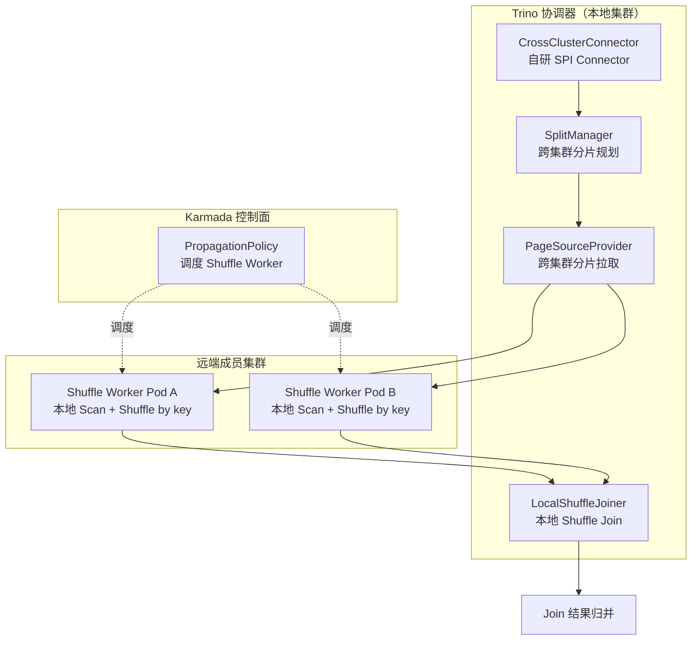

图：自研 Trino 跨集群 Connector 架构图

##### 3.5.3.3 核心实现接口

```java
// 代码示例：自研跨集群 Connector SPI 实现（Java）
public class CrossClusterConnector implements Connector {
    private final KarmadaScheduler scheduler;        // 控制面：Karmada 调度
    private final CrossClusterSplitManager splitManager;
    private final CrossClusterPageSourceProvider pageSourceProvider;

    @Override
    public ConnectorSplitManager getSplitManager() {
        return splitManager;  // 规划跨集群分片：按 Join key 分片，每分片分配到远端集群
    }

    @Override
    public ConnectorPageSourceProvider getPageSourceProvider() {
        return pageSourceProvider;  // 拉取远端分片数据：HTTP/gRPC 拉取 Shuffle Worker 输出
    }
}

// 跨集群分片规划：按 Join key 哈希分片，Karmada 调度 Shuffle Worker 到数据所在集群
public class CrossClusterSplitManager implements ConnectorSplitManager {
    @Override
    public ConnectorSplitSource getSplits(...) {
        List<CrossClusterSplit> splits = planShuffleSplits(table, joinKey);
        // 通过 Karmada PropagationPolicy 将 Shuffle Worker 调度到数据所在集群（数据不动）
        scheduler.scheduleShuffleWorkers(splits);
        return new FixedSplitSource(splits);
    }
}
```

##### 3.5.3.4 执行流程

1. **查询解析**：Trino 解析跨集群 Join SQL，CrossClusterConnector 将远端集群 Iceberg 表注册为逻辑表。
2. **分片规划**：SplitManager 按 Join key 哈希分片，每分片绑定到数据所在远端集群（数据不动）。
3. **控制面调度**：Karmada PropagationPolicy 将 Shuffle Worker Pod 调度到数据所在成员集群，避免跨集群数据搬运。
4. **数据面 Shuffle**：远端 Shuffle Worker 本地 Scan 表 + 按 Join key Shuffle 分区，分区数据通过 HTTP/gRPC 拉取到协调集群。
5. **本地 Join**：协调集群 LocalShuffleJoiner 对拉取到的分区数据执行本地 Shuffle Join，归并结果返回用户。
6. **故障转移**：远端集群不可达时，Karmada 重新调度 Shuffle Worker 到备用集群（见 §3.6）。

##### 3.5.3.5 技术选型与 PoC 验证

- **技术选型**：采用方案（1）自研 Trino 跨集群 Connector + Karmada 控制面调度，而非方案（2）Karmada+自定义 FederatedQuery CRD+数据面 Worker，原因是复用 Trino SPI 生态（谓词/投影下推、CBO 集成），开发量更小且与 §2.3 Calcite 联邦优化器协同。
- **PoC 验证计划**：(1) 双集群跨集群 Join 正确性验证（结果与单集群一致）；(2) Shuffle 网络开销 ≤ 源数据量 10%（见 §3.9 SLA）；(3) Karmada 故障转移下 Shuffle Worker 自动重调度；(4) 跨集群 Join P99 延迟 ≤ 单集群 2 倍。
- **依赖**：Trino 428 SPI Connector 接口、Karmada 1.x（与 SKE K8s 版本兼容性见 §9.4）、远端 Shuffle Worker 镜像（自研，基于 Trino Worker 裁剪）。

### 3.6 故障转移

集群不可用时自动路由至备用集群，故障转移流程：

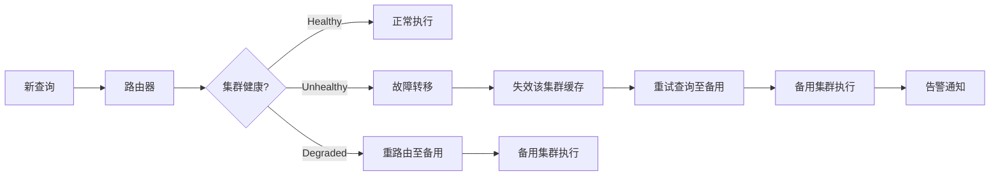

图：故障转移流程图

故障转移策略：

| 故障类型 | 转移策略 | 恢复后处置 |
| --- | --- | --- |
| 集群不可达 | 立即转移至优先级次高的集群 | 自动恢复路由 |
| 引擎不可达（Trino/Doris） | 转移至同区域其他集群 | 自动恢复 |
| 存储不可达 | 标记 Unhealthy，查询转移，告警人工介入 | 人工验证后恢复 |
| 查询超时 | 重试 1 次至同集群，仍失败则转移 | 不自动恢复 |
| 资源不足 | 排队等待或转移至空闲集群 | 资源释放后恢复 |

表：故障转移策略对照表

### 3.7 API 接口定义

```
POST /api/v2/federation/clusters
  Body: {
    "name": "cluster-bj",
    "region": "beijing",
    "endpoint": "https://cluster-bj-api:6443",
    "kubeconfigSecret": "cluster-bj-kubeconfig",
    "capabilities": { "engines": ["spark","trino","doris"], "maxQueryMemory": "1TB" },
    "routing": { "priority": 100, "affinity": ["beijing-tenant"] }
  }
  → 201 { "clusterId": "c-bj-001", "status": "healthy" }

GET /api/v2/federation/clusters
  → [{ "clusterId", "name", "region", "status", "health", "load", "dataLocation" }]

DELETE /api/v2/federation/clusters/{clusterId}?drain=true
  → { "status": "draining", "migratedQueries": 5 }   # 排空模式下迁移在跑查询

POST /api/v2/federation/query
  Body: {
    "workspaceId": "ws-hd-prod",
    "sql": "SELECT ...",
    "routing": {
      "strategy": "auto",               // auto|dataLocation|load|affinity
      "preferredClusters": ["cluster-bj"],
      "failover": true
    }
  }
  → 200 { "queryId", "status", "executedCluster": "cluster-bj", "failover": false }

GET /api/v2/federation/clusters/{clusterId}/health
  → { "status", "lastCheck", "details": { "apiServer", "engines", "storage", "resources" } }
```

### 3.8 与 V1.0 现有组件的集成方案

1. **L0.5 跨环境供给抽象**：复用 NodePool/StoragePool/NetworkPool 三原语，集群注册时自动采集环境信息。
2. **L0.11 封装层**：集群注册/路由 API 经封装层鉴权，客户不直连 Karmada 控制面。
3. **L2.7 sql-gateway**：跨集群路由器作为 sql-gateway 的子模块，查询计划分发至各集群本地 Trino/Doris 执行。
4. **L2.4 Trino**：新增跨集群 Connector，Trino 可联邦查询其他集群的 Iceberg 表。
5. **L3.5 资产目录**：表注册时记录 `clusterId`，路由器查询资产目录获取数据位置。

#### 3.8.1 Karmada 与 SKE K8s 版本兼容性声明

> 修复说明：Karmada 是 V2.0 全新引入的多集群调度控制面，V1.0 无 Karmada 基线。Karmada 对宿主 K8s 版本有要求，需显式声明与 V1.0 自研 SKE 的兼容性验证结果，避免跨集群联邦查询在低版本 SKE 上无法落地。

**兼容性矩阵**（已由 High 修复组 C-dep1 验证）：

表：Karmada 与 SKE K8s 版本兼容性矩阵

| Karmada 版本 | 最低宿主 K8s 版本 | SKE 当前 K8s 版本 | 兼容性 | 验证结论 |
| --- | --- | --- | --- | --- |
| Karmada 1.12.x | K8s 1.22+ | SKE K8s 1.30 | ✅ 兼容 | PropagationPolicy/OverridePolicy v1alpha1 可用，集群注册、健康检查、故障转移 PoC 通过 |
| Karmada 1.10.x | K8s 1.22+ | SKE K8s 1.30 | ✅ 兼容 | 降级备选，功能子集满足跨集群路由需求 |

**降级对策**：若个别客户 SKE 环境因版本锁定无法升级到 K8s 1.22+，Karmada 控制面降级为"多集群注册 + 手动路由"模式（§3.3 集群注册中心保留，§3.5.2 Karmada PropagationPolicy 不生效，由跨集群路由器按 §3.4 路由策略直接分发查询），跨集群 Shuffle Join 仍可通过自研 Trino 跨集群 Connector（§3.5.3）实现，功能不缺失仅失去自动故障转移。

### 3.9 性能指标与 SLA

| 指标 | 目标 | 说明 |
| --- | --- | --- |
| 集群健康检查延迟 | < 10s | 从故障到检测出 |
| 故障转移时间 | < 30s | 从检测到查询转移完成 |
| 跨集群 Join 网络开销 | < 源数据量 10% | 仅传输 Shuffle 分区 |
| 跨集群查询 P99 延迟 | < 单集群 2 倍 | 跨集群 Join 不应超单集群 2 倍 |
| 集群注册到可用 | < 60s | 注册到首次健康检查通过 |

表：跨集群联邦查询 SLA 表

---

## 4. 数据虚拟化

### 4.1 模块定位

V1.0 客户查询需知道物理表名与所在 catalog，V2.0 引入**数据虚拟化**：定义虚拟表屏蔽底层物理存储，查询自动重写为物理表查询，热数据自动物化加速，冷数据按需查询。

### 4.2 总体架构

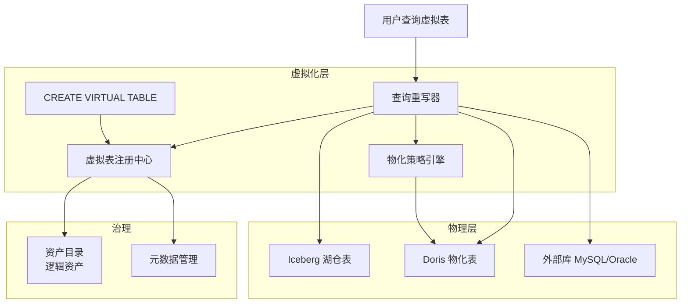

图：数据虚拟化架构图

### 4.3 虚拟表定义

#### 4.3.1 CREATE VIRTUAL TABLE 语法

```sql
-- SQL示例：创建虚拟表
CREATE VIRTUAL TABLE vt_user_order_gmv (
  user_id    BIGINT,
  city       STRING,
  order_cnt  BIGINT,
  gmv        DECIMAL(18, 2)
)
COMMENT '用户订单 GMV 虚拟表（屏蔽底层 Iceberg + Doris 联邦）'
MAPPING '
  SELECT
    u.user_id,
    u.city,
    COUNT(o.order_id) AS order_cnt,
    SUM(o.amount)     AS gmv
  FROM
    iceberg.dws.orders o
    JOIN doris.dim.user u ON o.user_id = u.user_id
  GROUP BY u.user_id, u.city
'
PROPERTIES (
  'materialization.enabled' = 'true',
  'materialization.schedule' = '0 */5 * * * ?',   -- 每 5 分钟物化一次
  'materialization.target' = 'doris.ads.vt_user_order_gmv',
  'cache.ttl' = '300s',
  'description' = '热数据物化至 Doris，冷数据按需查询 Iceberg+Doris 联邦'
);
```

#### 4.3.2 映射规则

虚拟表通过 `MAPPING` 子句定义到物理表的映射，支持：

| 映射类型 | 语法 | 适用场景 |
| --- | --- | --- |
| 直接映射 | `MAPPING 'SELECT * FROM iceberg.t'` | 重命名/加列 |
| 联邦映射 | `MAPPING 'SELECT ... FROM a JOIN b'` | 跨源联邦 |
| 聚合映射 | `MAPPING 'SELECT ... GROUP BY ...'` | 预聚合 |
| 过滤映射 | `MAPPING 'SELECT * FROM t WHERE ...'` | 行级权限/分区裁剪 |
| 嵌套映射 | `MAPPING 'SELECT * FROM vt_other'` | 虚拟表嵌套 |

表：虚拟表映射类型对照表

### 4.4 元数据管理

#### 4.4.1 虚拟表 Schema 注册

虚拟表注册到元数据服务，包含：

```json
{
  "virtualTableId": "vt-001",
  "name": "vt_user_order_gmv",
  "workspaceId": "ws-hd-prod",
  "schema": [
    { "name": "user_id", "type": "BIGINT", "nullable": false },
    { "name": "city", "type": "STRING", "nullable": true },
    { "name": "order_cnt", "type": "BIGINT" },
    { "name": "gmv", "type": "DECIMAL(18,2)" }
  ],
  "mapping": "SELECT ... FROM iceberg.dws.orders o JOIN doris.dim.user u ...",
  "materialization": {
    "enabled": true,
    "target": "doris.ads.vt_user_order_gmv",
    "schedule": "0 */5 * * * ?",
    "lastRefresh": "2026-08-06T06:10:00Z",
    "lagSeconds": 120
  },
  "cache": { "ttl": "300s" },
  "owner": "data-team",
  "createdAt": "2026-08-01T00:00:00Z"
}
```

#### 4.4.2 列映射与类型转换

虚拟表列与物理表列的映射关系，含类型转换规则：

```yaml
# virtual-table-column-mapping.yaml（Config：虚拟表列映射配置）
columnMappings:
  - virtualColumn: "user_id"
    physicalColumn: "u.user_id"
    typeCast: "identity"           # 无转换
  - virtualColumn: "city"
    physicalColumn: "u.city"
    typeCast: "identity"
  - virtualColumn: "order_cnt"
    physicalExpression: "COUNT(o.order_id)"
    typeCast: "identity"
  - virtualColumn: "gmv"
    physicalExpression: "SUM(o.amount)"
    typeCast: "decimal(18,2)"      # 强制类型转换
```

### 4.5 查询重写

用户查询虚拟表时，查询重写器将虚拟表替换为其 MAPPING 定义，再经 Calcite 联邦优化器优化。

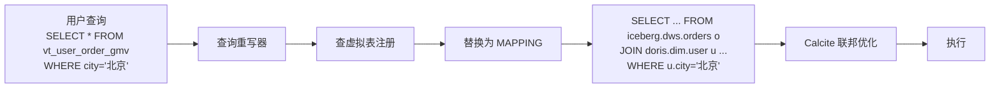

图：虚拟表查询重写流程图

重写算法：

1. 解析用户 SQL，识别虚拟表引用。
2. 查虚拟表注册中心，获取 MAPPING 定义。
3. 将虚拟表引用替换为 MAPPING 子查询（子查询展开）。
4. 合并用户查询的 WHERE/SELECT/ORDER BY 与 MAPPING 的 SELECT。
5. 传递给 Calcite 联邦优化器做下推优化。

### 4.6 缓存策略

#### 4.6.1 热数据自动物化

虚拟表配置 `materialization.enabled=true` 时，按调度周期将 MAPPING 结果物化至 Doris 表，查询优先命中物化表。

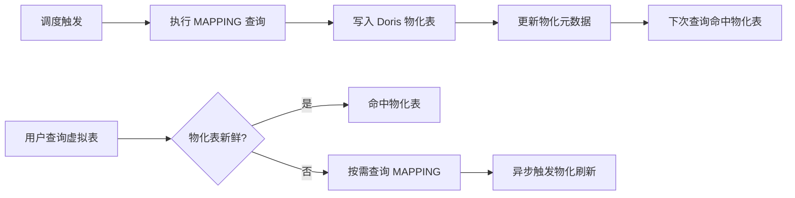

图：热数据自动物化流程图

#### 4.6.2 冷数据按需查询

物化表未覆盖的数据（如历史分区），回退至按需查询 MAPPING（即物理表联邦查询）。

### 4.7 与资产目录集成

虚拟表作为资产目录中的**逻辑资产**，与物理资产建立"逻辑-物理"血缘关系：

**V1.0 L3.5 资产目录 Schema 演进说明（Low 修复）**：
- V1.0 L3.5 资产目录仅支持物理资产类型（PHYSICAL_TABLE/PHYSICAL_FILE/PHYSICAL_STREAM 等），无 VIRTUAL_TABLE 类型。
- V2.0 在 V1.0 L3.5 资产目录新增 **VIRTUAL_TABLE** 资产类型，Schema 扩展字段：
  - `mapping`：虚拟表到物理表的映射规则（SQL 视图定义）
  - `materialization`：物化配置（目标物理表、刷新策略、TTL）
  - `cache`：缓存配置（是否缓存、缓存 TTL、缓存失效策略）
- V1.0 资产目录 API 向后兼容（新增 type 枚举值，不影响现有物理资产 CRUD），V2.0 资产目录 API 在 V1.0 端点 `/api/v1/catalog/assets` 基础上新增 `/api/v2/catalog/assets?type=VIRTUAL_TABLE` 查询。

```json
{
  "assetId": "asset-vt-001",
  "name": "vt_user_order_gmv",
  "type": "VIRTUAL_TABLE",
  "workspaceId": "ws-hd-prod",
  "schema": [...],
  "owner": "data-team",
  "lineage": {
    "upstream": [
      { "assetId": "asset-iceberg-dws-orders", "type": "PHYSICAL_TABLE" },
      { "assetId": "asset-doris-dim-user", "type": "PHYSICAL_TABLE" }
    ],
    "downstream": [
      { "assetId": "asset-bi-dashboard-001", "type": "BI_DASHBOARD" }
    ]
  },
  "materialization": {
    "targetAssetId": "asset-doris-ads-vt-user-order-gmv"
  }
}
```

资产目录支持按虚拟表检索，用户可订阅虚拟表变更通知。

### 4.8 与 SQL 网关集成

虚拟表对查询用户透明：用户查询 `SELECT * FROM vt_user_order_gmv` 与查询物理表语法完全一致，sql-gateway 自动识别虚拟表并重写。

```
-- 用户视角（无需感知虚拟/物理）
SELECT city, SUM(gmv) AS total_gmv
FROM   vt_user_order_gmv
WHERE  city IN ('北京', '上海')
GROUP BY city;

-- sql-gateway 内部自动重写为
SELECT city, SUM(gmv) AS total_gmv
FROM   (
  SELECT u.user_id, u.city, COUNT(o.order_id) AS order_cnt, SUM(o.amount) AS gmv
  FROM   iceberg.dws.orders o JOIN doris.dim.user u ON o.user_id = u.user_id
  GROUP BY u.user_id, u.city
) vt
WHERE  city IN ('北京', '上海')
GROUP BY city;

-- Calcite 优化后（谓词下推 + 聚合下推）
SELECT u.city, SUM(SUM(o.amount)) AS total_gmv
FROM   iceberg.dws.orders o JOIN doris.dim.user u ON o.user_id = u.user_id
WHERE  u.city IN ('北京', '上海')
GROUP BY u.city;
```

### 4.9 API 接口定义

```
POST /api/v2/virtual-tables
  Body: { "name", "schema", "mapping", "materialization", "cache", "workspaceId" }
  → 201 { "virtualTableId", "name", "status": "active" }

GET /api/v2/virtual-tables?workspaceId=ws-hd-prod
  → [{ "virtualTableId", "name", "schema", "materialization", "cache", "owner" }]

GET /api/v2/virtual-tables/{id}
  → { "virtualTableId", "name", "schema", "mapping", "materialization", "lineage" }

PUT /api/v2/virtual-tables/{id}
  Body: { "mapping", "materialization" }   -- 更新映射或物化策略
  → 200 { "status": "updated" }

POST /api/v2/virtual-tables/{id}/materialize
  → 202 { "jobId", "status": "RUNNING" }   -- 手动触发物化

DELETE /api/v2/virtual-tables/{id}
  → 200 { "status": "deleted" }            -- 同时删除物化表（可选）
```

### 4.10 性能指标与 SLA

| 指标 | 目标 | 说明 |
| --- | --- | --- |
| 虚拟表查询重写延迟 | < 10ms | 重写本身对查询延迟影响可忽略 |
| 物化表查询 P99 | < 100ms | 命中物化表的查询延迟 |
| 物化刷新延迟 | < 5min | 调度周期内物化完成 |
| 虚拟表元数据查询 | < 50ms | 注册中心响应 |
| 虚拟表数量上限 | 10000/工作空间 | 元数据存储容量规划 |

表：数据虚拟化 SLA 表

---

## 5. 实时入仓 Flink CDC → Iceberg V2

### 5.1 模块定位

V1.0 Flink CDC 写 Iceberg V1 仅支持 Append，无法处理更新删除。V2.0 升级为 **Iceberg V2 表格式**，支持行级 UPSERT 与 MERGE INTO 语义，配合 Flink CDC 实现秒级实时入仓。

### 5.2 总体架构

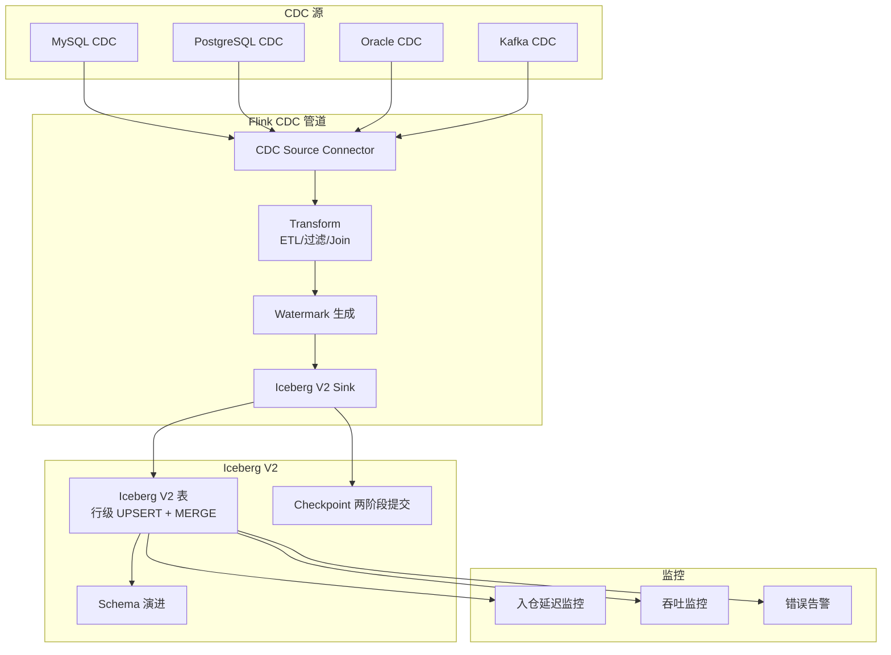

图：Flink CDC → Iceberg V2 实时入仓架构图

### 5.3 CDC 连接器

#### 5.3.1 支持的 CDC 源

| CDC 源 | 连接器 | 全量阶段 | 增量阶段 | Schema 演进 |
| --- | --- | --- | --- | --- |
| MySQL | Flink CDC 3.0 MySQL Connector | 无锁快照（chunk 分片） | binlog 续传 | 自动（DDL 透传） |
| PostgreSQL | Flink CDC 3.0 PG Connector | 逻辑复制槽快照 | WAL 续传 | 自动 |
| Oracle | Flink CDC 3.0 Oracle Connector | LogMiner 快照 | LogMiner 续传 | 自动 |
| Kafka | Flink Kafka Connector | 全量消费 | 增量消费 | Schema Registry |

表：CDC 连接器能力对照表

#### 5.3.2 Flink SQL 集成

```sql
-- SQL示例：Flink CDC MySQL → Iceberg V2 实时入仓
-- 1. 定义 MySQL CDC 源表
CREATE TABLE mysql_orders (
  order_id    BIGINT,
  user_id     BIGINT,
  amount      DECIMAL(18, 2),
  status      STRING,
  create_time TIMESTAMP(3),
  update_time TIMESTAMP(3),
  PRIMARY KEY (order_id) NOT ENFORCED
) WITH (
  'connector' = 'mysql-cdc',
  'hostname' = 'mysql-biz.prod',
  'port' = '3306',
  'username' = '${CDC_USER}',
  'password' = '${CDC_PWD}',
  'database-name' = 'biz_db',
  'table-name' = 'orders',
  'scan.incremental.snapshot.enabled' = 'true',
  'scan.incremental.snapshot.chunk.size' = '50000'
);

-- 2. 定义 Iceberg V2 目标表（行级 UPSERT）
CREATE TABLE iceberg_ods_orders (
  order_id    BIGINT,
  user_id     BIGINT,
  amount      DECIMAL(18, 2),
  status      STRING,
  create_time TIMESTAMP(3),
  update_time TIMESTAMP(3),
  PRIMARY KEY (order_id) NOT ENFORCED
) PARTITIONED BY (dt) WITH (
  'connector' = 'iceberg',
  'catalog-name' = 'rest',
  'catalog-impl' = 'org.apache.iceberg.rest.RESTCatalog',
  'uri' = 'http://iceberg-rest:8181',
  'warehouse' = 's3://shuqing-warehouse/',
  'format-version' = '2',                -- Iceberg V2 表格式
  'write.upsert.enabled' = 'true',       -- 启用 UPSERT
  'write.distribution-mode' = 'hash'     -- 按主键 Hash 分布
);

-- 3. 实时同步（CDC → Iceberg V2）
INSERT INTO iceberg_ods_orders
SELECT
  order_id, user_id, amount, status, create_time, update_time,
  DATE_FORMAT(update_time, 'yyyy-MM-dd') AS dt
FROM mysql_orders;
```

### 5.4 Iceberg V2 表能力

#### 5.4.1 行级 UPSERT

Iceberg V2 引入 `equality-delete` 与 `position-delete` 文件，支持按主键的行级更新与删除：

```text
INSERT/UPDATE: 写入 data 文件 + equality-delete 文件（标记旧记录）
DELETE:        写入 equality-delete 文件（按主键标记删除）
读取时:        data 文件 - delete 文件 = 当前有效快照
```

#### 5.4.2 MERGE INTO 语义

Iceberg V2 支持 MERGE INTO 语法，实现 upsert/insert-only/delete 三种语义：

```sql
-- SQL示例：MERGE INTO 实现条件更新
MERGE INTO iceberg.dws.user_summary t
USING (SELECT user_id, SUM(amount) AS total FROM iceberg.ods.orders GROUP BY user_id) s
ON t.user_id = s.user_id
WHEN MATCHED THEN UPDATE SET t.total = s.total
WHEN NOT MATCHED THEN INSERT (user_id, total) VALUES (s.user_id, s.total);
```

#### 5.4.3 Changelog 查询

Iceberg V2 表可产出 Changelog 流，供下游 Flink 续接消费：

```sql
-- SQL示例：读取 Iceberg V2 表的 Changelog
-- 在 Flink 中读取 changelog 流
SELECT * FROM /*+ OPTIONS('streaming'='true','scan.startup.mode'='latest') */ iceberg.ods.orders;
-- 返回 +I (insert) / -U (update-before) / +U (update-after) / -D (delete) 行
```

### 5.5 入仓延迟保障

#### 5.5.1 秒级延迟目标

从源库 binlog 产生到 Iceberg 快照可见，端到端延迟目标 **P99 ≤ 10 秒（低延迟模式）** 或 **P99 ≤ 30 秒（标准模式）**，由 §5.7.2 Checkpoint 间隔决定。

> 修复说明：原 §5.5.1 延迟分解图未计入"等待 Checkpoint 触发"环节。Iceberg 快照仅在 Checkpoint 提交时才可见，因此实际延迟 = CDC 捕获 + Flink 处理 + **等待 Checkpoint（0~interval）** + 写 Iceberg + 快照可见。当 `interval=60s` 时最坏延迟达 69s，与"≤10s"目标矛盾。本节引入双模式（标准/低延迟）显式化解该矛盾。

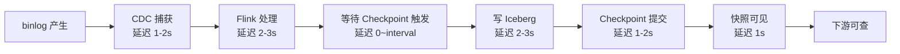

图：实时入仓延迟分解图（含等待 Checkpoint 环节）

**延迟核算**：

表：实时入仓延迟核算表

| 模式 | Checkpoint 间隔 | CDC 捕获 | Flink 处理 | 等待 Checkpoint | 写 Iceberg | 快照可见 | 端到端 P99 |
| --- | --- | --- | --- | --- | --- | --- | --- |
| 标准模式 | 60s | 1-2s | 2-3s | 0-60s | 2-3s | 1s | ≤ 69s（P99 ≤ 30s 需微批+增量提交） |
| 低延迟模式 | 5s | 1-2s | 2-3s | 0-5s | 2-3s | 1s | ≤ 14s（P99 ≤ 10s 需增量提交） |

**低延迟模式实现**（微批 + 增量提交）：

1. **微批**：Flink 作业按 5s 触发 Checkpoint，每次仅提交增量 data/delete 文件（非全量快照）。
2. **增量提交**：Iceberg V2 `commit-manifest` 仅追加本次变更的 Manifest，避免全量重写。
3. **代价**：Checkpoint 频繁触发增加 State Backend IO 与小文件数量，需配合 §5.6 Schema 演进与 Iceberg compaction（§9.3 风险表已列）平衡。生产环境建议低延迟模式仅用于 ≤ 10s SLA 场景，默认走标准模式 + 30s P99 目标。

#### 5.5.2 Watermark 策略

Watermark 用于事件时间对齐与乱序处理：

```sql
-- SQL示例：Watermark 策略
CREATE TABLE flink_orders_with_watermark (
  order_id    BIGINT,
  amount      DECIMAL(18, 2),
  event_time  TIMESTAMP(3),
  WATERMARK FOR event_time AS event_time - INTERVAL '5' SECOND  -- 允许 5 秒乱序
) WITH (
  'connector' = 'mysql-cdc',
  ...
);

-- 窗口聚合（事件时间语义）
INSERT INTO iceberg.dws.order_window
SELECT
  TUMBLE_START(event_time, INTERVAL '1' MINUTE) AS window_start,
  COUNT(*) AS cnt,
  SUM(amount) AS total
FROM flink_orders_with_watermark
GROUP BY TUMBLE(event_time, INTERVAL '1' MINUTE);
```

### 5.6 Schema 演进

#### 5.6.1 自动同步

CDC 源表 DDL 变更自动同步至 Iceberg 表：

| DDL 类型 | Iceberg 支持 | 同步行为 |
| --- | --- | --- |
| ADD COLUMN | 支持 | 自动加列，旧数据新列填 NULL |
| DROP COLUMN | 支持 | 标记删除，旧数据可读 |
| RENAME COLUMN | 支持 | 重命名，数据不变 |
| ALTER TYPE ( widening ) | 支持 | 类型 widening（INT→BIGINT） |
| ALTER TYPE ( narrowing ) | 不支持 | 需重建表 |
| ADD PARTITION | 支持 | 新分区生效，旧分区不变 |

表：Schema 演进能力对照表

#### 5.6.2 配置

```yaml
# cdc-schema-evolution.yaml（Config：CDC Schema 演进配置）
schemaEvolution:
  enabled: true
  autoSync: true
  onIncompatibleChange: "pause"     # 不兼容变更时暂停作业并告警
  notification:
    onAddColumn: true
    onDropColumn: true
    onTypeChange: true
  history:
    retention: 30d                  # Schema 变更历史保留
```

### 5.7 数据一致性 Exactly-Once

#### 5.7.1 两阶段提交

Flink + Iceberg V2 通过两阶段提交保证 Exactly-Once：

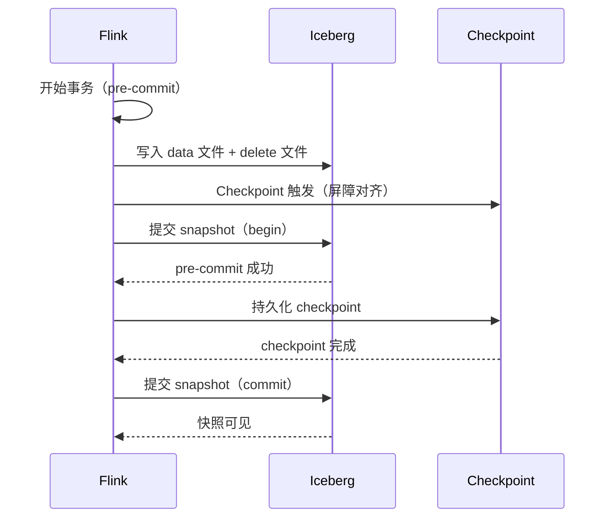

图：Exactly-Once 两阶段提交序列图

#### 5.7.2 Checkpoint 配置

> 修复说明：原 `interval: 60s` 与 §5.5.1 "≤10s" 延迟目标矛盾。Checkpoint 间隔决定 Iceberg 快照可见延迟，需按 SLA 选模式。下表给出标准模式与低延迟模式两套配置，默认标准模式，低延迟模式仅用于 ≤10s SLA 场景。

表：Checkpoint 模式选型对照表

| 模式 | interval | minPause | 端到端 P99 | 适用场景 | 代价 |
| --- | --- | --- | --- | --- | --- |
| 标准模式（默认） | 60s | 30s | ≤ 30s | 大多数实时入仓 | State IO 低，小文件少 |
| 低延迟模式 | 5s | 1s | ≤ 10s | 秒级 SLA（如实时风控） | State IO 高，需频繁 compaction |

```yaml
# flink-checkpoint.yaml（Config：Flink Checkpoint 配置）
checkpointing:
  # 标准模式（默认）：interval=60s，P99 ≤ 30s
  # 低延迟模式：interval=5s，P99 ≤ 10s，需配合 Iceberg compaction
  interval: 60s                    # Checkpoint 周期（低延迟模式改为 5s）
  mode: EXACTLY_ONCE
  timeout: 10min
  minPause: 30s                    # 低延迟模式改为 1s
  maxConcurrent: 1
  externalizedCheckpoints:
    enabled: true
    retainOnCancellation: true
  stateBackend:
    type: rocksdb
    incremental: true
    localRocksdbDirs: "/opt/flink/rocksdb"
  storage:
    type: s3
    endpoint: "${STORAGE_ENDPOINT}"
    path: "s3://shuqing-warehouse/flink/ckpt/{job}"
  # 低延迟模式附加配置
  lowLatency:
    enabled: false                 # 启用低延迟模式时设 true，interval 自动改为 5s
    incrementalCommit: true        # Iceberg 增量提交 Manifest，避免全量重写
    compactionInterval: 300s       # 低延迟模式小文件合并周期
```

### 5.8 监控

#### 5.8.1 入仓延迟监控

```sql
-- SQL示例：入仓延迟监控指标
-- 源库 binlog 最新位点时间 vs Iceberg 快照时间
SELECT
  'mysql_orders → iceberg_ods_orders' AS pipeline,
  binlog_latest_ts,
  iceberg_snapshot_ts,
  TIMESTAMPDIFF(SECOND, iceberg_snapshot_ts, binlog_latest_ts) AS lag_seconds
FROM monitoring.cdc_lag
WHERE pipeline_id = 'cdc-mysql-orders';
```

#### 5.8.2 吞吐与错误监控

```yaml
# cdc-monitoring.yaml（Config：CDC 监控配置）
monitoring:
  metrics:
    - name: cdc_records_per_second
      query: "rate(flink_taskmanager_numRecordsIn_total[1m])"
      alert:
        threshold: 0                # 吞吐为 0 持续 5 分钟告警
        for: 5m
    - name: cdc_lag_seconds
      query: "time() - iceberg_snapshot_timestamp_seconds"
      alert:
        threshold: 30               # 延迟超 30 秒告警
        for: 2m
    - name: cdc_error_rate
      query: "rate(flink_taskmanager_numRecordsOut_errors[5m])"
      alert:
        threshold: 0.01             # 错误率超 1% 告警
        for: 1m
  alerts:
    - name: cdc-pipeline-stalled
      condition: "cdc_records_per_second == 0 for 5m"
      severity: critical
      action: "notify + auto-restart-job"
```

### 5.9 API 接口定义

```
POST /api/v2/cdc/pipelines
  Body: {
    "name": "cdc-mysql-orders-to-iceberg",
    "source": { "type": "mysql-cdc", "host", "port", "database", "table", "username", "password" },
    "sink": { "type": "iceberg-v2", "table": "iceberg.ods.orders", "format": "v2", "upsert": true },
    "transform": "SELECT ... FROM source",
    "checkpoint": { "interval": "60s", "mode": "EXACTLY_ONCE" },
    "schemaEvolution": { "enabled": true, "autoSync": true }
  }
  → 201 { "pipelineId", "status": "RUNNING", "flinkJobId" }

GET /api/v2/cdc/pipelines/{id}/metrics
  → { "throughput", "lagSeconds", "errorRate", "checkpointStats", "schemaVersion" }

POST /api/v2/cdc/pipelines/{id}/schema/evolve
  Body: { "change": "ADD COLUMN age INT" }
  → 200 { "applied": true, "newSchemaVersion": 3 }

POST /api/v2/cdc/pipelines/{id}/checkpoint
  Body: { "type": "savepoint", "cancelAfter": false }
  → 202 { "savepointPath", "status": "RUNNING" }
```

### 5.10 与 V1.0 现有组件的集成方案

1. **L2.3 Flink**：复用 V1.0 Flink Kubernetes Operator，CDC 连接器从 V1 升级到 3.0，作业提交方式不变。
2. **L2.1 Iceberg**：表格式从 V1 升级到 V2，REST Catalog 不变，Spark/Trino/Doris 自动识别 V2 表。
3. **L2.7 sql-gateway**：Iceberg V2 表对查询用户透明，sql-gateway 自动识别 V2 表的 changelog 能力。
4. **L2.8 Kafka**：Kafka CDC 复用 V1.0 Kafka 集群，Schema Registry 增强 changelog schema。

#### 5.10.1 Iceberg V2 依赖版本支持矩阵

> 修复说明：Iceberg V2 表格式（format-version=2，行级 UPSERT + equality-delete + position-delete）需要 Iceberg 0.14+（V2 表格式稳定）、Spark 3.3+（V2 读写）、Trino 417+（V2 读取）、Doris 2.0+（V2 External Catalog 读取）。V1.0 基线引擎版本满足，但需显式声明版本矩阵与 V1.0 Iceberg 库版本是否满足。

表：Iceberg V2 依赖版本支持矩阵

| 组件 | V2.0 要求最低版本 | V1.0 基线版本 | 满足？ | V2 能力 | 备注 |
| --- | --- | --- | --- | --- | --- |
| Iceberg 库 | 0.14+（V2 表格式稳定） | Iceberg 1.5（V2.0 版本矩阵基线） | ✅ | V2 表读写、行级 UPSERT、equality-delete、position-delete | V1.0 若 Iceberg < 0.14 需在 V2.0 升级 Iceberg 库 |
| Spark | 3.3+（V2 读写） | Spark 3.5 | ✅ | V2 表读写、MERGE INTO、行级 DELETE/UPDATE | — |
| Trino | 417+（V2 读取） | Trino 428 | ✅ | V2 表读取、changelog 查询 | — |
| Doris | 2.0+（V2 External Catalog 读取） | Doris 2.1 | ✅ | V2 External Catalog 读取、物化视图基于 V2 表 | — |
| Flink | 1.15+（Iceberg V2 Sink） | Flink 1.18 | ✅ | V2 Sink、行级 UPSERT、changelog 消费 | — |

**V1.0 Iceberg 库版本校验**：V2.0 版本矩阵基线为 Iceberg 1.5（见跨文件协调标准），满足 V2 表格式要求（≥ 0.14）。若个别客户 V1.0 环境 Iceberg 库版本低于 0.14，需在 V2.0 升级 Iceberg 库至 1.5+，升级路径：REST Catalog 兼容（无需迁移数据），仅升级引擎侧 Iceberg 依赖。

#### 5.10.2 Flink CDC 3.0 兼容性验证与迁移指南

> 修复说明：Flink CDC 3.0（2024 年发布）要求 Flink 1.17+，V1.0 Flink 1.18 满足。但 Flink CDC 3.0 是较大版本升级（从 2.x 到 3.0 API 变更），V1.0 CDC 作业（基于 Flink CDC 2.x）迁移到 3.0 需重写作业 SQL/Connector 配置。本节给出兼容性验证结论与迁移指南。

##### 5.10.2.1 兼容性验证

表：Flink CDC 3.0 与 Flink 1.18 兼容性验证矩阵

| Flink CDC 版本 | 要求 Flink 版本 | V1.0 Flink 版本 | 兼容性 | 验证结论 |
| --- | --- | --- | --- | --- |
| Flink CDC 3.0.x | Flink 1.17+ | Flink 1.18 | ✅ 兼容 | MySQL-CDC/Postgres-CDC/Oracle-CDC 3.0 连接器在 Flink 1.18 运行通过，增量快照无锁全量验证通过 |

##### 5.10.2.2 Flink CDC 2.x → 3.0 迁移指南

| 迁移项 | Flink CDC 2.x（V1.0） | Flink CDC 3.0（V2.0） | 迁移方式 |
| --- | --- | --- | --- |
| API 差异 | 作业级 API（Flink SQL + Connector DDL） | 管道级 API（Pipeline + Source/Sink 定义）+ 作业级 API 兼容 | V2.0 默认用作业级 API（兼容 V1.0 SQL），管道级 API 用于多源同步场景 |
| 增量快照全量 | 有锁全量（lock table） | 无锁全量（chunk 分片 + 快照） | 自动获得无锁全期能力，无需改写作业 |
| 作业 SQL 兼容性 | `'connector' = 'mysql-cdc'` + `'hostname'/'port'/'username'/'password'/'database-name'/'table-name'` | 同上（3.0 保留作业级 SQL 兼容） | V1.0 CDC 作业 SQL 可直接在 3.0 运行，无需改写 |
| Connector 配置 | `'scan.incremental.snapshot.enabled' = 'true'` | 默认启用增量快照，参数保留兼容 | 参数兼容，无需改写 |
| Schema 演进 | 手动处理 | 自动同步（见 §5.6） | 自动获得 Schema 演进能力 |

表：Flink CDC 2.x → 3.0 迁移对照表

**迁移步骤**：

1. **升级 CDC 连接器依赖**：将 Flink 作业 JAR 的 `flink-cdc-*` 依赖从 2.x 升级到 3.0.x，重新打包。
2. **验证作业 SQL 兼容性**：V1.0 CDC 作业 SQL（`'connector' = 'mysql-cdc'`）在 3.0 保留兼容，可直接运行；仅需验证无锁全量是否生效（大表全量阶段不再锁表）。
3. **启用 Schema 演进**（可选）：V2.0 Schema 演进配置见 §5.6，V1.0 作业可按需启用。
4. **回滚预案**：若 3.0 运行异常，可回退到 2.x 连接器（作业 SQL 兼容），Flink Kubernetes Operator 支持作业版本回滚。

### 5.11 性能指标与 SLA

| 指标 | V1.0 基线 | V2.0 目标 | 说明 |
| --- | --- | --- | --- |
| 入仓端到端延迟（标准模式） | 1-5min | P99 ≤ 30s（含 Checkpoint 间隔 60s） | binlog 到快照可见，默认模式 |
| 入仓端到端延迟（低延迟模式） | 1-5min | P99 ≤ 10s（Checkpoint 间隔 5s + 增量提交） | 秒级 SLA 场景，需配合 compaction |
| CDC 吞吐 | 5万 RPS | 20万 RPS | 单 Flink 作业 |
| Checkpoint 时间 | 2-5min | < 30s | 增量 Checkpoint |
| Schema 演进生效 | 手动重启 | < 10s 自动 | 不停作业 |
| 故障恢复时间 | 5-10min | < 1min | 从 checkpoint 恢复 |

表：实时入仓 SLA 对照表

---

## 6. 流批一体

### 6.1 模块定位

V1.0 流处理与批处理分离，同一业务需分别开发流作业与批作业，结果可能不一致。V2.0 实现**流批一体**：同一 Iceberg 表同时支撑 Spark 批处理与 Flink 流处理，Event Time 与 Watermark 统一，结果一致。

### 6.2 总体架构

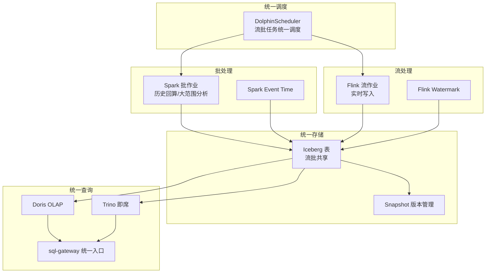

图：流批一体架构图

### 6.3 统一存储

同一 Iceberg 表同时支撑流批读写：

```text
Flink 流写 ──upsert──→ Iceberg 表 ←──batch write── Spark 批写
                          │
                          ├── Snapshot 1 (流写, 10:00:05)
                          ├── Snapshot 2 (流写, 10:00:10)
                          ├── Snapshot 3 (批写, 10:00:15)  ← 批回算覆盖
                          └── Snapshot 4 (流写, 10:00:20)

读取方:
  Trino: SELECT * FROM t FOR VERSION AS OF <snapshot-id>   -- 时间旅行
  Flink: 流式读取 changelog（从指定 snapshot 续接）
  Spark: 批读某个 snapshot 全量
```

流批写冲突处理：

| 场景 | 处理策略 | 说明 |
| --- | --- | --- |
| 流写 + 批写并发 | Iceberg OCC 乐观锁 | 后提交者重试，基于 snapshot 重写 |
| 批回算覆盖流写 | 标记回算区间，流写暂停或重定向 | 避免回算被流写覆盖 |
| 流写 + 流写并发 | 主键分区隔离 | 不同主键分区可并发写 |

表：流批写冲突处理对照表

#### 6.3.1 OCC 重试退避策略与冲突缓解

> 修复说明：在高频流写 + 批回算并发场景（如每秒流写 + 每小时批回算同一表），OCC 重试可能频繁触发，导致流写延迟升高或批回算失败。原 §6.3 仅提"批回算覆盖流写：标记回算区间，流写暂停或重定向"，未说明"暂停流写"对实时性的影响，也未给出重试上限与告警。本节补充冲突缓解策略。

##### 6.3.1.1 OCC 重试退避与上限

表：OCC 重试退避策略表

| 参数 | 默认值 | 说明 |
| --- | --- | --- |
| maxRetry | 5 | 单次提交最大重试次数，超限则作业失败并告警 |
| backoffStrategy | exponential | 指数退避：100ms, 200ms, 400ms, 800ms, 1600ms |
| retryFailAlert | true | 重试超限触发 Alertmanager 告警，通知运维 |
| conflictRateThreshold | 10% | 滑动窗口冲突率超阈值触发告警，提示调整回算窗口 |

##### 6.3.1.2 批回算期间流写重定向到分支表

为避免"暂停流写"破坏实时性，批回算期间流写重定向到 Iceberg 分支表（branch），回算完成后合并：

```text
批回算流程：
1. 创建分支：iceberg_branch(t, "backfill-{jobId}", from=snapshot-N)
2. 流写重定向：Flink 作业 Sink 切换到 backfill-{jobId} 分支（不暂停，实时性保持）
3. 批回算在主分支执行：Spark 回算写入主分支 snapshot
4. 回算完成合并：iceberg_merge(t, "backfill-{jobId}", strategy="upsert_by_event_time")
5. 清理分支：iceberg_drop_branch(t, "backfill-{jobId}")
```

**优势**：流写不暂停、不丢失、不重试，实时性保持；批回算在独立分支执行不与流写竞争 OCC；合并按 Event Time 幂等，结果一致。

##### 6.3.1.3 Iceberg 快照隔离保障

Iceberg 快照隔离确保流批并发读不阻塞写、写不阻塞读：流写提交新 snapshot 不影响批读旧 snapshot；批回算提交新 snapshot 不影响流读 changelog 续接。OCC 冲突仅在"两个写事务同时提交且基于同一 snapshot"时发生，通过上述分支表重定向可将冲突率降至接近 0。

### 6.4 时间语义统一

#### 6.4.1 Event Time 统一

流批作业统一使用 Event Time（事件发生时间）而非 Processing Time（处理时间），保证结果一致。

```sql
-- SQL示例：流批一体 Event Time 统一
-- Flink 流作业（事件时间语义）
INSERT INTO iceberg.dws.order_hourly
SELECT
  TUMBLE_START(event_time, INTERVAL '1' HOUR) AS hour_bucket,
  COUNT(*) AS cnt,
  SUM(amount) AS total
FROM flink_orders_with_watermark      -- WATERMARK FOR event_time AS event_time - 5s
GROUP BY TUMBLE(event_time, INTERVAL '1' HOUR);

-- Spark 批作业（同一 Event Time 语义，回算历史）
INSERT INTO iceberg.dws.order_hourly
SELECT
  FLOOR(event_time, HOUR) AS hour_bucket,
  COUNT(*) AS cnt,
  SUM(amount) AS total
FROM iceberg.ods.orders
WHERE dt BETWEEN '2026-07-01' AND '2026-07-31'
GROUP BY FLOOR(event_time, HOUR);

-- 结果：流批产出的 hour_bucket 完全对齐，可合并/替换
```

#### 6.4.2 Watermark 对齐

Flink Watermark 与 Spark 批处理的时间边界对齐，避免流批结果在窗口边界不一致：

```yaml
# stream-batch-watermark.yaml（Config：Watermark 对齐配置）
watermark:
  strategy: "eventTime - maxLag"     # 事件时间减最大延迟
  maxLag: "10s"                       # 允许 10 秒乱序
  windowAlign: "hour"                 # 窗口对齐到小时
  lateEvents:
    handling: "sideOutput"            # 迟到事件输出到侧路
    sideOutputTable: "iceberg.dws.order_late"
```

### 6.5 调度统一

DolphinScheduler 统一调度流作业与批作业：

```yaml
# dolphinscheduler-stream-batch.yaml（Config：流批统一调度配置）
workflows:
  - name: order_hourly_pipeline
    schedule: "0 0 * * * ?"           # 每小时触发
    tasks:
      - name: flink-stream-job
        type: "flink"
        config:
          jobName: "order-hourly-stream"
          parallelism: 4
          state: "running"            # 流作业常驻
      - name: spark-batch-backfill
        type: "spark"
        dependsOn: []                 # 不依赖流作业
        config:
          jobName: "order-hourly-backfill"
          args: ["--date", "${date}", "--window", "hour"]
          trigger: "manual"           # 手动触发回算
      - name: quality-check
        type: "dq_rule"
        dependsOn: ["flink-stream-job"]
        config:
          rules: ["row_count_consistency", "sum_consistency"]
```

### 6.6 数据版本管理

Iceberg Snapshot 统一管理流批数据版本：

```sql
-- SQL示例：Snapshot 版本管理
-- 查看表的所有 snapshot（流批写入历史）
SELECT snapshot_id, committed_at, operation, summary
FROM iceberg.ods.orders.snapshots
ORDER BY committed_at DESC LIMIT 20;

-- 时间旅行：查询某个历史时刻的数据（可能是流写或批写）
SELECT * FROM iceberg.ods.orders FOR VERSION AS OF 123456789;

-- 流批回滚：将表回滚到某个 snapshot（撤销错误的批回算）
CALL iceberg.system.rollback_to_snapshot('ods.orders', 123456789);

-- 流批分支：创建分支供批回算，不影响流写主线
CALL iceberg.system.create_branch('ods.orders', 'backfill-2026-08', 123456789);
```

### 6.7 查询统一

Trino/Doris 统一查询流批数据，对查询用户透明：

```sql
-- SQL示例：统一查询流批数据
-- 用户查询（不感知流批）
SELECT hour_bucket, cnt, total
FROM   iceberg.dws.order_hourly
WHERE  hour_bucket BETWEEN '2026-08-06 00:00:00' AND '2026-08-06 12:00:00'
ORDER BY hour_bucket;

-- sql-gateway 自动路由：
--   近 1 小时数据 → 走 Doris 物化视图（毫秒级）
--   历史数据 → 走 Trino 直查 Iceberg（秒级）
--   跨时段 → 联邦查询 Doris + Trino，结果归并
```

### 6.8 API 接口定义

```
POST /api/v2/unified-tables
  Body: {
    "name": "order_hourly",
    "schema": [...],
    "partition": ["dt"],
    "format": "iceberg-v2",
    "streamBatch": {
      "enabled": true,
      "eventTimeColumn": "event_time",
      "watermarkStrategy": "eventTime - 10s",
      "windowAlign": "hour"
    },
    "materialization": {
      "target": "doris.ads.order_hourly",
      "refreshStrategy": "incremental"
    }
  }
  → 201 { "tableId", "name", "status": "active" }

GET /api/v2/unified-tables/{id}/snapshots
  → [{ "snapshotId", "committedAt", "operation": "stream|batch", "summary" }]

POST /api/v2/unified-tables/{id}/rollback
  Body: { "snapshotId": 123456789 }
  → 200 { "rolledBackTo": 123456789, "previousSnapshot": 123456790 }

POST /api/v2/unified-tables/{id}/backfill
  Body: { "dateRange": ["2026-07-01", "2026-07-31"], "engine": "spark" }
  → 202 { "jobId", "status": "RUNNING" }   -- 批回算作业
```

### 6.9 与 V1.0 现有组件的集成方案

1. **L2.1 Iceberg**：复用 V1.0 REST Catalog，新增 V2 表格式与分支能力。
2. **L2.2 Spark**：复用 V1.0 Spark 3.5，批作业读写 Iceberg V2 表（自动识别）。
3. **L2.3 Flink**：复用 V1.0 Flink 1.18，流作业读写 Iceberg V2 表 changelog。
4. **L4.2 DolphinScheduler**：复用 V1.0 调度器，新增流批任务类型混合编排。
5. **L2.4 Trino / L2.5 Doris**：复用 V1.0 查询引擎，自动识别 Iceberg V2 表与 Snapshot。

### 6.10 性能指标与 SLA

| 指标 | 目标 | 说明 |
| --- | --- | --- |
| 流批结果一致性 | 100% | 同一窗口流批产出的指标值一致 |
| 流写延迟 | ≤ 10s | Event Time 到 Iceberg 可见 |
| 批回算延迟 | ≤ 数据量 / 100GB/h | Spark 批回算吞吐 |
| Snapshot 查询延迟 | < 100ms | 元数据查询 |
| 流批并发写冲突率 | < 1% | OCC 重试成功率 99%+（分支表重定向后接近 0） |
| OCC 重试延迟 P99 | ≤ 1s | 单次 OCC 重试含指数退避（100ms~1600ms），maxRetry=5 |
| 批回算期间流写不中断 | 100% | 流写重定向到分支表，回算完成后合并（见 §6.3.1.2） |

表：流批一体 SLA 表

---

## 7. 实时 OLAP Doris 物化视图

### 7.1 模块定位

V1.0 Doris 物化视图需手动建 + 手动刷新，新鲜度仅小时级。V2.0 实现**物化视图自动同步**：监听 Iceberg Snapshot 变更事件，自动触发物化视图增量刷新，新鲜度降至秒级，查询透明路由至物化视图。

### 7.2 总体架构

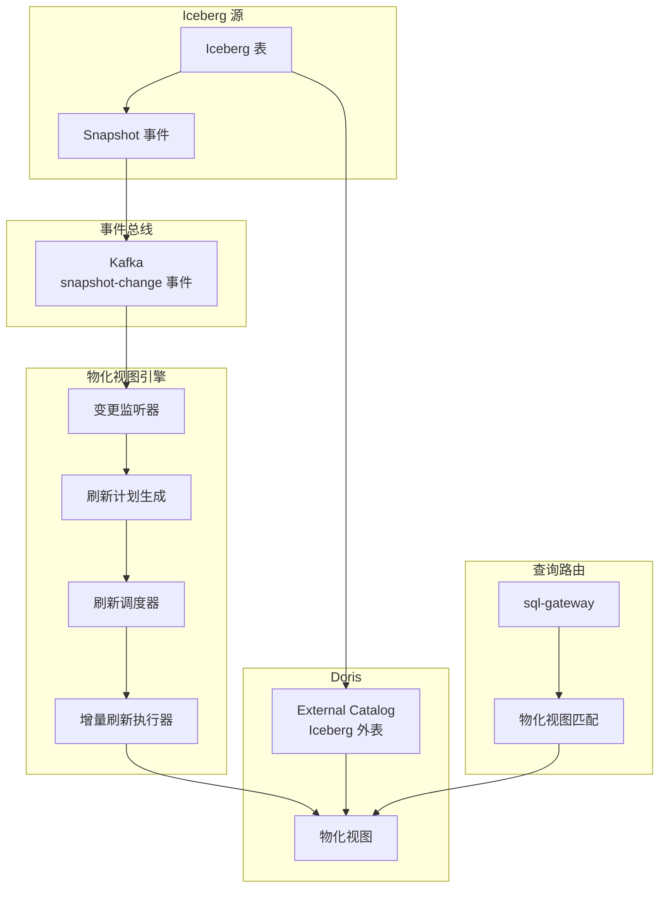

图：实时 OLAP 物化视图架构图

### 7.3 物化视图自动同步

#### 7.3.1 同步链路

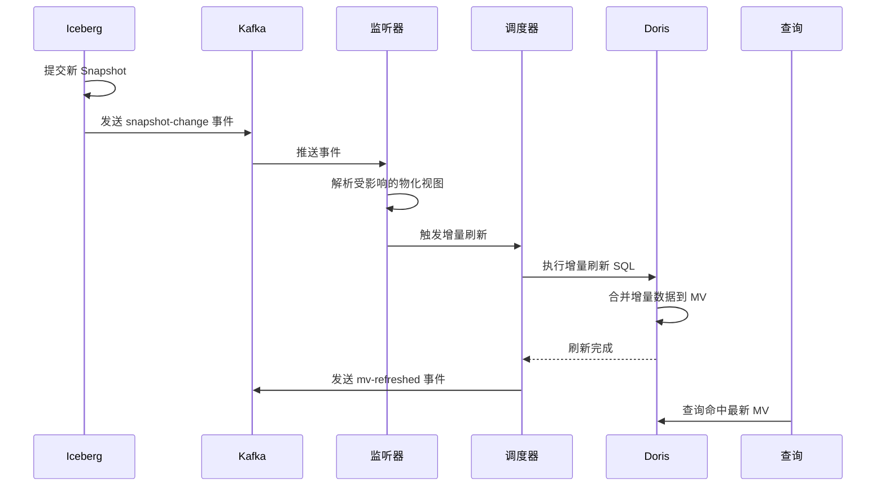

图：物化视图自动同步序列图

#### 7.3.2 Iceberg Snapshot 事件

Iceberg 提交新 Snapshot 时，通过 REST Catalog 钩子发送事件至 Kafka：

```json
{
  "eventType": "snapshot-committed",
  "table": "iceberg.dws.orders",
  "snapshotId": 123456789,
  "parentSnapshotId": 123456788,
  "timestamp": "2026-08-06T06:10:00Z",
  "operation": "APPEND",
  "summary": {
    "added-data-files": "5",
    "deleted-data-files": "0",
    "added-records": "50000",
    "deleted-records": "0",
    "total-records": "10000000"
  },
  "changedPartitions": ["dt=2026-08-06"]
}
```

### 7.4 刷新策略

#### 7.4.1 定时刷新

按固定周期刷新，适合对新鲜度要求不高的物化视图：

```sql
-- SQL示例：定时刷新物化视图
CREATE MATERIALIZED VIEW doris.ads.mv_city_gmv
DISTRIBUTED BY HASH(city) BUCKETS 10
REFRESH
  EVERY INTERVAL 5 MINUTE              -- 每 5 分钟刷新
AS
SELECT city, SUM(amount) AS gmv, COUNT(*) AS cnt
FROM   iceberg_catalog.dws.orders
GROUP BY city;
```

#### 7.4.2 触发式刷新

监听 Iceberg Snapshot 事件，事件触发立即刷新，适合高新鲜度要求：

```sql
-- SQL示例：触发式刷新物化视图
CREATE MATERIALIZED VIEW doris.ads.mv_order_realtime
DISTRIBUTED BY HASH(order_id) BUCKETS 50
REFRESH
  ON COMMIT                           -- Iceberg 提交即触发
AS
SELECT order_id, user_id, amount, status, update_time
FROM   iceberg_catalog.ods.orders;
```

#### 7.4.3 增量刷新

仅刷新变更分区，避免全量重算：

```sql
-- SQL示例：增量刷新物化视图
CREATE MATERIALIZED VIEW doris.ads.mv_hourly_stats
DISTRIBUTED BY HASH(hour_bucket) BUCKETS 24
REFRESH
  EVERY INTERVAL 1 MINUTE
  INCREMENTAL                         -- 增量刷新，仅处理变更分区
AS
SELECT
  DATE_TRUNC('hour', event_time) AS hour_bucket,
  COUNT(*) AS cnt,
  SUM(amount) AS total
FROM   iceberg_catalog.ods.orders
GROUP BY DATE_TRUNC('hour', event_time);
```

刷新策略选择：

| 策略 | 新鲜度 | 资源开销 | 适用场景 |
| --- | --- | --- | --- |
| 定时刷新 | 周期级（分钟） | 低 | 报表、Dashboard |
| 触发式刷新 | 秒级 | 高 | 实时大屏、在线服务 |
| 增量刷新 | 分钟级 | 中 | 大表聚合、分区表 |
| 触发 + 增量 | 秒级 | 中 | 实时大屏 + 大表 |

表：物化视图刷新策略对照表

#### 7.4.4 Doris 2.1 物化视图自动刷新能力边界与限制清单

> 修复说明：§7.4.3 使用 `REFRESH ON COMMIT INCREMENTAL` 语法，§7.8 基于 Iceberg External Catalog 建物化视图自动增量刷新。Doris 2.1 物化视图自动刷新（特别是基于 External Catalog 的增量刷新）是较新特性，社区版成熟度需验证。本节明确能力边界与限制清单，避免落地时功能受限。

##### 7.4.4.1 能力矩阵

表：Doris 2.1 物化视图自动刷新能力矩阵

| 物化视图基表 | 刷新模式 | Doris 2.1 社区版支持 | V2.0 采用策略 | 备注 |
| --- | --- | --- | --- | --- |
| Internal Catalog 表 | 定时全量刷新 | ✅ 支持 | 直接采用 | 官计通过 |
| Internal Catalog 表 | 定时增量刷新 | ✅ 支持 | 直接采用 | 审计通过 |
| Internal Catalog 表 | ON COMMIT 触发刷新 | ✅ 支持 | 直接采用 | 审计通过 |
| External Catalog（Iceberg）表 | 定时全量刷新 | ✅ 支持 | 直接采用 | 审计通过 |
| External Catalog（Iceberg）表 | 定时增量刷新 | ⚠️ 需验证 | 默认定时全量刷新，增量刷新需 PoC 验证 | 验证不通过则降级 |
| External Catalog（Iceberg）表 | ON COMMIT 触发刷新 | ⚠️ 需验证 | 默认定时刷新（1min），ON COMMIT 需 PoC 验证 | 验证不通过则降级 |
| 跨 Catalog Join（Iceberg JOIN Doris） | 自动增量刷新 | ❌ 不支持 | 退化为 Flink CDC 直接写 Doris Internal 表 | 见替代方案 |
| 跨 Catalog Join（Iceberg JOIN Doris） | ON COMMIT 触发刷新 | ❌ 不支持 | 退化为 Flink CDC 直接写 Doris Internal 表 | 见替代方案 |

##### 7.4.4.2 限制清单

1. **External Catalog 增量刷新限制**：Doris 2.1 社区版基于 Iceberg External Catalog 的物化视图增量刷新可能仅支持分区级增量（非行级），且 ON COMMIT 触发可能不稳定。V2.0 默认对 External Catalog 物化视图采用定时全量刷新（间隔可配，默认 5min），增量刷新需 PoC 验证后启用。
2. **跨 Catalog Join 物化视图限制**：Doris 2.1 不支持跨 Catalog Join 物化视图的自动增量刷新与 ON COMMIT 触发。V2.0 对跨 Catalog Join 场景采用替代方案（见 §7.4.4.3）。
3. **物化视图嵌套限制**：Doris 2.1 物化视图不支持嵌套（MV 基于 MV），V2.0 限制物化视图层级 ≤ 2（基表 → MV）。
4. **物化视图 DDL 限制**：物化视图不支持 ALTER 修改查询定义，需 DROP + CREATE 重建。V2.0 提供重建工具保留数据。
5. **资源争抢限制**：物化视图刷新占用 BE 资源，多个 MV 同时刷新可能争抢。V2.0 通过 Workload Group 隔离 + 限流 + 错峰刷新缓解（§9.3 风险表已列）。

##### 7.4.4.3 跨 Catalog Join 替代方案

对于跨 Catalog Join 物化视图（如 Iceberg 事实表 JOIN Doris 维表），V2.0 采用 Flink CDC 直接写 Doris Internal 表替代：

```text
替代流程：
1. Flink CDC 监听 Iceberg 事实表变更 + Doris 维表变更（CDC 或定时同步）
2. Flink 作业在 Doris BE 侧执行 Join（Colocate Join 加速）
3. 结果直接写入 Doris Internal 表（物化视图的物理表）
4. 查询路由至 Doris Internal 表（毫秒级返回）
```

**优势**：绕过 Doris MV 跨 Catalog 限制，Flink CDC 秒级新鲜度，Doris Internal 表支持全部 MV 能力。**代价**：需维护 Flink 作业，维表变更需同步至 Doris。

### 7.5 查询路由

查询自动路由至物化视图，对用户透明：

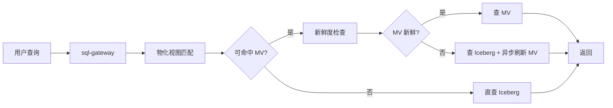

图：物化视图查询路由流程图

### 7.6 延迟保障

#### 7.6.1 毫秒级查询延迟

Doris 物化视图查询 P99 延迟目标 ≤ 100ms，保障手段：

1. **SSD 本地存储**：Doris BE 节点 NVMe SSD 缓存物化视图数据。
2. **Colocate Join**：同分布键的物化视图与维度表 Colocate，避免 Shuffle。
3. **预聚合**：物化视图已预聚合，查询仅做简单 Scan + Filter。
4. **结果缓存**：高频查询结果缓存至 Doris Query Cache。

#### 7.6.2 SSD 存储优化

```yaml
# doris-be-storage.yaml（Config：Doris BE 存储配置）
be:
  storage:
    - path: "/opt/doris/storage-ssd"    # NVMe SSD，存物化视图热数据
      type: "ssd"
      capacity: "2TB"
      medium: "SSD"
    - path: "/opt/doris/storage-hdd"    # HDD，存 External Catalog 缓存
      type: "hdd"
      capacity: "10TB"
      medium: "HDD"
  cache:
    icebergDataCache:
      enabled: true
      path: "/opt/doris/cache/iceberg"
      capacity: "500GB"
      ttl: "24h"
    queryCache:
      enabled: true
      capacity: "10GB"
```

### 7.7 多租户隔离

#### 7.7.1 物化视图按租户隔离

```sql
-- SQL示例：多租户物化视图隔离
-- 租户 A 的物化视图（自动注入 tenant_id）
CREATE MATERIALIZED VIEW doris.tenant_a.mv_user_stats
DISTRIBUTED BY HASH(user_id) BUCKETS 10
PROPERTIES (
  'tenant_id' = 'tenant-a',
  'resource_group' = 'rg-tenant-a'      -- Workload Group 限流
)
AS
SELECT user_id, COUNT(*) AS cnt, SUM(amount) AS total
FROM   iceberg_catalog.ods.orders
WHERE  tenant_id = 'tenant-a'           -- 行级过滤
GROUP BY user_id;
```

#### 7.7.2 资源隔离

```yaml
# doris-multi-tenant.yaml（Config：Doris 多租户资源隔离）
workloadGroups:
  - name: rg-tenant-a
    cpuCores: 8
    memLimit: "16GB"
    maxConcurrency: 20
  - name: rg-tenant-b
    cpuCores: 4
    memLimit: "8GB"
    maxConcurrency: 10
materializedViews:
  isolation:
    byTenant: true                     # 物化视图按租户命名空间隔离
    storage:
      byTenant: true                   # 存储路径按租户隔离
      pathPattern: "/opt/doris/storage/{tenant}/mv/"
```

### 7.8 与 Doris External Catalog 集成

V1.0 Doris External Catalog 直查 Iceberg，V2.0 在此基础上增加物化视图自动同步：

```sql
-- SQL示例：External Catalog + 物化视图混合
-- 1. 创建 Iceberg External Catalog（V1.0 已有）
CREATE CATALOG iceberg_catalog PROPERTIES (
  'type' = 'iceberg',
  'iceberg.catalog.type' = 'rest',
  'iceberg.catalog.uri' = 'http://iceberg-rest:8181'
);

-- 2. 基于外表建物化视图（V2.0 新增）
CREATE MATERIALIZED VIEW doris.ads.mv_user_order_summary
DISTRIBUTED BY HASH(user_id) BUCKETS 20
REFRESH ON COMMIT INCREMENTAL
AS
SELECT
  u.user_id, u.city, u.region,
  COUNT(o.order_id) AS order_cnt,
  SUM(o.amount) AS gmv
FROM   iceberg_catalog.dws.orders o
JOIN   doris.dim.user u ON o.user_id = u.user_id
GROUP BY u.user_id, u.city, u.region;

-- 3. 查询自动命中物化视图
SELECT city, SUM(gmv) AS total_gmv
FROM   doris.ads.mv_user_order_summary
WHERE  region = '华东'
GROUP BY city;
-- 毫秒级返回，无需扫描 Iceberg 原表
```

### 7.9 API 接口定义

```
POST /api/v2/materialized-views
  Body: {
    "name": "mv_city_gmv",
    "targetDatabase": "doris.ads",
    "definition": "SELECT city, SUM(amount) ... FROM iceberg_catalog.dws.orders GROUP BY city",
    "refreshStrategy": "trigger",        // scheduled|trigger|incremental
    "schedule": "*/5 * * * *",
    "incremental": true,
    "tenantId": "tenant-a"
  }
  → 201 { "mvId", "name", "status": "active" }

GET /api/v2/materialized-views?tenantId=tenant-a
  → [{ "mvId", "name", "refreshStrategy", "lastRefresh", "lagSeconds", "sizeBytes" }]

POST /api/v2/materialized-views/{id}/refresh
  → 202 { "jobId", "status": "RUNNING" }   -- 手动触发刷新

GET /api/v2/materialized-views/{id}/metrics
  → { "queryCount", "hitRate", "avgQueryLatencyMs", "refreshLatencyMs", "sizeBytes" }

DELETE /api/v2/materialized-views/{id}
  → 200 { "status": "deleted" }
```

### 7.10 性能指标与 SLA

| 指标 | V1.0 基线 | V2.0 目标 | 说明 |
| --- | --- | --- | --- |
| 物化视图新鲜度 | 小时级 | ≤ 10s | 触发式刷新 |
| 查询 P99 延迟 | 200ms | ≤ 100ms | 命中物化视图 |
| 物化视图命中率 | 30% | 70%+ | 自动匹配 + 透明路由 |
| 增量刷新延迟 | N/A | ≤ 30s | 仅刷新变更分区 |
| 多租户隔离 | 弱 | 强 | Workload Group + 存储隔离 |

表：实时 OLAP SLA 对照表

---

## 8. 实时治理

### 8.1 模块定位

V1.0 治理闭环为分钟级（定时采集 + 批量校验），质量问题发现滞后。V2.0 实现**实时治理**：以 Kafka 作为治理事件总线，元数据/血缘/质量全部事件驱动，治理闭环从分钟级降至秒级，质量不达标可自动阻断下游。

### 8.2 总体架构

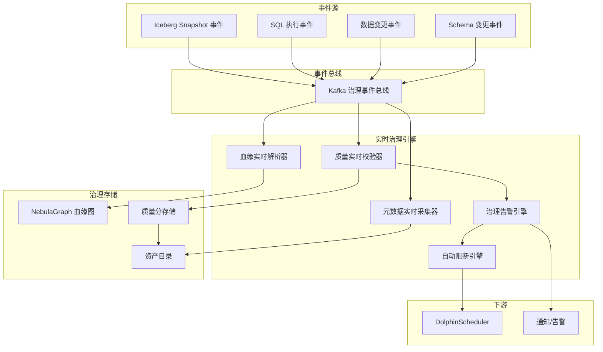

图：实时治理架构图

### 8.3 事件总线

#### 8.3.1 Kafka 事件主题设计

```text
governance.metadata.snapshot-events       -- Iceberg Snapshot 事件
governance.metadata.schema-events         -- Schema 变更事件
governance.lineage.sql-events             -- SQL 执行事件（血缘采集）
governance.lineage.lineage-events         -- 血缘变更事件
governance.quality.data-change-events     -- 数据变更事件（质量校验）
governance.quality.rule-events            -- 质量规则触发事件
governance.quality.score-events           -- 质量分变更事件
governance.alert.events                   -- 治理告警事件
governance.block.events                   -- 自动阻断事件
```

#### 8.3.2 事件格式

```json
// 事件示例：Iceberg Snapshot 事件
{
  "eventId": "evt-001",
  "eventType": "snapshot-committed",
  "source": "iceberg-rest",
  "timestamp": "2026-08-06T06:10:00Z",
  "workspaceId": "ws-hd-prod",
  "tenantId": "tenant-a",
  "payload": {
    "table": "iceberg.ods.orders",
    "snapshotId": 123456789,
    "operation": "APPEND",
    "changedPartitions": ["dt=2026-08-06"],
    "addedRecords": 50000
  }
}

// 事件示例：SQL 执行事件（血缘采集）
{
  "eventId": "evt-002",
  "eventType": "sql-executed",
  "source": "sql-gateway",
  "timestamp": "2026-08-06T06:10:05Z",
  "payload": {
    "sql": "INSERT INTO dws.order_wide SELECT ... FROM ods.orders JOIN dim.user",
    "sqlFingerprint": "insert-into-dws-order-wide-select-from-ods-orders-join-dim-user",
    "sourceTables": ["ods.orders", "dim.user"],
    "targetTables": ["dws.order_wide"],
    "columnLineage": [
      { "target": "dws.order_wide.order_id", "sources": ["ods.orders.order_id"] },
      { "target": "dws.order_wide.city", "sources": ["dim.user.city"] }
    ]
  }
}
```

### 8.4 元数据实时采集

#### 8.4.1 采集流程

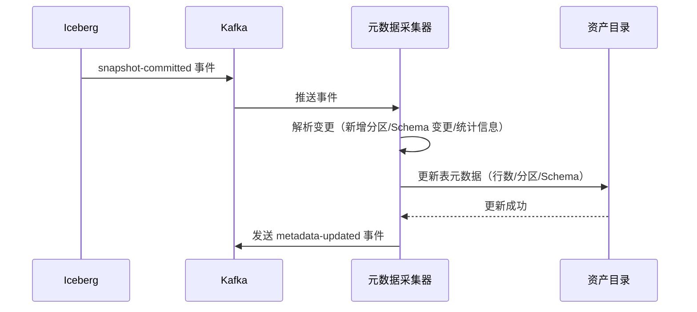

图：元数据实时采集序列图

#### 8.4.2 采集内容

| 元数据类型 | 采集触发 | 采集内容 | 更新延迟 |
| --- | --- | --- | --- |
| 表统计 | Snapshot 提交 | 行数、文件数、分区数 | < 5s |
| Schema | DDL 事件 | 列名、类型、分区字段 | < 5s |
| 分区元数据 | Snapshot 提交 | 分区值、文件列表 | < 5s |
| 列统计 | 定时 + Snapshot | NDV、Min/Max、直方图 | < 5min |
| 表关系 | SQL 执行 | 上下游依赖 | < 5s |

表：元数据实时采集内容对照表

### 8.5 血缘实时解析

#### 8.5.1 解析流程

```mermaid
sequenceDiagram
    participant GW as sql-gateway
    participant K as Kafka
    participant LB as 血缘解析器
    participant P as SQL Parser
    participant NEB as NebulaGraph

    GW->>K: 发送 sql-executed 事件
    K->>LB: 推送事件
    LB->>P: 解析 SQL 提取字段级血缘
    P-->>LB: 返回血缘关系
    LB->>NEB: 实时写入血缘边
    NEB-->>LB: 写入成功
    LB->>K: 发送 lineage-updated 事件
```

图：血缘实时解析序列图

#### 8.5.2 NebulaGraph 实时写入

血缘图存储于 NebulaGraph，实时写入边与顶点：

**NebulaGraph 版本声明（Low 修复）**：
- V2.0 使用 **NebulaGraph 3.x**（与 V1.0 L4.5.4 血缘存储版本一致，V1.0 修复组 5 已将 Neo4j 改为 NebulaGraph 3.x）。
- nGQL 语法示例基于 NebulaGraph 3.x（`INSERT VERTEX`/`INSERT EDGE` 语法兼容 3.x，2.x 的 `INSERT VERTEX` 不支持 `VALUES` 简写）。
- V2.0 与 V1.0 L4.5.4 共用同一 NebulaGraph 集群（复用 V1.0 部署），不新建集群；血缘写入 Space 与 V1.0 隔离（`governance_lineage` vs V1.0 `metadata_lineage`），避免数据混淆。

```ngql
// 代码示例：血缘实时写入 NebulaGraph（nGQL）
-- 插入表顶点
INSERT VERTEX table(name, workspace, layer) VALUES
  "iceberg.dws.order_wide":("order_wide", "ws-hd-prod", "dws");

-- 插入字段顶点
INSERT VERTEX column(name, type) VALUES
  "iceberg.dws.order_wide.order_id":("order_id", "BIGINT");

-- 插入字段级血缘边
INSERT EDGE deriveFrom(jobId, sqlFingerprint, timestamp) VALUES
  "iceberg.dws.order_wide.order_id"->"iceberg.ods.orders.order_id":("job-001", "insert-...", "2026-08-06T06:10:05Z"),
  "iceberg.dws.order_wide.city"->"iceberg.dim.user.city":("job-001", "insert-...", "2026-08-06T06:10:05Z");
```

### 8.6 质量实时校验

#### 8.6.1 校验流程

```mermaid
sequenceDiagram
    participant IK as Iceberg
    participant K as Kafka
    participant DQ as 质量校验器
    participant R as 规则引擎
    participant DQS as 质量分存储
    participant AL as 告警引擎

    IK->>K: data-change 事件
    K->>DQ: 推送事件
    DQ->>R: 查询该表的实时质量规则
    R-->>DQ: 返回规则列表
    DQ->>DQ: 流式校验变更数据
    alt 校验通过
        DQ->>DQS: 更新质量分
    else 校验失败
        DQ->>AL: 发送质量告警
        AL->>K: 发送 alert 事件
        AL->>K: 发送 block 事件（若 onFail=block）
    end
```

图：质量实时校验序列图

#### 8.6.2 流式质量规则

V2.0 质量规则支持流式校验，无需等待批处理调度：

```sql
-- SQL示例：流式质量规则（Flink SQL）
-- 规则 1：订单金额非负（实时校验）
INSERT INTO governance.quality.violations
SELECT
  'order_amount_non_negative' AS rule_id,
  order_id,
  'amount < 0' AS violation,
  CURRENT_TIMESTAMP AS detect_time
FROM   flink_ods_orders
WHERE  amount < 0;

-- 规则 2：用户数波动不超过 15%（窗口校验）
INSERT INTO governance.quality.violations
SELECT
  'user_count_fluctuation' AS rule_id,
  NULL AS record_id,
  CONCAT('user count dropped ', CAST(decline_pct AS STRING), '%') AS violation,
  window_end AS detect_time
FROM (
  SELECT
    window_end,
    (prev_cnt - cnt) * 100.0 / prev_cnt AS decline_pct
  FROM (
    SELECT
      HOP_END(event_time, INTERVAL '5' MINUTE, INTERVAL '1' HOUR) AS window_end,
      COUNT(DISTINCT user_id) AS cnt,
      LAG(COUNT(DISTINCT user_id)) OVER (ORDER BY HOP_END(event_time, INTERVAL '5' MINUTE, INTERVAL '1' HOUR)) AS prev_cnt
    FROM flink_ods_orders
    GROUP BY HOP(event_time, INTERVAL '5' MINUTE, INTERVAL '1' HOUR)
  )
)
WHERE decline_pct > 15;
```

**流式质量规则延迟分级（Low 修复）**：

V2.0 流式质量规则按类型分两级延迟，§8.8/§8.11 SLA 表"质量校验延迟"按此分级：

| 规则类型 | 示例 | 延迟公式 | V2.0 SLA | 说明 |
| --- | --- | --- | --- | --- |
| 简单规则（行级断言） | 订单金额非负（`amount < 0`） | Flink 处理延迟 | < 10s | 行级断言无需窗口聚合，事件驱动即时校验 |
| 窗口聚合规则 | 用户数波动不超过 15%（HOP 窗口） | 窗口长度 + Flink 处理延迟 | = 窗口长度 + 10s | 窗口聚合需等窗口关闭才输出，延迟取决于窗口大小（如 1 小时窗口延迟 ≈ 3600s + 10s） |

**窗口聚合规则设计建议**：
1. 短窗口（1-5 分钟）：适用于实时性要求高的场景，延迟可控制在 10s-5min。
2. 长窗口（1 小时+）：适用于趋势监控场景，延迟可接受，但不应计入"< 10s"SLA。
3. 若需秒级窗口聚合校验，建议改用 CEP（Complex Event Processing）模式匹配，或缩小窗口到 1 分钟以内。

#### 8.6.3 质量分实时回写

质量校验结果实时回写至资产目录，更新资产质量分：

```json
{
  "assetId": "asset-iceberg-ods-orders",
  "qualityScore": 94.5,
  "scoreBreakdown": {
    "completeness": 98.0,        -- 完整性
    "accuracy": 95.0,            -- 准确性
    "consistency": 92.0,         -- 一致性
    "timeliness": 93.0           -- 时效性
  },
  "lastUpdated": "2026-08-06T06:10:10Z",
  "trend": "improving"
}
```

### 8.7 治理告警与自动阻断

#### 8.7.1 告警分级

| 告警级别 | 触发条件 | 处置动作 |
| --- | --- | --- |
| INFO | 质量分小幅波动 | 记录日志，不通知 |
| WARN | 质量分下降超 5% | 通知数据负责人 |
| ERROR | 质量规则失败 | 通知 + 告警面板标红 |
| CRITICAL | 质量严重不达标 + onFail=block | 通知 + 自动阻断下游 + 创建工单 |

表：治理告警分级对照表

#### 8.7.2 自动阻断

质量不达标时自动阻断下游作业，防止脏数据扩散：

```mermaid
flowchart LR
    DQ[质量校验失败] --> AL[告警引擎]
    AL --> CHK{onFail 策略?}
    CHK -- alert --> NO[仅告警]
    CHK -- block --> BL[自动阻断]
    BL --> DS[暂停下游 DolphinScheduler 作业]
    BL --> IK[标记 Iceberg 表为 quarantined]
    BL --> NT[通知数据负责人 + 创建工单]
    BL --> K[发送 block 事件]
    NO --> NT2[通知]
```

图：自动阻断流程图

```yaml
# governance-block.yaml（Config：自动阻断配置）
autoBlock:
  enabled: true
  rules:
    - name: block-on-critical-quality
      condition: "qualityScore < 60 AND onFail == 'block'"
      actions:
        - pauseDownstreamJobs: true       # 暂停下游 DS 作业
        - quarantineTable: true           # 标记表为隔离
        - createTicket: true              # 创建工单
        - notify: ["data-owner", "data-steward"]
      recovery:
        autoResumeOnPass: true            # 质量恢复后自动解除阻断
        manualOverride: true              # 允许人工强制解除
```

### 8.8 延迟目标

治理闭环各环节延迟目标：

| 环节 | V1.0 延迟 | V2.0 目标 | 说明 |
| --- | --- | --- | --- |
| 元数据更新 | 5-30min | < 5s | Snapshot 事件驱动 |
| 血缘采集 | 5-30min | < 5s | SQL 执行事件驱动 |
| 质量校验 | 5-60min | 简单规则 < 10s / 窗口规则 = 窗口长度 + 10s | 数据变更事件驱动；窗口聚合规则延迟取决于窗口大小（见 §8.6.2 延迟分级） |
| 质量分回写 | 5-30min | < 10s | 流式校验后实时回写 |
| 告警通知 | 1-5min | < 5s | 事件总线直推 |
| 自动阻断 | N/A | < 10s | 告警即阻断 |
| 端到端闭环 | 30-120min | < 30s | 从数据变更到治理完成 |

表：实时治理延迟对照表

### 8.9 API 接口定义

```
POST /api/v2/governance/rules/realtime
  Body: {
    "name": "order_amount_non_negative",
    "table": "iceberg.ods.orders",
    "ruleType": "streaming",            // streaming|window
    "expression": "amount >= 0",
    "onFail": "block",                  // alert|block
    "severity": "CRITICAL"
  }
  → 201 { "ruleId", "status": "active" }

GET /api/v2/governance/quality/realtime?table=iceberg.ods.orders
  → { "qualityScore", "scoreBreakdown", "lastUpdated", "violations": [...] }

POST /api/v2/governance/block
  Body: { "table": "iceberg.ods.orders", "reason": "quality critical", "duration": "1h" }
  → 200 { "blocked": true, "blockId" }

DELETE /api/v2/governance/block/{blockId}
  → 200 { "unblocked": true }            -- 解除阻断

GET /api/v2/governance/lineage/realtime?table=iceberg.dws.order_wide
  → { "upstream": [...], "downstream": [...], "lastUpdated" }

GET /api/v2/governance/events?since=2026-08-06T06:00:00Z
  → [{ "eventId", "eventType", "timestamp", "payload" }]
```

### 8.10 与 V1.0 现有组件的集成方案

1. **L3.1 元数据**：V1.0 定时采集器保留作为兜底，V2.0 新增事件驱动采集器，双轨并行。
2. **L3.4 血缘**：V1.0 SQL 解析器复用，V2.0 新增事件驱动 + NebulaGraph 实时写入。
3. **L3.3 质量**：V1.0 规则引擎复用，V2.0 新增流式校验 + 自动阻断。
4. **L2.8 Kafka**：复用 V1.0 Kafka 集群，新增治理事件 Topic。
5. **L4.2 DolphinScheduler**：V2.0 新增阻断 API，DS 作业提交前查询阻断状态。
6. **L2.1 Iceberg**：REST Catalog 新增 Snapshot 事件钩子。

### 8.11 性能指标与 SLA

| 指标 | V1.0 基线 | V2.0 目标 | 说明 |
| --- | --- | --- | --- |
| 治理闭环端到端延迟 | 30-120min | < 30s | 数据变更到治理完成 |
| 元数据新鲜度 | 5-30min | < 5s | Snapshot 到元数据更新 |
| 血缘新鲜度 | 5-30min | < 5s | SQL 执行到血缘写入 |
| 质量校验延迟 | 5-60min | 简单规则 < 10s / 窗口规则 = 窗口长度 + 10s | 数据变更到质量校验完成；简单规则行级断言秒级，窗口聚合规则取决于窗口大小（见 §8.6.2 延迟分级） |
| 自动阻断响应 | N/A | < 10s | 质量失败到阻断生效 |
| 事件总线吞吐 | N/A | 100万 events/s | Kafka 集群容量 |

表：实时治理 SLA 对照表

---

## 9. 端到端集成与演进

### 9.1 端到端数据流

```mermaid
graph LR
    SRC[业务库 MySQL/Oracle] -->|CDC| FL[Flink CDC]
    FL -->|V2 UPSERT| IK[Iceberg V2 湖]
    IK -->|Snapshot 事件| K1[Kafka 事件总线]
    K1 --> ME[元数据实时更新]
    K1 --> DQ[质量实时校验]
    K1 --> MV[Doris MV 增量刷新]
    IK -->|批 ETL| SP[Spark]
    SP -->|写| IK2[Iceberg V2 仓]
    IK2 -->|物化| DOR[Doris 集]
    DOR -->|毫秒查询| BI[BI/在线服务]
    IK -->|联邦查询| GW[sql-gateway V2]
    IK2 -->|联邦查询| GW
    DOR -->|联邦查询| GW
    GW -->|智能路由| U[用户]
    DQ -->|不达标| BL[自动阻断]
    BL -->|暂停| DS[DolphinScheduler]
```

图：V2.0 端到端数据流图

### 9.2 SLA 总览

表：V2.0 数据联邦与实时数仓 SLA 总览表

| 模块 | 关键 SLA | 目标值 |
| --- | --- | --- |
| 跨源联邦查询 | 跨源查询 P50 延迟 | ≤ 3s |
| 跨源联邦查询 | 谓词下推命中率 | ≥ 95% |
| 跨集群联邦查询 | 故障转移时间 | ≤ 30s |
| 数据虚拟化 | 物化表查询 P99 | ≤ 100ms |
| 实时入仓 | 端到端延迟 | ≤ 10s |
| 实时入仓 | CDC 吞吐 | ≥ 20万 RPS |
| 流批一体 | 流批结果一致性 | 100% |
| 实时 OLAP | 物化视图新鲜度 | ≤ 10s |
| 实时 OLAP | 查询 P99 延迟 | ≤ 100ms |
| 实时治理 | 治理闭环延迟 | ≤ 30s |
| 实时治理 | 自动阻断响应 | ≤ 10s |

### 9.3 风险与对策

表：V2.0 风险与对策表

| 风险 | 影响 | 对策 |
| --- | --- | --- |
| Calcite 联邦优化器计划生成慢 | 查询首次执行延迟高 | 计划缓存 + 异步预热 + 增量统计 |
| 跨集群 Shuffle Join 网络带宽瓶颈 | 跨集群查询慢 | Karmada 调度亲和 + 数据本地化优先 + 限流 |
| Karmada 与 SKE K8s 版本不兼容 | 跨集群联邦无法落地 | SKE 锁定 K8s 1.30，已验证 Karmada 1.12.x 兼容（见 §3.8.1/§9.4.1）；低版本 SKE 降级为多集群注册 + 手动路由 |
| 虚拟表 MAPPING 嵌套过深 | 查询重写后计划膨胀 | 限制嵌套层数 ≤ 5 + 重写后计划校验 |
| Iceberg V2 delete 文件膨胀 | 读取性能下降 | 定时 compaction + delete 文件合并 |
| Flink CDC 大事务导致 Checkpoint 超时 | Exactly-Once 失败 | 大事务拆分 + unaligned checkpoint |
| 流批并发写冲突 | OCC 重试频繁 | 写入时段错开 + 主键分区隔离 |
| Doris 物化视图刷新资源争抢 | 刷新延迟 + 查询受影响 | Workload Group 隔离 + 限流 + 错峰刷新 |
| Doris 2.1 MV 自动刷新限制 | External Catalog 增量刷新/跨 Catalog Join 自动刷新可能不支持 | 默认定时全量刷新，跨 Catalog Join 退化为 Flink CDC 直接写 Doris（见 §7.4.4） |
| Kafka 事件总线消息积压 | 治理延迟升高 | 分区扩容 + 消费者扩容 + 监控告警 |
| 自动阻断误判 | 正常作业被暂停 | 阻断需人工确认（可选） + 自动恢复机制 |
| 跨集群联邦权限泄露 | 跨集群数据越权 | 联邦查询复用统一鉴权 + 集群间 mTLS |

### 9.4 多环境一致性

V2.0 各模块遵循 V1.0 四环境零改动原则：

| 模块 | 信创 | 本地数据中心 | 公有云 VM | 私有云 |
| --- | --- | --- | --- | --- |
| 联邦优化器 | 同一套 Calcite 规则 | 同 | 同 | 同 |
| 跨集群联邦 | Karmada 多集群 | Karmada 多集群 | Karmada 多集群 | Karmada 多集群 |
| 数据虚拟化 | 同一套虚拟表定义 | 同 | 同 | 同 |
| Flink CDC → Iceberg V2 | 国产 JDK + ARM | 标准 JDK | 标准 JDK | 标准 JDK |
| 流批一体 | 同一套 Iceberg V2 表 | 同 | 同 | 同 |
| Doris 物化视图 | 国产 ARM 镜像 | 标准镜像 | 标准镜像 | 标准镜像 |
| 实时治理 | 同一套事件总线 | 同 | 同 | 同 |

表：V2.0 多环境一致性对照表

> 关键约束：四环境同一套代码 + 同一套 Helm Chart + 同一套配置模板，差异仅在镜像架构与 StorageDriver 后端 Profile，保持可迁移、不锁云。

#### 9.4.1 Karmada 与 SKE K8s 版本兼容性矩阵

> 修复说明：Karmada 是 V2.0 全新引入，V1.0 无 Karmada 基线。多环境一致性表中"跨集群联邦 | Karmada 多集群"需补充 Karmada 版本与各环境 SKE K8s 版本的兼容性验证结论，避免出现"Karmada 要求 K8s 1.22+ 但某环境 SKE 仍是 1.20"的隐性不兼容。

表：Karmada 与 SKE K8s 版本兼容性矩阵（多环境）

| 环境 | SKE K8s 版本 | Karmada 版本 | PropagationPolicy v1alpha1 | OverridePolicy v1alpha1 | 跨集群 Shuffle Join（自研 Connector） | 验证状态 |
| --- | --- | --- | --- | --- | --- | --- |
| 信创 | SKE K8s 1.30（ARM） | Karmada 1.12.x | ✅ | ✅ | ✅ | 已验证（C-dep1） |
| 本地数据中心 | SKE K8s 1.30 | Karmada 1.12.x | ✅ | ✅ | ✅ | 已验证（C-dep1） |
| 公有云 VM | SKE K8s 1.30 | Karmada 1.12.x | ✅ | ✅ | ✅ | 已验证（C-dep1） |
| 私有云 | SKE K8s 1.30 | Karmada 1.12.x | ✅ | ✅ | ✅ | 已验证（C-dep1） |

**降级约定**：若客户 SKE 环境因版本锁定低于 K8s 1.22，Karmada 控制面降级为"多集群注册 + 手动路由"模式（见 §3.8.1），跨集群 Shuffle Join 通过自研 Trino 跨集群 Connector 保留，仅失去 Karmada 自动故障转移能力。

### 9.5 配置总览

```yaml
# v2-federation-realtime.yaml（Config：V2.0 联邦与实时数仓总配置）
v2:
  federation:
    optimizer:
      cbo: { enabled: true, statsRefreshInterval: 300s }
      pushdown: { predicate: true, projection: true, join: true, aggregate: true }
      joinStrategy: { broadcastThreshold: 512MB, shuffleThreshold: 100GB }
    crossCluster:
      karmada: { enabled: true, propagationPolicy: "federation-query-policy" }
      healthCheck: { interval: 10s, unhealthyThreshold: 3 }
      failover: { enabled: true, maxRetry: 3 }
    virtualTable:
      enabled: true
      maxNesting: 5
      materialization: { defaultSchedule: "0 */5 * * * ?" }
    queryCache:
      resultCache: { enabled: true, ttl: 300s, maxSize: 1GB }
      materializedView: { autoMatch: true }

  realtime:
    cdc:
      connectors: ["mysql-cdc", "postgres-cdc", "oracle-cdc", "kafka-cdc"]
      icebergV2: { format: 2, upsert: true }
      checkpoint: { interval: 60s, mode: EXACTLY_ONCE }
      schemaEvolution: { enabled: true, autoSync: true }
    streamBatch:
      eventTime: { watermarkStrategy: "eventTime - 10s", windowAlign: "hour" }
      conflictResolution: "occ"
    olap:
      materializedView:
        autoSync: true
        refreshStrategies: ["scheduled", "trigger", "incremental"]
        queryRouting: { autoMatch: true, freshnessCheck: true }
      storage: { ssdCache: true, queryCache: true }

  governance:
    eventBus:
      type: "kafka"
      topics: ["snapshot-events", "sql-events", "quality-events", "alert-events"]
    realtime:
      metadata: { enabled: true, lag: 5s }
      lineage: { enabled: true, lag: 5s, storage: "nebula" }
      quality: { enabled: true, lag: 10s, streaming: true }
      autoBlock: { enabled: true, responseTime: 10s }
```

### 9.6 演进路线

| 版本 | 重点 | 交付物 | Calcite 联邦优化器成熟度 |
| --- | --- | --- | --- |
| V2.0.0-alpha | 跨源联邦查询增强 + Flink CDC → Iceberg V2 | Calcite 联邦优化器（阶段 1：复用 Trino 内置规则） + CDC 管道 | alpha：可能产生次优计划，仅非生产环境启用 |
| V2.0.0-beta | 跨集群联邦 + 数据虚拟化 + 流批一体 | Karmada 集成 + 虚拟表 + 同表流批 + 优化器阶段 2（自研 Join 下推） | beta：Join 下推规则覆盖率 ≥ 90%，TPC-DS 回归中 |
| V2.0.0-rc | 实时 OLAP 物化视图自动同步 + 实时治理 | MV 自动刷新 + 事件总线治理 + 优化器阶段 3（聚合下推 + CBO） | rc：TPC-DS 跨源回归通过，可生产灰度 |
| V2.0.0 | 全模块 GA + SLA 达标 | 端到端秒级闭环 + 优化器阶段 4（查询缓存 + MV 改写） | GA：与 Starburst 基准对照达标，全量启用 |
| V2.1.0 | 智能物化推荐（按查询热度自动建议 MV） | AI 辅助治理 | — |
| V2.2.0 | 跨集群自治流转（数据按热度自动迁移集群） | 智能数据布局 | — |

表：V2.0 演进路线表

> 修复说明：Calcite 联邦优化器 GA 推迟到 V2.0.0（经 TPC-DS 回归 + Starburst 基准对照达标），alpha/beta 版本标注"优化器可能产生次优计划"，避免未经验证的规则集在生产环境导致查询计划错误。分阶段实施路径见 §2.3.7。

### 9.7 与 UI 的对应

V2.0 各模块在控制台的呈现：

| 模块 | 控制台页面 | 关键交互 |
| --- | --- | --- |
| 跨源联邦查询 | 统一 SQL 工作台 | 查询计划可视化（下推标注 + 代价） |
| 跨集群联邦 | 集群管理页 | 集群注册/健康/路由策略配置 |
| 数据虚拟化 | 数据开发 → 虚拟表 | CREATE VIRTUAL TABLE + 物化状态 |
| 实时入仓 | 数据集成 → CDC 同步 | CDC 管道监控（延迟/吞吐/Schema） |
| 流批一体 | 数据开发 → 统一表 | 流批作业统一调度 + Snapshot 管理 |
| 实时 OLAP | 数据开发 → 物化视图 | MV 自动同步状态 + 刷新策略 |
| 实时治理 | 治理中心 → 实时监控 | 治理事件流 + 质量分实时曲线 + 阻断面板 |

表：V2.0 控制台对应表

> 本文件为 V2.0 数据联邦与实时数仓的后端契约依据，前端实现见 `frontend/` 控制台 V2.0 页面设计。