# V2.0 行业模板与其他增强详细设计

> 归属：数擎大数据平台 · V2.0 增强设计
> 对标：行业 ISV 解决方案 / Salesforce AppExchange / DataMesh 数据资产流通
> 关联：L5.3 行业应用模板；L5.4 业务线门户；L5.5 开放 API 服务目录；L5.6 数据资产流通；L3.7 安全脱敏；X1 统一身份权限；X2 安全合规；X3 统一运维观测；X4 API 网关
> V1.0 基线：industry-templates（Python/5 行业 9 模板：金融/政务/制造/零售/物联网）、business-portal、open-api-catalog、asset-exchange、rule-engine（安全脱敏）

## 第1章 总体设计

### 1.1 V2.0 增强范围

V2.0 在 V1.0 基线之上**保留 V1.0 全部 5 行业 9 模板**（金融/政务/制造/零售/物联网）并**新增能源行业**，合计 **6 行业 10+ 模板**；并将 V1.0 骨架组件（asset-exchange、open-api-catalog、rule-engine）演进为全流程落地能力，同时补齐安全合规、国密支持与可观测增强四项横切能力。

> 兼容性声明：V1.0 已交付的物联网行业模板（iot-device-health 设备健康度）在 V2.0 **保留并增强**，与新增能源行业模板共享 IoTDB 时序底座（见 §6.5 物联网行业模板增强）。V1.0 租户已安装的 iot-device-health 模板可通过 Helm upgrade 平滑升级到 V2.0 增强版，不废弃、不合并，确保 V1.0→V2.0 兼容承诺可信。

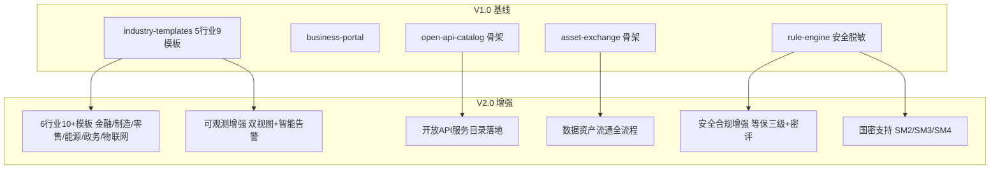

### 1.2 设计原则

1. **行业 Know-How 沉淀**：每个行业模板包含完整数据集市（ODS→DWD→DWS→ADS）、DAG 作业流、Dashboard 看板、RBAC 角色与 Helm Chart，开箱即用。
2. **骨架到落地演进**：V1.0 骨架组件保留 API 契约向后兼容，V2.0 补齐持久化、审批流、计费结算、网关下发等全流程能力。
3. **横切能力统一封装**：安全合规、国密、可观测以 Facade 模式统一封装，业务层零感知。
4. **多租户隔离继承**：所有增强继承 V1.0 三重隔离机制（Namespace+NetworkPolicy+租户标签），不破坏既有隔离边界。
5. **信创优先**：国密算法、信创数据库适配、ARM 镜像验证作为一等公民。

### 1.3 与 V1.0 架构对齐

表：V2.0模块与V1.0架构对齐表

| V2.0 模块 | 归属层级 | V1.0 基线组件 | 演进类型 |
| --- | --- | --- | --- |
| 6 行业模板 | L5.3 | industry-templates（5 行业 9 模板：金融/政务/制造/零售/物联网） | 扩展（新增能源 + 增强现有金融/政务/制造/零售/物联网 5 行业，物联网保留并增强见 §6.5） |
| 数据资产流通 | L5.6 | asset-exchange（骨架） | 落地（全流程 + 计费结算） |
| 开放 API 目录 | L5.5 | open-api-catalog（骨架） | 落地（APISIX 下发 + 计费） |
| 安全合规增强 | X2 | rule-engine（脱敏） | 增强（等保三级 + 密评 + 证据归档） |
| 国密支持 | X1/X2 | rule-engine（SM2/SM3/SM4 脱敏） | 增强（CryptoSpiFactory + Keycloak 集成） |
| 可观测增强 | X3 | Prometheus+Grafana+Loki+Tempo | 增强（双视图 + 智能告警 + SLO） |

### 1.4 通用 Helm Chart 结构

所有行业模板统一遵循以下 Chart 结构，确保一致性：

```text
industry-{行业}/
├── Chart.yaml                      # 模板元信息
├── values.yaml                     # 租户级参数（数据源占位/阈值/租户ID）
├── schema.json                     # values 字段校验 schema
├── README.md                       # 业务说明/参数表/升级注意事项
└── templates/
    ├── namespace.yaml              # 租户级 Namespace + ResourceQuota + NetworkPolicy
    ├── ddl/                        # 数据模型：Iceberg Schema DDL
    │   ├── ods_*.sql               # ODS 贴源层
    │   ├── dwd_*.sql               # DWD 明细层
    │   ├── dws_*.sql               # DWS 汇总层
    │   └── ads_*.sql               # ADS 应用层
    ├── dags/                       # DolphinScheduler DAG JSON
    ├── dashboards/                 # Superset dashboard JSON + ECharts option
    ├── rbac/                       # Keycloak realm/client/role JSON
    ├── secrets.yaml                # 数据源连接 Secret（加密存储）
    └── networkpolicy.yaml          # 租户网络隔离策略
```

### 1.5 多租户与安全通用约束

1. **租户隔离**：每个模板实例部署到独立 Namespace `ws-{tenantId}-{templateId}`，继承 V1.0 三重隔离。
2. **数据隔离**：Iceberg 表路径按 `tenant/{tid}/{industry}/` 分层，Doris Catalog 按租户隔离。
3. **身份隔离**：JWT 携带 `tenant` claim，Keycloak Realm 按租户隔离，RBAC 角色按行业模板预置。
4. **安全审计**：所有模板作业执行经 rule-engine 审计，安全日志归档至 X2 证据库。
5. **国密默认**：信创环境强制启用 SM2/SM3/SM4，非信创环境可选国际算法。

### 1.6 各行业第三方系统对接依赖矩阵

> 修复说明：各行业模板均依赖客户第三方系统（金融监管报送、制造 MES/ERP、零售 POS/CRM、能源 SCADA/EMS、政务数据汇聚平台、物联网设备平台）。原各行业§x.8 仅提"industry-templates 集成：新增 xxx.py 模板文件"，未明确第三方系统对接规范（API 契约/数据格式/网络打通），模板无法真正"开箱即用"。本节给出统一对接依赖矩阵，各行业§x.8/§x.9 引用本节并补充行业特定细节。

#### 1.6.1 对接依赖矩阵

表：各行业第三方系统对接依赖矩阵

| 行业 | 第三方系统 | 数据源类型 | SeaTunnel Connector / Adapter | 网络打通 | values.yaml 参数 | 对接前置条件 |
| --- | --- | --- | --- | --- | --- | --- |
| 金融 | 监管报送系统（EAST/1104/反洗钱） | SFTP / REST API | SFTP Source / HTTP Source | VPN 专线至监管报送平台 | `regulatory.sftpHost`、`regulatory.apiEndpoint` | 客户提供报送账号 + 专线 |
| 金融 | 核心业务系统（客户/账户/交易） | MySQL / Oracle CDC | MySQL-CDC / Oracle-CDC | NetworkPolicy 放行 + DB 直连 | `coreDb.url`、`coreDb.user`、`coreDb.pwdSecret` | 客户提供 DB 只读账号 |
| 制造 | MES（工单/工序/质检） | MySQL / REST API | MySQL-CDC / HTTP Source | VPN 至 MES 内网 | `mes.url`、`mes.apiKeySecret` | 客户提供 MES API 文档 |
| 制造 | ERP（物料/BOM/库存） | Oracle / SAP HANA | JDBC Source（Oracle/HANA） | VPN 至 ERP 内网 | `erp.url`、`erp.user`、`erp.pwdSecret` | 客户提供 ERP 只读账号 |
| 制造 | SCADA（设备实时数据） | OPC UA / MQTT | 自研 OPC-UA Source / MQTT Source | 工业网关 + 网络隔离 | `scada.opcUaEndpoint`、`scada.mqttBroker` | 客户提供 OPC UA 服务端点 |
| 零售 | POS（订单/支付/商品） | MySQL / Kafka | MySQL-CDC / Kafka Source | VPN 至 POS 内网或 Kafka 集群 | `pos.dbUrl`、`pos.kafkaBrokers` | 客户提供 POS DB 或 Kafka |
| 零售 | CRM（会员/营销/触达） | MySQL / REST API | MySQL-CDC / HTTP Source | VPN 至 CRM 内网 | `crm.url`、`crm.apiKeySecret` | 客户提供 CRM API 文档 |
| 能源 | SCADA（能耗实时采集） | OPC UA / IEC 104 | 自研 OPC-UA Source / IEC104 Source | 工业网关 + 网络隔离 | `scada.opcUaEndpoint`、`scada.iec104Ip` | 客户提供 SCADA 服务端点 |
| 能源 | EMS（能源管理系统） | MySQL / REST API | MySQL-CDC / HTTP Source | VPN 至 EMS 内网 | `ems.url`、`ems.apiKeySecret` | 客户提供 EMS API 文档 |
| 政务 | 政务数据汇聚平台 | REST API / Kafka | HTTP Source / Kafka Source | 政务专网 + API 网关鉴权 | `govDataPlatform.apiEndpoint`、`govDataPlatform.appKeySecret` | 客户提供汇聚平台接入授权 |
| 政务 | 各委办局业务系统 | MySQL / Oracle / REST API | JDBC Source / HTTP Source | 政务专网 + DB 直连 | `bureauDb.{name}.url`、`bureauDb.{name}.pwdSecret` | 客户提供各委办局 DB 账号 |
| 物联网 | 设备平台（设备影子/物模型） | MQTT / REST API | MQTT Source / HTTP Source | IoT 平台 + API 鉴权 | `iotPlatform.mqttBroker`、`iotPlatform.apiKeySecret` | 客户提供设备平台接入凭证 |

#### 1.6.2 对接通用规范

1. **数据源参数化**：所有第三方系统连接信息在 `values.yaml` 中参数化，敏感信息（密码/API Key）存入 Kubernetes Secret，模板实例化时由租户填写。
2. **网络打通**：模板 `networkpolicy.yaml` 默认拒绝所有出站，需租户在实例化时显式放行至第三方系统端点的 NetworkPolicy Egress 规则；跨网络走 VPN/专线时由客户运维配置。
3. **数据格式适配**：优先复用 SeaTunnel 内置 Connector（MySQL-CDC/JDBC/HTTP/MQTT/Kafka）；无内置 Connector 的（OPC UA/IEC 104）由平台提供自研 Source，注册到 SeaTunnel 插件目录。
4. **README 标注**：每个模板 `README.md` 顶部标注"对接前置条件"，明确需客户提供的数据源访问权限、API 文档、网络打通方式，避免"开箱即用"误导。
5. **Schema 兼容性校验**：模板实例化前校验第三方系统数据 Schema 与模板 ODS 层 DDL 的兼容性，不兼容则提示租户调整 DDL 或使用 Schema 映射。

## 第2章 金融行业模板

### 2.1 模板定位

金融行业模板面向银行、保险、证券、消金等金融机构，提供风控数据集市与监管报表数据集市两大核心能力，覆盖信贷风控、反欺诈、信用评分、监管报送全场景。

表：金融行业模板清单

| 模板 ID | 模板名 | 核心能力 | 关键技术栈 |
| --- | --- | --- | --- |
| fin-risk-mart | 风控数据集市 | 信贷/反欺诈/信用评分数据集市 | Iceberg + Spark + Flink + Doris |
| fin-reg-report | 监管报表数据集市 | EAST/1104/反洗钱报表 | Spark + Doris + Superset |

### 2.2 数据集市架构

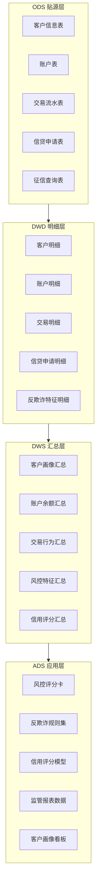

### 2.3 DDL 设计

#### 2.3.1 客户表

```sql
-- SQL功能名：金融客户表DDL
CREATE TABLE IF NOT EXISTS iceberg.`tenant/{tid}/finance`.dwd_fin_customer (
    customer_id          STRING      COMMENT '客户唯一标识',
    customer_name        STRING      COMMENT '客户姓名（脱敏）',
    id_card_no           STRING      COMMENT '身份证号（SM4加密存储）',
    phone_no             STRING      COMMENT '手机号（脱敏）',
    customer_type        STRING      COMMENT '客户类型：个人/企业',
    gender               STRING      COMMENT '性别',
    age                  INT         COMMENT '年龄',
    occupation           STRING      COMMENT '职业',
    income_level         STRING      COMMENT '收入等级',
    credit_level         STRING      COMMENT '信用等级',
    register_date        TIMESTAMP   COMMENT '注册日期',
    tenant_id            STRING      COMMENT '租户ID',
    dt                   STRING      COMMENT '分区字段：业务日期'
) USING iceberg
PARTITIONED BY (dt, tenant_id)
TBLPROPERTIES ('write.format.default'='parquet');
```

#### 2.3.2 账户表

```sql
-- SQL功能名：金融账户表DDL
CREATE TABLE IF NOT EXISTS iceberg.`tenant/{tid}/finance`.dwd_fin_account (
    account_id           STRING      COMMENT '账户唯一标识',
    customer_id          STRING      COMMENT '客户ID',
    account_type         STRING      COMMENT '账户类型：储蓄/信贷/信用卡',
    account_status       STRING      COMMENT '账户状态：正常/冻结/注销',
    open_date            TIMESTAMP   COMMENT '开户日期',
    credit_limit         DECIMAL(18,2) COMMENT '信用额度',
    balance              DECIMAL(18,2) COMMENT '账户余额',
    overdue_days         INT         COMMENT '逾期天数',
    tenant_id            STRING      COMMENT '租户ID',
    dt                   STRING      COMMENT '分区字段'
) USING iceberg
PARTITIONED BY (dt, tenant_id);
```

#### 2.3.3 交易表

```sql
-- SQL功能名：金融交易流水表DDL
CREATE TABLE IF NOT EXISTS iceberg.`tenant/{tid}/finance`.dwd_fin_transaction (
    txn_id               STRING      COMMENT '交易唯一标识',
    account_id           STRING      COMMENT '账户ID',
    customer_id          STRING      COMMENT '客户ID',
    txn_type             STRING      COMMENT '交易类型：转账/消费/取现/还款',
    txn_amount           DECIMAL(18,2) COMMENT '交易金额',
    txn_time             TIMESTAMP   COMMENT '交易时间',
    txn_channel          STRING      COMMENT '交易渠道：网银/手机/ATM/柜面',
    merchant_id          STRING      COMMENT '商户ID',
    txn_status           STRING      COMMENT '交易状态：成功/失败/待确认',
    risk_score           DECIMAL(5,2) COMMENT '实时风险评分',
    is_fraud             BOOLEAN     COMMENT '是否欺诈（反欺诈标记）',
    tenant_id            STRING      COMMENT '租户ID',
    dt                   STRING      COMMENT '分区字段'
) USING iceberg
PARTITIONED BY (dt, tenant_id);
```

#### 2.3.4 风控表

```sql
-- SQL功能名：金融风控特征表DDL
CREATE TABLE IF NOT EXISTS iceberg.`tenant/{tid}/finance`.dws_fin_risk_feature (
    customer_id          STRING      COMMENT '客户ID',
    feature_date         STRING      COMMENT '特征计算日期',
    txn_freq_30d         INT         COMMENT '近30天交易频次',
    txn_amount_30d       DECIMAL(18,2) COMMENT '近30天交易总额',
    txn_amount_avg_30d   DECIMAL(18,2) COMMENT '近30天日均交易额',
    overdue_count_180d   INT         COMMENT '近180天逾期次数',
    credit_utilization   DECIMAL(5,2) COMMENT '信用额度利用率',
    repayment_ratio      DECIMAL(5,2) COMMENT '还款比率',
    fraud_flag_count     INT         COMMENT '欺诈标记次数',
    risk_score           DECIMAL(5,2) COMMENT '综合风险评分',
    risk_level           STRING      COMMENT '风险等级：低/中/高/极高',
    tenant_id            STRING      COMMENT '租户ID',
    dt                   STRING      COMMENT '分区字段'
) USING iceberg
PARTITIONED BY (dt, tenant_id);
```

#### 2.3.5 报表表

```sql
-- SQL功能名：金融监管报表表DDL
CREATE TABLE IF NOT EXISTS iceberg.`tenant/{tid}/finance`.ads_fin_regulatory_report (
    report_id            STRING      COMMENT '报表唯一标识',
    report_type          STRING      COMMENT '报表类型：EAST/1104/反洗钱/资本充足率',
    report_period        STRING      COMMENT '报表周期：月/季/年',
    report_date          STRING      COMMENT '报表日期',
    report_data          STRING      COMMENT '报表数据JSON（加密）',
    report_status        STRING      COMMENT '报表状态：草稿/待审/已报/驳回',
    submit_date          TIMESTAMP   COMMENT '报送日期',
    auditor              STRING      COMMENT '审核人',
    audit_time           TIMESTAMP   COMMENT '审核时间',
    tenant_id            STRING      COMMENT '租户ID',
    dt                   STRING      COMMENT '分区字段'
) USING iceberg
PARTITIONED BY (dt, tenant_id);
```

### 2.4 DAG 设计

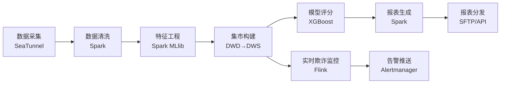

DAG JSON 示例（DolphinScheduler 格式）：

```json
{
  "name": "fin-risk-mart-dag",
  "tenantCode": "${tenantId}",
  "tasks": [
    {"name": "collect_data", "taskType": "SEATUNNEL", "datasource": "${ORDER_DB}", "target": "ods_fin_*"},
    {"name": "clean_data", "taskType": "SPARK", "mainClass": "com.shuqing.fin.CleanJob", "deps": ["collect_data"]},
    {"name": "build_features", "taskType": "SPARK", "mainClass": "com.shuqing.fin.FeatureJob", "deps": ["clean_data"]},
    {"name": "build_mart", "taskType": "SPARK", "mainClass": "com.shuqing.fin.MartJob", "deps": ["build_features"]},
    {"name": "score_model", "taskType": "SPARK", "mainClass": "com.shuqing.fin.ScoreJob", "deps": ["build_mart"]},
    {"name": "gen_report", "taskType": "SPARK", "mainClass": "com.shuqing.fin.ReportJob", "deps": ["score_model"]},
    {"name": "distribute_report", "taskType": "SFTP", "deps": ["gen_report"]}
  ],
  "schedule": "0 2 * * *"
}
```

### 2.5 Dashboard 设计

#### 2.5.1 风控看板（实时欺诈监控）

```json
{
  "dashboard_title": "金融风控实时监控看板",
  "tenant_id": "${tenantId}",
  "panels": [
    {"id": "realtime_fraud", "title": "实时欺诈交易监控", "type": "echarts_line", "query": "SELECT txn_time, count(*) FROM dwd_fin_transaction WHERE is_fraud=true AND dt='${today}' GROUP BY txn_time", "refresh": "10s"},
    {"id": "risk_distribution", "title": "风险等级分布", "type": "echarts_pie", "query": "SELECT risk_level, count(*) FROM dws_fin_risk_feature WHERE dt='${today}' GROUP BY risk_level"},
    {"id": "high_risk_alert", "title": "高风险客户列表", "type": "table", "query": "SELECT customer_id, risk_score, risk_level FROM dws_fin_risk_feature WHERE risk_level IN ('高','极高') AND dt='${today}'"},
    {"id": "txn_amount_trend", "title": "交易金额趋势", "type": "echarts_line", "query": "SELECT dt, sum(txn_amount) FROM dwd_fin_transaction WHERE dt >= '${last30d}' GROUP BY dt"}
  ]
}
```

#### 2.5.2 监管报表看板

```json
{
  "dashboard_title": "监管报表合规看板",
  "panels": [
    {"id": "report_status", "title": "报表报送状态", "type": "echarts_bar", "query": "SELECT report_type, report_status, count(*) FROM ads_fin_regulatory_report GROUP BY report_type, report_status"},
    {"id": "report_timeline", "title": "报送时间线", "type": "echarts_gantt", "query": "SELECT report_id, report_period, submit_date FROM ads_fin_regulatory_report"},
    {"id": "compliance_rate", "title": "合规率指标", "type": "echarts_gauge", "query": "SELECT round(sum(case when report_status='已报' then 1 else 0 end)*100.0/count(*), 2) FROM ads_fin_regulatory_report"}
  ]
}
```

#### 2.5.3 客户画像看板

```json
{
  "dashboard_title": "金融客户画像看板",
  "panels": [
    {"id": "customer_dist", "title": "客户类型分布", "type": "echarts_pie", "query": "SELECT customer_type, count(*) FROM dwd_fin_customer GROUP BY customer_type"},
    {"id": "credit_level", "title": "信用等级分布", "type": "echarts_bar", "query": "SELECT credit_level, count(*) FROM dwd_fin_customer GROUP BY credit_level"},
    {"id": "age_income", "title": "年龄-收入散点", "type": "echarts_scatter", "query": "SELECT age, income_level, count(*) FROM dwd_fin_customer GROUP BY age, income_level"}
  ]
}
```

### 2.6 RBAC 设计

表：金融行业角色权限矩阵

| 角色 | 数据权限 | 功能权限 | 适用场景 |
| --- | --- | --- | --- |
| fin-risk-analyst | 风控数据集市读 | 风控看板/模型评分/特征查询 | 风控分析师 |
| fin-report-specialist | 监管报表数据集市读写 | 报表生成/审核/报送 | 报表专员 |
| fin-compliance-auditor | 全量只读+审计日志 | 合规审计/证据查阅 | 合规审计 |
| fin-admin | 模板管理 | 模板安装/升级/卸载 | 金融业务管理员 |

Keycloak realm 配置示例：

```json
{
  "realm": "ws-${tenantId}-finance",
  "roles": [
    {"name": "fin-risk-analyst", "description": "风控分析师"},
    {"name": "fin-report-specialist", "description": "报表专员"},
    {"name": "fin-compliance-auditor", "description": "合规审计"},
    {"name": "fin-admin", "description": "金融业务管理员"}
  ],
  "clients": [
    {"clientId": "fin-risk-dashboard", "bearerOnly": true},
    {"clientId": "fin-report-portal", "bearerOnly": true}
  ]
}
```

### 2.7 Helm Chart 结构

```text
industry-finance/
├── Chart.yaml
├── values.yaml
├── schema.json
├── README.md
└── templates/
    ├── namespace.yaml
    ├── ddl/
    │   ├── ods_fin_customer.sql
    │   ├── ods_fin_account.sql
    │   ├── ods_fin_transaction.sql
    │   ├── dwd_fin_*.sql
    │   ├── dws_fin_*.sql
    │   └── ads_fin_*.sql
    ├── dags/
    │   ├── fin-risk-mart-dag.json
    │   └── fin-reg-report-dag.json
    ├── dashboards/
    │   ├── fin-risk-dashboard.json
    │   ├── fin-reg-report-dashboard.json
    │   └── fin-customer-portrait-dashboard.json
    ├── rbac/
    │   └── fin-realm.json
    ├── secrets.yaml
    └── networkpolicy.yaml
```

Chart.yaml 示例：

```yaml
apiVersion: v2
name: industry-finance
description: 数擎金融行业模板 - 风控数据集市 + 监管报表数据集市
type: application
version: 2.0.0
appVersion: "2.0.0"
keywords:
  - finance
  - risk-management
  - regulatory-reporting
  - shuqing
maintainers:
  - name: Shuqing Big Data Platform Team
dependencies:
  - name: dolphinscheduler
    version: "3.2.x"
    repository: "file://../common/dolphinscheduler"
  - name: superset
    version: "4.0.x"
    repository: "file://../common/superset"
```

### 2.8 与 V1.0 集成方案

1. **industry-templates 集成**：新增 `fin_risk_mart.py`、`fin_reg_report.py` 模板文件，注册到 TemplateEngine，复用 V1.0 install/instantiate/upgrade/uninstall 生命周期。
2. **rule-engine 集成**：风控规则（反欺诈规则集）与脱敏规则（身份证/手机号 SM4 加密）通过 rule-engine 执行，复用 MaskRuleExecutor。
3. **tag-engine 集成**：客户画像标签（风险等级/信用等级/价值分层）通过 tag-engine 计算。
4. **asset-exchange 集成**：风控模型与监管报表作为数据资产上架流通。
5. **open-api-catalog 集成**：风控评分 API、反欺诈查询 API 注册到开放 API 目录。

#### 2.8.1 第三方系统对接规范

> 金融行业模板依赖监管报送系统（EAST/1104/反洗钱）与核心业务系统（客户/账户/交易）。对接依赖矩阵见 §1.6.1，本节补充行业特定细节。

| 第三方系统 | SeaTunnel Connector | 数据流向 | 对接细节 |
| --- | --- | --- | --- |
| 监管报送系统 | SFTP Source / HTTP Source | 模板 → 报送系统（报表分发） | `ads_fin_regulatory_report` 表数据按报送格式生成文件，SFTP 推送或 REST API 提交 |
| 核心业务系统 | MySQL-CDC / Oracle-CDC | 核心系统 → 模板 ODS（实时采集） | 客户/账户/交易表 binlog 实时采集至 `ods_fin_*`，需客户提供 DB 只读账号 + binlog 权限 |

**values.yaml 参数**：`regulatory.sftpHost`、`regulatory.apiEndpoint`、`coreDb.url`、`coreDb.user`、`coreDb.pwdSecret`（存 Secret）。**对接前置条件**：客户提供监管报送账号 + 专线、核心业务系统 DB 只读账号。

### 2.9 多租户与安全考虑

1. **数据脱敏**：身份证号 SM4 加密存储，手机号掩码脱敏，姓名脱敏，由 rule-engine MaskRuleExecutor 执行。
2. **审计日志**：所有风控查询、报表报送操作记录审计日志，归档至 X2 证据库，保留 7 年。
3. **等保三级**：金融行业强制启用等保三级安全基线，详见第8章。
4. **国密要求**：信创环境强制 SM2 签名 + SM4 加密 + SM3 哈希，详见第9章。
5. **数据隔离**：租户间风控数据完全隔离，跨租户查询拒绝并告警。

## 第3章 制造行业模板

### 3.1 模板定位

制造行业模板面向离散制造与流程制造企业，提供设备 OEE 分析、生产工单管理、质量追溯、供应链协同四大核心能力，集成 IoTDB 时序数据实现实时 OEE 计算。

表：制造行业模板清单

| 模板 ID | 模板名 | 核心能力 | 关键技术栈 |
| --- | --- | --- | --- |
| mfg-oee-analysis | 设备 OEE 分析 | 可用率/性能/质量三维度 OEE | IoTDB + Flink + Doris |
| mfg-quality-trace | 质量追溯 | 质量检验/缺陷归因/SPC | Spark + Doris + ML |
| mfg-supply-chain | 供应链协同 | 供需平衡/库存预警/协同预测 | Spark + Doris |

### 3.2 数据模型架构

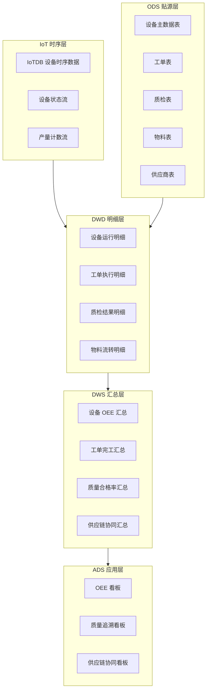

### 3.3 DDL 设计

#### 3.3.1 设备表

```sql
-- SQL功能名：制造设备主数据表DDL
CREATE TABLE IF NOT EXISTS iceberg.`tenant/{tid}/mfg`.dwd_mfg_equipment (
    equipment_id         STRING      COMMENT '设备唯一标识',
    equipment_name       STRING      COMMENT '设备名称',
    equipment_type       STRING      COMMENT '设备类型：CNC/注塑/装配/检测',
    workshop_id          STRING      COMMENT '车间ID',
    line_id              STRING      COMMENT '产线ID',
    supplier_id          STRING      COMMENT '设备供应商ID',
    install_date         TIMESTAMP   COMMENT '安装日期',
    rated_capacity       DECIMAL(10,2) COMMENT '额定产能（件/小时）',
    status               STRING      COMMENT '设备状态：运行/待机/故障/维修',
    tenant_id            STRING      COMMENT '租户ID',
    dt                   STRING      COMMENT '分区字段'
) USING iceberg
PARTITIONED BY (dt, tenant_id);
```

#### 3.3.2 工单表

```sql
-- SQL功能名：制造生产工单表DDL
CREATE TABLE IF NOT EXISTS iceberg.`tenant/{tid}/mfg`.dwd_mfg_work_order (
    work_order_id        STRING      COMMENT '工单唯一标识',
    product_id           STRING      COMMENT '产品ID',
    product_name         STRING      COMMENT '产品名称',
    planned_qty          INT         COMMENT '计划数量',
    actual_qty           INT         COMMENT '实际数量',
    good_qty             INT         COMMENT '合格数量',
    defect_qty           INT         COMMENT '不良数量',
    start_time           TIMESTAMP   COMMENT '开工时间',
    end_time             TIMESTAMP   COMMENT '完工时间',
    planned_duration     INT         COMMENT '计划工时（分钟）',
    actual_duration      INT         COMMENT '实际工时（分钟）',
    work_order_status    STRING      COMMENT '工单状态：待开工/进行中/已完工/已关闭',
    tenant_id            STRING      COMMENT '租户ID',
    dt                   STRING      COMMENT '分区字段'
) USING iceberg
PARTITIONED BY (dt, tenant_id);
```

#### 3.3.3 质检表

```sql
-- SQL功能名：制造质量检验表DDL
CREATE TABLE IF NOT EXISTS iceberg.`tenant/{tid}/mfg`.dwd_mfg_inspection (
    inspection_id        STRING      COMMENT '检验唯一标识',
    work_order_id        STRING      COMMENT '工单ID',
    product_id           STRING      COMMENT '产品ID',
    inspection_type      STRING      COMMENT '检验类型：首检/巡检/末检/全检',
    inspection_item      STRING      COMMENT '检验项目',
    standard_value       DECIMAL(10,3) COMMENT '标准值',
    actual_value         DECIMAL(10,3) COMMENT '实测值',
    upper_limit          DECIMAL(10,3) COMMENT '上限',
    lower_limit          DECIMAL(10,3) COMMENT '下限',
    result               STRING      COMMENT '检验结果：合格/不合格/让步接收',
    defect_type          STRING      COMMENT '缺陷类型',
    inspector            STRING      COMMENT '检验员',
    inspection_time      TIMESTAMP   COMMENT '检验时间',
    tenant_id            STRING      COMMENT '租户ID',
    dt                   STRING      COMMENT '分区字段'
) USING iceberg
PARTITIONED BY (dt, tenant_id);
```

#### 3.3.4 物料表与供应商表

```sql
-- SQL功能名：制造物料表DDL
CREATE TABLE IF NOT EXISTS iceberg.`tenant/{tid}/mfg`.dwd_mfg_material (
    material_id          STRING      COMMENT '物料唯一标识',
    material_name        STRING      COMMENT '物料名称',
    material_type        STRING      COMMENT '物料类型：原料/半成品/成品',
    unit                 STRING      COMMENT '计量单位',
    stock_qty            DECIMAL(18,3) COMMENT '库存数量',
    safety_stock         DECIMAL(18,3) COMMENT '安全库存',
    supplier_id          STRING      COMMENT '默认供应商ID',
    unit_price           DECIMAL(18,2) COMMENT '单价',
    tenant_id            STRING      COMMENT '租户ID',
    dt                   STRING      COMMENT '分区字段'
) USING iceberg
PARTITIONED BY (dt, tenant_id);

-- SQL功能名：制造供应商表DDL
CREATE TABLE IF NOT EXISTS iceberg.`tenant/{tid}/mfg`.dwd_mfg_supplier (
    supplier_id          STRING      COMMENT '供应商唯一标识',
    supplier_name        STRING      COMMENT '供应商名称',
    supplier_level       STRING      COMMENT '供应商等级：A/B/C/D',
    contact_person       STRING      COMMENT '联系人（脱敏）',
    contact_phone        STRING      COMMENT '联系电话（脱敏）',
    supply_category      STRING      COMMENT '供应品类',
    lead_time_days       INT         COMMENT '交货周期（天）',
    on_time_rate         DECIMAL(5,2) COMMENT '准时交货率',
    quality_pass_rate    DECIMAL(5,2) COMMENT '质量合格率',
    tenant_id            STRING      COMMENT '租户ID',
    dt                   STRING      COMMENT '分区字段'
) USING iceberg
PARTITIONED BY (dt, tenant_id);
```

### 3.4 OEE 计算逻辑

OEE = 可用率 × 性能率 × 质量率，三项定义如下：

表：OEE指标定义表

| 指标 | 公式 | 说明 |
| --- | --- | --- |
| 可用率 Availability | 实际运行时间 / 计划生产时间 | 设备停机影响 |
| 性能率 Performance | 实际产量 / 理论产量 | 设备降速影响 |
| 质量率 Quality | 合格数量 / 总数量 | 不良品影响 |

```sql
-- SQL功能名：设备OEE汇总计算
CREATE TABLE IF NOT EXISTS iceberg.`tenant/{tid}/mfg`.dws_mfg_oee AS
SELECT
    e.equipment_id,
    e.equipment_name,
    e.line_id,
    w.dt,
    SUM(w.actual_duration) AS run_minutes,
    SUM(w.planned_duration) AS planned_minutes,
    SUM(w.actual_qty) AS actual_qty,
    SUM(w.good_qty) AS good_qty,
    ROUND(SUM(w.actual_duration)*100.0/NULLIF(SUM(w.planned_duration),0), 2) AS availability,
    ROUND(SUM(w.actual_qty)*100.0/NULLIF(SUM(e.rated_capacity*SUM(w.actual_duration)/60.0),0), 2) AS performance,
    ROUND(SUM(w.good_qty)*100.0/NULLIF(SUM(w.actual_qty),0), 2) AS quality,
    ROUND(
        SUM(w.actual_duration)*100.0/NULLIF(SUM(w.planned_duration),0)
        * SUM(w.actual_qty)*100.0/NULLIF(SUM(e.rated_capacity*SUM(w.actual_duration)/60.0),0)
        * SUM(w.good_qty)*100.0/NULLIF(SUM(w.actual_qty),0)
        / 10000.0, 2
    ) AS oee,
    '${tenantId}' AS tenant_id
FROM dwd_mfg_equipment e
JOIN dwd_mfg_work_order w ON e.equipment_id = w.equipment_id
GROUP BY e.equipment_id, e.equipment_name, e.line_id, w.dt;
```

### 3.5 DAG 设计

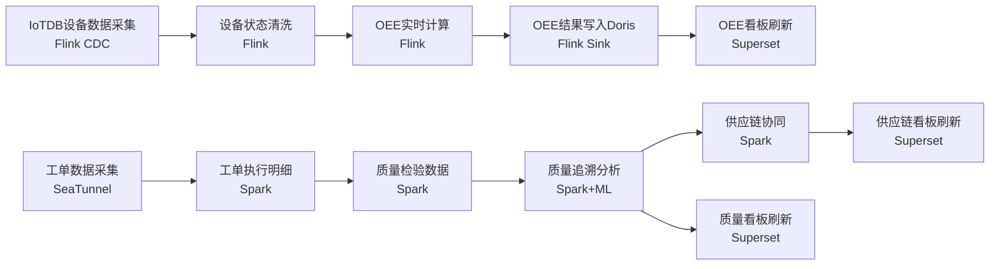

### 3.6 Dashboard 设计

#### 3.6.1 设备 OEE 看板

```json
{
  "dashboard_title": "设备 OEE 实时监控看板",
  "panels": [
    {"id": "oee_overview", "title": "全厂 OEE 总览", "type": "echarts_gauge", "query": "SELECT avg(oee) FROM dws_mfg_oee WHERE dt='${today}'"},
    {"id": "oee_by_line", "title": "产线 OEE 排行", "type": "echarts_bar", "query": "SELECT line_id, avg(oee) FROM dws_mfg_oee WHERE dt='${today}' GROUP BY line_id ORDER BY avg(oee) DESC"},
    {"id": "oee_trend", "title": "OEE 趋势图", "type": "echarts_line", "query": "SELECT dt, avg(availability), avg(performance), avg(quality), avg(oee) FROM dws_mfg_oee WHERE dt>='${last30d}' GROUP BY dt"},
    {"id": "equipment_status", "title": "设备状态实时", "type": "echarts_pie", "query": "SELECT status, count(*) FROM dwd_mfg_equipment GROUP BY status"}
  ]
}
```

#### 3.6.2 质量追溯看板

```json
{
  "dashboard_title": "质量追溯分析看板",
  "panels": [
    {"id": "defect_pareto", "title": "缺陷帕累托图", "type": "echarts_bar", "query": "SELECT defect_type, count(*) FROM dwd_mfg_inspection WHERE result='不合格' AND dt='${today}' GROUP BY defect_type ORDER BY count(*) DESC"},
    {"id": "pass_rate_trend", "title": "合格率趋势", "type": "echarts_line", "query": "SELECT dt, round(sum(case when result='合格' then 1 else 0 end)*100.0/count(*), 2) FROM dwd_mfg_inspection WHERE dt>='${last30d}' GROUP BY dt"},
    {"id": "spc_control_chart", "title": "SPC 控制图", "type": "echarts_line", "query": "SELECT inspection_time, actual_value FROM dwd_mfg_inspection WHERE inspection_item='尺寸A' AND dt='${today}'"}
  ]
}
```

#### 3.6.3 供应链协同看板

```json
{
  "dashboard_title": "供应链协同看板",
  "panels": [
    {"id": "inventory_warning", "title": "库存预警", "type": "table", "query": "SELECT material_id, material_name, stock_qty, safety_stock FROM dwd_mfg_material WHERE stock_qty < safety_stock"},
    {"id": "supplier_score", "title": "供应商评分", "type": "echarts_radar", "query": "SELECT supplier_name, on_time_rate, quality_pass_rate FROM dwd_mfg_supplier"},
    {"id": "demand_supply", "title": "供需平衡", "type": "echarts_line", "query": "SELECT dt, sum(demand_qty), sum(supply_qty) FROM dws_mfg_supply_chain GROUP BY dt"}
  ]
}
```

### 3.7 IoT 集成

IoTDB 设备时序数据 → Flink 实时 OEE 计算链路：

```text
IoTDB (设备时序) → Flink CDC Source → Flink 状态计算 (OEE) → Flink Sink Doris → Superset 看板
```

IoTDB 时序模型：

```text
root.{tenantId}.{workshop}.{line}.{equipment}
  ├── status        (INT32)    设备状态: 1运行 2待机 3故障 4维修
  ├── output_count  (INT32)    产量计数
  ├── good_count    (INT32)    合格品计数
  ├── temperature   (FLOAT)    温度
  ├── vibration     (FLOAT)    振动
  └── power          (FLOAT)    功率
```

Flink OEE 计算作业（Scala）代码示例：

```scala
// 代码示例：OEE实时计算（Scala）
val deviceStream = env
  .addSource(new IoTDBSource("root.*.*.*.*", List("status", "output_count", "good_count")))
  .keyBy(_.equipmentId)
  .process(new OeeProcessFunction())
  .addSink(new DorisSink("dws_mfg_oee_realtime"))

class OeeProcessFunction extends KeyedProcessFunction[String, DeviceData, OeeResult] {
  override def processElement(data: DeviceData, ctx: Context, out: Collector[OeeResult]): Unit = {
    val runTime = if (data.status == 1) 1 else 0
    val availability = runTime.toDouble / plannedTime.value()
    val performance = data.outputCount.toDouble / ratedCapacity.value()
    val quality = data.goodCount.toDouble / math.max(data.outputCount, 1)
    val oee = availability * performance * quality
    out.collect(OeeResult(data.equipmentId, availability, performance, quality, oee, System.currentTimeMillis()))
  }
}
```

### 3.8 Helm Chart 结构

```text
industry-manufacturing/
├── Chart.yaml
├── values.yaml
├── schema.json
├── README.md
└── templates/
    ├── namespace.yaml
    ├── ddl/
    │   ├── ods_mfg_*.sql
    │   ├── dwd_mfg_*.sql
    │   ├── dws_mfg_oee.sql
    │   └── ads_mfg_*.sql
    ├── dags/
    │   ├── mfg-oee-dag.json
    │   ├── mfg-quality-trace-dag.json
    │   └── mfg-supply-chain-dag.json
    ├── flink/
    │   └── oee-realtime-job.yaml
    ├── dashboards/
    │   ├── mfg-oee-dashboard.json
    │   ├── mfg-quality-dashboard.json
    │   └── mfg-supply-chain-dashboard.json
    ├── rbac/
    │   └── mfg-realm.json
    ├── secrets.yaml
    └── networkpolicy.yaml
```

### 3.9 与 V1.0 集成方案

1. **industry-templates 集成**：新增 `mfg_oee_analysis.py`、`mfg_quality_trace.py` 模板文件，注册到 TemplateEngine。
2. **IoTDB 集成**：复用 V1.0 L2.9 时序引擎，IoTDB ConfigNode/DataNode 分离部署，时序数据按租户 root 节点隔离。
3. **Flink 集成**：复用 V1.0 L2.3 流计算，Flink Kubernetes Operator 提交 OEE 实时作业。
4. **rule-engine 集成**：质量检验规则（SPC 控制限/缺陷判定）通过 rule-engine 执行。
5. **tag-engine 集成**：设备健康度标签、供应商等级标签通过 tag-engine 计算。

#### 3.9.1 第三方系统对接规范

> 制造行业模板依赖 MES（工单/工序/质检）、ERP（物料/BOM/库存）、SCADA（设备实时数据）。对接依赖矩阵见 §1.6.1，本节补充行业特定细节。

| 第三方系统 | SeaTunnel Connector | 数据流向 | 对接细节 |
| --- | --- | --- | --- |
| MES | MySQL-CDC / HTTP Source | MES → 模板 ODS（工单/质检实时采集） | 工单/工序/质检数据实时采集至 `ods_mfg_*`，需客户提供 MES API 文档 |
| ERP | JDBC Source（Oracle/HANA） | ERP → 模板 ODS（物料/库存批量同步） | 物料/BOM/库存按小时同步，需客户提供 ERP 只读账号 |
| SCADA | 自研 OPC-UA Source / MQTT Source | SCADA → IoTDB（设备时序实时采集） | 设备工艺参数实时写入 IoTDB `root.{tid}.mfg.device.*`，需 OPC UA 服务端点 |

**values.yaml 参数**：`mes.url`、`mes.apiKeySecret`、`erp.url`、`erp.user`、`erp.pwdSecret`、`scada.opcUaEndpoint`、`scada.mqttBroker`。**对接前置条件**：客户提供 MES API 文档、ERP 只读账号、SCADA OPC UA 服务端点 + 工业网关网络打通。

### 3.10 多租户与安全考虑

1. **IoTDB 租户隔离**：时序数据按 `root.{tenantId}.*` 路径隔离，跨租户查询拒绝。
2. **设备数据安全**：设备工艺参数属企业核心机密，存储加密（SM4），传输加密（TLS/国密 SSL）。
3. **审计日志**：质量检验结果修改、OEE 异常告警记录审计日志。
4. **数据保留**：时序数据热数据 7 天、温数据 90 天、冷数据 1 年（IoTDB 降采样归档）。

## 第4章 零售行业模板

### 4.1 模板定位

零售行业模板面向连锁零售、电商、商超等零售企业，提供商品画像、会员分析、营销效果、库存周转四大核心能力，与 tag-engine 深度集成实现商品与会员标签体系。

表：零售行业模板清单

| 模板 ID | 模板名 | 核心能力 | 关键技术栈 |
| --- | --- | --- | --- |
| retail-product-portrait | 商品画像 | 商品标签/品类分析/关联推荐 | tag-engine + Spark + Doris |
| retail-member-analysis | 会员分析 | 会员分群/RFM/生命周期 | tag-engine + ML + Doris |
| retail-marketing-effect | 营销效果 | 营销 ROI/转化漏斗/效果评估 | Spark + Doris |
| retail-inventory-turnover | 库存周转 | 周转率/滞销识别/补货建议 | Spark + ML |

### 4.2 数据模型架构

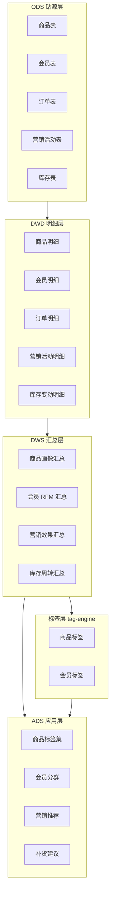

### 4.3 DDL 设计

#### 4.3.1 商品表

```sql
-- SQL功能名：零售商品表DDL
CREATE TABLE IF NOT EXISTS iceberg.`tenant/{tid}/retail`.dwd_retail_product (
    product_id           STRING      COMMENT '商品唯一标识',
    product_name         STRING      COMMENT '商品名称',
    category_l1          STRING      COMMENT '一级品类',
    category_l2          STRING      COMMENT '二级品类',
    category_l3          STRING      COMMENT '三级品类',
    brand                STRING      COMMENT '品牌',
    unit_price           DECIMAL(18,2) COMMENT '单价',
    cost_price           DECIMAL(18,2) COMMENT '成本价',
    supplier_id          STRING      COMMENT '供应商ID',
    shelf_date           TIMESTAMP   COMMENT '上架日期',
    product_status       STRING      COMMENT '商品状态：在售/下架/缺货',
    tenant_id            STRING      COMMENT '租户ID',
    dt                   STRING      COMMENT '分区字段'
) USING iceberg
PARTITIONED BY (dt, tenant_id);
```

#### 4.3.2 会员表

```sql
-- SQL功能名：零售会员表DDL
CREATE TABLE IF NOT EXISTS iceberg.`tenant/{tid}/retail`.dwd_retail_member (
    member_id            STRING      COMMENT '会员唯一标识',
    member_name          STRING      COMMENT '会员姓名（脱敏）',
    phone_no             STRING      COMMENT '手机号（脱敏）',
    gender               STRING      COMMENT '性别',
    age                  INT         COMMENT '年龄',
    register_date        TIMESTAMP   COMMENT '注册日期',
    member_level         STRING      COMMENT '会员等级：普通/银/金/钻石',
    total_amount         DECIMAL(18,2) COMMENT '累计消费金额',
    total_count          INT         COMMENT '累计消费次数',
    last_purchase_date   TIMESTAMP   COMMENT '最近消费日期',
    member_status        STRING      COMMENT '会员状态：活跃/沉睡/流失',
    tenant_id            STRING      COMMENT '租户ID',
    dt                   STRING      COMMENT '分区字段'
) USING iceberg
PARTITIONED BY (dt, tenant_id);
```

#### 4.3.3 订单表

```sql
-- SQL功能名：零售订单表DDL
CREATE TABLE IF NOT EXISTS iceberg.`tenant/{tid}/retail`.dwd_retail_order (
    order_id             STRING      COMMENT '订单唯一标识',
    member_id            STRING      COMMENT '会员ID',
    product_id           STRING      COMMENT '商品ID',
    order_amount         DECIMAL(18,2) COMMENT '订单金额',
    order_qty            INT         COMMENT '购买数量',
    order_channel        STRING      COMMENT '订单渠道：门店/APP/小程序/电商',
    store_id             STRING      COMMENT '门店ID',
    order_time           TIMESTAMP   COMMENT '下单时间',
    pay_time             TIMESTAMP   COMMENT '支付时间',
    order_status         STRING      COMMENT '订单状态：待付/已付/已发/已收/退款',
    campaign_id          STRING      COMMENT '参与营销活动ID',
    tenant_id            STRING      COMMENT '租户ID',
    dt                   STRING      COMMENT '分区字段'
) USING iceberg
PARTITIONED BY (dt, tenant_id);
```

#### 4.3.4 营销活动表与库存表

```sql
-- SQL功能名：零售营销活动表DDL
CREATE TABLE IF NOT EXISTS iceberg.`tenant/{tid}/retail`.dwd_retail_campaign (
    campaign_id          STRING      COMMENT '活动唯一标识',
    campaign_name        STRING      COMMENT '活动名称',
    campaign_type        STRING      COMMENT '活动类型：满减/折扣/赠品/秒杀',
    start_time           TIMESTAMP   COMMENT '开始时间',
    end_time             TIMESTAMP   COMMENT '结束时间',
    budget               DECIMAL(18,2) COMMENT '活动预算',
    actual_cost          DECIMAL(18,2) COMMENT '实际花费',
    target_members       INT         COMMENT '目标人群数',
    reached_members      INT         COMMENT '触达人数',
    converted_members    INT         COMMENT '转化人数',
    revenue              DECIMAL(18,2) COMMENT '活动带来收入',
    tenant_id            STRING      COMMENT '租户ID',
    dt                   STRING      COMMENT '分区字段'
) USING iceberg
PARTITIONED BY (dt, tenant_id);

-- SQL功能名：零售库存表DDL
CREATE TABLE IF NOT EXISTS iceberg.`tenant/{tid}/retail`.dwd_retail_inventory (
    inventory_id         STRING      COMMENT '库存记录ID',
    product_id           STRING      COMMENT '商品ID',
    store_id             STRING      COMMENT '门店ID',
    stock_qty            INT         COMMENT '库存数量',
    safety_stock         INT         COMMENT '安全库存',
    in_qty               INT         COMMENT '入库数量',
    out_qty              INT         COMMENT '出库数量',
    turnover_days        DECIMAL(10,2) COMMENT '周转天数',
    tenant_id            STRING      COMMENT '租户ID',
    dt                   STRING      COMMENT '分区字段'
) USING iceberg
PARTITIONED BY (dt, tenant_id);
```

### 4.4 DAG 设计

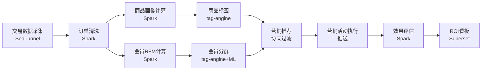

### 4.5 Dashboard 设计

#### 4.5.1 商品画像看板

```json
{
  "dashboard_title": "商品画像分析看板",
  "panels": [
    {"id": "product_tags", "title": "商品标签云", "type": "echarts_wordcloud", "query": "SELECT tag_name, tag_count FROM ads_retail_product_tags ORDER BY tag_count DESC LIMIT 50"},
    {"id": "category_sales", "title": "品类销售排行", "type": "echarts_treemap", "query": "SELECT category_l1, category_l2, sum(order_amount) FROM dwd_retail_order o JOIN dwd_retail_product p ON o.product_id=p.product_id GROUP BY category_l1, category_l2"},
    {"id": "association_rules", "title": "关联推荐", "type": "echarts_graph", "query": "SELECT product_a, product_b, confidence FROM ads_retail_association_rules"}
  ]
}
```

#### 4.5.2 会员分析看板

```json
{
  "dashboard_title": "会员分析看板",
  "panels": [
    {"id": "rfm_scatter", "title": "RFM 散点图", "type": "echarts_scatter", "query": "SELECT r_score, f_score, m_score, count(*) FROM dws_retail_member_rfm GROUP BY r_score, f_score, m_score"},
    {"id": "member_segments", "title": "会员分群", "type": "echarts_pie", "query": "SELECT segment, count(*) FROM ads_retail_member_segment GROUP BY segment"},
    {"id": "lifecycle", "title": "生命周期分布", "type": "echarts_funnel", "query": "SELECT lifecycle_stage, count(*) FROM dwd_retail_member GROUP BY lifecycle_stage"}
  ]
}
```

#### 4.5.3 营销 ROI 看板

```json
{
  "dashboard_title": "营销 ROI 效果看板",
  "panels": [
    {"id": "campaign_roi", "title": "活动 ROI 排行", "type": "echarts_bar", "query": "SELECT campaign_name, round(revenue/NULLIF(actual_cost,0), 2) AS roi FROM dwd_retail_campaign WHERE dt='${today}' ORDER BY roi DESC"},
    {"id": "conversion_funnel", "title": "转化漏斗", "type": "echarts_funnel", "query": "SELECT '触达' AS stage, reached_members FROM dwd_retail_campaign UNION ALL SELECT '转化', converted_members"},
    {"id": "cost_revenue", "title": "成本-收入对比", "type": "echarts_line", "query": "SELECT dt, sum(actual_cost), sum(revenue) FROM dwd_retail_campaign GROUP BY dt"}
  ]
}
```

### 4.6 标签集成

与 tag-engine 集成实现商品/会员标签体系：

```text
商品标签：品类标签 + 价格带标签 + 销量标签 + 关联标签 + 季节性标签
会员标签：RFM 标签 + 生命周期标签 + 偏好品类标签 + 价格敏感度标签 + 流失风险标签
```

标签注册 API 调用示例（Python）：

```python
# 代码示例：商品标签注册（Python）
from tag_engine.client import TagEngineClient

client = TagEngineClient(base_url="http://tag-engine:8088", tenant_id="${tenantId}")

# 注册商品标签
client.register_tag(
    tag_code="product_sales_level",
    tag_name="销量等级",
    object_type="PRODUCT",
    value_type="ENUM",
    values=["高销量", "中销量", "低销量", "滞销"],
    rule="CASE WHEN sales_30d > 1000 THEN '高销量' WHEN sales_30d > 100 THEN '中销量' WHEN sales_30d > 10 THEN '低销量' ELSE '滞销' END"
)

# 注册会员标签
client.register_tag(
    tag_code="member_rfm_segment",
    tag_name="RFM 分群",
    object_type="MEMBER",
    value_type="ENUM",
    values=["重要价值", "重要发展", "重要保持", "重要挽留", "一般价值", "一般发展", "一般保持", "一般挽留"],
    rule="rfm_segment_calc"
)
```

### 4.7 Helm Chart 结构

```text
industry-retail/
├── Chart.yaml
├── values.yaml
├── schema.json
├── README.md
└── templates/
    ├── namespace.yaml
    ├── ddl/
    │   ├── ods_retail_*.sql
    │   ├── dwd_retail_*.sql
    │   ├── dws_retail_*.sql
    │   └── ads_retail_*.sql
    ├── dags/
    │   ├── retail-product-portrait-dag.json
    │   ├── retail-member-analysis-dag.json
    │   └── retail-marketing-effect-dag.json
    ├── dashboards/
    │   ├── retail-product-dashboard.json
    │   ├── retail-member-dashboard.json
    │   └── retail-marketing-dashboard.json
    ├── rbac/
    │   └── retail-realm.json
    ├── secrets.yaml
    └── networkpolicy.yaml
```

### 4.8 与 V1.0 集成方案

1. **industry-templates 集成**：新增 `retail_product_portrait.py`、`retail_member_analysis.py` 模板文件。
2. **tag-engine 集成**：商品标签与会员标签通过 tag-engine 统一管理，复用 V1.0 L4.5.1 标签画像能力。
3. **ml-platform 集成**：营销推荐模型（协同过滤/关联规则）通过 ml-platform 训练与推理。
4. **rule-engine 集成**：会员隐私数据脱敏（手机号/姓名）通过 rule-engine 执行。
5. **asset-exchange 集成**：商品画像与会员分群作为数据资产上架流通。

#### 4.8.1 第三方系统对接规范

> 零售行业模板依赖 POS（订单/支付/商品）与 CRM（会员/营销/触达）。对接依赖矩阵见 §1.6.1，本节补充行业特定细节。

| 第三方系统 | SeaTunnel Connector | 数据流向 | 对接细节 |
| --- | --- | --- | --- |
| POS | MySQL-CDC / Kafka Source | POS → 模板 ODS（订单/支付实时采集） | 订单/支付/商品数据实时采集至 `ods_retail_*`，需客户提供 POS DB 或 Kafka |
| CRM | MySQL-CDC / HTTP Source | CRM → 模板 ODS（会员/营销同步） | 会员/营销/触达数据按分钟同步，需客户提供 CRM API 文档 |

**values.yaml 参数**：`pos.dbUrl`、`pos.kafkaBrokers`、`crm.url`、`crm.apiKeySecret`。**对接前置条件**：客户提供 POS DB 或 Kafka 集群访问权限、CRM API 文档。

### 4.9 多租户与安全考虑

1. **会员隐私保护**：会员姓名/手机号脱敏存储，符合《个人信息保护法》要求。
2. **营销合规**：营销活动触达频次受限，避免骚扰用户，规则通过 rule-engine 执行。
3. **数据隔离**：租户间商品/会员/订单数据完全隔离。
4. **标签隔离**：tag-engine 标签按租户隔离，跨租户标签不可见。

## 第5章 能源行业模板

### 5.1 模板定位

能源行业模板面向电力、水务、燃气、石油、新能源等能源企业，提供设备监测、用能分析、碳排放核算三大核心能力，集成 IoTDB 时序数据实现能耗实时监测。

表：能源行业模板清单

| 模板 ID | 模板名 | 核心能力 | 关键技术栈 |
| --- | --- | --- | --- |
| energy-device-monitor | 设备监测 | 设备状态/能耗实时/故障预警 | IoTDB + Flink + Doris |
| energy-consumption-analysis | 用能分析 | 能耗统计/趋势/对标 | Spark + Doris |
| energy-carbon-accounting | 碳排放核算 | 碳排放因子/核算/报告 | Spark + Doris |

### 5.2 数据模型架构

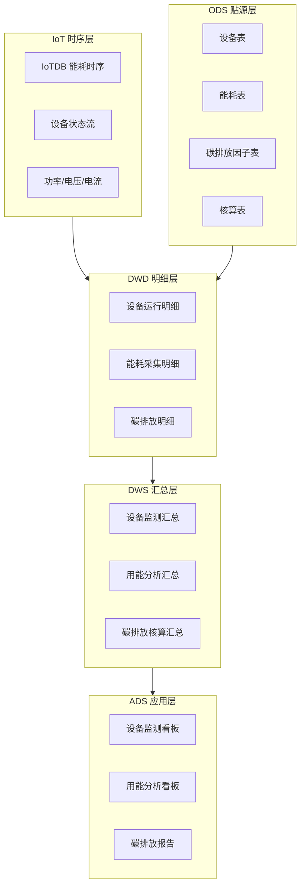

### 5.3 DDL 设计

#### 5.3.1 设备表与能耗表

```sql
-- SQL功能名：能源设备表DDL
CREATE TABLE IF NOT EXISTS iceberg.`tenant/{tid}/energy`.dwd_energy_equipment (
    equipment_id         STRING      COMMENT '设备唯一标识',
    equipment_name       STRING      COMMENT '设备名称',
    equipment_type       STRING      COMMENT '设备类型：变压器/水泵/压缩机/光伏板',
    location             STRING      COMMENT '设备位置',
    rated_power          DECIMAL(18,2) COMMENT '额定功率（kW）',
    install_date         TIMESTAMP   COMMENT '安装日期',
    status               STRING      COMMENT '设备状态：运行/待机/故障/维修',
    tenant_id            STRING      COMMENT '租户ID',
    dt                   STRING      COMMENT '分区字段'
) USING iceberg
PARTITIONED BY (dt, tenant_id);

-- SQL功能名：能耗采集表DDL
CREATE TABLE IF NOT EXISTS iceberg.`tenant/{tid}/energy`.dwd_energy_consumption (
    consumption_id       STRING      COMMENT '能耗记录ID',
    equipment_id         STRING      COMMENT '设备ID',
    energy_type          STRING      COMMENT '能源类型：电/水/气/热',
    consumption_value    DECIMAL(18,3) COMMENT '能耗值',
    unit                 STRING      COMMENT '计量单位：kWh/吨/立方米',
    collect_time         TIMESTAMP   COMMENT '采集时间',
    power                DECIMAL(18,3) COMMENT '瞬时功率',
    voltage              DECIMAL(18,3) COMMENT '电压',
    current              DECIMAL(18,3) COMMENT '电流',
    tenant_id            STRING      COMMENT '租户ID',
    dt                   STRING      COMMENT '分区字段'
) USING iceberg
PARTITIONED BY (dt, tenant_id);
```

#### 5.3.2 碳排放因子表与核算表

```sql
-- SQL功能名：碳排放因子表DDL
CREATE TABLE IF NOT EXISTS iceberg.`tenant/{tid}/energy`.dwd_energy_carbon_factor (
    factor_id            STRING      COMMENT '因子ID',
    energy_type          STRING      COMMENT '能源类型',
    factor_value         DECIMAL(18,6) COMMENT '排放因子值（tCO2/单位）',
    factor_source        STRING      COMMENT '因子来源：国家发改委/IPCC/企业自测',
    effective_date       TIMESTAMP   COMMENT '生效日期',
    expire_date          TIMESTAMP   COMMENT '失效日期',
    tenant_id            STRING      COMMENT '租户ID',
    dt                   STRING      COMMENT '分区字段'
) USING iceberg
PARTITIONED BY (dt, tenant_id);

-- SQL功能名：碳排放核算表DDL
CREATE TABLE IF NOT EXISTS iceberg.`tenant/{tid}/energy`.ads_energy_carbon_accounting (
    accounting_id        STRING      COMMENT '核算记录ID',
    accounting_period    STRING      COMMENT '核算周期：月/季/年',
    accounting_date      STRING      COMMENT '核算日期',
    energy_type          STRING      COMMENT '能源类型',
    consumption_total    DECIMAL(18,3) COMMENT '能耗总量',
    carbon_emission      DECIMAL(18,3) COMMENT '碳排放量（tCO2）',
    carbon_source        STRING      COMMENT '排放源：直接/间接',
    scope                STRING      COMMENT '范围：Scope1/Scope2/Scope3',
    tenant_id            STRING      COMMENT '租户ID',
    dt                   STRING      COMMENT '分区字段'
) USING iceberg
PARTITIONED BY (dt, tenant_id);
```

### 5.4 DAG 设计

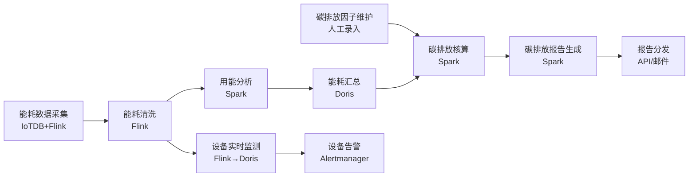

### 5.5 Dashboard 设计

#### 5.5.1 设备监测看板

```json
{
  "dashboard_title": "能源设备实时监测看板",
  "panels": [
    {"id": "realtime_power", "title": "实时功率监控", "type": "echarts_line", "query": "SELECT collect_time, power FROM dwd_energy_consumption WHERE dt='${today}' AND equipment_id='${equipId}'", "refresh": "5s"},
    {"id": "equipment_health", "title": "设备健康度", "type": "echarts_gauge", "query": "SELECT avg(health_score) FROM dws_energy_equipment_health WHERE dt='${today}'"},
    {"id": "fault_warning", "title": "故障预警", "type": "table", "query": "SELECT equipment_id, warning_type, warning_time FROM ads_energy_fault_warning WHERE status='未处理'"},
    {"id": "energy_distribution", "title": "能耗分布", "type": "echarts_pie", "query": "SELECT energy_type, sum(consumption_value) FROM dwd_energy_consumption WHERE dt='${today}' GROUP BY energy_type"}
  ]
}
```

#### 5.5.2 用能分析看板

```json
{
  "dashboard_title": "用能分析看板",
  "panels": [
    {"id": "consumption_trend", "title": "能耗趋势", "type": "echarts_line", "query": "SELECT dt, energy_type, sum(consumption_value) FROM dwd_energy_consumption WHERE dt>='${last30d}' GROUP BY dt, energy_type"},
    {"id": "peak_valley", "title": "峰谷平分析", "type": "echarts_bar", "query": "SELECT period_type, sum(consumption_value) FROM dws_energy_peak_valley WHERE dt='${today}' GROUP BY period_type"},
    {"id": "energy_benchmark", "title": "能效对标", "type": "echarts_radar", "query": "SELECT metric, actual_value, benchmark_value FROM dws_energy_benchmark"}
  ]
}
```

#### 5.5.3 碳排放看板

```json
{
  "dashboard_title": "碳排放核算看板",
  "panels": [
    {"id": "carbon_total", "title": "碳排放总量", "type": "echarts_gauge", "query": "SELECT sum(carbon_emission) FROM ads_energy_carbon_accounting WHERE accounting_date='${thisMonth}'"},
    {"id": "carbon_by_scope", "title": "按范围分布", "type": "echarts_pie", "query": "SELECT scope, sum(carbon_emission) FROM ads_energy_carbon_accounting GROUP BY scope"},
    {"id": "carbon_trend", "title": "碳排放趋势", "type": "echarts_line", "query": "SELECT accounting_date, sum(carbon_emission) FROM ads_energy_carbon_accounting GROUP BY accounting_date"},
    {"id": "carbon_intensity", "title": "碳强度指标", "type": "echarts_bar", "query": "SELECT accounting_date, carbon_emission/production_value AS carbon_intensity FROM ads_energy_carbon_accounting"}
  ]
}
```

### 5.6 时序集成

IoTDB 能耗时序数据 → 实时监测链路：

```text
IoTDB (能耗时序) → Flink CDC Source → Flink 异常检测 → Flink Sink Doris → Superset 实时看板
                                     → Flink Sink Alertmanager → 告警推送
```

IoTDB 能耗时序模型：

```text
root.{tenantId}.{factory}.{workshop}.{equipment}
  ├── power          (FLOAT)    瞬时功率（kW）
  ├── voltage        (FLOAT)    电压（V）
  ├── current        (FLOAT)    电流（A）
  ├── energy_consumed (FLOAT)   累计能耗（kWh）
  ├── temperature    (FLOAT)    温度（℃）
  └── status         (INT32)    设备状态
```

### 5.7 Helm Chart 结构

```text
industry-energy/
├── Chart.yaml
├── values.yaml
├── schema.json
├── README.md
└── templates/
    ├── namespace.yaml
    ├── ddl/
    │   ├── ods_energy_*.sql
    │   ├── dwd_energy_*.sql
    │   ├── dws_energy_*.sql
    │   └── ads_energy_*.sql
    ├── dags/
    │   ├── energy-monitor-dag.json
    │   ├── energy-consumption-dag.json
    │   └── energy-carbon-dag.json
    ├── flink/
    │   └── energy-realtime-monitor.yaml
    ├── dashboards/
    │   ├── energy-monitor-dashboard.json
    │   ├── energy-consumption-dashboard.json
    │   └── energy-carbon-dashboard.json
    ├── rbac/
    │   └── energy-realm.json
    ├── secrets.yaml
    └── networkpolicy.yaml
```

### 5.8 与 V1.0 集成方案

1. **industry-templates 集成**：新增 `energy_device_monitor.py`、`energy_carbon_accounting.py` 模板文件。
2. **IoTDB 集成**：复用 V1.0 L2.9 时序引擎，能耗时序数据按租户隔离。
3. **Flink 集成**：复用 V1.0 L2.3 流计算，实时能耗监测与异常检测。
4. **rule-engine 集成**：设备异常检测规则、碳排放合规校验通过 rule-engine 执行。
5. **open-api-catalog 集成**：碳排放数据 API 注册到开放 API 目录，支持外部系统查询。

#### 5.8.1 第三方系统对接规范

> 能源行业模板依赖 SCADA（能耗实时采集）与 EMS（能源管理系统）。对接依赖矩阵见 §1.6.1，本节补充行业特定细节。

| 第三方系统 | SeaTunnel Connector | 数据流向 | 对接细节 |
| --- | --- | --- | --- |
| SCADA | 自研 OPC-UA Source / IEC104 Source | SCADA → IoTDB（能耗时序实时采集） | 能耗/设备状态实时写入 IoTDB `root.{tid}.energy.*`，需 OPC UA/IEC 104 服务端点 |
| EMS | MySQL-CDC / HTTP Source | EMS → 模板 ODS（能源账单/计划同步） | 能源账单/用能计划按小时同步，需客户提供 EMS API 文档 |

**values.yaml 参数**：`scada.opcUaEndpoint`、`scada.iec104Ip`、`ems.url`、`ems.apiKeySecret`。**对接前置条件**：客户提供 SCADA 服务端点 + 工业网关网络打通、EMS API 文档。

### 5.9 多租户与安全考虑

1. **IoTDB 租户隔离**：能耗时序数据按 `root.{tenantId}.*` 路径隔离。
2. **数据安全**：能源数据属企业敏感数据，传输加密（TLS/国密 SSL），存储加密（SM4）。
3. **碳排放合规**：碳排放因子需符合国家发改委标准，核算结果可审计追溯。
4. **设备数据保留**：时序数据热数据 3 天、温数据 90 天、冷数据 3 年。

## 第6章 政务行业模板

### 6.1 模板定位

政务行业模板面向政府委办局、大数据局、政务服务中心，提供人口分析、经济运行、民生服务三大核心能力，满足等保三级安全要求与数据脱敏合规要求。

表：政务行业模板清单

| 模板 ID | 模板名 | 核心能力 | 关键技术栈 |
| --- | --- | --- | --- |
| gov-population-analysis | 人口分析 | 人口结构/流动/趋势预测 | Spark + Doris |
| gov-economic-operation | 经济运行 | 经济指标/产业分析/区域对比 | Spark + Doris |
| gov-livelihood-service | 民生服务 | 政务事项/满意度/效能分析 | Spark + Doris |

### 6.2 数据模型架构

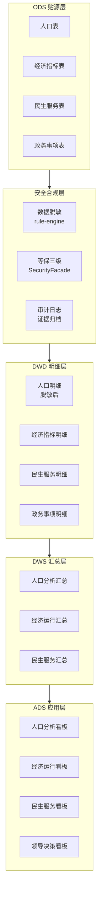

### 6.3 DDL 设计

#### 6.3.1 人口表

```sql
-- SQL功能名：政务人口表DDL
CREATE TABLE IF NOT EXISTS iceberg.`tenant/{tid}/gov`.dwd_gov_population (
    person_id            STRING      COMMENT '人员唯一标识（哈希脱敏）',
    id_card_hash         STRING      COMMENT '身份证号哈希（SM3）',
    gender               STRING      COMMENT '性别',
    birth_date           STRING      COMMENT '出生日期（脱敏至年月）',
    age_group            STRING      COMMENT '年龄段：0-17/18-34/35-59/60+',
    region               STRING      COMMENT '所在区域',
    education            STRING      COMMENT '学历',
    occupation           STRING      COMMENT '职业',
    marital_status       STRING      COMMENT '婚姻状况',
    household_type       STRING      COMMENT '户别：农业/非农业',
    migrate_in           BOOLEAN     COMMENT '是否迁入',
    migrate_out          BOOLEAN     COMMENT '是否迁出',
    tenant_id            STRING      COMMENT '租户ID',
    dt                   STRING      COMMENT '分区字段'
) USING iceberg
PARTITIONED BY (dt, tenant_id);
```

#### 6.3.2 经济指标表

```sql
-- SQL功能名：政务经济指标表DDL
CREATE TABLE IF NOT EXISTS iceberg.`tenant/{tid}/gov`.dwd_gov_economic_indicator (
    indicator_id         STRING      COMMENT '指标ID',
    indicator_name       STRING      COMMENT '指标名称',
    indicator_category   STRING      COMMENT '指标分类：GDP/投资/消费/出口/就业',
    region               STRING      COMMENT '区域',
    indicator_value      DECIMAL(18,2) COMMENT '指标值',
    indicator_unit       STRING      COMMENT '计量单位',
    yoy_growth           DECIMAL(10,2) COMMENT '同比增长率',
    mom_growth           DECIMAL(10,2) COMMENT '环比增长率',
    report_period        STRING      COMMENT '报告周期：月/季/年',
    report_date          STRING      COMMENT '报告日期',
    data_source          STRING      COMMENT '数据来源',
    tenant_id            STRING      COMMENT '租户ID',
    dt                   STRING      COMMENT '分区字段'
) USING iceberg
PARTITIONED BY (dt, tenant_id);
```

#### 6.3.3 民生服务表与政务事项表

```sql
-- SQL功能名：政务民生服务表DDL
CREATE TABLE IF NOT EXISTS iceberg.`tenant/{tid}/gov`.dwd_gov_livelihood_service (
    service_id           STRING      COMMENT '服务记录ID',
    service_type         STRING      COMMENT '服务类型：社保/医保/教育/住房',
    citizen_id_hash      STRING      COMMENT '公民ID哈希（脱敏）',
    service_status       STRING      COMMENT '服务状态：申请/办理中/已完成/已拒绝',
    apply_time           TIMESTAMP   COMMENT '申请时间',
    complete_time        TIMESTAMP   COMMENT '完成时间',
    processing_days      INT         COMMENT '办理天数',
    satisfaction_score   INT         COMMENT '满意度评分 1-5',
    channel              STRING      COMMENT '办理渠道：线上/线下/自助',
    tenant_id            STRING      COMMENT '租户ID',
    dt                   STRING      COMMENT '分区字段'
) USING iceberg
PARTITIONED BY (dt, tenant_id);

-- SQL功能名：政务事项表DDL
CREATE TABLE IF NOT EXISTS iceberg.`tenant/{tid}/gov`.dwd_gov_matter (
    matter_id            STRING      COMMENT '事项ID',
    matter_name          STRING      COMMENT '事项名称',
    matter_category      STRING      COMMENT '事项分类',
    department           STRING      COMMENT '办理部门',
    apply_count          INT         COMMENT '申请数量',
    complete_count       INT         COMMENT '办结数量',
    avg_processing_days  DECIMAL(10,2) COMMENT '平均办理天数',
    online_rate          DECIMAL(5,2) COMMENT '网办率',
    tenant_id            STRING      COMMENT '租户ID',
    dt                   STRING      COMMENT '分区字段'
) USING iceberg
PARTITIONED BY (dt, tenant_id);
```

### 6.4 DAG 设计

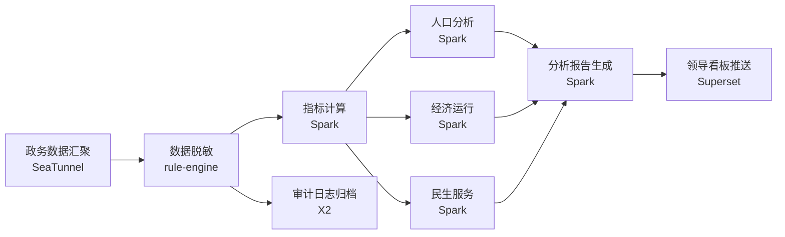

### 6.5 Dashboard 设计

#### 6.5.1 人口分析看板

```json
{
  "dashboard_title": "人口分析看板",
  "panels": [
    {"id": "pop_structure", "title": "人口结构", "type": "echarts_bar", "query": "SELECT age_group, gender, count(*) FROM dwd_gov_population GROUP BY age_group, gender"},
    {"id": "pop_distribution", "title": "区域分布", "type": "echarts_map", "query": "SELECT region, count(*) FROM dwd_gov_population GROUP BY region"},
    {"id": "pop_migration", "title": "人口流动", "type": "echarts_line", "query": "SELECT dt, sum(migrate_in), sum(migrate_out) FROM dwd_gov_population GROUP BY dt"},
    {"id": "education_dist", "title": "学历分布", "type": "echarts_pie", "query": "SELECT education, count(*) FROM dwd_gov_population GROUP BY education"}
  ]
}
```

#### 6.5.2 经济运行看板

```json
{
  "dashboard_title": "经济运行看板",
  "panels": [
    {"id": "gdp_trend", "title": "GDP 趋势", "type": "echarts_line", "query": "SELECT report_date, indicator_value FROM dwd_gov_economic_indicator WHERE indicator_category='GDP' ORDER BY report_date"},
    {"id": "industry_compare", "title": "产业对比", "type": "echarts_bar", "query": "SELECT indicator_category, sum(indicator_value) FROM dwd_gov_economic_indicator GROUP BY indicator_category"},
    {"id": "region_compare", "title": "区域经济对比", "type": "echarts_bar", "query": "SELECT region, sum(indicator_value) FROM dwd_gov_economic_indicator WHERE indicator_category='GDP' GROUP BY region"},
    {"id": "growth_rate", "title": "增长率指标", "type": "echarts_line", "query": "SELECT report_date, avg(yoy_growth) FROM dwd_gov_economic_indicator GROUP BY report_date"}
  ]
}
```

#### 6.5.3 民生服务看板

```json
{
  "dashboard_title": "民生服务看板",
  "panels": [
    {"id": "service_efficiency", "title": "服务效能", "type": "echarts_bar", "query": "SELECT service_type, avg(processing_days) FROM dwd_gov_livelihood_service GROUP BY service_type"},
    {"id": "satisfaction", "title": "满意度分布", "type": "echarts_pie", "query": "SELECT satisfaction_score, count(*) FROM dwd_gov_livelihood_service GROUP BY satisfaction_score"},
    {"id": "online_rate", "title": "网办率趋势", "type": "echarts_line", "query": "SELECT dt, round(sum(case when channel='线上' then 1 else 0 end)*100.0/count(*), 2) FROM dwd_gov_livelihood_service GROUP BY dt"},
    {"id": "matter_volume", "title": "事项办理量", "type": "echarts_bar", "query": "SELECT matter_name, complete_count FROM dwd_gov_matter ORDER BY complete_count DESC LIMIT 20"}
  ]
}
```

### 6.6 安全要求

#### 6.6.1 等保三级落地

表：政务等保三级安全要求落地表

| 安全维度 | 要求 | 落地措施 |
| --- | --- | --- |
| 物理安全 | 机房物理访问控制 | 信创服务器 + 机房门禁 + 视频监控 |
| 网络安全 | 边界访问控制 + 入侵检测 | Cilium NetworkPolicy + 入侵检测系统 |
| 主机安全 | 主机加固 + 恶意代码防范 | SKE 发行版内核加固 + 容器镜像扫描 |
| 应用安全 | 身份鉴别 + 访问控制 + 安全审计 | Keycloak 多因素认证 + RBAC + 审计日志 |
| 数据安全 | 数据完整性 + 保密性 + 备份 | SM4 加密 + SM3 完整性 + 定期备份 |
| 管理安全 | 安全管理制度 + 人员管理 | 安全管理制度 + 人员培训 + 应急预案 |

#### 6.6.2 数据脱敏

```python
# 代码示例：政务数据脱敏（Python）
from rule_engine.client import RuleEngineClient

client = RuleEngineClient(base_url="http://rule-engine:8083", tenant_id="${tenantId}")

# 身份证号脱敏：SM3 哈希 + SM4 加密
client.create_mask_rule(
    rule_name="gov_id_card_mask",
    field="id_card_no",
    strategy="SM4_ENCRYPT_SM3_HASH",
    params={"sm4_key": "${SM4_KEY}", "keep_hash": True}
)

# 出生日期脱敏：仅保留年月
client.create_mask_rule(
    rule_name="gov_birth_date_mask",
    field="birth_date",
    strategy="PARTIAL_MASK",
    params={"keep_prefix": 7, "mask_char": "*"}
)

# 手机号脱敏：中间四位掩码
client.create_mask_rule(
    rule_name="gov_phone_mask",
    field="phone_no",
    strategy="MIDDLE_MASK",
    params={"keep_prefix": 3, "keep_suffix": 4, "mask_char": "*"}
)
```

#### 6.6.3 审计日志

```json
{
  "audit_log_config": {
    "log_level": "INFO",
    "log_events": ["LOGIN", "QUERY", "EXPORT", "MODIFY", "DELETE", "APPROVE"],
    "log_fields": ["user_id", "action", "resource", "timestamp", "source_ip", "result", "detail"],
    "retention_days": 2555,
    "archive_target": "X2_evidence_repository",
    "tamper_proof": "SM3_CHAIN"
  }
}
```

### 6.7 Helm Chart 结构

```text
industry-government/
├── Chart.yaml
├── values.yaml
├── schema.json
├── README.md
└── templates/
    ├── namespace.yaml
    ├── ddl/
    │   ├── ods_gov_*.sql
    │   ├── dwd_gov_*.sql
    │   ├── dws_gov_*.sql
    │   └── ads_gov_*.sql
    ├── dags/
    │   ├── gov-population-dag.json
    │   ├── gov-economic-dag.json
    │   └── gov-livelihood-dag.json
    ├── dashboards/
    │   ├── gov-population-dashboard.json
    │   ├── gov-economic-dashboard.json
    │   ├── gov-livelihood-dashboard.json
    │   └── gov-leader-dashboard.json
    ├── rbac/
    │   └── gov-realm.json
    ├── security/
    │   ├── networkpolicy-deny-all.yaml
    │   ├── audit-log-config.json
    │   └── mask-rules.json
    ├── secrets.yaml
    └── networkpolicy.yaml
```

### 6.8 与 V1.0 集成方案

1. **industry-templates 集成**：新增 `gov_population_analysis.py`、`gov_economic_operation.py` 模板文件。
2. **rule-engine 集成**：数据脱敏规则（身份证/手机号/出生日期）通过 rule-engine MaskRuleExecutor 执行。
3. **SecurityFacade 集成**：等保三级安全要求通过 SecurityFacade 统一封装，详见第8章。
4. **Keycloak 集成**：政务用户多因素认证（密码+短信/USBKey）通过 Keycloak 扩展。
5. **asset-exchange 集成**：政务数据产品作为数据资产上架流通（需审批）。

#### 6.8.1 第三方系统对接规范

> 政务行业模板依赖政务数据汇聚平台与各委办局业务系统。对接依赖矩阵见 §1.6.1，本节补充行业特定细节。

| 第三方系统 | SeaTunnel Connector | 数据流向 | 对接细节 |
| --- | --- | --- | --- |
| 政务数据汇聚平台 | HTTP Source / Kafka Source | 汇聚平台 → 模板 ODS（人口/经济数据采集） | 人口/经济/民生数据按需采集至 `ods_gov_*`，需客户提供汇聚平台接入授权 |
| 各委办局业务系统 | JDBC Source / HTTP Source | 委办局 → 模板 ODS（业务数据同步） | 各委办局业务数据按日同步，需客户提供各委办局 DB 账号 |

**values.yaml 参数**：`govDataPlatform.apiEndpoint`、`govDataPlatform.appKeySecret`、`bureauDb.{name}.url`、`bureauDb.{name}.pwdSecret`。**对接前置条件**：客户提供政务数据汇聚平台接入授权、各委办局 DB 账号 + 政务专网打通。

### 6.9 多租户与安全考虑

1. **等保三级强制**：政务行业强制启用等保三级安全基线，六维安全要求全部落地。
2. **数据脱敏**：人口数据身份证号 SM4 加密 + SM3 哈希，出生日期脱敏至年月，手机号中间四位掩码。
3. **审计日志**：所有政务数据查询、导出、修改操作记录审计日志，保留 7 年（2555 天），SM3 链式防篡改。
4. **数据分级**：政务数据按公开/内部/秘密/机密四级分类，不同级别访问控制策略不同。
5. **跨部门数据共享**：跨部门数据共享需审批，通过 asset-exchange 流通，全程审计。

## 第6.5章 物联网行业模板（V2.0 增强）

### 6.5.1 模板定位

物联网行业模板面向工业物联网、智慧城市、车联网等场景，提供设备健康度监测与时序数据分析能力。V1.0 已交付 `iot-device-health`（设备健康度）模板，V2.0 **保留该模板并增强**，与新增能源行业模板（§5）共享 IoTDB 时序底座，确保 V1.0 租户平滑升级。

表：物联网行业模板清单

| 模板 ID | 模板名 | 核心能力 | 关键技术栈 | V1.0/V2.0 |
| --- | --- | --- | --- | --- |
| iot-device-health | 设备健康度 | 设备状态监测/故障预测/健康评分 | IoTDB + Flink + Doris | V1.0 基线，V2.0 增强 |
| iot-asset-track | 资产追踪时序 | 资产位置/轨迹时序分析 | IoTDB + Spark + Superset | V2.0 新增 |

### 6.5.2 与 V1.0 兼容与升级路径

1. **模板保留**：V1.0 `iot-device-health` 模板在 V2.0 完整保留，不废弃、不合并，DDL/DAG/Dashboard 向后兼容。
2. **Helm upgrade 路径**：V1.0 租户已安装的 `iot-device-health` 通过 `helm upgrade` 平滑升级到 V2.0 增强版，values merge 策略保留租户定制（阈值/告警规则/看板）。
3. **增强点**：V2.0 增强版新增故障预测 ML 管道（复用 L4.5.2 机器学习）、健康评分多维度加权、与资产目录集成作为逻辑资产。
4. **IoTDB 时序底座共享**：物联网与能源行业模板共享同一 IoTDB 集群（按租户 Namespace 隔离），减少资源冗余；时序联邦查询复用 V2.0 数据联邦 IoTDBAdapter（见数据联邦详细设计 §2.4）。

#### 6.5.2.1 第三方系统对接规范

> 物联网行业模板依赖设备平台（设备影子/物模型）。对接依赖矩阵见 §1.6.1，本节补充行业特定细节。

| 第三方系统 | SeaTunnel Connector | 数据流向 | 对接细节 |
| --- | --- | --- | --- |
| 设备平台 | MQTT Source / HTTP Source | 设备平台 → IoTDB（设备时序实时采集） | 设备影子/物模型/属性数据实时写入 IoTDB `root.{tid}.iot.device.*`，需设备平台 MQTT Broker 或 REST API 端点 |

**values.yaml 参数**：`iotPlatform.mqttBroker`、`iotPlatform.apiKeySecret`。**对接前置条件**：客户提供设备平台接入凭证（一机一密 SM2 证书）+ IoT 平台网络打通。

### 6.5.3 多租户与安全考虑

1. **租户隔离**：物联网模板实例部署到独立 Namespace `ws-{tenantId}-iot-device-health`，继承 V1.0 三重隔离。
2. **时序数据隔离**：IoTDB 按 `tenant/{tid}/iot/` 存储层级隔离，时间序列 ID 携带租户前缀。
3. **设备身份认证**：设备接入采用一机一密（SM2 证书），MQTT 接入经 X4 API 网关鉴权。

## 第7章 数据资产流通全流程

### 7.1 模块定位

V2.0 将 V1.0 asset-exchange 骨架演进为全流程落地能力，覆盖资产登记、上架、流通、变现、交易五大阶段，构建"提供方—平台—消费方"三方数据交易市场。

### 7.2 全流程架构

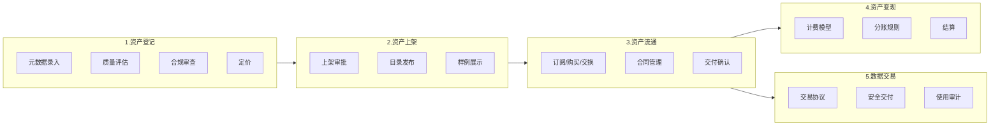

### 7.3 资产登记

#### 7.3.1 元数据模型

```sql
-- SQL功能名：数据资产元数据表DDL
CREATE TABLE IF NOT EXISTS iceberg.`tenant/{tid}/asset`.asset_metadata (
    asset_id             STRING      COMMENT '资产唯一标识',
    asset_name           STRING      COMMENT '资产名称',
    asset_type           STRING      COMMENT '资产类型：数据集/数据服务/数据模型/大模型',
    description          STRING      COMMENT '资产描述',
    provider_id          STRING      COMMENT '提供方ID',
    provider_name        STRING      COMMENT '提供方名称',
    schema_definition    STRING      COMMENT 'Schema定义JSON',
    sample_data          STRING      COMMENT '样例数据JSON（脱敏）',
    quality_score        DECIMAL(5,2) COMMENT '质量评分',
    compliance_status    STRING      COMMENT '合规状态：待审/通过/驳回',
    price_model          STRING      COMMENT '计价模型JSON',
    classification       STRING      COMMENT '数据分级：公开/内部/秘密/机密',
    tags                 ARRAY<STRING> COMMENT '标签',
    register_time        TIMESTAMP   COMMENT '登记时间',
    register_status      STRING      COMMENT '登记状态：草稿/待审/已登记/已驳回',
    tenant_id            STRING      COMMENT '租户ID',
    dt                   STRING      COMMENT '分区字段'
) USING iceberg
PARTITIONED BY (dt, tenant_id);
```

#### 7.3.2 质量评估

```python
# 代码示例：资产质量评估（Python）
class AssetQualityAssessor:
    """数据资产质量评估器."""

    def assess(self, asset_id: str, dataset_ref: str) -> QualityReport:
        dimensions = {
            "completeness": self._check_completeness(dataset_ref),
            "accuracy": self._check_accuracy(dataset_ref),
            "consistency": self._check_consistency(dataset_ref),
            "timeliness": self._check_timeliness(dataset_ref),
            "uniqueness": self._check_uniqueness(dataset_ref),
            "validity": self._check_validity(dataset_ref),
        }
        overall_score = sum(dimensions.values()) / len(dimensions)
        return QualityReport(asset_id=asset_id, dimensions=dimensions, overall_score=overall_score)
```

#### 7.3.3 合规审查

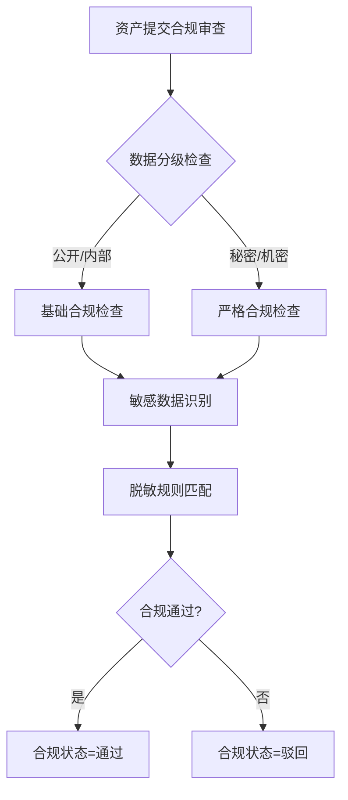

#### 7.3.4 定价模型

表：资产定价模型表

| 计价模型 | 公式 | 适用场景 |
| --- | --- | --- |
| 按次计费 | 总价 = 单价 × 调用次数 | API 服务 |
| 按量计费 | 总价 = 单价 × 数据量（GB） | 数据集下载 |
| 订阅计费 | 总价 = 月费 × 订阅月数 | 持续数据服务 |
| 协商定价 | 双方协商 | 高价值数据资产 |
| 分成计费 | 总价 = 收入 × 分成比例 | 联合数据产品 |

### 7.4 资产上架

#### 7.4.1 上架审批流

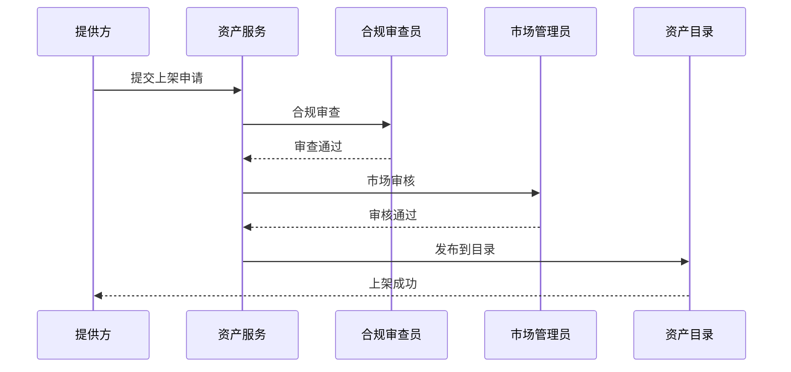

#### 7.4.2 目录发布

```sql
-- SQL功能名：资产目录表DDL
CREATE TABLE IF NOT EXISTS iceberg.`tenant/{tid}/asset`.asset_catalog (
    catalog_id           STRING      COMMENT '目录ID',
    asset_id             STRING      COMMENT '资产ID',
    category_l1          STRING      COMMENT '一级分类',
    category_l2          STRING      COMMENT '二级分类',
    catalog_status       STRING      COMMENT '目录状态：上架/下架/冻结',
    listing_time         TIMESTAMP   COMMENT '上架时间',
    view_count           INT         COMMENT '浏览数',
    subscribe_count      INT         COMMENT '订阅数',
    rating               DECIMAL(3,2) COMMENT '评分',
    tenant_id            STRING      COMMENT '租户ID',
    dt                   STRING      COMMENT '分区字段'
) USING iceberg
PARTITIONED BY (dt, tenant_id);
```

### 7.5 资产流通

#### 7.5.1 订阅/购买/交换

表：资产流通方式对照表

| 流通方式 | 说明 | 交付模式 | 计费方式 |
| --- | --- | --- | --- |
| 订阅 | 持续访问数据资产 | API 授权 | 按月/按年 |
| 购买 | 一次性购买数据使用权 | 安全交付（不 copy） | 一次性 |
| 交换 | 双方数据互换 | 双向授权 | 免费 |

#### 7.5.2 合同管理

```sql
-- SQL功能名：资产流通合同表DDL
CREATE TABLE IF NOT EXISTS iceberg.`tenant/{tid}/asset`.asset_contract (
    contract_id          STRING      COMMENT '合同ID',
    asset_id             STRING      COMMENT '资产ID',
    provider_id          STRING      COMMENT '提供方ID',
    consumer_id          STRING      COMMENT '消费方ID',
    contract_type        STRING      COMMENT '合同类型：订阅/购买/交换',
    contract_status      STRING      COMMENT '合同状态：草签/生效/到期/终止',
    start_date           TIMESTAMP   COMMENT '开始日期',
    end_date             TIMESTAMP   COMMENT '结束日期',
    price_model          STRING      COMMENT '计价模型',
    price_params         STRING      COMMENT '计价参数JSON',
    contract_doc         STRING      COMMENT '合同文档URL（加密）',
    sign_time            TIMESTAMP   COMMENT '签署时间',
    tenant_id            STRING      COMMENT '租户ID',
    dt                   STRING      COMMENT '分区字段'
) USING iceberg
PARTITIONED BY (dt, tenant_id);
```

#### 7.5.3 交付确认

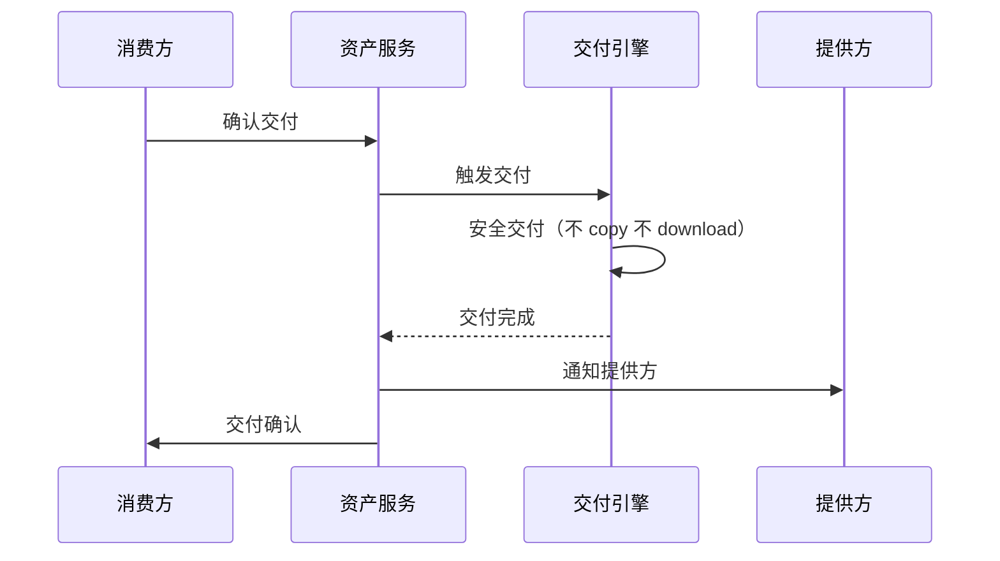

### 7.6 资产变现

#### 7.6.1 计费模型

```python
# 代码示例：资产计费引擎（Python）
from enum import Enum

class PriceModel(Enum):
    PER_CALL = "per_call"
    PER_VOLUME = "per_volume"
    SUBSCRIPTION = "subscription"
    REVENUE_SHARE = "revenue_share"

class BillingEngine:
    """资产计费引擎."""

    def calculate(self, contract_id: str, usage: UsageRecord) -> Bill:
        contract = self._get_contract(contract_id)
        model = PriceModel(contract.price_model)
        if model == PriceModel.PER_CALL:
            amount = contract.unit_price * usage.call_count
        elif model == PriceModel.PER_VOLUME:
            amount = contract.unit_price * usage.data_volume_gb
        elif model == PriceModel.SUBSCRIPTION:
            amount = contract.monthly_fee * usage.months
        elif model == PriceModel.REVENUE_SHARE:
            amount = usage.revenue * contract.share_ratio
        return Bill(contract_id=contract_id, amount=amount, period=usage.period)
```

#### 7.6.2 分账规则与结算

```sql
-- SQL功能名：资产分账规则表DDL
CREATE TABLE IF NOT EXISTS iceberg.`tenant/{tid}/asset`.asset_split_rule (
    rule_id              STRING      COMMENT '规则ID',
    asset_id             STRING      COMMENT '资产ID',
    participant_id       STRING      COMMENT '参与方ID',
    participant_role     STRING      COMMENT '角色：平台/提供方/分账方',
    split_ratio          DECIMAL(5,4) COMMENT '分账比例',
    split_priority       INT         COMMENT '分账优先级',
    tenant_id            STRING      COMMENT '租户ID',
    dt                   STRING      COMMENT '分区字段'
) USING iceberg
PARTITIONED BY (dt, tenant_id);
```

### 7.7 数据交易

#### 7.7.1 安全交付（不 copy 不 download）

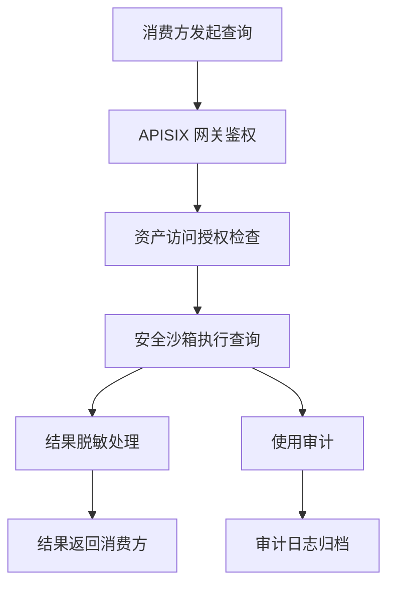

安全交付核心原则：
1. **不 copy**：数据不复制到消费方存储，仅通过 API 查询返回结果。
2. **不 download**：禁止批量下载，仅支持受控查询。
3. **可审计**：每次查询记录审计日志，包含查询 SQL、返回行数、调用方信息。

#### 7.7.2 使用审计

```sql
-- SQL功能名：资产使用审计表DDL
CREATE TABLE IF NOT EXISTS iceberg.`tenant/{tid}/asset`.asset_usage_audit (
    audit_id             STRING      COMMENT '审计ID',
    asset_id             STRING      COMMENT '资产ID',
    consumer_id          STRING      COMMENT '消费方ID',
    access_type          STRING      COMMENT '访问类型：查询/订阅/导出',
    query_sql            STRING      COMMENT '查询SQL（脱敏）',
    result_rows          INT         COMMENT '返回行数',
    access_time          TIMESTAMP   COMMENT '访问时间',
    source_ip            STRING      COMMENT '来源IP',
    access_result        STRING      COMMENT '访问结果：成功/失败',
    tenant_id            STRING      COMMENT '租户ID',
    dt                   STRING      COMMENT '分区字段'
) USING iceberg
PARTITIONED BY (dt, tenant_id);
```

#### 7.7.3 隐私计算可选集成

> 修复说明：§7.7.1 安全交付"不 copy 不 download，通过安全沙箱执行查询，结果脱敏返回"适用于"可披露结果"场景。对于敏感数据（如金融风控特征、政务人口数据）跨组织流通，数据提供方可能要求"数据不可见、查询结果可控"的隐私计算，仅靠安全沙箱 + 结果脱敏可能不满足合规要求。本节明确隐私计算作为 V2.1 可选模块的集成方案，划清 V2.0 安全沙箱与 V2.1 隐私计算的合规边界。

##### 7.7.3.1 场景分级与适用方案

表：资产流通场景分级与隐私计算方案对照表

| 场景分级 | 数据可见性 | 结果可见性 | V2.0 方案 | V2.1 可选扩展 | 典型用例 |
| --- | --- | --- | --- | --- | --- |
| L1 公开数据 | 提供方+消费方均可见 | 结果可披露 | 安全沙箱查询 + 结果明文返回 | — | 行业公开统计、脱敏后样本 |
| L2 受控披露 | 提供方可见，消费方按授权可见 | 结果可披露（脱敏） | 安全沙箱查询 + 结果脱敏返回（§7.7.1） | — | 企业内部跨部门、合作方按合同可见 |
| L3 数据不可见 | 提供方可见，消费方不可见 | 结果可披露（聚合/模型） | 不支持（需 V2.1） | 联邦学习（基于 Flink 联邦） | 跨银行联合风控建模，数据不出域 |
| L4 结果不可见 | 提供方可见，消费方不可见 | 结果仅消费方可见 | 不支持（需 V2.1） | 多方安全计算 MPC（基于 SecretFlow/PrivPy） | 跨机构联合统计，仅消费方知结果 |
| L5 差分隐私 | 提供方可见，消费方可见 | 结果加噪后可披露 | 不支持（需 V2.1） | 差分隐私 DP（结果加噪） | 公开数据集发布，防重识别 |

##### 7.7.3.2 V2.1 隐私计算集成路线

V2.0 安全沙箱覆盖 L1/L2 场景；L3/L4/L5 场景在 V2.1 引入隐私计算框架：

1. **联邦学习（L3）**：基于 Flink 联邦学习扩展，各参与方本地训练，仅交换梯度/参数，数据不出域。适用于跨组织联合建模（如跨银行风控）。
2. **多方安全计算 MPC（L4）**：基于 SecretFlow 或 PrivPy，秘密分享 + 混淆电路，各参与方仅知最终结果。适用于跨机构联合统计。
3. **差分隐私 DP（L5）**：在查询结果加噪（Laplace/Exponential 机制），保证 ε-差分隐私。适用于公开数据集发布。

##### 7.7.3.3 V2.0 合规边界声明

V2.0 资产流通**仅覆盖 L1/L2 场景**（安全沙箱 + 结果脱敏），不涉及隐私计算。对于 L3/L4/L5 场景，V2.0 在资产发布时标注"需隐私计算"，消费方发起查询时提示"该资产需 V2.1 隐私计算能力，当前版本不支持"。隐私计算集成见 §12.1 Phase 7。

### 7.8 API 设计

#### 7.8.1 资产发布 API

```text
POST /api/v2/assets/publish
请求体：
{
  "asset_name": "金融风控特征数据集",
  "asset_type": "DATASET",
  "description": "包含客户风控特征...",
  "schema_definition": {...},
  "sample_data": {...},
  "classification": "INTERNAL",
  "price_model": {"type": "PER_CALL", "unit_price": 0.01},
  "tags": ["金融", "风控"]
}
响应体：
{
  "asset_id": "asset_xxx",
  "status": "PENDING_REVIEW",
  "review_id": "review_xxx"
}
```

#### 7.8.2 资产订阅 API

```text
POST /api/v2/assets/subscribe
请求体：
{
  "asset_id": "asset_xxx",
  "subscribe_type": "SUBSCRIPTION",
  "duration_months": 12,
  "purpose": "风控模型训练",
  "contract_params": {...}
}
响应体：
{
  "subscription_id": "sub_xxx",
  "status": "PENDING_APPROVAL",
  "contract_id": "contract_xxx"
}
```

#### 7.8.3 资产交付 API

```text
POST /api/v2/assets/deliver
请求体：
{
  "subscription_id": "sub_xxx",
  "delivery_type": "API_ACCESS",
  "access_config": {
    "allowed_queries": ["SELECT * FROM ..."],
    "rate_limit": 100,
    "ip_whitelist": ["10.0.0.0/8"]
  }
}
响应体：
{
  "delivery_id": "deliver_xxx",
  "status": "DELIVERED",
  "access_credentials": {
    "api_key": "ak_xxx",
    "api_secret": "sk_xxx（SM4加密）"
  }
}
```

### 7.9 与 V1.0 asset-exchange 演进

表：asset-exchange骨架到落地演进表

| 能力 | V1.0 骨架 | V2.0 落地 |
| --- | --- | --- |
| 资产管理 | 内存 Mock | Iceberg 持久化 + 全文检索 |
| 订阅审批 | 单步审批 | 多级审批流 + 合同管理 |
| 数据交付 | Mock 交付 | 安全交付（不 copy 不 download） |
| 计费计费 | 简单计费 | 多模型计费 + 分账 + 结算 |
| 使用统计 | Mock 统计 | 实时统计 + 审计日志 |

### 7.10 多租户与安全考虑

1. **资产隔离**：资产元数据按租户隔离，跨租户资产不可见（除非上架到公共目录）。
2. **交易安全**：合同文档 SM4 加密存储，交易记录审计日志保留 7 年。
3. **交付安全**：安全交付不 copy 不 download，查询经安全沙箱执行，结果脱敏。
4. **计费安全**：计费记录不可篡改，结算经多方确认，分账规则透明。
5. **合规审查**：资产上架强制合规审查，敏感数据脱敏后展示样例。

## 第8章 开放API服务目录落地

### 8.1 模块定位

V2.0 将 V1.0 open-api-catalog 骨架演进为全流程落地能力，补齐 API 发布全生命周期管理、APISIX 路由自动下发、订阅计费等核心能力。

### 8.2 全流程架构

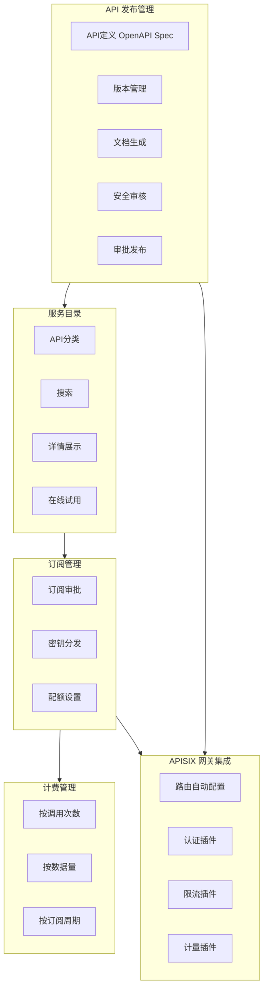

### 8.3 API 发布

#### 8.3.1 OpenAPI Spec 定义

```yaml
# openapi-spec.yaml
openapi: 3.0.3
info:
  title: 风控评分 API
  version: 1.0.0
  description: 金融风控评分查询 API
paths:
  /api/v1/risk/score:
    post:
      summary: 查询客户风险评分
      security:
        - ApiKeyAuth: []
      requestBody:
        content:
          application/json:
            schema:
              type: object
              properties:
                customer_id:
                  type: string
      responses:
        '200':
          description: 评分结果
          content:
            application/json:
              schema:
                type: object
                properties:
                  risk_score:
                    type: number
                  risk_level:
                    type: string
components:
  securitySchemes:
    ApiKeyAuth:
      type: apiKey
      in: header
      name: X-API-Key
```

#### 8.3.2 版本管理

表：API版本管理策略表

| 版本类型 | 规则 | 兼容性 |
| --- | --- | --- |
| 主版本 X.0.0 | 不兼容变更 | 需重新订阅 |
| 次版本 1.X.0 | 向后兼容新增 | 自动可用 |
| 修订版本 1.0.X | Bug 修复 | 自动可用 |

#### 8.3.3 文档自动生成

```python
# 代码示例：API文档自动生成（Python）
class ApiDocGenerator:
    """API 文档自动生成器."""

    def generate(self, api_id: str) -> Documentation:
        spec = self._load_openapi_spec(api_id)
        markdown_doc = self._spec_to_markdown(spec)
        interactive_doc = self._spec_to_swagger_ui(spec)
        return Documentation(
            api_id=api_id,
            markdown=markdown_doc,
            interactive=interactive_doc,
            version=spec.info.version
        )
```

### 8.4 服务目录

#### 8.4.1 API 分类与搜索

```sql
-- SQL功能名：API目录表DDL
CREATE TABLE IF NOT EXISTS iceberg.`tenant/{tid}/api`.api_catalog (
    api_id               STRING      COMMENT 'API唯一标识',
    api_name             STRING      COMMENT 'API名称',
    api_version          STRING      COMMENT 'API版本',
    category             STRING      COMMENT '分类：数据查询/数据写入/模型推理/数据导出',
    description          STRING      COMMENT 'API描述',
    endpoint             STRING      COMMENT 'API端点',
    method               STRING      COMMENT 'HTTP方法',
    auth_type            STRING      COMMENT '认证方式：API_KEY/JWT/OAUTH2',
    sla_level            STRING      COMMENT 'SLA等级：金/银/铜',
    price_model          STRING      COMMENT '计价模型',
    status               STRING      COMMENT '状态：开发/审核/发布/废弃/归档',
    rating               DECIMAL(3,2) COMMENT '评分',
    call_count           BIGINT      COMMENT '累计调用次数',
    tenant_id            STRING      COMMENT '租户ID',
    dt                   STRING      COMMENT '分区字段'
) USING iceberg
PARTITIONED BY (dt, tenant_id);
```

#### 8.4.2 在线试用

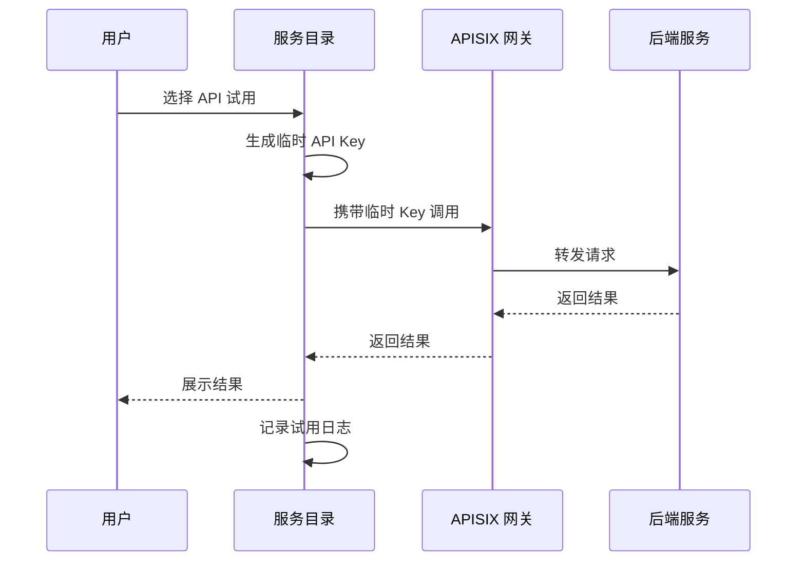

### 8.5 订阅管理

#### 8.5.1 订阅审批与密钥分发

```python
# 代码示例：API订阅管理（Python）
class ApiSubscriptionService:
    """API 订阅管理服务."""

    def subscribe(self, api_id: str, consumer_id: str, plan: SubscriptionPlan) -> Subscription:
        subscription = self._create_subscription(api_id, consumer_id, plan)
        if plan.requires_approval:
            self._send_approval_request(subscription)
        else:
            self._auto_approve(subscription)
        return subscription

    def approve(self, subscription_id: str) -> Credentials:
        subscription = self._get_subscription(subscription_id)
        credentials = self._generate_credentials(subscription)
        self._configure_apisix_route(subscription, credentials)
        self._set_quota(subscription)
        return credentials

    def _generate_credentials(self, subscription: Subscription) -> Credentials:
        api_key = f"ak_{secrets.token_hex(16)}"
        api_secret = self._sm4_encrypt(secrets.token_hex(32))
        return Credentials(api_key=api_key, api_secret=api_secret)
```

#### 8.5.2 配额设置

表：API配额策略表

| 配额维度 | 说明 | 默认值 |
| --- | --- | --- |
| QPS | 每秒查询数 | 100 |
| 日调用量 | 每日调用上限 | 100000 |
| 并发数 | 并发请求数 | 10 |
| 数据量 | 单次返回数据量 | 10MB |

### 8.6 计费

#### 8.6.1 计费模型

```sql
-- SQL功能名：API计费记录表DDL
CREATE TABLE IF NOT EXISTS iceberg.`tenant/{tid}/api`.api_billing_record (
    billing_id           STRING      COMMENT '计费ID',
    api_id               STRING      COMMENT 'API ID',
    subscription_id      STRING      COMMENT '订阅ID',
    consumer_id          STRING      COMMENT '消费方ID',
    billing_period       STRING      COMMENT '计费周期',
    call_count           BIGINT      COMMENT '调用次数',
    data_volume_mb       DECIMAL(18,2) COMMENT '数据量（MB）',
    amount               DECIMAL(18,2) COMMENT '计费金额',
    billing_status       STRING      COMMENT '计费状态：未结算/已结算',
    tenant_id            STRING      COMMENT '租户ID',
    dt                   STRING      COMMENT '分区字段'
) USING iceberg
PARTITIONED BY (dt, tenant_id);
```

### 8.7 APISIX 网关集成

#### 8.7.1 路由自动配置

```python
# 代码示例：APISIX路由自动下发（Python）
class ApisixRouteManager:
    """APISIX 路由管理器."""

    def deploy_route(self, api: ApiDefinition) -> RouteConfig:
        route = {
            "uri": api.endpoint,
            "name": f"route-{api.api_id}",
            "methods": [api.method],
            "upstream": {
                "type": "roundrobin",
                "nodes": {api.upstream_url: 1}
            },
            "plugins": self._build_plugins(api)
        }
        return self._apisix_admin.create_route(route)

    def _build_plugins(self, api: ApiDefinition) -> dict:
        plugins = {
            "key-auth": {"header_name": "X-API-Key"},
            "limit-req": {"rate": api.qps_limit, "burst": api.burst_limit, "key": "consumer_name"},
            "prometheus": {},
            "http-logger": {"batch_max_size": 100, "uri": "http://log-collector:9200"}
        }
        if api.auth_type == "JWT":
            plugins["jwt-auth"] = {"key": "shuqing-jwt"}
        return plugins
```

#### 8.7.2 认证插件链

```yaml
# apisix-plugins.yaml
plugins:
  - key-auth:              # API Key 认证
      header_name: X-API-Key
  - jwt-auth:              # JWT 认证
      key: shuqing-jwt
      algorithm: RS256
  - keycloak-auth:         # Keycloak 认证
      server_url: http://keycloak:8080
      realm: shuqing
  - consumer-restriction:  # 消费者限制
      whitelist: ${allowed_consumers}
```

#### 8.7.3 限流插件

```yaml
# apisix-rate-limit.yaml
plugins:
  - limit-req:             # 秒级限流
      rate: ${qps_limit}
      burst: ${burst_limit}
      key: consumer_name
      rejected_code: 429
  - limit-count:           # 日级限流
      count: ${daily_limit}
      time_window: 86400
      key: consumer_name
      policy: redis-cluster
```

### 8.8 与 V1.0 open-api-catalog 演进

表：open-api-catalog骨架到落地演进表

| 能力 | V1.0 骨架 | V2.0 落地 |
| --- | --- | --- |
| API 注册 | 内存存储 | Iceberg 持久化 + OpenAPI Spec |
| 发布流程 | 单步发布 | 全生命周期（定义→审核→发布→废弃→归档） |
| 服务目录 | 简单列表 | 分类 + 全文搜索 + 在线试用 |
| 订阅管理 | Mock 订阅 | 审批流 + 密钥分发 + 配额管理 |
| APISIX 集成 | 配置生成 | 路由自动下发 + 插件链 |
| 计费 | 无 | 多模型计费 + 账单 |

### 8.9 多租户与安全考虑

1. **API 隔离**：API 按租户隔离，跨租户 API 不可见（除非发布到公共目录）。
2. **认证安全**：API Key/JWT 通过 APISIX 插件校验，密钥 SM4 加密存储。
3. **限流保护**：QPS + 日调用量 + 并发数三重限流，防止滥用。
4. **调用审计**：所有 API 调用记录审计日志，包含调用方、参数、响应、耗时。
5. **网关安全**：APISIX Ingress 与租户 Namespace 网络隔离，仅放行白名单流量。

## 第9章 安全合规增强

### 9.1 模块定位

V2.0 在 V1.0 rule-engine 安全脱敏基础上，补齐等保三级、密评、数据合规三项安全合规能力，以 SecurityFacade 统一封装，实现安全能力对业务层零感知。

### 9.2 安全合规架构

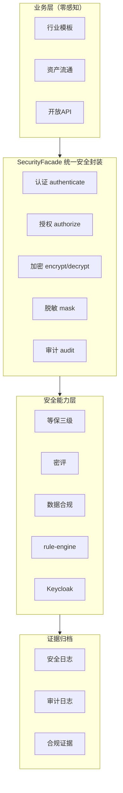

### 9.3 等保三级落地

#### 9.3.1 六维安全要求

表：等保三级六维安全要求落地表

| 安全维度 | 等保要求 | 落地措施 | 验证方式 |
| --- | --- | --- | --- |
| 物理安全 | 物理访问控制、防盗窃防破坏 | 信创服务器机房门禁+视频监控+防火防水 | 物理安全检查清单 |
| 网络安全 | 边界访问控制、入侵检测、安全审计 | Cilium NetworkPolicy+IDS+流量审计 | 渗透测试+网络扫描 |
| 主机安全 | 身份鉴别、访问控制、安全审计、入侵防范 | SKE 内核加固+容器镜像扫描+主机 IDS | 主机基线检查+漏洞扫描 |
| 应用安全 | 身份鉴别、访问控制、通信完整性、安全审计 | Keycloak 多因素认证+RBAC+TLS+审计日志 | 应用安全测试+SAST |
| 数据安全 | 数据完整性、数据保密性、数据备份恢复 | SM4 加密+SM3 完整性+定期备份+异地容灾 | 数据安全评估+恢复演练 |
| 管理安全 | 安全管理制度、安全管理机构、人员管理 | 安全制度文档+安全组织+人员培训+应急预案 | 管理审计+培训记录 |

#### 9.3.2 网络安全落地

```yaml
# networkpolicy-deny-all.yaml
apiVersion: networking.k8s.io/v1
kind: NetworkPolicy
metadata:
  name: deny-all-${tenantId}
  namespace: ws-${tenantId}
spec:
  podSelector: {}
  policyTypes:
    - Ingress
    - Egress
  ingress: []
  egress:
    - to:
        - namespaceSelector:
            matchLabels:
              tenant: ${tenantId}
    - to:
        - namespaceSelector:
            matchLabels:
              name: kube-system
      ports:
        - protocol: UDP
          port: 53
```

#### 9.3.3 应用安全落地

```python
# 代码示例：SecurityFacade统一安全封装（Python）
from abc import ABC, abstractmethod

class SecurityFacade:
    """统一安全 API 封装."""

    def __init__(self, auth_provider, crypto_provider, mask_provider, audit_provider):
        self._auth = auth_provider
        self._crypto = crypto_provider
        self._mask = mask_provider
        self._audit = audit_provider

    def authenticate(self, token: str) -> Principal:
        principal = self._auth.verify(token)
        self._audit.log(event="AUTH_SUCCESS", principal=principal)
        return principal

    def authorize(self, principal: Principal, resource: str, action: str) -> bool:
        allowed = self._auth.check_permission(principal, resource, action)
        self._audit.log(event="AUTHZ_CHECK", principal=principal, resource=resource, action=action, result=allowed)
        return allowed

    def encrypt(self, plaintext: bytes, key_id: str) -> bytes:
        return self._crypto.encrypt(plaintext, key_id)

    def decrypt(self, ciphertext: bytes, key_id: str) -> bytes:
        return self._crypto.decrypt(ciphertext, key_id)

    def mask(self, data: dict, rules: list) -> dict:
        return self._mask.apply(data, rules)

    def audit(self, event: str, **kwargs):
        self._audit.log(event=event, **kwargs)
```

### 9.4 密评

#### 9.4.1 密算法合规性评估

表：密算法合规性评估表

| 评估项 | 评估内容 | 合规标准 | 落地措施 |
| --- | --- | --- | --- |
| 算法合规性 | 使用国家密码管理局批准的算法 | SM2/SM3/SM4 | CryptoSpiFactory 默认国密 |
| 密钥管理 | 密钥生成、存储、分发、更新、销毁 | 密钥生命周期管理 | KMS 统一密钥管理 |
| 密钥强度 | 密钥长度满足安全要求 | SM2:256bit SM4:128bit | 强制最小密钥长度 |
| 随机数 | 随机数质量满足要求 | 国密随机数生成器 | 使用国密 DRBG |
| 安全协议 | 传输协议使用国密 | GMTLS/国密SSL | 国密 SSL 替代 TLS |

#### 9.4.2 密钥管理评估

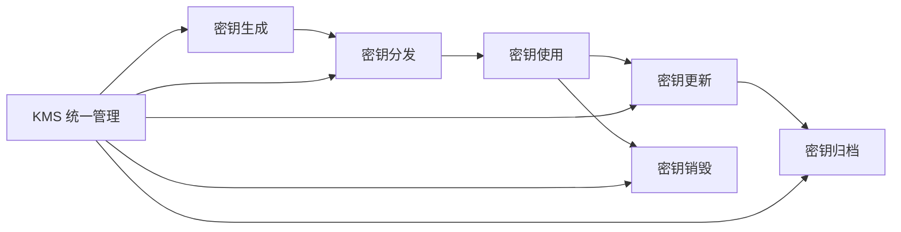

### 9.5 数据合规

#### 9.5.1 数据分类分级

表：数据分类分级标准表

| 数据级别 | 说明 | 访问控制 | 加密要求 | 脱敏要求 |
| --- | --- | --- | --- | --- |
| 公开 | 可公开发布 | 无限制 | 无 | 无 |
| 内部 | 仅组织内部可见 | 内部用户 | 传输加密 | 部分脱敏 |
| 秘密 | 仅授权人员可见 | 授权用户 | 传输+存储加密 | 完全脱敏 |
| 机密 | 最高机密 | 特定用户 | 传输+存储加密+审计 | 完全脱敏+审计 |

#### 9.5.2 跨境数据流动控制

```python
# 代码示例：跨境数据流动控制（Python）
class CrossBorderDataController:
    """跨境数据流动控制器."""

    def check_transfer(self, data: dict, destination: str) -> TransferDecision:
        classification = self._classify_data(data)
        if classification in ["秘密", "机密"]:
            if not self._is_approved_destination(destination):
                return TransferDecision(allowed=False, reason="敏感数据禁止跨境传输")
        if self._contains_personal_info(data):
            if not self._has_consent(data):
                return TransferDecision(allowed=False, reason="个人信息需用户同意")
            data = self._mask_personal_info(data)
        self._audit_transfer(data, destination)
        return TransferDecision(allowed=True, masked_data=data)
```

#### 9.5.3 数据保留策略

表：数据保留策略表

| 数据类型 | 保留期限 | 归档方式 | 销毁方式 |
| --- | --- | --- | --- |
| 审计日志 | 7 年 | 冷存储归档 | 安全删除 |
| 安全日志 | 5 年 | 冷存储归档 | 安全删除 |
| 业务数据 | 按行业规定 | 冷存储归档 | 安全删除 |
| 个人信息 | 按法规要求 | 匿名化归档 | 安全删除 |
| 临时数据 | 30 天 | 不归档 | 自动删除 |

### 9.6 证据归档

#### 9.6.1 安全日志归档

```sql
-- SQL功能名：安全日志归档表DDL
CREATE TABLE IF NOT EXISTS iceberg.`tenant/{tid}/security`.security_log_archive (
    log_id               STRING      COMMENT '日志ID',
    log_type             STRING      COMMENT '日志类型：AUTH/AUTHZ/ENCRYPT/MASK/AUDIT',
    log_content          STRING      COMMENT '日志内容JSON',
    log_time             TIMESTAMP   COMMENT '日志时间',
    log_source           STRING      COMMENT '日志来源',
    integrity_hash       STRING      COMMENT '完整性哈希（SM3）',
    prev_hash            STRING      COMMENT '前一条哈希（链式）',
    tenant_id            STRING      COMMENT '租户ID',
    dt                   STRING      COMMENT '分区字段'
) USING iceberg
PARTITIONED BY (dt, tenant_id);
```

#### 9.6.2 合规证据自动归档

```mermaid
graph LR
    A[安全事件发生] --> B[日志采集]
    B --> C[SM3 完整性哈希]
    C --> D[链式存储]
    D --> E[定期归档至冷存储]
    E --> F[合规证据报告生成]
    F --> G[证据库（X2）]
```

### 9.7 与 rule-engine 集成

```mermaid
graph TB
    A[安全规则定义] --> B[rule-engine]
    B --> C{规则类型}
    C -->|DQ| D[数据质量检查]
    C -->|MASK| E[数据脱敏]
    C -->|ALERT| F[安全告警]
    C -->|COMPLIANCE| G[合规检查]
    D --> H[审计日志]
    E --> H
    F --> I[Alertmanager]
    G --> J[合规证据归档]
```

安全规则自动执行：

```python
# 代码示例：安全规则自动执行（Python）
class SecurityRuleExecutor:
    """安全规则自动执行器."""

    def execute_on_query(self, query: str, principal: Principal) -> QueryResult:
        if not self._facade.authorize(principal, query.resource, "READ"):
            raise AuthorizationError("无权限访问")
        result = self._execute_query(query)
        mask_rules = self._get_mask_rules(query.resource, principal)
        result = self._facade.mask(result, mask_rules)
        self._facade.audit("DATA_QUERY", principal=principal, query=query, rows=len(result))
        return result
```

### 9.8 多租户与安全考虑

1. **安全隔离**：安全日志、审计日志按租户隔离，跨租户审计不可见。
2. **密钥隔离**：每个租户独立密钥空间，KMS 按租户隔离密钥。
3. **合规适配**：不同行业合规要求不同（金融/政务等保三级，其他等保二级），按租户配置。
4. **证据不可篡改**：安全日志 SM3 链式哈希，防篡改，定期归档至冷存储。

## 第10章 国密支持

### 10.1 模块定位

V2.0 在 V1.0 rule-engine SM2/SM3/SM4 脱敏基础上，补齐 CryptoSpiFactory 可插拔密码学抽象，实现国密/国际算法无缝切换，覆盖 JWT 签名加密、数据传输加密、存储加密、数字证书全场景。

### 10.2 国密算法架构

```mermaid
graph TB
    subgraph 应用层["应用层"]
        A1[JWT 签名/加密]
        A2[数据传输加密]
        A3[存储加密]
        A4[数字证书]
    end
    subgraph Facade["CryptoSpiFactory 可插拔抽象"]
        F1[签名 sign/verify]
        F2[加密 encrypt/decrypt]
        F3[哈希 hash]
        F4[密钥交换 keyExchange]
    end
    subgraph 国密["国密实现"]
        G1[SM2 非对称]
        G2[SM3 哈希]
        G3[SM4 对称]
    end
    subgraph 国际["国际算法实现"]
        I1[RSA/ECC 非对称]
        I2[SHA-256 哈希]
        I3[AES 对称]
    end
    应用层 --> Facade
    Facade --> 国密
    Facade --> 国际
```

#### 10.2.1 双轨制实现策略（信创/非信创）

> 修复说明：BouncyCastle 是开源库，其国密实现（SM2Engine/SM3Digest/SM4Engine）**未通过国家密码管理局《商用密码产品认证》**，信创环境强制使用会无法通过密评（GM/T 0054）。V2.0 采用**双轨制**实现策略，通过 CryptoSpiFactory SPI 接口（见 §10.6）统一加载，业务层零感知。

表：国密双轨制实现策略表

| 环境 | 密码实现 | 认证状态 | 加载方式 | 合规性 |
| --- | --- | --- | --- | --- |
| 信创环境 | 商用密码产品认证组件（华为云 KMS / 三未信安 / 得安信息 / 卫士通 / 信安世纪） | 已通过国密局商用密码产品认证 | CryptoSpiFactory SPI 加载，通过 SDF/PKCS#11 接口调用硬件密码机或认证软件模块 | 满足密评 GM/T 0054 |
| 非信创环境 | BouncyCastle 开源实现（SM2Engine/SM3Digest/SM4Engine） | 未通过国密局认证（开源） | CryptoSpiFactory SPI 加载，纯软件实现 | 仅用于非信创生产环境兜底 |

**密评合规说明**：

1. **信创环境强制认证组件**：信创环境（政府/金融/军工等）必须使用通过国密局《商用密码产品认证》的密码产品，V2.0 对接华为云 KMS、三未信安 SDF1888、得安信息 SJW56、卫士通 SDF 等，通过 SDF（安全设备接口）/PKCS#11 标准接口调用，KEK 必须存储于认证硬件密码机。
2. **BouncyCastle 仅非信创兜底**：BouncyCastle 开源实现仅用于非信创环境（如出海业务、纯商业环境），不得用于信创生产环境；开发/测试环境可使用 BouncyCastle 加速迭代。
3. **SPI 切换零感知**：业务层通过 CryptoSpiFactory 统一调用 `signature()`/`cipher()`/`hash()`，底层实现由 `activeProvider` 配置切换（信创=`SM_CERTIFIED`，非信创=`SM_BC`），业务代码无需修改。
4. **密评证据归档**：信创环境密码产品认证证书、SDF/PKCS#11 接口符合性测试报告、密评报告归档至 X2 证据库（见 §9.6）。

### 10.3 SM2 非对称加密

> 实现说明：下方 BouncyCastle 代码示例为**非信创环境兜底实现**。信创环境通过 SDF/PKCS#11 接口调用国产密码机（华为云 KMS/三未信安/得安信息/卫士通），由 CryptoSpiFactory SPI 加载认证组件，不使用 BouncyCastle。

#### 10.3.1 数字签名

```java
// 代码示例：SM2数字签名（Java）
public class SM2SignatureProvider implements SignatureSpi {
    private final SM2Engine engine;
    private final SM3Digest digest;

    public SM2SignatureProvider() {
        this.engine = new SM2Engine();
        this.digest = new SM3Digest();
    }

    @Override
    public byte[] sign(PrivateKey privateKey, byte[] data) {
        ECPrivateKeyParameters privKey = (ECPrivateKeyParameters) privateKey;
        byte[] hash = computeHash(data);
        return engine.sign(privKey, hash);
    }

    @Override
    public boolean verify(PublicKey publicKey, byte[] data, byte[] signature) {
        ECPublicKeyParameters pubKey = (ECPublicKeyParameters) publicKey;
        byte[] hash = computeHash(data);
        return engine.verify(pubKey, hash, signature);
    }

    private byte[] computeHash(byte[] data) {
        digest.reset();
        digest.update(data, 0, data.length);
        byte[] hash = new byte[digest.getDigestSize()];
        digest.doFinal(hash, 0);
        return hash;
    }
}
```

#### 10.3.2 密钥交换

```text
SM2 密钥交换流程：
1. A 生成临时密钥对 (rA, RA)，发送 RA 给 B
2. B 生成临时密钥对 (rB, RB)，计算共享密钥 KB，发送 RB 给 A
3. A 计算共享密钥 KA
4. KA = KB（共享密钥用于后续 SM4 对称加密）
```

### 10.4 SM3 哈希算法

> 实现说明：下方 BouncyCastle 代码示例为**非信创环境兜底实现**。信创环境通过 SDF/PKCS#11 接口调用国产密码机（华为云 KMS/三未信安/得安信息/卫士通），由 CryptoSpiFactory SPI 加载认证组件，不使用 BouncyCastle。

```java
// 代码示例：SM3哈希算法（Java）
public class SM3HashProvider implements HashSpi {
    private final SM3Digest digest;

    public SM3HashProvider() {
        this.digest = new SM3Digest();
    }

    @Override
    public byte[] hash(byte[] data) {
        digest.reset();
        digest.update(data, 0, data.length);
        byte[] result = new byte[32]; // SM3 输出 256bit
        digest.doFinal(result, 0);
        return result;
    }

    @Override
    public byte[] hashWithSalt(byte[] data, byte[] salt) {
        byte[] combined = new byte[data.length + salt.length];
        System.arraycopy(data, 0, combined, 0, data.length);
        System.arraycopy(salt, 0, combined, data.length, salt.length);
        return hash(combined);
    }
}
```

### 10.5 SM4 对称加密

> 实现说明：下方 BouncyCastle 代码示例为**非信创环境兜底实现**。信创环境通过 SDF/PKCS#11 接口调用国产密码机（华为云 KMS/三未信安/得安信息/卫士通），由 CryptoSpiFactory SPI 加载认证组件，不使用 BouncyCastle。

```java
// 代码示例：SM4对称加密（Java）
public class SM4CipherProvider implements CipherSpi {
    private final SM4Engine engine;
    private final PaddedBufferBlockCipher cipher;

    public SM4CipherProvider() {
        this.engine = new SM4Engine();
        this.cipher = new PaddedBufferBlockCipher(engine, new PKCS7Padding());
    }

    @Override
    public byte[] encrypt(byte[] plaintext, byte[] key, byte[] iv) {
        KeyParameter keyParam = new KeyParameter(key);
        ParametersWithIV params = new ParametersWithIV(keyParam, iv);
        cipher.init(true, params);
        byte[] output = new byte[cipher.getOutputSize(plaintext.length)];
        int len = cipher.processBytes(plaintext, 0, plaintext.length, output, 0);
        cipher.doFinal(output, len);
        return output;
    }

    @Override
    public byte[] decrypt(byte[] ciphertext, byte[] key, byte[] iv) {
        KeyParameter keyParam = new KeyParameter(key);
        ParametersWithIV params = new ParametersWithIV(keyParam, iv);
        cipher.init(false, params);
        byte[] output = new byte[cipher.getOutputSize(ciphertext.length)];
        int len = cipher.processBytes(ciphertext, 0, ciphertext.length, output, 0);
        cipher.doFinal(output, len);
        return output;
    }
}
```

### 10.6 CryptoSpiFactory 可插拔抽象

```java
// 代码示例：CryptoSpiFactory可插拔工厂（Java）
public class CryptoSpiFactory {
    private static final Map<String, CryptoProvider> PROVIDERS = new ConcurrentHashMap<>();
    private static String activeProvider = "SM"; // 默认国密

    static {
        registerProvider("SM", new SMCryptoProvider());
        registerProvider("INTERNATIONAL", new InternationalCryptoProvider());
    }

    public static void registerProvider(String name, CryptoProvider provider) {
        PROVIDERS.put(name, provider);
    }

    public static void setActiveProvider(String name) {
        activeProvider = name;
    }

    public static SignatureSpi signature() {
        return PROVIDERS.get(activeProvider).signature();
    }

    public static CipherSpi cipher() {
        return PROVIDERS.get(activeProvider).cipher();
    }

    public static HashSpi hash() {
        return PROVIDERS.get(activeProvider).hash();
    }

    public static KeyExchangeSpi keyExchange() {
        return PROVIDERS.get(activeProvider).keyExchange();
    }
}

public class SMCryptoProvider implements CryptoProvider {
    @Override public SignatureSpi signature() { return new SM2SignatureProvider(); }
    @Override public CipherSpi cipher() { return new SM4CipherProvider(); }
    @Override public HashSpi hash() { return new SM3HashProvider(); }
    @Override public KeyExchangeSpi keyExchange() { return new SM2KeyExchangeProvider(); }
}
```

### 10.7 应用场景

#### 10.7.1 JWT 签名/加密

```java
// 代码示例：国密JWT签名（Java）
public class SMJwtBuilder {
    public String buildJwt(Principal principal) {
        return Jwts.builder()
            .setSubject(principal.getId())
            .claim("tenant", principal.getTenantId())
            .claim("roles", principal.getRoles())
            .setIssuedAt(new Date())
            .setExpiration(new Date(System.currentTimeMillis() + 3600000))
            .signWith(sm2PrivateKey, SignatureAlgorithm.ES256) // SM2 签名
            .compact();
    }

    public Principal parseJwt(String jwt) {
        Claims claims = Jwts.parserBuilder()
            .setSigningKey(sm2PublicKey)
            .build()
            .parseClaimsJws(jwt)
            .getBody();
        return Principal.fromClaims(claims);
    }
}
```

#### 10.7.2 数据传输加密

```text
数据传输加密流程：
1. 客户端生成临时 SM2 密钥对，用服务端 SM2 公钥加密临时 SM4 密钥
2. 服务端用 SM2 私钥解密获得 SM4 密钥
3. 双方使用 SM4 密钥加密通信内容
4. 每次会话使用不同 SM4 密钥（前向安全）
```

#### 10.7.3 存储加密

```python
# 代码示例：数据存储加密（Python）
class EncryptedStorage:
    """加密存储."""

    def __init__(self, kms_client):
        self._kms = kms_client

    def store(self, table: str, data: dict) -> None:
        dek = self._kms.generate_data_key()  # SM4 数据密钥
        encrypted_dek = self._kms.encrypt_dek(dek)  # 用 KEK 加密 DEK
        encrypted_data = self._sm4_encrypt(data, dek)
        self._write(table, encrypted_data, encrypted_dek)

    def load(self, table: str) -> dict:
        encrypted_data, encrypted_dek = self._read(table)
        dek = self._kms.decrypt_dek(encrypted_dek)
        return self._sm4_decrypt(encrypted_data, dek)
```

### 10.8 与 Keycloak 集成

#### 10.8.1 国密 JWT

```json
{
  "keycloak_realm_config": {
    "jwtSigningAlgorithm": "SM2",
    "jwtEncryptionAlgorithm": "SM4",
    "jwtHashAlgorithm": "SM3",
    "keyProvider": {
      "type": "sm2",
      "keySize": 256,
      "priority": 100
    }
  }
}
```

#### 10.8.2 国密 SSL

```text
国密 SSL 配置：
- 服务端证书：SM2 签名证书
- 客户端证书：SM2 签名证书（双向认证）
- 握手协议：GMTLS 1.1
- 加密套件：ECC-SM4-SM3
- 替代：TLS 1.2 + RSA + AES + SHA-256（非信创环境）
```

### 10.9 与 rule-engine 集成

国密脱敏规则：

```python
# 代码示例：国密脱敏规则（Python）
class SMMaskRuleExecutor:
    """国密脱敏规则执行器."""

    def execute(self, data: dict, rule: MaskRule) -> dict:
        if rule.strategy == "SM4_ENCRYPT":
            encrypted = CryptoSpiFactory.cipher().encrypt(
                data[rule.field].encode(),
                self._get_key(rule.key_id),
                self._get_iv(rule.iv_id)
            )
            data[rule.field] = base64.b64encode(encrypted).decode()
        elif rule.strategy == "SM3_HASH":
            data[rule.field] = CryptoSpiFactory.hash().hash(
                data[rule.field].encode()
            ).hex()
        elif rule.strategy == "SM4_ENCRYPT_SM3_HASH":
            encrypted = CryptoSpiFactory.cipher().encrypt(
                data[rule.field].encode(),
                self._get_key(rule.key_id),
                self._get_iv(rule.iv_id)
            )
            data[rule.field + "_encrypted"] = base64.b64encode(encrypted).decode()
            data[rule.field + "_hash"] = CryptoSpiFactory.hash().hash(
                data[rule.field].encode()
            ).hex()
            del data[rule.field]
        return data
```

### 10.10 多租户与安全考虑

1. **密钥隔离**：每个租户独立 KEK（密钥加密密钥），DEK（数据加密密钥）按表/字段隔离。
2. **算法切换（双轨制）**：信创环境强制国密认证组件（`activeProvider=SM_CERTIFIED`，对接华为云 KMS/三未信安/得安信息/卫士通，通过 SDF/PKCS#11 调用）；非信创环境使用 BouncyCastle 开源实现（`activeProvider=SM_BC`）或国际算法（`activeProvider=INTERNATIONAL`）。
3. **密钥轮换**：DEK 定期轮换（90 天），轮换后旧密文用旧 DEK 解密、新 DEK 重新加密。
4. **密钥安全（信创强制硬件密码机）**：信创环境 KEK 必须存储于通过国密局《商用密码产品认证》的硬件密码机，永不离开 KMS；BouncyCastle 软件实现仅用于非信创环境，不得用于信创生产环境。
5. **性能考虑**：SM4 性能与 AES 相当，SM2 性能优于 RSA，SM3 性能与 SHA-256 相当；信创环境硬件密码机加速，性能优于软件实现。
6. **密评合规**：信创环境密码产品认证证书、SDF/PKCS#11 接口符合性测试报告归档至 X2 证据库（见 §9.6），满足密评 GM/T 0054 要求；BouncyCastle 开源实现未通过国密局认证，不得用于信创生产环境。

## 第11章 可观测增强

### 11.1 模块定位

V2.0 在 V1.0 Prometheus+Grafana+Loki+Tempo 可观测基座基础上，补齐双视图、分级告警路由、统一查询 API、服务健康度、智能告警五项增强能力。

### 11.2 可观测增强架构

```mermaid
graph TB
    subgraph 采集["数据采集"]
        C1[Metrics Prometheus]
        C2[Logs Loki]
        C3[Traces Tempo]
    end
    subgraph 查询["统一查询 API"]
        Q1[Metrics 查询]
        Q2[Logs 查询]
        Q3[Traces 查询]
    end
    subgraph 视图["Grafana 双视图"]
        V1[平台方全局视图]
        V2[客户方业务视图]
    end
    subgraph 告警["智能告警"]
        A1[异常检测 动态阈值]
        A2[告警聚合]
        A3[根因分析]
        A4[分级路由 Alertmanager]
    end
    subgraph 健康["服务健康度"]
        H1[SLO/SLI 定义]
        H2[错误预算]
        H3[燃尽图]
    end
    采集 --> 查询 --> 视图
    采集 --> 告警
    采集 --> 健康
```

### 11.3 Grafana 双视图

#### 11.3.1 平台方全局视图

```json
{
  "dashboard": {
    "title": "平台方全局视图",
    "tags": ["platform", "ops"],
    "panels": [
      {"id": "cluster_health", "title": "集群健康度", "type": "stat", "query": "avg(up{job=\"kubelet\"}) * 100"},
      {"id": "resource_usage", "title": "资源使用率", "type": "gauge", "query": "avg(1 - node_memory_MemAvailable_bytes / node_memory_MemTotal_bytes) * 100"},
      {"id": "cpu_usage", "title": "CPU 使用率", "type": "graph", "query": "avg(rate(node_cpu_seconds_total{mode!=\"idle\"}[5m])) * 100"},
      {"id": "pod_count", "title": "Pod 数量", "type": "stat", "query": "count(kube_pod_status_phase{phase=\"Running\"})"},
      {"id": "task_success_rate", "title": "任务成功率", "type": "graph", "query": "sum(rate(dolphinscheduler_task_success_total[5m])) / sum(rate(dolphinscheduler_task_total[5m])) * 100"},
      {"id": "query_latency", "title": "查询延迟 P99", "type": "graph", "query": "histogram_quantile(0.99, sum(rate(trino_query_duration_seconds_bucket[5m])) by (le))"}
    ]
  }
}
```

#### 11.3.2 客户方业务视图

```json
{
  "dashboard": {
    "title": "客户方业务视图",
    "tags": ["tenant", "business"],
    "variables": [
      {"name": "tenantId", "type": "query", "query": "label_values(up, tenant)"}
    ],
    "panels": [
      {"id": "data_quality", "title": "数据质量分", "type": "gauge", "query": "avg(dq_quality_score{tenant=\"$tenantId\"})"},
      {"id": "task_success", "title": "任务成功率", "type": "graph", "query": "sum(rate(dolphinscheduler_task_success_total{tenant=\"$tenantId\"}[5m])) / sum(rate(dolphinscheduler_task_total{tenant=\"$tenantId\"}[5m])) * 100"},
      {"id": "query_latency", "title": "查询延迟", "type": "graph", "query": "histogram_quantile(0.99, sum(rate(trino_query_duration_seconds_bucket{tenant=\"$tenantId\"}[5m])) by (le))"},
      {"id": "data_freshness", "title": "数据新鲜度", "type": "stat", "query": "max(time() - data_last_update_time{tenant=\"$tenantId\"})"},
      {"id": "asset_usage", "title": "资产使用量", "type": "graph", "query": "sum(asset_access_count{tenant=\"$tenantId\"}) by (asset_type)"}
    ]
  }
}
```

### 11.4 Alertmanager 分级路由

#### 11.4.1 告警分级

表：告警分级路由表

| 级别 | 说明 | 通知方式 | 响应时效 |
| --- | --- | --- | --- |
| P0 | 紧急：服务宕机/数据丢失 | 电话 + 短信 + 飞书 | 5 分钟 |
| P1 | 严重：核心功能异常 | 飞书 + 钉钉 | 15 分钟 |
| P2 | 警告：性能下降/阈值超限 | 邮件 | 1 小时 |
| P3 | 提示：常规事件 | 日志记录 | 不限 |

#### 11.4.2 路由配置

```yaml
# alertmanager-route.yaml
route:
  group_by: ['alertname', 'tenant', 'severity']
  group_wait: 30s
  group_interval: 5m
  repeat_interval: 4h
  receiver: 'default'
  routes:
    - match:
        severity: 'P0'
      receiver: 'p0-critical'
      group_wait: 0s
      repeat_interval: 1m
    - match:
        severity: 'P1'
      receiver: 'p1-high'
      group_wait: 10s
      repeat_interval: 30m
    - match:
        severity: 'P2'
      receiver: 'p2-warning'
      group_wait: 30s
      repeat_interval: 2h
    - match:
        severity: 'P3'
      receiver: 'p3-info'
      group_wait: 5m
      repeat_interval: 24h

receivers:
  - name: 'p0-critical'
    webhook_configs:
      - url: 'http://phone-gateway:8080/alert'
    pagerduty_configs:
      - service_key: '${PAGERDUTY_KEY}'
  - name: 'p1-high'
    webhook_configs:
      - url: 'http://feishu-bot:8080/alert'
      - url: 'http://dingtalk-bot:8080/alert'
  - name: 'p2-warning'
    email_configs:
      - to: 'ops-team@shuqing.com'
        send_resolved: true
  - name: 'p3-info'
    webhook_configs:
      - url: 'http://log-collector:9200/alert'
```

### 11.5 统一查询 API

#### 11.5.1 API 设计

```text
POST /api/v2/observability/query
请求体：
{
  "type": "METRICS|LOGS|TRACES",
  "query": "PromQL/LogQL/TraceQL 表达式",
  "time_range": {"start": "2026-08-01T00:00:00Z", "end": "2026-08-06T00:00:00Z"},
  "tenant_id": "tenant_xxx",
  "limit": 1000
}
响应体：
{
  "type": "METRICS",
  "results": [...],
  "stats": {"duration_ms": 120, "rows": 100}
}
```

#### 11.5.2 统一查询实现

```python
# 代码示例：统一查询API（Python）
from enum import Enum

class QueryType(Enum):
    METRICS = "METRICS"
    LOGS = "LOGS"
    TRACES = "TRACES"

class UnifiedQueryService:
    """统一查询服务."""

    def query(self, query_type: QueryType, query: str, time_range: TimeRange, tenant_id: str) -> QueryResult:
        self._validate_tenant_access(tenant_id)
        if query_type == QueryType.METRICS:
            return self._query_prometheus(query, time_range, tenant_id)
        elif query_type == QueryType.LOGS:
            return self._query_loki(query, time_range, tenant_id)
        elif query_type == QueryType.TRACES:
            return self._query_tempo(query, time_range, tenant_id)

    def _query_prometheus(self, query: str, time_range: TimeRange, tenant_id: str) -> QueryResult:
        tenant_query = self._inject_tenant_label(query, tenant_id)
        result = self._prometheus.query_range(tenant_query, time_range)
        return QueryResult(type="METRICS", data=result)

    def _inject_tenant_label(self, query: str, tenant_id: str) -> str:
        return query.replace("{", f"{{tenant=\"{tenant_id}\",")
```

### 11.6 服务健康度

#### 11.6.1 SLO/SLI 定义

表：SLO/SLI定义表

| 服务 | SLI 指标 | SLO 目标 | 错误预算 | 窗口 |
| --- | --- | --- | --- | --- |
| SQL 网关 | 可用性 = 成功请求数/总请求数 | 99.9% | 0.1% | 30 天 |
| SQL 网关 | 延迟 P99 < 5s | 99% | 1% | 30 天 |
| 调度编排 | 任务成功率 | 99.5% | 0.5% | 30 天 |
| 资产流通 | API 可用性 | 99.9% | 0.1% | 30 天 |
| 数据质量 | 质量分 > 95 | 95% | 5% | 7 天 |

#### 11.6.2 错误预算与燃尽图

```python
# 代码示例：错误预算计算（Python）
class ErrorBudgetCalculator:
    """错误预算计算器."""

    def calculate(self, slo: SLO, window: TimeWindow) -> ErrorBudget:
        total_requests = self._count_requests(window)
        error_requests = self._count_errors(window)
        actual_error_rate = error_requests / total_requests
        allowed_errors = total_requests * slo.error_budget
        remaining_budget = allowed_errors - error_requests
        burn_rate = actual_error_rate / slo.error_budget
        return ErrorBudget(
            total=allowed_errors,
            consumed=error_requests,
            remaining=remaining_budget,
            burn_rate=burn_rate,
            exhausted=remaining_budget <= 0
        )
```

```json
{
  "dashboard": {
    "title": "服务健康度看板",
    "panels": [
      {"id": "slo_compliance", "title": "SLO 合规率", "type": "stat", "query": "avg(slo_compliance_ratio)"},
      {"id": "error_budget", "title": "错误预算燃尽", "type": "graph", "query": "error_budget_remaining / error_budget_total * 100"},
      {"id": "burn_rate", "title": "燃尽速率", "type": "graph", "query": "slo_burn_rate"},
      {"id": "availability", "title": "可用性", "type": "gauge", "query": "1 - sum(rate(http_requests_total{status=~\"5..\"}[5m])) / sum(rate(http_requests_total[5m]))"}
    ]
  }
}
```

### 11.7 智能告警

#### 11.7.1 异常检测（动态阈值）

```python
# 代码示例：动态阈值异常检测（Python）
class AnomalyDetector:
    """动态阈值异常检测器."""

    def detect(self, metric: str, window: TimeWindow) -> list[Anomaly]:
        history = self._load_history(metric, window)
        baseline = self._compute_baseline(history)
        dynamic_thresholds = self._compute_dynamic_thresholds(baseline, sensitivity=3.0)
        anomalies = []
        for point in history:
            if point.value > dynamic_thresholds.upper or point.value < dynamic_thresholds.lower:
                anomalies.append(Anomaly(
                    metric=metric,
                    timestamp=point.timestamp,
                    value=point.value,
                    expected_range=dynamic_thresholds,
                    severity=self._compute_severity(point, dynamic_thresholds)
                ))
        return anomalies

    def _compute_dynamic_thresholds(self, baseline: Baseline, sensitivity: float) -> Thresholds:
        upper = baseline.mean + sensitivity * baseline.stddev
        lower = baseline.mean - sensitivity * baseline.stddev
        return Thresholds(upper=upper, lower=lower)
```

#### 11.7.2 告警聚合

```mermaid
graph TB
    A[原始告警流] --> B[去重聚合]
    B --> C[关联聚合<br/>同根因]
    C --> D[抑制聚合<br/>父子抑制]
    D --> E[分级聚合<br/>P0-P3]
    E --> F[路由分发]
```

#### 11.7.3 根因分析

```python
# 代码示例：根因分析（Python）
class RootCauseAnalyzer:
    """根因分析器."""

    def analyze(self, alert: Alert) -> RootCause:
        trace = self._get_trace(alert.trace_id)
        dependency_graph = self._build_dependency_graph(trace)
        candidates = self._find_anomalies_in_graph(dependency_graph)
        ranked = self._rank_candidates(candidates, alert)
        return RootCause(
            primary=ranked[0],
            contributors=ranked[1:3],
            confidence=ranked[0].confidence
        )
```

### 11.8 与 V1.0 X3 统一运维观测演进

表：X3统一运维观测演进表

| 能力 | V1.0 基座 | V2.0 增强 |
| --- | --- | --- |
| 指标采集 | Prometheus + 租户 label | + 业务指标 + SLO 指标 |
| 日志采集 | Loki + 租户分片 | + 结构化日志 + 日志分析 |
| 链路追踪 | Tempo | + 跨服务链路 + 根因分析 |
| 可视化 | Grafana 单视图 | 双视图（平台方 + 客户方） |
| 告警 | Alertmanager 简单路由 | 分级路由 + 智能告警 |
| 查询 | 各组件独立查询 | 统一查询 API |
| 健康度 | 无 | SLO/SLI + 错误预算 + 燃尽图 |

### 11.9 多租户与安全考虑

1. **指标隔离**：Prometheus label `tenant=<tid>` 隔离，跨租户查询需授权。
2. **日志隔离**：Loki 按 tenant 分片，跨租户日志不可见。
3. **告警隔离**：告警按租户路由，租户仅收本租户告警。
4. **视图隔离**：客户方业务视图仅展示本租户数据，平台方全局视图需管理员权限。
5. **审计日志**：所有可观测查询记录审计日志，防止敏感信息泄露。

## 第12章 演进路线与风险对策

### 12.1 V2.0 演进路线

```mermaid
graph LR
    A[Phase 1<br/>6行业模板] --> B[Phase 2<br/>资产流通全流程]
    B --> C[Phase 3<br/>开放API落地]
    C --> D[Phase 4<br/>安全合规增强]
    D --> E[Phase 5<br/>国密支持]
    E --> F[Phase 6<br/>可观测增强]
    F --> G[Phase 7<br/>隐私计算集成 V2.1]
```

表：V2.0分阶段演进表

| 阶段 | 内容 | 交付物 | 依赖 |
| --- | --- | --- | --- |
| Phase 1 | 6 行业模板（V1.0 5 行业 + 新增能源） | 6 个 Helm Chart + DDL + DAG + Dashboard | V1.0 industry-templates（5 行业 9 模板） |
| Phase 2 | 资产流通全流程 | asset-exchange v2.0 + API | V1.0 asset-exchange |
| Phase 3 | 开放 API 落地 | open-api-catalog v2.0 + APISIX 集成 | V1.0 open-api-catalog |
| Phase 4 | 安全合规增强 | SecurityFacade + 等保三级 + 密评 | V1.0 rule-engine |
| Phase 5 | 国密支持 | CryptoSpiFactory + Keycloak 集成 | Phase 4 |
| Phase 6 | 可观测增强 | 双视图 + 智能告警 + SLO | V1.0 X3 |
| Phase 7（V2.1） | 隐私计算集成 | 联邦学习（Flink 联邦）+ MPC（SecretFlow/PrivPy）+ 差分隐私 | Phase 2（资产流通 L3/L4/L5 场景，见 §7.7.3） |

### 12.2 风险对策

表：V2.0风险对策表

| 风险 | 影响 | 对策 |
| --- | --- | --- |
| 行业模板数据模型不适配客户 | 模板无法实例化 | 模板参数化设计，支持 DDL 裁剪与扩展；实例化前 Schema 兼容性校验 |
| 资产流通安全交付被绕过 | 数据泄露 | 安全沙箱强制执行，禁止 copy/download；APISIX 网关强制鉴权；审计日志全记录 |
| APISIX 路由下发失败 | API 不可用 | 路由下发幂等 + 重试 + 回滚；APISIX Admin API 健康检查 |
| 等保三级落地成本高 | 交付周期长 | SecurityFacade 统一封装，复用 V1.0 安全能力；等保三级基线模板化 |
| 国密算法性能问题 | 系统性能下降 | CryptoSpiFactory 可切换；性能基准测试；硬件密码机加速 |
| 智能告警误报 | 告警疲劳 | 动态阈值 + 告警聚合 + 抑制规则；人工反馈闭环 |
| 双视图权限混淆 | 越权访问 | 视图按角色隔离，平台方视图需管理员权限，客户方视图仅本租户 |
| 密钥泄露 | 数据泄露 | KMS 统一管理，密钥永不离开 KMS；定期轮换；审计日志 |

### 12.3 验收标准

表：V2.0验收标准表

| 模块 | 验收标准 | 验证方式 |
| --- | --- | --- |
| 6 行业模板 | 每个模板可安装/实例化/升级/卸载；DDL/DAG/Dashboard 正确；V1.0 物联网模板 Helm upgrade 平滑升级验证 | 端到端测试 |
| 资产流通 | 资产登记→上架→流通→变现→交易全流程跑通；安全交付不 copy | 集成测试 + 安全测试 |
| 开放 API | API 发布→订阅→调用→计费全流程跑通；APISIX 路由自动下发 | 集成测试 |
| 安全合规 | 等保三级六维要求落地；密评通过；合规证据归档 | 安全评估 + 密评 |
| 国密支持 | SM2/SM3/SM4 算法正确；CryptoSpiFactory 可切换；Keycloak 集成 | 单元测试 + 性能测试 |
| 可观测增强 | 双视图正确；分级告警路由；SLO 合规；智能告警有效 | 功能测试 + 告警演练 |

### 12.4 与 V1.0 兼容性

1. **API 向后兼容**：V2.0 保留 V1.0 所有 API 端点，新增 `/api/v2/*` 端点，V1.0 客户无感知。
2. **数据兼容**：V2.0 复用 V1.0 数据模型，新增字段可空，不破坏既有数据。
3. **配置兼容**：V2.0 Helm Chart 兼容 V1.0 values.yaml，新增字段有默认值。
4. **升级路径**：V1.0 → V2.0 支持 Helm upgrade，保留租户定制（values merge 策略）。
5. **行业模板兼容**：V2.0 保留 V1.0 全部 5 行业 9 模板（金融/政务/制造/零售/物联网），不废弃、不合并；V1.0 已交付的 `iot-device-health`（物联网设备健康度）模板在 V2.0 保留并增强（见 §6.5），V1.0 租户可通过 Helm upgrade 平滑升级，确保兼容承诺可信。
6. **行业范围演进**：V2.0 行业范围 = V1.0 5 行业（含物联网）+ 新增能源 = 6 行业 10+ 模板；物联网与能源共享 IoTDB 时序底座，不违反 V1.0→V2.0 兼容承诺。

## 第13章 附录

### 13.1 术语表

表：术语对照表

| 术语 | 英文 | 说明 |
| --- | --- | --- |
| 数据集市 | Data Mart | 面向特定业务主题的数据汇总层 |
| OEE | Overall Equipment Effectiveness | 设备综合效率 = 可用率 × 性能率 × 质量率 |
| RFM | Recency Frequency Monetary | 客户价值分析模型 |
| SLO | Service Level Objective | 服务等级目标 |
| SLI | Service Level Indicator | 服务等级指标 |
| 等保三级 | GB/T 22239 Level 3 | 国家信息安全等级保护三级 |
| 密评 | Cryptography Assessment | 密码应用安全性评估 |
| 国密 | Chinese National Cryptography | 国家密码管理局批准的密码算法 |
| SM2 | ShangMi 2 | 国密非对称加密算法 |
| SM3 | ShangMi 3 | 国密哈希算法 |
| SM4 | ShangMi 4 | 国密对称加密算法 |
| KEK | Key Encryption Key | 密钥加密密钥 |
| DEK | Data Encryption Key | 数据加密密钥 |
| KMS | Key Management Service | 密钥管理服务 |

### 13.2 参考文档

- `docs/architecture.md` — V1.0 架构概览
- `design/详细设计/多平台多租户大数据平台_行业应用模板详细设计_v0.1.md` — V1.0 行业模板设计
- `design/详细设计/多平台多租户大数据平台_数据资产流通详细设计_v0.1.md` — V1.0 资产流通设计
- `design/详细设计/多平台多租户大数据平台_开放API服务目录详细设计_v0.1.md` — V1.0 开放 API 设计
- `design/详细设计/多平台多租户大数据平台_安全脱敏详细设计_v0.1.md` — V1.0 安全脱敏设计
- `design/详细设计/多平台多租户大数据平台_统一运维观测详细设计_v0.1.md` — V1.0 可观测设计
- `platform/industry-templates/README.md` — V1.0 行业模板实现
- `platform/asset-exchange/README.md` — V1.0 资产流通实现
- `platform/open-api-catalog/README.md` — V1.0 开放 API 实现
- `platform/rule-engine/README.md` — V1.0 规则引擎实现

### 13.3 变更记录

表：文档变更记录表

| 版本 | 日期 | 变更内容 | 作者 |
| --- | --- | --- | --- |
| v2.0.0 | 2026-08-06 | 初始版本：5 行业模板 + 资产流通 + 开放 API + 安全合规 + 国密 + 可观测增强 | V2.0 行业模板设计师 |