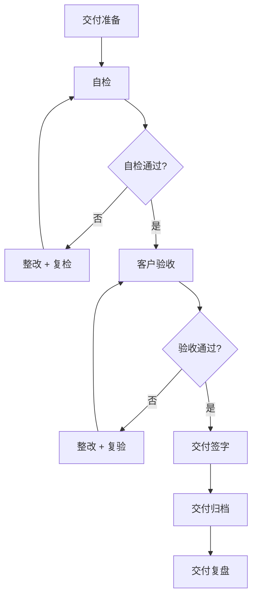

# 交付检查清单

> 归属：多平台多租户大数据平台 · 交付文档
> 版本：v1.0 ｜ 日期：2026-08-17 ｜ 状态：已完成
> 关联：`design/工程交付计划_缺口补全_v1.0.md`；`design/v2.0/Phase2/Phase2_V2.0-beta_交付报告.md`；`design/测试/性能测试计划.md`；`design/测试/安全测试计划.md`
> 适用范围：政企 MVP 交付 + 商用级 GA 交付
> 优先级：P3（完善补齐）

---

## 1. 交付目标

### 1.1 总体目标

建立标准化的交付检查清单，确保政企 MVP 与商用级 GA 交付质量一致、过程可控、结果可验，为客户验收与项目交付提供明确依据。

### 1.2 交付分级

| 级别 | 定义 | 验收方 | 通过标准 |
| --- | --- | --- | --- |
| 政企 MVP | 最小可行产品，验证核心价值 | 客户 + 内部 | MVP 检查项全通过 |
| 商用级 GA | 正式商用版本，满足生产要求 | 客户 + 内部 + 第三方 | GA 检查项全通过 |

---

## 2. 政企 MVP 交付检查项

### 2.1 功能检查

| 编号 | 检查项 | 验证方法 | 通过标准 | 状态 |
| --- | --- | --- | --- | --- |
| M-F-01 | 核心场景端到端可用 | 场景演示 | 4 场景全通过 | ⚠️ 待验证 |
| M-F-02 | 租户生命周期闭环 | 租户创建/配置/使用/冻结/销毁 | 全流程通过 | ⚠️ 待验证 |
| M-F-03 | 数据采集到分析闭环 | 数据集成 → 计算 → 分析 → 服务 | 全链路通过 | ⚠️ 待验证 |
| M-F-04 | 控制台核心功能可用 | 控制台操作 | 核心功能通过 | ⚠️ 待验证 |
| M-F-05 | 多租户隔离有效 | 越权测试 | 隔离通过 | ⚠️ 待验证 |

### 2.2 性能检查

| 编号 | 检查项 | 验证方法 | 通过标准 | 状态 |
| --- | --- | --- | --- | --- |
| M-P-01 | API P99 < 200ms | 性能测试 P-01 | 达标 | ⚠️ 待验证 |
| M-P-02 | TPS > 1000 | 性能测试 P-01 | 达标 | ⚠️ 待验证 |
| M-P-03 | 页面加载 < 2s | 前端性能 | 达标 | ⚠️ 待验证 |
| M-P-04 | 作业提交成功率 > 99% | 作业测试 | 达标 | ⚠️ 待验证 |

### 2.3 安全检查

| 编号 | 检查项 | 验证方法 | 通过标准 | 状态 |
| --- | --- | --- | --- | --- |
| M-S-01 | 身份认证可用 | 登录测试 | MFA 通过 | ⚠️ 待验证 |
| M-S-02 | 权限控制有效 | 越权测试 | 越权拒绝 | ⚠️ 待验证 |
| M-S-03 | 传输加密启用 | TLS 扫描 | 全链路加密 | ⚠️ 待验证 |
| M-S-04 | 审计日志可用 | 审计测试 | 操作留痕 | ⚠️ 待验证 |
| M-S-05 | 高危漏洞清零 | 安全扫描 | 0 高危 | ⚠️ 待验证 |

### 2.4 部署检查

| 编号 | 检查项 | 验证方法 | 通过标准 | 状态 |
| --- | --- | --- | --- | --- |
| M-D-01 | 一键部署可用 | 部署脚本 | 部署成功 | ⚠️ 待验证 |
| M-D-02 | 多环境部署 | dev/staging/prod | 三环境通过 | ⚠️ 待验证 |
| M-D-03 | 信创环境部署 | 信创部署 | 部署通过 | ⚠️ 待验证 |
| M-D-04 | 监控告警就绪 | 监控检查 | 大盘 + 告警就绪 | ⚠️ 待验证 |

### 2.5 文档检查

| 编号 | 检查项 | 验证方法 | 通过标准 | 状态 |
| --- | --- | --- | --- | --- |
| M-DOC-01 | 部署手册就绪 | 文档检查 | 可照手册部署 | ⚠️ 待验证 |
| M-DOC-02 | 运维手册就绪 | 文档检查 | 可照手册运维 | ⚠️ 待验证 |
| M-DOC-03 | 用户手册就绪 | 文档检查 | 用户可使用 | ⚠️ 待验证 |
| M-DOC-04 | API 文档就绪 | 文档检查 | API 可调用 | ⚠️ 待验证 |

### 2.6 MVP 交付结论

- 全部检查项通过 → MVP 可交付。
- 任一检查项未通过 → 整改后复检，全通过方可交付。
- 整改时限：高危 24h，中危 3d，低危 7d。

---

## 3. 商用级 GA 交付检查项

### 3.1 功能检查（在 MVP 基础上扩展）

| 编号 | 检查项 | 验证方法 | 通过标准 | 状态 |
| --- | --- | --- | --- | --- |
| G-F-01 | 全部模块功能可用 | 全模块测试 | 全模块通过 | ⚠️ 待验证 |
| G-F-02 | 全部场景端到端可用 | 全场景演示 | 全场景通过 | ⚠️ 待验证 |
| G-F-03 | SLA 满足 | SLA 监控 | 控制面 > 99.9%，数据面 > 99.5% | ⚠️ 待验证 |

### 3.2 性能检查（在 MVP 基础上扩展）

| 编号 | 检查项 | 验证方法 | 通过标准 | 状态 |
| --- | --- | --- | --- | --- |
| G-P-01 | 全量性能场景通过 | 性能测试 P-01 ~ P-12 | 全场景达标 | ⚠️ 待验证 |
| G-P-02 | 8h 稳定性通过 | 性能测试 P-07 | 8h 无衰减 | ⚠️ 待验证 |
| G-P-03 | 极限压力测试通过 | 压力测试 L-01 ~ L-10 | 容量上限明确 | ⚠️ 待验证 |
| G-P-04 | 熔断降级验证通过 | 压力测试 F-01 ~ F-08 | 熔断有效 | ⚠️ 待验证 |

### 3.3 安全检查（在 MVP 基础上扩展）

| 编号 | 检查项 | 验证方法 | 通过标准 | 状态 |
| --- | --- | --- | --- | --- |
| G-S-01 | OWASP Top 10 全覆盖 | 安全测试 S-05 | 10/10 通过 | ⚠️ 待验证 |
| G-S-02 | 等保三级测评通过 | 等保测评 | 测评报告通过 | ⚠️ 待验证 |
| G-S-03 | 国密合规通过 | 国密自检 | 自检 100% | ⚠️ 待验证 |
| G-S-04 | 渗透测试通过 | 渗透测试 S-10 | 无控制绕过 | ⚠️ 待验证 |
| G-S-05 | 安全整改全闭环 | 整改清单 | 全部闭环 | ⚠️ 待验证 |
| G-S-06 | 镜像签名 + SBOM | 安全测试 S-11 | 全镜像签名 | ⚠️ 待验证 |

### 3.4 可靠性检查

| 编号 | 检查项 | 验证方法 | 通过标准 | 状态 |
| --- | --- | --- | --- | --- |
| G-R-01 | 灾备方案就绪 | 灾备方案 | 方案 + 演练通过 | ⚠️ 待验证 |
| G-R-02 | 备份恢复验证 | 恢复演练 | RTO < 4h，RPO < 1h | ⚠️ 待验证 |
| G-R-03 | 故障切换验证 | 切换演练 | 切换成功 | ⚠️ 待验证 |
| G-R-04 | 监控告警完备 | 监控审计 | 全链路监控 + 告警 | ⚠️ 待验证 |
| G-R-05 | 故障排查手册就绪 | 手册检查 | 手册可用 | ⚠️ 待验证 |

### 3.5 运维检查

| 编号 | 检查项 | 验证方法 | 通过标准 | 状态 |
| --- | --- | --- | --- | --- |
| G-O-01 | 运维 SOP 就绪 | SOP 检查 | SOP 可执行 | ⚠️ 待验证 |
| G-O-02 | 容量规划就绪 | 容量评估 | 基线 + 上限明确 | ⚠️ 待验证 |
| G-O-03 | 变更管理流程就绪 | 流程检查 | 流程可执行 | ⚠️ 待验证 |
| G-O-04 | 灰度发布方案就绪 | 方案检查 | 方案可执行 | ⚠️ 待验证 |
| G-O-05 | 值班体系就绪 | 值班检查 | 7×24 值班就绪 | ⚠️ 待验证 |

### 3.6 部署检查（在 MVP 基础上扩展）

| 编号 | 检查项 | 验证方法 | 通过标准 | 状态 |
| --- | --- | --- | --- | --- |
| G-D-01 | 全环境部署通过 | dev/staging/prod | 全环境通过 | ⚠️ 待验证 |
| G-D-02 | Helm Chart 全就绪 | Chart 检查 | 80+ Chart 就绪 | ⚠️ 待验证 |
| G-D-03 | ArgoCD GitOps 就绪 | GitOps 检查 | GitOps 通过 | ⚠️ 待验证 |
| G-D-04 | 多架构镜像就绪 | 镜像检查 | amd64 + arm64 | ⚠️ 待验证 |

### 3.7 文档检查（在 MVP 基础上扩展）

| 编号 | 检查项 | 验证方法 | 通过标准 | 状态 |
| --- | --- | --- | --- | --- |
| G-DOC-01 | 全量文档就绪 | 文档索引 | 完成率 100% | ⚠️ 待验证 |
| G-DOC-02 | 文档评审通过 | 评审记录 | 全文档评审 | ⚠️ 待验证 |
| G-DOC-03 | 培训材料就绪 | 培训检查 | 培训材料就绪 | ⚠️ 待验证 |

### 3.8 GA 交付结论

- 全部检查项通过 → GA 可交付。
- 任一检查项未通过 → 整改后复检，全通过方可交付。
- 整改时限：高危 24h，中危 7d，低危 30d。

---

## 4. 交付流程

### 4.1 交付阶段

### 4.2 交付准备

- 交付物清单整理。
- 交付环境准备。
- 交付人员就绪。
- 交付计划与客户确认。

### 4.3 交付物清单

| 类别 | 交付物 | 格式 |
| --- | --- | --- |
| 软件 | 平台镜像 + Helm Chart + 部署脚本 | 镜像仓库 + Git |
| 文档 | 全量设计文档 + 用户手册 + 运维手册 | Markdown + PDF |
| 测试 | 测试报告 + 性能报告 + 安全报告 | PDF |
| 合规 | 等保测评报告 + 密评报告 | PDF |
| 培训 | 培训材料 + 培训录像 | PPT + 视频 |
| 源码 | 应用源码 + 配置源码 | Git |

### 4.4 客户验收

- 客户按检查清单逐项验收。
- 验收问题记录 + 整改 + 复验。
- 全部通过后客户签字确认。

### 4.5 交付归档

- 交付物归档至项目档案。
- 交付记录归档至 `design/v2.0/Phase2/`。
- 交付签字单归档。

---

## 5. 交付质量度量

### 5.1 度量指标

| 指标 | 目标 | 度量 |
| --- | --- | --- |
| 检查项通过率 | 100% | 通过项 / 总项 |
| 一次性验收通过率 | > 90% | 一次通过 / 验收次数 |
| 交付延期率 | < 10% | 延期天数 / 计划天数 |
| 客户满意度 | > 4.5/5 | 客户评分 |
| 交付后 30 天故障数 | < 3 | 故障统计 |

### 5.2 持续改进

- 每次交付复盘，识别问题与改进项。
- 每季度更新交付检查清单。
- 交付经验沉淀至知识库。

---

## 6. 风险与应对

| 风险 | 概率 | 影响 | 应对 |
| --- | --- | --- | --- |
| 检查项未通过 | 中 | 交付延期 | 整改时限 + 复检 |
| 客户验收不通过 | 中 | 交付延期 | 提前预验收 + 整改 |
| 交付物不完整 | 低 | 验收失败 | 交付物清单 + 检查 |
| 交付后故障 | 中 | 客户不满 | 30 天护航 + 快速响应 |
| 合规未达标 | 低 | 不可交付 | 合规前置 + 提前测评 |

---

## 7. 参考

- `design/工程交付计划_缺口补全_v1.0.md`：工程交付计划。
- `design/v2.0/Phase2/Phase2_V2.0-beta_交付报告.md`：V2.0-beta 交付报告。
- `design/测试/性能测试计划.md`：性能测试。
- `design/测试/安全测试计划.md`：安全测试。
- `design/安全/等保三级测评材料/测评准备清单.md`：等保测评。
- `design/运维/灾备方案.md`：灾备与恢复。
- `design/文档索引.md`：文档体系。