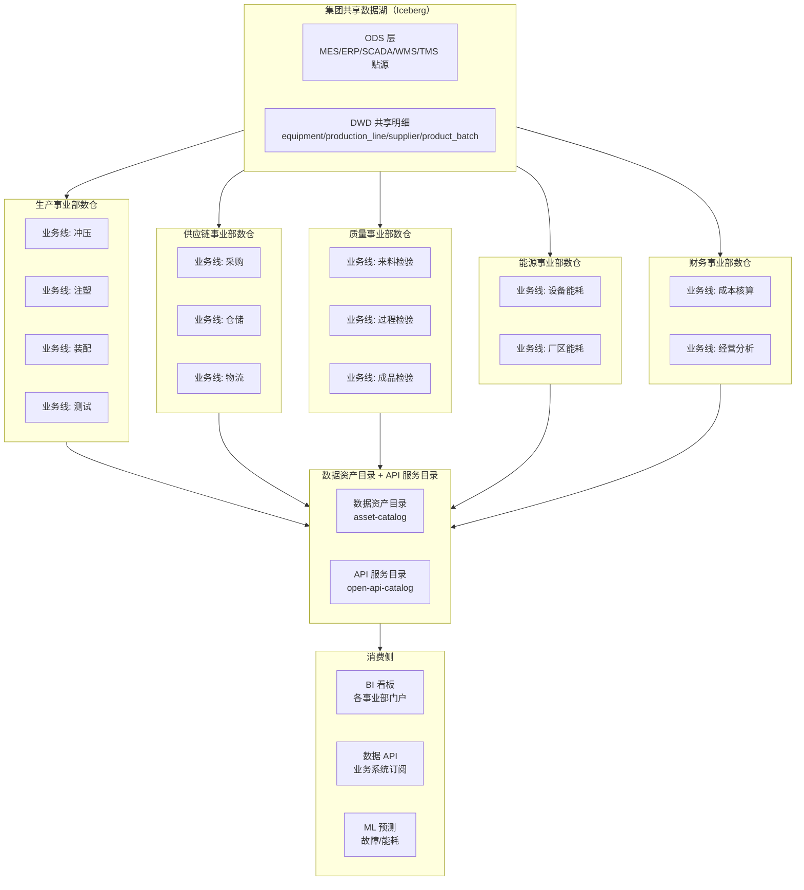
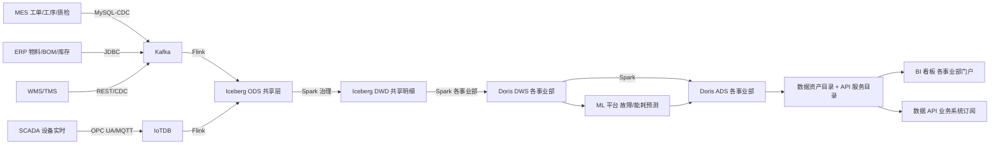
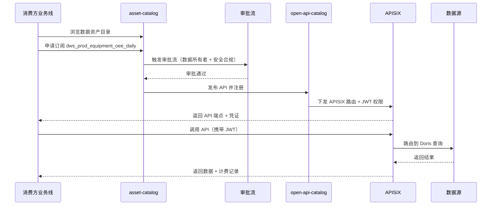
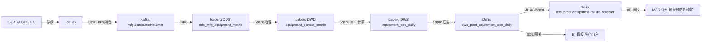
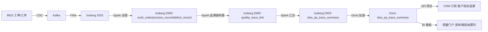

# 大型 toB 企业场景模拟

> 归属：数据引擎大数据平台 · 场景模拟
> 行业模板：manufacturing（制造行业模板）
> 关联设计：`design/v2.0/详细设计/V2.0_行业模板与其他增强详细设计.md` §3 制造行业模板 + §4 业务线门户
> DDL 来源：`platform/industry-templates/templates/manufacturing/ddl/`

## 第1章 场景背景

### 1.1 企业概况

某大型离散制造业集团，主营汽车零部件及整机装配，组织规模与业务体量如下：

- **员工规模**：3 万员工，分布在总部 + 5 个工厂（华东/华南/华北/西南/东北），含一线工人 2.1 万、技术与质量 4000、供应链 2000、IT 与职能 3000。
- **产能规模**：5 个工厂合计 18 条产线、1200+ 设备（CNC/机器人/冲压/注塑/装配/测试），年产能 480 万件，年营收 50 亿元。
- **业务系统**：MES（工单/工序/质检）、ERP（物料/BOM/库存/财务）、SCADA（设备实时数据，OPC UA）、QMS（质量体系）、WMS（仓储）、TMS（运输）、CRM（客户）、IoTDB（设备时序）。
- **数据规模**：存量 35 TB，日增量 200 GB（其中设备时序占 70%），需支持 5 年留存。

### 1.2 多租户与多业务线诉求

集团 IT 治理委员会要求按"事业部 + 业务线"两级隔离，同时共享数据湖底座：

1. **事业部级隔离**：生产、供应链、质量、能源、财务 5 大事业部，每个事业部独立数仓 + 独立 RBAC + 独立看板门户，跨事业部数据共享须走数据资产流通审批。
2. **业务线级隔离**：每个事业部下设若干业务线（如生产事业部下有"冲压业务线/注塑业务线/装配业务线/测试业务线"），业务线间数据默认隔离，可订阅共享数据集。
3. **共享数据湖**：ODS 层和部分 DWD 明细层（如设备主数据、物料主数据）作为集团级共享数据湖，所有事业部可读，写入由数据治理委员会统一管控。
4. **数据产品交付**：每条业务线产出的 DWS/ADS 数据集注册到数据资产目录，发布为 API 服务目录，按需订阅给其他业务线或外部供应商/客户使用。

### 1.3 平台技术选型

表：制造场景技术选型对照表

| 层次 | 组件 | 选型 | 用途 |
| --- | --- | --- | --- |
| 数据接入 | CDC + 工业协议 | SeaTunnel（MySQL-CDC/JDBC）+ 自研 OPC UA Source + MQTT Source | MES/ERP/WMS/TMS + SCADA + IoTDB |
| 数据缓冲 | 消息 | Kafka + IoTDB | 业务事件缓冲 + 设备时序存储 |
| 实时入湖 | 计算 | Flink + Iceberg Sink | 业务 CDC 入湖 + 设备指标实时计算 |
| 离线治理 | 调度 | DolphinScheduler | 多事业部 DAG 调度 |
| 离线计算 | 引擎 | Spark on Yarn | ODS→DWD→DWS→ADS |
| 湖仓存储 | 表格式 | Iceberg V2 | 共享数据湖 + 各事业部数仓 |
| 实时数仓 | 引擎 | Doris | DWS/ADS 加速 |
| 时序引擎 | 引擎 | IoTDB | 设备秒级指标存储 |
| ML 平台 | 引擎 | MLflow + Spark MLlib | 设备故障预测/能耗预测 |
| 数据服务 | 网关 | 统一 SQL 网关 + APISIX | BI 看板 + API 开放 |
| 数据资产 | 目录 | asset-catalog + open-api-catalog | 数据资产目录 + API 服务目录 |
| 权限 | 身份 | Keycloak + RBAC | 事业部/业务线两级隔离 |

## 第2章 总体架构

### 2.1 多租户与多业务线架构



### 2.2 租户与命名空间隔离

每个事业部独立 Namespace，业务线通过 Iceberg 数据库路径二级隔离：

- 生产事业部：`ws-mfg-prod`，数据库 `tenant/mfg/prod/{line}/`
- 供应链事业部：`ws-mfg-scm`，数据库 `tenant/mfg/scm/{line}/`
- 质量事业部：`ws-mfg-qa`，数据库 `tenant/mfg/qa/{line}/`
- 能源事业部：`ws-mfg-energy`，数据库 `tenant/mfg/energy/{line}/`
- 财务事业部：`ws-mfg-fin`，数据库 `tenant/mfg/fin/{line}/`
- 共享数据湖：`ws-mfg-shared`，数据库 `tenant/mfg/shared/`

Keycloak Realm `mfg-group` 下按事业部预置角色：`prod_admin`/`prod_analyst`/`scm_admin`/`scm_analyst`/...，跨事业部访问通过数据资产流通审批临时授权。

## 第3章 端到端流程

### 3.1 流程总览



### 3.2 阶段一：MES/ERP/IoT → 数据接入 → ODS

各业务系统通过 SeaTunnel 多种 Connector 接入：

- **MES**（MySQL）：MySQL-CDC 实时抽取工单/工序/质检记录变更，Topic `mfg.mes.{table}.cdc`。
- **ERP**（Oracle）：JDBC Source 定时（5 分钟）抽取物料/BOM/库存，Topic `mfg.erp.{table}.snapshot`。
- **SCADA**（OPC UA）：自研 OPC UA Source 订阅设备节点，秒级写入 IoTDB 时序库 `root.mfg.equipment.{equipmentCode}`，同时 Flink 计算 1 分钟聚合指标写入 Kafka `mfg.scada.metric.1min`。
- **WMS/TMS**：REST API + CDC 混合接入。

Flink 作业统一写入 Iceberg ODS 共享层，按业务系统分库：

```sql
-- SQL功能名：ODS 设备主表（共享数据湖）
CREATE TABLE IF NOT EXISTS iceberg.`tenant/mfg/shared`.ods_mfg_equipment (
    equipment_id      STRING      COMMENT '设备ID',
    equipment_code    STRING      COMMENT '设备编码',
    equipment_name    STRING      COMMENT '设备名称',
    equipment_type    STRING      COMMENT '设备类型：CNC/ROBOT/PRESS/INJECTION/ASSEMBLY/TEST',
    line_id           STRING      COMMENT '产线ID',
    workshop          STRING      COMMENT '车间',
    plant             STRING      COMMENT '工厂',
    status            STRING      COMMENT '状态：RUNNING/IDLE/DOWN/MAINT/FAULT',
    rated_capacity    DECIMAL(18,4) COMMENT '额定产能',
    iotdb_device_path STRING      COMMENT 'IoTDB 时序设备路径',
    op_ts             TIMESTAMP(3) COMMENT 'CDC 操作时间',
    dt                STRING      COMMENT '分区：业务日期'
) USING iceberg PARTITIONED BY (dt);
```

### 3.3 阶段二：质量追溯 / OEE 计算 / 供应链优化 → DWD → DWS

各事业部独立 Spark 作业消费共享 DWD 明细，产出本事业部 DWS：

#### 3.3.1 质量事业部：质量追溯

基于 `product_batch`（产品批次）、`work_order`（工单）、`process_record`（工序记录）、`quality_parameter`（质量参数）、`defect_record`（缺陷记录）、`quality_trace_link`（追溯链）构建正反向追溯：

- **正向追溯**：批次 → 工序 → 参数 → 缺陷，定位某批次的所有缺陷。
- **反向追溯**：缺陷 → 参数 → 工序 → 批次，定位某缺陷的根因批次和供应商来料。

```sql
-- SQL功能名：DWS 质量追溯汇总
CREATE TABLE IF NOT EXISTS iceberg.`tenant/mfg/qa/trace`.dws_qa_trace_summary (
    batch_id          STRING      COMMENT '批次ID',
    batch_no          STRING      COMMENT '批次号',
    product_code      STRING      COMMENT '产品编码',
    good_qty          INT         COMMENT '合格数量',
    defect_qty        INT         COMMENT '不合格数量',
    yield_rate        DECIMAL(6,4) COMMENT '良率',
    top_defect_code   STRING      COMMENT '主要缺陷编码',
    root_supplier_id  STRING      COMMENT '根因供应商ID',
    trace_depth       INT         COMMENT '追溯深度',
    dt                STRING      COMMENT '分区：业务日期'
) USING iceberg PARTITIONED BY (dt);
```

#### 3.3.2 生产事业部：OEE 计算

基于 `equipment`（设备）、`production_line`（产线）、`shift`（班次）、`equipment_status_log`（状态日志）、`equipment_oee_daily`（日 OEE）、`equipment_oee_shift`（班次 OEE）计算 OEE：

- **OEE 公式**：OEE = 可用率(Availability) × 性能率(Performance) × 质量率(Quality)
- **可用率** = 运行时间 / 计划生产时间
- **性能率** = 总产量 / (运行时间 × 额定节拍)
- **质量率** = 合格产量 / 总产量

```sql
-- SQL功能名：DWS 设备日 OEE 汇总
CREATE TABLE IF NOT EXISTS iceberg.`tenant/mfg/prod/oee`.dws_prod_equipment_oee_daily (
    equipment_id      STRING      COMMENT '设备ID',
    stat_date         DATE        COMMENT '统计日期',
    run_time_min      DECIMAL(10,2) COMMENT '运行时间（分钟）',
    planned_time_min  DECIMAL(10,2) COMMENT '计划生产时间（分钟）',
    availability      DECIMAL(6,4) COMMENT '可用率',
    performance       DECIMAL(6,4) COMMENT '性能率',
    quality_rate      DECIMAL(6,4) COMMENT '质量率',
    oee               DECIMAL(6,4) COMMENT 'OEE',
    target_oee        DECIMAL(6,4) COMMENT '目标 OEE',
    oee_gap           DECIMAL(6,4) COMMENT 'OCE 差距',
    dt                STRING      COMMENT '分区：业务日期'
) USING iceberg PARTITIONED BY (dt);
```

#### 3.3.3 供应链事业部：供应链优化

基于 `supplier`（供应商）、`purchase_order`（采购订单）、`inventory`（库存）、`inventory_movement`（库存动效）、`sales_order`（销售订单）、`logistics_shipment`（物流发运）、`supply_chain_event`（供应链事件）构建全链路可视：

- **库存周转**：库存周转率 = 销售成本 / 平均库存
- **供应商评估**：准时交货率、来料合格率、综合评级 S/A/B/C/D
- **订单履约**：销售订单 → 库存分配 → 采购触发 → 物流发运全链路追踪

### 3.4 阶段三：BI 看板 + 数据 API → 业务部门消费

#### 3.4.1 BI 看板（各事业部门户）

每个事业部独立 Superset 门户，预置看板：

- **生产门户**：产线 OEE 看板、设备状态热力图、工单进度甘特图、停机原因帕累托图。
- **供应链门户**：库存周转看板、供应商评估看板、订单履约看板、物流追踪地图。
- **质量门户**：良率趋势图、缺陷帕累托图、质量追溯链路图、SPC 控制图。
- **能源门户**：设备能耗看板、厂区能耗看板、碳排放看板、能耗预测对比图。
- **财务门户**：成本核算看板、经营分析看板、利润趋势图、预算执行看板。

#### 3.4.2 数据 API（业务系统订阅）

各事业部 DWS/ADS 数据集注册到 `open-api-catalog`，发布为 RESTful API，业务系统按需订阅：

- `GET /api/v1/oee/equipment?date={dt}&lineId={id}`：设备 OEE 查询（生产 MES 订阅用于实时显示）。
- `GET /api/v1/qa/trace/batch/{batchNo}`：质量追溯查询（CRM 订阅用于客户投诉追溯）。
- `GET /api/v1/scm/inventory/turnover?period={month}`：库存周转查询（财务订阅用于成本核算）。
- `POST /api/v1/scm/order/fulfillment`：订单履约状态推送（TMS 订阅用于物流调度）。

### 3.5 阶段四：ML 预测（设备故障预测 / 能耗预测）

ML 平台基于 DWS 数据训练模型，预测结果回写 ADS：

#### 3.5.1 设备故障预测

- **特征**：设备近 30 天状态日志、传感器指标（振动/温度/电流/压力）、保养记录、故障历史。
- **模型**：XGBoost 二分类（是否 7 天内故障）+ LSTM 时序预测（剩余使用寿命 RUL）。
- **输出**：`ads_prod_equipment_failure_forecast`（设备故障预测表），含故障概率、预测故障时间、RUL、置信区间。
- **消费**：MES 订阅 API，故障概率 > 0.7 时触发预防性维护工单。

#### 3.5.2 能耗预测

- **特征**：设备历史能耗、产线排产计划、天气数据、节假日。
- **模型**：LightGBM 回归 + Prophet 时序分解。
- **输出**：`ads_energy_consumption_forecast`（能耗预测表），含未来 7/30 天能耗预测、峰值时段、节能建议。
- **消费**：能源管理系统订阅，用于峰谷电价优化排产。

## 第4章 数据产品交付

### 4.1 数据资产目录

每个事业部产出的 DWS/ADS 数据集注册到 `asset-catalog`，包含元信息：

```json
{
  "assetId": "dws_prod_equipment_oee_daily",
  "name": "设备日 OEE 汇总",
  "domain": "production",
  "owner": "prod_admin",
  "tier": "DWS",
  "schema": "tenant/mfg/prod/oee.dws_prod_equipment_oee_daily",
  "classification": "L2",
  "refreshCycle": "DAILY",
  "sla": "T+1 08:00",
  "lineage": ["ods_mfg_equipment", "dwd_mfg_equipment_status", "dws_prod_equipment_oee_daily"],
  "subscribers": ["mes", "energy_portal"]
}
```

### 4.2 API 服务目录

数据资产发布为 API 后注册到 `open-api-catalog`，APISIX 下发路由：

```json
{
  "apiId": "api_oee_equipment",
  "assetId": "dws_prod_equipment_oee_daily",
  "method": "GET",
  "path": "/api/v1/oee/equipment",
  "auth": "JWT",
  "rateLimit": "1000/min",
  "billing": {"model": "BY_CALL", "price": 0.01},
  "subscribers": [
    {"clientId": "mes", "status": "ACTIVE", "expireAt": "2027-12-31"}
  ]
}
```

### 4.3 按需订阅流程



## 第5章 涉及表清单

表：制造场景涉及表清单

| 事业部 | 层次 | 表名 | 来源 DDL | 业务含义 |
| --- | --- | --- | --- | --- |
| 共享 | ODS | ods_mfg_equipment | 场景定制 | 设备主表（贴源） |
| 共享 | ODS | ods_mfg_work_order | 场景定制 | 工单（贴源） |
| 共享 | ODS | ods_mfg_supplier | 场景定制 | 供应商（贴源） |
| 共享 | DWD | equipment | oee_ddl.sql | 设备主表 |
| 共享 | DWD | production_line | oee_ddl.sql | 产线主表 |
| 共享 | DWD | shift | oee_ddl.sql | 班次表 |
| 共享 | DWD | equipment_status_log | oee_ddl.sql | 设备状态变更日志 |
| 共享 | DWD | equipment_sensor_metric | oee_ddl.sql | 设备传感器指标 |
| 共享 | DWD | product_batch | quality_trace_ddl.sql | 产品批次主表 |
| 共享 | DWD | work_order | quality_trace_ddl.sql | 工单主表 |
| 共享 | DWD | process_route | quality_trace_ddl.sql | 工艺路线 |
| 共享 | DWD | process_record | quality_trace_ddl.sql | 工序记录 |
| 共享 | DWD | quality_parameter | quality_trace_ddl.sql | 质量参数 |
| 共享 | DWD | defect_record | quality_trace_ddl.sql | 缺陷记录 |
| 共享 | DWD | quality_trace_link | quality_trace_ddl.sql | 质量追溯链 |
| 共享 | DWD | supplier | supply_chain_ddl.sql | 供应商主表 |
| 共享 | DWD | purchase_order | supply_chain_ddl.sql | 采购订单 |
| 共享 | DWD | inventory | supply_chain_ddl.sql | 库存表 |
| 共享 | DWD | inventory_movement | supply_chain_ddl.sql | 库存动效 |
| 共享 | DWD | sales_order | supply_chain_ddl.sql | 销售订单 |
| 共享 | DWD | logistics_shipment | supply_chain_ddl.sql | 物流发运 |
| 共享 | DWD | supply_chain_event | supply_chain_ddl.sql | 供应链事件 |
| 生产 | DWS | equipment_oee_daily | oee_ddl.sql | 设备日 OEE |
| 生产 | DWS | equipment_oee_shift | oee_ddl.sql | 设备班次 OEE |
| 生产 | DWS | dws_prod_equipment_oee_daily | 场景定制 | 设备日 OEE 汇总（含目标差距） |
| 生产 | ADS | ads_prod_equipment_failure_forecast | 场景定制 | 设备故障预测 |
| 质量 | DWS | dws_qa_trace_summary | 场景定制 | 质量追溯汇总 |
| 供应链 | DWS | dws_scm_inventory_turnover | 场景定制 | 库存周转汇总 |
| 供应链 | DWS | dws_scm_supplier_eval | 场景定制 | 供应商评估汇总 |
| 能源 | ADS | ads_energy_consumption_forecast | 场景定制 | 能耗预测 |
| 财务 | DWS | dws_fin_cost_account | 场景定制 | 成本核算汇总 |

## 第6章 数据流向图

### 6.1 设备 OEE 端到端流向



### 6.2 质量追溯端到端流向



## 第7章 端到端验证要点

1. **多租户隔离验证**：生产事业部分析师登录后仅能查询本事业部 DWS/ADS，跨事业部查询被 RBAC 拒绝；通过数据资产流通审批后可临时访问。
2. **OEE 计算验证**：某设备某日运行 420 分钟、计划 480 分钟、总产量 8000 件、额定节拍 20 件/分钟、合格 7800 件，OEE = (420/480) × (8000/(420×20)) × (7800/8000) = 0.875 × 0.952 × 0.975 = 0.812。
3. **质量追溯验证**：从某缺陷记录反向追溯，能定位到根因批次和供应商来料批次；从某批次正向追溯，能列出所有工序参数和缺陷记录。
4. **数据产品交付验证**：生产事业部将 `dws_prod_equipment_oee_daily` 发布为 API，能源事业部申请订阅并审批通过后，可通过 API 查询设备 OEE，调用计费记录正确生成。
5. **ML 预测验证**：设备故障预测模型对历史故障设备输出故障概率 > 0.7，对健康设备输出 < 0.3；能耗预测 MAPE < 8%。