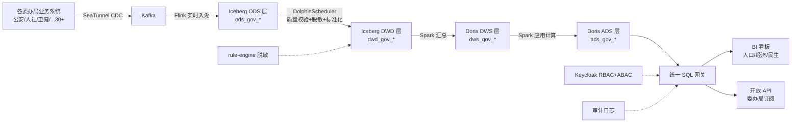
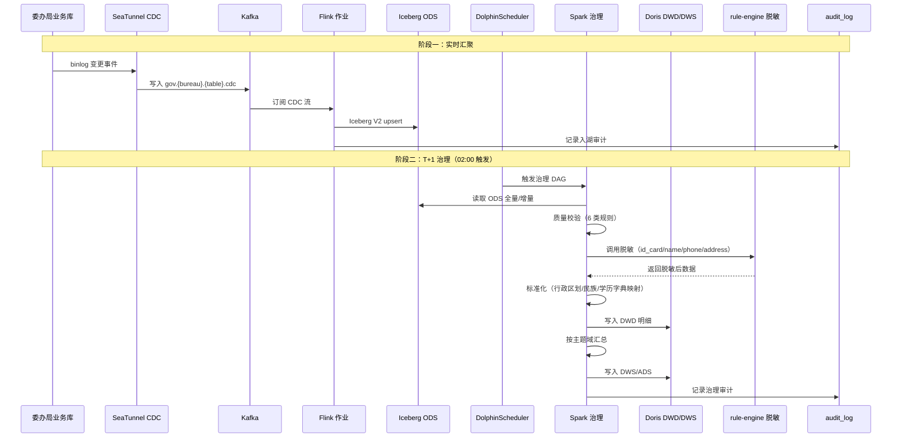
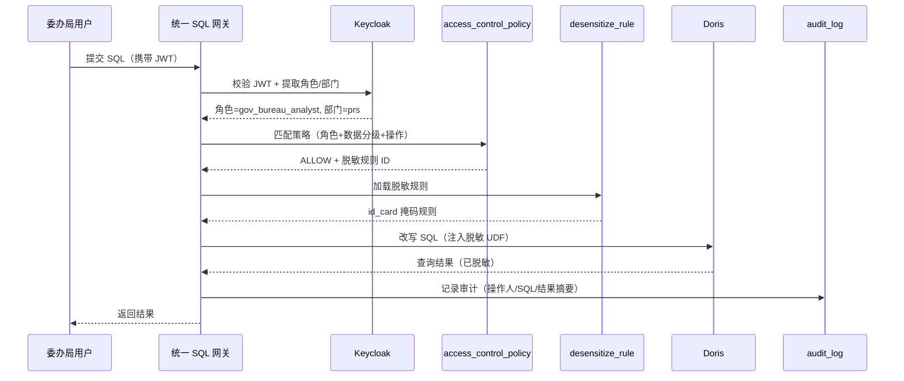

# 政企场景端到端演示

> 归属：数据引擎大数据平台 · 场景模拟
> 行业模板：government（政务行业模板）
> 关联设计：`design/v2.0/详细设计/V2.0_行业模板与其他增强详细设计.md` §5 政务行业模板
> DDL 来源：`platform/industry-templates/templates/government/ddl/`

## 第1章 场景背景

### 1.1 业务概况

某副省级城市政务大数据平台于 2026 年启动二期扩容建设，目标是将全市 30+ 委办局（公安、人社、卫健、教育、民政、住建、自然资源、市场监管、税务、统计、应急、交通、生态环境、文旅、广电、公积金等）的业务数据汇聚到统一数据湖仓，形成"一数一源、一源多用"的政务数据资产体系，支撑人口分析、经济运行、民生服务、政务合规四大主题应用。

平台需满足以下硬性要求：

1. **合规底线**：对标 GB/T 31075-2017《政务数据分级分类基本要求》、等保三级、关基保护，所有个人敏感信息（身份证号、姓名、住址、手机号）必须脱敏存储，所有敏感访问必须审计留痕且保留 ≥ 180 天。
2. **数据规模**：常住人口 1200 万、流动人口 280 万、政务服务事项 8000+、年均办件量 4500 万笔，存量历史数据 12 TB，日增量约 60 GB。
3. **实时性**：政务服务办件 5 分钟内可查、人口流动 T+1 汇总、经济指标月度更新、热点事项小时级刷新。
4. **多委办局隔离**：30+ 委办局按 RBAC 严格隔离，跨委办局共享须走数据资产流通审批流。

### 1.2 平台技术选型

表：政企场景技术选型对照表

| 层次 | 组件 | 选型 | 用途 |
| --- | --- | --- | --- |
| 数据接入 | CDC | SeaTunnel MySQL-CDC / Oracle-CDC | 各委办局业务库实时抽取 |
| 数据缓冲 | 消息 | Kafka 3.x（3 副本，30+ Topic） | 委办局变更事件缓冲 |
| 实时入湖 | 计算 | Flink 1.18 + Iceberg Sink | CDC 流式写入 ODS 层 |
| 离线治理 | 调度 | DolphinScheduler 3.2 | ODS→DWD→DWS→ADS DAG 调度 |
| 离线计算 | 引擎 | Spark 3.5 on Yarn | 质量校验、脱敏、汇总 |
| 湖仓存储 | 表格式 | Iceberg V2（Hadoop Catalog） | ODS/DWD 明细层 |
| 实时数仓 | 引擎 | Doris 2.1（主） | DWS/ADS 加速查询 |
| 数据服务 | 网关 | 统一 SQL 网关 + APISIX | BI 看板、API 开放 |
| 权限 | 身份 | Keycloak + RBAC + ABAC | 委办局隔离 + 数据分级控制 |
| 安全 | 脱敏 | rule-engine（SM4 + 掩码） | 字段级脱敏 |
| 可观测 | 监控 | Prometheus + Grafana + Loki | 双视图 + 智能告警 |

## 第2章 端到端流程

### 2.1 流程总览



### 2.2 阶段一：数据汇聚（业务系统 → Kafka → Iceberg ODS）

各委办局业务系统（公安户籍、社保参保、医院 HIS、学籍系统、婚姻登记、不动产登记等）通过 SeaTunnel CDC 连接器实时抽取 binlog，按委办局分 Topic 写入 Kafka：

- Topic 命名规范：`gov.{bureauCode}.{tableName}.cdc`，如 `gov.prs.population_base.cdc`（人社局人口基础表）、`gov.hwb.gov_service.cdc`（卫健委服务事项）。
- 消息格式：Debezium JSON，含 `before/after/op/ts_ms` 四字段。
- 分区策略：按 `person_id` 哈希分区，保证同一人员变更事件有序。

Flink 作业订阅 Kafka Topic，按 Iceberg V2 表格式写入 ODS 层：

```sql
-- SQL功能名：ODS 层人口基础表（Iceberg）
CREATE TABLE IF NOT EXISTS iceberg.`tenant/gov_city/government`.ods_gov_population (
    person_id          STRING      COMMENT '人员ID',
    id_card_masked     STRING      COMMENT '身份证号（脱敏，保留前6后4）',
    name_masked        STRING      COMMENT '姓名（脱敏，保留姓）',
    gender             STRING      COMMENT '性别',
    birth_date         DATE        COMMENT '出生日期',
    hukou_type         STRING      COMMENT '户籍类型',
    hukou_district     STRING      COMMENT '户籍区县',
    resident_district  STRING      COMMENT '常住区县',
    data_source        STRING      COMMENT '数据来源：HUKOU/CENSUS/SURVEY',
    data_classification STRING     COMMENT '数据分级：L3',
    op_ts              TIMESTAMP(3) COMMENT 'CDC 操作时间',
    dt                 STRING      COMMENT '分区：业务日期'
) USING iceberg
PARTITIONED BY (dt)
TBLPROPERTIES ('format-version'='2', 'write.metadata.delete-after-commit.enabled'='true');
```

### 2.3 阶段二：数据治理（质量校验 → 脱敏 → 标准化 → DWD）

DolphinScheduler 调度 Spark 作业执行治理 DAG，每天 02:00 触发：

1. **质量校验**：对 ODS 层执行 6 类规则（完整性/唯一性/有效性/一致性/及时性/准确性），不通过记录写入 `dwd_gov_quality_issue`，并触发 `compliance_risk_alert` 预警。
2. **字段脱敏**：rule-engine 按 `desensitize_rule` 表配置对 `id_card`、`name`、`phone`、`address` 字段执行 SM4 加密 + 掩码（保留前 6 后 4 / 保留姓 / 保留前 3 后 4 / 保留到楼号），脱敏后写入 DWD 层。
3. **标准化**：行政区划编码统一映射到 GB/T 2260 国标字典，民族统一映射到 56 民族字典，学历统一映射到 PRIMARY/JUNIOR/SENIOR/COLLEGE/BACHELOR/MASTER/DOCTOR 枚举。
4. **多源融合**：户籍（公安）+ 普查（统计）+ 抽样调查（人社）按 `person_id` 融合，冲突时按数据源优先级（CENSUS > HUKOU > SURVEY）取值。

DWD 层核心表 `dwd_gov_citizen`（公民明细）：

```sql
-- SQL功能名：DWD 层公民明细表
CREATE TABLE IF NOT EXISTS iceberg.`tenant/gov_city/government`.dwd_gov_citizen (
    person_id          STRING      COMMENT '人员ID',
    id_card_masked     STRING      COMMENT '身份证号（脱敏）',
    name_masked        STRING      COMMENT '姓名（脱敏）',
    gender             STRING      COMMENT '性别',
    age                INT         COMMENT '年龄',
    ethnicity          STRING      COMMENT '民族（标准化）',
    hukou_type         STRING      COMMENT '户籍类型',
    hukou_district     STRING      COMMENT '户籍区县（国标编码）',
    resident_district  STRING      COMMENT '常住区县（国标编码）',
    education_level    STRING      COMMENT '学历（枚举）',
    employment_status  STRING      COMMENT '就业状态',
    occupation         STRING      COMMENT '职业（国标分类）',
    industry           STRING      COMMENT '行业（国标分类）',
    data_classification STRING     COMMENT '数据分级：L3',
    dt                 STRING      COMMENT '分区：业务日期'
) USING iceberg PARTITIONED BY (dt);
```

### 2.4 阶段三：分析建模（人口分析 → 经济运行 → 民生服务 → DWS/ADS）

Spark 作业按主题域汇总，结果写入 Doris DWS/ADS 层供查询加速：

- **人口分析**：基于 `dwd_gov_citizen` 按区县/年度汇总，生成 `dws_gov_population_stat`（人口结构汇总）和 `population_flow`（流动追踪）、`population_forecast`（ARIMA 预测）。
- **经济运行**：基于 `gdp`、`industry_structure`、`fixed_asset_investment`、`social_retail_consumption`、`foreign_trade`、`fiscal_revenue` 等表汇总，生成经济运行看板数据。
- **民生服务**：基于 `service_transaction`、`service_satisfaction` 按部门/周期汇总，生成 `service_statistics`、`service_hot_topic` 热点事项排行。

```sql
-- SQL功能名：DWS 人口结构汇总
CREATE TABLE IF NOT EXISTS dws_gov_population_stat (
    stat_id            VARCHAR(64)   COMMENT '统计ID',
    stat_year          INT           COMMENT '统计年度',
    district           VARCHAR(64)   COMMENT '区县',
    total_population   BIGINT        COMMENT '总人口',
    urbanization_rate  DECIMAL(6,4)  COMMENT '城镇化率',
    aging_rate         DECIMAL(6,4)  COMMENT '老龄化率',
    dependency_ratio   DECIMAL(8,2)  COMMENT '总抚养比',
    avg_household_size DECIMAL(6,2)  COMMENT '户均人口'
) ENGINE=OLAP DUPLICATE KEY(stat_id, stat_year)
PARTITION BY RANGE(stat_year)() DISTRIBUTED BY HASH(stat_id) BUCKETS 8;
```

### 2.5 阶段四：数据服务（统一 SQL 网关 → BI 看板 → API 开放）

- **统一 SQL 网关**：所有 BI/外部查询统一经 SQL 网关，网关解析 SQL → 校验 RBAC/ABAC → 注入脱敏规则 → 路由到 Doris/Iceberg → 记费 → 审计。
- **BI 看板**：Superset 预置 12 个看板（人口结构、人口流动、GDP 运行、产业结构、固定资产投资、消费零售、外贸进出口、财政收支、政务服务办件、热点事项、满意度、合规预警），面向市领导/委办局两层视图。
- **开放 API**：通过 APISIX 下发 RESTful API，委办局按订阅权限调用，如 `GET /api/v1/population/stat?year=2026&district=xx`。

### 2.6 阶段五：权限管控（RBAC 按委办局隔离 + 数据脱敏）

权限模型采用 RBAC + ABAC 双重控制：

- **RBAC**：Keycloak Realm `gov-city`，预置角色 `gov_admin`（全市数据）、`gov_bureau_admin`（本委办局数据）、`gov_bureau_analyst`（本委办局只读）、`gov_auditor`（审计只读）。
- **ABAC**：`access_control_policy` 表配置策略，如"角色 = gov_bureau_admin AND 数据分级 ≤ L2 AND 部门 = subject_department → ALLOW"，"数据分级 = L4 → DENY（除 gov_admin）"。
- **数据脱敏**：查询时按 `desensitize_rule` 动态脱敏，如人社局分析师查询 `dwd_gov_citizen` 时，`id_card_masked` 进一步掩码为 `110101************`（仅保留前 6 位）。
- **审计留痕**：所有查询写入 `audit_log`（数据分级 L4，保留 180 天，不可篡改）。

## 第3章 时序图

### 3.1 数据汇聚与治理时序



### 3.2 数据服务与权限校验时序



## 第4章 涉及表清单

表：政企场景涉及表清单

| 层次 | 表名 | 来源 DDL | 数据分级 | 业务含义 |
| --- | --- | --- | --- | --- |
| ODS | ods_gov_population | 场景定制 | L3 | 人口基础信息（脱敏后入湖） |
| DWD | dwd_gov_citizen | 场景定制 | L3 | 公民明细（标准化+脱敏） |
| DWD | population_base | 01_population_analysis_ddl.sql | L3 | 人口基础信息表 |
| DWS | population_structure | 01_population_analysis_ddl.sql | L2 | 人口结构汇总表 |
| DWS | population_flow | 01_population_analysis_ddl.sql | L2 | 人口流动追踪表 |
| ADS | population_forecast | 01_population_analysis_ddl.sql | L2 | 人口预测表 |
| DWS | dws_gov_population_stat | 场景定制 | L2 | 人口结构汇总（看板加速） |
| DWS | gdp | 02_economic_operation_ddl.sql | L2 | GDP 核算表 |
| DWS | industry_structure | 02_economic_operation_ddl.sql | L2 | 产业结构表 |
| DWS | fixed_asset_investment | 02_economic_operation_ddl.sql | L2 | 固定资产投资表 |
| DWS | social_retail_consumption | 02_economic_operation_ddl.sql | L2 | 社会消费品零售表 |
| DWS | foreign_trade | 02_economic_operation_ddl.sql | L2 | 外贸进出口表 |
| DWD | government_service | 03_livelihood_service_ddl.sql | L1 | 政务服务事项主表 |
| DWD | service_transaction | 03_livelihood_service_ddl.sql | L3 | 政务服务办理记录表 |
| DWS | service_satisfaction | 03_livelihood_service_ddl.sql | L2 | 满意度评价表 |
| ADS | service_hot_topic | 03_livelihood_service_ddl.sql | L1 | 热点事项表 |
| ADS | service_statistics | 03_livelihood_service_ddl.sql | L2 | 政务服务统计表 |
| ADS | ads_gov_dashboard | 场景定制 | L2 | 政务综合看板宽表 |
| 控制表 | data_classification | 04_government_compliance_ddl.sql | L2 | 数据分级定义表 |
| 控制表 | desensitize_rule | 04_government_compliance_ddl.sql | L2 | 脱敏规则表 |
| 控制表 | access_control_policy | 04_government_compliance_ddl.sql | L2 | 访问控制策略表 |
| 控制表 | audit_log | 04_government_compliance_ddl.sql | L4 | 审计日志表 |
| 控制表 | compliance_risk_alert | 04_government_compliance_ddl.sql | L3 | 合规风险预警表 |

## 第5章 关键配置

### 5.1 SeaTunnel CDC → Kafka 配置

```yaml
# 命令示例：SeaTunnel CDC 同步人社局人口表到 Kafka
source:
  MySQL-CDC:
    hostname: ${prs.db.host}
    port: 3306
    username: ${prs.db.user}
    password: ${prs.db.pwd}
    database-name: prs_db
    table-name: population_base
    server-id: 5400-5404
    startup.mode: latest

sink:
  Kafka:
    topic: gov.prs.population_base.cdc
    bootstrap.servers: ${kafka.brokers}
    format: debezium_json
    partition.key.fields: person_id
    transaction.timeout.ms: 900000
```

### 5.2 Flink 实时入湖配置

```yaml
# 命令示例：Flink 作业订阅 Kafka 写入 Iceberg ODS
job.name: flink-gov-ods-population
source:
  Kafka:
    topic: gov.prs.population_base.cdc
    properties.bootstrap.servers: ${kafka.brokers}
    format: debezium_json
sink:
  Iceberg:
    catalog: hadoop
    database: tenant/gov_city/government
    table: ods_gov_population
    format-version: 2
    upsert-enabled: true
    distribution-mode: hash
flink-conf:
  execution.checkpointing.interval: 60s
  state.backend: rocksdb
```

### 5.3 DolphinScheduler 调度 DAG

```json
{
  "name": "dag-gov-govern-daily",
  "schedule": "0 2 * * ?",
  "tasks": [
    {"name": "quality_check", "type": "SPARK", "main": "com.gov.QualityCheckJob", "args": ["--date", "${dt}"]},
    {"name": "desensitize", "type": "SPARK", "dependsOn": ["quality_check"], "main": "com.gov.DesensitizeJob"},
    {"name": "standardize", "type": "SPARK", "dependsOn": ["desensitize"], "main": "com.gov.StandardizeJob"},
    {"name": "build_dwd", "type": "SPARK", "dependsOn": ["standardize"], "main": "com.gov.BuildDWDJob"},
    {"name": "build_dws_population", "type": "SPARK", "dependsOn": ["build_dwd"], "main": "com.gov.PopulationStatJob"},
    {"name": "build_dws_economic", "type": "SPARK", "dependsOn": ["build_dwd"], "main": "com.gov.EconomicStatJob"},
    {"name": "build_dws_service", "type": "SPARK", "dependsOn": ["build_dwd"], "main": "com.gov.ServiceStatJob"},
    {"name": "build_ads_dashboard", "type": "SPARK", "dependsOn": ["build_dws_population","build_dws_economic","build_dws_service"], "main": "com.gov.DashboardJob"}
  ]
}
```

### 5.4 RBAC 角色与脱敏规则

```json
# 命令示例：Keycloak Realm 政务租户角色
{
  "realm": "gov-city",
  "roles": [
    {"name": "gov_admin", "description": "全市数据管理员"},
    {"name": "gov_bureau_admin", "description": "委办局数据管理员"},
    {"name": "gov_bureau_analyst", "description": "委办局分析师（只读）"},
    {"name": "gov_auditor", "description": "审计员（只读审计日志）"}
  ]
}
```

```sql
-- SQL功能名：脱敏规则配置
INSERT INTO desensitize_rule VALUES
('r001','身份证号脱敏','IDCARD_MASK','MASK',
 '{"keep_prefix":6,"keep_suffix":4,"mask_char":"*"}',
 '["dwd_gov_citizen.id_card_masked","population_base.id_card_masked"]',
 '["L3","L4"]','role != "gov_admin"','["query","export"]',10,true),
('r002','姓名脱敏','NAME_MASK','KEEP_FIRST',
 '{"keep_first":1,"mask_char":"*"}',
 '["dwd_gov_citizen.name_masked","population_base.name_masked"]',
 '["L3"]','role != "gov_admin"','["query","export"]',20,true);
```

## 第6章 端到端验证要点

1. **汇聚验证**：在人社局业务库插入一条人口变更，5 分钟内可在 Iceberg ODS 层查询到对应记录。
2. **治理验证**：T+1 治理完成后，`dwd_gov_citizen` 中 `id_card_masked` 字段格式为 `110101********1234`，行政区划编码全部为 GB/T 2260 国标 6 位编码。
3. **分析验证**：`dws_gov_population_stat` 中某区县总人口与 `dwd_gov_citizen` 按区县 group by count 一致；`population_forecast` 输出 2027-2030 年预测人口及 95% 置信区间。
4. **服务验证**：人社局分析师登录后查询 `dwd_gov_citizen`，仅返回本委办局数据且 `id_card_masked` 进一步脱敏；审计日志记录本次查询，180 天后仍可查。
5. **合规验证**：触发一次越权访问（普通分析师查询 L4 数据），`access_control_record` 记录 DENY 决策，`compliance_risk_alert` 生成预警，`audit_log` 记录 DENIED 结果。