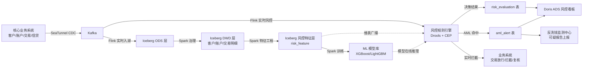
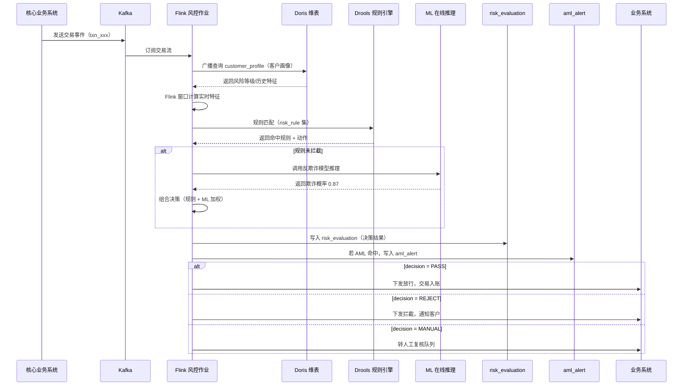
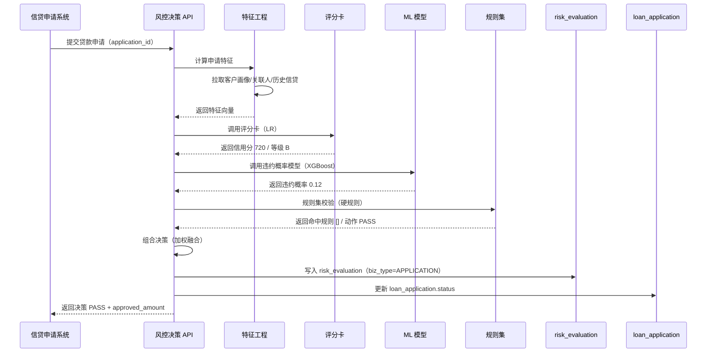

# 金融风控场景演示

> 归属：数据引擎大数据平台 · 场景模拟
> 行业模板：finance（金融行业模板 - 风控数据集市）
> 关联设计：`design/v2.0/详细设计/V2.0_行业模板与其他增强详细设计.md` §2 金融行业模板
> DDL 来源：`platform/industry-templates/templates/finance/ddl/`

## 第1章 场景背景

### 1.1 业务概况

某城商行（资产规模 4500 亿元、个人客户 1200 万、对公客户 28 万、日均交易 380 万笔）启动实时风控平台建设，目标是在原有"事后风控 + T+1 规则"基础上升级为"事前 + 事中 + 事后"全链路实时风控体系，覆盖以下场景：

1. **交易反欺诈**：对每笔转账/支付/取现实时评估，毫秒级输出决策（PASS/REJECT/MANUAL/ALERT），欺诈交易拦截率从 35% 提升到 65%+。
2. **反洗钱（AML）**：基于交易行为识别分散转入、集中转出、快进快出、结构化、化整为零等可疑场景，生成可疑报告上报反洗钱监测中心。
3. **信贷风控**：贷款申请进件时调用评分卡 + ML 模型 + 规则集组合决策，秒级输出审批建议（通过/拒绝/人工复核）。
4. **客户风险评级**：基于客户画像（资产/负债/交易行为/关联关系）动态计算风险等级 A/B/C/D/E，触发等级跃变告警。
5. **风控看板**：风控决策实时大盘、规则命中排行、模型效果监控、欺诈案例库、AML 上报统计。

### 1.2 风控挑战与平台能力

表：风控挑战与平台能力对照表

| 挑战 | 平台能力 |
| --- | --- |
| 交易峰值 8000 TPS，要求 50ms 内决策 | Flink 实时流 + 风控规则引擎本地缓存 + Doris 维表广播 |
| 欺诈手法快速变异，规则需小时级迭代 | 规则热更新（risk_rule 表 + Flink CEP 动态加载） |
| 单一规则误报率高，需多模型组合决策 | 评分卡 + XGBoost + 规则集混合（risk_model + risk_evaluation） |
| 反洗钱可疑报告需上报监管，证据链完整 | aml_alert 表 + report_content JSON + 不可篡改审计 |
| 客户画像需 30 天/90 天/365 天多时间窗口 | customer_profile 表 + Flink 滑动窗口 |
| 风控模型效果需持续监控（PSI/KS/AUC） | 模型监控作业 + 效果看板 |

### 1.3 平台技术选型

表：金融风控场景技术选型对照表

| 层次 | 组件 | 选型 | 用途 |
| --- | --- | --- | --- |
| 数据接入 | CDC | SeaTunnel MySQL-CDC / Oracle-CDC | 核心业务系统（客户/账户/交易/信贷）实时抽取 |
| 数据缓冲 | 消息 | Kafka 3.x | 交易事件流 |
| 实时计算 | 引擎 | Flink 1.18 + CEP + MLlib | 实时风控决策 + AML 场景识别 |
| 离线计算 | 引擎 | Spark 3.5 | 客户画像/特征工程/模型训练 |
| 湖仓存储 | 表格式 | Iceberg V2 | ODS/DWD 明细层 |
| 实时数仓 | 引擎 | Doris 2.1 | DWS/ADS 加速查询 + 维表广播 |
| ML 平台 | 引擎 | MLflow + XGBoost + LightGBM | 模型训练/版本管理/在线推理 |
| 规则引擎 | 引擎 | Drools + Flink CEP | 规则集 + 复杂事件处理 |
| 数据服务 | 网关 | 统一 SQL 网关 + APISIX | 风控看板 + 决策 API |
| 权限 | 身份 | Keycloak + RBAC | 风控/合规/审计角色隔离 |
| 安全 | 加密 | SM4 + 强脱敏 | 客户身份证号/账户号加密存储 |

## 第2章 端到端流程

### 2.1 流程总览



### 2.2 阶段一：交易实时入湖

核心业务系统（核心存款系统、信贷系统、支付系统）通过 SeaTunnel CDC 实时抽取 binlog，按表分 Topic 写入 Kafka：

- `fin.core.customer.cdc`：客户信息变更（开户/销户/资料修改）
- `fin.core.account.cdc`：账户变更（开户/销户/状态变更）
- `fin.core.transaction.cdc`：交易流水（转账/支付/存款/取款/退款）
- `fin.credit.loan_application.cdc`：贷款申请进件

Flink 作业订阅 Kafka，按 Iceberg V2 写入 ODS 层：

```sql
-- SQL功能名：ODS 交易流水表（Iceberg）
CREATE TABLE IF NOT EXISTS iceberg.`tenant/bank/finance`.ods_fin_transaction (
    transaction_id      STRING      COMMENT '交易ID',
    transaction_no      STRING      COMMENT '交易号',
    customer_id         STRING      COMMENT '发起客户ID',
    debit_account_id    STRING      COMMENT '借方账户ID',
    credit_account_id   STRING      COMMENT '贷方账户ID',
    amount              DECIMAL(18,2) COMMENT '交易金额',
    currency            STRING      COMMENT '币种',
    txn_type            STRING      COMMENT '交易类型：TRANSFER/PAYMENT/DEPOSIT/WITHDRAW/REFUND',
    channel             STRING      COMMENT '交易渠道：COUNTER/ONLINE/MOBILE/ATM/API',
    counterparty        STRING      COMMENT '交易对手方',
    counter_account     STRING      COMMENT '对手账户号（SM4 加密）',
    status              STRING      COMMENT '交易状态',
    occurred_at         TIMESTAMP(3) COMMENT '交易发生时间',
    op_ts               TIMESTAMP(3) COMMENT 'CDC 操作时间',
    dt                  STRING      COMMENT '分区：业务日期'
) USING iceberg PARTITIONED BY (dt);
```

### 2.3 阶段二：风控规则引擎实时评估

Flink 作业订阅交易 Topic，对每笔交易执行风控评估流水线：

#### 2.3.1 特征实时计算

基于 Flink 滑动窗口实时计算交易特征，写入 `risk_feature` 表：

- 近 1 小时/24 小时/7 天交易笔数、金额
- 近 30 天日均余额、交易对手方去重数
- 异地交易标志、深夜交易标志、新设备标志
- 客户风险等级（从 `customer_profile` 维表广播获取）

#### 2.3.2 规则引擎评估

Drools 规则引擎加载 `risk_rule` 表配置的规则集，对每笔交易执行规则匹配：

```sql
-- SQL功能名：风控规则配置示例
INSERT INTO risk_rule VALUES
('r001','m001','大额转账告警','LARGE_TRANSFER',
 'amount > 500000 AND txn_type = "TRANSFER"','ALERT',10,500000,0,true),
('r002','m001','深夜异地交易拒绝','NIGHT_REMOTE',
 'hour(occurred_at) BETWEEN 0 AND 5 AND is_remote = true AND amount > 100000','REJECT',20,null,0,true),
('r003','m001','高频小额分散转入','HIGH_FREQ_SMALL_IN',
 'count_1h > 20 AND avg_amount_1h < 1000 AND txn_type = "DEPOSIT"','MANUAL',30,null,0,true);
```

#### 2.3.3 ML 模型在线推理

对规则未拦截的交易，调用 ML 模型在线推理：

- **反欺诈模型**：XGBoost 二分类，输出欺诈概率，阈值 0.5 以上 REJECT，0.3-0.5 MANUAL。
- **信用评分卡**：LR 逻辑回归，输出信用分 300-850，分级 A/B/C/D/E。
- **组合决策**：按 `risk_model.weight` 加权融合规则集 + ML 模型决策。

#### 2.3.4 决策结果写入

决策结果写入 `risk_evaluation` 表：

```sql
-- SQL功能名：风控评估结果写入
INSERT INTO risk_evaluation VALUES
('eval_001','m001','txn_20260817001','TRANSACTION',
 'REJECT',0.87,'D','["r002"]',
 '{"amount":200000,"is_remote":true,"hour":3}',
 '2026-08-17 03:21:45',32,'2026-08-17 03:21:45','2026-08-17 03:21:45','flink','flink');
```

#### 2.3.5 实时拦截

Flink 作业根据决策结果实时下发到业务系统：

- **PASS**：交易放行，正常入账。
- **REJECT**：交易拦截，返回拒绝原因，通知客户。
- **MANUAL**：转人工复核队列，风控专员在风控台处理。
- **ALERT**：交易放行但生成告警，风控专员事后跟进。

### 2.4 阶段三：反洗钱场景识别

Flink CEP 作业识别 AML 可疑场景，命中后写入 `aml_alert` 表：

- **分散转入集中转出（DISPERSE_IN_CENTRAL_OUT）**：1 小时内多笔小额转入后大额转出。
- **快进快出（FAST_IN_OUT）**：资金入账后 10 分钟内转出，且金额接近。
- **结构化（STRUCTURE）**：单笔金额刻意规避 5 万元大额报告阈值。
- **化整为零（SMURF）**：大额资金拆分为多笔小额分散转移。

```sql
-- SQL功能名：AML 告警写入
INSERT INTO aml_alert VALUES
('aml_001','txn_20260817001','cust_001',
 'FAST_IN_OUT','HIGH','["cep_fast_in_out"]',0.92,
 'PENDING',null,null,null,null,
 '2026-08-17 03:22:15','2026-08-17 03:22:15','2026-08-17 03:22:15','flink','flink');
```

AML 告警经风控专员审核后生成可疑报告，上报反洗钱监测中心：

- `report_status` 更新为 `REPORTED`，生成 `report_no` 可疑报告编号。
- `report_content` 填写可疑报告 JSON（含客户信息、交易明细、场景分析、可疑理由）。
- 上报后 `report_status` 为 `CLOSED`，证据链完整不可篡改。

### 2.5 阶段四：信贷风控

贷款申请进件时调用风控决策流水线：

1. **特征工程**：基于 `customer`、`customer_profile`、`customer_relation`、历史信贷记录计算申请特征（负债收入比、征信查询次数、关联人风险、近期逾期次数等）。
2. **评分卡**：LR 逻辑回归输出信用分，分级 A/B/C/D/E。
3. **ML 模型**：XGBoost 输出违约概率。
4. **规则集**：硬规则（黑名单拒绝、负债收入比 > 75% 拒绝、征信查询次数 > 6 拒绝）。
5. **组合决策**：评分卡 + ML + 规则集加权融合，输出 `decision`（PASS/REJECT/MANUAL）+ `approved_amount`（审批通过金额）。

决策结果写入 `risk_evaluation`（biz_type='APPLICATION'），同时更新 `loan_application.status` 为 APPROVED/REJECTED/REVIEWING。

### 2.6 阶段五：风控看板

Doris ADS 层预置风控看板数据集，Superset 展示：

- **风控决策实时大盘**：今日决策笔数、PASS/REJECT/MANUAL/ALERT 占比、平均决策耗时、拦截金额。
- **规则命中排行**：按命中次数/拦截金额排序的规则 TOP 20，支持规则效果下钻。
- **模型效果监控**：反欺诈模型 PSI/KS/AUC 指标趋势、评分卡分布、模型版本对比。
- **AML 上报统计**：可疑场景分布、上报数量趋势、处置时长、涉案金额。
- **欺诈案例库**：拦截的欺诈交易详情、客户画像、交易链路图。
- **客户风险分布**：客户风险等级 A/B/C/D/E 分布、等级跃变告警。

## 第3章 时序图

### 3.1 交易实时风控决策时序



### 3.2 信贷风控决策时序



## 第4章 涉及表清单

表：金融风控场景涉及表清单

| 域 | 层次 | 表名 | 来源 DDL | 数据分级 | 业务含义 |
| --- | --- | --- | --- | --- | --- |
| 风控 | 控制表 | risk_model | 01_risk_control_ddl.sql | L2 | 风控模型主表 |
| 风控 | 控制表 | risk_rule | 01_risk_control_ddl.sql | L2 | 风控规则表 |
| 风控 | 控制表 | risk_feature | 01_risk_control_ddl.sql | L2 | 风控特征表 |
| 风控 | 结果表 | risk_evaluation | 01_risk_control_ddl.sql | L2 | 风控评估结果表 |
| 风控 | 结果表 | risk_alert | 01_risk_control_ddl.sql | L3 | 风控告警表 |
| 客户 | ODS | ods_fin_customer | 场景定制 | L4 | 客户信息（贴源） |
| 客户 | DWD | customer | 02_customer_ddl.sql | L4 | 客户基本信息主表 |
| 客户 | DWD | customer_tag | 02_customer_ddl.sql | L2 | 客户标签表 |
| 客户 | DWS | customer_profile | 02_customer_ddl.sql | L3 | 客户画像表 |
| 客户 | DWD | customer_relation | 02_customer_ddl.sql | L3 | 客户关系表 |
| 账户 | ODS | ods_fin_account | 场景定制 | L4 | 账户信息（贴源） |
| 账户 | DWD | account | 03_account_ddl.sql | L4 | 账户信息主表 |
| 账户 | DWS | account_balance | 03_account_ddl.sql | L3 | 账户余额快照表 |
| 账户 | DWD | account_transaction | 03_account_ddl.sql | L4 | 账户流水表 |
| 账户 | DWD | account_status_log | 03_account_ddl.sql | L2 | 账户状态变更日志 |
| 交易 | ODS | ods_fin_transaction | 场景定制 | L3 | 交易流水（贴源） |
| 交易 | DWD | transaction | 04_transaction_ddl.sql | L3 | 交易记录主表 |
| 交易 | DWD | transaction_detail | 04_transaction_ddl.sql | L3 | 交易明细表 |
| 交易 | 结果表 | aml_alert | 04_transaction_ddl.sql | L3 | 反洗钱告警表 |
| 交易 | 结果表 | transaction_monitor | 04_transaction_ddl.sql | L2 | 交易监控表 |
| 信贷 | DWD | loan_application | 05_credit_ddl.sql | L3 | 贷款申请表 |
| 信贷 | DWD | loan_contract | 05_credit_ddl.sql | L3 | 贷款合同表 |
| 信贷 | DWS | repayment_plan | 05_credit_ddl.sql | L3 | 还款计划表 |
| 信贷 | DWS | credit_score | 05_credit_ddl.sql | L2 | 信用评分表 |
| 风控 | ADS | ads_risk_dashboard | 场景定制 | L2 | 风控综合看板宽表 |
| 风控 | ADS | ads_aml_report_stat | 场景定制 | L3 | AML 上报统计 |

## 第5章 关键配置

### 5.1 Flink 实时风控作业配置

```yaml
# 命令示例：Flink 风控决策作业
job.name: flink-fin-risk-decision
parallelism: 64
state.backend: rocksdb
checkpoint.interval: 30s

source:
  Kafka:
    topic: fin.core.transaction.cdc
    properties.bootstrap.servers: ${kafka.brokers}
    format: debezium_json

sideInputs:
  customer_profile:
    table: doris.dws_fin_customer_profile
    refresh: 5min
    lookup: customer_id

processors:
  - name: feature_eng
    type: sliding_window
    windows: [1h, 24h, 7d, 30d]
  - name: rule_engine
    type: drools
    ruleTable: risk_rule
    hotUpdate: true
  - name: ml_inference
    type: mlflow
    modelUri: models:/fraud_xgb/Production
    fallback: pass
  - name: decision_fusion
    type: weighted
    weights: {rule: 0.4, ml: 0.6}

sinks:
  - table: risk_evaluation
  - table: aml_alert
    condition: aml_hit
  - topic: fin.risk.decision.result
    for: business_callback
```

### 5.2 AML CEP 场景配置

```java
// 代码示例：AML 快进快出场景识别（Flink CEP）
Pattern<Transaction, Transaction> fastInOut = Pattern
    .<Transaction>begin("in")
    .where(txn -> txn.txnType.equals("DEPOSIT") && txn.amount > 10000)
    .followedBy("out")
    .where(txn -> txn.txnType.equals("TRANSFER"))
    .within(Time.minutes(10))
    .or(new IterativeCondition<Transaction>() {
        @Override
        public boolean filter(Transaction out, Context<Transaction> ctx) throws Exception {
            for (Transaction in : ctx.getEventsForPattern("in")) {
                if (Math.abs(out.amount - in.amount) / in.amount < 0.05) {
                    return true;
                }
            }
            return false;
        }
    });
```

### 5.3 风控规则热更新

```sql
-- SQL功能名：风控规则热更新
-- Flink 作业监听 risk_rule 表 binlog，规则变更后动态重载 Drools KieSession
UPDATE risk_rule SET
    expression = 'amount > 300000 AND txn_type = "TRANSFER" AND channel = "ONLINE"',
    threshold = 300000,
    updated_at = NOW(),
    updated_by = 'risk_admin'
WHERE rule_id = 'r001';
-- Flink 监听到 binlog 变更，触发规则热重载，无需重启作业
```

## 第6章 端到端验证要点

1. **实时决策验证**：在核心业务系统发起一笔深夜异地 20 万元转账，50ms 内收到 REJECT 决策，`risk_evaluation` 表记录命中规则 `r002`，决策耗时 < 50ms。
2. **AML 识别验证**：模拟 1 小时内 20 笔小额转入后大额转出，Flink CEP 命中 FAST_IN_OUT 场景，`aml_alert` 表生成告警，风控专员审核后生成可疑报告上报。
3. **信贷风控验证**：提交一笔贷款申请，特征工程正确计算负债收入比，评分卡输出信用分，ML 模型输出违约概率，组合决策输出 PASS + approved_amount，`loan_application.status` 更新为 APPROVED。
4. **规则热更新验证**：修改 `risk_rule` 表中大额转账阈值从 50 万调整为 30 万，Flink 作业 5 秒内热重载规则，新交易按 30 万阈值评估，无需重启作业。
5. **模型效果监控验证**：反欺诈模型 PSI < 0.1、KS > 0.4、AUC > 0.85，看板正确展示模型效果趋势；模型版本升级后 A/B 对比看板展示新旧版本效果差异。
6. **数据分级验证**：`customer.id_card` 字段 SM4 加密存储，查询时强脱敏为 `110101********1234`；`account.account_no` 同样加密存储；审计日志记录所有敏感字段访问，保留 ≥ 180 天。