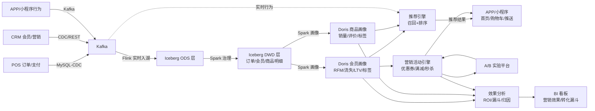
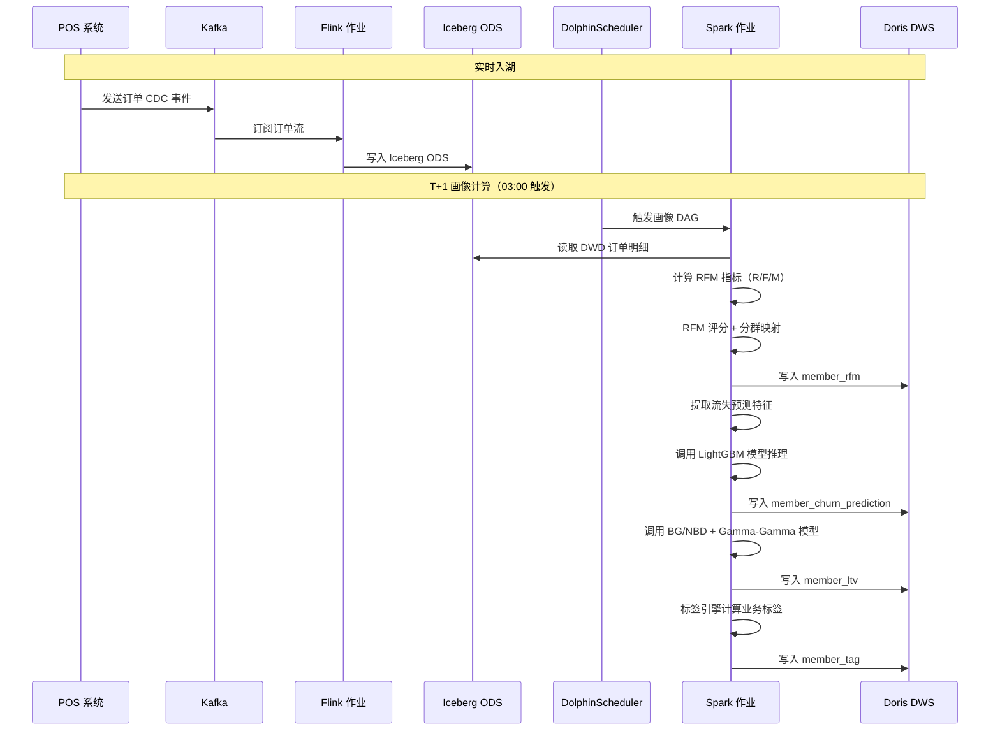
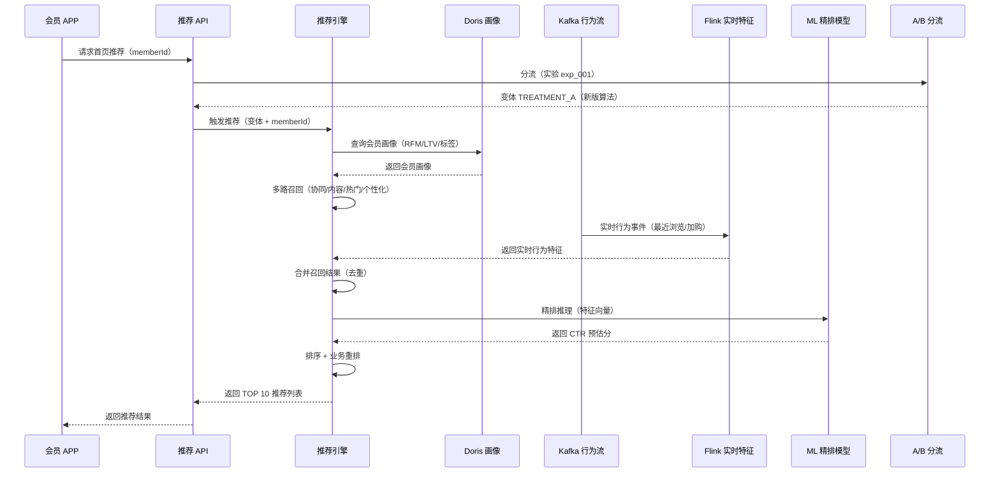
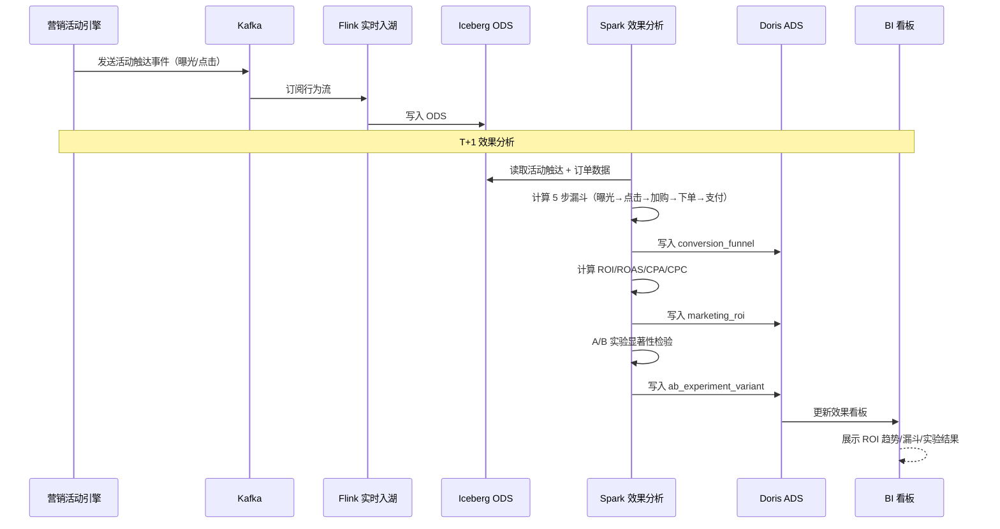

# 零售营销场景演示

> 归属：数据引擎大数据平台 · 场景模拟
> 行业模板：retail（零售行业模板）
> 关联设计：`design/v2.0/详细设计/V2.0_行业模板与其他增强详细设计.md` §4 零售行业模板
> DDL 来源：`platform/industry-templates/templates/retail/ddl/`

## 第1章 场景背景

### 1.1 业务概况

某全国连锁零售集团，主营快消品 + 服装 + 家电三大品类，经营规模如下：

- **门店规模**：500 家门店覆盖全国 30 省 120 城，含直营店 350 家、加盟店 150 家，旗舰店 30 家、社区店 280 家、便利店 190 家。
- **会员规模**：注册会员 2800 万，活跃会员 850 万，月新增会员 25 万，会员销售占比 68%。
- **商品规模**：在售 SKU 12 万，三级类目 1200 个，合作品牌 3500 个，自有品牌 28 个。
- **交易规模**：日均订单 65 万笔，峰值（双 11）800 万笔/日，年 GMV 180 亿元。
- **营销规模**：年均营销活动 1200 场，A/B 实验 380 次，营销预算 8 亿元。

### 1.2 业务诉求

集团数字化转型委员会要求建设"会员画像 → 营销推荐 → 效果分析"闭环，实现"千人千面"精准营销：

1. **会员画像**：基于 RFM 分群、流失预测、LTV 预测、行为画像构建 360° 会员视图，支持 10 大分群（冠军/忠诚/潜力忠诚/新客/有潜力/需关注/将沉睡/沉睡/流失/低价值流失）。
2. **商品画像**：基于销量统计、评价画像、商品标签构建商品 360° 视图，识别爆款/长尾/新品/季节性商品。
3. **营销推荐**：基于会员画像 + 商品画像 + 实时行为，触发个性化推荐（首页推荐/购物车推荐/消息推送/优惠券发放）。
4. **A/B 实验**：所有营销策略上线前必经 A/B 实验验证，按显著性检验（P 值 < 0.05）决策是否全量。
5. **效果分析**：营销活动 ROI/ROAS/CPA/CPC 实时监控，转化漏斗（曝光→点击→加购→下单→支付）5 步分析，活动效果归因。
6. **流失预警**：基于 ML 二分类模型预测会员未来 30 天流失概率，高风险会员触发挽回策略。

### 1.3 平台技术选型

表：零售营销场景技术选型对照表

| 层次 | 组件 | 选型 | 用途 |
| --- | --- | --- | --- |
| 数据接入 | CDC + 流 | SeaTunnel MySQL-CDC + Kafka Source | POS 订单/支付 + CRM 会员/营销 |
| 数据缓冲 | 消息 | Kafka 3.x | 交易事件 + 行为事件 |
| 实时入湖 | 计算 | Flink + Iceberg Sink | 订单实时入湖 + 行为实时计算 |
| 离线计算 | 引擎 | Spark on Yarn | RFM/LTV/画像/特征工程 |
| 湖仓存储 | 表格式 | Iceberg V2 | ODS/DWD 明细层 |
| 实时数仓 | 引擎 | Doris 2.1 | DWS/ADS 加速查询 |
| ML 平台 | 引擎 | MLflow + LightGBM + BG/NBD + Gamma-Gamma | 流失预测/LTV 预测/推荐 |
| 推荐引擎 | 引擎 | 自研召回 + 排序 | 多路召回 + 精排 |
| A/B 平台 | 引擎 | 自研分流 + 显著性检验 | 实验分流 + 效果评估 |
| 数据服务 | 网关 | 统一 SQL 网关 + APISIX | BI 看板 + 推荐 API |
| 权限 | 身份 | Keycloak + RBAC | 营销/运营/分析角色隔离 |

## 第2章 端到端流程

### 2.1 流程总览



### 2.2 阶段一：POS/CRM → 实时入湖

POS 系统（订单/支付/商品）和 CRM 系统（会员/营销/触达）通过 SeaTunnel CDC 实时抽取，APP/小程序行为日志直接写入 Kafka：

- `retail.pos.order.cdc`：POS 订单变更（下单/支付/退款）
- `retail.pos.payment.cdc`：支付流水
- `retail.crm.member.cdc`：会员信息变更（注册/登录/资料修改）
- `retail.crm.campaign.cdc`：营销活动配置变更
- `retail.behavior.event`：APP/小程序行为事件（曝光/点击/加购/搜索/浏览）

Flink 作业订阅 Kafka，按 Iceberg V2 写入 ODS 层：

```sql
-- SQL功能名：ODS 订单表（Iceberg）
CREATE TABLE IF NOT EXISTS iceberg.`tenant/retail/retail`.ods_rtl_order (
    order_id          STRING      COMMENT '订单ID',
    order_no          STRING      COMMENT '订单号',
    member_id         STRING      COMMENT '会员ID',
    store_id          STRING      COMMENT '门店ID',
    order_amount      DECIMAL(18,2) COMMENT '订单金额',
    pay_amount        DECIMAL(18,2) COMMENT '实付金额',
    pay_status        STRING      COMMENT '支付状态',
    pay_channel       STRING      COMMENT '支付渠道',
    order_channel     STRING      COMMENT '下单渠道：APP/WEB/WECHAT_MINI/OFFLINE',
    occurred_at       TIMESTAMP(3) COMMENT '下单时间',
    op_ts             TIMESTAMP(3) COMMENT 'CDC 操作时间',
    dt                STRING      COMMENT '分区：业务日期'
) USING iceberg PARTITIONED BY (dt);
```

### 2.3 阶段二：会员画像

Spark 作业基于 DWD 订单明细计算会员画像，写入 Doris DWS 层：

#### 2.3.1 RFM 分群

基于近 365 天订单数据计算 RFM 指标，按 `member_rfm` 表结构写入：

- **R（Recency）**：最近购买距今天数，越小越优。
- **F（Frequency）**：统计周期内购买次数。
- **M（Monetary）**：统计周期内累计消费金额。
- **RFM 评分**：R/F/M 各 1-5 分，按 20% 分位数划分。
- **RFM 分群**：按 R/F/M 组合映射到 10 大分群（CHAMPION/LOYAL/POTENTIAL_LOYAL/NEW/PROMISING/NEED_ATTENTION/ABOUT_TO_SLEEP/HIBERNATING/LOST/LOST_CHEAP）。

```sql
-- SQL功能名：RFM 分群计算
INSERT INTO member_rfm
SELECT
    concat('rfm_', member_id, '_', date_format(current_date,'yyyyMMdd')) AS rfm_id,
    member_id,
    current_date AS stat_date,
    datediff(current_date, max(occurred_at)) AS recency_days,
    count(distinct order_id) AS frequency,
    sum(pay_amount) AS monetary,
    sum(pay_amount) / count(distinct order_id) AS avg_order_value,
    ntile_r(recency_days) AS r_score,
    ntile_f(frequency) AS f_score,
    ntile_m(monetary) AS m_score,
    r_score*100 + f_score*10 + m_score AS rfm_score,
    segment_map(r_score, f_score, m_score) AS rfm_segment,
    value_level_map(rfm_segment) AS segment_value_level,
    365 AS stat_period_days,
    current_timestamp AS computed_at,
    current_timestamp AS created_at
FROM dwd_rtl_order
WHERE occurred_at >= date_sub(current_date, 365)
  AND pay_status = 'PAID'
GROUP BY member_id;
```

#### 2.3.2 流失预测

基于 ML 二分类模型（逻辑回归 + GBDT 集成）预测会员未来 30 天流失概率，写入 `member_churn_prediction`：

- **特征**：最近购买距今天数、购买频率、累计金额、登录频率、浏览时长、优惠券使用率、退货率、客诉次数等 50+ 特征。
- **模型**：LightGBM 二分类 + LR 集成，输出流失概率 0-1。
- **风险等级**：>0.7 HIGH / 0.3-0.7 MEDIUM / <0.3 LOW。
- **触发动作**：HIGH 风险会员触发挽回策略（专属优惠券/会员关怀电话/积分加倍）。

#### 2.3.3 LTV 预测

基于 BG/NBD + Gamma-Gamma 模型预测会员未来生命周期价值，写入 `member_ltv`：

- **BG/NBD**：预测会员仍活跃概率 P(Alive) 和未来购买次数。
- **Gamma-Gamma**：预测每笔交易金额期望。
- **LTV 分层**：VIP(>10000) / HIGH(5000-10000) / MEDIUM(1000-5000) / LOW(100-1000) / BOTTOM(<100)。
- **应用**：高 LTV 会员优先分配营销资源，低 LTV 会员控制营销投入。

#### 2.3.4 会员标签

标签引擎计算业务标签写入 `member_tag`：

- RFM 标签：RFM_CHAMPION / RFM_LOYAL / RFM_LOST
- 流失标签：CHURN_HIGH_RISK / CHURN_MEDIUM_RISK
- LTV 标签：LTV_VIP / LTV_HIGH / LTV_MEDIUM
- 行为标签：PRICE_SENSITIVE / CATEGORY_FASHION_LOVER / BRAND_LOYAL
- 人口标签：CITY_TIER1 / AGE_25_35 / GENDER_F

### 2.4 阶段三：商品画像

Spark 作业基于 DWD 订单明细 + 评价数据计算商品画像：

#### 2.4.1 销量统计

基于订单明细按日/周/月/季/年汇总，写入 `product_sales_stat`：

- 销量、销售额、退货量、净销售额、订单数、购买人数、平均客单价、复购率
- 销量排名（类目内）、爆款标志（TOP 10%）、长尾标志（后 30%）

#### 2.4.2 评价画像

基于评价数据汇总，写入 `product_review_profile`：

- 评分分布（1-5 星）、好评率/中评率/差评率
- 评价关键词（NLP 抽取，如"质量好"/"物流快"/"性价比高"）
- 综合满意度评分

#### 2.4.3 商品标签

标签引擎计算商品标签写入 `product_tag`：HOT_PRODUCT / NEW_PRODUCT / SEASONAL / LONG_TAIL / HIGH_RATING / LOW_RATING 等。

### 2.5 阶段四：营销推荐

#### 2.5.1 推荐引擎

推荐引擎采用"多路召回 + 精排"两阶段架构：

- **多路召回**：
  - 协同过滤召回（基于会员-商品交互矩阵）
  - 内容召回（基于商品画像相似度）
  - 热门召回（基于销量 TOP N）
  - 个性化召回（基于会员标签 + 商品标签匹配）
  - 实时行为召回（基于会员最近浏览/加购商品的相似商品）
- **精排**：LightGBM 排序模型，特征含会员画像 + 商品画像 + 上下文（时段/位置/设备），输出 CTR 预估分，按分排序取 TOP 10。
- **重排**：业务规则过滤（多样性/去重/已购/库存/合规），输出最终推荐列表。

推荐结果通过 API 实时返回 APP/小程序：

- `GET /api/v1/recommend/home?memberId={id}`：首页推荐
- `GET /api/v1/recommend/cart?memberId={id}&cartItems={items}`：购物车推荐
- `POST /api/v1/recommend/notify`：消息推送推荐

#### 2.5.2 营销活动引擎

基于会员画像触发营销活动：

- **优惠券发放**：高风险流失会员发放专属优惠券（满 100 减 30）。
- **满减活动**：根据会员 LTV 分层配置不同门槛（VIP 满 500 减 100，普通满 200 减 30）。
- **限时秒杀**：高 LTV 会员优先通知秒杀活动。
- **拼团活动**：基于社交关系链推荐拼团商品。

所有营销策略上线前必经 A/B 实验验证：

```sql
-- SQL功能名：A/B 实验配置
INSERT INTO ab_experiment VALUES
('exp_001','首页推荐算法对比','HOME_REC_VS',
 '新版协同过滤推荐 vs 旧版热门推荐，假设新版可提升首页 CTR 5%',
 'home_ctr','["gmv","conversion_rate"]','RUNNING',
 '2026-08-01 00:00:00','2026-08-31 23:59:59',
 50.00,200000,0.0500,0.8000,
 '2026-07-25 10:00:00','2026-07-25 10:00:00','marketing_admin','marketing_admin');
```

### 2.6 阶段五：效果分析

Spark 作业基于营销活动数据计算效果指标，写入 `marketing_roi` 和 `conversion_funnel`：

#### 2.6.1 ROI 分析

- **ROI** = (产出 - 投入) / 投入
- **ROAS** = 产出 / 投入
- **CPA** = 投入 / 转化数
- **CPC** = 投入 / 点击数

#### 2.6.2 转化漏斗

5 步漏斗分析：曝光 → 点击 → 加购 → 下单 → 支付

- 各步转化率：点击率/加购率/下单率/支付率
- 各步流失率：曝光→点击流失/点击→加购流失/加购→下单流失/下单→支付流失
- 总体转化率 = 支付数 / 曝光数
- 平均转化时长（从曝光到支付）

#### 2.6.3 A/B 实验效果评估

实验结束后计算变体显著性检验结果，写入 `ab_experiment_variant`：

- 主要指标值（如转化率）
- 提升度（相对对照组的提升百分比）
- P 值（Z 检验/T 检验/卡方检验）
- 95% 置信区间
- 是否统计显著（P 值 < α）
- 是否获胜变体

```sql
-- SQL功能名：A/B 实验变体效果
INSERT INTO ab_experiment_variant VALUES
('var_001','exp_001','CONTROL','对照组（旧版热门推荐）',
 100000,0.025000,null,2500,0.025000,0,null,null,null,false,false,'Z_TEST',
 '2026-08-31 23:59:59','2026-08-31 23:59:59'),
('var_002','exp_001','TREATMENT_A','实验组A（新版协同过滤）',
 100000,0.027500,null,2750,0.027500,0.100000,0.000123,3.856,null,true,true,'Z_TEST',
 '2026-08-31 23:59:59','2026-08-31 23:59:59');
-- P 值 0.000123 < 0.05，统计显著，实验组获胜，全量上线
```

## 第3章 时序图

### 3.1 会员画像计算时序



### 3.2 营销推荐实时决策时序



### 3.3 营销活动效果分析时序



## 第4章 涉及表清单

表：零售营销场景涉及表清单

| 域 | 层次 | 表名 | 来源 DDL | 数据分级 | 业务含义 |
| --- | --- | --- | --- | --- | --- |
| 会员 | ODS | ods_rtl_order | 场景定制 | L3 | 订单（贴源） |
| 会员 | DWD | member | member_analysis_ddl.sql | L3 | 会员基本信息主表 |
| 会员 | DWS | member_rfm | member_analysis_ddl.sql | L3 | 会员 RFM 分群表 |
| 会员 | DWS | member_churn_prediction | member_analysis_ddl.sql | L2 | 会员流失预测表 |
| 会员 | DWS | member_ltv | member_analysis_ddl.sql | L3 | 会员生命周期价值表 |
| 会员 | DWS | member_tag | member_analysis_ddl.sql | L2 | 会员标签表 |
| 会员 | DWS | member_behavior_profile | member_analysis_ddl.sql | L2 | 会员行为画像表 |
| 商品 | DWD | product | product_profile_ddl.sql | L2 | 商品基本信息主表 |
| 商品 | DWD | product_category | product_profile_ddl.sql | L2 | 商品类目表 |
| 商品 | DWD | product_brand | product_profile_ddl.sql | L2 | 商品品牌表 |
| 商品 | DWS | product_sales_stat | product_profile_ddl.sql | L3 | 商品销量统计表 |
| 商品 | DWS | product_review_profile | product_profile_ddl.sql | L2 | 商品评价画像表 |
| 商品 | DWS | product_tag | product_profile_ddl.sql | L2 | 商品标签表 |
| 营销 | DWD | ab_experiment | marketing_effect_ddl.sql | L2 | A/B 实验主表 |
| 营销 | DWS | ab_experiment_variant | marketing_effect_ddl.sql | L2 | A/B 实验变体表 |
| 营销 | DWS | conversion_funnel | marketing_effect_ddl.sql | L2 | 转化漏斗表 |
| 营销 | DWD | marketing_campaign | marketing_effect_ddl.sql | L3 | 营销活动主表 |
| 营销 | DWS | marketing_roi | marketing_effect_ddl.sql | L3 | 营销 ROI 分析表 |
| 营销 | DWS | marketing_channel_stat | marketing_effect_ddl.sql | L3 | 营销渠道统计表 |
| 推荐 | ADS | ads_rec_member_home | 场景定制 | L2 | 会员首页推荐结果 |
| 推荐 | ADS | ads_rec_member_cart | 场景定制 | L2 | 会员购物车推荐结果 |
| 营销 | ADS | ads_marketing_dashboard | 场景定制 | L3 | 营销综合看板宽表 |

## 第5章 关键配置

### 5.1 Flink 实时行为特征计算

```yaml
# 命令示例：Flink 实时行为特征作业
job.name: flink-rtl-behavior-feature
source:
  Kafka:
    topic: retail.behavior.event
    properties.bootstrap.servers: ${kafka.brokers}

processors:
  - name: session_window
    type: session_window
    gap: 30min
    key: member_id
  - name: behavior_agg
    type: aggregate
    metrics:
      - view_count_1h
      - click_count_1h
      - cart_count_1h
      - last_view_categories
      - last_view_products

sinks:
  - table: dws_rtl_member_behavior_realtime
  - topic: retail.rec.realtime_feature
    for: recommend_engine
```

### 5.2 推荐引擎配置

```yaml
# 命令示例：推荐引擎多路召回 + 精排
recommend:
  recall:
    - name: collaborative_filtering
      type: item_cf
      candidateCount: 200
    - name: content_based
      type: item2vec
      candidateCount: 200
    - name: hot_product
      type: top_n
      window: 7d
      candidateCount: 100
    - name: personalized
      type: tag_match
      candidateCount: 200
    - name: realtime_behavior
      type: item_cf
      source: last_view_10
      candidateCount: 100

  rank:
    model: lightgbm_rank_v3
    features:
      - member_rfm_segment
      - member_ltv_segment
      - member_tags
      - product_sales_rank
      - product_rating
      - product_tags
      - context_hour
      - context_device
    topK: 10

  rerank:
    - name: diversity
      rule: category_diversity
      maxPerCategory: 3
    - name: dedup
      rule: remove_purchased_30d
    - name: stock_filter
      rule: in_stock
```

### 5.3 A/B 实验分流配置

```java
// 代码示例：A/B 实验分流（基于会员 ID 哈希）
public String assignVariant(String experimentId, String memberId) {
    AbExperiment exp = experimentCache.get(experimentId);
    if (exp == null || exp.status != RUNNING) {
        return "CONTROL";  // 实验未运行，默认对照组
    }
    int hash = Math.abs(memberId.hashCode());
    int bucket = hash % 100;
    if (bucket < exp.trafficPercentage * exp.treatmentRatio / 100) {
        return "TREATMENT_A";
    } else if (bucket < exp.trafficPercentage) {
        return "CONTROL";
    } else {
        return "DEFAULT";  // 未进入实验流量，走默认逻辑
    }
}
```

### 5.4 流失预测模型训练

```python
# 代码示例：会员流失预测模型训练（Python）
import lightgbm as lgb
from sklearn.linear_model import LogisticRegression
from sklearn.ensemble import VotingClassifier

# 特征工程
features = [
    'recency_days', 'frequency_30d', 'frequency_90d', 'monetary_365d',
    'login_count_30d', 'browse_duration_30d', 'coupon_use_rate',
    'refund_rate', 'complaint_count', 'last_purchase_to_now'
]
X_train, y_train = load_churn_training_data(features)

# LightGBM
lgb_model = lgb.LGBMClassifier(
    n_estimators=500, max_depth=6, learning_rate=0.05,
    num_leaves=31, min_child_samples=50, subsample=0.8
)
lgb_model.fit(X_train, y_train)

# LR
lr_model = LogisticRegression(C=1.0, max_iter=1000)
lr_model.fit(X_train, y_train)

# 集成
ensemble = VotingClassifier(
    estimators=[('lgb', lgb_model), ('lr', lr_model)],
    voting='soft', weights=[0.7, 0.3]
)
ensemble.fit(X_train, y_train)

# 注册到 MLflow
mlflow.log_metric('auc', roc_auc_score(y_test, ensemble.predict_proba(X_test)[:, 1]))
mlflow.register_model('models:/churn_lr_gbdt_ensemble/v3', 'churn_ensemble_v3')
```

## 第6章 端到端验证要点

1. **RFM 分群验证**：某会员近 365 天购买 12 次、累计消费 8500 元、最近购买 5 天前，RFM 评分 5/4/4，分群为 CHAMPION（冠军会员），写入 `member_rfm` 表。
2. **流失预测验证**：某会员近 60 天未购买、近 30 天未登录，模型输出流失概率 0.82，风险等级 HIGH，触发挽回策略（专属优惠券 + 关怀短信），写入 `member_churn_prediction` 表。
3. **LTV 预测验证**：某会员历史消费 6500 元，BG/NBD P(Alive)=0.78，Gamma-Gamma 预测未来 365 天消费 4200 元，总 LTV = 10700 元，分层 VIP，写入 `member_ltv` 表。
4. **推荐验证**：某会员请求首页推荐，推荐引擎多路召回 800 候选商品，精排取 TOP 10，返回结果中包含 3 个协同过滤商品 + 2 个内容召回 + 2 个热门 + 2 个个性化 + 1 个实时行为，多样性满足每类目 ≤ 3。
5. **A/B 实验验证**：实验 exp_001 运行 30 天，对照组转化率 2.5%、实验组 2.75%，P 值 0.000123 < 0.05，统计显著，实验组获胜，全量上线新版推荐算法。
6. **ROI 验证**：某营销活动投入 50 万元，产出 180 万元，ROI = (180-50)/50 = 2.6，ROAS = 180/50 = 3.6，CPA = 50万/5000 = 100 元，写入 `marketing_roi` 表，BI 看板正确展示。
7. **转化漏斗验证**：某活动曝光 100 万、点击 20 万、加购 8 万、下单 5 万、支付 4.5 万，5 步漏斗各步转化率正确计算，总体转化率 4.5%，写入 `conversion_funnel` 表。