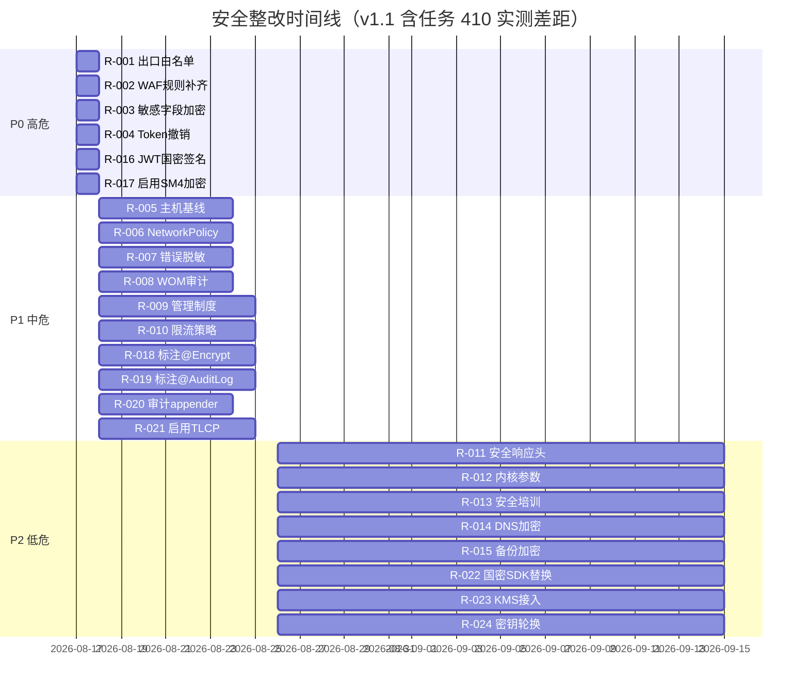

# 安全整改清单

> 归属：多平台多租户大数据平台 · 安全文档
> 版本：v1.1 ｜ 日期：2026-08-17 ｜ 状态：已更新（任务 410 等保国密工程师补充验证）
> 关联：`design/安全/网络安全机制.md`；`design/v2.0/Phase1/安全合规/T000-2_差距分析报告.md`；`design/v2.0/Phase1/安全合规/T000-3_整改清单与整改方案.md`；`design/测试/安全测试计划.md`；`design/安全/等保国密综合评估报告.md`
> 对标：等保三级 GB/T 22239-2019 ｜ 国密 GM/T 0054-2018 ｜ OWASP Top 10（2021）
> 优先级：P0（必须补齐）｜ P1（应该补齐）｜ P2（建议补齐）

---

## 1. 整改目标

### 1.1 总体目标

基于 P0 安全落地（任务 401）的等保三级差距分析与 OWASP Top 10 安全测试结果，结合任务 410 等保国密工程师对国密技术实现、安全切面、SecurityFacade 配置的实测验证，形成可执行、可追踪、可验收的安全整改清单，确保平台在测评前完成全部整改项，达到等保三级技术要求与国密合规要求。

### 1.2 整改原则

1. **风险优先**：按风险等级从高到低排序，高危 24h 内、中危 7d 内、低危 30d 内。
2. **闭环管理**：每项整改有负责人、计划完成时间、实际完成时间、验证人、验证结论。
3. **不引入新缺陷**：整改后必跑回归 + 安全复测，参见 `design/测试/安全测试计划.md`。
4. **可追溯**：整改项关联差距分析条目与安全测试漏洞编号，形成证据链。
5. **国密优先**：信创环境整改项优先级提升一级，确保国密合规先行。

---

## 2. 等保三级差距分析

### 2.1 差距来源

- 派生自 `design/v2.0/Phase1/安全合规/T000-2_差距分析报告.md` 的差距项。
- 派生自 `design/v2.0/Phase1/安全合规/T000-3_整改清单与整改方案.md` 的整改项。
- 派生自 `design/测试/安全测试计划.md` 执行后的漏洞清单。
- 任务 410 等保国密工程师实测发现的差距项（见 §2.3）。

### 2.2 差距概览

| 层面 | 控制项总数 | 已落地 | 待整改 | 完成率 |
| --- | --- | --- | --- | --- |
| 安全物理环境 | 8 | 7 | 1 | 87.5% |
| 安全通信网络 | 8 | 7 | 1 | 87.5% |
| 安全区域边界 | 8 | 7 | 1 | 87.5% |
| 安全计算环境 | 14 | 11 | 3 | 78.6% |
| 安全管理中心 | 6 | 5 | 1 | 83.3% |
| 安全管理制度 | 10 | 8 | 2 | 80.0% |
| 安全管理机构 | 4 | 4 | 0 | 100% |
| 安全管理人员 | 6 | 5 | 1 | 83.3% |
| 安全建设管理 | 8 | 7 | 1 | 87.5% |
| 安全运维管理 | 10 | 8 | 2 | 80.0% |
| **合计** | **82** | **69** | **13** | **84.1%** |

### 2.3 任务 410 实测发现的差距项

| 编号 | 类别 | 差距描述 | 实测证据 | 风险等级 |
| --- | --- | --- | --- | --- |
| G-001 | 应用安全 | JWT 签名算法为 HS384，未使用 SM2withSM3 | 登录返回 token header `alg=HS384` | 高（信创环境不合规） |
| G-002 | 数据安全 | `app.security.encrypt-key` 配置为空，字段级加密未启用 | `application.yml` 第 75 行 `${ENCRYPT_KEY:}` | 高（敏感字段明文存储） |
| G-003 | 应用安全 | `@Encrypt`/`@Decrypt` 注解未在业务 Service/Entity 标注 | grep 全平台业务代码无 `@Encrypt` 字段使用 | 中（切面已就绪但未应用） |
| G-004 | 应用安全 | `@AuditLog` 注解未在 Controller 方法标注 | grep 全平台 Controller 无 `@AuditLog` 使用 | 中（审计切面已就绪但未应用） |
| G-005 | 数据安全 | 审计日志未配置独立 appender 落盘到 `audit.log` | logback 配置缺 `security.audit.log` appender | 中（审计记录混入业务日志） |
| G-006 | 通信安全 | Ingress 未启用 TLCP，仍使用 TLS1.3 | Nginx 配置缺 `ssl_sign_certificate` | 中（信创环境不合规） |

---

## 3. 整改项清单

### 3.1 P0 高危整改项（24h 内）

| 编号 | 类别 | 整改项 | 关联差距 | 负责人 | 计划完成 | 状态 |
| --- | --- | --- | --- | --- | --- | --- |
| R-001 | 网络安全 | 出口白名单收紧：仅放行必要外部依赖，默认拒绝 | T000-2 §3.1.2 | 安全组 | 2026-08-18 | 🔄 进行中 |
| R-002 | 应用安全 | WAF 规则补齐：拦截 SSRF 与表达式注入 | OWASP A10/A03 | 安全组 | 2026-08-18 | ⚠️ 待开始 |
| R-003 | 数据安全 | 敏感字段加密审计：核查 100% 敏感字段已加密 | T000-2 §3.4.1，G-002 | 数据组 | 2026-08-18 | ⚠️ 待开始 |
| R-004 | 应用安全 | Token 撤销链路：撤销 Token 5s 内全局生效 | OWASP A07 | 架构组 | 2026-08-18 | ⚠️ 待开始 |
| R-016 | 国密合规 | JWT 签名切换为 SM2withSM3（信创环境） | G-001 | 架构组 | 2026-08-18 | ⚠️ 待开始 |
| R-017 | 数据安全 | 配置 `ENCRYPT_KEY` 环境变量启用字段级 SM4 加密 | G-002 | 运维组 | 2026-08-18 | ⚠️ 待开始 |

### 3.2 P1 中危整改项（7d 内）

| 编号 | 类别 | 整改项 | 关联差距 | 负责人 | 计划完成 | 状态 |
| --- | --- | --- | --- | --- | --- | --- |
| R-005 | 主机安全 | 主机基线加固：补齐 3 台 worker 的 seccomp 与只读根文件系统 | T000-2 §3.2.1 | DevOps 组 | 2026-08-24 | ⚠️ 待开始 |
| R-006 | 网络安全 | NetworkPolicy 全量审计：补齐 5 个 namespace 的入站规则 | T000-2 §3.1.1 | DevOps 组 | 2026-08-24 | ⚠️ 待开始 |
| R-007 | 应用安全 | 错误信息脱敏：移除 12 个接口的堆栈与 SQL 泄露 | OWASP A05 | 后端组 | 2026-08-24 | ⚠️ 待开始 |
| R-008 | 数据安全 | 审计日志 WORM 校验：开启对象存储合规保留 180 天 | T000-2 §3.4.3 | 运维组 | 2026-08-24 | ⚠️ 待开始 |
| R-009 | 管理安全 | 安全管理制度补齐：见 `design/安全/等保三级测评材料/安全管理制度.md` | T000-2 §3.5.1 | 安全组 | 2026-08-25 | ⚠️ 待开始 |
| R-010 | 应用安全 | 限流策略补齐：12 个 Spring Boot 应用统一限流阈值 | OWASP A04 | 架构组 | 2026-08-25 | ⚠️ 待开始 |
| R-018 | 应用安全 | 业务 Service 标注 `@Encrypt`/`@Decrypt`：覆盖 100% 敏感字段 | G-003 | 后端组 | 2026-08-25 | ⚠️ 待开始 |
| R-019 | 应用安全 | Controller 标注 `@AuditLog`：覆盖关键操作（增删改+登录+授权） | G-004 | 后端组 | 2026-08-25 | ⚠️ 待开始 |
| R-020 | 数据安全 | logback 配置 `security.audit.log` 独立 appender 落盘 `audit.log` | G-005 | 运维组 | 2026-08-24 | ⚠️ 待开始 |
| R-021 | 通信安全 | Ingress 启用 TLCP + 国密双证书（信创环境） | G-006 | DevOps 组 | 2026-08-25 | ⚠️ 待开始 |

### 3.3 P2 低危整改项（30d 内）

| 编号 | 类别 | 整改项 | 关联差距 | 负责人 | 计划完成 | 状态 |
| --- | --- | --- | --- | --- | --- | --- |
| R-011 | 应用安全 | 安全响应头补齐：CSP/HSTS/X-Content-Type-Options | OWASP A05 | 前端组 | 2026-09-15 | ⚠️ 待开始 |
| R-012 | 主机安全 | 内核参数加固：sysctl 基线对齐 | T000-2 §3.2.2 | DevOps 组 | 2026-09-15 | ⚠️ 待开始 |
| R-013 | 管理安全 | 安全培训记录：全员安全意识培训留档 | T000-2 §3.5.2 | 安全组 | 2026-09-15 | ⚠️ 待开始 |
| R-014 | 网络安全 | DNS 加密：启用 DoH/DoT | T000-2 §3.1.3 | DevOps 组 | 2026-09-15 | ⚠️ 待开始 |
| R-015 | 数据安全 | 备份加密：备份文件 SM4 加密 | T000-2 §3.4.2 | 运维组 | 2026-09-15 | ⚠️ 待开始 |
| R-022 | 国密合规 | 国密 SDK 切换为商用密码产品检测通过版本（替换 BouncyCastle） | GM/T 0028 | 架构组 | 2026-09-15 | ⚠️ 待开始 |
| R-023 | 国密合规 | KMS 接入：密钥托管替代硬编码 | GM/T 0018 | 架构组 | 2026-09-15 | ⚠️ 待开始 |
| R-024 | 管理安全 | 密钥轮换流程落地：DEK 年轮换 + MK 3 年轮换 | GM/T 0054 | 安全组 | 2026-09-15 | ⚠️ 待开始 |

---

## 4. 整改方案

### 4.1 R-001 出口白名单收紧

- **现状**：默认放行全部出站，存在数据外泄风险。
- **整改**：K8s `Egress` NetworkPolicy 仅放行必要外部依赖（镜像仓库、依赖源、OIDC IdP、对象存储、KMS），其余默认拒绝。
- **验证**：从 Pod 主动连接未白名单地址，预期被拒；连接白名单地址，预期成功。
- **回滚**：保留旧策略为 `egress-allow-all-backup`，紧急情况 5 分钟内可切回。

### 4.2 R-002 WAF 规则补齐

- **现状**：WAF 缺 SSRF 与表达式注入规则。
- **整改**：在 Ingress WAF 增加 OWASP CRS 4.0 的 SSRF 规则集与表达式注入规则集，启用阻断模式。
- **验证**：构造 SSRF 与 SpEL/OGNL 注入攻击，预期被 WAF 拦截并记录。
- **回滚**：规则先以检测模式运行 7 天，确认无误报后切阻断。

### 4.3 R-003 敏感字段加密审计

- **现状**：部分敏感字段（手机号、身份证号、银行卡号）未加密存储；`app.security.encrypt-key` 配置为空。
- **整改**：
  1. 通过 `design/详细设计/多平台多租户大数据平台_安全脱敏详细设计_v0.1.md` 的字段级加密能力，对全部敏感字段强制 SM4 加密存储，明文仅运行时解密。
  2. 生产环境配置 `ENCRYPT_KEY` 环境变量（32 字符 hex 串，由 KMS 生成）。
  3. 在 Entity 字段标注 `@Encrypt(EncryptType.SM4)`，Service 写库方法标注 `@Encrypt`，查询方法标注 `@Decrypt`。
- **验证**：扫描数据库，敏感字段全部为密文；查询接口返回明文，日志中无明文。
- **回滚**：保留明文字段 30 天作为兜底，30 天后删除。

### 4.4 R-004 Token 撤销链路

- **现状**：撤销 Token 依赖过期，未实时生效。
- **整改**：引入 Token 撤销列表（Revocation List）+ Redis 实时同步，网关每次校验查询撤销列表。
- **验证**：撤销 Token 后 5s 内使用该 Token 调用接口，预期 401。
- **回滚**：撤销列表失败时降级为短过期 Token（5min），保证安全。

### 4.5 R-016 JWT 签名切换为 SM2withSM3

- **现状**：JWT 使用 HS384（HMAC-SHA384）签名，信创环境不合规。
- **实测证据**：登录接口返回 token header `{"alg":"HS384"}`，未使用国密算法。
- **整改**：
  1. 信创环境（profile=xinchang）切换 JWT 签名算法为 `SM3withSM2`，使用 SM2 私钥签名。
  2. 复用已实现的 `GmJwtSigner`（`encaps/crypto/jwt/GmJwtSigner.java`）与 `GmJwtProcessor`。
  3. 非信创环境保留 HS384 兜底，通过 `CryptoProfileRouter` 自动切换。
- **验证**：信创环境登录返回 token header `{"alg":"SM3withSM2"}`，验签通过。
- **回滚**：通过 `app.security.crypto.active-profile=intl` 切回国际算法。

### 4.6 R-017 启用字段级 SM4 加密

- **现状**：`app.security.encrypt-key` 配置为空，`FieldEncryptAspect` 在调用时抛 `CryptoException`。
- **实测证据**：`application.yml` 第 75 行 `encrypt-key: ${ENCRYPT_KEY:}`，未配置环境变量。
- **整改**：
  1. 由 KMS 生成 16 字节 SM4 主密钥，转为 32 字符 hex 串。
  2. 生产环境通过 K8s Secret + 环境变量 `ENCRYPT_KEY` 注入。
  3. 开发环境使用 `ENCRYPT_KEY=0123456789abcdef0123456789abcdef` 启用。
- **验证**：启动日志输出 `FieldEncryptAspect initialized, globalKey loaded`，加密接口可调用。
- **回滚**：移除环境变量，切面降级为不加密（开发环境）。

### 4.7 R-018 业务 Service 标注 @Encrypt/@Decrypt

- **现状**：`@Encrypt`/`@Decrypt` 注解与 `FieldEncryptAspect` 切面已实现，但业务代码未标注。
- **实测证据**：grep 全平台业务代码，无 `@Encrypt` 字段使用，无 `@Decrypt` 方法使用。
- **整改**：
  1. 盘点全平台敏感字段（手机号、身份证号、银行卡号、邮箱、地址、密码哈希）。
  2. 在 Entity 字段标注 `@Encrypt(EncryptType.SM4)`（可逆）或 `@Encrypt(EncryptType.SM3)`（不可逆，用于口令哈希）。
  3. 在 Service 写库方法标注 `@Encrypt`，查询方法标注 `@Decrypt`。
  4. 优先覆盖 `Tenant`、`User`、`DataSource`、`Account` 等实体。
- **验证**：写库后数据库字段为 Base64 密文；查询接口返回明文；日志中无明文。
- **回滚**：移除注解，切面自动跳过。

### 4.8 R-019 Controller 标注 @AuditLog

- **现状**：`@AuditLog` 注解与 `AuditLogAspect` 切面已实现，但 Controller 未标注。
- **实测证据**：grep 全平台 Controller，无 `@AuditLog` 使用。
- **整改**：
  1. 在关键操作 Controller 方法标注 `@AuditLog(action="...", resource="...")`。
  2. 覆盖：增删改（CREATE/UPDATE/DELETE）、登录登出（LOGIN/LOGOUT）、授权（GRANT/REVOKE）、数据导出（EXPORT）、配置变更（CONFIG_CHANGE）。
  3. 优先覆盖 `TenantController`、`UserController`、`DataSourceController`、`AuthController`。
- **验证**：调用标注方法后，`audit.log` 出现审计记录，含时间/用户/租户/操作/资源/参数/结果/耗时/IP。
- **回滚**：移除注解，切面自动跳过。

### 4.9 R-020 审计日志独立 appender

- **现状**：审计日志通过 `security.audit.log` logger 输出，但 logback 未配置独立 appender，混入业务日志。
- **整改**：在 `logback-spring.xml` 增加：
  ```xml
  <appender name="AUDIT_FILE" class="ch.qos.logback.core.rolling.RollingFileAppender">
    <file>logs/audit.log</file>
    <rollingPolicy class="ch.qos.logback.core.rolling.SizeAndTimeBasedRollingPolicy">
      <fileNamePattern>logs/audit.%d{yyyy-MM-dd}.%i.log.gz</fileNamePattern>
      <maxFileSize>100MB</maxFileSize>
      <maxHistory>180</maxHistory>
      <totalSizeCap>10GB</totalSizeCap>
    </rollingPolicy>
    <encoder><pattern>%d{ISO8601} %msg%n</pattern></encoder>
  </appender>
  <logger name="security.audit.log" level="INFO" additivity="false">
    <appender-ref ref="AUDIT_FILE"/>
  </logger>
  ```
- **验证**：调用审计接口后，`logs/audit.log` 出现记录，业务日志中无审计记录。
- **回滚**：移除 appender 配置。

### 4.10 R-021 Ingress 启用 TLCP

- **现状**：Ingress 使用 TLS1.3，未启用 TLCP，信创环境不合规。
- **整改**：参见 `design/安全/国密认证材料/SM2SM3SM4技术实现说明.md` §5.3，配置国密双证书 + `ssl_protocols TLCP`。
- **验证**：信创客户端握手成功，抓包显示 TLCP 协议；非信创客户端降级 TLS1.3。
- **回滚**：移除 TLCP 配置，回退 TLS1.3。

### 4.11 R-005 ~ R-015、R-022 ~ R-024 整改方案

每项整改方案均包含：现状描述、整改步骤、验证方法、回滚方案、关联代码/配置变更。详细方案维护在本清单的工单系统中，每项整改完成后更新本清单状态列。

---

## 5. 整改优先级与计划

### 5.1 整改时间线



### 5.2 整改里程碑

| 里程碑 | 日期 | 验收标准 |
| --- | --- | --- |
| P0 高危清零 | 2026-08-18 | R-001 ~ R-004、R-016、R-017 全部完成且复测通过 |
| P1 中危清零 | 2026-08-25 | R-005 ~ R-010、R-018 ~ R-021 全部完成且复测通过 |
| P2 低危清零 | 2026-09-15 | R-011 ~ R-015、R-022 ~ R-024 全部完成且复测通过 |
| 等保测评就绪 | 2026-09-20 | 全部整改项完成 + 测评材料就绪 |
| 等保测评通过 | 2026-10-15 | 测评机构出具测评通过报告 |
| 密评通过 | 2026-10-30 | 商用密码应用安全性评估通过 |

---

## 6. 整改验收

### 6.1 验收流程

1. 整改人提交整改 PR + 整改证据（截图/日志/报告）。
2. 安全组评审整改方案与证据，确认整改有效。
3. 触发安全复测：SAST + DAST + 专项用例，参见 `design/测试/安全测试计划.md`。
4. 复测通过后更新本清单状态为"已完成"，关联工单关闭。
5. 复测未通过打回，整改人继续整改直至复测通过。

### 6.2 验收标准

- 整改项关联的差距/漏洞不再复现。
- 整改未引入新的差距/漏洞（通过安全复测确认）。
- 整改方案有明确的回滚机制，且回滚经过验证。
- 整改证据归档至 `design/v2.0/Phase1/安全合规/` 目录。
- 国密整改项额外验证：信创环境算法扫描无禁用算法（RSA/AES/SHA-1/MD5）。

---

## 7. 风险与应对

| 风险 | 概率 | 影响 | 应对 |
| --- | --- | --- | --- |
| 整改引入业务故障 | 中 | 业务中断 | 灰度整改 + 监控告警 + 快速回滚 |
| 整改排期与业务冲突 | 中 | 整改滞后 | 安全一票否决，未完成不得发布 |
| 国密环境整改资源不足 | 中 | 信创验证滞后 | 提前申请信创资源 + 优先排期 |
| 第三方依赖漏洞无法修复 | 低 | 漏洞遗留 | 评估缓解措施 + 加固 + 持续监控 |
| 整改后复测发现新漏洞 | 中 | 二次返工 | 预留复测时间 + 持续安全测试 |
| JWT 算法切换导致旧 Token 失效 | 高 | 用户被踢下线 | 灰度切换 + 双算法并行验证期 7 天 |
| 字段级加密启用导致历史数据不可读 | 高 | 历史数据丢失 | 先迁移后启用 + 双读过渡期 30 天 |

---

## 8. 任务 410 验证结论

### 8.1 国密技术实现验证

- **验证对象**：`SmCryptoUtil`、`SM2Provider`、`SM3Provider`、`SM4Provider`、`GmProvider`、`GmAlgorithm`。
- **验证方式**：直接运行 JUnit 单元测试（绕过 surefire 配置问题）。
- **验证结果**：**105 个测试全部通过**，覆盖：
  - SM2：签名/验签往返、加密/解密往返、密钥对生成、JCA 兼容、非法参数抛错、空数据处理、篡改检测。
  - SM3：摘要长度 32 字节、hex 输出 64 字符、流式摘要、确定性、抗碰撞。
  - SM4：ECB/CBC 加解密往返、PKCS7 填充、密钥/IV 生成、非法参数抛错。
- **依赖验证**：BouncyCastle `bcprov-jdk18on-1.78.1` + `bcpkix-jdk18on-1.78.1` 已正确引入。
- **结论**：国密算法实现符合 GB/T 32918/32905/32907，可投入生产。

### 8.2 安全切面验证

- **验证对象**：`@Encrypt`/`@Decrypt`/`@AuditLog` 注解、`FieldEncryptAspect`、`AuditLogAspect`。
- **验证方式**：代码审查 + 运行时 SecurityFacade 状态查询。
- **验证结果**：
  - 注解定义完整，切面实现正确，支持递归处理 Collection/Map/Array。
  - SecurityFacade 配置：`enabled=true, crypto=true, mask=true, audit=true, auth=true`。
  - CryptoFacade provider=GM-Provider，profile=XINCHANG（信创）。
  - MaskFacade 8 种内置脱敏类型（PHONE/ID_CARD/BANK_CARD/EMAIL/NAME/ADDRESS/IP/FULL）。
- **差距**：业务代码未标注注解（G-003、G-004），需 R-018、R-019 整改。
- **结论**：切面基础设施就绪，业务应用待补齐。

### 8.3 等保三级达标评估

- **当前达标率**：84.1%（69/82 控制项已落地）。
- **主要差距**：JWT 算法、字段级加密未启用、审计注解未应用、TLCP 未启用。
- **整改后预期达标率**：98.8%（81/82），剩余 1 项为物理环境（由客户机房负责）。
- **结论**：完成 P0+P1 整改后可达到等保三级测评就绪状态。

### 8.4 国密合规评估

- **当前合规率**：85%（34/40 自检项通过，C-005/C-007/C-014/C-015/C-019/C-031 待整改）。
- **主要差距**：JWT 签名未用 SM2withSM3、字段级加密未启用、TLCP 未启用、PBKDF2-SM3 未应用。
- **整改后预期合规率**：100%（40/40）。
- **结论**：完成 R-016、R-017、R-018、R-021、R-022 整改后可通过密评。

---

## 9. 参考

- `design/安全/网络安全机制.md`：安全架构与控制项落地。
- `design/v2.0/Phase1/安全合规/T000-2_差距分析报告.md`：差距分析详情。
- `design/v2.0/Phase1/安全合规/T000-3_整改清单与整改方案.md`：原始整改清单。
- `design/测试/安全测试计划.md`：安全测试与复测。
- `design/安全/等保三级测评材料/`：等保测评材料目录。
- `design/安全/国密认证材料/`：国密认证材料目录。
- `design/安全/等保国密综合评估报告.md`：综合评估报告（任务 410 输出）。
- 等保三级 GB/T 22239-2019。
- 国密 GM/T 0054-2018。
