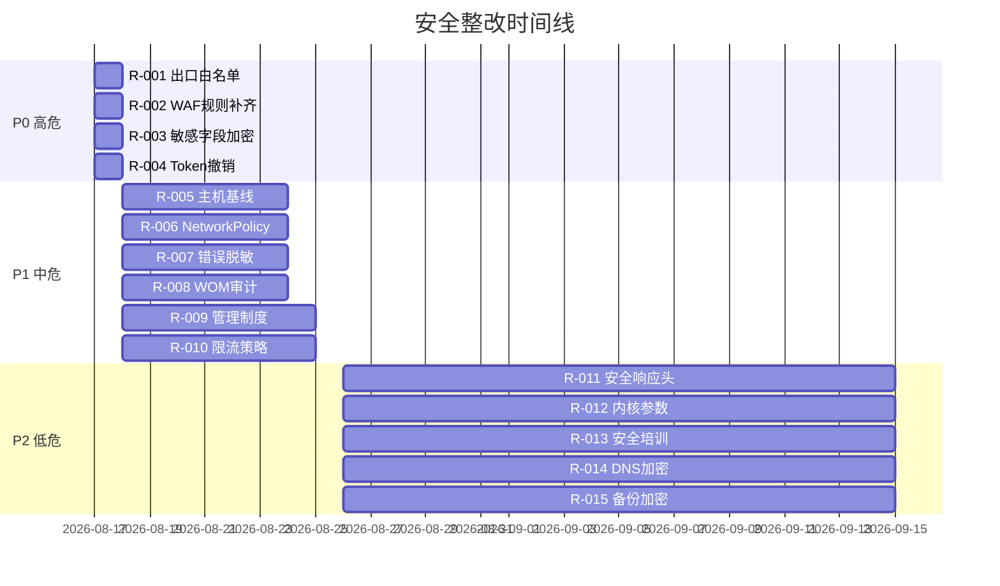

# 安全整改清单

> 归属：多平台多租户大数据平台 · 安全文档
> 版本：v1.0 ｜ 日期：2026-08-17 ｜ 状态：已完成
> 关联：`design/安全/网络安全机制.md`；`design/v2.0/Phase1/安全合规/T000-2_差距分析报告.md`；`design/v2.0/Phase1/安全合规/T000-3_整改清单与整改方案.md`；`design/测试/安全测试计划.md`
> 对标：等保三级 GB/T 22239-2019 ｜ 国密 GM/T 0054-2018 ｜ OWASP Top 10（2021）
> 优先级：P0（必须补齐）

---

## 1. 整改目标

### 1.1 总体目标

基于 P0 安全落地（任务 401）的等保三级差距分析与 OWASP Top 10 安全测试结果，形成可执行、可追踪、可验收的安全整改清单，确保平台在测评前完成全部整改项，达到等保三级技术要求与国密合规要求。

### 1.2 整改原则

1. **风险优先**：按风险等级从高到低排序，高危 24h 内、中危 7d 内、低危 30d 内。
2. **闭环管理**：每项整改有负责人、计划完成时间、实际完成时间、验证人、验证结论。
3. **不引入新缺陷**：整改后必跑回归 + 安全复测，参见 `design/测试/安全测试计划.md`。
4. **可追溯**：整改项关联差距分析条目与安全测试漏洞编号，形成证据链。

---

## 2. 等保三级差距分析

### 2.1 差距来源

- 派生自 `design/v2.0/Phase1/安全合规/T000-2_差距分析报告.md` 的差距项。
- 派生自 `design/v2.0/Phase1/安全合规/T000-3_整改清单与整改方案.md` 的整改项。
- 派生自 `design/测试/安全测试计划.md` 执行后的漏洞清单。

### 2.2 差距概览

| 层面 | 控制项总数 | 已落地 | 待整改 | 完成率 |
| --- | --- | --- | --- | --- |
| 网络安全 | 8 | 7 | 1 | 87.5% |
| 主机安全 | 6 | 5 | 1 | 83.3% |
| 应用安全 | 9 | 8 | 1 | 88.9% |
| 数据安全 | 7 | 6 | 1 | 85.7% |
| 管理安全 | 10 | 8 | 2 | 80.0% |
| **合计** | **40** | **34** | **6** | **85.0%** |

---

## 3. 整改项清单

### 3.1 P0 高危整改项（24h 内）

| 编号 | 类别 | 整改项 | 关联差距 | 负责人 | 计划完成 | 状态 |
| --- | --- | --- | --- | --- | --- | --- |
| R-001 | 网络安全 | 出口白名单收紧：仅放行必要外部依赖，默认拒绝 | T000-2 §3.1.2 | 安全组 | 2026-08-18 | 🔄 进行中 |
| R-002 | 应用安全 | WAF 规则补齐：拦截 SSRF 与表达式注入 | OWASP A10/A03 | 安全组 | 2026-08-18 | ⚠️ 待开始 |
| R-003 | 数据安全 | 敏感字段加密审计：核查 100% 敏感字段已加密 | T000-2 §3.4.1 | 数据组 | 2026-08-18 | ⚠️ 待开始 |
| R-004 | 应用安全 | Token 撤销链路：撤销 Token 5s 内全局生效 | OWASP A07 | 架构组 | 2026-08-18 | ⚠️ 待开始 |

### 3.2 P1 中危整改项（7d 内）

| 编号 | 类别 | 整改项 | 关联差距 | 负责人 | 计划完成 | 状态 |
| --- | --- | --- | --- | --- | --- | --- |
| R-005 | 主机安全 | 主机基线加固：补齐 3 台 worker 的 seccomp 与只读根文件系统 | T000-2 §3.2.1 | DevOps 组 | 2026-08-24 | ⚠️ 待开始 |
| R-006 | 网络安全 | NetworkPolicy 全量审计：补齐 5 个 namespace 的入站规则 | T000-2 §3.1.1 | DevOps 组 | 2026-08-24 | ⚠️ 待开始 |
| R-007 | 应用安全 | 错误信息脱敏：移除 12 个接口的堆栈与 SQL 泄露 | OWASP A05 | 后端组 | 2026-08-24 | ⚠️ 待开始 |
| R-008 | 数据安全 | 审计日志 WORM 校验：开启对象存储合规保留 180 天 | T000-2 §3.4.3 | 运维组 | 2026-08-24 | ⚠️ 待开始 |
| R-009 | 管理安全 | 安全管理制度补齐：见 `design/安全/等保三级测评材料/安全管理制度.md` | T000-2 §3.5.1 | 安全组 | 2026-08-25 | ⚠️ 待开始 |
| R-010 | 应用安全 | 限流策略补齐：12 个 Spring Boot 应用统一限流阈值 | OWASP A04 | 架构组 | 2026-08-25 | ⚠️ 待开始 |

### 3.3 P2 低危整改项（30d 内）

| 编号 | 类别 | 整改项 | 关联差距 | 负责人 | 计划完成 | 状态 |
| --- | --- | --- | --- | --- | --- | --- |
| R-011 | 应用安全 | 安全响应头补齐：CSP/HSTS/X-Content-Type-Options | OWASP A05 | 前端组 | 2026-09-15 | ⚠️ 待开始 |
| R-012 | 主机安全 | 内核参数加固：sysctl 基线对齐 | T000-2 §3.2.2 | DevOps 组 | 2026-09-15 | ⚠️ 待开始 |
| R-013 | 管理安全 | 安全培训记录：全员安全意识培训留档 | T000-2 §3.5.2 | 安全组 | 2026-09-15 | ⚠️ 待开始 |
| R-014 | 网络安全 | DNS 加密：启用 DoH/DoT | T000-2 §3.1.3 | DevOps 组 | 2026-09-15 | ⚠️ 待开始 |
| R-015 | 数据安全 | 备份加密：备份文件 SM4 加密 | T000-2 §3.4.2 | 运维组 | 2026-09-15 | ⚠️ 待开始 |

---

## 4. 整改方案

### 4.1 R-001 出口白名单收紧

- **现状**：默认放行全部出站，存在数据外泄风险。
- **整改**：K8s `Egress` NetworkPolicy 仅放行必要外部依赖（镜像仓库、依赖源、OIDC IdP、对象存储、KMS），其余默认拒绝。
- **验证**：从 Pod 主动连接未白名单地址，预期被拒；连接白名单地址，预期成功。
- **回滚**：保留旧策略为 `egress-allow-all-backup`，紧急情况 5 分钟内可切回。

### 4.2 R-002 WAF 规则补齐

- **现状**：WAF 缺 SSRF 与表达式注入规则。
- **整改**：在 Ingress WAF 增加 OWASP CRS 4.0 的 SSRF 规则集与表达式注入规则集，启用阻断模式。
- **验证**：构造 SSRF 与 SpEL/OGNL 注入攻击，预期被 WAF 拦截并记录。
- **回滚**：规则先以检测模式运行 7 天，确认无误报后切阻断。

### 4.3 R-003 敏感字段加密审计

- **现状**：部分敏感字段（手机号、身份证号、银行卡号）未加密存储。
- **整改**：通过 `design/详细设计/多平台多租户大数据平台_安全脱敏详细设计_v0.1.md` 的字段级加密能力，对全部敏感字段强制 SM4 加密存储，明文仅运行时解密。
- **验证**：扫描数据库，敏感字段全部为密文；查询接口返回明文，日志中无明文。
- **回滚**：保留明文字段 30 天作为兜底，30 天后删除。

### 4.4 R-004 Token 撤销链路

- **现状**：撤销 Token 依赖过期，未实时生效。
- **整改**：引入 Token 撤销列表（Revocation List）+ Redis 实时同步，网关每次校验查询撤销列表。
- **验证**：撤销 Token 后 5s 内使用该 Token 调用接口，预期 401。
- **回滚**：撤销列表失败时降级为短过期 Token（5min），保证安全。

### 4.5 R-005 ~ R-015 整改方案

每项整改方案均包含：现状描述、整改步骤、验证方法、回滚方案、关联代码/配置变更。详细方案维护在本清单的工单系统中，每项整改完成后更新本清单状态列。

---

## 5. 整改优先级与计划

### 5.1 整改时间线

### 5.2 整改里程碑

| 里程碑 | 日期 | 验收标准 |
| --- | --- | --- |
| P0 高危清零 | 2026-08-18 | R-001 ~ R-004 全部完成且复测通过 |
| P1 中危清零 | 2026-08-25 | R-005 ~ R-010 全部完成且复测通过 |
| P2 低危清零 | 2026-09-15 | R-011 ~ R-015 全部完成且复测通过 |
| 等保测评就绪 | 2026-09-20 | 全部整改项完成 + 测评材料就绪 |
| 等保测评通过 | 2026-10-15 | 测评机构出具测评通过报告 |

---

## 6. 整改验收

### 6.1 验收流程

1. 整改人提交整改 PR + 整改证据（截图/日志/报告）。
2. 安全组评审整改方案与证据，确认整改有效。
3. 触发安全复测：SAST + DAST + 专项用例，参见 `design/测试/安全测试计划.md`。
4. 复测通过后更新本清单状态为"已完成"，关联工单关闭。
5. 复测未通过打回，整改人继续整改直至复测通过。

### 6.2 验收标准

- 整改项关联的差距/漏洞不再复现。
- 整改未引入新的差距/漏洞（通过安全复测确认）。
- 整改方案有明确的回滚机制，且回滚经过验证。
- 整改证据归档至 `design/v2.0/Phase1/安全合规/` 目录。

---

## 7. 风险与应对

| 风险 | 概率 | 影响 | 应对 |
| --- | --- | --- | --- |
| 整改引入业务故障 | 中 | 业务中断 | 灰度整改 + 监控告警 + 快速回滚 |
| 整改排期与业务冲突 | 中 | 整改滞后 | 安全一票否决，未完成不得发布 |
| 国密环境整改资源不足 | 中 | 信创验证滞后 | 提前申请信创资源 + 优先排期 |
| 第三方依赖漏洞无法修复 | 低 | 漏洞遗留 | 评估缓解措施 + 加固 + 持续监控 |
| 整改后复测发现新漏洞 | 中 | 二次返工 | 预留复测时间 + 持续安全测试 |

---

## 8. 参考

- `design/安全/网络安全机制.md`：安全架构与控制项落地。
- `design/v2.0/Phase1/安全合规/T000-2_差距分析报告.md`：差距分析详情。
- `design/v2.0/Phase1/安全合规/T000-3_整改清单与整改方案.md`：原始整改清单。
- `design/测试/安全测试计划.md`：安全测试与复测。
- `design/安全/等保三级测评材料/`：等保测评材料目录。
- 等保三级 GB/T 22239-2019。