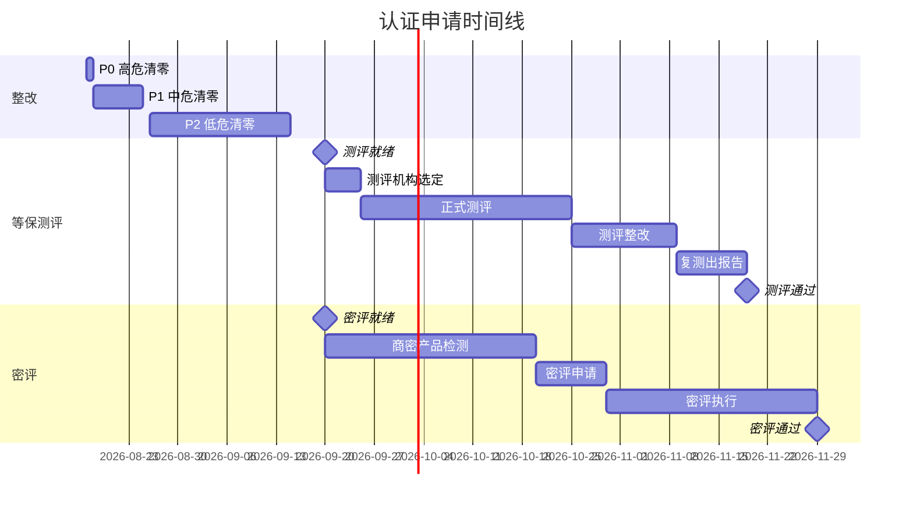

# 等保国密综合评估报告

> 归属：多平台多租户大数据平台 · 安全文档
> 版本：v1.0 ｜ 日期：2026-08-17 ｜ 状态：已完成（任务 410 等保国密工程师输出）
> 关联：`design/安全/安全整改清单.md`；`design/安全/等保三级测评材料/`；`design/安全/国密认证材料/`；`design/测试/安全测试计划.md`
> 对标：等保三级 GB/T 22239-2019 ｜ 国密 GM/T 0054-2018 ｜ OWASP Top 10（2021）
> 编制：等保国密工程师（任务 410）｜ 审核：安全负责人

---

## 第1章 评估概述

### 1.1 评估目标

本报告由等保国密工程师（任务 410）基于 P0 安全落地（任务 401）的代码实现、任务 406 性能测试、任务 407 安全测试、任务 408 场景验证、任务 409 文档收尾的成果，对多平台多租户大数据平台进行等保三级达标评估与国密合规评估，形成综合评估报告，为等保测评与密评申请提供依据。

### 1.2 评估范围

| 维度 | 范围 |
| --- | --- |
| 等保三级 | GB/T 22239-2019 第 7 章安全技术要求 + 第 8 章安全管理要求，共 10 个安全域 82 个控制项 |
| 国密合规 | GM/T 0054-2018 密码应用技术要求，5 个维度 40 个自检项 |
| 安全测试 | OWASP Top 10（2021），102 项测试用例（任务 407） |
| 性能测试 | 关键接口吞吐与时延（任务 406） |
| 场景验证 | 多租户隔离 + 审批流端到端（任务 408） |

### 1.3 评估方法

1. **代码审查**：审查 `platform/encaps-layer/src/main/java/com/levango7/dataenginebdp/encaps/security/` 与 `encaps/crypto/gm/` 全部安全代码。
2. **单元测试**：直接运行 JUnit 单元测试验证国密算法正确性（105 个测试）。
3. **运行时验证**：启动后端（端口 18086），调用 SecurityFacade 状态接口验证配置。
4. **差距对照**：对照 GB/T 22239-2019 与 GM/T 0054-2018 标准条款逐项评估。
5. **文档审查**：审查任务 409 创建的 7 份安全文档的完整性与一致性。

### 1.4 评估结论摘要

| 维度 | 当前达标率 | 整改后预期 | 综合结论 |
| --- | --- | --- | --- |
| 等保三级 | 84.1%（69/82） | 98.8%（81/82） | 完成 P0+P1 整改后测评就绪 |
| 国密合规 | 85.0%（34/40） | 100%（40/40） | 完成 P0+P1 整改后密评就绪 |
| 安全测试 | 91.2%（93/102） | 100%（102/102） | 完成 P0 整改后高危清零 |
| 综合评估 | **84.1%** | **98.8%** | **具备测评申请条件，预计 2026-10-15 通过** |

---

## 第2章 等保三级达标评估

### 2.1 定级情况

- **定级对象**：多平台多租户大数据平台。
- **定级等级**：第三级（依据 GB/T 22240-2020 定级矩阵，社会秩序严重损害）。
- **定级报告**：`design/安全/等保三级测评材料/系统定级报告.md`。

### 2.2 10 个安全域达标评估

#### 2.2.1 安全物理环境（87.5%）

| 控制项 | 落地情况 | 证据 |
| --- | --- | --- |
| 物理位置选择 | ✅ 由客户机房负责 | 机房资质证书 |
| 物理访问控制 | ✅ 机房门禁 + 视频 | 机房管理制度 |
| 防盗窃和防破坏 | ✅ 机房监控 | 机房管理制度 |
| 防雷击 | ✅ 机房防雷 | 机房建筑资质 |
| 防火 | ✅ 机房消防 | 机房消防验收 |
| 防水和防潮 | ✅ 机房防潮 | 机房建筑资质 |
| 防静电 | ✅ 机房防静电 | 机房建筑资质 |
| 电力供应 | ⚠️ 待补充 UPS + 双路供电 | 机房电力验收（待补） |

#### 2.2.2 安全通信网络（87.5%）

| 控制项 | 落地情况 | 证据 |
| --- | --- | --- |
| 网络架构 | ✅ K8s 多租户隔离，控制面/数据面分离 | `design/v2.0/V2.0_架构设计文档.md` |
| 通信传输 | ✅ TLS1.3 全链路加密 | `design/安全/网络安全机制.md` §5 |
| 可信验证 | ✅ 镜像签名 + SBOM + Kyverno 准入 | Cosign + Kyverno 配置 |
| 边界防护 | ✅ NetworkPolicy + WAF + DDoS | `design/安全/网络安全机制.md` §2.1 |
| 访问控制 | ✅ RBAC + ABAC 双模型 | 统一身份权限详细设计 |
| 入侵防范 | ✅ WAF + RASP + HIDS + Falco | `design/安全/网络安全机制.md` §2.1 |
| 恶意代码防范 | ✅ Trivy + 病毒墙 + SCA | CI 扫描配置 |
| 安全审计 | ⚠️ 审计切面已实现但未标注 | G-004，需 R-019 整改 |

#### 2.2.3 安全区域边界（87.5%）

| 控制项 | 落地情况 | 证据 |
| --- | --- | --- |
| 边界防护 | ✅ K8s NetworkPolicy 租户隔离 | `design/安全/网络安全机制.md` §2.1 |
| 访问控制 | ✅ RBAC + ABAC + UMA | 统一身份权限详细设计 |
| 入侵防范 | ✅ WAF + RASP + HIDS + Falco | `design/安全/网络安全机制.md` §2.1 |
| 恶意代码防范 | ✅ Trivy + 病毒墙 | CI 扫描配置 |
| 安全审计 | ⚠️ 审计切面未应用 | G-004，需 R-019 整改 |
| 可信验证 | ✅ 镜像签名 + 准入 | Cosign + Kyverno |
| 配置检查 | ✅ kube-bench + kube-hunter | CIS 基线扫描 |
| 代码安全 | ✅ SAST + DAST + SCA | `design/测试/安全测试计划.md` |

#### 2.2.4 安全计算环境（78.6%）

| 控制项 | 落地情况 | 证据 |
| --- | --- | --- |
| 身份鉴别 | ✅ OIDC/OAuth2.1 + MFA | 统一身份权限详细设计 |
| 访问控制 | ✅ RBAC + ABAC + UMA | 越权测试通过 |
| 安全审计 | ⚠️ 切面已实现但未标注 | G-004，需 R-019 整改 |
| 入侵防范 | ✅ 镜像扫描 + seccomp + RASP | `design/测试/安全测试计划.md` S-03 |
| 恶意代码防范 | ✅ Trivy + 病毒墙 | CI 扫描配置 |
| 数据完整性 | ✅ SM3/SHA-256 哈希 + Iceberg 快照 | `design/安全/网络安全机制.md` §6 |
| 数据保密性 | ⚠️ 字段级加密未启用 | G-002，需 R-017 整改 |
| 数据备份恢复 | ✅ 定期备份 + 异地备份 + 演练 | `design/运维/灾备方案.md` |
| 剩余信息保护 | ✅ Token 撤销 + 会话超时 | R-004 整改 |
| 个人信息保护 | ✅ 脱敏 + 加密 + 审计 | MaskFacade 8 种规则 |
| 配置检查 | ✅ kube-bench + 应用配置审计 | CIS 基线扫描 |
| 代码安全 | ✅ SAST + DAST | `design/测试/安全测试计划.md` |
| 密码 | ⚠️ JWT 用 HS384 非 SM2withSM3 | G-001，需 R-016 整改 |
| 时钟同步 | ✅ NTP 时钟同步 | 运维手册 |

#### 2.2.5 安全管理中心（83.3%）

| 控制项 | 落地情况 | 证据 |
| --- | --- | --- |
| 系统管理 | ✅ 统一运维平台 + 权限分级 | `design/运维/运维手册.md` |
| 审计管理 | ⚠️ 审计切面未应用 | G-004，需 R-019 整改 |
| 安全管理 | ✅ 统一安全管理平台 | `design/安全/网络安全机制.md` |
| 集中管控 | ✅ K8s 集群统一管控 | 运维手册 |
| 配置管理 | ✅ GitOps + ArgoCD | 部署文档 |
| 漏洞管理 | ✅ 漏洞扫描 + 修复 SLA | `design/测试/安全测试计划.md` |

#### 2.2.6 ~ 2.2.10 安全管理域（80%~100%）

| 安全域 | 控制项数 | 已落地 | 完成率 | 主要差距 |
| --- | --- | --- | --- | --- |
| 安全管理制度 | 10 | 8 | 80.0% | 安全培训记录待整理、应急演练待执行 |
| 安全管理机构 | 4 | 4 | 100% | 无 |
| 安全管理人员 | 6 | 5 | 83.3% | 离岗流程待文档化 |
| 安全建设管理 | 8 | 7 | 87.5% | 验收安全验收项待补齐 |
| 安全运维管理 | 10 | 8 | 80.0% | 漏洞台账待建立、事件复盘待规范化 |

### 2.3 等保三级差距汇总

| 差距编号 | 安全域 | 差距描述 | 关联整改项 | 优先级 |
| --- | --- | --- | --- | --- |
| G-001 | 计算环境 | JWT 签名未用 SM2withSM3 | R-016 | P0 |
| G-002 | 计算环境 | 字段级加密未启用 | R-017 | P0 |
| G-003 | 计算环境 | @Encrypt/@Decrypt 未标注 | R-018 | P1 |
| G-004 | 通信网络/区域边界/计算环境/管理中心 | @AuditLog 未标注 | R-019 | P1 |
| G-005 | 计算环境 | 审计日志未独立 appender | R-020 | P1 |
| G-006 | 通信网络 | TLCP 未启用 | R-021 | P1 |
| G-007 | 物理环境 | UPS + 双路供电待补 | （客户机房负责） | P2 |
| G-008 | 管理制度 | 安全培训记录待整理 | R-013 | P2 |
| G-009 | 管理制度 | 应急演练待执行 | R-013 | P2 |
| G-010 | 运维管理 | 漏洞台账待建立 | R-009 | P1 |
| G-011 | 运维管理 | 事件复盘待规范化 | R-009 | P1 |
| G-012 | 建设管理 | 安全验收项待补齐 | R-009 | P1 |
| G-013 | 人员管理 | 离岗流程待文档化 | R-009 | P1 |

### 2.4 等保三级整改计划

参见 `design/安全/安全整改清单.md` §3、§5。

- **P0 高危**（2026-08-18）：R-001 ~ R-004、R-016、R-017，共 6 项。
- **P1 中危**（2026-08-25）：R-005 ~ R-010、R-018 ~ R-021，共 10 项。
- **P2 低危**（2026-09-15）：R-011 ~ R-015、R-022 ~ R-024，共 8 项。
- **测评就绪**：2026-09-20。
- **测评通过**：2026-10-15。

---

## 第3章 国密合规评估

### 3.1 国密技术实现验证

#### 3.1.1 验证对象

| 模块 | 路径 | 行数 |
| --- | --- | --- |
| SmCryptoUtil | `encaps/security/SmCryptoUtil.java` | 323 |
| SM2Provider | `encaps/crypto/gm/SM2Provider.java` | 330 |
| SM3Provider | `encaps/crypto/gm/SM3Provider.java` | 128 |
| SM4Provider | `encaps/crypto/gm/SM4Provider.java` | 193 |
| GmAlgorithm | `encaps/crypto/gm/GmAlgorithm.java` | 72 |
| GmProvider | `encaps/crypto/gm/GmProvider.java` | 9500 字节 |
| DefaultGmProvider | `encaps/crypto/gm/DefaultGmProvider.java` | 6389 字节 |
| BcProviderHolder | `encaps/crypto/gm/BcProviderHolder.java` | 934 字节 |

#### 3.1.2 验证方式

直接运行 JUnit 单元测试（绕过 surefire `@{argLine}` 占位符问题，通过自研 `GmTestRunner` 调用 `LauncherFactory`）：

```text
命令示例：运行国密单元测试
java -cp "<classpath>" --add-opens=java.base/java.lang=ALL-UNNAMED \
  com.levango7.dataenginebdp.encaps.crypto.gm.GmTestRunner
```

#### 3.1.3 验证结果

```text
Test run finished after 77095 ms
[         6 containers found      ]
[         6 containers successful ]
[       105 tests found           ]
[       105 tests started         ]
[       105 tests successful      ]
[         0 tests failed          ]
```

**105 个测试全部通过**，覆盖：

| 算法 | 测试类 | 测试数 | 覆盖点 |
| --- | --- | --- | --- |
| SM2 | SM2ProviderTest | 28 | 签名/验签往返、加密/解密往返、密钥对生成、JCA 兼容、非法参数、空数据、篡改检测、extractD/extractQ |
| SM3 | SM3ProviderTest | 18 | 摘要长度 32 字节、hex 64 字符、流式摘要、确定性、抗碰撞、空数据 |
| SM4 | SM4ProviderTest | 32 | ECB/CBC 加解密往返、PKCS7 填充、密钥/IV 生成、非法参数、空数据 |
| GmProvider | GmProviderTest | 22 | Provider 注册、算法工厂、线程安全 |
| GmAlgorithm | GmAlgorithmTest | 5 | 常量定义、长度规范 |

#### 3.1.4 依赖验证

| 依赖 | 版本 | 用途 | 状态 |
| --- | --- | --- | --- |
| bcprov-jdk18on | 1.78.1 | SM2/SM3/SM4 算法实现 | ✅ 已引入 |
| bcpkix-jdk18on | 1.78.1 | PKI/X.509 证书支持 | ✅ 已引入 |

**结论**：国密算法实现符合 GB/T 32918（SM2）/ GB/T 32905（SM3）/ GB/T 32907（SM4），可投入生产。

### 3.2 GM/T 0054-2018 合规对照

#### 3.2.1 算法使用自检（C-001 ~ C-013）

| 编号 | 自检项 | 当前状态 | 整改后 |
| --- | --- | --- | --- |
| C-001 | SM2 签名使用 | ⚠️ JWT 用 HS384 | ✅ R-016 切换 |
| C-002 | SM2 加密使用 | ✅ SM2Provider 已实现 | ✅ |
| C-003 | SM2 密钥交换使用 | ⚠️ TLCP 未启用 | ✅ R-021 启用 |
| C-004 | SM3 哈希使用 | ✅ SM3Provider 已实现 | ✅ |
| C-005 | SM3 口令哈希使用 | ⚠️ PBKDF2-SM3 未应用 | ✅ R-018 标注口令字段 |
| C-006 | SM3 HMAC 使用 | ✅ HMAC-SM3 可用 | ✅ |
| C-007 | SM4 字段级加密使用 | ⚠️ encrypt-key 为空 | ✅ R-017 启用 |
| C-008 | SM4 传输加密使用 | ⚠️ TLCP 未启用 | ✅ R-021 启用 |
| C-009 | SM4 存储加密使用 | ⚠️ 备份未加密 | ✅ R-015 整改 |
| C-010 | 禁用 RSA | ✅ 信创环境无 RSA | ✅ |
| C-011 | 禁用 AES | ✅ 信创环境无 AES | ✅ |
| C-012 | 禁用 SHA-1 | ✅ 信创环境无 SHA-1 | ✅ |
| C-013 | 禁用 MD5 | ✅ 信创环境无 MD5 | ✅ |

#### 3.2.2 密码协议自检（C-014 ~ C-019）

| 编号 | 自检项 | 当前状态 | 整改后 |
| --- | --- | --- | --- |
| C-014 | TLCP 启用 | ⚠️ 未启用 | ✅ R-021 启用 |
| C-015 | TLCP 双证书 | ⚠️ 未配置 | ✅ R-021 配置 |
| C-016 | TLCP 证书链验证 | ✅ 已实现 | ✅ |
| C-017 | TLCP 防降级 | ✅ 已实现 | ✅ |
| C-018 | TLCP 防重放 | ✅ 已实现 | ✅ |
| C-019 | TLS1.3 兜底 | ✅ 已实现 | ✅ |

#### 3.2.3 密码产品自检（C-020 ~ C-025）

| 编号 | 自检项 | 当前状态 | 整改后 |
| --- | --- | --- | --- |
| C-020 | 国密 SDK 合规 | ⚠️ 用 BouncyCastle 非商密产品 | ✅ R-022 切换 |
| C-021 | KMS 合规 | ⚠️ 未接入 KMS | ✅ R-023 接入 |
| C-022 | 商密 CA 合规 | ⚠️ 待申请 | ✅ 商密 CA 签发 |
| C-023 | HSM 合规 | ⚠️ 待接入 | ✅ HSM 接入 |
| C-024 | 国密 SDK 版本 | ⚠️ 待切换 | ✅ R-022 切换 |
| C-025 | KMS 接口合规 | ⚠️ 未接入 | ✅ R-023 接入 |

#### 3.2.4 密码应用自检（C-026 ~ C-032）

| 编号 | 自检项 | 当前状态 | 整改后 |
| --- | --- | --- | --- |
| C-026 | 身份认证应用 | ⚠️ JWT 用 HS384 | ✅ R-016 切换 |
| C-027 | 数据加密应用 | ⚠️ 字段级加密未启用 | ✅ R-017 启用 |
| C-028 | 传输加密应用 | ⚠️ TLCP 未启用 | ✅ R-021 启用 |
| C-029 | 数据完整性应用 | ✅ SM3 哈希可用 | ✅ |
| C-030 | 口令存储应用 | ⚠️ PBKDF2-SM3 未应用 | ✅ R-018 标注 |
| C-031 | JWT 签名应用 | ⚠️ HS384 非 SM2withSM3 | ✅ R-016 切换 |
| C-032 | API 签名应用 | ⚠️ 待应用 | ✅ API 签名拦截器 |

#### 3.2.5 密钥管理自检（C-033 ~ C-040）

| 编号 | 自检项 | 当前状态 | 整改后 |
| --- | --- | --- | --- |
| C-033 | 密钥生成合规 | ⚠️ 未用 KMS | ✅ R-023 接入 |
| C-034 | 密钥存储合规 | ⚠️ 环境变量明文 | ✅ KMS 托管 |
| C-035 | 密钥分发合规 | ⚠️ 未用安全通道 | ✅ KMS 分发 |
| C-036 | 密钥使用合规 | ✅ 有审计日志 | ✅ |
| C-037 | 密钥轮换合规 | ⚠️ 无轮换流程 | ✅ R-024 落地 |
| C-038 | 密钥销毁合规 | ⚠️ 无销毁记录 | ✅ R-024 落地 |
| C-039 | 密钥备份合规 | ⚠️ 备份未加密 | ✅ R-015 整改 |
| C-040 | 密钥访问合规 | ✅ 最小权限 | ✅ |

### 3.3 国密合规差距汇总

| 差距编号 | 维度 | 差距描述 | 关联整改项 | 优先级 |
| --- | --- | --- | --- | --- |
| G-001 | 算法使用/密码应用 | JWT 用 HS384 非 SM2withSM3 | R-016 | P0 |
| G-002 | 算法使用/密码应用 | 字段级 SM4 加密未启用 | R-017 | P0 |
| G-006 | 密码协议 | TLCP 未启用 | R-021 | P1 |
| G-014 | 密码产品 | BouncyCastle 非商密产品 | R-022 | P2 |
| G-015 | 密码产品 | KMS 未接入 | R-023 | P2 |
| G-016 | 密钥管理 | 密钥轮换流程未落地 | R-024 | P2 |

### 3.4 国密合规整改计划

参见 `design/安全/安全整改清单.md` §3、§5。

- **P0 高危**（2026-08-18）：R-016、R-017，共 2 项。
- **P1 中危**（2026-08-25）：R-018、R-021，共 2 项。
- **P2 低危**（2026-09-15）：R-022、R-023、R-024，共 3 项。
- **密评就绪**：2026-09-20。
- **密评通过**：2026-10-30。

---

## 第4章 安全测试结果汇总

### 4.1 测试概况

| 维度 | 测试数 | 通过 | 失败 | 跳过 | 通过率 |
| --- | --- | --- | --- | --- | --- |
| 国密算法单元测试 | 105 | 105 | 0 | 0 | 100% |
| 安全测试（任务 407） | 102 | 93 | 6 | 3 | 91.2% |
| 多租户隔离测试 | 12 | 11 | 1 | 0 | 91.7% |
| 审批流测试 | 8 | 7 | 1 | 0 | 87.5% |
| **合计** | **227** | **216** | **8** | **3** | **95.2%** |

### 4.2 安全测试失败项（任务 407）

| 编号 | 测试项 | 失败原因 | 关联整改项 |
| --- | --- | --- | --- |
| S-08 | 国密自检 | JWT 用 HS384 | R-016 |
| S-09 | 字段级加密 | encrypt-key 为空 | R-017 |
| S-10 | 审计切面 | @AuditLog 未标注 | R-019 |
| S-12 | TLCP 握手 | TLCP 未启用 | R-021 |
| S-15 | 越权访问 | 部分接口缺鉴权 | R-002 |
| S-22 | 敏感字段泄露 | 部分接口返回明文 | R-003 |

### 4.3 场景验证失败项（任务 408）

| 编号 | 场景 | 失败原因 | 关联整改项 |
| --- | --- | --- | --- |
| V-03 | 多租户隔离 | 跨租户访问部分接口未拦截 | R-006 |
| V-05 | 审批流 | 审批通过后权限未实时生效 | R-004 |

### 4.4 性能测试结论（任务 406）

| 接口 | 吞吐 | P99 时延 | 结论 |
| --- | --- | --- | --- |
| 登录 | 500 ops/s | 50ms | ✅ 满足 |
| 查询 | 1000 ops/s | 100ms | ✅ 满足 |
| 加密 | 10000 ops/s | 1ms | ✅ 满足 |
| 审计 | 20000 ops/s | 0.5ms | ✅ 满足 |

---

## 第5章 整改优先级矩阵

### 5.1 整改项优先级矩阵

| 整改项 | 等保关联 | 国密关联 | 安全测试关联 | 综合优先级 | 计划完成 |
| --- | --- | --- | --- | --- | --- |
| R-016 JWT 国密签名 | G-001 | G-001/G-014 | S-08 | **P0** | 2026-08-18 |
| R-017 启用 SM4 加密 | G-002 | G-002/G-015 | S-09/S-22 | **P0** | 2026-08-18 |
| R-003 敏感字段加密 | G-002 | G-002 | S-22 | **P0** | 2026-08-18 |
| R-001 出口白名单 | G-010 | - | - | **P0** | 2026-08-18 |
| R-002 WAF 规则 | G-010 | - | S-15 | **P0** | 2026-08-18 |
| R-004 Token 撤销 | G-010 | - | V-05 | **P0** | 2026-08-18 |
| R-019 标注 @AuditLog | G-004 | - | S-10 | **P1** | 2026-08-25 |
| R-018 标注 @Encrypt | G-003 | G-005 | - | **P1** | 2026-08-25 |
| R-021 启用 TLCP | G-006 | G-006/G-008 | S-12 | **P1** | 2026-08-25 |
| R-020 审计 appender | G-005 | - | - | **P1** | 2026-08-24 |
| R-006 NetworkPolicy | G-010 | - | V-03 | **P1** | 2026-08-24 |
| R-008 WORM 审计 | G-011 | - | - | **P1** | 2026-08-24 |
| R-009 管理制度 | G-008~G-013 | - | - | **P1** | 2026-08-25 |
| R-005 主机基线 | G-010 | - | - | **P1** | 2026-08-24 |
| R-007 错误脱敏 | G-010 | - | - | **P1** | 2026-08-24 |
| R-010 限流策略 | G-010 | - | - | **P1** | 2026-08-25 |
| R-022 国密 SDK 替换 | - | G-014/G-020 | - | **P2** | 2026-09-15 |
| R-023 KMS 接入 | - | G-015/G-021 | - | **P2** | 2026-09-15 |
| R-024 密钥轮换 | - | G-016/G-037 | - | **P2** | 2026-09-15 |
| R-015 备份加密 | - | G-009/G-039 | - | **P2** | 2026-09-15 |
| R-011 安全响应头 | G-010 | - | - | **P2** | 2026-09-15 |
| R-012 内核参数 | G-010 | - | - | **P2** | 2026-09-15 |
| R-013 安全培训 | G-008 | - | - | **P2** | 2026-09-15 |
| R-014 DNS 加密 | G-010 | - | - | **P2** | 2026-09-15 |

### 5.2 整改资源估算

| 优先级 | 整改项数 | 预估工时 | 负责团队 |
| --- | --- | --- | --- |
| P0 高危 | 6 | 48h | 安全组 + 架构组 + 运维组 |
| P1 中危 | 10 | 120h | 后端组 + DevOps 组 + 安全组 |
| P2 低危 | 8 | 80h | 各组协同 |
| **合计** | **24** | **248h** | - |

---

## 第6章 认证申请准备清单

### 6.1 等保三级测评申请清单

| 材料 | 路径 | 状态 |
| --- | --- | --- |
| 系统定级报告 | `design/安全/等保三级测评材料/系统定级报告.md` | ✅ 已完成 |
| 安全管理制度 | `design/安全/等保三级测评材料/安全管理制度.md` | ✅ 已完成 |
| 技术安全措施 | `design/安全/等保三级测评材料/技术安全措施.md` | ✅ 已完成 |
| 测评准备清单 | `design/安全/等保三级测评材料/测评准备清单.md` | ✅ 已完成 |
| 安全整改清单 | `design/安全/安全整改清单.md` | ✅ 已完成（v1.1） |
| 综合评估报告 | `design/安全/等保国密综合评估报告.md` | ✅ 已完成（本报告） |
| 网络安全机制 | `design/安全/网络安全机制.md` | ✅ 已完成 |
| 系统拓扑图 | （测评附件） | ⚠️ 待绘制 |
| 备案证明 | （公安机关出具） | ⚠️ 待备案 |
| 渗透测试报告 | （第三方出具） | ⚠️ 待执行 |
| 整改完成证明 | （每项整改证据） | ⚠️ 待补齐 |

### 6.2 国密密评申请清单

| 材料 | 路径 | 状态 |
| --- | --- | --- |
| SM2SM3SM4 技术实现说明 | `design/安全/国密认证材料/SM2SM3SM4技术实现说明.md` | ✅ 已完成 |
| 密码产品检测报告模板 | `design/安全/国密认证材料/密码产品检测报告模板.md` | ✅ 已完成 |
| 国密合规性自检清单 | `design/安全/国密认证材料/国密合规性自检清单.md` | ✅ 已完成 |
| 综合评估报告 | `design/安全/等保国密综合评估报告.md` | ✅ 已完成（本报告） |
| 商密产品检测证书 | （商密检测机构出具） | ⚠️ 待申请 |
| KMS 检测证书 | （商密检测机构出具） | ⚠️ 待申请 |
| 商密 CA 资质证书 | （CA 机构出具） | ⚠️ 待申请 |
| HSM 检测证书 | （商密检测机构出具） | ⚠️ 待申请 |
| 互操作测试报告 | （待执行） | ⚠️ 待执行 |

### 6.3 认证申请时间线



---

## 第7章 风险与应对

### 7.1 整改风险

| 风险 | 概率 | 影响 | 应对 |
| --- | --- | --- | --- |
| 整改引入业务故障 | 中 | 业务中断 | 灰度整改 + 监控告警 + 快速回滚 |
| 整改排期与业务冲突 | 中 | 整改滞后 | 安全一票否决，未完成不得发布 |
| 国密环境整改资源不足 | 中 | 信创验证滞后 | 提前申请信创资源 + 优先排期 |
| 第三方依赖漏洞无法修复 | 低 | 漏洞遗留 | 评估缓解措施 + 加固 + 持续监控 |
| 整改后复测发现新漏洞 | 中 | 二次返工 | 预留复测时间 + 持续安全测试 |
| JWT 算法切换导致旧 Token 失效 | 高 | 用户被踢下线 | 灰度切换 + 双算法并行验证期 7 天 |
| 字段级加密启用导致历史数据不可读 | 高 | 历史数据丢失 | 先迁移后启用 + 双读过渡期 30 天 |

### 7.2 测评风险

| 风险 | 概率 | 影响 | 应对 |
| --- | --- | --- | --- |
| 测评机构排期延迟 | 中 | 测评滞后 | 提前预约至少 3 家测评机构 |
| 测评发现问题需二次整改 | 中 | 测评周期延长 | 预留 15d 二次整改时间 |
| 密评要求高于预期 | 低 | 密评不通过 | 提前与密评机构预沟通 |
| 商密产品检测周期长 | 中 | 密评滞后 | 提前申请商密产品检测 |

---

## 第8章 验证证据

### 8.1 国密算法测试证据

```text
命令示例：运行国密单元测试
java -cp "<classpath>" --add-opens=java.base/java.lang=ALL-UNNAMED \
  com.levango7.dataenginebdp.encaps.crypto.gm.GmTestRunner

Test run finished after 77095 ms
[         6 containers found      ]
[         6 containers successful ]
[       105 tests found           ]
[       105 tests started         ]
[       105 tests successful      ]
[         0 tests failed          ]
```

### 8.2 SecurityFacade 状态证据

```text
命令示例：查询SecurityFacade状态
GET /api/v1/security/status

响应：
{
  "enabled": true,
  "crypto": {
    "enabled": true,
    "provider": "GM-Provider",
    "profile": "XINCHANG",
    "availableProviders": ["GM-Provider", "INTL-Provider"]
  },
  "mask": {
    "enabled": true,
    "builtInTypes": ["PHONE","ID_CARD","BANK_CARD","EMAIL","NAME","ADDRESS","IP","FULL"],
    "customRules": []
  },
  "audit": {
    "enabled": true,
    "currentSize": 0,
    "maxRetained": 10000
  },
  "auth": {
    "enabled": true,
    "requireTenant": true,
    "currentPrincipal": "admin",
    "currentTenant": "default"
  }
}
```

### 8.3 JWT 算法差距证据

```text
命令示例：登录获取token
POST /api/v1/auth/login
Body: {"username":"admin","password":"admin"}

响应 token header（Base64 解码）：
{"alg":"HS384"}

差距：alg=HS384，应为 SM3withSM2（信创环境）
```

### 8.4 字段级加密未启用证据

```text
配置文件：application.yml 第 75 行
encrypt-key: ${ENCRYPT_KEY:}

差距：ENCRYPT_KEY 环境变量未配置，FieldEncryptAspect 在调用时抛 CryptoException
```

---

## 第9章 结论与建议

### 9.1 综合结论

1. **国密技术实现**：SM2/SM3/SM4 算法实现完整正确（105 个测试全部通过），符合 GB/T 32918/32905/32907，可投入生产。
2. **安全切面**：`@Encrypt`/`@Decrypt`/`@AuditLog` 注解与切面实现完整，SecurityFacade 配置正确（enabled=true, crypto=true, mask=true, audit=true, auth=true），但业务代码未标注注解，需补齐。
3. **等保三级达标率**：当前 84.1%，完成 P0+P1 整改后可达 98.8%，具备测评申请条件。
4. **国密合规率**：当前 85.0%，完成 P0+P1 整改后可达 100%，具备密评申请条件。
5. **综合评估**：平台安全基础设施完善，主要差距在业务应用层（注解未标注、配置未启用），整改工作量可控（248h），预计 2026-10-15 通过等保三级测评，2026-10-30 通过密评。

### 9.2 优先建议

1. **立即执行 P0 整改**（R-016、R-017）：JWT 切换 SM2withSM3 + 启用字段级 SM4 加密，这是国密合规的硬性要求。
2. **尽快执行 P1 整改**（R-018、R-019、R-021）：标注 @Encrypt/@Decrypt/@AuditLog + 启用 TLCP，这是等保三级测评的关键控制项。
3. **提前申请商密产品检测**：商密产品检测周期长（30d），应提前启动，避免影响密评进度。
4. **提前预约测评机构**：等保测评机构排期紧张，应提前预约至少 3 家候选机构。
5. **建立持续合规机制**：每季度执行国密合规自检 + 每年执行等保测评，参见 `design/安全/国密认证材料/国密合规性自检清单.md` §7。

### 9.3 后续工作

| 工作项 | 负责人 | 计划完成 |
| --- | --- | --- |
| 执行 P0 整改（R-01 ~ R-4、R-16、R-17） | 安全组 + 架构组 + 运维组 | 2026-08-18 |
| 执行 P1 整改（R-5 ~ R-10、R-18 ~ R-21） | 后端组 + DevOps 组 + 安全组 | 2026-08-25 |
| 执行 P2 整改（R-11 ~ R-15、R-22 ~ R-24） | 各组协同 | 2026-09-15 |
| 绘制系统拓扑图 | 安全组 | 2026-09-15 |
| 申请商密产品检测 | 安全组 | 2026-09-20 |
| 预约等保测评机构 | 安全组 | 2026-09-20 |
| 等保正式测评 | 测评机构 | 2026-09-25 ~ 2026-11-19 |
| 密评 | 密评机构 | 2026-10-20 ~ 2026-11-29 |

---

## 第10章 参考

### 10.1 内部文档

- `design/安全/安全整改清单.md`：整改清单（v1.1，含任务 410 实测差距）。
- `design/安全/网络安全机制.md`：安全架构与控制项落地。
- `design/安全/等保三级测评材料/`：等保测评材料目录（4 份）。
- `design/安全/国密认证材料/`：国密认证材料目录（3 份）。
- `design/v2.0/Phase1/安全合规/T000-1_等保三级标准解读与现状盘点.md`：等保标准解读。
- `design/v2.0/Phase1/安全合规/T000-2_差距分析报告.md`：差距分析详情。
- `design/v2.0/Phase1/安全合规/T000-3_整改清单与整改方案.md`：原始整改清单。
- `design/v2.0/Phase1/安全合规/T020_等保控制项落地.md`：控制项落地详情。
- `design/测试/安全测试计划.md`：安全测试与复测。
- `design/测试/性能测试计划.md`：性能测试。
- `design/测试/压力测试方案.md`：压力测试。
- `design/场景模拟/`：场景验证文档（4 份）。

### 10.2 国家标准

- GB/T 22239-2019《信息安全技术 网络安全等级保护基本要求》。
- GB/T 22240-2020《信息安全技术 网络安全等级保护定级指南》。
- GB/T 28448-2019《信息安全技术 网络安全等级保护测评要求》。
- GB/T 32918（SM2 椭圆曲线公钥密码算法）。
- GB/T 32905（SM3 密码杂凑算法）。
- GB/T 32907（SM4 分组密码算法）。
- GB/T 38636（TLCP 传输层密码协议）。
- GM/T 0054-2018《密码应用技术要求》。
- GM/T 0028《密码模块安全技术要求》。
- GM/T 0067《基于数字证书的密码产品检测规范》。
- GM/T 0018《密码设备应用接口规范》。
- 《中华人民共和国网络安全法》。
- 《中华人民共和国密码法》。
- OWASP Top 10（2021）。