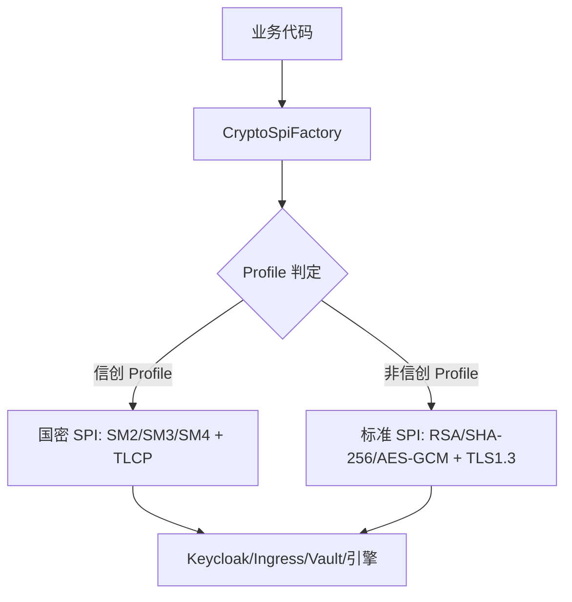
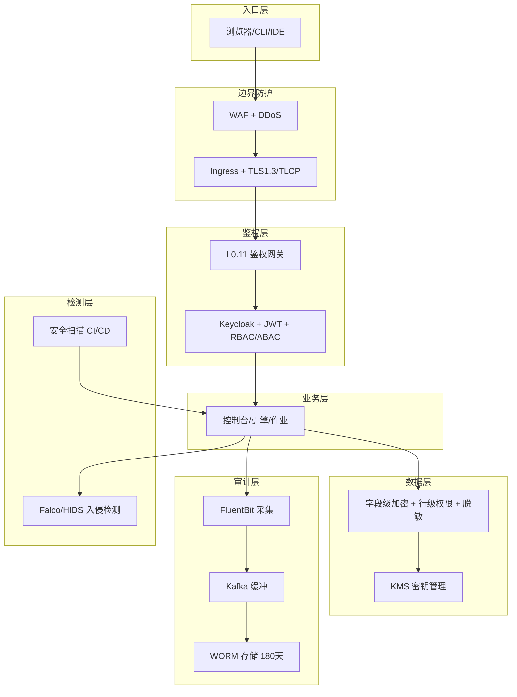

# 网络安全机制

> 归属：多平台多租户大数据平台 · 安全文档
> 版本：v1.0 ｜ 日期：2026-08-17 ｜ 状态：已完成
> 关联：`design/详细设计/多平台多租户大数据平台_安全合规详细设计_v0.1.md`（X2 安全合规）；`design/详细设计/多平台多租户大数据平台_统一身份权限详细设计_v0.1.md`（X1 身份权限）；`design/详细设计/多平台多租户大数据平台_安全脱敏详细设计_v0.1.md`（L3.7 数据安全）
> 对标：等保三级 GB/T 22239-2019 ｜ 密评 GM/T 0054-2018 ｜ 国密 GB/T 32918（SM2）/GB/T 32907（SM4）/GB/T 32905（SM3）｜ TLS1.3 RFC 8446 ｜ TLCP GB/T 38636
> 适用环境：信创（强制全启用）｜ 本地数据中心 ｜ 公有云 VM ｜ 私有云（按需启用）

---

## 1. 安全目标与威胁模型

### 1.1 安全目标

构建覆盖"云-边-端-数据-身份-审计"的纵深防御体系，达成以下目标：

- **合规达标**：信创环境一次性通过等保三级测评 + 密评，非信创按客户要求按需启用。
- **多租户强隔离**：租户间网络、存储、身份、审计四线隔离，互不可见、互不可影响。
- **全链路留痕**：操作/数据/系统三类日志 180 天 WORM 存储，可追溯、防篡改。
- **国密自主可控**：信创环境全栈国密（SM2/SM3/SM4 + TLCP），非信创可降级标准算法。
- **零信任收敛**：所有访问经 L0.11 鉴权网关，业务模块零硬编码鉴权，默认拒绝。

### 1.2 威胁模型

| 威胁 | 来源 | 影响 | 防护层 |
| --- | --- | --- | --- |
| 跨租户越权 | 恶意租户/被盗 Token | 数据泄露 | NetworkPolicy + RBAC + ABAC + 网关 claim 校验 |
| 凭据泄露 | 配置文件/代码库/日志 | 引擎被攻陷 | KMS + 字段级加密 + Secret 管理 |
| 中间人攻击 | 网络链路 | 数据被篡改/窃听 | TLS1.3/TLCP + 证书钉扎 |
| 容器逃逸 | 恶意镜像/漏洞 Pod | 主机被攻陷 | 镜像扫描 + 准入控制 + seccomp + 只读根文件系统 |
| 暴力破解 | 外部攻击者 | 账号被攻陷 | 限流 + 验证码 + 锁定 + MFA |
| 内部滥用 | 特权用户 | 数据滥用/泄露 | 最小权限 + 操作审计 + 二次审批 + 动态脱敏 |
| 供应链投毒 | 第三方依赖 | 后门植入 | 依赖扫描 + SBOM + 私有镜像仓库 + 签名准入 |
| 数据出境 | 跨境传输 | 合规违规 | 分级分类 + 出境白名单 + 实时告警 |

---

## 2. 等保三级合规落地

等保三级要求覆盖物理/网络/主机/应用/数据/管理六个层面，平台作为软件系统主要落地网络/主机/应用/数据/管理五层，物理层由客户机房负责。

### 2.1 控制项落地矩阵

| 层面 | 控制项 | 落地实现 | 关联模块 |
| --- | --- | --- | --- |
| 网络安全 | 边界防护 | K8s NetworkPolicy 租户隔离 + Ingress WAF + 出口白名单 + DDoS 防护 | L0.11 封装层、L0.7 容器网络 |
| 网络安全 | 访问控制 | RBAC + ABAC 双模型，最小权限，X1 提供 | X1 身份权限 |
| 网络安全 | 安全审计 | 统一审计中心，三类日志 180 天，§7 详述 | X2 本模块 |
| 网络安全 | 入侵防范 | HIDS Agent（信创国产）/ Falco 容器行为监控 + 入侵检测 | X2 本模块 |
| 主机安全 | 身份鉴别 | 主机 OS 等保加固基线 + SSH 密钥 + MFA | L0.1-L0.4 机器供应 |
| 主机安全 | 访问控制 | 主机防火墙 + sudo 审计 + 最小化安装 | L0 供应层 |
| 主机安全 | 安全审计 | 主机操作日志经 FluentBit 采集到审计中心 | X2 审计 |
| 主机安全 | 入侵防范 | HIDS Agent + 主机漏洞扫描 + 补丁管理 | X2 本模块 |
| 主机安全 | 恶意代码 | 镜像扫描（Trivy/国产替代）+ 签名准入 + 病毒墙 | L0.11 封装层 |
| 应用安全 | 身份鉴别 | OIDC/OAuth2.1 + MFA + SSO，X1 提供 | X1 身份权限 |
| 应用安全 | 访问控制 | RBAC + ABAC + UMA 资源授权 | X1 身份权限 |
| 应用安全 | 安全审计 | 应用操作日志全链路留痕 | X2 审计 |
| 应用安全 | 通信安全 | TLS1.3/TLCP + 证书管理 + 加密通道 | §5 网络安全 |
| 应用安全 | 入侵防范 | WAF + RASP + API 限流 + 异常检测 | L0.11 网关 |
| 数据安全 | 数据完整性 | SM3/SHA-256 哈希校验 + Iceberg 表快照 | L2.1 统一存储 |
| 数据安全 | 数据保密性 | 字段级加密 + 传输加密 + 存储加密 | §4 数据加密 |
| 数据安全 | 数据备份恢复 | 每日全量 + 增量备份 + Iceberg 快照回滚 | 运维手册 §4 |
| 管理安全 | 管理制度 | 安全管理制度 + 操作 SOP + 应急预案 | 运维手册 |
| 管理安全 | 管理人员 | 安全岗位设置 + 培训考核 + 背景审查 | 运营 |
| 管理安全 | 建设管理 | 安全建设生命周期 + 系统定级备案 | 合规看板 |
| 管理安全 | 运维管理 | 变更管理 + 漏洞管理 + 应急演练 | 运维手册 |

### 2.2 等保自检报告

平台内置等保三级自检引擎，定期扫描所有控制项落地状态，生成自检报告供测评机构参考：

```text
GET /api/compliance/v1/report/level-protection → 等保自检报告（含每控制项落地证据）
```

---

## 3. 国密算法应用

### 3.1 算法选型

| 算法 | 标准 | 用途 | 对标国际算法 |
| --- | --- | --- | --- |
| SM2 | GB/T 32918 | 非对称：数字签名/密钥交换/证书 | RSA/ECDSA |
| SM3 | GB/T 32905 | 哈希：摘要/盐/完整性 | SHA-256 |
| SM4 | GB/T 32907 | 对称：字段加密/数据加密 | AES-128 |
| TLCP | GB/T 38636 | 传输层：国密 TLS | TLS1.2 |
| GMSSL | — | 管理通道国密协议 | TLS1.3 |

### 3.2 SM2 应用场景

- **TLS 证书签名**：信创环境 Ingress + Keycloak HTTPS 证书用 SM2 签名，替代 RSA/ECC。
- **Token 签名**：JWT 签名算法用 SM2withSM3，替代 RS256/ES256。
- **密钥交换**：客户端与服务端会话密钥交换用 SM2 ECDH，替代 ECDH-P256。
- **镜像签名**：容器镜像 cosign 签名用 SM2，准入控制验证 SM2 签名。

### 3.3 SM3 应用场景

- **密码摘要存储**：用户密码加盐 SM3 摘要存储，替代 SHA-256。
- **数据完整性校验**：Iceberg 表快照、备份文件、镜像层用 SM3 校验完整性。
- **JWT 签名摘要**：SM2withSM3 签名中的摘要算法用 SM3。
- **审计日志指纹**：每条审计日志计算 SM3 指纹，链式存储防篡改。

### 3.4 SM4 应用场景

- **字段级加密**：敏感字段（手机号/身份证/银行卡）用 SM4-CBC 加密存储。
- **凭据加密**：数据源密码、API Key、TLS 私钥用 SM4 加密存入 Vault/KMS。
- **传输层加密**：TLCP 协议中对称加密用 SM4-GCM。
- **备份加密**：数据库备份、对象存储归档用 SM4 加密。

### 3.5 国密改造可插拔架构

国密改造经 **CryptoSpiFactory** 抽象，信创环境插国密、非信创插标准算法，二进制同一份：



| 用途 | 信创实现 | 非信创实现 | 替换点 |
| --- | --- | --- | --- |
| TLS 证书/签名 | SM2 证书 + TLCP | RSA/ECC + TLS1.3 | Ingress + Keycloak HTTPS |
| 密码摘要存储 | SM3 + 盐 | SHA-256 + 盐 | PasswordHashing SPI |
| Token 签名 | SM2withSM3 | RS256/ES256 | Token Signature SPI |
| 敏感字段加密 | SM4-CBC | AES-GCM | Vault/凭据加密 SPI |
| 随机数 | 国密 DRBG | SecureRandom | nonce/盐生成 |

---

## 4. 认证鉴权机制

### 4.1 Keycloak 统一身份

平台以 Keycloak 作为唯一信任源，承载认证授权，所有控制台/引擎/作业/网关均回溯到此：

- **多 IdP 联邦**：OIDC/OAuth2.1（默认）+ SAML 2.0（对接客户 IdP）+ LDAP/AD（企业域账号）+ Broker 多 IdP。
- **多租户 Realm**：sq 共享租户域（域内 client/role 隔离）+ master 平台域，强隔离。
- **身份层级**：平台管理员 → 租户管理员 → 项目管理员 → 成员，权限不跨域/跨租户/跨项目。
- **国密改造**：Keycloak SPI 注入国密加密/签名，信创环境全栈国密，二进制同一份。

### 4.2 JWT Token 体系

签发 RFC9068 JWT，claim 携带租户/组织/项目/角色/环境标签，网关据此放行：

```json
{
  "iss": "https://keycloak/sq",
  "sub": "user-uuid",
  "tenant": "tenant-001",
  "org": "org-001",
  "project": "proj-001",
  "roles": ["project-admin"],
  "env": "xinchang",
  "exp": 1735689600,
  "iat": 1735603200
}
```

- **短 TTL access Token**：30 分钟，过期重新签发。
- **滚动 refresh Token**：7 天，可撤销。
- **网关侧 introspect**：每次请求网关侧校验 Token 有效性 + 权限判定，业务侧零鉴权。
- **撤销列表**：登出/封禁 Token 加入撤销列表，网关实时同步。

### 4.3 RBAC + ABAC 混合授权

- **RBAC 层级**：租户 → 组织 → 项目 → 角色 → 权限（`module:resource:action`，如 `lake:table:write`、`dev:job:submit`）。
- **ABAC 层级**：Token claim（租户/项目/环境）+ 资源属性（归属项目、密级）做运行时判定，与 L3.7 行级权限联动（如"仅本部门 + 非密级数据"）。
- **UMA 资源授权**：高敏感资源（导出、跨租户访问）走 UMA 2.0，资源所有者在线授权，Ticket 一次性。

### 4.4 多租户隔离四线

| 隔离线 | 机制 | 实现 |
| --- | --- | --- |
| 网络隔离 | K8s NetworkPolicy | 每租户独立 Namespace，默认拒绝跨租户流量，仅白名单放行 |
| 存储隔离 | 命名空间 + 配额 + 行级权限 | 每租户独立存储路径 + ResourceQuota + Iceberg 行级过滤 |
| 身份隔离 | Realm + client/role 边界 | master 平台域与 sq 共享租户域强隔离，sq 域内 client 间靠 role 边界 |
| 审计隔离 | 审计日志租户标签 | 每条日志打 tenant 标签，跨租户查询仅平台运维审计可读 |

---

## 5. 数据加密

### 5.1 传输层加密

| 通道 | 信创 | 非信创 | 强制 |
| --- | --- | --- | --- |
| 浏览器 ↔ Ingress | TLCP + SM2 证书 | TLS1.3 + RSA/ECC 证书 | 全启用 |
| Ingress ↔ 服务 | mTLS（Istio） | mTLS（Istio） | 全启用 |
| 服务 ↔ 服务 | mTLS（Istio） | mTLS（Istio） | 全启用 |
| 服务 ↔ 数据库 | TLCP/SSL | TLS1.3/SSL | 全启用 |
| 服务 ↔ 对象存储 | TLCP/SSL | TLS1.3/SSL | 全启用 |
| 管理通道（kubectl/SSH） | GMSSL | TLS1.3/SSH | 全启用 |

> 关键约束：所有外部入口强制 HTTPS，HTTP 请求 301 跳转 HTTPS；HSTS 启用。

### 5.2 存储层加密

| 存储类型 | 加密方式 | 密钥管理 |
| --- | --- | --- |
| 数据库敏感字段 | SM4-CBC/AES-GCM 字段级加密 | KMS 主密钥 + 数据密钥两级 |
| 对象存储 | 服务端加密（SSE-KMS） | KMS 托管密钥 |
| Iceberg 表 | 字段级加密 + 表快照完整性 | KMS + SM3 校验 |
| 备份文件 | SM4/AES 全文件加密 | KMS 主密钥 |
| 审计日志 | WORM 存储 + SM3 链式指纹 | 不可改不可删 |
| Secret/凭据 | Vault/KMS 加密存储 | KMS 主密钥 |

### 5.3 密钥管理（KMS）

统一 KMS 接口，密钥分级分层，信创对接国产密码机（卫士通/信安世纪），非信创可降级软件国密（GmSSL/SwXia）：

```text
interface KmsFacade {
  genKey(spec: KeySpec); encrypt(keyId, plaintext); decrypt(keyId, ciphertext);
  sign(keyId, data); verify(keyId, data, sig); rotateKey(keyId);
}
```

- **密钥分层**：主密钥（SM2/RSA，KMS 内部）→ 数据密钥（SM4/AES，加密数据）→ 字段密钥（按字段粒度）。
- **密钥轮换**：主密钥年度轮换，数据密钥季度轮换，轮换不影响存量数据（信封加密）。
- **密钥审计**：所有密钥生成/使用/轮换/销毁操作审计留痕。
- **密钥隔离**：每租户独立密钥空间，跨租户密钥不可访问。

---

## 6. 网络安全防护

### 6.1 NetworkPolicy 租户隔离

每租户独立 K8s Namespace，默认拒绝所有入站/出站流量，仅白名单放行：

```yaml
# NetworkPolicy: 默认拒绝，仅放行同租户 + 必要出口
apiVersion: networking.k8s.io/v1
kind: NetworkPolicy
metadata:
  name: tenant-default-deny
  namespace: tenant-001
spec:
  podSelector: {}
  policyTypes: [Ingress, Egress]
  ingress:
    - from:
        - podSelector: {}           # 同租户内互通
        - namespaceSelector:
            matchLabels:
              role: gateway          # 网关入站
  egress:
    - to:
        - namespaceSelector:
            matchLabels:
              role: kube-system      # DNS/metrics
    - to:
        - ipBlock:
            cidr: 10.0.0.0/8         # 内网数据源
```

### 6.2 Cilium 网络强化

- **eBPF 数据面**：Cilium 替代 kube-proxy，高性能 + 可观测（Hubble 流量可视化）。
- **L7 策略**：Cilium L7 策略可按 HTTP 方法/路径/租户标签细粒度限流。
- **多 AZ 互通**：Cilium 跨 AZ 优化，配合集群路由实现多 AZ 高可用。

### 6.3 入侵检测

| 层面 | 工具 | 信创替代 | 检测内容 |
| --- | --- | --- | --- |
| 容器行为 | Falco | 国产 HIDS | 异常系统调用、文件访问、网络连接 |
| 主机入侵 | HIDS Agent | 国产 HIDS | 主机异常登录、提权、后门 |
| 网络入侵 | Suricata/IDS | 国产 IDS | 异常流量、攻击特征、DDoS |
| 日志分析 | ELK + 规则引擎 | 国产日志分析 | 安全事件关联分析 |

### 6.4 WAF 应用防火墙

Ingress 层部署 WAF（信创国产 WAF / 开源 ModSecurity），防护：

- SQL 注入 / XSS / 命令注入 / 路径遍历
- CC 攻击 / 暴力破解 / API 滥用
- 异常 User-Agent / 异常请求体
- 已知漏洞特征（OWASP CRS）

---

## 7. 审计日志

### 7.1 三类审计日志

| 日志类型 | 来源 | 内容 | 保留 |
| --- | --- | --- | --- |
| 操作日志 | X1/L0.11 | 登录/配置/作业提交/管理操作 | 180 天 |
| 数据日志 | L3.7/L2 | 数据访问/导出/加工/脱敏 | 180 天 |
| 系统日志 | K8s/组件 | 系统事件/异常/安全告警 | 180 天 |

### 7.2 审计日志链路

```text
审计源 → FluentBit(采集) → Kafka(缓冲) → 安全合规专用 ES/国产替代(存储) → 审计查询 API
                                                          ↓
                                                  WORM 一次写入不可改 · 180天保留
                                                          ↓
                                                  SM3 链式指纹 · 防篡改
```

### 7.3 审计日志内容

每条审计日志包含：

```json
{
  "timestamp": "2026-08-17T10:30:00Z",
  "actor": { "type": "user", "id": "u-001", "tenant": "t-001", "roles": ["project-admin"] },
  "action": "data.export",
  "resource": { "type": "table", "id": "db.t1", "classify": "sensitive" },
  "result": "success",
  "source": { "ip": "10.0.1.5", "userAgent": "console-v0.3" },
  "detail": { "rows": 1000, "approveId": "a-001" },
  "fingerprint": "SM3(prev + this)"
}
```

### 7.4 审计查询接口

```text
GET  /api/compliance/v1/audit/log?from&to&type&actor  → 审计日志查询
POST /api/compliance/v1/audit/export                    → 导出审计报告(需二次审批)
```

> 关键约束：审计日志写入 WORM 存储防篡改；导出需二次审批；查询权限仅授予合规审计员。

---

## 8. 安全扫描

### 8.1 镜像扫描

| 扫描项 | 工具 | 信创替代 | 时机 |
| --- | --- | --- | --- |
| 镜像漏洞 | Trivy | 国产镜像扫描 | CI 构建 + 准入控制 |
| 镜像签名 | cosign | 国密签名 | CI 构建后签名 |
| 镜像合规 | OPA Gatekeeper | 国产策略引擎 | 准入控制 |
| 镜像大小 | docker scan | — | CI 构建 |

### 8.2 依赖扫描

| 扫描项 | 工具 | 时机 |
| --- | --- | --- |
| Java 依赖漏洞 | OWASP Dependency-Check | CI 构建 |
| Python 依赖漏洞 | pip-audit / safety | CI 构建 |
| Node 依赖漏洞 | npm audit / Snyk | CI 构建 |
| SBOM 生成 | syft | CI 构建，归档供供应链审计 |

### 8.3 代码扫描

| 扫描项 | 工具 | 时机 |
| --- | --- | --- |
| 静态扫描 | SonarQube / Semgrep | PR 触发 |
| 密钥泄露 | git-secrets / TruffleHog | PR 触发 + pre-commit |
| 许可证合规 | license-checker | CI 构建 |
| 容器配置 | kube-score / checkov | CI 构建 |

---

## 9. 密评要求（GM/T 0054）

### 9.1 密评控制项

| 密评项 | 实现方式 | 国密算法 |
| --- | --- | --- |
| 密码算法使用 | 数据加密/签名/哈希全用国密 | SM4/SM2/SM3 |
| 密钥管理 | 统一 KMS，密钥分级分层，信创对接国产 KMS | SM2 主密钥 + SM4 数据密钥 |
| 密码协议 | 传输层 TLS 国密版本，管理通道 GMSSL | TLCP/GMSSL |
| 随机数 | 国密硬件随机数发生器（信创）/ 安全 PRNG | 符合 GM/T 0005 |
| 密码产品 | 信创环境使用商用密码产品认证组件 | 模块化可替换 |

### 9.2 密评自检报告

```text
GET /api/compliance/v1/report/crypto-assessment → 密评自检报告（含每控制项落地证据）
```

---

## 10. 多环境安全适配

| 环境 | 等保 | 密评 | 国密 | 安全组件 |
| --- | --- | --- | --- | --- |
| 信创 | 必过三级 | 必过密评 | 全启用 SM2/SM3/SM4/TLCP | 国产 HIDS/WAF/KMS/日志/IDS |
| 本地数据中心 | 按客户要求 | 按客户要求 | 按需 | 开源 HIDS/Falco/软件国密 |
| 公有云 VM | 按客户要求 | 按客户要求 | 按需 | 复用客户云安全组件可选 |
| 私有云 | 按客户要求 | 按客户要求 | 按需 | 开源/厂商组件按需 |

> 关键约束：信创环境强制启用全部安全能力且必须使用国产等效组件；非信创按需启用，但数据合规（分级分类/出境管控）与审计留痕全环境强制启用。

---

## 11. 安全架构总览



---

## 12. 风险与对策

| 风险 | 影响 | 对策 |
| --- | --- | --- |
| 国密组件性能低于国际算法 | 加密吞吐不足 | 热点数据用 SM4 硬件加速；非敏感数据不强制加密 |
| 等保测评标准更新 | 落地偏差 | SecurityFacade 抽象 + 合规项可配置，按新版标准更新检查清单 |
| 审计日志量巨大 | 存储成本高、查询慢 | Kafka 缓冲 + 分区存储 + 冷热分离，180 天后归档冷存 |
| 信创国产组件兼容性 | 功能缺失或行为差异 | 接口层做能力探测，缺失能力降级 + 告警，保持接口一致 |
| 跨租户越权 | 数据泄露 | NetworkPolicy + RBAC + ABAC + 网关 claim 强校验四线隔离 |
| 凭据泄露 | 引擎被攻陷 | KMS + 字段级加密 + Secret 管理 + 定期轮换 |
| 供应链投毒 | 后门植入 | 依赖扫描 + SBOM + 私有镜像仓库 + 签名准入 |

---

## 13. 与 UI 的对应

控制台 v0.3「安全合规」页（审计日志查询、合规自检报告、数据分级标注、出境合规校验）、「身份权限」页（用户/角色/组织管理、登录策略、IdP 对接）、运营后台合规看板（等保/密评自检状态、安全告警、合规证据导出）、登录页（多 IdP 入口、SM2 证书登录）均基于本安全机制。本文件是其安全侧契约依据。