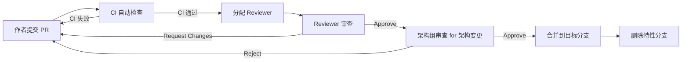

# Code Review 规范

> 归属：多平台多租户大数据平台 · 开发规范文档
> 版本：v1.0 ｜ 日期：2026-08-18 ｜ 状态：已完成
> 关联：`design/开发规范/编码规范.md`；`design/开发规范/分支策略.md`；`design/开发规范/提交规范.md`
> 适用范围：全平台代码 PR Review，含后端 / 前端 / 部署 / 数据开发 / 文档

---

## 1. 总则

### 1.1 目标

建立统一的 Code Review 标准与流程，确保：

- **质量前置**：缺陷在合并前发现，禁止"先合并再修"。
- **知识共享**：Reviewer 与作者互相学习，避免单点知识孤岛。
- **架构守护**：架构边界、依赖方向在 Review 阶段守护，避免架构腐化。
- **安全合规**：等保三级要求所有变更经第二人审查，Review 即审计证据。

### 1.2 适用范围

- 任意合并到 `main` / `release/*` 的 PR 必须经过 Review。
- 文档变更同样需要 Review（至少 1 名 Reviewer）。
- 紧急热修复走快速通道，但事后 24h 内必须补 Review。

### 1.3 原则

1. **对事不对人**：评论针对代码，禁止针对作者个人。
2. **尊重作者**：作者已思考过方案，Reviewer 须先理解再质疑。
3. **明确具体**：评论须指明行号 + 问题 + 建议，禁止"这里不好"模糊评论。
4. **区分必须与建议**：必须修改用 `[Must]`，建议修改用 `[Suggest]`，提问用 `[Q]`。
5. **及时响应**：Review 24h 内响应，作者 24h 内回复，超时升级。

---

## 2. Review 流程

### 2.1 完整流程



### 2.2 Reviewer 分配

| PR 类型 | Reviewer 数 | Reviewer 来源 | 备注 |
| --- | --- | --- | --- |
| 模块内变更 | 1 | 模块 owner 团队 | — |
| 跨模块变更 | 2 | 各模块 owner 各 1 | — |
| 架构变更 | 2 | 1 模块 owner + 1 架构组 | 含依赖方向、接口契约 |
| 安全敏感变更 | 3 | 1 模块 owner + 1 安全组 + 1 架构组 | 含认证、加密、权限 |
| 文档变更 | 1 | 文档 owner 或对应模块 owner | — |
| 热修复 | 1 | 模块 owner（事后补 1 架构组） | 紧急通道 |

### 2.3 时限要求

| 阶段 | 时限 | 超时处理 |
| --- | --- | --- |
| 首次 Review 响应 | 4 工作小时 | 自动提醒，8h 升级到组长 |
| 作者回复修改 | 24 工作小时 | 超时 PR 标记 stale，7 天未更新自动关闭 |
| 二次 Review 响应 | 2 工作小时 | 同首次 |

---

## 3. Review 检查清单

### 3.1 通用检查项

| 维度 | 检查项 | 严重级别 |
| --- | --- | --- |
| 设计 | 变更是否符合需求 / Issue 关联 | High |
| 设计 | 是否遵循单一职责、模块边界 | Medium |
| 设计 | 是否引入不必要的复杂度 | Medium |
| 可读性 | 命名是否清晰表达意图 | Medium |
| 可读性 | 注释是否解释"为什么"而非"是什么" | Low |
| 可读性 | 是否有 dead code / 注释掉的代码 | High |
| 正确性 | 是否处理边界条件（null、空集合、越界） | High |
| 正确性 | 是否处理异常路径 | High |
| 正确性 | 是否有并发安全问题 | High |
| 测试 | 是否有对应的单元测试 | High |
| 测试 | 测试是否覆盖正常 + 异常路径 | Medium |
| 测试 | 测试是否独立可重复 | Medium |
| 性能 | 是否引入 N+1 查询 | High |
| 性能 | 是否在循环中执行 IO | High |
| 性能 | 集合操作是否合理（容量、流式） | Low |
| 安全 | 是否有 SQL 注入 / XSS / 命令注入风险 | Critical |
| 安全 | 敏感数据是否脱敏 | High |
| 安全 | 权限校验是否完整 | High |
| 安全 | 依赖是否引入已知 CVE | High |
| 兼容性 | 接口变更是否向后兼容 | High |
| 兼容性 | 数据库变更是否兼容存量数据 | High |
| 文档 | 公有 API 是否更新文档 | Medium |
| 文档 | CHANGELOG 是否更新 | Low |

### 3.2 后端专项（Java/Python）

- 事务边界是否合理（Service 层，禁止 Controller 事务）。
- 异常是否使用领域自定义异常，禁止 RuntimeException 透传业务语义。
- 日志是否带 traceId / tenantId 上下文。
- 数据库操作是否使用预编译参数绑定。
- 缓存是否设置合理 TTL 与容量上限。
- 异步任务是否有超时 + 失败重试 + 幂等保证。

### 3.3 前端专项（Vue/TS）

- 是否使用 Composition API + `<script setup lang="ts">`。
- Props/Emits 是否使用泛型声明。
- 是否避免 `any` 与 `@ts-ignore`。
- 样式是否使用 scoped + 设计系统 CSS 变量。
- 是否有内存泄露风险（事件监听、定时器、WebSocket 未清理）。
- 是否处理 loading / error / empty 三态。
- 是否符合 WCAG 2.1 AA（键盘可达、ARIA 语义）。

### 3.4 部署专项（Helm/K8s）

- values 是否覆盖 dev/staging/prod 三环境。
- 资源 requests/limits 是否设置合理。
- 是否配置 readiness/liveness probe。
- 是否配置 PodDisruptionBudget。
- 是否配置 HorizontalPodAutoscaler。
- 镜像是否使用不可变 tag，禁止 `latest`。
- Secret 是否使用 SealedSecret 或 Vault，禁止明文。

### 3.5 数据开发专项（SQL）

- 是否遵循分层建模规范（ODS/DWD/DWS/ADS）。
- 是否带分区谓词，禁止全表扫描。
- 是否避免 SELECT *。
- 是否有对应的字段血缘维护。
- 是否考虑数据回滚方案。

---

## 4. 评论规范

### 4.1 评论格式

```text
[级别] [维度] 问题描述
  建议修改为：xxx
  原因：xxx
```

### 4.2 级别定义

| 标记 | 含义 | 处理 |
| --- | --- | --- |
| `[Critical]` | 安全/数据丢失风险 | 必须修改，禁止合并 |
| `[Must]` | 必须修改才能合并 | 必须修改 |
| `[Suggest]` | 建议修改 | 作者决定，可拒绝并说明 |
| `[Q]` | 提问 | 作者必须回答 |
| `[Nit]` | 吹毛求疵（拼写、格式） | 作者可选 |

### 4.3 评论示例

✅ 好的评论：

```text
[Must] [性能] UserRepo.java:45 在循环中调用 findById，存在 N+1 查询。
  建议修改为：批量查询后用 Map 组装。
  原因：用户列表场景 N=100 时会产生 101 次 DB 查询，P99 > 1s。
```

❌ 不好的评论：

```text
这里写得不好，改一下。
```

### 4.4 作者回复规范

- 对每条评论必须响应（采纳 / 拒绝 + 理由 / 已修复 + commit hash）。
- 拒绝 `[Must]` 评论须提供等价替代方案并经 Reviewer 确认。
- 修复后 push 新 commit，禁止 force push 覆盖已 Review 的 commit（除非 Reviewer 要求 rebase）。

---

## 5. 自动化辅助

### 5.1 自动化检查（CI 阶段）

| 工具 | 检查内容 | 失败处理 |
| --- | --- | --- |
| spotless / black / prettier | 格式化 | 自动修复提示 |
| checkstyle / flake8 / eslint | Lint | 失败 |
| spotbugs / bandit | 静态分析 | 失败 |
| trivy / snyk | 依赖 CVE | 高危失败 |
| jacoco / pytest-cov | 覆盖率 | < 80% 失败 |
| license-check | 许可证合规 | 失败 |

### 5.2 AI 辅助 Review

- 使用 AI Code Review Bot 进行初筛，标记可疑代码。
- AI Bot 评论带 `[AI]` 前缀，作者可批量 dismiss 低价值评论。
- AI Bot 不得作为 Reviewer 计数，仅辅助人工 Review。

---

## 6. 评审记录与度量

### 6.1 评审记录

- PR 合并后自动归档到 `reviews/<yyyy-mm>/<pr-id>.md`。
- 记录包含：PR 元信息、Reviewer、评论数、合并时长、是否引入回滚。

### 6.2 度量指标

| 指标 | 目标 | 度量方式 |
| --- | --- | --- |
| PR Review 覆盖率 | 100% | 所有合并 PR 均有 Review |
| 平均 Review 评论数 | 3-15 条/PR | 过少可能流于形式，过多可能 PR 过大 |
| Review 引发回滚率 | < 5% | Review 通过后仍回滚的比例 |
| Critical 评论占比 | < 5% | Critical 评论数 / 总评论数 |
| Review 时长中位数 | < 4h | 首次响应到合并 |

---

## 7. 反模式

### 7.1 Reviewer 反模式

- ❌ "LGTM" 一词合并，未实际审查。
- ❌ 只看 diff 不看上下文，遗漏设计问题。
- ❌ 评判作者而非代码。
- ❌ 在 PR 中讨论与代码无关的话题。
- ❌ 一次性提 50+ 评论，让作者崩溃。

### 7.2 作者反模式

- ❌ 超大 PR（> 1000 行），难以 Review。
- ❌ 不写 PR 描述，让 Reviewer 猜意图。
- ❌ 不关联 Issue，无法追溯需求。
- ❌ force push 覆盖已 Review commit。
- ❌ 对评论只回 "已改" 不说怎么改。

---

## 8. 版本与变更

| 版本 | 日期 | 变更内容 | 作者 |
| --- | --- | --- | --- |
| v1.0 | 2026-08-18 | 首次发布，覆盖流程 + 检查清单 + 评论规范 | 文档工程师 |

> 本规范由架构组维护，每半年评审一次。规范变更须走 RFC 流程。