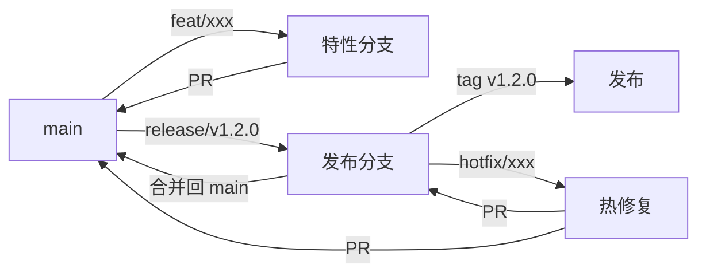

# 分支策略与发布流程

> 归属：多平台多租户大数据平台 · 开发规范文档
> 版本：v1.0 ｜ 日期：2026-08-18 ｜ 状态：已完成
> 关联：`design/开发规范/编码规范.md`；`design/开发规范/提交规范.md`；`design/开发规范/CodeReview规范.md`；`design/部署/灰度发布方案.md`
> 适用范围：全平台代码仓库（后端 / 前端 / 部署 / 文档 / 数据开发）

---

## 1. 总则

### 1.1 目标

建立统一的分支模型与发布流程，确保：

- **并行开发**：多团队多特性并行不冲突。
- **持续可发布**：主分支任意 commit 都可构建可部署。
- **质量可控**：变更必过 CI + Code Review，禁止带病合并。
- **可追溯**：每个发布版本可追溯到具体的 commit 集合与变更范围。
- **回滚快速**：任意发布可在 15 分钟内回滚到上一稳定版本。

### 1.2 适用仓库

| 仓库 | 主分支 | 发布方式 | 备注 |
| --- | --- | --- | --- |
| `DataEngineBDP` | `main` | Helm + ArgoCD GitOps | 后端主仓 |
| `frontend` | `main` | Vite build + CDN | 前端主仓 |
| `deploy` | `main` | ArgoCD Application | 部署清单 |
| `data` | `main` | DMS 调度 | 数据开发 |

---

## 2. 分支模型

### 2.1 分支类型

采用 **GitHub Flow + Release Branch** 混合模型：

| 分支 | 命名 | 来源 | 生命周期 | 用途 |
| --- | --- | --- | --- | --- |
| 主分支 | `main` | — | 永久 | 可发布稳定代码 |
| 特性分支 | `feat/<issue-id>-<short-desc>` | `main` | 合并即删 | 新功能开发 |
| 修复分支 | `fix/<issue-id>-<short-desc>` | `main` | 合并即删 | Bug 修复 |
| 重构分支 | `refactor/<issue-id>-<short-desc>` | `main` | 合并即删 | 重构 |
| 热修复分支 | `hotfix/<issue-id>-<short-desc>` | `release/*` 或 `main` | 合并即删 | 生产紧急修复 |
| 发布分支 | `release/v<x.y.z>` | `main` | 发布后保留 | 发布准备 |
| 标签 | `v<x.y.z>` | `release/*` | 永久 | 版本快照 |

### 2.2 命名约定

- `<issue-id>`：GitHub Issue 编号，如 `422`。
- `<short-desc>`：小写中划线，不超过 4 个单词，如 `doc-review-record`。
- 完整示例：`feat/422-doc-review-record`、`hotfix/501-tenant-leak`。

### 2.3 分支保护规则

`main` 与 `release/*` 分支必须配置保护规则：

1. 禁止直接 push，必须通过 PR 合并。
2. 必须至少 2 个 Reviewer 批准（含 1 名架构组成员 for 架构变更）。
3. 必过 CI 全部门禁（lint + unit + integration + 安全扫描）。
4. 分支必须保持最新（合并前须 rebase 或 merge 最新 main）。
5. 强制线性历史（禁止 merge commit，使用 squash merge）。

### 2.4 分支生命周期



---

## 3. 工作流

### 3.1 特性开发工作流

```bash
# 1. 拉取最新 main
git checkout main && git pull --rebase

# 2. 创建特性分支
git checkout -b feat/422-doc-review-record

# 3. 开发 + 提交（遵循提交规范）
git commit -m "feat(doc): 新增文档评审记录模块"

# 4. 推送 + 创建 PR
git push -u origin feat/422-doc-review-record
gh pr create --base main --title "..." --body "..."

# 5. CI 通过 + Review 通过 + Squash Merge
# 6. 删除特性分支
git branch -d feat/422-doc-review-record
```

### 3.2 发布工作流

```bash
# 1. 从 main 拉起发布分支
git checkout main && git pull --rebase
git checkout -b release/v1.2.0

# 2. 仅允许 bug fix / 文档 / 测试变更，禁止新特性
# 3. 发布准备：版本号、CHANGELOG、文档同步
git commit -m "chore(release): v1.2.0 准备"

# 4. CI 全量门禁通过 → 打 tag
git tag -a v1.2.0 -m "Release v1.2.0"
git push origin v1.2.0

# 5. ArgoCD 监听 tag 触发灰度发布
# 6. 发布成功后合并回 main
git checkout main && git merge --no-ff release/v1.2.0
git push origin main
```

### 3.3 热修复工作流

```bash
# 1. 从受影响的 release 分支或 main 拉起
git checkout -b hotfix/501-tenant-leak release/v1.2.0

# 2. 最小修复 + 测试
git commit -m "fix(tenant): 修复租户上下文泄露 (fixes #501)"

# 3. PR + Review（紧急通道：1 名 Reviewer + 架构组确认）
# 4. 打补丁版本 tag
git tag -a v1.2.1 -m "Hotfix v1.2.1"
git push origin v1.2.1

# 5. 必须合并回 main，避免回归
git checkout main && git merge --no-ff hotfix/501-tenant-leak
```

---

## 4. 版本号策略

采用 **Semantic Versioning 2.0**：

```text
v<MAJOR>.<MINOR>.<PATCH>
   │       │       │
   │       │       └── 向后兼容的 bug 修复
   │       └────────── 向后兼容的新功能
   └────────────────── 不兼容的破坏性变更
```

### 4.1 版本号变更规则

| 变更类型 | 版本号变更 | 示例 |
| --- | --- | --- |
| Bug 修复 | PATCH + 1 | v1.2.0 → v1.2.1 |
| 新功能（向后兼容） | MINOR + 1, PATCH = 0 | v1.2.1 → v1.3.0 |
| 破坏性变更 | MAJOR + 1, MINOR = 0, PATCH = 0 | v1.3.0 → v2.0.0 |
| 预发布 | 加后缀 `-alpha` / `-beta` / `-rc` | v2.0.0-rc.1 |

### 4.2 各模块版本独立

- 后端服务、前端、部署清单各自独立版本号。
- 跨模块兼容性约束在 `release/v<x.y.z>` 分支的 README 中声明。

---

## 5. 发布通道

### 5.1 通道定义

| 通道 | 触发条件 | 环境 | 流量 | 持续时间 |
| --- | --- | --- | --- | --- |
| dev | 任意 PR 合并 | dev | 0% | 立即 |
| staging | 主分支每日构建 | staging | 0% | 每日 |
| rc | `v<x.y.z>-rc.N` tag | rc | 内测 5% | 24-72h |
| prod-canary | `v<x.y.z>` tag | prod | 灰度 1% → 10% → 50% → 100% | 6-24h |
| prod-stable | 灰度 100% 观察 24h | prod | 100% | 永久 |

### 5.2 灰度发布策略

详见 `design/部署/灰度发布方案.md`。关键约束：

1. 灰度比例只能单调递增，禁止回退后再前进。
2. 灰度期间任意 SLO 告警触发自动暂停，需人工介入。
3. 灰度 100% 后观察 24h 无 P0/P1 事故方可标记为 stable。

### 5.3 回滚策略

| 场景 | 回滚方式 | 时限 |
| --- | --- | --- |
| 灰度阶段异常 | ArgoCD 一键回滚到上一 stable | 5 分钟 |
| 生产稳定后异常 | 重新发布上一 stable tag | 15 分钟 |
| 数据迁移类异常 | 走数据回滚 SOP | 视迁移规模 |

---

## 6. CI/CD 流水线

### 6.1 PR 阶段流水线

```yaml
on: pull_request
jobs:
  lint:        # 格式 + Lint
  unit-test:   # 单元测试 + 覆盖率
  integration: # 集成测试
  security:    # SAST + 依赖扫描 + 镜像扫描
  build:       # 构建产物（不推送）
  docs:        # 文档构建 + 链接检查
```

### 6.2 主分支流水线

```yaml
on: push to main
jobs:
  build-and-push:  # 构建镜像 + 推送 dev registry
  deploy-dev:      # 部署到 dev 环境
  e2e-dev:         # E2E 测试
  nightly-trigger: # 触发 staging 部署
```

### 6.3 发布流水线

```yaml
on: tag v<x.y.z>
jobs:
  release-build:   # 正式镜像构建 + 签名 + SBOM
  security-gate:   # 安全门禁（CVE + 签名验证）
  deploy-rc:       # 部署到 rc 环境
  approval-gate:   # 人工审批
  canary-deploy:   # 灰度部署 prod
```

---

## 7. 多团队协作

### 7.1 分支所有权

- 每个模块有明确 owner 团队，PR 必须由 owner 团队成员 Review。
- 跨模块变更需相关团队联合 Review，至少 1 名架构组确认。

### 7.2 长期特性分支

- 禁止长期特性分支（> 1 周须拆分为多个小 PR）。
- 大特性使用 feature flag 控制开关，分批合并到 main。

### 7.3 冲突解决

- 优先 rebase 而非 merge，保持线性历史。
- 冲突由分支作者负责解决，禁止 Reviewer 代为解决冲突后合并。

---

## 8. 度量指标

| 指标 | 目标 | 度量方式 |
| --- | --- | --- |
| PR 合并时长（中位数） | < 24h | GitHub Insights |
| PR Review 时长（中位数） | < 4h | GitHub Insights |
| 主分支构建成功率 | > 95% | CI 平台 |
| 发布频率 | ≥ 1 次/周 | Release tag 数 |
| 发布回滚率 | < 5% | Release 记录 |
| 热修复次数 | < 1 次/月 | Hotfix 分支数 |

---

## 9. 版本与变更

| 版本 | 日期 | 变更内容 | 作者 |
| --- | --- | --- | --- |
| v1.0 | 2026-08-18 | 首次发布，覆盖分支模型 + 发布流程 + 灰度策略 | 文档工程师 |

> 本规范由 DevOps 组维护，每季度评审一次。规范变更须走 RFC 流程。