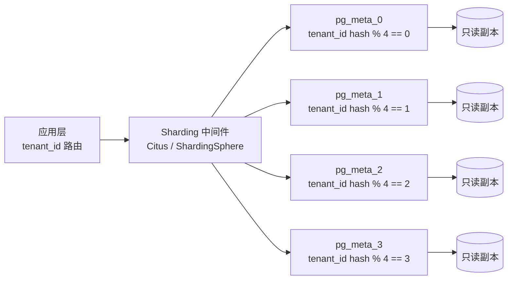

# 平台元数据库设计

> 文档定位：DataEngineBDP 多平台多租户湖仓集一体大数据平台**控制面元数据库**建模规范。
>
> 适用范围：平台自身运行所需的元数据（租户、项目、数据源、作业调度、API 网关、知识库、LLMOps、MLOps、数据资产、行业模板、安全策略、主数据标准等）持久化设计。**不**涉及数据湖中 Iceberg 业务数据表（业务表见《湖仓存储建模规范.md》《数据仓库分层建模.md》）。
>
> 关联文档：《多平台多租户大数据平台_产品原型设计_v0.4.md》§5.4 封装层、§11 多租户模型；《V2.0_行业模板与其他增强详细设计.md》§1.5 多租户与安全通用约束。

## 第1章 设计目标与原则

### 1.1 设计目标

平台元数据库承担**控制面状态持久化**职责，是平台控制台、运营后台、LLMOps、MLOps、数据资产目录等模块的"账本"。其核心目标：

1. **租户强隔离**：所有业务表均含 `tenant_id` 字段，应用层强制按租户过滤，数据库层通过索引与行级安全策略双重保障。
2. **多环境一致**：开发环境 H2 内存库、生产环境 PostgreSQL，DDL 通过 Spring Data JPA `jakarta.persistence` 注解自动生成，确保两端 schema 一致。
3. **可演进**：schema 演进通过 Flyway/Liquibase 版本化脚本管理，禁止破坏性变更（不改列名、不改类型、不删列）。
4. **可观测**：所有表含 `created_at` / `updated_at` 审计字段，关键操作落审计表。
5. **高性能**：按租户 ID 建索引，热查询路径覆盖 `(tenant_id, status)`、`(tenant_id, name)` 等组合索引。

### 1.2 设计原则

| 原则 | 说明 |
| --- | --- |
| 单表单职责 | 一张表只描述一个实体，避免大宽表；JSON 字段仅用于"完整契约透传"（如 `full_json`），不破坏范式 |
| 主键统一 | 自增 `BIGINT id` 作物理主键；业务唯一键（如 `apiKey`、`taskId`）加 `UNIQUE` 约束 |
| 租户列强制非空 | 所有租户隔离表 `tenant_id VARCHAR(64) NOT NULL`，禁止跨租户 NULL 行 |
| 时间统一 `Instant` | Java 侧统一 `java.time.Instant`（UTC），数据库侧 `TIMESTAMP WITH TIME ZONE`（PostgreSQL）/ `TIMESTAMP`（H2） |
| 敏感字段不回显 | 密码、secret hash 等字段仅写入时使用，查询时 DTO 层显式排除 |

### 1.3 数据库选型

| 环境 | 数据库 | 版本 | 用途 | 说明 |
| --- | --- | --- | --- | --- |
| 开发 / 单元测试 | H2 | 2.x | 内存 / 文件模式 | 启动快，JPA ddl-auto=update 自动建表；兼容 PostgreSQL 方言 |
| 集成测试 | PostgreSQL | 15+ | Testcontainers | 与生产同构验证 |
| 生产 | PostgreSQL | 15+ | 主库 + 只读副本 | 主写从读，PgBouncer 连接池，流复制高可用 |
| 灾备 | PostgreSQL | 15+ | 异地流复制 | RPO ≤ 5min，RTO ≤ 30min |

**选型理由**：
- PostgreSQL 原生 `JSONB` 支撑 `full_json` 字段的高效查询与索引（`GIN` 索引）。
- `TIMESTAMP WITH TIME ZONE` 与 Java `Instant` 双向无损映射。
- 行级安全（RLS）可作为租户隔离的数据库层兜底，与应用层过滤形成纵深防御。
- H2 PostgreSQL Mode 让本地开发零依赖启动，CI 与生产同构验证通过 Testcontainers 完成。

## 第2章 表清单与全局 ER 图

### 2.1 表清单

平台元数据库共 **18 张表**，按业务域分组：

| 域 | 表名 | JPA Entity | 说明 |
| --- | --- | --- | --- |
| 租户 | `tenants` | `Tenant` | 租户主表 |
| 工作空间 | `project` | `ProjectEntity` | 租户内项目（业务域） |
| 数据源 | `datasource` | `DataSourceEntity` | 外部数据源连接元数据 |
| 数据集成 | `sync_task` | `SyncTaskEntity` | SeaTunnel 同步任务 |
| 数据开发 | `develop_schedule` | `DevelopScheduleEntity` | Web IDE 提交的 cron 调度 |
| API 网关 | `gateway_api_key` | `ApiKeyEntity` | 网关 API Key |
| API 目录 | `api_definition` | `ApiDefinitionEntity` | 开放 API 定义 |
| 数据资产 | `data_asset` | `AssetEntity` | 资产目录 |
| 知识库 | `knowledge_base` | `KnowledgeBaseEntity` | 知识库 |
| 知识库 | `knowledge_document` | `KnowledgeDocumentEntity` | 知识库文档 |
| 知识库 | `knowledge_rag_strategy` | `RagStrategyEntity` | RAG 策略（每租户一条） |
| LLMOps | `llm_eval_metric` | `EvalMetricEntity` | 大模型评估指标 |
| LLMOps | `llm_finetune_task` | `FinetuneTaskEntity` | 大模型微调任务 |
| MLOps | `ml_model` | `MlModelEntity` | 机器学习模型注册 |
| MLOps | `ml_inference_service` | `InferenceServiceEntity` | 推理服务 |
| 行业模板 | `industry_template` | `TemplateEntity` | 行业应用模板 |
| 安全合规 | `sec_mask_policy` | `MaskPolicyEntity` | 数据脱敏策略 |
| 主数据 | `standard` | `StandardEntity` | 主数据标准 |

### 2.2 全局 ER 图

```mermaid
erDiagram
    tenants ||--o{ project : "1:N owns"
    tenants ||--o{ datasource : "1:N owns"
    tenants ||--o{ sync_task : "1:N owns"
    tenants ||--o{ develop_schedule : "1:N owns"
    tenants ||--o{ gateway_api_key : "1:N owns"
    tenants ||--o{ api_definition : "1:N owns"
    tenants ||--o{ data_asset : "1:N owns/publishes"
    tenants ||--o{ knowledge_base : "1:N owns"
    tenants ||--|| knowledge_rag_strategy : "1:1 configures"
    tenants ||--o{ llm_eval_metric : "1:N owns"
    tenants ||--o{ llm_finetune_task : "1:N owns"
    tenants ||--o{ ml_model : "1:N owns"
    tenants ||--o{ ml_inference_service : "1:N owns"
    tenants ||--o{ industry_template : "1:N owns/installs"
    tenants ||--o{ sec_mask_policy : "1:N owns"
    tenants ||--o{ standard : "1:N owns"

    knowledge_base ||--o{ knowledge_document : "1:N contains"
    project ||--o{ develop_schedule : "1:N schedules"
    project ||--o{ datasource : "1:N references"
    ml_model ||--o{ ml_inference_service : "1:N serves (name+version)"
    llm_finetune_task ||--|| ml_model : "1:1 produces (model_name)"
    data_asset }o--|| tenants : "N:1 owner tenant"

    tenants {
        BIGINT id PK
        VARCHAR name UK
        VARCHAR display_name
        VARCHAR namespace
        VARCHAR quota_profile
        VARCHAR status
        TIMESTAMP created_at
        TIMESTAMP updated_at
    }
    project {
        BIGINT id PK
        VARCHAR name
        VARCHAR domain
        VARCHAR status
        INT datasets
        INT jobs
        VARCHAR tenant_id FK
        TIMESTAMP created_at
    }
    datasource {
        BIGINT id PK
        VARCHAR name
        VARCHAR type
        VARCHAR host
        INT port
        VARCHAR username
        VARCHAR password
        VARCHAR status
        VARCHAR tenant_id FK
        TIMESTAMP created_at
    }
    sync_task {
        BIGINT id PK
        VARCHAR name
        VARCHAR source_type
        VARCHAR target_type
        VARCHAR schedule
        VARCHAR status
        VARCHAR seatunnel_job_id
        VARCHAR tenant_id FK
        TIMESTAMP created_at
    }
    develop_schedule {
        BIGINT id PK
        VARCHAR file_path
        VARCHAR schedule
        VARCHAR engine
        VARCHAR status
        VARCHAR dependencies
        VARCHAR tenant_id FK
        TIMESTAMP created_at
    }
    gateway_api_key {
        BIGINT id PK
        VARCHAR name
        VARCHAR route_model
        INT rate_limit
        VARCHAR status
        VARCHAR api_key UK
        VARCHAR secret_hash
        VARCHAR scope
        VARCHAR tenant_id FK
        TIMESTAMP created_at
    }
    api_definition {
        BIGINT id PK
        VARCHAR name
        VARCHAR version
        VARCHAR method
        VARCHAR path
        VARCHAR status
        VARCHAR full_json
        VARCHAR tenant_id FK
        TIMESTAMP created_at
    }
    data_asset {
        BIGINT id PK
        VARCHAR name
        VARCHAR type
        VARCHAR owner
        VARCHAR status
        INT quality_score
        VARCHAR security_level
        VARCHAR full_json
        VARCHAR tenant_id FK
        TIMESTAMP created_at
    }
    knowledge_base {
        BIGINT id PK
        VARCHAR name
        INT doc_count
        VARCHAR chunk_strategy
        VARCHAR retrieval
        VARCHAR status
        VARCHAR tenant_id FK
        TIMESTAMP created_at
    }
    knowledge_document {
        BIGINT id PK
        BIGINT knowledge_base_id FK
        VARCHAR file_name
        BIGINT file_size
        VARCHAR file_type
        VARCHAR storage_path
        INT chunk_count
        INT vector_count
        VARCHAR status
        VARCHAR tenant_id FK
        TIMESTAMP uploaded_at
    }
    knowledge_rag_strategy {
        BIGINT id PK
        VARCHAR tenant_id UK_FK
        INT top_k
        DOUBLE score_threshold
        VARCHAR reranker_model
        BOOLEAN citation_enabled
        VARCHAR chunk_strategy
        VARCHAR retrieval_method
        TIMESTAMP created_at
    }
    llm_eval_metric {
        BIGINT id PK
        VARCHAR model_name
        VARCHAR model_version
        VARCHAR eval_type
        DOUBLE accuracy
        DOUBLE hallucination_rate
        DOUBLE base_lift_pt
        VARCHAR dataset
        VARCHAR detail_json
        VARCHAR tenant_id FK
        TIMESTAMP created_at
    }
    llm_finetune_task {
        BIGINT id PK
        VARCHAR task_id UK
        VARCHAR model_name
        VARCHAR base_model
        VARCHAR training_data
        VARCHAR gpu_config
        INT epochs
        VARCHAR status
        INT progress
        VARCHAR tenant_id FK
        TIMESTAMP submitted_at
    }
    ml_model {
        BIGINT id PK
        VARCHAR name
        VARCHAR algorithm
        VARCHAR version
        VARCHAR status
        VARCHAR metrics_json
        VARCHAR train_job_id
        VARCHAR model_path
        VARCHAR tenant_id FK
        TIMESTAMP registered_at
    }
    ml_inference_service {
        BIGINT id PK
        VARCHAR service_name
        VARCHAR model_name
        VARCHAR model_version
        VARCHAR status
        INT replicas
        INT desired_replicas
        DOUBLE qps
        DOUBLE latency_ms
        VARCHAR endpoint
        VARCHAR tenant_id FK
        TIMESTAMP deployed_at
    }
    industry_template {
        BIGINT id PK
        VARCHAR name
        VARCHAR industry
        VARCHAR version
        VARCHAR status
        INT install_count
        VARCHAR full_json
        VARCHAR tenant_id FK
        TIMESTAMP created_at
    }
    sec_mask_policy {
        BIGINT id PK
        VARCHAR field_name
        VARCHAR asset_name
        VARCHAR strategy
        VARCHAR algorithm
        VARCHAR status
        VARCHAR tenant_id FK
        TIMESTAMP created_at
    }
    standard {
        BIGINT id PK
        VARCHAR name
        VARCHAR type
        VARCHAR rule
        VARCHAR description
        VARCHAR status
        VARCHAR tenant_id FK
        TIMESTAMP created_at
    }
```

### 2.3 关系基数说明

| 关系 | 基数 | 实现方式 |
| --- | --- | --- |
| `tenants` → 其他业务表 | 1:N | 业务表 `tenant_id` 列 + 应用层过滤；PostgreSQL RLS 兜底 |
| `knowledge_base` → `knowledge_document` | 1:N | `knowledge_document.knowledge_base_id` 外键 + 索引 |
| `project` → `develop_schedule` | 1:N | 逻辑关联（`develop_schedule.file_path` 隶属项目工作空间），无物理外键 |
| `project` → `datasource` | 1:N | 逻辑关联（数据源在项目工作空间内创建） |
| `ml_model` → `ml_inference_service` | 1:N | 通过 `(model_name, model_version)` 业务键关联，非物理外键 |
| `llm_finetune_task` → `ml_model` | 1:1 | 微调产出的模型 `model_name` 写入 `ml_model.name`，逻辑关联 |
| `tenants` → `knowledge_rag_strategy` | 1:1 | `knowledge_rag_strategy.tenant_id` 唯一约束 |
| `data_asset` → `tenants` | N:1 | `data_asset.owner` 为提供方租户 ID |

> **物理外键策略**：除 `knowledge_document.knowledge_base_id` 外，其余跨表关系**不建物理外键**，原因：① 多租户分库后外键跨库无法建立；② 应用层已强制校验；③ 避免级联删除带来的运维风险。关系通过**索引 + 应用层校验**保障。

## 第3章 表字段详细设计

### 3.1 tenants — 租户主表

| 字段 | 类型 | 约束 | 说明 |
| --- | --- | --- | --- |
| `id` | BIGINT | PK, AUTO_INCREMENT | 租户唯一标识 |
| `name` | VARCHAR(128) | NOT NULL, UNIQUE | 租户名称（逻辑唯一） |
| `display_name` | VARCHAR(256) | NULL | 展示名称 |
| `namespace` | VARCHAR(64) | NULL | K8s Namespace 名 |
| `quota_profile` | VARCHAR(32) | NULL | 配额档位：small/medium/large |
| `status` | VARCHAR(16) | NOT NULL | ACTIVE/INACTIVE/CREATING/DELETING |
| `created_at` | TIMESTAMP | NOT NULL | 创建时间 |
| `updated_at` | TIMESTAMP | NULL | 最近更新时间 |

**索引**：`uk_tenants_name (name) UNIQUE`。

### 3.2 project — 项目表

| 字段 | 类型 | 约束 | 说明 |
| --- | --- | --- | --- |
| `id` | BIGINT | PK | 自增主键 |
| `name` | VARCHAR(128) | NOT NULL | 项目名 |
| `domain` | VARCHAR(64) | NOT NULL | 业务域 |
| `description` | VARCHAR(512) | NULL | 描述 |
| `status` | VARCHAR(16) | NOT NULL | 状态 |
| `datasets` | INT | NOT NULL | 数据集数量（统计值） |
| `jobs` | INT | NOT NULL | 作业数量（统计值） |
| `tenant_id` | VARCHAR(64) | NOT NULL | 租户隔离 |
| `created_at` | TIMESTAMP | NOT NULL | 创建时间 |
| `updated_at` | TIMESTAMP | NULL | 更新时间 |

**索引**：`idx_project_tenant (tenant_id)`、`idx_project_tenant_name (tenant_id, name)`。

### 3.3 datasource — 数据源表

| 字段 | 类型 | 约束 | 说明 |
| --- | --- | --- | --- |
| `id` | BIGINT | PK | 自增主键 |
| `name` | VARCHAR(128) | NOT NULL | 数据源名称 |
| `type` | VARCHAR(32) | NOT NULL | mysql/postgresql/clickhouse/kafka/hive/oracle/sqlserver/doris/trino |
| `host` | VARCHAR(255) | NOT NULL | 主机地址 |
| `port` | INT | NOT NULL | 端口 |
| `database` | VARCHAR(128) | NULL | 库名（Kafka 等可选） |
| `username` | VARCHAR(128) | NOT NULL | 用户名 |
| `password` | VARCHAR(255) | NULL | 密码（仅写入，查询不返回） |
| `status` | VARCHAR(16) | NOT NULL | connected/disconnected/testing |
| `tenant_id` | VARCHAR(64) | NOT NULL | 租户隔离 |
| `created_at` | TIMESTAMP | NOT NULL | 创建时间 |
| `updated_at` | TIMESTAMP | NULL | 更新时间 |

**索引**：`idx_datasource_tenant (tenant_id)`、`idx_datasource_tenant_type (tenant_id, type)`。
**安全**：`password` 列在 PostgreSQL 侧建议启用 `pgcrypto` 加密存储，应用层解密。

### 3.4 sync_task — 数据集成同步任务表

| 字段 | 类型 | 约束 | 说明 |
| --- | --- | --- | --- |
| `id` | BIGINT | PK | 自增主键 |
| `name` | VARCHAR(128) | NOT NULL | 任务名 |
| `source_type` | VARCHAR(32) | NOT NULL | mysql/kafka/doris/trino 等 |
| `target_type` | VARCHAR(32) | NOT NULL | iceberg/hudi/kafka 等 |
| `source_table` | VARCHAR(255) | NULL | 源表/主题 |
| `target_table` | VARCHAR(255) | NULL | 目标表 |
| `schedule` | VARCHAR(64) | NULL | cron 表达式 |
| `status` | VARCHAR(16) | NOT NULL | running/success/failed/pending |
| `seatunnel_job_id` | VARCHAR(128) | NULL | SeaTunnel 作业 ID |
| `tenant_id` | VARCHAR(64) | NOT NULL | 租户隔离 |
| `created_at` | TIMESTAMP | NOT NULL | 创建时间 |
| `updated_at` | TIMESTAMP | NULL | 更新时间 |

**索引**：`idx_sync_task_tenant (tenant_id)`、`idx_sync_task_tenant_status (tenant_id, status)`。

### 3.5 develop_schedule — 数据开发调度任务表

| 字段 | 类型 | 约束 | 说明 |
| --- | --- | --- | --- |
| `id` | BIGINT | PK | 自增主键 |
| `file_path` | VARCHAR(512) | NOT NULL | 作业文件路径 |
| `schedule` | VARCHAR(64) | NOT NULL | cron 表达式 |
| `engine` | VARCHAR(32) | NOT NULL | spark/flink/trino/doris |
| `status` | VARCHAR(16) | NOT NULL | active/paused |
| `tenant_id` | VARCHAR(64) | NOT NULL | 租户隔离 |
| `dependencies` | VARCHAR(2048) | NULL | 上游依赖文件 JSON 数组 |
| `created_at` | TIMESTAMP | NOT NULL | 创建时间 |
| `updated_at` | TIMESTAMP | NULL | 更新时间 |

**索引**：`idx_develop_schedule_tenant (tenant_id)`、`idx_develop_schedule_file (file_path)`、`idx_develop_schedule_tenant_status (tenant_id, status)`。

### 3.6 gateway_api_key — API 密钥表

| 字段 | 类型 | 约束 | 说明 |
| --- | --- | --- | --- |
| `id` | BIGINT | PK | 自增主键 |
| `name` | VARCHAR(128) | NOT NULL | Key 名称 |
| `route_model` | VARCHAR(128) | NOT NULL | 路由模型标识 |
| `rate_limit` | INT | NOT NULL | 限流（次/秒） |
| `status` | VARCHAR(16) | NOT NULL | enabled/disabled/pending |
| `api_key` | VARCHAR(64) | NOT NULL, UNIQUE | 实际 apiKey（明文，调用方持有） |
| `secret_hash` | VARCHAR(128) | NOT NULL | secret 的 SHA-256 哈希 |
| `scope` | VARCHAR(512) | NULL | 权限范围（逗号分隔） |
| `tenant_id` | VARCHAR(64) | NOT NULL | 租户隔离 |
| `created_at` | TIMESTAMP | NOT NULL | 创建时间 |
| `updated_at` | TIMESTAMP | NULL | 更新时间 |

**索引**：`uk_gateway_api_key (api_key) UNIQUE`、`idx_gateway_api_key_tenant (tenant_id)`、`idx_gateway_api_key_tenant_status (tenant_id, status)`。
**安全**：`secret_hash` 仅在创建时一次性返回明文，之后永不回显。

### 3.7 api_definition — API 定义表

| 字段 | 类型 | 约束 | 说明 |
| --- | --- | --- | --- |
| `id` | BIGINT | PK | 自增主键 |
| `name` | VARCHAR(128) | NOT NULL | API 名 |
| `version` | VARCHAR(32) | NOT NULL | 版本 |
| `category` | VARCHAR(64) | NULL | 分类 |
| `method` | VARCHAR(8) | NOT NULL | GET/POST/PUT/DELETE |
| `path` | VARCHAR(255) | NOT NULL | 路径 |
| `status` | VARCHAR(16) | NOT NULL | published/draft/offline |
| `full_json` | VARCHAR(32768) | NULL | 完整契约 JSON（params/responses/upstream） |
| `tenant_id` | VARCHAR(64) | NOT NULL | 租户隔离 |
| `created_at` | TIMESTAMP | NOT NULL | 创建时间 |
| `updated_at` | TIMESTAMP | NULL | 更新时间 |

**索引**：`idx_api_definition_tenant (tenant_id)`、`idx_api_definition_tenant_path (tenant_id, path, method)`。
**PostgreSQL 增强**：`full_json` 列在生产环境改为 `JSONB`，建 GIN 索引 `idx_api_definition_full_json GIN (full_json)`。

### 3.8 data_asset — 数据资产表

| 字段 | 类型 | 约束 | 说明 |
| --- | --- | --- | --- |
| `id` | BIGINT | PK | 自增主键 |
| `name` | VARCHAR(128) | NOT NULL | 资产名 |
| `type` | VARCHAR(32) | NOT NULL | table/api/model/report/dataset |
| `owner` | VARCHAR(64) | NOT NULL | 提供方租户 ID |
| `description` | VARCHAR(512) | NULL | 描述 |
| `status` | VARCHAR(16) | NOT NULL | published/pending/offline |
| `quality_score` | INT | NOT NULL | 质量评分 0-100 |
| `security_level` | VARCHAR(16) | NOT NULL | 安全等级 |
| `full_json` | VARCHAR(32768) | NULL | 完整契约 JSON（schema/sample/pricing） |
| `tenant_id` | VARCHAR(64) | NOT NULL | 租户隔离 |
| `created_at` | TIMESTAMP | NOT NULL | 创建时间 |
| `updated_at` | TIMESTAMP | NULL | 更新时间 |

**索引**：`idx_data_asset_tenant (tenant_id)`、`idx_data_asset_tenant_type (tenant_id, type)`、`idx_data_asset_owner (owner)`、`idx_data_asset_status (status)`。

### 3.9 knowledge_base — 知识库表

| 字段 | 类型 | 约束 | 说明 |
| --- | --- | --- | --- |
| `id` | BIGINT | PK | 自增主键 |
| `name` | VARCHAR(128) | NOT NULL | 知识库名 |
| `doc_count` | INT | NOT NULL | 文档数（统计） |
| `chunk_strategy` | VARCHAR(255) | NULL | 切片策略描述 |
| `retrieval` | VARCHAR(255) | NULL | 检索方式描述 |
| `status` | VARCHAR(16) | NOT NULL | active/pending/disabled |
| `tenant_id` | VARCHAR(64) | NOT NULL | 租户隔离 |
| `created_at` | TIMESTAMP | NOT NULL | 创建时间 |
| `updated_at` | TIMESTAMP | NULL | 更新时间 |

**索引**：`idx_knowledge_base_tenant (tenant_id)`、`idx_knowledge_base_tenant_status (tenant_id, status)`。

### 3.10 knowledge_document — 知识库文档表

| 字段 | 类型 | 约束 | 说明 |
| --- | --- | --- | --- |
| `id` | BIGINT | PK | 自增主键 |
| `knowledge_base_id` | BIGINT | NOT NULL, FK | 所属知识库 ID |
| `file_name` | VARCHAR(255) | NOT NULL | 文档名 |
| `file_size` | BIGINT | NULL | 文件大小（字节） |
| `file_type` | VARCHAR(32) | NULL | pdf/txt/md/docx |
| `storage_path` | VARCHAR(512) | NULL | 存储路径 |
| `chunk_count` | INT | NULL | 切片数 |
| `vector_count` | INT | NULL | 向量数 |
| `status` | VARCHAR(16) | NOT NULL | uploaded/parsed/vectorized/failed |
| `error_message` | VARCHAR(1024) | NULL | 失败原因 |
| `tenant_id` | VARCHAR(64) | NOT NULL | 租户隔离 |
| `uploaded_at` | TIMESTAMP | NOT NULL | 上传时间 |
| `updated_at` | TIMESTAMP | NULL | 更新时间 |

**索引**：`idx_knowledge_document_kb (knowledge_base_id)`、`idx_knowledge_document_tenant (tenant_id)`、`idx_knowledge_document_status (status)`。
**外键**：`fk_knowledge_document_kb FOREIGN KEY (knowledge_base_id) REFERENCES knowledge_base(id) ON DELETE CASCADE`。

### 3.11 knowledge_rag_strategy — RAG 策略表

| 字段 | 类型 | 约束 | 说明 |
| --- | --- | --- | --- |
| `id` | BIGINT | PK | 自增主键 |
| `tenant_id` | VARCHAR(64) | NOT NULL, UNIQUE | 租户隔离（每租户一条） |
| `top_k` | INT | NULL | 检索 TopK |
| `score_threshold` | DOUBLE | NULL | 分数阈值 0-1 |
| `reranker_model` | VARCHAR(128) | NULL | 重排模型名 |
| `citation_enabled` | BOOLEAN | NULL | 是否开启引用溯源 |
| `chunk_strategy` | VARCHAR(32) | NULL | by_paragraph/by_title/by_turn/by_sentence |
| `retrieval_method` | VARCHAR(32) | NULL | vector/keyword/hybrid |
| `created_at` | TIMESTAMP | NOT NULL | 创建时间 |
| `updated_at` | TIMESTAMP | NULL | 更新时间 |

**索引**：`uk_knowledge_rag_strategy_tenant (tenant_id) UNIQUE`。

### 3.12 llm_eval_metric — 大模型评估指标表

| 字段 | 类型 | 约束 | 说明 |
| --- | --- | --- | --- |
| `id` | BIGINT | PK | 自增主键 |
| `model_name` | VARCHAR(128) | NOT NULL | 模型名 |
| `model_version` | VARCHAR(64) | NULL | 模型版本 |
| `eval_type` | VARCHAR(16) | NOT NULL | auto/human |
| `accuracy` | DOUBLE | NULL | 准确率 0-1 |
| `hallucination_rate` | DOUBLE | NULL | 幻觉率 0-1 |
| `base_lift_pt` | DOUBLE | NULL | 对比基座提升（百分点） |
| `dataset` | VARCHAR(255) | NULL | 评估数据集 |
| `detail_json` | VARCHAR(4096) | NULL | 评估详情 JSON |
| `tenant_id` | VARCHAR(64) | NOT NULL | 租户隔离 |
| `created_at` | TIMESTAMP | NOT NULL | 创建时间 |
| `updated_at` | TIMESTAMP | NULL | 更新时间 |

**索引**：`idx_llm_eval_metric_tenant (tenant_id)`、`idx_llm_eval_metric_tenant_model (tenant_id, model_name)`。

### 3.13 llm_finetune_task — 大模型微调任务表

| 字段 | 类型 | 约束 | 说明 |
| --- | --- | --- | --- |
| `id` | BIGINT | PK | 自增主键 |
| `task_id` | VARCHAR(64) | NOT NULL, UNIQUE | 业务任务 ID |
| `model_name` | VARCHAR(128) | NOT NULL | 微调产出模型名 |
| `base_model` | VARCHAR(128) | NOT NULL | 基座模型名 |
| `training_data` | VARCHAR(512) | NULL | 训练数据路径 |
| `gpu_config` | VARCHAR(64) | NULL | 显存/卡配置 |
| `epochs` | INT | NULL | 训练轮次 |
| `status` | VARCHAR(16) | NOT NULL | SUBMITTED/RUNNING/SUCCEEDED/FAILED |
| `progress` | INT | NULL | 训练进度 0-100 |
| `log_path` | VARCHAR(512) | NULL | 训练日志路径 |
| `error_message` | VARCHAR(1024) | NULL | 失败原因 |
| `tenant_id` | VARCHAR(64) | NOT NULL | 租户隔离 |
| `submitted_at` | TIMESTAMP | NOT NULL | 提交时间 |
| `started_at` | TIMESTAMP | NULL | 开始时间 |
| `finished_at` | TIMESTAMP | NULL | 完成时间 |
| `updated_at` | TIMESTAMP | NULL | 更新时间 |

**索引**：`uk_llm_finetune_task_task_id (task_id) UNIQUE`、`idx_llm_finetune_task_tenant (tenant_id)`、`idx_llm_finetune_task_tenant_status (tenant_id, status)`。

### 3.14 ml_model — 机器学习模型注册表

| 字段 | 类型 | 约束 | 说明 |
| --- | --- | --- | --- |
| `id` | BIGINT | PK | 自增主键 |
| `name` | VARCHAR(128) | NOT NULL | 模型名（多版本共享） |
| `algorithm` | VARCHAR(32) | NOT NULL | xgboost/lightgbm/tensorflow/pytorch/sklearn/sparkml/huggingface |
| `version` | VARCHAR(64) | NOT NULL | 版本号 |
| `status` | VARCHAR(16) | NOT NULL | DRAFT/REGISTERED/DEPLOYED/ARCHIVED/FAILED |
| `metrics_json` | VARCHAR(4096) | NULL | 评估指标 JSON |
| `train_job_id` | VARCHAR(64) | NULL | 来源训练作业 ID |
| `model_path` | VARCHAR(512) | NULL | 模型存储路径 |
| `description` | VARCHAR(512) | NULL | 描述 |
| `tenant_id` | VARCHAR(64) | NOT NULL | 租户隔离 |
| `registered_at` | TIMESTAMP | NOT NULL | 注册时间 |
| `updated_at` | TIMESTAMP | NULL | 更新时间 |

**索引**：`idx_ml_model_tenant (tenant_id)`、`idx_ml_model_tenant_name_version (tenant_id, name, version)`、`uk_ml_model_tenant_name_version (tenant_id, name, version) UNIQUE`。

### 3.15 ml_inference_service — 推理服务表

| 字段 | 类型 | 约束 | 说明 |
| --- | --- | --- | --- |
| `id` | BIGINT | PK | 自增主键 |
| `service_name` | VARCHAR(128) | NOT NULL | 服务名 |
| `model_name` | VARCHAR(128) | NOT NULL | 模型名 |
| `model_version` | VARCHAR(64) | NOT NULL | 模型版本 |
| `status` | VARCHAR(16) | NOT NULL | DEPLOYING/RUNNING/STOPPED/FAILED/SCALING |
| `replicas` | INT | NULL | 实际副本数 |
| `desired_replicas` | INT | NULL | 期望副本数 |
| `qps` | DOUBLE | NULL | QPS |
| `latency_ms` | DOUBLE | NULL | 平均延迟（毫秒） |
| `endpoint` | VARCHAR(512) | NULL | 端点 URL |
| `resource_spec` | VARCHAR(64) | NULL | 资源规格 |
| `tenant_id` | VARCHAR(64) | NOT NULL | 租户隔离 |
| `deployed_at` | TIMESTAMP | NOT NULL | 部署时间 |
| `updated_at` | TIMESTAMP | NULL | 更新时间 |

**索引**：`idx_ml_inference_service_tenant (tenant_id)`、`idx_ml_inference_service_tenant_model (tenant_id, model_name, model_version)`、`idx_ml_inference_service_status (status)`。

### 3.16 industry_template — 行业应用模板表

| 字段 | 类型 | 约束 | 说明 |
| --- | --- | --- | --- |
| `id` | BIGINT | PK | 自增主键 |
| `name` | VARCHAR(128) | NOT NULL | 模板名 |
| `industry` | VARCHAR(32) | NOT NULL | finance/retail/manufacturing/government/iot/energy |
| `version` | VARCHAR(32) | NOT NULL | 版本 |
| `description` | VARCHAR(512) | NULL | 描述 |
| `author` | VARCHAR(128) | NULL | 作者 |
| `status` | VARCHAR(16) | NOT NULL | dev/review/catalog/deprecated |
| `install_count` | INT | NOT NULL | 安装次数 |
| `full_json` | VARCHAR(32768) | NULL | 完整模板 JSON |
| `tenant_id` | VARCHAR(64) | NOT NULL | 租户隔离 |
| `created_at` | TIMESTAMP | NOT NULL | 创建时间 |
| `updated_at` | TIMESTAMP | NULL | 更新时间 |

**索引**：`idx_industry_template_tenant (tenant_id)`、`idx_industry_template_industry (industry)`、`idx_industry_template_tenant_industry (tenant_id, industry)`。

### 3.17 sec_mask_policy — 数据脱敏策略表

| 字段 | 类型 | 约束 | 说明 |
| --- | --- | --- | --- |
| `id` | BIGINT | PK | 自增主键 |
| `field_name` | VARCHAR(128) | NOT NULL | 字段名 |
| `asset_name` | VARCHAR(255) | NOT NULL | 所属资产 |
| `strategy` | VARCHAR(32) | NOT NULL | mask/hash/authorized_only/plain |
| `algorithm` | VARCHAR(32) | NOT NULL | SM3/SHA256/AES/MASK_PHONE |
| `status` | VARCHAR(16) | NOT NULL | active/pending/disabled |
| `tenant_id` | VARCHAR(64) | NOT NULL | 租户隔离 |
| `created_at` | TIMESTAMP | NOT NULL | 创建时间 |
| `updated_at` | TIMESTAMP | NULL | 更新时间 |

**索引**：`idx_sec_mask_policy_tenant (tenant_id)`、`idx_sec_mask_policy_tenant_asset (tenant_id, asset_name)`。

### 3.18 standard — 主数据标准表

| 字段 | 类型 | 约束 | 说明 |
| --- | --- | --- | --- |
| `id` | BIGINT | PK | 自增主键 |
| `name` | VARCHAR(128) | NOT NULL | 标准项名（如 user_id） |
| `type` | VARCHAR(32) | NOT NULL | primary_key/enum/dict/amount/date/string |
| `rule` | VARCHAR(512) | NULL | 码值/规则描述 |
| `description` | VARCHAR(512) | NULL | 描述 |
| `status` | VARCHAR(16) | NOT NULL | 状态 |
| `tenant_id` | VARCHAR(64) | NOT NULL | 租户隔离 |
| `created_at` | TIMESTAMP | NOT NULL | 创建时间 |
| `updated_at` | TIMESTAMP | NULL | 更新时间 |

**索引**：`idx_standard_tenant (tenant_id)`、`idx_standard_tenant_name (tenant_id, name)`。

## 第4章 索引策略汇总

### 4.1 索引设计原则

1. **租户优先**：所有租户隔离表必建 `(tenant_id)` 单列索引，作为分库分表后的分片键。
2. **热查询覆盖**：根据控制台列表页查询模式，建 `(tenant_id, status)`、`(tenant_id, name)` 等组合索引，避免回表。
3. **业务唯一键**：`api_key`、`task_id`、`(tenant_id, name, version)` 等建 UNIQUE 索引，防止重复创建。
4. **JSON 字段**：PostgreSQL 侧对 `full_json` / `metrics_json` 建 GIN 索引（按需，非全表）。
5. **避免过度索引**：写多读少的表（如 `llm_eval_metric`）只建必要索引，减少写入放大。

### 4.2 索引清单

| 表 | 索引名 | 列 | 类型 | 说明 |
| --- | --- | --- | --- | --- |
| tenants | uk_tenants_name | name | UNIQUE | 租户名唯一 |
| project | idx_project_tenant | tenant_id | BTREE | 租户过滤 |
| project | idx_project_tenant_name | tenant_id, name | BTREE | 租户内项目名查询 |
| datasource | idx_datasource_tenant | tenant_id | BTREE | 租户过滤 |
| datasource | idx_datasource_tenant_type | tenant_id, type | BTREE | 按类型筛选 |
| sync_task | idx_sync_task_tenant_status | tenant_id, status | BTREE | 状态列表 |
| develop_schedule | idx_develop_schedule_tenant | tenant_id | BTREE | 租户过滤 |
| develop_schedule | idx_develop_schedule_file | file_path | BTREE | 文件路径查询 |
| gateway_api_key | uk_gateway_api_key | api_key | UNIQUE | apiKey 唯一 |
| gateway_api_key | idx_gateway_api_key_tenant_status | tenant_id, status | BTREE | 启用列表 |
| api_definition | idx_api_definition_tenant_path | tenant_id, path, method | BTREE | 路由匹配 |
| api_definition | idx_api_definition_full_json | full_json | GIN | JSON 查询（PostgreSQL） |
| data_asset | idx_data_asset_tenant_type | tenant_id, type | BTREE | 按类型列表 |
| data_asset | idx_data_asset_status | status | BTREE | 资产市场 |
| knowledge_base | idx_knowledge_base_tenant_status | tenant_id, status | BTREE | 启用列表 |
| knowledge_document | idx_knowledge_document_kb | knowledge_base_id | BTREE | 知识库文档列表 |
| knowledge_document | idx_knowledge_document_status | status | BTREE | 向量化状态扫描 |
| knowledge_rag_strategy | uk_knowledge_rag_strategy_tenant | tenant_id | UNIQUE | 每租户一条 |
| llm_eval_metric | idx_llm_eval_metric_tenant_model | tenant_id, model_name | BTREE | 模型评估历史 |
| llm_finetune_task | uk_llm_finetune_task_task_id | task_id | UNIQUE | 业务任务 ID |
| llm_finetune_task | idx_llm_finetune_task_tenant_status | tenant_id, status | BTREE | 运行中任务 |
| ml_model | uk_ml_model_tenant_name_version | tenant_id, name, version | UNIQUE | 模型版本唯一 |
| ml_inference_service | idx_ml_inference_service_tenant_model | tenant_id, model_name, model_version | BTREE | 模型服务查询 |
| ml_inference_service | idx_ml_inference_service_status | status | BTREE | 全局服务监控 |
| industry_template | idx_industry_template_industry | industry | BTREE | 行业筛选 |
| sec_mask_policy | idx_sec_mask_policy_tenant_asset | tenant_id, asset_name | BTREE | 资产脱敏策略 |
| standard | idx_standard_tenant_name | tenant_id, name | BTREE | 标准项查询 |

## 第5章 分库分表策略

### 5.1 分片键

**统一分片键：`tenant_id`（VARCHAR(64)）**。

所有租户隔离表均以 `tenant_id` 为分片键，确保同一租户的数据落在同一分片，避免跨分片 JOIN。

### 5.2 分库分表方案

| 阶段 | 租户规模 | 方案 | 说明 |
| --- | --- | --- | --- |
| 初期 | ≤ 20 租户 | 单库单表 | PostgreSQL 主从，`tenant_id` 索引 + RLS 行级安全 |
| 中期 | 20–100 租户 | 单库分表 | 按 `tenant_id` hash 分 16 表，同库内分表 |
| 后期 | > 100 租户 | 分库分表 | PostgreSQL Sharding（Citus / pg-partman），按 `tenant_id` hash 分 4 库 × 16 表 |

### 5.3 分库分表示意



### 5.4 租户级行级安全（RLS）

PostgreSQL 生产环境对每张租户隔离表启用 RLS，作为应用层过滤的兜底：

```sql
-- SQL功能名：租户行级安全策略
ALTER TABLE project ENABLE ROW LEVEL SECURITY;
CREATE POLICY tenant_isolation_project ON project
    USING (tenant_id = current_setting('app.current_tenant_id')::varchar);
-- 应用层在每个连接 SET app.current_tenant_id = '<tenantId>';
```

### 5.5 多租户隔离纵深

| 层 | 隔离机制 | 说明 |
| --- | --- | --- |
| 应用层 | `tenant_id` 过滤 | Repository 层强制 `where tenant_id = ?` |
| 数据库层 | RLS 策略 | 即使应用漏过滤，数据库拒绝跨租户读取 |
| 网络层 | K8s NetworkPolicy | 租户 Namespace 网络隔离 |
| 存储层 | 对象存储桶前缀 | `tenant/{tid}/` 路径隔离 |

## 第6章 DDL 示例

### 6.1 PostgreSQL 建表 DDL（节选）

```sql
-- SQL功能名：平台元数据库核心表 DDL（PostgreSQL 生产环境）
-- 租户表
CREATE TABLE tenants (
    id           BIGSERIAL    PRIMARY KEY,
    name         VARCHAR(128) NOT NULL,
    display_name VARCHAR(256),
    namespace    VARCHAR(64),
    quota_profile VARCHAR(32),
    status       VARCHAR(16)  NOT NULL,
    created_at   TIMESTAMP WITH TIME ZONE NOT NULL,
    updated_at   TIMESTAMP WITH TIME ZONE
);
CREATE UNIQUE INDEX uk_tenants_name ON tenants(name);
COMMENT ON TABLE tenants IS '租户主表';

-- 项目表
CREATE TABLE project (
    id          BIGSERIAL    PRIMARY KEY,
    name        VARCHAR(128) NOT NULL,
    domain      VARCHAR(64)  NOT NULL,
    description VARCHAR(512),
    status      VARCHAR(16)  NOT NULL,
    datasets    INT          NOT NULL,
    jobs        INT          NOT NULL,
    tenant_id   VARCHAR(64)  NOT NULL,
    created_at  TIMESTAMP WITH TIME ZONE NOT NULL,
    updated_at  TIMESTAMP WITH TIME ZONE
);
CREATE INDEX idx_project_tenant      ON project(tenant_id);
CREATE INDEX idx_project_tenant_name ON project(tenant_id, name);
ALTER TABLE project ENABLE ROW LEVEL SECURITY;
CREATE POLICY tenant_isolation_project ON project
    USING (tenant_id = current_setting('app.current_tenant_id')::varchar);

-- API 定义表（full_json 使用 JSONB）
CREATE TABLE api_definition (
    id         BIGSERIAL    PRIMARY KEY,
    name       VARCHAR(128) NOT NULL,
    version    VARCHAR(32)  NOT NULL,
    category   VARCHAR(64),
    method     VARCHAR(8)   NOT NULL,
    path       VARCHAR(255) NOT NULL,
    status     VARCHAR(16)  NOT NULL,
    full_json  JSONB,
    tenant_id  VARCHAR(64)  NOT NULL,
    created_at TIMESTAMP WITH TIME ZONE NOT NULL,
    updated_at TIMESTAMP WITH TIME ZONE
);
CREATE INDEX idx_api_definition_tenant_path ON api_definition(tenant_id, path, method);
CREATE INDEX idx_api_definition_full_json   ON api_definition USING GIN (full_json);
```

### 6.2 H2 开发环境

H2 通过 JPA `ddl-auto=update` 自动建表，无需手写 DDL。仅需在 `application-dev.yml` 配置：

```yaml
# 配置示例：H2 开发环境数据源
spring:
  datasource:
    url: jdbc:h2:mem:dataengine_meta;MODE=PostgreSQL;DB_CLOSE_DELAY=-1
    driver-class-name: org.h2.Driver
  jpa:
    hibernate:
      ddl-auto: update
    properties:
      hibernate:
        dialect: org.hibernate.dialect.H2Dialect
```

### 6.3 PostgreSQL 生产环境配置

```yaml
# 配置示例：PostgreSQL 生产环境数据源
spring:
  datasource:
    url: jdbc:postgresql://pg-meta-primary:5432/dataengine_meta
    username: ${PG_USER}
    password: ${PG_PASSWORD}
    hikari:
      maximum-pool-size: 50
      connection-timeout: 30000
  jpa:
    hibernate:
      ddl-auto: validate
    properties:
      hibernate:
        dialect: org.hibernate.dialect.PostgreSQLDialect
        jdbc:
          time_zone: UTC
```

## 第7章 schema 演进与运维

### 7.1 schema 演进规则

| 变更类型 | 是否允许 | 说明 |
| --- | --- | --- | --- |
| 新增列 | ✅ 允许 | 末尾追加，默认 NULL，不锁表 |
| 新增表 | ✅ 允许 | 新版本脚本创建 |
| 新增索引 | ✅ 允许 | CONCURRENTLY 创建（PostgreSQL） |
| 修改列类型 | ❌ 禁止 | 需新增列 + 双写迁移 + 切换 + 删旧列 |
| 删除列 | ❌ 禁止 | 先标记废弃（`_deprecated` 后缀），下个大版本删除 |
| 重命名列 | ❌ 禁止 | 同删除列，新增 + 双写 + 切换 |

### 7.2 Flyway 版本化脚本

```
db/migration/
├── V1.0.0__create_tenants_and_projects.sql
├── V1.0.1__create_datasource.sql
├── V1.0.2__create_sync_task.sql
├── V1.1.0__create_knowledge_tables.sql
├── V1.2.0__create_llmops_tables.sql
├── V1.3.0__create_mlops_tables.sql
├── V1.4.0__create_asset_and_template.sql
├── V1.5.0__create_security_tables.sql
└── V2.0.0__add_rls_policies.sql
```

### 7.3 备份与恢复

| 项目 | 策略 |
| --- | --- |
| 物理备份 | pg_basebackup 全量每日 + WAL 归档连续 |
| 逻辑备份 | pg_dump 每小时（元数据量小，可承受） |
| 恢复 RTO | ≤ 30min（PITR） |
| 恢复 RPO | ≤ 5min（WAL 归档间隔） |
| 异地灾备 | 流复制到异地机房，异步 |

## 第8章 容量规划

### 8.1 单表行数估算

| 表 | 单租户日增 | 100 租户年增 | 保留期 |
| --- | --- | --- | --- |
| tenants | 0 | 100 | 永久 |
| project | 0.01 | 36500 | 永久 |
| datasource | 0.01 | 36500 | 永久 |
| sync_task | 0.1 | 3650 | 1 年 |
| develop_schedule | 0.1 | 3650 | 永久 |
| gateway_api_key | 0.001 | 36 | 永久 |
| api_definition | 0.01 | 365 | 永久 |
| data_asset | 0.1 | 3650 | 永久 |
| knowledge_base | 0.01 | 365 | 永久 |
| knowledge_document | 1 | 36500 | 永久 |
| llm_eval_metric | 0.1 | 3650 | 2 年 |
| llm_finetune_task | 0.01 | 365 | 1 年 |
| ml_model | 0.01 | 365 | 永久 |
| ml_inference_service | 0.001 | 36 | 永久 |
| industry_template | 0 | 100 | 永久 |
| sec_mask_policy | 0.01 | 365 | 永久 |
| standard | 0.001 | 36 | 永久 |

### 8.2 存储估算

100 租户一年元数据总量约 **5 GB**（含 JSON 字段），单库 PostgreSQL 完全承载。`full_json` 字段是主要占用方，建议对 `data_asset`、`industry_template`、`api_definition` 三表单独监控。

## 第9章 安全与合规

### 9.1 敏感字段清单

| 表 | 字段 | 保护措施 |
| --- | --- | --- |
| datasource | password | pgcrypto 加密存储；DTO 不返回 |
| gateway_api_key | secret_hash | SHA-256 哈希；创建时一次性返回明文 |
| gateway_api_key | api_key | 列表掩码显示；仅管理员可查全文 |
| data_asset | full_json | 可能含 pricing，按 RBAC 控制可见字段 |

### 9.2 审计

所有 DML 操作通过 Hibernate Envers 或应用层 AOP 落审计日志（`platform_audit_log` 表，本文档未列出，由运营审计模块维护），记录 `actor`、`operation`、`table`、`row_id`、`before`、`after`、`at`。

### 9.3 合规

- **等保三级**：数据库开启 SSL、密码复杂度、登录失败锁定、操作审计。
- **国密**：传输层 SM2/SM4，存储层敏感字段可切换至 SM4（通过 pgcrypto 扩展）。
- **数据分级**：`data_asset.security_level` 标识 L1/L2/L3/L4，按级别决定脱敏与访问策略。

## 第10章 总结

本设计以 **18 张 JPA Entity 表**为核心，通过 `tenant_id` 统一分片键 + PostgreSQL RLS 实现租户强隔离，通过 H2/PostgreSQL 双环境 + Flyway 版本化脚本实现开发生产一致与可演进，通过组合索引 + JSONB GIN 索引保障控制台热查询性能。所有表结构由 `jakarta.persistence` 注解自动生成，DDL 单一来源，避免漂移。后续随业务演进，新表遵循同一套命名与隔离规范纳入本库。