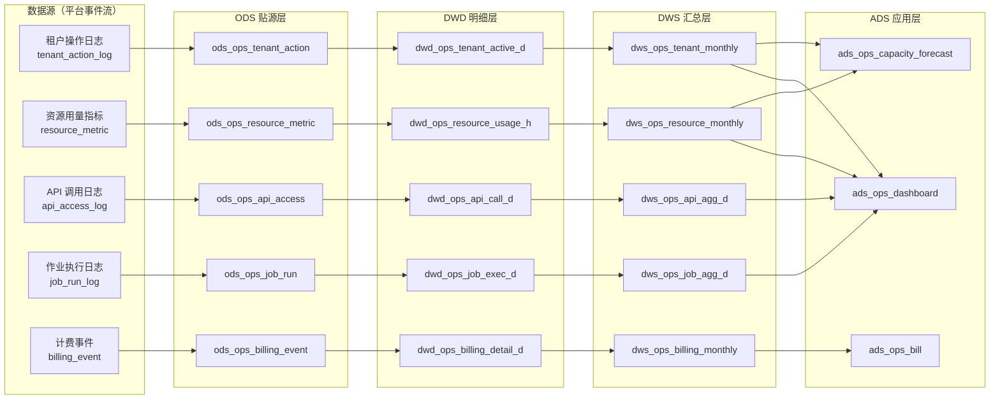
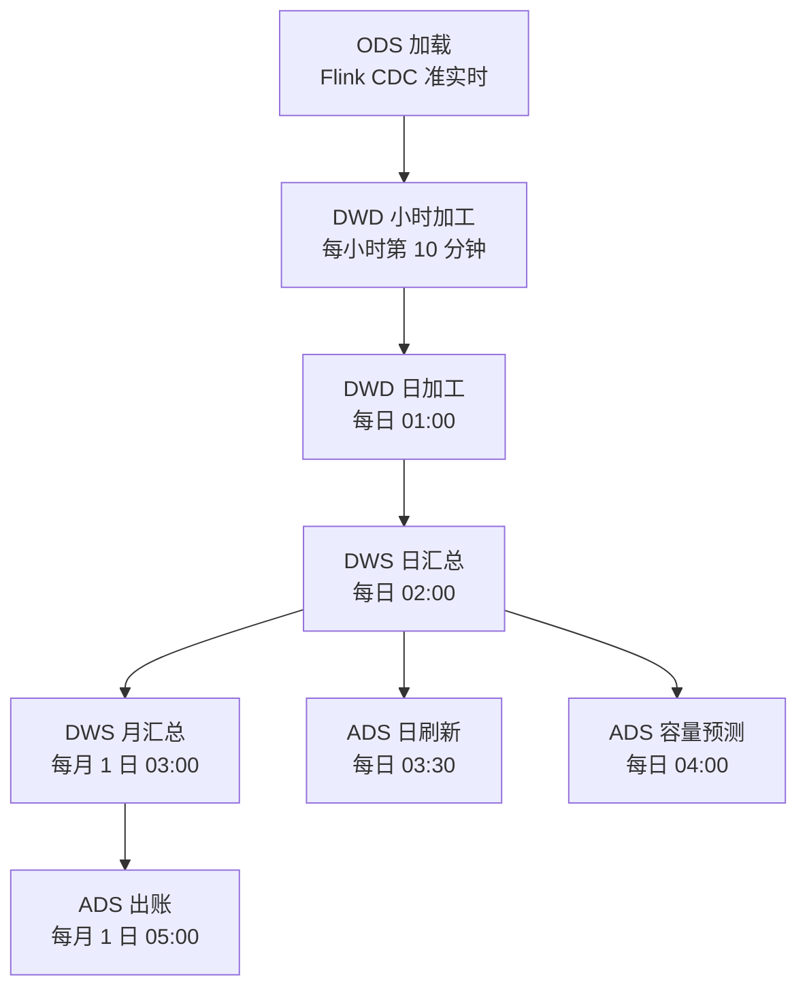

# 数据仓库分层建模

> 文档定位：DataEngineBDP 平台**自身运营分析数仓**建模设计。
>
> 适用范围：平台运营方用于分析"平台自身运行情况"的数据仓库，包括租户行为、资源用量、API 调用、作业执行、计费账单等。**不**涉及行业模板内租户业务数据集市（租户业务数仓见各行业模板 DDL）。
>
> 关联文档：《多平台多租户大数据平台_产品原型设计_v0.4.md》§9 L5 运营后台、§11.5 计量计费；《V2.0_行业模板与其他增强详细设计.md》§1.4 模板结构（ODS/DWD/DWS/ADS 分层范式）；《湖仓存储建模规范.md》。

## 第1章 设计目标与分层范式

### 1.1 设计目标

平台运营分析数仓服务于**平台运营方**（非租户），回答以下问题：

1. **租户运营**：有多少活跃租户？租户日活/月活趋势？哪些租户即将流失？
2. **资源运营**：平台总资源利用率？哪些租户超配额？容量是否需要扩容？
3. **API 运营**：API 调用量趋势？哪些 API 最热？错误率与延迟分布？
4. **作业运营**：作业成功率？失败 Top N？作业时长分布？
5. **计费运营**：各租户账单明细？超量计费收入？计费对账差异？
6. **容量预测**：未来 30 天存储/计算资源需求？何时触发扩容？

### 1.2 分层范式

采用经典的 **ODS → DWD → DWS → ADS** 四层范式，与行业模板保持一致（见《V2.0_行业模板与其他增强详细设计.md》§1.4），但**数据域不同**——本数仓的数据域是"平台运营事件流"，而非租户业务数据。

| 层 | 全称 | 职责 | 数据来源 | 表命名前缀 |
| --- | --- | --- | --- | --- |
| ODS | Operation Data Store | 贴源层，原始事件日志原样落湖 | 平台各模块事件流 | `ods_ops_*` |
| DWD | Data Warehouse Detail | 明细层，清洗、去重、标准化、维度补全 | ODS | `dwd_ops_*` |
| DWS | Data Warehouse Summary | 汇总层，按时间+租户+维度聚合 | DWD | `dws_ops_*` |
| ADS | Application Data Store | 应用层，面向看板/账单/预测的直接消费表 | DWS | `ads_ops_*` |

### 1.3 数据流



### 1.4 统一规范

| 项目 | 规范 |
| --- | --- |
| 表格式 | Apache Iceberg（统一流批） |
| 存储格式 | Parquet + ZSTD 压缩 |
| 分区策略 | `PARTITIONED BY (dt, tenant_id)`，`dt` 为业务日期 `yyyy-MM-dd` |
| Catalog | `iceberg.platform_ops.{layer}.{table}`，三级命名 |
| 字段命名 | snake_case |
| 时间字段 | UTC，`TIMESTAMP` 类型 |
| 租户字段 | `tenant_id STRING`，平台级汇总行用 `__PLATFORM__` 占位 |
| 写入引擎 | Flink CDC 实时写 ODS；Spark 批处理写 DWD/DWS/ADS |
| 刷新频率 | ODS 准实时（分钟级）；DWD 小时/日；DWS 日/月；ADS 日 |

## 第2章 ODS 层 — 平台运营原始数据

### 2.1 ods_ops_tenant_action — 租户操作日志

记录租户内用户在控制台的所有操作（登录、创建项目、提交作业、发布资产等）。

```sql
-- SQL功能名：租户操作日志 ODS 表
CREATE TABLE IF NOT EXISTS iceberg.platform_ops.ods_ops_tenant_action (
    log_id              STRING      COMMENT '日志唯一ID（UUID）',
    tenant_id           STRING      COMMENT '租户ID',
    user_id             STRING      COMMENT '用户ID（Keycloak sub）',
    user_name           STRING      COMMENT '用户名',
    role_id             STRING      COMMENT '角色ID',
    session_id          STRING      COMMENT '会话ID',
    action_type         STRING      COMMENT '操作类型：LOGIN/LOGOUT/CREATE/UPDATE/DELETE/QUERY/EXECUTE/PUBLISH/EXPORT',
    resource_type       STRING      COMMENT '资源类型：PROJECT/DATASOURCE/SYNC_TASK/DEVELOP_JOB/API/ASSET/KNOWLEDGE/MODEL/TEMPLATE',
    resource_id         STRING      COMMENT '资源ID',
    resource_name       STRING      COMMENT '资源名',
    operation_detail    STRING      COMMENT '操作详情 JSON（请求参数）',
    operation_status    STRING      COMMENT '操作状态：SUCCESS/FAILED/DENIED',
    error_code          STRING      COMMENT '错误码（失败时）',
    error_message       STRING      COMMENT '错误信息（失败时）',
    ip_address          STRING      COMMENT '客户端IP',
    user_agent          STRING      COMMENT 'User-Agent',
    request_id          STRING      COMMENT '请求链路ID（traceId）',
    duration_ms         INT         COMMENT '操作耗时（毫秒）',
    occurred_at         TIMESTAMP   COMMENT '操作发生时间（UTC）',
    dt                  STRING      COMMENT '分区字段：业务日期 yyyy-MM-dd'
) USING iceberg
PARTITIONED BY (dt, tenant_id)
TBLPROPERTIES (
    'write.format.default'='parquet',
    'write.parquet.compression-codec'='zstd',
    'format-version'='2'
);
```

### 2.2 ods_ops_resource_metric — 资源用量指标

K8s 指标系统（Prometheus/node-exporter/kube-state-metrics）采集的资源用量，按 5 分钟粒度落湖。

```sql
-- SQL功能名：资源用量指标 ODS 表
CREATE TABLE IF NOT EXISTS iceberg.platform_ops.ods_ops_resource_metric (
    metric_id           STRING      COMMENT '指标点唯一ID',
    tenant_id           STRING      COMMENT '租户ID（平台组件用 __PLATFORM__）',
    namespace           STRING      COMMENT 'K8s Namespace',
    pod_name            STRING      COMMENT 'Pod 名',
    container_name      STRING      COMMENT '容器名',
    node_name           STRING      COMMENT '节点名',
    resource_type       STRING      COMMENT '资源类型：CPU/MEMORY/DISK/NETWORK/GPU',
    metric_name         STRING      COMMENT '指标名：usage/request/limit/utilization',
    metric_value        DOUBLE      COMMENT '指标值',
    unit                STRING      COMMENT '单位：cores/bytes/bytes_per_sec/percent',
    labels              STRING      COMMENT '标签 JSON（如 workload_kind=Deployment, app=spark）',
    collected_at        TIMESTAMP   COMMENT '采集时间（UTC）',
    dt                  STRING      COMMENT '分区字段：业务日期'
) USING iceberg
PARTITIONED BY (dt, tenant_id)
TBLPROPERTIES (
    'write.format.default'='parquet',
    'write.parquet.compression-codec'='zstd',
    'format-version'='2'
);
```

### 2.3 ods_ops_api_access — API 调用日志

经统一 API 网关（APISIX）的所有 API 调用日志，含租户对外 API 与平台控制面 API。

```sql
-- SQL功能名：API 调用日志 ODS 表
CREATE TABLE IF NOT EXISTS iceberg.platform_ops.ods_ops_api_access (
    log_id              STRING      COMMENT '日志唯一ID',
    tenant_id           STRING      COMMENT '租户ID',
    api_key_id          STRING      COMMENT 'API Key ID（对外 API 时）',
    api_name            STRING      COMMENT 'API 名',
    api_version         STRING      COMMENT 'API 版本',
    http_method         STRING      COMMENT 'HTTP 方法',
    request_path        STRING      COMMENT '请求路径',
    request_query       STRING      COMMENT '查询参数（截断 2048）',
    request_body_size   BIGINT      COMMENT '请求体大小（字节）',
    response_status     INT         COMMENT 'HTTP 响应状态码',
    response_body_size  BIGINT      COMMENT '响应体大小（字节）',
    latency_ms          INT         COMMENT '端到端延迟（毫秒）',
    upstream_latency_ms INT         COMMENT '上游延迟（毫秒）',
    route_model         STRING      COMMENT '路由模型（LLM 网关时）',
    token_usage         INT         COMMENT 'Token 消耗（LLM 调用时）',
    client_ip           STRING      COMMENT '客户端 IP',
    request_id          STRING      COMMENT '请求链路ID',
    error_code          STRING      COMMENT '错误码',
    error_message       STRING      COMMENT '错误信息',
    called_at           TIMESTAMP   COMMENT '调用时间（UTC）',
    dt                  STRING      COMMENT '分区字段：业务日期'
) USING iceberg
PARTITIONED BY (dt, tenant_id)
TBLPROPERTIES (
    'write.format.default'='parquet',
    'write.parquet.compression-codec'='zstd',
    'format-version'='2'
);
```

### 2.4 ods_ops_job_run — 作业执行日志

Spark/Flink/Doris/Trino 作业每次执行的记录（含数据集成 sync_task、数据开发 develop_schedule、行业模板 DAG）。

```sql
-- SQL功能名：作业执行日志 ODS 表
CREATE TABLE IF NOT EXISTS iceberg.platform_ops.ods_ops_job_run (
    run_id              STRING      COMMENT '执行唯一ID',
    tenant_id           STRING      COMMENT '租户ID',
    job_id              STRING      COMMENT '作业ID（业务键）',
    job_name            STRING      COMMENT '作业名',
    job_type            STRING      COMMENT '作业类型：SYNC_TASK/DEVELOP_SCHEDULE/DAG/ML_TRAIN/LLM_FINETUNE',
    engine              STRING      COMMENT '执行引擎：spark/flink/trino/doris/seatunnel',
    project_id          STRING      COMMENT '所属项目ID',
    trigger_type        STRING      COMMENT '触发类型：CRON/MANUAL/UPSTREAM_RETRY',
    trigger_user        STRING      COMMENT '触发人（手动时）',
    schedule_expr       STRING      COMMENT 'cron 表达式（调度时）',
    status              STRING      COMMENT '状态：RUNNING/SUCCEEDED/FAILED/KILLED/TIMEOUT',
    attempt_count       INT         COMMENT '重试次数',
    input_rows          BIGINT      COMMENT '输入行数',
    output_rows         BIGINT      COMMENT '输出行数',
    input_bytes         BIGINT      COMMENT '输入字节数',
    output_bytes        BIGINT      COMMENT '输出字节数',
    duration_ms         BIGINT      COMMENT '执行时长（毫秒）',
    cpu_seconds         DOUBLE      COMMENT 'CPU 秒数',
    memory_mb_seconds   DOUBLE      COMMENT '内存 MB·秒',
    error_code          STRING      COMMENT '错误码',
    error_message       STRING      COMMENT '错误信息（截断 4096）',
    log_path            STRING      COMMENT '日志路径',
    started_at          TIMESTAMP   COMMENT '开始时间（UTC）',
    finished_at         TIMESTAMP   COMMENT '结束时间（UTC）',
    dt                  STRING      COMMENT '分区字段：业务日期（按 started_at）'
) USING iceberg
PARTITIONED BY (dt, tenant_id)
TBLPROPERTIES (
    'write.format.default'='parquet',
    'write.parquet.compression-codec'='zstd',
    'format-version'='2'
);
```

### 2.5 ods_ops_billing_event — 计费事件

计费引擎按用量产生的计费事件流（实时流写 ODS，月底汇总出账单）。

```sql
-- SQL功能名：计费事件 ODS 表
CREATE TABLE IF NOT EXISTS iceberg.platform_ops.ods_ops_billing_event (
    event_id            STRING      COMMENT '事件唯一ID',
    tenant_id           STRING      COMMENT '租户ID',
    billing_item        STRING      COMMENT '计费项：COMPUTE_CPU/COMPUTE_GPU/STORAGE/IO/API_CALL/LLM_TOKEN/ML_INFERENCE',
    unit                STRING      COMMENT '计量单位：core_hour/gpu_hour/gb_month/byte/token/invocation',
    quantity            DECIMAL(18,4) COMMENT '用量',
    unit_price          DECIMAL(18,6) COMMENT '单价（元）',
    amount              DECIMAL(18,2) COMMENT '金额（元）= quantity * unit_price',
    package_id          STRING      COMMENT '所属套餐ID',
    is_overage          BOOLEAN     COMMENT '是否超量计费',
    resource_id         STRING      COMMENT '关联资源ID',
    occurred_at         TIMESTAMP   COMMENT '计费事件时间（UTC）',
    dt                  STRING      COMMENT '分区字段：业务日期'
) USING iceberg
PARTITIONED BY (dt, tenant_id)
TBLPROPERTIES (
    'write.format.default'='parquet',
    'write.parquet.compression-codec'='zstd',
    'format-version'='2'
);
```

## 第3章 DWD 层 — 明细数据

DWD 层对 ODS 做清洗、去重、维度补全、粒度标准化。粒度统一为"日"或"小时"。

### 3.1 dwd_ops_tenant_active_d — 租户日活明细

```sql
-- SQL功能名：租户日活明细 DWD 表
CREATE TABLE IF NOT EXISTS iceberg.platform_ops.dwd_ops_tenant_active_d (
    tenant_id           STRING      COMMENT '租户ID',
    tenant_name         STRING      COMMENT '租户名（维度补全）',
    tenant_type         STRING      COMMENT '租户类型：INTERNAL/EXTERNAL',
    quota_profile       STRING      COMMENT '配额档位',
    active_users        INT         COMMENT '当日活跃用户数（去重 user_id）',
    total_actions       INT         COMMENT '当日操作总数',
    login_count         INT         COMMENT '登录次数',
    create_count        INT         COMMENT '创建操作数',
    query_count         INT         COMMENT '查询操作数',
    execute_count       INT         COMMENT '执行操作数',
    failed_actions      INT         COMMENT '失败操作数',
    denied_actions      INT         COMMENT '拒绝操作数',
    distinct_ips        INT         COMMENT '去重 IP 数',
    first_action_at     TIMESTAMP   COMMENT '当日首次操作时间',
    last_action_at      TIMESTAMP   COMMENT '当日末次操作时间',
    dt                  STRING      COMMENT '分区字段：业务日期'
) USING iceberg
PARTITIONED BY (dt, tenant_id)
TBLPROPERTIES (
    'write.format.default'='parquet',
    'write.parquet.compression-codec'='zstd',
    'format-version'='2'
);
```

**加工逻辑**：从 `ods_ops_tenant_action` 按 `(tenant_id, dt, user_id)` 去重统计，关联 `tenants` 维表补全租户属性。

### 3.2 dwd_ops_resource_usage_h — 资源小时用量明细

```sql
-- SQL功能名：资源小时用量明细 DWD 表
CREATE TABLE IF NOT EXISTS iceberg.platform_ops.dwd_ops_resource_usage_h (
    tenant_id           STRING      COMMENT '租户ID',
    namespace           STRING      COMMENT 'K8s Namespace',
    workload_kind       STRING      COMMENT '工作负载类型：Deployment/StatefulSet/Job/DaemonSet',
    workload_name       STRING      COMMENT '工作负载名',
    resource_type       STRING      COMMENT '资源类型：CPU/MEMORY/GPU/DISK/NETWORK',
    request_avg         DOUBLE      COMMENT '小时平均 request',
    usage_avg           DOUBLE      COMMENT '小时平均 usage',
    usage_max           DOUBLE      COMMENT '小时峰值 usage',
    utilization_avg     DOUBLE      COMMENT '小时平均利用率（usage/request）',
    utilization_max     DOUBLE      COMMENT '小时峰值利用率',
    unit                STRING      COMMENT '单位',
    sample_count        INT         COMMENT '采样点数（5min 粒度应有 12 个）',
    hour_start          TIMESTAMP   COMMENT '小时起始时间（UTC）',
    dt                  STRING      COMMENT '分区字段：业务日期'
) USING iceberg
PARTITIONED BY (dt, tenant_id)
TBLPROPERTIES (
    'write.format.default'='parquet',
    'write.parquet.compression-codec'='zstd',
    'format-version'='2'
);
```

**加工逻辑**：从 `ods_ops_resource_metric` 按 `(tenant_id, namespace, workload, resource_type, hour)` 聚合，5 分钟点聚合成小时统计。

### 3.3 dwd_ops_api_call_d — API 调用明细

```sql
-- SQL功能名：API 调用明细 DWD 表
CREATE TABLE IF NOT EXISTS iceberg.platform_ops.dwd_ops_api_call_d (
    tenant_id           STRING      COMMENT '租户ID',
    api_name            STRING      COMMENT 'API 名',
    api_version         STRING      COMMENT 'API 版本',
    http_method         STRING      COMMENT 'HTTP 方法',
    request_path        STRING      COMMENT '请求路径（模板化，去参数）',
    route_model         STRING      COMMENT '路由模型（LLM 时）',
    call_count          BIGINT      COMMENT '当日调用次数',
    success_count       BIGINT      COMMENT '成功次数（2xx）',
    client_error_count  BIGINT      COMMENT '客户端错误次数（4xx）',
    server_error_count  BIGINT      COMMENT '服务端错误次数（5xx）',
    avg_latency_ms      DOUBLE      COMMENT '平均延迟',
    p50_latency_ms      DOUBLE      COMMENT 'P50 延迟',
    p95_latency_ms      DOUBLE      COMMENT 'P95 延迟',
    p99_latency_ms      DOUBLE      COMMENT 'P99 延迟',
    max_latency_ms      INT         COMMENT '最大延迟',
    total_request_bytes BIGINT      COMMENT '总请求字节',
    total_response_bytes BIGINT     COMMENT '总响应字节',
    total_token_usage   BIGINT      COMMENT '总 Token 消耗（LLM 时）',
    distinct_callers    INT         COMMENT '去重调用方 IP 数',
    dt                  STRING      COMMENT '分区字段：业务日期'
) USING iceberg
PARTITIONED BY (dt, tenant_id)
TBLPROPERTIES (
    'write.format.default'='parquet',
    'write.parquet.compression-codec'='zstd',
    'format-version'='2'
);
```

### 3.4 dwd_ops_job_exec_d — 作业执行明细

```sql
-- SQL功能名：作业执行明细 DWD 表
CREATE TABLE IF NOT EXISTS iceberg.platform_ops.dwd_ops_job_exec_d (
    tenant_id           STRING      COMMENT '租户ID',
    job_id              STRING      COMMENT '作业ID',
    job_name            STRING      COMMENT '作业名',
    job_type            STRING      COMMENT '作业类型',
    engine              STRING      COMMENT '执行引擎',
    project_id          STRING      COMMENT '所属项目ID',
    run_count           INT         COMMENT '当日执行次数',
    success_count       INT         COMMENT '成功次数',
    failed_count        INT         COMMENT '失败次数',
    killed_count        INT         COMMENT '被杀次数',
    timeout_count       INT         COMMENT '超时次数',
    avg_duration_ms     DOUBLE      COMMENT '平均时长',
    max_duration_ms     BIGINT      COMMENT '最大时长',
    total_input_rows    BIGINT      COMMENT '总输入行',
    total_output_rows   BIGINT      COMMENT '总输出行',
    total_cpu_seconds   DOUBLE      COMMENT '总 CPU 秒',
    total_mem_mb_seconds DOUBLE     COMMENT '总内存 MB·秒',
    first_run_at        TIMESTAMP   COMMENT '当日首次执行',
    last_run_at         TIMESTAMP   COMMENT '当日末次执行',
    dt                  STRING      COMMENT '分区字段：业务日期'
) USING iceberg
PARTITIONED BY (dt, tenant_id)
TBLPROPERTIES (
    'write.format.default'='parquet',
    'write.parquet.compression-codec'='zstd',
    'format-version'='2'
);
```

### 3.5 dwd_ops_billing_detail_d — 计费明细

```sql
-- SQL功能名：计费明细 DWD 表
CREATE TABLE IF NOT EXISTS iceberg.platform_ops.dwd_ops_billing_detail_d (
    tenant_id           STRING      COMMENT '租户ID',
    billing_item        STRING      COMMENT '计费项',
    unit                STRING      COMMENT '计量单位',
    daily_quantity      DECIMAL(18,4) COMMENT '当日用量',
    daily_amount        DECIMAL(18,2) COMMENT '当日金额',
    package_quantity    DECIMAL(18,4) COMMENT '套餐内用量',
    overage_quantity    DECIMAL(18,4) COMMENT '超量用量',
    overage_amount      DECIMAL(18,2) COMMENT '超量金额',
    unit_price          DECIMAL(18,6) COMMENT '单价',
    overage_unit_price  DECIMAL(18,6) COMMENT '超量单价',
    dt                  STRING      COMMENT '分区字段：业务日期'
) USING iceberg
PARTITIONED BY (dt, tenant_id)
TBLPROPERTIES (
    'write.format.default'='parquet',
    'write.parquet.compression-codec'='zstd',
    'format-version'='2'
);
```

## 第4章 DWS 层 — 汇总数据

DWS 层按"月"或"日+维度"汇总，服务运营看板与报表。

### 4.1 dws_ops_tenant_monthly — 租户月报

```sql
-- SQL功能名：租户月报 DWS 表
CREATE TABLE IF NOT EXISTS iceberg.platform_ops.dws_ops_tenant_monthly (
    tenant_id           STRING      COMMENT '租户ID',
    tenant_name         STRING      COMMENT '租户名',
    tenant_type         STRING      COMMENT '租户类型',
    quota_profile       STRING      COMMENT '配额档位',
    month_start         STRING      COMMENT '月份首日 yyyy-MM-01',
    active_days         INT         COMMENT '当月活跃天数',
    mau                 INT         COMMENT '月活用户数（去重）',
    total_actions       BIGINT      COMMENT '当月操作总数',
    total_login_count   BIGINT      COMMENT '当月登录次数',
    total_failed_actions BIGINT     COMMENT '当月失败操作数',
    avg_daily_actions   DOUBLE      COMMENT '日均操作数',
    last_active_date    STRING      COMMENT '最后活跃日期',
    is_churn_risk       BOOLEAN     COMMENT '是否流失风险（近 7 天无活跃）',
    dt                  STRING      COMMENT '分区字段：业务日期（月首日）'
) USING iceberg
PARTITIONED BY (dt, tenant_id)
TBLPROPERTIES (
    'write.format.default'='parquet',
    'write.parquet.compression-codec'='zstd',
    'format-version'='2'
);
```

### 4.2 dws_ops_resource_monthly — 资源月统计

```sql
-- SQL功能名：资源月统计 DWS 表
CREATE TABLE IF NOT EXISTS iceberg.platform_ops.dws_ops_resource_monthly (
    tenant_id           STRING      COMMENT '租户ID',
    namespace           STRING      COMMENT 'K8s Namespace',
    resource_type       STRING      COMMENT '资源类型',
    month_start         STRING      COMMENT '月份首日',
    avg_utilization     DOUBLE      COMMENT '月平均利用率',
    max_utilization     DOUBLE      COMMENT '月峰值利用率',
    peak_hour           STRING      COMMENT '峰值发生小时',
    total_cpu_seconds   DOUBLE      COMMENT '月总 CPU 秒',
    total_mem_mb_seconds DOUBLE     COMMENT '月总内存 MB·秒',
    over_quota_hours    INT         COMMENT '超配额小时数',
    over_quota_ratio    DOUBLE      COMMENT '超配额时长占比',
    dt                  STRING      COMMENT '分区字段：业务日期（月首日）'
) USING iceberg
PARTITIONED BY (dt, tenant_id)
TBLPROPERTIES (
    'write.format.default'='parquet',
    'write.parquet.compression-codec'='zstd',
    'format-version'='2'
);
```

### 4.3 dws_ops_api_agg_d — API 调用日聚合

```sql
-- SQL功能名：API 调用日聚合 DWS 表
CREATE TABLE IF NOT EXISTS iceberg.platform_ops.dws_ops_api_agg_d (
    tenant_id           STRING      COMMENT '租户ID',
    api_name            STRING      COMMENT 'API 名',
    call_count          BIGINT      COMMENT '当日调用次数',
    success_rate        DOUBLE      COMMENT '成功率',
    avg_latency_ms      DOUBLE      COMMENT '平均延迟',
    p95_latency_ms      DOUBLE      COMMENT 'P95 延迟',
    p99_latency_ms      DOUBLE      COMMENT 'P99 延迟',
    total_token_usage   BIGINT      COMMENT '总 Token 消耗',
    rank_in_tenant      INT         COMMENT '租户内调用量排名',
    dt                  STRING      COMMENT '分区字段：业务日期'
) USING iceberg
PARTITIONED BY (dt, tenant_id)
TBLPROPERTIES (
    'write.format.default'='parquet',
    'write.parquet.compression-codec'='zstd',
    'format-version'='2'
);
```

### 4.4 dws_ops_job_agg_d — 作业日聚合

```sql
-- SQL功能名：作业日聚合 DWS 表
CREATE TABLE IF NOT EXISTS iceberg.platform_ops.dws_ops_job_agg_d (
    tenant_id           STRING      COMMENT '租户ID',
    job_type            STRING      COMMENT '作业类型',
    engine              STRING      COMMENT '执行引擎',
    total_runs          INT         COMMENT '当日执行总数',
    success_rate        DOUBLE      COMMENT '成功率',
    avg_duration_ms     DOUBLE      COMMENT '平均时长',
    total_cpu_seconds   DOUBLE      COMMENT '总 CPU 秒',
    failed_top_jobs     STRING      COMMENT '失败 Top 10 作业 JSON',
    dt                  STRING      COMMENT '分区字段：业务日期'
) USING iceberg
PARTITIONED BY (dt, tenant_id)
TBLPROPERTIES (
    'write.format.default'='parquet',
    'write.parquet.compression-codec'='zstd',
    'format-version'='2'
);
```

### 4.5 dws_ops_billing_monthly — 计费月汇总

```sql
-- SQL功能名：计费月汇总 DWS 表
CREATE TABLE IF NOT EXISTS iceberg.platform_ops.dws_ops_billing_monthly (
    tenant_id           STRING      COMMENT '租户ID',
    month_start         STRING      COMMENT '月份首日',
    package_id          STRING      COMMENT '套餐ID',
    package_amount      DECIMAL(18,2) COMMENT '套餐固定费',
    usage_amount        DECIMAL(18,2) COMMENT '用量计费金额',
    overage_amount      DECIMAL(18,2) COMMENT '超量计费金额',
    total_amount        DECIMAL(18,2) COMMENT '当月总金额',
    item_breakdown      STRING      COMMENT '分项明细 JSON',
    dt                  STRING      COMMENT '分区字段：业务日期（月首日）'
) USING iceberg
PARTITIONED BY (dt, tenant_id)
TBLPROPERTIES (
    'write.format.default'='parquet',
    'write.parquet.compression-codec'='zstd',
    'format-version'='2'
);
```

## 第5章 ADS 层 — 应用数据

ADS 层直接服务运营看板、账单系统、容量预测等应用。

### 5.1 ads_ops_dashboard — 运营看板

```sql
-- SQL功能名：运营看板 ADS 表
CREATE TABLE IF NOT EXISTS iceberg.platform_ops.ads_ops_dashboard (
    metric_date         STRING      COMMENT '统计日期',
    total_tenants       INT         COMMENT '总租户数',
    active_tenants      INT         COMMENT '活跃租户数',
    new_tenants         INT         COMMENT '新增租户数',
    churned_tenants     INT         COMMENT '流失租户数',
    total_users         INT         COMMENT '总用户数',
    active_users        INT         COMMENT '活跃用户数',
    total_api_calls     BIGINT      COMMENT '总 API 调用数',
    avg_success_rate    DOUBLE      COMMENT '平均成功率',
    total_jobs          INT         COMMENT '总作业数',
    job_success_rate    DOUBLE      COMMENT '作业成功率',
    total_storage_bytes BIGINT      COMMENT '总存储字节',
    total_compute_hours DOUBLE      COMMENT '总计算小时',
    monthly_revenue     DECIMAL(18,2) COMMENT '当月累计收入',
    dt                  STRING      COMMENT '分区字段：业务日期'
) USING iceberg
PARTITIONED BY (dt)
TBLPROPERTIES (
    'write.format.default'='parquet',
    'write.parquet.compression-codec'='zstd',
    'format-version'='2'
);
```

### 5.2 ads_ops_bill — 计费账单

```sql
-- SQL功能名：计费账单 ADS 表
CREATE TABLE IF NOT EXISTS iceberg.platform_ops.ads_ops_bill (
    bill_id             STRING      COMMENT '账单ID',
    tenant_id           STRING      COMMENT '租户ID',
    tenant_name         STRING      COMMENT '租户名',
    billing_period      STRING      COMMENT '账期 yyyy-MM',
    package_name        STRING      COMMENT '套餐名',
    package_amount      DECIMAL(18,2) COMMENT '套餐费',
    usage_amount        DECIMAL(18,2) COMMENT '用量费',
    overage_amount      DECIMAL(18,2) COMMENT '超量费',
    discount_amount     DECIMAL(18,2) COMMENT '优惠金额',
    tax_amount          DECIMAL(18,2) COMMENT '税额',
    total_amount        DECIMAL(18,2) COMMENT '应付总额',
    paid_amount         DECIMAL(18,2) COMMENT '已付金额',
    bill_status         STRING      COMMENT '账单状态：DRAFT/ISSUED/PAID/OVERDUE',
    issued_at           TIMESTAMP   COMMENT '出账时间',
    due_date            STRING      COMMENT '到期日',
    detail_json         STRING      COMMENT '分项明细 JSON（供账单详情页）',
    dt                  STRING      COMMENT '分区字段：业务日期（月首日）'
) USING iceberg
PARTITIONED BY (dt, tenant_id)
TBLPROPERTIES (
    'write.format.default'='parquet',
    'write.parquet.compression-codec'='zstd',
    'format-version'='2'
);
```

### 5.3 ads_ops_capacity_forecast — 容量预测

```sql
-- SQL功能名：容量预测 ADS 表
CREATE TABLE IF NOT EXISTS iceberg.platform_ops.ads_ops_capacity_forecast (
    forecast_date       STRING      COMMENT '预测日期',
    resource_type       STRING      COMMENT '资源类型：CPU/MEMORY/STORAGE/GPU',
    historical_avg      DOUBLE      COMMENT '历史 30 天均值',
    forecast_value      DOUBLE      COMMENT '预测值',
    forecast_lower      DOUBLE      COMMENT '预测下界（P10）',
    forecast_upper      DOUBLE      COMMENT '预测上界（P90）',
    current_capacity    DOUBLE      COMMENT '当前总容量',
    utilization_pct     DOUBLE      COMMENT '预测利用率',
    scale_needed        BOOLEAN     COMMENT '是否需要扩容（利用率 > 80%）',
    recommended_capacity DOUBLE     COMMENT '建议容量',
    model_name          STRING      COMMENT '预测模型',
    model_version       STRING      COMMENT '模型版本',
    generated_at        TIMESTAMP   COMMENT '预测生成时间',
    dt                  STRING      COMMENT '分区字段：业务日期'
) USING iceberg
PARTITIONED BY (dt)
TBLPROPERTIES (
    'write.format.default'='parquet',
    'write.parquet.compression-codec'='zstd',
    'format-version'='2'
);
```

## 第6章 分区与生命周期

### 6.1 分区策略

| 层 | 分区键 | 分区粒度 | 说明 |
| --- | --- | --- | --- |
| ODS | `(dt, tenant_id)` | 日 + 租户 | 高写入吞吐，按租户裁剪 |
| DWD | `(dt, tenant_id)` | 日 + 租户 | 与 ODS 对齐 |
| DWS | `(dt, tenant_id)` | 日/月 + 租户 | `dt` 为月首日时按月分区 |
| ADS | `(dt)` 或 `(dt, tenant_id)` | 日 | 看板表仅按日，账单按日+租户 |

### 6.2 生命周期

| 层 | 保留期 | 归档策略 |
| --- | --- | --- |
| ODS | 90 天 | 90 天后转冷存（S3 IA），180 天后删除 |
| DWD | 1 年 | 1 年后转冷存，3 年后删除 |
| DWS | 3 年 | 3 年后转冷存，7 年后归档到对象存储 |
| ADS | 永久 | 看板数据保留永久；账单永久（合规要求） |

## 第7章 加工调度

### 7.1 DAG 调度



### 7.2 数据质量校验

每层加工后跑质量校验：

| 校验项 | 规则 | 处理 |
| --- | --- | --- |
| 行数对比 | DWD 行数 ≥ ODS 行数 × 0.99 | 告警 + 阻断下游 |
| 租户完备 | 当日所有活跃租户均有 DWD 行 | 告警 |
| 金额对账 | DWS 月汇总 = ADS 账单总额 | 阻断出账 |
| 延迟 SLA | DWD 日加工 03:00 前完成 | 告警 |

## 第8章 查询示例

### 8.1 运营看板：近 30 天租户活跃趋势

```sql
-- SQL功能名：近 30 天租户活跃趋势查询
SELECT
    dt,
    active_tenants,
    new_tenants,
    churned_tenants,
    monthly_revenue
FROM iceberg.platform_ops.ads_ops_dashboard
WHERE dt BETWEEN date_format(date_sub(current_date, 30), 'yyyy-MM-dd')
             AND date_format(current_date, 'yyyy-MM-dd')
ORDER BY dt;
```

### 8.2 计费对账：某租户当月分项明细

```sql
-- SQL功能名：租户当月计费分项明细
SELECT
    billing_item,
    unit,
    sum(daily_quantity)  AS month_quantity,
    sum(daily_amount)    AS month_amount,
    sum(overage_amount)  AS month_overage
FROM iceberg.platform_ops.dwd_ops_billing_detail_d
WHERE tenant_id = 'TENANT_001'
  AND dt >= '2026-08-01'
  AND dt <  '2026-09-01'
GROUP BY billing_item, unit
ORDER BY month_amount DESC;
```

### 8.3 容量预测：未来 7 天扩容建议

```sql
-- SQL功能名：未来 7 天容量扩容建议
SELECT
    forecast_date,
    resource_type,
    forecast_value,
    current_capacity,
    utilization_pct,
    recommended_capacity
FROM iceberg.platform_ops.ads_ops_capacity_forecast
WHERE dt = date_format(current_date, 'yyyy-MM-dd')
  AND forecast_date > date_format(current_date, 'yyyy-MM-dd')
  AND scale_needed = TRUE
ORDER BY utilization_pct DESC;
```

## 第9章 总结

本设计建立**平台运营分析数仓**，以 ODS/DWD/DWS/ADS 四层范式组织平台自身运营数据，覆盖租户行为、资源用量、API 调用、作业执行、计费事件五大数据域。所有表采用 Iceberg + Parquet + ZSTD，按 `(dt, tenant_id)` 分区，与行业模板数仓保持一致的命名与分区规范。ADS 层直接服务运营看板、计费账单、容量预测三大应用，支撑平台商业化运营闭环。