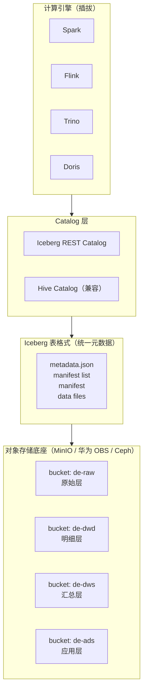
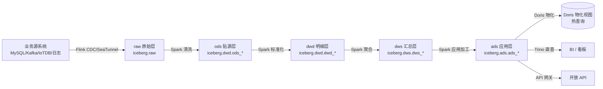
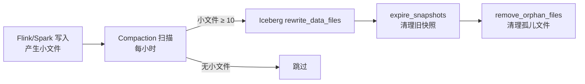
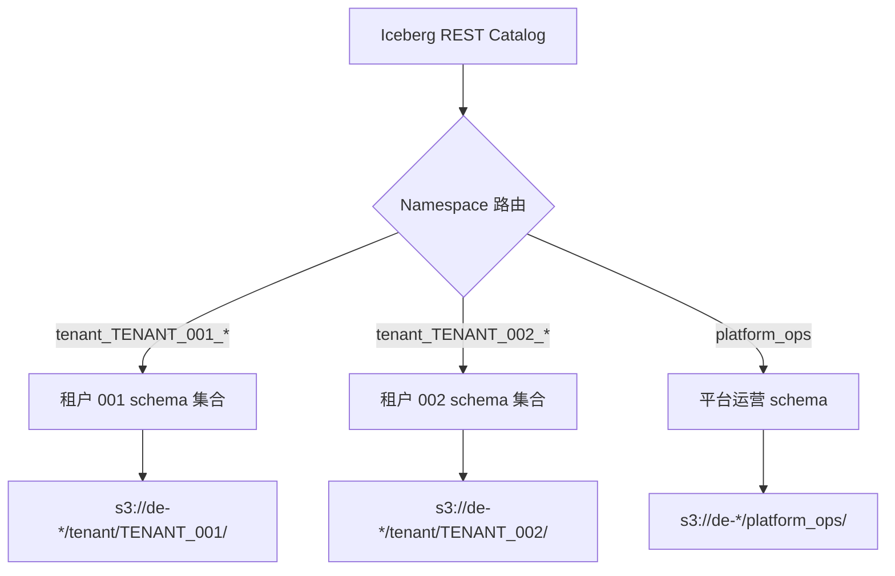
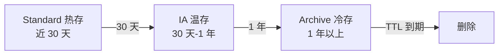
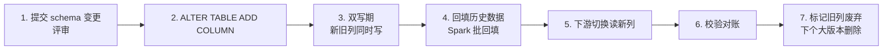

# 湖仓存储建模规范

> 文档定位：DataEngineBDP 多平台多租户湖仓集一体大数据平台**数据湖 + 数据仓存储层**建模规范。
>
> 适用范围：平台所有 Iceberg 表的命名、分区、存储格式、compaction、生命周期、schema 演进等横切规范。**统一约束**行业模板数仓（金融/政务/制造/零售/物联网/能源）与平台运营数仓。
>
> 关联文档：《多平台多租户大数据平台_产品原型设计_v0.4.md》§6 L2 大数据引擎层（湖仓集一体）；《V2.0_行业模板与其他增强详细设计.md》§1.4 模板结构；《数据仓库分层建模.md》《平台元数据库设计.md》。

## 第1章 总体架构

### 1.1 湖仓集一体存储底座

平台采用**湖仓集一体**架构（见产品原型设计 v0.4 §6.3），存储底座统一为**对象存储 + Apache Iceberg 表格式**：



### 1.2 数据湖层级

数据湖按"原始 → 明细 → 汇总 → 应用"四层组织，每层独立 bucket 与 catalog schema：

| 层 | bucket | catalog schema | 职责 | 写入引擎 | 读取引擎 |
| --- | --- | --- | --- | --- | --- |
| 原始层 raw | `de-raw` | `raw` | 业务源系统数据原样落湖（CDC binlog、日志、IoTDB 采样） | Flink CDC / SeaTunnel | Spark / Trino |
| 明细层 ods/dwd | `de-dwd` | `dwd` | 清洗、去重、标准化、维度补全后的明细 | Spark / Flink | Spark / Trino / Doris |
| 汇总层 dws | `de-dws` | `dws` | 按时间+租户+维度聚合 | Spark | Trino / Doris |
| 应用层 ads | `de-ads` | `ads` | 面向看板/API/账单/预测的直接消费表 | Spark | Doris / Trino |

> **说明**：ODS 贴源层与 DWD 明细层合并到 `de-dwd` bucket，通过 schema 前缀 `ods_*` / `dwd_*` 区分；如需强隔离可拆为 `de-ods` + `de-dwd` 两个 bucket。

### 1.3 层级数据流



## 第2章 命名规范

### 2.1 Catalog 三级命名

所有 Iceberg 表统一采用 **`catalog.db.table`** 三级命名：

```
iceberg.{db}.{table}
```

| 段 | 取值 | 说明 |
| --- | --- | --- |
| catalog | `iceberg` | 平台统一 Iceberg REST Catalog 名 |
| db | `{layer}_{domain}` 或 `platform_ops` | 层_行业域 或 平台运营域 |
| table | `{prefix}_{domain}_{entity}` | 层前缀_行业域_实体名 |

### 2.2 db 命名规范

| 场景 | db 命名 | 示例 |
| --- | --- | --- |
| 行业模板 - 金融 | `tenant_{tid}_finance` | `iceberg.tenant_TENANT_001_finance.dwd_fin_customer` |
| 行业模板 - 政务 | `tenant_{tid}_government` | `iceberg.tenant_TENANT_001_government.ods_gov_population` |
| 行业模板 - 制造 | `tenant_{tid}_mfg` | `iceberg.tenant_TENANT_001_mfg.dwd_mfg_equipment` |
| 行业模板 - 零售 | `tenant_{tid}_retail` | `iceberg.tenant_TENANT_001_retail.dwd_retail_product` |
| 行业模板 - 物联网 | `tenant_{tid}_iot` | `iceberg.tenant_TENANT_001_iot.dwd_iot_device` |
| 行业模板 - 能源 | `tenant_{tid}_energy` | `iceberg.tenant_TENANT_001_energy.dwd_energy_consumption` |
| 平台运营数仓 | `platform_ops` | `iceberg.platform_ops.dwd_ops_tenant_active_d` |

> **多租户隔离**：行业模板 db 按 `tenant_{tid}_{industry}` 隔离，物理上对应对象存储路径 `tenant/{tid}/{industry}/`。平台运营数仓 `platform_ops` 为平台方专用，含所有租户数据，通过 `tenant_id` 列隔离。

### 2.3 表命名规范

```
{layer_prefix}_{domain}_{entity}[_{granularity}]
```

| 段 | 规范 | 示例 |
| --- | --- | --- |
| layer_prefix | `raw` / `ods` / `dwd` / `dws` / `ads` | `dwd` |
| domain | 行业缩写或 `ops` | `fin` / `mfg` / `retail` / `ops` |
| entity | 实体名，单数 | `customer` / `equipment` / `tenant_active` |
| granularity | 可选粒度后缀：`_d` 日 / `_h` 小时 / `_m` 月 | `_d` |

**完整示例**：
- `iceberg.tenant_TENANT_001_finance.dwd_fin_customer` — 金融租户客户明细表
- `iceberg.platform_ops.dwd_ops_tenant_active_d` — 平台运营租户日活明细
- `iceberg.tenant_TENANT_001_mfg.dws_mfg_oee` — 制造租户 OEE 汇总

### 2.4 字段命名规范

| 规则 | 说明 | 示例 |
| --- | --- | --- |
| snake_case | 全小写 + 下划线 | `customer_id`、`txn_amount` |
| 主键后缀 `_id` | 业务主键统一 `_id` 后缀 | `order_id`、`tenant_id` |
| 时间后缀 `_at` / `_date` | 时间戳 `_at`，日期 `_date` | `created_at`、`register_date` |
| 布尔前缀 `is_` / `has_` | 布尔字段前缀 | `is_fraud`、`has_refund` |
| 金额后缀 `_amount` | 金额字段 | `txn_amount`、`total_amount` |
| 比率后缀 `_rate` / `_ratio` | 比率字段 | `success_rate`、`utilization_ratio` |
| 分区字段固定名 | `dt`（业务日期）、`tenant_id`（租户） | `dt`、`tenant_id` |
| 避免 SQL 保留字 | 不使用 `order` / `user` / `select` 等 | `order_id` 而非 `order` |

### 2.5 字段类型规范

| 语义 | Iceberg 类型 | 说明 |
| --- | --- | --- |
| 业务主键 | `STRING` | 雪花 ID / UUID，避免 BIGINT 自增（分布式） |
| 金额 | `DECIMAL(18,2)` | 货币精度统一 |
| 比率/评分 | `DECIMAL(5,2)` | 0-100 或 0.00-1.00 |
| 时间戳 | `TIMESTAMP` | UTC，无时区 |
| 业务日期 | `STRING`（`yyyy-MM-dd`） | 与分区字段 `dt` 一致 |
| 布尔 | `BOOLEAN` | |
| 大文本/JSON | `STRING` | Iceberg 无原生 JSON，存 STRING |
| 二进制 | `BINARY` | 极少使用 |

## 第3章 分区策略

### 3.1 统一分区键

所有租户业务表与平台运营表统一采用 **`(dt, tenant_id)`** 双分区：

```sql
PARTITIONED BY (dt, tenant_id)
```

| 分区键 | 类型 | 粒度 | 说明 |
| --- | --- | --- | --- |
| `dt` | STRING | 日（`yyyy-MM-dd`） | 业务日期，按日裁剪 |
| `tenant_id` | STRING | 租户 | 多租户隔离，按租户裁剪 |

### 3.2 分区策略选型

Iceberg 支持三种分区 transform，平台默认采用 **Identity 分区**（性能与可预测性最佳）：

| transform | 适用场景 | 平台是否采用 |
| --- | --- | --- |
| Identity（原值） | `dt`、`tenant_id` | ✅ 默认 |
| truncate(N) | 长字符串前缀分区 | ❌ 不采用 |
| bucket(N) | 哈希分桶 | ❌ 不采用（与租户隔离语义冲突） |
| year/month/day | 时间 transform | ❌ 不采用（`dt` 已是字符串日分区） |

### 3.3 隐藏分区与 Iceberg 分区演进

Iceberg 分区是**隐藏分区**（不物理存储分区列），支持**分区演进**——历史数据保留旧分区，新数据按新分区写入，无需重写。平台利用此特性支持：

- 初期单租户：`PARTITIONED BY (dt)`
- 多租户后：演进为 `PARTITIONED BY (dt, tenant_id)`，历史数据自动兼容

### 3.4 分区数估算与上限

| 单表数据量 | 单分区数据量 | 日分区数 | 年分区数 | 风险 |
| --- | --- | --- | --- | --- |
| 1 TB | 100 MB | 10000 | 365 万 | ❌ 小文件爆炸 |
| 1 TB | 1 GB | 1000 | 36.5 万 | ⚠️ 临界 |
| 1 TB | 10 GB | 100 | 3.65 万 | ✅ 健康 |

**平台约束**（见产品原型设计 v0.4 §13.3）：
- 单表最大分区数：小型 1 万 / 中型 5 万 / 大型 20 万
- 单分区数据量建议 ≥ 1 GB（避免小文件）
- 超出约束时触发**分区合并**或**分层（冷热分离）**

## 第4章 存储格式

### 4.1 文件格式

统一 **Parquet** 列存格式：

```sql
TBLPROPERTIES ('write.format.default'='parquet')
```

**选型理由**：
- 列存压缩比高，分析查询只读所需列。
- Spark / Flink / Trino / Doris 全生态原生支持。
- Iceberg v2 格式默认 Parquet。

### 4.2 压缩编码

统一 **ZSTD** 压缩：

```sql
TBLPROPERTIES (
    'write.format.default'='parquet',
    'write.parquet.compression-codec'='zstd'
)
```

| 压缩算法 | 压缩比 | 压缩速度 | 解压速度 | 平台是否采用 |
| --- | --- | --- | --- | --- |
| SNAPPY | 1.8x | 快 | 快 | ❌ 压缩比不足 |
| ZSTD | 2.8x | 中 | 快 | ✅ 默认 |
| GZIP | 2.5x | 慢 | 慢 | ❌ 速度差 |
| LZ4 | 1.6x | 极快 | 极快 | ❌ 压缩比不足 |

**ZSTD level**：默认 level 3（平衡），冷存归档表可调 level 19（极限压缩）。

### 4.3 Iceberg 格式版本

统一 **format-version=2**（v2 支持 row-level delete，流批统一必需）：

```sql
TBLPROPERTIES ('format-version'='2')
```

### 4.4 标准 TBLPROPERTIES 模板

```sql
-- SQL功能名：Iceberg 表标准 TBLPROPERTIES
TBLPROPERTIES (
    'write.format.default'='parquet',
    'write.parquet.compression-codec'='zstd',
    'format-version'='2',
    'write.metadata.delete-after-commit.enabled'='true',
    'write.metadata.previous-versions-max'='10',
    'write.target-file-size-bytes'='536870912'  -- 512MB
);
```

| 属性 | 值 | 说明 |
| --- | --- | --- |
| `write.format.default` | `parquet` | 统一 Parquet |
| `write.parquet.compression-codec` | `zstd` | ZSTD 压缩 |
| `format-version` | `2` | v2 支持 row-level delete |
| `write.metadata.delete-after-commit.enabled` | `true` | 提交后清理旧 metadata |
| `write.metadata.previous-versions-max` | `10` | 保留 10 个历史 metadata 版本 |
| `write.target-file-size-bytes` | `536870912`（512MB） | 目标文件大小，避免小文件 |

## 第5章 小文件 Compaction 策略

### 5.1 小文件判定

| 文件大小 | 判定 | 处理 |
| --- | --- | --- |
| < 100 MB | 小文件 | 必须合并 |
| 100 MB – 512 MB | 偏小 | 建议合并 |
| 512 MB – 1 GB | 健康 | 保留 |
| > 1 GB | 偏大 | 可拆分（Iceberg 自动 split） |

### 5.2 Compaction 触发条件

| 条件 | 阈值 | 说明 |
| --- | --- | --- |
| 小文件数 | 单分区 ≥ 10 个 < 100MB 文件 | 触发合并 |
| 写入后时长 | 距上次 compaction ≥ 1 小时 | 定时触发 |
| 分区数据量 | 单分区 < 100MB 且距上次合并 ≥ 24h | 合并到单文件 |

### 5.3 Compaction 调度



### 5.4 Compaction 命令示例

```sql
-- SQL功能名：Iceberg 小文件合并
-- Spark SQL 合并小文件
CALL iceberg.system.rewrite_data_files(
    table => 'tenant_TENANT_001_finance.dwd_fin_transaction',
    options => map(
        'min-input-files', '10',
        'target-file-size-bytes', '536870912',
        'small-file-size-bytes', '104857600'  -- 100MB
    )
);

-- 清理过期快照（保留 7 天）
CALL iceberg.system.expire_snapshots(
    table => 'tenant_TENANT_001_finance.dwd_fin_transaction',
    older_than => TIMESTAMP '2026-08-10 00:00:00',
    retain_last => 10
);

-- 清理孤儿文件
CALL iceberg.system.remove_orphan_files(
    table => 'tenant_TENANT_001_finance.dwd_fin_transaction',
    older_than => TIMESTAMP '2026-08-15 00:00:00'
);
```

### 5.5 Compaction 调度任务

| 表类型 | 频率 | 调度 |
| --- | --- | --- |
| ODS 高频写入表 | 每小时 | Airflow/DolphinScheduler 定时 |
| DWD 日加工表 | 每日 04:00 | 加工后触发 |
| DWS/ADS | 每周 | 周日 02:00 |
| 平台运营表 | 每日 03:00 | 统一窗口 |

## 第6章 Catalog 命名规范

### 6.1 Catalog 体系

平台使用 **Iceberg REST Catalog** 作为统一 Catalog，兼容 Hive Metastore 作为过渡：

| Catalog 名 | 类型 | 用途 |
| --- | --- | --- |
| `iceberg` | REST Catalog | 生产统一入口 |
| `iceberg_hive` | Hive Catalog | 兼容旧 Hive/Spark 作业过渡 |

### 6.2 三级命名解析

```
iceberg.tenant_TENANT_001_finance.dwd_fin_customer
└─┬─┘ └──────┬──────────┘ └──────┬──────┘
catalog      db               table
```

- **catalog**：`iceberg`（REST Catalog 服务端点 `http://iceberg-rest:8181`）
- **db**：`tenant_{tid}_{industry}`，对应对象存储路径 `s3://de-dwd/tenant/{tid}/{industry}/`
- **table**：`dwd_fin_customer`，对应对象存储路径 `.../dwd_fin_customer/`

### 6.3 对象存储路径映射

```
s3://de-raw/tenant/{tid}/{industry}/{table}/data/{dt=yyyy-MM-dd}/{tenant_id={tid}}/{file}.parquet
s3://de-dwd/tenant/{tid}/{industry}/{table}/data/{dt=yyyy-MM-dd}/{tenant_id={tid}}/{file}.parquet
s3://de-dws/tenant/{tid}/{industry}/{table}/data/{dt=yyyy-MM-dd}/{tenant_id={tid}}/{file}.parquet
s3://de-ads/tenant/{tid}/{industry}/{table}/data/{dt=yyyy-MM-dd}/{tenant_id={tid}}/{file}.parquet
```

### 6.4 多租户 Catalog 隔离



权限：每个租户的 Keycloak JWT 携带 `tenant` claim，REST Catalog 拒绝跨租户访问。

## 第7章 表生命周期

### 7.1 TTL 策略

| 层 | 表类型 | TTL | 触发动作 |
| --- | --- | --- | --- |
| raw | 原始 CDC 数据 | 30 天 | 转 ODS 后删除 |
| ods | 贴源层 | 90 天 | 转冷存 |
| dwd | 明细层 | 1 年 | 转冷存 |
| dws | 汇总层 | 3 年 | 转冷存 |
| ads | 应用层 | 永久 | 不删除（看板/账单合规要求） |
| 平台运营 ODS | 运营原始 | 90 天 | 转冷存 |
| 平台运营 ADS | 看板/账单 | 永久 | 不删除 |

### 7.2 冷热分层

对象存储提供热/温/冷三层存储类：

| 存储类 | 访问延迟 | 单价 | 适用 |
| --- | --- | --- | --- |
| Standard（热） | 毫秒 | 1x | 近 30 天数据，频繁查询 |
| IA（温） | 毫秒 | 0.5x | 30 天-1 年数据，偶尔查询 |
| Archive（冷） | 分钟级 | 0.1x | 1 年以上数据，归档合规 |

**分层规则**：



### 7.3 归档策略

| 数据 | 归档方式 | 恢复方式 |
| --- | --- | --- |
| DWD 明细（1 年以上） | 转 Archive 存储类 | 临时恢复到 Standard（按需） |
| DWS 汇总（3 年以上） | 转 Archive + 导出 Parquet 到备份桶 | 同上 |
| 账单数据 | 永久保留 Standard | 直接查 |
| 合规要求永久保留 | 转冷存但不删除 | 按需恢复 |

### 7.4 生命周期管理命令

```sql
-- SQL功能名：Iceberg 表生命周期管理
-- 转冷存（对象存储层操作，通过 Iceberg 表属性标记）
ALTER TABLE iceberg.tenant_TENANT_001_finance.dwd_fin_transaction SET TBLPROPERTIES (
    'write.lifecycle.older-than-30d.storage-class'='IA',
    'write.lifecycle.older-than-365d.storage-class'='ARCHIVE'
);

-- 删除 90 天前的 ODS 分区
ALTER TABLE iceberg.tenant_TENANT_001_finance.ods_fin_transaction
DROP PARTITION (dt < '2026-05-19');
```

## 第8章 Schema 演进规范

### 8.1 兼容性规则

平台采用 **向后兼容（Backward Compatible）** 策略：新 schema 能读旧数据，旧 reader 不必升级即可读新数据（部分场景）。

| 变更类型 | 兼容性 | 是否允许 | 说明 |
| --- | --- | --- | --- |
| 新增列（nullable） | 向后兼容 | ✅ 允许 | 旧数据新列读 NULL |
| 删除列 | 向前兼容 | ⚠️ 谨慎 | 旧 reader 读不到该列，需确认无下游依赖 |
| 重命名列 | 不兼容 | ❌ 禁止 | 改为新增列 + 双写 + 切换 + 删旧列 |
| 修改列类型（宽化） | 向后兼容 | ✅ 允许 | int→bigint、float→double |
| 修改列类型（窄化） | 不兼容 | ❌ 禁止 | bigint→int 可能溢出 |
| 修改列顺序 | 兼容 | ✅ 允许 | Iceberg 按名访问 |
| 新增分区字段 | 兼容 | ✅ 允许 | 分区演进，历史数据保留旧分区 |
| 删除分区字段 | 兼容 | ✅ 允许 | 历史分区保留，新数据不分区 |

### 8.2 Schema 演进流程



### 8.3 Schema 演进命令示例

```sql
-- SQL功能名：Iceberg schema 演进
-- 1. 新增列（向后兼容）
ALTER TABLE iceberg.tenant_TENANT_001_finance.dwd_fin_transaction
ADD COLUMNS (
    risk_level_new STRING COMMENT '新风险等级（替代 risk_level）'
);

-- 2. 列类型宽化（向后兼容）
ALTER TABLE iceberg.tenant_TENANT_001_finance.dwd_fin_transaction
CHANGE COLUMN txn_amount txn_amount DECIMAL(20,2);

-- 3. 分区演进（新增 tenant_id 分区）
ALTER TABLE iceberg.tenant_TENANT_001_finance.dwd_fin_transaction
ADD PARTITION FIELD tenant_id;

-- 4. 标记列废弃（不删除，加注释）
COMMENT ON COLUMN iceberg.tenant_TENANT_001_finance.dwd_fin_transaction.risk_level
IS 'DEPRECATED: use risk_level_new, will be dropped in v3.0';
```

### 8.4 Schema 演进评审清单

每次 schema 变更须评审：

1. 变更类型是否在"允许"清单内？
2. 是否影响下游 Doris 物化视图 / Trino 视图 / API 契约？
3. 是否需要双写期？双写期多久？
4. 历史数据是否需要回填？回填 Spark 作业方案？
5. 是否需要通知租户 / 平台运营？
6. 回滚方案？

## 第9章 数据湖层级表设计

### 9.1 原始层（raw）表设计

原始层保留源系统数据原样，字段以 JSON 透传为主，仅提取必要分区字段：

```sql
-- SQL功能名：原始层 CDC 透传表（以金融交易为例）
CREATE TABLE IF NOT EXISTS iceberg.tenant_TENANT_001_finance.raw_fin_transaction_cdc (
    binlog_file         STRING      COMMENT 'binlog 文件名',
    binlog_pos          BIGINT      COMMENT 'binlog 位点',
    binlog_row          INT         COMMENT 'binlog 行号',
    op_type             STRING      COMMENT '操作类型：INSERT/UPDATE/DELETE',
    table_name          STRING      COMMENT '源表名',
    before_data         STRING      COMMENT '变更前数据 JSON',
    after_data          STRING      COMMENT '变更后数据 JSON',
    ts_ms               BIGINT      COMMENT '源端时间戳（毫秒）',
    server_id           INT         COMMENT 'MySQL server_id',
    gtid                STRING      COMMENT 'GTID',
    tenant_id           STRING      COMMENT '租户ID',
    dt                  STRING      COMMENT '分区字段：业务日期'
) USING iceberg
PARTITIONED BY (dt, tenant_id)
TBLPROPERTIES (
    'write.format.default'='parquet',
    'write.parquet.compression-codec'='zstd',
    'format-version'='2',
    'write.target-file-size-bytes'='536870912'
);
```

### 9.2 明细层（ods/dwd）表设计

明细层结构化字段，清洗去重，维度补全。以金融客户为例（与行业模板对齐）：

```sql
-- SQL功能名：明细层客户表（与 V2.0 行业模板对齐）
CREATE TABLE IF NOT EXISTS iceberg.tenant_TENANT_001_finance.dwd_fin_customer (
    customer_id          STRING      COMMENT '客户唯一标识',
    customer_name        STRING      COMMENT '客户姓名（脱敏）',
    id_card_no           STRING      COMMENT '身份证号（SM4加密存储）',
    phone_no             STRING      COMMENT '手机号（脱敏）',
    customer_type        STRING      COMMENT '客户类型：个人/企业',
    gender               STRING      COMMENT '性别',
    age                  INT         COMMENT '年龄',
    occupation           STRING      COMMENT '职业',
    income_level         STRING      COMMENT '收入等级',
    credit_level         STRING      COMMENT '信用等级',
    register_date        TIMESTAMP   COMMENT '注册日期',
    tenant_id            STRING      COMMENT '租户ID',
    dt                   STRING      COMMENT '分区字段：业务日期'
) USING iceberg
PARTITIONED BY (dt, tenant_id)
TBLPROPERTIES (
    'write.format.default'='parquet',
    'write.parquet.compression-codec'='zstd',
    'format-version'='2',
    'write.target-file-size-bytes'='536870912'
);
```

### 9.3 汇总层（dws）表设计

汇总层按时间+维度聚合，粒度通常为日/月。以制造 OEE 汇总为例：

```sql
-- SQL功能名：汇总层 OEE 表
CREATE TABLE IF NOT EXISTS iceberg.tenant_TENANT_001_mfg.dws_mfg_oee (
    equipment_id         STRING      COMMENT '设备ID',
    equipment_name       STRING      COMMENT '设备名',
    workshop             STRING      COMMENT '车间',
    production_line      STRING      COMMENT '产线',
    availability_rate    DECIMAL(5,2) COMMENT '可用率',
    performance_rate     DECIMAL(5,2) COMMENT '表现率',
    quality_rate         DECIMAL(5,2) COMMENT '质量率',
    oee                  DECIMAL(5,2) COMMENT 'OEE = A × P × Q',
    planned_run_time_min INT         COMMENT '计划运行时长（分钟）',
    actual_run_time_min  INT         COMMENT '实际运行时长（分钟）',
    total_output         INT         COMMENT '总产出',
    good_output          INT         COMMENT '合格产出',
    tenant_id            STRING      COMMENT '租户ID',
    dt                   STRING      COMMENT '分区字段：业务日期'
) USING iceberg
PARTITIONED BY (dt, tenant_id)
TBLPROPERTIES (
    'write.format.default'='parquet',
    'write.parquet.compression-codec'='zstd',
    'format-version'='2'
);
```

### 9.4 应用层（ads）表设计

应用层直接服务看板/API/报表，宽表为主。以零售会员 RFM 为例：

```sql
-- SQL功能名：应用层会员 RFM 表
CREATE TABLE IF NOT EXISTS iceberg.tenant_TENANT_001_retail.ads_retail_member_rfm (
    member_id            STRING      COMMENT '会员ID',
    member_name          STRING      COMMENT '会员名（脱敏）',
    r_score              INT         COMMENT '最近消费评分 1-5',
    f_score              INT         COMMENT '消费频次评分 1-5',
    m_score              INT         COMMENT '消费金额评分 1-5',
    rfm_segment          STRING      COMMENT 'RFM 分群：高价值/中价值/低价值/流失',
    last_purchase_date   STRING      COMMENT '最近消费日期',
    purchase_count_30d   INT         COMMENT '近 30 天消费次数',
    purchase_amount_30d  DECIMAL(18,2) COMMENT '近 30 天消费金额',
    purchase_count_365d  INT         COMMENT '近 365 天消费次数',
    purchase_amount_365d DECIMAL(18,2) COMMENT '近 365 天消费金额',
    ltv_prediction       DECIMAL(18,2) COMMENT 'LTV 预测值',
    churn_probability    DECIMAL(5,2) COMMENT '流失概率',
    tenant_id            STRING      COMMENT '租户ID',
    dt                   STRING      COMMENT '分区字段：业务日期'
) USING iceberg
PARTITIONED BY (dt, tenant_id)
TBLPROPERTIES (
    'write.format.default'='parquet',
    'write.parquet.compression-codec'='zstd',
    'format-version'='2'
);
```

## 第10章 标准 DDL 模板

### 10.1 行业模板标准 DDL 骨架

所有行业模板表 DDL 须遵循以下骨架：

```sql
-- SQL功能名：Iceberg 行业模板标准 DDL 骨架
CREATE TABLE IF NOT EXISTS iceberg.`tenant/{tid}/{industry}`.{layer}_{domain}_{entity} (
    -- 1. 业务主键
    {entity}_id          STRING      COMMENT '业务主键',
    -- 2. 业务属性字段（snake_case）
    {field_name}         {type}      COMMENT '{说明}',
    -- 3. 脱敏/加密字段（按合规要求）
    {sensitive_field}    STRING      COMMENT '{说明}（SM4加密/脱敏）',
    -- 4. 统一分区字段
    tenant_id            STRING      COMMENT '租户ID',
    dt                   STRING      COMMENT '分区字段：业务日期'
) USING iceberg
PARTITIONED BY (dt, tenant_id)
TBLPROPERTIES (
    'write.format.default'='parquet',
    'write.parquet.compression-codec'='zstd',
    'format-version'='2',
    'write.metadata.delete-after-commit.enabled'='true',
    'write.metadata.previous-versions-max'='10',
    'write.target-file-size-bytes'='536870912'
);
```

### 10.2 平台运营表标准 DDL 骨架

```sql
-- SQL功能名：Iceberg 平台运营表标准 DDL 骨架
CREATE TABLE IF NOT EXISTS iceberg.platform_ops.{layer}_ops_{entity} (
    -- 1. 日志/事件 ID
    log_id               STRING      COMMENT '日志唯一ID',
    -- 2. 租户与时间
    tenant_id            STRING      COMMENT '租户ID',
    occurred_at          TIMESTAMP   COMMENT '发生时间（UTC）',
    -- 3. 业务属性
    {field_name}         {type}      COMMENT '{说明}',
    -- 4. 分区字段
    dt                   STRING      COMMENT '分区字段：业务日期'
) USING iceberg
PARTITIONED BY (dt, tenant_id)
TBLPROPERTIES (
    'write.format.default'='parquet',
    'write.parquet.compression-codec'='zstd',
    'format-version'='2',
    'write.target-file-size-bytes'='536870912'
);
```

## 第11章 质量与治理

### 11.1 表注册校验

新表上线前须校验：

| 校验项 | 规则 |
| --- | --- |
| 命名规范 | 符合 §2 命名规范 |
| 分区键 | 含 `dt` 和 `tenant_id`（平台运营表可仅 `dt`） |
| 存储格式 | Parquet + ZSTD + format-version=2 |
| 字段命名 | snake_case，无 SQL 保留字 |
| COMMENT | 表与字段均有 COMMENT |
| 主键 | 业务主键 `{entity}_id` 存在 |
| 脱敏 | 敏感字段标注脱敏策略 |

### 11.2 数据质量监控

每张表配置质量监控：

| 指标 | 阈值 | 告警 |
| --- | --- | --- |
| 空值率 | 主键空值率 = 0 | 阻断 |
| 分区完备 | 当日分区存在 | 告警 |
| 行数波动 | 较前日波动 ≤ 50% | 告警 |
| 文件数 | 单分区文件数 ≤ 100 | 触发 compaction |
| 小文件占比 | < 100MB 文件占比 ≤ 10% | 触发 compaction |

### 11.3 元数据注册

每张 Iceberg 表须在平台元数据库 `data_asset` 表注册（见《平台元数据库设计.md》§3.8），含：

- 资产名、类型=table、owner、security_level
- full_json：schema、分区键、存储路径、TTL、上下游依赖

## 第12章 总结

本规范统一约束平台所有 Iceberg 表的命名、分区、存储、compaction、生命周期与 schema 演进，核心要点：

1. **统一命名**：`iceberg.{db}.{table}` 三级命名，db 按租户+行业隔离。
2. **统一分区**：`PARTITIONED BY (dt, tenant_id)`，多租户裁剪与日裁剪。
3. **统一存储**：Parquet + ZSTD + format-version=2，目标文件 512MB。
4. **统一 compaction**：每小时扫描，<100MB 文件合并，过期快照清理。
5. **统一生命周期**：ODS 90 天 / DWD 1 年 / DWS 3 年 / ADS 永久，冷热分层。
6. **统一 schema 演进**：向后兼容，只加列不改列，双写+回填+切换流程。

所有行业模板（金融/政务/制造/零售/物联网/能源）与平台运营数仓均遵循本规范，确保跨租户、跨行业、跨层级的存储建模一致性。