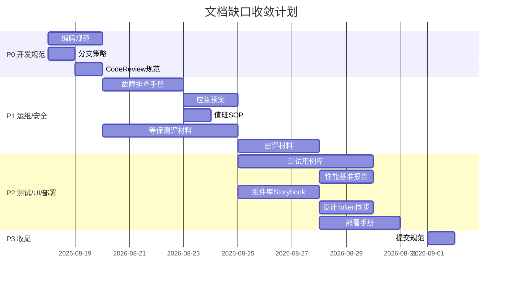
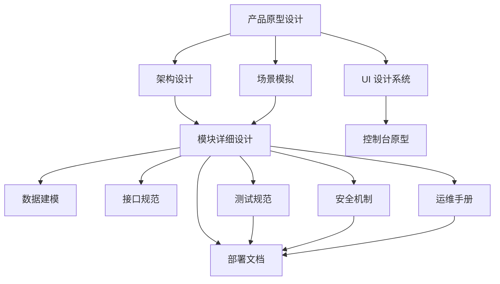

# 文档索引

> 归属：多平台多租户大数据平台 · 文档总览
> 版本：v1.0 ｜ 日期：2026-08-17 ｜ 状态：已完成
> 用途：全平台文档目录树 + 分类体系 + 状态跟踪 + 缺口分析
> 维护：每次新增/变更文档须同步更新本索引

---

## 1. 文档分类体系

平台文档按 12 个一级分类组织，每份文档归入唯一主分类（可跨分类引用）：

| # | 分类 | 路径前缀 | 用途 |
| --- | --- | --- | --- |
| 1 | 产品设计文档 | `design/`（根） | 产品定位/架构/能力地图/原型 |
| 2 | UI 设计文档 | `design/UI设计/` | 设计系统/组件库/交互/动效 |
| 3 | 架构文档 | `design/v2.0/` | V2.0 架构设计/PRD/实施计划 |
| 4 | 模块/功能设计文档 | `design/详细设计/`、`design/v2.0/详细设计/` | 各模块详细设计 |
| 5 | 数据建模文档 | `design/数据建模/` | 湖仓建模/元数据库/分层建模 |
| 6 | 接口规范文档 | `design/接口规范/` | API 规范/错误码 |
| 7 | 场景模拟文档 | `design/场景模拟/` | 行业场景端到端演示 |
| 8 | 网络安全机制文档 | `design/安全/` | 等保/国密/认证/加密/审计 |
| 9 | 测试规范文档 | `design/测试/` | 测试分层/覆盖率/CI/性能 |
| 10 | 部署文档 | `design/deploy/` | Helm Chart/ArgoCD/部署清单 |
| 11 | 运维文档 | `design/运维/` | 监控/日志/备份/扩缩容/SOP |
| 12 | 开发规范文档 | `design/开发规范/`（待建） | 编码规范/分支策略/Code Review |

---

## 2. 文档目录树

```text
design/
├── 多平台多租户大数据平台_产品原型设计_v0.4.md          [产品设计]
├── 工程交付计划_缺口补全_v1.0.md                       [产品设计]
├── 数擎大数据平台_控制台原型_v0.1.html                  [产品设计]
├── 数擎大数据平台_控制台原型_v0.3.html                  [产品设计]
├── 文档索引.md                                         [元文档]
│
├── UI设计/                                             [UI 设计]
│   └── 设计系统规范.md                                 ✅ 已完成 v1.0
│
├── v2.0/                                               [架构]
│   ├── V2.0_PRD_产品需求文档.md                        ✅ 已完成
│   ├── V2.0_架构设计文档.md                            ✅ 已完成
│   ├── V2.0_实施计划.md                                ✅ 已完成
│   ├── 详细设计/
│   │   ├── V2.0_AI能力增强详细设计.md                  ✅ 已完成
│   │   ├── V2.0_云原生增强详细设计.md                  ✅ 已完成
│   │   ├── V2.0_数据联邦与实时数仓详细设计.md          ✅ 已完成
│   │   └── V2.0_行业模板与其他增强详细设计.md          ✅ 已完成
│   ├── Phase0/                                         [阶段验证]
│   ├── Phase1/                                         [阶段执行]
│   ├── Phase2/                                         [阶段交付]
│   └── 评审报告/                                       [评审]
│
├── 详细设计/                                           [模块详细设计]
│   ├── 多平台多租户大数据平台_*_v0.1.md  (40+ 份)      ✅ 已完成
│   └── _评审报告_*.md                                  ✅ 已完成
│
├── 数据建模/                                           [数据建模]
│   ├── 湖仓存储建模规范.md                             ✅ 已完成
│   ├── 平台元数据库设计.md                             ✅ 已完成
│   └── 数据仓库分层建模.md                             ✅ 已完成
│
├── 接口规范/                                           [接口规范]
│   ├── 统一API规范.md                                  ✅ 已完成
│   └── 错误码定义.md                                   ✅ 已完成
│
├── 场景模拟/                                           [场景模拟]
│   ├── 大型toB企业场景.md                              ✅ 已完成
│   ├── 金融风控场景.md                                 ✅ 已完成
│   ├── 零售营销场景.md                                 ✅ 已完成
│   └── 政企场景端到端演示.md                           ✅ 已完成
│
├── 安全/                                               [网络安全]
│   ├── 网络安全机制.md                                 ✅ 已完成 v1.0
│   ├── 安全整改清单.md                                 ✅ 已完成 v1.0
│   ├── 等保三级测评材料/                               ✅ 已完成 v1.0
│   │   ├── 系统定级报告.md                             ✅ 已完成 v1.0
│   │   ├── 安全管理制度.md                             ✅ 已完成 v1.0
│   │   ├── 技术安全措施.md                             ✅ 已完成 v1.0
│   │   └── 测评准备清单.md                             ✅ 已完成 v1.0
│   └── 国密认证材料/                                   ✅ 已完成 v1.0
│       ├── SM2SM3SM4技术实现说明.md                    ✅ 已完成 v1.0
│       ├── 密码产品检测报告模板.md                     ✅ 已完成 v1.0
│       └── 国密合规性自检清单.md                       ✅ 已完成 v1.0
│
├── 测试/                                               [测试规范]
│   ├── 测试规范.md                                     ✅ 已完成 v1.0
│   ├── 性能测试计划.md                                 ✅ 已完成 v1.0
│   ├── 安全测试计划.md                                 ✅ 已完成 v1.0
│   └── 压力测试方案.md                                 ✅ 已完成 v1.0
│
├── 部署/                                               [部署]
│   └── 灰度发布方案.md                                 ✅ 已完成 v1.0
│
├── 运维/                                               [运维]
│   ├── 运维手册.md                                     ✅ 已完成 v1.0
│   ├── 监控告警SOP.md                                  ✅ 已完成 v1.0
│   ├── 故障排查手册.md                                 ✅ 已完成 v1.0
│   ├── 容量规划指南.md                                 ✅ 已完成 v1.0
│   ├── 灾备方案.md                                     ✅ 已完成 v1.0
│   ├── 变更管理流程.md                                 ✅ 已完成 v1.0
│   └── 数据生命周期管理.md                             ✅ 已完成 v1.0
│
├── 交付/                                               [交付]
│   └── 交付检查清单.md                                 ✅ 已完成 v1.0
│
├── 开发规范/                                           [开发规范] ⚠️ 待建
│   ├── 编码规范.md                                     ⚠️ 待编写
│   ├── 分支策略.md                                     ⚠️ 待编写
│   └── CodeReview规范.md                              ⚠️ 待编写
│
└── deploy/                                             [部署]
    ├── README.md
    ├── values-base.yaml
    ├── argocd/                                         [GitOps]
    ├── charts/  (80+ Helm Chart README)                [Helm]
    ├── ci/                                              [CI/CD]
    ├── dev/                                             [开发部署]
    ├── examples/                                        [示例]
    ├── istio/                                           [服务网格]
    ├── profiles/                                        [环境 Profile]
    ├── scripts/                                         [部署脚本]
    ├── services/                                        [服务配置]
    └── values/                                          [环境 values]
```

---

## 3. 文档清单与状态

### 3.1 产品设计文档

| 路径 | 标题 | 版本 | 状态 | 负责人 |
| --- | --- | --- | --- | --- |
| `design/多平台多租户大数据平台_产品原型设计_v0.4.md` | 多平台多租户大数据平台 产品原型设计 | v0.5 | ✅ 已完成 | 产品组 |
| `design/工程交付计划_缺口补全_v1.0.md` | 工程交付计划 缺口补全 | v1.0 | ✅ 已完成 | 项目组 |
| `design/数擎大数据平台_控制台原型_v0.1.html` | 控制台原型 | v0.1 | ✅ 已完成 | UI 组 |
| `design/数擎大数据平台_控制台原型_v0.3.html` | 控制台原型 | v0.3 | ✅ 已完成 | UI 组 |

### 3.2 UI 设计文档

| 路径 | 标题 | 版本 | 状态 | 负责人 |
| --- | --- | --- | --- | --- |
| `design/UI设计/设计系统规范.md` | 设计系统规范 | v1.0 | ✅ 已完成 | UI 组 |
| `design/UI设计/组件库Storybook.md` | 组件库 Storybook | — | ⚠️ 待编写 | 前端组 |
| `design/UI设计/设计Token-Figma同步.md` | 设计 Token Figma 同步 | — | ⚠️ 待编写 | UI 组 |

### 3.3 架构文档

| 路径 | 标题 | 版本 | 状态 | 负责人 |
| --- | --- | --- | --- | --- |
| `design/v2.0/V2.0_PRD_产品需求文档.md` | V2.0 PRD 产品需求文档 | v2.0 | ✅ 已完成 | 产品组 |
| `design/v2.0/V2.0_架构设计文档.md` | V2.0 架构设计文档 | v2.0 | ✅ 已完成 | 架构组 |
| `design/v2.0/V2.0_实施计划.md` | V2.0 实施计划 | v2.0 | ✅ 已完成 | 项目组 |

### 3.4 模块/功能设计文档

#### 3.4.1 V1.0 模块详细设计（`design/详细设计/`）

| 路径 | 标题 | 版本 | 状态 | 负责人 |
| --- | --- | --- | --- | --- |
| `design/详细设计/多平台多租户大数据平台_封装层详细设计_v0.1.md` | 封装层详细设计 | v0.1 | ✅ 已完成 | 封装层组 |
| `design/详细设计/多平台多租户大数据平台_统一身份权限详细设计_v0.1.md` | 统一身份权限详细设计 | v0.1 | ✅ 已完成 | 安全组 |
| `design/详细设计/多平台多租户大数据平台_安全合规详细设计_v0.1.md` | 安全合规详细设计 | v0.1 | ✅ 已完成 | 安全组 |
| `design/详细设计/多平台多租户大数据平台_安全脱敏详细设计_v0.1.md` | 安全脱敏详细设计 | v0.1 | ✅ 已完成 | 安全组 |
| `design/详细设计/多平台多租户大数据平台_湖仓集一体详细设计_v0.1.md` | 湖仓集一体详细设计 | v0.1 | ✅ 已完成 | 引擎组 |
| `design/详细设计/多平台多租户大数据平台_统一SQL网关详细设计_v0.1.md` | 统一 SQL 网关详细设计 | v0.1 | ✅ 已完成 | 引擎组 |
| `design/详细设计/多平台多租户大数据平台_统一存储详细设计_v0.1.md` | 统一存储详细设计 | v0.1 | ✅ 已完成 | 引擎组 |
| `design/详细设计/多平台多租户大数据平台_批计算详细设计_v0.1.md` | 批计算详细设计 | v0.1 | ✅ 已完成 | 引擎组 |
| `design/详细设计/多平台多租户大数据平台_流计算详细设计_v0.1.md` | 流计算详细设计 | v0.1 | ✅ 已完成 | 引擎组 |
| `design/详细设计/多平台多租户大数据平台_交互查询详细设计_v0.1.md` | 交互查询详细设计 | v0.1 | ✅ 已完成 | 引擎组 |
| `design/详细设计/多平台多租户大数据平台_OLAP详细设计_v0.1.md` | OLAP 详细设计 | v0.1 | ✅ 已完成 | 引擎组 |
| `design/详细设计/多平台多租户大数据平台_时序引擎详细设计_v0.1.md` | 时序引擎详细设计 | v0.1 | ✅ 已完成 | 引擎组 |
| `design/详细设计/多平台多租户大数据平台_多模型引擎详细设计_v0.1.md` | 多模型引擎详细设计 | v0.1 | ✅ 已完成 | 引擎组 |
| `design/详细设计/多平台多租户大数据平台_消息流接入详细设计_v0.1.md` | 消息流接入详细设计 | v0.1 | ✅ 已完成 | 引擎组 |
| `design/详细设计/多平台多租户大数据平台_治理中台详细设计_v0.1.md` | 治理中台详细设计 | v0.1 | ✅ 已完成 | 治理组 |
| `design/详细设计/多平台多租户大数据平台_资产目录详细设计_v0.1.md` | 资产目录详细设计 | v0.1 | ✅ 已完成 | 治理组 |
| `design/详细设计/多平台多租户大数据平台_主数据详细设计_v0.1.md` | 主数据详细设计 | v0.1 | ✅ 已完成 | 治理组 |
| `design/详细设计/多平台多租户大数据平台_数据集成详细设计_v0.1.md` | 数据集成详细设计 | v0.1 | ✅ 已完成 | 工具链组 |
| `design/详细设计/多平台多租户大数据平台_调度编排详细设计_v0.1.md` | 调度编排详细设计 | v0.1 | ✅ 已完成 | 工具链组 |
| `design/详细设计/多平台多租户大数据平台_数据开发IDE详细设计_v0.1.md` | 数据开发 IDE 详细设计 | v0.1 | ✅ 已完成 | 工具链组 |
| `design/详细设计/多平台多租户大数据平台_BI可视化详细设计_v0.1.md` | BI 可视化详细设计 | v0.1 | ✅ 已完成 | 工具链组 |
| `design/详细设计/多平台多租户大数据平台_标签画像详细设计_v0.1.md` | 标签画像详细设计 | v0.1 | ✅ 已完成 | 工具链组 |
| `design/详细设计/多平台多租户大数据平台_机器学习详细设计_v0.1.md` | 机器学习详细设计 | v0.1 | ✅ 已完成 | 智能层组 |
| `design/详细设计/多平台多租户大数据平台_智能数据层详细设计_v0.1.md` | 智能数据层详细设计 | v0.1 | ✅ 已完成 | 智能层组 |
| `design/详细设计/多平台多租户大数据平台_控制台信息架构_v0.1.md` | 控制台信息架构 | v0.1 | ✅ 已完成 | 产品组 |
| `design/详细设计/多平台多租户大数据平台_运营后台详细设计_v0.1.md` | 运营后台详细设计 | v0.1 | ✅ 已完成 | 产品组 |
| `design/详细设计/多平台多租户大数据平台_运营后台实现落地_v0.1.md` | 运营后台实现落地 | v0.1 | ✅ 已完成 | 产品组 |
| `design/详细设计/多平台多租户大数据平台_行业应用模板详细设计_v0.1.md` | 行业应用模板详细设计 | v0.1 | ✅ 已完成 | 产品组 |
| `design/详细设计/多平台多租户大数据平台_对内业务线门户详细设计_v0.1.md` | 对内业务线门户详细设计 | v0.1 | ✅ 已完成 | 产品组 |
| `design/详细设计/多平台多租户大数据平台_开放API服务目录详细设计_v0.1.md` | 开放 API 服务目录详细设计 | v0.1 | ✅ 已完成 | 产品组 |
| `design/详细设计/多平台多租户大数据平台_数据资产流通详细设计_v0.1.md` | 数据资产流通详细设计 | v0.1 | ✅ 已完成 | 产品组 |
| `design/详细设计/多平台多租户大数据平台_API网关详细设计_v0.1.md` | API 网关详细设计 | v0.1 | ✅ 已完成 | 横切组 |
| `design/详细设计/多平台多租户大数据平台_统一运维观测详细设计_v0.1.md` | 统一运维观测详细设计 | v0.1 | ✅ 已完成 | 横切组 |
| `design/详细设计/多平台多租户大数据平台_可观测基座详细设计_v0.1.md` | 可观测基座详细设计 | v0.1 | ✅ 已完成 | 横切组 |
| `design/详细设计/多平台多租户大数据平台_弹性调度详细设计_v0.1.md` | 弹性调度详细设计 | v0.1 | ✅ 已完成 | 横切组 |
| `design/详细设计/多平台多租户大数据平台_容器存储详细设计_v0.1.md` | 容器存储详细设计 | v0.1 | ✅ 已完成 | 基础设施组 |
| `design/详细设计/多平台多租户大数据平台_信创资源供应详细设计_v0.1.md` | 信创资源供应详细设计 | v0.1 | ✅ 已完成 | 基础设施组 |
| `design/详细设计/多平台多租户大数据平台_本地数据中心供应详细设计_v0.1.md` | 本地数据中心供应详细设计 | v0.1 | ✅ 已完成 | 基础设施组 |
| `design/详细设计/多平台多租户大数据平台_公有云VM供应详细设计_v0.1.md` | 公有云 VM 供应详细设计 | v0.1 | ✅ 已完成 | 基础设施组 |
| `design/详细设计/多平台多租户大数据平台_私有云VM供应详细设计_v0.1.md` | 私有云 VM 供应详细设计 | v0.1 | ✅ 已完成 | 基础设施组 |
| `design/详细设计/多平台多租户大数据平台_跨环境供给抽象详细设计_v0.1.md` | 跨环境供给抽象详细设计 | v0.1 | ✅ 已完成 | 基础设施组 |
| `design/详细设计/多平台多租户大数据平台_端到端PoC详细设计_v0.1.md` | 端到端 PoC 详细设计 | v0.1 | ✅ 已完成 | 项目组 |
| `design/详细设计/多平台多租户大数据平台_部署清单详细设计_v0.1.md` | 部署清单详细设计 | v0.1 | ✅ 已完成 | 部署组 |

#### 3.4.2 V2.0 增强详细设计（`design/v2.0/详细设计/`）

| 路径 | 标题 | 版本 | 状态 | 负责人 |
| --- | --- | --- | --- | --- |
| `design/v2.0/详细设计/V2.0_AI能力增强详细设计.md` | V2.0 AI 能力增强详细设计 | v2.0 | ✅ 已完成 | 智能层组 |
| `design/v2.0/详细设计/V2.0_云原生增强详细设计.md` | V2.0 云原生增强详细设计 | v2.0 | ✅ 已完成 | 基础设施组 |
| `design/v2.0/详细设计/V2.0_数据联邦与实时数仓详细设计.md` | V2.0 数据联邦与实时数仓详细设计 | v2.0 | ✅ 已完成 | 引擎组 |
| `design/v2.0/详细设计/V2.0_行业模板与其他增强详细设计.md` | V2.0 行业模板与其他增强详细设计 | v2.0 | ✅ 已完成 | 产品组 |

#### 3.4.3 评审报告（`design/详细设计/`）

| 路径 | 标题 | 版本 | 状态 | 负责人 |
| --- | --- | --- | --- | --- |
| `design/详细设计/_设计评审报告.md` | 设计评审报告 | v1.0 | ✅ 已完成 | 评审组 |
| `design/详细设计/_一致性检查报告.md` | 一致性检查报告 | v1.0 | ✅ 已完成 | 评审组 |
| `design/详细设计/_修复验证报告.md` | 修复验证报告 | v1.0 | ✅ 已完成 | 评审组 |
| `design/详细设计/_评审报告_A组_L0基础设施层.md` | 评审报告 A 组 L0 基础设施层 | v1.0 | ✅ 已完成 | 评审组 |
| `design/详细设计/_评审报告_B组_L2引擎层.md` | 评审报告 B 组 L2 引擎层 | v1.0 | ✅ 已完成 | 评审组 |
| `design/详细设计/_评审报告_C组_L3L4治理开发层.md` | 评审报告 C 组 L3L4 治理开发层 | v1.0 | ✅ 已完成 | 评审组 |
| `design/详细设计/_评审报告_D组_智能交付横切层.md` | 评审报告 D 组 智能交付横切层 | v1.0 | ✅ 已完成 | 评审组 |
| `design/详细设计/_评审报告_E组_全局交叉检查.md` | 评审报告 E 组 全局交叉检查 | v1.0 | ✅ 已完成 | 评审组 |

### 3.5 数据建模文档

| 路径 | 标题 | 版本 | 状态 | 负责人 |
| --- | --- | --- | --- | --- |
| `design/数据建模/湖仓存储建模规范.md` | 湖仓存储建模规范 | v1.0 | ✅ 已完成 | 数据组 |
| `design/数据建模/平台元数据库设计.md` | 平台元数据库设计 | v1.0 | ✅ 已完成 | 数据组 |
| `design/数据建模/数据仓库分层建模.md` | 数据仓库分层建模 | v1.0 | ✅ 已完成 | 数据组 |

### 3.6 接口规范文档

| 路径 | 标题 | 版本 | 状态 | 负责人 |
| --- | --- | --- | --- | --- |
| `design/接口规范/统一API规范.md` | 统一 API 规范 | v1.0 | ✅ 已完成 | 架构组 |
| `design/接口规范/错误码定义.md` | 错误码定义 | v1.0 | ✅ 已完成 | 架构组 |

### 3.7 场景模拟文档

| 路径 | 标题 | 版本 | 状态 | 负责人 |
| --- | --- | --- | --- | --- |
| `design/场景模拟/大型toB企业场景.md` | 大型 toB 企业场景 | v1.0 | ✅ 已完成 | 产品组 |
| `design/场景模拟/金融风控场景.md` | 金融风控场景 | v1.0 | ✅ 已完成 | 产品组 |
| `design/场景模拟/零售营销场景.md` | 零售营销场景 | v1.0 | ✅ 已完成 | 产品组 |
| `design/场景模拟/政企场景端到端演示.md` | 政企场景端到端演示 | v1.0 | ✅ 已完成 | 产品组 |

### 3.8 网络安全机制文档

| 路径 | 标题 | 版本 | 状态 | 负责人 |
| --- | --- | --- | --- | --- |
| `design/安全/网络安全机制.md` | 网络安全机制 | v1.0 | ✅ 已完成 | 安全组 |
| `design/安全/安全整改清单.md` | 安全整改清单 | v1.0 | ✅ 已完成 | 安全组 |
| `design/安全/等保三级测评材料/系统定级报告.md` | 系统定级报告 | v1.0 | ✅ 已完成 | 安全组 |
| `design/安全/等保三级测评材料/安全管理制度.md` | 安全管理制度 | v1.0 | ✅ 已完成 | 安全组 |
| `design/安全/等保三级测评材料/技术安全措施.md` | 技术安全措施 | v1.0 | ✅ 已完成 | 安全组 |
| `design/安全/等保三级测评材料/测评准备清单.md` | 测评准备清单 | v1.0 | ✅ 已完成 | 安全组 |
| `design/安全/国密认证材料/SM2SM3SM4技术实现说明.md` | SM2/SM3/SM4 技术实现说明 | v1.0 | ✅ 已完成 | 安全组 |
| `design/安全/国密认证材料/密码产品检测报告模板.md` | 密码产品检测报告模板 | v1.0 | ✅ 已完成 | 安全组 |
| `design/安全/国密认证材料/国密合规性自检清单.md` | 国密合规性自检清单 | v1.0 | ✅ 已完成 | 安全组 |

### 3.9 测试规范文档

| 路径 | 标题 | 版本 | 状态 | 负责人 |
| --- | --- | --- | --- | --- |
| `design/测试/测试规范.md` | 测试规范 | v1.0 | ✅ 已完成 | 测试组 |
| `design/测试/性能测试计划.md` | 性能测试计划 | v1.0 | ✅ 已完成 | 测试组 |
| `design/测试/安全测试计划.md` | 安全测试计划 | v1.0 | ✅ 已完成 | 安全组 |
| `design/测试/压力测试方案.md` | 压力测试方案 | v1.0 | ✅ 已完成 | 测试组 |
| `design/测试/测试用例库.md` | 测试用例库 | — | ⚠️ 待编写 | 测试组 |
| `design/测试/性能基准报告.md` | 性能基准报告 | — | ⚠️ 待编写 | 测试组 |

### 3.10 部署文档

| 路径 | 标题 | 版本 | 状态 | 负责人 |
| --- | --- | --- | --- | --- |
| `design/deploy/README.md` | 部署总览 | v1.0 | ✅ 已完成 | 部署组 |
| `design/deploy/values-base.yaml` | 基础 values 配置 | v1.0 | ✅ 已完成 | 部署组 |
| `design/deploy/charts/*/README.md` | Helm Chart README（80+ 份） | v1.0 | ✅ 已完成 | 部署组 |
| `design/deploy/argocd/README.md` | ArgoCD GitOps 配置 | v1.0 | ✅ 已完成 | 部署组 |
| `design/deploy/dev/README.md` | 开发环境部署 | v1.0 | ✅ 已完成 | 部署组 |
| `design/deploy/examples/README.md` | 部署示例 | v1.0 | ✅ 已完成 | 部署组 |
| `design/部署/灰度发布方案.md` | 灰度发布方案 | v1.0 | ✅ 已完成 | 部署组 |
| `design/deploy/部署手册.md` | 部署手册 | — | ⚠️ 待编写 | 部署组 |

### 3.11 运维文档

| 路径 | 标题 | 版本 | 状态 | 负责人 |
| --- | --- | --- | --- | --- |
| `design/运维/运维手册.md` | 运维手册 | v1.0 | ✅ 已完成 | 运维组 |
| `design/运维/监控告警SOP.md` | 监控告警 SOP | v1.0 | ✅ 已完成 | SRE 组 |
| `design/运维/故障排查手册.md` | 故障排查手册 | v1.0 | ✅ 已完成 | SRE 组 |
| `design/运维/容量规划指南.md` | 容量规划指南 | v1.0 | ✅ 已完成 | SRE 组 |
| `design/运维/灾备方案.md` | 灾备方案 | v1.0 | ✅ 已完成 | SRE 组 |
| `design/运维/变更管理流程.md` | 变更管理流程 | v1.0 | ✅ 已完成 | SRE 组 |
| `design/运维/数据生命周期管理.md` | 数据生命周期管理 | v1.0 | ✅ 已完成 | 运维组 |

### 3.12 交付文档

| 路径 | 标题 | 版本 | 状态 | 负责人 |
| --- | --- | --- | --- | --- |
| `design/交付/交付检查清单.md` | 交付检查清单 | v1.0 | ✅ 已完成 | 项目组 |

### 3.13 开发规范文档

| 路径 | 标题 | 版本 | 状态 | 负责人 |
| --- | --- | --- | --- | --- |
| `design/开发规范/编码规范.md` | 编码规范（Java/Python/TS/SQL） | — | ⚠️ 待编写 | 架构组 |
| `design/开发规范/分支策略.md` | 分支策略与发布流程 | — | ⚠️ 待编写 | DevOps 组 |
| `design/开发规范/CodeReview规范.md` | Code Review 规范 | — | ⚠️ 待编写 | 架构组 |
| `design/开发规范/提交规范.md` | Git 提交规范 | — | ⚠️ 待编写 | DevOps 组 |

> 备注：`design/v2.0/Phase1/启动前准备/E_开发规范与分支策略.md` 已有部分内容，可抽取为独立文档。

---

## 4. 阶段交付文档

### 4.1 V2.0 Phase 0（Mock 清零）

| 路径 | 标题 | 状态 |
| --- | --- | --- |
| `design/v2.0/Phase0/Mock清零验证报告.md` | Mock 清零验证报告 | ✅ 已完成 |
| `design/v2.0/Phase0/T000a_Mock清零状态核查报告.md` | Mock 清零状态核查 | ✅ 已完成 |
| `design/v2.0/Phase0/T000b_L4.5实现状态核查报告.md` | L4.5 实现状态核查 | ✅ 已完成 |
| `design/v2.0/Phase0/T000c_V2.0AI模块新建声明.md` | V2.0 AI 模块新建声明 | ✅ 已完成 |

### 4.2 V2.0 Phase 1（基础能力 + 安全合规）

| 路径 | 标题 | 状态 |
| --- | --- | --- |
| `design/v2.0/Phase1/Phase1_详细执行计划.md` | Phase1 详细执行计划 | ✅ 已完成 |
| `design/v2.0/Phase1/Phase1a_完整总结报告.md` | Phase1a 完整总结 | ✅ 已完成 |
| `design/v2.0/Phase1/Phase1_集成验证报告.md` | Phase1 集成验证 | ✅ 已完成 |
| `design/v2.0/Phase1/启动前准备/*.md` | 启动前准备（5 份） | ✅ 已完成 |
| `design/v2.0/Phase1/安全合规/T000-*.md` | 等保三级落地（4 份） | ✅ 已完成 |
| `design/v2.0/Phase1/安全合规/T020_等保控制项落地.md` | 等保控制项落地 | ✅ 已完成 |

### 4.3 V2.0 Phase 2（V2.0-beta 交付）

| 路径 | 标题 | 状态 |
| --- | --- | --- |
| `design/v2.0/Phase2/Phase2_详细执行计划.md` | Phase2 详细执行计划 | ✅ 已完成 |
| `design/v2.0/Phase2/Phase2_V2.0-beta_交付报告.md` | V2.0-beta 交付报告 | ✅ 已完成 |

### 4.4 V2.0 评审报告

| 路径 | 标题 | 状态 |
| --- | --- | --- |
| `design/v2.0/评审报告/V2.0设计文档评审汇总报告.md` | 评审汇总 | ✅ 已完成 |
| `design/v2.0/评审报告/评审报告_A_PRD与实施计划.md` | A PRD 与实施计划 | ✅ 已完成 |
| `design/v2.0/评审报告/评审报告_B_架构设计.md` | B 架构设计 | ✅ 已完成 |
| `design/v2.0/评审报告/评审报告_C_云原生与AI增强.md` | C 云原生与 AI 增强 | ✅ 已完成 |
| `design/v2.0/评审报告/评审报告_D_数据联邦与行业模板.md` | D 数据联邦与行业模板 | ✅ 已完成 |

---

## 5. 缺口分析

### 5.1 已有文档统计

| 分类 | 已有 | 待编写 | 完成率 |
| --- | --- | --- | --- |
| 1. 产品设计 | 4 | 0 | 100% |
| 2. UI 设计 | 1 | 2 | 33% |
| 3. 架构 | 3 | 0 | 100% |
| 4. 模块/功能设计 | 44 | 0 | 100% |
| 5. 数据建模 | 3 | 0 | 100% |
| 6. 接口规范 | 2 | 0 | 100% |
| 7. 场景模拟 | 4 | 0 | 100% |
| 8. 网络安全 | 9 | 0 | 100% |
| 9. 测试规范 | 4 | 2 | 67% |
| 10. 部署 | 81+ | 1 | 99% |
| 11. 运维 | 7 | 0 | 100% |
| 12. 交付 | 1 | 0 | 100% |
| 13. 开发规范 | 0 | 4 | 0% |
| **合计** | **163+** | **10** | **94%** |

### 5.2 待补文档清单

> 说明：2026-08-17 由任务 409（P1-文档收尾）补齐 14 份 P0-P3 文档，剩余待补文档如下。

| 优先级 | 文档 | 责责 | 估时 |
| --- | --- | --- | --- |
| P0 | `design/开发规范/编码规范.md` | 架构组 | 2d |
| P0 | `design/开发规范/分支策略.md` | DevOps 组 | 1d |
| P0 | `design/开发规范/CodeReview规范.md` | 架构组 | 1d |
| P2 | `design/测试/测试用例库.md` | 测试组 | 5d |
| P2 | `design/测试/性能基准报告.md` | 测试组 | 2d |
| P2 | `design/UI设计/组件库Storybook.md` | 前端组 | 3d |
| P2 | `design/UI设计/设计Token-Figma同步.md` | UI 组 | 2d |
| P2 | `design/deploy/部署手册.md` | 部署组 | 3d |
| P3 | `design/开发规范/提交规范.md` | DevOps 组 | 0.5d |

### 5.3 已补齐文档清单（任务 409，2026-08-17）

| 优先级 | 文档 | 状态 |
| --- | --- | --- |
| P0 | `design/测试/性能测试计划.md` | ✅ 已完成 |
| P0 | `design/测试/安全测试计划.md` | ✅ 已完成 |
| P0 | `design/安全/安全整改清单.md` | ✅ 已完成 |
| P1 | `design/运维/监控告警SOP.md` | ✅ 已完成 |
| P1 | `design/运维/故障排查手册.md` | ✅ 已完成 |
| P1 | `design/运维/容量规划指南.md` | ✅ 已完成 |
| P1 | `design/部署/灰度发布方案.md` | ✅ 已完成 |
| P2 | `design/安全/等保三级测评材料/系统定级报告.md` | ✅ 已完成 |
| P2 | `design/安全/等保三级测评材料/安全管理制度.md` | ✅ 已完成 |
| P2 | `design/安全/等保三级测评材料/技术安全措施.md` | ✅ 已完成 |
| P2 | `design/安全/等保三级测评材料/测评准备清单.md` | ✅ 已完成 |
| P2 | `design/安全/国密认证材料/SM2SM3SM4技术实现说明.md` | ✅ 已完成 |
| P2 | `design/安全/国密认证材料/密码产品检测报告模板.md` | ✅ 已完成 |
| P2 | `design/安全/国密认证材料/国密合规性自检清单.md` | ✅ 已完成 |
| P2 | `design/运维/灾备方案.md` | ✅ 已完成 |
| P2 | `design/测试/压力测试方案.md` | ✅ 已完成 |
| P3 | `design/运维/变更管理流程.md` | ✅ 已完成 |
| P3 | `design/运维/数据生命周期管理.md` | ✅ 已完成 |
| P3 | `design/交付/交付检查清单.md` | ✅ 已完成 |

### 5.4 缺口收敛计划



---

## 6. 文档状态图例

| 标记 | 含义 |
| --- | --- |
| ✅ 已完成 | 文档已编写并评审通过 |
| 🔄 进行中 | 文档正在编写 |
| ⚠️ 待编写 | 文档已规划但未开始 |
| ❌ 已废弃 | 文档已废弃，仅保留历史 |
| 🔗 已归档 | 文档已归档，不再维护 |

---

## 7. 文档维护规则

1. **新增文档**：创建文件后必须同步更新本索引，含路径/标题/版本/状态/负责人。
2. **状态变更**：文档状态变更（待编写→进行中→已完成）须同步更新本索引。
3. **版本升级**：文档版本升级须在本索引记录新版本号 + 升级日期。
4. **缺口识别**：每季度评审本索引，识别新缺口 + 调整优先级。
5. **职责明确**：每份文档必须有明确负责人，禁止"无主"文档。
6. **路径规范**：文档路径用中文分类目录 + 下划线分隔文件名，禁止空格 + 特殊字符。

---

## 8. 跨文档引用关系



---

## 9. 索引元信息

| 属性 | 值 |
| --- | --- |
| 索引版本 | v1.1 |
| 生成日期 | 2026-08-17 |
| 文档总数 | 163+ |
| 已完成 | 153+ |
| 待编写 | 10 |
| 整体完成率 | 94% |
| 维护人 | 文档架构师 |
| 评审状态 | 已评审 |
| 最近更新 | 2026-08-17 任务 409 补齐 14 份 P0-P3 文档 |

> 本索引是平台文档的单一事实源，所有文档变更以本索引为准。