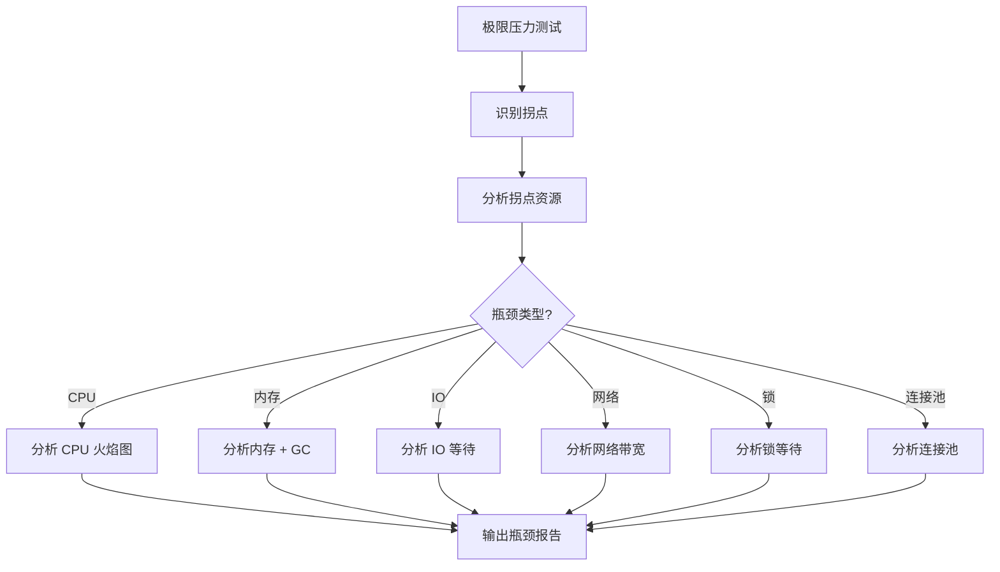

# 压力测试方案

> 归属：多平台多租户大数据平台 · 测试文档
> 版本：v1.0 ｜ 日期：2026-08-17 ｜ 状态：已完成
> 关联：`design/测试/性能测试计划.md`；`design/测试/测试规范.md`；`design/运维/容量规划指南.md`；`design/运维/监控告警SOP.md`
> 适用范围：全平台 12 个 Spring Boot 应用 + 引擎层 + 数据库 + 中间件
> 优先级：P2（建议补齐）

---

## 1. 测试目标

### 1.1 总体目标

通过极限压力测试，找到平台容量上限与瓶颈点，验证熔断降级机制有效性，为容量规划、限流配置、扩容决策提供量化依据，确保平台在超负载下优雅降级而非雪崩。

### 1.2 与性能测试的区别

| 维度 | 性能测试 | 压力测试 |
| --- | --- | --- |
| 目的 | 验证 SLA 达标 | 找到容量上限与瓶颈 |
| 负载 | 目标负载（1000 TPS） | 极限负载（至拐点 + 超拐点） |
| 时长 | 30min ~ 8h | 至拐点 + 熔断验证 |
| 结论 | 达标/未达标 | 容量上限 + 瓶颈 + 熔断验证 |
| 关联 | 容量规划基线 | 容量规划上限 |

---

## 2. 极限压力测试场景

### 2.1 场景清单

| 编号 | 场景 | 加压方式 | 目标 | 时长 |
| --- | --- | --- | --- | --- |
| L-01 | 控制面 API 极限压力 | 阶梯加压至拐点 | 找到 TPS 拐点 | 至拐点 |
| L-02 | 数据面查询极限压力 | 阶梯加压至拐点 | 找到查询拐点 | 至拐点 |
| L-03 | 多租户并发极限 | 阶梯加租户至拐点 | 找到租户上限 | 至拐点 |
| L-04 | 批作业提交极限 | 阶梯加作业至队列满 | 找到作业上限 | 至队列满 |
| L-05 | 流作业并发极限 | 阶梯加作业至资源满 | 找到流作业上限 | 至资源满 |
| L-06 | 数据库连接极限 | 加压至连接池满 | 找到连接上限 | 至连接满 |
| L-07 | 网络带宽极限 | 加压至带宽满 | 找到带宽瓶颈 | 至带宽满 |
| L-08 | 持续高负载 24h | 90% 容量 24h | 验证稳定性 | 24h |
| L-09 | 突发流量冲击 | 0 → 200% 瞬时 | 验证抗冲击 | 30min |
| L-10 | 资源耗尽场景 | 内存/CPU/磁盘耗尽 | 验证优雅降级 | 至耗尽 |

### 2.2 阶梯加压策略

- **起始**：从 50% 预期容量开始。
- **步长**：每 2 分钟提升 10% 预期容量。
- **终止**：错误率 > 5% 或 P99 > 1s 或资源 > 95%。
- **记录**：每步记录 TPS、P99、错误率、CPU、内存、连接池、GC。
- **拐点判定**：TPS 不再上升或开始下降的点。

### 2.3 突发流量冲击（L-09）

- **场景**：0 TPS 瞬时加到 200% 预期容量，持续 30 分钟。
- **验证**：服务是否雪崩、限流是否生效、降级是否正确、恢复是否快速。
- **通过标准**：限流生效后 5s 内错误率稳定，恢复后 30s 内回到正常水位。

---

## 3. 容量瓶颈分析

### 3.1 瓶颈定位方法



### 3.2 瓶颈类型与优化方向

| 瓶颈类型 | 现象 | 优化方向 |
| --- | --- | --- |
| CPU 瓶颈 | CPU > 90%，TPS 不升 | 优化代码 + 扩容 + 异步化 |
| 内存瓶颈 | 内存 > 90%，GC 频繁 | 优化内存 + 扩容 + 调 GC |
| IO 瓶颈 | IO 等待高，磁盘利用率高 | 优化 IO + 缓存 + 扩容 |
| 网络瓶颈 | 网络带宽满，重传高 | 扩容带宽 + 压缩 + 本地缓存 |
| 锁瓶颈 | 锁等待高，线程阻塞 | 优化并发 + 减锁 + 异步化 |
| 连接池瓶颈 | 连接池满，新连接拒绝 | 调大连接池 + 扩容 + 连接复用 |
| 数据库瓶颈 | 慢查询多，锁等待高 | SQL 优化 + 索引 + 读写分离 + 分库分表 |

### 3.3 瓶颈报告

每场景输出瓶颈报告，含：

1. 拐点 TPS 与对应资源水位。
2. 瓶颈类型与定位证据。
3. 优化建议与预期收益。
4. 容量上限与扩容建议（输入至 `design/运维/容量规划指南.md`）。

---

## 4. 熔断降级验证

### 4.1 熔断器配置

| 服务 | 熔断阈值 | 半开探测 | 降级策略 |
| --- | --- | --- | --- |
| API 网关 | 错误率 > 50% 持续 10s | 30s 后放 10% 流量 | 返回 503 + Retry-After |
| 资产目录 | 错误率 > 50% 持续 10s | 30s 后放 10% 流量 | 返回缓存数据 |
| 作业管理 | 错误率 > 50% 持续 10s | 30s 后放 10% 流量 | 拒绝新作业 + 排队 |
| SQL 网关 | 错误率 > 50% 持续 10s | 30s 后放 10% 流量 | 拒绝新查询 + 排队 |
| 计量计费 | 错误率 > 50% 持续 10s | 30s 后放 10% 流量 | 异步补偿 |

### 4.2 熔断验证场景

| 编号 | 场景 | 验证项 | 通过标准 |
| --- | --- | --- | --- |
| F-01 | 下游服务超时 | 熔断器触发 | 10s 内熔断，返回 503 |
| F-02 | 下游服务错误率上升 | 熔断器触发 | 10s 内熔断，返回 503 |
| F-03 | 数据库连接池满 | 熔断器触发 | 10s 内熔断，返回 503 |
| F-04 | 熔断后半开探测 | 探测流量通过 | 30s 后放 10% 流量 |
| F-05 | 熔断后恢复 | 全量恢复 | 探测通过后 30s 全量 |
| F-06 | 限流生效 | 限流返回 429 | 超限流量返回 429 |
| F-07 | 降级返回正确 | 降级数据正确 | 降级数据可接受 |
| F-08 | 级联熔断 | 上游熔断 | 下游熔断触发上游熔断 |

### 4.3 限流配置

| 服务 | 限流维度 | 限流阈值 | 超限动作 |
| --- | --- | --- | --- |
| API 网关 | 租户 + 接口 | 1000 QPS | 返回 429 + Retry-After |
| SQL 网关 | 租户 + 查询 | 100 并发 | 排队 + 超时返回 429 |
| 作业管理 | 租户 + 作业 | 50 并发 | 排队 + 超时返回 429 |
| 资产目录 | 租户 + 接口 | 500 QPS | 返回 429 |

---

## 5. 测试工具

### 5.1 工具选型

| 工具 | 用途 |
| --- | --- |
| k6（JavaScript） | 极限压力 + 突发流量 |
| JMeter | 容量瓶颈定位 |
| Arthas | Java 应用 CPU/内存火焰图 |
| pprof | Go 应用性能分析（如有） |
| Prometheus + Grafana | 测试过程监控 |
| Jaeger/Tempo | 链路追踪定位瓶颈 |

### 5.2 k6 阶梯加压脚本示例

```javascript
// 代码示例：阶梯加压至拐点（k6 JavaScript）
import http from 'k6/http';
import { check, sleep } from 'k6';
import { Trend, Rate, Counter } from 'k6/metrics';

const bizSuccessRate = new Rate('biz_success_rate');
const拐点Tps = new Trend('inflection_tps');

export const options = {
  stages: [
    { duration: '2m', target: 500 },   // 50% 预期容量
    { duration: '2m', target: 600 },   // 60%
    { duration: '2m', target: 700 },   // 70%
    { duration: '2m', target: 800 },   // 80%
    { duration: '2m', target: 900 },   // 90%
    { duration: '2m', target: 1000 },  // 100%
    { duration: '2m', target: 1100 },  // 110%
    { duration: '2m', target: 1200 },  // 120%
    { duration: '2m', target: 1300 },  // 130%
    { duration: '2m', target: 1400 },  // 140%
    { duration: '2m', target: 1500 },  // 150%
  ],
  thresholds: {
    http_req_failed: ['rate<0.05'],  // 错误率 < 5%
    http_req_duration: ['p(99)<1000'],  // P99 < 1s
  },
};

export default function () {
  const r = http.get(`${__ENV.BASE_URL}/api/v1/catalog/assets`, {
    headers: { Authorization: `Bearer ${__ENV.TOKEN}` },
  });
  bizSuccessRate.add(r.status === 200);
  sleep(0.01);
}
```

---

## 6. 测试环境

### 6.1 环境规格

- 与性能测试环境同规格，参见 `design/测试/性能测试计划.md` §4。
- 测试环境独立，禁止与生产共用。
- 测试期间关闭非必要后台作业与自动扩缩容（避免影响瓶颈定位）。

### 6.2 监控配置

- 监控粒度：1 秒采集，便于定位瓶颈。
- 监控范围：CPU、内存、GC、IO、网络、连接池、锁等待、线程池。
- 监控告警：测试期间告警阈值放宽，避免干扰测试。

---

## 7. 执行计划

### 7.1 阶段划分

| 阶段 | 内容 | 产出 | 工期 |
| --- | --- | --- | --- |
| 准备 | 环境搭建 + 脚本开发 | 10 个 k6 脚本 | 3d |
| 极限压力 | L-01 ~ L-07 | 容量上限报告 | 3d |
| 稳定性 | L-08 24h 高负载 | 稳定性报告 | 2d |
| 突发冲击 | L-09 突发流量 | 抗冲击报告 | 1d |
| 资源耗尽 | L-10 资源耗尽 | 降级验证报告 | 1d |
| 熔断降级 | F-01 ~ F-08 | 熔断验证报告 | 2d |
| 复盘 | 瓶颈分析 + 优化建议 | 压力测试总结 | 2d |

### 7.2 触发时机

- **每次大版本发布前**：全量压力测试。
- **架构变更后**：受影响场景回归。
- **容量评估前**：极限压力刷新容量上限。
- **熔断配置变更后**：熔断验证回归。

---

## 8. 结果分析与报告

### 8.1 报告内容

- 测试范围 + 工具 + 时间 + 环境。
- 每场景拐点 TPS + 对应资源水位。
- 瓶颈类型 + 定位证据 + 优化建议。
- 熔断降级验证结果。
- 容量上限汇总 + 扩容建议（输入至容量规划）。

### 8.2 通过标准

- 找到每场景容量上限与瓶颈点。
- 熔断降级在阈值触发后 5s 内生效，恢复后 30s 内回到正常水位。
- 24h 高负载无内存泄漏、无性能衰减。
- 突发流量冲击下服务不雪崩，限流降级有效。

### 8.3 输出至容量规划

- 每场景容量上限输入至 `design/运维/容量规划指南.md` §3.3。
- 瓶颈点输入至容量规划扩容决策矩阵。
- 优化建议纳入架构优化 backlog。

---

## 9. 风险与应对

| 风险 | 概率 | 影响 | 应对 |
| --- | --- | --- | --- |
| 压测导致服务雪崩 | 中 | 测试中断 | 独立环境 + 监控 + 自动终止 |
| 瓶颈定位不准 | 中 | 优化方向偏差 | 多维度监控 + 多次复测 |
| 熔断未生效 | 低 | 服务雪崩 | 熔断配置评审 + 验证 |
| 测试环境差异 | 中 | 结果失真 | 严格对齐生产规格 |
| 24h 成本高 | 高 | 排期紧张 | 24h 改为每季度一次 |

---

## 10. 参考

- `design/测试/性能测试计划.md`：性能基线测试。
- `design/测试/测试规范.md`：测试分层与 CI。
- `design/运维/容量规划指南.md`：容量评估与扩容。
- `design/运维/监控告警SOP.md`：告警与应急。
- k6 文档：https://k6.io/docs/