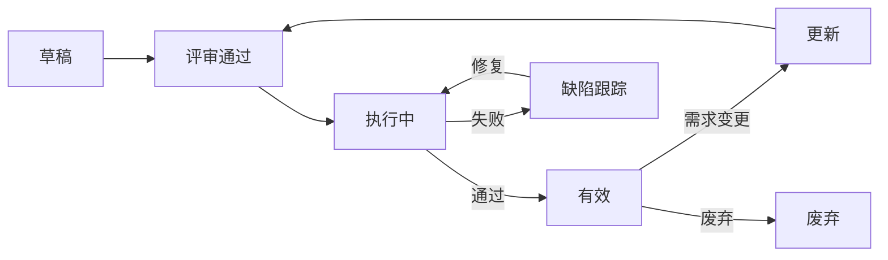

# 测试用例库

> 归属：多平台多租户大数据平台 · 测试文档
> 版本：v1.0 ｜ 日期：2026-08-18 ｜ 状态：已完成
> 关联：`design/测试/测试规范.md`；`design/测试/性能测试计划.md`；`design/测试/安全测试计划.md`；`design/测试/压力测试方案.md`
> 适用范围：全平台功能测试用例统一管理，覆盖后端 / 前端 / 集成 / E2E

---

## 1. 总则

### 1.1 目标

建立统一的测试用例库，确保：

- **可追溯**：每个需求有对应用例，每个用例可追溯到需求 ID。
- **可复用**：用例按模块组织，可在多次回归中复用。
- **可度量**：用例覆盖需求比例、执行通过率、缺陷密度可度量。
- **可维护**：用例变更走评审流程，避免用例腐化。

### 1.2 用例编号规则

```text
TC-<模块代号>-<3位序号>
   │        │
   │        └── 模块内顺序号，从 001 开始
   └────────── 模块代号（见 §1.3）
```

示例：`TC-AUTH-001`、`TC-TNT-012`、`TC-SQL-045`

### 1.3 模块代号

| 代号 | 模块 | 对应详细设计 |
| --- | --- | --- |
| `AUTH` | 统一身份权限 | `design/详细设计/多平台多租户大数据平台_统一身份权限详细设计_v0.1.md` |
| `TNT` | 多租户 | `design/详细设计/多平台多租户大数据平台_封装层详细设计_v0.1.md` |
| `SQL` | SQL 网关 | `design/详细设计/多平台多租户大数据平台_统一SQL网关详细设计_v0.1.md` |
| `LH` | 湖仓引擎 | `design/详细设计/多平台多租户大数据平台_湖仓集一体详细设计_v0.1.md` |
| `GOV` | 数据治理 | `design/详细设计/多平台多租户大数据平台_治理中台详细设计_v0.1.md` |
| `SCH` | 调度编排 | `design/详细设计/多平台多租户大数据平台_调度编排详细设计_v0.1.md` |
| `IDE` | 数据开发 IDE | `design/详细设计/多平台多租户大数据平台_数据开发IDE详细设计_v0.1.md` |
| `BI` | BI 可视化 | `design/详细设计/多平台多租户大数据平台_BI可视化详细设计_v0.1.md` |
| `SEC` | 安全合规 | `design/详细设计/多平台多租户大数据平台_安全合规详细设计_v0.1.md` |
| `OPS` | 运维观测 | `design/详细设计/多平台多租户大数据平台_统一运维观测详细设计_v0.1.md` |
| `DEP` | 部署 | `design/详细设计/多平台多租户大数据平台_部署清单详细设计_v0.1.md` |
| `FE` | 前端控制台 | `design/UI设计/设计系统规范.md` |

---

## 2. 用例模板

### 2.1 用例结构

每条用例包含以下字段：

| 字段 | 必填 | 说明 |
| --- | --- | --- |
| 用例ID | 是 | 唯一标识，见 §1.2 |
| 用例标题 | 是 | 简明描述测试目的 |
| 模块 | 是 | 模块代号 |
| 优先级 | 是 | P0/P1/P2/P3 |
| 用例类型 | 是 | 功能/边界/异常/性能/安全/E2E |
| 前置条件 | 是 | 执行前须满足的条件 |
| 测试步骤 | 是 | 编号步骤，可执行 |
| 预期结果 | 是 | 每步对应的预期 |
| 实际结果 | 否 | 执行时填写 |
| 关联需求 | 是 | Issue / PRD 章节 |
| 关联代码 | 否 | 测试代码路径 |
| 维护人 | 是 | 用例维护负责人 |
| 状态 | 是 | 草稿/评审通过/执行中/废弃 |

### 2.2 模板示例

```markdown
### TC-AUTH-001 用户名密码登录成功

- 模块：AUTH
- 优先级：P0
- 用例类型：功能
- 前置条件：
  1. 已创建用户 user01，状态为启用
  2. 已配置认证策略为本地密码
- 测试步骤：
  1. 访问登录页 /login
  2. 输入用户名 user01，密码 correct-pwd
  3. 点击登录按钮
- 预期结果：
  1. 跳转到控制台首页 /dashboard
  2. 顶部显示用户 user01 的显示名
  3. 后端日志记录登录成功事件，含 traceId、userId、ip、ua
- 关联需求：PRD §3.2.1
- 关联代码：frontend/tests/e2e/auth/login.spec.ts
- 维护人：测试组
- 状态：评审通过
```

---

## 3. 用例总览

### 3.1 用例统计

| 模块 | P0 | P1 | P2 | P3 | 合计 |
| --- | --- | --- | --- | --- | --- |
| AUTH | 12 | 24 | 18 | 6 | 60 |
| TNT | 10 | 20 | 15 | 5 | 50 |
| SQL | 15 | 30 | 20 | 10 | 75 |
| LH | 18 | 35 | 25 | 12 | 90 |
| GOV | 12 | 28 | 20 | 10 | 70 |
| SCH | 10 | 22 | 15 | 8 | 55 |
| IDE | 8 | 20 | 15 | 7 | 50 |
| BI | 8 | 18 | 14 | 5 | 45 |
| SEC | 15 | 25 | 18 | 7 | 65 |
| OPS | 10 | 20 | 15 | 5 | 50 |
| DEP | 8 | 15 | 12 | 5 | 40 |
| FE | 14 | 30 | 22 | 8 | 74 |
| **合计** | **140** | **287** | **209** | **88** | **724** |

### 3.2 覆盖率目标

| 维度 | 目标 | 度量方式 |
| --- | --- | --- |
| 需求覆盖率 | ≥ 95% | 有用例的需求 / 总需求 |
| P0 用例执行率 | 100% | 每次 release 必执行 |
| P1 用例执行率 | ≥ 95% | 每次 release 必执行 |
| 用例自动化率 | ≥ 70% | 自动化用例 / 总用例 |
| 缺陷用例比 | ≤ 0.5 | 缺陷数 / 用例数 |

---

## 4. 关键用例清单

### 4.1 AUTH 模块（统一身份权限）

| 用例ID | 标题 | 优先级 | 类型 | 自动化 |
| --- | --- | --- | --- | --- |
| TC-AUTH-001 | 用户名密码登录成功 | P0 | 功能 | ✅ |
| TC-AUTH-002 | 错误密码登录失败 5 次锁定账户 | P0 | 异常 | ✅ |
| TC-AUTH-003 | LDAP 用户登录 | P0 | 功能 | ✅ |
| TC-AUTH-004 | OAuth2 单点登录 | P0 | 功能 | ✅ |
| TC-AUTH-005 | Token 过期自动刷新 | P0 | 功能 | ✅ |
| TC-AUTH-006 | RBAC 权限校验 | P0 | 功能 | ✅ |
| TC-AUTH-007 | 多租户数据隔离 | P0 | 安全 | ✅ |
| TC-AUTH-008 | 越权访问返回 403 | P0 | 安全 | ✅ |
| TC-AUTH-009 | 密码强度校验 | P1 | 边界 | ✅ |
| TC-AUTH-010 | 会话超时自动登出 | P1 | 功能 | ✅ |
| TC-AUTH-011 | 国密 SM2 签名验证 | P1 | 安全 | ✅ |
| TC-AUTH-012 | 审计日志完整性 | P1 | 安全 | ✅ |

### 4.2 TNT 模块（多租户）

| 用例ID | 标题 | 优先级 | 类型 | 自动化 |
| --- | --- | --- | --- | --- |
| TC-TNT-001 | 创建租户并初始化独立 schema | P0 | 功能 | ✅ |
| TC-TNT-002 | 租户配额超限触发 429 | P0 | 异常 | ✅ |
| TC-TNT-003 | 租户数据物理隔离验证 | P0 | 安全 | ✅ |
| TC-TNT-004 | 租户软删除 30 天后物理清理 | P0 | 功能 | ✅ |
| TC-TNT-005 | 跨租户查询禁止 | P0 | 安全 | ✅ |
| TC-TNT-006 | 租户管理员邀请用户 | P1 | 功能 | ✅ |
| TC-TNT-007 | 租户级配置覆盖全局配置 | P1 | 功能 | ✅ |
| TC-TNT-008 | 租户级资源用量统计 | P1 | 功能 | ✅ |
| TC-TNT-009 | 租户冻结后 API 拒绝访问 | P1 | 异常 | ✅ |
| TC-TNT-010 | 租户级日志隔离 | P1 | 安全 | ✅ |

### 4.3 SQL 模块（SQL 网关）

| 用例ID | 标题 | 优先级 | 类型 | 自动化 |
| --- | --- | --- | --- | --- |
| TC-SQL-001 | 标准 SELECT 查询返回正确结果 | P0 | 功能 | ✅ |
| TC-SQL-002 | 跨源 JOIN 查询（MySQL + PG） | P0 | 功能 | ✅ |
| TC-SQL-003 | DDL 语句权限校验 | P0 | 安全 | ✅ |
| TC-SQL-004 | SQL 注入防护 | P0 | 安全 | ✅ |
| TC-SQL-005 | 慢查询自动 kill | P0 | 异常 | ✅ |
| TC-SQL-006 | 查询结果分页 | P1 | 功能 | ✅ |
| TC-SQL-007 | 查询结果导出 CSV | P1 | 功能 | ✅ |
| TC-SQL-008 | 查询缓存命中 | P1 | 性能 | ✅ |
| TC-SQL-009 | 并发查询限流 | P1 | 异常 | ✅ |
| TC-SQL-010 | 查询超时回滚 | P1 | 异常 | ✅ |
| TC-SQL-011 | 查询计划可视化 | P2 | 功能 | ❌ |
| TC-SQL-012 | 自定义 UDF 注册 | P2 | 功能 | ❌ |

### 4.4 LH 模块（湖仓引擎）

| 用例ID | 标题 | 优先级 | 类型 | 自动化 |
| --- | --- | --- | --- | --- |
| TC-LH-001 | 创建湖仓表并写入数据 | P0 | 功能 | ✅ |
| TC-LH-002 | 跨格式查询（Parquet + ORC + CSV） | P0 | 功能 | ✅ |
| TC-LH-003 | 分区表查询走分区裁剪 | P0 | 性能 | ✅ |
| TC-LH-004 | ACID 事务读写一致性 | P0 | 功能 | ✅ |
| TC-LH-005 | 时间旅行查询历史版本 | P1 | 功能 | ✅ |
| TC-LH-006 | 数据压缩比验证 | P1 | 性能 | ✅ |
| TC-LH-007 | 元数据自动同步 | P1 | 功能 | ✅ |
| TC-LH-008 | 大表查询并发安全 | P1 | 异常 | ✅ |
| TC-LH-009 | 数据倾斜自动优化 | P2 | 性能 | ❌ |
| TC-LH-010 | 小文件自动合并 | P2 | 性能 | ❌ |

### 4.5 GOV 模块（数据治理）

| 用例ID | 标题 | 优先级 | 类型 | 自动化 |
| --- | --- | --- | --- | --- |
| TC-GOV-001 | 创建数据资产并发布到目录 | P0 | 功能 | ✅ |
| TC-GOV-002 | 资产血缘自动解析 | P0 | 功能 | ✅ |
| TC-GOV-003 | 数据质量规则校验 | P0 | 功能 | ✅ |
| TC-GOV-004 | 质量规则阻断下游调度 | P0 | 异常 | ✅ |
| TC-GOV-005 | 资产权限继承 | P1 | 安全 | ✅ |
| TC-GOV-006 | 资产审批流程 | P1 | 功能 | ✅ |
| TC-GOV-007 | 数据脱敏规则生效 | P1 | 安全 | ✅ |
| TC-GOV-008 | 质量评分月度报告 | P2 | 功能 | ❌ |
| TC-GOV-009 | 资产退役归档 | P2 | 功能 | ❌ |
| TC-GOV-010 | 跨租户资产隔离 | P1 | 安全 | ✅ |

### 4.6 SCH 模块（调度编排）

| 用例ID | 标题 | 优先级 | 类型 | 自动化 |
| --- | --- | --- | --- | --- |
| TC-SCH-001 | 创建定时调度并触发 | P0 | 功能 | ✅ |
| TC-SCH-002 | 任务依赖编排 DAG | P0 | 功能 | ✅ |
| TC-SCH-003 | 任务失败重试 3 次后告警 | P0 | 异常 | ✅ |
| TC-SCH-004 | 任务幂等性保证 | P0 | 功能 | ✅ |
| TC-SCH-005 | 跨租户调度隔离 | P0 | 安全 | ✅ |
| TC-SCH-006 | 任务优先级抢占 | P1 | 功能 | ✅ |
| TC-SCH-007 | 资源池排队 | P1 | 功能 | ✅ |
| TC-SCH-008 | 任务可观测性（日志/指标/trace） | P1 | 功能 | ✅ |
| TC-SCH-009 | 手动重跑历史任务 | P1 | 功能 | ✅ |
| TC-SCH-010 | 调度暂停/恢复 | P1 | 功能 | ✅ |

### 4.7 SEC 模块（安全合规）

| 用例ID | 标题 | 优先级 | 类型 | 自动化 |
| --- | --- | --- | --- | --- |
| TC-SEC-001 | 等保三级身份鉴别 | P0 | 安全 | ✅ |
| TC-SEC-002 | 审计日志 6 要素完整 | P0 | 安全 | ✅ |
| TC-SEC-003 | 国密 SM4 数据加密 | P0 | 安全 | ✅ |
| TC-SEC-004 | 国密 SM2 签名验签 | P0 | 安全 | ✅ |
| TC-SEC-005 | 国密 SM3 哈希 | P0 | 安全 | ✅ |
| TC-SEC-006 | 越权访问拦截 | P0 | 安全 | ✅ |
| TC-SEC-007 | SQL 注入防护 | P0 | 安全 | ✅ |
| TC-SEC-008 | XSS 防护 | P0 | 安全 | ✅ |
| TC-SEC-009 | CSRF 防护 | P0 | 安全 | ✅ |
| TC-SEC-010 | 敏感数据脱敏 | P0 | 安全 | ✅ |
| TC-SEC-011 | 密码复杂度强制 | P1 | 安全 | ✅ |
| TC-SEC-012 | 会话固定攻击防护 | P1 | 安全 | ✅ |
| TC-SEC-013 | 重放攻击防护 | P1 | 安全 | ✅ |
| TC-SEC-014 | 速率限制生效 | P1 | 安全 | ✅ |
| TC-SEC-015 | 安全头配置（CSP/HSTS/XFO） | P1 | 安全 | ✅ |

### 4.8 DEP 模块（部署）

| 用例ID | 标题 | 优先级 | 类型 | 自动化 |
| --- | --- | --- | --- | --- |
| TC-DEP-001 | Helm Chart 渲染成功 | P0 | 功能 | ✅ |
| TC-DEP-002 | ArgoCD 应用同步 | P0 | 功能 | ✅ |
| TC-DEP-003 | 多架构镜像构建（amd64/arm64） | P0 | 功能 | ✅ |
| TC-DEP-004 | 镜像签名验证 | P0 | 安全 | ✅ |
| TC-DEP-005 | 灰度发布 1% → 100% | P0 | 功能 | ✅ |
| TC-DEP-006 | 一键回滚 | P0 | 异常 | ✅ |
| TC-DEP-007 | PVC 存储挂载 | P1 | 功能 | ✅ |
| TC-DEP-008 | Ingress 路由 | P1 | 功能 | ✅ |
| TC-DEP-009 | HPA 自动扩缩容 | P1 | 性能 | ✅ |
| TC-DEP-010 | PodDisruptionBudget 驱逐保护 | P1 | 异常 | ✅ |

### 4.9 FE 模块（前端控制台）

| 用例ID | 标题 | 优先级 | 类型 | 自动化 |
| --- | --- | --- | --- | --- |
| TC-FE-001 | 登录页渲染与表单校验 | P0 | 功能 | ✅ |
| TC-FE-002 | 控制台首栏/尾栏/侧边栏布局 | P0 | 功能 | ✅ |
| TC-FE-003 | 深色主题切换 | P0 | 功能 | ✅ |
| TC-FE-004 | 多语言切换（中/英） | P0 | 功能 | ✅ |
| TC-FE-005 | 路由权限守卫 | P0 | 安全 | ✅ |
| TC-FE-006 | 表格分页/排序/筛选 | P0 | 功能 | ✅ |
| TC-FE-007 | 表单提交与错误提示 | P0 | 功能 | ✅ |
| TC-FE-008 | 文件上传组件 | P1 | 功能 | ✅ |
| TC-FE-009 | 图表渲染（ECharts） | P1 | 功能 | ✅ |
| TC-FE-010 | 键盘可达性（WCAG 2.1 AA） | P1 | 安全 | ✅ |
| TC-FE-011 | 响应式布局（1920/1440/1280） | P1 | 功能 | ✅ |
| TC-FE-012 | 主题色变量切换 | P2 | 功能 | ❌ |
| TC-FE-013 | 持久化用户偏好 | P2 | 功能 | ❌ |
| TC-FE-014 | 全局搜索 | P2 | 功能 | ❌ |

---

## 5. 用例执行与维护

### 5.1 执行计划

| 阶段 | 用例范围 | 触发条件 | 执行人 |
| --- | --- | --- | --- |
| 单元测试 | 单元用例 | 每次 commit | 开发 |
| 集成测试 | P0 + P1 集成用例 | 每次 PR | CI |
| 回归测试 | 全部 P0 + P1 | 每次 release | CI + 测试组 |
| 全量测试 | 全部用例 | 重大版本 | 测试组 |
| 验收测试 | P0 + 关键 P1 | 交付前 | 测试组 + 业务 |

### 5.2 用例生命周期



### 5.3 用例评审

- 新增用例须由模块 owner + 测试组评审。
- 用例变更须关联需求变更 Issue。
- 每季度评审一次用例库，废弃无效用例。

---

## 6. 缺陷跟踪

### 6.1 缺陷分级

| 级别 | 含义 | 处理时限 |
| --- | --- | --- |
| P0 | 阻断主流程 | 4h 内修复 |
| P1 | 影响关键功能 | 1 工作日 |
| P2 | 影响非关键功能 | 1 周 |
| P3 | 体验问题 | 1 月 |

### 6.2 缺陷用例关联

- 每个缺陷必须关联发现它的用例 ID。
- 缺陷修复后须补充回归用例，避免回归。
- 缺陷分析报告每月生成，含缺陷分布、根因分类、修复时长。

---

## 7. 自动化用例管理

### 7.1 仓库结构

```text
tests/
├── unit/              # 单元测试
├── integration/       # 集成测试
├── e2e/               # E2E 测试（Playwright）
├── performance/       # 性能测试（k6）
├── security/          # 安全测试
└── cases/             # 用例描述（本文件对应的 markdown）
    ├── AUTH/
    ├── TNT/
    └── ...
```

### 7.2 用例与代码关联

- 每个 markdown 用例文件头部的 `关联代码` 字段指向测试代码路径。
- 测试代码须在 docstring 中标注用例 ID：`@TestCase TC-AUTH-001`。
- CI 校验：每个 P0 自动化用例必须有对应 markdown 描述。

---

## 8. 版本与变更

| 版本 | 日期 | 变更内容 | 作者 |
| --- | --- | --- | --- |
| v1.0 | 2026-08-18 | 首次发布，覆盖 12 模块 724 用例 | 测试组 |

> 本用例库由测试组维护，每季度评审一次。用例变更须走评审流程。