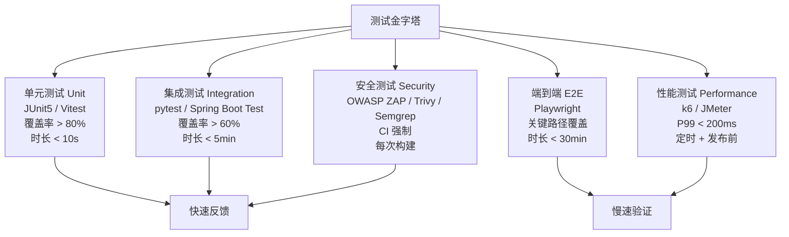
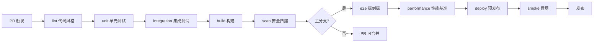
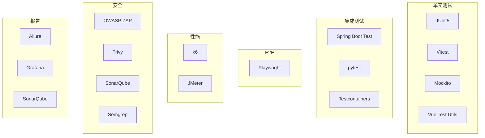

# 测试规范

> 归属：多平台多租户大数据平台 · 测试文档
> 版本：v1.0 ｜ 日期：2026-08-17 ｜ 状态：已完成
> 关联：`design/工程交付计划_缺口补全_v1.0.md`（Phase 1-4 验收标准）；`design/v2.0/Phase1/Phase1_集成验证报告.md`；`design/v2.0/Phase2/Phase2_V2.0-beta_交付报告.md`
> 适用范围：全平台后端（Java/Python/Scala）+ 前端（Vue/TypeScript）+ 部署（Helm/K8s）+ 集成 + E2E + 性能 + 安全

---

## 1. 测试目标与原则

### 1.1 测试目标

构建覆盖全生命周期的多层测试金字塔，确保：

- **功能正确**：每个需求有对应测试，回归不破。
- **质量基线**：单元测试覆盖率 > 80%，集成测试覆盖率 > 60%，性能 P99 < 200ms。
- **多环境一致**：dev/staging/prod 三环境行为一致，信创/本地/云/私有云四环境可移植。
- **CI/CD 强制**：PR 必过 lint + unit + integration + 安全扫描，主分支必过 E2E + 性能基准。
- **可重复可追溯**：测试数据可重建，测试结果可追溯，测试报告自动生成。

### 1.2 测试原则

1. **测试金字塔**：单元多、集成中、E2E 少，避免倒金字塔。
2. **快速反馈**：单元测试 < 10s，集成测试 < 5min，E2E < 30min。
3. **隔离独立**：测试间无依赖，可并行执行，不污染环境。
4. **数据自管**：每测试自建自销数据，禁止跨测试共享状态。
5. **失败即停**：CI 中关键测试失败立即终止流水线，禁止带病合并。

---

## 2. 测试分层架构



### 2.1 单元测试

| 维度 | 后端 | 前端 |
| --- | --- | --- |
| 框架 | JUnit5 + Mockito + AssertJ | Vitest + Vue Test Utils + jsdom |
| 覆盖率 | JaCoCo > 80%（行）/ 70%（分支） | Vitest c8 > 80%（行）/ 70%（分支） |
| 时长 | 全量 < 10s | 全量 < 10s |
| 范围 | Service/Util/Domain 单类 | 组件/Composable/Util 单元 |
| Mock | Mockito mock 外部依赖 | vi.mock mock API/Store |
| 命名 | `*Test.java` / `*Spec.java` | `*.test.ts` / `*.spec.ts` |

**单元测试规范**：

- 每个公开方法至少 1 个 happy path + 1 个 edge case + 1 个 error case。
- 禁止真实 IO（数据库/网络/文件），全部 Mock。
- 测试方法名用 `should_<expected>_when_<condition>` 格式。
- 断言用 AssertJ（后端）/ expect（前端）流式断言，禁止 JUnit 原生 assert。

### 2.2 集成测试

| 维度 | 后端 | 数据层 |
| --- | --- | --- |
| 框架 | Spring Boot Test + Testcontainers | pytest + Testcontainers |
| 覆盖率 | > 60%（行） | > 60%（行） |
| 时长 | 全量 < 5min | 全量 < 5min |
| 范围 | Controller/Repository/Service 集成 | 引擎/SQL/数据流水线 |
| 环境 | Docker 容器化依赖（PG/Redis/Kafka） | Docker 容器化依赖 |
| 数据 | Testcontainers 一次性数据库 + 种子数据 | 同左 |

**集成测试规范**：

- 用 Testcontainers 启动真实依赖（PostgreSQL/Redis/Kafka/MinIO），禁止 H2 替代。
- 每测试类 setUp/tearDown 清理数据，禁止跨类残留。
- 信创环境用 openGauss 替代 PostgreSQL（兼容协议），Testcontainers 镜像切换。
- 数据层集成测试用 SQLite 模拟数据库环境快速验证（用户偏好），CI 用真实容器验证。

### 2.3 端到端测试（E2E）

| 维度 | 规范 |
| --- | --- |
| 框架 | Playwright（多浏览器：Chromium/Firefox/WebKit） |
| 时长 | 全量 < 30min，关键路径 < 5min |
| 范围 | 登录/数据集成/数据开发/治理/安全/运维关键路径 |
| 环境 | 独立 staging 环境，每测试租户隔离 |
| 数据 | 种子数据 + 测试租户 + 清理脚本 |
| 触发 | 主分支 PR + 每日定时 + 发布前 |

**E2E 关键路径覆盖**：

1. 登录（多 IdP：账号密码/SAML/LDAP）→ 控制台首页
2. 创建租户 → 创建项目 → 创建数据源 → 数据集成任务 → 运行 → 查看结果
3. SQL 开发 → 提交作业 → 查看日志 → 查看结果
4. 数据治理 → 元数据采集 → 血缘查看 → 资产目录
5. 安全合规 → 审计日志查询 → 合规自检报告
6. 运维 → 监控大盘 → 告警确认 → 工单处理

### 2.4 性能测试

| 维度 | 规范 |
| --- | --- |
| 框架 | k6（脚本化）/ JMeter（GUI 场景） |
| 触发 | 每日定时 + 发布前 + 主分支 PR（关键 API） |
| 指标 | P99 < 200ms（API）/ 页面加载 < 2s / TPS > 1000 |
| 场景 | API 压测 + 页面加载 + 大数据量查询 + 并发提交 |
| 报告 | k6 JSON + Grafana 大盘 + 趋势对比 |

**k6 脚本规范**（用户偏好：JavaScript + camelCase + snake_case 指标）：

```javascript
// 代码示例：API 压测场景（JavaScript）
import http from 'k6/http';
import { check, sleep } from 'k6';

export const options = {
  stages: [
    { duration: '30s', target: 50 },   // ramp-up
    { duration: '1m', target: 50 },    // steady
    { duration: '30s', target: 0 },    // ramp-down
  ],
  thresholds: {
    http_req_duration: ['p(99)<200'],   // P99 < 200ms
    http_req_failed: ['rate<0.01'],     // 错误率 < 1%
  },
};

export default function () {
  const res = http.get('https://staging/api/lake/v1/tables', {
    headers: { Authorization: `Bearer ${__ENV.TOKEN}` },
  });
  check(res, {
    'status 200': (r) => r.status === 200,
    'biz_success_rate': (r) => r.json('code') === 0,
  });
  sleep(1);
}
```

### 2.5 安全测试

| 维度 | 工具 | 时机 |
| --- | --- | --- |
| DAST 动态扫描 | OWASP ZAP | CI + staging 部署后 |
| SAST 静态扫描 | SonarQube / Semgrep | PR 触发 |
| 依赖扫描 | OWASP Dependency-Check / pip-audit / npm audit | CI 构建 |
| 镜像扫描 | Trivy | 镜像构建 + 准入控制 |
| 密钥扫描 | git-secrets / TruffleHog | PR 触发 + pre-commit |
| 合规扫描 | OPA Gatekeeper / kube-score | CI 构建 |

---

## 3. 测试覆盖率要求

### 3.1 覆盖率基线

| 测试层 | 行覆盖率 | 分支覆盖率 | 方法覆盖率 |
| --- | --- | --- | --- |
| 单元测试 | > 80% | > 70% | > 85% |
| 集成测试 | > 60% | > 50% | > 65% |
| E2E | 关键路径 100% | — | — |
| 总覆盖率 | > 75% | > 65% | > 80% |

### 3.2 覆盖率门禁

- CI 流水线强制检查覆盖率，低于基线立即失败。
- 覆盖率趋势监控：每次 PR 覆盖率不得下降（除非有明确理由 + 评审通过）。
- 未覆盖代码标注 `@CoverageIgnore` + 原因，禁止裸露未覆盖。

### 3.3 覆盖率报告

- 后端：JaCoCo XML + HTML 报告，上传 SonarQube。
- 前端：c8 JSON + HTML 报告，上传 SonarQube。
- 总览：SonarQube 项目大盘，含覆盖率/复杂度/重复/漏洞/异味。

---

## 4. 测试数据管理

### 4.1 种子数据

| 数据类型 | 内容 | 管理 |
| --- | --- | --- |
| 主数据 | 租户/组织/用户/角色/项目 | SQL 脚本 + Flyway 迁移 |
| 业务数据 | 数据源/表/作业/资产 | JSON fixture + 工厂模式 |
| 配置数据 | 套餐/配额/策略 | YAML + 配置中心 |

种子数据版本化纳入 Git，随迁移脚本一起演进，禁止手动插入。

### 4.2 Mock 数据

- 后端：Mockito mock 外部服务（Kafka/对象存储/KMS），不真实调用。
- 前端：MSW（Mock Service Worker）拦截 API，返回 fixture。
- 数据层：Testcontainers 启动真实依赖，数据用工厂模式生成。

### 4.3 脱敏数据

- 生产数据禁止直接用于测试，必须经脱敏管道处理。
- 脱敏规则：手机号 → 138****8888，身份证 → 110***********0000，姓名 → 张*。
- 脱敏数据存 `test/fixtures/desensitized/`，仅测试可读。
- 信创环境脱敏用 SM4 加密 + 哈希脱敏，非信创用 AES-GCM + 哈希脱敏。

### 4.4 测试数据生命周期

```text
setUp → 生成种子数据 + Mock 数据 → 运行测试 → tearDown → 清理数据
```

- 每测试自建自销，禁止跨测试共享状态。
- 集成测试用 Testcontainers 一次性容器，测试结束自动销毁。
- E2E 用独立租户 + 测试后清理脚本，禁止污染 staging。

---

## 5. CI/CD 集成

### 5.1 流水线阶段



### 5.2 各阶段配置

| 阶段 | 工具 | 时长 | 失败策略 |
| --- | --- | --- | --- |
| lint | ESLint + Checkstyle + Spotless | < 1min | 立即失败 |
| unit | JUnit5 + Vitest + JaCoCo | < 10s | 立即失败 |
| integration | Spring Boot Test + pytest + Testcontainers | < 5min | 立即失败 |
| build | Gradle + Vite | < 3min | 立即失败 |
| scan | Trivy + Dependency-Check + SonarQube + ZAP | < 5min | Critical 立即失败，High 警告 |
| e2e | Playwright | < 30min | 立即失败 |
| performance | k6 | < 15min | 低于基线失败 |
| deploy | ArgoCD | < 5min | 立即失败 |
| smoke | Playwright smoke | < 2min | 立即失败 |

### 5.3 CI 环境矩阵

| 环境 | 用途 | 触发 |
| --- | --- | --- |
| dev | 开发分支自动部署 | push to dev |
| staging | 主分支自动部署 + E2E + 性能 | push to main |
| prod | 标签发布 | tag v* |

### 5.4 多环境测试矩阵

| 测试 | dev | staging | prod |
| --- | --- | --- | --- |
| 单元测试 | ✅ | ✅ | — |
| 集成测试 | ✅ | ✅ | — |
| E2E | — | ✅ | — |
| 性能基准 | — | ✅ | — |
| 安全扫描 | ✅ | ✅ | ✅ |
| 冒烟测试 | ✅ | ✅ | ✅ |

---

## 6. 性能基准

### 6.1 API 性能基线

| API 类型 | P50 | P95 | P99 | TPS |
| --- | --- | --- | --- | --- |
| 简单查询（单表） | < 50ms | < 100ms | < 200ms | > 1000 |
| 复杂查询（多表 JOIN） | < 200ms | < 500ms | < 800ms | > 200 |
| 写入（单条） | < 30ms | < 80ms | < 150ms | > 500 |
| 批量写入（1000 条） | < 500ms | < 1s | < 2s | > 100 |
| 作业提交 | < 100ms | < 300ms | < 500ms | > 100 |
| 元数据查询 | < 50ms | < 100ms | < 200ms | > 1000 |

### 6.2 页面性能基线

| 页面 | 首屏加载 | 交互响应 | LCP | FID | CLS |
| --- | --- | --- | --- | --- | --- |
| 登录页 | < 1s | < 100ms | < 1s | < 100ms | < 0.1 |
| 控制台首页 | < 2s | < 200ms | < 2s | < 200ms | < 0.1 |
| 数据集成 | < 2s | < 200ms | < 2s | < 200ms | < 0.1 |
| 数据开发 IDE | < 3s | < 500ms | < 3s | < 500ms | < 0.1 |
| 治理大盘 | < 2s | < 200ms | < 2s | < 200ms | < 0.1 |

### 6.3 性能回归检测

- 每次 PR 性能测试结果与主分支基线对比，回归 > 10% 告警，回归 > 20% 失败。
- 性能趋势归档 Grafana 大盘，按周/月生成趋势报告。
- 大数据量场景（百万行/千万行）定期压测，记录吞吐与延迟。

---

## 7. 测试环境

### 7.1 环境隔离

| 环境 | 用途 | 数据 | 隔离 |
| --- | --- | --- | --- |
| dev | 开发自测 | 开发数据 + Mock | 每开发者独立命名空间 |
| staging | 集成/E2E/性能 | 种子数据 + 脱敏数据 | 独立集群 |
| prod | 生产 | 真实数据 | 独立集群 + 严格访问 |

### 7.2 环境管理

- dev：开发者自助创建/销毁，K8s 命名空间隔离，资源配额限制。
- staging：CI/CD 自动部署，禁止手动改动，每次部署自动清理上一次。
- prod：变更经审批 + ArgoCD 滚动发布，禁止直接操作。

### 7.3 多平台测试矩阵

| 平台 | 单元 | 集成 | E2E | 性能 |
| --- | --- | --- | --- | --- |
| 信创（鲲鹏+麒麟） | ✅ | ✅ | ✅ | ✅ |
| 本地数据中心（x86） | ✅ | ✅ | ✅ | ✅ |
| 公有云 VM | ✅ | ✅ | — | — |
| 私有云 | ✅ | ✅ | — | — |

> 关键约束：信创环境必须全测试层覆盖，验证国产组件兼容性；云/私有云按需验证可移植性。

---

## 8. 测试报告与度量

### 8.1 测试报告

| 报告 | 内容 | 频率 | 工具 |
| --- | --- | --- | --- |
| PR 报告 | 单元/集成/扫描结果 + 覆盖率 | 每次 PR | SonarQube + GitHub Checks |
| 日报 | 全测试层结果 + 性能趋势 + 告警 | 每日 | Grafana + 邮件 |
| 发布报告 | E2E + 性能基准 + 安全扫描 + 兼容性 | 每次发布 | Allure + PDF |
| 验收报告 | 需求覆盖矩阵 + 缺陷清单 + 风险 | 每阶段 | Excel + Confluence |

### 8.2 测试度量

| 度量 | 目标 | 监控 |
| --- | --- | --- |
| 单元覆盖率 | > 80% | SonarQube |
| 集成覆盖率 | > 60% | SonarQube |
| 缺陷密度 | < 1/千行 | Jira |
| 缺陷逃逸率 | < 5% | Jira |
| 自动化率 | > 70% | CI 统计 |
| 平均修复时长 | < 4h | Jira |

---

## 9. 测试工具链



---

## 10. 测试规范清单

| 交付物 | 状态 | 责责 |
| --- | --- | --- |
| 单元测试框架集成 | 已完成 | 后端组 + 前端组 |
| 集成测试 Testcontainers | 已完成 | 后端组 |
| E2E Playwright 框架 | 进行中 | 测试组 |
| k6 性能脚本库 | 进行中 | 测试组 |
| 安全扫描 CI 集成 | 已完成 | DevOps 组 |
| 测试数据管理 | 进行中 | 测试组 |
| 本测试规范文档 | 已完成 v1.0 | 测试组 |

---

## 11. 风险与对策

| 风险 | 影响 | 对策 |
| --- | --- | --- |
| 信创环境 Testcontainers 镜像缺失 | 集成测试无法运行 | 自建国产镜像 + 镜像仓库缓存 |
| E2E 测试 flaky | CI 不稳定 | 重试机制 + 截图录屏 + 根因分析 |
| 性能测试环境影响结果 | 数据不准 | 独立性能环境 + 资源隔离 + 多次取中位数 |
| 测试数据脱敏不彻底 | 数据泄露 | 自动脱敏管道 + 审计 + 禁止生产数据直接用 |
| 测试覆盖率达标但质量低 | 假阳性 | 变异测试 + 关键路径覆盖 + 评审 |

---

## 12. 与 UI 的对应

控制台 v0.3 全部页面的 E2E 测试用例、性能基准、安全扫描均基于本规范。本文件是测试侧契约依据。