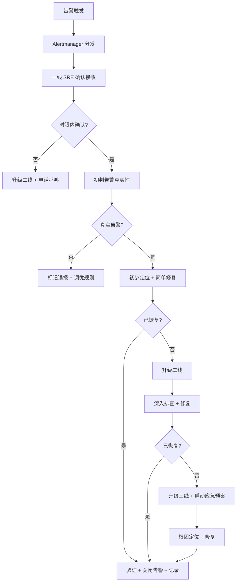
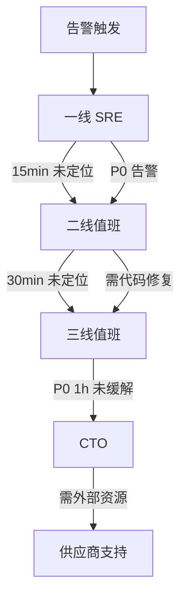

# 值班体系

> 归属：多平台多租户大数据平台 · 运维文档
> 版本：v1.0 ｜ 日期：2026-08-18 ｜ 状态：已完成
> 关联：`design/运维/监控告警SOP.md`；`design/运维/故障排查手册.md`；`design/运维/变更管理流程.md`；`design/运维/运维手册.md`
> 适用范围：平台运维 + SRE 值班 + 研发 oncall + 客户驻场
> 优先级：P1（重要补齐）

---

## 1. 值班体系概述

### 1.1 目标

建立 7×24 全天候值班体系，确保生产环境告警在规定时限内被响应、定位、处理，最小化故障 MTTR（平均恢复时间），保障生产 SLA。

### 1.2 适用范围

- 多平台多租户大数据平台生产环境。
- 预生产（staging）环境关键告警。
- 平台运维、SRE、研发 oncall 全员。

### 1.3 值班目标 SLA

| 指标 | 目标 |
| --- | --- |
| 告警响应时间（MTTA） | P0 ≤ 5min，P1 ≤ 10min，P2 ≤ 30min |
| 故障定位时间 | P0 ≤ 15min，P1 ≤ 30min |
| 故障处理开始时间 | P0 ≤ 30min，P1 ≤ 1h |
| 故障恢复时间（MTTR） | P0 ≤ 1h，P1 ≤ 4h，P2 ≤ 1 工作日 |
| 值班交接完整率 | 100% |

---

## 2. 值班角色

### 2.1 三线值班模型

| 线别 | 角色 | 职责 | 响应方式 |
| --- | --- | --- | --- |
| 一线 | 值班 SRE | 告警确认、初步排查、简单修复、升级判断 | 在场/oncall，5min 内响应 |
| 二线 | 运维负责人 / 资深 SRE | 深入排查、复杂修复、变更执行、协调资源 | oncall，15min 内响应 |
| 三线 | 架构师 / 研发负责人 | 架构级问题定位、代码修复、根因分析 | oncall，30min 内响应 |

### 2.2 角色职责详述

#### 2.2.1 一线值班 SRE

- 监控告警 5 分钟内确认接收。
- 初步判断告警真实性（真实/误报/重复）。
- 按故障排查手册执行初步定位与简单修复：
  - Pod 重启 / 资源不足 / 配置漂移等常见问题。
  - 执行回滚（已有预案的变更故障）。
- 判断是否需要升级二线，升级标准参见 §4.2。
- 记录故障处理过程，更新值班日志。

#### 2.2.2 二线值班（运维负责人 / 资深 SRE）

- 接收一线升级，15 分钟内响应。
- 深入排查复杂故障（集群级、数据库级、引擎级）。
- 执行变更修复（需走紧急变更流程，事后补审批）。
- 协调跨团队资源（DBA、网络、存储）。
- 判断是否需要升级三线。

#### 2.2.3 三线值班（架构师 / 研发负责人）

- 接收二线升级，30 分钟内响应。
- 架构级问题定位（设计缺陷、容量瓶颈、依赖循环）。
- 代码级修复（hotfix 分支 + 紧急发布）。
- 主导故障复盘与根因分析（RCA）。

---

## 3. 值班排班

### 3.1 7×24 值班制度

平台实行 7×24 全天候值班，覆盖工作日、周末及法定节假日。

| 时段 | 一线 | 二线 | 三线 |
| --- | --- | --- | --- |
| 工作日 09:00-18:00 | 在场值班 | oncall | oncall |
| 工作日 18:00-次日 09:00 | oncall | oncall | oncall |
| 周末 / 节假日 | oncall | oncall | oncall |

### 3.2 排班周期

- **轮换周期**：每周轮换，周一 00:00 为交接点。
- **排班发布**：每月 25 日前发布次月排班表，同步至值班群 + 工单系统。
- **排班规则**：
  - 一线值班：至少 1 人在场（工作日），oncall 1 人（非工作时段）。
  - 二线值班：oncall 1 人，与一线不为同一人。
  - 三线值班：oncall 1 人，与一/二线不为同一人。
  - 连续 oncall 不超过 7 天，避免疲劳。
  - 节假日值班轮换均匀分担。

### 3.3 排班表模板

```text
值班周次：2026-W34（2026-08-18 ~ 2026-08-24）
┌─────────┬──────────┬──────────┬──────────┐
│  日期   │  一线    │  二线    │  三线    │
├─────────┼──────────┼──────────┼──────────┤
│ 周一 18 │ SRE-A    │ OPS-Lead │ Arch-X   │
│ 周二 19 │ SRE-A    │ OPS-Lead │ Arch-X   │
│ 周三 20 │ SRE-B    │ OPS-Lead │ Arch-Y   │
│ 周四 21 │ SRE-B    │ Sr-SRE   │ Arch-Y   │
│ 周五 22 │ SRE-C    │ Sr-SRE   │ Arch-Z   │
│ 周六 23 │ SRE-C    │ Sr-SRE   │ Arch-Z   │
│ 周日 24 │ SRE-A    │ OPS-Lead │ Arch-X   │
└─────────┴──────────┴──────────┴──────────┘
```

### 3.4 排班变更

- 值班人员因故无法值班，需提前 1 个工作日申请换班。
- 换班需双方同意 + 运维负责人审批。
- 突发情况（生病等）由运维负责人紧急调度顶替。

---

## 4. 值班职责

### 4.1 监控告警响应

#### 4.1.1 响应时限

| 告警级别 | 确认时限 | 初步定位时限 | 开始处理时限 | 通知方式 |
| --- | --- | --- | --- | --- |
| P0 | 5 分钟 | 15 分钟 | 30 分钟 | 电话 + 短信 + 钉钉 + 邮件 |
| P1 | 10 分钟 | 30 分钟 | 1 小时 | 短信 + 钉钉 + 邮件 |
| P2 | 30 分钟 | 1 小时 | 4 小时 | 钉钉 + 邮件 |
| P3 | 1 工作日 | — | 1 周内 | 邮件 |

#### 4.1.2 响应流程



### 4.2 故障处理流程

#### 4.2.1 分级响应

| 级别 | 响应人 | 处理方式 | 升级条件 |
| --- | --- | --- | --- |
| P0 | 一线 → 二线 → 三线 | 立即全员介入 | 30min 未缓解升级 CTO |
| P1 | 一线 → 二线 | 一线 15min 未定位升级二线 | 2h 未解决升级运维负责人 |
| P2 | 一线 | 一线处理，必要时咨询二线 | 1 工作日未解决升级组长 |
| P3 | 一线 | 工作日内处理 | 1 周未解决升级组长 |

#### 4.2.2 升级机制

- **一线 → 二线**：一线 15min 无法定位 / 修复超出能力范围 / P0 告警。
- **二线 → 三线**：二线 30min 无法定位 / 需代码修复 / 架构级问题。
- **三线 → CTO**：P0 1h 未缓解 / 影响多租户核心业务 / 需外部资源协调。
- 升级时必须同步通知被升级人 + 值班群，并交接已掌握信息。

#### 4.2.3 恢复确认

- 故障修复后，值班人执行恢复验证：
  - 服务健康检查全部通过。
  - 监控指标恢复至正常基线。
  - 业务方确认核心流程可用。
- 恢复确认后关闭告警，记录故障总耗时。
- P0/P1 故障 24h 内召开复盘会，输出 RCA 报告。

### 4.3 值班交接

#### 4.3.1 交接时间

- 工作日交接：每日 09:00 在场交接。
- 周末/节假日交接：周一 09:00 统一交接。
- oncall 交接：oncall 时段开始前 15min 电话/钉钉交接。

#### 4.3.2 交接清单

交接人必须向接班人同步以下内容：

```text
值班交接单
────────────────────────────────
交接时间：YYYY-MM-DD HH:MM
交接人：<姓名> → 接班人：<姓名>

【未决问题】
1. <问题描述> | 当前状态 | 处理进度 | 下一步
2. ...

【进行中变更】
1. <变更编号> | 变更内容 | 执行状态 | 注意事项
2. ...

【监控告警状态】
- 当前活跃告警：<列表或无>
- 近 24h 告警趋势：<异常项>
- 需关注指标：<列表>

【注意事项】
- <需接班人特别关注的事项>
- <待跟进的工单/PR>
────────────────────────────────
```

#### 4.3.3 交接要求

- 交接必须在值班群内以书面形式完成（钉钉/工单系统）。
- 接班人确认接收后，交接人方可结束值班。
- 未决问题必须逐项交接，不得遗漏。
- 交接单归档至 `design/运维/值班日志/` 目录。

---

## 5. 值班工具

### 5.1 监控大盘（Grafana）

| 用途 | URL | 关键大盘 |
| --- | --- | --- |
| 平台总览 | `https://grafana.<domain>/d/platform-overview` | 集群健康、服务可用性、告警概览 |
| K8s 集群 | `https://grafana.<domain>/d/k8s-cluster` | 节点状态、Pod 资源、API Server |
| 应用服务 | `https://grafana.<domain>/d/app-services` | Spring Boot / Go 服务指标 |
| 数据库 | `https://grafana.<domain>/d/database` | 连接池、慢查询、主从延迟 |
| 计算引擎 | `https://grafana.<domain>/d/compute-engines` | Spark/Flink/Trino 作业指标 |
| 多租户 | `https://grafana.<domain>/d/multi-tenant` | 租户配额、越权告警 |

### 5.2 告警平台（Alertmanager）

| 配置项 | 值 |
| --- | --- |
| Alertmanager URL | `https://alertmanager.<domain>` |
| 告警规则仓库 | `design/deploy/monitoring/prometheus/rules/` |
| 告警路由 | P0 → 电话+短信+钉钉+邮件；P1 → 短信+钉钉+邮件；P2 → 钉钉+邮件 |
| 告警抑制 | 同组件高级别告警抑制低级别告警 |
| 告警静默 | 变更窗口内对受影响组件静默（需审批） |

### 5.3 日志平台（Loki）

| 用途 | URL | 查询示例 |
| --- | --- | --- |
| 应用日志 | `https://loki.<domain>` | `{app="encaps-layer"} |= "ERROR" \| json` |
| K8s 日志 | `https://loki.<domain>` | `{namespace="prod"} |= "Exception"` |
| 审计日志 | `https://loki.<domain>` | `{app="audit"} |= "denied"` |

### 5.4 运维工具

| 工具 | 用途 | 关键命令 |
| --- | --- | --- |
| kubectl | K8s 集群操作 | `kubectl get pods -n <ns>`、`kubectl describe`、`kubectl logs` |
| helm | Helm Chart 管理 | `helm list -n <ns>`、`helm rollback <release>` |
| argocd | GitOps 同步管理 | `argocd app sync <app>`、`argocd app rollback <app> <rev>` |
| k9s | K8s 终端 UI | `k9s -n <namespace>` |
| velero | 集群备份恢复 | `velero backup describe <name>` |

---

## 6. 值班考核

### 6.1 考核指标

| 指标 | 目标 | 度量方式 |
| --- | --- | --- |
| 告警响应及时率 | ≥ 99% | 时限内响应告警数 / 总告警数 |
| 故障定位及时率 | ≥ 95% | 时限内定位故障数 / 总故障数 |
| 故障恢复及时率 | ≥ 95% | SLA 内恢复故障数 / 总故障数 |
| 值班交接完整率 | 100% | 完整交接次数 / 总交接次数 |
| 误报处理率 | ≥ 90% | 处理误报数 / 误报总数（含规则调优） |
| 复盘报告按时率 | 100% | 24h 内输出 RCA 数 / 应复盘故障数 |

### 6.2 考核周期

- **周度**：每周值班交接时统计本周告警响应情况。
- **月度**：每月初统计上月值班考核指标，公示至值班群。
- **季度**：每季度值班质量评审，识别改进项并更新本文件。

### 6.3 故障复盘

P0/P1 故障必须 24h 内召开复盘会，输出 RCA 报告：

- **故障时间线**：触发 → 响应 → 定位 → 处理 → 恢复，各节点时间戳。
- **根因分析**：5 Why 分析法，定位根因。
- **影响评估**：受影响服务/租户/时长/业务损失。
- **处理评估**：响应是否及时、处理是否得当、升级是否合理。
- **改进项**：短期（1 周内）/ 中期（1 月内）/ 长期改进项，指定负责人。
- **复盘结论**：归档至 `design/运维/故障复盘/` 目录。

---

## 7. 应急联系

### 7.1 值班联系方式

| 角色 | 联系方式 | 备注 |
| --- | --- | --- |
| 一线值班 SRE | 钉钉群 + 手机 <见排班表> | 5min 内响应 |
| 二线值班 | 钉钉群 + 手机 <见排班表> | 15min 内响应 |
| 三线值班 | 钉钉群 + 手机 <见排班表> | 30min 内响应 |
| 运维负责人 | 钉钉 + 手机 <见通讯录> | P0/P1 升级 |
| CTO | 电话 <见通讯录> | P0 30min 未缓解升级 |

### 7.2 升级路径



### 7.3 外部支持联系

| 供应商 | 支持范围 | 联系方式 | 响应时限 |
| --- | --- | --- | --- |
| K8s 商业支持 | 集群级故障 | <见合同> | 1h |
| 数据库厂商 | DB 级故障 | <见合同> | 2h |
| 云厂商 | IaaS 级故障 | <见合同> | 15min |
| 硬件厂商 | 硬件故障 | <见合同> | 4h |

---

## 8. 风险与应对

| 风险 | 概率 | 影响 | 应对 |
| --- | --- | --- | --- |
| 值班人员响应不及时 | 中 | 故障恶化 | 电话升级 + 考核挂钩 |
| 值班人员能力不足 | 中 | 无法定位 | 升级机制 + 培训 + 排班优化 |
| 排班冲突导致空岗 | 低 | 告警无人响应 | 排班审批 + 紧急调度机制 |
| 交接遗漏导致信息断层 | 中 | 处理延误 | 交接清单 + 书面交接 + 考核 |
| 工具不可用 | 低 | 无法排查 | 工具冗余 + 应急预案 |

---

## 9. 参考

- `design/运维/监控告警SOP.md`：告警级别与处理流程。
- `design/运维/故障排查手册.md`：故障分类与排查步骤。
- `design/运维/变更管理流程.md`：紧急变更流程。
- `design/运维/运维手册.md`：日常运维操作。
- `design/deploy/monitoring/`：监控告警部署配置。