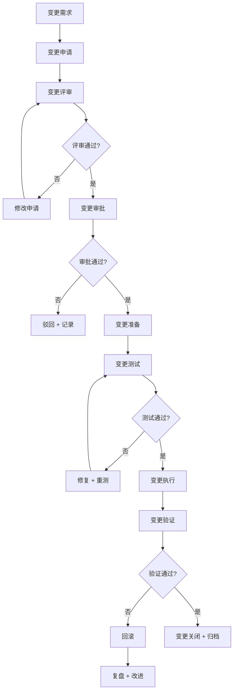
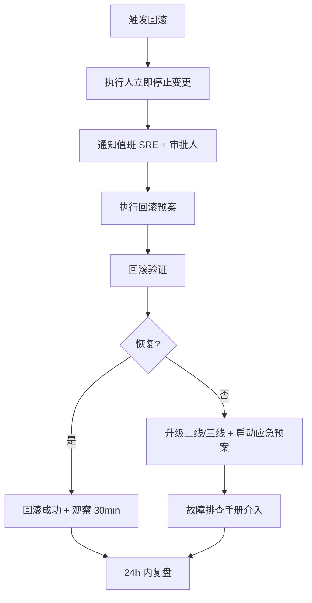
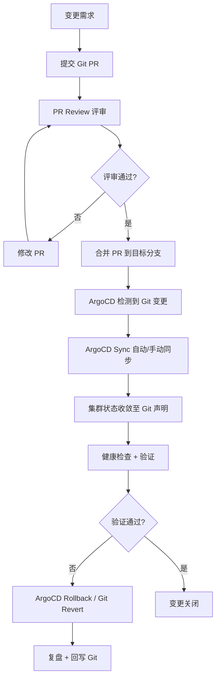

# 变更管理流程

> 归属：多平台多租户大数据平台 · 运维文档
> 版本：v1.1 ｜ 日期：2026-08-18 ｜ 状态：已完成
> 关联：`design/部署/灰度发布方案.md`；`design/运维/监控告警SOP.md`；`design/运维/故障排查手册.md`；`design/安全/安全整改清单.md`；`design/deploy/argocd/README.md`
> 适用范围：平台运维 + 开发 + SRE + 安全
> 优先级：P3（完善补齐）

---

## 1. 变更管理概述

### 1.1 总体目标

建立规范的变更管理流程，确保所有生产环境变更经过评审、测试、审批、灰度、回滚预案，最小化变更导致故障的风险，保障生产 SLA。

### 1.2 变更管理原则

1. **凡变必审**：所有生产变更必须经过评审与审批。
2. **可回滚**：所有变更必须有回滚预案，且回滚经过验证。
3. **小步快跑**：变更拆小，分批执行，避免大爆炸。
4. **可追溯**：变更全流程留档，可追溯。
5. **避高峰**：变更避开业务高峰，按窗口执行。

### 1.3 适用范围

本流程适用于生产环境及预生产（staging）环境的所有变更，包括但不限于：

- 应用代码发布与回滚
- K8s 配置 / Helm Chart / ArgoCD Application 变更
- 数据库 Schema 与数据变更
- 基础设施（集群、节点、网络、存储）变更
- 计算引擎（Spark/Flink/Trino/Doris）版本与配置变更
- 安全策略、证书、密钥变更

### 1.4 角色职责

| 角色 | 职责 | 关键动作 |
| --- | --- | --- |
| 变更申请人（Requester） | 发起变更需求，提供变更单 | 提交变更单、补充评估材料 |
| 变更评审人（Reviewer） | 评审变更方案可行性与风险 | 参与评审会、输出评审意见 |
| 变更审批人（Approver） | 审批变更是否执行 | 按审批矩阵签署审批结论 |
| 变更执行人（Implementer） | 按计划执行变更与回滚 | 执行变更步骤、监控、验证 |
| 变更验证人（Verifier） | 验证变更结果符合预期 | 功能/性能/业务验证签字 |
| SRE / 运维负责人 | 流程把关、窗口管理、复盘组织 | 维护变更日历、组织复盘 |
| CTO | 重大/紧急重大变更最终审批 | 签署重大变更、口头授权紧急变更 |
| GitOps 控制面（ArgoCD） | 变更声明式下发与状态收敛 | 同步 Git → 集群、漂移检测、回滚 |

---

## 2. 变更分类

### 2.1 变更类型

| 类型 | 范围 | 风险 | 审批级别 |
| --- | --- | --- | --- |
| 标准变更 | 预定义、低风险、可重复 | 低 | 预审批 |
| 普通变更 | 应用发布、配置变更 | 中 | 直属上级 |
| 重大变更 | 架构调整、数据库变更、大版本升级 | 高 | 运维负责人 + CTO |
| 紧急变更 | 紧急修复、安全补丁 | 中 | 事后补审批 |
| 紧急重大变更 | 生产故障修复 | 高 | CTO 口头审批 + 事后补 |

### 2.2 变更范围

| 范围 | 示例 |
| --- | --- |
| 应用代码 | 12 个 Spring Boot 应用、前端控制台 |
| 配置 | K8s 配置、应用配置、Nginx 配置 |
| 数据库 | Schema 变更、数据迁移、索引调整 |
| 基础设施 | K8s 集群、节点、网络、存储 |
| 引擎 | Spark/Flink/Trino/Doris 版本与配置 |
| 安全 | 证书、密钥、安全策略、WAF 规则 |

---

## 3. 变更流程

### 3.1 标准变更流程



### 3.2 变更申请

变更申请包含：

- 变更标题、类型、范围、风险等级。
- 变更内容、原因、预期效果。
- 变更计划、执行窗口、执行人。
- 测试方案、回滚预案、影响评估。
- 评审人、审批人、通知方。

### 3.3 变更评审

评审内容：

- 变更必要性、合理性。
- 变更方案可行性、完整性。
- 风险评估、影响范围。
- 测试方案覆盖度。
- 回滚预案可行性。
- 执行窗口合理性。

### 3.4 变更审批

| 变更类型 | 审批人 | 审批时限 |
| --- | --- | --- |
| 标准变更 | 预审批（流程内置） | 自动 |
| 普通变更 | 直属上级 | 1 个工作日 |
| 重大变更 | 运维负责人 + CTO | 2 个工作日 |
| 紧急变更 | 直属上级（事后补） | 即时 |
| 紧急重大变更 | CTO（口头 + 事后补） | 即时 |

### 3.5 变更执行

- 按变更计划执行，每步记录。
- 执行过程监控，异常立即停止 + 回滚。
- 灰度发布按 `design/部署/灰度发布方案.md` 执行。
- 执行完成后验证，参见 §3.6。

### 3.6 变更验证

- 功能验证：变更功能正确。
- 性能验证：性能指标达标。
- 监控验证：监控大盘 + 告警正常。
- 业务验证：业务方验证关键流程。
- 验证时长：普通变更 30min，重大变更 2h。

### 3.7 变更回顾

变更关闭前必须完成回顾，回顾结论写入变更单。

- **结果确认**：变更目标是否达成，验证报告是否签字。
- **问题记录**：执行过程中出现的偏差、告警、回滚事件。
- **经验沉淀**：
  - 成功经验沉淀至 `design/运维/运维手册.md`。
  - 失败/回滚案例沉淀至知识库，并纳入下次评审会复盘。
  - 涉及流程改进的，更新本文件或关联 SOP。
- **回顾时限**：普通变更 1 个工作日内，重大变更 3 个工作日内召开复盘会。

### 3.8 变更回滚

#### 3.8.1 回滚触发条件

满足以下任一条件立即触发回滚，无需再次审批：

- 变更验证未通过（功能/性能/业务任一不达标）。
- 变更后 5 分钟内出现 P0/P1 告警。
- 业务方反馈核心流程不可用。
- 变更导致数据不一致或数据丢失风险。
- 变更执行超时（超过计划窗口 30min 未完成）。

#### 3.8.2 回滚流程



#### 3.8.3 回滚验证

- 服务健康检查全部通过。
- 监控指标恢复至变更前基线。
- 业务核心流程验证通过。
- 数据一致性校验通过（数据库变更）。
- 回滚记录写入变更单，含回滚耗时、回滚原因。

---

## 4. 变更窗口

### 4.1 标准窗口

生产环境变更窗口为**每周二、周四 10:00-12:00**，所有非紧急变更必须在此窗口内执行。

| 变更类型 | 窗口 | 限制 |
| --- | --- | --- |
| 标准变更 | 工作日 09:00-20:00 | 不影响业务，无需窗口 |
| 普通变更 | 周二/周四 10:00-12:00 | 必须在窗口内执行，避开早晚高峰 |
| 重大变更 | 周六 09:00-17:00 | 周末执行 + 周日验证 |
| 紧急变更 | 7×24 | 需审批，事后补流程 |
| 紧急重大变更 | 7×24 | 需 CTO 审批，事后补流程 |

### 4.2 窗口管理规则

- 变更窗口由 SRE 团队维护，通过变更日历公示。
- 同一窗口内变更需排队，避免冲突变更（同一组件/同一集群）。
- 窗口开始前 30min 在值班群同步当日变更清单。
- 窗口结束前 15min 未完成的变更必须评估是否回滚。
- 窗口外变更需走紧急变更流程。

### 4.3 变更冻结期

- 月末/月初 3 个工作日：计费高峰，禁止非紧急变更。
- 重大业务活动期间：按业务方通知冻结。
- 等保测评期间：禁止非整改变更。
- 法定节假日：禁止非紧急变更。

---

## 5. 数据库变更管理

### 5.1 数据库变更特殊要求

- **向前兼容**：数据库变更必须向前兼容，灰度期间新旧版本共存。
- **回滚脚本**：每个数据库变更必须配套回滚脚本，预先验证。
- **延迟清理**：废弃字段/表不在发布时删除，30 天后确认无引用再清理。
- **数据备份**：数据修改类变更前必须备份。
- **执行窗口**：数据库变更在低峰期执行，避免锁表影响业务。

### 5.2 数据库变更流程

1. 变更申请 + 评审 + 审批。
2. 在 staging 环境执行 + 验证。
3. 备份生产数据。
4. 在生产低峰期执行变更。
5. 验证变更正确。
6. 观察 30min，异常回滚。
7. 变更关闭 + 归档。

---

## 6. 紧急变更管理

### 6.1 紧急变更条件

- 生产故障修复。
- 安全漏洞紧急修复。
- 业务阻断紧急修复。

### 6.2 紧急变更流程

1. 紧急变更申请（口头 + 事后补书面）。
2. 紧急审批（CTO 口头 + 事后补书面）。
3. 紧急变更执行（最小化变更范围）。
4. 紧急变更验证。
5. 24h 内补书面申请 + 审批 + 归档。
6. 复盘 + 改进。

---

## 7. 变更记录与归档

### 7.1 变更记录

每起变更记录包含：

- 变更编号、标题、类型、范围、风险等级。
- 申请人、评审人、审批人、执行人。
- 变更内容、计划、实际执行。
- 测试报告、验证报告。
- 回滚预案（如执行回滚，含回滚记录）。
- 变更状态（申请/评审/审批/执行/验证/关闭/回滚）。

### 7.2 变更日志模板

变更单模板（提交至工单系统 / GitOps 仓库 `design/运维/变更日志/`）：

```text
变更编号：CHG-YYYYMMDD-NNN
变更标题：<一句话描述变更内容>
变更类型：[标准|普通|重大|紧急|紧急重大]
变更范围：<受影响的组件/集群/租户>
风险等级：[低|中|高]
申请人：<姓名>  评审人：<姓名>  审批人：<姓名>  执行人：<姓名>
申请时间：YYYY-MM-DD HH:MM
计划窗口：YYYY-MM-DD HH:MM ~ YYYY-MM-DD HH:MM

【变更内容】
<详细描述变更做什么，改哪些文件/配置/镜像>

【影响范围】
<受影响的服务、租户、上下游依赖、预估影响用户数>

【测试方案】
<staging 验证步骤、测试用例、预期结果>

【回滚方案】
<回滚步骤、回滚命令、回滚验证方法、回滚预计耗时>

【验证方案】
<变更后验证步骤、验证人、验证通过标准>

【实际执行记录】
开始时间：YYYY-MM-DD HH:MM
结束时间：YYYY-MM-DD HH:MM
执行结果：[成功|失败|回滚]
异常记录：<无 / 详细描述>

【回顾结论】
回顾人：<姓名>  回顾时间：YYYY-MM-DD
经验沉淀：<无 / 知识库链接>
```

### 7.3 变更归档

- 变更记录归档至工单系统。
- 重大变更记录归档至 `design/v2.0/` 对应阶段目录。
- GitOps 变更（ArgoCD/Helm）的 Git commit 即为变更留痕，保留 ≥ 1 年。
- 变更记录保留 ≥ 1 年，可追溯。

---

## 8. 变更质量度量

### 8.1 度量指标

| 指标 | 目标 | 度量 |
| --- | --- | --- |
| 变更成功率 | > 95% | 成功变更数 / 总变更数 |
| 变更回滚率 | < 5% | 回滚变更数 / 总变更数 |
| 变更导致故障率 | < 2% | 故障变更数 / 总变更数 |
| 紧急变更占比 | < 10% | 紧急变更数 / 总变更数 |
| 变更评审覆盖率 | 100% | 评审变更数 / 总变更数 |

### 8.2 持续改进

- 每月变更复盘，识别问题与改进项。
- 每季度变更质量评审，更新流程与规范。
- 变更失败案例沉淀至知识库。

---

## 9. 风险与应对

| 风险 | 概率 | 影响 | 应对 |
| --- | --- | --- | --- |
| 变更未评审导致故障 | 中 | 生产故障 | 强制评审 + 工具拦截 |
| 回滚预案无效 | 低 | 无法回滚 | 回滚预案验证 + 数据库向前兼容 |
| 变更窗口不当 | 中 | 业务影响 | 严格窗口 + 冻结期 |
| 紧急变更滥用 | 中 | 风险失控 | 紧急变更事后复盘 + 改进 |
| 变更记录缺失 | 低 | 无法追溯 | 工具强制记录 + 审计 |

---

## 10. 与 GitOps 集成

### 10.1 GitOps 变更模型

平台采用 GitOps 模式（ArgoCD + Git 仓库）作为声明式变更的主通道，与传统变更流程的关系如下：

| 变更通道 | 适用场景 | 审批方式 | 留痕方式 |
| --- | --- | --- | --- |
| GitOps PR（推荐） | Helm Chart / values / Application 变更 | PR Review = 变更评审 + 审批 | Git commit + ArgoCD 同步历史 |
| 工单系统 | 非 GitOps 管理的变更（数据库、基础设施） | 工单审批流 | 工单归档 |
| kubectl 直连（禁止） | 仅紧急故障处置 | 事后补工单 + Git 同步 | 必须回写 Git |

### 10.2 ArgoCD 变更流程



### 10.3 ArgoCD 同步策略

| 策略 | 配置 | 适用变更类型 |
| --- | --- | --- |
| 自动同步（autoSync） | `syncPolicy.automated.enabled=true` | 标准变更（低风险） |
| 手动同步（manualSync） | `syncPolicy.automated.enabled=false` | 普通/重大变更（需审批后点击 Sync） |
| 自动修剪（prune） | `syncPolicy.automated.prune=true` | 资源删除变更 |
| 自动自愈（selfHeal） | `syncPolicy.selfHeal=true` | 防止手动 kubectl 改动导致漂移 |

### 10.4 Helm Chart 版本管理

Helm Chart 版本与变更的对应关系：

- **Chart 版本号**：遵循 SemVer（`MAJOR.MINOR.PATCH`），与 Git tag 一一对应。
- **App Version**：`appVersion` 字段记录应用版本，与镜像 tag 一致。
- **变更提交规范**：
  - PATCH（`1.0.0 → 1.0.1`）：bugfix / 配置微调，对应普通变更。
  - MINOR（`1.0.0 → 1.1.0`）：新功能 / 向后兼容变更，对应普通变更。
  - MAJOR（`1.0.0 → 2.0.0`）：不兼容变更 / 架构调整，对应重大变更。
- **Chart 发布流程**：
  1. 修改 `Chart.yaml` 版本号 + `appVersion`。
  2. 提交 PR，CI 自动执行 `helm lint` + `helm template` 校验。
  3. PR 合并后，`build.yml` 的 `build-charts` job 自动打包 tgz 并推送至 GHCR OCI Registry。
  4. ArgoCD 引用新版本 Chart，按同步策略下发。
- **回滚**：ArgoCD 回滚到上一版本 Chart（`argocd app rollback <app> <revision>`），或 Git revert 后重新同步。

### 10.5 GitOps 变更与本文档的映射

| 本文档章节 | GitOps 对应动作 |
| --- | --- |
| §3.2 变更申请 | 提交 Git PR（PR 描述即变更单） |
| §3.3 变更评审 | PR Review + CI lint/test |
| §3.4 变更审批 | PR Approve（按分支保护规则） |
| §3.5 变更执行 | PR 合并 + ArgoCD Sync |
| §3.6 变更验证 | ArgoCD Health Status + 监控验证 |
| §3.7 变更回顾 | PR 关联 issue 关闭 + 复盘记录 |
| §3.8 变更回滚 | ArgoCD Rollback / Git Revert |

---

## 11. 参考

- `design/部署/灰度发布方案.md`：灰度发布与回滚。
- `design/运维/监控告警SOP.md`：告警与应急。
- `design/运维/故障排查手册.md`：故障排查与回滚。
- `design/安全/安全整改清单.md`：安全整改变更。
- `design/deploy/argocd/README.md`：ArgoCD 部署与同步策略。
- `design/deploy/argocd/rollback/rollback-strategy.md`：ArgoCD 回滚策略。
- ITIL 变更管理：https://www.axelos.com/certifications/itil-service-management