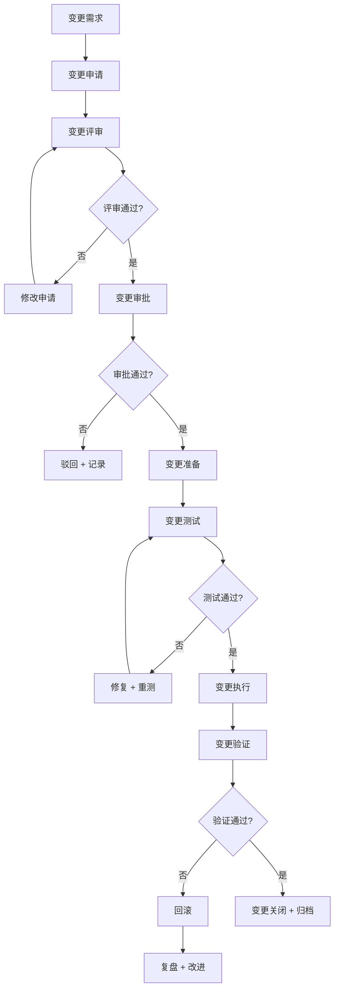

# 变更管理流程

> 归属：多平台多租户大数据平台 · 运维文档
> 版本：v1.0 ｜ 日期：2026-08-17 ｜ 状态：已完成
> 关联：`design/部署/灰度发布方案.md`；`design/运维/监控告警SOP.md`；`design/运维/故障排查手册.md`；`design/安全/安全整改清单.md`
> 适用范围：平台运维 + 开发 + SRE + 安全
> 优先级：P3（完善补齐）

---

## 1. 变更管理目标

### 1.1 总体目标

建立规范的变更管理流程，确保所有生产环境变更经过评审、测试、审批、灰度、回滚预案，最小化变更导致故障的风险，保障生产 SLA。

### 1.2 变更管理原则

1. **凡变必审**：所有生产变更必须经过评审与审批。
2. **可回滚**：所有变更必须有回滚预案，且回滚经过验证。
3. **小步快跑**：变更拆小，分批执行，避免大爆炸。
4. **可追溯**：变更全流程留档，可追溯。
5. **避高峰**：变更避开业务高峰，按窗口执行。

---

## 2. 变更分类

### 2.1 变更类型

| 类型 | 范围 | 风险 | 审批级别 |
| --- | --- | --- | --- |
| 标准变更 | 预定义、低风险、可重复 | 低 | 预审批 |
| 普通变更 | 应用发布、配置变更 | 中 | 直属上级 |
| 重大变更 | 架构调整、数据库变更、大版本升级 | 高 | 运维负责人 + CTO |
| 紧急变更 | 紧急修复、安全补丁 | 中 | 事后补审批 |
| 紧急重大变更 | 生产故障修复 | 高 | CTO 口头审批 + 事后补 |

### 2.2 变更范围

| 范围 | 示例 |
| --- | --- |
| 应用代码 | 12 个 Spring Boot 应用、前端控制台 |
| 配置 | K8s 配置、应用配置、Nginx 配置 |
| 数据库 | Schema 变更、数据迁移、索引调整 |
| 基础设施 | K8s 集群、节点、网络、存储 |
| 引擎 | Spark/Flink/Trino/Doris 版本与配置 |
| 安全 | 证书、密钥、安全策略、WAF 规则 |

---

## 3. 变更流程

### 3.1 标准变更流程

### 3.2 变更申请

变更申请包含：

- 变更标题、类型、范围、风险等级。
- 变更内容、原因、预期效果。
- 变更计划、执行窗口、执行人。
- 测试方案、回滚预案、影响评估。
- 评审人、审批人、通知方。

### 3.3 变更评审

评审内容：

- 变更必要性、合理性。
- 变更方案可行性、完整性。
- 风险评估、影响范围。
- 测试方案覆盖度。
- 回滚预案可行性。
- 执行窗口合理性。

### 3.4 变更审批

| 变更类型 | 审批人 | 审批时限 |
| --- | --- | --- |
| 标准变更 | 预审批（流程内置） | 自动 |
| 普通变更 | 直属上级 | 1 个工作日 |
| 重大变更 | 运维负责人 + CTO | 2 个工作日 |
| 紧急变更 | 直属上级（事后补） | 即时 |
| 紧急重大变更 | CTO（口头 + 事后补） | 即时 |

### 3.5 变更执行

- 按变更计划执行，每步记录。
- 执行过程监控，异常立即停止 + 回滚。
- 灰度发布按 `design/部署/灰度发布方案.md` 执行。
- 执行完成后验证，参见 §3.6。

### 3.6 变更验证

- 功能验证：变更功能正确。
- 性能验证：性能指标达标。
- 监控验证：监控大盘 + 告警正常。
- 业务验证：业务方验证关键流程。
- 验证时长：普通变更 30min，重大变更 2h。

### 3.7 变更回滚

- 回滚触发：验证未通过、业务异常、监控告警。
- 回滚时限：5 分钟内执行回滚。
- 回滚验证：回滚后验证恢复正常。
- 回滚复盘：24h 内复盘回滚原因。

---

## 4. 变更窗口

### 4.1 标准窗口

| 变更类型 | 窗口 | 限制 |
| --- | --- | --- |
| 标准变更 | 工作日 09:00-20:00 | 不影响业务 |
| 普通变更 | 工作日 10:00-17:00 | 避开早晚高峰 |
| 重大变更 | 周六 09:00-17:00 | 周末执行 + 周日验证 |
| 紧急变更 | 7×24 | 需审批 |
| 紧急重大变更 | 7×24 | 需 CTO 审批 |

### 4.2 变更冻结期

- 月末/月初 3 个工作日：计费高峰，禁止非紧急变更。
- 重大业务活动期间：按业务方通知冻结。
- 等保测评期间：禁止非整改变更。
- 法定节假日：禁止非紧急变更。

---

## 5. 数据库变更管理

### 5.1 数据库变更特殊要求

- **向前兼容**：数据库变更必须向前兼容，灰度期间新旧版本共存。
- **回滚脚本**：每个数据库变更必须配套回滚脚本，预先验证。
- **延迟清理**：废弃字段/表不在发布时删除，30 天后确认无引用再清理。
- **数据备份**：数据修改类变更前必须备份。
- **执行窗口**：数据库变更在低峰期执行，避免锁表影响业务。

### 5.2 数据库变更流程

1. 变更申请 + 评审 + 审批。
2. 在 staging 环境执行 + 验证。
3. 备份生产数据。
4. 在生产低峰期执行变更。
5. 验证变更正确。
6. 观察 30min，异常回滚。
7. 变更关闭 + 归档。

---

## 6. 紧急变更管理

### 6.1 紧急变更条件

- 生产故障修复。
- 安全漏洞紧急修复。
- 业务阻断紧急修复。

### 6.2 紧急变更流程

1. 紧急变更申请（口头 + 事后补书面）。
2. 紧急审批（CTO 口头 + 事后补书面）。
3. 紧急变更执行（最小化变更范围）。
4. 紧急变更验证。
5. 24h 内补书面申请 + 审批 + 归档。
6. 复盘 + 改进。

---

## 7. 变更记录与归档

### 7.1 变更记录

每起变更记录包含：

- 变更编号、标题、类型、范围、风险等级。
- 申请人、评审人、审批人、执行人。
- 变更内容、计划、实际执行。
- 测试报告、验证报告。
- 回滚预案（如执行回滚，含回滚记录）。
- 变更状态（申请/评审/审批/执行/验证/关闭/回滚）。

### 7.2 变更归档

- 变更记录归档至工单系统。
- 重大变更记录归档至 `design/v2.0/` 对应阶段目录。
- 变更记录保留 ≥ 1 年，可追溯。

---

## 8. 变更质量度量

### 8.1 度量指标

| 指标 | 目标 | 度量 |
| --- | --- | --- |
| 变更成功率 | > 95% | 成功变更数 / 总变更数 |
| 变更回滚率 | < 5% | 回滚变更数 / 总变更数 |
| 变更导致故障率 | < 2% | 故障变更数 / 总变更数 |
| 紧急变更占比 | < 10% | 紧急变更数 / 总变更数 |
| 变更评审覆盖率 | 100% | 评审变更数 / 总变更数 |

### 8.2 持续改进

- 每月变更复盘，识别问题与改进项。
- 每季度变更质量评审，更新流程与规范。
- 变更失败案例沉淀至知识库。

---

## 9. 风险与应对

| 风险 | 概率 | 影响 | 应对 |
| --- | --- | --- | --- |
| 变更未评审导致故障 | 中 | 生产故障 | 强制评审 + 工具拦截 |
| 回滚预案无效 | 低 | 无法回滚 | 回滚预案验证 + 数据库向前兼容 |
| 变更窗口不当 | 中 | 业务影响 | 严格窗口 + 冻结期 |
| 紧急变更滥用 | 中 | 风险失控 | 紧急变更事后复盘 + 改进 |
| 变更记录缺失 | 低 | 无法追溯 | 工具强制记录 + 审计 |

---

## 10. 参考

- `design/部署/灰度发布方案.md`：灰度发布与回滚。
- `design/运维/监控告警SOP.md`：告警与应急。
- `design/运维/故障排查手册.md`：故障排查与回滚。
- `design/安全/安全整改清单.md`：安全整改变更。
- ITIL 变更管理：https://www.axelos.com/certifications/itil-service-management