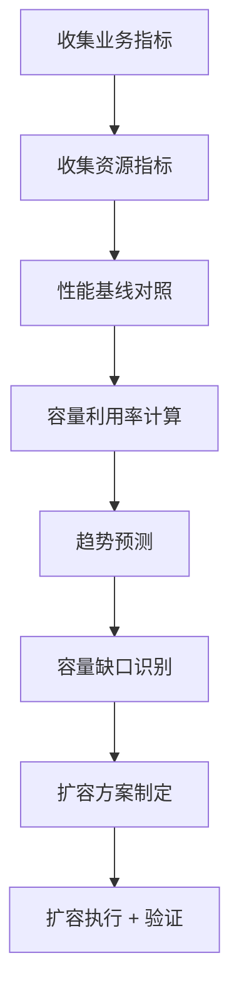

# 容量规划指南

> 归属：多平台多租户大数据平台 · 运维文档
> 版本：v1.1 ｜ 日期：2026-08-17 ｜ 状态：已完成（补充压测基线）
> 关联：`design/运维/运维手册.md`；`design/测试/性能测试计划.md`；`design/详细设计/多平台多租户大数据平台_弹性调度详细设计_v0.1.md`；`tests/performance/stress/stress-test-report.md`
> 适用范围：平台运维 + SRE + 架构组
> 优先级：P1（重要补齐）

---

## 1. 容量规划目标

### 1.1 总体目标

建立基于业务负载、性能基线、SLA 要求的容量评估与扩缩容决策机制，确保平台在业务增长下持续满足 SLA，避免容量不足导致故障，避免过度预留导致浪费。

### 1.2 容量规划原则

1. **以 SLA 为锚**：容量规划以 SLA（控制面 > 99.9%、数据面 > 99.5%、P99 < 200ms）为约束。
2. **以基线为据**：基于性能测试基线（参见 `design/测试/性能测试计划.md` 与 `tests/performance/stress/stress-test-report.md`）评估容量上限。
3. **以趋势为前**：基于历史趋势预测未来容量需求，提前扩容。
4. **弹性优先**：优先使用弹性扩缩容，避免静态预留过多资源。
5. **成本可控**：在满足 SLA 前提下最小化资源成本，定期评估优化。

---

## 2. 各组件资源基线

### 2.1 K8s 集群基线

| 组件 | 规格 | 数量 | 用途 | 扩容方式 |
| --- | --- | --- | --- | --- |
| master | 4C8G + 100G SSD | 3 | 控制面 | 静态，不弹性 |
| worker | 16C64G + 500G SSD | 10 | 业务面 | Cluster Autoscaler |
| worker（引擎池） | 32C128G + 1T SSD | 5 | 引擎作业 | 弹性 + 队列 |
| worker（监控池） | 8C16G + 200G SSD | 2 | 监控组件 | 静态 |

### 2.2 数据库基线

| 组件 | 规格 | 数量 | 用途 | 扩容方式 |
| --- | --- | --- | --- | --- |
| openGauss（元数据） | 8C32G + 500G SSD | 3 | 平台元数据库 | 主从 + 读扩展 |
| Doris BE | 16C64G + 1T SSD | 3 | OLAP 存储 | 横向扩 BE |
| Doris FE | 8C16G + 200G SSD | 3 | OLAP 元数据 | 静态 |
| Redis | 4C16G + 100G | 3 | 缓存 | 主从 + Cluster |

### 2.3 引擎基线

| 引擎 | 单实例规格 | 默认实例数 | 并发作业上限 | 扩容方式 |
| --- | --- | --- | --- | --- |
| Spark | 4C8G Executor | 50 | 100 | 弹性 + 队列 |
| Flink | 4C8G TM | 30 | 50 | 弹性 |
| Trino | 4C8G Worker | 10 | 100 并发查询 | 横向扩 Worker |
| DolphinScheduler | 4C8G Worker | 5 | 200 作业/min | 横向扩 Worker |

### 2.4 中间件基线

| 组件 | 规格 | 数量 | 用途 | 扩容方式 |
| --- | --- | --- | --- | --- |
| Kafka | 8C16G + 1T SSD | 5 | 消息流 | 横向扩 Broker |
| Elasticsearch | 8C32G + 1T SSD | 3 | 日志/搜索 | 横向扩 Node |
| MinIO/Ceph | 16C32G + 10T HDD | 5 | 对象存储 | 横向扩 Node |

### 2.5 API 服务压测基线（v1.1 新增）

基于 2026-08-17 高级别压测结果（`tests/performance/stress/stress-test-report.md`），API 服务（encaps-layer）单实例性能基线如下：

表：单实例性能基线（单机 32 核 / 32GB / H2 内存库 / JVM 1.1GB）

| 并发 | TPS | avg(ms) | P50(ms) | P95(ms) | P99(ms) | max(ms) | 错误率 |
| --- | --- | --- | --- | --- | --- | --- | --- |
| 100 | 3,807 ~ 7,472 | 9 ~ 22 | 3 ~ 14 | 43 ~ 56 | 82 ~ 122 | 489 ~ 666 | 0% |
| 500 | 1,887 ~ 5,726 | 17 ~ 92 | 4 ~ 46 | 78 ~ 258 | 166 ~ 950 | 909 ~ 1,333 | 0% |
| 1,000 | 1,843 ~ 5,950 | 17 ~ 98 | 4 ~ 48 | 75 ~ 296 | 146 ~ 992 | 642 ~ 1,402 | 0% |
| 2,000 | 1,588 | 60 | 23 | 234 | 458 | 2,705 | 0% |
| 5,000 | 1,535 | 61 | 25 | 224 | 431 | 2,162 | 0% |

表：单实例性能上限与拐点

| 指标 | 值 | 说明 |
| --- | --- | --- |
| 最大 TPS | ~1,588 | 2,000 并发时达到峰值 |
| TPS 饱和点 | 2,000 ~ 3,000 并发 | 超过后 TPS 不再增长 |
| P99 拐点 | 500 并发 | 登录接口 P99 从 90ms 升至 950ms |
| 熔断点 | > 5,000 并发 | 5,000 并发下未熔断，错误率 0% |
| 恢复时间 | < 5s | 压测后 5 秒内恢复至 P99 < 200ms |
| 内存稳定 | ~1,125 MB | 无线性增长，无内存泄漏 |

表：多实例水平扩展预期

| 实例数 | 预期 TPS | 预期最大并发 | 预期 P99 | 资源配额 |
| --- | --- | --- | --- | --- |
| 1 | ~1,600 | ~2,000 | ~450ms | 4C8G |
| 2 | ~3,200 | ~4,000 | ~300ms | 8C16G |
| 3 | ~4,800 | ~6,000 | ~250ms | 12C24G |
| 5 | ~8,000 | ~10,000 | ~200ms | 20C40G |
| 10 | ~16,000 | ~20,000 | ~200ms | 40C80G |

> 注：水平扩展预期基于线性扩展假设，实际受数据库连接池、共享资源竞争影响，TPS 增长率会递减。建议生产环境至少 3 实例（高可用 + 容量冗余）。

---

## 3. 容量评估方法

### 3.1 评估流程



### 3.2 关键指标

| 指标 | 定义 | 采集源 | 阈值 |
| --- | --- | --- | --- |
| CPU 利用率 | `rate(node_cpu_seconds_total{mode!="idle"}[5m])` | Prometheus | < 80% |
| 内存利用率 | `1 - MemAvailable / MemTotal` | Prometheus | < 85% |
| 磁盘利用率 | `1 - FS_avail / FS_size` | Prometheus | < 75% |
| Pod 调度等待 | `kube_pod_status_unschedulable` | Prometheus | = 0 |
| 作业排队 | `作业队列长度` | 自定义指标 | < 50 |
| 连接池使用率 | `active / max` | Micrometer | < 80% |
| 容量上限 | 性能测试拐点 TPS | k6 报告 | 见 §2.5 |

### 3.3 容量利用率计算

- **单服务容量利用率** = 当前 TPS / 性能基线拐点 TPS × 100%。
- **资源利用率** = max(CPU 利用率, 内存利用率, 磁盘利用率)。
- **综合利用率** = max(单服务容量利用率, 资源利用率)。
- **扩容触发**：综合利用率 > 70% 持续 30 分钟。
- **缩容触发**：综合利用率 < 30% 持续 2 小时。

### 3.4 趋势预测

- **数据源**：过去 90 天 Prometheus 指标 + 业务指标（租户数、作业数、查询数）。
- **方法**：线性回归 + 周期分解（按周/月周期）。
- **预测周期**：未来 30/60/90 天容量需求。
- **预警**：预测 30 天内将触达 70% 利用率，提前扩容。

---

## 4. 扩容决策标准

### 4.1 扩容触发条件

| 触发条件 | 阈值 | 持续时长 | 动作 |
| --- | --- | --- | --- |
| CPU 利用率 | > 80% | 30min | 弹性扩容 +1 实例 |
| 内存利用率 | > 85% | 30min | 弹性扩容 +1 实例 |
| 磁盘利用率 | > 75% | 10min | 扩容 PVC 或加节点 |
| Pod 调度等待 | > 0 | 5min | Cluster Autoscaler 加节点 |
| 作业排队 | > 50 | 10min | 扩容引擎池 |
| 容量利用率 | > 70% | 30min | 扩容 + 评估长期方案 |
| 预测触达 | 30 天内 > 70% | — | 提前扩容 |
| TPS 接近拐点 | TPS > 1,400（单实例） | 5min | HPA 扩容（v1.1 新增） |

### 4.2 扩容决策矩阵

| 场景 | 短期方案 | 长期方案 |
| --- | --- | --- |
| 突发流量 | HPA 弹性扩容 + 限流降级 | 评估常态容量 + 调整基线 |
| 业务增长 | 提前扩容 + 调整基线 | 架构优化 + 引入缓存 |
| 引擎作业排队 | 扩容引擎池 + 错峰 | 引擎资源池隔离 + 优先级 |
| 数据增长 | 扩容存储 + 数据归档 | 冷热分层 + 数据生命周期 |
| 单点瓶颈 | 扩容瓶颈节点 | 优化代码 + 拆分服务 |
| 登录 CPU 瓶颈 | 登录限流 + token 缓存 | 异步签发 + 降低哈希强度（v1.1 新增） |

### 4.3 缩容决策

- **触发**：利用率 < 30% 持续 2 小时。
- **步长**：每次缩容 1 实例，间隔 30 分钟。
- **保护**：保留最小实例数（按 SLA 计算），夜间不缩容。
- **验证**：缩容后监控 30 分钟，异常自动回滚。

---

## 5. 弹性扩缩容配置

### 5.1 HPA 配置示例（v1.1 基于压测基线调优）

```yaml
# 配置示例：API 服务 HPA（基于压测基线）
apiVersion: autoscaling/v2
kind: HorizontalPodAutoscaler
metadata:
  name: api-gateway-hpa
  namespace: prod
spec:
  scaleTargetRef:
    apiVersion: apps/v1
    kind: Deployment
    name: api-gateway
  minReplicas: 3              # 高可用最小副本数
  maxReplicas: 20             # 基于压测：20 实例可支撑 ~32,000 TPS
  metrics:
  - type: Resource
    resource:
      name: cpu
      target:
        type: Utilization
        averageUtilization: 70   # CPU 70% 触发扩容
  - type: Resource
    resource:
      name: memory
      target:
        type: Utilization
        averageUtilization: 75
  - type: Pods
    pods:
      metric:
        name: http_requests_per_second
      target:
        type: AverageValue
        averageValue: "1400"     # 单实例 TPS > 1,400 触发扩容（拐点 1,588 的 88%）
  behavior:
    scaleUp:
      stabilizationWindowSeconds: 60
      policies:
      - type: Pods
        value: 2                 # 每次最多扩 2 个 Pod
        periodSeconds: 60
      - type: Percent
        value: 50                # 或扩 50%
        periodSeconds: 60
      selectPolicy: Max
    scaleDown:
      stabilizationWindowSeconds: 300   # 缩容稳定窗口 5 分钟
      policies:
      - type: Pods
        value: 1
        periodSeconds: 300
```

### 5.2 资源配额建议（v1.1 新增）

表：API 服务资源配额（基于压测基线）

| 部署规模 | 副本数 | 单副本 CPU | 单副本 内存 | 总 CPU | 总内存 | 预期 TPS | 预期并发 |
| --- | --- | --- | --- | --- | --- | --- | --- |
| 小型（开发/测试） | 1 | 2 | 4Gi | 2 | 4Gi | ~1,600 | ~2,000 |
| 中型（预发/小生产） | 3 | 4 | 8Gi | 12 | 24Gi | ~4,800 | ~6,000 |
| 大型（生产） | 5 | 4 | 8Gi | 20 | 40Gi | ~8,000 | ~10,000 |
| 超大型（高流量生产） | 10 | 4 | 8Gi | 40 | 80Gi | ~16,000 | ~20,000 |

```yaml
# 配置示例：生产环境 Deployment 资源配额
apiVersion: apps/v1
kind: Deployment
metadata:
  name: api-gateway
  namespace: prod
spec:
  replicas: 5
  template:
    spec:
      containers:
      - name: api-gateway
        resources:
          requests:
            cpu: "2"
            memory: "4Gi"
          limits:
            cpu: "4"
            memory: "8Gi"
        # JVM 参数：基于压测内存 ~1.1GB，设置 2GB 堆
        env:
        - name: JAVA_OPTS
          value: "-Xms2g -Xmx2g -XX:+UseG1GC -XX:MaxGCPauseMillis=200"
```

### 5.3 Cluster Autoscaler

- 启用 Cluster Autoscaler，节点池配置 min/max。
- Pod Pending 触发节点扩容，节点空闲 10min 触发缩容。
- 节点扩容预算：单次最多扩 5 节点，间隔 5 分钟。
- 节点缩容保护：监控组件、数据库、引擎 master 不缩容。

### 5.4 引擎弹性

- Spark on K8s：队列 + 弹性 Executor，参见 `design/详细设计/多平台多租户大数据平台_弹性调度详细设计_v0.1.md`。
- Flink：TaskManager 弹性 + 资源池。
- Trino：Worker 横向扩缩容，按并发查询数触发。

---

## 6. 容量评估报告

### 6.1 报告内容

- 当前容量利用率（按服务、按资源）。
- 性能基线对照（当前 TPS / 拐点 TPS）。
- 趋势预测（30/60/90 天）。
- 容量缺口与扩容建议。
- 成本评估（扩容前后）。

### 6.2 报告频次

- **月度报告**：每月 1 日生成，运维负责人评审。
- **季度评审**：每季度容量评审会，架构组 + 运维组 + 业务方参与。
- **触发式报告**：容量预警触发后 24h 内出专项报告。

---

## 7. 成本优化

### 7.1 优化方向

| 方向 | 措施 | 预期收益 |
| --- | --- | --- |
| 弹性利用 | 非峰值时段缩容，错峰作业 | 30% 资源成本 |
| 资源规格 | 按实际利用调整规格，避免超配 | 10% 资源成本 |
| 存储分层 | 冷数据归档 HDD，热数据 SSD | 40% 存储成本 |
| 引擎复用 | 开发/测试环境复用引擎池 | 20% 引擎成本 |
| 作业优化 | 优化作业资源申请，减少浪费 | 15% 引擎成本 |
| 登录缓存 | token 缓存 + 降低哈希强度 | 降低 CPU 30%（v1.1 新增） |

### 7.2 成本监控

- 每月按租户、按服务、按资源出成本报表。
- 成本异常（环比 > 20%）触发告警 + 评审。
- 成本优化建议纳入季度评审。

---

## 8. 风险与应对

| 风险 | 概率 | 影响 | 应对 |
| --- | --- | --- | --- |
| 扩容不及时导致故障 | 中 | SLA 违约 | 提前扩容 + 弹性 + 容量预警 |
| 缩容导致 SLA 下降 | 低 | 性能下降 | 缩容保护 + 验证 + 回滚 |
| 性能基线失真 | 中 | 容量评估偏差 | 定期刷新基线 + 多场景测试 |
| 节点配额不足 | 中 | 扩容失败 | 提前申请配额 + 多云备用 |
| 成本超预算 | 中 | 财务压力 | 月度成本评审 + 优化措施 |
| 登录 CPU 瓶颈 | 高 | 高并发 P99 劣化 | 限流 + token 缓存 + 异步签发（v1.1 新增） |

---

## 9. 参考

- `design/运维/运维手册.md`：SLA 与扩缩容。
- `design/测试/性能测试计划.md`：性能基线与拐点。
- `tests/performance/stress/stress-test-report.md`：高级别压测报告（v1.1 新增）。
- `tests/performance/reports/performance-report.md`：基础压测报告（100/500/1000 并发）。
- `design/详细设计/多平台多租户大数据平台_弹性调度详细设计_v0.1.md`：弹性调度设计。
- `design/v2.0/V2.0_架构设计文档.md`：架构与资源拓扑。
- K8s HPA 文档：https://kubernetes.io/docs/tasks/run-application/horizontal-pod-autoscale/