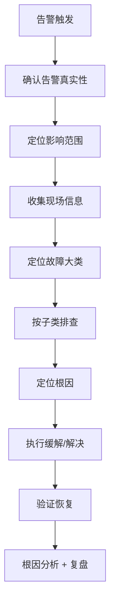

# 故障排查手册

> 归属：多平台多租户大数据平台 · 运维文档
> 版本：v1.0 ｜ 日期：2026-08-17 ｜ 状态：已完成
> 关联：`design/运维/运维手册.md`；`design/运维/监控告警SOP.md`；`design/运维/容量规划指南.md`
> 适用范围：平台运维 + SRE 值班 + 客户驻场
> 优先级：P1（重要补齐）

---

## 1. 故障分类

### 1.1 故障等级

参见 `design/运维/监控告警SOP.md` §1.1，按 P0/P1/P2/P3 分级响应。

### 1.2 故障分类矩阵

| 大类 | 子类 | 典型症状 | 默认级别 |
| --- | --- | --- | --- |
| 集群故障 | K8s 节点 NotReady | 节点不可调度，Pod 驱逐 | P0/P1 |
| 集群故障 | master 不可用 | API Server 无响应，写入失败 | P0 |
| 集群故障 | etcd 异常 | API Server 慢，写入超时 | P0 |
| 服务故障 | Pod 崩溃重启 | OOM、Panic、Liveness 失败 | P1/P2 |
| 服务故障 | 全实例不可用 | 服务 100% 5xx | P0 |
| 服务故障 | 响应超时 | P99 > 阈值，超时错误率上升 | P1 |
| 数据库故障 | 主节点宕机 | 写入失败，连接拒绝 | P0 |
| 数据库故障 | 连接池满 | 新连接拒绝，超时 | P1 |
| 数据库故障 | 慢查询锁等待 | P99 上升，事务超时 | P1/P2 |
| 引擎故障 | Spark 作业失败 | 作业状态 FAILED，OOM | P1/P2 |
| 引擎故障 | Flink 作业重启 | Checkpoint 失败，重启循环 | P1 |
| 引擎故障 | Trino 查询超时 | 查询 P99 > 30s | P2 |
| 网络故障 | DNS 解析失败 | 服务发现失败 | P1 |
| 网络故障 | 跨 namespace 拦截 | NetworkPolicy 误拦 | P2 |
| 存储故障 | 磁盘满 | 写入失败，Pod Evicted | P1 |
| 存储故障 | IO 高 | 响应慢，IO 等待高 | P2 |
| 安全故障 | 越权告警 | 跨租户访问被拦 | P0 |
| 安全故障 | 异常登录 | 暴力破解、异地登录 | P1 |
| 容量故障 | CPU/内存水位高 | 资源紧张，性能下降 | P2/P3 |

---

## 2. 通用排查步骤

### 2.1 排查通用流程



### 2.2 现场信息收集清单

每起故障排查必先收集以下信息：

1. **告警详情**：告警名、级别、触发时间、持续时长、PromQL、当前值。
2. **影响范围**：受影响服务、租户、接口、用户数、业务影响。
3. **变更记录**：近 2h 内的部署、配置、扩缩容、人工操作。
4. **监控大盘**：受影响服务的 Grafana 大盘截图（CPU/内存/延迟/错误率）。
5. **日志**：受影响服务的最近 1000 行日志 + 错误日志。
6. **链路追踪**：失败请求的 Jaeger/Tempo 追踪。
7. **事件日志**：`kubectl get events --sort-by=.lastTimestamp` 输出。

---

## 3. 常见故障排查与解决

### 3.1 K8s 节点 NotReady

**症状**：`kube_node_status_condition{condition="Ready",status!="true"} == 1`。

**排查步骤**：

1. `kubectl describe node <node>` 查看 NotReady 原因（KubeletDown、DiskPressure、MemoryPressure、PIDPressure）。
2. SSH 登录节点，检查 Kubelet 状态：`systemctl status kubelet`。
3. 检查资源压力：`free -h`、`df -h`、`ps aux --sort=-%mem | head`。
4. 检查容器运行时：`crictl ps -a`、`systemctl status containerd`。

**解决方案**：

- **KubeletDown**：重启 Kubelet `systemctl restart kubelet`，排查 Kubelet 日志。
- **DiskPressure**：清理无用镜像 `crictl rmi --prune`，扩容磁盘或迁移 Pod。
- **MemoryPressure**：驱逐高内存 Pod，扩容节点或迁移 Pod。
- **PIDPressure**：排查 PID 泄漏进程，重启问题 Pod。
- 节点恢复后 `kubectl uncordon <node>`。

### 3.2 Pod 崩溃重启（OOMKilled）

**症状**：`increase(kube_pod_container_status_restarts_total[1h]) > 3`。

**排查步骤**：

1. `kubectl describe pod <pod>` 查看 Last State，确认 Exit Code 137（OOMKilled）。
2. `kubectl logs <pod> --previous` 查看崩溃前日志。
3. 查看监控：Pod 内存使用曲线、JVM 堆内存、堆栈 Dump。

**解决方案**：

- **内存不足**：调大 Pod `resources.limits.memory`，或优化代码内存使用。
- **JVM 堆泄漏**：分析 Heap Dump，定位泄漏对象，修复代码。
- **堆外内存**：排查 Direct Buffer、Metaspace、线程栈，调整 JVM 参数。
- 临时缓解：重启 Pod（注意可能丢未持久化状态）。

### 3.3 数据库主节点宕机

**症状**：写入失败，连接拒绝，主从切换告警。

**排查步骤**：

1. 确认主节点宕机：`kubectl get pod -n <db-ns>` 查看主 Pod 状态。
2. 确认是否触发自动切换：查看高可用控制器日志（Patroni/Vitess）。
3. 若未自动切换，检查切换条件与日志。
4. 确认从节点数据一致性：GTID/LSN 差距。

**解决方案**：

- **自动切换成功**：等待应用连接池刷新，验证写入恢复。
- **自动切换失败**：手动执行 `patronictl switchover`，或提升从节点。
- **数据损坏**：从备份恢复，参见 `design/运维/灾备方案.md`。
- 切换后检查应用连接、慢查询、连接池上限。

### 3.4 服务响应超时

**症状**：API P99 > 阈值，超时错误率上升。

**排查步骤**：

1. 查看服务 Grafana 大盘：延迟、TPS、错误率、CPU、内存。
2. 查看下游依赖：数据库、缓存、外部服务延迟。
3. 查看链路追踪：定位慢 Span（DB 查询、外部调用、锁等待）。
4. 查看日志：超时错误、慢查询、连接池等待。

**解决方案**：

- **下游慢**：优化下游（加索引、扩容、缓存），参见 §3.3、§3.5。
- **连接池满**：调大连接池或扩容服务实例。
- **慢查询**：SQL 优化 + 加索引 + 限流。
- **锁等待**：排查锁竞争，缩短事务，优化并发。
- 临时缓解：限流降级，参见 `design/运维/运维手册.md` §限流降级。

### 3.5 Spark 作业失败（OOM）

**症状**：作业状态 FAILED，Executor OOM 退出。

**排查步骤**：

1. 查看作业 UI：失败 Stage、Task、Executor。
2. 查看 Executor 日志：OOM 错误、GC 耗时。
3. 查看作业配置：`spark.executor.memory`、`spark.driver.memory`、并行度。
4. 查看数据倾斜：Task 处理数据量分布。

**解决方案**：

- **Executor 内存不足**：调大 `spark.executor.memory` + `memoryOverhead`。
- **数据倾斜**：加盐打散、广播小表、自定义 Partitioner。
- **GC 耗时高**：调 G1GC 参数，减少对象分配。
- **Driver OOM**：调大 `spark.driver.memory`，减少 collect。
- 临时缓解：降低作业并发度，错峰执行。

### 3.6 Flink 作业重启循环

**症状**：作业频繁重启，Checkpoint 失败。

**排查步骤**：

1. 查看作业 UI：重启次数、失败原因、Checkpoint 统计。
2. 查看 TaskManager 日志：OOM、异常、反压。
3. 查看 Checkpoint：大小、耗时、对齐时间。
4. 查看反压：下游算子反压情况。

**解决方案**：

- **Checkpoint 失败**：增大 Checkpoint 间隔，调大对齐超时，优化 State Backend。
- **反压**：优化下游算子（扩并发、加缓存、异步化）。
- **OOM**：调大 TaskManager 内存，减少 State 大小。
- **数据倾斜**：KeyBy 重分区，加盐。
- 临时缓解：降低作业并行度，重启作业。

### 3.7 磁盘满

**症状**：写入失败，Pod Evicted，`disk pressure`。

**排查步骤**：

1. `df -h` 查看各挂载点使用率。
2. `du -sh /* | sort -h` 定位大目录。
3. 查看容器存储：`crictl ps` + 镜像大小。
4. 查看日志/PVC 占用：日志文件、临时文件、未清理数据。

**解决方案**：

- **镜像堆积**：`crictl rmi --prune` 清理无用镜像。
- **日志堆积**：清理旧日志，调整日志保留期，参见 `design/运维/数据生命周期管理.md`。
- **临时文件**：清理 `/tmp`、Spark shuffle、Flink 临时文件。
- **PVC 满**：扩容 PVC，或迁移数据。
- 长期：调整日志保留、设置告警阈值 75%。

### 3.8 越权告警（安全 P0）

**症状**：跨租户访问被拦截告警触发。

**排查步骤**：

1. 查看告警详情：源 IP、源 Token、目标资源、拦截规则。
2. 确认是否真实越权：核对 Token 与资源归属租户。
3. 查看访问日志：完整请求路径、Header、Body。
4. 查看用户行为：是否异常登录、Token 是否泄露。

**解决方案**：

- **真实越权**：立即封禁 Token + 用户，安全组介入调查，参见 `design/安全/安全整改清单.md`。
- **误报**：调优规则，记录误报原因。
- **Token 泄露**：撤销全部相关 Token，强制用户重新登录 + 改密。
- 复盘：24h 内完成 P0 复盘，含根因、影响、改进项。

---

## 4. 故障复盘

### 4.1 复盘要求

- **P0 故障**：24h 内完成复盘报告，CTO 评审。
- **P1 故障**：3 个工作日内完成复盘报告，运维负责人评审。
- **P2/P3 故障**：纳入周复盘，按需独立复盘。

### 4.2 复盘报告模板

```markdown
# 故障复盘报告 - <故障名> - <日期>

## 1. 故障概述
- 触发时间：
- 持续时长：
- 影响范围：
- 故障级别：

## 2. 时间线
| 时间 | 事件 | 操作人 |
| --- | --- | --- |
| T+0 | 告警触发 | 系统 |
| T+5min | 接警确认 | SRE |
| ... | ... | ... |

## 3. 根因分析
- 直接原因：
- 根本原因：
- 触发条件：

## 4. 处理过程
- 缓解措施：
- 解决措施：
- 验证结果：

## 5. 影响评估
- 业务影响：
- 用户影响：
- 数据影响：

## 6. 改进项
| 编号 | 改进项 | 负责人 | 计划完成 |
| --- | --- | --- | --- |
| I-001 | ... | ... | ... |

## 7. 经验教训
- ...
```

---

## 5. 故障知识库

### 5.1 知识库维护

- 每起 P0/P1 故障复盘后，将排查步骤与解决方案沉淀至本手册。
- 每季度梳理故障知识库，更新排查步骤，下线失效方案。
- 知识库检索：按故障大类 + 子类 + 关键字检索。

### 5.2 自动化排查工具

- **诊断脚本**：常见故障一键诊断，输出诊断报告。
- **自愈脚本**：明确根因的故障自动恢复（如 Pod 重启、磁盘清理）。
- **ChatOps**：钉钉机器人集成排查命令，快速查询状态。

---

## 6. 参考

- `design/运维/运维手册.md`：运维目标与监控架构。
- `design/运维/监控告警SOP.md`：告警级别与处理流程。
- `design/运维/容量规划指南.md`：容量评估与扩容。
- `design/运维/灾备方案.md`：灾备与恢复。
- `design/安全/安全整改清单.md`：安全整改与复测。
- K8s 故障排查：https://kubernetes.io/docs/tasks/debug-application-cluster/