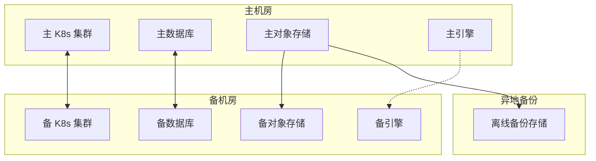
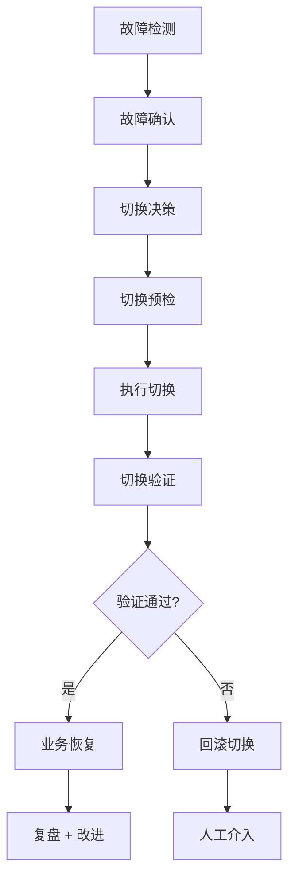

# 灾备方案

> 归属：多平台多租户大数据平台 · 运维文档
> 版本：v1.0 ｜ 日期：2026-08-17 ｜ 状态：已完成
> 关联：`design/运维/运维手册.md`；`design/运维/监控告警SOP.md`；`design/运维/故障排查手册.md`；`design/deploy/backup/`
> 适用范围：平台运维 + SRE + 客户驻场
> 优先级：P2（建议补齐）

---

## 1. 灾备目标

### 1.1 总体目标

建立完善的灾备体系，确保平台在遭遇故障、灾难时能够快速恢复业务，满足 RTO/RPO 要求，保障业务连续性与数据安全。

### 1.2 RPO/RTO 定义

| 场景 | RPO | RTO | 说明 |
| --- | --- | --- | --- |
| 单节点故障 | 0 | < 30s | 自动切换，无数据丢失 |
| 单机房故障 | < 1min | < 4h | 跨机房切换，分钟级数据丢失 |
| 区域灾难 | < 1h | < 24h | 跨区域恢复，小时级数据丢失 |
| 数据误操作 | < 1h | < 4h | 基于备份恢复 + 增量回放 |
| 勒索病毒 | < 1h | < 24h | 基于离线备份恢复 |

### 1.3 灾备原则

1. **分级灾备**：按业务重要性分级，核心业务优先恢复。
2. **自动化优先**：故障自动检测、自动切换、自动恢复。
3. **演练验证**：定期演练，确保灾备方案有效。
4. **成本可控**：在满足 RTO/RPO 前提下最小化灾备成本。

---

## 2. 灾备架构

### 2.1 整体架构

### 2.2 同城双活

- **机房距离**：≤ 50km，网络延迟 < 5ms。
- **数据库**：主从同步复制（强一致），故障自动切换。
- **对象存储**：Ceph 跨机房副本（3 副本跨机房）。
- **K8s 集群**：双集群，DNS 流量分发，故障切换 DNS。
- **引擎**：备机房引擎待命，故障后启动接管。

### 2.3 异地备份

- **备份距离**：≥ 1000km，规避区域灾难。
- **备份方式**：每日全量 + 每小时增量，异步传输。
- **备份存储**：离线备份存储，防勒索病毒。
- **备份加密**：SM4 加密，密钥 KMS 托管。

---

## 3. 备份策略

### 3.1 备份对象与策略

| 对象 | 备份方式 | 频次 | 保留 | 存储 |
| --- | --- | --- | --- | --- |
| 平台元数据库 | 全量 + 增量 | 全量每日 + 增量每小时 | 30 天 | 异地备份 |
| 业务数据库 | 全量 + 增量 | 全量每日 + 增量每小时 | 30 天 | 异地备份 |
| 对象存储 | 增量同步 | 实时 | 90 天 | 跨机房 + 异地 |
| 配置 | 全量 | 每次变更 | 180 天 | Git + 异地备份 |
| 镜像 | 全量 | 每次构建 | 90 天 | 镜像仓库 + 异地 |
| 日志 | 增量 | 实时 | 180 天 | 异地备份 |
| 引擎 State | 快照 | 每日 | 7 天 | 异地备份 |

### 3.2 备份执行

- **自动化**：备份脚本定时执行，参见 `design/deploy/backup/`。
- **完整性校验**：备份后自动校验完整性（SM3 哈希）。
- **备份告警**：备份失败立即告警，参见 `design/运维/监控告警SOP.md`。
- **备份审计**：备份执行记录留档，可追溯。

### 3.3 备份恢复

- **恢复测试**：每月一次备份恢复测试，验证备份有效性。
- **恢复脚本**：恢复脚本预置，一键恢复。
- **恢复验证**：恢复后验证数据完整性、服务可用性。

---

## 4. 故障切换

### 4.1 切换触发

| 触发条件 | 切换方式 | 自动/手动 |
| --- | --- | --- |
| 数据库主节点宕机 | 主从切换 | 自动 |
| 单机房不可用 | DNS 切换 | 半自动（人工确认） |
| 区域灾难 | 异地恢复 | 手动 |
| 数据误操作 | 备份恢复 | 手动 |

### 4.2 切换流程

### 4.3 切换演练

- **桌面演练**：每季度一次，模拟切换流程。
- **半实战演练**：每半年一次，备机房实际切换。
- **全实战演练**：每年一次，主备机房实际切换。
- **演练留档**：演练报告留档，含时间线、问题、改进项。

---

## 5. 灾备演练流程

### 5.1 演练计划

| 阶段 | 内容 | 工期 |
| --- | --- | --- |
| 准备 | 演练方案 + 通知 + 备份 | 3d |
| 预演 | 桌面演练 + 流程确认 | 1d |
| 实战 | 实际切换 + 验证 | 1d |
| 回切 | 切回主机房 + 验证 | 1d |
| 复盘 | 演练报告 + 改进项 | 3d |

### 5.2 演练步骤

1. **演练通知**：提前 7 天通知相关方，避开业务高峰。
2. **演练备份**：演练前全量备份，确保可回滚。
3. **演练开始**：T0 时刻记录，按计划执行切换。
4. **切换验证**：验证服务可用性、数据完整性、业务正确性。
5. **业务验证**：业务方验证关键业务流程。
6. **演练回切**：切回主机房，验证恢复正常。
7. **演练复盘**：24h 内出演练报告，含时间线、问题、改进项。

### 5.3 演练验收

- 切换时间 ≤ RTO。
- 数据丢失 ≤ RPO。
- 业务验证通过。
- 回切成功，无残留问题。

---

## 6. 应急响应

### 6.1 应急组织

- **应急指挥**：CTO 或授权人。
- **技术组**：SRE + 服务负责人 + DBA + 网络组。
- **业务组**：业务负责人 + 客户对接。
- **沟通组**：PR + 法务 + 客户沟通。

### 6.2 应急流程

1. **故障确认**：5 分钟内确认故障级别，参见 `design/运维/监控告警SOP.md`。
2. **应急启动**：P0 故障启动应急响应，拉应急群。
3. **影响评估**：评估业务影响、用户影响、数据影响。
4. **决策切换**：根据故障情况决策是否切换、切换方式。
5. **执行切换**：执行切换，监控切换过程。
6. **业务恢复**：验证业务恢复，通知业务方。
7. **客户沟通**：按需向客户沟通故障与恢复情况。
8. **复盘改进**：24h 内复盘，出改进项。

### 6.3 应急联系

- 内部联系：参见 `design/运维/监控告警SOP.md` §7。
- 外部联系：机房、云厂商、网络运营商、安全应急机构。
- 客户联系：客户对接人 + 客户应急联系。

---

## 7. 灾备资源

### 7.1 备机房资源

| 资源 | 规格 | 数量 | 用途 |
| --- | --- | --- | --- |
| K8s worker | 与主机房同规格 | 与主机房同数量 | 备集群 |
| 数据库 | 与主机房同规格 | 与主机房同数量 | 备数据库 |
| 对象存储 | 与主机房同规格 | 与主机房同数量 | 备存储 |
| 引擎 | 与主机房同规格 | 按需 | 备引擎 |

### 7.2 异地备份资源

| 资源 | 规格 | 用途 |
| --- | --- | --- |
| 备份存储 | ≥ 主机房数据量 × 2 | 异地备份 |
| 备份网络 | ≥ 100Mbps | 备份传输 |

---

## 8. 风险与应对

| 风险 | 概率 | 影响 | 应对 |
| --- | --- | --- | --- |
| 切换失败 | 低 | 业务中断延长 | 切换预检 + 回滚 + 人工介入 |
| 备份不可用 | 低 | 无法恢复 | 备份校验 + 多份备份 + 恢复测试 |
| 演练影响生产 | 中 | 业务影响 | 演练窗口 + 备份 + 回切预案 |
| RTO/RPO 不达标 | 中 | SLA 违约 | 优化切换流程 + 提升自动化 |
| 灾备资源不足 | 中 | 无法切换 | 提前规划资源 + 容量评估 |

---

## 9. 参考

- `design/运维/运维手册.md`：SLA 与运维。
- `design/运维/监控告警SOP.md`：告警与应急。
- `design/运维/故障排查手册.md`：故障排查。
- `design/deploy/backup/`：备份脚本与配置。
- `design/运维/容量规划指南.md`：容量评估。