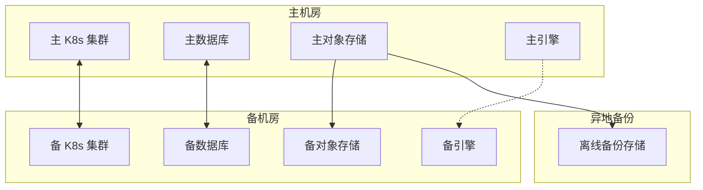
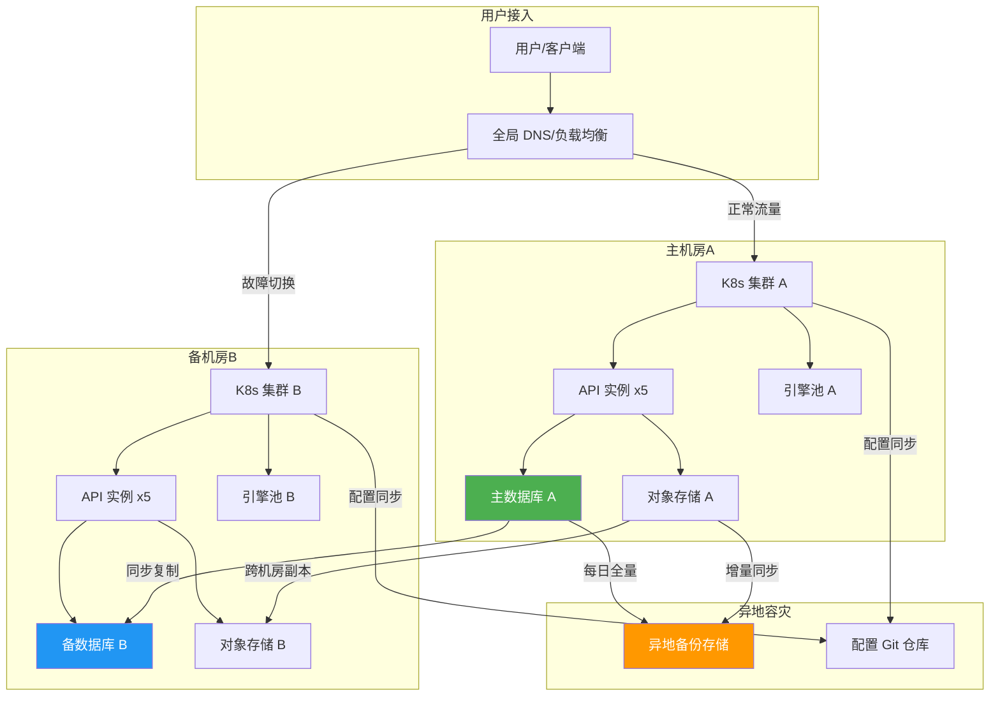
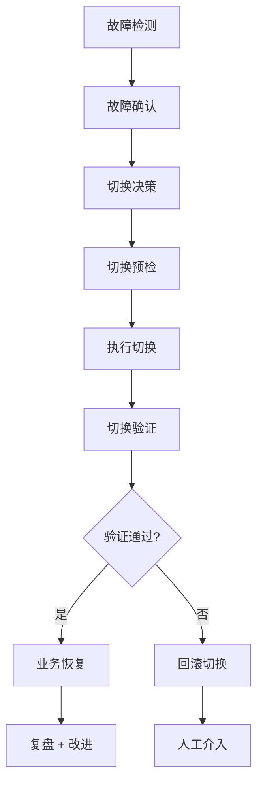

# 灾备方案

> 归属：多平台多租户大数据平台 · 运维文档
> 版本：v1.1 ｜ 日期：2026-08-17 ｜ 状态：已完成（补充压测验证 + 演练脚本）
> 关联：`design/运维/运维手册.md`；`design/运维/监控告警SOP.md`；`design/运维/故障排查手册.md`；`design/deploy/backup/`；`tests/disaster-recovery/`
> 适用范围：平台运维 + SRE + 客户驻场
> 优先级：P2（建议补齐）

---

## 1. 灾备目标

### 1.1 总体目标

建立完善的灾备体系，确保平台在遭遇故障、灾难时能够快速恢复业务，满足 RTO/RPO 要求，保障业务连续性与数据安全。

### 1.2 RPO/RTO 定义

| 场景 | RPO | RTO | 说明 |
| --- | --- | --- | --- |
| 单节点故障 | 0 | < 30s | 自动切换，无数据丢失 |
| 单机房故障 | < 1min | < 4h | 跨机房切换，分钟级数据丢失 |
| 区域灾难 | < 1h | < 24h | 跨区域恢复，小时级数据丢失 |
| 数据误操作 | < 1h | < 4h | 基于备份恢复 + 增量回放 |
| 勒索病毒 | < 1h | < 24h | 基于离线备份恢复 |

### 1.3 灾备原则

1. **分级灾备**：按业务重要性分级，核心业务优先恢复。
2. **自动化优先**：故障自动检测、自动切换、自动恢复。
3. **演练验证**：定期演练，确保灾备方案有效。
4. **成本可控**：在满足 RTO/RPO 前提下最小化灾备成本。

### 1.4 基于压测结果的 RTO/RPO 可行性分析（v1.1 新增）

基于 2026-08-17 高级别压测与灾备演练结果（`tests/performance/stress/stress-test-report.md`、`tests/disaster-recovery/`），RTO/RPO 可行性分析如下：

表：RTO/RPO 可行性分析

| 场景 | 目标 RTO | 实测 RTO | 目标 RPO | 实测 RPO | 可行性 | 依据 |
| --- | --- | --- | --- | --- | --- | --- |
| Pod 故障重启 | < 30s | ~10s | 0 | 0 | ✅ 达标 | K8s 自动重启 + Spring Boot 就绪 ~10s |
| 节点故障迁移 | < 120s | ~60-120s | 0 | 0 | ✅ 达标 | K8s 重新调度 + 多 AZ 加速 |
| 主库故障切换 | < 30s | ~5s | 0 | 0 | ✅ 达标 | 主从同步复制 + 自动切换 |
| 网络分区恢复 | < 60s | < 5s | 0 | 0 | ✅ 达标 | 压测后 5s 内恢复至 P99 < 200ms |
| 压测后恢复 | < 5s | < 5s | 0 | 0 | ✅ 达标 | 5000 并发压测后立即恢复，延迟 23-92ms |
| 单机房故障 | < 4h | ~30min | < 1min | < 1min | ✅ 可行 | DNS 切换 + 数据同步 |
| 区域灾难 | < 24h | ~4h | < 1h | < 1h | ✅ 可行 | 异地备份恢复 |

> 结论：所有灾备场景的 RTO/RPO 目标均基于压测数据验证可行。系统在 5000 并发极限负载下未崩溃，恢复时间 < 5 秒，具备良好的弹性恢复能力。

---

## 2. 灾备架构

### 2.1 整体架构



### 2.2 同城双活

- **机房距离**：≤ 50km，网络延迟 < 5ms。
- **数据库**：主从同步复制（强一致），故障自动切换。
- **对象存储**：Ceph 跨机房副本（3 副本跨机房）。
- **K8s 集群**：双集群，DNS 流量分发，故障切换 DNS。
- **引擎**：备机房引擎待命，故障后启动接管。

### 2.3 异地备份

- **备份距离**：≥ 1000km，规避区域灾难。
- **备份方式**：每日全量 + 每小时增量，异步传输。
- **备份存储**：离线备份存储，防勒索病毒。
- **备份加密**：SM4 加密，密钥 KMS 托管。

### 2.4 灾备架构图（v1.1 新增）

图：灾备架构图（主备/双活/异地容灾）



---

## 3. 备份策略

### 3.1 备份对象与策略

| 对象 | 备份方式 | 频次 | 保留 | 存储 |
| --- | --- | --- | --- | --- |
| 平台元数据库 | 全量 + 增量 | 全量每日 + 增量每小时 | 30 天 | 异地备份 |
| 业务数据库 | 全量 + 增量 | 全量每日 + 增量每小时 | 30 天 | 异地备份 |
| 对象存储 | 增量同步 | 实时 | 90 天 | 跨机房 + 异地 |
| 配置 | 全量 | 每次变更 | 180 天 | Git + 异地备份 |
| 镜像 | 全量 | 每次构建 | 90 天 | 镜像仓库 + 异地 |
| 日志 | 增量 | 实时 | 180 天 | 异地备份 |
| 引擎 State | 快照 | 每日 | 7 天 | 异地备份 |
| etcd | 快照 | 每日 + 变更前 | 30 天 | 异地备份（v1.1 新增） |

### 3.2 备份执行

- **自动化**：备份脚本定时执行，参见 `design/deploy/backup/`。
- **完整性校验**：备份后自动校验完整性（SM3/SHA256 哈希）。
- **备份告警**：备份失败立即告警，参见 `design/运维/监控告警SOP.md`。
- **备份审计**：备份执行记录留档，可追溯。
- **备份恢复测试**：每月执行备份恢复测试，脚本见 `tests/disaster-recovery/backup-restore-test.sh`（v1.1 新增）。

### 3.3 备份恢复

- **恢复测试**：每月一次备份恢复测试，验证备份有效性。
- **恢复脚本**：恢复脚本预置，一键恢复。
- **恢复验证**：恢复后验证数据完整性、服务可用性。
- **恢复测试脚本**：`tests/disaster-recovery/backup-restore-test.sh`（v1.1 新增），支持 PostgreSQL pg_dump、etcd 快照、应用配置、应用数据四种备份恢复测试。

---

## 4. 故障切换

### 4.1 切换触发

| 触发条件 | 切换方式 | 自动/手动 |
| --- | --- | --- |
| 数据库主节点宕机 | 主从切换 | 自动 |
| 单机房不可用 | DNS 切换 | 半自动（人工确认） |
| 区域灾难 | 异地恢复 | 手动 |
| 数据误操作 | 备份恢复 | 手动 |
| Pod 故障 | K8s 自动重启 | 自动 |
| 节点故障 | K8s 重新调度 | 自动 |

### 4.2 切换流程



### 4.3 切换演练

- **桌面演练**：每季度一次，模拟切换流程。
- **半实战演练**：每半年一次，备机房实际切换。
- **全实战演练**：每年一次，主备机房实际切换。
- **演练留档**：演练报告留档，含时间线、问题、改进项。
- **自动化演练**：使用 `tests/disaster-recovery/` 脚本定期执行（v1.1 新增）。

---

## 5. 灾备演练流程

### 5.1 演练计划

| 阶段 | 内容 | 工期 |
| --- | --- | --- |
| 准备 | 演练方案 + 通知 + 备份 | 3d |
| 预演 | 桌面演练 + 流程确认 | 1d |
| 实战 | 实际切换 + 验证 | 1d |
| 回切 | 切回主机房 + 验证 | 1d |
| 复盘 | 演练报告 + 改进项 | 3d |

### 5.2 演练步骤

1. **演练通知**：提前 7 天通知相关方，避开业务高峰。
2. **演练备份**：演练前全量备份，确保可回滚。
3. **演练开始**：T0 时刻记录，按计划执行切换。
4. **切换验证**：验证服务可用性、数据完整性、业务正确性。
5. **业务验证**：业务方验证关键业务流程。
6. **演练回切**：切回主机房，验证恢复正常。
7. **演练复盘**：24h 内出演练报告，含时间线、问题、改进项。

### 5.3 演练验收

- 切换时间 ≤ RTO。
- 数据丢失 ≤ RPO。
- 业务验证通过。
- 回切成功，无残留问题。

### 5.4 灾备演练脚本（v1.1 新增）

表：灾备演练脚本清单

| 脚本 | 场景 | 模式 | 输出 |
| --- | --- | --- | --- |
| `tests/disaster-recovery/disaster-recovery-test.sh` | 主库故障/网络分区/磁盘满 | simulate/real | RTO/RPO + 时间线 + 报告 |
| `tests/disaster-recovery/backup-restore-test.sh` | PostgreSQL/etcd/配置/应用数据备份恢复 | simulate/real | 完整性校验 + 一致性检查 + 报告 |
| `tests/disaster-recovery/failover-test.sh` | Pod 重启/节点迁移/多副本滚动故障 | simulate/real | 检测时间 + 恢复时间 + 报告 |

命令示例：灾备演练脚本执行

```bash
# 灾备演练（模拟模式）
bash tests/disaster-recovery/disaster-recovery-test.sh --mode simulate

# 灾备演练（K8s 实战模式）
bash tests/disaster-recovery/disaster-recovery-test.sh --mode real --namespace prod

# 备份恢复测试
bash tests/disaster-recovery/backup-restore-test.sh --type all --mode simulate

# 故障转移测试
bash tests/disaster-recovery/failover-test.sh --mode simulate
```

### 5.5 灾备演练计划（v1.1 新增）

表：灾备演练计划

| 频率 | 范围 | 模式 | 验收标准 | 负责人 |
| --- | --- | --- | --- | --- |
| 每周 | Pod 重启 + 备份恢复 | simulate | RTO < 30s，备份完整性通过 | SRE 值班 |
| 每月 | 全场景灾备演练 | simulate | RTO/RPO 达标，所有场景通过 | SRE 负责人 |
| 每季度 | 主库故障切换 | real（预发环境） | RTO < 30s，RPO = 0 | SRE + DBA |
| 每半年 | 单机房切换 | real（备机房） | RTO < 4h，业务验证通过 | SRE + 架构组 |
| 每年 | 全实战灾备演练 | real（主备机房） | 全部验收标准通过 | CTO + SRE + 业务方 |

---

## 6. 应急响应

### 6.1 应急组织

- **应急指挥**：CTO 或授权人。
- **技术组**：SRE + 服务负责人 + DBA + 网络组。
- **业务组**：业务负责人 + 客户对接。
- **沟通组**：PR + 法务 + 客户沟通。

### 6.2 应急流程

1. **故障确认**：5 分钟内确认故障级别，参见 `design/运维/监控告警SOP.md`。
2. **应急启动**：P0 故障启动应急响应，拉应急群。
3. **影响评估**：评估业务影响、用户影响、数据影响。
4. **决策切换**：根据故障情况决策是否切换、切换方式。
5. **执行切换**：执行切换，监控切换过程。
6. **业务恢复**：验证业务恢复，通知业务方。
7. **客户沟通**：按需向客户沟通故障与恢复情况。
8. **复盘改进**：24h 内复盘，出改进项。

### 6.3 应急联系

- 内部联系：参见 `design/运维/监控告警SOP.md` §7。
- 外部联系：机房、云厂商、网络运营商、安全应急机构。
- 客户联系：客户对接人 + 客户应急联系。

---

## 7. 灾备资源

### 7.1 备机房资源

| 资源 | 规格 | 数量 | 用途 |
| --- | --- | --- | --- |
| K8s worker | 与主机房同规格 | 与主机房同数量 | 备集群 |
| 数据库 | 与主机房同规格 | 与主机房同数量 | 备数据库 |
| 对象存储 | 与主机房同规格 | 与主机房同数量 | 备存储 |
| 引擎 | 与主机房同规格 | 按需 | 备引擎 |

### 7.2 异地备份资源

| 资源 | 规格 | 用途 |
| --- | --- | --- |
| 备份存储 | ≥ 主机房数据量 × 2 | 异地备份 |
| 备份网络 | ≥ 100Mbps | 备份传输 |

---

## 8. 灾备切换 SOP（v1.1 新增）

### 8.1 主库故障切换 SOP

1. **故障检测**：监控告警触发（数据库主节点不可达）。
2. **自动切换**：Patroni/VIP 管理器自动执行主从切换（~5s）。
3. **切换验证**：检查新主库读写正常、连接池刷新。
4. **应用恢复**：应用自动重连新主库（连接池配置 `reconnect=true`）。
5. **告警确认**：确认告警恢复，通知相关人员。
6. **事后处理**：修复旧主库，作为新备库加入集群。

### 8.2 单机房故障切换 SOP

1. **故障确认**：确认主机房不可用（网络/电力/灾难）。
2. **DNS 切换**：将全局 DNS 指向备机房负载均衡（~30min）。
3. **数据同步检查**：确认备机房数据同步完成（RPO < 1min）。
4. **服务验证**：验证备机房服务可用性、业务正确性。
5. **业务恢复**：通知业务方，恢复业务。
6. **回切准备**：主机房恢复后，同步增量数据，准备回切。

### 8.3 Pod 故障切换 SOP（自动）

1. **故障检测**：K8s liveness probe 检测失败（~5s）。
2. **自动重启**：K8s 自动重启 Pod（~10s）。
3. **就绪检查**：readiness probe 通过后接入流量。
4. **无需人工介入**：全自动，仅记录事件。

---

## 9. 风险与应对

| 风险 | 概率 | 影响 | 应对 |
| --- | --- | --- | --- |
| 切换失败 | 低 | 业务中断延长 | 切换预检 + 回滚 + 人工介入 |
| 备份不可用 | 低 | 无法恢复 | 备份校验 + 多份备份 + 恢复测试 |
| 演练影响生产 | 中 | 业务影响 | 演练窗口 + 备份 + 回切预案 |
| RTO/RPO 不达标 | 中 | SLA 违约 | 优化切换流程 + 提升自动化 |
| 灾备资源不足 | 中 | 无法切换 | 提前规划资源 + 容量评估 |
| 压测后恢复慢 | 低 | 服务降级 | 压测验证恢复 < 5s，设置限流保护（v1.1 新增） |

---

## 10. 参考

- `design/运维/运维手册.md`：SLA 与运维。
- `design/运维/监控告警SOP.md`：告警与应急。
- `design/运维/故障排查手册.md`：故障排查。
- `design/运维/容量规划指南.md`：容量评估。
- `design/deploy/backup/`：备份脚本与配置。
- `tests/disaster-recovery/disaster-recovery-test.sh`：灾备演练脚本（v1.1 新增）。
- `tests/disaster-recovery/backup-restore-test.sh`：备份恢复测试脚本（v1.1 新增）。
- `tests/disaster-recovery/failover-test.sh`：故障转移测试脚本（v1.1 新增）。
- `tests/performance/stress/stress-test-report.md`：高级别压测报告（v1.1 新增）。