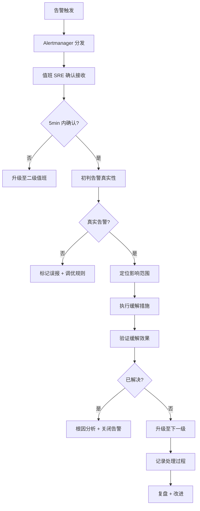

# 监控告警SOP

> 归属：多平台多租户大数据平台 · 运维文档
> 版本：v1.0 ｜ 日期：2026-08-17 ｜ 状态：已完成
> 关联：`design/运维/运维手册.md`；`design/运维/故障排查手册.md`；`design/详细设计/多平台多租户大数据平台_统一运维观测详细设计_v0.1.md`
> 适用范围：平台运维 + SRE 值班 + 客户驻场
> 优先级：P1（重要补齐）

---

## 1. 告警级别定义

### 1.1 告警级别矩阵

| 级别 | 定义 | 响应时限 | 解决时限 | 升级路径 | 通知方式 |
| --- | --- | --- | --- | --- | --- |
| P0 | 生产大面积故障，核心业务不可用 | 5 分钟内响应 | 1h 内缓解 | 30min 未解决升级至 CTO | 电话 + 短信 + 钉钉 + 邮件 |
| P1 | 生产单点故障或核心功能降级 | 10 分钟内响应 | 4h 内解决 | 2h 未解决升级至运维负责人 | 短信 + 钉钉 + 邮件 |
| P2 | 非核心功能异常或容量预警 | 30 分钟内响应 | 1 个工作日内 | 1 个工作日未解决升级至组长 | 钉钉 + 邮件 |
| P3 | 容量趋势预警或非紧急异常 | 1 个工作日内响应 | 1 周内解决 | 1 周未解决升级至组长 | 邮件 |

### 1.2 P0 告警判定标准

满足以下任一条件即判 P0：

- 控制面 API 可用性 < 99% 持续 5 分钟。
- 数据面查询可用性 < 95% 持续 5 分钟。
- 任一 Spring Boot 应用全部实例不可用。
- K8s 集群 master 不可用 ≥ 2 个。
- 数据库主节点宕机且未自动切换。
- 多租户越权告警触发（安全 P0）。
- 数据泄露告警触发（安全 P0）。

### 1.3 告警分类

| 分类 | 示例 | 默认级别 |
| --- | --- | --- |
| 可用性 | 服务宕机、健康检查失败、5xx 错误率 | P0/P1 |
| 性能 | P99 延迟超阈值、TPS 下跌 > 30% | P1/P2 |
| 容量 | CPU > 80%、内存 > 85%、磁盘 > 75% | P2/P3 |
| 业务 | 作业失败率 > 5%、计费异常 | P1/P2 |
| 安全 | 越权、注入、异常登录、漏洞 | P0/P1 |
| 资源 | Pod 重启、OOM、节点 NotReady | P1/P2 |
| 依赖 | 下游超时、数据库连接池满 | P1/P2 |

---

## 2. 告警处理流程

### 2.1 标准处理流程

### 2.2 各级处理要求

#### 2.2.1 P0 处理要求

1. **接警**：5 分钟内电话 + 钉钉确认接收，未接收自动升级二级值班。
2. **拉群**：立即拉 P0 应急群（值班 SRE + 服务负责人 + DBA + 网络组 + 安全组）。
3. **初判**：10 分钟内完成影响范围初判，同步至群。
4. **缓解**：30 分钟内执行缓解措施（回滚/切换/限流/降级）。
5. **解决**：1h 内完全解决，恢复至正常水位。
6. **复盘**：24h 内完成 P0 复盘报告，含时间线、根因、改进项。

#### 2.2.2 P1 处理要求

1. **接警**：10 分钟内钉钉确认接收。
2. **处理**：4h 内解决，超时升级。
3. **复盘**：3 个工作日内完成复盘。

#### 2.2.3 P2/P3 处理要求

1. **接警**：30 分钟 / 1 个工作日内确认。
2. **处理**：按解决时限完成。
3. **复盘**：按需进行，纳入周复盘。

---

## 3. 值班响应要求

### 3.1 值班排班

- **7×24 值班**：P0/P1 告警 7×24 响应，三级值班制。
- **一级值班**：主值班 SRE，5 分钟内响应 P0/P1。
- **二级值班**：备班 SRE，一级未响应或升级时介入。
- **三级值班**：服务负责人 + 运维负责人，P0 升级时介入。
- **轮换周期**：每周轮换，周一 00:00 切换值班人。

### 3.2 值班人职责

| 时段 | 职责 |
| --- | --- |
| 接警 | 5/10/30 分钟内确认接收，超过自动升级 |
| 初判 | 判断告警真实性、影响范围、紧急程度 |
| 缓解 | 执行缓解措施（回滚/切换/限流/降级/重启） |
| 沟通 | 同步至应急群 + 业务方 + 必要时上报 |
| 记录 | 全程记录处理过程，时间线精确到分钟 |
| 关闭 | 验证解决后关闭告警，填写根因与改进项 |
| 复盘 | P0/P1 24h/3d 内完成复盘报告 |

### 3.3 值班交接

- 每周一 09:00 值班交接会，上周值班人汇报 + 下周值班人接手。
- 交接内容：未关闭告警、待跟进改进项、已知风险、环境变更。
- 交接清单：见 `design/运维/运维手册.md` §值班管理。

---

## 4. 告警规则与阈值

### 4.1 核心告警规则

| 规则名 | PromQL | 级别 | 持续 |
| --- | --- | --- | --- |
| API 可用性 | `1 - sum(rate(http_requests_total{code=~"5.."}[5m])) / sum(rate(http_requests_total[5m])) < 0.99` | P0 | 5m |
| API P99 延迟 | `histogram_quantile(0.99, rate(http_request_duration_seconds_bucket[5m])) > 0.5` | P1 | 5m |
| Pod 重启 | `increase(kube_pod_container_status_restarts_total[1h]) > 3` | P2 | 1h |
| 节点 NotReady | `kube_node_status_condition{condition="Ready",status!="true"} == 1` | P0 | 1m |
| CPU 使用率 | `avg(rate(node_cpu_seconds_total{mode!="idle"}[5m])) by (instance) > 0.8` | P2 | 10m |
| 内存使用率 | `1 - node_memory_MemAvailable_bytes / node_memory_MemTotal_bytes > 0.85` | P2 | 10m |
| 磁盘使用率 | `1 - node_filesystem_avail_bytes / node_filesystem_size_bytes > 0.75` | P2 | 10m |
| 数据库连接池 | `hikaricp_connections_active / hikaricp_connections_max > 0.9` | P1 | 1m |
| 作业失败率 | `increase(作业失败总数[10m]) / increase(作业总数[10m]) > 0.05` | P1 | 10m |
| 越权告警 | `increase(越权拦截总数[1m]) > 0` | P0 | 1m |

### 4.2 告警抑制与聚合

- **抑制**：节点 NotReady 时抑制该节点上的 Pod 告警。
- **聚合**：同一服务同一原因的告警 5 分钟内聚合为一条。
- **静默**：维护窗口期间静默非紧急告警，需审批 + 时限 ≤ 2h。
- **分组**：按 `alertname + service + severity` 分组通知。

---

## 5. 告警通知渠道

| 渠道 | 用途 | 配置 |
| --- | --- | --- |
| 电话 | P0 告警 | 值班手机 + 服务负责人 + CTO 升级链 |
| 短信 | P0/P1 告警 | 值班手机 + 服务负责人 |
| 钉钉 | P0/P1/P2 告警 | 应急群 + 服务群 |
| 邮件 | 全级别告警 + 复盘报告 | 运维邮件组 + 服务负责人 |
| Grafana | 告警详情 + 大盘链接 | 告警卡片含跳转链接 |
| 工单 | P2/P3 告警 | 自动创建工单 + 指派负责人 |

---

## 6. 告警质量治理

### 6.1 告警质量指标

| 指标 | 目标 | 度量 |
| --- | --- | --- |
| 误报率 | < 5% | 误报数 / 总告警数 |
| 漏报率 | 0 | 人工发现未告警的故障数 |
| 平均响应时间 | P0 < 5min，P1 < 10min | 接警时间 - 触发时间 |
| 平均解决时间 | P0 < 1h，P1 < 4h | 解决时间 - 触发时间 |
| 告警数量 | 单服务 < 10 条/天 | 避免告警疲劳 |

### 6.2 持续优化

- 每周复盘告警，识别误报/漏报/频繁告警，调优规则与阈值。
- 每月评估告警质量指标，未达标项制定改进计划。
- 每季度梳理告警规则全集，下线失效规则，新增缺失规则。

---

## 7. 应急联系人与升级

### 7.1 升级链

| 级别 | 30min 未解决 | 2h 未解决 | 4h 未解决 |
| --- | --- | --- | --- |
| P0 | 升级至运维负责人 + CTO | 升级至 CTO + CEO | 升级至 CEO + 客户沟通 |
| P1 | 升级至运维负责人 | 升级至 CTO | 升级至 CTO + 客户沟通 |
| P2 | 升级至组长 | 升级至运维负责人 | 升级至运维负责人 |

### 7.2 联系人维护

- 联系人清单维护在 `design/运维/运维手册.md` §应急联系人。
- 每月核对一次，人员变动 24h 内更新。
- P0 应急群成员包含：值班 SRE、服务负责人、DBA、网络组、安全组、运维负责人。

---

## 8. 参考

- `design/运维/运维手册.md`：监控架构与值班管理。
- `design/运维/故障排查手册.md`：故障排查步骤与解决方案。
- `design/详细设计/多平台多租户大数据平台_统一运维观测详细设计_v0.1.md`：可观测设计。
- `design/详细设计/多平台多租户大数据平台_可观测基座详细设计_v0.1.md`：可观测基座。
- Prometheus Alertmanager 文档：https://prometheus.io/docs/alerting/latest/