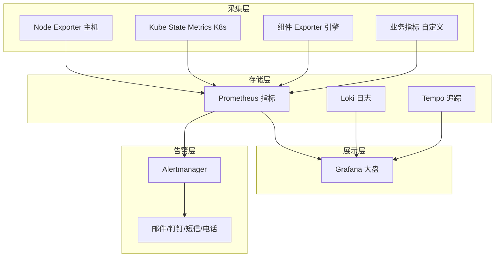
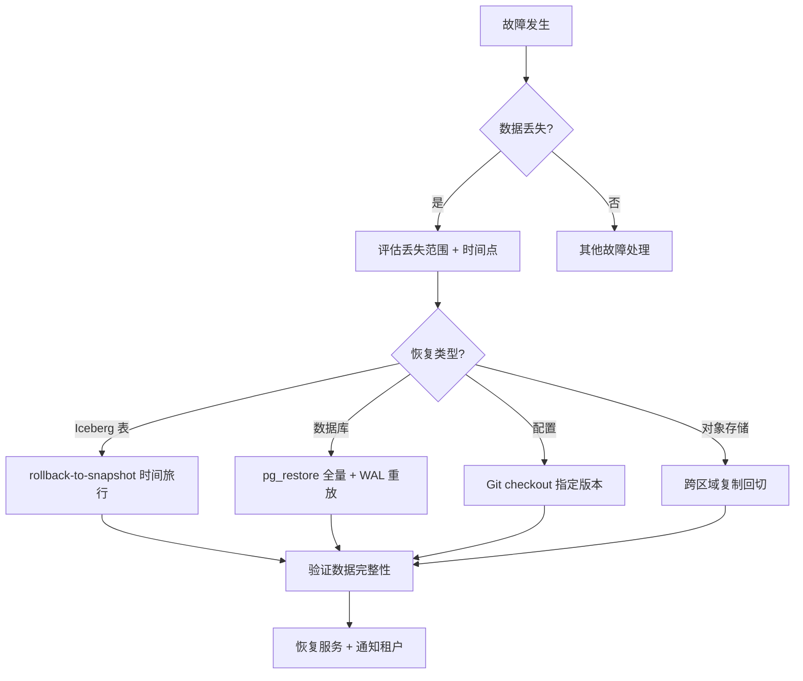
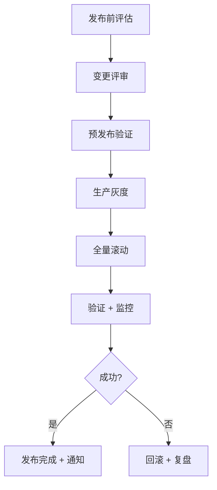

# 运维手册

> 归属：多平台多租户大数据平台 · 运维文档
> 版本：v1.0 ｜ 日期：2026-08-17 ｜ 状态：已完成
> 关联：`design/详细设计/多平台多租户大数据平台_统一运维观测详细设计_v0.1.md`；`design/详细设计/多平台多租户大数据平台_可观测基座详细设计_v0.1.md`；`design/详细设计/多平台多租户大数据平台_弹性调度详细设计_v0.1.md`；`design/deploy/`（Helm Chart + ArgoCD）
> 适用范围：平台运维团队 + 客户驻场运维 + 值班 SRE

---

## 1. 运维目标与职责

### 1.1 运维目标

保障多平台多租户大数据平台在生产环境稳定、高效、安全运行，达成以下 SLA：

- **可用性**：控制面 > 99.9%，数据面 > 99.5%（按租户套餐分级）。
- **响应性**：API P99 < 200ms，页面加载 < 2s。
- **可恢复性**：RTO < 4h，RPO < 1h（核心数据）。
- **可观测性**：全链路监控 + 日志 + 追踪，告警 5 分钟内触达值班。
- **可运营性**：计量计费准确，账单可追溯，租户生命周期闭环。

### 1.2 运维职责矩阵

| 职责 | 平台运维 | 客户驻场 | SRE 值班 |
| --- | --- | --- | --- |
| 集群巡检 | ✅ | ✅ | ✅ |
| 告警响应 | ✅ | — | ✅ |
| 故障排查 | ✅ | ✅（一线） | ✅（二线） |
| 扩缩容 | ✅ | — | ✅ |
| 升级发布 | ✅ | — | ✅ |
| 备份恢复 | ✅ | ✅（自助） | ✅（重大） |
| 安全合规 | ✅ | — | ✅ |
| 租户支持 | ✅ | ✅ | — |

---

## 2. 监控告警

### 2.1 监控架构

基于 L0.9 可观测基座（Prometheus + Grafana + Loki + Tempo），构建三层监控：



### 2.2 监控大盘

| 大盘 | 内容 | 受众 |
| --- | --- | --- |
| 平台总览 | 集群健康/资源使用/租户状态/作业统计 | 平台运维 |
| 集群详情 | 节点/Pod/容器/网络/存储 | SRE |
| 引擎监控 | Spark/Flink/Trino/Doris 指标 | 引擎运维 |
| 作业监控 | 作业状态/耗时/资源/失败率 | 数据团队 |
| 租户监控 | 租户资源使用/配额/计费 | 运营 |
| 安全监控 | 告警/审计/合规状态 | 安全 |
| SLA 大盘 | 可用性/延迟/错误率/MTTR | 管理层 |

### 2.3 告警规则

| 告警 | 条件 | 级别 | 通知 |
| --- | --- | --- | --- |
| 节点宕机 | `up{job="node"} == 0` for 1m | P0 | 电话 + 钉钉 |
| Pod 重启循环 | `rate(kube_pod_container_status_restarts_total[5m]) > 0` | P1 | 钉钉 |
| CPU 使用率高 | `cpu_usage > 85%` for 5m | P1 | 钉钉 |
| 内存使用率高 | `memory_usage > 90%` for 5m | P0 | 电话 + 钉钉 |
| 磁盘使用率高 | `disk_usage > 85%` for 5m | P1 | 钉钉 |
| 磁盘将满 | `disk_usage > 95%` for 1m | P0 | 电话 + 钉钉 |
| API P99 高 | `histogram_quantile(0.99, api_duration) > 500ms` for 5m | P1 | 钉钉 |
| API 错误率高 | `api_error_rate > 1%` for 5m | P1 | 钉钉 |
| 作业失败率高 | `job_failure_rate > 10%` for 10m | P2 | 邮件 |
| 证书将过期 | `cert_expiry < 7d` | P1 | 邮件 + 钉钉 |
| 备份失败 | `backup_success == 0` | P1 | 钉钉 |
| 审计日志异常 | `audit_anomaly == 1` | P0 | 电话 + 钉钉 |

### 2.4 告警分级与响应

| 级别 | 响应时间 | 处理时间 | 升级条件 |
| --- | --- | --- | --- |
| P0 紧急 | 5 分钟 | 1 小时 | 30 分钟无响应升级到架构师 |
| P1 重要 | 15 分钟 | 4 小时 | 2 小时无响应升级到组长 |
| P2 一般 | 1 小时 | 1 工作日 | 1 工作日未关闭升级到组长 |
| P3 提示 | 4 小时 | 1 周 | 不升级 |

### 2.5 值班 SOP

1. **接警**：Alertmanager 推送到钉钉群 + 值班人电话，5 分钟内 ack。
2. **初判**：查看告警大盘 + 关联日志，判断影响范围与紧急度。
3. **止血**：优先恢复服务（重启/扩容/切流/回滚），再定位根因。
4. **修复**：定位根因后修复，验证恢复。
5. **复盘**：24 小时内出复盘报告，含时间线/根因/改进项/责任人。
6. **关闭**：告警关闭 + 改进项录入 Jira + 知识库更新。

---

## 3. 日志管理

### 3.1 日志架构

```text
应用日志 → stdout/stderr → FluentBit(采集) → Loki(存储) → Grafana(查询)
                                    ↓
                              Kafka(缓冲) → 审计 ES(安全合规专用)
```

### 3.2 日志类型与保留

| 日志类型 | 存储 | 保留 | 查询 |
| --- | --- | --- | --- |
| 应用日志 | Loki | 30 天热 + 90 天冷 | Grafana LogQL |
| 审计日志 | WORM ES/国产替代 | 180 天 | 审计查询 API |
| 系统日志 | Loki | 30 天 | Grafana LogQL |
| 作业日志 | 对象存储 + Loki | 30 天 | 控制台作业详情 |

### 3.3 日志规范

- 结构化 JSON 日志，含 timestamp/level/service/traceId/tenant/user/message。
- 日志级别：DEBUG（开发）/ INFO（默认）/ WARN（告警）/ ERROR（错误）。
- 禁止打印敏感信息（密码/Token/个人数据），敏感字段脱敏后打印。
- traceId 全链路贯通，Tempo 追踪关联。

### 3.4 日志查询

- Grafana Explore：LogQL 查询应用/系统日志，支持全文检索 + 字段过滤。
- 审计查询 API：`GET /api/compliance/v1/audit/log?from&to&type&actor`，需合规审计员权限。
- 作业日志：控制台作业详情页，按作业 ID + 执行 ID 查询。

### 3.5 日志保留策略

- 应用/系统日志：30 天热存储（Loki）+ 90 天冷归档（对象存储），180 天后删除。
- 审计日志：180 天 WORM 存储，不可改不可删，180 天后归档冷存 + 保留 1 年。
- 作业日志：30 天后删除，重要作业可标记长期保留。

---

## 4. 备份恢复

### 4.1 备份策略

| 数据类型 | 备份方式 | 频率 | 保留 | RPO | RTO |
| --- | --- | --- | --- | --- | --- |
| PostgreSQL（Keycloak/元数据） | 全量 + WAL 增量 | 每日全量 + 实时 WAL | 30 天 | < 5min | < 1h |
| 对象存储（Iceberg 表） | 跨区域复制 + 快照 | 实时复制 + 每日快照 | 90 天 | < 1h | < 4h |
| Iceberg 表快照 | Iceberg snapshot | 每次写入 | 7 天 | 0 | < 5min |
| 配置（Helm values/Secret） | Git 仓库 + KMS | 每次变更 | 永久 | 0 | < 5min |
| 审计日志 | WORM + 归档 | 实时 | 180 天 + 1 年 | 0 | < 1h |
| Grafana/Prometheus | 快照 | 每日 | 90 天 | < 1d | < 2h |

### 4.2 备份执行

- **数据库备份**：pg_dump 全量 + PostgreSQL WAL 归档增量，备份文件 SM4/AES 加密存对象存储。
- **Iceberg 快照**：Iceberg 表格式原生支持时间旅行，`snapshot` + `rollback-to-snapshot` 即可恢复。
- **配置备份**：所有 Helm values + Secret 经 Git 仓库版本化，Secret 经 KMS 加密。
- **跨区域复制**：对象存储配置跨区域复制，灾备区域实时同步。

### 4.3 恢复 SOP



### 4.4 恢复演练

- 每季度执行一次完整恢复演练，验证 RTO/RPO 达标。
- 演练记录归档，含时间/步骤/结果/改进项。
- 信创环境演练用国产存储 + 国密加密，验证全栈可恢复。

---

## 5. 扩缩容

### 5.1 扩缩容策略

| 组件 | 策略 | 触发 | 范围 |
| --- | --- | --- | --- |
| 控制台 | HPA（CPU 70%） | CPU/内存 | 2-10 副本 |
| 引擎（Spark/Flink） | VPA + KEDA | 作业负载 | 按作业动态 |
| Trino | HPA（查询队列） | 队列深度 | 3-20 副本 |
| Doris | 手动 + HPA | 数据量/查询 | 3-30 节点 |
| Kafka | 手动 | 分区/吞吐 | 按需 |
| 节点池 | Cluster Autoscaler | Pod Pending | 3-100 节点 |

### 5.2 HPA 自动扩缩

```yaml
# HPA: 控制台按 CPU 扩缩
apiVersion: autoscaling/v2
kind: HorizontalPodAutoscaler
metadata:
  name: console-hpa
spec:
  scaleTargetRef:
    apiVersion: apps/v1
    kind: Deployment
    name: console
  minReplicas: 2
  maxReplicas: 10
  metrics:
    - type: Resource
      resource:
        name: cpu
        target:
          type: Utilization
          averageUtilization: 70
```

### 5.3 KEDA 事件驱动扩缩

引擎按作业队列深度扩缩，作业完成自动缩容，节省成本：

```yaml
# KEDA: Flink TaskManager 按作业队列扩缩
apiVersion: keda.sh/v1alpha1
kind: ScaledObject
metadata:
  name: flink-tm-scaled
spec:
  scaleTargetRef:
    name: flink-taskmanager
  minReplicaCount: 0
  maxReplicaCount: 50
  triggers:
    - type: flink-job
      metadata:
        jobManagerAddress: http://flink-jm:8081
        scaleOnSubmitted: "true"
```

### 5.4 扩缩容 SOP

1. **评估**：监控大盘确认扩缩容需求（CPU/内存/队列/数据量）。
2. **审批**：扩容超配额需租户管理员审批；缩容需确认无在跑作业。
3. **执行**：HPA 自动 / KEDA 自动 / 手动 `kubectl scale` / 节点池扩容。
4. **验证**：扩容后验证 Pod Ready + 服务可用 + 性能达标。
5. **记录**：扩缩容事件录入审计 + 工单 + 值班日志。

---

## 6. 常见故障排查

### 6.1 服务不可用

| 现象 | 可能原因 | 排查步骤 |
| --- | --- | --- |
| 控制台 502 | Ingress/网关故障 | ① 查 Ingress Pod 状态 ② 查网关日志 ③ 查后端服务 Endpoints |
| API 超时 | 后端服务慢/挂 | ① 查 Pod CPU/内存 ② 查 DB 连接池 ③ 查下游依赖 ④ 查 GC 日志 |
| 登录失败 | Keycloak 故障 | ① 查 Keycloak Pod ② 查 PostgreSQL ③ 查 LDAP/IdP 连通 |
| 作业提交失败 | 调度器故障 | ① 查 DolphinScheduler ② 查 K8s 调度 ③ 查资源配额 |
| 查询无结果 | 引擎/存储故障 | ① 查 Trino/Doris ② 查 Iceberg 元数据 ③ 查对象存储连通 |

### 6.2 数据不一致

| 现象 | 可能原因 | 排查步骤 |
| --- | --- | --- |
| 流批数据不一致 | Flink/Spark 时间语义 | ① 查 watermark ② 查 checkpoint ③ 对账 |
| 元数据与数据不符 | 元数据采集失败 | ① 重新采集 ② 查采集日志 ③ 修复元数据 |
| 血缘缺失 | 血缘解析失败 | ① 查血缘采集 ② 手动触发 ③ 补录 |
| 跨租户数据泄漏 | 隔离失效 | ① 立即隔离 ② 查 NetworkPolicy ③ 查 RBAC ④ 审计 |

### 6.3 性能下降

| 现象 | 可能原因 | 排查步骤 |
| --- | --- | --- |
| API P99 升高 | 慢查询/资源争抢 | ① 查慢 SQL ② 查 Pod CPU/内存 ③ 查 GC ④ 查锁等待 |
| 作业耗时增加 | 数据倾斜/资源不足 | ① 查作业执行计划 ② 查 shuffle ③ 扩容 ④ 优化 SQL |
| 页面加载慢 | 前端资源/接口慢 | ① 查 LCP/FID ② 查接口瀑布 ③ 查 CDN ④ 优化 |
| 引擎吞吐下降 | 数据膨胀/分区不均 | ① 查表统计 ② 查分区 ③ 合并小文件 ④ 重建索引 |

---

## 7. 升级 SOP

### 7.1 升级流程



### 7.2 滚动升级

- K8s Deployment `RollingUpdate` 策略：maxSurge 1, maxUnavailable 0，零停机。
- 引擎升级：先升级 standby，切流，再升级 active，验证后完成。
- 数据库升级：先备份，pg_upgrade 在线升级，验证数据完整性。
- 配置升级：Helm values 经 Git PR 评审，ArgoCD 自动同步。

### 7.3 回滚

- K8s Deployment：`kubectl rollout undo deployment/xxx`，秒级回滚。
- Helm：`helm rollback <release> <revision>`，回滚到指定版本。
- 数据库：恢复升级前备份（pg_restore + WAL 重放）。
- 配置：Git revert + ArgoCD 自动同步。

### 7.4 版本兼容

- 升级前检查版本兼容矩阵，确认无 breaking change。
- API 版本化：v1/v2 并存，灰度切流，旧版本下线前通知租户。
- 数据迁移：升级前执行数据迁移脚本，验证迁移结果。
- 回滚兼容：回滚后数据兼容（如新增字段回滚后忽略，不报错）。

---

## 8. 巡检 SOP

### 8.1 日常巡检项

| 巡检项 | 频率 | 工具 | 阈值 |
| --- | --- | --- | --- |
| 集群节点健康 | 每日 | kubectl + Grafana | 全部 Ready |
| Pod 状态 | 每日 | kubectl + Grafana | 无 CrashLoopBackOff |
| 资源使用率 | 每日 | Grafana | CPU < 80%, 内存 < 85%, 磁盘 < 80% |
| 证书有效期 | 每日 | cert-exporter | > 30 天 |
| 备份状态 | 每日 | 备份大盘 | 全部成功 |
| 告警历史 | 每日 | Alertmanager | 无未处理 P0/P1 |
| 作业成功率 | 每日 | 作业大盘 | > 95% |
| 审计日志 | 每日 | 审计大盘 | 无异常 |
| 安全扫描 | 每周 | Trivy + SonarQube | 无 Critical |
| 容量趋势 | 每周 | Grafana | 预测 30 天内不超阈 |

### 8.2 巡检脚本

```bash
# 命令示例：日常巡检脚本
#!/bin/bash
# 1. 集群节点健康
kubectl get nodes -o wide | grep -v Ready
# 2. 异常 Pod
kubectl get pods -A | grep -vE 'Running|Completed'
# 3. 资源使用
kubectl top nodes
kubectl top pods -A --sort-by=cpu
# 4. 证书有效期
for cert in $(kubectl get secret -A -o name | grep tls); do
  kubectl get $cert -o jsonpath='{.data.tls\.crt}' | base64 -d | openssl x509 -enddate -noout
done
# 5. 备份状态
curl -s http://backup-exporter:9100/metrics | grep backup_success
```

### 8.3 巡检报告

- 每日巡检报告自动生成，含巡检项/结果/异常/建议。
- 异常项录入工单 + 通知值班人。
- 周报汇总本周巡检结果 + 容量趋势 + 改进项。

---

## 9. 运维工具链

```mermaid
graph TD
  subgraph 监控
    A[Prometheus]
    B[Grafana]
    C[Alertmanager]
  end
  subgraph 日志
    D[Loki]
    E[FluentBit]
    F[Tempo]
  end
  subgraph 部署
    G[ArgoCD]
    H[Helm]
    I[K8s]
  end
  subgraph 备份
    J[Velero]
    K[pg_dump]
    L[Iceberg snapshot]
  end
  subgraph 安全
    M[Falco]
    N[Trivy]
    O[OPA Gatekeeper]
  end
end
```

---

## 10. 运维文档清单

| 交付物 | 状态 | 责责 |
| --- | --- | --- |
| 监控大盘（7 个） | 已完成 | SRE 组 |
| 告警规则（30+ 条） | 已完成 | SRE 组 |
| 备份脚本 | 已完成 | 运维组 |
| 巡检脚本 | 已完成 | 运维组 |
| 升级 SOP | 已完成 | SRE 组 |
| 故障排查手册 | 进行中 | SRE 组 |
| 本运维手册 | 已完成 v1.0 | 运维组 |

---

## 11. 风险与对策

| 风险 | 影响 | 对策 |
| --- | --- | --- |
| 单点故障 | 服务不可用 | 多 AZ 部署 + 主备 + 自动故障转移 |
| 备份失效 | 数据丢失 | 备份验证 + 定期恢复演练 + 跨区域复制 |
| 告警风暴 | 告警疲劳 | 告警收敛 + 分级 + 抑制规则 + SmartAlert |
| 升级失败 | 服务中断 | 灰度发布 + 自动回滚 + 预发布验证 |
| 容量不足 | 性能下降 | 容量预测 + 提前扩容 + 自动扩缩 |
| 误操作 | 数据丢失 | 操作审批 + 二次确认 + 审计留痕 + RBAC |
| 信创组件故障 | 国产组件 bug | 厂商支持 + 备选组件 + 能力降级 |

---

## 12. 与 UI 的对应

控制台 v0.3「运维监控」页（集群大盘、告警列表、作业监控、容量趋势）、运营后台「运维」页（平台总览、租户监控、SLA 大盘）均基于本运维手册。本文件是运维侧契约依据。

---

## 13. 运维落地交付物（P1 补齐）

> 版本：v1.1 ｜ 日期：2026-08-17 ｜ 状态：已完成
> 目标：补齐运维 45% 短板，告警规则 + 备份恢复 + 日志聚合 Loki + 自动化巡检全部落地为可部署物。

### 13.1 交付物清单

| 交付物 | 路径 | 用途 | 状态 |
| --- | --- | --- | --- |
| Prometheus 告警规则 | `design/deploy/monitoring/alerts/prometheus-rules.yaml` | 8 组 40+ 条告警规则（节点/Pod/API/DB/Kafka/JVM/证书/备份） | ✅ |
| Alertmanager 路由配置 | `design/deploy/monitoring/alerts/alertmanager-config.yaml` | P0→PagerDuty+钉钉，P1→钉钉+邮件，P2→Slack | ✅ |
| 备份策略文档 | `design/deploy/backup/backup-strategy.md` | RPO/RTO 矩阵 + 6 类数据备份策略 | ✅ |
| PostgreSQL 备份脚本 | `design/deploy/backup/backup-scripts/backup-postgres.sh` | 每日全量 pg_dump + 加密 + 上传对象存储 | ✅ |
| etcd 备份脚本 | `design/deploy/backup/backup-scripts/backup-etcd.sh` | 每小时快照 + 加密 + 上传对象存储 | ✅ |
| 恢复操作手册 | `design/deploy/backup/restore-procedure.md` | PG/etcd/Iceberg/Kafka/K8s 恢复步骤 + 验证清单 | ✅ |
| Loki Stack 配置 | `design/deploy/monitoring/loki/loki-values.yaml` | Loki+Promtail+Grafana，7/30/90 天分级保留 | ✅ |
| 巡检项配置 | `design/deploy/monitoring/inspector/health-check.yaml` | 4 维度 25+ 巡检项（集群/组件/数据/安全） | ✅ |
| 巡检 CronJob | `design/deploy/monitoring/inspector/inspector-job.yaml` | 每小时巡检 + JSON/HTML 报告 + 钉钉通知 | ✅ |
| 巡检报告模板 | `design/deploy/monitoring/inspector/report-template.html` | HTML 报告模板（收敛低调风格） | ✅ |
| 巡检报告 Schema | `design/deploy/monitoring/inspector/report-template.json` | JSON 报告 Schema + 示例 | ✅ |

### 13.2 告警规则覆盖矩阵

| 告警组 | 告警数 | 覆盖范围 | 级别分布 |
| --- | --- | --- | --- |
| node-resource | 8 | 节点宕机/CPU/内存/磁盘/inode/负载 | P0×3, P1×4, P2×1 |
| pod-status | 5 | CrashLoop/NotReady/OOMKilled/副本数/PVC | P0×1, P1×4 |
| api-latency | 4 | P99 延迟/5xx 错误率/4xx 错误率/网关错误 | P0×1, P1×2, P2×1 |
| database | 5 | 连接池/慢查询/复制延迟/宕机/死锁 | P0×1, P1×4 |
| kafka | 5 | 消费 lag/under-replicated/无 leader/Broker 宕机/ISR | P0×3, P1×2 |
| jvm | 5 | GC 暂停/堆使用/堆临界/线程数/Metaspace | P0×1, P1×3, P2×1 |
| cert-security | 3 | 证书 14 天/3 天/审计异常 | P0×2, P1×1 |
| backup | 2 | 备份失败/超过 RPO | P0×1, P1×1 |
| **合计** | **37** | **全栈覆盖** | **P0×12, P1×21, P2×4** |

### 13.3 备份 RPO/RTO 矩阵

| 数据类型 | RPO | RTO | 频率 | 保留 |
| --- | --- | --- | --- | --- |
| PostgreSQL（Keycloak/元数据） | < 5min | < 1h | 每日全量 + WAL 实时归档 | 30 天 |
| 对象存储（Iceberg/JuiceFS） | < 1h | < 4h | 实时跨区域复制 + 每日快照 | 90 天 |
| Iceberg 表快照 | 0 | < 5min | 每次写入 | 7 天 |
| Kafka | < 5min | < 1h | MirrorMaker2 跨集群 | 7 天 |
| etcd | < 1h | < 30min | 每小时快照 | 7 天 |
| K8s Secret/ConfigMap | 0 | < 5min | Git 版本化 + Velero 每日 | 永久/30 天 |
| Grafana/Prometheus | < 1d | < 2h | 每日快照 | 90 天 |
| 审计日志 | 0 | < 1h | WORM 实时 + 归档 | 180 天 + 1 年 |

### 13.4 日志保留策略（Loki）

| 日志级别 | 热数据（SSD） | 温数据（对象存储） | 冷数据归档 |
| --- | --- | --- | --- |
| error / warn | 30 天 | 90 天 | — |
| info | 14 天 | 90 天 | — |
| debug | 7 天 | — | — |
| 审计日志 | 180 天 WORM | 1 年归档 | — |

### 13.5 巡检维度与频率

| 维度 | 巡检项数 | 频率 | 异常通知 |
| --- | --- | --- | --- |
| 集群健康（节点/版本/控制面/etcd） | 5 | 每小时 | 钉钉 |
| 组件健康（Deployment/Pod/引擎/Kafka） | 8 | 每小时 | 钉钉 |
| 数据健康（DB/磁盘/Kafka lag/备份） | 6 | 每小时 | 钉钉 |
| 安全健康（证书/RBAC/NetworkPolicy/特权/latest） | 6 | 每小时 | 钉钉 |

### 13.6 部署命令

```bash
# 命令示例：运维落地一键部署
# 1. 部署告警规则
kubectl apply -f design/deploy/monitoring/alerts/prometheus-rules.yaml -n sq-monitor
kubectl apply -f design/deploy/monitoring/alerts/alertmanager-config.yaml -n sq-monitor

# 2. 部署 Loki Stack
helm install loki-stack grafana/loki-stack \
  -n sq-monitor \
  -f design/deploy/monitoring/loki/loki-values.yaml

# 3. 部署巡检 CronJob
kubectl apply -f design/deploy/monitoring/inspector/health-check.yaml -n sq-monitor
kubectl apply -f design/deploy/monitoring/inspector/inspector-job.yaml

# 4. 部署备份 CronJob（PostgreSQL 每日 02:00 + etcd 每小时）
kubectl apply -f design/deploy/backup/backup-cronjobs.yaml -n sq-monitor
```

---

## 14. 容量规划建议

### 14.1 容量基线

| 组件 | 单实例资源 | 最小副本 | 扩容触发 | 扩容上限 |
| --- | --- | --- | --- | --- |
| 控制台 | 2C / 4Gi | 2 | CPU > 70% | 10 |
| Spark Master | 2C / 4Gi | 1（主备） | — | 2 |
| Spark Worker | 4C / 8Gi | 3 | 待作业 > 50 | 50 |
| Flink JM | 2C / 4Gi | 1（HA） | — | 3 |
| Flink TM | 2C / 4Gi | 3 | 作业队列 > 10 | 50 |
| Trino | 4C / 16Gi | 3 | 查询队列 > 20 | 20 |
| Doris FE | 2C / 8Gi | 3 | — | 5 |
| Doris BE | 8C / 32Gi | 3 | 磁盘 > 80% | 30 |
| Kafka Broker | 4C / 8Gi | 3 | 分区 > 1000 | 12 |
| PostgreSQL | 4C / 16Gi | 1（主备） | 连接 > 80% | 2 |
| Loki | 4C / 8Gi | 1 | 写入 > 20MB/s | 3 |
| Grafana | 2C / 2Gi | 1 | — | 2 |

### 14.2 容量预测

- **数据增长率**：按租户每月 1TB 增长估算，预留 50% buffer。
- **节点扩容**：当集群 CPU 均值 > 70% 或内存 > 80% 持续 3 天，触发节点池扩容。
- **存储扩容**：当磁盘使用率 > 75%，提前扩容对象存储 + JuiceFS 元数据存储。
- **月度容量评审**：每月 1 日输出容量趋势报告，预测 30/60/90 天容量需求。

### 14.3 信创环境特殊考量

- **国产存储**：JuiceFS + 国产对象存储，扩容时需评估国产存储性能上限。
- **国密加密**：备份加密使用 SM4，密钥经 KMS 管理，扩容时需评估 KMS 吞吐。
- **ARM 适配**：所有镜像需 amd64 + arm64 双架构，扩容前验证 ARM 节点镜像可用性。