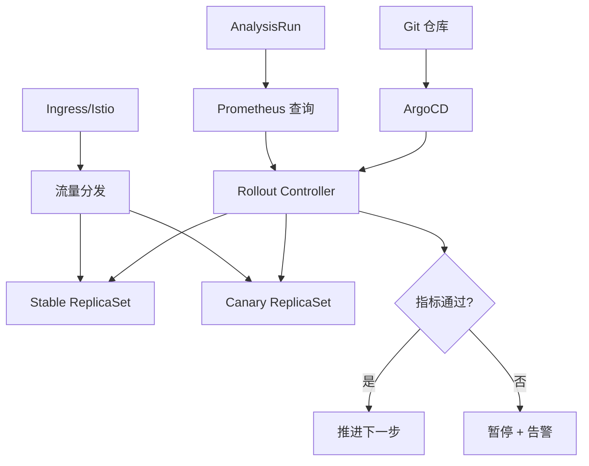
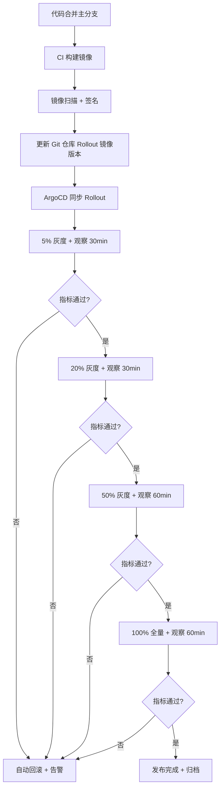

# 灰度发布方案

> 归属：多平台多租户大数据平台 · 部署文档
> 版本：v1.0 ｜ 日期：2026-08-17 ｜ 状态：已完成
> 关联：`design/deploy/README.md`；`design/deploy/argocd/`；`design/运维/监控告警SOP.md`；`design/运维/故障排查手册.md`
> 适用范围：12 个 Spring Boot 应用 + 引擎层 + 前端控制台
> 优先级：P1（重要补齐）

---

## 1. 灰度发布目标

### 1.1 总体目标

通过灰度发布，将新版本逐步从少量流量过渡到全量流量，在最小影响范围内验证新版本正确性与稳定性，发现异常快速回滚，保障生产 SLA。

### 1.2 灰度发布原则

1. **小步快跑**：每次灰度比例 ≤ 20%，观察 30 分钟无异常再下一步。
2. **可观测**：灰度期间全链路监控 + 关键指标对比，异常 5 分钟内发现。
3. **可回滚**：任一步骤可 5 分钟内回滚至上一版本，参见 §5 回滚机制。
4. **可阻断**：灰度期间任一关键指标异常自动阻断下一步，触发回滚评估。
5. **租户隔离**：灰度流量按租户分组，避免单租户承担全部灰度风险。

---

## 2. 灰度策略

### 2.1 策略选型

| 策略 | 适用场景 | 优点 | 缺点 | 本平台选用 |
| --- | --- | --- | --- | --- |
| 金丝雀（Canary） | 新功能、风险较高版本 | 流量可控、影响小 | 验证样本少 | ✅ 主用 |
| 蓝绿（Blue-Green） | 大版本升级、数据库变更 | 切换快、回滚快 | 资源 2 倍 | ✅ 备用 |
| 滚动（Rolling） | 小补丁、低风险版本 | 资源省 | 回滚慢 | ✅ 日常 |
| A/B 测试 | 业务效果对比 | 业务对比 | 复杂 | ❌ 不用 |

### 2.2 灰度比例阶梯

| 步骤 | 比例 | 观察时长 | 通过标准 | 失败动作 |
| --- | --- | --- | --- | --- |
| 1 | 5% | 30min | 错误率 < 0.1%，P99 < 200ms | 回滚 |
| 2 | 20% | 30min | 错误率 < 0.1%，P99 < 200ms | 回滚至 0% |
| 3 | 50% | 60min | 错误率 < 0.1%，P99 < 200ms | 回滚至 5% |
| 4 | 100% | 60min | 错误率 < 0.1%，P99 < 200ms | 回滚至 20% |

### 2.3 灰度租户选择

- **内部租户优先**：优先选择内部测试租户承担 5% 灰度。
- **低风险租户次之**：选择非核心业务租户承担 20% 灰度。
- **全量前评估**：50% 灰度通过后评估是否进入 100%。
- **租户白名单**：核心客户租户在 50% 灰度通过后才纳入 100%。

---

## 3. ArgoCD Rollouts 配置

### 3.1 Rollout 架构



### 3.2 Rollout 配置示例

```yaml
# 配置示例：API 网关金丝雀发布
apiVersion: argoproj.io/v1alpha1
kind: Rollout
metadata:
  name: api-gateway
  namespace: prod
spec:
  replicas: 10
  strategy:
    canary:
      canaryService: api-gateway-canary
      stableService: api-gateway-stable
      trafficRouting:
        istio:
          virtualService:
            name: api-gateway-vs
            routes:
            - primary
      steps:
      - setWeight: 5
      - pause: { duration: 30m }
      - analysis:
          templates:
          - templateName: success-rate
          args:
          - name: service-name
            value: api-gateway-canary
      - setWeight: 20
      - pause: { duration: 30m }
      - analysis:
          templates:
          - templateName: success-rate
          args:
          - name: service-name
            value: api-gateway-canary
      - setWeight: 50
      - pause: { duration: 60m }
      - analysis:
          templates:
          - templateName: success-rate
          args:
          - name: service-name
            value: api-gateway-canary
      - setWeight: 100
      - pause: { duration: 60m }
  selector:
    matchLabels:
      app: api-gateway
  template:
    metadata:
      labels:
        app: api-gateway
    spec:
      containers:
      - name: api-gateway
        image: registry/api-gateway:v2.0
        ports:
        - containerPort: 8080
        readinessProbe:
          httpGet:
            path: /actuator/health/readiness
            port: 8080
        livenessProbe:
          httpGet:
            path: /actuator/health/liveness
            port: 8080
```

### 3.3 AnalysisTemplate 配置

```yaml
# 配置示例：成功率分析模板
apiVersion: argoproj.io/v1alpha1
kind: AnalysisTemplate
metadata:
  name: success-rate
  namespace: prod
spec:
  args:
  - name: service-name
  metrics:
  - name: success-rate
    interval: 1m
    successCondition: result >= 0.999
    failureCondition: result < 0.99
    failureLimit: 3
    provider:
      prometheus:
        address: http://prometheus.monitoring:9090
        query: |
          sum(rate(http_requests_total{service="{{args.service-name}}",code!~"5.."}[2m]))
          /
          sum(rate(http_requests_total{service="{{args.service-name}}"}[2m]))
  - name: p99-latency
    interval: 1m
    successCondition: result < 200
    failureCondition: result > 300
    failureLimit: 3
    provider:
      prometheus:
        address: http://prometheus.monitoring:9090
        query: |
          histogram_quantile(0.99,
            rate(http_request_duration_seconds_bucket{service="{{args.service-name}}"}[2m])) * 1000
```

### 3.4 蓝绿发布配置

```yaml
# 配置示例：蓝绿发布
apiVersion: argoproj.io/v1alpha1
kind: Rollout
metadata:
  name: catalog-service
  namespace: prod
spec:
  replicas: 5
  strategy:
    blueGreen:
      activeService: catalog-service-active
      previewService: catalog-service-preview
      autoPromotionEnabled: false
      scaleDownDelaySeconds: 600
      prePromotionAnalysis:
        templates:
        - templateName: success-rate
        args:
        - name: service-name
          value: catalog-service-preview
```

---

## 4. 灰度发布流程

### 4.1 标准流程



### 4.2 灰度前检查清单

- [ ] 代码已通过 PR 评审 + 全量 CI（lint + unit + integration + 安全扫描）。
- [ ] E2E 测试在 staging 环境通过。
- [ ] 性能基线在 staging 环境达标（P99 < 200ms）。
- [ ] 数据库变更已执行 + 回滚脚本就绪。
- [ ] 监控大盘 + 告警规则已更新。
- [ ] 回滚预案已准备 + 验证。
- [ ] 发布窗口已申请（避开业务高峰）。
- [ ] 通知相关方（运维、业务、客户）。

### 4.3 灰度期间监控

- **核心指标**：错误率、P99 延迟、TPS、可用性。
- **对比监控**：新版本 vs 旧版本指标对比。
- **业务指标**：作业成功率、查询成功率、计费准确率。
- **资源指标**：CPU、内存、连接池、GC。
- **告警阈值**：灰度期间告警阈值收紧 50%，异常快速发现。

---

## 5. 回滚机制

### 5.1 回滚触发

| 触发条件 | 阈值 | 动作 |
| --- | --- | --- |
| 自动回滚 | 错误率 > 1% 持续 1min | ArgoCD 自动回滚至 Stable |
| 自动暂停 | 错误率 > 0.5% 持续 2min | 暂停灰度 + 告警 + 人工评估 |
| 人工回滚 | 任一异常需回滚 | `kubectl argo rollouts undo` |
| 全量回滚 | 100% 后发现严重问题 | 蓝绿切换或镜像回滚 |

### 5.2 回滚命令

```bash
# 命令示例：ArgoCD Rollouts 回滚
# 查看发布状态
kubectl argo rollouts get rollout api-gateway -n prod --watch

# 回滚至上一版本
kubectl argo rollouts undo api-gateway -n prod

# 回滚至指定版本
kubectl argo rollouts undo api-gateway -n prod --to-revision=3

# 暂停灰度
kubectl argo rollouts pause api-gateway -n prod

# 恢复灰度
kubectl argo rollouts resume api-gateway -n prod

# 中止灰度（回滚至 Stable）
kubectl argo rollouts abort api-gateway -n prod
```

### 5.3 数据库变更回滚

- **向前兼容**：数据库变更必须向前兼容，灰度期间新旧版本共存。
- **回滚脚本**：每个数据库变更必须配套回滚脚本，预先验证。
- **延迟清理**：废弃字段/表不在发布时删除，30 天后确认无引用再清理。
- **数据回滚**：数据修改类变更需有数据备份 + 回滚 SQL。

### 5.4 回滚验证

- 回滚后 5 分钟内验证：服务可用、错误率恢复、业务正常。
- 回滚后 30 分钟内观察：无异常、无新告警。
- 回滚后 24h 内复盘：根因、改进项、再发布计划。

---

## 6. 灰度发布窗口

### 6.1 发布窗口

| 环境 | 窗口 | 限制 |
| --- | --- | --- |
| dev | 任意 | 无 |
| staging | 工作日 09:00-20:00 | 不影响 dev |
| prod | 工作日 10:00-17:00 | 避开早晚高峰，避开月末/月初 |
| prod（紧急修复） | 7×24 | 需 CTO 审批 |

### 6.2 发布冻结期

- 月末/月初 3 个工作日：计费高峰，禁止非紧急发布。
- 重大业务活动期间：按业务方通知冻结。
- 等保测评期间：禁止非整改发布。

---

## 7. 风险与应对

| 风险 | 概率 | 影响 | 应对 |
| --- | --- | --- | --- |
| 灰度期间未发现缺陷 | 中 | 全量后故障 | 收紧告警阈值 + 延长观察 + 多指标对比 |
| 回滚导致数据不一致 | 低 | 数据问题 | 向前兼容 + 回滚脚本 + 数据备份 |
| 灰度配置错误 | 中 | 流量分配异常 | 配置评审 + 预发验证 + 监控 |
| 数据库变更不可回滚 | 中 | 回滚失败 | 向前兼容 + 延迟清理 + 回滚脚本 |
| 灰度期间依赖变更 | 低 | 兼容性问题 | 依赖同步发布 + 兼容性测试 |

---

## 8. 参考

- `design/deploy/README.md`：部署骨架与渲染。
- `design/deploy/argocd/`：ArgoCD GitOps 配置。
- `design/运维/监控告警SOP.md`：告警级别与处理。
- `design/运维/故障排查手册.md`：故障排查与回滚。
- `design/测试/性能测试计划.md`：性能基线。
- ArgoCD Rollouts 文档：https://argo-rollouts.readthedocs.io/