# 大数据全栈知识体系

本文档是一份全面的大数据技术知识体系指南，涵盖了从基础架构到高级应用的完整技术栈。文档内容基于生产实践经验，包含大量实战配置、代码示例和最佳实践。

**文档特点**
- **全面性**：覆盖Hadoop生态、计算框架、存储系统、数据仓库、调度工具、消息队列等全栈技术
- **实战性**：提供可直接复用的生产配置、代码示例和运维命令
- **系统性**：按照技术演进和实际工作流程组织内容
- **可视化**：包含大量Mermaid架构图和流程图
- **实用性**：每章都包含核心总结和选型建议

**表：适用读者**

| 读者画像 | 阅读建议 |
| --- | --- |
| **大数据运维工程师** | 全书精读，重点第6-9章（调度/同步/ETL/协调与消息队列）和第16章（故障优化） |
| **平台架构师** | 重点第1-4章（架构原理）、第5章（流批一体）、第14章（云原生） |
| **数据开发工程师** | 重点第2章（计算框架含Presto/Trino）、第4章（数仓/湖仓）、第11章（Python分析） |
| **零基础转行者** | 按顺序从第1章读到第16章，每章完成实战练习后再进入下一章 |

**学习建议**
- **快速查阅**：使用目录直接跳转到相关章节
- **深入学习**：按章节顺序系统学习，理解技术演进脉络
- **实践验证**：结合代码示例和配置进行实际操作
- **持续更新**：大数据技术迭代快速，建议关注最新版本变化
---

## 目录

- [目录](#目录)
- [前言](#前言)
- [第 1 章 Hadoop 核心三件套](#第-1-章-hadoop-核心三件套)
  - [1.1 HDFS 分布式文件系统](#11-hdfs-分布式文件系统)
    - [1.1.1 核心架构组件](#111-核心架构组件)
    - [1.1.2 核心底层机制](#112-核心底层机制)
      - [1.1.2.1 元数据机制：fsimage 与 edits](#1121-元数据机制fsimage-与-edits)
      - [1.1.2.2 数据分块与副本机制](#1122-数据分块与副本机制)
      - [1.1.2.3 心跳机制与块报告](#1123-心跳机制与块报告)
      - [1.1.2.4 NameNode 与 DataNode 通信机制详解](#1124-namenode-与-datanode-通信机制详解)
      - [1.1.2.5 Block 内部结构与副本管理详解](#1125-block-内部结构与副本管理详解)
    - [1.1.3 HDFS 读数据完整流程](#113-hdfs-读数据完整流程)
    - [1.1.4 HDFS 写数据完整流程](#114-hdfs-写数据完整流程)
      - [1.1.4.1 写数据流程概述](#1141-写数据流程概述)
      - [1.1.4.2 Pipeline 管道写入机制](#1142-pipeline-管道写入机制)
      - [1.1.4.3 ACK 确认与副本同步](#1143-ack-确认与副本同步)
      - [1.1.4.4 异常处理与故障恢复](#1144-异常处理与故障恢复)
    - [1.1.5 HA 高可用自动切换机制](#115-ha-高可用自动切换机制)
      - [1.1.5.1 JournalNode 与 QJM 机制](#1151-journalnode-与-qjm-机制)
      - [1.1.5.2 SecondaryNameNode 与元数据合并机制](#1152-secondarynamenode-与元数据合并机制)
      - [1.1.5.3 FSImage 与 EditLog 详解](#1153-fsimage-与-editlog-详解)
      - [1.1.5.4 ZKFC 故障切换流程详解](#1154-zkfc-故障切换流程详解)
    - [1.1.6 HDFS Federation 联邦机制](#116-hdfs-federation-联邦机制)
      - [1.1.6.1 设计背景与核心问题](#1161-设计背景与核心问题)
      - [1.1.6.2 Federation架构设计](#1162-federation架构设计)
      - [1.1.6.3 核心概念详解](#1163-核心概念详解)
      - [1.1.6.4 关键特性](#1164-关键特性)
      - [1.1.6.5 单NN vs Federation对比](#1165-单nn-vs-federation对比)
      - [1.1.6.6 适用场景](#1166-适用场景)
      - [1.1.6.7 配置示例](#1167-配置示例)
    - [1.1.7 生产核心配置与运维命令](#117-生产核心配置与运维命令)
  - [1.2 YARN 资源调度平台](#12-yarn-资源调度平台)
    - [1.2.1 核心架构组件](#121-核心架构组件)
    - [1.2.2 三大调度器工作原理](#122-三大调度器工作原理)
      - [1.2.2.1 FIFO 调度器（队列串行）](#1221-fifo-调度器队列串行)
      - [1.2.2.2 Capacity Scheduler（容量调度器 - 生产首选）](#1222-capacity-scheduler容量调度器---生产首选)
      - [1.2.2.3 Fair Scheduler（公平调度器）](#1223-fair-scheduler公平调度器)
      - [1.2.2.4 三大调度器全面对比](#1224-三大调度器全面对比)
    - [1.2.3 YARN 任务提交流程](#123-yarn-任务提交流程)
    - [1.2.4 核心机制](#124-核心机制)
      - [1.2.4.1 Container 资源隔离机制](#1241-container-资源隔离机制)
      - [1.2.4.2 ApplicationMaster 注册与资源申请机制](#1242-applicationmaster-注册与资源申请机制)
    - [1.2.5 生产核心配置](#125-生产核心配置)
    - [1.2.6 运维命令与日志查看](#126-运维命令与日志查看)
  - [1.3 MapReduce 分布式计算框架](#13-mapreduce-分布式计算框架)
    - [1.3.1 核心编程模型](#131-核心编程模型)
    - [1.3.2 核心架构与组件角色](#132-核心架构与组件角色)
    - [1.3.3 全流程执行机制](#133-全流程执行机制)
    - [1.3.4 灵魂核心：Shuffle 全机制](#134-灵魂核心shuffle-全机制)
    - [1.3.5 Combiner 与 Partitioner 核心机制](#135-combiner-与-partitioner-核心机制)
      - [1.3.5.1 Combiner 规约器](#1351-combiner-规约器)
      - [1.3.5.2 Partitioner 分区器](#1352-partitioner-分区器)
      - [1.3.5.3 Combiner与Partitioner协同工作](#1353-combiner与partitioner协同工作)
    - [1.3.6 Shuffle 内存管理与压缩优化](#136-shuffle-内存管理与压缩优化)
      - [1.3.6.1 环形缓冲区深度解析](#1361-环形缓冲区深度解析)
      - [1.3.6.2 压缩配置详解](#1362-压缩配置详解)
      - [1.3.6.3 Shuffle内存优化参数](#1363-shuffle内存优化参数)
    - [1.3.7 核心特性、容错机制与适用边界](#137-核心特性容错机制与适用边界)
      - [1.3.7.1 四大核心特性](#1371-四大核心特性)
      - [1.3.7.2 完整容错机制（生产核心）](#1372-完整容错机制生产核心)
      - [1.3.7.3 适用场景与绝对不适用场景](#1373-适用场景与绝对不适用场景)
    - [1.3.8 企业级核心配置](#138-企业级核心配置)
    - [1.3.9 经典案例：WordCount 单词计数](#139-经典案例wordcount-单词计数)
    - [1.3.10 运维命令与性能优化](#1310-运维命令与性能优化)
  - [1.4 Hadoop 三件套协同架构](#14-hadoop-三件套协同架构)
    - [1.4.1 端到端全链路协同](#141-端到端全链路协同)
    - [1.4.2 组件间通信机制](#142-组件间通信机制)
    - [1.4.3 资源分配与调度策略](#143-资源分配与调度策略)
    - [1.4.4 数据流转与容错机制](#144-数据流转与容错机制)
    - [1.4.5 生产环境最佳实践](#145-生产环境最佳实践)
  - [1.5 核心总结](#15-核心总结)
- [第 2 章 分布式计算框架](#第-2-章-分布式计算框架)
  - [2.1 MapReduce](#21-mapreduce)
    - [2.1.1 技术定位与核心短板](#211-技术定位与核心短板)
    - [2.1.2 生产适用边界](#212-生产适用边界)
  - [2.2 Tez](#22-tez)
    - [2.2.1 核心架构与设计思想](#221-核心架构与设计思想)
    - [2.2.2 核心执行机制](#222-核心执行机制)
    - [2.2.3 核心特性与适用场景](#223-核心特性与适用场景)
      - [2.2.3.1 Tez DAG执行引擎详解](#2231-tez-dag执行引擎详解)
      - [2.2.3.2 Tez 内存管理与优化](#2232-tez-内存管理与优化)
      - [2.2.3.3 Tez 与 Hive 优化技巧](#2233-tez-与-hive-优化技巧)
    - [2.2.4 生产核心配置](#224-生产核心配置)
    - [2.2.5 运维命令与优化](#225-运维命令与优化)
    - [2.2.6 部署模式](#226-部署模式)
    - [2.2.7 全组件联动工作流程](#227-全组件联动工作流程)
  - [2.3 Spark](#23-spark)
    - [2.3.1 核心架构组件](#231-核心架构组件)
    - [2.3.2 核心数据模型：RDD / DataFrame / Dataset](#232-核心数据模型rdd--dataframe--dataset)
    - [2.3.3 全流程执行机制](#233-全流程执行机制)
    - [2.3.4 五大核心组件](#234-五大核心组件)
    - [2.3.5 生产核心配置](#235-生产核心配置)
    - [2.3.6 代码示例：Spark SQL WordCount](#236-代码示例spark-sql-wordcount)
    - [2.3.7 运维命令与核心优化](#237-运维命令与核心优化)
    - [2.3.8 全部署模式](#238-全部署模式)
    - [2.3.9 生产核心提交命令](#239-生产核心提交命令)
    - [2.3.10 全组件联动工作流程](#2310-全组件联动工作流程)
    - [2.3.11 分布式计算核心机制](#2311-分布式计算核心机制)
      - [2.3.11.1 DAG调度引擎详解](#23111-dag调度引擎详解)
      - [2.3.11.2 Shuffle 机制详解](#23112-shuffle-机制详解)
      - [2.3.11.3 内存管理模型](#23113-内存管理模型)
      - [2.3.11.4 任务执行流程](#23114-任务执行流程)
    - [2.3.12 Spark SQL 核心原理](#2312-spark-sql-核心原理)
      - [2.3.12.1 Catalyst 优化器工作原理](#23121-catalyst-优化器工作原理)
      - [2.3.12.2 Tungsten 堆外内存序列化](#23122-tungsten-堆外内存序列化)
      - [2.3.12.3 Kryo 序列化配置](#23123-kryo-序列化配置)
    - [2.3.13 批流计算对比](#2313-批流计算对比)
      - [2.3.13.1 批处理与流处理核心区别](#23131-批处理与流处理核心区别)
      - [2.3.13.2 Spark 三种计算模式](#23132-spark-三种计算模式)
      - [2.3.13.3 Spark Streaming vs Structured Streaming](#23133-spark-streaming-vs-structured-streaming)
      - [2.3.13.4 Delta Lake 与湖仓一体](#23134-delta-lake-与湖仓一体)
    - [2.3.14 业务场景示例](#2314-业务场景示例)
      - [2.3.14.1 实时数据同步（Kafka → Spark → Iceberg）](#23141-实时数据同步kafka--spark--iceberg)
      - [2.3.14.2 离线 ETL 清洗（Spark SQL + 分区替换）](#23142-离线-etl-清洗spark-sql--分区替换)
      - [2.3.14.3 机器学习特征工程（Spark MLlib Pipeline）](#23143-机器学习特征工程spark-mllib-pipeline)
  - [2.4 Flink](#24-flink)
    - [2.4.1 核心架构组件](#241-核心架构组件)
    - [2.4.2 流处理核心概念](#242-流处理核心概念)
      - [2.4.2.1 时间语义与事件时间](#2421-时间语义与事件时间)
      - [2.4.2.2 Watermark 水位线机制](#2422-watermark-水位线机制)
      - [2.4.2.3 窗口计算详解](#2423-窗口计算详解)
      - [2.4.2.4 状态管理机制](#2424-状态管理机制)
      - [2.4.2.5 一致性语义](#2425-一致性语义)
    - [2.4.3 全流程执行机制](#243-全流程执行机制)
    - [2.4.4 生产核心配置](#244-生产核心配置)
    - [2.4.5 代码示例：流处理 WordCount](#245-代码示例流处理-wordcount)
    - [2.4.6 全部署模式](#246-全部署模式)
    - [2.4.7 生产核心提交命令](#247-生产核心提交命令)
    - [2.4.8 全组件联动工作流程](#248-全组件联动工作流程)
    - [2.4.9 流处理核心机制与容错](#249-流处理核心机制与容错)
      - [2.4.9.1 流水线执行与算子链](#2491-流水线执行与算子链)
      - [2.4.9.2 水位线（Watermark）机制](#2492-水位线watermark机制)
      - [2.4.9.3 窗口机制详解](#2493-窗口机制详解)
      - [2.4.9.4 状态后端选择](#2494-状态后端选择)
      - [2.4.9.5 Checkpoint与容错机制](#2495-checkpoint与容错机制)
      - [2.4.9.6 状态恢复流程](#2496-状态恢复流程)
      - [2.4.9.7 Exactly-Once 语义实现](#2497-exactly-once-语义实现)
      - [2.4.9.8 生产配置与最佳实践](#2498-生产配置与最佳实践)
    - [2.4.10 CEP复杂事件处理](#2410-cep复杂事件处理)
      - [2.4.10.1 CEP应用场景与核心概念](#24101-cep应用场景与核心概念)
      - [2.4.10.2 Pattern API 详解](#24102-pattern-api-详解)
    - [2.4.11 业务场景示例](#2411-业务场景示例)
  - [2.5 Presto Trino](#25-presto-trino)
    - [2.5.1 核心架构](#251-核心架构)
      - [2.5.1.1 Coordinator 协调器详解](#2511-coordinator-协调器详解)
      - [2.5.1.2 Worker 执行节点详解](#2512-worker-执行节点详解)
      - [2.5.1.3 Connector 连接器架构](#2513-connector-连接器架构)
      - [2.5.1.4 查询执行完整流程](#2514-查询执行完整流程)
    - [2.5.2 核心机制](#252-核心机制)
      - [2.5.2.1 联邦查询（跨数据源 Join）](#2521-联邦查询跨数据源-join)
      - [2.5.2.2 MPP 向量化执行](#2522-mpp-向量化执行)
      - [2.5.2.3 动态过滤（Dynamic Filtering）](#2523-动态过滤dynamic-filtering)
      - [2.5.2.4 资源隔离（Resource Group）](#2524-资源隔离resource-group)
    - [2.5.3 生产核心配置](#253-生产核心配置)
    - [2.5.4 常用运维命令](#254-常用运维命令)
      - [2.5.4.1 集群管理命令](#2541-集群管理命令)
      - [2.5.4.2 查询管理命令](#2542-查询管理命令)
      - [2.5.4.3 资源监控命令](#2543-资源监控命令)
      - [2.5.4.4 元数据查询命令](#2544-元数据查询命令)
      - [2.5.4.5 性能调优命令](#2545-性能调优命令)
    - [2.5.5 Presto/Trino SQL 代码示例](#255-prestotrino-sql-代码示例)
      - [2.5.5.1 基础查询示例](#2551-基础查询示例)
      - [2.5.5.2 窗口函数应用](#2552-窗口函数应用)
      - [2.5.5.3 复杂 Join 场景](#2553-复杂-join-场景)
      - [2.5.5.4 性能优化示例](#2554-性能优化示例)
    - [2.5.6 Presto vs Trino 对比](#256-presto-vs-trino-对比)
    - [2.5.7 常见故障与解决方案](#257-常见故障与解决方案)
  - [2.6 五大框架对比](#26-五大框架对比)
    - [2.6.1 生态联动](#261-生态联动)
    - [2.6.2 全维度技术对比](#262-全维度技术对比)
    - [2.6.3 企业级选型黄金标准](#263-企业级选型黄金标准)
  - [2.7 核心总结](#27-核心总结)
- [第 3 章 大数据存储体系](#第-3-章-大数据存储体系)
  - [3.1 HDFS 分布式文件存储](#31-hdfs-分布式文件存储)
    - [3.1.1 核心定位与适用边界](#311-核心定位与适用边界)
    - [3.1.2 核心架构与底层机制](#312-核心架构与底层机制)
    - [3.1.3 部署模式](#313-部署模式)
    - [3.1.4 生态联动工作流程](#314-生态联动工作流程)
    - [3.1.5 生产核心配置](#315-生产核心配置)
    - [3.1.6 代码示例：HDFS 文件读写](#316-代码示例hdfs-文件读写)
    - [3.1.7 运维命令与核心优化](#317-运维命令与核心优化)
  - [3.2 HBase 列式 NoSQL 数据库](#32-hbase-列式-nosql-数据库)
    - [3.2.1 核心定位](#321-核心定位)
    - [3.2.2 核心架构与底层机制](#322-核心架构与底层机制)
      - [3.2.2.1 核心架构组件](#3221-核心架构组件)
      - [3.2.2.2 底层存储机制](#3222-底层存储机制)
      - [3.2.2.3 存储层级体系](#3223-存储层级体系)
      - [3.2.2.4 RDBMS 与 HBase 存储形式对比](#3224-rdbms-与-hbase-存储形式对比)
    - [3.2.3 部署模式](#323-部署模式)
    - [3.2.4 生态联动工作流程](#324-生态联动工作流程)
    - [3.2.5 生产核心配置](#325-生产核心配置)
    - [3.2.6 代码示例：Spark 读写 HBase](#326-代码示例spark-读写-hbase)
    - [3.2.7 运维命令与核心优化](#327-运维命令与核心优化)
  - [3.3 Doris 实时 MPP 数仓](#33-doris-实时-mpp-数仓)
    - [3.3.1 核心定位](#331-核心定位)
    - [3.3.2 核心架构与底层机制](#332-核心架构与底层机制)
    - [3.3.3 部署模式](#333-部署模式)
    - [3.3.4 生态联动工作流程](#334-生态联动工作流程)
    - [3.3.5 生产核心配置](#335-生产核心配置)
    - [3.3.6 代码示例](#336-代码示例)
    - [3.3.7 运维命令与核心优化](#337-运维命令与核心优化)
    - [3.3.8 Doris 物化视图高级特性](#338-doris-物化视图高级特性)
      - [3.3.8.1 物化视图核心概念](#3381-物化视图核心概念)
      - [3.3.8.2 同步物化视图详解](#3382-同步物化视图详解)
      - [3.3.8.3 异步物化视图详解](#3383-异步物化视图详解)
      - [3.3.8.4 物化视图最佳实践](#3384-物化视图最佳实践)
    - [3.3.9 Doris 分区分桶深入讲解](#339-doris-分区分桶深入讲解)
      - [3.3.9.1 分区（Partition）核心机制](#3391-分区partition核心机制)
      - [3.3.9.2 分桶（Bucket）核心机制](#3392-分桶bucket核心机制)
      - [3.3.9.3 分区+分桶组合策略](#3393-分区分桶组合策略)
      - [3.3.9.4 分区分桶查询优化](#3394-分区分桶查询优化)
    - [3.3.10 Doris 导入性能优化](#3310-doris-导入性能优化)
      - [3.3.10.1 导入方式对比](#33101-导入方式对比)
      - [3.3.10.2 Stream Load 详解](#33102-stream-load-详解)
      - [3.3.10.3 Routine Load 详解](#33103-routine-load-详解)
      - [3.3.10.4 导入性能调优最佳实践](#33104-导入性能调优最佳实践)
  - [3.4 ClickHouse 列式 OLAP 数据库](#34-clickhouse-列式-olap-数据库)
    - [3.4.1 核心定位](#341-核心定位)
    - [3.4.2 核心架构与底层机制](#342-核心架构与底层机制)
      - [3.4.2.1 核心架构组件](#3421-核心架构组件)
      - [3.4.2.2 底层机制](#3422-底层机制)
      - [3.4.2.3 ClickHouse 与 HBase 存储对比](#3423-clickhouse-与-hbase-存储对比)
      - [3.4.2.4 MergeTree 引擎深度解析](#3424-mergetree-引擎深度解析)
    - [3.4.3 部署模式](#343-部署模式)
    - [3.4.4 生态联动工作流程](#344-生态联动工作流程)
    - [3.4.5 生产核心配置](#345-生产核心配置)
    - [3.4.6 代码示例](#346-代码示例)
    - [3.4.7 运维命令与核心优化](#347-运维命令与核心优化)
  - [3.5 Greenplum 企业级 MPP 数仓](#35-greenplum-企业级-mpp-数仓)
    - [3.5.1 核心定位](#351-核心定位)
    - [3.5.2 核心架构与底层机制](#352-核心架构与底层机制)
      - [3.5.2.1 核心架构组件](#3521-核心架构组件)
      - [3.5.2.2 底层机制](#3522-底层机制)
    - [3.5.3 部署模式](#353-部署模式)
    - [3.5.4 生态联动工作流程](#354-生态联动工作流程)
    - [3.5.5 生产核心配置](#355-生产核心配置)
    - [3.5.6 代码示例](#356-代码示例)
    - [3.5.7 运维命令与核心优化](#357-运维命令与核心优化)
    - [3.5.8 Greenplum vs 其他 OLAP 组件对比](#358-greenplum-vs-其他-olap-组件对比)
  - [3.6 Kudu 混合存储数据库](#36-kudu-混合存储数据库)
    - [3.6.1 核心定位](#361-核心定位)
    - [3.6.2 核心架构与底层机制](#362-核心架构与底层机制)
      - [3.6.2.1 核心架构组件](#3621-核心架构组件)
      - [3.6.2.2 底层机制](#3622-底层机制)
    - [3.6.3 部署模式](#363-部署模式)
    - [3.6.4 生态联动工作流程](#364-生态联动工作流程)
    - [3.6.5 生产核心配置](#365-生产核心配置)
    - [3.6.6 代码示例](#366-代码示例)
    - [3.6.7 运维命令与核心优化](#367-运维命令与核心优化)
    - [3.6.8 Kudu vs 其他组件对比](#368-kudu-vs-其他组件对比)
  - [3.7 StarRocks](#37-starrocks)
    - [3.7.1 核心定位](#371-核心定位)
    - [3.7.2 核心架构](#372-核心架构)
    - [3.7.3 核心机制](#373-核心机制)
    - [3.7.4 部署模式](#374-部署模式)
    - [3.7.5 生产核心配置](#375-生产核心配置)
    - [3.7.6 常用运维命令](#376-常用运维命令)
    - [3.7.7 StarRocks vs Doris 对比](#377-starrocks-vs-doris-对比)
    - [3.7.8 代码示例](#378-代码示例)
      - [3.7.8.1 建表与数据导入](#3781-建表与数据导入)
      - [3.7.8.2 物化视图应用](#3782-物化视图应用)
      - [3.7.8.3 联邦查询配置](#3783-联邦查询配置)
      - [3.7.8.4 性能优化示例](#3784-性能优化示例)
  - [3.8 存储组件全维度对比与企业选型](#38-存储组件全维度对比与企业选型)
    - [3.8.1 存储组件横向对比](#381-存储组件横向对比)
    - [3.8.2 场景化选型指南](#382-场景化选型指南)
    - [3.8.3 企业级存储架构最佳实践](#383-企业级存储架构最佳实践)
    - [3.8.4 存储组件容量规划参考](#384-存储组件容量规划参考)
  - [3.9 核心总结](#39-核心总结)
    - [3.9.1 存储组件核心要点](#391-存储组件核心要点)
    - [3.9.2 生产环境运维检查清单](#392-生产环境运维检查清单)
    - [3.9.3 常见故障与解决方案](#393-常见故障与解决方案)
    - [3.9.4 选型决策树](#394-选型决策树)
- [第 4 章 数据仓库、数据湖与湖仓一体](#第-4-章-数据仓库数据湖与湖仓一体)
  - [4.1 数据仓库概述](#41-数据仓库概述)
    - [4.1.1 基本定义与核心特征](#411-基本定义与核心特征)
    - [4.1.2 数仓标准分层架构](#412-数仓标准分层架构)
    - [4.1.3 主流建模方法](#413-主流建模方法)
      - [4.1.3.1 星型模型](#4131-星型模型)
      - [4.1.3.2 雪花模型](#4132-雪花模型)
      - [4.1.3.3 维度建模（Kimball）](#4133-维度建模kimball)
  - [4.2 数据湖](#42-数据湖)
    - [4.2.1 核心定义与特点](#421-核心定义与特点)
    - [4.2.2 数据湖适用场景](#422-数据湖适用场景)
    - [4.2.3 数据湖典型架构](#423-数据湖典型架构)
  - [4.3 数仓 vs 数据湖](#43-数仓-vs-数据湖)
    - [4.3.1 核心差异对比](#431-核心差异对比)
    - [4.3.2 架构选型原则](#432-架构选型原则)
  - [4.4 湖仓一体](#44-湖仓一体)
    - [4.4.1 产生背景](#441-产生背景)
    - [4.4.2 核心能力](#442-核心能力)
    - [4.4.3 三大开源表格式](#443-三大开源表格式)
      - [4.4.3.1 Iceberg SQL 操作示例](#4431-iceberg-sql-操作示例)
      - [4.4.3.2 Hudi SQL 操作示例](#4432-hudi-sql-操作示例)
      - [4.4.3.3 Delta Lake SQL 操作示例](#4433-delta-lake-sql-操作示例)
    - [4.4.4 湖仓一体标准架构](#444-湖仓一体标准架构)
  - [4.5 实时数仓](#45-实时数仓)
    - [4.5.1 实时数仓演进概述](#451-实时数仓演进概述)
    - [4.5.2 Lambda架构（经典老牌）](#452-lambda架构经典老牌)
    - [4.5.3 Kappa架构（纯流式）](#453-kappa架构纯流式)
    - [4.5.4 流批一体架构（当下主流、下一代标准）](#454-流批一体架构当下主流下一代标准)
    - [4.5.5 三大架构对比](#455-三大架构对比)
    - [4.5.6 流批一体的落地形态](#456-流批一体的落地形态)
    - [4.5.7 企业选型建议](#457-企业选型建议)
  - [4.6 数据架构演进路线](#46-数据架构演进路线)
    - [4.6.1 五阶段演进总览](#461-五阶段演进总览)
    - [4.6.2 企业落地路径详解](#462-企业落地路径详解)
      - [4.6.2.1 传统数仓阶段](#4621-传统数仓阶段)
      - [4.6.2.2 数据湖阶段](#4622-数据湖阶段)
      - [4.6.2.3 湖仓一体阶段](#4623-湖仓一体阶段)
      - [4.6.2.4 云原生阶段](#4624-云原生阶段)
      - [4.6.2.5 智能数据平台阶段](#4625-智能数据平台阶段)
  - [4.7 企业选型总结](#47-企业选型总结)
    - [4.7.1 按场景选型](#471-按场景选型)
    - [4.7.2 按阶段选型](#472-按阶段选型)
    - [4.7.3 技术栈组合推荐](#473-技术栈组合推荐)
  - [4.8 核心总结](#48-核心总结)
    - [4.8.1 核心概念速查](#481-核心概念速查)
    - [4.8.2 技术演进脉络](#482-技术演进脉络)
    - [4.8.3 选型决策速记](#483-选型决策速记)
    - [4.8.4 最佳实践清单](#484-最佳实践清单)
- [第 5 章 批式计算、流式计算与流批一体](#第-5-章-批式计算流式计算与流批一体)
  - [5.1 批式计算](#51-批式计算)
    - [5.1.1 有限数据集 高吞吐 高延迟](#511-有限数据集-高吞吐-高延迟)
    - [5.1.2 技术栈 MR Spark Hive](#512-技术栈-mr-spark-hive)
      - [5.1.2.1 核心架构组件](#5121-核心架构组件)
      - [5.1.2.2 底层机制](#5122-底层机制)
    - [5.1.3 场景 离线数仓 T+1 报表](#513-场景-离线数仓-t1-报表)
    - [5.1.4 批处理引擎深度对比](#514-批处理引擎深度对比)
    - [5.1.5 MapReduce 原理流程图](#515-mapreduce-原理流程图)
    - [5.1.6 Spark 原理流程图](#516-spark-原理流程图)
    - [5.1.7 生产环境调优配置](#517-生产环境调优配置)
    - [5.1.8 代码示例](#518-代码示例)
      - [5.1.8.1 MapReduce 批处理完整代码示例](#5181-mapreduce-批处理完整代码示例)
      - [5.1.8.2 Spark 批处理完整代码示例](#5182-spark-批处理完整代码示例)
      - [5.1.8.3 Hive SQL 批处理完整代码](#5183-hive-sql-批处理完整代码)
  - [5.2 流式计算](#52-流式计算)
    - [5.2.1 无限数据流低延迟](#521-无限数据流低延迟)
    - [5.2.2 技术栈 Flink Kafka Streams](#522-技术栈-flink-kafka-streams)
      - [5.2.2.1 核心架构组件](#5221-核心架构组件)
      - [5.2.2.2 底层机制](#5222-底层机制)
    - [5.2.3 场景实时大屏实时风控](#523-场景实时大屏实时风控)
    - [5.2.4 流处理引擎深度对比](#524-流处理引擎深度对比)
    - [5.2.5 Flink 原理流程图](#525-flink-原理流程图)
    - [5.2.6 Kafka Streams 原理流程图](#526-kafka-streams-原理流程图)
    - [5.2.7 流处理生产环境调优配置](#527-流处理生产环境调优配置)
    - [5.2.8 代码示例](#528-代码示例)
      - [5.2.8.1 Flink 流处理完整代码示例](#5281-flink-流处理完整代码示例)
      - [5.2.8.2 Flink Checkpoint 完整配置](#5282-flink-checkpoint-完整配置)
      - [5.2.8.3 Flink 流处理提交命令](#5283-flink-流处理提交命令)
  - [5.3 流批一体](#53-流批一体)
    - [5.3.1 一套引擎同时处理批与流](#531-一套引擎同时处理批与流)
    - [5.3.2 数据口径统一](#532-数据口径统一)
    - [5.3.3 企业级落地架构](#533-企业级落地架构)
    - [5.3.4 批处理与流处理融合原理](#534-批处理与流处理融合原理)
    - [5.3.5 Lambda 架构](#535-lambda-架构)
    - [5.3.6 Kappa 架构](#536-kappa-架构)
    - [5.3.7 Kafka Streams 详解](#537-kafka-streams-详解)
      - [5.3.7.1 Kafka Streams 完整代码示例（WordCount）](#5371-kafka-streams-完整代码示例wordcount)
      - [5.3.7.2 Kafka Streams 生产配置](#5372-kafka-streams-生产配置)
      - [5.3.7.3 Kafka Streams vs Flink 对比](#5373-kafka-streams-vs-flink-对比)
    - [5.3.8 Flink 批流一体代码示例](#538-flink-批流一体代码示例)
      - [5.3.8.1 Flink批流一体完整代码示例（Table API）](#5381-flink批流一体完整代码示例table-api)
      - [5.3.8.2 Flink批流一体生产配置](#5382-flink批流一体生产配置)
      - [5.3.8.3 Flink批流一体统一API完整代码](#5383-flink批流一体统一api完整代码)
  - [5.4 选型决策](#54-选型决策)
    - [5.4.1 批流处理技术选型决策树](#541-批流处理技术选型决策树)
    - [5.4.2 按场景选型配置表](#542-按场景选型配置表)
    - [5.4.3 按团队能力选型配置表](#543-按团队能力选型配置表)
    - [5.4.4 按成本效益选型配置表](#544-按成本效益选型配置表)
    - [5.4.5 企业级选型黄金标准](#545-企业级选型黄金标准)
    - [5.4.6 选型决策检查清单](#546-选型决策检查清单)
  - [5.5 核心总结](#55-核心总结)
- [第 6 章 工作流调度工具](#第-6-章-工作流调度工具)
  - [6.1 DolphinScheduler](#61-dolphinscheduler)
    - [6.1.1 概述](#611-概述)
    - [6.1.2 核心架构](#612-核心架构)
    - [6.1.3 部署模式](#613-部署模式)
    - [6.1.4 核心配置文件](#614-核心配置文件)
    - [6.1.5 常用运维命令](#615-常用运维命令)
    - [6.1.6 常见故障与解决方案](#616-常见故障与解决方案)
    - [6.1.7 工作过程与业务流程](#617-工作过程与业务流程)
    - [6.1.8 调度原理深度剖析](#618-调度原理深度剖析)
    - [6.1.9 典型应用场景](#619-典型应用场景)
  - [6.2 Azkaban](#62-azkaban)
    - [6.2.1 概述](#621-概述)
    - [6.2.2 核心架构](#622-核心架构)
    - [6.2.3 部署模式](#623-部署模式)
    - [6.2.4 核心配置文件](#624-核心配置文件)
    - [6.2.5 常用运维命令](#625-常用运维命令)
    - [6.2.6 常见故障与解决方案](#626-常见故障与解决方案)
    - [6.2.7 工作过程与业务流程](#627-工作过程与业务流程)
    - [6.2.8 调度原理深度剖析](#628-调度原理深度剖析)
    - [6.2.9 典型应用场景](#629-典型应用场景)
  - [6.3 Oozie](#63-oozie)
    - [6.3.1 概述](#631-概述)
    - [6.3.2 核心架构](#632-核心架构)
    - [6.3.3 部署模式](#633-部署模式)
    - [6.3.4 核心配置文件](#634-核心配置文件)
    - [6.3.5 常用运维命令](#635-常用运维命令)
    - [6.3.6 常见故障与解决方案](#636-常见故障与解决方案)
    - [6.3.7 工作过程与业务流程](#637-工作过程与业务流程)
    - [6.3.8 调度原理深度剖析](#638-调度原理深度剖析)
    - [6.3.9 典型应用场景](#639-典型应用场景)
  - [6.4 Airflow](#64-airflow)
    - [6.4.1 概述](#641-概述)
    - [6.4.2 核心架构](#642-核心架构)
    - [6.4.3 部署模式](#643-部署模式)
    - [6.4.4 核心配置文件](#644-核心配置文件)
    - [6.4.5 常用运维命令](#645-常用运维命令)
    - [6.4.6 常见故障与解决方案](#646-常见故障与解决方案)
    - [6.4.7 工作过程与业务流程](#647-工作过程与业务流程)
    - [6.4.8 调度原理深度剖析](#648-调度原理深度剖析)
      - [6.4.8.1 XCom 跨任务数据传递机制](#6481-xcom-跨任务数据传递机制)
      - [6.4.8.2 Trigger Rule 任务触发规则详解](#6482-trigger-rule-任务触发规则详解)
    - [6.4.9 典型应用场景](#649-典型应用场景)
  - [6.5 统一调度专题](#65-统一调度专题)
    - [6.5.1 跨平台参数传递机制](#651-跨平台参数传递机制)
    - [6.5.2 跨系统依赖调度](#652-跨系统依赖调度)
    - [6.5.3 补数机制与数据回填](#653-补数机制与数据回填)
    - [6.5.4 统一调度选型决策树](#654-统一调度选型决策树)
  - [6.6 生产级监控与告警](#66-生产级监控与告警)
    - [6.6.1 调度任务监控体系](#661-调度任务监控体系)
    - [6.6.2 Airflow 原生监控](#662-airflow-原生监控)
    - [6.6.3 DolphinScheduler 监控](#663-dolphinscheduler-监控)
    - [6.6.4 通用监控告警架构](#664-通用监控告警架构)
    - [6.6.5 常用告警规则配置（Prometheus Rule）](#665-常用告警规则配置prometheus-rule)
    - [6.6.6 生产故障处理 SOP](#666-生产故障处理-sop)
    - [6.6.7 四大引擎告警机制对比](#667-四大引擎告警机制对比)
    - [6.6.8 四大引擎用户权限管理对比](#668-四大引擎用户权限管理对比)
  - [6.7 Airflow DAG 实战](#67-airflow-dag-实战)
    - [6.7.1 DAG 完整示例](#671-dag-完整示例)
    - [6.7.2 跨集群调度](#672-跨集群调度)
  - [6.8 核心总结](#68-核心总结)
- [第 7 章 数据同步工具](#第-7-章-数据同步工具)
  - [7.1 DataX（离线数据同步工具）](#71-datax离线数据同步工具)
    - [7.1.1 概述](#711-概述)
    - [7.1.2 核心架构](#712-核心架构)
    - [7.1.3 部署模式](#713-部署模式)
    - [7.1.4 核心配置参数详解](#714-核心配置参数详解)
    - [7.1.5 Transformer 数据转换功能](#715-transformer-数据转换功能)
    - [7.1.6 性能优化指南](#716-性能优化指南)
    - [7.1.7 DataX MySQL to HDFS 实战](#717-datax-mysql-to-hdfs-实战)
    - [7.1.8 常用运维命令](#718-常用运维命令)
    - [7.1.9 常见故障与解决方案](#719-常见故障与解决方案)
    - [7.1.10 DataX 与 Sqoop 对比](#7110-datax-与-sqoop-对比)
    - [7.1.11 DataX 部署详解](#7111-datax-部署详解)
  - [7.2 Flume（日志采集工具）](#72-flume日志采集工具)
    - [7.2.1 Flume 概述](#721-flume-概述)
    - [7.2.2 核心架构](#722-核心架构)
    - [7.2.3 Source 详解](#723-source-详解)
    - [7.2.4 Channel 详解](#724-channel-详解)
    - [7.2.5 Sink 详解](#725-sink-详解)
    - [7.2.6 拦截器与选择器](#726-拦截器与选择器)
    - [7.2.7 部署模式与高可用](#727-部署模式与高可用)
    - [7.2.8 核心配置参数详解](#728-核心配置参数详解)
    - [7.2.9 生产级配置示例](#729-生产级配置示例)
    - [7.2.10 常用运维命令](#7210-常用运维命令)
    - [7.2.11 常见故障与解决方案](#7211-常见故障与解决方案)
  - [7.3 Sqoop（离线数据同步工具）](#73-sqoop离线数据同步工具)
    - [7.3.1 概述](#731-概述)
    - [7.3.2 工作原理](#732-工作原理)
    - [7.3.3 核心架构](#733-核心架构)
    - [7.3.4 常用导入导出场景](#734-常用导入导出场景)
    - [7.3.5 核心配置参数详解](#735-核心配置参数详解)
    - [7.3.6 部署模式详解](#736-部署模式详解)
    - [7.3.7 与 Hadoop 生态组件集成](#737-与-hadoop-生态组件集成)
    - [7.3.8 常见故障与解决方案](#738-常见故障与解决方案)
  - [7.4 同步工具对比](#74-同步工具对比)
    - [7.4.1 工具能力对比](#741-工具能力对比)
    - [7.4.2 选型决策矩阵](#742-选型决策矩阵)
    - [7.4.3 场景化选型建议](#743-场景化选型建议)
    - [7.4.4 选型决策树](#744-选型决策树)
  - [7.5 Flink CDC（实时数据同步工具）](#75-flink-cdc实时数据同步工具)
    - [7.5.1 Flink CDC 概述](#751-flink-cdc-概述)
    - [7.5.2 Flink CDC 配置与代码](#752-flink-cdc-配置与代码)
  - [7.6 Canal（实时数据同步工具）](#76-canal实时数据同步工具)
    - [7.6.1 Canal 简介](#761-canal-简介)
    - [7.6.2 工作原理](#762-工作原理)
    - [7.6.3 运用场景](#763-运用场景)
    - [7.6.4 MySQL 配置](#764-mysql-配置)
    - [7.6.5 Canal Server 安装](#765-canal-server-安装)
    - [7.6.6 配置详解](#766-配置详解)
    - [7.6.7 启动与验证](#767-启动与验证)
    - [7.6.8 Java 客户端示例](#768-java-客户端示例)
    - [7.6.9 生产环境注意事项](#769-生产环境注意事项)
    - [7.6.10 架构图](#7610-架构图)
  - [7.7 MaxWell（实时数据同步工具）](#77-maxwell实时数据同步工具)
    - [7.7.1 MaxWell 概述](#771-maxwell-概述)
    - [7.7.2 工作原理](#772-工作原理)
    - [7.7.3 生产配置](#773-生产配置)
    - [7.7.4 快速部署](#774-快速部署)
  - [7.8 实时同步工具选型对比](#78-实时同步工具选型对比)
    - [7.8.1 工具能力对比](#781-工具能力对比)
    - [7.8.2 选型决策矩阵](#782-选型决策矩阵)
    - [7.8.3 场景化选型建议](#783-场景化选型建议)
    - [7.8.4 选型决策树](#784-选型决策树)
  - [7.9 核心总结](#79-核心总结)
- [第 8 章 ETL 数据处理流程](#第-8-章-etl-数据处理流程)
  - [8.1 ETL核心流程](#81-etl核心流程)
    - [8.1.1 ETL vs ELT 核心区别](#811-etl-vs-elt-核心区别)
    - [8.1.2 数据仓库分层架构](#812-数据仓库分层架构)
    - [8.1.3 Extract 抽取详解](#813-extract-抽取详解)
    - [8.1.4 Transform 转换详解](#814-transform-转换详解)
    - [8.1.5 Load 加载详解](#815-load-加载详解)
  - [8.2 数据清洗](#82-数据清洗)
    - [8.2.1 缺失值处理](#821-缺失值处理)
    - [8.2.2 异常值处理](#822-异常值处理)
    - [8.2.3 重复数据去重](#823-重复数据去重)
    - [8.2.4 格式标准化](#824-格式标准化)
    - [8.2.5 数据清洗完整实战](#825-数据清洗完整实战)
  - [8.3 数据质量体系](#83-数据质量体系)
    - [8.3.1 数据质量维度详解](#831-数据质量维度详解)
    - [8.3.2 数据质量规则引擎](#832-数据质量规则引擎)
    - [8.3.3 数据质量监控方案](#833-数据质量监控方案)
    - [8.3.4 数据质量 SLA 管理](#834-数据质量-sla-管理)
  - [8.4 ETL 优化](#84-etl-优化)
    - [8.4.1 Spark ETL 性能调优](#841-spark-etl-性能调优)
      - [8.4.1.1 资源配置参数](#8411-资源配置参数)
      - [8.4.1.2 资源配置公式](#8412-资源配置公式)
      - [8.4.1.3 核心参数调优对照表](#8413-核心参数调优对照表)
      - [8.4.1.4 推荐配置示例](#8414-推荐配置示例)
      - [8.4.1.5 数据倾斜处理](#8415-数据倾斜处理)
    - [8.4.2 Flink 实时 ETL 性能调优](#842-flink-实时-etl-性能调优)
      - [8.4.2.1 资源配置参数](#8421-资源配置参数)
      - [8.4.2.2 背压与水位线优化](#8422-背压与水位线优化)
      - [8.4.2.3 状态管理与内存优化](#8423-状态管理与内存优化)
    - [8.4.3 数据倾斜处理专题](#843-数据倾斜处理专题)
      - [8.4.3.1 倾斜场景与解决方案矩阵](#8431-倾斜场景与解决方案矩阵)
      - [8.4.3.2 综合解决方案代码示例](#8432-综合解决方案代码示例)
    - [8.4.4 存储格式与压缩优化](#844-存储格式与压缩优化)
      - [8.4.4.1 文件格式对比](#8441-文件格式对比)
      - [8.4.4.2 压缩编码配置](#8442-压缩编码配置)
    - [8.4.5 网络与 IO 优化](#845-网络与-io-优化)
      - [8.4.5.1 核心优化策略](#8451-核心优化策略)
  - [8.5 Spark ETL 实战](#85-spark-etl-实战)
    - [8.5.1 完整 ETL 代码示例](#851-完整-etl-代码示例)
    - [8.5.2 数据质量检查](#852-数据质量检查)
  - [8.6 Flink 实时 ETL 实战](#86-flink-实时-etl-实战)
    - [8.6.1 Flink 实时 ETL 完整代码](#861-flink-实时-etl-完整代码)
    - [8.6.2 作业部署命令](#862-作业部署命令)
  - [8.7 ETL 调度流程](#87-etl-调度流程)
    - [8.7.1 调度流程图](#871-调度流程图)
    - [8.7.2 DolphinScheduler ETL 调度配置](#872-dolphinscheduler-etl-调度配置)
    - [8.7.3 调度依赖管理](#873-调度依赖管理)
    - [8.7.4 调度监控与告警](#874-调度监控与告警)
  - [8.8 核心总结](#88-核心总结)
- [第 9 章 分布式协调与消息队列](#第-9-章-分布式协调与消息队列)
  - [9.1 ZooKeeper 分布式协调](#91-zookeeper-分布式协调)
    - [9.1.1 集群选主](#911-集群选主)
      - [9.1.1.1 ZAB协议三种状态](#9111-zab协议三种状态)
      - [9.1.1.2 ZAB选主流程详解](#9112-zab选主流程详解)
      - [9.1.1.3 ZAB崩溃恢复流程](#9113-zab崩溃恢复流程)
    - [9.1.2 配置管理](#912-配置管理)
    - [9.1.3 分布式锁](#913-分布式锁)
    - [9.1.4 集群状态监听](#914-集群状态监听)
    - [9.1.5 ZooKeeper 生产配置与运维命令](#915-zookeeper-生产配置与运维命令)
  - [9.2 Kafka 消息队列](#92-kafka-消息队列)
    - [9.2.1 核心组件](#921-核心组件)
    - [9.2.2 核心机制](#922-核心机制)
      - [9.2.2.1 副本机制与ISR/OSR详解](#9221-副本机制与isrosr详解)
      - [9.2.2.2 acks语义详解](#9222-acks语义详解)
      - [9.2.2.3 高可用与持久化机制](#9223-高可用与持久化机制)
      - [9.2.2.4 Kafka 2.x vs 3.x 核心区别](#9224-kafka-2x-vs-3x-核心区别)
      - [9.2.2.5 ZAB vs RAFT 一致性算法对比](#9225-zab-vs-raft-一致性算法对比)
    - [9.2.3 语义保障](#923-语义保障)
    - [9.2.4 应用场景](#924-应用场景)
    - [9.2.5 Kafka 生产配置与调优](#925-kafka-生产配置与调优)
    - [9.2.6 Kafka 故障排查](#926-kafka-故障排查)
  - [9.3 Pulsar 消息队列](#93-pulsar-消息队列)
    - [9.3.1 核心架构](#931-核心架构)
    - [9.3.2 核心机制](#932-核心机制)
    - [9.3.3 与Kafka对比](#933-与kafka对比)
    - [9.3.4 Pulsar 配置与运维命令](#934-pulsar-配置与运维命令)
  - [9.4 RocketMQ 消息队列](#94-rocketmq-消息队列)
    - [9.4.1 核心架构](#941-核心架构)
    - [9.4.2 与Kafka对比](#942-与kafka对比)
    - [9.4.3 实战代码](#943-实战代码)
    - [9.4.4 运维命令](#944-运维命令)
    - [9.4.5 消息队列选型决策流程图](#945-消息队列选型决策流程图)
    - [9.4.6 三大消息队列全维度对比表](#946-三大消息队列全维度对比表)
  - [9.5 核心总结](#95-核心总结)
- [第 10 章 大数据安全体系](#第-10-章-大数据安全体系)
  - [10.1 大数据安全体系概述](#101-大数据安全体系概述)
    - [10.1.1 安全威胁与挑战](#1011-安全威胁与挑战)
    - [10.1.2 安全体系架构](#1012-安全体系架构)
    - [10.1.3 安全组件全景图](#1013-安全组件全景图)
    - [10.1.4 组件选型指南](#1014-组件选型指南)
  - [10.2 Kerberos认证机制](#102-kerberos认证机制)
    - [10.2.1 Kerberos核心概念](#1021-kerberos核心概念)
    - [10.2.2 认证流程详解](#1022-认证流程详解)
    - [10.2.3 Hadoop集群Kerberos配置](#1023-hadoop集群kerberos配置)
    - [10.2.4 Kerberos故障排查](#1024-kerberos故障排查)
  - [10.3 Apache Ranger权限管理](#103-apache-ranger权限管理)
    - [10.3.1 Ranger核心架构](#1031-ranger核心架构)
    - [10.3.2 Ranger安装部署](#1032-ranger安装部署)
    - [10.3.3 权限策略配置](#1033-权限策略配置)
    - [10.3.4 Ranger与Kerberos集成](#1034-ranger与kerberos集成)
  - [10.4 Apache Sentry权限管理](#104-apache-sentry权限管理)
    - [10.4.1 Sentry核心概念](#1041-sentry核心概念)
    - [10.4.2 Sentry架构与配置](#1042-sentry架构与配置)
  - [10.5 LDAP目录服务集成](#105-ldap目录服务集成)
    - [10.5.1 LDAP基础概念](#1051-ldap基础概念)
    - [10.5.2 Hadoop与LDAP集成](#1052-hadoop与ldap集成)
  - [10.6 Apache Knox边界安全](#106-apache-knox边界安全)
    - [10.6.1 Knox核心定位](#1061-knox核心定位)
    - [10.6.2 Knox安装配置](#1062-knox安装配置)
  - [10.7 数据脱敏与隐私保护](#107-数据脱敏与隐私保护)
    - [10.7.1 数据脱敏策略](#1071-数据脱敏策略)
    - [10.7.2 Hive脱敏函数](#1072-hive脱敏函数)
  - [10.8 审计日志体系](#108-审计日志体系)
    - [10.8.1 审计需求与场景](#1081-审计需求与场景)
    - [10.8.2 Ranger审计配置](#1082-ranger审计配置)
    - [10.8.3 HDFS审计日志](#1083-hdfs审计日志)
  - [10.9 企业安全架构实践](#109-企业安全架构实践)
    - [10.9.1 分层安全架构](#1091-分层安全架构)
    - [10.9.2 安全检查清单](#1092-安全检查清单)
    - [10.9.3 常见安全配置示例](#1093-常见安全配置示例)
  - [10.10 核心总结](#1010-核心总结)
    - [10.10.1 技术要点回顾](#10101-技术要点回顾)
    - [10.10.2 选型决策树](#10102-选型决策树)
    - [10.10.3 最佳实践](#10103-最佳实践)
- [第 11 章 Python 数据分析核心库](#第-11-章-python-数据分析核心库)
  - [11.1 NumPy](#111-numpy)
    - [11.1.1 ndarray 多维数组](#1111-ndarray-多维数组)
    - [11.1.2 向量化运算](#1112-向量化运算)
    - [11.1.3 线性代数与统计运算](#1113-线性代数与统计运算)
    - [11.1.4 广播机制详解](#1114-广播机制详解)
    - [11.1.5 索引与切片高级用法](#1115-索引与切片高级用法)
    - [11.1.6 性能优化与内存管理](#1116-性能优化与内存管理)
  - [11.2 Pandas](#112-pandas)
    - [11.2.1 核心数据结构 Series 与 DataFrame](#1121-核心数据结构-series-与-dataframe)
    - [11.2.2 数据清洗](#1122-数据清洗)
    - [11.2.3 分组聚合与多表关联](#1123-分组聚合与多表关联)
    - [11.2.4 时间序列处理](#1124-时间序列处理)
    - [11.2.5 大数据场景 Pandas 优化](#1125-大数据场景-pandas-优化)
    - [11.2.6 PySpark 与 Pandas 互操作](#1126-pyspark-与-pandas-互操作)
  - [11.3 Matplotlib](#113-matplotlib)
    - [11.3.1 核心图表类型](#1131-核心图表类型)
    - [11.3.2 图表样式与布局优化](#1132-图表样式与布局优化)
    - [11.3.3 结果可视化输出](#1133-结果可视化输出)
  - [11.4 扩展工具](#114-扩展工具)
    - [11.4.1 Seaborn 统计绘图](#1141-seaborn-统计绘图)
    - [11.4.2 Plotly 交互式可视化](#1142-plotly-交互式可视化)
    - [11.4.3 生产级数据清洗 Pipeline](#1143-生产级数据清洗-pipeline)
  - [11.5 核心总结](#115-核心总结)
    - [11.5.2 Pandas groupby 高级用法](#1152-pandas-groupby-高级用法)
    - [11.5.3 Pandas merge 高级用法](#1153-pandas-merge-高级用法)
    - [11.5.4 Pandas 时序高级分析](#1154-pandas-时序高级分析)
    - [11.5.5 NumPy 高级矩阵运算](#1155-numpy-高级矩阵运算)
- [第 12 章 Hadoop 商业发行版](#第-12-章-hadoop-商业发行版)
  - [12.1 HDP（Hortonworks Data Platform）](#121-hdphortonworks-data-platform)
    - [12.1.1 开源友好 完整生态](#1211-开源友好-完整生态)
    - [12.1.2 HDP 集群管理实战](#1212-hdp-集群管理实战)
    - [12.1.3 HDP 升级到 CDP 路径](#1213-hdp-升级到-cdp-路径)
  - [12.2 CDH（Cloudera Distribution of Hadoop）](#122-cdhcloudera-distribution-of-hadoop)
    - [12.2.1 企业级管理平台 Cloudera Manager](#1221-企业级管理平台-cloudera-manager)
    - [12.2.2 CDH 集群管理实战](#1222-cdh-集群管理实战)
    - [12.2.3 CDH 升级到 CDP 路径](#1223-cdh-升级到-cdp-路径)
  - [12.3 CDP（Cloudera Data Platform）](#123-cdpcloudera-data-platform)
    - [12.3.1 云原生、混合云架构](#1231-云原生混合云架构)
    - [12.3.2 数据仓库、数据工程与机器学习一体化](#1232-数据仓库数据工程与机器学习一体化)
    - [12.3.3 安全与数据治理](#1233-安全与数据治理)
    - [12.3.4 CDP Private Cloud Base（私有云底座）](#1234-cdp-private-cloud-base私有云底座)
    - [12.3.5 CDP Public Cloud（公有云）与混合云](#1235-cdp-public-cloud公有云与混合云)
    - [12.3.6 CDP 组件版本矩阵](#1236-cdp-组件版本矩阵)
  - [12.4 选型对比](#124-选型对比)
    - [12.4.1 新旧版本生命周期](#1241-新旧版本生命周期)
    - [12.4.2 企业迁移建议](#1242-企业迁移建议)
    - [12.4.3 CDH/CDP/开源Hadoop选型决策流程图](#1243-cdhcdp开源hadoop选型决策流程图)
    - [12.4.4 CDH vs CDP vs 开源选型建议矩阵](#1244-cdh-vs-cdp-vs-开源选型建议矩阵)
    - [12.4.5 CDH/CDP/开源迁移风险评估表](#1245-cdhcdp开源迁移风险评估表)
    - [12.4.6 商业发行版总结](#1246-商业发行版总结)
  - [12.5 Cloudera Manager 运维实战](#125-cloudera-manager-运维实战)
    - [12.5.1 CM 服务管理](#1251-cm-服务管理)
    - [12.5.2 CM 故障排查](#1252-cm-故障排查)
    - [12.5.3 CDH 到 CDP 升级](#1253-cdh-到-cdp-升级)
    - [12.5.4 CDH→CDP升级回滚完整方案](#1254-cdhcdp升级回滚完整方案)
  - [12.6 核心总结](#126-核心总结)
    - [12.6.1 商业发行版 vs 开源Hadoop 全维度对比表](#1261-商业发行版-vs-开源hadoop-全维度对比表)
    - [12.6.2 选型决策检查清单](#1262-选型决策检查清单)
    - [12.6.3 本章要点总结](#1263-本章要点总结)
- [第 13 章 云计算与大数据](#第-13-章-云计算与大数据)
  - [13.1 阿里云](#131-阿里云)
    - [13.1.1 MaxCompute、DataWorks、Flink 实时计算与Hologres](#1311-maxcomputedataworksflink-实时计算与hologres)
    - [13.1.2 一站式数据开发与治理](#1312-一站式数据开发与治理)
    - [13.1.3 阿里云大数据核心产品详解](#1313-阿里云大数据核心产品详解)
  - [13.2 腾讯云](#132-腾讯云)
    - [13.2.1 TDW、流计算与托管 Hadoop ES](#1321-tdw流计算与托管-hadoop-es)
    - [13.2.2 社交 游戏场景适配](#1322-社交-游戏场景适配)
    - [13.2.3 腾讯云大数据核心产品详解](#1323-腾讯云大数据核心产品详解)
  - [13.3 华为云](#133-华为云)
    - [13.3.1 FusionInsight、MRS与DataArts](#1331-fusioninsightmrs与dataarts)
    - [13.3.2 国产化、安全合规与政企适配](#1332-国产化安全合规与政企适配)
    - [13.3.3 华为云大数据核心产品详解](#1333-华为云大数据核心产品详解)
    - [13.3.4 FusionInsight HD 架构详解](#1334-fusioninsight-hd-架构详解)
    - [13.3.5 MRS 集群配置与运维](#1335-mrs-集群配置与运维)
    - [13.3.6 华为云大数据安全配置](#1336-华为云大数据安全配置)
    - [13.3.7 FusionInsight 容灾与备份](#1337-fusioninsight-容灾与备份)
  - [13.4 国际云](#134-国际云)
    - [13.4.1 AWS：全球领先的云平台](#1341-aws全球领先的云平台)
      - [13.4.1.1 AWS EMR 集群配置与作业提交](#13411-aws-emr-集群配置与作业提交)
      - [13.4.1.2 Amazon Redshift 数据仓库详解](#13412-amazon-redshift-数据仓库详解)
      - [13.4.1.3 Amazon Kinesis 实时流处理](#13413-amazon-kinesis-实时流处理)
      - [13.4.1.4 AWS Glue 无服务器 ETL](#13414-aws-glue-无服务器-etl)
    - [13.4.2 Azure：微软企业级云平台](#1342-azure微软企业级云平台)
  - [13.5 云产品选型](#135-云产品选型)
    - [13.5.1 成本、生态与国产化对比](#1351-成本生态与国产化对比)
    - [13.5.2 上云路径规划](#1352-上云路径规划)
    - [13.5.3 云平台大数据产品全维度对比表](#1353-云平台大数据产品全维度对比表)
    - [13.5.4 本地Hadoop到云上EMR迁移实战](#1354-本地hadoop到云上emr迁移实战)
  - [13.6 云原生最佳实践](#136-云原生最佳实践)
    - [13.6.1 多云大数据架构](#1361-多云大数据架构)
    - [13.6.2 云上数据湖架构](#1362-云上数据湖架构)
    - [13.6.3 EMR 集群扩缩容](#1363-emr-集群扩缩容)
    - [13.6.4 云上大数据安全配置](#1364-云上大数据安全配置)
    - [13.6.5 成本优化策略](#1365-成本优化策略)
    - [13.6.6 多云大数据架构选型决策](#1366-多云大数据架构选型决策)
  - [13.7 核心总结](#137-核心总结)
- [第 14 章 大数据云原生架构](#第-14-章-大数据云原生架构)
  - [14.1 云原生基础](#141-云原生基础)
    - [14.1.1 Docker 容器](#1411-docker-容器)
    - [14.1.2 Kubernetes 编排](#1412-kubernetes-编排)
    - [14.1.3 服务网格 CI/CD](#1413-服务网格-cicd)
  - [14.2 大数据组件容器化](#142-大数据组件容器化)
    - [14.2.1 Hadoop on K8s](#1421-hadoop-on-k8s)
    - [14.2.2 Spark on K8s](#1422-spark-on-k8s)
    - [14.2.3 Flink on K8s](#1423-flink-on-k8s)
    - [14.2.4 Kafka on K8s](#1424-kafka-on-k8s)
  - [14.3 云原生优势](#143-云原生优势)
    - [14.3.1 弹性伸缩](#1431-弹性伸缩)
    - [14.3.2 资源隔离](#1432-资源隔离)
    - [14.3.3 环境统一 快速交付](#1433-环境统一-快速交付)
  - [14.4 演进趋势](#144-演进趋势)
    - [14.4.1 Serverless 大数据](#1441-serverless-大数据)
    - [14.4.2 存算分离 弹性 Shuffle](#1442-存算分离-弹性-shuffle)
  - [14.5 核心总结](#145-核心总结)
- [第 15 章 大数据全链路监控体系](#第-15-章-大数据全链路监控体系)
  - [15.1 监控范围](#151-监控范围)
    - [15.1.1 服务器硬件](#1511-服务器硬件)
    - [15.1.2 组件状态](#1512-组件状态)
    - [15.1.3 任务状态](#1513-任务状态)
    - [15.1.4 业务指标](#1514-业务指标)
  - [15.2 监控工具](#152-监控工具)
    - [15.2.1 Prometheus 与 Grafana](#1521-prometheus-与-grafana)
    - [15.2.2 Zabbix](#1522-zabbix)
    - [15.2.3 ELK 日志分析](#1523-elk-日志分析)
    - [15.2.4 商业平台 Cloudera Manager](#1524-商业平台-cloudera-manager)
    - [15.2.5 Prometheus vs Zabbix 选型对比](#1525-prometheus-vs-zabbix-选型对比)
      - [15.2.5.1 核心定位对比](#15251-核心定位对比)
      - [15.2.5.2 适用场景决策矩阵](#15252-适用场景决策矩阵)
      - [15.2.5.3 生产环境混合部署架构](#15253-生产环境混合部署架构)
      - [15.2.5.4 Grafana 大数据监控看板速查面板](#15254-grafana-大数据监控看板速查面板)
    - [15.2.6 Prometheus 告警规则速查模板](#1526-prometheus-告警规则速查模板)
  - [15.6 商业平台监控（Cloudera Manager / Ambari）](#156-商业平台监控cloudera-manager--ambari)
    - [15.6.1 Cloudera Manager 监控能力](#1561-cloudera-manager-监控能力)
    - [15.6.2 Ambari 监控能力](#1562-ambari-监控能力)
    - [15.6.3 商业平台 vs 开源自建对比](#1563-商业平台-vs-开源自建对比)
  - [15.7 告警机制](#157-告警机制)
    - [15.7.1 多级阈值告警](#1571-多级阈值告警)
    - [15.7.2 告警渠道](#1572-告警渠道)
    - [15.7.3 故障自愈与自动恢复](#1573-故障自愈与自动恢复)
  - [15.8 企业级统一监控大屏](#158-企业级统一监控大屏)
    - [15.8.1 大屏布局设计](#1581-大屏布局设计)
    - [15.8.2 综合视图（全局概览）](#1582-综合视图全局概览)
    - [15.8.3 分层视图（组件详情）](#1583-分层视图组件详情)
    - [15.8.4 业务视图（数据延迟与业务KPI）](#1584-业务视图数据延迟与业务kpi)
    - [15.8.5 Grafana面板模板推荐](#1585-grafana面板模板推荐)
    - [15.8.6 大屏展示最佳实践](#1586-大屏展示最佳实践)
- [第 16 章 故障排查与性能优化](#第-16-章-故障排查与性能优化)
  - [16.1 常见故障场景全景](#161-常见故障场景全景)
    - [16.1.1 基础设施层故障](#1611-基础设施层故障)
    - [16.1.2 核心服务层故障](#1612-核心服务层故障)
    - [16.1.3 计算引擎层故障](#1613-计算引擎层故障)
  - [16.2 全链路优化指南](#162-全链路优化指南)
    - [16.2.1 硬件与系统层优化](#1621-硬件与系统层优化)
    - [16.2.2 Hadoop核心参数调优](#1622-hadoop核心参数调优)
    - [16.2.3 Spark计算优化](#1623-spark计算优化)
    - [16.2.4 Flink流处理优化](#1624-flink流处理优化)
  - [16.3 高频优化场景详解](#163-高频优化场景详解)
    - [16.3.1 数据倾斜处理](#1631-数据倾斜处理)
    - [16.3.2 小文件处理](#1632-小文件处理)
    - [16.3.3 Shuffle优化](#1633-shuffle优化)
  - [16.4 排查方法论](#164-排查方法论)
    - [16.4.1 日志定位四步法](#1641-日志定位四步法)
    - [16.4.2 监控指标快速分析](#1642-监控指标快速分析)
    - [16.4.3 全链路追踪思路](#1643-全链路追踪思路)
    - [16.4.4 常用诊断命令速查](#1644-常用诊断命令速查)
  - [16.5 各组件故障排查手册](#165-各组件故障排查手册)
    - [16.5.1 HDFS 故障排查（5大场景）](#1651-hdfs-故障排查5大场景)
    - [16.5.2 YARN 故障排查（4大场景）](#1652-yarn-故障排查4大场景)
    - [16.5.3 Kafka 故障排查（5大场景）](#1653-kafka-故障排查5大场景)
    - [16.5.4 Spark 故障排查（4大场景）](#1654-spark-故障排查4大场景)
    - [16.5.5 Hive/Presto 故障排查（3大场景）](#1655-hivepresto-故障排查3大场景)
    - [16.5.6 HBase 故障排查（3大场景）](#1656-hbase-故障排查3大场景)
    - [16.5.7 ZooKeeper 故障排查（5大场景）](#1657-zookeeper-故障排查5大场景)
    - [16.5.8 Flink 故障排查专项](#1658-flink-故障排查专项)
      - [16.5.8.1 Flink 故障场景详解](#16581-flink-故障场景详解)
      - [16.5.8.2 Flink 运维命令速查](#16582-flink-运维命令速查)
      - [16.5.8.3 Flink Checkpoint 配置优化](#16583-flink-checkpoint-配置优化)
    - [16.5.9 Doris 故障排查（5大场景）](#1659-doris-故障排查5大场景)
    - [16.5.10 ClickHouse 故障排查（5大场景）](#16510-clickhouse-故障排查5大场景)
    - [16.5.11 Kylin 故障排查（5大场景）](#16511-kylin-故障排查5大场景)
    - [16.5.12 Hudi 故障排查（5大场景）](#16512-hudi-故障排查5大场景)
    - [16.5.13 Iceberg 故障排查（5大场景）](#16513-iceberg-故障排查5大场景)
    - [16.5.14 Hive Metastore 故障排查（5大场景）](#16514-hive-metastore-故障排查5大场景)
    - [16.5.15 DolphinScheduler 故障排查（5大场景）](#16515-dolphinscheduler-故障排查5大场景)
    - [16.5.16 Airflow 故障排查（5大场景）](#16516-airflow-故障排查5大场景)
  - [16.6 通用运维速查工具箱](#166-通用运维速查工具箱)
    - [16.6.1 通用故障自愈命令速查表](#1661-通用故障自愈命令速查表)
      - [16.6.1.1 批量自愈脚本](#16611-批量自愈脚本)
      - [16.6.1.2 Kafka Lag 自动恢复脚本](#16612-kafka-lag-自动恢复脚本)
      - [16.6.1.3 HDFS Block 损坏自动修复脚本](#16613-hdfs-block-损坏自动修复脚本)
      - [16.6.1.4 YARN 队列资源清理脚本](#16614-yarn-队列资源清理脚本)
      - [16.6.1.5 Hive Metastore 健康检查脚本](#16615-hive-metastore-健康检查脚本)
      - [16.6.1.6 Flink Job 自动重启脚本](#16616-flink-job-自动重启脚本)
      - [16.6.1.7 磁盘空间预警自动清理脚本](#16617-磁盘空间预警自动清理脚本)
      - [16.6.1.8 ZooKeeper 节点健康检查脚本](#16618-zookeeper-节点健康检查脚本)
    - [16.6.2 故障速查决策树](#1662-故障速查决策树)
    - [16.6.3 一键健康检查清单](#1663-一键健康检查清单)
    - [16.6.4 紧急联系与升级路径](#1664-紧急联系与升级路径)
    - [16.6.5 组件故障对比速查表](#1665-组件故障对比速查表)
  - [16.7 核心总结](#167-核心总结)
    - [16.7.1 故障排查黄金法则](#1671-故障排查黄金法则)
    - [16.7.2 性能优化优先级](#1672-性能优化优先级)
    - [16.7.3 日常运维checklist](#1673-日常运维checklist)
- [附录 1 大数据术语速查表](#附录-1-大数据术语速查表)
  - [附1.1 核心概念](#附11-核心概念)
  - [附1.2 数据处理术语](#附12-数据处理术语)
  - [附1.3 计算引擎术语](#附13-计算引擎术语)
  - [附1.4 运维术语](#附14-运维术语)
- [附录 2 面试高频考点速查](#附录-2-面试高频考点速查)
  - [附2.1 HDFS 高频面试题](#附21-hdfs-高频面试题)
    - [面试题1：HDFS写入流程详解](#面试题1hdfs写入流程详解)
    - [面试题2：HDFS读取流程详解](#面试题2hdfs读取流程详解)
    - [面试题3：HDFS副本放置策略](#面试题3hdfs副本放置策略)
    - [面试题4：NameNode与DataNode通信机制](#面试题4namenode与datanode通信机制)
    - [面试题5：HDFS HA实现原理](#面试题5hdfs-ha实现原理)
  - [附2.2 YARN 高频面试题](#附22-yarn-高频面试题)
    - [面试题6：YARN架构与核心组件](#面试题6yarn架构与核心组件)
    - [面试题7：YARN资源调度器](#面试题7yarn资源调度器)
    - [面试题8：YARN任务提交流程](#面试题8yarn任务提交流程)
  - [附2.3 Spark 高频面试题](#附23-spark-高频面试题)
    - [面试题9：Spark Shuffle机制](#面试题9spark-shuffle机制)
    - [面试题10：Spark内存管理](#面试题10spark内存管理)
  - [附2.4 Flink 高频面试题](#附24-flink-高频面试题)
    - [面试题11：Flink Checkpoint机制](#面试题11flink-checkpoint机制)
    - [面试题12：Flink watermark机制](#面试题12flink-watermark机制)
  - [附2.5 数据湖高频面试题](#附25-数据湖高频面试题)
    - [面试题13：Iceberg的事务保证](#面试题13iceberg的事务保证)
    - [面试题14：Lakehouse架构](#面试题14lakehouse架构)
- [附录 3 生产环境检查清单](#附录-3-生产环境检查清单)
  - [附3.1 部署前检查](#附31-部署前检查)
  - [附3.2 运行中检查](#附32-运行中检查)
  - [附3.3 定期维护任务](#附33-定期维护任务)
  - [附3.4 紧急故障响应流程](#附34-紧急故障响应流程)
  - [附3.5 值班联系方式模板](#附35-值班联系方式模板)

## 第 1 章 Hadoop 核心三件套

### 1.1 HDFS 分布式文件系统

HDFS 是面向**大文件、高吞吐、高容错**的分布式存储系统，**不适合小文件、随机写、低延迟**。
核心设计：**元数据与数据分离、主从架构、分块副本**

#### 1.1.1 核心架构组件

**表：HDFS组件对照**

| 组件                  | 角色           | 核心数据        | 核心工作                            |
| --------------------- | -------------- | --------------- | ----------------------------------- |
| **NameNode（NN）**    | 主节点         | fsimage + edits | 管理目录树、块映射、权限、心跳管理  |
| **DataNode（DN）**    | 从节点         | block 数据块    | 存储块、上报心跳、块复制、读写数据  |
| **JournalNode（JN）** | HA日志节点     | edits 共享日志  | Active NN 写日志，Standby NN 读日志 |
| **ZKFC**              | 故障切换控制器 | 无              | 监控NN健康、ZK选主、自动主备切换    |
| **SecondaryNameNode** | 辅助节点       | 合并镜像        | 合并 fsimage+edits，**不做HA**      |

HDFS架构图

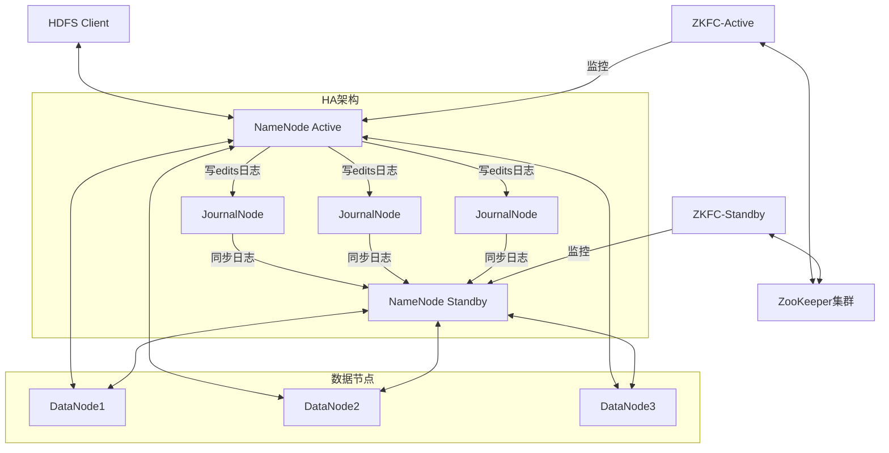
```mermaid
flowchart TB
    Client[HDFS Client]
    subgraph HA架构
        NN_A[NameNode Active]
        NN_S[NameNode Standby]
        JN1[JournalNode]
        JN2[JournalNode]
        JN3[JournalNode]
    end
    subgraph 数据节点
        DN1[DataNode1]
        DN2[DataNode2]
        DN3[DataNode3]
    end
    ZK[ZooKeeper集群]
    ZKFC1[ZKFC-Active]
    ZKFC2[ZKFC-Standby]
    Client <--> NN_A
    NN_A -->|写edits日志| JN1 & JN2 & JN3
    JN1 & JN2 & JN3 -->|同步日志| NN_S
    NN_A <--> DN1 & DN2 & DN3
    NN_S <--> DN1 & DN2 & DN3
    ZKFC1 -->|监控| NN_A
    ZKFC2 -->|监控| NN_S
    ZKFC1 & ZKFC2 <--> ZK
```

#### 1.1.2 核心底层机制

##### 1.1.2.1 元数据机制：fsimage 与 edits

**fsimage（镜像文件）**：某一时刻**完整元数据快照**（目录树、块信息）
**edits（操作日志）**：客户端所有**写操作记录**（mkdir、put、delete）
**工作机制**：NN启动加载fsimage → 回放edits → 内存生成最新元数据

**问题**：edits过大，NN重启极慢 → **SNN 定期合并**

##### 1.1.2.2 数据分块与副本机制

**块大小**：128MB（Hadoop3）
**副本**：默认3副本
**机架感知策略（企业标准）**：
  1. 副本1：客户端所在DN（本地性）
  2. 副本2：**不同机架**
  3. 副本3：同副本2机架不同节点

**目的**：**容错 + 读写性能平衡**

##### 1.1.2.3 心跳机制与块报告

- DN每3秒向NN发**心跳**：存活证明
- DN每1小时发**块报告**：告诉NN自己存了哪些块
- NN 10分钟收不到心跳 → 标记DN死亡 → 副本复制补全

##### 1.1.2.4 NameNode 与 DataNode 通信机制详解

**通信协议架构**
HDFS采用RPC（远程过程调用）实现NN与DN之间的通信，采用Java NIO优化并发处理：

示意图

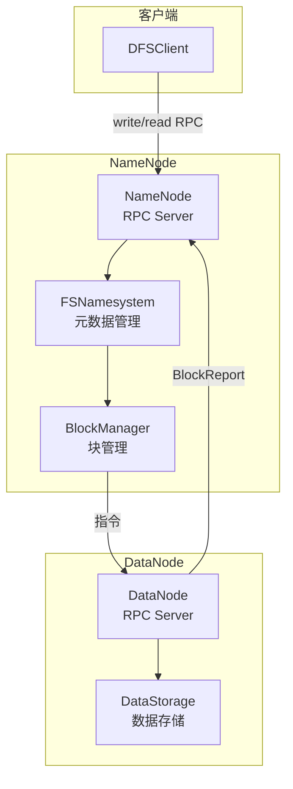
```mermaid
flowchart TB
    subgraph Client["客户端"]
        C1[DFSClient]
    end
    subgraph NameNode["NameNode"]
        NN1[NameNode\nRPC Server]
        NN2[FSNamesystem\n元数据管理]
        NN3[BlockManager\n块管理]
    end
    subgraph DataNode["DataNode"]
        DN1[DataNode\nRPC Server]
        DN2[DataStorage\n数据存储]
    end
    C1 -->|write/read RPC| NN1
    NN1 --> NN2
    NN2 --> NN3
    DN1 -->|BlockReport| NN1
    NN3 -->|指令| DN1
    DN1 --> DN2
```

**DataNodeProtocol 接口详解**
DN通过`DataNodeProtocol`接口与NN通信：

| 方法 | 方向 | 说明 |
|------|------|------|
| `registerDatanode` | DN→NN | DN启动时注册自己 |
| `sendHeartbeat` | DN→NN | 定期心跳，包含资源使用情况 |
| `blockReport` | DN→NN | 报告本地存储的所有块信息 |
| `blockReceived` | DN→NN | 报告新接收的块 |
| `blockDeleted` | DN→NN | 报告已删除的块 |
| `errorReport` | DN→NN | 报告异常情况 |

**心跳内容详解**
DN发送给NN的心跳包含以下信息：

**代码示例：HeartbeatResponse（Java）**

```java
// 心跳包含的主要信息
public class HeartbeatResponse {
    // 1. DN标识信息
    String datanodeID;           // DN唯一标识
    long storageID;              // 存储ID
    // 2. 资源使用情况
    int cachedBytes;             // 缓存字节数
    int cacheCapacity;           // 缓存容量
    long xceiverCount;           // 当前活跃的传输线程数
    int xceiverCountLimit;      // 传输线程数上限
    // 3. 存储信息
    StorageReport[] storageReports;  // 各存储目录的使用情况
    long lastUpdateTime;         // 最后更新时间
    int dfsUsedBytes;           // HDFS使用的字节数
    long remaining;             // 剩余空间
    long blockPoolUsed;         // BlockPool使用的空间
    // 4. 状态信息
    boolean networkError;        // 网络错误标志
    boolean capacityChanged;    // 容量是否变化
}
```

**NameNode下达的指令**
NN通过心跳响应向DN下达指令：

**代码示例：HeartbeatResponse（Java）**

```java
// NN返回给DN的指令类型
public class DatanodeCommand {
    DatanodeProtocol.COMMAND_TYPE action;  // 指令类型
    // 1. 注册响应 - DN首次启动时
    RegisterResponseMsg registerResponse;
    // 2. 块复制指令 - 副本数不足需要复制
    DatanodeInfo[] targets;          // 目标DN列表
    Block[] blocks;                  // 需要复制的块列表
    // 3. 块删除指令 - 副本数过多需要删除
    Block[] blocksToDelete;           // 待删除的块
    // 4. 块更新指令 - 块信息更新
    Block[] blocksToInvalidate;
    // 5. 缓存指令 - 缓存块操作
    CachedBlocks[] cachedBlocks;
}
```

**DN指令类型对照表**

| 指令 | action值 | 说明 | 触发条件 |
|------|---------|------|---------|
| `TRANSFER_BLOCK` | 1 | 传输块给其他DN | 副本复制（某DN宕机） |
| `INVALIDATE_BLOCKS` | 2 | 删除无效块 | 副本数超过配置 |
| `REPLICATE_BLOCK` | 3 | 复制块到其他DN | 副本数不足 |
| `BALANCE_BLOCKS` | 4 | 均衡块分布 | DataNode负载不均 |
| `SHUTDOWN` | 5 | 关闭DN | 管理员手动操作 |

**图：完整通信流程图**

**图：时序图**

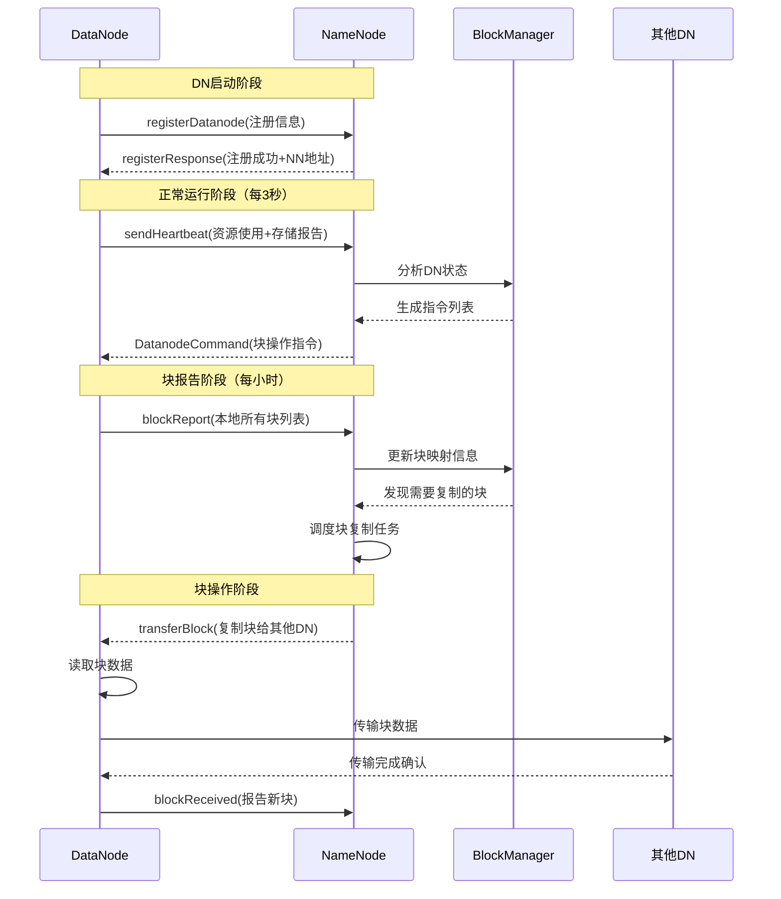
```mermaid
sequenceDiagram
    participant DN as DataNode
    participant NN as NameNode
    participant BM as BlockManager
    Note over DN,NN: DN启动阶段
    DN->>NN: registerDatanode(注册信息)
    NN-->>DN: registerResponse(注册成功+NN地址)
    Note over DN,NN: 正常运行阶段（每3秒）
    DN->>NN: sendHeartbeat(资源使用+存储报告)
    NN->>BM: 分析DN状态
    BM-->>NN: 生成指令列表
    NN-->>DN: DatanodeCommand(块操作指令)
    Note over DN,NN: 块报告阶段（每小时）
    DN->>NN: blockReport(本地所有块列表)
    NN->>BM: 更新块映射信息
    BM-->>NN: 发现需要复制的块
    NN->>NN: 调度块复制任务
    Note over DN,NN: 块操作阶段
    NN-->>DN: transferBlock(复制块给其他DN)
    DN->>DN: 读取块数据
    DN->>其他DN: 传输块数据
    其他DN-->>DN: 传输完成确认
    DN->>NN: blockReceived(报告新块)
```

**DN感知块损坏的流程**
DN通过校验和检测块损坏：

**DN坏块检测与修复流程图**

**图：流程图**

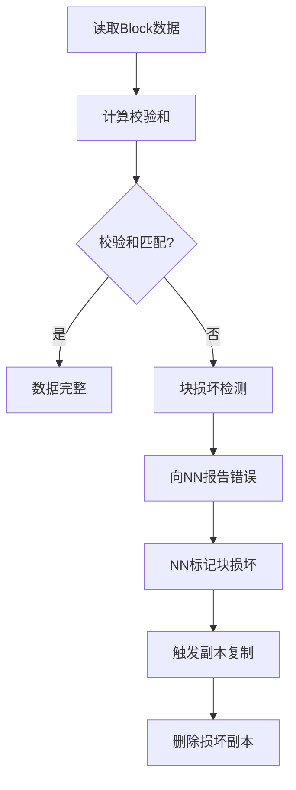
```mermaid
flowchart TB
    A[读取Block数据] --> B[计算校验和]
    B --> C{校验和匹配?}
    C -->|是| D[数据完整]
    C -->|否| E[块损坏检测]
    E --> F[向NN报告错误]
    F --> G[NN标记块损坏]
    G --> H[触发副本复制]
    H --> I[删除损坏副本]
```

**代码示例：坏块检测代码示例（Java）**

**代码示例：DataBlockScanner（Java）**

```java
// DN检测块损坏的关键代码
public class DataBlockScanner {
    // 定期扫描块，检测损坏
    public void verifyBlock(Block block) {
        // 1. 读取块数据
        byte[] data = readBlock(block);
        // 2. 读取校验和信息
        MetaDataInputStream meta = getMetaData(block);
        // 3. 计算校验和
        Checksum checksum = new CRC32();
        byte[] computedChecksum = checksum.calculate(data);
        // 4. 比对校验和
        if (!Arrays.equals(computedChecksum, meta.getChecksum())) {
            // 块损坏！向NN报告
            namenode.reportBadBlocks(block);
        }
    }
}
```

**生产监控指标**

**监控指标对照表**

| 指标 | 阈值 | 说明 |
|------|------|------|
| `DatanodeMissingRe blocks` | > 0 | 缺失的块数量，需立即处理 |
| `LastVolumeFailure` | < 24h | 最近一次磁盘故障时间 |
| `XceiverCount` | < 200 | 活跃传输线程数，过高表示过载 |
| `HeartbeatMissCount` | > 0 | 连续心跳失败次数 |
| `StorageBlockCapacity` | > 80% | 存储使用率，过高需扩容 |

**表：通信参数调优**

**配置示例：YARN配置**

**配置示例：xml配置**

```xml
<configuration>
    <!-- DN心跳间隔（毫秒） -->
    <property>
        <name>dfs.heartbeat.interval</name>
        <value>3</value>
        <description>DN向NN发送心跳的间隔（秒）</description>
    </property>
    <!-- NN心跳响应超时（毫秒） -->
    <property>
        <name>dfs.namenode.handler.count</name>
        <value>100</value>
        <description>NN处理DN请求的线程数</description>
    </property>
    <!-- DN RPC服务端口 -->
    <property>
        <name>dfs.datanode.ipc.address</name>
        <value>0.0.0.0:9866</value>
        <description>DN RPC服务端口</description>
    </property>
    <!-- DN块报告间隔 -->
    <property>
        <name>dfs.blockreport.intervalMsec</name>
        <value>21600000</value>
        <description>DN发送块报告的间隔（6小时）</description>
    </property>
    <!-- DN增量块报告 -->
    <property>
        <name>dfs.blockreport.incremental.intervalMsec</name>
        <value>60000</value>
        <description>增量块报告间隔（1分钟）</description>
    </property>
</configuration>
```

##### 1.1.2.5 Block 内部结构与副本管理详解

1. **Block内部存储结构**
HDFS的Block在DataNode上以文件形式存储，每个Block包含两部分：

**Block内部存储结构说明表**

| 组成部分 | 文件名示例 | 说明 |
|---------|-----------|------|
| **数据文件** | `blk_1073741825` | 实际数据内容 |
| **元数据文件** | `blk_1073741825.meta` | 校验和信息（CRC32） |

**存储结构**

**相关说明**

```text
/data/dfs/data/current/BP-12345678-192.168.1.100-1234567890/current/finalized/subdir0/subdir1/
├── blk_1073741825          # 数据块（128MB）
├── blk_1073741825_1001.meta  # 元数据（校验和信息）
├── blk_1073741826
├── blk_1073741826_1001.meta
└── ...
```

2. **Block写入详细流程**
当客户端写入数据到HDFS时，数据以Packet（数据包）为单位传输：

**Block写入流程图**

**图：流程图**

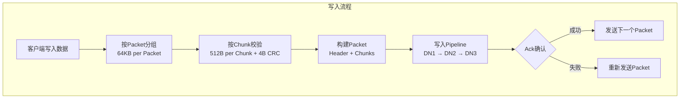
```mermaid
flowchart TB
    subgraph 写入流程
        A[客户端写入数据] --> B[按Packet分组<br/>64KB per Packet]
        B --> C[按Chunk校验<br/>512B per Chunk + 4B CRC]
        C --> D[构建Packet<br/>Header + Chunks]
        D --> E[写入Pipeline<br/>DN1 → DN2 → DN3]
        E --> F{Ack确认}
        F -->|成功| G[发送下一个Packet]
        F -->|失败| H[重新发送Packet]
    end
```

| 概念 | 大小 | 说明 |
|------|------|------|
| **Chunk** | 512B | 最小校验单位，每512B计算一个CRC校验和 |
| **Packet** | 64KB | 网络传输单位，包含多个Chunk |
| **Block** | 128MB | HDFS存储单位，由多个Packet组成 |

**表：副本放置策略详解**
Hadoop的机架感知算法决定副本如何放置：

**Block副本存放机制示意图**

**图：流程图**

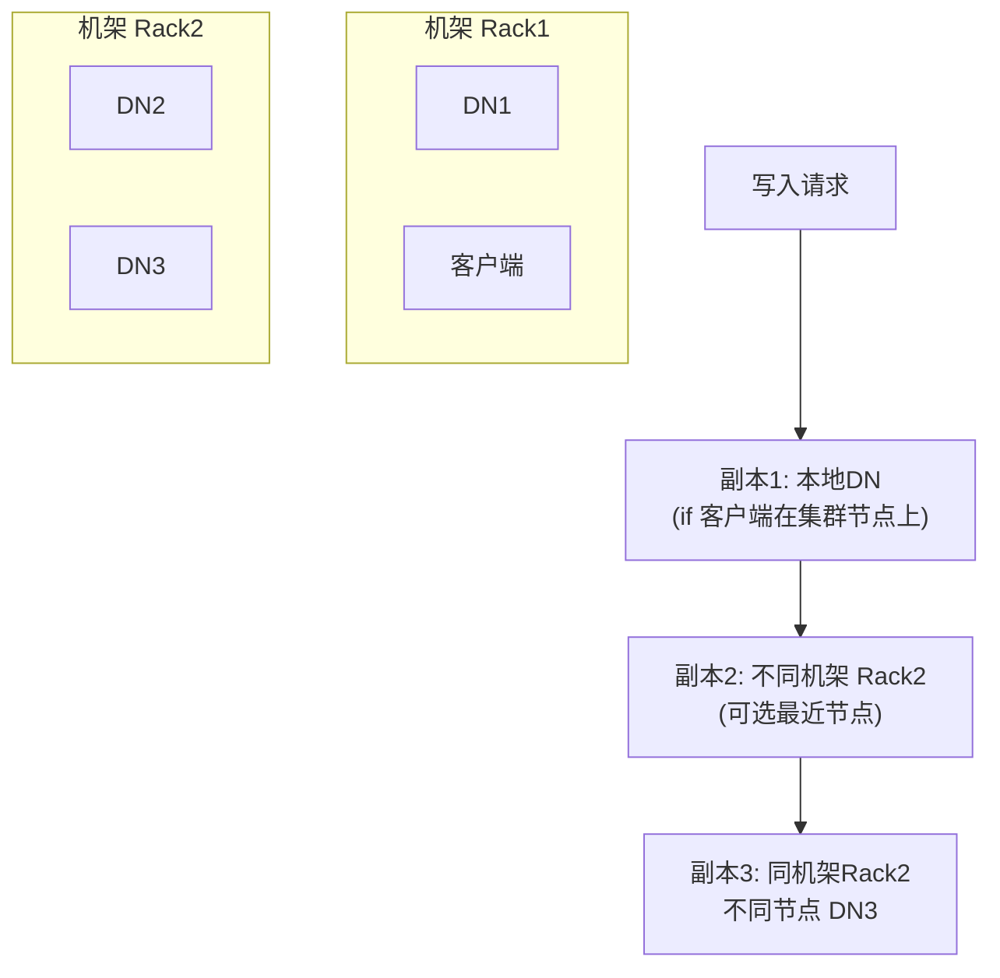
```mermaid
flowchart TB
    subgraph Rack1["机架 Rack1"]
        DN1[DN1]
        Client[客户端]
    end
    subgraph Rack2["机架 Rack2"]
        DN2[DN2]
        DN3[DN3]
    end
    A[写入请求] --> B["副本1: 本地DN<br/>(if 客户端在集群节点上)"]
    B --> C["副本2: 不同机架 Rack2<br/>(可选最近节点)"]
    C --> D["副本3: 同机架Rack2<br/>不同节点 DN3"]
```

**表：副本放置规则**

| 场景 | 副本1 | 副本2 | 副本3 |
|------|-------|-------|-------|
| 客户端在DN上 | 客户端所在DN | 不同机架 | 同副本2机架不同节点 |
| 客户端在集群外 | 随机DN（选择负载低的） | 随机另一机架 | 同副本2机架不同节点 |
| 3副本同机架（同城机房优化） | DN1 | DN2 | DN3（同机架不同节点） |

**表：副本复制（Block Replication）触发机制**
当DataNode故障或副本数不足时，NameNode触发副本复制：

**Block副本复制触发流程图**

**图：流程图**

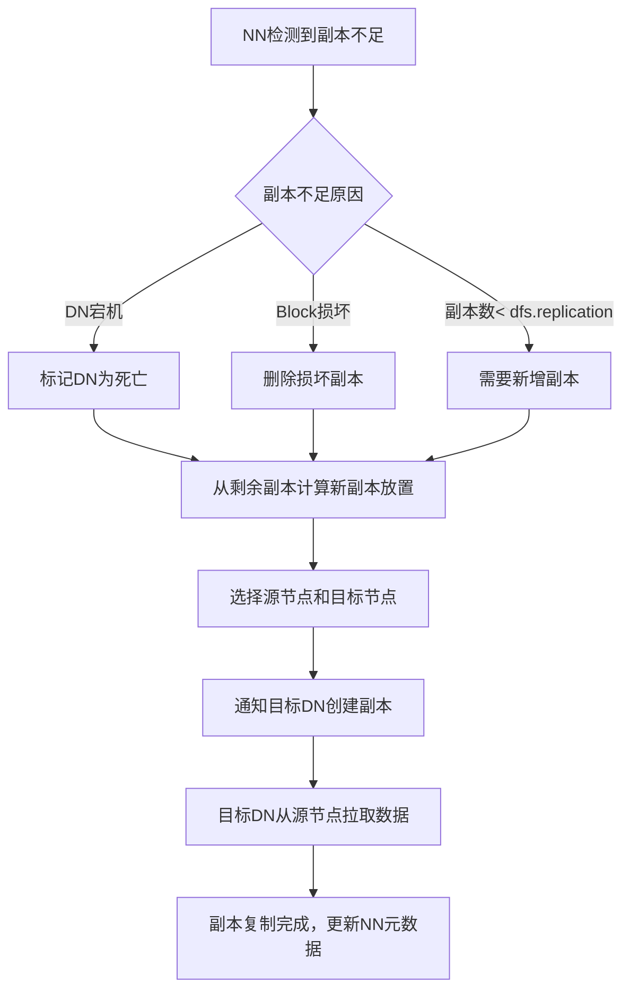
```mermaid
flowchart TB
    A[NN检测到副本不足] --> B{副本不足原因}
    B -->|DN宕机| C[标记DN为死亡]
    B -->|Block损坏| D[删除损坏副本]
    B -->|副本数< dfs.replication| E[需要新增副本]
    C --> F[从剩余副本计算新副本放置]
    D --> F
    E --> F
    F --> G[选择源节点和目标节点]
    G --> H[通知目标DN创建副本]
    H --> I[目标DN从源节点拉取数据]
    I --> J[副本复制完成，更新NN元数据]
```

**副本复制优先级**
NameNode按以下优先级处理副本复制：

| 优先级 | 条件 | 说明 |
|-------|------|------|
| **P0 紧急** | 副本数为0（数据完全丢失） | 立即复制 |
| **P1 高** | 副本数为1（无容错能力） | 尽快复制 |
| **P2 中** | 正在复制中但未完成 | 正常复制 |
| **P3 低** | 副本数为2但配置为3 | 可延后复制 |

**均衡器（Balancer）优化数据分布**
数据倾斜时使用Balancer重新分布数据：

**Balancer运维命令**

**代码示例：Shell命令**

```bash
- 标准均衡（阈值5%）
hdfs balancer -threshold 5
- 指定均衡策略（按节点或机架）
hdfs balancer -threshold 5 -policy node
- 只均衡特定节点
hdfs balancer -threshold 5 -include node1,node2,node3
- 查看均衡进度
hdfs balancer -threshold 5 -iterations 10
```

| 参数 | 说明 | 建议值 |
|------|------|--------|
| threshold | 节点间磁盘使用率差异阈值 | 5-10% |
| policy | 均衡策略（node/datanode） | node |
| iterations | 每次均衡迭代次数 | 10 |

#### 1.1.3 HDFS 读数据完整流程

**客户端 → NN → DN → 数据读取**（全程短连接）
1. Client 调用 `open()` 请求 NN
2. NN 返回**文件块列表 + 每个块所在DN地址**（按距离排序）
3. Client 调用 `read()` 就近连接 DN 读取块
4. 读完一个块 → 校验和验证 → 继续读下一个块
5. 全部读完 → `close()` 关闭流

**图：读数据流程图**

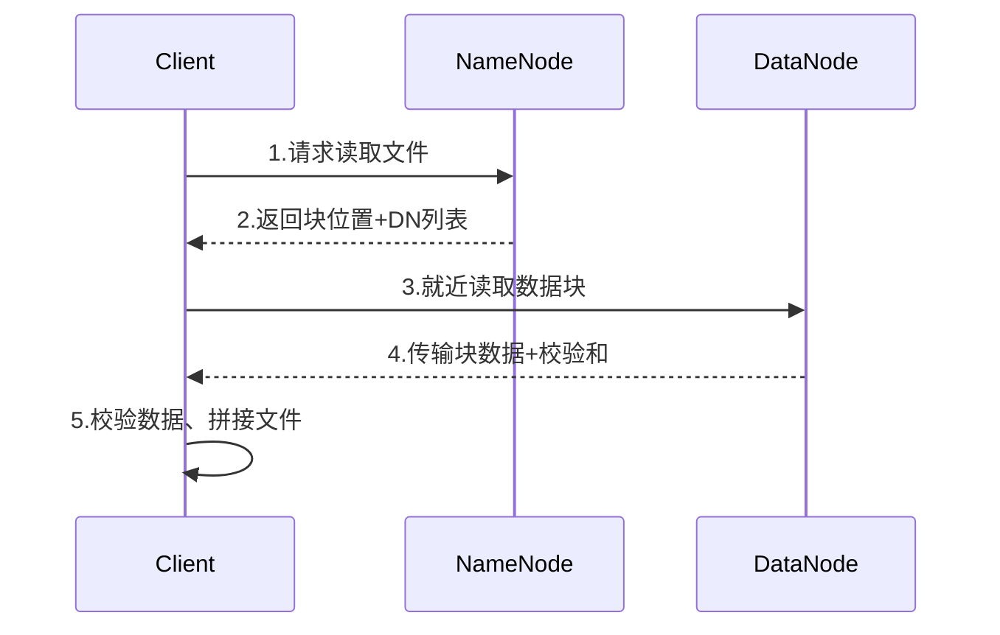
```mermaid
sequenceDiagram
    Client->>NameNode: 1.请求读取文件
    NameNode-->>Client: 2.返回块位置+DN列表
    Client->>DataNode: 3.就近读取数据块
    DataNode-->>Client: 4.传输块数据+校验和
    Client->>Client: 5.校验数据、拼接文件
```

#### 1.1.4 HDFS 写数据完整流程

##### 1.1.4.1 写数据流程概述

HDFS 写数据核心特点：管道流式写入 + 副本同步确认

**图：HDFS写数据流程时序图**

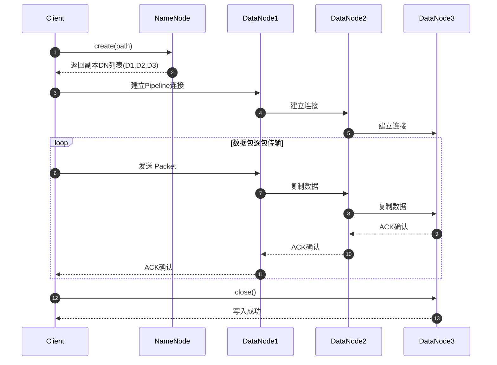
```mermaid
sequenceDiagram
    autonumber
    participant C as Client
    participant NN as NameNode
    participant D1 as DataNode1
    participant D2 as DataNode2
    participant D3 as DataNode3
    C->>NN: create(path)
    NN-->>C: 返回副本DN列表(D1,D2,D3)
    C->>D1: 建立Pipeline连接
    D1->>D2: 建立连接
    D2->>D3: 建立连接
    loop 数据包逐包传输
        C->>D1: 发送 Packet
        D1->>D2: 复制数据
        D2->>D3: 复制数据
        D3-->>D2: ACK确认
        D2-->>D1: ACK确认
        D1-->>C: ACK确认
    end
    C->>D3: close()
    D3-->>C: 写入成功
```

**表：详细流程说明表**

| 阶段 | 步骤 | 详细说明 |
|-----|------|---------|
| **准备阶段** | 1. 创建文件请求 | Client 调用 `DistributedFileSystem.create()` 向 NameNode 请求创建文件 |
| | 2. 元数据检查 | NN 检查：① 文件是否已存在 ② 目录是否存在 ③ Client 是否有写权限 |
| | 3. 分配副本位置 | NN 根据机架感知策略，返回有序的 DN 列表（DN1、DN2、DN3） |
| **写入阶段** | 4. 建立 Pipeline | Client 与第一个 DN 建立连接，DN1 再连接 DN2，DN2 再连接 DN3 |
| | 5. 数据切分发送 | Client 将数据切分为 Packets，通过 Pipeline 依次发送 |
| | 6. 逐级复制确认 | DN3 收到数据后 ACK 确认给 DN2，DN2 再 ACK 给 DN1，DN1 最终 ACK 给 Client |
| **完成阶段** | 7. 关闭文件 | Client 发送 `close()` 请求，数据传输完成 |
| | 8. 元数据提交 | NN 正式提交文件元数据（文件名、副本数、Block 映射） |

**图：HDFS Pipeline写入数据流示意图**

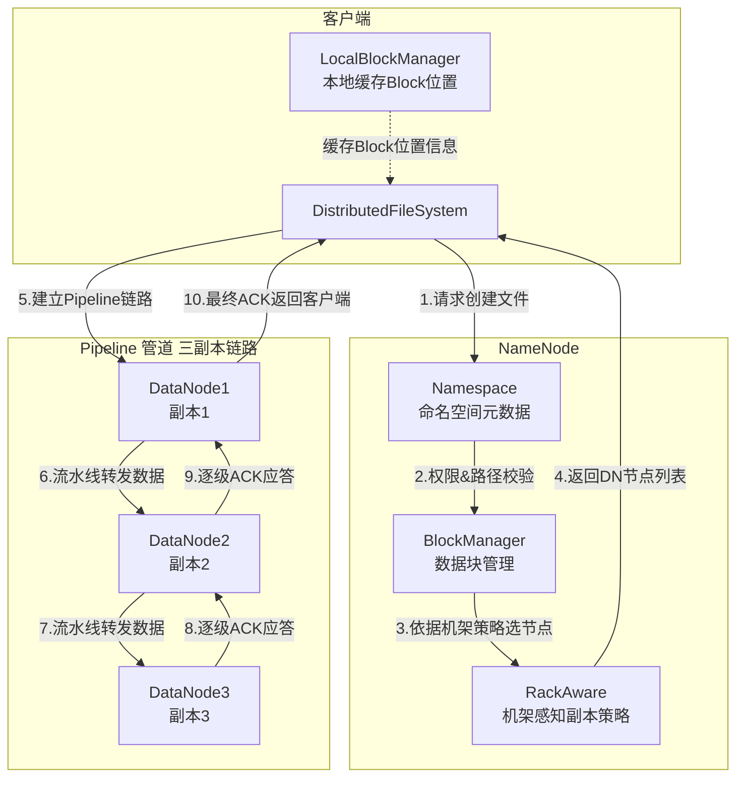
```mermaid
flowchart TB
    subgraph Client["客户端"]
        DFS[DistributedFileSystem]
        LMB[LocalBlockManager<br/>本地缓存Block位置]
    end

    subgraph NameNode
        NS[Namespace<br/>命名空间元数据]
        BL[BlockManager<br/>数据块管理]
        RN[RackAware<br/>机架感知副本策略]
    end

    subgraph Pipeline["Pipeline 管道 三副本链路"]
        DN1[DataNode1<br/>副本1]
        DN2[DataNode2<br/>副本2]
        DN3[DataNode3<br/>副本3]
    end

    %% 流程连线
    DFS -->|1.请求创建文件| NS
    NS -->|2.权限&路径校验| BL
    BL -->|3.依据机架策略选节点| RN
    RN -->|4.返回DN节点列表| DFS

    DFS -->|5.建立Pipeline链路| DN1
    DN1 -->|6.流水线转发数据| DN2
    DN2 -->|7.流水线转发数据| DN3

    DN3 -->|8.逐级ACK应答| DN2
    DN2 -->|9.逐级ACK应答| DN1
    DN1 -->|10.最终ACK返回客户端| DFS

    LMB -.->|缓存Block位置信息| DFS
```

##### 1.1.4.2 Pipeline 管道写入机制

**机架感知策略**

HDFS 通过机架感知确定最佳副本位置，遵循以下原则：

| 副本数 | 副本分配策略 | 说明 |
|-------|-------------|------|
| 副本1 | 同机架第一个 DN | 写入速度最快 |
| 副本2 | 不同机架的 DN | 防止单机房故障 |
| 副本3 | 同机架第二个 DN | 快速恢复 |
| 更多副本 | 均匀分布各机架 | 保证容错和性能平衡 |

**表：副本分配算法**

**代码示例：HDFS 三副本机架感知分配策略（Java）**

```java
// HDFS 副本分配伪代码
List<DatanodeInfo> getBlockLocations() {
    // 第一副本：与 Client 同机架的 DN（如果是 DN 写入则为本地 DN）
    // 第二副本：不同机架的 DN
    // 第三副本：与第一副本同机架的不同 DN
    // 更多副本：均匀分布各机架
}
```

**Pipeline 数据传输机制**

**图：数据传输流程图**


```mermaid
flowchart TB
    subgraph Client["客户端"]
        DFS[DistributedFileSystem]
        LMB[LocalBlockManager<br/>本地缓存Block位置]
    end

    subgraph NameNode
        NS[Namespace<br/>命名空间元数据]
        BL[BlockManager<br/>数据块管理]
        RN[RackAware<br/>机架感知副本策略]
    end

    subgraph Pipeline["Pipeline 管道 三副本链路"]
        DN1[DataNode1<br/>副本1]
        DN2[DataNode2<br/>副本2]
        DN3[DataNode3<br/>副本3]
    end

    %% 流程连线
    DFS -->|1.请求创建文件| NS
    NS -->|2.权限&路径校验| BL
    BL -->|3.依据机架策略选节点| RN
    RN -->|4.返回DN节点列表| DFS

    DFS -->|5.建立Pipeline链路| DN1
    DN1 -->|6.流水线转发数据| DN2
    DN2 -->|7.流水线转发数据| DN3

    DN3 -->|8.逐级ACK应答| DN2
    DN2 -->|9.逐级ACK应答| DN1
    DN1 -->|10.最终ACK返回客户端| DFS

    LMB -.->|缓存Block位置信息| DFS
```

**Pipeline 建立过程**

**代码示例：HDFS Pipeline 流水线建立伪代码（Java）**

```java
// Pipeline 建立伪代码
void createPipeline(DataNodeInfo[] nodes) {
    // 1. 与第一个 DN 建立连接
    Socket clientDN1 = new Socket(nodes[0].getAddress());
    DataStreamer streamer1 = new DataStreamer(clientDN1);
    // 2. DN1 与 DN2 建立连接（通过 DN1 内部连接）
    DataStreamer streamer2 = streamer1.connectToNextDataNode(nodes[1]);
    // 3. DN2 与 DN3 建立连接
    DataStreamer streamer3 = streamer2.connectToNextDataNode(nodes[2]);
    // 4. Pipeline 建立完成，开始传输数据
}
```

##### 1.1.4.3 ACK 确认与副本同步

**Packet 确认机制详解**

当 Client 发送一个 Packet 后，必须收到 Pipeline 中所有 DN 的确认（ACK）才发送下一个 Packet：

| 状态 | 说明 |
|------|------|
| **pending** | Packet 正在发送，等待确认 |
| **ack** | 所有 DN 都确认接收成功 |
| **error** | 某个 DN 写入失败，需要处理 |

**表：Packet 数据包结构详解**

| 组件 | 大小 | 说明 |
|------|------|------|
| **Chunk** | 512B | 最小校验单位，每 512B 数据计算一个 CRC32 校验和 |
| **Chunks per Packet** | 128 个 | 每个 Packet 包含 128 个 Chunk |
| **Packet** | ~64KB | 包含 36B Header + 128×(512+4) = 66KB，实际约 64KB 数据 |
| **Block** | 128MB | 由多个 Packet 组成，Block 大小由 `dfs.blocksize` 配置 |

**Packet Header 结构**

**代码示例：HDFS Packet 数据结构（Java）**

```java
class Packet {
    // Header 部分 (36 bytes)
    long offsetInBlock;      // 当前 Packet 在 Block 中的偏移量
    long seqno;              // 序列号，用于按序接收
    boolean lastPacket;      // 是否是当前 Block 的最后一个 Packet
    int dataLen;             // 数据长度（不含 Checksum）
    // Data 部分
    byte[] data;            // 实际数据 64KB
    // Checksum 部分
    Checksum[] checksums;   // 每个 Chunk 一个 Checksum
}
```

**图：Pipeline 写入完整流程图**

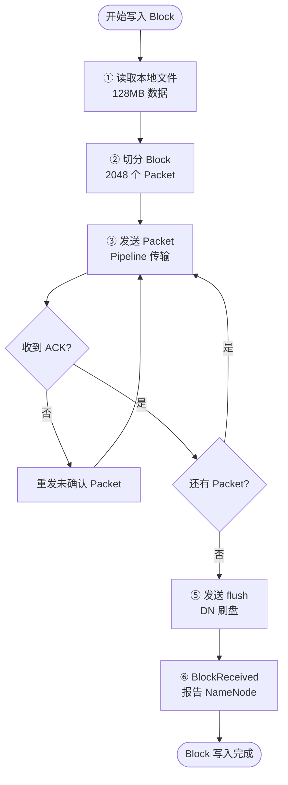
```mermaid
flowchart TD
    Start(["开始写入 Block"])
    Read["① 读取本地文件<br/>128MB 数据"]
    Split["② 切分 Block<br/>2048 个 Packet"]
    Send["③ 发送 Packet<br/>Pipeline 传输"]
    Ack{"收到 ACK?"}
    Retry["重发未确认 Packet"]
    Check{"还有 Packet?"}
    Flush["⑤ 发送 flush<br/>DN 刷盘"]
    Report["⑥ BlockReceived<br/>报告 NameNode"]
    End(["Block 写入完成"])
    Start --> Read
    Read --> Split
    Split --> Send
    Send --> Ack
    Ack -->|是| Check
    Ack -->|否| Retry
    Retry --> Send
    Check -->|是| Send
    Check -->|否| Flush
    Flush --> Report
    Report --> End
```

**图：ACK 确认详细流程时序图**

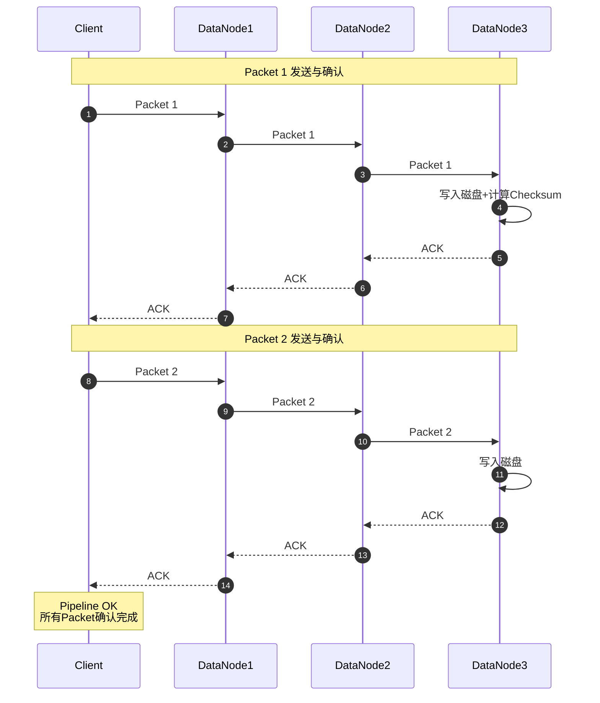
```mermaid
sequenceDiagram
    autonumber
    participant C as Client
    participant D1 as DataNode1
    participant D2 as DataNode2
    participant D3 as DataNode3
    Note over C,D3: Packet 1 发送与确认
    C->>D1: Packet 1
    D1->>D2: Packet 1
    D2->>D3: Packet 1
    D3->>D3: 写入磁盘+计算Checksum
    D3-->>D2: ACK
    D2-->>D1: ACK
    D1-->>C: ACK
    Note over C,D3: Packet 2 发送与确认
    C->>D1: Packet 2
    D1->>D2: Packet 2
    D2->>D3: Packet 2
    D3->>D3: 写入磁盘
    D3-->>D2: ACK
    D2-->>D1: ACK
    D1-->>C: ACK
    Note over C: Pipeline OK<br/>所有Packet确认完成
```

##### 1.1.4.4 异常处理与故障恢复

**DN 写入失败场景**

当 Pipeline 中某个 DN 写入失败时，HDFS 采用以下策略处理：

| 故障场景 | 处理策略 |
|---------|---------|
| **DN2 写入失败** | 关闭 Pipeline，绕过 DN2，向 DN1、DN3 继续写入 |
| **DN3 写入失败** | 绕过 DN3，向 DN1、DN2 继续写入，NN 会在其他节点补充副本 |
| **多个 DN 同时失败** | 如果副本数 < 最小要求，抛出异常；否则继续写入 |

**图：Pipeline 故障恢复详细流程图**

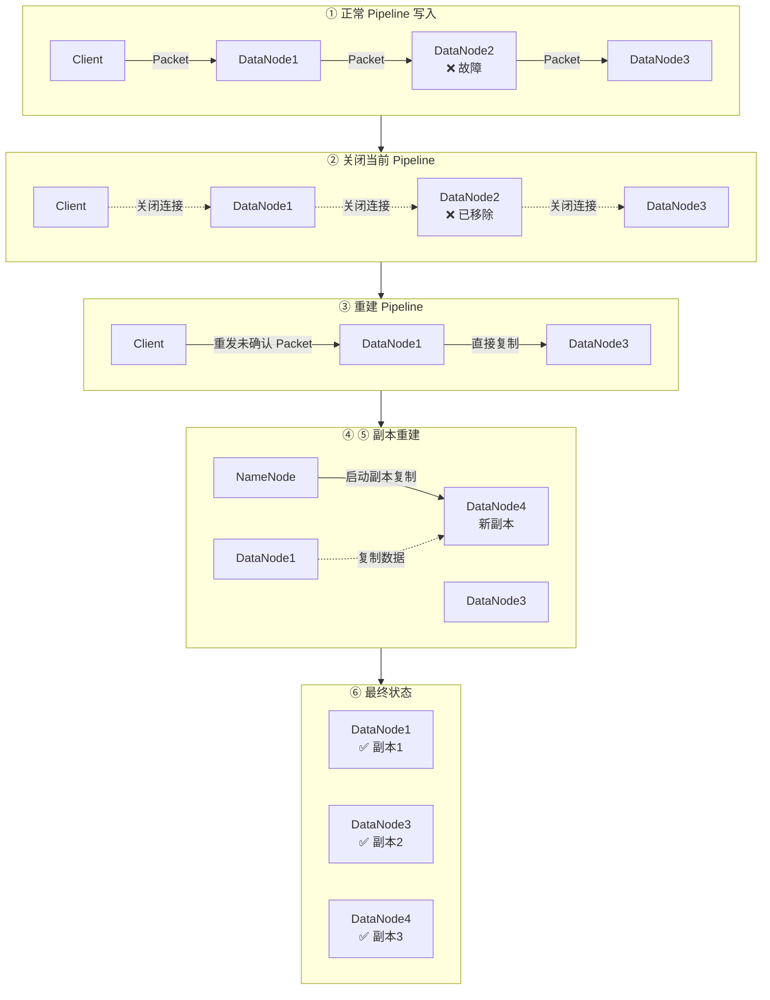
```mermaid
flowchart TD
    subgraph Step1["① 正常 Pipeline 写入"]
        C1["Client"]
        D11["DataNode1"]
        D12["DataNode2<br/>❌ 故障"]
        D13["DataNode3"]
        C1 -->|"Packet"| D11
        D11 -->|"Packet"| D12
        D12 -->|"Packet"| D13
    end
    subgraph Step2["② 关闭当前 Pipeline"]
        C2["Client"]
        D21["DataNode1"]
        D22["DataNode2<br/>❌ 已移除"]
        D23["DataNode3"]
        C2 -.->|"关闭连接"| D21
        D21 -.->|"关闭连接"| D22
        D22 -.->|"关闭连接"| D23
    end
    subgraph Step3["③ 重建 Pipeline"]
        C3["Client"]
        D31["DataNode1"]
        D33["DataNode3"]
        C3 -->|"重发未确认 Packet"| D31
        D31 -->|"直接复制"| D33
    end
    subgraph Step4["④ ⑤ 副本重建"]
        NN["NameNode"]
        D41["DataNode1"]
        D43["DataNode3"]
        D44["DataNode4<br/>新副本"]
        NN -->|"启动副本复制"| D44
        D41 -.->|"复制数据"| D44
    end
    subgraph Step5["⑥ 最终状态"]
        F1["DataNode1<br/>✅ 副本1"]
        F3["DataNode3<br/>✅ 副本2"]
        F4["DataNode4<br/>✅ 副本3"]
    end
    Step1 --> Step2
    Step2 --> Step3
    Step3 --> Step4
    Step4 --> Step5
```

**代码示例：故障处理（Java）**

```java
// Pipeline 故障处理伪代码
class PipelineAck {
    void run() {
        try {
            // 1. 尝试写入 Pipeline
            while (hasMorePackets()) {
                sendPacketToPipeline(packet);
                waitForAck();
            }
        } catch (IOException e) {
            // 2. Pipeline 故障处理
            LOG.error("Pipeline error, recovering...", e);
            recoverPipeline(e);
        }
    }
    void recoverPipeline(IOException e) {
        // 1. 关闭现有 Pipeline
        shutdownPipeline();
        // 2. 找到成功的 DN，移除失败的 DN
        List<DatanodeInfo> goodNodes = findGoodNodes();
        DatanodeInfo badNode = findBadNode();
        // 3. 向 NN 报告故障
        namenode.errorReport(badNode, OP_STATUS.ERROR);
        // 4. 如果副本数足够，继续写入
        if (goodNodes.size() >= minReplication) {
            // 创建新 Pipeline（绕过故障节点）
            createNewPipeline(goodNodes);
            // 重发未确认的 Packets
            resendUnackedPackets();
        } else {
            // 副本数不足，抛出异常
            throw new IOException("Not enough replicas");
        }
    }
}
```

**其他故障场景及处理**

| 故障场景 | HDFS 处理方式 |
|---------|--------------|
| **Client 与 DN1 连接断开** | 重新建立连接，如果 DN1 数据完整则继续写入 |
| **写入过程中 NN 宕机** | Client 收到异常，尝试重建 Pipeline，数据保留在 DN 中 |
| **DN 磁盘满** | DN 报告磁盘空间不足，NN 将其标记为低优先级，不再分配新 Block |
| **网络闪断** | TCP 重连机制，HDFS 层面通过 Packet 确认保证数据不丢失 |
| **Block 损坏** | DN 定期验证 Checksum，发现损坏后报告 NN，NN 启动副本复制 |

**副本重建机制**

当 DN 故障导致副本数不足时，NN 后台会自动触发副本重建：

| 配置参数 | 说明 | 默认值 |
|---------|------|-------|
| `dfs.namenode.replication.min` | 最小副本数，写操作必须满足 | 1 |
| `dfs.namenode.replication.pending.timeout-sec` | 副本复制超时时间 | 300s |
| `dfs.replication.interval` | NN 检查副本不足的间隔 | 0.1s |

**代码示例：HDFS副本重建（Java）**

```java
// 副本重建触发逻辑
class BlockManager {
    void processPendingReplications() {
        // 1. 检查需要重建的 Block 列表
        List<Block> blocksToReplicate = getUnderReplicatedBlocks();
        // 2. 为每个 Block 选择新的 DN 目标
        for (Block block : blocksToReplicate) {
            DatanodeInfo[] targets = chooseTargets(block);
            // 3. 启动副本复制
            replicateBlock(block, targets);
        }
    }
}
```

**写入性能优化配置**

| 配置项 | 说明 | 推荐值 |
|-------|------|-------|
| `dfs.write.replication.timeout` | Pipeline ACK 超时时间 | 300s |
| `dfs.client.block.write.retries` | 写入重试次数 | 3 |
| `dfs.blocksize` | Block 大小 | 128MB（机械硬盘）/ 256MB（SSD） |
| `dfs.client.buffer.size` | 客户端写入缓冲区大小 | 4MB |

#### 1.1.5 HA 高可用自动切换机制

**解决单点故障：Active NN 宕机不中断业务**
1. ZKFC 持续监控 NN 健康状态
2. Active 宕机 → ZKFC 发起**ZK分布式锁抢主**
3. Standby 获取锁 → 升级为 Active
4. 所有 DN 自动上报心跳给新 Active
5. 客户端自动故障转移（无感知）

##### 1.1.5.1 JournalNode 与 QJM 机制

**JournalNode 核心定位**

JournalNode是Hadoop 2.0引入的HA架构核心组件，用于解决NameNode主备同步问题。在没有HA的架构中，NameNode是单点故障；当Active NN宕机后，Standby NN无法知道之前的操作日志内容，无法快速接管服务。JournalNode通过共享存储机制，让Standby NN能够读取到Active NN的所有操作日志，从而实现真正的热备。

JournalNode集群通常部署奇数个节点（3、5、7等），通过Paxos协议保证日志写入的一致性。与NFS（网络文件系统）方案相比，QJM不需要依赖外部共享存储设备，架构更加简单，已成为Hadoop HA方案的事实标准。

**QJM 多数投票机制**

QJM（Quorum Journal Manager）是一种基于多数投票的日志管理机制，其核心思想是将日志数据写入多个JournalNode节点，只有当多数节点确认写入成功时，才认为该日志操作完成。这种设计确保了即使部分节点故障，日志数据仍然不会丢失。

| 配置项 | 说明 | 推荐值 |
|-------|------|--------|
| `dfs.namenode.shared.edits.dir` | JournalNode命名空间 | `qjournal://jn1:8485;jn2:8485;jn3:8485/ns` |
| `dfs.journalnode.edits.dir` | JournalNode本地编辑日志目录 | `/data/hadoop/journal` |
| `dfs.qjournal.start-segment.timeout.ms` | 开始新段超时时间 | 20000 |
| `ha.zookeeper.quorum` | ZK集群地址 | `zk1:2181,zk2:2181,zk3:2181` |

**图：QJM 架构图**

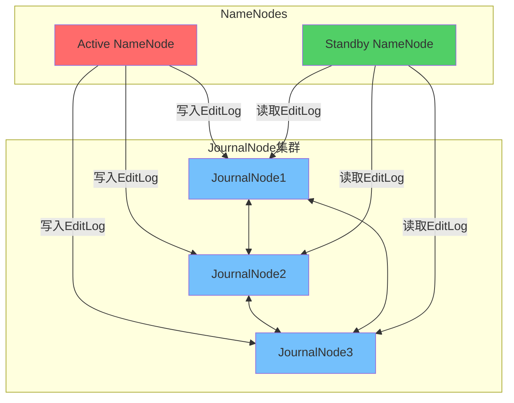
```mermaid
flowchart TB
    subgraph NameNodes
        NN_A[Active NameNode]
        NN_S[Standby NameNode]
    end
    subgraph JournalNode集群
        JN1[JournalNode1]
        JN2[JournalNode2]
        JN3[JournalNode3]
    end
    NN_A -->|写入EditLog| JN1
    NN_A -->|写入EditLog| JN2
    NN_A -->|写入EditLog| JN3
    JN1 <--> JN2
    JN2 <--> JN3
    JN1 <--> JN3
    NN_S -->|读取EditLog| JN1
    NN_S -->|读取EditLog| JN2
    NN_S -->|读取EditLog| JN3
    style NN_A fill:#ff6b6b
    style NN_S fill:#51cf66
    style JN1 fill:#74c0fc
    style JN2 fill:#74c0fc
    style JN3 fill:#74c0fc
```

**QJM 写入流程**
1. Active NN 执行写操作，生成EditLog条目
2. EditLog条目并行发送到所有JournalNode
3. JournalNode将EditLog写入本地磁盘
4. 当**超过半数**（N/2+1）的JournalNode确认写入成功后，认为操作完成
5. Active NN通知客户端操作成功
6. Standby NN通过后台线程从JournalNode读取并回放EditLog，保持与Active的状态同步

**JournalNode HA配置（xml）**

```xml
<configuration>
    <!-- HA命名空间 -->
    <property>
        <name>dfs.nameservices</name>
        <value>ns1</value>
    </property>
    <!-- NameNode RPC地址 -->
    <property>
        <name>dfs.ha.namenodes.ns1</name>
        <value>nn1,nn2</value>
    </property>
    <property>
        <name>dfs.namenode.rpc-address.ns1.nn1</name>
        <value>namenode1:8020</value>
    </property>
    <property>
        <name>dfs.namenode.rpc-address.ns1.nn2</name>
        <value>namenode2:8020</value>
    </property>
    <!-- JournalNode共享编辑日志 -->
    <property>
        <name>dfs.namenode.shared.edits.dir</name>
        <value>qjournal://jn1:8485;jn2:8485;jn3:8485/ns1</value>
    </property>
    <!-- ZKFC配置 -->
    <property>
        <name>dfs.ha.automatic-failover.enabled</name>
        <value>true</value>
    </property>
    <property>
        <name>ha.zookeeper.quorum</name>
        <value>zk1:2181,zk2:2181,zk3:2181</value>
    </property>
</configuration>
```

##### 1.1.5.2 SecondaryNameNode 与元数据合并机制

**解决的问题**

在Hadoop 1.x时代，NameNode将所有元数据存储在内存中，同时将所有操作记录追加到EditLog文件。随着集群运行时间增长，EditLog会变得越来越大。当NameNode重启时，需要重新执行EditLog中的所有操作来恢复元数据状态。如果EditLog体积庞大，这个恢复过程会非常漫长，严重影响集群可用性。
SecondaryNameNode（简称2NN）正是为解决这一问题而设计，它定期将FSImage和EditLog合并，减少EditLog大小，从而缩短NameNode的重启时间。

**图：SN合并流程图**

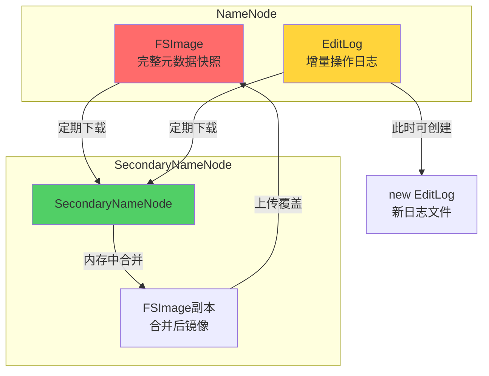
```mermaid
flowchart TB
    subgraph NameNode
        FN[FSImage<br/>完整元数据快照]
        EL[EditLog<br/>增量操作日志]
    end
    subgraph SecondaryNameNode
        SNN[SecondaryNameNode]
        SNI[FSImage副本<br/>合并后镜像]
    end
    FN -->|定期下载| SNN
    EL -->|定期下载| SNN
    SNN -->|内存中合并| SNI
    SNI -->|上传覆盖| FN
    EL -->|此时可创建| NEL[new EditLog<br/>新日志文件]
    style FN fill:#ff6b6b
    style EL fill:#ffd43b
    style SNN fill:#51cf66
```

**合并触发条件**

SecondaryNameNode会在以下任一条件满足时触发合并操作：

| 触发条件 | 默认值 | 说明 |
|---------|-------|------|
| `fs.checkpoint.period` | 3600秒（1小时） | 时间间隔触发 |
| `fs.checkpoint.size` | 4194304 KB（64MB） | EditLog大小触发 |

**表：完整合并流程**

1. **触发检查**：2NN每隔`dfs.namenode.checkpoint.period`秒检查是否需要合并
2. **获取令牌**：2NN向NN发起检查点请求，获取合并开始位置
3. **下载FSImage**：2NN通过HTTP GET下载当前的FSImage文件
4. **下载EditLog**：2NN通过HTTP GET下载当前的editlog文件
5. **执行合并**：2NN在本地将FSImage和EditLog合并，生成新的FSImage
6. **上传结果**：2NN将新的FSImage上传到NN，覆盖旧的FSImage
7. **切换EditLog**：NN创建新的EditLog文件，继续记录后续操作

**Hadoop 2.x 演进：CheckpointNode**

Hadoop 2.x对2NN进行了重新定位，引入了CheckpointNode概念。CheckpointNode与SecondaryNameNode功能完全相同，只是换了个名字。在Hadoop 2.x中，SecondaryNameNode不再是可选组件，而是HA架构的标准部分（虽然2NN不做HA切换，只做元数据合并）。

**Hadoop 3.x 演进**

Hadoop 3.x引入了**均衡块布局（Block Placement Policy）**等新特性，同时EditLog合并机制得到进一步优化。在Hadoop 3.x中，可以通过配置多个CheckpointNode来实现更高的可用性。

**CheckpointNode配置（xml）**

```xml
<!-- Hadoop 2.x/3.x CheckpointNode配置 -->
<property>
    <name>dfs.namenode.checkpoint.dir</name>
    <value>/data/hadoop/checkpoint</value>
</property>
<property>
    <name>dfs.namenode.checkpoint.period</name>
    <value>3600</value>
</property>
<property>
    <name>dfs.namenode.checkpoint.txns</name>
    <value>1000000</value>
</property>
```

##### 1.1.5.3 FSImage 与 EditLog 详解

**目录结构**

NameNode的元数据存储在`dfs.namenode.name.dir`配置的目录下，典型结构如下：

**典型目录结构**

```text
/data/dfs/name/
├── current/
│   ├── VERSION                 # 版本信息
│   ├── fsimage_0000000001      # 镜像文件（序列化的FSImage）
│   ├── fsimage_0000000001.md5  # 镜像校验和
│   ├── fsimage_0000000002      # 新的镜像文件
│   ├── edits_0000000001        # 编辑日志
│   ├── edits_0000000002
│   ├── edits_inprogress_0000000003  # 当前正在写入的日志
│   └── seen_txid               # 最后的事务ID
└── in_use.lock                 # 锁文件，防止并发启动
```

**FSImage（镜像文件）**

FSImage是NameNode元数据的完整快照，包含：

- 整个文件系统的命名空间（目录树）
- 文件属性（权限、创建时间、副本数）
- 文件与数据块的映射关系
- DataNode的信息（注册信息、块报告）

FSImage是惰性加载的，只有在NameNode启动时才会加载到内存。

**EditLog（编辑日志）**

EditLog记录了自上次FSImage创建以来的所有文件系统修改操作：

- 文件创建、删除、重命名
- 文件属性修改
- 块分配、块删除
- 副本数变更

**据一致性保障**

| 机制 | 说明 |
|-----|------|
| **批量写入** | EditLog采用批量写入，减少磁盘IO次数 |
| **同步刷盘** | 每个事务操作后同步刷盘，确保不丢数据 |
| **事务ID** | 每个EditLog条目都有唯一的事务ID（txid） |
| **双写** | Active NN写EditLog时，同步写入JournalNode集群 |
| **校验和** | 每个FSImage都有MD5校验和，防止损坏 |

**图：NameNode 启动元数据恢复流程图**

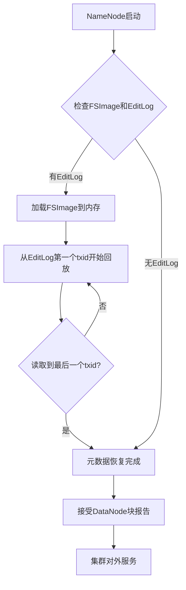
```mermaid
flowchart TB
    A[NameNode启动] --> B{检查FSImage和EditLog}
    B -->|有EditLog| C[加载FSImage到内存]
    C --> D[从EditLog第一个txid开始回放]
    D --> E{读取到最后一个txid?}
    E -->|否| D
    E -->|是| F[元数据恢复完成]
    B -->|无EditLog| F
    F --> G[接受DataNode块报告]
    G --> H[集群对外服务]
```

**命令行：HDFS 元数据查看与管理命令**

```bash
# 1. 离线查看 FSImage 镜像文件内容
# oiv = offline image viewer（离线工具，不影响NN运行）
hdfs oiv -i fsimage_0000000001 -o output.xml -p XML

# 2. 离线查看 EditLog 事务日志内容
# oev = offline edits viewer
hdfs oev -i edits_0000000001 -o output.xml -p XML

# 3. 手动触发检查点合并（FSImage + EditLog 合并）
# 步骤1：进入安全模式（禁止写入，保证元数据一致性）
hdfs dfsadmin -safemode enter
# 步骤2：执行元数据合并，生成新的FSImage
hdfs dfsadmin -saveNamespace
# 步骤3：退出安全模式，恢复对外服务
hdfs dfsadmin -safemode leave

# 4. 查看集群机架拓扑
hdfs dfsadmin -printTopology

# 5. 查看指定范围的事务日志（验证EditLog内容）
hdfs txns --transactionId 1000 --endTxId 2000
```

##### 1.1.5.4 ZKFC 故障切换流程详解

**ZKFC 核心职责**

ZKFC（ZooKeeper Failover Controller）是Hadoop HA架构中的故障切换控制器，它是一个独立的进程，与NameNode部署在同一节点上。ZKFC主要负责：

| 职责 | 说明 |
|-----|------|
| **健康监控** | 监控本地NameNode的运行状态（通过RPC调用） |
| **锁竞争** | 在ZooKeeper中抢注临时节点，获取分布式锁 |
| **切换触发** | 当本地NN不可用时，触发主备切换 |
| **自动恢复** | 当本地NN恢复后，可以重新参与竞争 |

**图：ZKFC 与 ZooKeeper 交互流程图**

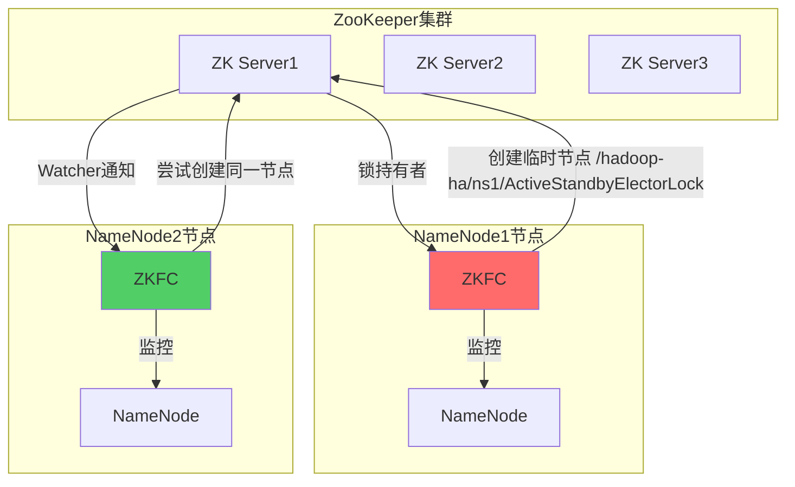
```mermaid
flowchart TB
    subgraph ZooKeeper集群
        ZK1[ZK Server1]
        ZK2[ZK Server2]
        ZK3[ZK Server3]
    end
    subgraph NameNode1节点
        NN1[NameNode]
        ZKFC1[ZKFC]
    end
    subgraph NameNode2节点
        NN2[NameNode]
        ZKFC2[ZKFC]
    end
    ZKFC1 -->|创建临时节点 /hadoop-ha/ns1/ActiveStandbyElectorLock| ZK1
    ZKFC2 -->|尝试创建同一节点| ZK1
    ZK1 -->|锁持有者| ZKFC1
    ZK1 -->|Watcher通知| ZKFC2
    ZKFC1 -->|监控| NN1
    ZKFC2 -->|监控| NN2
    style ZKFC1 fill:#ff6b6b
    style ZKFC2 fill:#51cf66
```

**表：完整故障切换6步流程表**

| 步骤 | 触发条件 | 执行动作 | 关键组件 |
|-----|---------|---------|---------|
| 1 | Active NN进程挂了 | ZKFC1检测到NN1无响应 | ZKFC健康检查 |
| 2 | 超时阈值达到 | ZKFC1断开与NN1的心跳 | `ha.zookeeper.session.timeout.ms` |
| 3 | 临时节点自动删除 | ZK1上的ActiveStandbyElectorLock消失 | ZooKeeper Session过期 |
| 4 | ZK2收到通知 | ZKFC2开始抢主 | ZK Watcher机制 |
| 5 | ZKFC2创建新锁节点 | 成功创建临时节点，成为Active | ZooKeeper原子性保证 |
| 6 | NN2升级为Active | DN开始向NN2报告心跳，客户端重定向 | 故障转移完成 |

**ZooKeeper自动故障切换配置（xml）**

```xml
<!-- 启用 HDFS HA 自动故障转移（核心开关） -->
<!-- 开启后由 ZKFC 自动监控 NN 状态，无需手动切换主备 -->
<property>
    <name>dfs.ha.automatic-failover.enabled</name>
    <value>true</value>
</property>

<!-- ZooKeeper 会话超时时间（单位：毫秒） -->
<!-- 5000ms=5s：ZK 超过5s收不到心跳，判定节点失效 -->
<property>
    <name>ha.zookeeper.session.timeout.ms</name>
    <value>5000</value>
</property>

<!-- ZKFC 健康检查超时时间（单位：毫秒） -->
<!-- 3000ms=3s：ZKFC 检测 NameNode 心跳超时阈值 -->
<property>
    <name>dfs.ha.zkfc.timeout</name>
    <value>3000</value>
</property>
```

**命令行：HDFS HA运维常用命令**

```bash
# 1. 查看所有 NameNode 节点状态（active/standby）
hdfs haadmin -getAllServiceState

# 2. 手动触发故障切换（自动切换失效时使用）
# 语法：hdfs haadmin -failover 原active节点 目标standby节点
hdfs haadmin -failover nn1 nn2

# 3. 手动强制切换主备状态（谨慎使用！需关闭自动故障切换）
# 将节点切换为 Active 主节点
hdfs haadmin -transitionToActive nn1
# 将节点切换为 Standby 备节点
hdfs haadmin -transitionToStandby nn2

# 4. ZKFC 核心命令
# 首次搭建 HA 时：初始化 ZooKeeper 元数据目录（仅执行一次）
hdfs zkfc -formatZK
# 启动 ZKFC 进程（监控 NameNode 健康状态，实现自动切换）
hdfs --daemon start zkfc
```

**故障切换期间的影响**

| 影响项 | 说明 |
|-------|------|
| **写操作** | 切换期间（约5-10秒）无法写入 |
| **读操作** | 读操作通常不受影响（DN仍正常服务） |
| **块报告** | DN需要重新向新Active注册 |
| **客户端重试** | 客户端会自动重试，有重试机制 |

#### 1.1.6 HDFS Federation 联邦机制

##### 1.1.6.1 设计背景与核心问题

**单NameNode架构的性能瓶颈**
在HDFS默认架构中，整个集群只有一个NameNode（NN）来管理所有文件的元数据。随着集群规模扩大，单个NameNode面临三大瓶颈：

| 瓶颈类型 | 具体表现 | 影响 |
|---------|---------|------|
| **内存瓶颈** | NN将所有文件的元数据加载到内存 | 元数据量受限于NN服务器内存大小 |
| **吞吐量瓶颈** | 所有元数据请求都经过单个NN | 并发访问受限于单台服务器处理能力 |
| **namespace瓶颈** | 只有一个命名空间，无法隔离业务 | 不同业务的元数据无法独立管理 |

**典型问题场景**

- 大规模集群（数万个DataNode、数亿个文件）
- 多个业务部门共享集群，需要资源隔离
- 单NN内存无法支撑PB级数据的元数据管理

##### 1.1.6.2 Federation架构设计

**核心思想：水平扩展命名空间**

Federation采用"分区"的思想，将整个命名空间划分为多个**命名空间卷（Namespace Volume）**，每个卷由独立的NameNode管理。

**图：Federation架构图**

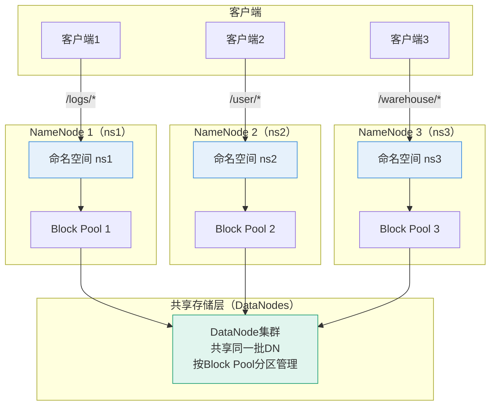
```mermaid
flowchart TB
    subgraph Client["客户端"]
        Client1[客户端1]
        Client2[客户端2]
        Client3[客户端3]
    end
    subgraph BlockPool["共享存储层（DataNodes）"]
        DNs[DataNode集群\n共享同一批DN\n按Block Pool分区管理]
    end
    subgraph NN1["NameNode 1（ns1）"]
        NN1_1[命名空间 ns1]
        BP1[Block Pool 1]
    end
    subgraph NN2["NameNode 2（ns2）"]
        NN2_1[命名空间 ns2]
        BP2[Block Pool 2]
    end
    subgraph NN3["NameNode 3（ns3）"]
        NN3_1[命名空间 ns3]
        BP3[Block Pool 3]
    end
    Client1 -->|"/logs/*"| NN1_1
    Client2 -->|"/user/*"| NN2_1
    Client3 -->|"/warehouse/*"| NN3_1
    NN1_1 --> BP1
    NN2_1 --> BP2
    NN3_1 --> BP3
    BP1 --> DNs
    BP2 --> DNs
    BP3 --> DNs
    style DNs fill:#e1f5ee,stroke:#1d9e75
    style NN1_1 fill:#e6f1fb,stroke:#378add
    style NN2_1 fill:#e6f1fb,stroke:#378add
    style NN3_1 fill:#e6f1fb,stroke:#378add
```

##### 1.1.6.3 核心概念详解

**命名空间（Namespace）**
- 由完整的目录树结构和所有文件/目录的元数据组成
- 支持完整的HDFS文件系统操作（create、delete、mkdir等）
- 每个命名空间之间完全隔离，独立管理

**块池（Block Pool）**

- 属于单个命名空间的一组Block
- 每个DataNode为集群中所有Block Pool提供存储
- Block Pool之间相互独立，互不干扰

**集群ID**

- 用于标识整个Federation集群
- 每个NameNode都有独立的标识符
- 配置在hdfs-site.xml中

**命名空间卷（Namespace Volume）**

- 由单个NameNode管理的命名空间 + 其Block Pool组成
- 是 Federation 中的基本管理单元
- 包含：命名空间元数据 + 数据块位置映射

##### 1.1.6.4 关键特性

| 特性 | 说明 |
|------|------|
| **命名空间隔离** | 不同业务/团队的目录结构完全隔离 |
| **横向扩展** | 增加NameNode即可扩展命名空间容量 |
| **共享存储** | 所有NameNode共享同一批DataNode，存储利用率高 |
| **独立管理** | 每个命名空间可独立配置副本策略、快照等 |
| **向后兼容** | 单NN集群可平滑升级为Federation架构 |

##### 1.1.6.5 单NN vs Federation对比

| 对比维度 | 单NameNode | Federation |
|---------|------------|------------|
| 命名空间 | 1个 | 多个（可配置） |
| NameNode | 1个 | 多个 |
| 内存需求 | 单NN内存决定上限 | 分散到多个NN |
| 文件数量 | 受限于单NN内存 | 多NN共同支撑 |
| 业务隔离 | 无（目录级隔离） | 命名空间级隔离 |
| 扩展方式 | 纵向（升级硬件） | 横向（增加NN） |
| 配置复杂度 | 简单 | 中等 |
| 兼容性 | - | 向后兼容 |

##### 1.1.6.6 适用场景

**建议使用Federation的场景：**
- 单集群DataNode数量超过5000+
- 单NN管理的文件数量超过1亿
- 需要为不同业务部门提供独立的命名空间
- 希望实现业务级别的资源隔离和配额管理
- 历史遗留的单NN集群需要扩容

**不需要Federation的场景：**

- 小规模集群（DN < 1000，文件 < 1000万）
- 单一业务使用，命名空间隔离需求不强
- 可通过HA满足可用性需求

##### 1.1.6.7 配置示例

**环境准备：3个NameNode组成的Federation集群**

**集群管理脚本（properties）**

```properties
- 集群ID
CLUSTERID=cluster-123
- NameNode 1（管理 /log 目录）
NN1_ID=ns1
NN1_ADDR=nn1-cluster:9000
NN1_HTTP=http://nn1-cluster:9870
- NameNode 2（管理 /user 目录）
NN2_ID=ns2
NN2_ADDR=nn2-cluster:9000
NN2_HTTP=http://nn2-cluster:9870
- NameNode 3（管理 /warehouse 目录）
NN3_ID=ns3
NN3_ADDR=nn3-cluster:9000
NN3_HTTP=http://nn3-cluster:9870
```

**配置示例：core-site.xml**

```xml
<configuration>
    <!-- Federation集群ID -->
    <property>
        <name>fs.defaultFS</name>
        <value>hdfs://${dfs.nameservices}</value>
    </property>
    <property>
        <name>dfs.nameservices</name>
        <value>ns1,ns2,ns3</value>
    </property>
</configuration>
```

**配置示例：hdfs-site.xml**

```xml
<configuration>
    <!-- ========== NameNode 1 (ns1) ========== -->
    <property>
        <name>dfs.namenode.rpc-address.ns1</name>
        <value>nn1-cluster:9000</value>
    </property>
    <property>
        <name>dfs.namenode.http-address.ns1</name>
        <value>nn1-cluster:9870</value>
    </property>
    <property>
        <name>dfs.namenode.name.dir.ns1</name>
        <value>/data/namenode/ns1</value>
    </property>
    <!-- ========== NameNode 2 (ns2) ========== -->
    <property>
        <name>dfs.namenode.rpc-address.ns2</name>
        <value>nn2-cluster:9000</value>
    </property>
    <property>
        <name>dfs.namenode.http-address.ns2</name>
        <value>nn2-cluster:9870</value>
    </property>
    <property>
        <name>dfs.namenode.name.dir.ns2</name>
        <value>/data/namenode/ns2</value>
    </property>
    <!-- ========== NameNode 3 (ns3) ========== -->
    <property>
        <name>dfs.namenode.rpc-address.ns3</name>
        <value>nn3-cluster:9000</value>
    </property>
    <property>
        <name>dfs.namenode.http-address.ns3</name>
        <value>nn3-cluster:9870</value>
    </property>
    <property>
        <name>dfs.namenode.name.dir.ns3</name>
        <value>/data/namenode/ns3</value>
    </property>
    <!-- ========== 共享配置 ========== -->
    <!-- DataNode同时向所有NameNode注册 -->
    <property>
        <name>dfs.datanode.ipc.address</name>
        <value>0.0.0.0:9866</value>
    </property>
    <property>
        <name>dfs.datanode.data.dir</name>
        <value>/data/dfs/data</value>
    </property>
</configuration>
```

**客户端配置（xml）**

```xml
<!-- 客户端访问特定命名空间 -->
<property>
    <name>fs.defaultFS</name>
    <value>hdfs://ns1:9000</value>
</property>
```

**命令行：HDFS Federation 运维命令**

```bash
# 1. 格式化 NameNode（联邦关键：所有NN使用相同ClusterID，不同命名空间）
# 首次格式化：指定集群ID + 命名空间，每个NN单独执行
hdfs namenode -format -clusterId cluster-123 -ns ns1

# 2. 集群启停命令
# 启动全集群服务（含所有NN/DN/JN）
start-all.sh
# 单独启动指定命名空间的 NameNode
hdfs --daemon start namenode -ns ns1

# 3. 集群状态查看
# 查看全集群数据节点、块、存储状态
hdfs dfsadmin -report
# 查看【指定联邦命名空间】的 NameNode 状态
hdfs dfsadmin -report -ns ns1

# 4. HDFS 数据均衡器（指定命名空间均衡）
# -threshold：磁盘使用率阈值10%；-ns：仅均衡ns1命名空间
hdfs balancer -threshold 10 -ns ns1

# 5. 安全模式（指定命名空间）
hdfs dfsadmin -safemode enter -ns ns1

# 6. 单NameNode升级至 Federation 联邦（迁移命令）
# 统一集群ID，分配独立命名空间，平滑升级
hdfs namenode -upgrade -clusterId cluster-123 -ns ns1
```

**Federation + HA组合部署**

Federation可以与HA结合使用，每个命名空间配置独立的HA：

**图：Federation HA架构图**

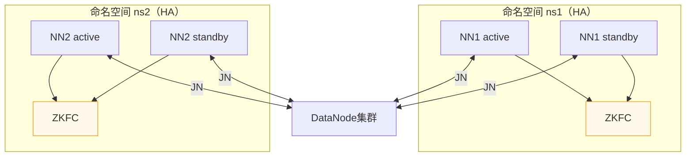
```mermaid
flowchart TB
    subgraph ns1["命名空间 ns1（HA）"]
        NN1_1[NN1 active]
        NN1_2[NN1 standby]
        ZK1[ZKFC]
    end
    subgraph ns2["命名空间 ns2（HA）"]
        NN2_1[NN2 active]
        NN2_2[NN2 standby]
        ZK2[ZKFC]
    end
    DNs[DataNode集群]
    NN1_1 <-->|JN| DNs
    NN2_1 <-->|JN| DNs
    NN1_2 <-->|JN| DNs
    NN2_2 <-->|JN| DNs
    NN1_1 --> ZK1
    NN1_2 --> ZK1
    NN2_1 --> ZK2
    NN2_2 --> ZK2
    style ZK1 fill:#fef9e8,stroke:#ef9f27
    style ZK2 fill:#fef9e8,stroke:#ef9f27
```

> **提示**：Federation解决了命名空间扩展问题，HA解决了单点故障问题。在生产环境中，建议Federation + HA组合使用，既保证扩展性，又保证高可用性。

#### 1.1.7 生产核心配置与运维命令

**配置示例：hdfs-site.xml**

```xml
<configuration>
    <!-- 块大小128M -->
    <property><name>dfs.blocksize</name><value>134217728</value></property>
    <!-- 副本数3 -->
    <property><name>dfs.replication</name><value>3</value></property>
    <!-- NN元数据目录 -->
    <property><name>dfs.namenode.name.dir</name><value>/data/dfs/name</value></property>
    <!-- DN数据目录 -->
    <property><name>dfs.datanode.data.dir</name><value>/data/dfs/data</value></property>
    <!-- HA启用 -->
    <property><name>dfs.ha.automatic-failover.enabled</name><value>true</value></property>
    <!-- 权限控制 -->
    <property><name>dfs.permissions.enabled</name><value>true</value></property>
</configuration>
```

**命令行：HDFS高频运维命令**

```bash
- 集群健康检查
hdfs dfsadmin -report
hdfs fsck / -files -blocks -locations
- 元数据合并
hdfs dfsadmin -saveNamespace
- 数据均衡（解决节点磁盘不均）
hdfs balancer -threshold 5
- 安全模式
hdfs dfsadmin -safemode get/enter/leave
- HA主备切换
hdfs haadmin -failover nn1 nn2 
```

### 1.2 YARN 资源调度平台

YARN = **资源管理 + 任务调度**
核心思想：**资源与应用解耦、通用资源平台、支持多框架**
YARN（Yet Another Resource Negotiator）是 Hadoop 2.0 引入的资源管理系统，它将资源管理和任务调度分离，使得 Hadoop 集群可以同时运行多种计算框架（MapReduce、Spark、Flink 等）。YARN 的核心设计理念是将资源管理的通用功能抽象出来，形成统一的资源管理平台，而具体的任务调度则交给各个应用自己管理，这种解耦设计极大地提升了 Hadoop 生态系统的灵活性和扩展性。

#### 1.2.1 核心架构组件

YARN 采用典型的主从架构设计，由一个全局的 ResourceManager 和多个节点级别的 NodeManager 组成。每个提交到 YARN 的应用都有一个专属的 ApplicationMaster 负责该应用的生命周期管理。这种架构设计实现了资源管理与应用管理的解耦，使得 YARN 可以同时支持多种计算框架。

**表：组件对照表**

| 组件                      | 核心职责                              | 生命周期                     | 详细说明                                                     |
| ------------------------- | ------------------------------------- | ---------------------------- | ------------------------------------------------------------ |
| **ResourceManager(RM)**   | 集群资源总管、调度器、应用管理器      | 常驻进程，HA双活             | RM是YARN的核心主节点，负责整个集群资源的统一管理和调度。它包含两个核心组件：Scheduler（调度器）负责资源分配，ApplicationsManager（应用管理器）负责应用提交、启动和监控。RM通过心跳机制与所有NM保持通信，实时掌握集群资源状态。 |
| **NodeManager(NM)**       | 节点资源管理、Container启停、监控上报 | 每节点常驻                   | NM是每个节点上的资源管理代理，负责向RM汇报本节点的资源使用情况（CPU、内存）和Container运行状态。NM还负责Container的启动、停止和资源隔离，通过心跳向RM发送节点状态信息。 |
| **ApplicationMaster(AM)** | 任务负责人、申请资源、启动Task、容错  | 每个任务一个，随任务结束销毁 | AM是每个应用专属的任务管理器，负责向RM申请资源、与NM通信启动Container、监控任务执行状态、处理任务失败重试等。不同计算框架有不同的AM实现（如MRAppMaster、Spark ApplicationMaster）。 |
| **Container**             | 资源隔离容器（CPU+内存）              | 动态创建销毁，任务运行载体   | Container是YARN中资源分配的基本单位，封装了CPU核数和内存大小。每个Container运行一个具体的任务进程，YARN通过Container实现资源隔离，防止任务之间相互干扰。 |

**图：YARN核心架构图**

```mermaid
flowchart TB
    subgraph 客户端层
        Client[客户端提交应用]
    end
    subgraph ResourceManager
        RM_Core[ResourceManager 主节点]
        Scheduler[Scheduler 调度器]
        ASM[ApplicationsManager]
    end
    subgraph NodeManager集群
        NM1[NodeManager1]
        NM2[NodeManager2]
        NM3[NodeManager3]
        NM1 --> C1[Container]
        NM1 --> C2[Container]
        NM2 --> C3[Container]
        NM2 --> C4[Container]
        NM3 --> C5[Container]
        NM3 --> C6[Container]
    end
    subgraph ApplicationMaster
        AM[ApplicationMaster]
    end
    Client -->|提交应用| RM_Core
    RM_Core --> Scheduler
    RM_Core --> ASM
    Scheduler -->|分配资源| NM1 & NM2 & NM3
    ASM -->|启动AM| AM
    AM -->|申请Container| Scheduler
    AM -->|启动Task| C1 & C2 & C3 & C4 & C5 & C6
    NM1 & NM2 & NM3 -->|心跳汇报| RM_Core
```

#### 1.2.2 三大调度器工作原理

YARN 提供了三种调度器来满足不同场景的资源调度需求：FIFO Scheduler（先进先出调度器）、Capacity Scheduler（容量调度器）和 Fair Scheduler（公平调度器）。每种调度器都有其独特的设计理念和适用场景，企业需要根据自身业务特点选择合适的调度器。

##### 1.2.2.1 FIFO 调度器（队列串行）

**工作原理详解**

FIFO（First In First Out）调度器是最简单的调度器实现，它采用先进先出的策略处理所有提交的应用程序。所有应用程序被提交到一个全局队列中，调度器按照提交顺序依次处理。当一个应用程序获得资源后，它会尽可能多地占用集群资源直到满足需求或集群资源耗尽，只有当前应用程序运行完成后，下一个应用程序才能开始获取资源。

**调度特点**

- **简单直观**：实现逻辑简单，无需复杂配置，适合快速部署和测试
- **无资源隔离**：所有应用共享同一队列，无法实现租户隔离
- **大任务阻塞**：大型作业会长时间占用集群资源，导致小任务长时间等待
- **资源利用率低**：无法充分利用集群资源，小任务无法在大任务间隙运行

**适用场景**

- 开发测试环境，快速验证功能
- 单用户、单任务场景
- 学习和理解 YARN 调度原理

**配置示例：FIFO调度器yarn-site.xml**

```xml
<configuration>
    <!-- 启用FIFO调度器 -->
    <property>
        <name>yarn.resourcemanager.scheduler.class</name>       
        <value>org.apache.hadoop.yarn.server.resourcemanager.scheduler.fifo.FifoScheduler</value>
    </property>
</configuration>
```

##### 1.2.2.2 Capacity Scheduler（容量调度器 - 生产首选）

**工作原理详解**

Capacity Scheduler 是 Yahoo 贡献给 Hadoop 社区的调度器，专为多租户环境设计。它采用**多队列硬隔离**的设计理念，将集群资源按比例分配给多个队列，每个队列可以配置最小资源保证和最大资源限制。这种设计确保了不同租户或业务线之间的资源隔离，即使某个队列的任务非常繁忙，也不会影响其他队列的资源使用。
Capacity Scheduler 的核心思想是"弹性借用"：当某个队列的资源使用率低于配置的最小容量时，其他队列可以临时借用这些空闲资源；当原队列需要资源时，调度器会回收借出的资源。这种机制在保证资源隔离的同时，最大化了集群资源利用率。

**调度特点**

- **多队列隔离**：支持多级队列结构，每个队列独立配置资源配额
- **资源保证**：每个队列配置最小资源保证，确保关键业务资源需求
- **弹性借用**：空闲资源可被其他队列临时借用，提高资源利用率
- **优先级支持**：支持应用级别优先级调度，高优先级应用优先获取资源
- **用户限制**：可配置单个用户在队列中的最大资源占比，防止单用户垄断资源

**队列层级结构**

Capacity Scheduler 支持多级队列结构，典型企业队列规划如下：

**YARN Capacity Scheduler 层级队列架构**

```text
root
├── prod（生产队列，60%资源）
│   ├── realtime（实时任务，30%）
│   └── batch（批处理任务，30%）
├── test（测试队列，20%资源）
│   ├── dev（开发环境，10%）
│   └── qa（测试环境，10%）
└── etl（ETL队列，20%资源）
    ├── incremental（增量ETL，15%）
    └── full（全量ETL，5%）
```

**配置示例：Capacity调度器capacity-scheduler.xml**

```xml
<configuration>
    <!-- root队列配置 -->
    <property>
        <name>yarn.scheduler.capacity.root.queues</name>
        <value>prod,test,etl</value>
        <description>定义root下的三个子队列</description>
    </property>
    <!-- prod队列配置：生产环境，分配60%资源 -->
    <property>
        <name>yarn.scheduler.capacity.root.prod.capacity</name>
        <value>60</value>
        <description>prod队列的最小容量百分比</description>
    </property>
    <property>
        <name>yarn.scheduler.capacity.root.prod.maximum-capacity</name>
        <value>80</value>
        <description>prod队列的最大容量百分比，允许弹性扩展到80%</description>
    </property>
    <property>
        <name>yarn.scheduler.capacity.root.prod.state</name>
        <value>RUNNING</value>
        <description>队列状态：RUNNING表示正常运行</description>
    </property>
    <property>
        <name>yarn.scheduler.capacity.root.prod.acl_submit_applications</name>
        <value>prod_user,prod_group</value>
        <description>允许提交应用的用户/组</description>
    </property>
    <!-- prod队列子队列配置 -->
    <property>
        <name>yarn.scheduler.capacity.root.prod.queues</name>
        <value>realtime,batch</value>
    </property>
    <property>
        <name>yarn.scheduler.capacity.root.prod.realtime.capacity</name>
        <value>50</value>
        <description>realtime占prod队列的50%</description>
    </property>
    <property>
        <name>yarn.scheduler.capacity.root.prod.batch.capacity</name>
        <value>50</value>
        <description>batch占prod队列的50%</description>
    </property>
    <!-- test队列配置：测试环境，分配20%资源 -->
    <property>
        <name>yarn.scheduler.capacity.root.test.capacity</name>
        <value>20</value>
    </property>
    <property>
        <name>yarn.scheduler.capacity.root.test.maximum-capacity</name>
        <value>40</value>
        <description>测试队列最大可扩展到40%</description>
    </property>
    <property>
        <name>yarn.scheduler.capacity.root.test.acl_submit_applications</name>
        <value>test_user,dev_group</value>
    </property>
    <!-- etl队列配置：ETL任务，分配20%资源 -->
    <property>
        <name>yarn.scheduler.capacity.root.etl.capacity</name>
        <value>20</value>
    </property>
    <property>
        <name>yarn.scheduler.capacity.root.etl.maximum-capacity</name>
        <value>50</value>
        <description>ETL任务可能需要更多资源，允许扩展到50%</description>
    </property>
    <!-- 用户限制配置 -->
    <property>
        <name>yarn.scheduler.capacity.root.prod.user-limit-factor</name>
        <value>1.5</value>
        <description>单用户最多可使用队列容量的1.5倍</description>
    </property>
    <!-- 资源计算方式 -->
    <property>
        <name>yarn.scheduler.capacity.resource-calculator</name>
        <value>org.apache.hadoop.yarn.util.resource.DominantResourceCalculator</value>
        <description>使用主导资源计算器，同时考虑CPU和内存</description>
    </property>
</configuration>
```

**表：Capacity调度器参数说明表**

| 参数名                                                       | 默认值  | 说明                                             |
| ------------------------------------------------------------ | ------- | ------------------------------------------------ |
| `yarn.scheduler.capacity.root.<queue>.capacity`              | 无      | 队列的最小容量百分比，保证队列至少获得这么多资源 |
| `yarn.scheduler.capacity.root.<queue>.maximum-capacity`      | 100     | 队列的最大容量百分比，限制队列最多使用的资源     |
| `yarn.scheduler.capacity.root.<queue>.state`                 | RUNNING | 队列状态：RUNNING（运行中）、STOPPED（已停止）   |
| `yarn.scheduler.capacity.root.<queue>.acl_submit_applications` | *       | 允许提交应用的用户/组列表，*表示所有用户         |
| `yarn.scheduler.capacity.root.<queue>.user-limit-factor`     | 1.0     | 单用户最多可使用队列容量的倍数                   |
| `yarn.scheduler.capacity.maximum-am-resource-percent`        | 0.1     | 集群中用于运行AM的最大资源百分比                 |
| `yarn.scheduler.capacity.maximum-applications`               | 10000   | 集群最大并行应用数                               |
| `yarn.scheduler.capacity.node-locality-delay`                | 40      | 调度本地性延迟次数，用于优化数据本地性           |

##### 1.2.2.3 Fair Scheduler（公平调度器）

**工作原理详解**

Fair Scheduler 是 Facebook 贡献给 Hadoop 社区的调度器，其核心设计理念是**公平共享**。与 Capacity Scheduler 的硬隔离不同，Fair Scheduler 让所有运行中的应用程序**公平地分享集群资源**。当只有一个应用运行时，它可以独占整个集群资源；当有多个应用同时运行时，资源会被平均分配给各个应用。
Fair Scheduler 采用动态资源分配策略，它会持续监控集群资源使用情况，并根据配置的权重动态调整资源分配。调度器还支持抢占机制（Preemption），当某个队列长期得不到公平资源时，可以从其他队列抢占Container。

**调度特点**

- **动态公平分配**：资源动态分配，无需预先配置固定比例
- **快速响应**：新提交的应用可以快速获得资源，适合交互式查询
- **权重支持**：可以为不同队列配置不同权重，实现差异化资源分配
- **抢占机制**：支持资源抢占，确保公平性
- **最小资源保证**：支持配置队列最小资源，保证关键业务

**适用场景**

- 交互式查询集群（Hive、Presto）
- 多用户共享集群
- 需要快速响应的临时查询场景
- 数据分析团队共享集群

**配置示例：Fair调度器fair-scheduler.xml**

```xml
<?xml version="1.0"?>
<allocations>
    <!-- 全局默认配置 -->
    <defaultQueueSchedulingPolicy>fair</defaultQueueSchedulingPolicy>
    <queueMaxAMShareDefault>0.5</queueMaxAMShareDefault>
    <queueMaxAppsDefault>100</queueMaxAppsDefault>
    <!-- prod队列：生产环境 -->
    <queue name="prod">
        <minResources>8192 mb, 8 vcores</minResources>
        <maxResources>65536 mb, 32 vcores</maxResources>
        <maxRunningApps>50</maxRunningApps>
        <weight>3.0</weight>
        <schedulingPolicy>fair</schedulingPolicy>
        <aclSubmitApps>prod_user,prod_group</aclSubmitApps>
        <aclAdminApps>prod_admin</aclAdminApps>
        <!-- prod子队列 -->
        <queue name="realtime">
            <minResources>4096 mb, 4 vcores</minResources>
            <weight>2.0</weight>
        </queue>
        <queue name="batch">
            <minResources>4096 mb, 4 vcores</minResources>
            <weight>1.0</weight>
        </queue>
    </queue>
    <!-- adhoc队列：即席查询 -->
    <queue name="adhoc">
        <minResources>2048 mb, 2 vcores</minResources>
        <maxResources>16384 mb, 8 vcores</maxResources>
        <weight>1.5</weight>
        <maxRunningApps>20</maxRunningApps>
        <allowPreemptionFrom>false</allowPreemptionFrom>
        <aclSubmitApps>analyst,analyst_group</aclSubmitApps>
    </queue>
    <!-- test队列：测试环境 -->
    <queue name="test">
        <minResources>1024 mb, 1 vcores</minResources>
        <maxResources>8192 mb, 4 vcores</maxResources>
        <weight>0.5</weight>
        <aclSubmitApps>*</aclSubmitApps>
    </queue>
    <!-- 用户限制配置 -->
    <user name="prod_user">
        <maxRunningApps>30</maxRunningApps>
    </user>
    <userMaxAppsDefault>10</userMaxAppsDefault>
    <!-- 抢占配置 -->
    <fairSharePreemptionTimeout>60</fairSharePreemptionTimeout>
    <defaultFairSharePreemptionTimeout>120</defaultFairSharePreemptionTimeout>
    <fairSharePreemptionThreshold>0.5</fairSharePreemptionThreshold>
</allocations>
```

**表：Fair调度器参数说明表**

| 参数名                       | 说明                                                         |
| ---------------------------- | ------------------------------------------------------------ |
| `minResources`               | 队列最小资源保证，格式为"内存 mb, CPU核数 vcores"            |
| `maxResources`               | 队列最大资源限制                                             |
| `weight`                     | 队列权重，权重越高获得的资源越多                             |
| `maxRunningApps`             | 队列最大并行应用数                                           |
| `schedulingPolicy`           | 调度策略：fair（公平）、fifo（先进先出）、drf（主导资源公平） |
| `allowPreemptionFrom`        | 是否允许从该队列抢占资源                                     |
| `aclSubmitApps`              | 允许提交应用的用户/组                                        |
| `fairSharePreemptionTimeout` | 公平份额抢占超时时间（秒）                                   |

##### 1.2.2.4 三大调度器全面对比

**表：三大调度器对照表**

| 对比维度         | FIFO Scheduler     | Capacity Scheduler     | Fair Scheduler           |
| ---------------- | ------------------ | ---------------------- | ------------------------ |
| **核心设计理念** | 先进先出，简单直接 | 多队列硬隔离，资源保证 | 动态公平分配，快速响应   |
| **资源隔离**     | 无隔离             | 强隔离（队列级别）     | 弱隔离（可配置最小资源） |
| **资源利用率**   | 低（大任务阻塞）   | 高（弹性借用机制）     | 高（动态分配）           |
| **响应速度**     | 慢（排队等待）     | 中等（队列隔离）       | 快（立即分配）           |
| **配置复杂度**   | 简单               | 中等（需配置队列层级） | 中等（需配置权重和策略） |
| **抢占机制**     | 不支持             | 支持（需开启）         | 支持（默认开启）         |
| **多租户支持**   | 不支持             | 完善支持               | 支持但较弱               |
| **适用场景**     | 测试环境、学习     | 生产环境、多租户集群   | 交互式查询、共享集群     |
| **企业采用率**   | 极低               | **最高（70%+）**       | 中等（20%+）             |
| **典型用户**     | 个人学习           | 金融、政企、大型互联网 | 数据分析团队、查询集群   |

**表：调度器选择决策表**

| 场景特征         | 推荐调度器         | 理由                   |
| ---------------- | ------------------ | ---------------------- |
| 多租户生产集群   | Capacity Scheduler | 强隔离保证，资源可预期 |
| 交互式查询集群   | Fair Scheduler     | 快速响应，动态分配     |
| 混合负载集群     | Capacity Scheduler | 可配置不同队列策略     |
| 单用户开发环境   | FIFO               | 简单配置，快速部署     |
| 实时+离线混合    | Capacity Scheduler | 队列隔离，互不影响     |
| 数据分析团队共享 | Fair Scheduler     | 公平共享，快速响应     |

#### 1.2.3 YARN 任务提交流程

YARN 的任务提交流程是一个精心设计的分布式协作过程，涉及客户端、ResourceManager、NodeManager、ApplicationMaster 和 Container 多个组件的协同工作。理解这个流程对于排查任务提交失败、资源分配异常等问题至关重要。

**完整提交流程步骤**

1. **Client 提交任务到 RM**：客户端向 ResourceManager 的 ApplicationsManager 提交应用程序，包含 ApplicationSubmissionContext（应用名称、优先级、队列、资源需求等）和 ContainerLaunchContext（启动命令、环境变量、依赖文件等）
2. **RM 分配一个 Container 启动 AM**：ResourceManager 验证应用合法性后，选择一个 NodeManager 分配第一个 Container，用于启动 ApplicationMaster
3. **AM 注册到 RM，向 RM 申请资源**：ApplicationMaster 启动后，首先向 ResourceManager 注册自己，然后根据应用需求计算所需资源，向 Scheduler 发送资源请求
4. **表：RM 调度空闲资源，返回 Container 列**：Scheduler 根据调度策略和资源可用性，为 ApplicationMaster 分配 Container，返回 Container 列表（包含节点地址、资源大小等）
5. **AM 连接对应 NM，启动 Container 执行 Task**：ApplicationMaster 收到 Container 列表后，与对应 NodeManager 通信，发送 ContainerLaunchContext 启动 Container
6. **Task 运行中向 AM 汇报进度/状态**：Container 内的任务进程定期向 ApplicationMaster 汇报执行进度、状态和计数器信息
7. **AM 向 RM 持续汇报应用状态**：ApplicationMaster 定期向 ResourceManager 发送心跳，汇报应用整体状态
8. **所有 Task 执行完成**：ApplicationMaster 检测到所有任务完成，开始清理工作
9. **AM 向 RM 注销，释放资源**：ApplicationMaster 向 ResourceManager 发送 FinishApplication 请求，注销自己
10. **RM 回收 Container，任务结束**：ResourceManager 回收所有资源，更新应用状态为 FINISHED

**图：Yarn任务提交时序图**

```mermaid
sequenceDiagram
    participant C as Client
    participant RM as ResourceManager
    participant NM as NodeManager
    participant AM as ApplicationMaster
    participant Container as Container/Task
    C->>RM: 1.提交应用程序
    RM->>RM: 2.验证应用、选择队列
    RM->>NM: 3.分配Container启动AM
    NM->>AM: 4.启动ApplicationMaster
    AM->>RM: 5.注册AM
    AM->>RM: 6.申请资源Container
    RM->>RM: 7.调度器分配资源
    RM->>AM: 8.返回Container列表
    AM->>NM: 9.请求启动Container
    NM->>Container: 10.启动Task进程
    Container->>AM: 11.汇报进度状态
    AM->>RM: 12.汇报应用状态
    Container->>AM: 13.任务完成
    AM->>RM: 14.注销应用
    RM->>RM: 15.回收资源
```

#### 1.2.4 核心机制

##### 1.2.4.1 Container 资源隔离机制

YARN 的 Container 是资源分配和隔离的基本单位，每个 Container 封装了特定数量的 CPU 核数和内存大小。理解 Container 的资源隔离机制对于优化集群资源利用和排查资源相关问题非常重要。

**资源隔离层次**

- **逻辑资源隔离**：YARN 默认只做逻辑资源隔离，即记录每个 Container 分配的 CPU 和内存配额，但不强制限制进程实际使用
- **物理资源隔离**：生产环境需要配合 Linux Cgroup 实现硬隔离，确保 Container 不会超用资源
- **内存隔离**：通过设置内存限制，当 Container 超过限制时会被强制杀死（OOM Kill）

**Container 生命周期**

1. **NEW**：Container 刚创建，等待分配资源
2. **LOCALIZED**：资源本地化完成（下载依赖文件）
3. **RUNNING**：Container 正在运行
4. **COMPLETE**：Container 执行完成
5. **EXITED_WITH_SUCCESS**：正常退出
6. **EXITED_WITH_FAILURE**：异常退出

**配置示例：Container资源隔离yarn-site.xml**

```xml
<configuration>
    <!-- 启用Linux Container Executor -->
    <property>
        <name>yarn.nodemanager.container-executor.class</name>
        <value>org.apache.hadoop.yarn.server.nodemanager.LinuxContainerExecutor</value>
    </property>
    <!-- Cgroup 配置 -->
    <property>
        <name>yarn.nodemanager.linux-container-executor.group</name>
        <value>hadoop</value>
    </property>
    <property>
        <name>yarn.nodemanager.linux-container-executor.path</name>
        <value>/hadoop/bin/container-executor</value>
    </property>
    <!-- CPU 资源隔离 -->
    <property>
        <name>yarn.nodemanager.resource.percentage-physical-cpu-limit</name>
        <value>80</value>
        <description>NodeManager可使用的物理CPU百分比</description>
    </property>
    <property>
        <name>yarn.nodemanager.cpu-resource-handler.enabled</name>
        <value>true</value>
    </property>
    <!-- 内存资源限制 -->
    <property>
        <name>yarn.nodemanager.resource.memory-mb</name>
        <value>65536</value>
        <description>节点总可用内存（MB）</description>
    </property>
    <property>
        <name>yarn.scheduler.minimum-allocation-mb</name>
        <value>1024</value>
        <description>Container最小内存分配单位</description>
    </property>
    <property>
        <name>yarn.scheduler.maximum-allocation-mb</name>
        <value>32768</value>
        <description>Container最大内存分配单位</description>
    </property>
    <!-- 内存监控 -->
    <property>
        <name>yarn.nodemanager.pmem-check-enabled</name>
        <value>true</value>
        <description>启用物理内存检查</description>
    </property>
    <property>
        <name>yarn.nodemanager.vmem-check-enabled</name>
        <value>true</value>
        <description>启用虚拟内存检查</description>
    </property>
    <property>
        <name>yarn.nodemanager.vmem-pmem-ratio</name>
        <value>2.1</value>
        <description>虚拟内存与物理内存比率</description>
    </property>
</configuration>
```

##### 1.2.4.2 ApplicationMaster 注册与资源申请机制

**图：AM完整生命周期流程图**

```mermaid
flowchart TB
    A[应用提交<br/>Client → RM] --> B[RM创建App<br/>返回AppId]
    B --> C[AM启动<br/>RM分配Container]
    C --> D[AM注册<br/>AM → RM]
    D --> E[资源请求<br/>AM → RM]
    E --> F[Container分配<br/>RM → NM]
    F --> G[启动Task<br/>NM启动Container]
    G --> H[进度汇报<br/>AM → RM/NM]
    H --> I{任务完成?}
    I -->|否| E
    I -->|是| J[AM注销<br/>AM → RM]
    J --> K[应用完成]
```

**AM注册详细流程**

ApplicationMaster启动后，需要向ResourceManager注册，建立心跳通信：

| 步骤 | 操作 | 说明 |
|------|------|------|
| 1 | AM启动 | 在Container中运行AM进程 |
| 2 | 创建AM协议 | 与RM建立RPC连接 |
| 3 | 注册请求 | AM向RM发送`registerApplicationMasterRequest` |
| 4 | 验证身份 | RM验证AM的Token和身份 |
| 5 | 注册响应 | RM返回`registerApplicationMasterResponse`（包含集群信息） |
| 6 | 心跳建立 | 定期心跳维持通信 |

**代码示例：YARN AM注册核心代码（Java）**

```java
// AM注册代码示例
public class MyAM extends ApplicationMaster {
    @Override
    public RegisterApplicationMasterResponse registerApplicationMaster(
            RegisterApplicationMasterRequest request) throws YarnException, IOException {
        RegisterApplicationMasterResponse response = 
            resourceManager.registerApplicationMasterRequest(request);
        // 获取RM返回的集群信息
        int maxMemory = response.getMaximumResourceCapability().getMemory();
        int maxCores = response.getMaximumResourceCapability().getVirtualCores();
        // 获取节点列表（用于数据本地化）
        List<NodeReport> clusterNodes = response.getClusterNodes();
        return response;
    }
}
```

**AM资源请求详解**

AM通过`ResourceRequest`向RM申请Container资源：

**图：AM资源请求流程图**

```mermaid
flowchart TB
    A[AM构造ResourceRequest] --> B[指定资源量<br/>Memory + VCores]
    B --> C[指定位置优先级<br/>Locality]
    C --> D[添加到请求列表]
    D --> E[发送给RM<br/>addContainerRequest]
```

**表：资源请求数据结构对照表**

| 字段 | 说明 | 示例 |
|------|------|------|
| `capability` | 资源规格 | Memory: 2GB, VCores: 2 |
| `priority` | 优先级 | 数字越小优先级越高 |
| `host` | 期望节点 | 精确匹配 |
| `rack` | 期望机架 | 机架级别匹配 |
| `relaxLocality` | 是否松弛本地性 | true/false |

**YARN 任务优先级**

```java
// 优先级定义（数字越小优先级越高）
// 通常：AM > MapTask > ReduceTask
Priority amPriority = Priority.newInstance(0);  // AM优先级最高
Priority mapPriority = Priority.newInstance(20); // MapTask中等
Priority reducePriority = Priority.newInstance(30); // ReduceTask较低
```

**多级本地化请求**

AM可以同时请求多个级别的资源分配位置：

**代码示例：**

```java
// 申请MapTask资源：优先节点级别，其次机架级别，最后任意节点
ResourceRequest req = Records.newRecord(ResourceRequest.class);
// 1. 优先在特定节点执行（数据本地化）
req.setResourceName("node1.cluster.com");  // 精确节点
req.setPriority(Priority.newInstance(20));
req.setCapability(Resources.createResource(2048, 1));
req.setNumContainers(1);
am.addContainerRequest(req);
// 2. 退而求其次：同机架任意节点
ResourceRequest rackReq = Records.newRecord(ResourceRequest.class);
rackReq.setResourceName("/rack/rack1");  // 机架级别
rackReq.setPriority(Priority.newInstance(20));
rackReq.setCapability(Resources.createResource(2048, 1));
rackReq.setNumContainers(5);
am.addContainerRequest(rackReq);
// 3. 最后：任意节点
ResourceRequest anyReq = Records.newRecord(ResourceRequest.class);
anyReq.setResourceName("*");  // 任意节点
anyReq.setPriority(Priority.newInstance(20));
anyReq.setCapability(Resources.createResource(2048, 1));
anyReq.setNumContainers(10);
am.addContainerRequest(anyReq);
```

**AM心跳与进度汇报**

AM通过心跳与RM保持通信，汇报任务进度：

**代码示例：AM心跳流程（Java）**

```java
// AM心跳流程
public class AMHeartbeatThread extends Thread {
    @Override
    public void run() {
        while (!isShutdown()) {
            try {
                // 1. 汇报进度
                progress = calculateProgress();
                // 2. 汇报Container状态
                for (ContainerId id : runningContainers) {
                    ContainerStatus status = nm.getContainerStatus(id);
                    // 上报完成/失败的Container
                }
                // 3. 发送心跳请求
                AllocateResponse response = rmClient.allocate(
                    previousResponseId++, 
                    progress, 
                    new ArrayList<>(), 
                    new ArrayList<>()
                );
                // 4. 处理RM响应（分配的新Container）
                for (Container container : response.getAllocatedContainers()) {
                    launchContainer(container);
                }
                // 5. 处理回收的Container
                for (ContainerStatus status : response.getCompletedContainersStatuses()) {
                    handleCompletedContainer(status);
                }
                Thread.sleep(heartbeatInterval);
            } catch (Exception e) {
                handleError(e);
            }
        }
    }
}
```

**图：AM生命周期状态图**

```mermaid
stateDiagram-v2
    [*] --> SUBMITTED : 客户端提交应用
    SUBMITTED --> ACCEPTED : RM接收并准入
    ACCEPTED --> ALLOCATED : 分配Container启动AM
    ALLOCATED --> RUNNING : AM向RM注册成功
    RUNNING --> RUNNING : 心跳上报+申请资源/运行任务
    RUNNING --> FINISHED : 所有任务正常完成
    RUNNING --> FAILED   : AM/任务运行异常失败
    RUNNING --> KILLED   : 手动终止/资源抢占被杀
    FINISHED --> [*]
    FAILED --> [*]
    KILLED --> [*]
```

**表：AM与RM通信协议对照表**

| 协议 | 方向 | 方法 |
|------|------|------|
| **ApplicationMasterProtocol** | AM→RM | registerApplicationMaster, allocate, finishApplicationMaster |
| **ContainerManagementProtocol** | AM→NM | startContainer, stopContainer, getContainerStatus |
| **ResourceTracker** | NM→RM | registerNodeManager, nodeHeartbeat |

1. 生产调优参数

**yarn调优（xml）**

```xml
<configuration>
    <!-- AM心跳间隔 -->
    <property>
        <name>yarn.am.liveness-monitor.expiry-interval-ms</name>
        <value>600000</value>
        <description>AM超时时间，默认10分钟</description>
    </property>
    <!-- AM最大重试次数 -->
    <property>
        <name>yarn.resourcemanager.am.max-attempts</name>
        <value>4</value>
        <description>AM最大重试次数</description>
    </property>
    <!-- AM内存限制 -->
    <property>
        <name>yarn.am.resource.memory-mb</name>
        <value>1536</value>
        <description>AM容器内存大小</description>
    </property>
    <!-- AM vcores限制 -->
    <property>
        <name>yarn.am.resource.vcores</name>
        <value>2</value>
        <description>AM容器虚拟CPU核数</description>
    </property>
    <!-- NM心跳间隔 -->
    <property>
        <name>yarn.nodemanager.liveness-monitor.expiry-interval-ms</name>
        <value>600000</value>
        <description>NM超时时间</description>
    </property>
</configuration>
```

2. 容错机制（生产高可用）

YARN 提供了完善的容错机制，确保在组件故障时集群仍能正常运行，任务不会丢失。

- **ResourceManager 容错**
  **HA 高可用**：支持 Active/Standby 双节点部署，通过 ZooKeeper 实现自动故障转移
  **状态持久化**：RM 状态存储在 ZooKeeper 或 HDFS 中，Standby RM 可以恢复状态
  **自动切换**：Active RM 故障时，Standby RM 自动接管，客户端无感知
- **ApplicationMaster 容错**
  **自动重启**：AM 失败后，RM 会重新分配 Container 启动新的 AM
  **最大重试次数**：可配置 AM 最大重试次数，默认 2 次
  **状态恢复**：AM 重启后可以从检查点恢复任务状态
- **Task 容错**
  **失败重试**：Task 失败后自动重试，默认重试 2 次
  **换节点执行**：重试时可能调度到其他节点执行
  **黑名单机制**：多次失败的节点会被加入黑名单
- **NodeManager 容错**
  **心跳超时检测**：NM 心跳超时（默认 10 分钟）被标记为死亡
  **任务迁移**：死亡 NM 上的任务被迁移到其他节点重新执行
  **资源回收**：死亡 NM 的资源被回收，重新参与调度

**NodeManager容错配置**

**配置示例：yarn-site.xml**

```xml
<configuration>
    <!-- RM HA 配置 -->
    <property>
        <name>yarn.resourcemanager.ha.enabled</name>
        <value>true</value>
    </property>
    <property>
        <name>yarn.resourcemanager.cluster-id</name>
        <value>yarn-cluster</value>
    </property>
    <property>
        <name>yarn.resourcemanager.ha.rm-ids</name>
        <value>rm1,rm2</value>
    </property>
    <property>
        <name>yarn.resourcemanager.hostname.rm1</name>
        <value>hadoop01</value>
    </property>
    <property>
        <name>yarn.resourcemanager.hostname.rm2</name>
        <value>hadoop02</value>
    </property>
    <!-- ZK 配置 -->
    <property>
        <name>yarn.resourcemanager.zk-address</name>
        <value>zk1:2181,zk2:2181,zk3:2181</value>
    </property>
    <!-- AM 重试配置 -->
    <property>
        <name>yarn.resourcemanager.am.max-attempts</name>
        <value>4</value>
        <description>AM最大重试次数</description>
    </property>
    <!-- Task 重试配置 -->
    <property>
        <name>mapreduce.map.maxattempts</name>
        <value>4</value>
    </property>
    <property>
        <name>mapreduce.reduce.maxattempts</name>
        <value>4</value>
    </property>
    <!-- NM 心跳超时 -->
    <property>
        <name>yarn.resourcemanager.nm.liveness-monitor.expiry-interval-ms</name>
        <value>600000</value>
        <description>NM心跳超时时间（毫秒）</description>
    </property>
</configuration>
```

3. 日志聚合机制

YARN 任务日志默认分散在各个 NodeManager 的本地磁盘上，任务完成后难以查看和排查问题。日志聚合机制可以将任务日志自动上传到 HDFS 集中存储，便于统一查看和持久化保存。

4. 日志聚合流程

- 任务运行时，日志写入 NodeManager 本地目录
- 任务完成后，NodeManager 将日志打包上传到 HDFS
- 用户通过 `yarn logs` 命令查看聚合后的日志
- 日志保留期到期后自动清理

5. 日志聚合配置

**配置示例：yarn-site.xml**

```xml
<configuration>
    <!-- 启用日志聚合 -->
    <property>
        <name>yarn.log-aggregation-enable</name>
        <value>true</value>
    </property>
    <!-- 日志保留时间（秒），7天 = 604800秒 -->
    <property>
        <name>yarn.log-aggregation.retain-seconds</name>
        <value>604800</value>
    </property>
    <!-- 日志聚合检查间隔（秒） -->
    <property>
        <name>yarn.log-aggregation.retain-check-interval-seconds</name>
        <value>3600</value>
    </property>
    <!-- 日志存储路径 -->
    <property>
        <name>yarn.nodemanager.remote-app-log-dir</name>
        <value>/yarn/logs</value>
    </property>
    <!-- 日志聚合线程数 -->
    <property>
        <name>yarn.nodemanager.log-aggregation.compressed-size-limit-bytes</name>
        <value>10485760</value>
        <description>单个日志文件压缩后最大大小</description>
    </property>
</configuration>
```

#### 1.2.5 生产核心配置

**配置示例：yarn-site.xml**

```xml
<configuration>
    <!-- ========== ResourceManager 配置 ========== -->
    <!-- RM 地址 -->
    <property>
        <name>yarn.resourcemanager.address</name>
        <value>hadoop01:8032</value>
    </property>
    <property>
        <name>yarn.resourcemanager.scheduler.address</name>
        <value>hadoop01:8030</value>
    </property>
    <property>
        <name>yarn.resourcemanager.webapp.address</name>
        <value>hadoop01:8088</value>
    </property>
    <!-- 使用容量调度器 -->
    <property>
        <name>yarn.resourcemanager.scheduler.class</name>
        <value>org.apache.hadoop.yarn.server.resourcemanager.scheduler.capacity.CapacityScheduler</value>
    </property>
    <!-- ========== NodeManager 配置 ========== -->
    <!-- NM 总内存 64G -->
    <property>
        <name>yarn.nodemanager.resource.memory-mb</name>
        <value>65536</value>
    </property>
    <!-- NM 总 CPU 16 核 -->
    <property>
        <name>yarn.nodemanager.resource.cpu-vcores</name>
        <value>16</value>
    </property>
    <!-- Container 资源分配范围 -->
    <property>
        <name>yarn.scheduler.minimum-allocation-mb</name>
        <value>1024</value>
        <description>Container最小内存1GB</description>
    </property>
    <property>
        <name>yarn.scheduler.maximum-allocation-mb</name>
        <value>32768</value>
        <description>Container最大内存32GB</description>
    </property>
    <property>
        <name>yarn.scheduler.minimum-allocation-vcores</name>
        <value>1</value>
    </property>
    <property>
        <name>yarn.scheduler.maximum-allocation-vcores</name>
        <value>8</value>
    </property>
    <!-- ========== 日志聚合配置 ========== -->
    <property>
        <name>yarn.log-aggregation-enable</name>
        <value>true</value>
    </property>
    <property>
        <name>yarn.log-aggregation.retain-seconds</name>
        <value>604800</value>
        <description>日志保留7天</description>
    </property>
    <!-- ========== 资源隔离配置 ========== -->
    <property>
        <name>yarn.nodemanager.linux-container-executor.group</name>
        <value>hadoop</value>
    </property>
    <!-- ========== 辅助服务配置 ========== -->
    <property>
        <name>yarn.nodemanager.aux-services</name>
        <value>mapreduce_shuffle,spark_shuffle</value>
    </property>
    <property>
        <name>yarn.nodemanager.aux-services.mapreduce_shuffle.class</name>
        <value>org.apache.hadoop.mapred.ShuffleHandler</value>
    </property>
    <property>
        <name>yarn.nodemanager.aux-services.spark_shuffle.class</name>
        <value>org.apache.spark.network.yarn.YarnShuffleService</value>
    </property>
</configuration>
```

#### 1.2.6 运维命令与日志查看

YARN 提供了丰富的命令行工具用于集群管理和任务运维，熟练掌握这些命令是大数据运维工程师的基本功。

**常用运维命令**

**命令行：YARN 应用生命周期管理**

```bash
# 1. 查看集群中所有应用（包含所有状态）
yarn application -list

# 2. 过滤查看指定状态的应用
# 支持状态：RUNNING/ACCEPTED/FINISHED/FAILED/KILLED
yarn application -list -appStates RUNNING,ACCEPTED

# 3. 杀死指定运行中的应用
# 参数为应用ID（application_1234567890_0001）
yarn application -kill application_1234567890_0001

# 4. 查看指定应用的状态详情
# 包含队列、用户、启动时间、跟踪URL等信息
yarn application -status application_1234567890_0001
```

**命令行：YARN队列管理**

```bash

# 查看所有队列

yarn queue -list

# 查看指定队列状态（支持层级队列 root.prod）

yarn queue -status root.prod
```

**命令行：YARN节点管理**

```bash
# 查看所有节点（包括失活/异常）

yarn node -list -all

# 查看指定节点详细状态

yarn node -status node01:8041
```

**命令行：YARN RM HA 管理**

```bash
# 查看 RM 角色状态（active / standby）

yarn rmadmin -getServiceState rm1

# 手动切换 RM 状态（需关闭自动 failover）

yarn rmadmin -transitionToStandby rm1
yarn rmadmin -transitionToActive rm2
```

**YARN日志查看**

```bash
# 查看应用聚合日志

yarn logs -applicationId application_1234567890_0001

# 查看指定容器日志

yarn logs -applicationId application_1234567890_0001 -containerId container_1234567890_0001_01_000001

# 导出日志到本地文件

yarn logs -applicationId application_1234567890_0001 > app_logs.txt
```

**命令行：YARN调度器管理**

```bash
# 刷新队列配置（修改 capacity-scheduler.xml 后执行）

yarn rmadmin -refreshQueues

# 刷新节点列表（新增/下线节点后执行）

yarn rmadmin -refreshNodes
```

**YARN集群信息**

```bash
# 查看 YARN 版本

yarn version

# 查看 YARN 配置

yarn conf
```

**YARN Web UI界面说明图**

YARN Web UI 是集群监控和任务管理的重要工具，默认访问地址为 `http://resourcemanager:8088`。主要功能包括 ：

- **Cluster**：集群概览，显示资源使用情况、节点列表
- **Applications**：应用列表，可按状态、队列、用户筛选
- **Scheduler**：调度器信息，显示队列层级和资源分配
- **Nodes**：节点列表，显示各节点资源使用和健康状态
- **Tools**：工具集，包括日志聚合、配置查看等

### 1.3 MapReduce 分布式计算框架

MapReduce 是 Hadoop 原生**离线分布式批计算引擎**，核心思想：**分而治之、移动计算不移动数据、磁盘迭代计算**。

定位：**大数据计算鼻祖**，目前多用于**历史数据归档、简单ETL、老旧系统兼容**，实时性差但**稳定性/容错性拉满**。

#### 1.3.1 核心编程模型

**基础定义**
MapReduce 仅处理 **<key, value> 键值对**，全程无其他数据格式；
完整执行链路：**Input → Map → Shuffle → Reduce → Output**
其中 **Shuffle 是灵魂**，也是面试/优化核心。

**表：编程模型对照表**

| 阶段            | 核心作用                     | 输入数据               | 输出数据               | 执行位置                   |
| --------------- | ---------------------------- | ---------------------- | ---------------------- | -------------------------- |
| **Map阶段**     | 数据切片、局部处理、数据打散 | <k1,v1> 原始切片       | <k2,v2> 中间结果       | DataNode本地（数据本地化） |
| **Shuffle阶段** | 分区、排序、合并、拉取       | <k2,v2> 局部结果       | <k2,list(v2)> 分组数据 | 内存+磁盘混合              |
| **Reduce阶段**  | 全局聚合、最终计算           | <k2,list(v2)> 分组数据 | <k3,v3> 最终结果       | 随机节点                   |

**图：编程模型流程图**

```mermaid
flowchart LR
    A[HDFS文件] --> B[InputFormat 切片]
    B --> C[MapTask 局部处理]
    C --> D[Shuffle 分区排序合并]
    D --> E[ReduceTask 全局聚合]
    E --> F[OutputFormat 写入HDFS]
```

#### 1.3.2 核心架构与组件角色

MapReduce 无独立进程，**完全依赖 YARN 调度**，核心运行时组件：
1. **MRAppMaster**：MapReduce 专属 AM，负责任务调度、容错、进度监控
2. **MapTask**：并行处理切片数据，**一个切片对应一个MapTask**
3. **ReduceTask**：全局聚合，数量由用户手动指定，默认1个
4. **InputFormat/OutputFormat**：数据读写格式化组件，默认 TextInputFormat

#### 1.3.3 全流程执行机制

**前置规则**
- 切片大小 = 块大小（默认128M），**切片是逻辑划分，不存储数据**
- 数据本地化：MapTask 优先运行在数据所在 DataNode，减少网络IO
- ReduceTask 必须等**所有MapTask执行完成**才开始执行

**分步执行全链路**

1. **客户端提交作业**：校验输入输出路径、打包Jar、提交给 YARN RM
2. **RM 启动 MRAppMaster**：分配Container，启动MapReduce专属AM
3. **AM 申请切片信息**：向 HDFS NN 获取文件切片数量、位置
4. **AM 申请资源**：向 RM 申请 Container，优先申请数据所在节点
5. **启动 MapTask**：NM 启动 Container，执行 MapTask 本地计算
6. **Map 写出数据**：数据写入**内存缓冲区**，不直接写磁盘
7. **溢写与分区排序**：缓冲区满80%，**溢写磁盘**，同时分区、排序
8. **Map端合并**：多个溢写文件合并为**一个有序文件**
9. **Reduce 拉取数据**：ReduceTask 拉取所有MapTask的对应分区数据
10. **Reduce端合并排序**：拉取的数据合并、排序，形成分组数据
11. **Reduce 聚合计算**：执行用户自定义 reduce 逻辑，全局聚合
12. **结果写入HDFS**：OutputFormat 将最终结果写入 HDFS，任务结束

**图：执行流程时序图**

```mermaid
sequenceDiagram
    participant Client
    participant YARN_RM
    participant MRAppMaster
    participant HDFS_NN
    participant NodeManager
    participant MapTask
    participant ReduceTask
    Client->>YARN_RM: 1.提交MR作业
    YARN_RM->>NodeManager: 2.启动MRAppMaster
    MRAppMaster->>HDFS_NN: 3.获取文件切片信息
    MRAppMaster->>YARN_RM: 4.申请MapTask资源
    YARN_RM->>NodeManager: 5.分配Container
    NodeManager->>MapTask: 6.启动MapTask本地计算
    MapTask->>MapTask: 7.内存溢写+分区排序
    MapTask->>MapTask: 8.合并溢写文件
    MRAppMaster->>ReduceTask: 9.通知拉取数据
    ReduceTask->>MapTask: 10.拉取分区数据+合并排序
    ReduceTask->>ReduceTask: 11.执行reduce聚合逻辑
    ReduceTask->>HDFS_NN: 12.写入最终结果
```

#### 1.3.4 灵魂核心：Shuffle 全机制

Shuffle = **Map端Shuffle + Reduce端Shuffle**，是MR性能瓶颈的核心，也是优化重点。

**Map 端 Shuffle：**

1. **内存缓冲区**：默认 100MB，环形缓冲区，阈值80%溢写
1. **分区（Partition）**：按 key 哈希分区，保证相同key进入同一个Reduce
1. **排序（Sort）**：对缓冲区数据按 key 字典序排序
1. **溢写（Spill）**：批量写入磁盘，生成小文件
1. **合并（Merge）**：多个小文件合并为**一个大的有序文件**

**Reduce 端 Shuffle：**

1. **拉取（Fetch）**：HTTP 拉取所有MapTask的对应分区数据
1. **内存合并**：数据优先存入内存，满了溢写磁盘
1. **磁盘合并**：所有文件合并为**分组有序数据**
1. **分组（Group）**：相同key的value聚合为 list 集合

**图：Shuffle核心流程图**

```mermaid
flowchart TB
    subgraph Map端Shuffle
        A[Map输出] --> B[环形缓冲区]
        B --> C{达到80%阈值}
        C -->|是| D[分区+排序]
        D --> E[溢写磁盘小文件]
        E --> F[合并为有序大文件]
    end
    subgraph Reduce端Shuffle
        G[HTTP拉取数据] --> H[内存+磁盘合并]
        H --> I[分组排序]
        I --> J[Reduce输入]
    end
    F --> G
```

#### 1.3.5 Combiner 与 Partitioner 核心机制

##### 1.3.5.1 Combiner 规约器

**核心定位**

Combiner（规约器）是Map端本地的Reduce，它在MapTask输出后、溢写磁盘前对数据进行局部聚合。Combiner的作用是**减少网络传输的数据量**，从而提升整体Job性能。

**为什么需要Combiner？**

以WordCount为例，Map阶段输出大量 `<word, 1>` 键值对：

**Map输出**

```text
Map输出: <"hello", 1>, <"hello", 1>, <"world", 1>, <"hello", 1>, <"world", 1>, <"hello", 1>...
```

如果不使用Combiner，这些数据全部需要通过网络传输到Reduce端。

使用Combiner后，在Map端先进行局部聚合：

**Combiner输出**

```text
Combiner输出: <"hello", 3>, <"world", 2>
```

网络传输量大幅减少！

**图：Combiner执行时机流程图**

```mermaid
flowchart LR
    A[Map输出] --> B[Combiner局部聚合]
    B --> C[溢写磁盘]
    C --> D[Merge合并]
    D --> E[Reduce拉取]
    E --> F[Reduce全局聚合]
```

| 执行位置 | 执行次数 | 处理范围 |
|---------|---------|---------|
| MapTask内 | 每个溢写文件执行一次 | 当前MapTask产生的局部数据 |
| Merge时 | 合并溢写文件时执行 | 同一MapTask的所有数据 |

**表：Combiner vs Reduce 对比**

| 对比维度 | Combiner | Reduce |
|---------|-----------|--------|
| **执行位置** | MapTask本地 | 随机节点 |
| **输入数据** | 当前MapTask的输出 | 所有MapTask的输出 |
| **输出数据** | 局部聚合结果 | 最终结果（写入HDFS） |
| **执行次数** | 多次（每溢写一次） | 一次（最终执行） |
| **必须性** | 可选 | 必需 |

**表：使用约束：必须满足结合律**

Combiner必须是**纯函数**，满足**交换律和结合律**：

**代码示例：Combiner满足结合律的语法（Java）**

```java
// ==============================
// ✅ 正确的 Combiner（满足**结合律**，生产推荐）
// 数学结合律：(a + b) + c = a + (b + c)
// 适用场景：求和、计数、最大值、最小值
// ==============================
public class IntSumReducer extends Reducer<Text, IntWritable, Text, IntWritable> {
    @Override
    public void reduce(Text key, Iterable<IntWritable> values, Context context) 
            throws IOException, InterruptedException {
        // 局部求和（Map端聚合，减少Shuffle数据量）
        int sum = 0;
        for (IntWritable val : values) {
            sum += val.get();
        }
        context.write(key, new IntWritable(sum));
    }
}

// ==============================
// ❌ 错误的 Combiner（不满足结合律，禁止使用）
// 数学规律：avg(avg(a,b), c) ≠ avg(a,b,c)
// 适用场景：求平均值、求中位数 等 不满足结合律的计算
// ==============================
// 示例：求平均值
// 数据：1,2,3,6 
// 局部聚合：avg(1,2)=1.5  avg(3,6)=4.5 → 最终avg=3
// 全局聚合：avg(1,2,3,6)=3 （巧合相等）
// 数据：1,2,3 → 局部avg(1,2)=1.5 → 最终avg(1.5,3)=2.25
// 全局正确值：2 → 结果错误！
public class AverageCombiner { 
    // 逻辑错误，无法作为Combiner使用
}
```


**表：常见的正确Combiner使用场景对照表**

| 场景 | Map输出 | Combiner聚合 | Reduce最终 |
|------|--------|-------------|-----------|
| WordCount | `<word, 1>` | `<word, n>` | `<word, total>` |
| 求和统计 | `<id, value>` | `<id, sum>` | `<id, total>` |
| 最大/最小值 | `<key, value>` | `<key, max/min>` | `<key, max/min>` |
| 去重统计 | `<key, item>` | `<key, set>` | `<key, union>` |

**代码示例：Combiner两种方法（Java）**

```java
// 方法1：使用与Reduce相同的类作为Combiner
job.setCombinerClass(WordCountReducer.class);

// 方法2：自定义专门用于Map端聚合的Combiner
job.setCombinerClass(LocalAggregator.class);
```

**代码示例：Combiner自定义（Java）**

```java
// 自定义Combiner示例
public class LocalSumCombiner extends Reducer<Text, IntWritable, Text, IntWritable> {
    @Override
    protected void reduce(Text key, Iterable<IntWritable> values, Context context) 
            throws IOException, InterruptedException {
        // 局部聚合逻辑
        int sum = 0;
        for (IntWritable val : values) {
            sum += val.get();
        }
        // 输出聚合后的结果
        context.write(key, new IntWritable(sum));
    }
}
```

##### 1.3.5.2 Partitioner 分区器

**核心定位**

Partitioner（分区器）决定每条记录被分配到哪个ReduceTask。**默认使用HashPartitioner**，通过 `key.hashCode() % numReduceTasks` 进行分区。

**图：分区流程图**

```mermaid
flowchart TB
    A["Map输出\<K, V\>"] --> B["Partitioner 分区器"]
    B --> C{"计算分区号\<br\>key.hashCode() % numReduceTasks}"}
    C -->|"0"| R1["ReduceTask 0"]
    C -->|"1"| R2["ReduceTask 1"]
    C -->|"2"| R3["ReduceTask 2"]
    C -->|"n-1"| Rn["ReduceTask n-1"]
```

**代码示例：默认HashPartitioner实现（Java）**

```java
public class HashPartitioner<K, V> extends Partitioner<K, V> {
    public int getPartition(K key, V value, int numPartitions) {
        // 关键公式: hash(key) & Integer.MAX_VALUE % numPartitions
        // & Integer.MAX_VALUE 确保结果为正数
        return (key.hashCode() & Integer.MAX_VALUE) % numPartitions;
    }
}
```

**分区号计算**

假设有3个ReduceTask：

| Key | hashCode() | hashCode() & 0x7FFFFFFF | Partition = hash % 3 |
|-----|------------|------------------------|---------------------|
| "hello" | 99162322 | 99162322 | 99162322 % 3 = 1 |
| "world" | 113318802 | 113318802 | 113318802 % 3 = 0 |
| "hadoop" | 2985494 | 2985494 | 2985494 % 3 = 2 |
| "spark" | -2095558668 | 2209409628 | 2209409628 % 3 = 0 |

**表：自定义Partitioner场景**

**表：场景1：按业务字段分区**

**代码示例：按地区分区（Java）**

```java
public class AreaPartitioner extends Partitioner<Text, Text> {
    // 地区代码映射
    private static Map<String, Integer> AREA_MAP = new HashMap<>();
    static {
        AREA_MAP.put("beijing", 0);
        AREA_MAP.put("shanghai", 0);  // 华北区
        AREA_MAP.put("guangzhou", 1);
        AREA_MAP.put("shenzhen", 1);  // 华南区
        AREA_MAP.put("chengdu", 2);
        AREA_MAP.put("chongqing", 2); // 西南区
    }
    @Override
    public int getPartition(Text key, Text value, int numPartitions) {
        String areaCode = key.toString().split("_")[0];
        Integer partition = AREA_MAP.get(areaCode);
        return partition != null ? partition : (areaCode.hashCode() % numPartitions);
    }
}
```

**场景2：按时间范围分区**

**代码示例：按月份分区（Java）**

```java
public class TimeRangePartitioner extends Partitioner<Text, Text> {
    @Override
    public int getPartition(Text key, Text value, int numPartitions) {
        // key格式: yyyyMMddHH
        String dateStr = key.toString().substring(0, 8);
        int date = Integer.parseInt(dateStr);
        // 按月份分区
        int month = (date / 100) % 100;
        return month % numPartitions;
    }
}
```

**配置自定义Partitioner**

**代码示例：自定义分区（Java）**

```java
Job job = Job.getInstance(conf);
// 设置自定义Partitioner
job.setPartitionerClass(AreaPartitioner.class);
// 设置ReduceTask数量（必须与分区数匹配或更大）
job.setNumReduceTasks(3);  // 华北、华南、西南三个分区
```

**分区数与ReduceTask数的关系**

| 情况 | 结果 |
|------|------|
| 分区数 < ReduceTask数 | 多余的ReduceTask空跑，无数据处理 |
| 分区数 = ReduceTask数 | 一对一映射，正常执行 |
| 分区数 > ReduceTask数 | 部分不同分区的数据会进入同一Reduce |
> **警告**：如果自定义Partitioner返回的分区号 >= numReduceTasks，会导致数据丢失！

**代码示例：自定义分区问题代码&正确代码（Java）**

```java
// ❌ 错误：partition可能超出范围
return key.hashCode() % numPartitions;  // 如果key.hashCode()为负数，结果可能为负
// ✅ 正确：确保partition始终为正数
return (key.hashCode() & Integer.MAX_VALUE) % numPartitions;
```

**表：内置Partitioner类型对照表**

| Partitioner | 说明 |
|------------|------|
| HashPartitioner | 默认，按key哈希分区 |
| BinaryPartitioner | 按二进制范围分区 |
| RangePartitioner | 按key范围分区（需要key可比较） |

##### 1.3.5.3 Combiner与Partitioner协同工作

**图：完整数据流程图**

```mermaid
flowchart TB
    subgraph MapTask
        A[Map输出] --> B[Partitioner分区]
        B --> C[Combiner局部聚合]
        C --> D[环形缓冲区]
        D --> E[溢写磁盘]
        E --> F[Merge合并]
    end
    subgraph 网络传输
        F --> G[Shuffle拉取]
    end
    subgraph ReduceTask
        G --> H[合并排序]
        H --> I[Reduce全局聚合]
        I --> J[OutputFormat输出]
    end
```

**执行顺序**
1. Map输出 `<K, V>`
2. Partitioner决定分区：`partition = getPartition(K, V, numPartitions)`
3. Combiner对同分区的数据进行局部聚合
4. 数据进入环形缓冲区
5. 溢写、合并到磁盘
6. ReduceTask通过网络拉取对应分区的数据
7. Reduce进行全局聚合

**代码示例：（Java）**

```java
// 初始化MapReduce作业
Job job = Job.getInstance(conf);
// 设置作业名称
job.setJobName("SalesAnalytics");

// ======================
// Mapper 配置
// ======================
job.setMapperClass(SalesMapper.class);
// Mapper输出Key类型：地区（Text）
job.setMapOutputKeyClass(Text.class);
// Mapper输出Value类型：自定义销售实体Bean（必须实现Writable序列化）
job.setMapOutputValueClass(SalesBean.class);

// ======================
// 核心进阶配置
// ======================
// 自定义分区器：按地区将数据分流到不同ReduceTask
job.setPartitionerClass(AreaPartitioner.class);
// 自定义Combiner：Map端本地预聚合（求和，满足结合律）
job.setCombinerClass(AreaSumCombiner.class);

// ======================
// Reducer 配置
// ======================
job.setReducerClass(SalesReducer.class);
// ReduceTask数量 = 自定义分区数量（华北/华南/华东/西部 → 4个分区）
// 核心原则：分区数 = ReduceTask数
job.setNumReduceTasks(4);

// ======================
// 输入输出格式配置
// ======================
// 默认文本输入
job.setInputFormatClass(TextInputFormat.class);
// 默认文本输出
job.setOutputFormatClass(TextOutputFormat.class);
```

#### 1.3.6 Shuffle 内存管理与压缩优化

##### 1.3.6.1 环形缓冲区深度解析

**内存缓冲区工作原理**

MapTask输出数据首先写入环形缓冲区（Ring Buffer），这是一个在内存中预分配的字节数组：

**Shuffle 环形缓冲区流程图**

```mermaid
flowchart LR
    subgraph 环形缓冲区 总大小100MB
        A[已写入数据区域<br/>达到80MB触发溢写] --> B[剩余空闲区域<br/>预留20MB继续写入]
        B --> A
    end
    style A fill:#e1f5ee,stroke:#1d9e75
    style B fill:#f1efe8,stroke:#888780
```

| 参数 | 默认值 | 说明 |
|------|--------|------|
| **io.sort.mb** | 100MB | 环形缓冲区总大小 |
| **io.sort.spill.percent** | 0.8 (80%) | 触发溢写的阈值 |
| **io.sort.record.percent** | ~0.05 | 元数据占用比例（key-value索引） |

**表：溢写触发流程**

```text
Map 任务环形缓冲区(默认100MB)
    ↓
持续写入KV数据
    ↓
达到阈值：100MB × 80% = 80MB
    ↓
触发 Spill 溢写线程
    ↓
溢写线程：分区 → 排序 → 写出溢写文件到磁盘
    ↓
主线程同时继续往剩余 20MB 缓冲区写入数据（并发互不阻塞）
    ↓
Map 任务结束后
    ↓
对所有磁盘上的 Spill 溢写文件 全局归并 Merge
    ↓
生成最终有序文件，等待 Reduce 拉取
```

**代码示例：表格示例：缓冲区内存计算**

假设处理1GB数据：

| 阶段 | 计算 | 结果 |
|------|------|------|
| 缓冲区大小 | io.sort.mb | 100MB |
| 触发阈值 | 100MB × 80% | 80MB |
| 实际使用 | 80MB + 5%元数据 | ~84MB/次 |
| 溢写次数 | 1GB / 80MB | ~12-13次 |

##### 1.3.6.2 压缩配置详解

**压缩对Shuffle性能的影响**

**图：Shuffle压缩流程图**

```mermaid
flowchart TB
    A[Map输出] --> B{是否压缩}
    B -->|是| C[压缩数据]
    C --> D[写入磁盘/网络传输]
    D --> E[Reduce端解压]
    E --> F[Reduce处理]
    B -->|否| G[直接写入磁盘/网络]
    G --> F
    C -->|减少| D1[传输数据量]
    D1 -->|但增加| D2[CPU计算开销]
```

**表：压缩算法对比表**

| 压缩算法 | 压缩比 | 压缩速度 | 解压速度 | CPU消耗 | 是否支持切分 |
|---------|--------|---------|---------|---------|-------------|
| **Gzip** | 高 | 慢 | 慢 | 高 | 否 |
| **LZO** | 中 | 快 | 快 | 低 | 是（需索引） |
| **Snappy** | 中低 | 很快 | 很快 | 低 | 否 |
| **LZ4** | 中低 | 很快 | 很快 | 低 | 否 |
| **Bzip2** | 很高 | 很慢 | 慢 | 高 | 是 |
> **生产建议**：Map端输出压缩推荐使用 **Snappy**（速度优先），Reduce输出推荐 **Gzip**（压缩比优先）

**Map端压缩配置（xml）**

```xml
<configuration>
    <!-- 启用Map输出压缩 -->
    <property>
        <name>mapreduce.map.output.compress</name>
        <value>true</value>
    </property>
    <!-- 压缩算法 -->
    <property>
        <name>mapreduce.map.output.compress.codec</name>
        <value>org.apache.hadoop.io.compress.SnappyCodec</value>
    </property>
    <!-- 环形缓冲区压缩 -->
    <property>
        <name>mapreduce.map.sort.spill.compress</name>
        <value>true</value>
    </property>
</configuration>
```

**代码示例：Map 输出压缩（Java）**

```java
// 代码中设置
Configuration conf = new Configuration();
conf.setBoolean("mapreduce.map.output.compress", true);
conf.set("mapreduce.map.output.compress.codec", "org.apache.hadoop.io.compress.SnappyCodec");
```

**Reduce端压缩配置（xml）**

```xml
<configuration>
    <!-- 启用最终输出压缩 -->
    <property>
        <name>mapreduce.output.fileoutputformat.compress</name>
        <value>true</value>
    </property>
    <!-- 输出压缩格式 -->
    <property>
        <name>mapreduce.output.fileoutputformat.compress.codec</name>
        <value>org.apache.hadoop.io.compress.GzipCodec</value>
    </property>
    <!-- 压缩类型：BLOCK或RECORD -->
    <property>
        <name>mapreduce.output.fileoutputformat.compress.type</name>
        <value>BLOCK</value>
    </property>
</configuration>
```

| 压缩类型 | 说明 | 适用场景 |
|---------|------|---------|
| **BLOCK** | 多个Record一起压缩，压缩比高 | 大文件、数值型数据 |
| **RECORD** | 每个Record单独压缩 | 日志文件、需要随机访问 |

##### 1.3.6.3 Shuffle内存优化参数

**Map端内存参数**

| 参数 | 默认值 | 优化建议 | 说明 |
|------|--------|---------|------|
| `io.sort.mb` | 100MB | 512-1024MB | 缓冲区越大，溢写次数越少 |
| `io.sort.spill.percent` | 0.8 | 0.7-0.9 | 阈值越低，内存预留越多 |
| `io.sort.factor` | 10 | 64-128 | 合并文件数，影响合并次数 |

**表：Reduce端内存参数**

| 参数 | 默认值 | 优化建议 | 说明 |
|------|--------|---------|------|
| `mapreduce.reduce.merge.inmem.threshold` | 1000 | 0 | 合并触发阈值，0表示用内存百分比 |
| `mapreduce.reduce.input.buffer.percent` | 0.0 | 0.6-0.8 | Reduce启动时内存保留比例 |
| `mapreduce.shuffle.fetch.retry.interval-ms` | 1000ms | - | 拉取失败重试间隔 |

**生产优化配置（xml）**

```xml
<configuration>
    <!-- Map端优化 -->
    <property>
        <name>mapreduce.task.io.sort.mb</name>
        <value>512</value>
        <description>环形缓冲区大小512MB</description>
    </property>
    <property>
        <name>mapreduce.map.io.sort.spill.percent</name>
        <value>0.85</value>
        <description>溢写阈值85%</description>
    </property>
    <property>
        <name>mapreduce.task.io.sort.factor</name>
        <value>100</value>
        <description>合并时最多合并100个文件</description>
    </property>
    <!-- 压缩优化 -->
    <property>
        <name>mapreduce.map.output.compress</name>
        <value>true</value>
    </property>
    <property>
        <name>mapreduce.map.output.compress.codec</name>
        <value>org.apache.hadoop.io.compress.SnappyCodec</value>
    </property>
    <!-- Reduce端优化 -->
    <property>
        <name>mapreduce.reduce.input.buffer.percent</name>
        <value>0.7</value>
        <description>Reduce启动时保留70%内存用于合并</description>
    </property>
    <property>
        <name>mapreduce.reduce.merge.inmem.threshold</name>
        <value>0</value>
        <description>使用内存百分比触发合并</description>
    </property>
</configuration>
```

#### 1.3.7 核心特性、容错机制与适用边界

##### 1.3.7.1 四大核心特性

- **高容错性**：Task失败自动重试、节点宕机自动迁移
- **数据本地化**：计算向数据靠拢，极致降低网络IO
- **强扩展性**：节点线性扩展，支持PB级数据计算
- **磁盘驱动**：全流程落盘，稳定性拉满，延迟拉胯

##### 1.3.7.2 完整容错机制（生产核心）

- **MapTak/ReduceTask**：失败自动重试2次，换节点执行
- **MRAppMaster**：失败重启，任务进度不丢失
- **数据容错**：中间数据落盘，断点可恢复
- **超时机制**：Task卡死超时自动杀死重启
- **推测执行**：落后任务在另一节点并行执行，取先完成结果

**推测执行机制（Speculative Execution）详解**

**为什么需要推测执行？**

在分布式环境中，某些Task可能因为硬件问题、网络延迟、资源竞争等原因运行缓慢，成为"拖尾任务"（Straggler）。推测执行通过在另一节点并行执行相同的Task来避免这种情况：

**图：有无推测执行流程对比图**

```mermaid
flowchart TB
    subgraph 场景1["无推测执行"]
        A1[Task1 完成]
        A2[Task2 完成]
        A3[Task3 运行中...] --> A4[Task3 失败<br/>重新运行...]
        A1 --> A5[总时间 = Task1 + Task3重试]
    end
    subgraph 场景2["有推测执行"]
        B1[Task1 完成]
        B2[Task2 完成]
        B3[Task3 运行中...] --> B4[检测到慢任务]
        B4 --> B5[启动Task3'副本]
        B3 --> B6[Task3' 更快完成]
        B6 --> B7[采用Task3'结果]
        B7 --> B8[总时间 ≈ Task2]
    end
```

**推测执行原理**

| 组件 | 职责 |
|------|------|
| **MRAppMaster** | 监控所有Task执行进度，检测慢任务，启动推测任务 |
| **Task** | 定期汇报进度（progress counter） |
| **推测Task** | 在不同节点并行执行相同逻辑，取先完成结果 |

**表：慢任务检测算法**
MRAppMaster按以下条件检测慢任务：

**代码示例：（Java）**

```java
// 推测执行触发条件
if (当前时间 - 任务启动时间 > 平均任务时间 × 1.2) 
   AND (任务进度 < 平均进度 - 20%)
   AND (存在可用资源启动推测Task) {
    // 启动推测任务
    launchSpeculativeTask();
}
```

| 条件 | 说明 | 默认值 |
|------|------|--------|
| 时间阈值 | 任务运行时间超过平均值 | 1.2倍 |
| 进度阈值 | 任务进度落后平均值 | 20% |
| 资源条件 | 集群有可用资源 | - |

**图：推测执行时序图**

```mermaid
sequenceDiagram
    participant AM as MRAppMaster
    participant T1 as Task1 (原任务)
    participant T2 as Task2 (推测任务)
    participant RM as ResourceManager
    AM->>T1: 启动Task1处理分区P
    T1->>AM: 汇报进度 30%
    T1->>AM: 汇报进度 50%
    Note over AM: 检测到Task1进度落后
    AM->>RM: 申请Container启动推测Task
    RM-->>AM: 分配Container
    AM->>T2: 启动Task2处理相同分区P
    T1->>AM: 汇报进度 60%
    T2->>AM: 汇报进度 80%
    T2->>AM: 完成！返回结果
    AM->>T1: 杀死Task1（结果已采用）
    Note over AM: 采用Task2结果
```

**推测执行配置参数（xml）**

```xml
<configuration>
    <!-- 是否启用Map推测执行 -->
    <property>
        <name>mapreduce.map.speculative</name>
        <value>true</value>
        <description>启用Map Task推测执行</description>
    </property>
    <!-- 是否启用Reduce推测执行 -->
    <property>
        <name>mapreduce.reduce.speculative</name>
        <value>true</value>
        <description>启用Reduce Task推测执行</description>
    </property>
    <!-- 推测执行启动延迟（任务运行多久后才考虑启动推测） -->
    <property>
        <name>mapreduce.job.speculative.retry-after-no-progress</name>
        <value>5000</value>
        <description>无进度汇报多久后考虑推测（毫秒）</description>
    </property>
    <!-- 推测执行重试次数 -->
    <property>
        <name>mapreduce.job.speculative.retry-after-no-progress</name>
        <value>3</value>
    </property>
</configuration>
```

**代码示例：推测执行代码级别控制代码示例（Java）**

```java
Job job = Job.getInstance(conf);
// 禁用Map推测执行
job.getConfiguration().setBoolean("mapreduce.map.speculative", false);
// 禁用Reduce推测执行
job.getConfiguration().setBoolean("mapreduce.reduce.speculative", false);
// 或者在Mapper/Reducer中检测
public class MyMapper extends Mapper<LongWritable, Text, Text, IntWritable> {
    @Override
    protected void setup(Context context) throws IOException {
        Configuration conf = context.getConfiguration();
        // 检查是否启用推测执行
        boolean speculative = conf.getBoolean("mapreduce.map.speculative", true);
        if (speculative) {
            // 可以记录当前是否为推测任务
            boolean isSpeculative = context.isTaskAttemptPathUrl();
        }
    }
}
```

**推测执行适用场景**

| 场景 | 建议 | 说明 |
|------|------|------|
| 数据倾斜严重 | **禁用** | 可能加剧倾斜 |
| 硬件配置不均 | **启用** | 充分利用快节点 |
| 网络不稳定环境 | **启用** | 避免网络延迟拖尾 |
| 资源紧张 | **禁用** | 浪费资源 |
| 短任务密集 | **禁用** | 启动开销大于收益 |
> **生产建议**：在数据倾斜严重的场景下，建议禁用推测执行，因为倾斜的慢任务会触发大量推测任务，反而浪费资源。

##### 1.3.7.3 适用场景与绝对不适用场景

**适用场景对照表**

|  适用场景                |  不适用场景                |
| ------------------------- | --------------------------- |
| 海量离线批处理（TB/PB级） | 低延迟实时计算（秒/毫秒级） |
| 简单ETL、数据清洗、归档   | 迭代计算（机器学习/图计算） |
| 非实时日志统计、T+1报表   | 高并发交互式查询            |
| 老旧Hadoop系统兼容        | 小数据量快速计算            |

#### 1.3.8 企业级核心配置

生产环境核心调优配置，直接复用

**MapReduce生产环境mapred-site.xml**

```xml
<configuration>
    <!-- 指定MR运行在YARN上（必配） -->
    <property>
        <name>mapreduce.framework.name</name>
        <value>yarn</value>
    </property>
    <!-- MapTask内存配置 -->
    <property>
        <name>mapreduce.map.memory.mb</name>
        <value>1024</value>
    </property>
    <!-- ReduceTask内存配置 -->
    <property>
        <name>mapreduce.reduce.memory.mb</name>
        <value>2048</value>
    </property>
    <!-- Shuffle环形缓冲区大小（100MB） -->
    <property>
        <name>mapreduce.task.io.sort.mb</name>
        <value>100</value>
    </property>
    <!-- 溢写阈值80% -->
    <property>
        <name>mapreduce.map.io.sort.spill.percent</name>
        <value>0.8</value>
    </property>
    <!-- ReduceTask并行度（默认1） -->
    <property>
        <name>mapreduce.job.reduces</name>
        <value>4</value>
    </property>
    <!-- 任务失败重试次数 -->
    <property>
        <name>mapreduce.map.maxattempts</name>
        <value>2</value>
    </property>
</configuration>
```

#### 1.3.9 经典案例：WordCount 单词计数

大数据入门必写，可直接编译运行

**代码示例：MapReduce WordCount 实现代码（Java）**

```java
import org.apache.hadoop.conf.Configuration;
import org.apache.hadoop.fs.Path;
import org.apache.hadoop.io.IntWritable;
import org.apache.hadoop.io.Text;
import org.apache.hadoop.mapreduce.Job;
import org.apache.hadoop.mapreduce.Mapper;
import org.apache.hadoop.mapreduce.Reducer;
import org.apache.hadoop.mapreduce.lib.input.FileInputFormat;
import org.apache.hadoop.mapreduce.lib.output.FileOutputFormat;
import java.io.IOException;
import java.util.StringTokenizer;
// 主类
public class WordCount {
    // Map阶段：拆分单词，输出 <单词,1>
    public static class WordCountMapper extends Mapper<Object, Text, Text, IntWritable> {
        private final static IntWritable one = new IntWritable(1);
        private Text word = new Text();
        @Override
        protected void map(Object key, Text value, Context context) throws IOException, InterruptedException {
            // 按空格拆分文本
            StringTokenizer st = new StringTokenizer(value.toString());
            while (st.hasMoreTokens()) {
                word.set(st.nextToken());
                context.write(word, one);
            }
        }
    }
    // Reduce阶段：全局聚合，统计单词总数
    public static class WordCountReducer extends Reducer<Text, IntWritable, Text, IntWritable> {
        private IntWritable result = new IntWritable();
        @Override
        protected void reduce(Text key, Iterable<IntWritable> values, Context context) throws IOException, InterruptedException {
            int sum = 0;
            // 累加相同单词的计数
            for (IntWritable val : values) {
                sum += val.get();
            }
            result.set(sum);
            context.write(key, result);
        }
    }
    // 驱动类：提交作业
    public static void main(String[] args) throws Exception {
        Configuration conf = new Configuration();
        Job job = Job.getInstance(conf, "WordCount");
        // 绑定主类
        job.setJarByClass(WordCount.class);
        // 绑定Map/Reduce
        job.setMapperClass(WordCountMapper.class);
        job.setReducerClass(WordCountReducer.class);
        // 设置输出类型
        job.setOutputKeyClass(Text.class);
        job.setOutputValueClass(IntWritable.class);
        // 设置输入输出路径
        FileInputFormat.addInputPath(job, new Path(args[0]));
        FileOutputFormat.setOutputPath(job, new Path(args[1]));
        // 提交作业
        System.exit(job.waitForCompletion(true) ? 0 : 1);
    }
}
```

#### 1.3.10 运维命令与性能优化

**命令行：MR常用运维命令**

```bash
- 提交MR任务（标准命令）
hadoop jar wordcount.jar com.bigdata.WordCount /input /output
- 查看MR任务历史
mapred job -list
mapred job -status job_123456_0001
- 杀死MR任务
mapred job -kill job_123456_0001
```

**四大核心优化方案**
- **数据倾斜优化**：key分布不均导致ReduceTask卡死，**预聚合+分区均衡**
- **Shuffle优化**：调大缓冲区、开启压缩、减少溢写次数
- **并行度优化**：合理设置Map/Reduce数量，避免资源浪费
- **小文件优化**：合并小文件，减少MapTask数量

### 1.4 Hadoop 三件套协同架构

Hadoop 三件套（HDFS、YARN、MapReduce）是一个紧密协作的整体，它们各司其职又相互配合，共同构成了大数据处理的基础平台。理解三者的协同工作机制，对于架构设计、性能优化和故障排查都至关重要。

#### 1.4.1 端到端全链路协同

Hadoop 三件套的协同工作遵循"存储-调度-计算"的端到端流程，每个组件在其中扮演着不可替代的角色。

**核心协同流程**

**HDFS（存储） → YARN（资源） → MapReduce（计算）**
1. **原始数据存入 HDFS**（分块+副本）：数据被切分为固定大小的块（默认128MB），每个块保存多个副本（默认3副本），分布在不同DataNode上，实现数据的高可靠和高可用
2. **客户端提交MR任务到 YARN RM**：客户端将打包好的作业JAR文件、配置信息、输入输出路径等提交给ResourceManager，RM根据调度策略将任务放入相应队列
3. **YARN 分配资源，启动 MRAppMaster + MapTask/ReduceTask**：ResourceManager 为应用分配第一个Container启动MRAppMaster，MRAppMaster 根据作业需求向RM申请更多Container来运行MapTask和ReduceTask
4. **计算任务读取 HDFS 本地数据，执行分布式计算**：MapTask优先在数据所在的DataNode上执行（数据本地化），减少网络传输开销；计算过程中产生的中间数据通过Shuffle机制在节点间传输
5. **最终结果回写 HDFS，YARN 回收资源**：ReduceTask将最终计算结果写入HDFS，MRAppMaster向ResourceManager注销应用，所有Container资源被回收

**图：Hadoop三件套协同架构图**

```mermaid
flowchart TB
    subgraph 存储层_HDFS
        NN[NameNode<br/>元数据管理]
        DN1[DataNode1<br/>数据块存储]
        DN2[DataNode2<br/>数据块存储]
        DN3[DataNode3<br/>数据块存储]
        NN --> DN1
        NN --> DN2
        NN --> DN3
    end
    subgraph 资源层_YARN
        RM[ResourceManager<br/>集群资源总管]
        NM1[NodeManager1<br/>节点资源管理]
        NM2[NodeManager2<br/>节点资源管理]
        NM3[NodeManager3<br/>节点资源管理]
        RM --> NM1
        RM --> NM2
        RM --> NM3
    end
    subgraph 计算层_MapReduce
        AM[MRAppMaster<br/>任务调度]
        MT1[MapTask<br/>局部计算]
        MT2[MapTask<br/>局部计算]
        RT[ReduceTask<br/>全局聚合]
        AM --> MT1
        AM --> MT2
        AM --> RT
    end
    Client[客户端] -->|提交作业| RM
    RM -->|启动AM| AM
    MT1 -->|读取数据| DN1
    MT2 -->|读取数据| DN2
    RT -->|写入结果| DN3
```

#### 1.4.2 组件间通信机制

Hadoop 三件套之间的通信机制是保证系统高效运行的关键，理解这些通信机制有助于排查网络问题和性能瓶颈。
1. **HDFS 内部通信**
   - **Client ↔ NameNode**：RPC 协议，用于元数据操作（创建文件、获取块位置等）
   - **Client ↔ DataNode**：流式协议，用于数据传输（读写数据块）
   - **DataNode ↔ NameNode**：心跳机制，DN 定期向 NN 汇报状态和块报告
2. **YARN 内部通信**
   - **Client ↔ ResourceManager**：RPC 协议，用于应用提交、状态查询
   - **ApplicationMaster ↔ ResourceManager**：RPC 协议，用于资源申请、状态汇报
   - **ApplicationMaster ↔ NodeManager**：RPC 协议，用于 Container 启动、状态监控
   - **NodeManager ↔ ResourceManager**：心跳机制，NM 定期向 RM 汇报节点资源状态
3. **跨组件通信**
   - **MapReduce ↔ HDFS**：MapTask 和 ReduceTask 通过 HDFS Client 读写数据
   - **MapReduce ↔ YARN**：MRAppMaster 与 YARN 交互申请资源、汇报状态

   **表：组件间通信协议对照表**

| 通信双方                 | 协议类型 | 端口      | 用途          |
| ------------------------ | -------- | --------- | ------------- |
| Client → NameNode        | RPC      | 8020/9000 | 元数据操作    |
| Client → DataNode        | TCP流式  | 9866      | 数据读写      |
| DataNode → NameNode      | 心跳     | 8020      | 状态汇报      |
| Client → ResourceManager | RPC      | 8032      | 应用提交      |
| AM → ResourceManager     | RPC      | 8030      | 资源申请      |
| AM → NodeManager         | RPC      | 8041      | Container管理 |
| NM → ResourceManager     | 心跳     | 8030      | 节点状态      |

#### 1.4.3 资源分配与调度策略

在 Hadoop 三件套协同工作中，资源的分配和调度是一个核心问题，涉及存储资源（HDFS）和计算资源（YARN）的协调。

**存储资源分配**
- **块大小**：默认 128MB，影响并行度和数据本地性
- **副本数**：默认 3 副本，影响存储利用率和数据可靠性
- **机架感知**：副本分布策略，影响读写性能和容错能力

**计算资源分配**
- **Container 大小**：由 YARN 调度器根据应用需求分配
- **队列配额**：Capacity Scheduler 按队列分配资源
- **优先级调度**：高优先级应用优先获取资源

**资源协调策略**
- **数据本地性优先**：YARN 调度时优先将任务分配到数据所在节点
- **资源预留**：为关键任务预留资源，防止资源饥饿
- **弹性扩展**：根据负载动态调整资源分配

**资源分配策略对比表**

| 策略       | HDFS 侧       | YARN 侧        | 协同效果     |
| ---------- | ------------- | -------------- | ------------ |
| 数据本地性 | 块位置信息    | 节点优先调度   | 减少网络传输 |
| 负载均衡   | Balancer 工具 | 调度器均衡分配 | 避免热点     |
| 容量规划   | 存储容量预估  | 计算资源预估   | 资源匹配     |

#### 1.4.4 数据流转与容错机制

数据在 Hadoop 三件套之间的流转过程涉及多个环节，每个环节都有相应的容错机制保证数据可靠性。

**数据流转全链路**
1. **输入阶段**：MapTask 从 HDFS 读取数据块，支持短路读取优化
2. **Map 处理**：数据在内存缓冲区处理，溢写到本地磁盘
3. **Shuffle 传输**：ReduceTask 通过 HTTP 拉取 Map 输出
4. **Reduce 处理**：数据在内存和磁盘间流转，执行聚合计算
5. **输出阶段**：结果写入 HDFS，通过 Pipeline 保证副本一致性

**容错机制协同**

**三件套容错机制对照表**

| 故障类型 | HDFS 容错        | YARN 容错          | MapReduce 容错     |
| -------- | ---------------- | ------------------ | ------------------ |
| 节点故障 | 副本自动复制     | 任务迁移到其他节点 | Task 重试          |
| 进程故障 | 无状态，重启即可 | AM 重启恢复        | AM 重启，Task 重试 |
| 网络故障 | 副本同步重试     | 心跳超时检测       | Task 重试          |
| 磁盘故障 | 副本迁移         | 节点标记不健康     | 任务迁移           |

**表：数据一致性保证**
- **HDFS 写入**：Pipeline 写入 + ACK 确认，保证所有副本写入成功
- **MapReduce 输出**：临时文件 + 原子重命名，保证输出完整性
- **YARN 状态**：RM 状态持久化，故障恢复后状态一致

#### 1.4.5 生产环境最佳实践

基于 Hadoop 三件套的协同特性，以下是生产环境的最佳实践建议。

**集群规划建议**

**集群节点规划建议配置表**

| 节点类型    | 数量 | 配置建议       | 部署服务    |
| ----------- | ---- | -------------- | ----------- |
| Master 节点 | 3    | 32核/128GB/SSD | NN/RM/ZK/JN |
| Worker 节点 | 10+  | 16核/64GB/多盘 | DN/NM       |
| 网关节点    | 2    | 8核/16GB       | Client/Hive |

**表：配置优化建议**

**Hadoop三件套协同优化（xml）**

```xml
<!-- hdfs-site.xml：优化数据本地性 -->
<property>
    <name>dfs.client.read.shortcircuit</name>
    <value>true</value>
    <description>启用短路读取，提升本地读取性能</description>
</property>
<!-- yarn-site.xml：优化资源分配 -->
<property>
    <name>yarn.nodemanager.local-dirs</name>
    <value>/data/yarn/local1,/data/yarn/local2</value>
    <description>多磁盘存储中间数据，提升IO性能</description>
</property>
<!-- mapred-site.xml：优化Shuffle -->
<property>
    <name>mapreduce.reduce.shuffle.parallelcopies</name>
    <value>10</value>
    <description>增加并行拉取数，加速Shuffle</description>
</property>
```

**运维监控要点**
- **HDFS 监控**：块健康率、副本不足块数、磁盘使用率
- **YARN 监控**：集群资源利用率、队列资源使用、应用积压数
- **MapReduce 监控**：任务执行时间、Shuffle 数据量、失败任务数

### 1.5 核心总结

**表：核心三件套总结表**

| 组件       | 核心定位       | 生产关键点                                    |
| ---------- | -------------- | --------------------------------------------- |
| HDFS       | 分布式文件存储 | 副本数≥3、Short Circuit Read、HA自动切换      |
| YARN       | 资源调度平台   | Capacity Scheduler、队列隔离、vCPU/内存双维度 |
| MapReduce  | 离线批处理     | Shuffle优化（Combiner/压缩）、大任务调优      |
| 三件套协同 | 端到端闭环     | HDFS存储→YARN调度→MR计算→结果写回HDFS         |
> **生产铁律**：HDFS 副本数不可低于 3，YARN 队列必须配置资源上限，MapReduce 作业必须开启 Combiner 和中间压缩。

## 第 2 章 分布式计算框架

### 2.1 MapReduce

> 前置说明：第一章已深度讲解，本节**仅做定位收口 + 优缺点总结**，不重复赘述

#### 2.1.1 技术定位与核心短板

MapReduce 是**磁盘级批处理鼻祖**，目前仅用于**老旧系统兼容、低成本离线归档**

**表：技术定位与核心短板配置**

| 核心优势                     | 致命短板                          |
| ---------------------------- | --------------------------------- |
| 极致稳定、容错性拉满、无依赖 | 全流程磁盘 IO、延迟极高（分钟级） |
| 线性扩展、支持 PB 级数据     | 不支持迭代计算、无内存缓存        |
| 运维极简、适配低配集群       | Shuffle 开销巨大、不支持实时计算  |

#### 2.1.2 生产适用边界

>  唯一推荐场景：**纯离线 T+1 归档、简单 ETL、无实时需求的老旧集群**
 全面淘汰场景：交互式分析、机器学习、实时计算、低延迟业务

### 2.2 Tez

Apache Tez 是 **MapReduce 的下一代替代引擎**，基于**DAG 有向无环图**重构，**无磁盘冗余落盘**，专为 **Hive/ Pig 离线 SQL** 优化，**不独立使用，仅作为计算引擎插件**。
核心突破：**将多轮 MR 合并为一个 DAG 作业，减少 90% 中间磁盘 IO**

#### 2.2.1 核心架构与设计思想

**核心架构组件**
Tez 无独立进程，**完全基于 YARN 运行**，轻量化架构：
- **AppMaster**：Tez 应用主控，DAG 作业调度
- **Task**：并行计算任务（替代 MapTask/ReduceTask）
- **Edge**：任务间数据传输规则（替代 Shuffle）
- **DAG API**：自定义有向无环图，灵活编排任务

**核心设计：DAG 替代 MR 链式模型**
- MapReduce：**作业串行 = 多次落盘 + 多次启动进程**
- Tez：**DAG 并行 = 一次启动 + 内存流转 + 按需落盘**
  性能提升：**比原生 MR 快 3~10 倍**

  **图：Tez vs MapReduce 架构对比图**

```mermaid
flowchart TB
    subgraph MapReduce链式模型
        MR1[MR作业1] -->|落盘| MR2[MR作业2] -->|落盘| MR3[MR作业3]
    end
    subgraph Tez_DAG模型
        T1[Task1] -->|内存流转| T2[Task2]
        T1 -->|内存流转| T3[Task3]
        T2 & T3 --> T4[Task4]
    end
```

#### 2.2.2 核心执行机制

1. 客户端提交 DAG 作业（Hive SQL 编译为 Tez DAG）
2. YARN 启动 Tez AppMaster
3. AM 解析 DAG 拓扑，生成任务执行计划
4. 申请 Container，**复用容器**（不重复启停进程）
5. 任务间数据**内存直传**，仅必要时落盘
6. 全任务完成，输出结果，释放资源

#### 2.2.3 核心特性与适用场景

**核心特性**
1. **容器复用**：减少进程启停开销，提速 30%
2. **零冗余落盘**：中间数据内存流转，IO 减半
3. **动态 DAG**：运行时优化任务拓扑
4. **无缝兼容**：直接替换 MR，**零代码修改**

**适用场景 & 不适用场景**

**是否适用场景对照表**

|  黄金场景                    |  不适用场景       |
| ----------------------------- | ------------------ |
| Hive 离线 SQL、复杂多阶段 ETL | 独立 Java 代码开发 |
| 低内存集群、MR 作业提速改造   | 实时计算、流处理   |
| 数仓分层构建、大表关联聚合    | 迭代计算、机器学习 |

##### 2.2.3.1 Tez DAG执行引擎详解

**Tez 的核心思想：消除不必要的中间结果落盘**
在 MapReduce 中，每个 MapReduce 作业都会将中间结果写入 HDFS，然后下一个作业再从 HDFS 读取。这个「写 HDFS → 读 HDFS」的过程造成了大量不必要的 IO 开销。Tez 通过以下方式解决这个问题：

| 优化点 | MapReduce | Tez |
|--------|-----------|-----|
| 中间数据存储 | 强制写入 HDFS | 内存直传（必要时才落盘） |
| 进程启动 | 每个作业独立启动 | 容器复用，减少启动开销 |
| 数据格式 | 反序列化/反序列化 | 直接传递 Java 对象 |
| 网络传输 | 基于 HDFS Block 复制 | 直接 Socket 传输 |

**表：DAG 的结构**
Tez DAG 由两类核心组件构成：

**代码示例：Tez DAG 多轮 Join（Java）**

```java
// Tez DAG 示例：模拟多表 Join 流程
DAG dag = DAG.create("MultiJoinDAG");
// Vertex 1：读取用户表数据源
Vertex usersVertex = Vertex.create("usersVertex",
        ProcessorDescriptor.create(UsersProcessor.class.getName())
);
dag.addVertex(usersVertex);
// Vertex 2：读取订单表数据源
Vertex ordersVertex = Vertex.create("ordersVertex",
        ProcessorDescriptor.create(OrdersProcessor.class.getName())
);
dag.addVertex(ordersVertex);
// Vertex 3：执行 Join 计算
Vertex joinVertex = Vertex.create("joinVertex",
        ProcessorDescriptor.create(JoinProcessor.class.getName())
);
dag.addVertex(joinVertex);
// Edge：定义数据流向 + 数据移动类型
// 用户表 → Join Vertex
dag.addEdge(
    usersVertex,
    joinVertex,
    Edge.create(
        DataMovementType.BROADCAST,  // 小表广播（更符合 Join 场景）
        InputDescriptor.create(JoinInput.class.getName()),
        OutputDescriptor.create(ShuffleOutput.class.getName())
    )
);
// 订单表 → Join Vertex
dag.addEdge(
    ordersVertex,
    joinVertex,
    Edge.create(
        DataMovementType.SCATTER_GATHER, // 正常 Shuffle
        InputDescriptor.create(JoinInput.class.getName()),
        OutputDescriptor.create(ShuffleOutput.class.getName())
    )
);
```

**Edge 的数据路由模式**

| 模式 | 说明 | 适用场景 |
|------|------|---------|
| `ONE_TO_ONE` | 一对一，数据按分区直接传递 | 简单 Map 后接 Reduce |
| `BROADCAST` | 广播到所有下游任务 | 小表 Join 大表 |
| `SCATTER_GATHER` | 按 Key 分散，全局聚合 | GroupBy、聚合计算 |
| `SELF_EDGE` | 任务反馈自身 | 迭代计算 |

##### 2.2.3.2 Tez 内存管理与优化

**Tez 内存模型**
Tez 的内存使用遵循以下层级：

**Hive SQL：Tez内存配置（xml）**

```xml
<!-- Tez 内存配置参数 -->
<property>
    <name>tez.am.resource.memory.mb</name>
    <value>2048</value>  <!-- Tez AppMaster 内存 -->
</property>
<property>
    <name>tez.task.resource.memory.mb</name>
    <value>2048</value>  <!-- Tez Task 容器内存 -->
</property>
<property>
    <name>tez.runtime.io.sort.mb</name>
    <value>1024</value>  <!-- 排序缓冲区大小 -->
</property>
```

**小文件问题与优化**
Hive on Tez 的小文件问题是生产环境的常见痛点：

| 问题 | 影响 | 解决方案 |
|------|------|---------|
| 小文件过多 | HDFS 元数据压力大，Task 启动开销大 | `hive.merge.mapfiles=true` |
| 大量空分区 | 浪费调度资源 | `hive.exec.dynamic.partition=true` |
| 源数据碎片化 | 读取效率低 | 定期合并小文件 |

**Hive 小文件合并优化**

```sql
-- 优化：小文件合并
SET hive.merge.mapfiles=true;
SET hive.merge.mapredfiles=true;
SET hive.merge.size.per.task=256000000;  -- 合并后文件大小
SET hive.merge.smallfiles.avgsize=16000000;  -- 触发合并的阈值
```

##### 2.2.3.3 Tez 与 Hive 优化技巧

**常见 SQL 优化参数**

**Hive SQL：Hive参数优化**

```sql
-- ========== Join 优化 ==========
-- 启用 MapJoin（小表自动广播）
SET hive.auto.convert.join=true;
SET hive.mapjoin.smalltable.filesize=600000000;  -- 600MB 以下视为小表
-- 启用 SMB Join（排序合并 Join）
SET hive.optimize.bucketmapjoin.sortedmerge=true;
SET hive.auto.convert.sortmerge.join=true;
-- ========== 数据倾斜优化 ==========
-- 开启倾斜优化
SET hive.optimize.skewjoin=true;
SET hive.skewjoin.key=100000;  -- 超过 10 万条数据的 key 视为倾斜
-- ========== 并行执行 ==========
SET hive.exec.parallel=true;  -- 开启并行执行
SET hive.exec.parallel.thread.number=8;  -- 并行任务数
-- ========== 向量化执行 ==========
SET hive.vectorized.execution.enabled=true;  -- 开启向量化执行
SET hive.vectorized.execution.reduce.enabled=true;
```

**Tez UI 调优指南**
通过 Tez UI 分析作业性能瓶颈：
1. **查看 DAG 图**：观察哪些任务耗时最长
2. **查看 Input/Output**：检查数据量是否合理
3. **查看 Task 详情**：识别倾斜的数据分区
4. **查看 Counters**：分析 Shuffle 数据量

#### 2.2.4 生产核心配置

Tez 无需独立配置，**仅需 Hive 集成**，生产直接复用

**配置示例：hive-site.xml**

```xml
<configuration>
    <!-- 启用Tez作为Hive执行引擎（核心） -->
    <property>
        <name>hive.execution.engine</name>
        <value>tez</value>
    </property>
    <!-- Tez容器内存 -->
    <property>
        <name>hive.tez.container.size</name>
        <value>2048</value>
    </property>
    <!-- 任务并行度 -->
    <property>
        <name>tez.grouping.min-size</name>
        <value>134217728</value>
    </property>
    <!-- 容器复用开启 -->
    <property>
        <name>tez.am.container.reuse.enabled</name>
        <value>true</value>
    </property>
</configuration>
```

#### 2.2.5 运维命令与优化

**Tez运维命令与优化**

**Hive SQL：Tez运维**

```sql
- 1. Hive 切换 Tez 引擎（会话级）
set hive.execution.engine=tez;
- 2. 查看 Tez 作业状态
yarn application -list | grep tez
```

**Hive SQL：Tez优化**

```sql
--核心优化：开启数据压缩
set hive.exec.compress.intermediate=true;
```

#### 2.2.6 部署模式

Tez **无独立服务进程**，全程依赖 Hadoop 生态，仅 2 种部署方式：
1. 嵌入式部署（生产唯一）
部署在 Hive/YARN 集群中，Jar 包放入 Hive/lib，Hive 直接调用
无额外节点、无启停、运维成本为 0
2. 本地测试部署
单机 Hadoop 环境，用于开发调试 SQL 性能

#### 2.2.7 全组件联动工作流程

**图：Tez + Hive + YARN 全组件联动时序图**

```mermaid
sequenceDiagram
    Client->>HiveServer2: 1.提交Hive SQL
    HiveServer2->>Compiler: 2.编译为Tez DAG
    Compiler->>YARN_RM: 3.申请资源启动Tez AM
    YARN_RM->>NodeManager: 4.启动Container容器
    NodeManager->>TezTask: 5.执行DAG任务
    TezTask->>HDFS: 6.读取原始数据+写入结果
    TezTask->>YARN_RM: 7.任务完成释放资源
```

**联动核心要点**
- Tez **复用 YARN Container**，不重复创建进程
- 中间数据**内存直传**，不落盘 HDFS
- 元数据全程依赖 **Hive Metastore**，数据存储依赖 **HDFS**
---

### 2.3 Spark

Apache Spark 是 **业界最主流的内存计算引擎**，核心突破：**内存缓存 + DAG 调度 + 批流一体**
- 速度：**比 MapReduce 快 10~100 倍**
- 生态：一站式覆盖 **离线 SQL、流处理、机器学习、图计算**
- 架构：**Driver + Executor** 主从模型，基于 YARN/K8s 运行

#### 2.3.1 核心架构组件

Spark 无磁盘依赖，**内存为核心**，四大核心组件：

**表：核心架构组件配置表**

| 组件               | 角色       | 核心职责                                  | 部署方式                     |
| ------------------ | ---------- | ----------------------------------------- | ---------------------------- |
| **Driver**         | 主控节点   | 解析 DAG、任务调度、结果汇总、Client 交互 | 集群 / 客户端模式            |
| **Executor**       | 执行节点   | 执行 Task、内存缓存数据、心跳上报         | 每 Node 多个，Container 隔离 |
| **Task**           | 最小任务   | 并行计算单元，一个分区一个 Task           | 动态调度                     |
| **ClusterManager** | 资源管理器 | 资源分配（YARN/K8s/Standalone）           | 外置依赖                     |

**图：Spark核心架构图**

```mermaid
flowchart TB
    Client[Spark客户端] --> Driver[Driver 主控]
    Driver --> RM[YARN ResourceManager]
    RM --> NM1[NodeManager1]
    RM --> NM2[NodeManager2]
    NM1 --> Exec1[Executor1]
    NM2 --> Exec2[Executor2]
    Exec1 & Exec2 --> Task[并行Task]
    Exec1 & Exec2 --> Cache[内存缓存RDD]
    Task --> HDFS[读写HDFS/Hive]
```

#### 2.3.2 核心数据模型：RDD / DataFrame / Dataset

**三大模型层级（生产优先用 DataFrame）**
1. **RDD**：底层弹性分布式数据集，**惰性求值、血缘容错、不可变**
2. **DataFrame**：结构化表模型，** Catalyst 优化器 **，性能比 RDD 快 2 倍
3. **Dataset**：类型安全结构化模型，Java/Scala 强类型适配

**核心特性：惰性求值 + 血缘容错**
1. **惰性求值**：只有行动算子才触发计算，转换算子仅记录逻辑
2. **血缘容错**：不存中间结果，失败通过血缘**重新计算**，无 Checkpoint 也能容错

#### 2.3.3 全流程执行机制

1. 客户端提交作业，Driver 初始化
2. 解析代码，生成 **DAG 执行图**
3. DAG Scheduler 划分为 **Stage（宽依赖切割）**
4. Task Scheduler 分配 Task 到 Executor
5. Executor 执行 Task，**内存缓存数据**
6. 结果汇总到 Driver，作业完成

**图：Spark全流程执行时序图**

```mermaid
sequenceDiagram
    Client->>Driver: 1.提交Spark作业
    Driver->>Driver: 2.解析DAG+划分Stage
    Driver->>YARN: 3.申请Executor资源
    YARN->>Executor: 4.启动执行节点
    Driver->>Executor: 5.分发Task任务
    Executor->>Executor: 6.内存计算+缓存
    Executor-->>Driver: 7.返回计算结果
```

#### 2.3.4 五大核心组件

1. **Spark Core**：核心计算，RDD、任务调度
2. **Spark SQL**：结构化 SQL 查询，对接 Hive/MySQL
3. **Spark Streaming**：微批流处理，秒级延迟
4. **MLlib**：机器学习库，分类、回归、聚类
5. **GraphX**：图计算库，社交网络、关系挖掘

#### 2.3.5 生产核心配置

**spark-defaults.conf**

**配置示例：properties配置**

```properties
- 运行模式：YARN
spark.master yarn
- Driver内存
spark.driver.memory 2g
- Executor内存
spark.executor.memory 4g
- Executor核数
spark.executor.cores 2
- Executor数量
spark.executor.instances 3
- 序列化机制（性能优化核心）
spark.serializer org.apache.spark.serializer.KryoSerializer
- 动态资源分配
spark.dynamicAllocation.enabled true
- 内存缓存比例
spark.memory.fraction 0.6
```

#### 2.3.6 代码示例：Spark SQL WordCount

**代码示例：Spark代码示例（Scala）**

```scala
import org.apache.spark.sql.SparkSession
object SparkWordCount {
  def main(args: Array[String]): Unit = {
    // 1. 创建SparkSession
    val spark = SparkSession.builder()
      .appName("SparkWordCount")
      .master("yarn")
      .getOrCreate()
    import spark.implicits._
// 2. 读取文件 + 单词拆分 + 分组计数
val df = spark.read.textFile(args(0))
  .flatMap(_.split(" "))
  .groupBy("value").count()
// 3. 输出结果
df.write.csv(args(1))
// 4. 关闭资源
spark.stop()
  }
}
```

#### 2.3.7 运维命令与核心优化

**命令行：Spark运维命令**

```bash
#提交Spark作业（YARN集群模式）
spark-submit --class com.bigdata.SparkWordCount \
    --master yarn --deploy-mode cluster \
    wordcount.jar /input /output
#查看作业
yarn application -list | grep spark
```

**Spark Sql:Spark核心优化**

```sql
--核心优化：数据倾斜、缓存、分区优化
set spark.sql.adaptive.enabled=true;
set spark.sql.autoBroadcastJoinThreshold=10485760;
```

#### 2.3.8 全部署模式

**表：全部署模式配置表**

| 部署模式                | 核心说明               | Driver 位置       | 适用场景                   |
| ----------------------- | ---------------------- | ----------------- | -------------------------- |
| **Local 本地模式**      | 单进程模拟集群，无依赖 | 本地客户端        | 开发调试、单元测试         |
| **Standalone 独立模式** | Spark 自建主从集群     | Master 节点       | 无 YARN 的纯 Spark 集群    |
| **YARN Client 模式**    | 依赖 YARN 资源管理     | 提交客户端        | 调试、交互式查询、Shell    |
| **YARN Cluster 模式**   | **生产标准**           | YARN Container 内 | 离线作业、生产调度、高可用 |
| **K8s 容器化模式**      | 云原生部署             | Pod 内            | 云原生、弹性伸缩集群       |

#### 2.3.9 生产核心提交命令

**命令行：YARN Cluster生产核心提交命令**

```bash
spark-submit --master yarn --deploy-mode cluster --class xxx.WordCount app.jar
```

#### 2.3.10 全组件联动工作流程

**图：Spark离线数仓联动流程图**

```mermaid
flowchart TB
    Client[Spark客户端] --> Driver[Driver集群内]
    Driver --> YARN_RM[YARN RM申请资源]
    YARN_RM --> NM[NodeManager启动Executor]
    Driver --> Metastore[Hive元数据获取表结构]
    Executor --> HDFS[读取HDFS原始数据]
    Executor --> Executor[内存计算+Shuffle]
    Executor --> HDFS2[写入结果数据/Hive表]
    Executor --> Driver[结果汇总]
```

**联动核心要点**
1. **资源联动**：Spark 无自建资源，**全量依赖 YARN 分配 Container**
2. **存储联动**：直接读写 HDFS，兼容 Hive 分区 / 分桶
3. **元数据联动**：对接 Hive Metastore，**表：零代码读写 Hive **
4. **容错联动**：YARN 重启 Executor，Spark 血缘重算，无数据丢失

#### 2.3.11 分布式计算核心机制

对于初学者来说，理解 Spark 如何在分布式环境下完成计算任务是关键。本节将深入剖析 Spark 的核心执行原理，帮助读者从原理层面掌握 Spark 的分布式计算机制。

##### 2.3.11.1 DAG调度引擎详解

**什么是DAG？为什么需要DAG？**

当我们编写一段 Spark 代码时，比如 `spark.read.json(...).filter(...).groupBy(...).count()`，这个代码只是一个逻辑计算描述。Spark 需要把这个逻辑描述转化为可以在集群上并行执行的任务，这就是 DAG 调度器的作用。

**为什么不能直接执行？**

想象一下，如果你有 100 万条数据需要处理，你不可能让一个人处理所有数据。你会把数据分成多份，分配给多个人同时处理，最后再汇总结果。Spark 也是一样的道理：DAG 调度器会根据数据的分区数量，决定启动多少个并行任务，如何分配这些任务，以及任务之间的执行顺序和依赖关系。

**Stage 是如何划分的？**

当 Spark 执行代码时，会生成一个逻辑执行计划（Logical Plan），然后将其转化为物理执行计划（Physical Plan）。在转化过程中，Spark 根据数据是否需要「宽依赖」来划分 Stage。
什么是「宽依赖」和「窄依赖」？简单来说：

- **窄依赖（Narrow Dependency）**：父 RDD 的每个分区最多被子 RDD 的一个分区使用。就像一条流水线，数据可以从上一环节直接流向下一环节，不需要重新分配。这种依赖可以在一个 Stage 内完成，不需要等待其他分区。
- **宽依赖（Shuffle Dependency）**：父 RDD 的每个分区可能被多个子 RDD 分区使用，或者子 RDD 的分区需要来自多个父分区。比如 groupBy 操作，所有数据需要按照 key 进行重新分区，相同 key 的数据需要汇聚到一起，这就产生了 shuffle（数据混洗）。

**Shuffle = Stage 的分界线**
每次遇到宽依赖，Spark 就必须开启一个新的 Stage。因为 shuffle 意味着数据需要在网络间传输，需要等待多个上游任务完成才能开始下游任务。这就像一个班级的大扫除，需要先分组完成任务（比如擦窗户、扫地），然后才能进行最后的拖地环节——拖地必须等所有小组完成后才能开始。

**DAG调度执行流程图**

**图：流程图**

```mermaid
flowchart TB
    subgraph 代码层
        A[用户代码: filter/groupBy/count]
    end
    subgraph 逻辑计划
        B[RDD DAG<br/>逻辑执行计划]
    end
    subgraph 物理计划
        C[Stage 1<br/>map/filter]
        D[Shuffle<br/>数据重分区]
        E[Stage 2<br/>groupBy/count]
    end
    subgraph 任务执行
        F[TaskSet 1<br/>Task1~N 并行]
        G[TaskSet 2<br/>Task1~N 并行]
    end
    A --> B
    B --> C
    C --> D
    D --> E
    C --> F
    E --> G
    style D fill:#ff9999
```

**调度策略：FIFO vs FAIR**

当有多个作业同时运行时，DAG Scheduler 需要决定哪个作业先执行。Spark 提供了两种调度策略：

1. **FIFO（先进先出）**：默认策略，先提交的作业优先获得资源。这就像排队买票，先到先服务。
2. **FAIR（公平调度）**：多个作业轮转使用资源，适合多用户共享集群场景。这就像时间片轮转，每个作业都有机会执行。
生产环境中，如果需要交互式查询和后台 ETL 共存，建议使用 FAIR 模式，避免长时 ETL 作业阻塞短查询。

##### 2.3.11.2 Shuffle 机制详解

**Shuffle 是什么？**

Shuffle 是分布式计算中最昂贵的操作之一。简单来说，Shuffle 就是数据重新分区的过程。当我们执行 `groupBy`、`join`、`reduceByKey` 等操作时，相同 key 的数据必须汇聚到同一个分区进行处理，这就需要数据在网络中传输。

**为什么 Shuffle 这么慢？**

想象一个场景：你要统计全国各省的人口数量，但数据是按照城市存储的。你需要先把所有数据按省份重新整理，把同一个省份的数据汇聚到一起，然后才能计数。这个「重新整理」的过程就是 Shuffle，它涉及大量磁盘 I/O 和网络传输。

**Hash Shuffle vs Sort Shuffle**

Spark 的 Shuffle 机制经历了两个阶段的演进：

1. **Hash Shuffle（早期版本）**：每个 Executor 为每个 Reduce Task 创建一个单独的文件。如果有 100 个 Mapper 和 100 个 Reducer，理论上会产生 100 × 100 = 10000 个小文件！这些小文件会占用大量文件系统 inode 资源，而且大量小文件随机读写会严重影响性能。
2. **Sort Shuffle（优化版本）**：所有数据写入同一个文件，但按照 key 排序。读取时只需根据索引文件定位需要的数据范围。Sort Shuffle 大幅减少了文件数量（每个 Mapper 只产生 2 个文件：数据文件和索引文件），并且排序后的数据有利于后续操作（如归并连接）的优化。
**生产建议**：在 Spark 2.x 及以后版本，默认使用 Sort Shuffle。如果你的集群仍然是 Hash Shuffle，可以通过设置 `spark.shuffle.manager = sort` 来启用优化版本。

**Shuffle 调优参数**

**配置示例：properties配置**

```properties
- Shuffle 分区数（默认 200，生产环境根据数据量调整）
spark.sql.shuffle.partitions = 400
- Shuffle 服务端 buffer 大小
spark.shuffle.service.buffer.size = 32k
- 启用排序聚合（对 groupBy 性能影响大）
spark.sql.groupByOrderEnabled = true
- 启用广播 join（小表自动广播，避免 shuffle）
spark.sql.autoBroadcastJoinThreshold = 10485760
```

**如何判断是否发生了 Shuffle？**

当你看到以下操作时，就意味着会发生 Shuffle：

- `groupBy`、`groupByKey`
- `reduceByKey`、`aggregateByKey`、`combineByKey`
- `join`、`leftJoin`、`rightJoin`、`outerJoin`
- `distinct`、`repartition`、`coalesce`（跨分区）
- `sortBy`、`sortByKey`

理解 Shuffle 的发生场景，有助于在编写代码时有意识地减少不必要的 Shuffle，比如：

- 先 filter 再 groupBy，减少需要 shuffle 的数据量
- 使用 map-side 预聚合（如 reduceByKey 比 groupByKey 高效）
- 合理设置分区数，避免过多小分区或过少大分区

##### 2.3.11.3 内存管理模型

**为什么理解内存管理很重要？**

Spark 是内存计算引擎，内存是性能的核心瓶颈。如果你能理解 Spark 如何使用内存，就能避免常见的内存溢出（OOM）问题，并且能合理配置内存参数以提升性能。

**堆内内存 vs 堆外内存**

Spark 的内存分为两大区域：

1. **堆内内存（On-Heap）**：由 JVM 统一管理的数据区域。所有 Spark 内部对象都存储在这里，由 GC（垃圾回收）自动管理。
2. **堆外内存（Off-Heap）**：直接通过操作系统分配的内存，不受 JVM 管理。不需要序列化和反序列化，避免了 GC 开销，适合存储大型数据。

**Execution 内存 vs Storage 内存**

在 Spark 的内存空间中，又分为两大部分：

1. **Execution 内存**：用于执行 Shuffle、排序等操作时缓存数据。这部分内存优先被使用，必要时可以抢占 Storage 内存。
2. **Storage 内存**：用于缓存 RDD、广播变量等。这部分内存可以借用 Execution 内存，但在需要时会被回收。

**内存参数配置**

**配置示例：properties配置**

```properties
- 统一内存管理中，Execution 和 Storage 共占 60% 堆内内存
spark.memory.fraction = 0.6
- Storage 内存占比（剩余 40% 用户代码和系统使用）
spark.memory.storageFraction = 0.5
- 堆外内存大小（用于 Tungsten 序列化）
spark.memory.offHeap.size = 2g
- 启用堆外内存
spark.memory.offHeap.enabled = true
- Executor 堆内内存
spark.executor.memory = 4g
- Executor 堆外内存
spark.executor.memoryOverhead = 1g
```

**内存估算公式**

假设配置 `spark.executor.memory = 4g`、`spark.memory.fraction = 0.6`、`spark.memory.storageFraction = 0.5`：

- **系统预留** = 4g × (1 - 0.6) = 1.6g（用于 JVM 自身和用户代码）

- **统一内存** = 4g × 0.6 = 2.4g

- **Storage 可用** = 2.4g × 0.5 = 1.2g

- **Execution 可用** = 2.4g × 0.5 = 1.2g

  （两者可以互相借用）

**常见内存问题排查**
1. **Executor OOM**：增加 `spark.executor.memory` 或减少 `spark.memory.fraction`（但这会减少可用计算内存）
2. **GC 频繁**：增加 `spark.memory.fraction` 或使用堆外内存，减少对象创建
3. **广播变量失败**：确保 `spark.sql.autoBroadcastJoinThreshold` 值设置合理，或手动广播小表

##### 2.3.11.4 任务执行流程

**代码示例：从代码到执行的全过程**

当你提交一个 Spark 作业时，背后经历了以下步骤：

**第一步：客户端提交作业**

用户在客户端（如 laptop）上执行 `spark-submit` 命令，Spark 客户端将用户的代码和依赖打包成 JAR，上传到 HDFS（或直接发送给 YARN）。

**第二步：Driver 初始化**

YARN 为 Driver 分配 Container，Driver 进程启动。Driver 是整个作业的主控节点，负责：

- 解析用户代码，构建 RDD DAG
- 与 Cluster Manager 通信，申请计算资源
- 将 DAG 划分为 Stage，将 Stage 转化为 TaskSet
- 监控 Task 执行状态，处理失败重试

**第三步：资源申请**

Driver 向 YARN ResourceManager 申请 Executor 资源。ResourceManager 根据配置分配 NodeManager 节点，每个 NodeManager 启动一个或多个 Executor 进程。

**第四步：任务分发**

Driver 与 Executor 建立连接，将 Task 分发到各个 Executor 执行。每个 Task 是最小的计算单元，处理一个数据分区。

**第五步：并行计算**

多个 Executor 同时执行 Task，充分利用集群的并行计算能力。数据优先使用内存，内存不足时使用磁盘。

**第六步：结果汇总**

Executor 将计算结果返回给 Driver，Driver 汇总后输出最终结果。

**图：Spark任务执行完整流程时序图**

```mermaid
sequenceDiagram
    participant Client as 客户端
    participant RM as YARN RM
    participant NM1 as NodeManager1
    participant NM2 as NodeManager2
    participant Driver as Driver
    participant Exec1 as Executor1
    participant Exec2 as Executor2
    Client->>RM: 1.提交作业申请
    RM->>Driver: 2.启动Driver Container
    Driver->>RM: 3.申请Executor资源
    RM->>NM1: 4.启动Executor1
    RM->>NM2: 5.启动Executor2
    NM1-->>Driver: 6.Executor注册
    NM2-->>Driver: 7.Executor注册
    Driver->>Exec1: 8.分发Task1（分区A）
    Driver->>Exec2: 9.分发Task2（分区B）
    Exec1->>Exec1: 10.读取HDFS数据
    Exec2->>Exec2: 11.读取HDFS数据
    Exec1->>Exec1: 12.内存计算
    Exec2->>Exec2: 13.内存计算
    Exec1-->>Driver: 14.返回结果
    Exec2-->>Driver: 15.返回结果
    Driver-->>Client: 16.汇总结果
```

**Task 的生命周期**
1. **创建**：DAG Scheduler 将 Stage 转化为 TaskSet，每个分区对应一个 Task
2. **序列化**：Task 序列化为二进制，发送给 Executor
3. **反序列化**：Executor 收到后反序列化，实例化 TaskRunner
4. **执行**：TaskRunner 调用 Task 的 run() 方法执行计算
5. **结果返回**：计算结果序列化返回给 Driver

**并行度的决定因素**

Spark 的并行度由以下因素决定：

- **RDD 分区数**：决定有多少个 Task 可以并行执行
- **Executor 数量**：集群有多少个计算节点
- **每个 Executor 的核心数**：决定每个节点能并行运行多少 Task
建议的并行度配置：`总 Core 数 = Executor数 × 每Executor核心数`，每个 Core 处理一个 Task。

#### 2.3.12 Spark SQL 核心原理

Spark SQL 是 Spark 用于处理结构化数据的模块，它让我们可以用 SQL 的方式查询分布式数据。初学者常常困惑：为什么 Spark SQL 比 RDD API 快很多？答案在于 Spark SQL 的核心优化器——Catalyst。本节将深入解析 Spark SQL 的工作原理，帮助你理解它是如何将「人类可读」的 SQL 转化为「机器高效执行」的任务。

##### 2.3.12.1 Catalyst 优化器工作原理

**为什么需要优化器？**
当你写一条 SQL 时，你只是在描述「想要什么」而不是「如何获取」。比如：

**SQL：数据查询**

```sql
SELECT city, COUNT(*) as cnt
FROM users
WHERE age > 18
GROUP BY city
HAVING cnt > 100
ORDER BY cnt DESC
LIMIT 10
```

这段 SQL 表达了三层含义：筛选年龄大于 18 的用户、按城市分组、统计数量大于 100 并排序取前 10。但数据库需要自己决定：
- 先筛选还是先分组？
- 分组使用哪种算法？
- 数据太大时是否需要磁盘缓存？
- 如何选择 JOIN 顺序？
优化器的作用就是帮你做出这些决定，而且往往比你凭直觉写的执行计划更高效。

**Catalyst 的四大处理阶段**

Catalyst 优化器将 SQL 处理分为四个阶段，每个阶段都有其独特的作用：

**第一阶段：解析（Parsing）**

SQL 字符串首先被解析成抽象语法树（AST）。这个阶段只是做语法检查，确保你的 SQL 语句符合 SQL 语法规则。如果语法错误，优化器会在这一步报错。

**SQL：数据查询**

```sql
-- 输入：SQL 字符串
SELECT * FROM users WHERE age > 18
-- 输出：语法树
Project(*)
 └─ Filter(age > 18)
     └─ TableScan(users)
```

**第二阶段：逻辑计划（Logical Plan）**

解析后的语法树被转化为逻辑执行计划。这个阶段会进行语义分析，确保表名、列名存在，数据类型匹配等。然后生成一
棵初步的逻辑计划树，但此时还没有做任何优化。

逻辑计划分三步构建：

1. **未解析的逻辑计划（Unresolved Logical Plan）**：只包含表名和列名的引用
2. **解析后的逻辑计划（Analyzed Logical Plan）**：通过 Catalog 解析表和列的元数据
3. **优化的逻辑计划（Optimized Logical Plan）**：应用优化规则后的结果

**第三阶段：物理计划（Physical Planning）**

有了优化的逻辑计划后，Catalyst 需要将其转化为物理执行计划。这一步会生成多个候选的物理计划，并通过成本模型估
算每个计划的执行成本，选择最优的一个。

**SQL:物理计划SQL**

```sql
-- 物理计划候选1：Hash Join
SortMergeJoin(condition)
 ├─ BroadcastHashJoin(left table smaller)
 │   └─ ...
 └─ Sort(...)
-- 物理计划候选2：Sort Merge Join
SortMergeJoin(condition)
 ├─ Sort(left)
 │   └─ ...
 └─ Sort(right)
     └─ ...
```

**代码示例：第四阶段：代码生成（Code Generation）**

这是 Spark SQL 独有的特性。选中的物理计划会被转化为实际的执行代码（主要是 Scala 代码），然后编译成 JVM 字节码
直接在 Executor 上执行。这种「whole-stage code generation」避免了 JVM 和 Scala 对象的中间层开销，性能提升显
著。

**图：优化器处理流程图**

```mermaid
flowchart TB
    subgraph SQL输入
        A[SQL查询字符串]
    end
    subgraph 解析阶段
        B[Parser<br/>语法解析器]
        C[AST<br/>抽象语法树]
    end
    subgraph 逻辑计划
        D[Analyzer<br/>分析器]
        E[Unresolved<br/>Logical Plan]
        F[Logical Plan<br/>逻辑计划]
        G[Optimizer<br/>优化器]
        H[Optimized<br/>Logical Plan]
    end
    subgraph 物理计划
        I[Cost Model<br/>成本模型]
        J[Physical Plans<br/>物理计划列表]
        K[Selected Plan<br/>最优物理计划]
    end
    subgraph 代码生成
        L[RDDs<br/>最终执行代码]
    end
    A --> B
    B --> C
    C --> D
    D --> E
    E --> F
    F --> G
    G --> H
    H --> I
    I --> J
    J --> K
    K --> L
    style G fill:#99ccff
    style L fill:#99ff99
```

**常见的 Catalyst 优化规则**
Catalyst 内置了大量优化规则，其中最常用的包括：
1. **谓词下推（Predicate Pushdown）**：将 WHERE 条件尽可能早地执行，减少后续处理的数据量。比如在 JOIN 前先 filter，减少 shuffle 数据量。
2. **列裁剪（Column Pruning）**：只读取查询涉及的列，忽略其他列。比如 `SELECT name FROM users` 只会读取 name 列，不会读取 age、city 等列。
3. **常量折叠（Constant Folding）**：`SELECT * FROM users WHERE age = 1 + 1` 会被优化为 `age = 2`，减少运行时计算。
4. **布尔表达式简化**：`WHERE NOT (age < 18)` 优化为 `age >= 18`。
5. **Join 重排**：多表 JOIN 时，优化器会根据统计信息选择最优的 JOIN 顺序。

##### 2.3.12.2 Tungsten 堆外内存序列化

**序列化的性能陷阱**
当你通过网络传输数据或将数据写入磁盘时，数据必须先序列化（Serialize）为字节数组。传统 Java 序列化（如 ObjectOutputStream）效率很低：序列化后的数据通常比原始对象大 5~10 倍，而且序列化速度很慢。

**为什么序列化很重要？**
考虑一个场景：你有 100 万条用户记录需要处理。每条记录 1KB，100 万条就是 1GB 数据。如果序列化后膨胀 5 倍，就变成 5GB。这意味着更多的网络传输、更大的磁盘占用、更频繁的 GC 压力。

**Tungsten 的解决方案**
Tungsten 是 Spark 的性能优化项目，其核心是「off-heap 内存管理和二进制序列化」。Tungsten 使用自定义的二进制编码格式，具有以下优势：
1. **紧凑的二进制格式**：数据以二进制而非 Java 对象形式存储，去掉了对象头、元数据等开销。同样的 1GB 数据，Tungsten 序列化后可能只有 1.1GB，而 Java 序列化需要 5~6GB。
2. **堆外内存存储**：数据存储在 JVM 堆外，不受 GC 影响。避免了大量对象创建和回收带来的 CPU 开销。
3. **直接内存访问**：通过 `sun.misc.Unsafe` 直接操作内存地址，避免了数组边界检查等安全开销。

##### 2.3.12.3 Kryo 序列化配置

**序列化的性能陷阱**
Kryo 是 Spark 推荐的高效序列化库，比 Java 原生序列化快 10 倍，序列化后体积小 3~10 倍。

**配置示例：properties配置**

```properties
- 启用 Kryo 序列化
spark.serializer = org.apache.spark.serializer.KryoSerializer
- 注册自定义类（可选，提升序列化性能）
spark.kryo.classesToRegister = com.bigdata.User,com.bigdata.Order
- Kryo buffer 大小（根据数据量调整）
spark.kryo.bufferSize = 64k
- 压缩序列化后的数据（适合 Shuffle 密集型任务）
spark.io.compression.codec = snappy
```

**配置示例：properties配置**

```properties
- Tungsten 优化配置
spark.memory.offHeap.enabled = true
spark.memory.offHeap.size = 4g
spark.serializer = org.apache.spark.serializer.KryoSerializer
spark.kryo.registrationRequired = false
spark.kryo.classesToRegister = scala.Tuple2,scala.collection.List
- 压缩配置
spark.io.compression.codec = lz4
spark.sql.inMemoryColumnarStorage.compressed = true
spark.sql.inMemoryColumnarStorage.batchSize = 10000
```

**自适应查询执行（AQE）**

**为什么需要自适应执行？**

传统的优化器在编译时做优化决策，基于「静态」的统计信息（如表大小、列基数）。但在大数据环境下，数据是动态变化的：今天的数据量可能比昨天多 10 倍，或者某些分区可能是空的。如果完全依赖编译时的决策，可能导致严重的性能问题。

**AQE 的三大自适应能力**

Spark 3.0 引入的自适应查询执行（Adaptive Query Execution）解决了这个问题。AQE 在运行时根据实际执行情况动态调整执行计划。

**能力一：动态合并 Shuffle 分区**

场景：假设你设置了 `spark.sql.shuffle.partitions = 400`，但数据处理后只剩 20 条记录。如果仍然分成 400 个分区，每个分区只有零点几条记录，启动 400 个 Task 的开销远超计算本身。
AQE 解决方案：运行时监控 Shuffle 后实际数据量，自动合并过小的分区为更少、更合理的分区。

**SQL：数据查询**

```sql
-- 原始 SQL
SELECT key, COUNT(*) FROM table GROUP BY key
-- AQE 自动调整
-- 分区数从 400 动态调整为 5（根据实际数据量）
```

**能力二：动态调整 JOIN 策略**

场景：一个大表 JOIN 小表，但小表因为某些分区数据量暴增变成了大表。如果使用广播 JOIN（适合小表）会 OOM；如果使用 shuffle JOIN（适合大表）但原始小表广播效率更高。

AQE 解决方案：运行时监控表大小，自动在广播 JOIN 和排序合并 JOIN 之间切换。

**配置示例：Spark AQE 自适应查询核心配置**

```properties
- 启用 AQE（Spark 3.0+ 默认开启）
spark.sql.adaptive.enabled = true
spark.sql.adaptive.coalescePartitions.enabled = true
- 动态调整 JOIN 策略
spark.sql.adaptive.autoBroadcastJoinThreshold = 10MB
```

**能力三：动态倾斜处理（Skew Join Optimization）**

场景：数据严重倾斜，比如按用户 ID 分组，但某些热门用户（如网红）的数据量是普通用户的 10000 倍。这导致少数 Task 处理的数据量远超其他 Task，整体作业卡在木桶短板。

AQE 解决方案：自动检测倾斜的分区，将大分区拆分成多个小分区分别处理。

**配置示例：Spark AQE 倾斜 JOIN 优化核心配置**

```properties
- 启用倾斜 JOIN 优化
spark.sql.adaptive.skewJoin.enabled = true
- 倾斜因子（某分区大小超过中位数的此倍数时认为是倾斜）
spark.sql.adaptive.skewJoin.skewedPartitionFactor = 5
- 倾斜分区拆分后的目标大小
spark.sql.adaptive.advisoryPartitionSizeInBytes = 64MB
```

AQE 生产配置建议:

**Spark AQE 自适应查询 全套生产配置（properties）**

```properties
- AQE 总开关
spark.sql.adaptive.enabled = true
- 动态分区合并
spark.sql.adaptive.coalescePartitions.enabled = true
spark.sql.adaptive.coalescePartitions.minPartitionSize = 1MB
- 动态倾斜处理
spark.sql.adaptive.skewJoin.enabled = true
- 动态 JOIN 策略调整
spark.sql.adaptive.autoBroadcastJoinThreshold = 20MB
- 运行时剪枝
spark.sql.adaptive.prunePartition.enabled = true
```

如何判断 AQE 是否生效？

可以通过 Spark UI 查看实际执行的 Task 数量和分区数，如果比配置值小，说明 AQE 正在工作：

1. 打开 Spark UI → SQL Tab
2. 查看「Adaptive Execution」信息
3. 对比「Original Partition Number」和「Final Partition Number」

#### 2.3.13 批流计算对比

在大数据领域，「批处理」和「流处理」是两种最基本的计算模式。初学者常常困惑：它们有什么区别？什么时候该用批处理？什么时候该用流处理？Spark 同时支持两种模式，它们之间有什么关联？本节将为你详细解答。

##### 2.3.13.1 批处理与流处理核心区别

**什么是批处理（Batch Processing）？**

批处理是对「有边界」的数据集进行处理。你有一个明确的数据集（比如昨天的日志文件），你知道数据已经「完整」了，可以对它进行全量计算。

特点：

- **有边界**：数据有明确的开始和结束
- **全量计算**：处理全部历史数据
- **延迟较高**：通常以分钟到小时为单位
- **吞吐量高**：适合处理海量数据

典型场景：

- 每日报表生成
- 历史数据清洗
- 月度财务统计
- 用户行为分析（基于过去一周的行为）

**什么是流处理（Stream Processing）**

流处理是对「无边界」的数据流进行处理。数据不断产生，你需要在数据到达的瞬间进行处理，而不是等待数据「完整」。

特点：

- **无边界**：数据持续产生，没有结束
- **增量计算**：处理新到达的数据
- **延迟低**：通常以毫秒到秒为单位
- **持续输出**：结果持续产生

典型场景：

- 实时监控告警
- 实时大屏展示
- 欺诈检测
- 实时推荐

**核心概念对比**

| 维度 | 批处理 | 流处理 |
|------|--------|--------|
| **数据边界** | 有边界（静态数据集） | 无边界（持续数据流） |
| **计算模式** | 全量数据一次性处理 | 增量数据逐条处理 |
| **延迟** | 分钟~小时 | 毫秒~秒 |
| **吞吐量** | 高 | 中等 |
| **结果时效性** | 低（历史分析） | 高（实时决策） |
| **容错方式** | 检查点+重算 | Checkpoint + 状态 |
| **状态管理** | 通常无状态 | 必须有状态 |

**图：批处理与流处理对比图**

```mermaid
flowchart LR
    subgraph 批处理
        B1[数据源<br/>昨天的日志] --> B2[积累一段时间]
        B2 --> B3[一次性处理<br/>全量数据]
        B3 --> B4[生成日报<br/>延迟: 小时级]
    end
    subgraph 流处理
        C1[数据源<br/>实时事件] --> C2[数据到达<br/>立即处理]
        C2 --> C3[增量计算<br/>单条/微批次]
        C3 --> C4[实时告警<br/>延迟: 毫秒级]
    end
    style B3 fill:#ffcccc
    style C3 fill:#ccffcc
```

##### 2.3.13.2 Spark 三种计算模式

Spark 为了满足不同的业务需求，提供了三种计算模式。初学者常常混淆它们，这里做详细对比。

**模式一：Spark Core / Spark SQL（离线批处理）**
这是最传统的 Spark 计算模式，处理有边界的历史数据。

**代码示例：spark计算（Scala）**

```scala
// 读取昨天的日志文件（明确的文件路径 = 有边界）
val df = spark.read.textFile("hdfs:///data/logs/2024-01-15/*.log")
// 全量处理
df.groupBy("userId")
  .agg(sum("duration").as("totalDuration"))
  .write.saveAsTable("daily_report")
```

特点：
- 基于 HDFS 文件批量读写
- 全量数据加载到内存（或分区处理）
- 适合 TB/PB 级离线 ETL
- 作业完成后释放资源

**模式二：Spark Streaming / DStream（微批处理）**

这是 Spark 早期提供的流处理方案，核心思想是「把流切成微批」。

原理：Spark Streaming 将持续到来的数据流切分成一系列小批次，每几秒钟处理一次这些批次的数据。看起来像流处理，实际上是连续的批处理。

**代码示例：spark微批处理（Scala）**

```scala
// Spark Streaming 示例
val ssc = new StreamingContext(spark, Seconds(5))  // 5秒一个批次
// 监听 socket 数据流
val lines = ssc.socketTextStream("localhost", 9999)
// 每5秒统计一次单词数
val words = lines.flatMap(_.split(" "))
val wordCounts = words.map((_, 1)).reduceByKey(_ + _)
wordCounts.print()  // 打印结果
ssc.start()
ssc.awaitTermination()
```

工作流程：
1. 数据源持续产生数据（比如 Kafka）
2. Spark Streaming receiver 不断接收数据，存入内存缓冲区
3. 每隔 5 秒（可配置），将缓冲区数据作为一个 batch 处理
4. 处理完成后清空缓冲区，继续接收新数据

**模式三：Structured Streaming（结构化流处理）**

这是 Spark 2.0+ 引入的新一代流处理 API，目标是提供统一的批处理和流处理编程模型。
核心思想：「批是流的特例」。无论你的数据源是静态文件还是实时流，Structured Streaming 都用相同的 API 来处理，区别只是数据源不同。

**代码示例：命令示例（Scala）**

**代码示例：Scala实现**

```scala
// Structured Streaming 示例
val spark = SparkSession.builder().getOrCreate()
// 从 Kafka 读取实时流
val lines = spark.readStream
  .format("kafka")
  .option("kafka.bootstrap.servers", "localhost:9092")
  .option("subscribe", "topic-log")
  .load()
// 实时处理（与批处理 API 完全一致）
val wordCounts = lines
  .selectExpr("explode(split(value, ' ')) as word")
  .groupBy("word")
  .count()
// 输出到控制台（持续输出）
wordCounts.writeStream
  .outputMode("complete")
  .format("console")
  .start()
  .awaitTermination()
```

**三种模式对比表**

| 维度 | Spark Core/SQL | Spark Streaming | Structured Streaming |
|------|----------------|-----------------|----------------------|
| **API 风格** | RDD / DataFrame | DStream | DataFrame/Dataset |
| **处理模型** | 批量 | 微批（mini-batch） | 微批 + 连续处理 |
| **延迟** | 分钟~小时 | 秒级（最小 0.5s） | 秒级 |
| **容错** | DAG 血缘重算 | Checkpoint | Checkpoint |
| **状态管理** | 无 | 有状态操作 | 有状态操作 |
| **统一编程** | 否 | 否 | 是（批流统一） |
| **生产推荐** | ✅ 离线 ETL | ⚠️ 逐步迁移 | ✅ 首选流处理 |

##### 2.3.13.3 Spark Streaming vs Structured Streaming

虽然都是 Spark 的流处理方案，但 Structured Streaming 是官方推荐的未来方向。以下是它们的关键区别：

**架构对比**

| 维度 | Spark Streaming | Structured Streaming |
|------|-----------------|----------------------|
| **微批间隔** | 最小 0.5 秒 | 最小 100ms |
| **事件时间支持** | 弱 | 原生支持 |
| **迟到数据处理** | 不支持 | 支持 Watermark |
| **乱序数据处理** | 不支持 | 支持 Watermark |
| **End-to-End 延迟** | ~1 秒 | ~100ms |
| **与 Spark SQL 统一** | 否 | 是 |
| **背压（Backpressure）** | 需配置 | 自动 |

**表：为什么推荐 Structured Streaming？**
1. **API 统一**：可以使用 Spark SQL 的全部优化，包括 Catalyst 优化器、AQE 等
2. **事件时间支持**：原生支持基于事件时间的窗口计算，乱序数据处理
3. **更好的容错**：基于 Spark SQL 的统一 checkpoint 机制
4. **持续开发**：Spark Streaming 已不再活跃开发，新特性只加在 Structured Streaming
**迁移建议**：
- 新项目：直接使用 Structured Streaming
- 旧项目（Spark Streaming）：逐步迁移到 Structured Streaming
- 关键生产系统：充分测试后再迁移

##### 2.3.13.4 Delta Lake 与湖仓一体

**为什么需要 Delta Lake？**
传统数据湖（Data Lake）面临三大问题：
1. **数据质量问题**：任何人都可以写入数据，无法保证数据质量
2. **查询性能问题**：Parquet/ORC 文件难以高效查询，需要更多文件
3. **事务问题**：并发写入可能冲突，没有 ACID 事务保证
Delta Lake 是 Databricks 开源的数据湖解决方案，为数据湖带来了「数据库」的特性。

**Delta Lake 的核心特性**

**代码示例：代码示例（Scala）**

**代码示例：Scala实现**

```scala
// Delta Lake 示例：往数据湖写入数据
val df = spark.read.format("kafka").load()
df.write
  .format("delta")
  .mode("append")  // 追加模式
  .partitionBy("date")  // 按日期分区
  .save("/data/delta/user_events")
// 读取数据（支持时间旅行）
val dfLatest = spark.read.format("delta").load("/data/delta/user_events")
val dfYesterday = spark.read
  .format("delta")
  .option("timestampAsOf", "2024-01-15")
  .load("/data/delta/user_events")
```

**特性一：ACID 事务**
Delta Lake 提供完整的事务支持，类似于数据库：
- **原子性**：写入要么全部成功，要么全部失败
- **一致性**：任何时刻数据都是一致的版本
- **隔离性**：多个写操作互不干扰
- **持久性**：写入成功的数据不会丢失

**特性二：时间旅行（Time Travel）**
可以读取历史任意版本的数据，这在以下场景非常有用：
- 误删除数据恢复
- 重新计算历史某个时刻的报告
- 对比不同版本的数据差异
- 审计数据变更历史

**代码示例：代码示例（Scala）**

```scala
// 查看历史版本
spark.sql("DESCRIBE HISTORY '/data/delta/user_events'")
// 读取 10 分钟前的版本
val df = spark.read
  .format("delta")
  .option("timestampAsOf", "2024-01-15 10:30:00")
  .load("/data/delta/user_events")
// 按版本号读取
val df = spark.read
  .format("delta")
  .option("versionAsOf", 5)
  .load("/data/delta/user_events")
```

**特性三：增量读取（CDF - Change Data Feed）**

监控数据变化，只处理变化的数据：

**代码示例：Scala实现**

```scala
// 启用 CDF
spark.conf.set("spark.databricks.delta.enableChangeDataFeed", true)
// 读取数据变化（新增和修改）
val changes = spark.read
  .format("delta")
  .option("readChangeFeed", "true")
  .option("startingVersion", 0)
  .load("/data/delta/user_events")
```

**Delta Lake vs 其他方案**

| 特性 | Delta Lake | Apache Iceberg | Apache Hudi |
|------|------------|----------------|-------------|
| **事务支持** | ✅ 完整 | ✅ 完整 | ✅ 完整 |
| **时间旅行** | ✅ | ✅ | ✅ |
| **增量读取** | ✅ CDF | ✅ | ✅ |
| **Z-Order 排序** | ✅ | ✅ | ❌ |
| **生态兼容** | Spark 原生 | Spark/Hive/Presto | Spark/Hive |
| **社区活跃度** | 高 | 高 | 中 |
**生产建议**：

- 如果使用 Spark 全家桶（Spark + Delta Lake），Delta Lake 是最佳选择
- 如果是多引擎环境（Spark + Hive + Presto），考虑 Iceberg
- 如果已有 Hudi 存量，考虑继续用 Hudi 或逐步迁移

#### 2.3.14 业务场景示例

理论需要结合实践才能真正掌握。本节通过三个典型的生产场景，展示如何运用 Spark 解决实际问题。每个场景都包含完整的业务背景、架构设计、核心代码和关键优化点。

##### 2.3.14.1 实时数据同步（Kafka → Spark → Iceberg）

**业务背景**
某电商平台需要将订单数据实时同步到数据湖，用于后续的实时分析和离线报表。数据来源是 Kafka，目标是 Iceberg 数据湖（支持 ACID 事务和时间旅行）。

**技术挑战**
1. Kafka 数据需要低延迟写入 Iceberg
2. 需要支持 Exactly-Once 语义，保证数据不丢不重
3. 数据按日期分区，避免全量覆盖
4. 需要处理 Kafka 消息的乱序和重复问题

**架构设计**

**图：实时数据同步架构图**

```mermaid
flowchart LR
    subgraph 数据源
        K[Kafka<br/>topic: orders]
    end
    subgraph 实时处理
        SS[Spark Structured<br/>Streaming]
    end
    subgraph 数据湖
        IB[Iceberg<br/>数据湖]
    end
    subgraph 下游消费
        RP[实时报表<br/>实时大屏]
        BA[离线分析<br/>BI报表]
    end
    K --> SS
    SS --> IB
    IB --> RP
    IB --> BA
    style K fill:#ffcccc
    style SS fill:#ccffcc
    style IB fill:#ccccff
```

**代码示例：Scala实现**

```scala
import org.apache.spark.sql.functions._
import org.apache.spark.sql.Row
import org.apache.spark.sql.types.{StructType, StructField, StringType, IntegerType, DoubleType}
object KafkaToIcebergSync {
  def main(args: Array[String]): Unit = {
    val spark = SparkSession.builder()
      .appName("Kafka2Iceberg-Orders")
      .config("spark.sql.extensions", "org.apache.iceberg.spark.extensions.IcebergSparkSessionExtensions")
      .config("spark.sql.catalog.spark_catalog", "org.apache.iceberg.spark.SparkSessionCatalog")
      .getOrCreate()
    // 订单 schema 定义（必须在使用前声明）
    val orderSchema = StructType(Seq(
      StructField("order_id", StringType),
      StructField("user_id", StringType),
      StructField("product_id", StringType),
      StructField("quantity", IntegerType),
      StructField("amount", DoubleType),
      StructField("status", StringType),
      StructField("event_time", StringType)  // ISO8601 格式
    ))
    // 读取 Kafka 订单数据
    val kafkaDF = spark.readStream
      .format("kafka")
      .option("kafka.bootstrap.servers", "kafka1:9092,kafka2:9092")
      .option("subscribe", "orders")  // 订单 topic
      .option("startingOffsets", "latest")
      .option("failOnDataLoss", "false")  // 允许数据丢失时重试
      .load()
    // 解析 JSON 数据
    val ordersDF = kafkaDF
      .selectExpr("CAST(value AS STRING) as json_str")
      .select(from_json($"json_str", orderSchema).as("data"))
      .select("data.*")
      .withColumn("event_time", $"event_time".cast("timestamp"))
      .withColumn("process_time", current_timestamp())
      .withColumn("date", date_format($"event_time", "yyyy-MM-dd"))  // 提取日期用于分区
    // 写入 Iceberg（支持幂等写入）
    val query = ordersDF.writeStream
      .format("iceberg")
      .option("type", "append")  // 追加模式
      .option("mode", "append")
      .option("fanout-enabled", "true")  // Kafka offset 顺序写入
      .option("stream.shuffle.partitions", "4")  // 减少 shuffle 分区
      .option("checkpointLocation", "hdfs:///checkpoint/kafka2iceberg")
      .outputMode("append")
      .partitionBy("date")  // 按日期分区
      .toTable("prod.db.orders")  // Iceberg 表
    query.awaitTermination()
  }
}
```

**Spark关键配置参数**

**配置示例：properties配置**

```properties
- Kafka Source 配置
spark.sql.streaming.kafka.offset.fetch.max.wait = 1s
spark.sql.streaming.kafka.offset.fetch.batch.size = 1000
- Iceberg 写入配置
spark.sql.apdapter.commit-num-partitions = 100
spark.sql.parquet.compression-codec = zstd
- Checkpoint 配置（Exactly-Once 保证）
spark.sql.streaming.checkpoint.location = hdfs:///checkpoint/kafka2iceberg
```

**生产优化建议**
1. **分区写入优化**：按 date 分区后，每天生成独立的数据文件，避免全量重写
2. **小文件合并**：配置 `spark.sql.files.maxPartitionNum` 避免生成过多小文件
3. **背压配置**：启用背压防止数据量突增时内存溢出

##### 2.3.14.2 离线 ETL 清洗（Spark SQL + 分区替换）

**业务背景**
公司需要每天凌晨对前一天的原始日志数据进行清洗，生成干净的中间层数据。原始数据存储在 HDFS，清洗后写入 Hive 表，供下游报表使用。

**技术挑战**
1. 数据量大（每天约 500GB）
2. 需要处理各种数据质量问题（缺失值、异常值、重复值）
3. 分区替换确保数据一致性
4. 作业需要在天亮前完成，不影响白天的数据使用

**数据清洗规则表**

| 规则类型 | 处理逻辑 | 样例数据 |
|----------|----------|----------|
| 缺失值 | 数值字段用均值填充，类别字段用「UNKNOWN」 | `user_id = null` |
| 异常值 | 年龄超出 0~120 标记为无效 | `age = 999` |
| 重复值 | 按主键去重，保留最新记录 | 相同 order_id |
| 格式标准化 | 日期统一为 yyyy-MM-dd | `2024/1/15` → `2024-01-15` |
| 敏感数据 | 手机号/身份证打码 | `13812345678` → `138****5678` |

**表：架构设计**

**表：离线ETL清洗架构图**

**图：流程图**

```mermaid
flowchart TB
    subgraph ODS
        O[原始日志<br/>hdfs:///ods/logs/]
    end
    subgraph ETL
        SP[Spark SQL<br/>清洗转换]
    end
    subgraph DWD
        D[中间层<br/>Hive dwd.logs_detail]
    end
    subgraph 报表
        R[下游报表<br/>ADS层]
    end
    O --> SP
    SP --> D
    D --> R
    subgraph 调度
        SC[Airflow<br/>每日定时调度]
        SC --> SP
    end
```

**代码示例：核心代码实现**

**代码示例：Scala实现**

```scala
object LogETLJob {
  def main(args: Array[String]): Unit = {
    val spark = SparkSession.builder()
      .appName("Log-ETL-Daily")
      .enableHiveSupport()
      .getOrCreate()
    import spark.implicits._
    import org.apache.spark.sql.functions._
    // ========== Step 1: 读取原始数据 ==========
    val odsDate = args(0)  // 传入日期参数，如 2024-01-15
    val rawLogs = spark.read
      .parquet(s"hdfs:///ods/logs/$odsDate")
      .filter($"dt" === odsDate)  // 只读取当天分区
    println(s"原始数据量: ${rawLogs.count()} 条")
    // ========== Step 2: 数据清洗 ==========
    val cleanedLogs = rawLogs
      // 2.1 类型转换与格式标准化
      .withColumn("event_time", to_timestamp($"event_time_str", "yyyy/MM/dd HH:mm:ss"))
      .withColumn("date", date_format($"event_time", "yyyy-MM-dd"))
      // 2.2 缺失值处理
      .withColumn("user_id",
        when($"user_id".isNull, concat(lit("ANON_"), monotonically_increasing_id()))
          .otherwise($"user_id"))
      .withColumn("age",
        when($"age".isNull || $"age" < 0 || $"age" > 120, lit(null))
          .otherwise($"age"))
      // 2.3 敏感数据脱敏
      .withColumn("phone",
        concat(substring($"phone", 1, 3), lit("****"),
              substring($"phone", 8, 4)))
      .withColumn("id_card",
        concat(lit("****************"), substring($"id_card", 15, 4)))
      // 2.4 异常值过滤
      .filter(
        $"amount" >= 0 && $"amount" < 1000000 &&  // 金额合理范围
        $"quantity" > 0 && $"quantity" <= 1000     // 数量合理范围
      )
      // 2.5 去重（按订单ID）
      .withColumn("rn", row_number().over(
        Window.partitionBy("order_id")
          .orderBy($"event_time".desc)
      ))
      .filter($"rn" === 1)
      .drop("rn")
    println(s"清洗后数据量: ${cleanedLogs.count()} 条")
    // ========== Step 3: 写入 Hive 中间层 ==========
    // 使用分区替换（Overwrite）确保原子性
    cleanedLogs.write
      .format("parquet")
      .mode("overwrite")
      .partitionBy("date")  // 按日期分区
      .saveAsTable("dwd.logs_detail")
    // ========== Step 4: 统计写入 ==========
    spark.sql(
      s"""

        |INSERT OVERWRITE TABLE dws.log_daily_stats PARTITION (date = '$odsDate')
        |SELECT
        |  '$odsDate' as date,
        |  count(DISTINCT user_id) as uv,
        |  count(*) as pv,
        |  sum(amount) as total_amount,
        |  avg(amount) as avg_amount
        |FROM dwd.logs_detail
        |WHERE date = '$odsDate'
      """.stripMargin)
    println(s"ETL 完成: $odsDate")
    spark.stop()
  }
}
```

**Hive SQL 建表语句**

```sql
CREATE TABLE IF NOT EXISTS dwd.logs_detail (
  order_id    STRING COMMENT '订单ID',
  user_id     STRING COMMENT '用户ID',
  product_id  STRING COMMENT '商品ID',
  quantity    INT COMMENT '购买数量',
  amount      DECIMAL(12,2) COMMENT '订单金额',
  phone       STRING COMMENT '手机号（脱敏）',
  id_card     STRING COMMENT '身份证（脱敏）',
  event_time  TIMESTAMP COMMENT '事件时间'
)
PARTITIONED BY (date STRING)
STORED AS PARQUET
TBLPROPERTIES ('parquet.compression' = 'SNAPPY');
CREATE TABLE IF NOT EXISTS dws.log_daily_stats (
  date        STRING,
  uv          BIGINT,
  pv          BIGINT,
  total_amount DECIMAL(15,2),
  avg_amount   DECIMAL(12,2)
)
PARTITIONED BY (date STRING)
STORED AS PARQUET;
```

**生产优化建议参照表**

| 优化点 | 优化方法 | 预期收益 |
|--------|----------|----------|
| 分区裁剪 | WHERE date = '$odsDate' | 减少 90% 数据扫描 |
| 列裁剪 | 只读取需要的列 | 减少内存占用 |
| 广播 JOIN | 小表广播到各节点 | 减少 Shuffle |
| 序列化 | 使用 Kryo 序列化 | CPU 降低 30% |
| 并行度 | 调整 shuffle.partitions | 充分利用集群 |

##### 2.3.14.3 机器学习特征工程（Spark MLlib Pipeline）

**业务背景**

某金融风控场景，需要构建用户信用评分模型。数据科学家已完成模型训练，现在需要将训练好的模型部署到生产环境，对新用户实时计算信用评分。

**技术挑战**
1. 特征工程复杂：需要对原始数据做大量转换（缺失值填充、标准化、类别编码）
2. 特征数量多：约 200+ 个特征
3. 线上实时预测：延迟要求 < 100ms
4. 批量预测：每天需要重新计算全量用户的评分

**Pipeline 架构设计**

**图：ML Pipeline特征工程架构图**

```mermaid
flowchart LR
    subgraph 原始数据
        R[用户数据<br/>行为数据<br/>征信数据]
    end
    subgraph 特征工程
        FE[Spark ML<br/>特征转换]
    end
    subgraph 模型
        M[MLlib模型<br/>GDBT]
    end
    subgraph 预测结果
        P[信用评分<br/>风险等级]
    end
    R --> FE
    FE --> M
    M --> P
```

**代码示例：核心代码实现**

**代码示例：Scala实现**

```scala
import org.apache.spark.ml.Pipeline
import org.apache.spark.ml.feature._
import org.apache.spark.ml.classification.GBTClassifier
import org.apache.spark.ml.evaluation.BinaryClassificationEvaluator
import org.apache.spark.sql.types.DoubleType
object CreditScoringPipeline {
  def main(args: Array[String]): Unit = {
    val spark = SparkSession.builder()
      .appName("Credit-Scoring-Pipeline")
      .getOrCreate()
    // ========== Step 1: 准备训练数据 ==========
    val trainingData = spark.read
      .parquet("hdfs:///data/features/training")
      .filter($"label".isNotNull)  // 有标签的数据
    // ========== Step 2: 定义特征管道 ==========
    val numericCols = Array("age", "income", "credit_history", "debt_ratio",
                           "employment_years", "loan_amount", "loan_term")
    val categoricalCols = Array("education", "housing", "purpose", "job_type")
    // 2.1 数值特征：缺失值填充 + 标准化
    val numericFill = new Imputer()
      .setInputCols(numericCols)
      .setOutputCols(numericCols.map(_ + "_filled"))
      .setStrategy("median")  // 中位数填充
    val numericAssembler = new VectorAssembler()
      .setInputCols(numericCols.map(_ + "_filled"))
      .setOutputCol("numeric_features")
    val scaler = new StandardScaler()
      .setInputCol("numeric_features")
      .setOutputCol("scaled_numeric")
    // 2.2 类别特征：StringIndexer（转数值）+ OneHotEncoder
    val stringIndexers = categoricalCols.map { col =>
      new StringIndexer()
        .setInputCol(col)
        .setOutputCol(col + "_index")
        .setHandleInvalid("keep")  // 未知类别归到最后一个桶
    }
    val categoricalAssembler = new VectorAssembler()
      .setInputCols(categoricalCols.map(_ + "_index"))
      .setOutputCol("categorical_features")
    val oneHotEncoder = new OneHotEncoder()
      .setInputCols(categoricalCols.map(_ + "_index"))
      .setOutputCols(categoricalCols.map(_ + "_vec"))
    // 2.3 特征向量合并
    val featureAssembler = new VectorAssembler()
      .setInputCols(Array("scaled_numeric", "categorical_features"))
      .setOutputCol("features")
    // 2.4 GBDT 分类器
    val gbt = new GBTClassifier()
      .setLabelCol("label")
      .setFeaturesCol("features")
      .setMaxIter(100)
      .setMaxDepth(5)
      .setStepSize(0.1)
      .setCheckpointInterval(10)
    // ========== Step 3: 组装 Pipeline ==========
    val pipeline = new Pipeline()
      .setStages(Array(
        numericFill,
        numericAssembler,
        scaler,
        stringIndexers(0), stringIndexers(1), stringIndexers(2), stringIndexers(3),
        categoricalAssembler,
        oneHotEncoder,
        featureAssembler,
        gbt
      ))
    // ========== Step 4: 训练模型 ==========
    val Array(trainData, testData) = trainingData.randomSplit(Array(0.8, 0.2))
    val pipelineModel = pipeline.fit(trainData)
    // ========== Step 5: 模型评估 ==========
    val predictions = pipelineModel.transform(testData)
    val evaluator = new BinaryClassificationEvaluator()
      .setLabelCol("label")
      .setRawPredictionCol("rawPrediction")
    val auc = evaluator.evaluate(predictions)
    println(s"测试集 AUC: $auc")
    // ========== Step 6: 保存模型 ==========
    pipelineModel.write.overwrite().save("hdfs:///models/credit_scoring_gbdt")
    // ========== Step 7: 批量预测（每日调度） ==========
    val todayData = spark.read.parquet("hdfs:///data/features/today")
    val todayScores = pipelineModel.transform(todayData)
    todayScores.select("user_id", "probability", "prediction")
      .write.mode("overwrite")
      .parquet("hdfs:///data/scores/daily")
    spark.stop()
  }
}
```

**模型导出（用于实时预测）**

**代码示例：Scala实现**

```scala
// 将 PipelineModel 导出为 PMML（用于 Java 实时服务）
import org.apache.spark.ml.pmml.PMMLExport._
// 导出 GBT 模型
exportPMML(pipelineModel, gbt, "hdfs:///models/credit_scoring.pmml")
// 或者使用 MLeap 导出为 Bundle.ml
import ml.combust.bundle.BundleFile
import ml.combust.mleap.spark.SparkSupport._
val bundle = pipelineModel.write.toBundle
bundle.save("hdfs:///models/credit_bundle.ml")
```

**特征重要性分析**

**代码示例：Scala实现**

```scala
// 提取 GBT 模型的特征重要性
val gbtModel = pipelineModel.stages.last.asInstanceOf[GBTClassificationModel]
val featureImportances = gbtModel.featureImportances
// 关联特征名称
val featureNames = numericCols.map(_ + "_filled") ++ categoricalCols.map(_ + "_vec")
val importanceDF = spark.createDataFrame(
  featureNames.zip(featureImportances.toArray)
    .map { case (name, importance) => Row(name, importance) },
  StructType(Array(
    StructField("feature", StringType),
    StructField("importance", DoubleType)
  ))
).orderBy($"importance".desc)
importanceDF.show(20)
```

**生产注意事项**
1. **模型版本管理**：每次重新训练的模型保存到独立目录，如 `models/2024-01-15/`
2. **特征一致性**：线上预测时必须使用与训练时完全相同的特征处理逻辑
3. **模型监控**：每日监控预测分数分布，与历史对比是否有漂移
4. **AB 测试**：新模型上线前先在小流量验证，监控 AUC 等指标
---

### 2.4 Flink

Apache Flink 是 **业界唯一真正的流处理引擎**，核心理念：**批是流的特例**

延迟：**毫秒级**（Spark 为秒级）

特性：**事件时间、状态管理、Exactly-Once、CEP 复杂事件**

定位：**实时数仓、实时风控、实时推荐、流批一体统一架构**

#### 2.4.1 核心架构组件

Flink 架构 **无内存缓存依赖，状态持久化**，高可用原生支持：

**表：核心架构组件配置表**

| 组件             | 角色     | 核心职责                            | 高可用         |
| ---------------- | -------- | ----------------------------------- | -------------- |
| **JobManager**   | 主控节点 | 作业调度、Checkpoint 协调、资源申请 | Active/Standby |
| **TaskManager**  | 执行节点 | 执行 Task、状态存储、心跳上报       | 分布式多节点   |
| **Task**         | 最小任务 | 流处理算子执行，并行度可调          | 动态扩容       |
| **StateBackend** | 状态后端 | 存储算子状态（RocksDB/HDFS）        | 持久化容错     |

**图：Flink核心架构图**

```mermaid
flowchart TB
    Client[Flink客户端] --> JM[JobManager Active]
    JM_S[JobManager Standby] --> JM
    ZK[ZooKeeper] --> JM & JM_S
    JM --> TM1[TaskManager1]
    JM --> TM2[TaskManager2]
    TM1 & TM2 --> State[状态后端 RocksDB]
    TM1 & TM2 --> Source[Kafka数据源]
    TM1 & TM2 --> Sink[HDFS/Doris输出]
```

#### 2.4.2 流处理核心概念

##### 2.4.2.1 时间语义与事件时间

**时间语义**：事件时间（Event Time）= 数据真实时间，**生产唯一标准**

**为什么需要事件时间？**

当处理实时数据时，有两种时间概念：

- **Processing Time（处理时间）**：数据被 Flink 处理的时间
- **Event Time（事件时间）**：数据实际产生的时间

生产环境必须使用 Event Time，因为：

1. 数据传输会有延迟和乱序
2. 业务指标需要基于真实发生时间计算
3. 重新处理历史数据时结果一致

##### 2.4.2.2 Watermark 水位线机制

**Watermark 水位线**：解决乱序数据，延迟数据兜底。

**Watermark 的作用**：Watermark 是 Flink 用于处理乱序事件的机制。当 Watermark 到达某个时间 T 时，Flink 认为所有 Event Time < T 的数据都已经到达。

**代码示例：代码示例（Java）**

**代码示例：Watermark策略（Java）**

```java
// 设置 Watermark 策略：允许 5 秒乱序
WatermarkStrategy
    .<Tuple2<String, Long>>forBoundedOutOfOrderness(Duration.ofSeconds(5))
    .withTimestampAssigner((event, timestamp) -> event.f1)  // 提取事件时间
```

##### 2.4.2.3 窗口计算详解

**窗口计算**：滚动窗口、滑动窗口、会话窗口，无限流切割为有限流

| 窗口类型 | 说明 | 适用场景 |
|----------|------|----------|
| **滚动窗口（Tumbling）** | 固定大小，不重叠 | 每分钟统计、每小时统计 |
| **滑动窗口（Sliding）** | 固定大小，可重叠 | 移动平均、趋势分析 |
| **会话窗口（Session）** | 动态大小，按间隔分割 | 用户行为分析、会话统计 |

##### 2.4.2.4 状态管理机制

**状态管理**：算子状态、键控状态，支持增量 Checkpoint
- **算子状态（Operator State）**：所有并行实例共享
- **键控状态（Keyed State）**：按 Key 隔离，每个 Key 独立状态
- **状态后端**：RocksDB（生产）、HashMap（开发）

##### 2.4.2.5 一致性语义

**一致性语义**：Exactly-Once（精确一次），数据不丢不重

| 语义 | 说明 | 数据丢失 | 数据重复 |
|------|------|---------|---------|
| At-Most-Once | 最多一次 | 可能 | 不会 |
| At-Least-Once | 至少一次 | 不会 | 可能 |
| **Exactly-Once** | 精确一次 | 不会 | 不会 |

#### 2.4.3 全流程执行机制

**作业提交流程**

1. 客户端提交作业，JobManager 生成执行图
2. 申请 TaskManager 资源，部署 Task
3. Source 读取实时数据（Kafka）

**算子执行流程**

4. 算子执行：水位线、窗口、状态计算
5. Checkpoint 周期性持久化状态

**结果输出与故障恢复**

6. Sink 输出结果，故障自动恢复

**图：Flink Checkpoint 容错恢复时序图**

```mermaid
sequenceDiagram
    participant JM as JobManager
    participant TM as TaskManager
    participant TM2 as 新TaskManager
    participant CK as Checkpoint存储
    Note over TM,JM: 任务正常运行阶段
    TM->>JM: 定时上报心跳
    JM->>TM: 下发触发Checkpoint指令
    Note over TM,CK: Checkpoint 快照阶段
    TM->>CK: 写入算子状态快照
    CK-->>TM: 写入完成响应
    TM-->>JM: 上报Checkpoint完成
    Note over JM,TM: 集群故障
    TM->>TM: TaskManager 宕机失联
    Note over JM: 故障感知与容错调度
    JM->>JM: 心跳超时，判定Task失败
    JM->>TM2: 重新调度任务到新TM
    Note over TM2,CK: 从Checkpoint恢复状态
    TM2->>CK: 请求读取最新Checkpoint快照
    CK-->>TM2: 返回完整状态数据
    TM2->>TM2: 加载状态，继续消费处理
```

#### 2.4.4 生产核心配置

**配置示例：flink-conf.yaml**

```properties
- JobManager内存
jobmanager.memory.process.size: 2g
- TaskManager内存
taskmanager.memory.process.size: 4g
- 并行度
parallelism.default: 4
- 状态后端：RocksDB（生产必选）
state.backend: rocksdb
- Checkpoint存储路径
state.checkpoints.dir: hdfs:///flink/checkpoint
- Exactly-Once语义
execution.checkpointing.mode: EXACTLY_ONCE
- HA高可用
high-availability: zookeeper
```

#### 2.4.5 代码示例：流处理 WordCount

**代码示例：流处理（Java）**

```scala
import org.apache.flink.streaming.api.datastream.DataStream;
import org.apache.flink.streaming.api.environment.StreamExecutionEnvironment;
public class FlinkWordCount {
    public static void main(String[] args) throws Exception {
    // 1. 流执行环境
    StreamExecutionEnvironment env = StreamExecutionEnvironment.getExecutionEnvironment();
    // 2. 读取Socket流 + 单词计数
    DataStream<String> text = env.socketTextStream("hadoop01", 9999);
    text.flatMap((String line, org.apache.flink.util.Collector<String> out) -> {
        for (String word : line.split(" ")) out.collect(word);
    }).keyBy(word -> word).sum(1).print();
    // 3. 启动流作业
    env.execute("FlinkStreamWordCount");
    }
}
```

#### 2.4.6 全部署模式

**全部署模式配置表**

| 部署模式                  | 核心说明                   | 资源隔离 | 适用场景               |
| ------------------------- | -------------------------- | -------- | ---------------------- |
| **Local 本地模式**        | 单进程测试                 | 无       | 本地调试流作业         |
| **Standalone HA 模式**    | 自建 Flink 集群            | 弱       | 非 YARN 环境           |
| **YARN Session 模式**     | 预创建集群，多作业共享资源 | 弱       | 小作业、高频提交       |
| **YARN Per-Job 模式**    | **生产标准** 一作业一集群  | 强       | 实时风控、大流量流作业 |
| **YARN Application 模式** | 云原生优化，依赖上传 HDFS  | 强       | 生产大规模部署         |
| **K8s 模式**              | 容器化弹性伸缩             | 强       | 云原生实时平台         |

#### 2.4.7 生产核心提交命令

**命令行：YARN Per-Job生产核心提交命令**

```bash
flink run -t yarn-per-job -jm 2g -tm 4g stream-app.jar
```

#### 2.4.8 全组件联动工作流程

**Flink实时数仓联动流程图**

```mermaid
flowchart TB
    Client[Flink客户端] --> JM[JobManager]
    JM --> YARN_RM[YARN申请TM资源]
    YARN_RM --> TM[TaskManager启动]
    TM --> Kafka[Source消费Kafka实时数据]
    TM --> TM[水位线/窗口/状态计算]
    TM --> State[Checkpoint持久化HDFS]
    TM --> Sink[写入Doris/HDFS实时数仓]
```

**联动核心要点**
1. **资源联动**：JM/TM 全由**YARN Container 托管**，故障自动重启
2. **消息联动**：直连 Kafka，支持**Exactly-Once 精准消费**
3. **状态联动**：Checkpoint 存储**HDFS**，故障秒级恢复不丢数据
4. **存储联动**：双流写入 OLAP（Doris/ClickHouse）+ 离线归档 HDFS

#### 2.4.9 流处理核心机制与容错

Flink 作为真正的流处理引擎，与 Spark 的微批模型有本质区别。本节深入解析 Flink 的流处理核心机制，帮助读者理解 Flink 是如何做到毫秒级延迟和 Exactly-Once 语义的。

##### 2.4.9.1 流水线执行与算子链

**为什么 Flink 比 Spark 快？**

Spark Streaming 采用「微批」模型：将连续的数据流切分成小批次，每隔几秒处理一次。这意味着延迟至少是批次间隔（通常 1~5 秒）。
Flink 采用「流水线」模型：数据一旦到达，立即处理，没有等待。这种模式让 Flink 能够实现真正的流处理，延迟可以低到毫秒级。

**什么是算子链（Operator Chain）？**

在 Flink 中，如果多个算子之间不需要 shuffle（即窄依赖），Flink 会将它们合并成一个「链」，在一个 Task 中连续执行。这避免了数据在网络间传输的开销。

**代码示例：Flink算子链（Java）**

```java
// 示例：Flink 算子链 原理（相邻、同并行度、无 shuffle 的算子会自动合并成一条链）
DataStream<String> stream = env
  .socketTextStream("localhost", 9999)   // Source
  .flatMap(new Tokenizer())              // 与 Source 链在一起（同线程执行）
  .keyBy(value -> value.f0)               // shuffle 操作 → 打断算子链
  .sum(1);                                // 新的算子链开始
```

**算子链的合并规则**
1. **下游算子只有一个输入**：不会产生数据倾斜
2. **上下游算子并行度相同**：可以对齐执行
3. **没有禁用链化**：使用 `disableChaining()` 显式禁用
4. **没有分区操作**：如 `rebalance()`、`random()` 会打断链

**Slot 共享策略**

Flink 使用 Slot 来管理资源。每个 TaskManager 有一定数量的 Slot，每个 Slot 可以运行一个 Task。默认情况下，Flink 允
许同一作业的不同算子的 Subtask 共享同一个 Slot。

**代码示例：Flink Slot 共享组 & 算子链禁用（Java）**

```java
// 1. 全局禁用算子链（所有算子不再自动合并成一条链）
env.disableChaining();
// 2. 设置独立Slot共享组：独占Slot，不和其他算子共享资源
stream.keyBy(...)
      .sum(1)
      .slotSharingGroup("exclusive");  
// 3. 相同Slot共享组内的算子，会共用同一个Slot资源
stream.filter(...).slotSharingGroup("group1");
stream.map(...).slotSharingGroup("group1");
```

**图：Flink 流水线执行与算子链原理图**

```mermaid
flowchart LR
    subgraph TaskManager 1
        S1[Socket Source]
        F1[FlatMap]
        K1[KeyBy]
    end
    subgraph TaskManager 2
        S2[Socket Source]
        F2[FlatMap]
        K2[KeyBy]
    end
    subgraph TaskManager 3
        W1[Window Sum 1]
        W2[Window Sum 2]
    end
    S1 --> F1
    F1 --> K1
    K1 --> W1
    K1 --> W2
    S2 --> F2
    F2 --> K2
    K2 --> W1
    K2 --> W2
    style S1 fill:#ffcccc
    style F1 fill:#ffcccc
    style K1 fill:#ffcccc
    style S2 fill:#ffcccc
    style F2 fill:#ffcccc
    style K2 fill:#ffcccc
```

##### 2.4.9.2 水位线（Watermark）机制

**为什么需要 Watermark？**
在现实世界中，数据到达的顺序往往与事件发生的顺序不一致。比如，用户在地铁里用手机下单，信号不好导致数据延迟上传。这就是「乱序数据」问题。

**什么是 Watermark？**
Watermark 是 Flink 用来处理乱序数据的机制。简单来说，Watermark 是一个「时间戳」，表示「所有早于此时间戳的数据都已经到达」。
举例：如果 Watermark 是 `10:05`，意味着 Flink 认为所有事件时间小于 `10:05` 的数据都已经到达了（或者永远不会到达了）。这样就可以安全地触发窗口计算了。

**两种 Watermark 生成策略**

**代码示例：Flink Watermark 三大策略（Java）**

```java
// ==============================================
// Flink Watermark 三大常用策略（1.12+ 新版用法）
// ==============================================
// 策略1：**固定延迟水位线**（最常用，适合有乱序、但延迟可控的场景）
// 允许最大乱序 10s，超过则迟到数据丢弃/进入侧流
WatermarkStrategy<Event> watermarkStrategy1 = WatermarkStrategy
    .<Event>forBoundedOutOfOrderness(Duration.ofSeconds(10))
    .withTimestampAssigner((event, timestamp) -> event.getEventTime());
// -------------------------------------------------------
// 策略2：**单调递增水位线**（无乱序，时间只增不减）
// 适合：日志、队列等严格有序的数据源
WatermarkStrategy<Event> watermarkStrategy2 = WatermarkStrategy
    .<Event>forMonotonousTimestamps()
    .withTimestampAssigner((event, timestamp) -> event.getEventTime());
// -------------------------------------------------------
// 策略3：**自定义水位线生成器**（Flink 1.17+ 推荐）
// 适合：复杂业务、特殊时间规则、动态调整延迟
WatermarkStrategy<Event> watermarkStrategy3 = WatermarkStrategy
    .forGenerator((context) -> new CustomWatermarkGenerator())
    .withTimestampAssigner((event, timestamp) -> event.getEventTime());
```

**Watermark 的传播机制**

Watermark 会随着数据流向下游传播。当一个算子收到 Watermark 时，会更新自己的「当前 Watermark」。

**代码示例：（Java）**

```java
// 注意：Flink 1.12+ 事件时间已是默认语义，无需手动设置
// env.setStreamTimeCharacteristic(TimeCharacteristic.EventTime);  // 已废弃
// 指定时间戳提取器和 Watermark 生成策略
DataStream<Event> stream = env
    .assignTimestampsAndWatermarks(
        WatermarkStrategy
            .forBoundedOutOfOrderness(Duration.ofSeconds(5))
            .withTimestampAssigner((event, timestamp) -> event.getEventTime())
    );
```

**处理迟到数据的三种策略**

当数据到达时，如果其事件时间已经小于当前 Watermark，说明这条数据「迟到」了。Flink 提供三种处理策略：

| 策略 | 说明 | 适用场景 |
|------|------|----------|
| **allowedLateness** | 允许数据在 Watermark 之后迟到一定时间 | 不想丢数据，但可以容忍延迟计算 |
| **sideOutputTag** | 将迟到数据发送到侧输出流 | 需要单独处理迟到数据 |
| **直接丢弃** | 丢弃迟到数据（默认） | 严格按 Watermark 触发，数据丢失可接受 |

**代码示例：数据延迟（Java）**

```java
// 允许数据迟到 30 秒
DataStream<WordWithCount> windowed = stream
    .keyBy(...)
    .window(TumblingEventTimeWindows.of(Time.minutes(5)))
    .allowedLateness(Time.seconds(30))  // 迟到 30 秒内的数据会触发窗口重计算
    .sideOutputLateData(lateOutputTag)  // 更晚的数据进入侧输出流
    .sum(...);
// 读取侧输出流中的迟到数据
DataStream<WordWithCount> lateData = windowed
    .getSideOutput(lateOutputTag);
```

**Watermark与窗口触发时机原理图**

```mermaid
sequenceDiagram
    participant S as Source
    participant W as Watermark
    participant Win as Window
    Note over S,W: 事件时间推进
    S->>W: 发送数据: t=10:00
    S->>W: 发送数据: t=10:03
    S->>W: 发送数据: t=10:01 (乱序)
    Note over W: Watermark = 09:55
    W->>Win: Watermark(t=09:55)
    Note over Win: 窗口 [09:00, 10:00) 仍不触发
    S->>W: 发送数据: t=10:05
    W->>Win: Watermark(t=09:58)
    Note over Win: 窗口 [09:00, 10:00) 仍不触发
    S->>W: 发送数据: t=10:04
    W->>Win: Watermark(t=10:00)
    Note over Win: 窗口 [09:00, 10:00) 触发计算!
```

##### 2.4.9.3 窗口机制详解

**窗口是什么？**

流处理的数据是「无界」的，但计算往往需要对某个时间段内的数据进行汇总。窗口就是用来把无界流切割成有限数据集的机制。

**Flink 窗口类型**

| 窗口类型 | 说明 | 典型场景 |
|----------|------|----------|
| **滚动窗口（Tumbling）** | 固定大小，不重叠 | 每分钟/每小时统计 |
| **滑动窗口（Sliding）** | 固定大小，可重叠 | 5分钟窗口，每1分钟滑动一次 |
| **会话窗口（Session）** | 动态大小，按活跃间隙分割 | 用户行为分析 |
| **全局窗口（Global）** | 所有数据同一个窗口 | 需要自定义触发逻辑 |

**滚动窗口**

```java
// 每 5 分钟统计一次单词数
DataStream<WordWithCount> wordCounts = text
    .keyBy(value -> value.word)
    .window(TumblingEventTimeWindows.of(Time.minutes(5)))
    .sum(1);
```

**滑动窗口**

```java
// 窗口大小 10 分钟，滑动间隔 5 分钟
DataStream<WordWithCount> wordCounts = text
    .keyBy(value -> value.word)
    .window(SlidingEventTimeWindows.of(Time.minutes(10), Time.minutes(5)))
    .sum(1);
```

**会话窗口**

```java
// 会话超时 30 秒，超时则开启新窗口
DataStream<WordWithCount> wordCounts = text
    .keyBy(value -> value.word)
    .window(EventTimeSessionWindows.withGap(Time.seconds(30)))
    .sum(1);
```

**计数窗口**

除了时间窗口，Flink 还支持按数据条数划分窗口：

**代码示例：代码示例**

```java
// 每 100 条数据计算一次
DataStream<WordWithCount> wordCounts = text
    .keyBy(value -> value.word)
    .countWindow(100)
    .sum(1);
// 滑动计数窗口：每 100 条计算一次，窗口重叠 50 条
DataStream<WordWithCount> wordCounts = text
    .keyBy(value -> value.word)
    .countWindow(100, 50)
    .sum(1);
```

##### 2.4.9.4 状态后端选择

**Flink 的状态管理**
与 Spark 不同，Flink 是有状态的计算。每个算子可以维护自己的状态，数据故障后可以从状态恢复。Flink 支持三种状态后端：

**状态后端对比**

| 状态后端 | 存储介质 | 性能 | 状态大小 | 故障恢复 |
|----------|----------|------|----------|----------|
| **HashMapStateBackend** | JVM 堆内存 | 最高 | 受 JVM 内存限制 | 快（内存快照） |
| **EmbeddedRocksDBStateBackend** | RocksDB（磁盘） | 中等 | 可达 TB 级 | 慢（序列化到磁盘） |
| **Advanced RocksDBStateBackend** | RocksDB + 增量 Checkpoint | 中等+ | 可达 TB 级 | 快（增量快照） |

**表：生产推荐：RocksDBStateBackend**
RocksDB 是一个嵌入式 KV 数据库，将数据存储在磁盘上，支持增量快照，适合大状态场景。

**Flink 生产环境 状态后端配置（yaml）**

```bash
# 1. 状态后端：RocksDB（生产唯一选择）
state.backend: rocksdb

# 2. 开启 RocksDB 增量 Checkpoint（大幅提升性能）
state.backend.incremental: true

# 3. Checkpoint 存储路径（HDFS）
state.checkpoints.dir: hdfs:///flink/checkpoints

# 4. Savepoint 存储路径
state.savepoints.dir: hdfs:///flink/savepoints

# RocksDB 生产内存优化配置
# 开启 Flink 托管 RocksDB 内存（自动管理，避免OOM）
state.backend.rocksdb.memory.managed: true

# 每个 Slot 分配固定内存（控制 RocksDB 总内存）
state.backend.rocksdb.memory.fixed-per-slot: 1gb
```

**状态数据结构**

Flink 提供多种状态数据结构，选择合适的数据结构对性能影响很大：

| 数据结构             | 说明     | 适用场景                  |
| -------------------- | -------- | ------------------------- |
| **ValueState**       | 单值状态 | 存储单一值，如计数器      |
| **ListState**        | 列表状态 | 存储列表，如最近 N 条数据 |
| **MapState**         | Map 状态 | 键值对，如用户维表        |
| **ReducingState**    | 聚合状态 | 自动聚合，节省代码        |
| **AggregatingState** | 聚合状态 | 更灵活的聚合逻辑          |

**代码示例：滚动窗口平均值（Java）**

```java
public class WindowMeanFunction
    extends KeyedProcessFunction<String, Double, Tuple2<String, Double>> {
    // 管理单个值状态
    private ValueState<Double> sumState;
    private ValueState<Long> countState;
    @Override
    public void open(Configuration parameters) {
        sumState = getRuntimeContext().getState(
            new ValueStateDescriptor<>("sum", Double.class));
        countState = getRuntimeContext().getState(
            new ValueStateDescriptor<>("count", Long.class));
    }
    @Override
    public void processElement(
            Double value,
            Context ctx,
            Collector<Tuple2<String, Double>> out) throws Exception {
        // 更新状态
        Double currentSum = sumState.value();
        Long currentCount = countState.value();
        if (currentSum == null) {
            currentSum = 0.0;
            currentCount = 0L;
        }
        sumState.update(currentSum + value);
        countState.update(currentCount + 1);
        // 输出平均值
        out.collect(Tuple2.of(ctx.getCurrentKey(), currentSum / currentCount));
    }
}
```

##### 2.4.9.5 Checkpoint与容错机制

分布式系统的故障是常态，而非例外。在流处理场景中，任何一个节点都可能发生故障：网络中断、机器宕机、程序崩溃等。Flink 的容错机制确保即使发生故障，数据也能被正确处理，不丢不重。本节深入解析 Flink 的 Checkpoint 和 Exactly-Once 语义。
1. **Checkpoint 协调机制**

**什么是 Checkpoint？**

Checkpoint 是 Flink 实现容错的核心机制。它定期将算子的状态快照保存到持久化存储（如 HDFS）。当发生故障时，Flink 可以从最近的 Checkpoint 恢复，无需重新处理所有历史数据。

**为什么需要 Checkpoint？**

想象一个场景：你正在做一个实时统计，每分钟统计一次订单量。如果统计到一半时，TaskManager 突然宕机了，你会怎么办？

- **没有 Checkpoint**：从头开始重新统计，这意味着你丢失了所有已完成的工作
- **有 Checkpoint**：从上一次快照恢复，继续统计，已完成的工作不会丢失

**Checkpoint 的触发流程**

Flink 采用「分布式快照」算法（基于 Chandy-Lamport 算法）来实现 Checkpoint：

**代码示例：checkpoint触发（Java）**

```java
// 启用 Checkpoint
StreamExecutionEnvironment env = StreamExecutionEnvironment.getExecutionEnvironment();
env.enableCheckpointing(60_000);  // 每 60 秒执行一次 Checkpoint
// Checkpoint 配置
CheckpointConfig checkpointConfig = env.getCheckpointConfig();
checkpointConfig.setCheckpointingMode(CheckpointingMode.EXACTLY_ONCE);
checkpointConfig.setMinPauseBetweenCheckpoints(30_000);  // 两次 Checkpoint 最小间隔 30 秒
checkpointConfig.setCheckpointTimeout(120_000);  // Checkpoint 超时 2 分钟
checkpointConfig.setMaxConcurrentCheckpoints(1);  // 最大并发 Checkpoint 数
```

**Barrier 对齐机制**

Flink 的 Checkpoint 通过「Barrier」来实现分布式快照。Barrier 是一种特殊标记，随着数据流一起流动，当算子收到所有输入的 Barrier 时，就知道可以开始做快照了。

**Flink Barrier 对齐（Checkpoint 对齐）**

```java
// ==============================
// Flink Barrier 对齐机制（对齐式 Checkpoint）
// ==============================
// 场景：算子 多输入流 / 重分区 后，必须等所有流的 Barrier 都到达
// 输入1: [d1, d2, |B, d3, d4, ...]   |B = Checkpoint Barrier
// 输入2: [e1, |B, e2, e3, ...]
// 对齐流程：
// 1. 先收到 输入1 的 Barrier
// 2. 暂停处理输入1，阻塞后续数据（d3、d4 暂不处理）
// 3. 继续正常处理 输入2 未被阻塞的数据（e1、e2、e3）
// 4. 收到 输入2 的 Barrier
// 5. 所有输入 Barrier 全部到达 → 对齐完成
// 6. 执行本算子的 Checkpoint
// 7. 完成后恢复所有输入流的处理
```

**Checkpoint Barrier对齐机制示意图**

```mermaid
sequenceDiagram
    participant Source1 as Source 1
    participant Source2 as Source 2
    participant Op as 算子
    participant JM as JobManager
    participant HDFS as 状态存储
    Note over JM: 定时触发 Checkpoint
    JM->>Op: 发送 Checkpoint 触发信号
    Source1->>Op: Barrier 1
    Note over Op: 暂停 Source1，缓存 d3,d4
    Source2->>Op: 数据 e1,e2,e3
    Source2->>Op: Barrier 2
    Note over Op: 收到所有 Barrier，开始快照
    Op->>HDFS: 写入状态快照
    Op-->>JM: Checkpoint 完成
```

**非对齐 Checkpoint**

当算子有大量未处理的数据时，Barrier 对齐可能导致数据积压。Flink 1.11 引入了「非对齐 Checkpoint」，将未处理的数据也纳入快照，从而减少对齐等待时间。

**Flink 非对齐 Checkpoint**

```yaml
- 启用非对齐 Checkpoint
execution.checkpointing.unaligned.enabled: true
- 仅在大状态/背压场景启用
execution.checkpointing.unaligned.enabled: auto
```

##### 2.4.9.6 状态恢复流程

**故障恢复流程**

当 TaskManager 发生故障时，Flink 的恢复流程如下：

1. **故障检测**：TaskManager 心跳超时，JobManager 判定该节点失败
2. **重新调度**：JobManager 将失败的 Subtask 调度到其他可用节点
3. **状态恢复**：从最近的 Checkpoint 读取状态，恢复算子状态
4. **消费重置**：从 Checkpoint 中记录的消费位置开始，重新消费 Kafka 数据
5. **继续处理**：恢复正常处理

**checkpoint故障恢复**

```java
// 从 Checkpoint 恢复状态
StreamExecutionEnvironment env = StreamExecutionEnvironment.getExecutionEnvironment();
// 从指定 Checkpoint 恢复
env.setRestartStrategy(RestartStrategies.fixedDelayRestart(
    3,  // 最多重试 3 次
    Time.seconds(10)  // 每次重试间隔 10 秒
));
// 或者从最新 Checkpoint 恢复
// （需要 Checkpoint 存在）
```

**Savepoint vs Checkpoint**

| 维度 | Checkpoint | Savepoint |
|------|------------|------------|
| **触发方式** | 自动定时 | 手动触发 |
| **用途** | 故障恢复 | 计划内维护、版本升级 |
| **保留策略** | 新 Checkpoint 生成后自动删除旧 | 手动删除 |
| **状态兼容性** | 可能不兼容（作业结构变化） | 可能不兼容 |
| **目录格式** | `{checkpoint_dir}/{job_id}/chk-{id}` | `{savepoint_dir}/{job_id}/{savepoint_id}` |

**命令行：Flink Savepoint 常用命令**

```bash

# 1. 手动触发 Savepoint（运行中的作业手动打快照）

flink savepoint <job_id> hdfs:///flink/savepoints

# 2. 从 Savepoint 恢复作业（精准恢复状态）

flink run -d -s hdfs:///flink/savepoints/savepoint-xxx app.jar

# 3. 取消作业并自动生成 Savepoint（安全停止，可恢复）

flink cancel -s hdfs:///flink/savepoints <job_id>
```

##### 2.4.9.7 Exactly-Once 语义实现

**三种数据处理语义**

| 语义              | 说明         | 数据是否丢失 | 数据是否重复 | 实现难度 |
| ----------------- | ------------ | ------------ | ------------ | -------- |
| **At-Least-Once** | 至少处理一次 | ❌ 不丢       | ⚠️ 可能重复   | 简单     |
| **At-Most-Once**  | 最多处理一次 | ⚠️ 可能丢     | ✅ 不重复     | 最简     |
| **Exactly-Once**  | 精确处理一次 | ✅ 不丢       | ✅ 不重复     | 复杂     |

**表：为什么 Exactly-Once 很难实现？**
Exactly-Once 意味着每个事件恰好被处理一次，既不丢失也不重复。这需要解决三个问题：
1. **Source 端**：故障后从哪个位置重新消费？
2. **算子端**：故障后如何恢复状态？
3. **Sink 端**：故障后如何避免重复写入？

**两阶段提交（Two-Phase Commit）**
Flink 使用两阶段提交协议来实现端到端的 Exactly-Once。具体流程：

**代码示例：说明示例**

```text
// 两阶段提交流程
// 阶段1：预提交
// 1. Checkpoint 完成前，所有算子执行预提交
// 2. Sink 算子开启事务，缓存数据，但不真正写入
// 阶段2：正式提交
// 1. Checkpoint 完成通知
// 2. Sink 算子正式提交事务，数据写入外部系统
// 故障恢复
// 1. 从 Checkpoint 恢复状态
// 2. 如果预提交成功但未正式提交，重新执行提交
```

**Flink 与 Kafka 的 Exactly-Once 集成**
Kafka 提供 Exactly-Once 源接口，Flink 提供 Exactly-Once 目标接口，两者结合实现端到端 Exactly-Once：

**SQL查询**

```text
// Source：Kafka Exactly-Once
FlinkKafkaProducer<String> producer = new FlinkKafkaProducer<>(
    "topic",
    new SimpleStringSchema(),
    properties,
    FlinkKafkaProducer.Semantic.EXACTLY_ONCE  // Exactly-Once 语义
);
// Sink：Kafka 作为 Source 时支持 Exactly-Once
DataStream<String> stream = env
    .addSource(new FlinkKafkaConsumer<>(
        "input-topic",
        new SimpleStringSchema(),
        properties
    ).setStartFromGroupOffsets());
// 设置 Checkpoint
env.enableCheckpointing(30_000);
```

**端到端 Exactly-Once 的前提条件**
1. **Source 必须支持从任意位置消费**：如 Kafka 0.11+ 的事务 API
2. **Sink 必须支持事务写入**：如 Kafka、HDFS、JDBC 等
3. **必须开启 Checkpoint**：没有 Checkpoint 就没有 Exactly-Once
4. **故障恢复后重新处理**：消费者位置与 Checkpoint 一致

##### 2.4.9.8 生产配置与最佳实践

**配置示例：Flink Checkpoint + RocksDB 核心配置flink-conf.yaml**

```yaml
- **基础配置**
- Checkpoint 间隔（毫秒）
- execution.checkpointing.interval: 60s
- Checkpoint 模式
  execution.checkpointing.mode: EXACTLY_ONCE
- Checkpoint 存储
  state.backend: rocksdb
  state.checkpoints.dir: hdfs:///flink/checkpoints
  state.savepoints.dir: hdfs:///flink/savepoints
  **性能配置**
- Checkpoint 超时
  execution.checkpointing.timeout: 10min
- 两次 Checkpoint 最小间隔
  execution.checkpointing.min-pause: 30s
- 最大并发 Checkpoint 数
  execution.checkpointing.max-concurrent-checkpoints: 1
- 开启非对齐 Checkpoint
  execution.checkpointing.unaligned.enabled: true
  **RocksDB 配置**
- 增量 Checkpoint
  state.backend.incremental: true
- 内存管理
  state.backend.rocksdb.memory.managed: true
  state.backend.rocksdb.memory.fixed-per-slot: 1gb
- 读写缓存
  state.backend.rocksdb.writebuffer.size: 128mb
  state.backend.rocksdb.compaction.level.max-size-level-base: 320mb
```

**常见故障处理**

| 故障场景                 | 处理方法                                      |
| ------------------------ | --------------------------------------------- |
| **TaskManager 宕机**     | Flink 自动重启，JM 调度到其他 NM              |
| **JobManager 宕机**      | HA 模式下切换到 Standby JM                    |
| **HDFS 不可用**          | Checkpoint 失败，作业继续运行（数据可能重复） |
| **Kafka 消费位点丢失**   | 从最早位点重新消费（数据可能重复）            |
| **状态恢复后数据不一致** | 清理 Checkpoint，从头重跑                     |

**表：监控 Checkpoint 指标**

通过 Flink Metrics 监控 Checkpoint 状态：

| 指标                                  | 说明                     | 告警阈值       |
| ------------------------------------- | ------------------------ | -------------- |
| `checkpoint_last_checkpoint_duration` | 最近一次 Checkpoint 耗时 | > 5 分钟       |
| `checkpoint_last_checkpoint_size`     | 最近一次 Checkpoint 大小 | 持续增长需排查 |
| `checkpoint_failed_checkpoints`       | 失败 Checkpoint 计数     | > 0            |
| `checkpoint_aligning_duration`        | Barrier 对齐耗时         | > 1 分钟       |

**代码示例：Checkpoint 监控（Java）**

```java
// 自定义 Checkpoint 监听器
env.getCheckpointConfig().setExternalizedCheckpointCleanup(
    ExternalizedCheckpointCleanup.RETAIN_ON_CANCELLATION  // 作业取消后保留 Checkpoint
);
```

#### 2.4.10 CEP复杂事件处理

CEP（Complex Event Processing，复杂事件处理）是 Flink 的高级特性之一，它让你能够从简单事件流中检测出符合特定模式的事件序列。本节将详细讲解 CEP 的概念、API 和生产应用场景。

##### 2.4.10.1 CEP应用场景与核心概念

**什么是 CEP？**

CEP 是从大量简单事件中发现「有意义的事件组合」的技术。比如：

- **金融风控**：检测信用卡欺诈模式（短时间内异地刷卡、短时间内多次小额交易）
- **网站监控**：检测用户异常行为（连续访问失败、爬虫特征）
- **工业 IoT**：检测设备故障前兆（温度持续上升、震动频率异常）

**为什么用 Flink CEP？**

Flink 的低延迟和状态管理能力非常适合 CEP 场景：

- **毫秒级延迟**：欺诈检测必须实时，发现晚了就没有意义
- **强大的状态管理**：需要记住历史事件状态
- **Exactly-Once 语义**：确保每个模式匹配事件不丢不重

**核心概念**

| 概念 | 说明 |
|------|------|
| **Event（事件）** | CEP 处理的基本单元，如一次用户登录、一次交易 |
| **Pattern（模式）** | 定义感兴趣的事件序列，如「5次失败登录」 |
| **Pattern Group（匹配组）** | 满足模式的事件序列 |
| **NFA（不确定有限自动机）** | Flink 用 NFA 来匹配模式 |

##### 2.4.10.2 Pattern API 详解

**Flink CEP 提供了丰富的 Pattern API**

Pattern 的定义使用流畅的 API 设计，主要方法包括：

| 方法 | 说明 | 示例 |
|------|------|------|
| `begin()` | 开始定义模式 | `Pattern.begin("first")` |
| `next()` | 严格紧邻的下一个事件 | 事件 A 之后紧接着 B |
| `followedBy()` | 宽松后续（中间可以有其他事件） | 事件 A 之后可以有其他事件再 B |
| `followedByAny()` | 非确定性宽松后续 | 更宽松的匹配 |
| `where()` | 条件过滤 | `event.amount > 1000` |
| `within()` | 时间窗口限制 | 5 秒内完成 |
| `oneOrMore()` | 一个或多个 | 至少发生一次 |
| `times()` | 精确次数 | 发生 5 次 |

**代码示例：Flink CEP 连续登录失败检测写法一（Java）**

```java
import org.apache.flink.cep.pattern.Pattern;
import org.apache.flink.cep.pattern.conditions.SimpleCondition;
DataStream<LoginEvent> loginStream = ...;
// ==============================
// 写法 1：冗余写法（不推荐，仅理解原理）
// 连续 5 次登录失败，手动写 5 个 next
// ==============================
Pattern<LoginEvent, LoginEvent> pattern = Pattern
    .<LoginEvent>begin("first")
    .where(event -> "FAIL".equals(event.status))
    .next("second").where(event -> "FAIL".equals(event.status))
    .next("third").where(event -> "FAIL".equals(event.status))
    .next("fourth").where(event -> "FAIL".equals(event.status))
    .next("fifth").where(event -> "FAIL".equals(event.status))
    .within(Time.seconds(10)); // 10秒内
```

**代码示例：Flink CEP 连续登录失败检测写法二（Java）**

```java
// ==============================
// 写法 2：优雅简化写法（生产推荐 ✅）
// times(5) + consecutive() 实现严格连续 5 次
// ==============================
Pattern<LoginEvent, LoginEvent> pattern = Pattern
    .<LoginEvent>begin("failures")
    .where(event -> "FAIL".equals(event.status)) // 登录失败
    .times(5)           // 重复 5 次
    .consecutive()      // 严格连续（中间不能插入其他事件）
    .within(Time.seconds(10)); // 10 秒内
```

**Flink CEP 模式重复次数**

```java
// 1 到 3 次登录失败
Pattern<LoginEvent, LoginEvent> pattern = Pattern
    .<LoginEvent>begin("failures")
    .where(event -> "FAIL".equals(event.status))
    .times(1, 3)
    .within(Time.seconds(10));
// 至少 3 次登录失败
Pattern<LoginEvent, LoginEvent> pattern = Pattern
    .<LoginEvent>begin("failures")
    .where(event -> "FAIL".equals(event.status))
    .times(3)
    .oneOrMore()  // 3 次或更多
    .consecutive()
    .within(Time.seconds(10));
```

3. **模式组合与条件**


**组合条件**

可以使用 `where()` 组合多个条件：

**SQL查询**

```java
Pattern<TransactionEvent, TransactionEvent> pattern = Pattern
    .<TransactionEvent>begin("suspicious")
    // 金额超过 5000 的交易
    .where(event -> event.amount > 5000)
    // 或者（使用 OR）
    .or(event -> event.location.equals("境外"))
    .followedBy("normal")
    // 后续小额交易
    .where(event -> event.amount < 100);
```

**迭代条件（基于已匹配事件）**

可以基于已经匹配的事件来决定是否接受新事件：

**代码示例：SQL查询（Java）**

// 检测金额持续增长的事件

```sql
Pattern<TransactionEvent, TransactionEvent> pattern = Pattern
    .<TransactionEvent>begin("first")
    .where(event -> event.amount > 1000)
    .followedBy("next")
    // 新事件金额比前一个事件大
    .where(new IterativeCondition<TransactionEvent>() {
        @Override
        public boolean filter(TransactionEvent newEvent, Context<TransactionEvent> ctx)
                throws Exception {
            // 获取已匹配的事件
            Iterable<TransactionEvent> previousEvents = ctx.getMatchedEvents();
            if (previousEvents == null) {
                return true;
            }
            double previousAmount = 0;
            for (TransactionEvent prev : previousEvents) {
                if (prev.amount > previousAmount) {
                    previousAmount = prev.amount;
                }
            }
            return newEvent.amount > previousAmount;
        }
    })
    .times(3)
    .within(Time.minutes(5));
```

4. **生产案例：实时风控**

**业务场景**

电商平台需要实时检测账户被盗风险。当用户账户出现「短时间内异地登录 + 随后大额交易」的模式时，触发风控告警并暂时冻结账户。

**架构设计**

**图：实时风控 CEP 架构图**

```mermaid
flowchart LR
    subgraph 数据源
        K[Kafka<br/>登录/交易事件]
    end
    subgraph FlinkCEP
        P[Pattern<br/>异常模式]
        F[Filter<br/>条件过滤]
    end
    subgraph 输出
        R[Redis<br/>风控规则]
        A[告警通知<br/>短信/邮件]
        FZ[账户冻结<br/>接口调用]
    end
    K --> P
    P --> F
    F --> R
    F --> A
    F --> FZ
```

**代码示例：完整代码实现**

**代码示例：Scala实现**

```scala
import org.apache.flink.cep.CEP;
import org.apache.flink.cep.PatternStream;
import org.apache.flink.cep.pattern.Pattern;
import org.apache.flink.cep.pattern.conditions.SimpleCondition;
import org.apache.flink.streaming.api.datastream.DataStream;
import org.apache.flink.streaming.api.environment.StreamExecutionEnvironment;
import org.apache.flink.streaming.api.functions.ProcessFunction;
import org.apache.flink.util.Collector;
public class RiskDetectionCEP {
    public static void main(String[] args) throws Exception {
        StreamExecutionEnvironment env = StreamExecutionEnvironment.getExecutionEnvironment();
        env.enableCheckpointing(30_000);
        // ========== 1. 读取登录和交易事件 ==========
        DataStream<SecurityEvent> eventStream = env
            .addSource(new FlinkKafkaConsumer<>(
                "security-events",
                new SecurityEventDeserializer(),
                kafkaProps
            ))
            .assignTimestampsAndWatermarks(
                WatermarkStrategy
                    .forBoundedOutOfOrderness(Duration.ofSeconds(10))
                    .withTimestampAssigner((event, ts) -> event.timestamp)
            );
        // ========== 2. 定义模式 ==========
        // 模式1：异地登录（2次登录地点不同，时间间隔<30分钟）
        Pattern<SecurityEvent, SecurityEvent>异地登录 = Pattern
            .<SecurityEvent>begin("first")
            .where(new SimpleCondition<SecurityEvent>() {
                @Override
                public boolean filter(SecurityEvent event) {
                    return "LOGIN".equals(event.eventType);
                }
            })
            .followedBy("second")
            .where(new SimpleCondition<SecurityEvent>() {
                @Override
                public boolean filter(SecurityEvent event) {
                    return "LOGIN".equals(event.eventType);
                }
            })
            .where(new IterativeCondition<SecurityEvent>() {
                @Override
                public boolean filter(SecurityEvent second, Context<SecurityEvent> ctx) {
                    // 获取异地条件
                    SecurityEvent first = ctx.getMatchedEvents().iterator().next();
                    return !first.location.equals(second.location) &&  // 不同地点
                           (second.timestamp - first.timestamp) < 30 * 60 * 1000;  // 30分钟内
                }
            })
            .within(Time.minutes(30));
        // 模式2：大额交易（登录后5分钟内，单笔>5000或累计>10000）
        Pattern<SecurityEvent, SecurityEvent>大额交易 = Pattern
            .<SecurityEvent>begin("login")
            .where(event -> "LOGIN".equals(event.eventType))
            .followedBy("transaction")
            .where(event -> "PAYMENT".equals(event.eventType))
            .where(event -> event.amount > 5000 || event.totalAmount > 10000)
            .within(Time.minutes(5));
        // 组合模式：异地登录 -> 大额交易
        Pattern<SecurityEvent, SecurityEvent>风险组合 = Pattern
            .<SecurityEvent>begin("abnormalLogin")
            .where(event -> "LOGIN".equals(event.eventType))
            .followedBy("highValueTx")
            .where(event -> "PAYMENT".equals(event.eventType))
            .where(event -> event.amount > 5000)
            .within(Time.minutes(10));
        // ========== 3. 应用 CEP ==========
        PatternStream<SecurityEvent> patternStream = CEP.pattern(
            eventStream.keyBy(event -> event.userId),
            风险组合
        );
        // ========== 4. 提取匹配结果并处理 ==========
        DataStream<RiskAlert> alerts = patternStream.process(
            new PatternProcessFunction<SecurityEvent, RiskAlert>() {
                @Override
                public void processMatch(
                        Map<String, List<SecurityEvent>> match,
                        Context ctx,
                        Collector<RiskAlert> out) {
                    SecurityEvent login = match.get("abnormalLogin").get(0);
                    SecurityEvent payment = match.get("highValueTx").get(0);
                    RiskAlert alert = new RiskAlert();
                    alert.userId = login.userId;
                    alert.alertType = "ACCOUNT_HIJACKING";
                    alert.description = String.format(
                        "检测到账户被盗风险：用户 %s 在 %s 登录后，10分钟内在 %s 发生大额交易 %.2f 元",
                        login.userId, login.location, payment.location, payment.amount
                    );
                    alert.severity = "HIGH";
                    alert.timestamp = System.currentTimeMillis();
                    out.collect(alert);
                }
            }
        );
        // ========== 5. 告警处理 ==========
        alerts.process(new RiskAlertProcessFunction());
        env.execute("Risk Detection CEP Job");
    }
}
// 告警处理函数
class RiskAlertProcessFunction extends ProcessFunction<RiskAlert, RiskAlert> {
    @Override
    public void process(RiskAlert alert, Context ctx, Collector<RiskAlert> out) {
        // 1. 发送告警通知（短信/邮件/钉钉）
        sendAlertNotification(alert);
        // 2. 写入 Redis 缓存（用于实时查询）
        writeToRedis(alert);
        // 3. 冻结账户（调用风控系统接口）
        freezeAccount(alert.userId);
        // 4. 记录审计日志
        logAudit(alert);
        out.collect(alert);
    }
    private void sendAlertNotification(RiskAlert alert) {
        // 集成短信/邮件/钉钉通知
        logger.info("发送风控告警: {}", alert);
    }
    private void writeToRedis(RiskAlert alert) {
        // 写入 Redis，设置过期时间
        jedis.setex("risk:alert:" + alert.userId, 3600, JsonUtil.toJson(alert));
    }
    private void freezeAccount(String userId) {
        // 调用风控系统冻结账户
        riskService.freezeAccount(userId, "系统自动冻结-账户被盗风险");
    }
}
```

**其他典型 CEP 场景**

| 场景 | 模式描述 | 检测目标 |
|------|----------|----------|
| **信用卡欺诈** | 1小时内同一卡在不同城市刷卡，且间隔<30分钟 | 盗卡 |
| **爬虫检测** | 1秒内连续访问>50次，且路径相似 | 爬虫 |
| **机器攻击** | 5分钟内连续5次登录失败，随后登录成功 | 暴力破解 |
| **传感器故障** | 温度持续3分钟上升或下降超过阈值 | 传感器异常 |
| **用户流失预警** | 30天内未登录，随后又连续7天登录 | 回流用户 |

#### 2.4.11 业务场景示例

理论需要结合实践才能真正掌握。本节通过三个典型的 Flink 生产场景，展示如何运用 Flink 解决实时计算问题。每个场景都包含完整的业务背景、架构设计、核心代码和关键配置。

**场景一：实时大屏（Kafka → Flink → Redis → 可视化）**

**业务背景**
电商平台需要实时展示双十一大屏，包括：实时成交额、实时订单量、实时访客数、TOP 10 商品排行等核心指标。数据延迟要求秒级，确保大屏数据与实际业务同步。

**技术挑战**
1. **低延迟**：端到端延迟 < 2 秒
2. **高吞吐**：峰值 QPS 10 万+
3. **高可用**：7×24 小时运行，不能中断
4. **准确去重**：UV 统计需要准确去重

**架构设计**

**图：实时大屏架构图**

```mermaid
flowchart LR
    subgraph 数据源
        K[Kafka<br/>订单/流量/商品事件]
    end
    subgraph 实时处理
        F[Flink<br/>实时计算]
        R[Redis<br/>指标缓存]
    end
    subgraph 展示层
        API[DataV API<br/>轮询拉取]
        DV[数据大屏<br/>实时渲染]
    end
    K --> F
    F --> R
    R --> API
    API --> DV
```

**代码示例：核心代码实现**

**代码示例：RealTimeDashboardJob（Java）**

```java
public class RealTimeDashboardJob {
    public static void main(String[] args) throws Exception {
        StreamExecutionEnvironment env = StreamExecutionEnvironment.getExecutionEnvironment();
        env.setParallelism(4);
        env.enableCheckpointing(5000);  // 5秒一次 Checkpoint
        // ========== 1. 读取 Kafka 数据 ==========
        DataStream<OrderEvent> orderStream = env
            .addSource(new FlinkKafkaConsumer<>(
                ".order-topic",
                new OrderEventDeserializer(),
                kafkaProps
            ))
            .assignTimestampsAndWatermarks(
                WatermarkStrategy.forBoundedOutOfOrderness(Duration.ofSeconds(2))
                    .withTimestampAssigner((e, ts) -> e.timestamp)
            )
            .keyBy(e -> e.orderId);  // 按订单 ID 分组
        // ========== 2. 实时成交额统计 ==========
        // 每 5 秒输出一次实时成交额
        SingleOutputStreamOperator<MetricSnapshot> amountStream = orderStream
            .map(e -> new Tuple2<>(1, e.amount))  // 转换为 (1, 金额)
            .returns(Types.TUPLE(Types.INT, Types.DOUBLE))
            .keyBy(t -> t.f0)
            .window(SlidingEventTimeWindows.of(Time.seconds(5), Time.seconds(1)))
            .reduce((a, b) -> Tuple2.of(1, a.f1 + b.f1))
            .map(t -> {
                MetricSnapshot snapshot = new MetricSnapshot();
                snapshot.metric = "total_amount";
                snapshot.value = t.f1;
                snapshot.timestamp = System.currentTimeMillis();
                return snapshot;
            });
        // ========== 3. 实时 UV 统计（滑动窗口去重）==========
        // 使用滑动窗口 + 布隆过滤器进行去重
        SingleOutputStreamOperator<MetricSnapshot> uvStream = orderStream
            .map(e -> e.userId)  // 提取用户 ID
            .keyBy(uid -> uid)
            .window(SlidingEventTimeWindows.of(Time.minutes(10), Time.seconds(10)))
            .apply(new UniqueCountWindowFunction<>())
            .map(cnt -> {
                MetricSnapshot snapshot = new MetricSnapshot();
                snapshot.metric = "uv_10min";
                snapshot.value = (double) cnt;
                snapshot.timestamp = System.currentTimeMillis();
                return snapshot;
            });
        // ========== 4. TOP 10 商品排行 ==========
        DataStream<MetricSnapshot> top10Stream = orderStream
            .keyBy(e -> e.productId)
            .window(SlidingEventTimeWindows.of(Time.minutes(5), Time.seconds(30)))
            .aggregate(new ProductAggFunction(), new ProductWindowFunction())
            .keyBy(s -> "top10")
            .window(SlidingEventTimeWindows.of(Time.minutes(5), Time.seconds(30)))
            .process(new TopNKFunction<>(10));
        // ========== 5. 写入 Redis ==========
        amountStream.addSink(new RedisSink<>("dashboard:amount"));
        uvStream.addSink(new RedisSink<>("dashboard:uv"));
        top10Stream.addSink(new RedisSink<>("dashboard:top10"));
        env.execute("Real-Time Dashboard Job");
    }
}
// Redis Sink
class RedisSink<T> extends RichSinkFunction<T> {
    private JedisPool jedisPool;
    @Override
    public void open(Configuration params) {
        jedisPool = new JedisPool("redis-host", 6379);
    }
    @Override
    public void invoke(T value, Context context) {
        MetricSnapshot metric = (MetricSnapshot) value;
        Jedis jedis = jedisPool.getResource();
        jedis.set(metric.metric, JsonUtil.toJson(metric));
        jedis.expire(metric.key(), 60);  // 60秒过期
        jedis.close();
    }
}
// UV 窗口函数
class UniqueCountWindowFunction
    extends WindowFunction<String, Integer, String, TimeWindow> {
    @Override
    public void apply(
            String key,
            TimeWindow window,
            Iterable<String> values,
            Collector<Integer> out) {
        Set<String> uniqueUsers = new HashSet<>();
        for (String uid : values) {
            uniqueUsers.add(uid);
        }
        out.collect(uniqueUsers.size());
    }
}
```

**生产配置**

**YAML配置**
```yaml
- flink-conf.yaml
  taskmanager.numberOfTaskSlots: 8
  parallelism.default: 4
- Redis 连接
  redis.host: redis-prod-cluster.internal
  redis.port: 6379
  redis.pool.maxTotal: 100
  redis.pool.maxIdle: 50
- Checkpoint
  execution.checkpointing.interval: 5s
  execution.checkpointing.externalized-checkpoint-cleanup: RETAIN_ON_CANCELLATION
```


**场景二：实时数仓（Kafka → Flink SQL → Doris）**

**业务背景**
公司需要构建实时数仓，承接 Kafka 数据源，实时写入 OLAP 数据库 Doris，供下游 BI 查询。要求支持秒级延迟、亿级数据写入、灵活查询。

**技术挑战**
1. **流批一体**：用 Flink SQL 统一处理实时和离线
2. **Upsert 支持**：支持更新历史数据
3. **高效查询**： Doris 适合实时分析查询
4. **Exactly-Once**：端到端数据不丢不重

**架构设计**

**图：实时数仓架构图**

```mermaid
flowchart TB
    subgraph ODS
        K[Kafka<br/>原始数据]
    end
    subgraph DWD
        FS1[Flink SQL<br/>清洗转换]
    end
    subgraph DWS
        FS2[Flink SQL<br/>汇总计算]
    end
    subgraph ADS
        D[Doris<br/>OLAP数据库]
    end
    subgraph 查询
        BI[BI报表<br/>即席查询]
        RP[实时大屏<br/>固定报表]
    end
    K --> FS1
    FS1 --> D
    FS1 --> FS2
    FS2 --> D
    D --> BI
    D --> RP
```

**代码示例：Flink SQL 实现**

**SQL：数据查询**

```sql
-- ========== 1. 创建 Kafka 表（源表）==========
CREATE TABLE kafka_orders (
    order_id STRING,
    user_id STRING,
    product_id STRING,
    category STRING,
    amount DECIMAL(12, 2),
    status STRING,
    create_time TIMESTAMP(3),
    WATERMARK FOR create_time AS create_time - INTERVAL '5' SECOND
) WITH (
    'connector' = 'kafka',
    'topic' = 'dwd_orders',
    'properties.bootstrap.servers' = 'kafka1:9092,kafka2:9092',
    'format' = 'json',
    'json.fail-on-missing-field' = 'false'
);
-- ========== 2. 创建 Doris 表（结果表）==========
CREATE TABLE dws_order_stats (
    stat_date STRING,
    category STRING,
    order_count BIGINT,
    total_amount DECIMAL(15, 2),
    uv BIGINT,
    update_time TIMESTAMP(3),
    PRIMARY KEY (stat_date, category) NOT ENFORCED
) WITH (
    'connector' = 'upsert-kafka',
    'topic' = 'dws_order_stats',
    'properties.bootstrap.servers' = 'kafka1:9092,kafka2:9092',
    'value.format' = 'json'
);
-- ========== 3. 实时统计（每分钟输出）==========
INSERT INTO dws_order_stats
SELECT
    DATE_FORMAT(create_time, 'yyyy-MM-dd') as stat_date,
    category,
    COUNT(*) as order_count,
    SUM(amount) as total_amount,
    COUNT(DISTINCT user_id) as uv,
    CURRENT_TIMESTAMP as update_time
FROM kafka_orders
WHERE status = 'PAID'
GROUP BY
    DATE_FORMAT(create_time, 'yyyy-MM-dd'),
    category,
    TUMBLE(create_time, INTERVAL '1' MINUTE)
;
```

**Flink SQL 维表关联**

```sql
-- ========== 4. 维表关联（用户信息）==========
-- 创建 MySQL 维表（用户信息）
CREATE TABLE mysql_users (
    user_id STRING,
    user_name STRING,
    age_group STRING,  -- 80后/90后/00后
    vip_level STRING,
    PRIMARY KEY (user_id) NOT ENFORCED
) WITH (
    'connector' = 'jdbc',
    'url' = 'jdbc:mysql://mysql:3306/biz',
    'table-name' = 'dim_users',
    'username' = 'flink',
    'password' = 'xxx'
);
-- 创建 Flink 维表查询
CREATE TABLE kafka_orders_with_user AS
SELECT
    o.*,
    u.user_name,
    u.age_group,
    u.vip_level
FROM kafka_orders o
LEFT JOIN mysql_users FOR SYSTEM_TIME AS OF o.create_time AS u
ON o.user_id = u.user_id;
-- 关联后聚合
INSERT INTO dws_vip_stats
SELECT
    DATE_FORMAT(create_time, 'yyyy-MM-dd') as stat_date,
    vip_level,
    COUNT(*) as order_count,
    SUM(amount) as total_amount
FROM kafka_orders_with_user
GROUP BY
    DATE_FORMAT(create_time, 'yyyy-MM-dd'),
    vip_level;
```

**场景三：流批一体（Flink → Hive离线 + Doris实时）**

**业务背景**
公司数据平台需要同时支持实时分析和离线分析。离线 T+1 报表用 Hive，实时大屏用 Doris。希望用 Flink 实现「一套代码，两种输出」，即同一个 Flink 作业同时输出到 Hive 和 Doris。

**技术挑战**
1. **流批一体**：用同一套 SQL 逻辑处理实时和离线
2. **数据一致性**：实时和离线数据口径一致
3. **多输出**：一个 Source 多个 Sink
4. **Exactly-Once**：实时和离线都保证数据准确性

**架构设计**

**图：流批一体架构图**

```mermaid
flowchart LR
    subgraph 单数据源
        K[Kafka<br/>原始事件]
    end
    subgraph Flink统一处理
        FS[Flink SQL<br/>统一逻辑]
    end
    subgraph 多输出
        H[Hive离线<br/>T+1报表]
        D[Doris实时<br/>实时查询]
    end
    K --> FS
    FS --> H
    FS --> D
```

**代码示例：Flink 流批一体实现**

**代码示例：（Java）**

```java
public class UnifiedStreamBatchJob {
    public static void main(String[] args) throws Exception {
        StreamExecutionEnvironment env = StreamExecutionEnvironment.getExecutionEnvironment();
        StreamTableEnvironment tEnv = StreamTableEnvironment.create(env);
        // 启用 MiniBatch（微批优化）
        tEnv.getConfig().set("table.exec.mini-batch.enabled", "true");
        tEnv.getConfig().set("table.exec.mini-batch.allow-latency", "5s");
        tEnv.getConfig().set("table.exec.mini-batch.size", "5000");
        // ========== 1. 注册 Kafka 表 ==========
        tEnv.executeSql("""
            CREATE TABLE kafka_orders (
                order_id STRING,
                user_id STRING,
                product_id STRING,
                category STRING,
                amount DECIMAL(12, 2),
                status STRING,
                create_time TIMESTAMP(3),
                proc_time AS PROCTIME()
            ) WITH (
                'connector' = 'kafka',
                'topic' = 'orders',
                'properties.bootstrap.servers' = 'kafka1:9092',
                'format' = 'json'
            )
        """);
        // ========== 2. 注册 Hive 表（离线Sink）==========
        tEnv.executeSql("""
            CREATE TABLE hive_orders (
                stat_date STRING,
                stat_hour STRING,
                category STRING,
                order_count BIGINT,
                total_amount DECIMAL(15, 2)
            ) PARTITIONED BY (stat_date)
            WITH (
                'connector' = 'hive',
                'table.default.partition-name' = 'default',
                'sink.partition-commit.policy.kind' = 'metastore,success-file'
            )
        """);
        // ========== 3. 注册 Doris 表（实时Sink）==========
        tEnv.executeSql("""
            CREATE TABLE doris_orders (
                stat_date STRING,
                category STRING,
                order_count BIGINT,
                total_amount DECIMAL(15, 2)
            ) WITH (
                'connector' = 'doris',
                'fenodes' = 'doris-fe:8030',
                'table.identifier' = 'ads.order_stats',
                'username' = 'flink',
                'password' = 'xxx'
            )
        """);
        // ========== 4. 统一计算逻辑 ==========
        // 实时聚合（小时级）
        tEnv.executeSql("""
            INSERT INTO doris_orders
            SELECT
                DATE_FORMAT(create_time, 'yyyy-MM-dd') as stat_date,
                category,
                COUNT(*) as order_count,
                SUM(amount) as total_amount
            FROM kafka_orders
            WHERE status = 'PAID'
            GROUP BY
                DATE_FORMAT(create_time, 'yyyy-MM-dd'),
                category
        """);
        // 离线聚合（日级，写入 Hive 分区）
        tEnv.executeSql("""
            INSERT INTO hive_orders
            SELECT
                DATE_FORMAT(create_time, 'yyyy-MM-dd') as stat_date,
                DATE_FORMAT(create_time, 'yyyy-MM-dd HH') as stat_hour,
                category,
                COUNT(*) as order_count,
                SUM(amount) as total_amount
            FROM kafka_orders
            WHERE status = 'PAID'
            GROUP BY
                DATE_FORMAT(create_time, 'yyyy-MM-dd'),
                DATE_FORMAT(create_time, 'yyyy-MM-dd HH'),
                category
        """);
        env.execute("Unified Stream Batch Job");
    }
}
```

**Hive 分区自动提交**

**Hive配置**

```xml
<!-- pom.xml 添加 Hive 依赖 -->
<dependency>
    <groupId>org.apache.flink</groupId>
    <artifactId>flink-connector-hive_2.12</artifactId>
    <version>1.17.1</version>
</dependency>
```

**Hive SQL：Hive命令**

```sql
-- Hive 表属性配置（分区自动提交）
CREATE TABLE hive_orders (
    stat_date STRING,
    stat_hour STRING,
    category STRING,
    order_count BIGINT,
    total_amount DECIMAL(15, 2)
)
PARTITIONED BY (stat_date STRING)
STORED AS PARQUET
TBLPROPERTIES (
    'sink.partition-commit.policy.kind' = 'metastore,success-file',
    'sink.partition-commit.delay' = '1h'
)
;
```

---

### 2.5 Presto Trino

Presto 是 Facebook（现 Meta）开源的**分布式 SQL 交互式查询引擎**，专为**即席查询（Ad-hoc）、跨数据源联邦查询**设计，无需数据搬迁即可秒级查询 PB 级数据。Trino（原 PrestoSQL）是社区分裂后的分支，**完全兼容 Presto 协议 + 性能更优 + 社区更活跃**，是当前生产首选。

#### 2.5.1 核心架构

**核心定位**
Presto/Trino 是 Facebook（现 Meta）开源的分布式 SQL 交互式查询引擎，专为即席查询（Ad-hoc）和跨数据源联邦查询设计，无需数据搬迁即可秒级查询 PB 级数据。

**表：Presto/Trino核心架构配置**

| 组件 | 职责 | 说明 |
| --- | --- | --- |
| Coordinator | 查询协调器 | 接收 SQL → 解析 → 生成执行计划 → 调度 Worker 执行 |
| Worker | 查询执行节点 | 执行 Task → 读取数据源 → 中间 Shuffle → 返回结果 |
| Connector | 数据源连接器 | 对接 Hive/HDFS/MySQL/Kafka/ES 等异构数据源，联邦查询核心 |
| Catalog/Schema/Table | 三级元数据映射 | Catalog = 数据源实例，Schema = 库，Table = 表 |
| Discovery Service | 服务发现 | Worker 注册到 Discovery，Coordinator 获取可用 Worker 列表 |
| Metastore | 元数据服务 | 存储表结构、分区信息，Connector 通过 Metastore 获取元数据 |

**图：Presto/Trino核心架构图**

```mermaid
flowchart TB
    subgraph Client["客户端层"]
        BI[BI可视化工具]
        CLI[命令行工具]
        JDBC[JDBC/ODBC]
    end
    subgraph Coordinator["Coordinator 协调节点"]
        Parser[SQL Parser\n解析器]
        Planner[Query Planner\n查询规划器]
        Scheduler[Task Scheduler\n任务调度器]
    end
    subgraph Worker集群["Worker 执行节点集群"]
        W1[Worker 1]
        W2[Worker 2]
        W3[Worker 3]
        Wn[Worker N]
    end
    subgraph DataSource["数据源层"]
        Hive[(Hive MetaStore)]
        HDFS[(HDFS)]
        MySQL[(MySQL)]
        ES[(Elasticsearch)]
        Kafka[(Kafka)]
    end
    BI --> Coordinator
    CLI --> Coordinator
    JDBC --> Coordinator
    Coordinator --> W1
    Coordinator --> W2
    Coordinator --> W3
    Coordinator --> Wn
    W1 -->|Connector| Hive
    W1 -->|Connector| HDFS
    W2 -->|Connector| MySQL
    W3 -->|Connector| ES
    Wn -->|Connector| Kafka
    W1 <-->|Exchange\n数据交换| W2
    W2 <-->|Exchange\n数据交换| W3
    W3 <-->|Exchange\n数据交换| Wn
    Hive -.->|元数据| Coordinator
    style Coordinator fill:#ff6b6b,color:#fff
    style Worker集群 fill:#74c0fc
```

##### 2.5.1.1 Coordinator 协调器详解

**核心职责**
Coordinator 是 Presto/Trino 集群的大脑，负责：
1. 接收客户端 SQL 请求
2. 解析 SQL 为抽象语法树（AST）
3. 生成逻辑执行计划
4. 优化执行计划（谓词下推、列裁剪等）
5. 将计划拆分为 Stage，调度到 Worker 执行
6. 收集 Worker 结果，返回给客户端

**图：查询解析流程图**

```mermaid
flowchart LR
    A[SQL Query] --> B[Parser\n解析]
    B --> C[AST\n抽象语法树]
    C --> D[Analyzer\n语义分析]
    D --> E[Logical Plan\n逻辑计划]
    E --> F[Query Planner\n查询规划]
    F --> G[Distributed Plan\n分布式计划]
    G --> H[Stage拆分]
    H --> I[Task调度]
```

**关键配置参数**

**配置示例：Coordinator配置**

```properties
- Coordinator 核心配置
coordinator=true
node-scheduler.include-coordinator=false  # 不让 Coordinator 执行 Task
http-server.http.port=8080                # HTTP 服务端口
query.max-memory=50GB                     # 单查询最大内存
query.max-memory-per-node=1GB             # 单节点最大内存
query.max-total-memory=100GB              # 所有查询总内存上限
discovery.uri=http://coordinator:8080     # 服务发现地址
```

##### 2.5.1.2 Worker 执行节点详解

**核心职责**

Worker 是实际执行查询的节点：

1. 从 Coordinator 接收 Task
2. 从数据源读取数据（通过 Connector）
3. 执行 Filter、Project、Join、Aggregate 等算子
4. 与其他 Worker 交换中间数据（Exchange）
5. 返回结果给下游 Worker 或 Coordinator

**图：Worker执行流程图**

```mermaid
sequenceDiagram
    participant Coordinator
    participant W1 as Worker 1
    participant W2 as Worker 2
    participant DS as DataSource
    Coordinator->>W1: 分配 Task（读取Hive表）
    Coordinator->>W2: 分配 Task（读取MySQL）
    W1->>DS: 读取数据分片
    W2->>DS: 读取数据分片
    Note over W1,W2: Exchange 阶段
    W1->>W2: Shuffle 数据
    W2->>W1: Shuffle 数据
    W1->>Coordinator: 返回结果
    W2->>Coordinator: 返回结果
```

**Worker 核心配置**

**配置示例：Worker配置**

```properties
- Worker 核心配置
coordinator=false
http-server.http.port=8080
query.max-memory-per-node=1GB
query.max-total-memory-per-node=2GB
executor.max-threads=100                  # 线程池大小
discovery.uri=http://coordinator:8080
```

##### 2.5.1.3 Connector 连接器架构

**图：Connector 分层架构图**

```mermaid
flowchart TB
    subgraph PrestoEngine["Presto Engine"]
        Client[SQL Client]
        Coordinator[Coordinator]
    end
    subgraph ConnectorLayer["Connector Layer"]
        HC[Hive Connector]
        MC[MySQL Connector]
        EC[ES Connector]
        KC[Kafka Connector]
    end
    subgraph MetadataLayer["Metastore Layer"]
        HMS[Hive Metastore]
        MC_M[MySQL Schema]
    end
    subgraph StorageLayer["Storage Layer"]
        HDFS[HDFS]
        MYSQL[MySQL DB]
        ELASTIC[Elasticsearch]
    end
    Client --> Coordinator
    Coordinator --> HC
    Coordinator --> MC
    Coordinator --> EC
    HC --> HMS
    HC --> HDFS
    MC --> MC_M
    MC --> MYSQL
    EC --> ELASTIC
```

**常用 Connector 类型**

| Connector | 用途 | 支持功能 |
|-----------|------|---------|
| Hive Connector | 读写 HDFS 上的 Hive 表 | 分区裁剪、ORC/Parquet 列式存储 |
| MySQL/PostgreSQL | RDBMS 联邦查询 | 谓词下推、聚合下推 |
| Elasticsearch | ES 索引查询 | 全文检索、聚合 |
| Kafka | 流式数据查询 | 消息解析、Watermark |
| Delta Lake | Delta Lake 表 | ACID 事务、时间旅行 |
| Iceberg | Iceberg 表 | 分区演进、隐藏分区 |

##### 2.5.1.4 查询执行完整流程

**Stage 划分模型**
Presto/Trino 将查询划分为多个 Stage，形成树形结构：

**查询执行流程图**

```mermaid
flowchart TB
    subgraph RootStage["Stage 0 (Root) - Output"]
        S0[Coordinator 汇总结果]
    end
    subgraph MiddleStage["Stage 1-N (Intermediate)"]
        S1_1[Worker 1]
        S1_2[Worker 2]
        S1_3[Worker 3]
    end
    subgraph LeafStage["Stage N (Leaf) - Data Source"]
        SN_1[读取分片1]
        SN_2[读取分片2]
        SN_3[读取分片3]
    end
    SN_1 --> S1_1
    SN_2 --> S1_2
    SN_3 --> S1_3
    S1_1 --> S0
    S1_2 --> S0
    S1_3 --> S0
    style RootStage fill:#ff6b6b,color:#fff
    style LeafStage fill:#51cf66
```

**查询执行**

**SQL：数据查询**

```sql
-- 典型查询：Hive 大表 Join MySQL 维表
SELECT
    o.order_id,
    o.amount,
    u.username,
    u.city
FROM hive.orders o
JOIN mysql.users u ON o.user_id = u.id
WHERE o.order_date = '2024-01-01'
-- 执行流程：
-- 1. Stage 0: Coordinator 接收 SQL，解析生成执行计划
-- 2. Stage 1: Worker 读取 MySQL 用户数据（broadcast）
-- 3. Stage 2: Worker 读取 Hive 订单数据，按 user_id hash 分区
-- 4. Stage 3: Worker 执行 Join 操作
-- 5. Stage 4: Coordinator 汇总结果返回客户端
```

#### 2.5.2 核心机制

##### 2.5.2.1 联邦查询（跨数据源 Join）

**核心原理**

联邦查询（Federated Query）是 Presto/Trino 最核心的能力，允许在单条 SQL 中跨多个异构数据源进行关联查询，无需 ETL 数据搬迁。

**代码示例：技术实现**

**图：Federation架构图**

```mermaid
flowchart LR
    subgraph Hive["Hive 数据源"]
        H[订单表 orders]
    end
    subgraph MySQL["MySQL 数据源"]
        M[用户表 users]
    end
    subgraph Kafka["Kafka 数据源"]
        K[事件表 events]
    end
    SQL["SELECT * FROM hive.db.t1\nJOIN mysql.db.t2 ON ...\nJOIN kafka.db.t3 ON ..."]
    SQL -->|解析| Coordinator
    Coordinator -->|下发读取任务| H
    Coordinator -->|下发读取任务| M
    Coordinator -->|下发读取任务| K
    H -->|数据| Coordinator
    M -->|数据| Coordinator
    K -->|数据| Coordinator
```

**Join 执行策略**

| 策略 | 触发条件 | 执行方式 |
|------|---------|---------|
| **Broadcast Join** | 小表 < broadcast join threshold | 小表广播到所有 Worker，与大表分区本地 Join |
| **Distributed Join** | 大表 Join 大表 | 按 Join Key Hash 分区，两表 Shuffle 后分布 Join |
| **Columnar Join** | Trino 支持 | 列式数据直接 Join，减少内存占用 |

**表：生产典型场景**

**SQL：Hive命令**

```sql
-- 场景1：Hive 离线大表 Join MySQL 维表
SELECT
    o.order_id,
    o.amount,
    u.username,
    u.city,
    u.level as user_level
FROM hive.warehouse.orders o
JOIN mysql.bi_db.user_info u ON o.user_id = u.id
WHERE o.dt = '2024-01-15'
  AND o.status = 'paid'
-- 场景2：跨源聚合统计
SELECT
    u.city,
    COUNT(*) as order_count,
    SUM(o.amount) as total_amount
FROM hive.orders o
JOIN mysql.users u ON o.user_id = u.id
GROUP BY u.city
ORDER BY total_amount DESC
-- 场景3：实时数据 Join 历史数据
SELECT
    e.event_type,
    e.user_id,
    h.user_profile
FROM kafka.events e
JOIN hive.user_profiles h ON e.user_id = h.user_id
WHERE e.event_time > CURRENT_TIMESTAMP - INTERVAL '1' HOUR
```

**性能优化技巧**

**SQL：SQL查询**

```sql
-- 强制广播小表（hint）
SELECT /*+ broadcast(u) */ *
FROM large_table o
JOIN small_table u ON o.user_id = u.id
-- 开启谓词下推
-- Presto 自动将 WHERE 条件下推到数据源执行
SELECT *
FROM mysql.schema.table
WHERE date_column > '2024-01-01'  -- 自动下推到 MySQL 执行
```

##### 2.5.2.2 MPP 向量化执行

**MPP 架构特点**

MPP（Massively Parallel Processing）是大规模并行处理架构，Presto/Trino 采用经典的 MPP 模型：

| 特性 | 说明 |
|------|------|
| **无共享架构** | 各 Worker 独立内存和磁盘，通过网络交换数据 |
| **全并行执行** | 所有节点同时处理不同数据分片 |
| **内存流水线** | 数据在内存中流水线处理，无中间落盘 |
| **按 Stage 划分** | 查询划分为多个 Stage，Stage 之间串行执行 |

**表：向量化执行（Vectorized Execution）**

Trino 在 Presto 基础上增加了向量化执行引擎：

**图：传统 Presto 逐行执行 vs Trino 向量化执行 对比流程图**

```mermaid
flowchart TB
    subgraph Traditional["传统 Presto"]
        R1[Row by Row] --> P1[Process 1]
        P1 --> R2[Row by Row]
        R2 --> P2[Process 2]
    end
    subgraph Vectorized["Trino 向量化"]
        B1[Batch 1KB rows] --> V1[Vector Process]
        V1 --> B2[Batch 1KB rows]
        B2 --> V2[Vector Process]
    end
    Traditional -.->|更慢| Vectorized
```

**向量化优势**

| 维度 | Presto (Row-based) | Trino (Vectorized) |
|------|-------------------|-------------------|
| 处理模式 | 按行处理 | 按列批次处理（1024行/批） |
| CPU 缓存 | 命中率低 | 命中率高，批量 SIMD |
| 性能提升 | 基准 | 性能提升 30%+ |
| 适用场景 | 简单查询 | 复杂分析查询 |

**表：内存管理机制**

**配置示例：Trino / Presto 内存 & 磁盘溢出 生产配置**

```properties
# 一、核心内存资源配置
# ==============================
# 单节点 单个查询 可用内存上限
query.max-memory-per-node=1GB      
# 单节点 所有查询 累计可用内存总上限
query.max-total-memory-per-node=2GB 
# 集群全局 单个查询 可用内存总上限
query.max-memory=50GB               

# ==============================
# 二、磁盘溢出配置（Spill to Disk）
# 作用：内存不足时，将中间数据落盘，避免查询OOM失败
# ==============================
# 启用磁盘溢出（核心开关）
spill-enabled=true                  
# 启用溢出数据压缩（减少磁盘IO，提升性能）
spill-compression-enabled=true      
```

##### 2.5.2.3 动态过滤（Dynamic Filtering）

**原理**
动态过滤是优化 Join 性能的核心技术，在 Join 执行时将小表结果下推为大表的过滤条件：

架构流程图

```mermaid
flowchart TB
    subgraph Build["Build 端 - 小表"]
        S[SELECT * FROM mysql.users<br/>WHERE id < 1000]
        S --> R[收集结果]
        R --> F[生成 Filter]
    end
    subgraph Probe["Probe 端 - 大表"]
        F --> P[应用 Filter]
        P --> SCAN[扫描大表<br/>自动裁剪数据]
    end
    S -.->|先执行| F
```

**Trino 增强特性**
Trino 在 Presto 基础上大幅增强了动态过滤能力：

| 特性 | Presto | Trino |
|------|--------|-------|
| **基本动态过滤** | ✅ | ✅ |
| **分区裁剪** | 基础 | 增强（自动识别分区列） |
| **Bloom Filter** | ❌ | ✅ |
| **广播 Filter** | ✅ | ✅ |
| **Filter 下推深度** | Join 阶段 | Scan 阶段提前过滤 |

**使用**

**表：Hive SQL：SQL查询**

```sql
-- 自动使用动态过滤的查询
SELECT o.*, u.name
FROM orders o
JOIN users u ON o.user_id = u.id
WHERE u.status = 'active'  -- 自动下推为 Filter
-- Trino 自动生成执行计划
-- 1. 先扫描 users 表（WHERE status='active'）
-- 2. 收集满足条件的 user_id
-- 3. 将 user_id 列表下推到 orders 表扫描
-- 4. 只扫描匹配的行
-- 禁用动态过滤（特定场景）
SET session dynamic_filtering_enabled = false;
```

##### 2.5.2.4 资源隔离（Resource Group）

**资源组概念**

Resource Group 用于限制用户/查询的资源使用，防止大查询占满集群：

**图：资源隔离机制示意图**

```mermaid
flowchart TB
    subgraph Root["Root Group"]
        subgraph Adhoc["adhoc (60%)"]
            A1[查询1]
            A2[查询2]
            A3[查询N]
        end
        subgraph ETL["etl (30%)"]
            E1[ETL任务1]
            E2[ETL任务2]
        end
        subgraph System["system (10%)"]
            SYS[系统查询]
        end
    end
    style Root fill:#f8f9fa
    style Adhoc fill:#e7f5ff
    style ETL fill:#fff3bf
    style System fill:#d3f9d8
```

**配置参数详解**

**配置示例：json配置**

```json
{
  "root": {
    "softMemoryLimit": "80%",           // 软限制，超出排队
    "maxQueued": 100,                   // 最大排队数
    "subGroups": {
      "adhoc": {
        "softMemoryLimit": "60%",        // adhoc 查询上限
        "hardConcurrencyLimit": 20,     // 最大并发
        "maxQueued": 100,
        " SchedulingWeight": 10          // 调度权重
      },
      "etl": {
        "softMemoryLimit": "30%",        // ETL 查询上限
        "hardConcurrencyLimit": 5,      // 并发较低
        "maxQueued": 20,
        "SchedulingWeight": 5,
        "preemptiveMultilevelEnabled": true  // 抢占式调度
      },
      "bi": {
        "softMemoryLimit": "20%",        // BI 看板
        "hardConcurrencyLimit": 10,
        "maxQueued": 50,
        "SchedulingWeight": 20           // 高优先级
      }
    }
  }
}
```

**查询优先级**

| 场景 | 资源组 | 优先级 | 说明 |
|------|--------|--------|------|
| 老板看板 | bi | **最高** | 高并发保障，老板不能等 |
| 即席查询 | adhoc | **高** | 用户随意查询，秒级响应 |
| ETL 批处理 | etl | **中** | 后台任务，可排队等待 |
| 系统查询 | system | **低** | 元数据查询 |

**表：基于用户的资源组分配**

创建基于用户的 Selector

**配置示例：jmx.properties**

```properties
resource-group.configurations=admin-config
```

**admin-config.json**

```json
{
  "selectors": [
    { "user": "admin.*", "group": "bi" },        // admin 用户用 BI 组
    { "user": "etl_.*", "group": "etl" },        // etl_ 开头用 ETL 组
    { "user": ".*", "group": "adhoc" }           // 其他用 adhoc 组
  ]
}
```

#### 2.5.3 生产核心配置

**配置示例：config.properties**

**配置示例：propertie

```properties
- Coordinator 配置
coordinator=true
node-scheduler.include-coordinator=false
http-server.http.port=8080
query.max-memory=50GB
query.max-memory-per-node=10GB
query.max-total-memory=100GB
discovery.uri=http://coordinator:8080
```

**config.properties**

**配置示例：properties配置**
- Worker 配置

```properties
coordinator=false
http-server.http.port=8080
query.max-memory=50GB
query.max-memory-per-node=10GB
query.max-total-memory=100GB
discovery.uri=http://coordinator:8080
```

**Hive Connector 配置**

**配置示例：Hive配置**

```properties
connector.name=hive-hadoop2
hive.metastore.uri=thrift://hive-metastore:9083
hive.config.resources=/etc/hadoop/conf/core-site.xml,/etc/hadoop/conf/hdfs-site.xml
hive.allow-drop-table=true
```

**Resource Group 配置**

**代码示例：配置示例**

```json
{
  "root": [{
    "name": "adhoc",
    "maxQueued": 100,
    "hardConcurrencyLimit": 20,
    "softMemoryLimit": "60%",
    "subGroups": []
  }, {
    "name": "etl",
    "maxQueued": 50,
    "hardConcurrencyLimit": 10,
    "softMemoryLimit": "30%",
    "subGroups": []
  }]
}
```

#### 2.5.4 常用运维命令

##### 2.5.4.1 集群管理命令

**命令实例：Trino CLI 基本操作**

```bash
# 启动 Trino CLI（交互式）
trino
# 执行单个查询
trino --execute "SELECT 1"
# 执行 SQL 文件
trino --file /path/to/query.sql
# 指定 Catalog 和 Schema
trino --catalog hive --schema default
# 查看帮助
trino --help
```

**集群节点管理**

**SQL：数据查询**
```bash
# 查看集群节点状态
  trino --execute "SELECT * FROM system.runtime.nodes"
# 查看节点详情
  trino --execute "SELECT
    node_id,
    http_uri,
    node_version,
    coordinator,
    state
  FROM system.runtime.nodes"
# 查看 Worker 数量
  trino --execute "SELECT COUNT(*) as worker_count
  FROM system.runtime.nodes
  WHERE coordinator = false"
```


##### 2.5.4.2 查询管理命令

**查询状态监控**

```bash
# 查看正在运行的查询
trino --execute "SELECT
    query_id,
    state,
    user,
    query,
    created_query_start_time
FROM system.runtime.queries
WHERE state = 'RUNNING'"

# 查看所有查询（包括完成/失败）
trino --execute "SELECT
    query_id,
    state,
    user,
    elapsed_time_millis / 1000 as elapsed_seconds
FROM system.runtime.queries
ORDER BY created_query_start_time DESC
LIMIT 50"

# 查询状态说明
—— QUEUED: 排队等待
—— RUNNING: 执行中
—— BLOCKED: 等待数据（IO阻塞）
—— FINISHED: 已完成
—— FAILED: 失败
—— CANCELED: 已取消
```

**命令行：查询 Kill 操作**

```bash
# Kill 指定查询（需要 query_id）
  trino --execute "CALL system.runtime.kill_query('20240115_123456_78901_abcde', 'admin requested')"
# Kill 用户的所有查询
  trino --execute "
  WITH user_queries AS (
    SELECT query_id
    FROM system.runtime.queries
    WHERE user = 'heavy_query_user'
      AND state IN ('RUNNING', 'QUEUED')
  )
  SELECT CALL system.runtime.kill_query(query_id, 'cleanup')
  FROM user_queries"
```


##### 2.5.4.3 资源监控命令

**内存和资源使用**

```bash
# 查看资源组状态
trino --execute "SELECT * FROM system.runtime.resource_groups"

# 查看资源组详细统计
trino --execute "SELECT
    resource_group_name,
    queued_queries,
    running_queries,
    active_memory_mb,
    queued_memory_mb
FROM system.runtime.resource_groups"

# 查看各 Worker 内存使用
trino --execute "SELECT
    worker_host,
    memory_reservation_mb,
    memory_total_mb
FROM system.runtime.nodes"
```

**Query Statistics**

**SQL：数据查询**
```bash
# 查询执行统计
trino --execute "SELECT
  query_id,
  cpu_time_millis,
  wall_time_millis,
  peak_memory_mb,
  peak_total_memory_mb,
  input_rows,
  input_bytes,
  output_rows,
  output_bytes
FROM system.runtime.queries
WHERE state = 'FINISHED'
ORDER BY elapsed_time_millis DESC
LIMIT 10"
```

##### 2.5.4.4 元数据查询命令

**Catalog 和 Schema**

```bash
# 查看所有 Catalog
trino --execute "SHOW CATALOGS"
# 查看指定 Catalog 的 Schema
trino --catalog hive --execute "SHOW SCHEMAS"
# 查看指定 Schema 的表
trino --catalog hive --schema default --execute "SHOW TABLES"
# 查看表结构
trino --catalog hive --schema default --execute "DESCRIBE orders"
# 查看分区信息
trino --catalog hive --schema default --execute "SELECT
    partition_column,
    row_count,
    file_count,
    data_size_mb
FROM information_schema.partitions
WHERE table_name = 'orders'"
```

**SQL：Trino表统计信息**

```sql
-- 1. 收集表统计信息（核心：生成优化器所需的元数据）
-- 语法：ANALYZE  catalog.schema.table
ANALYZE hive.default.orders;

-- 2. 查询表/字段的详细统计信息
SELECT
  table_schema,     -- 库名
  table_name,       -- 表名
  column_name,      -- 字段名
  data_type,        -- 字段类型
  nulls_count,      -- 空值数量
  distinct_values_count,  -- 去重值数量（基数）
  low_value,        -- 最小值
  high_value        -- 最大值
FROM system.metadata.table_statistics
WHERE table_name = 'orders';
```

##### 2.5.4.5 性能调优命令

**SQL：查看执行计划**

```sql
-- 查看查询的分布式执行计划
EXPLAIN (TYPE DISTRIBUTED)
SELECT *
FROM orders o
JOIN users u ON o.user_id = u.id
WHERE o.dt = '2024-01-01';
-- 查看逻辑执行计划
EXPLAIN
SELECT *
FROM orders o
WHERE o.amount > 1000;
```

**SQL：统计信息管理**

```sql
-- 分析表以更新统计信息
ANALYZE hive.schema.table;
-- 分析指定列
ANALYZE hive.schema.table (column1, column2);
-- 查看表大小
SELECT
    table_schema,
    table_name,
    total_size / 1024 / 1024 as size_mb,
    row_count
FROM information_schema.tables
WHERE table_schema = 'default';
```

#### 2.5.5 Presto/Trino SQL 代码示例

##### 2.5.5.1 基础查询示例

**SQL：数据准备**

```sql
-- 创建 Hive 表
CREATE TABLE IF NOT EXISTS hive.warehouse.orders (
    order_id BIGINT,
    user_id BIGINT,
    amount DECIMAL(10, 2),
    status VARCHAR(20),
    order_time TIMESTAMP,
    dt VARCHAR(10)
)
WITH (
    format = 'ORC',
    partitioned_by = ARRAY['dt']
);
-- 创建 MySQL 维表（模拟）
CREATE TABLE IF NOT EXISTS mysql.bi_db.users (
    id BIGINT,
    username VARCHAR(50),
    email VARCHAR(100),
    city VARCHAR(50),
    register_time TIMESTAMP
);
```

**SQL：聚合统计查询**

```sql
-- 场景1：日订单统计
SELECT
    dt,
    COUNT(*) as order_count,
    COUNT(DISTINCT user_id) as user_count,
    SUM(amount) as total_amount,
    AVG(amount) as avg_amount
FROM hive.warehouse.orders
WHERE dt >= '2024-01-01'
  AND dt <= '2024-01-31'
GROUP BY dt
ORDER BY dt;
-- 场景2：用户维度统计
SELECT
    u.city,
    u.username,
    COUNT(o.order_id) as order_count,
    SUM(o.amount) as total_spent,
    AVG(o.amount) as avg_order_value
FROM hive.warehouse.orders o
JOIN mysql.bi_db.users u ON o.user_id = u.id
WHERE o.dt = '2024-01-15'
  AND o.status = 'paid'
GROUP BY u.city, u.username
HAVING COUNT(o.order_id) > 5
ORDER BY total_spent DESC
LIMIT 100;
```

##### 2.5.5.2 窗口函数应用

**典型场景：用户行为分析**

```sql
-- 场景1：计算用户累计消费
SELECT
    user_id,
    order_time,
    amount,
    SUM(amount) OVER (
        PARTITION BY user_id
        ORDER BY order_time
        ROWS BETWEEN UNBOUNDED PRECEDING AND CURRENT ROW
    ) as cumulative_amount,
    ROW_NUMBER() OVER (
        PARTITION BY user_id
        ORDER BY order_time DESC
    ) as order_rank
FROM hive.warehouse.orders
WHERE dt >= '2024-01-01';
-- 场景2：计算用户上次/下次购买间隔
SELECT
    user_id,
    order_time,
    LAG(order_time, 1) OVER (
        PARTITION BY user_id
        ORDER BY order_time
    ) as prev_order_time,
    LEAD(order_time, 1) OVER (
        PARTITION BY user_id
        ORDER BY order_time
    ) as next_order_time,
    DATE_DIFF('day', LAG(order_time, 1) OVER w, order_time) as days_since_last,
    DATE_DIFF('day', order_time, LEAD(order_time, 1) OVER w) as days_until_next
FROM hive.warehouse.orders
WHERE status = 'paid'
WINDOW w AS (
    PARTITION BY user_id ORDER BY order_time
);
```

##### 2.5.5.3 复杂 Join 场景

**多数据源联邦查询**

```sql
-- 场景1：Hive 大表 Join MySQL 维表
SELECT
    o.order_id,
    o.amount,
    o.order_time,
    u.username,
    u.city,
    u.email
FROM hive.warehouse.orders o
JOIN mysql.bi_db.users u ON o.user_id = u.id
WHERE o.dt = '2024-01-15'
  AND o.status = 'completed'
  AND u.city IN ('北京', '上海', '深圳')
ORDER BY o.order_time DESC
LIMIT 1000;
-- 场景2：多层嵌套查询
WITH user_stats AS (
    SELECT
        user_id,
        COUNT(*) as order_count,
        SUM(amount) as total_amount
    FROM hive.warehouse.orders
    WHERE dt >= '2024-01-01'
    GROUP BY user_id
),
top_users AS (
    SELECT user_id
    FROM user_stats
    WHERE order_count >= 10
    ORDER BY total_amount DESC
    LIMIT 100
)
SELECT
    u.username,
    u.city,
    s.order_count,
    s.total_amount,
    ROUND(s.total_amount / s.order_count, 2) as avg_order_value
FROM top_users t
JOIN user_stats s ON t.user_id = s.user_id
JOIN mysql.bi_db.users u ON s.user_id = u.id
ORDER BY s.total_amount DESC;
```

##### 2.5.5.4 性能优化示例

**Hint 使用**

```sql
-- 强制广播小表
SELECT /*+ broadcast(u) */ *
FROM large_orders o
JOIN small_users u ON o.user_id = u.id;
-- 强制分布式 Join
SELECT /*+ distributed */ *
FROM orders o
JOIN users u ON o.user_id = u.id;
-- 标记大表（禁止广播）
SELECT /*+ no_broadcast(u) */ *
FROM orders o
JOIN users u ON o.user_id = u.id;
```

**物化视图加速**

```sql
-- 创建物化视图（Trino 支持）
CREATE MATERIALIZED VIEW daily_order_stats AS
SELECT
    dt,
    DATE_TRUNC('week', CAST(order_time AS DATE)) as week,
    city,
    COUNT(*) as order_count,
    SUM(amount) as total_amount
FROM hive.warehouse.orders o
JOIN mysql.bi_db.users u ON o.user_id = u.id
GROUP BY dt, DATE_TRUNC('week', CAST(order_time AS DATE)), city;
-- 查询自动使用物化视图
SELECT * FROM daily_order_stats
WHERE dt = '2024-01-15';
```

#### 2.5.6 Presto vs Trino 对比

**表：Presto vs Trino 对比**

| 维度 | Presto（PrestoDB） | Trino（PrestoSQL） |
| --- | --- | --- |
| 社区 | Meta 主导，更新慢 | 社区主导，更新快，**生产首选** |
| 性能 | 基准性能 | 向量化引擎，**性能提升 30%+** |
| Connector | 基础 Connector | 更多 Connector（Delta Lake/Iceberg/Phoenix） |
| 动态过滤 | 基础 | 增强（分区裁剪 + Bloom Filter） |
| 兼容性 | 原版 | 完全兼容 Presto 协议，无缝迁移 |
| 生产推荐 | 旧集群保持 | **新集群必选 Trino** |

#### 2.5.7 常见故障与解决方案

**表：Presto/Trino常见故障与解决方案配置**

| 故障现象 | 根因 | 解决方案 |
| --- | --- | --- |
| 查询 OOM | 单查询内存超限或数据倾斜 | 调整 `query.max-memory-per-node`、增加 Worker 数、加 `LIMIT` |
| 查询排队超时 | Resource Group 并发上限 | 调整 `hardConcurrencyLimit`、拆分 adhoc/etl 资源组 |
| Hive 元数据加载慢 | Metastore 压力大或分区数过多 | 开启分区缓存、优化 Metastore DB 索引 |
| 跨源 Join 慢 | 小表未广播、大表全量扫描 | 使用动态过滤、小表加 `/*+ broadcast */` Hint |
| Worker 掉线 | GC 停顿或网络抖动 | 调整 JVM 堆内存、设置 `query.client.timeout` |
---

### 2.6 五大框架对比

#### 2.6.1 生态联动

**表：五大计算框架生态联动总表**

| 框架 | 依赖核心组件 | 数据来源 | 数据输出 | 资源调度 | 生产联动架构 |
| --- | --- | --- | --- | --- | --- |
| MapReduce | HDFS/YARN | HDFS | HDFS | YARN | 纯离线归档 |
| Tez | Hive/YARN/HDFS | Hive/HDFS | Hive/HDFS | YARN | Hive 离线提速 |
| Spark | YARN/HDFS/Hive | HDFS/Hive/MySQL | HDFS/Hive | YARN | 离线数仓主力 |
| Flink | YARN/Kafka/HDFS | Kafka/日志 | Doris/ClickHouse | YARN/K8s | 实时数仓主力 |
| Presto/Trino | Hive Metastore/HDFS | Hive/MySQL/ES/Kafka | 终端/BI | YARN/K8s | 即席查询主力 |

**表：生态协作关系**
- **Spark + Presto/Trino**：Spark 负责离线 ETL 写入 Hive/Iceberg，Presto/Trino 负责即席查询读取，**写读分离**，是生产最经典的组合；
- **Flink + Kafka + Doris**：Flink 实时消费 Kafka 写入 Doris/ClickHouse，**实时链路标配**；
- **Tez → Spark**：Hive on Tez 是过渡方案，Hive on Spark 是终态，**逐步替换**；
- **MapReduce**：仅存于超大规模历史回溯场景，**新集群不再使用**。
---

#### 2.6.2 全维度技术对比

**表：五大计算框架核心维度对比表**

| 对比维度 | MapReduce | Tez | Spark | Flink | Presto/Trino |
| --- | --- | --- | --- | --- | --- |
| **执行模型** | 磁盘链式 Map→Reduce | DAG 内存流水线 | 内存 DAG 批处理 | 原生流 DAG | MPP 向量化流水线 |
| **延迟级别** | 分钟~小时级 | 分钟级 | 秒~分钟级 | 毫秒~秒级 | **秒级**（交互式） |
| **核心优势** | 稳定极简、超大数据 | Hive SQL 提速 | 离线全能、ML/SQL | 实时最强、精确一次 | **即席查询、跨源联邦** |
| **SQL 支持** | 无（需 Hive） | 无 | Spark SQL（成熟） | Flink SQL（完善中） | **ANSI SQL（最完整）** |
| **状态管理** | 无 | 无 | 血缘缓存 | 持久化状态（RocksDB） | 无（无状态查询） |
| **一致性** | 至少一次 | 至少一次 | 至少一次 | **精确一次** | 至少一次 |
| **容错机制** | 任务重试 | 任务重试 | RDD 血缘重算 | Checkpoint + Savepoint | 查询级重试（无中间容错） |
| **跨源查询** | 不支持 | 不支持 | 有限（JDBC/DataSource） | 有限 | **原生支持（Connector 插件化）** |
| **流处理能力** | 无 | 无 | 微批（Structured Streaming） | **原生流 + 批** | 无 |
| **ML/AI 支持** | Mahout（已淘汰） | 无 | MLlib（成熟） | Flink ML（起步） | 无 |
| **资源调度** | YARN | YARN | YARN/K8s/Standalone | YARN/K8s | YARN/K8s/Standalone |
| **适用场景** | 老旧离线归档 | Hive 离线加速 | 离线数仓/ML/批流 | 实时/流批一体/风控 | **即席查询/BI/联邦查询** |
---

#### 2.6.3 企业级选型黄金标准

**表：按场景选型配置表**

| 场景 | 首选框架 | 理由 |
| --- | --- | --- |
| 老旧集群 + 纯离线 | MapReduce | 无需改造，稳定兜底 |
| Hive SQL 提速 + 无改造 | Tez | 替换引擎即可，SQL/UDA 零迁移 |
| 离线数仓 + ML + 批量ETL | Spark | 生态最成熟，SQL + ML + Graph 一体 |
| 实时数仓 + 风控 + 流批一体 | Flink | 毫秒级延迟 + 精确一次 + 批流统一 |
| 即席查询 + BI 报表 + 跨源分析 | Presto/Trino | 秒级交互 + 联邦查询 + ANSI SQL |
| 离线ETL + 即席查询 | **Spark + Presto/Trino** | 写读分离，Spark 写入 → Presto 读取 |
| 实时 + 离线统一 | **Flink 流批一体** | 一套引擎 + 一套代码 + 统一口径 |

**表：企业统一架构推荐**
1. **中小规模**：**Spark（离线） + Flink（实时）** 双引擎；
2. **中大规模**：**Spark（离线ETL） + Flink（实时） + Presto/Trino（即席查询）** 三引擎；
3. **流批一体架构**：**Flink（批流统一） + Presto/Trino（即席查询）** 双引擎，逐步替代 Spark 离线角色。
---

### 2.7 核心总结

**表：计算框架核心总结配置表**

| 框架 | 核心定位 | 生产适用场景 |
| --- | --- | --- |
| MapReduce | 离线批处理鼻祖 | 超大规模历史数据清洗（已逐步被Spark替代） |
| Tez | DAG加速引擎 | Hive on Tez加速查询（中间态，逐步被Spark替代） |
| Spark | 通用内存计算 | 离线数仓ETL、交互式查询、流处理（Structured Streaming） |
| Flink | 低延迟流计算 | 实时大屏、实时风控、CEP复杂事件处理 |
| Presto/Trino | 交互式SQL查询 | 即席查询、跨源联邦查询、BI报表（与Spark互补） |
**选型原则**：离线选Spark，实时选Flink，即席查询选Presto/Trino，Hive加速选Tez，MR仅用于超大规模历史回溯。

---

## 第 3 章 大数据存储体系

### 3.1 HDFS 分布式文件存储

#### 3.1.1 核心定位与适用边界

HDFS是大数据体系底层存储基石，面向大文件、高吞吐、高容错，不适合小文件、随机写，所有上层组件（Hive/Spark/Flink）均依赖其存储数据。

#### 3.1.2 核心架构与底层机制

**表：HDFS核心架构与底层机制配置表**

| 组件        | 核心职责   | 联动组件                           |
| ----------- | ---------- | ---------------------------------- |
| NameNode    | 元数据管理 | YARN/Spark/Flink（获取数据块位置） |
| DataNode    | 数据块存储 | 所有计算组件（读写数据）           |
| JournalNode | HA日志同步 | ZKFC（HA切换）                     |

**表：底层机制**
- 元数据：fsimage + edits，确保元数据不丢失，支撑所有组件读写
- 副本策略：3副本跨机架，保障数据可靠性，为计算组件提供高可用数据源
- 数据本地化：计算组件（Spark/Flink）优先读取本地DataNode数据，降低网络IO

**图：HDFS 架构生态联动图**

```mermaid
flowchart TB
    subgraph HDFS集群
        NN[NameNode Active]
        NNS[NameNode Standby]
        JN[JournalNode集群]
        DN[DataNode集群]
    end
    subgraph 联动组件
        YARN[YARN 资源调度]
        SP[Spark 计算]
        FL[Flink 计算]
        HV[Hive 数仓]
    end
    NN -- 日志同步 --> JN
    JN -- 日志同步 --> NNS
    NN -- 管理 --> DN
    DN -- 读写数据 --> SP
    DN -- 读写数据 --> FL
    DN -- 读写数据 --> HV
    YARN -- 获取数据节点位置 --> NN
```

#### 3.1.3 部署模式

**表：HDFS部署模式配置表**

| 部署模式               | 核心说明                       | 适用场景             | 联动要点                              |
| ---------------------- | ------------------------------ | -------------------- | ------------------------------------- |
| 单机伪分布式           | 单节点部署所有组件，模拟集群   | 开发调试、本地测试   | 联动本地Spark/Flink，用于代码调试     |
| 集群HA模式             | 多节点部署，NN双活、JN奇数节点 | 生产环境（必选）     | 联动YARN/Spark/Flink/Hive，支撑全生态 |
| 联邦模式（Federation） | 多NN独立管理，共享DN           | 超大规模集群（PB级） | 分目录管理，联动不同业务的计算组件    |

**命令行：HDFS生产部署核心命令**

```bash
- 1. 集群初始化（NN格式化）
hdfs namenode -format
- 2. 集群启停（HA模式）
start-dfs.sh  # 启动所有HDFS组件
stop-dfs.sh   # 停止所有HDFS组件
- 3. 联动验证（查看HDFS是否能被Spark访问）
hadoop fs -ls /user/hive/warehouse  # 查看Hive表存储目录
```

#### 3.1.4 生态联动工作流程

**标准链路：Hive建表 → Spark写入 → HDFS存储 → Flink读取**

**图：与计算框架联动工作流程**

```mermaid
sequenceDiagram
    participant Hive
    participant Spark
    participant HDFS
    participant Flink
    Hive->>HDFS: 1.建表，指定HDFS存储路径
    Spark->>HDFS: 2.计算结果写入HDFS指定路径
    Hive->>HDFS: 3.读取HDFS数据，生成Hive表
    Flink->>HDFS: 4.读取HDFS数据，进行实时/离线计算
```

#### 3.1.5 生产核心配置

**配置示例：xml配置**

```xml
<configuration>
    <!-- 基础配置（复用） -->
    <property><name>dfs.blocksize</name><value>134217728</value></property>
    <property><name>dfs.replication</name><value>3</value></property>
    <!-- 联动优化配置 -->
    <property>
        <name>dfs.datanode.max.transfer.threads</name>
        <value>4096</value>  <!-- 提升与计算组件的数据传输并发 -->
    </property>
    <property>
        <name>dfs.permissions.enabled</name>
        <value>false</value>  <!-- 关闭权限，避免计算组件访问失败（生产可按需开启） -->
    </property>
</configuration>
```

#### 3.1.6 代码示例：HDFS 文件读写

**PySpark 读写 HDFS**

```python
df = spark.read.parquet("hdfs://namenode:8020/data/table")
df.write.mode("overwrite").parquet("hdfs://namenode:8020/data/output")
```

**命令行：Shell 命令行操作 HDFS**

```bash
# 1. 本地文件 → HDFS 上传
hdfs dfs -put localfile /hdfs/path/

# 2. HDFS 文件 → 本地 下载
hdfs dfs -get /hdfs/path/file localfile

# 3. 查看 HDFS 文本文件内容
hdfs dfs -cat /hdfs/path/file
```

#### 3.1.7 运维命令与核心优化

**命令行：HDFS运维命令**

```bash
# 一、集群健康检查
# 1. 查看HDFS集群整体状态报告（节点、容量、负载、Datanode状态）
hdfs dfsadmin -report

# 2. 执行文件系统检测（根目录）
# 显示文件、数据块、块存储位置，排查文件损坏/块丢失问题
hdfs fsck / -files -blocks -locations

# 二、集群数据均衡
# 启动数据均衡器，阈值5%
# 节点间存储使用率差值≤5%时停止均衡，保证数据分布均匀
hdfs balancer -threshold 5

# 三、安全模式管理
# 查看当前安全模式状态
hdfs dfsadmin -safemode get
# 进入安全模式（只读，禁止写入/删除，集群维护专用）
hdfs dfsadmin -safemode enter
# 离开安全模式（恢复正常读写）
hdfs dfsadmin -safemode leave
```

**表：HDFS安全模式配置表**

| 优化项 | 配置/方法 | 推荐值 |
| --- | --- | --- |
| 短路读 | dfs.client.read.shortcircuit | true |
| 预读 | dfs.client.read.shortcircuit.skip.checksum | true |
| 块大小 | dfs.blocksize | 256MB（大文件）/ 128MB（小文件） |
| 副本数 | dfs.replication | 3（生产最低） |
---

### 3.2 HBase 列式 NoSQL 数据库

#### 3.2.1 核心定位

HBase是分布式列式NoSQL数据库，面向海量稀疏数据、高并发随机读写，支撑实时查询、时序数据存储（如日志、监控数据），依赖HDFS存储数据、ZooKeeper实现高可用。

#### 3.2.2 核心架构与底层机制

##### 3.2.2.1 核心架构组件

**表：HBase核心架构与底层机制配置表**

| 组件          | 角色     | 核心职责                         | 联动组件                       |
| ------------- | -------- | -------------------------------- | ------------------------------ |
| HMaster       | 主节点   | 集群管理、表结构维护、Region分配 | ZK（选主）、HDFS（元数据存储） |
| HRegionServer | 从节点   | Region管理、数据读写、缓存维护   | HMaster、HDFS（数据存储）      |
| Region        | 数据分片 | 表的最小分片，按RowKey划分       | HRegionServer                  |
| Zookeeper     | 协调组件 | 存储HBase元数据、选主、集群监控  | HMaster、HRegionServer         |

##### 3.2.2.2 底层存储机制

- 数据模型：RowKey（行键）+ 列族 + 列 + 版本，支持多版本数据
- 存储引擎：LSM树（MemStore + HFile），写入先存内存，异步刷盘为HFile
- 容错机制：HFile存储在HDFS，多副本容错；HRegionServer故障，HMaster重新分配Region

##### 3.2.2.3 存储层级体系

**HBase的存储层级从高到低为：** **Namespace（库）→ Table（表）→ Region（分片）→ ColumnFamily（列簇）→ Column（列）→ Row（行）**，每一层对应明确的存储机制，层层关联、各司其职：
1. **Namespace（库）**：HBase的“数据库”，用于隔离不同业务的表（如业务库、日志库），存储机制：元数据存储在ZooKeeper的/hbase/namespace路径下，仅记录库的名称、权限等基础信息，不存储实际业务数据，核心作用是逻辑隔离，避免表名冲突。
2. **Table（表）**：对应业务表（如用户表、订单表），无固定 schema（列可动态新增），存储机制：表本身不存储数据，仅作为Region的“容器”，元数据（表名、列簇信息、分区规则）存储在HMaster和ZooKeeper中，数据分散存储在多个Region中。
3. **Region（分片）**：表的最小数据分片，按RowKey范围划分（如RowKey 1000-2000为一个Region），存储机制：每个Region对应一个HRegionServer，Region内包含多个列簇的HFile，Region的元数据（RowKey范围、所属表、所在HRegionServer）由HMaster管理，故障时可迁移。
4. **ColumnFamily（列簇）**：表的核心存储单元，一组相关列的集合（如用户表的“info”列簇包含name、age、phone），存储机制：**同一列簇的所有列数据存储在同一个HFile中**，列簇的属性（如压缩方式、TTL、刷盘阈值）决定了该组列的存储特性，HBase的列式存储本质是“按列簇列式存储”，列簇数量不宜过多（建议1-3个），否则会降低读写性能。
5. **Column（列）**：具体的字段（如info:name、info:age），无固定定义，可动态新增，存储机制：不单独存储元数据，依赖列簇的存储规则，数据以“列标识+值+时间戳”的形式存储在列簇对应的HFile中，同一行的不同列簇数据存储在不同的HFile，实现按需读取（只读取需要的列簇，减少IO）。
6. **Row（行）**：一行数据的唯一标识是RowKey，一行可包含多个列簇、多个列，存储机制：同一行的所有数据（不同列簇）按RowKey排序存储，RowKey是HBase的核心索引，通过RowKey可快速定位到对应的Region和HFile，行数据的多版本通过时间戳区分，默认保留最新版本。

##### 3.2.2.4 RDBMS 与 HBase 存储形式对比

**同样的数据，在 RDBMS（以 MySQL 为例）和 HBase 中存储形式完全不同，理解这种差异是掌握列式 NoSQL 的关键。**
假设有一张用户表，存储 3 个用户的 信息：user_id（用户ID）、name（姓名）、age（年龄）、phone（电话）、address（地址）：

| user_id | name   | age | phone      | address |
|---------|--------|-----|------------|---------|
| 1001    | 张三   | 28  | 13800138001 | 北京    |
| 1002    | 李四   | 35  | 13900139002 | 上海    |
| 1003    | 王五   | 42  | 13700137003 | 广州    |

**表：MySQL（RDBMS 行式存储）的物理存储形式：**

**表：MySQL存储样式**

```text
物理存储按"行"为单位，每行数据连续存储在数据页中：
Page 1:
[Row 1001: 1001 | 张三 | 28 | 13800138001 | 北京 ][Row 1002: 1002 | 李四 | 35 | 13900139002 | 上海 ][Row 1003: 1003 | 王五 | 42 | 13700137003 | 广州 ]
↑
每一行是完整的一条用户记录，所有列都紧邻存储
```

**特点**：一行数据的所有列存储在一起，读取时以行为单位加载，擅长"整行读取"场景。

**HBase（列式 NoSQL）的物理存储形式：**

**代码示例：代码示例**

```text
HBase 按 ColumnFamily（列簇）分开存储，每个列簇的 HFile 中只存储该列簇的列数据：
Region 1 (RowKey 0-2000):
├── ColumnFamily: info
│   ├── HFile (info:name)     →  1001:张三 | 1002:李四 | 1003:王五
│   ├── HFile (info:age)      →  1001:28   | 1002:35   | 1003:42
│   └── HFile (info:phone)    →  1001:13800138001 | 1002:13900139002 | 1003:13700137003
└── ColumnFamily: addr
    └── HFile (addr:address)  →  1001:北京 | 1002:上海 | 1003:广州
↑
同一列的数据存储在一起，形成列式压缩
```

**特点**：同一列的所有值存储在一起，列与列之间分离，擅长"整列读取"和"稀疏数据"场景。

**表：核心差异对比**

| 对比维度       | MySQL（RDBMS 行式存储）               | HBase（列式 NoSQL）                        |
| -------------- | -------------------------------------- | ------------------------------------------ |
| **存储单位**   | 行（Row）                              | 列簇（ColumnFamily）→ 列（Column）         |
| **列存储形式** | 每行所有列紧邻存储                     | 每列所有值连续存储，形成列式压缩            |
| **Schema**     | 固定 Schema，列需预先定义              | 动态 Schema，列可随时新增                  |
| **NULL 处理**  | 占用空间（需标记 NULL）                | 不存储，天然稀疏                            |
| **写入方式**   | 随机写入，先写内存再刷盘               | 顺序写入（追加 WAL），异步合并              |
| **读取模式**   | 整行读取为主，列读需扫描全表            | 列式读取，只加载需要的列，减少 IO          |
| **适用场景**   | 强事务、高并发随机读写、复杂 Join       | 海量数据、高并发随机读、时序数据、稀疏数据   |
| **数据模型**   | 范式建模，FK 关联                      | 宽表建模，Denormalization（反范式）        |

**表：为什么 HBase 选择列式存储？**
1. **稀疏友好**：用户表的地址字段可能 80% 用户都没填，HBase 不存储 NULL，MySQL 需要为 NULL 浪费空间
2. **列裁剪**：查询"只返回用户名"，HBase 只读 info:name 列，MySQL 需要读取整行
3. **压缩效率高**：同一列的数据类型相同（都是字符串/数字），列式存储压缩比更高
4. **写入优化**：LSM 树写入只需顺序追加，无需随机寻址
补充说明：HBase的实际数据最终以HFile（列式存储文件）的形式存储在HDFS中，MemStore（内存缓冲区）用于临时存储写入的数据，达到阈值后异步刷盘生成HFile，多个小HFile会定期合并为大HFile，提升查询效率。

**图：HBase 架构联动图**

```mermaid
flowchart TB
    subgraph HBase集群
        HM[HMaster Active]
        HMS[HMaster Standby]
        HRS1[HRegionServer1]
        HRS2[HRegionServer2]
        Region[Region 数据分片]
    end
    subgraph 依赖/联动组件
        ZK[ZooKeeper]
        HDFS[HDFS 存储HFile]
        SP[Spark 读写HBase]
        FL[Flink 实时写入HBase]
    end
    HM -- 选主/监控 --> ZK
    ZK -- 选主/监控 --> HMS
    HM -- 管理/分配Region --> HRS1
    HM -- 管理/分配Region --> HRS2
    HRS1 -- 承载Region --> Region
    HRS2 -- 承载Region --> Region
    HRS1 -- 读写HFile --> HDFS
    HRS2 -- 读写HFile --> HDFS
    SP -- 读写数据 --> HRS1
    SP -- 读写数据 --> HRS2
    FL -- 读写数据 --> HRS1
    FL -- 读写数据 --> HRS2
```

#### 3.2.3 部署模式

**表：部署模式配置**

| 部署模式     | 核心说明                                 | 适用场景             | 联动要点                            |
| ------------ | ---------------------------------------- | -------------------- | ----------------------------------- |
| 单机模式     | 单节点部署所有组件，无HA                 | 开发调试、本地测试   | 联动本地Spark，用于代码调试         |
| 伪分布式模式 | 单节点部署，模拟集群架构                 | 开发测试、小规模验证 | 联动本地HDFS/ZK，模拟生产环境       |
| 集群HA模式   | 多节点部署，HMaster双活、多HRegionServer | 生产环境（必选）     | 联动HDFS/ZK/Spark/Flink，支撑高并发 |

**命令行：HBase生产部署核心命令**

```bash
# 1. 集群初始化
     hbase init

# 2. 集群启停
     start-hbase.sh  # 启动所有HBase组件（依赖HDFS/ZK已启动）
     stop-hbase.sh   # 停止所有HBase组件

# 3. 联动验证（HBase表操作）
     hbase shell  # 进入HBase命令行
     create 'user', 'info'  # 创建表（默认Namespace为default，表名user，列簇info）
     put 'user', '1001', 'info:name', 'zhangsan'  # 插入数据（RowKey=1001，列=info:name，值=zhangsan）
```

#### 3.2.4 生态联动工作流程

**标准链路：Flink实时写入 → HBase存储 → Spark查询**

**图：与计算框架联动工作流程图**

```mermaid
sequenceDiagram
    participant Kafka
    participant Flink
    participant HBase
    participant Spark
    participant HDFS
    participant ZK
    Kafka->>Flink: 1.实时数据推送
    Flink->>HBase: 2.实时写入HBase（高并发，按RowKey路由）
    HBase->>HDFS: 3.数据异步刷盘，持久化为HFile存储
    Spark->>HBase: 4.根据RowKey/列簇查询数据，进行离线分析
    HBase->>ZK: 5.元数据同步、集群状态监控
```

#### 3.2.5 生产核心配置

**配置示例：hbase-site.xml**

```xml
<configuration>
    <!-- 关联HDFS -->
    <property>
        <name>hbase.rootdir</name>
        <value>hdfs://mycluster/hbase</value>
    </property>
    <!-- 关联ZooKeeper -->
    <property>
        <name>hbase.zookeeper.quorum</name>
        <value>hadoop01,hadoop02,hadoop03</value>
    </property>
    <!-- 启用HA -->
    <property>
        <name>hbase.master.info.port</name>
        <value>16010</value>
    </property>
    <property>
        <name>hbase.cluster.distributed</name>
        <value>true</value>
    </property>
    <!-- 读写优化（联动计算组件） -->
    <property>
        <name>hbase.hregion.memstore.flush.size</name>
        <value>134217728</value>  <!-- 128M刷盘，适配计算组件写入速度 -->
    </property>
</configuration>
```

#### 3.2.6 代码示例

**代码示例：Spark 读写 HBase（Scala）**

```scala
import org.apache.hadoop.hbase.client.{Put, Result}
import org.apache.hadoop.hbase.io.ImmutableBytesWritable
import org.apache.hadoop.hbase.mapreduce.TableInputFormat
import org.apache.hadoop.hbase.util.Bytes
import org.apache.spark.sql.SparkSession
object SparkHBaseDemo {
  def main(args: Array[String]): Unit = {
    val spark = SparkSession.builder()
      .appName("SparkHBaseDemo")
      .master("yarn")
      .getOrCreate()
    // 配置HBase连接
    val conf = spark.sparkContext.hadoopConfiguration
    conf.set("hbase.zookeeper.quorum", "hadoop01,hadoop02,hadoop03")
    conf.set(TableInputFormat.INPUT_TABLE, "user")  // 读取default库的user表
    // 读取HBase数据（RowKey=1001，列簇info，列name/age）
    val hbaseRDD = spark.sparkContext.newAPIHadoopRDD(
      conf,
      classOf[TableInputFormat],
      classOf[ImmutableBytesWritable],
      classOf[Result]
    )
    // 解析读取的数据
    val parsedRDD = hbaseRDD.map { case (_, result) =>
      val rowKey = Bytes.toString(result.getRow)
      val name = Bytes.toString(result.getValue(Bytes.toBytes("info"), Bytes.toBytes("name")))
      val age = Bytes.toString(result.getValue(Bytes.toBytes("info"), Bytes.toBytes("age")))
      (rowKey, name, age)
    }
    parsedRDD.show()
    // 写入HBase数据（新增RowKey=1002，列簇info，列name/age）
    val putRDD = parsedRDD.map { case (rowKey, name, age) =>
      val newRowKey = rowKey + "_new"  // 模拟新增RowKey
      val put = new Put(Bytes.toBytes(newRowKey))
      put.addColumn(Bytes.toBytes("info"), Bytes.toBytes("name"), Bytes.toBytes(name))
      put.addColumn(Bytes.toBytes("info"), Bytes.toBytes("age"), Bytes.toBytes(age))
      (new ImmutableBytesWritable, put)
    }
    // 提交写入
    import org.apache.hadoop.hbase.mapreduce.TableOutputFormat
    conf.set(TableOutputFormat.OUTPUT_TABLE, "user")
    putRDD.saveAsNewAPIHadoopDataset(conf)
    spark.stop()
  }
}
```

#### 3.2.7 运维命令与核心优化

**命令行：HBase运维命令与核心优化**

```bash
# 1. 集群健康检查
     hbase hbck  # 检查HBase集群健康状态（Region分配、数据一致性）
# 2. Region管理
     hbase shell> balance  # 平衡Region分布，避免热点
     hbase shell> split 'user', '2000'  # 手动拆分user表的Region（RowKey=2000为拆分点）
```

**HBase 预分区配置（避免热点，提升写入性能）**

```bash
hbase shell> create 'user', 'info', {SPLITS => ['1000', '2000', '3000']}
```

**HBase 布隆过滤器配置（提升查询性能）**

```bash
hbase shell> alter 'user', {NAME => 'info', BLOOMFILTER => 'ROWCOL'}
```

**HBase 列簇TTL配置（自动清理过期数据）**

```bash
hbase shell> alter 'user', {NAME => 'info', TTL => 2592000}  # TTL=30天
```

---

### 3.3 Doris 实时 MPP 数仓

#### 3.3.1 核心定位

Doris是开源实时MPP数仓，面向高并发、低延迟的OLAP分析，支持实时导入、多表Join、复杂SQL，无需依赖Hadoop生态（可独立部署），也可与HDFS/Spark/Flink联动，是实时数仓核心组件。

#### 3.3.2 核心架构与底层机制

**表：核心架构组件配置表**

| 组件           | 角色     | 核心职责                      | 联动组件                |
| -------------- | -------- | ----------------------------- | ----------------------- |
| FE（Frontend） | 前端节点 | SQL解析、元数据管理、查询调度 | 客户端、BE              |
| BE（Backend）  | 后端节点 | 数据存储、计算执行、数据导入  | FE、HDFS（可选）、Kafka |
| Broker         | 中间件   | 对接HDFS/S3，读取外部数据     | FE、BE、HDFS            |

**表：底层机制**

- 数据模型：支持聚合表、唯一表、更新表、明细表，适配不同分析场景
- 存储机制：列式存储，支持分区、分桶，提升查询效率
- 计算机制：MPP并行计算，查询推送到BE节点，分布式执行

**图：Doris 架构+联动图**

```mermaid
flowchart TB
    subgraph Doris集群
        FE1[FE Leader]
        FE2[FE Follower]
        FE3[FE Observer]
        BE1[BE节点1]
        BE2[BE节点2]
        BE3[BE节点3]
        Broker[Broker节点]
    end
    subgraph 联动组件
        Kafka[Kafka 实时数据]
        FL[Flink 实时导入]
        SP[Spark 离线导入]
        HDFS[HDFS 外部存储]
        Client[SQL客户端]
    end
    FE1 -- 主从同步 --> FE2
    FE1 -- 主从同步 --> FE3
    FE1 -- 调度查询/管理 --> BE1
    FE1 -- 调度查询/管理 --> BE2
    FE1 -- 调度查询/管理 --> BE3
    BE1 -- 数据交互 --> Broker
    BE2 -- 数据交互 --> Broker
    BE3 -- 数据交互 --> Broker
    Broker -- 读写数据 --> HDFS
    Kafka -- 推送数据 --> FL
    FL -- 实时导入 --> BE1
    FL -- 实时导入 --> BE2
    FL -- 实时导入 --> BE3
    SP -- 离线导入 --> BE1
    SP -- 离线导入 --> BE2
    SP -- 离线导入 --> BE3
    Client -- 提交SQL --> FE1
```

#### 3.3.3 部署模式

**表：部署模式配置表**

| 部署模式   | 核心说明             | 适用场景           | 联动要点                                 |
| ---------- | -------------------- | ------------------ | ---------------------------------------- |
| 单机模式   | 单FE+单BE，无高可用  | 开发调试、本地测试 | 联动本地Flink，用于实时导入调试          |
| 集群模式   | 多FE（1主2从）+ 多BE | 生产环境（必选）   | 联动Kafka/Flink/Spark/HDFS，支撑实时数仓 |
| 云原生模式 | 容器化部署（K8s）    | 云原生集群         | 弹性伸缩，联动云厂商对象存储             |

**命令行：Doris生产部署核心命令**

```bash
# 1. 启动FE（主节点）
     sh bin/start_fe.sh --daemon
# 2. 启动BE（所有节点）
     sh bin/start_be.sh --daemon
# 3. 添加BE节点（FE命令行）
     ALTER SYSTEM ADD BACKEND "hadoop01:9050", "hadoop02:9050", "hadoop03:9050";
# 4. 联动验证（创建表+导入数据）
     CREATE TABLE user (id INT, name STRING) ENGINE=OLAP PRIMARY KEY(id) COMMENT '用户表';
     INSERT INTO user VALUES (1, 'zhangsan'), (2, 'lisi');  # 插入测试数据
```


#### 3.3.4 生态联动工作流程

**标准链路：Kafka → Flink实时导入 → Doris存储 → SQL查询**

**图：与计算框架联动工作流程**

```mermaid
sequenceDiagram
    participant Kafka
    participant Flink
    participant Doris_FE
    participant Doris_BE
    participant HDFS
    participant Client
    Kafka->>Flink: 1.实时数据推送（如用户行为数据）
    Flink->>Doris_BE: 2.实时导入数据（Stream Load，批量写入）
    Doris_BE->>Doris_FE: 3.元数据同步（表结构、数据分区）
    Doris_BE->>HDFS: 4.可选：数据备份到HDFS（持久化）
    Client->>Doris_FE: 5.提交SQL查询（如统计用户数量）
    Doris_FE->>Doris_BE: 6.并行执行查询（MPP分布式计算）
    Doris_BE->>Client: 7.返回查询结果
```

#### 3.3.5 生产核心配置

**fe.conf**

```properties
- 集群名称
cluster_name = doris_cluster
- 元数据存储目录
meta_dir = /data/doris/fe/meta
- 监听端口
http_port = 8030
rpc_port = 9020
- 高可用配置
master_election_port = 9010
```

**be.conf**

```properties
- 数据存储目录
storage_root_path = /data/doris/be/storage
- 监听端口
be_port = 9060
be_rpc_port = 9070
- 计算资源配置
cpu_core_limit = 16
memory_limit = 32G
```

#### 3.3.6 代码示例

**代码示例：Flink 实时导入 Doris（Java代码）**

```scala
import org.apache.flink.streaming.api.environment.StreamExecutionEnvironment;
import org.apache.flink.table.api.bridge.java.StreamTableEnvironment;
public class FlinkDorisDemo {
    public static void main(String[] args) throws Exception {
    StreamExecutionEnvironment env = StreamExecutionEnvironment.getExecutionEnvironment();
    StreamTableEnvironment tEnv = StreamTableEnvironment.create(env);
    // 1. 读取Kafka数据（用户表数据）
    String kafkaSource = "CREATE TABLE kafka_user (" +
            "id INT, " +
            "name STRING" +
            ") WITH (" +
            "'connector' = 'kafka', " +
            "'topic' = 'user_topic', " +
            "'properties.bootstrap.servers' = 'hadoop01:9092', " +
            "'scan.startup.mode' = 'latest-offset'" +
            ")";
    tEnv.executeSql(kafkaSource);
    // 2. 写入Doris（对应default库的user表）
    String dorisSink = "CREATE TABLE doris_user (" +
            "id INT, " +
            "name STRING" +
            ") WITH (" +
            "'connector' = 'doris', " +
            "'fenodes' = 'hadoop01:8030', " +
            "'table.identifier' = 'default_db.user', " +
            "'username' = 'root', " +
            "'password' = ''" +
            ")";
    tEnv.executeSql(dorisSink);
    // 3. 执行导入（将Kafka数据实时写入Doris）
    tEnv.executeSql("INSERT INTO doris_user SELECT id, name FROM kafka_user");
    env.execute("FlinkDorisStreamLoad");
	}
}
```

#### 3.3.7 运维命令与核心优化

**命令行：Doris运维命令与核心优化**

```bash
# 1. 集群状态检查
     curl http://hadoop01:8030/api/bootstrap  # 查看FE集群启动状态

# 2. 数据导入监控
     show load;  # 查看导入任务状态（成功/失败/运行中）
```


**Doris 批量导入配置（提升Flink导入性能）**

```bash
set stream_load_max_batch_size = 10485760;  # 批量大小10MB
```

**Doris 分区裁剪配置（提升查询性能）**

```bash
ALTER TABLE user ADD PARTITION BY RANGE(id) (PARTITION p1 VALUES [1, 1000]);
```

#### 3.3.8 Doris 物化视图高级特性

物化视图是 Doris 提升查询性能的核心武器，通过预计算聚合结果避免重复计算，适用于实时数仓分层、宽表加速、多表关联加速等场景。

##### 3.3.8.1 物化视图核心概念

**物化视图 vs 普通视图**

| 对比维度 | 普通视图 | 物化视图 |
|----------|----------|----------|
| 数据存储 | 不存储数据，SQL每次实时计算 | 预计算结果，存储实际数据 |
| 查询性能 | 依赖底层表性能，无加速效果 | 直接读预计算结果，加速明显 |
| 更新方式 | 自动同步源表 | 主动刷新（同步/异步/手动） |
| 存储成本 | 无额外存储 | 占用存储空间 |
| 适用场景 | 简化复杂SQL、逻辑抽象 | 加速聚合查询、宽表场景 |

**表：物化视图类型**

| 类型 | 说明 | 刷新方式 | 适用场景 |
|------|------|----------|----------|
| 同步物化视图 | 创建时立即计算，实时同步更新 | 自动同步源表 | 简单聚合、T+1报表 |
| 异步物化视图 | 后台定时/手动刷新，支持多表源 | 定时刷新或手动触发 | 复杂Join、跨库查询 |

##### 3.3.8.2 同步物化视图详解

**同步物化视图创建语法**

**SQL：SQL查询**

```sql
CREATE MATERIALIZED VIEW mv_name
BUILD IMMEDIATE REFRESH COMPLETE
PARTITION BY partition_expr
DISTRIBUTED BY HASH(column) BUCKETS num
AS
SELECT columns, aggregate_function(column) 
FROM source_table 
GROUP BY columns;
```

**参数说明**

| 参数 | 说明 | 可选值 |
|------|------|--------|
| BUILD IMMEDIATE | 创建时立即计算 | IMMEDIATE / DEFERRED |
| REFRESH COMPLETE | 全量刷新 | COMPLETE / INCREMENTAL |
| PARTITION BY | 分区表达式 | 支持日期、分桶列 |
| DISTRIBUTED BY HASH | 分桶策略 | 必须指定 |

**表：生产示例：订单宽表物化视图**

**SQL：SQL查询**

```sql
-- 基础表：订单明细表
CREATE TABLE orders_detail (
    order_id     INT,
    user_id      INT,
    product_id   INT,
    category     VARCHAR(50),
    amount       DECIMAL(10,2),
    order_time   DATETIME
) ENGINE=OLAP
DUPLICATE KEY(order_id)
DISTRIBUTED BY HASH(order_id) BUCKETS 8;
-- 创建物化视图：按类目汇总销售额
CREATE MATERIALIZED VIEW mv_category_sales
BUILD IMMEDIATE REFRESH COMPLETE
PARTITION BY DATE_FORMAT(order_time, '%Y%m%d')
DISTRIBUTED BY HASH(category) BUCKETS 4
AS
SELECT 
    category,
    DATE_FORMAT(order_time, '%Y%m%d') AS stat_date,
    COUNT(*)         AS order_cnt,
    SUM(amount)      AS total_amount,
    AVG(amount)      AS avg_amount
FROM orders_detail
GROUP BY category, DATE_FORMAT(order_time, '%Y%m%d');
-- 查询自动命中物化视图
EXPLAIN SELECT category, SUM(amount) 
FROM orders_detail 
WHERE order_time >= '2024-01-01' 
GROUP BY category;
-- 执行计划显示：MVAGGREGATE [mv_category_sales]
```

##### 3.3.8.3 异步物化视图详解

**异步物化视图创建语法**

**SQL：SQL查询**

```sql
CREATE MATERIALIZED VIEW async_mv_name
REFRESH ASYNC
PARTITION BY partition_expr
AS
SELECT ... FROM table1 JOIN table2 ON ...
```

**刷新策略配置**

| 刷新方式 | 说明 | 配置参数 |
|----------|------|----------|
| REFRESH ASYNC | 后台自动刷新 | 定时任务触发 |
| REFRESH ASYNC ON SCHEDULE | 定时刷新 | `START WITH ... NEXT ...` |
| REFRESH MANUAL | 手动刷新 | 用户手动触发 |

**表：生产示例：跨表Join物化视图**

**SQL：SQL查询**

```sql
-- 源表1：用户信息表
CREATE TABLE dim_user (
    user_id  INT,
    username VARCHAR(50),
    city     VARCHAR(20)
) ENGINE=OLAP PRIMARY KEY(user_id);
-- 源表2：订单事实表
CREATE TABLE fact_orders (
    order_id   INT,
    user_id    INT,
    amount     DECIMAL(10,2),
    order_time DATETIME
) ENGINE=OLAP DUPLICATE KEY(order_id);
-- 创建异步物化视图：用户订单汇总（支持跨库Join）
CREATE MATERIALIZED VIEW mv_user_orders
REFRESH ASYNC START WITH '2024-01-01 00:00:00' 
NEXT INTERVAL 1 HOUR
PARTITION BY DATE_FORMAT(order_time, '%Y%m%d')
DISTRIBUTED BY HASH(user_id) BUCKETS 8
AS
SELECT 
    u.user_id,
    u.city,
    DATE_FORMAT(o.order_time, '%Y%m%d') AS stat_date,
    COUNT(o.order_id)   AS order_cnt,
    SUM(o.amount)        AS total_amount
FROM dim_user u
LEFT JOIN fact_orders o ON u.user_id = o.user_id
GROUP BY u.user_id, u.city, DATE_FORMAT(o.order_time, '%Y%m%d');
-- 手动刷新物化视图
REFRESH MATERIALIZED VIEW mv_user_orders;
-- 查看刷新状态
SHOW MATERIALIZED VIEW TASK;
```

##### 3.3.8.4 物化视图最佳实践

**物化视图设计原则**

| 原则 | 说明 | 示例 |
|------|------|------|
| 区分度高 | 选择区分度高的列作为分桶键 | user_id > status |
| 分区合理 | 按时间或高频查询条件分区 | 按天/按月分区 |
| 层级规划 | 宽表层 → 汇总层 → 明细层 | 3层架构 |
| 数量控制 | 避免过多物化视图占用存储 | 核心指标≤10个 |

**表：物化视图查看与维护**

**表：代码示例**

```text
-- 查看所有物化视图
SHOW MATERIALIZED VIEW;
-- 查看物化视图状态
SHOW MATERIALIZED VIEW TASK;
-- 删除物化视图
DROP MATERIALIZED VIEW mv_name;
-- 查看物化视图占用的存储空间
SHOW PROC '/backends';
```

---

#### 3.3.9 Doris 分区分桶深入讲解

```text
分区分桶是 Doris 表结构设计的核心，合理的分区桶设计能大幅提升查询性能和导入吞吐量。
```

##### 3.3.9.1 分区（Partition）核心机制

**分区的作用**

```text
分区是将数据按指定规则拆分成逻辑数据单元，查询时 Doris 自动识别并只扫描符合条件分区（分区裁剪），避免全表扫描。
```

**分区类型对比**

| 分区类型 | 说明 | 适用场景 | 示例 |
|----------|------|----------|------|
| Range 分区 | 按数值/时间范围划分 | 订单表、日志表（按时间查询） | PARTITION BY RANGE(dt) |
| List 分区 | 按枚举值列表划分 | 业务线、地区表 | PARTITION BY LIST(city) |
| Hash 分区 | 按Hash值均匀分布 | 无明显时间特征 | PARTITION BY HASH(uid) |

**表：Range 分区详解**

**SQL：DDL建表**

```sql
-- 按天分区（推荐日志/订单场景）
CREATE TABLE logs (
    id         BIGINT,
    log_time   DATETIME,
    content    STRING
) ENGINE=OLAP DUPLICATE KEY(id)
PARTITION BY RANGE(log_time) (
    PARTITION p20240101 VALUES [('2024-01-01'), ('2024-01-02')),
    PARTITION p20240102 VALUES [('2024-01-02'), ('2024-01-03')),
    PARTITION p20240103 VALUES [('2024-01-03'), ('2024-01-04')),
    PARTITION p_future   VALUES LESS THAN (MAXVALUE)
)
DISTRIBUTED BY HASH(id) BUCKETS 8;
-- 按月分区（适合月报场景）
CREATE TABLE monthly_report (
    id        BIGINT,
    stat_month VARCHAR(7),  -- 格式：2024-01
    amount    DECIMAL(15,2)
) ENGINE=OLAP AGGREGATE KEY(id, stat_month)
PARTITION BY RANGE(stat_month) (
    PARTITION p2024Q1 VALUES [('2024-01'), ('2024-04')),
    PARTITION p2024Q2 VALUES [('2024-04'), ('2024-07')),
    PARTITION p_future VALUES LESS THAN (MAXVALUE)
)
DISTRIBUTED BY HASH(id) BUCKETS 8;
-- 动态分区（生产推荐，自动管理分区）
CREATE TABLE auto_partition_table (
    id        BIGINT,
    log_time  DATETIME,
    content   STRING
) ENGINE=OLAP DUPLICATE KEY(id)
PARTITION BY RANGE(log_time) ()
DISTRIBUTED BY HASH(id) BUCKETS 8
PROPERTIES (
    "dynamic_partition.enable"          = "true",
    "dynamic_partition.start"          = "-30",           -- 保留30天历史分区
    "dynamic_partition.end"            = "3",             -- 提前创建3天未来分区
    "dynamic_partition.interval"       = "day",           -- 按天创建
    "dynamic_partition.time_unit"      = "DAY",
    "dynamic_partition.start_day_of_week" = "1",          -- 周一作为一周开始
    "dynamic_partition.create_partition_reserve" = "4"    -- 每次预创建4个分区
);
```

**List 分区详解**

**SQL：DDL建表**

```sql
-- 按业务线分区
CREATE TABLE business_data (
    id         BIGINT,
    biz_line   VARCHAR(20),
    amount     DECIMAL(15,2)
) ENGINE=OLAP DUPLICATE KEY(id)
PARTITION BY LIST(biz_line) (
    PARTITION p_ecommerce VALUES IN ('电商', '零售'),
    PARTITION p_finance   VALUES IN ('银行', '保险', '基金'),
    PARTITION p_other     VALUES IN ('其他')
)
DISTRIBUTED BY HASH(id) BUCKETS 8;
```

##### 3.3.9.2 分桶（Bucket）核心机制

**分桶的作用**
分桶是将分区内的数据按 Hash 分散到多个桶中，查询时多个 BE 节点并行查询每个桶（Bucket Shuffle），提升查询并发度。

**分桶键选择原则**

| 原则 | 说明 | 原因 |
|------|------|------|
| 高区分度 | 选择区分度高的列 | 数据分布均匀，避免数据倾斜 |
| 常 Join 列 | 作为 Join 条件的列 | 减少 Shuffle，提升 Join 性能 |
| 低更新频率 | 不频繁更新的列 | BucketKey 决定数据分布，更新会导致重分布 |

**表：分桶数量计算公式**

**表：代码示例**

```text
建议桶数 = BE节点数 × CPU核心数 / 2
最小桶数：数据量<10万，桶数≥8
最大桶数：单桶数据量建议 100MB-1GB
```

**代码示例：生产示例：分桶设计**

**SQL：DDL建表**

```sql
-- 用户行为表（高并发点查场景）
-- 桶键：user_id（高区分度、频繁Join）
CREATE TABLE user_behavior (
    id         BIGINT,
    user_id    BIGINT,
    event_type VARCHAR(50),
    event_time DATETIME
) ENGINE=OLAP DUPLICATE KEY(id)
PARTITION BY DATE(event_time) ()
DISTRIBUTED BY HASH(user_id) BUCKETS 16  -- 16桶，支持高并发查询
PROPERTIES ("replication_num" = "3");
-- 订单汇总表（高吞吐写入场景）
-- 桶键：order_id（均匀分布）
CREATE TABLE order_summary (
    order_id   BIGINT,
    user_id    BIGINT,
    amount     DECIMAL(15,2),
    stat_date  VARCHAR(8)
) ENGINE=OLAP AGGREGATE KEY(order_id, user_id, stat_date)
PARTITION BY RANGE(stat_date) ()
DISTRIBUTED BY HASH(order_id) BUCKETS 32  -- 32桶，支持大流量导入
PROPERTIES ("replication_num" = "3");
-- 错误示例：低区分度列作为桶键
-- 假设status只有10种值，设为桶键会导致严重数据倾斜
CREATE TABLE bad_example (
    id      BIGINT,
    status  VARCHAR(20),  -- 区分度低，不适合作为桶键
    amount  DECIMAL(15,2)
) ENGINE=OLAP DUPLICATE KEY(id)
DISTRIBUTED BY HASH(status) BUCKETS 8;  -- 数据严重倾斜！
```

##### 3.3.9.3 分区+分桶组合策略

**常见组合场景**

| 场景 | 分区策略 | 分桶策略 | 理由 |
|------|----------|----------|------|
| 日志表 | 按天分区 | 按ID分桶 | 时间范围查询快，ID均匀分布 |
| 订单表 | 按月分区 | 按用户ID分桶 | 月度报表按分区裁剪，用户维度Join快 |
| 用户表 | 不分区 | 按用户ID分桶 | 无时间维度，用户查询需扫全表 |
| 汇总表 | 按统计周期分区 | 按分组Key分桶 | 支持周期过滤，均衡分布 |

**表：生产最佳实践**

**SQL：DDL建表**

```sql
-- 场景：电商订单表
-- 查询特点：按月查报表、按用户查订单、按订单ID查明细
CREATE TABLE dwd_order (
    order_id      BIGINT,
    user_id       BIGINT,
    merchant_id   BIGINT,
    amount        DECIMAL(15,2),
    status        VARCHAR(20),
    create_time   DATETIME
) ENGINE=OLAP DUPLICATE KEY(order_id)
PARTITION BY RANGE(DATE_FORMAT(create_time, '%Y%m')) (
    PARTITION p202401 VALUES [('20240101'), ('20240201')),
    PARTITION p202402 VALUES [('20240201'), ('20240301')),
    PARTITION p_future VALUES LESS THAN (MAXVALUE)
)
DISTRIBUTED BY HASH(user_id) BUCKETS 16  -- 按user_id分桶，支撑按用户查订单
PROPERTIES (
    "replication_num" = "3",
    "dynamic_partition.enable" = "true",
    "dynamic_partition.start" = "-12",
    "dynamic_partition.end" = "3",
    "dynamic_partition.interval" = "month"
);
```

##### 3.3.9.4 分区分桶查询优化

**分区裁剪原理**
当查询包含分区过滤条件时，Doris 只扫描符合条件分区，避免扫描全表：

**SQL：SQL查询**

```sql
-- 查询：统计2024年1月订单
SELECT COUNT(*) FROM dwd_order 
WHERE create_time >= '2024-01-01' AND create_time < '2024-02-01';
-- 执行计划分析（查看是否命中分区裁剪）
EXPLAIN SELECT COUNT(*) FROM dwd_order 
WHERE create_time >= '2024-01-01' AND create_time < '2024-02-01';
-- 预期输出：
-- PARTITION: RANGE PARTITION (p202401)  -- 只扫描2024年1月分区
-- AGGREGATE: COUNT(*)
```

**Bucket Shuffle 原理**
当查询包含分桶键过滤条件时，Doris 只扫描包含目标数据的桶：

**SQL：SQL查询**

```sql
-- 查询：用户ID=1001的订单
SELECT * FROM dwd_order WHERE user_id = 1001;
-- 执行计划分析
EXPLAIN SELECT * FROM dwd_order WHERE user_id = 1001;
-- 预期输出：
-- BUCKET_SHUFFLE: HASH(user_id)  -- 只扫描user_id=1001所在的桶
```

---

#### 3.3.10 Doris 导入性能优化

Doris 支持多种导入方式，不同场景需选择合适的导入策略。

##### 3.3.10.1 导入方式对比

| 导入方式 | 数据源 | 延迟 | 适用场景 | 吞吐量 |
|----------|--------|------|----------|--------|
| Stream Load | 本地文件/Flink | 秒级 | 实时导入、小批量 | 10MB/s/节点 |
| Broker Load | HDFS/S3 | 分钟级 | 离线大批量 | TB级 |
| Routine Load | Kafka | 秒级 | 实时流 | 依赖Kafka |
| Insert Into | SQL | 秒级 | 少量数据 | MB级 |
| Spark Load | Spark | 分钟级 | ETL场景 | TB级 |

##### 3.3.10.2 Stream Load 详解

**Stream Load 原理**
Stream Load 通过 HTTP 协议直接将数据导入 Doris BE 节点，数据在 BE 侧直接写入，无需经过 FE 中转，适合 Flink、Spark 等流式写入场景。

**Flink Stream Load 优化配置**

**SQL：DDL建表**
javasql
// Flink 写入 Doris 配置优化
StreamExecutionEnvironment env = StreamExecutionEnvironment.getExecutionEnvironment();
StreamTableEnvironment tEnv = StreamTableEnvironment.create(env);
// Doris Sink 优化配置
tEnv.executeSql(
    "CREATE TABLE doris_sink (" +
    "  id INT," +
    "  name STRING" +
    ") WITH (" +
    "  'connector' = 'doris'," +
    "  'fenodes' = 'hadoop01:8030'," +
    "  'table.identifier' = 'db.table'," +
    "  'username' = 'root'," +
    "  'password' = ''," +
    // === 性能优化参数 ===
    "  'sink.batch.size' = '100000'," +        // 每批写入行数（默认10000）
    "  'sink.flush.interval' = '1000'," +     // 批次刷新间隔(ms)
    "  'sink.max-retries' = '3'," +            // 失败重试次数
    "  'doris.streamload.properties.column_separator' = ','" +
    ")"
);
// 全局调优参数（会话级）
tEnv.getConfig().getConfiguration().setLong("execution.savepoint.ignore.uncheckpointed.barriers", 1);

**Stream Load 生产调优参数**

**配置示例：properties配置**
- BE 配置（be.conf）
- 写入线程数（CPU核心数的2-4倍）

```properties
streaming_load_thread_num = 16
- 单次导入最大数据量（默认1GB）
streaming_load_max_mb = 2048
- 导入并发数控制
import_runner_num = 16
- FE 配置（fe.conf）
- 单次导入超时时间（秒）
streaming_load_default_timeout_second = 3600
- 导入任务队列大小
load_queue_size = 1024
```

##### 3.3.10.3 Routine Load 详解

**Routine Load 生产配置**

**SQL查询**

```text
-- 创建 Kafka Routine Load（消费Kafka实时数据）
CREATE ROUTINE LOAD routine_kafka_orders ON dwd_order
COLUMNS TERMINATED BY ',',
PROPERTIES (
    "desired_concurrent_number" = "5",        -- 并行消费数
    "max_batch_interval"        = "20",       -- 每批最大间隔(秒)
    "max_batch_size"            = "10485760", -- 每批最大字节(10MB)
    "max_filter_ratio"          = "0.1",       -- 最大过滤率(10%)
    "strict_mode"               = "true",     -- 严格模式（数据校验）
    "format"                   = "csv"        -- 数据格式
)
FROM KAFKA (
    "kafka_broker_list" = "hadoop01:9092,hadoop02:9092",
    "kafka_topic"       = "orders_topic",
    "kafka_partitions"  = "0,1,2,3,4,5,6,7",  -- 订阅分区
    "kafka_offsets"     = "OFFSET_BEGINNING"  -- 从头消费
);
-- 查看 Routine Load 状态
SHOW ROUTINE LOAD;
SHOW ROUTINE LOAD TASK;
-- 暂停/恢复 Routine Load
PAUSE ROUTINE LOAD FOR routine_kafka_orders;
RESUME ROUTINE LOAD FOR routine_kafka_orders;
-- 停止 Routine Load
STOP ROUTINE LOAD FOR routine_kafka_orders;
```

**Routine Load 常见问题排查**

| 问题 | 原因 | 解决方案 |
|------|------|----------|
| 任务长时间 PAUSED | 数据格式不匹配 | 检查 `SHOW routine_load_task` 错误日志 |
| 消费延迟严重 | 并行度不足 | 增加 `desired_concurrent_number` |
| 消费进度不动 | Kafka 分区扩展 | 手动 ALTER 增加分区 |
| 数据重复 | Exactly-Once 语义 | 业务侧做幂等处理 |

##### 3.3.10.4 导入性能调优最佳实践

**导入瓶颈诊断流程**

**SQL查询**

```text
1. 查看导入任务状态
   SHOW LOAD WHERE Label = 'xxx';
2. 检查 BE 资源使用率
   SHOW PROC '/backends';
3. 分析导入耗时分布
   - Wait Notify：等待调度
   - Load et2p：数据写入
   - Commit et2p：提交完成
4. 常见瓶颈与优化
   - 瓶颈：网络带宽 → 压缩数据或增加并行
   - 瓶颈：BE CPU → 减少单批次大小
   - 瓶颈：BE IO → 使用 SSD 或增加桶数
```

**导入 SQL 优化**

```sql
-- 批量 Insert（单次<10万行）
INSERT INTO table SELECT ... FROM source_table;  -- 源表数据量需<10万
-- 分批 Insert（大量数据）
INSERT INTO table SELECT * FROM source_table WHERE id BETWEEN 1 AND 100000;
INSERT INTO table SELECT * FROM source_table WHERE id BETWEEN 100001 AND 200000;
-- ...
-- Broker Load（推荐>1GB数据）
LOAD LABEL db.label_20240101 (
    DATA INFILE('hdfs://namenode:8020/data/orders/*.csv')
    INTO TABLE dwd_order
    COLUMNS TERMINATED BY ','
) WITH BROKER broker_name (
    "username" = "hdfs_user",
    "password" = "hdfs_pass"
) PROPERTIES (
    "timeout" = "3600",
    "max_filter_ratio" = "0.1"
);
```

---

### 3.4 ClickHouse 列式 OLAP 数据库

#### 3.4.1 核心定位

ClickHouse 是 **高性能列式OLAP数据库**，面向日志分析、宽表聚合、高吞吐写入，支持海量数据快速查询（毫秒级），可独立部署，也可与Kafka/Flink/Spark联动，是日志分析、用户行为分析核心组件。

#### 3.4.2 核心架构与底层机制

##### 3.4.2.1 核心架构组件

**表：核心架构与底层机制配置**

| 组件            | 角色     | 核心职责                       | 联动组件            |
| --------------- | -------- | ------------------------------ | ------------------- |
| Server          | 服务节点 | 数据存储、查询执行、写入处理   | 客户端、Kafka、HDFS |
| Zookeeper       | 协调组件 | 集群元数据管理、选主、分片同步 | 多Server节点        |
| 分片（Shard）   | 数据分片 | 水平分片，提升并行处理能力     | 副本（Replica）     |
| 副本（Replica） | 数据副本 | 高可用，避免数据丢失           | 分片                |

##### 3.4.2.2 底层机制

- 存储引擎：MergeTree（核心），支持分区、排序、TTL，写入后异步合并
- 计算机制：向量化执行 + SIMD指令，提升查询速度
- 写入机制：批量写入、顺序写入，高吞吐，不支持随机更新（除非用ReplacingMergeTree）

**图：ClickHouse 架构联动图**

```mermaid
flowchart TB
    subgraph ClickHouse集群
        ZK[ZooKeeper]
        Shard1[Shard1 分片1]
        Shard2[Shard2 分片2]
        Rep1[Replica1 副本1]
        Rep2[Replica2 副本2]
    end
    subgraph 联动组件
        Kafka[Kafka 日志数据]
        FL[Flink 实时写入]
        SP[Spark 离线导入]
        HDFS[HDFS 数据备份]
        Client[SQL客户端]
    end
    ZK <--> Shard1 & Shard2
    Shard1 <--> Rep1
    Shard2 <--> Rep2
    Kafka <--> FL <--> Shard1 & Shard2
    SP <--> Shard1 & Shard2
    Shard1 & Shard2 <--> HDFS
    Client <--> Shard1 & Shard2
```

##### 3.4.2.3 ClickHouse 与 HBase 存储对比

**ClickHouse 和 HBase 都是列式存储，但设计目标、物理存储结构和适用场景有本质区别。**

**同样的数据，在 ClickHouse 和 HBase 中存储形式对比：**
假设有一张用户行为日志表，存储 3 条记录：user_id、event_type、event_time、amount：

| user_id | event_type | event_time        | amount |
|---------|------------|-------------------|--------|
| 1001    | click      | 2024-01-01 10:00  | 50.0   |
| 1002    | view       | 2024-01-01 10:05  | 0.0    |
| 1003    | purchase   | 2024-01-01 10:10  | 299.0  |

**表：ClickHouse（MergeTree 引擎）的物理存储形式：**

**表：代码示例**

```text
ClickHouse 按分区（PARTITION）+ 主键排序存储，每个part文件内按列式存储：
clickhouse-server:/data/clickhouse/data/db/user_events/
├── 20240101_20240101_1_1_0/
│   ├── event_type.bin    →  [click, view, purchase]  ← 列式压缩存储
│   ├── event_time.bin    →  [2024-01-01 10:00, 10:05, 10:10]
│   ├── user_id.bin       →  [1001, 1002, 1003]
│   ├── amount.bin        →  [50.0, 0.0, 299.0]
│   └── primary.idx       →  [1001, 1003]  ← 主键索引（每8192行一条）
↑
数据按主键排序后按列存储，列内数据连续，压缩效率极高
```

**特点**：强依赖主键排序，相同列的值连续存储，支持向量化和SIMD加速查询。

**HBase（LSM 树）的物理存储形式：**

**代码示例：配置示例**

```text
HBase 按 ColumnFamily 分开存储，每个列簇的 HFile 中按 RowKey + 列 + 时间戳存储：
HDFS:/hbase/data/default/user_events/
├── Region1 (RowKey 0-2000)/
│   ├── info/
│   │   ├── CF/info/1001/event_type/1704064800000/  →  click
│   │   ├── CF/info/1001/event_time/1704064800000/ →  2024-01-01 10:00
│   │   ├── CF/info/1001/amount/1704064800000/     →  50.0
│   │   ├── CF/info/1002/event_type/1704064900000/  →  view
│   │   ├── CF/info/1002/event_time/1704064900000/ →  2024-01-01 10:05
│   │   └── ...
│   └── ...
↑
每个 Cell（行+列+时间戳）独立存储，支持多版本，天然支持随机读写
```

**特点**：LSM 树写入只需顺序追加 WAL + 内存排序，读取时需合并多个 HFile。

**表：核心差异对比**

| 对比维度       | ClickHouse（列式 OLAP）                        | HBase（列式 NoSQL）                           |
| -------------- | ---------------------------------------------- | -------------------------------------------- |
| **设计目标**   | 高性能 OLAP 查询，宽表聚合，日志分析            | 高并发随机读写，海量存储，时序数据            |
| **存储引擎**   | MergeTree，支持分区、主键排序、TTL              | LSM 树（MemStore + HFile），写入优化         |
| **物理结构**   | 分区目录 + 列式 .bin 文件 + 主键索引           | Region + HFile（RowKey + 列 + 时间戳）        |
| **主键/RowKey** | 主键决定数据排序顺序，相同值连续存储          | RowKey 是唯一索引，按字典序分区               |
| **列式存储粒度** | 同列所有值连续存储，支持向量化 SIMD           | 按列簇存储，列标识嵌入 HFile 路径             |
| **写入模式**   | 批量顺序写入，不可更新（除非用 Replacing）      | 随机写入 + WAL 顺序日志 + 内存排序            |
| **查询性能**   | 毫秒级聚合查询，向量化引擎                     | 毫秒级点查，主键扫描快，全表扫描慢           |
| **多版本支持** | 不原生支持（需借住版本号列）                    | 原生多版本，时间戳区分                       |
| **事务能力**   | 有限（MergeTree 单表原子性）                   | 单行事务（Put/Delete 原子性）                |
| **生态定位**   | 独立 OLAP 数据库，Kafka/Flink/Spark 导入       | Hadoop 生态，依赖 HDFS/ZK，与 Spark/Flink 联动 |
| **适用场景**   | 日志分析、用户行为分析、实时 Dashboard          | 实时查询、时序数据、消息记录、社交 Feed        |

**表：什么时候选 ClickHouse vs HBase？**

| 场景                       | 推荐组件      | 原因                                                                 |
| -------------------------- | ------------- | -------------------------------------------------------------------- |
| 海量日志实时分析           | ClickHouse   | 向量化查询快，列裁剪效率高，聚合查询毫秒级                           |
| 订单实时查询（按订单ID查） | HBase         | 主键点查微秒级，支持高并发随机读写                                   |
| 社交 Feed 流（拉取用户帖子）| HBase         | RowKey 设计灵活，按用户ID分片，随机读写友好                          |
| BI 报表、多维分析           | ClickHouse   | SQL 支持完善，JOIN 性能好，OLAP 聚合快                               |
| 监控数据存储（时序数据）    | HBase / CK   | 两者皆可，HBase 适合写入密集，CK 适合查询密集                         |
| 历史数据归档                | ClickHouse   | 列式压缩比高，存储成本低，TTL 管理方便                               |

##### 3.4.2.4 MergeTree 引擎深度解析

MergeTree 是 ClickHouse 最核心的存储引擎，理解其原理是掌握 ClickHouse 性能优化的关键。

**MergeTree 核心特性**

| 特性 | 说明 | 生产价值 |
|------|------|----------|
| 分区（Partition） | 数据按分区目录存储，查询时可裁剪分区 | 减少 IO，提升查询性能 |
| 主键排序（Primary Key） | 数据按主键排序存储，支持稀疏索引 | 快速定位数据范围 |
| 二级索引（Skip Index） | 主键索引之外的辅助索引 | 加速特定查询场景 |
| 数据 TTL | 数据生命周期管理，自动过期清理 | 降低存储成本 |
| 副本同步（Replicated） | ZooKeeper 协调的副本机制 | 数据高可用 |
| 采样（Sampling） | 基于主键的采样能力 | 大数据集合快速采样 |

**表：3.4.2.4.1 MergeTree 物理存储结构**

**表：数据目录结构**

**DDL建表**

```text
/data/clickhouse/data/database/table_name/
├── 20240101_20240101_1_1_0/          ← 分区目录（PARTITION）
│   ├── clickhouse.bin                 ← 数据文件（包含所有列数据）
│   ├── clickhouse.marks              ← 标记文件（列偏移索引）
│   ├── primary.idx                    ← 主键索引文件
│   ├── minmax_create_time.idx         ← 分区时间范围索引
│   └── ...                           ← 其他索引文件
├── 20240102_20240102_2_2_0/
│   └── ...
└── ...
```

**文件说明**

| 文件类型 | 说明 | 作用 |
|----------|------|------|
| `clickhouse.bin` | 数据文件 | 列式存储的实际数据 |
| `clickhouse.marks` | 标记文件 | 列数据的偏移索引，配合主键定位数据 |
| `primary.idx` | 主键索引 | 稀疏索引，每8192行一条，记录主键值 |
| `partition.idx` | 分区索引 | 记录每个分区的边界信息 |

**表：数据写入与合并流程**

**表：代码示例**

```text
写入流程：
1. 数据先写入内存缓冲区（默认64MB）
2. 缓冲区写满后，生成一个 part 文件（inmemory parts）
3. 后台线程将 part 刷盘（minor merge）
合并流程（后台自动执行）：
1. 将多个小 part 合并为一个大的 part（mutations）
2. 合并时相同主键的数据会合并（保留最新版本或求和）
3. 合并后的 part 成为 active，老的 part 标记为 inactive
4. inactive parts 等待被删除
```

**合并时机配置**

**SQL：XML配置**

```text
<!-- config.xml 配置 -->
<merge_tree>
    <!-- 活跃 part 合并间隔（秒） -->
    <realtime_merge_task_threshold>5000</realtime_merge_task_threshold>
    <!-- 分区合并阈值（默认100） -->
    <merge_max_block_size>4096</merge_max_block_size>
    <!-- 写入 part 前的最大等待时间（秒） -->
    <max_delay_to_insert>1</max_delay_to_insert>
    <!-- 最大 part 数量（超过后限流写入） -->
    <max_parts_in_total>100000</max_parts_in_total>
</merge_tree>
```

**3.4.2.4.2 主键与稀疏索引机制**

**主键排序规则**
MergeTree 的主键决定数据的物理排序顺序，相同主键值的数据会连续存储：

**SQL：DDL建表**

```sql
CREATE TABLE user_events (
    user_id   UInt32,
    event_type String,
    event_time DateTime
) ENGINE = MergeTree()
ORDER BY (user_id, event_time)  -- 主键：user_id 优先，相同 user_id 按 event_time 排序
PARTITION BY toYYYYMM(event_time)
SETTINGS index_granularity = 8192;  -- 每8192行一个主键索引条目
```

**物理存储**

**代码示例：代码示例**

```text
数据按 (user_id, event_time) 排序后物理存储：
user_id.bin:  [1001, 1001, 1001, 1002, 1002, 1003, ...]
event_time.bin: [10:00, 10:05, 10:10, 10:02, 10:08, 10:15, ...]
event_type.bin: [click, view, purchase, view, click, view, ...]
主键索引 primary.idx:
  Granule 0: user_id=1001 (对应 bin 文件第0-8191行)
  Granule 1: user_id=1002 (对应 bin 文件第8192-16383行)
  ...
```

**稀疏索引查询原理**

**SQL：SQL查询**

```sql
-- 查询 user_id=1001 在 10:00-10:10 的事件
SELECT * FROM user_events 
WHERE user_id = 1001 
AND event_time BETWEEN '2024-01-01 10:00' AND '2024-01-01 10:10';
-- 执行流程：
-- 1. 扫描 primary.idx，找到 user_id=1001 所在的 Granule
-- 2. 根据 marks 文件定位 user_id.bin 的偏移范围
-- 3. 读取该范围的数据，过滤 event_time 条件
-- 4. 返回满足条件的行
```

**主键设计原则**

| 原则 | 说明 | 示例 |
|------|------|------|
| 区分度高的列放前面 | 减少索引扫描范围 | ORDER BY (user_id, device_id) |
| 等值查询列优先 | 等值过滤效果最好 | 常用于过滤的列优先 |
| 时间列放最后 | 支持范围查询 + 排序 | ORDER BY (user_id, event_time) |
| 避免过多列 | 主键过大会影响写入性能 | 控制在3-4列 |

**表：3.4.2.4.3 分区（Partition）深度解析**

**表：分区目录命名规则**

**表：代码示例**

```text
分区目录格式：{min_block_number}_{max_block_number}_{partition_id}_{level}
示例：20240101_20240101_1_1_0
- min_block_number: 20240101  ← 该分区最早 part 的块号
- max_block_number: 20240101  ← 该分区最晚 part 的块号
- partition_id: 1            ← 分区编号
- level: 0                   ← 合并层数（0=原始写入）
```

**分区裁剪原理**

**SQL：SQL查询**

```sql
-- 按月分区表
CREATE TABLE logs (
    id        UInt64,
    log_time  DateTime,
    content   String
) ENGINE = MergeTree()
PARTITION BY toYYYYMM(log_time)  -- 按月分区
ORDER BY (id, log_time);
-- 查询 2024年1月的数据
SELECT * FROM logs 
WHERE log_time >= '2024-01-01' AND log_time < '2024-02-01';
-- ClickHouse 只扫描 202401 分区目录：
-- Expected_matched_parts: 1
-- Expected_already_filtered_parts: 0
```

**分区设计最佳实践**

**SQL：DDL建表**

```sql
-- 按天分区（适合数据量大、查询频繁按天过滤的场景）
CREATE TABLE logs_daily (
    id        UInt64,
    log_time  DateTime,
    content   String
) ENGINE = MergeTree()
PARTITION BY toDate(log_time)  -- 按天分区
ORDER BY id;
-- 按月分区（适合查询按月过滤、数据量中等的场景）
CREATE TABLE logs_monthly (
    id        UInt64,
    log_time  DateTime,
    content   String
) ENGINE = MergeTree()
PARTITION BY toYYYYMM(log_time)  -- 按月分区
ORDER BY id;
-- 动态分区（生产环境推荐，避免手动管理分区）
CREATE TABLE logs_auto (
    id        UInt64,
    log_time  DateTime,
    content   String
) ENGINE = MergeTree()
ORDER BY id
SETTINGS 
    partition_by = 'toDate(log_time)',
    with_clause = '(toDate(log_time) >= subtractDays(now(), 30) AND toDate(log_time) <= addDays(now(), 3))';  -- 保留30天历史+3天未来
```

**3.4.2.4.4 TTL 生命周期管理**

**TTL 配置语法**

**SQL：DDL建表**

```sql
-- 列级 TTL：指定列的过期时间
CREATE TABLE sensor_data (
    id          UInt64,
    temperature Float32,
    humidity    Float32,
    record_time DateTime DEFAULT now()
) ENGINE = MergeTree()
ORDER BY id
TTL record_time + INTERVAL 30 DAY;  -- 整行30天后删除
-- 列级 TTL：不同列不同过期时间
CREATE TABLE sensor_data_v2 (
    id          UInt64,
    temperature Float32 TTL record_time + INTERVAL 7 DAY,   -- 温度7天后过期
    humidity    Float32 TTL record_time + INTERVAL 30 DAY,  -- 湿度30天后过期
    record_time DateTime DEFAULT now()
) ENGINE = MergeTree()
ORDER BY id;
-- 表级 TTL：整个表的过期策略
ALTER TABLE sensor_data MODIFY TTL record_time + INTERVAL 90 DAY;
```

**TTL 执行机制**

**代码示例：代码示例**

```text
TTL 检查时机：
- 后台任务每8小时执行一次 TTL 清理
- 也可以手动触发：OPTIMIZE TABLE sensor_data FINAL;
清理过程：
1. 扫描分区文件，识别过期数据
2. 将未过期的数据写入新的 part
3. 删除旧的 part
4. 注意：TTL 清理是异步的，不会立即删除
```

**TTL 生产配置**

**XML配置**

```text
<!-- config.xml -->
<merge_tree>
    <!-- TTL 清理线程数 -->
    <merge_tree_clear_old_ttl_counters>1</merge_tree_clear_old_ttl_counters>
    <!-- TTL 清理间隔（秒） -->
    <merge_tree_clear_old_ttl_interval>3600</merge_tree_clear_old_ttl_interval>
</merge_tree>
```

**3.4.2.4.5 MergeTree 引擎家族**

| 引擎 | 适用场景 | 核心特性 |
|------|----------|----------|
| **MergeTree** | 通用场景 | 基础引擎，无去重 |
| **ReplacingMergeTree** | 需要数据去重 | 相同主键保留最后一条 |
| **SummingMergeTree** | 预聚合场景 | 相同主键的数值列自动求和 |
| **AggregatingMergeTree** | 物化视图预聚合 | 支持复杂聚合函数 |
| **CollapsingMergeTree** | 增量数据同步 | 正负行抵消实现删除 |
| **VersionedCollapsingMergeTree** | 增量删除+版本 | 支持带版本号的增量删除 |
| **GraphiteMergeTree** | 时序数据 | 专为 Graphite 监控设计 |

**ReplacingMergeTree**

**SQL：SQL查询**

```sql
-- 创建表（订单表，需要去重）
CREATE TABLE orders (
    order_id   UInt64,
    user_id    UInt32,
    amount     Decimal(10,2),
    status     String,
    update_time DateTime
) ENGINE = ReplacingMergeTree(update_time)  -- 相同主键保留最新时间的那条
PARTITION BY toYYYYMM(update_time)
ORDER BY (order_id, user_id);
-- 写入数据（相同 order_id 的记录会合并）
INSERT INTO orders VALUES (1, 1001, 299.00, 'pending', '2024-01-01 10:00:00');
INSERT INTO orders VALUES (1, 1001, 299.00, 'paid',    '2024-01-01 10:05:00');  -- 合并后保留这条
-- 触发合并（需要手动执行或等待后台合并）
OPTIMIZE TABLE orders FINAL;
-- 查询（合并后 order_id=1 只剩一条 status='paid' 的记录）
SELECT * FROM orders WHERE order_id = 1;
```

**SummingMergeTree**

**SQL：SQL查询**

```sql
-- 创建表（订单汇总表）
CREATE TABLE order_summary (
    stat_date   Date,
    user_id     UInt32,
    category    String,
    order_cnt   UInt32,
    total_amount Decimal(15,2)
) ENGINE = SummingMergeTree()  -- 相同主键的数值列自动求和
PARTITION BY toYYYYMM(stat_date)
ORDER BY (stat_date, user_id, category);
-- 写入数据
INSERT INTO order_summary VALUES ('2024-01-01', 1001, '电子产品', 3, 2990.00);
INSERT INTO order_summary VALUES ('2024-01-01', 1001, '电子产品', 2, 1990.00);  -- 合并后：order_cnt=5, total_amount=4980.00
-- 触发合并
OPTIMIZE TABLE order_summary FINAL;
-- 查询（自动汇总）
SELECT stat_date, user_id, category, sum(order_cnt), sum(total_amount) 
FROM order_summary 
GROUP BY stat_date, user_id, category;
```

**3.4.2.4.6 MergeTree 性能优化**

**写入性能优化**

**SQL：SQL操作**

```text
-- 批量写入优化（减少 part 数量）
SET async_insert = 1;                    -- 开启异步写入
SET async_insert_busy_timeout_ms = 60000; -- 批量等待时间
SET wait_for_async_insert = 1;           -- 等待写入完成
-- 单次写入建议大小：1000-100000行
-- 避免过小的单次写入，会产生过多小 parts
```

**查询性能优化**

**SQL查询**

```text
-- 开启主键缓存（减少磁盘 IO）
SET max_rows_to_read = 1000000;
SET max_bytes_to_read = 104857600;
-- 限制聚合内存使用
SET max_memory_usage = 8589934592;  -- 8GB
-- 启用分区裁剪（自动）
-- 只要 WHERE 条件包含分区列，ClickHouse 自动裁剪分区
```

**生产监控 SQL**

```sql
-- 查看表大小和 part 数量
SELECT 
    database,
    table,
    formatReadableSize(sum(bytes)) AS size,
    sum(rows) AS rows,
    count() AS parts
FROM system.parts 
WHERE active = 1
GROUP BY database, table
ORDER BY size DESC;
-- 查看合并线程状态
SELECT * FROM system.merges;
-- 查看活跃的 mutations（合并任务）
SELECT * FROM system.mutations
WHERE is_done = 0;
-- 查看主键索引大小
SELECT 
    table,
    sum(primary_key_bytes_in_memory) AS pk_size
FROM system.columns
GROUP BY table;
```

#### 3.4.3 部署模式

**表：部署模式配置**

| 部署模式               | 核心说明                       | 适用场景                 | 联动要点                                |
| ---------------------- | ------------------------------ | ------------------------ | --------------------------------------- |
| 单机模式               | 单节点，无分片、无副本         | 开发调试、小规模日志分析 | 联动本地Kafka，用于日志导入调试         |
| 集群模式（分片+副本） | 多节点，分片水平扩展、副本容错 | 生产环境（必选）         | 联动Kafka/Flink/Spark，支撑海量日志分析 |
| 云原生模式             | 容器化部署（K8s）              | 云原生集群               | 弹性伸缩，联动云厂商日志服务            |

**表：ClickHouse生产部署核心命令**

**SQL：DDL建表**
- 1. 启动ClickHouse服务
systemctl start clickhouse-server
- 2. 进入客户端
clickhouse-client --host hadoop01 --port 9000
- 3. 联动验证（创建表+导入数据）
CREATE TABLE user_log (
      id Int32,
      log_time DateTime,
      content String
) ENGINE = MergeTree()
PARTITION BY toDate(log_time)
ORDER BY (id, log_time);

#### 3.4.4 生态联动工作流程

**标准链路：Kafka日志 → Flink实时写入 → ClickHouse存储 → 分析查询**

**图：与计算框架联动工作流程**

```mermaid
sequenceDiagram
    participant Kafka
    participant Flink
    participant ClickHouse
    participant ZK
    participant Client
    Kafka->>Flink: 1.日志数据推送（高吞吐）
    Flink->>ClickHouse: 2.实时写入（批量异步）
    ClickHouse->>ZK: 3.元数据、分片同步
    ClickHouse->>ClickHouse: 4.异步合并数据（MergeTree）
    Client->>ClickHouse: 5.日志分析查询（毫秒级）
```

#### 3.4.5 生产核心配置

**config.xml**

**相关说明**

```text
<yandex>
    <!-- 监听端口 -->
    <http_port>8123</http_port>
    <tcp_port>9000</tcp_port>
    <!-- 数据存储目录 -->
    <path>/data/clickhouse/</path>
    <!-- 集群配置（分片+副本） -->
    <remote_servers>
        <clickhouse_cluster>
            <shard>
                <replica>
                    <host>hadoop01</host>
                    <port>9000</port>
                </replica>
            </shard>
            <shard>
                <replica>
                    <host>hadoop02</host>
                    <port>9000</port>
                </replica>
            </shard>
        </clickhouse_cluster>
    </remote_servers>
    <!-- 关联ZooKeeper -->
    <zookeeper>
        <node>
            <host>hadoop01</host>
            <port>2181</port>
        </node>
        <node>
            <host>hadoop02</host>
            <port>2181</port>
        </node>
    </zookeeper>
</yandex>
```

#### 3.4.6 代码示例

**代码示例：代码：Flink 写入 ClickHouse**

**SQL查询**

```text
import org.apache.flink.streaming.api.datastream.DataStream;
import org.apache.flink.streaming.api.environment.StreamExecutionEnvironment;
import org.apache.flink.table.api.bridge.java.StreamTableEnvironment;
public class FlinkClickHouseDemo {
    public static void main(String[] args) throws Exception {
        StreamExecutionEnvironment env = StreamExecutionEnvironment.getExecutionEnvironment();
        StreamTableEnvironment tEnv = StreamTableEnvironment.create(env);
        // 1. 读取Kafka日志数据
        String kafkaSource = "CREATE TABLE kafka_log (" +
                "id INT, " +
                "log_time TIMESTAMP(3), " +
                "content STRING" +
                ") WITH (" +
                "'connector' = 'kafka', " +
                "'topic' = 'log_topic', " +
                "'properties.bootstrap.servers' = 'hadoop01:9092', " +
                "'scan.startup.mode' = 'latest-offset'" +
                ")";
        tEnv.executeSql(kafkaSource);
        // 2. 写入ClickHouse
        String ckSink = "CREATE TABLE clickhouse_log (" +
                "id INT, " +
                "log_time DateTime, " +
                "content String" +
                ") WITH (" +
                "'connector' = 'clickhouse', " +
                "'url' = 'jdbc:clickhouse://hadoop01:8123/default', " +
                "'table-name' = 'user_log', " +
                "'username' = 'default', " +
                "'password' = ''" +
                ")";
        tEnv.executeSql(ckSink);
        // 3. 执行写入
        tEnv.executeSql("INSERT INTO clickhouse_log SELECT id, log_time, content FROM kafka_log");
        env.execute("FlinkClickHouseWrite");
    }
}
```

#### 3.4.7 运维命令与核心优化

**ClickHouse运维命令与核心优化**

**SQL：数据查询**

```text
- 1. 集群状态检查
clickhouse-client --host hadoop01 --query "SELECT * FROM system.clusters"
- 2. 数据合并监控
clickhouse-client --host hadoop01 --query "SELECT * FROM system.merge_tree_settings"
```

**ClickHouse 批量写入配置（提升Flink写入性能）**

**SQL：SQL操作**

```sql
ALTER TABLE user_log MODIFY SETTING min_insert_block_size_bytes = 10485760;
```

**ClickHouse 分区TTL配置（自动清理过期日志）**
**SQL：**sql
ALTER TABLE user_log MODIFY TTL log_time + INTERVAL 30 DAY;
---

### 3.5 Greenplum 企业级 MPP 数仓

#### 3.5.1 核心定位

Greenplum 是 **企业级开源MPP数仓**，基于PostgreSQL架构，面向复杂SQL、多表关联、高并发OLAP分析，主打金融、政企级数仓场景，支持与Hadoop生态深度联动，提供完整的数据治理能力。
核心优势：兼容PostgreSQL语法、支持复杂查询、事务一致性强，适合对数据准确性要求高的企业级场景。

#### 3.5.2 核心架构与底层机制

##### 3.5.2.1 核心架构组件

**表：核心架构与底层机制配置**

| 组件         | 角色     | 核心职责                    | 联动组件            |
| ------------ | -------- | --------------------------- | ------------------- |
| Master       | 主节点   | SQL解析、查询优化、调度执行 | 客户端、Segment     |
| Segment      | 从节点   | 数据存储、并行计算          | Master、HDFS、Spark |
| Interconnect | 通信组件 | Segment间数据传输、查询协同 | Master、Segment     |
| gpadmin      | 管理用户 | 集群管理、权限控制          | 所有组件            |

##### 3.5.2.2 底层机制

- 数据模型：关系型表结构，支持ACID事务、约束、索引，兼容PostgreSQL语法
- 存储机制：水平分片存储，每个Segment存储部分数据，提升并行处理能力
- 计算机制：MPP并行计算，查询被拆分为多个子任务，在Segment上并行执行
- 容错机制：支持Mirror Segment（镜像），Segment故障时自动切换，保障数据不丢失

**Greenplum 架构+联动图**

HDFS架构图

```mermaid
flowchart TB
    subgraph Greenplum集群
        Master[Master 主节点]
        Seg1[Segment1 数据分片1]
        Seg2[Segment2 数据分片2]
        Seg3[Segment3 数据分片3]
        Mirror1[Mirror1 镜像1]
        Mirror2[Mirror2 镜像2]
        Mirror3[Mirror3 镜像3]
        IC[Interconnect 通信组件]
    end
    subgraph 联动组件
        HDFS[HDFS 数据导入/导出]
        SP[Spark 离线计算]
        HV[Hive 数仓联动]
        Client[SQL客户端/BI工具]
    end
    Master <--> IC
    IC <--> Seg1 & Seg2 & Seg3
    Seg1 <--> Mirror1
    Seg2 <--> Mirror2
    Seg3 <--> Mirror3
    Master <--> HDFS & SP & HV
    Client <--> Master
```

#### 3.5.3 部署模式

**表：Greenplum部署模式对比**

| 部署模式           | 核心说明                      | 适用场景           | 联动要点                             |
| ------------------ | ----------------------------- | ------------------ | ------------------------------------ |
| 单机模式           | 单Master+单Segment，无镜像   | 开发调试、语法验证 | 联动本地Hive，用于SQL调试            |
| 集群模式（带镜像） | 单Master+多Segment+多Mirror | 生产环境（必选）   | 联动HDFS/Spark/Hive，支撑企业级数仓  |
| 云原生模式         | 容器化部署（K8s）             | 云原生企业级数仓   | 弹性伸缩，联动云厂商对象存储、BI工具 |

**表：Greenplum生产部署核心命令**

**SQL：DDL建表**
- 1. 初始化集群（Master节点）
gpinit -a
- 2. 启动集群
gpstart -a
- 3. 添加Segment节点（Master命令行）
gpexpand -f segment_hosts.txt
- 4. 联动验证（创建表+导入HDFS数据）
CREATE TABLE user_info (id INT, name STRING) DISTRIBUTED BY (id);

**代码示例：代码：从HDFS导入数据**

**SQL：Hive命令**

```text
COPY user_info FROM 'hdfs://mycluster/user/hive/warehouse/user_info.csv' WITH DELIMITER ',';
```

#### 3.5.4 生态联动工作流程

**标准链路：Hive数据 → Spark处理 → Greenplum存储 → BI查询**

**图：与计算框架联动工作流程**

```mermaid
sequenceDiagram
    participant Hive
    participant HDFS
    participant Spark
    participant Greenplum_Master
    participant Greenplum_Segment
    participant BI as BI工具
    Hive->>HDFS: 1.数据存储在HDFS
    Spark->>HDFS: 2.读取Hive数据，进行ETL处理
    Spark->>Greenplum_Master: 3.将处理后的数据导入Greenplum
    Greenplum_Master->>Greenplum_Segment: 4.数据分片存储（带镜像）
    BI->>Greenplum_Master: 5.提交复杂SQL查询
    Greenplum_Master->>Greenplum_Segment: 6.并行执行查询
    Greenplum_Segment->>BI: 7.返回查询结果
```

#### 3.5.5 生产核心配置

**postgresql.conf**

**配置示例：properties配置**

```properties
- 监听端口
port = 5432
- 数据存储目录
data_directory = '/data/greenplum/master/data'
- 并行查询配置
max_parallel_workers_per_gather = 8
- 连接数配置
max_connections = 1000
- 联动HDFS配置
gp_hadoop_home = '/opt/hadoop'
```

**pg_hba.conf**

**Hive命令**
- 允许Spark/Flink节点访问
host    all             all             192.168.1.0/24          trust
- 允许Hive节点访问
host    all             all             192.168.1.100/32        trust

#### 3.5.6 代码示例

**代码示例：代码：Spark 导入数据到 Greenplum**

**SQL：YARN运维命令**

```scala
import org.apache.spark.sql.SparkSession
object SparkGreenplumDemo {
  def main(args: Array[String]): Unit = {
    val spark = SparkSession.builder()
      .appName("SparkGreenplumDemo")
      .master("yarn")
      .getOrCreate()
    // 1. 读取Hive表数据
    val df = spark.sql("SELECT id, name FROM hive_db.user_info")
    // 2. 导入Greenplum
    df.write
      .format("jdbc")
      .option("url", "jdbc:postgresql://hadoop01:5432/gp_db")
      .option("dbtable", "public.user_info")
      .option("user", "gpadmin")
      .option("password", "gpadmin")
      .mode("append")
      .save()
    spark.stop()
  }
}
```

#### 3.5.7 运维命令与核心优化

**Greenplum运维命令与核心优化**

**相关说明**
- 1. 集群状态检查
gpstate -e  # 查看集群健康状态
- 2. 数据分片检查
gpcheckcat -o gpcheckcat.log  # 检查数据一致性

**Greenplum 并行度配置（适配Spark导入速度）**

**代码示例：代码示例**

```text
ALTER SYSTEM SET max_parallel_workers_per_gather = 16;
```

**Greenplum 索引创建配置（提升BI查询性能）**

**代码示例：代码示例**

```text
CREATE INDEX idx_user_id ON user_info(id);
```

**Greenplum 分区配置（提升数据筛选效率）**
**SQL：**sql
ALTER TABLE user_info ADD PARTITION BY RANGE(id) (PARTITION p1 VALUES (1, 10000));

#### 3.5.8 Greenplum vs 其他 OLAP 组件对比

**Greenplum 作为企业级 MPP 数仓，与主流 OLAP 组件的定位差异明显：**

**表：核心差异对比**

| 对比维度 | Greenplum | Doris / StarRocks | ClickHouse | Kudu |
| -------- | --------- | ----------------- | ---------- | ---- |
| **架构定位** | 企业级 MPP 数仓 | 实时 MPP 数仓 | 高性能 OLAP | 行列混合存储 |
| **SQL 兼容性** | **PostgreSQL 100%** | MySQL 协议 | 受限 SQL | 有限 SQL |
| **事务能力** | **完整 ACID** | 单表原子性 | 无 | 单行事务 |
| **多表 Join** | **复杂 Join（20+ 表）** | 中等（10+ 表） | **不支持多表 Join** | 不支持 |
| **实时写入** | 批量导入（延迟分钟级） | **Stream Load（秒级）** | **高吞吐写入** | **随机更新** |
| **存储方式** | 水平分片（Segment） | 分区 + 分桶 | MergeTree | 行列混合 |
| **生态定位** | 金融/政企数仓 | 互联网实时数仓 | 日志分析 | 实时+分析混合 |
| **运维复杂度** | 高（需 DBA） | 中 | 中 | 中 |
| **水平扩展** | 受限（需重新分布） | **弹性扩展** | 需添加分片 | 受限 |

**表：什么时候选 Greenplum？**

| 场景 | 推荐组件 | 原因 |
| --- | ------- | --- |
| 金融级数仓，数据准确性要求极高 | **Greenplum** | 完整 ACID 事务，PostgreSQL 兼容 |
| 跨多表复杂报表（20+ 表 Join） | **Greenplum** | 复杂 SQL 支持完善 |
| 互联网实时数仓，低延迟写入 | Doris / StarRocks | Stream Load 秒级导入 |
| 海量日志分析，聚合查询 | **ClickHouse** | 向量化引擎，毫秒级聚合 |
| 实时数据更新 + 离线分析混合 | **Kudu** | 行列混合，支持随机更新 |
| 国产化 + 高性能实时数仓 | **StarRocks** | 全向量化，信创适配 |

**表：Greenplum vs StarRocks 深度对比**

| 维度 | Greenplum | StarRocks |
| --- | --- | --- |
| **适用规模** | TB~PB（金融政企） | GB~TB（互联网） |
| **查询延迟** | 秒~分钟级 | **毫秒~秒级** |
| **写入延迟** | 分钟级（gpfdist/bulk load） | **秒级（Stream Load）** |
| **扩展性** | 扩展需数据重分布 | **在线弹性扩展** |
| **运维成本** | 高（需专业 DBA） | 中（自动化程度高） |
| **国产化** | 一般 | **信创适配完善** |
| **选型建议** | 金融/政企/复杂 SQL | 互联网/国产化/实时场景 |
---

### 3.6 Kudu 混合存储数据库

#### 3.6.1 核心定位

Kudu 是 **行列混合存储数据库**，结合列式存储（分析性能好）和行式存储（随机读写快）的优势，支持随机更新+快速分析，依赖Hadoop生态（HDFS/ZooKeeper），与Spark/Flink深度联动，适合实时更新的分析场景。

#### 3.6.2 核心架构与底层机制

##### 3.6.2.1 核心架构组件

**表：核心架构与底层机制配置**

| 组件                     | 角色     | 核心职责                         | 联动组件            |
| ------------------------ | -------- | -------------------------------- | ------------------- |
| Master                   | 主节点   | 元数据管理、Tablet分配、集群监控 | ZK（选主）、TServer |
| TServer（Tablet Server） | 从节点   | Tablet存储、数据读写、副本同步   | Master、HDFS、Spark |
| Tablet                   | 数据分片 | 表的最小分片，按主键划分         | TServer             |
| Zookeeper                | 协调组件 | 选主、集群状态同步               | Master、TServer     |

##### 3.6.2.2 底层机制

- 存储模型：行列混合存储，主键列行存（快速查询），非主键列列存（分析高效）
- 容错机制：Tablet多副本（默认3副本），TServer故障时，Master重新分配副本
- 读写机制：支持随机更新、批量写入，适合实时更新+离线分析的混合场景

**Kudu 架构+联动图**

HDFS架构图

```mermaid
flowchart TB
    subgraph Kudu集群
        KM[Kudu Master Active]
        KMS[Kudu Master Standby]
        TS1[TServer1]
        TS2[TServer2]
        TS3[TServer3]
        Tablet[Tablet 数据分片]
    end
    subgraph 联动组件
        ZK[ZooKeeper]
        HDFS[HDFS 数据备份]
        SP[Spark 读写Kudu]
        FL[Flink 实时更新]
    end
    KM <--> ZK
    ZK <--> KMS
    KM <--> TS1 & TS2 & TS3
    TS1 & TS2 & TS3 <--> Tablet
    TS1 & TS2 & TS3 <--> HDFS
    SP & FL <--> TS1 & TS2 & TS3
```

#### 3.6.3 部署模式

**表：Kudu部署模式对比**

| 部署模式   | 核心说明                       | 适用场景           | 联动要点                              |
| ---------- | ------------------------------ | ------------------ | ------------------------------------- |
| 单机模式   | 单Master+单TServer，无副本    | 开发调试、功能验证 | 联动本地Spark，用于代码调试           |
| 集群HA模式 | 多Master（1主1从）+ 多TServer | 生产环境（必选）   | 联动HDFS/ZK/Spark/Flink，支撑混合场景 |

**表：Kudu生产部署核心命令**

**表：DDL建表**
- 1. 启动Kudu Master
kudu-master --config=/etc/kudu/conf/master.gflagfile --daemon
- 2. 启动Kudu TServer
kudu-tserver --config=/etc/kudu/conf/tserver.gflagfile --daemon
- 3. 联动验证（创建表+写入数据）
kudu table create hadoop01:7051,hadop02:7051 my_table \
--schema="id int primary key, name string, age int" \
--partition_by_hash_columns=id --num_replicas=3

#### 3.6.4 生态联动工作流程

**标准链路：Flink实时更新 → Kudu存储 → Spark分析**

**图：与计算框架联动工作流程**

```mermaid
sequenceDiagram
    participant Kafka
    participant Flink
    participant Kudu_TServer
    participant Kudu_Master
    participant Spark
    participant ZK
    Kafka->>Flink: 1.实时更新数据
    Flink->>Kudu_TServer: 2.随机更新/写入Kudu
    Kudu_TServer->>Kudu_Master: 3.元数据同步
    Kudu_TServer->>ZK: 4.集群状态同步
    Spark->>Kudu_TServer: 5.读取Kudu数据，进行分析
```

#### 3.6.5 生产核心配置

**master.gflagfile**

**配置示例：properties配置**

```properties
--log_dir=/var/log/kudu
--fs_wal_dir=/data/kudu/master/wal
--fs_data_dirs=/data/kudu/master/data
--rpc_bind_addresses=0.0.0.0:7051
--webserver_port=8051
```

**tserver.gflagfile**

**代码示例：代码示例**

```properties
--log_dir=/var/log/kudu
--fs_wal_dir=/data/kudu/tserver/wal
--fs_data_dirs=/data/kudu/tserver/data
--rpc_bind_addresses=0.0.0.0:7050
--webserver_port=8050
--master_addresses=hadoop01:7051,hadoop02:7051 
```

#### 3.6.6 代码示例

**代码示例：代码：Spark 读写 Kudu**

**代码示例：YARN运维命令（Scala）**

```scala
import org.apache.kudu.spark.kudu.KuduContext
import org.apache.spark.sql.SparkSession
```

object SparkKuduDemo {

```properties
  def main(args: Array[String]): Unit = {
    val spark = SparkSession.builder()
      .appName("SparkKuduDemo")
      .master("yarn")
      .getOrCreate()
    val kuduContext = new KuduContext("hadoop01:7051,hadoop02:7051", spark.sparkContext)
    val kuduTable = "my_table"
    // 1. 读取Kudu数据
    val df = spark.read
      .format("kudu")
      .option("kudu.master", "hadoop01:7051,hadoop02:7051")
      .option("kudu.table", kuduTable)
      .load()
    // 2. 写入/更新Kudu数据
    val newDF = df.withColumn("age", df("age") + 1)
    kuduContext.upsertRows(newDF, kuduTable)
    spark.stop()
  }
}
```

#### 3.6.7 运维命令与核心优化

```properties
**Kudu 命令操作**
**相关说明**
- 1. 集群状态检查
kudu cluster ksck hadoop01:7051
- 2. Tablet状态检查
kudu tablet list hadoop01:7051 my_table
- Kudu Tablet数量配置（提升并行处理能力）
kudu table alter hadoop01:7051 my_table --split_rows=1000,2000,3000
```

**Kudu 预写日志配置（提升容错性）**

**代码示例：代码示例**

```text
--enable_leader_failure_detection=true
```

#### 3.6.8 Kudu vs 其他组件对比

**Kudu 的核心优势是"随机更新 + 快速分析"的混合能力，与其他组件定位互补：**

**表：核心差异对比**

| 对比维度 | Kudu | HBase | ClickHouse | Doris / StarRocks |
| -------- | ---- | ----- | ---------- | ----------------- |
| **存储模型** | 行列混合 | 列簇 NoSQL | 列式 OLAP | 列式 MPP |
| **写入模式** | **随机更新** | 随机更新 | 批量追加 | 批量导入 |
| **分析性能** | 中等 | 差 | **极佳** | 极佳 |
| **实时更新** | **支持** | 支持 | 不支持 | 不支持 |
| **SQL 支持** | 有限 | 无 | 受限 | **完整** |
| **生态定位** | Hadoop 生态 | Hadoop 生态 | 独立 OLAP | 独立数仓 |
| **适用场景** | 实时+分析混合 | 实时查询 | 日志分析 | 实时数仓 |

**表：Kudu vs HBase 深度对比**

| 维度 | Kudu | HBase |
| --- | --- | --- |
| **存储结构** | **行列混合** | 列簇存储 |
| **分析能力** | 支持快速聚合 | 不擅长分析 |
| **主键设计** | 主键决定排序 | RowKey 设计灵活 |
| **分区方式** | 范围分区 | 自动 Region 切分 |
| **写入性能** | 批量写入快 | 随机写入快 |
| **查询性能** | 点查 + 范围查快 | 点查快，全表慢 |
| **适用场景** | **实时分析 + 随机更新** | **高并发随机读写** |

**表：什么时候选 Kudu？**

| 场景 | 推荐组件 | 原因 |
| --- | ------- | --- |
| 实时数据更新 + 离线分析（混合负载） | **Kudu** | 唯一支持随机更新+快速分析 |
| 高并发订单查询（按订单ID） | HBase | 主键点查微秒级 |
| 海量日志聚合分析 | **ClickHouse** | 向量化引擎，毫秒级聚合 |
| 实时数仓 + BI 报表 | Doris / StarRocks | SQL 完善，导入快 |
| 监控数据存储（时序+查询） | **Kudu** | 随机更新+范围查询 |

**表：Kudu + Spark + Flink 混合架构最佳实践**

HDFS架构图

```mermaid
flowchart LR
    subgraph 写入链路
        Kafka --> Flink --> Kudu
    end
    subgraph 查询链路
        Kudu --> Spark --> BI
    end
    subgraph 存储链路
        Kudu --> HDFS
    end
```

---

### 3.7 StarRocks

#### 3.7.1 核心定位

StarRocks 是 **Apache Doris 的国产化升级分支**，由鼎捷软件开源，在 Doris 基础上新增**向量化执行引擎、CBO 优化器、全局联邦查询、物化视图**四大核心能力，是当前国产化实时数仓选型的**热度最高组件**。
**核心优势**：
- **全向量化执行**：SIMD 指令加速，单表查询性能比 Doris 提升 **3-10 倍**
- **CBO 智能优化器**：复杂多表 Join 自动选择最优执行计划
- **全局联邦查询**：无需数据导入，直接查询 Hive/Iceberg/Hudi/MySQL/ES
- **物化视图**：预计算聚合结果，查询自动路由，秒级返回
**适用场景**：实时数仓、BI 报表、用户行为分析、国产化替代

#### 3.7.2 核心架构

**表：核心架构配置**

| 组件 | 职责 | 说明 |
| --- | --- | --- |
| FE（Frontend） | 查询解析 + 元数据管理 | SQL 解析、查询计划生成、元数据读写、导入协调 |
| BE（Backend） | 查询执行 + 数据存储 | 向量化执行引擎、列式存储、Compaction、副本管理 |
| Broker | 外部数据源代理 | 访问 HDFS/S3/OSS 等外部存储，数据导入导出 |

**图：StarRocks核心架构**

HDFS架构图

```mermaid
flowchart TB
    Client[SQL客户端] --> FE[FE Frontend]
    FE --> BE1[BE 1 存储+计算]
    FE --> BE2[BE 2 存储+计算]
    FE --> BE3[BE 3 存储+计算]
    BE1 --> HDFS[HDFS/S3 外部数据源]
    BE2 --> HDFS
    BE3 --> HDFS
```

#### 3.7.3 核心机制

**1. 向量化执行引擎**
- 全列式向量化执行（SIMD 指令加速），单表查询性能比 Doris 提升 **3-10 倍**；
- 多表 Join 采用 CBO 优化器自动选择 Join 顺序和 Join 算法（Hash/Sort/Merge），复杂查询性能显著提升。

**2. 全局联邦查询（External Table + Catalog）**
- 无需数据导入，直接查询 Hive/Iceberg/Hudi/MySQL/ES 等外部数据源；
- 与 Presto/Trino 的区别：StarRocks 联邦查询**自带本地加速缓存**，重复查询自动命中缓存，Presto 每次全量扫描。

**3. 物化视图（Materialized View）**
- 预计算聚合结果，查询自动路由到物化视图，**秒级返回**；
- 基表数据变更时物化视图**异步增量刷新**，无需全量重建；
- 生产场景：日/周/月聚合指标预计算，BI 报表查询从分钟级降至秒级。

**4. 智能分区分桶**
- 动态分区：按天/月自动创建和回收分区，无需手动维护；
- 分桶策略：按 Hash 分桶保证数据均匀分布，避免数据倾斜。

#### 3.7.4 部署模式

**表：StarRocks 部署模式对比**

| 部署模式 | 核心说明 | 适用场景 | 联动要点 |
| -------- | -------- | -------- | -------- |
| 单机模式 | 单 FE + 单 BE，无副本 | 开发调试、功能验证 | 联动本地 Hive，用于代码调试 |
| 集群模式（高可用） | 3 FE（1 Leader + 2 Follower）+ 多 BE | 生产环境（必选） | 联动 Kafka/Flink/Spark，支撑实时数仓 |
| K8s 部署 | 容器化部署，弹性伸缩 | 云原生集群 | 联动云厂商对象存储、弹性资源 |

**表：FE 高可用配置**

**相关说明**
- fe.conf - FE 高可用
fe_master_ip=hadoop01
fe_master_port=9010

**BE 横向扩展**

**代码示例：代码示例**

```text
-- 添加新的 BE 节点
ALTER SYSTEM ADD BACKEND "hadoop04:9050";
ALTER SYSTEM ADD BACKEND "hadoop05:9050";
-- 查看 BE 状态
SHOW BACKENDS\G
```

#### 3.7.5 生产核心配置

**fe.conf**

**配置示例：properties配置**
- FE 基础

```properties
meta_dir = /data/starrocks/fe/doris-meta
http_port = 8030
rpc_port = 9020
query_port = 9030
edit_log_port = 9010
- 元数据与查询
metadata_failure_recovery = false
max_conn_per_user = 100
qps_max = 1000
```

**be.conf**

**配置示例：properties配置**
- BE 基础

```properties
storage_root_path = /data/starrocks/be/storage
be_port = 9060
webserver_port = 8040
heartbeat_service_port = 9050
- 执行引擎
vectorized_enable = true
parallel_fragment_exec_instance_num = 4
memory_limitation_per_thread_for_schema_change = 4294967296
```

#### 3.7.6 常用运维命令

**StarRocks常用运维命令**

**SQL：SQL查询**

```sql
-- 查看集群状态
SHOW FRONTENDS\G
SHOW BACKENDS\G
-- 创建动态分区表
CREATE TABLE dws.dws_user_daily (
    user_id BIGINT,
    city VARCHAR(20),
    order_count INT,
    total_amount DECIMAL(15,2)
) ENGINE=OLAP
DUPLICATE KEY(user_id)
PARTITION BY RANGE(dt) ()
DISTRIBUTED BY HASH(user_id) BUCKETS 8
PROPERTIES (
    "dynamic_partition.enable" = "true",
    "dynamic_partition.time_unit" = "DAY",
    "dynamic_partition.start" = "-30",
    "dynamic_partition.end" = "3",
    "dynamic_partition.prefix" = "p"
);
-- 创建物化视图
CREATE MATERIALIZED VIEW mv_city_daily
AS SELECT city, dt, SUM(order_count), SUM(total_amount)
FROM dws.dws_user_daily GROUP BY city, dt;
-- 查看物化视图
SHOW ALTER MATERIALIZED VIEW;
```

#### 3.7.7 StarRocks vs Doris 对比

**表：StarRocks vs Doris 对比**

| 维度 | Apache Doris | StarRocks |
| --- | --- | --- |
| 执行引擎 | 行式 + 部分向量化 | **全向量化 + SIMD**，性能提升 3-10x |
| 查询优化 | RBO（规则优化） | **CBO（代价优化）**，复杂 Join 自动调序 |
| 联邦查询 | External Table（有限） | **全局 Catalog**，Hive/Iceberg/Hudi/MySQL/ES |
| 物化视图 | 手动创建 + 全量刷新 | **自动路由 + 异步增量刷新** |
| 存储格式 | 自研列存 | 自研列存 + **Zonemap 索引 + Bloom Filter** |
| 国产化 | 社区版 | **信创适配**（麒麟/统信/鲲鹏/海光） |
| 生产推荐 | 通用实时数仓 | **国产化/高性能/联邦查询场景首选** |

**表：选型建议**
- **新集群 + 国产化要求**：直接选 StarRocks（性能更优 + 信创适配）；
- **已有 Doris 集群**：保持 Doris，新场景按需引入 StarRocks（两者协议兼容，迁移成本低）；
- **重度联邦查询**：选 StarRocks（全局 Catalog + 物化视图缓存，优于 Presto 全量扫描）。

#### 3.7.8 代码示例

##### 3.7.8.1 建表与数据导入

**SQL：下载安装脚本**

```sql
-- 创建主键表（实时更新场景）
CREATE TABLE orders (
    order_id BIGINT NOT NULL,
    user_id BIGINT NOT NULL,
    order_time DATETIME NOT NULL,
    amount DECIMAL(15,2),
    status VARCHAR(20)
) ENGINE=OLAP
PRIMARY KEY(order_id)
PARTITION BY RANGE(dt) ()
DISTRIBUTED BY HASH(order_id) BUCKETS 8
PROPERTIES (
    "replication_num" = "3",
    "dynamic_partition.enable" = "true",
    "dynamic_partition.time_unit" = "DAY",
    "dynamic_partition.start" = "-30",
    "dynamic_partition.end" = "3",
    "dynamic_partition.prefix" = "p"
);
-- 创建聚合表（预聚合场景）
CREATE TABLE dws_user_stats (
    user_id BIGINT NOT NULL,
    dt DATE NOT NULL,
    order_count INT SUM,
    total_amount DECIMAL(15,2) SUM
) ENGINE=OLAP
AGGREGATE KEY(user_id, dt)
PARTITION BY RANGE(dt) ()
DISTRIBUTED BY HASH(user_id) BUCKETS 8;
-- Stream Load 导入数据
curl --location-trim-spaces 'http://fe_host:8030/api/database/table/_stream_load' \
-H "label: my_label_123" \
-H "column_separator: ," \
-H "columns: order_id,user_id,order_time,amount,status,dt=date_format(order_time,'%Y-%m-%d')" \
-T /data/orders.csv
```

##### 3.7.8.2 物化视图应用

**SQL：SQL查询**

```sql
-- 创建物化视图（自动路由）
CREATE MATERIALIZED VIEW mv_city_daily
AS SELECT
    city,
    dt,
    COUNT(*) as order_count,
    SUM(amount) as total_amount,
    AVG(amount) as avg_amount
FROM dwd.order_detail
GROUP BY city, dt;
-- 创建异步刷新物化视图
CREATE MATERIALIZED VIEW mv_user_retention
BUILD DEFERRED
REFRESH ASYNC EVERY(INTERVAL 1 HOUR)
AS SELECT
    u.register_date,
    DATEDiff(dt, u.register_date) as retention_day,
    COUNT(DISTINCT o.user_id) as retained_users
FROM dim_user u
LEFT JOIN dwd.order_detail o ON u.user_id = o.user_id
GROUP BY u.register_date, DATEDiff(dt, u.register_date);
-- 查看物化视图刷新状态
SHOW MATERIALIZED VIEW \G
-- 查看查询是否命中物化视图
EXPLAIN SQL SELECT city, SUM(order_count)
FROM dwd.order_detail GROUP BY city;
```

##### 3.7.8.3 联邦查询配置

**SQL：Hive命令**

```sql
-- 创建 Hive Catalog（查询 Hive/Iiveberg 数据）
CREATE EXTERNAL CATALOG hive_catalog
PROPERTIES (
    "type" = "hive",
    "hive.metastore.uris" = "thrift://hive-metastore:9083"
);
-- 查询外部 Hive 表（无需导入）
SELECT * FROM hive_catalog.hive_db.hive_table LIMIT 10;
-- 创建 MySQL 外部表
CREATE EXTERNAL DATABASE mysql_db
PROPERTIES (
    "host" = "mysql-host",
    "port" = "3306",
    "user" = "root",
    "password" = "xxx",
    "database" = "user_db"
);
-- 跨源 Join（StarRocks 自动下推）
SELECT o.order_id, o.amount, u.username
FROM dwd.orders o
JOIN mysql_db.users u ON o.user_id = u.id
WHERE o.dt = '2024-01-15';
```

##### 3.7.8.4 性能优化示例

**SQL：SQL查询**

```sql
-- 查看表统计信息（用于 CBO 优化）
ANALYZE TABLE dwd.order_detail;
-- 查看查询执行计划
EXPLAIN ANALYZE SELECT city, SUM(amount)
FROM dwd.order_detail
WHERE dt >= '2024-01-01'
GROUP BY city;
-- 手动 Compaction（小文件合并）
ADMIN TABLE REPAIR TABLE dwd.order_detail;
-- 查看 Tablet 分布
SHOW TABLETS FROM dwd.order_detail;
-- 调整 Bucket 数量（数据倾斜时）
ALTER TABLE dwd.order_detail MODIFY DISTRIBUTED BY HASH(user_id) BUCKETS 16;
```

---

### 3.8 存储组件全维度对比与企业选型

#### 3.8.1 存储组件横向对比

**表：全维度技术对比**

| 对比维度 | HDFS | HBase | Doris | ClickHouse | Greenplum | Kudu | StarRocks |
| -------- | ---- | ----- | ----- | ---------- | --------- | ---- | --------- |
| **存储模型** | 分布式文件 | 列式NoSQL | 列式MPP | 列式OLAP | 关系型MPP | 行列混合 | 列式MPP |
| **写入模式** | 批量追加 | 随机+WAL | Stream Load | 批量追加 | gpfdist批量 | 随机+批量 | Stream Load |
| **写入延迟** | 分钟级 | 毫秒级 | **秒级** | **秒级** | 分钟级 | 毫秒级 | **秒级** |
| **查询延迟** | 秒~分钟 | 毫秒~秒 | 毫秒~秒 | **毫秒级** | 秒~分钟 | 毫秒~秒 | **毫秒级** |
| **单表查询** | 慢 | 快 | 快 | **极快** | 中 | 快 | **极快** |
| **多表Join** | 不支持 | 不支持 | 好 | **不支持** | **极好** | 不支持 | **极好** |
| **SQL支持** | 无 | 无 | 完整 | 受限 | **完整** | 有限 | **完整** |
| **事务能力** | 无 | 单行 | 单表原子 | 无 | **完整ACID** | 单行 | 单表原子 |
| **随机更新** | 不支持 | 支持 | 不支持 | 不支持 | 不支持 | **支持** | 不支持 |
| **水平扩展** | 易 | 易 | **易** | 需重分布 | 受限 | 受限 | **易** |
| **生态定位** | 存储底座 | Hadoop | 独立数仓 | 独立OLAP | 企业数仓 | Hadoop | 国产数仓 |
| **运维复杂度** | 中 | 中 | 中 | 中 | **高** | 中 | 中 |
| **适用规模** | TB~EB | GB~TB | GB~TB | **GB~TB** | TB~PB | GB~TB | GB~TB |

#### 3.8.2 场景化选型指南

**按业务场景推荐组件：**

| 业务场景 | 推荐组件 | 原因 |
| ------- | -------- | ---- |
| **高并发订单查询（按订单ID）** | HBase | 主键点查微秒级，支持高并发 |
| **实时数据更新 + 离线分析（混合负载）** | Kudu | 唯一支持随机更新+快速分析 |
| **海量日志实时分析** | **ClickHouse** | 向量化引擎，毫秒级聚合 |
| **表：实时数仓 + BI报** | **StarRocks** | 全向量化，SQL完善，国产化 |
| **表：金融级数仓，复杂报** | **Greenplum** | PostgreSQL兼容，完整ACID |
| **互联网实时数仓（国产化）** | **StarRocks** | 信创适配，高性能 |
| **监控数据存储（时序+查询）** | HBase / Kudu | 随机更新+范围查询 |
| **历史数据归档与查询** | **ClickHouse** | 列式压缩，TTL管理 |
| **用户行为分析** | **ClickHouse / StarRocks** | 向量化查询，毫秒级聚合 |
| **数据湖存储底座** | HDFS | 所有组件依赖，不可替代 |

#### 3.8.3 企业级存储架构最佳实践

**图：典型企业存储架构**

HDFS架构图

```mermaid
flowchart TB
    subgraph 数据源层
        MySQL[(MySQL<br/>业务库)]
        Kafka[(Kafka<br/>消息队列)]
        Log[(日志文件<br/>Nginx/App)]
    end
    subgraph 存储层
        HDFS[(HDFS<br/>存储底座)]
        HBase[(HBase<br/>实时查询)]
        Doris[(Doris/StarRocks<br/>实时数仓)]
        CK[(ClickHouse<br/>日志分析)]
        GP[(Greenplum<br/>企业数仓)]
    end
    subgraph 计算层
        Spark[Spark 离线]
        Flink[Flink 实时]
        Presto[Presto 联邦查询]
    end
    subgraph 应用层
        BI[BI报表]
        API[实时API]
        Dashboard[大屏]
    end
    MySQL -->|CDC| Flink
    Kafka -->|实时流| Flink
    Log -->|日志采集| Flink
    Flink -->|实时写入| HBase
    Flink -->|实时导入| Doris
    Flink -->|实时导入| CK
    Spark -->|离线导入| Doris
    Spark -->|离线分析| CK
    Spark -->|批量导入| GP
    HDFS -->|历史归档| CK
    HDFS -->|数据备份| GP
    Presto -->|联邦查询| HBase & Doris & CK
    Doris --> API & BI
    CK --> Dashboard
    GP --> BI
    HBase --> API
```

**数据流向说明：**
1. **实时链路**：MySQL CDC → Kafka → Flink → Doris/HBase/ClickHouse → BI/大屏
2. **离线链路**：HDFS → Spark → Doris/ClickHouse/Greenplum → BI报表
3. **联邦查询**：Presto/StarRocks → 直接查询各存储组件，无需数据搬迁

#### 3.8.4 存储组件容量规划参考

| 组件 | 单节点存储 | 数据增长预估 | 副本开销 | 推荐场景容量 |
| ---- | --------- | ----------- | -------- | ----------- |
| HDFS | 10-50TB | +20%/月 | 3x | 预留30%空间 |
| HBase | 5-10TB | +10%/月 | 3x | RowKey设计防热点 |
| Doris | 1-3TB/BE | +30%/月 | 3x | BE节点按需扩展 |
| ClickHouse | 5-20TB | +50%/月 | 2x | 分区+TTL自动清理 |
| Greenplum | 2-5TB/Segment | +10%/月 | 2x | 需预规划数据分布 |
| Kudu | 2-5TB/TServer | +15%/月 | 3x | 主键设计避免热点 |
---

### 3.9 核心总结

#### 3.9.1 存储组件核心要点

**表：存储组件核心总结配置**

| 存储 | 核心定位 | 生产关键点 | 避坑指南 |
| --- | --- | --- | --- |
| HDFS | 文件存储底座 | 副本≥3、Balancer阈值5%、HA自动切换 | 小文件过多影响NN性能 |
| HBase | NoSQL实时读写 | RowKey设计防热点、Region预分配、BlockCache | 避免全表扫描 |
| Doris | 实时MPP数仓 | FE/BE高可用、Stream Load实时写入 | 大表必须建分区 |
| ClickHouse | OLAP极速查询 | MergeTree引擎、分布式表、ZooKeeper协调 | 不支持删除更新 |
| Greenplum | 企业级MPP | Segment镜像、资源队列、ANALYZE统计 | 扩展需数据重分布 |
| Kudu | 混合列式存储 | tablet多副本、与Impala/Spark深度集成 | SQL支持有限 |
| StarRocks | 国产实时数仓 | 全向量化、CBO优化、物化视图缓存 | 国产化首选 |

#### 3.9.2 生产环境运维检查清单

**每日检查项：**

**SQL：HDFS运维命令**
- HDFS 健康检查
hdfs dfsadmin -report          # 查看DataNode状态
hdfs balancer -threshold 5      # 平衡检测
- HBase 健康检查
hbase shell -e "status 'detailed'"  # 集群状态
echo "scan 'hbase:meta'" | hbase shell | grep "online"  # Region状态
- Doris/StarRocks 健康检查
SHOW FRONTENDS;                 # FE状态
SHOW BACKENDS;                  # BE状态
SHOW PROC '/statistic';         # 数据量统计
- ClickHouse 健康检查
SELECT * FROM system.replicas;  # 副本状态
SELECT * FROM system.metrics;   # 关键指标

**每周检查项：**

**HDFS运维命令**
- HDFS 小文件合并
hdfs dfsadmin -safemode enter
hdfs deduplicate /path/to/data
- HBase 合并与清理
major_compact 'table_name'      # 大合并
flush 'table_name'             # 强制刷盘
- ClickHouse 大文件合并
OPTIMIZE TABLE table_name FINAL;
- Doris/StarRocks Compaction
ADMIN TABLE REPAIR TABLE table_name;

#### 3.9.3 常见故障与解决方案

| 故障现象 | 可能原因 | 解决方案 |
| ------- | ------- | ------- |
| HBase 写入慢 | Region 热点 | 优化 RowKey 设计， Salz 盐值 |
| HBase 读延迟高 | BlockCache 命中率低 | 增加 BlockCache 大小 |
| ClickHouse 查询慢 | 未分区裁剪 | 检查 WHERE 条件是否包含分区键 |
| Doris FE 无法启动 | 元数据损坏 | 使用 fe.conf 配置 recovery |
| Greenplum 查询慢 | 统计信息过期 | 定期执行 ANALYZE |
| Kafka 消费积压 | Flink 消费能力不足 | 增加 Flink 并行度 |
| 副本丢失 | 节点宕机 | 等待自动修复或手动 ADD BACKEND |

#### 3.9.4 选型决策树

**代码示例：代码示例**

```sql
需要存储数据吗？
├── 否 → 无需存储组件
└── 是
    ├── 需要事务吗？
    │   ├── 是（金融/订单） → Greenplum
    │   └── 否
    ├── 需要实时写入吗？
    │   ├── 是
    │   │   ├── 需要复杂查询吗？
    │   │   │   ├── 是 → StarRocks / Doris
    │   │   │   └── 否 → HBase / Kudu
    │   └── 否（批量导入）
    │       ├── 日志分析 → ClickHouse
    │       └── 企业报表 → Greenplum
    └── 国产化要求？
        └── 是 → StarRocks（首选）
```

> **选型原则**：
> - **实时点查** → HBase
> - **实时OLAP** → StarRocks / Doris / ClickHouse
> - **离线MPP** → Greenplum
> - **混合读写** → Kudu
> - **存储底座** → HDFS（不可替代）
> - **国产化首选** → StarRocks
---

## 第 4 章 数据仓库、数据湖与湖仓一体

### 4.1 数据仓库概述

#### 4.1.1 基本定义与核心特征

数据仓库（Data Warehouse，DW）是**面向主题、集成、稳定、随时间变化**的结构化数据集合，专门用于支持企业决策分析、报表统计、多维查询，不面向业务交易。
核心四大特征：
1. **面向主题**：按业务域组织数据（用户、订单、商品、物流）
2. **集成性**：统一多源异构数据，消除数据孤岛
3. **稳定性**：数据极少更新 / 删除，以追加写入为主
4. **时变性**：数据携带时间标签，支持历史趋势分析

#### 4.1.2 数仓标准分层架构

**图：数仓分层架构**

HDFS架构图

```mermaid
flowchart LR
    A[业务库 MySQL/Oracle] --> B[ODS 贴源层]
    B --> C[DWD 明细层]
    C --> D[DWS 汇总层]
    D --> E[ADS 应用层]
```

**表：数仓标准分层架构（企业黄金模型）配置**

| 分层 | 全称       | 职责                         | 存储格式         | 典型表名             |
| ---- | ---------- | ---------------------------- | ---------------- | -------------------- |
| ODS  | 贴源数据层 | 原封不动同步业务数据         | Text/CSV/ORC     | ods_user_info      |
| DWD  | 明细数据层 | 清洗、去重、标准化、维度退化 | Parquet/ORC      | dwd_user_login_di |
| DWS  | 汇总数据层 | 按主题轻度聚合、宽表构建     | Parquet          | dws_user_agg_d    |
| ADS  | 应用数据层 | 报表、接口、大屏专用结果表   | MySQL/ClickHouse | ads_user_report    |

#### 4.1.3 主流建模方法

##### 4.1.3.1 星型模型

- 1 张事实表 + 多个维度表直接关联
- 优点：查询快、结构简单、ETL 易开发
- 企业数仓**最主流**

##### 4.1.3.2 雪花模型

- 维度表继续分层，规范化程度高
- 优点：冗余低
- 缺点：关联多、性能差，生产少用

##### 4.1.3.3 维度建模（Kimball）

- 选择业务过程 → 声明粒度 → 确认维度 → 确认事实
- 企业级数仓**标准方法论**

**表：建模方法对比**

| 建模方法 | 适用场景 | 优点 | 缺点 |
| -------- | -------- | ---- | ---- |
| 星型模型 | 固定报表、BI分析 | 查询快、ETL简单 | 数据冗余 |
| 雪花模型 | 高度规范化需求 | 冗余低、规范 | 关联多、性能差 |
| Kimball | 企业级数仓 | 方法论完整 | 实施周期长 |
---

### 4.2 数据湖

#### 4.2.1 核心定义与特点

数据湖是一个**集中存储结构化、半结构化、非结构化数据**的大容量存储系统，采用**读时 Schema**，不强制规范，支持低成本、高灵活的数据探索。
核心特点：
- 存储原始数据，不做预处理
- 存算分离，弹性扩容
- 支持任意格式：JSON、日志、图片、视频、二进制
- 低成本对象存储（OSS/S3/HDFS）

#### 4.2.2 数据湖适用场景

- 海量原始日志存储
- 机器学习特征数据
- 多源异构数据集中管理
- 数据探索、即席查询

#### 4.2.3 数据湖典型架构

**图：数据湖典型架构**

HDFS架构图

```mermaid
flowchart LR
    A[日志/埋点] --> B[Kafka]
    C[MySQL/Oracle] --> D[CDC]
    B & D & E[文件/图片] --> F[HDFS/OSS]
    F --> G[S3/OSS/HDFS]
    G --> H[Spark/Flink/Trino]
    H --> I[BI/数据科学]
```

---

### 4.3 数仓 vs 数据湖

#### 4.3.1 核心差异对比

**表：数仓 vs 数据湖核心差异对比**

| 对比维度 | 数据仓库 | 数据湖 |
| -------- | -------- | ------ |
| **数据类型** | 结构化 | 结构化、半结构化、非结构化 |
| **Schema 模式** | 写时 Schema | 读时 Schema |
| **数据质量** | 高 | 低（原始数据） |
| **存储成本** | 较高 | 极低 |
| **使用对象** | 业务分析师 | 数据科学家、开发人员 |
| **查询性能** | 秒级 | 分钟级 |
| **数据治理** | 强 | 弱 |
| **适用场景** | 固定报表、BI分析 | 数据探索、AI/ML |

#### 4.3.2 架构选型原则

- **选数仓**：需要高质量、标准化、高性能查询的业务报表和BI分析
- **选数据湖**：需要低成本存储原始数据、支持数据探索和AI/ML的场景
- **混合架构**：**数仓 + 数据湖**，数仓用于生产报表，数据湖用于数据探索和备份
---

### 4.4 湖仓一体

#### 4.4.1 产生背景

传统数仓与数据湖各自存在局限性：
- **数仓**：数据接入周期长，灵活性差，成本高
- **数据湖**：缺乏数据治理，数据质量低，查询性能差
**湖仓一体**（Lakehouse）应运而生，旨在融合二者优势，实现**统一存储、统一治理、统一分析**。

#### 4.4.2 核心能力

1. **统一存储层**：基于开放表格式（如 Iceberg、Hudi、Delta Lake），将数据湖变为可信的分析平台
2. **ACID 事务**：支持多并发写入，保证数据一致性
3. **数据治理**：支持Schema演化、数据版本控制、数据血缘
4. **高性能查询**：通过索引、缓存、分区裁剪等技术提升查询性能
5. **多引擎支持**：支持 Spark、Flink、Trino、Presto 等多种计算引擎访问

#### 4.4.3 三大开源表格式

**表：三大开源表格式对比配置**

| 特性 | Apache Iceberg | Apache Hudi | Delta Lake |
| ---- | -------------- | ---------- | ---------- |
| **核心优势** | 极致开放性、多引擎支持 | 写时性能、增量处理 | 与Spark深度集成 |
| **CDC 支持** | 支持（Snapshot Diff） | **原生支持** | 支持（Change Feed） |
| **Schema 演化** | 支持（add/rename/drop） | 支持 | 支持 |
| **Time Travel** | 支持 | 支持 | 支持 |
| **主要支持引擎** | Spark、Flink、Trino、Presto | Spark、Flink | Spark |
| **适用场景** | 跨引擎、多语言分析 | 实时数据湖、CDC场景 | Spark生态 |

##### 4.4.3.1 Iceberg SQL 操作示例

**SQL：Spark命令**

```sql
-- Spark SQL 创建 Iceberg 表
CREATE TABLE prod.db.events (
    event_id BIGINT,
    event_time TIMESTAMP,
    user_id BIGINT,
    event_type STRING,
    payload STRING
)
USING iceberg
PARTITIONED BY (days(event_time))
TBLPROPERTIES (
    'write.format.default' = 'parquet',
    'write.parquet.compression-codec' = 'zstd'
);
-- 插入数据
INSERT INTO prod.db.events VALUES (1, CURRENT_TIMESTAMP(), 1001, 'click', '{"page": "home"}');
-- 时间旅行查询（查询历史版本）
SELECT * FROM prod.db.events VERSION AS OF 1234567890;
-- 增量查询（CDC场景）
SELECT * FROM prod.db.events BETWEEN TIMESTAMP '2024-01-01 00:00:00' AND CURRENT_TIMESTAMP();
-- 分区裁剪优化查询
SELECT event_type, COUNT(*) FROM prod.db.events
WHERE event_time >= '2024-01-01' AND event_time < '2024-01-02'
GROUP BY event_type;
```

##### 4.4.3.2 Hudi SQL 操作示例

**SQL：Spark命令**

```sql
-- Spark SQL 创建 Hudi 表（Copy On Write）
CREATE TABLE prod.db.orders (
    order_id BIGINT,
    user_id BIGINT,
    order_time TIMESTAMP,
    amount DECIMAL(10,2),
    status STRING
)
USING hudi
OPTIONS (
    'hoodie.table.name' = 'orders',
    'hoodie.datasource.write.recordkey.field' = 'order_id',
    'hoodie.datasource.write.precombine.field' = 'order_time',
    'hoodie.datasource.write.table.type' = 'COPY_ON_WRITE',
    'hoodie.datasource.write.partitionpath.field' = 'order_time'
);
-- 增量拉取
SELECT * FROM prod.db.orders WHERE hoodie.shuffle.mode = 'incremental';
-- Merge Into（UPSERT）
MERGE INTO prod.db.orders AS target
USING source ON target.order_id = source.order_id
WHEN MATCHED THEN UPDATE SET status = source.status
WHEN NOT MATCHED THEN INSERT *;
```

##### 4.4.3.3 Delta Lake SQL 操作示例

**SQL：Spark命令**

```sql
-- Spark SQL 创建 Delta 表
CREATE TABLE prod.db.logs (
    log_id BIGINT,
    log_time TIMESTAMP,
    level STRING,
    message STRING
)
USING delta
PARTITIONED BY (date(log_time))
TBLPROPERTIES (
    'delta.autoOptimize.optimizeWrite' = 'true'
);
-- 时间旅行查询
SELECT * FROM prod.db.logs VERSION AS OF 10;
-- 增量查询
SELECT * FROM prod.db.logs WHERE date(log_time) > '2024-01-01';
-- 删除数据（支持 ACID）
DELETE FROM prod.db.logs WHERE level = 'DEBUG';
-- 合并数据（UPSERT）
MERGE INTO prod.db.logs AS target
USING updates AS source
ON target.log_id = source.log_id
WHEN MATCHED THEN UPDATE SET *
WHEN NOT MATCHED THEN INSERT *;
```

#### 4.4.4 湖仓一体标准架构

**图：湖仓一体标准架构**

```sql
HDFS架构图
flowchart TB
    subgraph 数据源
        A[业务库] --> C[CDC]
        B[日志/埋点] --> D[Kafka]
    end
    subgraph 湖仓一体存储
        C --> E[Iceberg/Hudi/Delta]
        D --> E
        E --> F[统一元数据服务]
    end
    subgraph 计算与分析
        F --> G[Spark]
        F --> H[Flink]
        F --> I[Trino]
        F --> J[Presto]
    end
    subgraph 应用层
        G --> K[BI 报表]
        H --> L[实时大屏]
        I --> M[即席查询]
        J --> N[数据科学]
    end
```

---

### 4.5 实时数仓

#### 4.5.1 实时数仓演进概述

****从离线到实时的架构演进**

数据架构经历了从离线批处理到实时流处理，再到流批一体的演进过程。理解这一演进脉络，有助于企业根据自身阶段选择合适的架构方案。

```mermaid
示意图
flowchart LR
    A[传统离线数仓<br/>T+1批处理] --> B[Lambda架构<br/>批流双链路]
    B --> C[Kappa架构<br/>纯流式]
    C --> D[流批一体架构<br/>统一引擎]
    A:::stage1 --> B:::stage2 --> C:::stage3 --> D:::stage4
    classDef stage1 fill:#e1f5fe,stroke:#01579b
    classDef stage2 fill:#fff3e0,stroke:#e65100
    classDef stage3 fill:#e8f5e9,stroke:#2e7d32
    classDef stage4 fill:#fce4ec,stroke:#c2185b
```

**演进阶段说明**：

| 阶段 | 架构 | 核心特征 | 适用场景 |
|-----|------|---------|---------|
| 第一阶段 | 传统离线数仓 | T+1批处理，非实时 | 历史报表、离线分析 |
| 第二阶段 | Lambda架构 | 批流双链路，冗余保障 | 精确结果+实时预览 |
| 第三阶段 | Kappa架构 | 纯流式，单链路 | 纯实时事件流处理 |
| 第四阶段 | 流批一体 | 统一引擎、一套代码 | 现代数据平台（主流） |
**核心概念区分**：
- **三大主流架构**：Lambda、Kappa、流批一体，这三种是完整的数据处理架构模式
- **落地形态/变种**：MPP直连、OLAP增强、湖仓一体，这些是架构在实际部署时的具体形态
---

#### 4.5.2 Lambda架构（经典老牌）

**核心思想**：批处理层 + 速度层 + 服务层，通过双链路保障数据准确性。
> 📖 **详细内容请参阅**：第五章 5.3.5 Lambda 架构
**特点**：双链路架构，两套代码，成熟稳定，适合向流批一体过渡的中间态。
---

#### 4.5.3 Kappa架构（纯流式）

**核心思想**：只保留流处理链路，通过消息队列重放实现全量计算。
> 📖 **详细内容请参阅**：第五章 5.3.6 Kappa 架构
**特点**：单链路架构，一套代码，轻量简洁，适合纯实时场景。
---

#### 4.5.4 流批一体架构（当下主流、下一代标准）

**核心思想**：一套引擎、一套代码、统一数据口径，实现批处理与流处理的真正统一。
> 📖 **详细内容请参阅**：第五章 5.3 流批一体
**特点**：统一引擎，架构简洁，是现代数据平台的主流选择。
---

#### 4.5.5 三大架构对比

**表：三大实时数仓架构综合对比**

| 对比维度 | Lambda架构 | Kappa架构 | 流批一体架构 |
|---------|-----------|----------|-------------|
| **架构复杂度** | 高（双链路） | 中（单链路） | 低（统一引擎） |
| **实时性** | 秒~分钟级 | 毫秒~秒级 | 毫秒~分钟级 |
| **数据一致性** | 最终一致 | 最终一致 | 精确一次 |
| **开发成本** | 高（双套代码） | 中（一套代码） | 低（一套代码） |
| **运维成本** | 高（双链路） | 中 | 低（统一运维） |
| **历史数据重算** | 快（批处理层） | 慢（消息重放） | 中（批模式） |
| **适用阶段** | 老旧系统过渡 | 纯实时场景 | 新项目首选 |
| **典型技术栈** | Hadoop+Spark Streaming | Kafka+Flink | Flink+Iceberg |
> 📖 **选型决策请参阅**：第五章 5.4 选型决策
---

#### 4.5.6 流批一体的落地形态

流批一体架构有三种落地形态，企业可根据规模和技术需求选择。

**表：三种落地形态对比**

| 落地形态 | 存储层 | 计算复杂度 | 查询性能 | 适用场景 |
|---------|-------|-----------|---------|---------|
| 标准湖仓一体 | Iceberg/Hudi | 高（完整ETL） | 秒级 | 全功能数据平台 |
| MPP直连 | Doris/StarRocks | 中（轻ETL） | 毫秒级 | 轻量实时数仓 |
| OLAP增强 | Doris + 物化视图 | 低（仅摄入） | 毫秒级 | 高并发报表 |
> 📖 **详细内容请参阅**：第五章 5.3.7 流批一体实战案例
---

#### 4.5.7 企业选型建议

**按企业阶段选型**：

| 企业阶段 | 推荐架构 | 说明 |
|---------|---------|------|
| 新建项目 | 流批一体架构 | 直接采用主流方案，避免走弯路 |
| 存量Lambda系统 | 逐步演进 | 先简化速度层，再迁移批处理层 |
| 纯实时场景 | Kappa架构 | 轻量简洁，满足实时需求 |
> 📖 **详细选型决策请参阅**：第五章 5.4 选型决策
流批一体架构在实际落地时有多种部署形态，根据企业规模和技术需求选择合适的形态。
1. 标准湖仓一体形态
**特点**：Flink + 

HDFS架构图

```mermaid
flowchart TB
    subgraph 数据源
        CDC[Flink CDC] --> Kafka
        API[API日志] --> Kafka
    end
    subgraph 计算层
        Kafka --> FlinkETL[Flink<br/>实时ETL]
        FlinkETL --> Iceberg[(Iceberg<br/>湖存储)]
        FlinkETL --> Hudi[(Hudi)]
    end
    subgraph 查询层
        Iceberg --> Trino[Trino<br/>湖上查询]
        Hudi --> Spark[Spark<br/>离线分析]
        Iceberg --> FlinkBatch[Flink批处理]
    end
    subgraph 应用层
        Trino --> BI[BI报表]
        Spark --> AI[AI训练]
        FlinkBatch --> DataScience[数据科学]
    end
```

**适用场景**：中大规模企业，需要完整数据治理能力、数据湖能力、面向未来的架构扩展性。
2. MPP直连形态
**特点**：Flink直连D

示意图

```mermaid
flowchart LR
    subgraph 数据源
        Kafka[Kafka] --> Flink
        CDC[Flink CDC] --> Flink
    end
    subgraph 计算层
        Flink[Flink<br/>实时ETL] --> Doris[(Doris<br/>MPP引擎)]
    end
    subgraph 应用层
        Doris --> BI[BI报表]
        Doris --> Dashboard[实时大屏]
        Doris --> Query[即席查询]
    end
```

**适用场景**：中小规模企业，追求架构简洁性，不需要数据湖的ACID事务和时间旅行能力，以实时查询为主要需求。
3. OLAP增强形态（轻计算+强分析）
**特点**：Flink只做轻

示意图

```mermaid
flowchart TB
    subgraph 数据源
        Kafka[Kafka] --> Flink
        CDC[CDC] --> Flink
    end
    subgraph 轻计算层
        Flink[轻量ETL<br/>简单清洗/聚合] --> Doris[(Doris<br/>强分析)]
    end
    subgraph 强分析层
        Doris --> MV[物化视图]
        Doris --> Rollup[聚合模型]
        Doris --> BI[BI报表]
        Doris --> Dashboard[实时大屏]
    end
```

**适用场景**：固定报表为主、高并发查询、预聚合场景，需要毫秒级查询响应。

**表：三种落地形态对比**

| 落地形态 | 存储层 | 计算复杂度 | 查询性能 | 适用场景 |
|---------|-------|-----------|---------|---------|
| 标准湖仓一体 | Iceberg/Hudi | 高（完整ETL） | 秒级 | 全功能数据平台 |
| MPP直连 | Doris/StarRocks | 中（轻ETL） | 毫秒级 | 轻量实时数仓 |
| OLAP增强 | Doris + 物化视图 | 低（仅摄入） | 毫秒级 | 高并发报表 |
---

**表：实时入湖实战案例**

**图：CDC 同步架构**

HDFS架构图

```mermaid
flowchart TB
    subgraph 源端
        MySQL[(MySQL<br/>Binlog开启)]
        PostgreSQL[(PostgreSQL<br/>WAL开启)]
        MongoDB[(MongoDB<br/>Oplog开启)]
    end
    subgraph CDC层
        Debezium[Debezium<br/>Change Data Capture]
        FlinkCDC[Flink CDC<br/>Connector]
    end
    subgraph 计算层
        FlinkJob[Flink Job<br/>实时ETL/去重/聚合]
        Kafka[Kafka<br/>消息队列]
    end
    subgraph 湖存储层
        Hudi[Hudi<br/>Upsert/MergeOnRead]
        Iceberg[Iceberg<br/>ACID/Time Travel]
    end
    MySQL --> Debezium
    PostgreSQL --> Debezium
    MongoDB --> FlinkCDC
    Debezium --> Kafka
    FlinkCDC --> Kafka
    Kafka --> FlinkJob
    FlinkJob --> Hudi
    FlinkJob --> Iceberg
    style MySQL fill:#f8f9fa,color:#212529
    style Hudi fill:#ffcdd2
    style Iceberg fill:#c8e6c9
```

**表：CDC Source配置参数配置**

| 参数 | 说明 | 默认值 | 推荐值 |
|-----|------|-------|--------|
| connector |  connector类型 | - | mysql-cdc |
| hostname | 数据库地址 | - | MySQL主库IP |
| port | 数据库端口 | 3306 | 3306 |
| database-name | 数据库名 | - | 正则匹配多库 |
| table-name | 表名 | - | 正则匹配多表 |
| username | 同步用户 | - | 需REPLICATION权限 |
| password | 密码 | - | - |
| scan.incremental.enabled | 增量快照 | true | true |
| debezium.min.row.event.size | 批次大小 | 1024 | 2048 |
| server-id | 唯一标识 | 随机 | 每任务唯一 |
| server-time-zone | 时区 | UTC | Asia/Shanghai |

**表：Hudi Sink配置参数配置**

| 参数 | 说明 | 默认值 | 推荐值 |
|-----|------|-------|--------|
| connector | 类型 | - | hoodie |
| path | 存储路径 | - | hdfs:///warehouse/hudi/ |
| table.type | 表类型 | COPY_ON_WRITE | MERGE_ON_READ |
| hoodie.table.name | 表名 | - | business_table |
| hoodie.datasource.write.recordkey.field | 主键 | - | id |
| hoodie.datasource.write.partitionpath.field | 分区字段 | - | dt |
| hoodie.datasource.write.operation | 操作类型 | upsert | insert/upsert/bulk_insert |
| hoodie.datasource.write.precombine.field | 预合并字段 | - | ts |
| hoodie.cleaner.policy | 清理策略 | KEEP_LATEST_COMMITS | KEEP_LATEST_COMMITS |
| hoodie.keep.min.commits | 最小保留 | 3 | 10 |
| hoodie.keep.max.commits | 最大保留 | 30 | 50 |
| hoodie.parquet.max.file.size | 文件大小 | 120MB | 256MB |
| hoodie.insert.shuffle.parallelism | 写入并发 | 1500 | 按数据量调整 |
| hoodie.upsert.shuffle.parallelism | 更新并发 | 1500 | 按数据量调整 |

**表：Iceberg Sink配置参数配置**

| 参数 | 说明 | 默认值 | 推荐值 |
|-----|------|-------|--------|
| connector | 类型 | - | iceberg |
| catalog.type | 目录类型 | nessie/hadoop | hiveCatalog |
| catalog.name | 目录名 | - | iceberg_catalog |
| catalog.uri | 目录URI | - | thrift://localhost:9083 |
| catalog.warehouse | 仓库路径 | - | hdfs:///warehouse/iceberg/ |
| table.default.sorted-order | 默认排序 | - | ts DESC, id ASC |
| write.format-default | 默认格式 | parquet | parquet/orc/avro |
| write.parquet.compression-codec | 压缩格式 | gzip | zstd/snappy |
| write.delete.mode | 删除模式 | merge-on-read | merge-on-read/position-delete |
| write.update.mode | 更新模式 | merge-on-read | merge-on-read |
| write.merge.mode | 合并模式 | merge-on-read | merge-on-read |
| write.distribution-mode | 分布模式 | none | hash/range |

**表：Flink CDC MySQL Source 配置**

**SQL查询**

```java
import org.apache.flink.streaming.api.environment.StreamExecutionEnvironment;
import org.apache.flink.table.api.bridge.java.StreamTableEnvironment;
public class MySQLCDCToHudi {
    public static void main(String[] args) {
        StreamExecutionEnvironment env = 
            StreamExecutionEnvironment.getExecutionEnvironment();
        env.enableCheckpointing(10000); // 10秒 checkpoint
        StreamTableEnvironment tEnv = 
            StreamTableEnvironment.create(env);
        // 创建 MySQL CDC Source 表
        tEnv.executeSql("""
            CREATE TABLE source_orders (
                id BIGINT,
                order_id STRING,
                customer_id BIGINT,
                order_amount DECIMAL(12,2),
                status STRING,
                create_time TIMESTAMP(3),
                update_time TIMESTAMP(3),
                dt STRING,
                PRIMARY KEY (id) NOT ENFORCED
            ) WITH (
                'connector' = 'mysql-cdc',
                'hostname' = 'mysql-master.internal',
                'port' = '3306',
                'database-name' = 'ecommerce',
                'table-name' = 'orders',
                'username' = 'flink_cdc_user',
                'password' = '********',
                'scan.incremental.enabled' = 'true',
                'scan.incremental.snapshot.chunk.size' = '8096',
                'server-time-zone' = 'Asia/Shanghai',
                'debezium.snapshot.mode' = 'initial',
                'debezium.min.row.event.size' = '2048',
                'server-id' = '5401-5408'
            )
            """);
        // 创建 Hudi Target 表
        tEnv.executeSql("""
            CREATE TABLE target_orders_hudi (
                id BIGINT,
                order_id STRING,
                customer_id BIGINT,
                order_amount DECIMAL(12,2),
                status STRING,
                create_time TIMESTAMP(3),
                update_time TIMESTAMP(3),
                dt STRING,
                PRIMARY KEY (id) NOT ENFORCED
            ) PARTITIONED BY (dt) WITH (
                'connector' = 'hudi',
                'path' = 'hdfs://nnha/warehouse/hudi/orders',
                'table.type' = 'MERGE_ON_READ',
                'hoodie.table.name' = 'orders',
                'hoodie.datasource.write.recordkey.field' = 'id',
                'hoodie.datasource.write.partitionpath.field' = 'dt',
                'hoodie.datasource.write.operation' = 'upsert',
                'hoodie.datasource.write.precombine.field' = 'update_time',
                'hoodie.keep.min.commits' = '10',
                'hoodie.keep.max.commits' = '50',
                'hoodie.cleaner.policy' = 'KEEP_LATEST_COMMITS',
                'hoodie.parquet.max.file.size' = '256MB',
                'hoodie.insert.shuffle.parallelism' = '200',
                'hoodie.upsert.shuffle.parallelism' = '200',
                'write.bucket.assign.mode' = 'SORT',
                'hoodie.bucket.index.type' = 'GLOBAL_BUCKET',
                'hoodie.bucket.index.num.buckets' = '100'
            )
            """);
        // 开启 CDC 到 Hudi 的实时同步
        tEnv.executeSql("""
            INSERT INTO target_orders_hudi
            SELECT 
                id,
                order_id,
                customer_id,
                order_amount,
                status,
                create_time,
                update_time,
                DATE_FORMAT(create_time, 'yyyy-MM-dd') as dt
            FROM source_orders
            """);
    }
}
```

**Flink CDC MySQL 到 Iceberg 实时同步**

**代码示例：Scala实现**

```scala
import org.apache.flink.streaming.api.environment.StreamExecutionEnvironment;
import org.apache.flink.table.api.bridge.java.StreamTableEnvironment;
public class MySQLCDCToIceberg {
```

    public static void main(String[] args) {

```properties
        StreamExecutionEnvironment env = 
            StreamExecutionEnvironment.getExecutionEnvironment();
        env.enableCheckpointing(30000); // 30秒 checkpoint
        env.setParallelism(4);
        StreamTableEnvironment tEnv = 
            StreamTableEnvironment.create(env);
        // 创建 Iceberg Catalog
        tEnv.executeSql("""
            CREATE CATALOG iceberg_catalog WITH (
                'type' = 'iceberg',
                'catalog-type' = 'hive',
                'uri' = 'thrift://hive-server:9083',
                'warehouse' = 'hdfs://nnha/warehouse/iceberg'
            )
            """);
        tEnv.executeSql("USE CATALOG iceberg_catalog");
        // 创建 MySQL CDC Source（支持全量+增量）
        tEnv.executeSql("""
            CREATE TABLE cdc_users (
                id BIGINT,
                user_name STRING,
                email STRING,
                phone STRING,
                register_time TIMESTAMP(3),
                last_login_time TIMESTAMP(3),
                status STRING,
                created_at TIMESTAMP(3) METADATA,
                updated_at TIMESTAMP(3) METADATA,
                PRIMARY KEY (id) NOT ENFORCED
            ) WITH (
                'connector' = 'mysql-cdc',
                'hostname' = 'mysql-master.internal',
                'port' = '3306',
                'database-name' = 'user_center',
                'table-name' = 'users',
                'username' = 'flink_cdc_user',
                'password' = '********',
                'scan.incremental.enabled' = 'true',
                'scan.incremental.snapshot.chunk.size' = '4096',
                'server-time-zone' = 'Asia/Shanghai',
                'debezium.snapshot.mode' = 'latest-offset',
                'server-id' = '5501-5510'
            )
            """);
        // 创建 Iceberg Target 表（支持更新/删除）
        tEnv.executeSql("""
            CREATE TABLE IF NOT EXISTS ods_users (
                id BIGINT,
                user_name STRING,
                email STRING,
                phone STRING,
                register_time TIMESTAMP(3),
                last_login_time TIMESTAMP(3),
                status STRING,
                created_at TIMESTAMP(3),
                updated_at TIMESTAMP(3),
                _hoodie_is_deleted BOOLEAN DEFAULT FALSE,
                PRIMARY KEY (id) NOT ENFORCED
            ) PARTITIONED BY (days(register_time))
            TBLPROPERTIES (
                'write.format-default' = 'parquet',
                'write.parquet.compression-codec' = 'zstd',
                'write.delete.mode' = 'merge-on-read',
                'write.update.mode' = 'merge-on-read',
                'write.merge.mode' = 'merge-on-read',
                'write.distribution-mode' = 'hash',
                'write.sort-order' = 'id ASC',
                'format-version' = '2'
            )
            """);
        // 完整 CDC 同步逻辑（支持 Insert/Update/Delete）
        tEnv.executeSql("""
            INSERT INTO ods_users
            SELECT 
                id,
                user_name,
                email,
                phone,
                register_time,
                last_login_time,
                status,
                created_at,
                updated_at,
                FALSE as _hoodie_is_deleted
            FROM cdc_users
            """);
    }
}
```

**Flink SQL 完整配置文件（YAML）**

**配置示例：yaml配置**
- flink-cdc-pipeline.yaml
  version: 1
  pipeline:
  name: mysql-to-lakehouse
  type: datastream
  parallelism: 4
  source:
  type: mysql-cdc
  name: mysql-source
  host: mysql-master.internal
  port: 3306
  username: flink_cdc_user
  password: "********"
  catalog:
    server: mysql-server-01
    schema: ecommerce
  tables: 
    - "orders.*"
    - "users.*"
    - "products.product_detail"
  chunking:
      enabled: true
      chunk-size: 8096
  router:
  type: mysql
  name: route-to-lake
  routes:
    - source-table: orders.*
      sink-table: warehouse_hudi.ods_orders
    - source-table: users.*
      sink-table: warehouse_iceberg.ods_users
    - source-table: products.product_detail
      sink-table: warehouse_hudi.ods_products
      sink:
      type: hudi
      catalog:
      type: hive
      uri: thrift://hive-server:9083
      warehouse: hdfs://nnha/warehouse/hudi
      hudi:
      table:
      type: MERGE_ON_READ
      name: ${route.sink-table}
      write:
      operation: upsert
      recordkey.field: id
      partitionpath.field: dt
      precombine.field: update_time
      compaction:
      async: true
      trigger: num_commits
      max: 10
      cleanup:
      enabled: true
      retain: 5
      transform:
  - source-table: orders.*
    projection: |
      SELECT 
        id,
        order_id,
        customer_id,
        order_amount,
        status,
        create_time,
        update_time,
        DATE_FORMAT(create_time, 'yyyy-MM-dd') as dt
      FROM orders

    **命令行：作业提交与运维命令**

    **计算框架命令**

```bash
- 1. 提交 Flink CDC Job 到 Standalone 集群
    ./bin/flink run \
      -c com.example.MySQLCDCToHudi \
      -d /opt/jars/flink-cdc-hudi-1.0.jar \
      --target 127.0.0.1:8081
- 2. 提交到 Kubernetes Session 集群
    kubectl exec -it flink-session-xxxxx -- /opt/flink/bin/flink run \
      -e kubernetes-session \
      -Dkubernetes.cluster-id=flink-cdc-session \
      /opt/jars/flink-cdc-iceberg-1.0.jar
- 3. 查看 Job 状态
./bin/flink list -r -d
- 4. 查看 CDC 同步进度（通过 Flink UI 或 REST API）
curl -s http://flink-jobmanager:8081/jobs/<job-id>/metrics
- 5. 暂停和恢复 Job
./bin/flink stop <job-id>  # 优雅停止
./bin/flink cancel -s <savepoint-path> <job-id>  # 带 Savepoint 取消
- 6. Savepoint 恢复
    ./bin/flink run -s <savepoint-path> \
      -c com.example.MySQLCDCToHudi \
      /opt/jars/flink-cdc-hudi-1.0.jar
- 7. MySQL CDC 用户权限要求
- 需要在 MySQL 中执行以下授权
GRANT SELECT, RELOAD, SHOW DATABASES, REPLICATION SLAVE, REPLICATION CLIENT ON *.* 
TO 'flink_cdc_user'@'%';
- 刷新权限
FLUSH PRIVILEGES;
- 8. 验证 Binlog 状态
SHOW MASTER STATUS;
SHOW BINARY LOGS;
SHOW VARIABLES LIKE 'log_bin';
SHOW VARIABLES LIKE 'binlog_format';
- 9. 监控 CDC 延迟（Prometheus+Grafana）
- 添加 JMX metrics 到 flink-conf.yaml
metrics.reporter.prom.class: org.apache.flink.metrics.prometheus.PrometheusReporter
metrics.reporter.prom.port: 9249
```

**关键调优参数说明**

| 场景 | 参数调整 | 说明 |
|-----|---------|------|
| 大表初始快照慢 | `scan.incremental.snapshot.chunk.size: 4096` | 减小快照块大小 |
| 大表同步延迟高 | `debezium.max.batch.size: 10240` | 增大批次 |
| 小表同步频繁 | `debezium.max.batch.size: 256` | 减小批次 |
| 热点数据倾斜 | `hoodie.bucket.index.num.buckets: 200+` | 增加 Bucket 数 |
| 存储膨胀 | `hoodie.keep.max.commits: 30` | 减少保留版本 |
| 写入压力大 | `hoodie.insert.shuffle.parallelism: 400` | 增加写入并发 |
| 小文件过多 | `hoodie.parquet.max.file.size: 256MB` | 增大文件大小 |
**按企业阶段选型**：

| 企业阶段 | 推荐架构 | 说明 |
|---------|---------|------|
| 新建项目 | 流批一体架构 | 直接采用主流方案，避免走弯路 |
| 存量Lambda系统 | 逐步演进 | 先简化速度层，再迁移批处理层 |
| 纯实时场景 | Kappa架构 | 轻量简洁，满足实时需求 |
**按规模选型落地形态**：

| 企业规模 | 推荐形态 | 核心理由 |
|---------|---------|---------|
| 大规模/需要数据湖 | 标准湖仓一体 | 完整数据治理能力 |
| 中小规模/追求简洁 | MPP直连 | 轻量化，快速上线 |
| 报表为主/高并发 | OLAP增强 | 毫秒级响应 |
**选型决策树**：

架构流程图

```mermaid
flowchart TD
    Start{是否新建项目?} -->|是| NewProject{实时性要求?}
    Start -->|否| ExistingSystem{当前架构类型?}
    NewProject -->|高| StreamFirst[选择流批一体]
    NewProject -->|一般| BatchFirst[选择流批一体]
    ExistingSystem -->|Lambda| MigrateLambda[逐步演进流批一体]
    ExistingSystem -->|其他| Evaluate[评估后选择]
    StreamFirst --> Form1{是否需要数据湖?}
    BatchFirst --> Form1
    Form1 -->|是| Lakehouse[标准湖仓一体]
    Form1 -->|否| QueryType{查询特点?}
    QueryType -->|高并发| OLAP[OLAP增强]
    QueryType -->|一般| MPP[MPP直连]
    Lakehouse -.->|<趋势>| All[主流演进方向]
    MPP -.->|<趋势>| All
    OLAP -.->|<趋势>| All
    style All fill:#fce4ec
```

**总结**：流批一体架构是当下的主流选择和未来发展趋势，企业应根据自身阶段、规模和团队能力选择合适的落地形态，逐步演进而非一步到位。
---

### 4.6 数据架构演进路线

#### 4.6.1 五阶段演进总览

**数据架构五阶段演进图**

```mermaid
flowchart LR
    A[单体数据库] --> B[传统数仓]
    B --> C[数据湖]
    C --> D[湖仓一体]
    D --> E[智能数据平台]
    style A fill:#e1f5fe
    style B fill:#fff3e0
    style C fill:#e8f5e9
    style D fill:#fce4ec
    style E fill:#f3e5f5
```

**表：五阶段特征对比**

| 阶段 | 架构 | 核心特点 | 代表技术 | 适用规模 |
| ---- | ---- | -------- | -------- | -------- |
| 第一阶段 | 单体数据库 | 简单、快速 | MySQL/PostgreSQL | 初创期 |
| 第二阶段 | 传统数仓 | 离线批处理 | Greenplum/Hive | 中小型企业 |
| 第三阶段 | 数据湖 | 原始数据存储 | HDFS/OSS + Spark | 大型企业 |
| 第四阶段 | 湖仓一体 | 流批一体、统一治理 | Flink + Iceberg + Trino | 中大型企业 |
| 第五阶段 | 智能数据平台 | AI/ML 集成 | Lakehouse + Feature Store | 头部企业 |

#### 4.6.2 企业落地路径详解

##### 4.6.2.1 传统数仓阶段

**特点**：基于关系型数据库或 MPP 构建离线数仓，T+1 批处理。

**代码示例：Hive命令示例**

```text
技术栈：Greenplum / Oracle Exadata / Hive on Spark
数据链路：ETL → 数仓 → BI报表
延迟：小时~天级
```

**适用场景**：历史报表、财务分析、监管报送

##### 4.6.2.2 数据湖阶段

**特点**：引入 HDFS/OSS 存储原始数据，支持多格式、多源数据。

**Spark命令**

```text
技术栈：HDFS/OSS + Spark/Flink + Presto
数据链路：原始数据入湖 → 按需加工 → 分析
延迟：天~分钟级
```

**适用场景**：日志分析、数据探索、AI/ML 训练数据

##### 4.6.2.3 湖仓一体阶段

**特点**：采用开放表格式（Iceberg/Hudi），统一存储和治理。

**代码示例：代码示例**

```text
技术栈：Flink + Iceberg + Trino/Presto
数据链路：CDC入湖 → 流批一体处理 → 统一查询
延迟：秒~分钟级
```

**适用场景**：实时数仓、流批一体、跨引擎分析

##### 4.6.2.4 云原生阶段

**特点**：容器化部署，弹性伸缩，按需付费。

**Spark命令**

```text
技术栈：Kubernetes + Iceberg + Spark/Flink + Trino
部署：EMR / Databricks / StarRocks Cloud
延迟：秒~分钟级
```

**适用场景**：云原生企业、弹性业务、多租户场景

##### 4.6.2.5 智能数据平台阶段

**特点**：Lakehouse + Feature Store + ML 平台，实现数据智能化。

**代码示例：代码示例**

```text
技术栈：Lakehouse + Feature Store + MLflow / Kubeflow
数据链路：数据 → 特征工程 → 模型训练 → 在线推理
延迟：毫秒~秒级
```

**适用场景**：推荐系统、风控模型、智能营销
---

### 4.7 企业选型总结

#### 4.7.1 按场景选型

| 业务场景 | 推荐架构 | 推荐技术栈 | 说明 |
| ------- | -------- | ---------- | ---- |
| **表：T+1 离线报** | 传统数仓 | Hive / Spark / Greenplum | 历史数据，固定报表 |
| **日志分析平台** | 数据湖 | HDFS + Spark + ClickHouse | 海量日志，聚合查询 |
| **实时大屏** | 流批一体 | Flink + Doris/StarRocks | 秒级延迟，高并发 |
| **实时数仓** | 湖仓一体 | Flink + Iceberg + Trino | 流批一体，统一口径 |
| **风控/推荐** | 智能数据平台 | Lakehouse + Feature Store | AI/ML 集成 |
| **数据探索** | 数据湖 | HDFS + Presto / Spark | 原始数据，多格式支持 |

#### 4.7.2 按阶段选型

| 企业阶段 | 当前痛点 | 推荐演进路径 |
| ------- | -------- | ------------ |
| **初创期** | 业务快速增长，数据混乱 | 直接上云，使用托管服务 |
| **成长期** | 报表需求增加，数据延迟高 | 引入 Spark，建立离线数仓 |
| **成熟期** | 实时需求涌现，多系统并存 | 引入 Flink，构建实时数仓 |
| **转型期** | 数据孤岛，治理困难 | 引入 Iceberg/Hudi，统一湖仓 |
| **头部期** | AI/ML 需求，数据资产化 | 建设数据智能平台 |

#### 4.7.3 技术栈组合推荐

| 组合 | 适用场景 | 复杂度 | 成本 |
| ---- | -------- | ------ | ---- |
| **Hive + Spark** | 离线数仓，T+1报表 | 低 | 低 |
| **Kafka + Flink + Doris** | 轻量实时数仓 | 中 | 中 |
| **Kafka + Flink + Iceberg + Trino** | 标准湖仓一体 | 中高 | 中高 |
| **Kafka + Flink + Iceberg + Doris + Trino** | 全功能实时数仓 | 高 | 高 |
| **Databricks / EMR + Iceberg** | 云原生湖仓一体 | 低（托管） | 按需 |
---

### 4.8 核心总结

#### 4.8.1 核心概念速查

| 概念 | 定义 | 核心价值 |
| ---- | ---- | -------- |
| **数据仓库** | 面向主题的集成数据存储 | 高质量、高性能分析 |
| **数据湖** | 统一存储多格式原始数据 | 灵活性、低成本存储 |
| **湖仓一体** | 融合数仓和数据湖优势 | 统一存储 + ACID + 流批一体 |
| **实时数仓** | 低延迟数据处理和查询 | 秒级响应、高时效性 |
| **流批一体** | 统一引擎处理流和批 | 一套代码、统一口径 |

#### 4.8.2 技术演进脉络

**代码示例：Hive命令示例**

```text
单体数据库 → 传统数仓 → 数据湖 → 湖仓一体 → 智能数据平台
     ↓           ↓          ↓          ↓            ↓
  MySQL      Greenplum   HDFS      Flink+Iceberg   Lakehouse+
             /Hive       /OSS      +Trino          Feature Store
```

#### 4.8.3 选型决策速记

**代码示例：Hive命令示例**

```text
需要实时吗？
├── 否 → 离线数仓（Hive/Spark/Greenplum）
└── 是
    ├── 需要数据湖能力吗？
    │   ├── 否 → Doris/StarRocks 直连
    │   └── 是 → Flink + Iceberg
    └── 需要跨引擎查询吗？
        ├── 否 → Doris 直连
        └── 是 → Iceberg + Trino
```

#### 4.8.4 最佳实践清单

| 阶段 | 最佳实践 |
| ---- | -------- |
| **设计** | 从业务需求出发，避免过度设计 |
| **存储** | 原始数据入湖，高质量数据入仓 |
| **建模** | 优先星型模型，按需演进雪花模型 |
| **实时** | Flink CDC 入湖，Iceberg 统一存储 |
| **查询** | Doris/StarRocks 做加速层，Trino 做联邦查询 |
| **治理** | 表格式选 Iceberg（开放性最好），统一元数据 |
| **演进** | 渐进式演进，不要一步到位 |
> **核心原则**：架构服务于业务，技术选型服务于架构演进。企业应根据当前阶段和未来规划，选择合适的架构和技术栈，逐步演进而非一步到位。
---

## 第 5 章 批式计算、流式计算与流批一体

### 5.1 批式计算

#### 5.1.1 有限数据集 高吞吐 高延迟

- **数据特点**：有界数据集，一次性处理
- **性能特点**：高吞吐，高延迟（分钟到小时级）
- **适用场景**：T+1报表、历史数据归档

#### 5.1.2 技术栈 MR Spark Hive

- **MapReduce**：老牌批处理，稳定但慢
- **Spark**：主流批处理引擎，速度快
- **Hive**：基于MapReduce/Tez/Spark的SQL批处理

##### 5.1.2.1 核心架构组件

**MapReduce架构组件：**

| 组件 | 作用 | 说明 |
| ---- | ---- | ---- |
| JobTracker | 作业调度 | 接收用户提交的作业，负责资源分配和任务调度 |
| TaskTracker | 任务执行 | 接收JobTracker指令，执行Map或Reduce任务 |
| InputFormat | 输入分片 | 决定输入数据的分片方式和读取逻辑 |
| OutputFormat | 输出格式化 | 决定输出数据的写出格式和目标位置 |
| Shuffle | 数据混洗 | Map输出到Reduce输入的数据传输和排序过程 |

**表：Spark架构组件：**

| 组件 | 作用 | 说明 |
| ---- | ---- | ---- |
| Driver | 驱动程序 | 运行用户代码，创建SparkContext，协调Task调度 |
| Executor | 执行进程 | 运行在Worker节点，执行具体的Task任务 |
| Cluster Manager | 集群管理 | 申请和管理计算资源（YARN/Mesos/Standalone/K8s） |
| DAGScheduler | DAG调度 | 将Job划分为Stage，构建Task依赖图 |
| TaskScheduler | 任务调度 | 将Task分发到Executor执行 |

**表：Hive架构组件：**

| 组件 | 作用 | 说明 |
| ---- | ---- | ---- |
| Compiler | SQL编译 | 解析SQL，生成执行计划 |
| Optimizer | 查询优化 | 逻辑优化（谓词下推、列裁剪）和物理优化（CBO） |
| Executor | 执行引擎 | 支持MR/Tez/Spark多种执行引擎 |
| Metastore | 元数据 | 存储表、分区、SerDe等元数据信息 |

##### 5.1.2.2 底层机制

**MapReduce核心机制：**

| 机制 | 说明 |
| ---- | ---- |
| InputSplit | 将输入数据切分为固定大小的分片，每个Map Task处理一个分片 |
| Shuffle Sort | Map端分区排序，Reduce端合并排序，保证相同Key的数据到一起 |
| Combiner | 本地聚合，减少网络传输数据量 |
| Partitioner | 决定Map输出发送到哪个ReduceTask |
|推测执行 | 某Task执行过慢时，启动备份Task并行执行，取先完成的结果 |

**表：Spark核心机制：**

| 机制 | 说明 |
| ---- | ---- |
| RDD | 弹性分布式数据集，是Spark的基本抽象，不可变、可分区、可并行 |
| DAG | 有向无环图，记录RDD之间的依赖关系 |
| Lineage | 血统记录，RDD的依赖关系链，用于故障恢复 |
| Cache/Persist | 将RDD缓存到内存或磁盘，加速迭代计算 |
|广播变量 | 将小表广播到所有Executor，避免Shuffle |

**表：Hive核心机制：**

| 机制 | 说明 |
| ---- | ---- |
| 分区裁剪 | 根据WHERE条件跳过不需要的分区 |
| 列裁剪 | 只读取查询涉及的列，减少IO |
| Map Join | 小表加载到内存，与大表在Map端直接Join |
| 负载均衡 | 处理数据倾斜的Key，避免个别Reduce任务过慢 |

#### 5.1.3 场景 离线数仓 T+1 报表

- **离线数仓**：每天凌晨处理前一天的数据
- **表：T+1报**：第二天上午看到昨天的业务报表
- **数据修复**：对历史数据进行修正和补算

#### 5.1.4 批处理引擎深度对比

**批处理三引擎特性对比表：**

| 维度 | MapReduce | Spark | Hive |
| ---- | --------- | ----- | ---- |
| **定位** | 分布式计算鼻祖 | 下一代计算引擎 | SQL on 批处理 |
| **性能** | 低（磁盘IO） | 高（内存计算） | 取决于引擎 |
| **生态** | 成熟稳定 | 完善强大 | 完善（HQL） |
| **学习曲线** | 陡峭（Java） | 中等（Scala/Py） | 平缓（SQL） |
| **适用场景** | 超大规模历史回溯 | 通用批处理 | 数据仓库SQL |
| **容错** | 高（Task重算） | 中（Lineage） | 依赖引擎 |
| **资源消耗** | 高（磁盘IO密集） | 中（内存密集） | 中 |

**批处理引擎选型决策树：**

    容错机制图

```mermaid
flowchart TD
    A[开始选型] --> B{数据规模?}
    B -->|GB级| C[Hive on MR]
    B -->|TB级| D{复杂度?}
    B -->|PB级| E{时效要求?}
    D -->|简单SQL| F[Hive on Tez]
    D -->|复杂计算| G[Spark]
    E -->|T+1离线| H[Spark/Hive]
    E -->|近实时| I[Spark Streaming]
    F --> J[选型完成]
    G --> J
    H --> J
    I --> J
```

#### 5.1.5 MapReduce 原理流程图

**MapReduce作业执行流程**

```mermaid
flowchart LR
    subgraph Input[输入阶段]
        IS[InputSplit]
        IM[InputMap]
    end
    subgraph Map[Map阶段]
        M1[Map Task 1]
        M2[Map Task 2]
        M3[Map Task N]
    end
    subgraph Shuffle[Shuffle阶段]
        SP[Sort]
        PT[Partition]
        SB[Shuffle Write]
        SR[Shuffle Read]
    end
    subgraph Reduce[Reduce阶段]
        R1[Reduce Task 1]
        R2[Reduce Task 2]
        R3[Reduce Task N]
    end
    subgraph Output[输出阶段]
        OF[OutputFormat]
        OP[Output]
    end
    IS --> IM --> M1 & M2 & M3
    M1 & M2 & M3 --> SB --> SR --> R1 & R2 & R3
    R1 & R2 & R3 --> OF --> OP
```

**Map端执行流程：**

```mermaid
flowchart TD
    M_START[Map Task启动] --> M_READ[读取InputSplit]
    M_READ --> M_MAP[执行map方法]
    M_MAP --> M_PART[计算Partition编号]
    M_MAP --> M_SPILL[判断buffer是否满]
    M_SPILL -->|满| M_SORT[溢写磁盘前排序]
    M_SPILL -->|不满| M_BUFFER[写入环形缓冲区]
    M_SORT --> M_MERGE[合并溢写文件]
    M_BUFFER --> M_SORT
    M_MERGE --> M_COMBINE[可选执行Combiner]
    M_COMBINE --> M_OUTPUT[等待Reduce拉取]
```

**Reduce端执行流程：**

```mermaid
flowchart TD
    R_START[Reduce Task启动] --> R_COPY[通过HTTP拉取Map输出]
    R_COPY --> R_MERGE[Merge合并同分区数据]
    R_MERGE --> R_GROUP[按Key分组]
    R_GROUP --> R_SORT[二次排序]
    R_SORT --> R_REDUCE[执行reduce方法]
    R_REDUCE --> R_OUTPUT[OutputFormat写出]
```

#### 5.1.6 Spark 原理流程图

**Spark Applicati**

```mermaid
flowchart TB
    subgraph Client[客户端]
        J[Job提交]
        SC[SparkContext]
    end
    subgraph Cluster[集群]
        subgraph Master[Master节点]
            D[Driver进程]
            R[RDD DAG]
            T[DAGScheduler]
            TS[TaskScheduler]
        end
        subgraph Worker[Worker节点]
            E1[Executor]
            T1[Task 1]
            T2[Task 2]
            CM[Cache内存]
        end
    end
    J --> SC --> D
    D --> T --> TS
    TS -->|分配Task| E1
    E1 --> T1 & T2
    T1 & T2 --> CM
```

**Spark Job执行流程图：**

```mermaid
flowchart TD
    A[SparkContext初始化] --> B[Application代码编写]
    B --> C{RDD算子调用}
    C -->|Transformation| D[构建DAG]
    C -->|Action| E[触发Job提交]
    D --> E
    E --> F[DAGScheduler划分Stage]
    F --> G[Stage切分Task]
    G --> H[TaskScheduler分发Task]
    H --> I[Executor执行Task]
    I --> J[结果返回Driver]
    J --> K{Job完成?}
    K -->|否| C
    K -->|是| L[释放资源]
```

**Spark Shuffle执行**

```mermaid
flowchart TB
    subgraph Map端
        M1[Map Task]
        MB[Map端缓冲区<br/>bufferSize=32KB]
        MS[Spill溢写]
        MF[Map端排序]
        MM[Merge合并]
    end
    subgraph Shuffle[网络传输]
        BF[Shuffle文件<br/>BlockManager]
        FT[Fetch数据]
    end
    subgraph Reduce端
        R1[Reduce Task]
        RB[Reduce缓冲区]
        RS[Reduce排序]
        RG[Group分组]
    end
    M1 --> MB --> MS --> MF --> MM --> BF
    BF --> FT --> RB --> RS --> RG --> R1
```

#### 5.1.7 生产环境调优配置

**代码示例：MapReduce生产配置示例：**

**配置示例：xml配置**

```xml
<!-- mapred-site.xml -->
<configuration>
    <!-- Map Task最优配置 -->
    <property>
        <name>mapreduce.map.memory.mb</name>
        <value>4096</value>
        <description>Map Task堆内存，建议2-4GB</description>
    </property>
    <property>
        <name>mapreduce.map.java.opts</name>
        <value>-Xmx3072m</value>
        <description>Map Task JVM堆内存，通常为map.memory.mb的0.8</description>
    </property>
    <property>
        <name>mapreduce.map.cpu.vcores</name>
        <value>2</value>
        <description>Map Task CPU核数</description>
    </property>
    <!-- Reduce Task最优配置 -->
    <property>
        <name>mapreduce.reduce.memory.mb</name>
        <value>8192</value>
        <description>Reduce Task堆内存，建议4-8GB</description>
    </property>
    <property>
        <name>mapreduce.reduce.java.opts</name>
        <value>-Xmx6144m</value>
        <description>Reduce Task JVM堆内存</description>
    </property>
    <property>
        <name>mapreduce.reduce.cpu.vcores</name>
        <value>4</value>
        <description>Reduce Task CPU核数</description>
    </property>
    <!-- Shuffle优化 -->
    <property>
        <name>mapreduce.task.io.sort.mb</name>
        <value>512</value>
        <description>排序缓冲区大小，生产环境建议512MB</description>
    </property>
    <property>
        <name>mapreduce.map.sort.spill.percent</name>
        <value>0.8</value>
        <description>缓冲区溢写阈值，建议0.7-0.8</description>
    </property>
    <property>
        <name>mapreduce.reduce.shuffle.parallelcopies</name>
        <value>20</value>
        <description>Reduce端并行拉取数量，建议10-20</description>
    </property>
    <!-- 小文件合并 -->
    <property>
        <name>mapreduce.map.maxattempts</name>
        <value>4</value>
    </property>
    <property>
        <name>mapreduce.job.reduce.slowstart.completedmaps</name>
        <value>0.8</value>
        <description>当80%的Map完成后开始启动Reduce</description>
    </property>
</configuration>
```

**代码示例：Spark生产配置示例：**

**Spark命令**

```text
// SparkSession生产级配置
val spark = SparkSession.builder()
  .appName("ProductionBatchJob")
  .master("yarn")
  .config("spark.submit.deployMode", "cluster")
  .config("spark.driver.memory", "4g")
  .config("spark.driver.cores", "2")
  .config("spark.executor.memory", "8g")
  .config("spark.executor.cores", "4")
  .config("spark.executor.instances", "20")
  // Shuffle优化
  .config("spark.sql.shuffle.partitions", "400")
  .config("spark.shuffle.service.enabled", "true")
  .config("spark.sql.adaptive.enabled", "true")
  .config("spark.sql.adaptive.coalescePartitions.enabled", "true")
  // 内存管理
  .config("spark.memory.fraction", "0.6")
  .config("spark.memory.storageFraction", "0.5")
  // 序列化
  .config("spark.serializer", "org.apache.spark.serializer.KryoSerializer")
  .config("spark.kryo.registrationRequired", "false")
  // 压缩
  .config("spark.io.compression.codec", "snappy")
  // 故障恢复
  .config("spark.task.maxFailures", "4")
  .config("spark.stage.maxConsecutiveAttempts", "6")
  .getOrCreate()
```

**代码示例：Hive生产配置示例：**

**配置示例：properties配置**
- hive-site.xml 关键生产配置

```properties
SET hive.execution.engine=tez;                    # Tez引擎
SET hive.tez.auto.reducer.parallelism=true;      # 自动调整并行度
SET hive.tez.min.partition.factor=0.25;           # 最小分区因子
SET hive.tez.max.partition.factor=2.0;           # 最大分区因子
SET hive.groupby.orderby.position.alias=true;     # 允许位置别名
SET hive.optimize.sort.dynamic.partition=true;    # 动态分区排序优化
- 严格模式（生产必须开启）
SET hive.mapred.mode=strict;                      # 防止低效查询
SET hive.exec.dynamic.partition.mode=nonstrict;  # 动态分区
- 并行执行与优化
SET hive.exec.parallel=true;                      # 并行执行
SET hive.vectorized.execution.enabled=true;       # 向量化执行
SET hive.cbo.enable=true;                        # 基于成本的优化器
SET hive.compute.query.using.stats=true;         # 使用统计信息
- 小文件处理
SET hive.merge.size.per.task=256000000;          # 合并输出大小256MB
SET hive.merge.sparkfiles=true;                  # Spark合并小文件
SET hive.optimize.coalesce.reduction=true;       # 协同减少
- 倾斜优化
SET hive.optimize.skewjoin=true;                 # 倾斜Join优化
SET hive.skewjoin.key=100000;                    # 倾斜阈值
```

**生产环境调优黄金法则：**

| 原则 | 说明 | 关键参数 |
| ---- | ---- | -------- |
| **小文件必合并** | 小文件过多严重拖垮性能 | `hive.merge.size.per.task=256M` |
| **倾斜必须处理** | 数据倾斜导致部分Task超时 | `hive.optimize.skewjoin=true` |
| **向量化执行** | CPU利用率提升3-5倍 | `hive.vectorized.execution=true` |
| **容器复用** | 减少Container创建开销 | `spark.executor.containerreuse.enabled` |
| **广播Join** | 消除Shuffle，小表join必开 | `spark.sql.autoBroadcastJoinThreshold=100MB` |
| **AQE自适应** | Spark3.0+默认开启，优化倾斜分区 | `spark.sql.adaptive.enabled=true` |

#### 5.1.8 代码示例

##### 5.1.8.1 MapReduce 批处理完整代码示例

**代码示例：WordCount完整代码（Java）：**

**代码示例：Java（Java）**

```java
import org.apache.hadoop.conf.Configuration;
import org.apache.hadoop.fs.Path;
import org.apache.hadoop.io.IntWritable;
import org.apache.hadoop.io.Text;
import org.apache.hadoop.mapreduce.Job;
import org.apache.hadoop.mapreduce.Mapper;
import org.apache.hadoop.mapreduce.Reducer;
import org.apache.hadoop.mapreduce.lib.input.FileInputFormat;
import org.apache.hadoop.mapreduce.lib.output.FileOutputFormat;
import java.io.IOException;
import java.util.StringTokenizer;
public class WordCount {
```

    public static class TokenizerMapper extends Mapper<Object, Text, Text, IntWritable> {

```java
        private final static IntWritable one = new IntWritable(1);
        private Text word = new Text();
        @Override
        public void map(Object key, Text value, Context context) throws IOException, InterruptedException {
            StringTokenizer itr = new StringTokenizer(value.toString());
            while (itr.hasMoreTokens()) {
                word.set(itr.nextToken());
                context.write(word, one);
            }
        }
    }
    public static class IntSumReducer extends Reducer<Text, IntWritable, Text, IntWritable> {
        private IntWritable result = new IntWritable();
        @Override
        public void reduce(Text key, Iterable<IntWritable> values, Context context) throws IOException, InterruptedException {
            int sum = 0;
            for (IntWritable val : values) sum += val.get();
            result.set(sum);
            context.write(key, result);
        }
    }
    public static void main(String[] args) throws Exception {
        Configuration conf = new Configuration();
        Job job = Job.getInstance(conf, "WordCount");
        job.setJarByClass(WordCount.class);
        job.setMapperClass(TokenizerMapper.class);
        job.setCombinerClass(IntSumReducer.class);
        job.setReducerClass(IntSumReducer.class);
        job.setOutputKeyClass(Text.class);
        job.setOutputValueClass(IntWritable.class);
        FileInputFormat.addInputPath(job, new Path(args[0]));
        FileOutputFormat.setOutputPath(job, new Path(args[1]));
        System.exit(job.waitForCompletion(true) ? 0 : 1);
    }
}
```

**MapReduce作业提交命令**

**代码示例：Java代码**
- 编译打包
hadoop com.sun.tools.javac.Main WordCount.java
jar cf wc.jar WordCount*.class
- 提交YARN集群执行
hadoop jar wc.jar WordCount -D mapreduce.job.reduces=10 /input/words.txt /output/wordcount
- 查看作业状态
yarn application -list | grep WordCount
yarn application -status application_xxx
yarn logs -applicationId application_xxx

##### 5.1.8.2 Spark 批处理完整代码示例

**代码示例：Spark WordCount完整代码（Scala）：**

**代码示例：Spark命令（Scala）**

```scala
import org.apache.spark.sql.SparkSession
object SparkBatchWordCount {
  def main(args: Array[String]): Unit = {
    val spark = SparkSession.builder()
      .appName("BatchWordCount").master("yarn")
      .config("spark.submit.deployMode", "cluster")
      .config("spark.executor.memory", "4g")
      .config("spark.executor.cores", "2")
      .config("spark.sql.shuffle.partitions", "200")
      .getOrCreate()
    import spark.implicits._
    val lines = spark.read.textFile(args(0))
    val wordCounts = lines.flatMap(_.split("\\s+")).filter(_.nonEmpty)
      .groupBy("value").count()
    wordCounts.coalesce(1).write.mode("overwrite").option("header","true").csv(args(1))
    spark.stop()
  }
}
```

**Spark批处理提交命令**

**HDFS运维命令**

```bash
spark-submit --master yarn --deploy-mode cluster \
    --class com.bigdata.SparkBatchWordCount \
    --driver-memory 2g --executor-memory 4g \
    --executor-cores 2 --num-executors 10 \
    hdfs:///lib/spark-batch.jar \
    hdfs:///input/words.txt hdfs:///output/batch_wc
```

##### 5.1.8.3 Hive SQL 批处理完整代码

**Hive T+1报表完整SQL：**

```sql
-- 场景：电商T+1报表 - 每日订单汇总
-- Step 1: ODS层原始表
DROP TABLE IF EXISTS ods_orders;
CREATE EXTERNAL TABLE ods_orders (
    order_id STRING, user_id STRING, sku_id STRING,
    amount DECIMAL(10,2), status STRING, create_time STRING
) PARTITIONED BY (dt STRING) 
ROW FORMAT DELIMITED FIELDS TERMINATED BY '\t'
LOCATION '/warehouse/ods/orders/';
-- Step 2: DWD层明细表
DROP TABLE IF EXISTS dwd_orders;
CREATE TABLE dwd_orders (
    order_id STRING, user_id STRING, sku_id STRING,
    amount DECIMAL(10,2), status STRING,
    create_time TIMESTAMP, etl_time TIMESTAMP
) PARTITIONED BY (dt STRING) STORED AS PARQUET;
-- Step 3: 数据清洗加载
INSERT OVERWRITE TABLE dwd_orders PARTITION(dt='${bizdate}')
SELECT order_id, user_id, sku_id, amount, status,
    from_unixtime(unix_timestamp(create_time)) AS create_time,
    current_timestamp() AS etl_time
FROM ods_orders WHERE dt = '${bizdate}'
  AND status != 'CANCELLED' AND amount > 0;
-- Step 4: DWS层汇总
DROP TABLE IF EXISTS dws_orders_daily;
CREATE TABLE dws_orders_daily (
    dt STRING, user_count BIGINT, order_count BIGINT,
    total_amount DECIMAL(16,2), avg_amount DECIMAL(10,2)
) STORED AS PARQUET;
INSERT OVERWRITE TABLE dws_orders_daily
SELECT '${bizdate}' AS dt,
    COUNT(DISTINCT user_id), COUNT(*),
    SUM(amount), AVG(amount)
FROM dwd_orders WHERE dt = '${bizdate}';
```

**Hive批处理执行命令**

**SQL：Hive命令**

```sql
hive -f batch_report.sql --hivevar bizdate=20240115
hive -e "EXPLAIN ANALYZE SELECT * FROM dwd_orders WHERE dt='20240115'"
hive -f step1.sql --hiveconf hive.execution.engine=tez
```

### 5.2 流式计算

#### 5.2.1 无限数据流低延迟

- **数据特点**：无界数据流，持续不断
- **性能特点**：低延迟（毫秒到秒级），相对低吞吐
- **适用场景**：实时监控、风控、推荐

#### 5.2.2 技术栈 Flink Kafka Streams

- **Flink**：主流流处理引擎，支持批流一体
- **Kafka Streams**：轻量级库，适合简单流处理
- **Storm**：早期流处理，已逐渐被取代

##### 5.2.2.1 核心架构组件

**Flink架构组件：**

| 组件 | 作用 | 说明 |
| ---- | ---- | ---- |
| JobManager | 作业管理 | 负责作业提交、DAG调度、Task分配、Checkpoint协调 |
| TaskManager | 任务执行 | 运行Task Slot，执行具体的算子计算 |
| ResourceManager | 资源管理 | 申请和释放TaskManager上的TaskSlot |
| Dispatcher | 作业分发 | 接收用户提交的JobGraph，启动JobManager |
| CheckpointCoordinator | 检查点协调 | 触发和协调整个作业的Checkpoint |

**表：Kafka Streams架构组件：**

| 组件 | 作用 | 说明 |
| ---- | ---- | ---- |
| StreamsBuilder | 流构建器 | 使用Fluent API定义流处理拓扑 |
| TopologyBuilder | 拓扑构建器 | 内部构建Processor拓扑结构 |
| KafkaStreams | 流处理实例 | 负责启动/停止流处理应用 |
| StreamThread | 流处理线程 | 执行具体的消息处理逻辑 |
| StateStore | 状态存储 | RocksDB/内存存储，支持聚合状态 |

##### 5.2.2.2 底层机制

**Flink核心机制：**

| 机制 | 说明 |
| ---- | ---- |
| Checkpoint | 基于Chandy-Lamport算法的分布式快照，保证Exactly-Once |
| Watermark | 事件时间进度标记，处理乱序事件和窗口触发 |
| State Backend | 状态后端（HashMap/RocksDB），存储算子状态 |
| BackPressure | 背压机制，下游繁忙时自动限流上游 |
| Time Service | 支持事件时间、处理时间、摄入时间三种时间语义 |

**表：Kafka Streams核心机制：**

| 机制 | 说明 |
| ---- | ---- |
| Exactly-Once | 端到端Exactly-Once，基于Kafka事务协议 |
| Offset管理 | 自动提交Offset，支持手动精确控制 |
| 分区分配 | 根据Key自动分配到对应Partition处理 |
| 状态存储 | RocksDB本地状态，持久化到Kafka Topic |
| 窗口聚合 | 支持会话窗口、滚动窗口、滑动窗口 |

#### 5.2.3 场景实时大屏实时风控

- **实时大屏**：展示实时业务指标
- **实时风控**：实时监测异常交易
- **实时推荐**：根据用户行为实时推荐
- **IoT监控**：实时监控设备状态

#### 5.2.4 流处理引擎深度对比

**流处理三引擎特性对比表：**

| 维度 | Flink | Kafka Streams | Storm |
| ---- | ----- | -------------- | ----- |
| **定位** | 下一代流处理标准 | 轻量级内置库 | 早期实时处理 |
| **架构** | 独立集群 | 应用内嵌库 | 独立集群 |
| **延迟** | 毫秒级（事件时间） | 毫秒级 | 亚秒级 |
| **吞吐** | 高（分布式） | 中（水平扩展） | 中 |
| **背压** | 内置自动反压 | 依赖Kafka | 手动配置 |
| **状态管理** | RocksDB/Heap | RocksDB | 无状态 |
| **容错** | Checkpoint Exactly-Once | Kafka事务 Exactly-Once | At-Least-Once |
| **Watermark** | 支持事件时间 | 不支持 | 不支持 |
| **窗口** | 强大（滑动/会话） | 有限（会话窗口） | 无 |
| **SQL支持** | Table API/SQL | KSQL | 无 |
| **学习曲线** | 中等 | 平缓 | 陡峭 |
| **适用场景** | 复杂流处理、批流一体 | 简单规则处理 | 纯实时、简单拓扑 |

**流处理引擎选型决策树：**

    窗口机制图

```mermaid
flowchart TD
    A[开始选型] --> B{复杂度?}
    B -->|简单规则/聚合| C{Kafka为核心?}
    B -->|复杂事件处理| D[Flink]
    B -->|超低延迟要求| E[Storm]
    C -->|是| F[Kafka Streams]
    C -->|否| G{需要CEP?}
    G -->|是| D
    G -->|否| F
    F --> H[选型完成]
    D --> H
    E --> H
```

#### 5.2.5 Flink 原理流程图

**Flink集群架构图：**

```mermaid
flowchart TB
    subgraph Client[客户端]
        J[JobGraph提交]
        JAR[用户JAR包]
    end
    subgraph ResourceManager[资源管理]
        YARN[YARN RM]
        K8S[Kubernetes]
        STANDALONE[Standalone]
    end
    subgraph Master[Master节点]
        JM[JobManager]
        DISP[Dispatcher]
        RESM[ResourceManager]
        CHKPT[CheckpointCoordinator]
    end
    subgraph TaskExecutor[TaskExecutor节点]
        TM[TaskManager]
        TS1[Task Slot 1]
        TS2[Task Slot 2]
        TS3[Task Slot N]
        MEM[Network Manager]
    end
    JAR --> J --> DISP
    DISP --> JM
    RESM -->|申请资源| TM
    YARN & K8S --> RESM
    JM --> CHKPT
    JM -->|调度| TM
```

**Flink Job执行流程图：**

```mermaid
flowchart TD
    A[用户代码] --> B[StreamGraph生成]
    B --> C[JobGraph生成]
    C --> D[Dispatcher提交JobGraph]
    D --> E[JobManager初始化]
    E --> F[ResourceManager申请Slot]
    F --> G{Slot可用?}
    G -->|否| H[等待资源]
    G -->|是| I[Task部署]
    H --> G
    I --> J[Task执行]
    J --> K[数据流动]
    K --> L[Checkpoint快照]
    L --> M{故障?}
    M -->|是| N[从Checkpoint恢复]
    M -->|否| O[持续执行]
    N --> J
    O --> P[Job完成/取消]
```

**Flink Watermark**

```mermaid
flowchart TB
    subgraph Watermark生成[Watermark生成]
        W1[EventTime时间戳]
        W2[Watermark策略配置]
        W3[Watermark值计算]
        W4[Watermark传播]
    end
    subgraph 窗口分配[窗口分配]
        A1[数据到达]
        A2[抽取时间戳]
        A3[分配窗口]
        A4[注册定时器]
    end
    subgraph 窗口计算[窗口计算]
        T1[窗口触发检查]
        T2{Watermark到达窗口End?}
        T3[执行窗口函数]
        T4[输出结果]
    end
    subgraph 迟到处理[迟到数据处理]
        L1[Allowed Lateness]
        L2[侧输出迟到数据]
        L3[窗口清理]
    end
    W1 --> W2 --> W3 --> W4
    A1 --> A2 --> A3 --> A4
    W4 --> T1
    A4 --> T1
    T1 --> T2
    T2 -->|是| T3 --> T4
    T2 -->|否| T1
    T3 --> L1 --> L2 --> L3
```

**Flink Checkpoin**

```mermaid
flowchart TB
    subgraph Coordinator[CheckpointCoordinator]
        CK[发起Checkpoint]
        BR[Barrier分发]
        CM[确认消息收集]
    end
    subgraph Source[Source算子]
        SB[发送Barrier]
        SS[状态快照]
    end
    subgraph Operator[中间算子]
        OB[接收Barrier]
        OS[状态快照]
        FOR[Forward Barrier]
    end
    subgraph Sink[ Sink算子]
        SKB[接收Barrier]
        SSK[状态快照]
        ACK[发送确认]
    end
    CK --> BR
    BR --> SB
    SB --> OB
    OB --> OS
    OS --> FOR
    FOR --> SKB
    SKB --> SSK
    SSK --> ACK
    ACK --> CM
```

**Flink状态后端对比图：**

```mermaid
flowchart LR
    subgraph HashMapStateBackend[HashMapStateBackend]
        HM[堆内内存<br/>KeyedState]
        HM2[OperatorState]
    end
    subgraph RocksDBStateBackend[RocksDBStateBackend]
        RD[本地RocksDB<br/>增量Checkpoint]
        HDFS[远程HDFS<br/>最终持久化]
    end
    HM --> EM[ExecutionValue]
    HM2 --> EM
    RD --> HDFS
```

| 特性 | HashMapStateBackend | RocksDBStateBackend |
| ---- | ------------------- | ------------------- |
| **存储介质** | JVM堆内存 | 本地SSD+远程文件系统 |
| **状态大小** | 受限于内存 | 可存储TB级状态 |
| **读写性能** | 极高 | 较高（序列化开销） |
| **Checkpoint** | 全量快照 | 增量快照 |
| **适用场景** | 小状态、低延迟 | 大状态、批量处理 |
| **生产建议** | 流处理状态小 | 窗口状态大必选 |

#### 5.2.6 Kafka Streams 原理流程图

**Kafka Streams架构**

HDFS架构图

```mermaid
flowchart TB
    subgraph Application[Kafka Streams应用]
        BP[StreamsBuilder]
        TP[TopologyBuilder]
        SC[StreamConfig]
    end
    subgraph KafkaCluster[Kafka集群]
        P1[Partition 0]
        P2[Partition 1]
        P3[Partition N]
    end
    subgraph LocalState[本地状态]
        RS[RocksDB实例]
        CH[Cache缓存]
    end
    subgraph Processing[处理节点]
        PT[ProcessorTopology]
        SK[StreamTask]
    end
    BP --> TP
    SC --> TP
    TP --> PT
    PT --> SK
    SK --> RS
    RS --> CH
    P1 & P2 & P3 <--> SK
```

**Kafka Streams处理**

```mermaid
flowchart TD
    A[消息到达] --> B[反序列化]
    B --> C[提取Key]
    C --> D{ProcessorTopology}
    D --> E[Process方法执行]
    E --> F[更新本地状态]
    F --> G[Forward向下游]
    G --> H[序列化]
    H --> I[发送Kafka]
    I --> J{分支判断}
    J -->|需要持久化| K[RocksDB写入]
    J -->|仅内存| L[直接Forward]
    K --> M[等待提交]
    L --> M
    M --> N[定时Offset提交]
```

**Kafka Streams分区**

```mermaid
flowchart TB
    subgraph Consumer[Streams实例]
        C1[实例1]
        C2[实例2]
        C3[实例N]
    end
    subgraph PartitionAssignment[分区分配]
        SG[StreamGroup]
        RA[RangeAssignor]
    end
    subgraph Topic[输入Topic]
        T1[Topic-A-P0]
        T2[Topic-A-P1]
        T3[Topic-A-P2]
        T4[Topic-A-P3]
    end
    C1 & C2 & C3 --> SG
    SG --> RA
    RA --> T1 & T2 & T3 & T4
```

#### 5.2.7 流处理生产环境调优配置

**代码示例：Flink生产配置示例：**

**相关说明**

```text
- flink-conf.yaml 生产级配置
```

**JobManager配置**

```text
jobmanager.memory.process.size: 2048m
jobmanager.memory.flink.size: 1024m
```

**TaskManager配置**

```text
taskmanager.memory.process.size: 8192m
taskmanager.memory.flink.size: 6144m
taskmanager.numberOfTaskSlots: 8
taskmanager.memory.managed.fraction: 0.15
taskmanager.memory.managed.size: 1024m
```

**Checkpoint配置**

```text
execution.checkpointing.enabled: true
execution.checkpointing.mode: EXACTLY_ONCE
execution.checkpointing.interval: 60s
execution.checkpointing.timeout: 10min
execution.checkpointing.min-pause: 30s
execution.checkpointing.max-concurrent-checkpoints: 1
execution.checkpointing.externalized-checkpoint-retention: RETAIN_ON_CANCELLATION
execution.checkpointing.unaligned.enabled: true
```

**状态后端配置**

```text
state.backend: rocksdb
state.backend.incremental: true
state.backend.rocksdb.memory.managed: true
state.backend.rocksdb.memory.managed.fraction: 0.6
state.checkpoints.dir: hdfs:///flink/checkpoints
state.savepoints.dir: hdfs:///flink/savepoints
```

**重启策略**

```text
restart-strategy: exponential-delay
restart-strategy.exponential-delay.initial-interval: 10s
restart-strategy.exponential-delay.max-interval: 5min
restart-strategy.exponential-delay.multiplier: 2.0
restart-strategy.exponential-delay.backoff-multiplier: 2.0
restart-strategy.failure-rate.max-failures-per-interval: 10
restart-strategy.failure-rate.interval: 30min
```

**内存配置**

```text
taskmanager.network.memory.fraction: 0.15
taskmanager.network.memory.min: 64mb
taskmanager.network.memory.max: 1024mb
taskmanager.memory.segment-size: 32kb
```

**并行度配置**

```text
parallelism.default: 2
jobmanager.scheduler:ngateway
taskmanager..numberOfTaskSlots: 8
```

**代码示例：Kafka Streams生产配置示例：**

**配置示例：properties配置**
- application.properties

**基础配置**

```properties
application.id=order-realtime-stats
bootstrap.servers=kafka01:9092,kafka02:9092,kafka03:9092
client.id=order-stats-client
**线程配置**
num.stream.threads=8
num.standby.replicas=1
**状态存储配置**
state.dir=/data/kafka-streams/state
processing.guarantee=exactly_once_v2
**提交配置**
commit.interval.ms=1000
poll.timeout.ms=1000
**缓存配置**
cache.max.bytes.buffering=104857600
**容错配置**
num.tries=3
retry.backoff.ms=100
**分区发现**
metadata.max.age.ms=30000
```

**流处理关键参数调优表：**

| 参数 | 默认值 | 生产建议 | 说明 |
| ---- | ------ | -------- | ---- |
| `checkpoint.interval` | -1 | 60s | Checkpoint间隔，越小越安全但开销越大 |
| `state.backend` | hashmap | rocksdb | 状态大时必须用RocksDB |
| ` RocksDB内存` | 堆内 | 托管0.6fraction | 避免OOM |
| `taskmanager.numberOfTaskSlots` | 1 | CPU核数 | 提高并行度 |
| `Kafka consumer fetch.max.bytes` | 50MB | 100MB | 批次大小 |
| `Kafka consumer max.poll.records` | 500 | 2000 | 单次拉取条数 |
| `Shuffle parallelism` | 算子并行度 | 2-3倍 | 防止数据倾斜 |

**表：Flink SQL生产配置示例：**

**代码示例：SQL代码示例**

```text
-- Flink SQL生产环境关键配置
SET table.dynamic-table-options.enabled=true;
SET table.optimizer.agg-phase-strategy=TWO_PHASE;
SET table.optimizer.distinct-agg.split.enabled=true;
SET table.planner=`blink`;
SET execution.checkpointing.interval=60s;
SET execution.checkpointing.mode=EXACTLY_ONCE;
SET state.backend=rocksdb;
SET state.checkpoints.dir=hdfs:///flink/checkpoints;
SET state.savepoints.dir=hdfs:///flink/savepoints;
SET parallelism.default=4;
SET jobmanager.memory.web UI.buffer.timeout=300000;
-- 窗口水印配置
SET table.exec.emit.allowed-lateness=5min;
SET table.exec.window.emit.mode=TABLE,STREAM;
```

**流处理生产监控关键指标：**

| 指标类别 | 关键指标 | 告警阈值 | 监控方式 |
| -------- | -------- | -------- | -------- |
| **延迟** | currentInputDelay | >30s | Ganglia/ Prometheus |
| **吞吐** | recordsOutPerSecond | 持续下降 | Metrics API |
| **Checkpoint** | checkpointDuration | >5min | Flink UI |
| **State** | stateSize | >10GB/TM | RocksDB metrics |
| **背压** | backPressureTime | >0持续 | Flink UI |
| **容错** | restartCount | >10次/小时 | 日志监控 |

#### 5.2.8 代码示例

##### 5.2.8.1 Flink 流处理完整代码示例

**代码示例：Flink流处理完整代码（Java）：**

**代码示例：SQL查询（Scala）**

```scala
import org.apache.flink.api.common.eventtime.WatermarkStrategy;
import org.apache.flink.api.common.serialization.SimpleStringSchema;
import org.apache.flink.connector.kafka.source.KafkaSource;
import org.apache.flink.connector.kafka.source.enumerator.initializer.OffsetsInitializer;
import org.apache.flink.streaming.api.datastream.DataStream;
import org.apache.flink.streaming.api.environment.StreamExecutionEnvironment;
import org.apache.flink.util.Collector;
import java.time.Duration;
public class RealTimeWordCount {
```

    public static void main(String[] args) throws Exception {

```sql
        StreamExecutionEnvironment env = StreamExecutionEnvironment.getExecutionEnvironment();
        env.enableCheckpointing(60_000);
        env.getCheckpointConfig().setCheckpointStorage("hdfs:///flink/checkpoints");
        env.setStateBackend(new org.apache.flink.runtime.state.hash.HashMapStateBackend());
        KafkaSource<String> kafkaSource = KafkaSource.<String>builder()
            .setBootstrapServers("kafka01:9092,kafka02:9092")
            .setTopics("user-behavior-log")
            .setGroupId("flink-consumer")
            .setStartingOffsets(OffsetsInitializer.latest())
            .setValueOnlyDeserializer(new SimpleStringSchema())
            .build();
        DataStream<String> rawStream = env.fromSource(kafkaSource,
            WatermarkStrategy.forBoundedOutOfOrderness(Duration.ofSeconds(10)), "Kafka Source");
        rawStream.flatMap((String line, Collector<String> out) -> {
            for (String word : line.split("\\s+")) {
                if (word.length() > 0) out.collect(word);
            }
        }).returns(String.class)
        .map(w -> new Tuple2<String,Long>(w,1L))
        .keyBy(t -> t.f0).sum(1).print();
        env.execute("RealTimeWordCount-Job");
    }
}
```

##### 5.2.8.2 Flink Checkpoint 完整配置

**YAML配置**
- flink-conf.yaml
execution.checkpointing.enabled: true
execution.checkpointing.mode: EXACTLY_ONCE
execution.checkpointing.interval: 60s
execution.checkpointing.timeout: 10min
execution.checkpointing.min-pause: 30s
execution.checkpointing.max-concurrent-checkpoints: 1
state.backend: rocksdb
state.backend.incremental: true
restart-strategy: exponential-delay
restart-strategy.exponential-delay.initial-interval: 10s
restart-strategy.exponential-delay.max-interval: 5min
taskmanager.memory.process.size: 8192m
taskmanager.numberOfTaskSlots: 4
jobmanager.memory.process.size: 2048m
parallelism.default: 4

##### 5.2.8.3 Flink 流处理提交命令

**计算框架命令**
- 启动YARN Session
yarn-session.sh -d -jm 2048 -tm 4096 -s 4 -p 16
- 提交流处理作业
  flink run --detached --target yarn-session --parallelism 16 \
    -c com.bigdata.RealTimeWordCount hdfs:///lib/flink-streaming.jar
- 作业管理
flink list
flink cancel <job_id>
flink stop <job_id>
flink savepoint <job_id> hdfs:///flink/savepoints

### 5.3 流批一体

#### 5.3.1 一套引擎同时处理批与流

```mermaid
- **Flink**：将批处理视为特殊的流处理（有限流）
- **Spark**：Structured Streaming 采用微批处理
- **优势**：统一代码、统一API、统一流程
```

#### 5.3.2 数据口径统一

```mermaid
- 批处理和流处理使用相同的计算逻辑
- 避免因算法不一致导致数据对不上
- 极大降低开发和维护成本
```

#### 5.3.3 企业级落地架构

**图：企业级流批一体架构**

```mermaid
HDFS架构图
flowchart TB
    CDC[数据库CDC日志] --> Kafka
    Log[日志埋点] --> Kafka
    File[离线文件] --> OSS
    Kafka --> FlinkStream[流处理引擎]
    FlinkStream --> Doris[实时数仓Doris]
    FlinkStream --> ClickHouse[实时分析CK]
    OSS --> FlinkBatch[批处理引擎]
    FlinkBatch --> Iceberg[数据湖Iceberg]
    Doris --> Dashboard[实时大屏]
    Iceberg --> Report[T+1报表]
```

**图：企业级流批一体完整架构**

```mermaid
graph TB
    subgraph Datasource["数据源层"]
        KAFKA[Kafka消息队列]
        MYSQL[MySQL CDC]
        POSTGRES[PostgreSQL CDC]
        S3[对象存储S3/OSS]
        API[业务系统API]
    end
    subgraph Compute["计算层 - Flink统一引擎"]
        direction LR
        STREAM[流处理作业<br/>Streaming Job]
        BATCH[批处理作业<br/>Batch Job]
        UNIFIED[统一SQL层<br/>Table API/SQL]
    end
    subgraph Storage["存储层 - 湖仓一体"]
        ICEBERG[Apache Iceberg]
        HUDI[Apache Hudi]
        DELTA[Delta Lake]
    end
    subgraph Query["查询层"]
        TRINO[Trino查询引擎]
        PRESTO[Presto查询引擎]
        SPARK[Spark SQL]
    end
    subgraph Serving["服务层"]
        DORIS[Doris多维分析]
        CLICKHOUSE[ClickHouse实时分析]
        REDIS[Redis缓存层]
        API_GATEWAY[API网关]
    end
    subgraph Application["应用层"]
        DASHBOARD[实时大屏]
        REPORT[管理报表]
        ALERT[智能告警]
        ML[机器学习平台]
    end
    Datasource --> Compute
    KAFKA --> STREAM
    MYSQL --> CDC
    CDC -.-> STREAM
    S3 --> BATCH
    STREAM --> Storage
    BATCH --> Storage
    Storage --> Query
    Query --> Serving
    Serving --> Application
```

**架构特点说明：**

| 层次 | 组件 | 职责 | 技术选型建议 |
| ---- | ---- | ---- | ------------ |
| 数据源层 | Kafka/MySQL CDC | 实时数据采集 | Debezium + Kafka |
| 计算层 | Flink | 统一批流处理 | Flink 1.17+ |
| 存储层 | Iceberg/Hudi | 湖仓存储 | Iceberg ACID事务 |
| 查询层 | Trino/Presto | 跨源联邦查询 | Trino 400+ |
| 服务层 | Doris/ClickHouse | 物化视图服务 | 按查询特性选择 |
| 应用层 | Dashboard/Report | 数据可视化 | Grafana/Superset |

#### 5.3.4 批处理与流处理融合原理

**融合三阶段演进流程图：**

Federation架构图

```mermaid
flowchart LR
    A[批流分离] --> B[Lambda架构]
    B --> C[Kappa架构]
    C --> D[流批一体]
    style A fill:#ffcccc
    style B fill:#ffffcc
    style C fill:#ccffff
    style D fill:#ccffcc
```

**批流融合核心挑战与解决方案对照表：**

| 挑战类型 | 问题描述 | 解决方案 | 技术实现 |
| -------- | -------- | -------- | -------- |
| **数据完整性** | 流处理丢数据，批处理重跑 | 事件时间处理 + 迟到数据处理 | Watermark + AllowedLateness |
| **状态管理** | 批有界/流无界状态不一致 | 统一状态抽象 | Flink State API |
| **计算语义** | At-Least vs Exactly-Once | 幂等写 + 事务 | Checkpoint + 2PC |
| **窗口语义** | 滑动窗口边界计算差异 | 统一窗口算子 | Flink Window API |
| **数据倾斜** | 流批数据分布不同 | 倾斜优化 | AQE / Skew Join |
| **口径对齐** | 实时vs离线数据偏差 | 延迟窗口 + 修正机制 | 双流Join / 数据修正 |

**批处理与流处理本质对比图：**

Flink架构图

```mermaid
flowchart TB
    subgraph Batch[批处理特征]
        B1[有界数据集]
        B2[全量扫描]
        B3[高吞吐]
        B4[高延迟]
        B5[最终一致性]
        B6[可重跑]
    end
    subgraph Stream[流处理特征]
        S1[无界数据流]
        S2[增量处理]
        S3[低吞吐]
        S4[低延迟]
        S5[实时一致性]
        S6[不可重跑]
    end
    subgraph Unified[统一抽象]
        U1[DataStream API]
        U2[Table API/SQL]
        U3[DataSet API]
    end
    Batch --> Unified
    Stream --> Unified
```

**Flink统一批流处理模型图：**

```mermaid
flowchart TB
    subgraph 有界数据[有界数据集<br/>Bounded Data]
        FILE[File]
        DATABASE[Database]
        BATCH_JOB[Batch Job]
    end
    subgraph 无界数据[无界数据流<br/>Unbounded Data]
        KAFKA[Kafka]
        KINESIS[Kinesis]
        PULSAR[Pulsar]
        STREAM_JOB[Stream Job]
    end
    subgraph 统一引擎[Flink统一引擎]
        RUNTIME[Flink Runtime]
        STATE[统一状态管理]
        CHECKPOINT[统一Checkpoint]
    end
    FILE & DATABASE --> BATCH_JOB
    KAFKA & KINESIS & PULSAR --> STREAM_JOB
    BATCH_JOB --> RUNTIME
    STREAM_JOB --> RUNTIME
    RUNTIME --> STATE
    STATE --> CHECKPOINT
```

**代码示例：流批一体核心实现原理图：**

```mermaid
flowchart TD
    A[数据输入] --> B{数据类型判断}
    B -->|有界| C[批处理模式]
    B -->|无界| D[流处理模式]
    C --> E[Shuffle Service]
    D --> E
    E --> F[Task Manager]
    F --> G[统一State Backend]
    G --> H{Runtime Mode}
    H -->|Streaming| I[持续输出]
    H -->|Batch| J[批结束输出]
```

**数据处理延迟与一致性权衡表：**

| 处理模式 | 延迟 | 吞吐量 | 一致性 | 容错成本 | 适用场景 |
| -------- | ---- | ------ | ------ | -------- | -------- |
| 纯批处理 | 分钟-小时 | 极高 | 强一致 | 低 | T+1报表、历史分析 |
| 纯流处理 | 毫秒-秒 | 中高 | 弱一致 | 高 | 实时监控、在线推荐 |
| Lambda | 秒-分钟 | 高 | 最终一致 | 极高 | 精确实时指标 |
| Kappa | 秒-分钟 | 高 | Exactly-Once | 高 | 简单实时+历史回溯 |
| 流批一体 | 毫秒-分钟 | 高 | Exactly-Once | 中 | 统一数仓、湖仓一体 |

#### 5.3.5 Lambda 架构

Lambda 架构是最早期的流批一体方案，由 Twitter 提出。其核心思想是同时维护两套计算链路——**批处理层（Batch Layer）** 保证数据的准确性和完整性，**流处理层（Speed Layer）** 保证数据的实时性，最终通过**服务层（Serving Layer）** 合并两路结果。

**Lambda 三层架构：**

HDFS架构图

```mermaid
flowchart TB
    subgraph Ingestion[数据接入层]
        RAW[原始数据源]
    end
    subgraph Batch[批处理层 Batch Layer]
        BM[批处理作业<br/>每天全量计算]
        BHDFS[批处理结果<br/>HDFS/数据湖]
    end
    subgraph Speed[流处理层 Speed Layer]
        SM[流处理作业<br/>实时增量计算]
        SKafka[流处理结果<br/>Redis/实时库]
    end
    subgraph Serving[服务层 Serving Layer]
        MERGE[结果合并服务]
        QUERY[查询接口]
    end
    RAW --> BM
    RAW --> SM
    BM --> BHDFS
    SM --> SKafka
    BHDFS --> MERGE
    SKafka --> MERGE
    MERGE --> QUERY
```

**Lambda 优缺点分析：**

| 维度 | 说明 |
| ---- | ---- |
| **优点** | 实时性高（Speed层秒级）、准确性好（Batch层修正）、容错性强 |
| **缺点** | 维护两套代码（Batch + Speed），开发运维成本高 |
| **适用场景** | 对数据准确性要求极高、同时有实时和离线需求的场景 |
| **代表框架** | Spark（批）+ Storm/Kafka Streams（流）+ HBase（服务层） |

**表：Lambda 代码示例（伪代码展示两套逻辑）：**

**代码示例：Python脚本**

**表：Batch Layer（每天凌晨全量计算）**

def batch_layer(batch_date):

```python

    # 批处理层：计算昨日全量统计指标

    df = spark.read.parquet('hdfs:///ods/orders/dt={}'.format(batch_date))
    result = df.groupBy('region').agg(
        sum('amount').alias('total_amount'),
        count('order_id').alias('order_count')
    )
    result.write.parquet('hdfs:///dwd/batch_result')
```

**Speed Layer（实时流处理）**

```python
def speed_layer():

    # 流处理层：实时计算当日累计指标

    stream = kafka.read().select('region', 'amount', 'order_id')
    result = stream.groupBy('region').agg(
        sum('amount').alias('realtime_amount'),
        count('order_id').alias('realtime_count')
    )
    result.write.toRedis('realtime_stats')
```

**Serving Layer（合并结果）**

```python
def serving_layer(query_date, region):

    # 服务层：合并两路结果返回

    batch = read_from_hdfs('/dwd/batch_result/dt={}'.format(query_date), region)
    realtime = read_from_redis('realtime_stats', region)
    total = batch['total_amount'] + realtime['realtime_amount']
    return total
```

#### 5.3.6 Kappa 架构

Kappa 架构由 LinkedIn 提出，是对 Lambda 架构的简化。其核心思想是**用一套流处理系统处理所有数据**，把批处理视为"从某个历史时间点开始的流"，彻底抛弃批处理层。

**Kappa 核心原理：**
- 将历史数据从头消费（从 offset=0），流处理引擎完成全量计算
- 需要支持**数据回溯重放**（Kafka 支持从任意 offset 消费）
- 新服务上线或逻辑变更时，从头重放历史数据即可得到新结果

**Kappa vs Lambda 对比：**

| 维度 | Lambda | Kappa |
| ---- | ------ | ----- |
| 代码维护 | 两套代码 | 一套代码 |
| 运维复杂度 | 高（两套系统） | 低（一套系统） |
| 数据准确性 | 高（批处理层兜底） | 依赖流处理引擎精度 |
| 重放能力 | 困难（需重新跑批作业） | 简单（Kafka重放即可） |
| 适用场景 | 精确性要求极高 | 实时为主、允许小误差 |
| 代表框架 | Spark + Flink | Flink / Kafka Streams |

**表：Kappa 代码示例（Kafka 重放实现批处理）：**

**运维命令**

```text
from kafka import KafkaConsumer
- 场景：订单统计——用流处理同时覆盖实时和历史
- 1. 从 Kafka 消费所有历史+实时数据
```
```properties
consumer = KafkaConsumer(
    'orders_topic',
    bootstrap_servers='kafka01:9092',
    auto_offset_reset='earliest',  # 从头消费，支持重放
    enable_auto_commit=True,
    group_id='kappa-stats-consumer'
)
- 2. 统一处理（覆盖实时+历史）
for message in consumer:
    process_order(message.value)  # 同一套逻辑处理所有数据
- 3. 状态累计（实时+历史自动融合）
- Kafka 重放时，从 offset=0 开始，状态自动累加到最新
```

#### 5.3.7 Kafka Streams 详解

Kafka Streams 是 Apache Kafka 内置的轻量级流处理库，无需额外部署独立的流处理集群，直接作为 Java/Scala 库引入项目。其核心定位是**简单场景的实时流处理**。

**Kafka Streams 核心特性：**

| 特性 | 说明 |
| ---- | ---- |
| **零外部依赖** | 仅依赖 Kafka，无需 Storm/Flink 集群 |
| **Exactly-Once 语义** | 端到端 Exactly-Once，基于 Kafka 事务 |
| **弹性伸缩** | Kafka Streams 实例可随 Kafka Partition 水平扩展 |
| **状态存储** | 内置 RocksDB 状态后端，支持本地聚合 |
| **低延迟** | 毫秒级处理，适合简单实时分析 |

##### 5.3.7.1 Kafka Streams 完整代码示例（WordCount）

**代码示例：Java（Java）**

```java
import org.apache.kafka.common.serialization.Serdes;
import org.apache.kafka.streams.KafkaStreams;
import org.apache.kafka.streams.StreamsBuilder;
import org.apache.kafka.streams.StreamsConfig;
import org.apache.kafka.streams.kstream.KStream;
import org.apache.kafka.streams.kstream.Materialized;
import java.util.Arrays;
import java.util.Properties;
import java.util.concurrent.CountDownLatch;
public class WordCountStreams {
```

    public static void main(String[] args) {

```java
        Properties props = new Properties();
        props.put(StreamsConfig.APPLICATION_ID_CONFIG, "wordcount-app");
        props.put(StreamsConfig.BOOTSTRAP_SERVERS_CONFIG, "kafka01:9092");
        props.put(StreamsConfig.DEFAULT_KEY_SERDE_CLASS_CONFIG, Serdes.String().getClass());
        props.put(StreamsConfig.DEFAULT_VALUE_SERDE_CLASS_CONFIG, Serdes.String().getClass());
        props.put(StreamsConfig.COMMIT_INTERVAL_MS_CONFIG, 1000);
        StreamsBuilder builder = new StreamsBuilder();
        KStream<String, String> source = builder.stream("input-topic");
        source.flatMapValues(value -> Arrays.asList(value.toLowerCase().split("\s+")))
              .groupBy((key, word) -> word)
              .count(Materialized.as("word-counts-store"))
              .toStream()
              .foreach((word, count) ->
                  System.out.println("word: " + word + " -> count: " + count)
              );
        KafkaStreams streams = new KafkaStreams(builder.build(), props);
        Runtime.getRuntime().addShutdownHook(new Thread(streams::close));
        streams.start();
    }
}
```

##### 5.3.7.2 Kafka Streams 生产配置

**配置示例：properties配置**
- application.conf

```properties
application.id=order-stat-streams
bootstrap.servers=kafka01:9092,kafka02:9092
security.protocol=PLAINTEXT
auto.offset.reset=earliest
group.id=streams-consumer-group
num.stream.threads=3
state.dir=/data/kafka-streams/state
commit.interval.ms=1000
```

##### 5.3.7.3 Kafka Streams vs Flink 对比

| 维度 | Kafka Streams | Flink |
| ---- | -------------- | ----- |
| **复杂度** | 简单（库，<100行代码） | 复杂（独立引擎） |
| **功能** | 有限（窗口、聚合、连接） | 强大（CEP、复杂事件处理） |
| **延迟** | 毫秒级 | 毫秒~秒级 |
| **状态管理** | RocksDB 本地状态 | RocksDB / Heap 多种后端 |
| **容错** | Exactly-Once（Kafka事务） | Exactly-Once（Checkpoint） |
| **适用场景** | 简单实时分析、规则引擎 | 复杂流处理、CEP、批流一体 |
| **生态集成** | 仅 Kafka | 多数据源（Kafka/数据库/文件） |

#### 5.3.8 Flink 批流一体代码示例

##### 5.3.8.1 Flink批流一体完整代码示例（Table API）

**代码示例：Flink批流一体完整代码（Table API）：**

**代码示例：Hive命令示例**

```java
import org.apache.flink.table.api.EnvironmentSettings;
import org.apache.flink.table.api.TableEnvironment;
public class FlinkBatchStreamUnified {
    public static void main(String[] args) {
        EnvironmentSettings settings = EnvironmentSettings.inStreamingMode().build();
        TableEnvironment tableEnv = TableEnvironment.create(settings);
        tableEnv.executeSql("""
            CREATE TABLE kafka_orders (
                order_id STRING, user_id STRING, amount DECIMAL(10,2),
                create_time TIMESTAMP(3),
                WATERMARK FOR create_time AS create_time - INTERVAL '5' SECOND
            ) WITH ('connector'='kafka','topic'='orders_topic',
                'properties.bootstrap.servers'='kafka01:9092',
                'scan.startup.mode'='latest-offset','format'='json')
        """);
        tableEnv.executeSql("""
            CREATE TABLE hive_orders (
                order_id STRING, user_id STRING, amount DECIMAL(10,2),
                create_time TIMESTAMP(3), dt STRING
            ) PARTITIONED BY (dt) WITH ('connector'='filesystem',
                'path'='hdfs:///warehouse/ods/orders','format'='parquet')
        """);
        tableEnv.executeSql("""
            CREATE TABLE doris_orders (
                dt STRING, hour INT, order_count BIGINT, total_amount DECIMAL(16,2)
            ) WITH ('connector'='doris','fenodes'='doris01:8030',
                'table.identifier'='realtime.ads_orders_hourly',
                'username'='root','password'='')
        """);
        Table realTimeResult = tableEnv.sqlQuery("""
            SELECT DATE_FORMAT(create_time,'yyyy-MM-dd') AS dt,
                   HOUR(create_time) AS hour, COUNT(*) AS order_count, SUM(amount) AS total_amount
            FROM kafka_orders GROUP BY DATE_FORMAT(create_time,'yyyy-MM-dd'), HOUR(create_time)
        """);
        Table batchResult = tableEnv.sqlQuery("""
            SELECT dt, CAST(SUBSTR(create_time,12,2) AS INT) AS hour,
                   COUNT(*) AS order_count, SUM(amount) AS total_amount
            FROM hive_orders WHERE dt='2024-01-15'
            GROUP BY dt, SUBSTR(create_time,12,2)
        """);
        realTimeResult.unionAll(batchResult).executeInsert("doris_orders");
    }
}
```

##### 5.3.8.2 Flink批流一体生产配置

**YAML配置**

```java
- flink-conf.yaml
table.dynamic-table-options.enabled: true
table.optimizer.distinct-agg.split.enabled: true
taskmanager.memory.managed.consumer-usage fraction: 0.15
taskmanager.network.memory.fraction: 0.15
execution.checkpointing.enabled: true
execution.checkpointing.interval: 60s
```

##### 5.3.8.3 Flink批流一体统一API完整代码

```java
以下代码展示如何使用Flink Table API实现一套代码同时支持流处理和批处理两种模式：
```

**代码示例：Flink批流一体统一API代码（Java）：**

**代码示例：系统管理脚本示例（Scala）**

```java
import org.apache.flink.table.api.EnvironmentSettings;
import org.apache.flink.table.api.TableEnvironment;
import org.apache.flink.table.api.TableResult;
import org.apache.flink.configuration.Execution;
import org.apache.flink.configuration.RestOptions;
import org.apache.flink.configuration.CheckpointingOptions;
import org.apache.flink.configuration.Configuration;
public class UnifiedBatchStreamAPI {
    /**
     * 创建统一的TableEnvironment
     * 支持流模式和批模式切换
     */
    public static TableEnvironment createTableEnv(boolean isStreaming) {
        Configuration config = new Configuration();
        // 通用配置
        config.set(CheckpointingOptions.CHECKPOINTING_INTERVAL, org.apache.flink.core.time.Time.of(60, java.time.temporal.ChronoUnit.SECONDS));
        config.set(CheckpointingOptions.CHECKPOINTING_DIR, "hdfs:///flink/checkpoints");
        if (isStreaming) {
            // 流处理模式配置
            config.set(RestOptions.PORT, 8081);
            config.set(Execution.CHECKPOINTING_MODE, "EXACTLY_ONCE");
            EnvironmentSettings settings = EnvironmentSettings
                .newInstance()
                .inStreamingMode()
                .withConfiguration(config)
                .build();
            return TableEnvironment.create(settings);
        } else {
            // 批处理模式配置
            config.set(Execution.RUNTIME_MODE, "BATCH");
            EnvironmentSettings settings = EnvironmentSettings
                .newInstance()
                .inBatchMode()
                .withConfiguration(config)
                .build();
            return TableEnvironment.create(settings);
        }
    }
    /**
     * 创建统一的Kafka Source表（流批通用）
     */
    public static void createSourceTable(TableEnvironment env) {
        String createSQL = """
            CREATE TABLE source_orders (
                order_id STRING,
                user_id STRING,
                sku_id STRING,
                amount DECIMAL(12, 2),
                status STRING,
                create_time TIMESTAMP(3),
                WATERMARK FOR create_time AS create_time - INTERVAL '5' SECOND
            ) WITH (
                'connector' = 'kafka',
                'topic' = 'orders',
                'properties.bootstrap.servers' = 'kafka:9092',
                'properties.group.id' = 'flink-consumer',
                'format' = 'json',
                'scan.startup.mode' = 'earliest-offset'
            )
            """;
        env.executeSql(createSQL);
    }
    /**
     * 创建统一的目标表（支持流写和批写）
     */
    public static void createSinkTable(TableEnvironment env) {
        String createSQL = """
            CREATE TABLE sink_agg_results (
                window_start TIMESTAMP(3),
                window_end TIMESTAMP(3),
                sku_id STRING,
                order_count BIGINT,
                total_amount DECIMAL(16, 2),
                avg_amount DECIMAL(12, 2),
                PRIMARY KEY (window_start, sku_id) NOT ENFORCED
            ) WITH (
                'connector' = 'jdbc',
                'url' = 'jdbc:mysql://mysql:3306/warehouse',
                'table-name' = 'dws_orders_agg',
                'username' = 'flink',
                'password' = 'flink123',
                'sink.buffer-flush.interval' = '30s',
                'sink.buffer-flush.max-rows' = '1000'
            )
            """;
        env.executeSql(createSQL);
    }
    /**
     * 统一聚合查询（流批一体）
     * 只需要一套SQL，流模式和批模式自动适配
     */
    public static void runAggregation(TableEnvironment env) {
        String aggSQL = """
            INSERT INTO sink_agg_results
            SELECT
                TUMBLE_START(create_time, INTERVAL '5' MINUTE) AS window_start,
                TUMBLE_END(create_time, INTERVAL '5' MINUTE) AS window_end,
                sku_id,
                COUNT(*) AS order_count,
                SUM(amount) AS total_amount,
                AVG(amount) AS avg_amount
            FROM source_orders
            WHERE status = 'PAID'
            GROUP BY 
                TUMBLE(create_time, INTERVAL '5' MINUTE),
                sku_id
            """;
        env.executeSql(aggSQL);
    }
    public static void main(String[] args) {
        // ========== 模式一：流处理模式（实时）==========
        System.out.println("=== 启动流处理模式 ===");
        TableEnvironment streamEnv = createTableEnv(true);
        createSourceTable(streamEnv);
        createSinkTable(streamEnv);
        runAggregation(streamEnv);
        // 流处理持续运行，直到手动停止
        // streamEnv.execute("streaming-job");
        // ========== 模式二：批处理模式（历史数据回溯）==========
        System.out.println("=== 启动批处理模式 ===");
        TableEnvironment batchEnv = createTableEnv(false);
        // 创建历史数据源（从Iceberg读取）
        batchEnv.executeSql("""
            CREATE TABLE source_orders_batch (
                order_id STRING,
                user_id STRING,
                sku_id STRING,
                amount DECIMAL(12, 2),
                status STRING,
                create_time TIMESTAMP(3)
            ) WITH (
                'connector' = 'filesystem',
                'path' = 'hdfs:///warehouse/ods/orders',
                'format' = 'parquet'
            )
            """);
        // 批处理直接复用相同的聚合逻辑
        batchEnv.createTemporaryView("source_orders", 
            batchEnv.from("source_orders_batch"));
        createSinkTable(batchEnv);
        runAggregation(batchEnv);
        // batchEnv.execute("batch-job");
    }
}
```

2. **Flink统一Catalog配置**

**Flink统一Catalog配置（YAML）**

**配置示例：yaml配置**
- flink-sql-defaults.yaml

**统一Catalog配置**
  catalogs:
  - name: unified_hive_catalog
    type: hive
    hive-conf-dir: /etc/hive/conf
    default-database: default
  - name: unified_iceberg_catalog
    type: iceberg
    catalog-type: hadoop
    warehouse: hdfs:///warehouse/iceberg
    property-version: 1
  - name: unified_jdbc_catalog
    type: jdbc
    property-version: 1
    base-url: jdbc:mysql://mysql:3306
    default-database: warehouse
    username: flink
    password: ${env:JDBC_PASSWORD}

    **统一元数据表配置**
    metadata:
    tables:
    - name: dim_products
      type: lookup
      connector: jdbc
      table: dim_products
      cache: ALL
      lookup.cache.max-rows: 10000
      lookup.cache.ttl: 3600
      lookup.max-retries: 3
      key:
        - sku_id
    - name: dim_users
      type: lookup
      connector: jdbc
      table: dim_users
      cache: PARTIAL
      lookup.cache.max-rows: 5000
      lookup.cache.ttl: 1800
      key:
        - user_id

          **表默认值配置**
          table:
          default:
          execution:
          checkpointing.mode: EXACTLY_ONCE
          checkpointing.interval: 60s
          state.backend: hashmap
          state.checkpoints.dir: hdfs:///flink/checkpoints
          connector:
          iceberg:
          commit.retry.num-retries: 4
          commit.retry.min-wait-ms: 100
          commit.retry.max-wait-ms: 60000
3. **数据口径对齐实战案例**
在流批一体架构中，实时指标与离线指标的对齐是一个核心挑战。以下是完整的解决方案：

**问题背景：**

| 场景 | 实时指标 | 离线指标 | 差异原因 |
| ---- | -------- | -------- | -------- |
| 订单金额 | 实时累加 | T+1全量 | 退款/修改 |
| 用户数 | UV去重 | DAU统计 | 窗口边界 |
| 转化率 | 实时漏斗 | 全量漏斗 | 时间切片 |

**表：代码：数据口径对齐完整代码（Java）**

**代码示例：SQL查询（Scala）**

```scala
import org.apache.flink.api.common.eventtime.WatermarkStrategy;
import org.apache.flink.connector.kafka.source.KafkaSource;
import org.apache.flink.connector.kafka.source.enumerator.initializer.OffsetsInitializer;
import org.apache.flink.streaming.api.datastream.DataStream;
import org.apache.flink.streaming.api.environment.StreamExecutionEnvironment;
import org.apache.flink.table.api.Table;
import org.apache.flink.table.api.TableEnvironment;
import org.apache.flink.table.api.bridge.java.StreamTableEnvironment;
import org.apache.flink.types.Row;
import org.apache.flink.util.CloseableIterator;
import java.math.BigDecimal;
import java.time.Duration;
import java.util.HashMap;
import java.util.Map;
public class RealTimeOfflineAlignment {
    private static final Map<String, AlignmentMetrics> alignmentCache = new HashMap<>();
    /**
     * 实时指标计算（元数据修正版）
     * 核心策略：延迟窗口 + 状态回溯
     */
    public static class RealTimeMetricsCalculator {
        /**
         * 策略1：延迟处理 + 修正机制
         * 延迟5分钟窗口，等待迟到数据和修正数据
         */
        public static DataStream<Row> computeDelayedMetrics(
                DataStream<OrderEvent> input) {
            return input
                // 延迟处理：水位线延迟5分钟
                .assignTimestampsAndWatermarks(
                    WatermarkStrategy
                        .<OrderEvent>forBoundedOutOfOrderness(Duration.ofMinutes(5))
                        .withTimestampAssigner((e, ts) -> e.getEventTime())
                )
                // 使用事件时间会话窗口，间隙5分钟
                .keyBy(OrderEvent::getOrderId)
                .window(EventTimeSessionWindows.withGap(Duration.ofMinutes(5)))
                .aggregate(new OrderAggregateFunction());
        }
        /**
         * 策略2：双流Join修正（实时 + 历史）
         * 当新订单到达时，查询离线数仓验证
         */
        public static DataStream<Row> computeWithHistoricalJoin(
                DataStream<OrderEvent> realtimeStream,
                DataStream<OrderEvent> historicalStream) {
            return realtimeStream
                .keyBy(OrderEvent::getOrderId)
                .connect(historicalStream.keyBy(OrderEvent::getOrderId))
                .process(new HistoricalJoinProcessFunction());
        }
    }
    /**
     * 实时指标与离线指标对比看板
     */
    public static class AlignmentDashboard {
        public static void compareAndReport(
                TableEnvironment tEnv,
                String realtimeTable,
                String offlineTable) {
            // 查询实时指标
            String realtimeSQL = """
                SELECT 
                    DATE_FORMAT(window_end, 'yyyy-MM-dd HH:mm') as time_point,
                    sku_id,
                    SUM(order_count) as realtime_orders,
                    SUM(total_amount) as realtime_amount
                FROM %s
                GROUP BY window_end, sku_id
                """.formatted(realtimeTable);
            // 查询离线指标
            String offlineSQL = """
                SELECT 
                    dt as time_point,
                    sku_id,
                    SUM(order_count) as offline_orders,
                    SUM(total_amount) as offline_amount
                FROM %s
                WHERE dt = CURRENT_DATE
                GROUP BY dt, sku_id
                """.formatted(offlineTable);
            // 对比分析SQL
            String comparisonSQL = """
                WITH realtime AS (%s),
                     offline AS (%s)
                SELECT 
                    COALESCE(r.time_point, o.time_point) as time_point,
                    COALESCE(r.sku_id, o.sku_id) as sku_id,
                    r.realtime_orders,
                    o.offline_orders,
                    r.realtime_amount,
                    o.offline_amount,
                    CASE 
                        WHEN o.offline_orders > 0 THEN 
                            ROUND((r.realtime_orders - o.offline_orders) * 100.0 / o.offline_orders, 2)
                        ELSE 0 
                    END as order_diff_pct,
                    CASE 
                        WHEN o.offline_amount > 0 THEN 
                            ROUND((r.realtime_amount - o.offline_amount) * 100.0 / o.offline_amount, 2)
                        ELSE 0
                    END as amount_diff_pct
                FROM realtime r
                FULL OUTER JOIN offline o 
                    ON r.time_point = o.time_point AND r.sku_id = o.sku_id
                WHERE ABS(COALESCE(r.realtime_orders, 0) - COALESCE(o.offline_orders, 0)) > 10
                   OR ABS(COALESCE(r.realtime_amount, 0) - COALESCE(o.offline_amount, 0)) > 100
                ORDER BY ABS(COALESCE(r.realtime_orders, 0) - COALESCE(o.offline_orders, 0)) DESC
                """.formatted(realtimeSQL, offlineSQL);
            Table result = tEnv.sqlQuery(comparisonSQL);
            tEnv.toDataSet(result, Row.class).print();
        }
    }
    /**
     * 数据口径对齐度量
     */
    public static class AlignmentMetrics {
        public long realtimeOrders;
        public long offlineOrders;
        public BigDecimal realtimeAmount;
        public BigDecimal offlineAmount;
        public double orderDeviation;
        public double amountDeviation;
        public boolean isAligned;
        public void calculate() {
            // 计算偏差百分比
            if (offlineOrders > 0) {
                orderDeviation = (realtimeOrders - offlineOrders) * 100.0 / offlineOrders;
            }
            if (offlineAmount.compareTo(BigDecimal.ZERO) > 0) {
                amountDeviation = realtimeAmount.subtract(offlineAmount)
                    .divide(offlineAmount, 4, java.math.RoundingMode.HALF_UP)
                    .doubleValue() * 100;
            }
            // 偏差小于1%认为对齐
            isAligned = Math.abs(orderDeviation) < 1.0 && Math.abs(amountDeviation) < 1.0;
        }
        @Override
        public String toString() {
            return String.format(
                "实时: %d/%s | 离线: %d/%s | 偏差: %.2f%%/%.2f%% | 对齐: %s",
                realtimeOrders, realtimeAmount,
                offlineOrders, offlineAmount,
                orderDeviation, amountDeviation,
                isAligned ? "✅" : "❌"
            );
        }
    }
    // 辅助类定义
    public static class OrderEvent {
        private String orderId;
        private String skuId;
        private BigDecimal amount;
        private long eventTime;
        public String getOrderId() { return orderId; }
        public String getSkuId() { return skuId; }
        public BigDecimal getAmount() { return amount; }
        public long getEventTime() { return eventTime; }
    }
    public static class OrderAggregateFunction 
            implements org.apache.flink.api.common.functions.AggregateFunction<
                OrderEvent, Map<String, Object>, Row> {
        @Override
        public Map<String, Object> createAccumulator() {
            return new HashMap<>();
        }
        @Override
        public Map<String, Object> add(OrderEvent value, Map<String, Object> accumulator) {
            accumulator.put("order_count", 
                ((Long) accumulator.getOrDefault("order_count", 0L)) + 1);
            accumulator.put("total_amount",
                ((BigDecimal) accumulator.getOrDefault("total_amount", BigDecimal.ZERO))
                    .add(value.getAmount()));
            return accumulator;
        }
        @Override
        public Row getResult(Map<String, Object> accumulator) {
            return Row.of(
                accumulator.get("order_count"),
                accumulator.get("total_amount")
            );
        }
        @Override
        public Map<String, Object> merge(Map<String, Object> a, Map<String, Object> b) {
            return null;
        }
    }
    public static class HistoricalJoinProcessFunction 
            extends org.apache.flink.streaming.api.functions.co.CoProcessFunction<OrderEvent, OrderEvent, Row> {
        @Override
        public void processElement1(OrderEvent realtime, 
                org.apache.flink.streaming.api.functions.co.CoProcessFunction<OrderEvent, OrderEvent, Row>.Context ctx,
                org.apache.flink.util.Collector<Row> out) throws Exception {
            // 记录实时数据
            out.collect(Row.of("REALTIME", realtime.getOrderId(), realtime.getAmount()));
        }
        @Override
        public void processElement2(OrderEvent historical,
                org.apache.flink.streaming.api.functions.co.CoProcessFunction<OrderEvent, OrderEvent, Row>.Context ctx,
                org.apache.flink.util.Collector<Row> out) throws Exception {
            // 记录历史数据
            out.collect(Row.of("HISTORICAL", historical.getOrderId(), historical.getAmount()));
        }
    }
}
```

**数据口径对齐方案总结：**

| 对齐策略 | 适用场景 | 延迟影响 | 实现复杂度 |
| -------- | -------- | -------- | ---------- |
| 延迟窗口 | 订单金额类 | +5分钟 | 低 |
| 双流Join | 需要历史验证 | 实时 | 中 |
| 定时修正 | 大规模数据 | T+1 | 低 |
| 物化视图 | 复杂聚合 | 分钟级 | 高 |
4. **流批一体落地检查清单**
在流批一体项目正式上线前，请按以下清单逐项检查：
- 技术选型检查项

| 序号 | 检查项 | 检查标准 | 优先级 |
| ---- | ------ | -------- | ------ |
| 1 | Flink版本 | ≥1.15（支持流批一体） | 必须 |
| 2 | Kafka版本 | ≥2.4（支持事务） | 必须 |
| 3 | 湖仓格式 | Iceberg/Hudi（支持ACID） | 必须 |
| 4 | 元数据管理 | 统一Catalog配置 | 必须 |
| 5 | SQL覆盖率 | 核心业务SQL化>80% | 建议 |
| 6 | API兼容性 | 流批代码复用>60% | 建议 |
- **数据质量检查项**

| 序号 | 检查项 | 检查标准 | 优先级 |
| ---- | ------ | -------- | ------ |
| 1 | 数据延迟监控 | SLAMinute>95% | 必须 |
| 2 | 数据完整性 | 无数据丢失、空值率<1% | 必须 |
| 3 | 实时离线一致性 | 偏差<1% | 必须 |
| 4 | 数据口径文档 | 核心指标口径已记录 | 必须 |
| 5 | 数据血缘 | 关键字段血缘可追溯 | 建议 |
| 6 | 数据分区管理 | 分区字段规范、分区裁剪有效 | 必须 |
- **运维保障检查项**

| 序号 | 检查项 | 检查标准 | 优先级 |
| ---- | ------ | -------- | ------ |
| 1 | Checkpoint配置 | 间隔60s、保留3份 | 必须 |
| 2 | 告警机制 | 作业失败、延迟超标告警 | 必须 |
| 3 | 资源预留 | TaskManager内存冗余20% | 必须 |
| 4 | 故障恢复 | RTO<30分钟 | 必须 |
| 5 | 作业监控 | Ganglia/Prometheus | 必须 |
| 6 | 日志规范 | 结构化日志、保留30天 | 建议 |
- **成本优化检查项**

| 序号 | 检查项 | 检查标准 | 优先级 |
| ---- | ------ | -------- | ------ |
| 1 | 资源利用率 | CPU平均利用率>50% | 建议 |
| 2 | 存储压缩 | Parquet/ORC压缩比>70% | 建议 |
| 3 | 计算下推 | Predicate/Projection下推有效 | 必须 |
| 4 | 增量处理 | 支持增量读取/写入 | 建议 |
| 5 | 冷热分层 | 历史数据归档至低成本存储 | 建议 |
| 6 | 批流分离资源 | 批作业夜间优先调度 | 建议 |
- **检查清单执行记录表：**

| 类别 | 检查项总数 | 已通过数 | 通过率 | 备注 |
| ---- | ---------- | -------- | ------ | ---- |
| 技术选型 | 6 | | | |
| 数据质量 | 6 | | | |
| 运维保障 | 6 | | | |
| 成本优化 | 6 | | | |
| **总计** | **24** | | | |

### 5.4 选型决策

#### 5.4.1 批流处理技术选型决策树

**综合技术选型决策流程图：**

架构流程图

```mermaid
flowchart TD
    A[开始选型] --> B{核心需求?}
    B -->|高吞吐离线处理| C[批处理选型]
    B -->|低延迟实时处理| D[流处理选型]
    B -->|同时需要| E[流批一体选型]
    C --> C1{数据规模?}
    C1 -->|GB级简单SQL| C2[Hive on MR]
    C1 -->|TB级复杂计算| C3{SQL占比?}
    C3 -->|>80% SQL| C4[Hive on Tez]
    C3 -->|<80% SQL| C5[Spark SQL]
    D --> D1{复杂度?}
    D1 -->|简单规则聚合| D2[Kafka Streams]
    D1 -->|复杂事件处理| D3{Flink熟悉度?}
    D3 -->|团队熟悉Flink| D4[Flink]
    D3 -->|团队不熟悉Flink| D5[Spark Streaming]
    E --> E1{团队规模?}
    E1 -->|小型团队<5人| E2[Flink批流一体]
    E1 -->|中型团队5-20人| E3[Flink+Spark混搭]
    E1 -->|大型团队>20人| E4[流批分离Lambda优化]
    C2 & C4 & C5 --> F[选型完成]
    D4 & D5 & D2 --> F
    E2 & E3 & E4 --> F
```

#### 5.4.2 按场景选型配置表

**场景化技术选型配置表：**

| 业务场景 | 数据规模 | 延迟要求 | 推荐技术栈 | 关键配置参数 |
| -------- | -------- | -------- | ---------- | ------------ |
| T+1离线报表 | TB-PB级 | 小时级 | Spark SQL/Hive | shuffle.partitions=400 |
| 实时大屏 | GB-TB级 | 秒级 | Flink+Doris | checkpoint.interval=30s |
| 实时风控 | GB级 | 毫秒级 | Flink+Redis | state.backend=rocksdb |
| 实时推荐 | TB级 | 毫秒级 | Flink+Feast | feature store集成 |
| 流批一体数仓 | PB级 | 分钟-天 | Flink+Iceberg | unified catalog |
| 日志实时分析 | PB级 | 秒级 | Flink+Elasticsearch |滚动窗口聚合 |
| IoT实时监控 | GB级 | 秒级 | Kafka Streams | state.dir=/ssd |
| 跨源联邦查询 | TB级 | 分钟级 | Trino/Presto | Connector动态下推 |

#### 5.4.3 按团队能力选型配置表

**团队能力与技术选型对照表：**

| 团队能力 | 初级团队 | 中级团队 | 高级团队 |
| -------- | -------- | -------- | -------- |
| **技术栈** | Hive SQL | Spark/Flink | Flink+自研 |
| **SQL占比** | >95% | >80% | >60% |
| **运维能力** | 弱 | 中等 | 强 |
| **推荐架构** | Hive on Tez | Spark SQL+Flink | Flink批流一体 |
| **数据延迟SLA** | 小时级 | 分钟级 | 秒级 |
| **成本控制** | 低优先级 | 中优先级 | 高优先级 |
| **演进路径** | Hive→Spark→Flink | Spark+Flink→统一 | 流批一体+湖仓 |

#### 5.4.4 按成本效益选型配置表

**成本效益与技术选型对照表：**

| 成本维度 | Hive | Spark | Flink | Kafka Streams |
| -------- | ---- | ----- | ----- | -------------- |
| **基础设施成本** | 低 | 中 | 高 | 低 |
| **运维成本** | 低 | 中 | 高 | 低 |
| **开发成本** | 低 | 中 | 中 | 低 |
| **人员培训成本** | 低 | 中 | 高 | 中 |
| **计算资源成本** | 高 | 中 | 中 | 低 |
| **总体拥有成本TCO** | 中 | 中 | 高 | 低 |
| **适用规模** | 超大规模 | 中大规模 | 中小规模 | 小规模 |
| **性价比场景** | 离线报表 | 通用批处理 | 实时+批处理 | 轻量级实时 |

**表：资源成本优化配置表：**

| 优化策略 | 实现方式 | 成本节省比例 | 适用场景 |
| -------- | -------- | ------------ | -------- |
| 小文件合并 | hive.merge.size.per.task=256MB | 20-40% | Hive批处理 |
| 容器复用 | spark.executor.containerreuse.enabled | 15-30% | Spark |
| 动态资源分配 | spark.dynamicAllocation.enabled | 30-50% | Spark |
| 增量Checkpoint | state.backend.incremental=true | 40-60% | Flink |
| 存储冷热分层 | lifecycle Policies | 50-70% | 湖仓存储 |
| 计算下推 | predicate/projection pushdown | 20-40% | 联邦查询 |

#### 5.4.5 企业级选型黄金标准

**选型决策黄金法则：**

| 法则 | 说明 | 执行检查 |
| ---- | ---- | -------- |
| **SQL优先** | 80%以上业务用SQL实现 | 技术可行性与SQL覆盖率 |
| **团队能力匹配** | 选择团队能维护的技术 | 培训成本与人员储备 |
| **渐进式演进** | 从简单开始逐步复杂化 | 当前阶段与演进路径 |
| **成本可控** | TCO在预算范围内 | 基础设施与运维成本 |
| **生态兼容** | 与现有系统无缝集成 | 数据源与目标系统兼容 |
| **社区活跃** | 技术有活跃社区支持 | Issue响应与版本迭代 |

**批处理选型黄金标准：**

架构流程图

```mermaid
flowchart LR
    A[数据量] --> B{规模判断}
    B -->|<10TB| C[Hive on Tez<br/>性价比最优]
    B -->|10-500TB| D[Spark SQL<br/>性能与易用平衡]
    B -->|>500TB| E{Hive vs Spark?}
    E -->|Hive熟练| F[Hive on Tez<br/>生态完善]
    E -->|Spark熟练| G[Spark on YARN<br/>性能卓越]
    style C fill:#90EE90
    style D fill:#87CEEB
    style F fill:#FFE4B5
    style G fill:#DDA0DD
```

**流处理选型黄金标准：**

```mermaid
flowchart LR
    A[需求复杂度] --> B{复杂度判断}
    B -->|简单规则| C[Kafka Streams<br/>轻量级首选]
    B -->|中等复杂度| D{Flink vs Spark?}
    B -->|复杂CEP| E[Flink<br/>强大事件处理]
    D -->|团队熟悉Kafka| F[Kafka Streams<br/>低延迟]
    D -->|需要状态| G[Flink<br/>状态管理强大]
    style C fill:#90EE90
    style F fill:#87CEEB
    style G fill:#DDA0DD
    style E fill:#FF6B6B
```

#### 5.4.6 选型决策检查清单

**技术选型决策检查表：**

| 序号 | 检查项 | 检查标准 | 通过标准 |
| ---- | ------ | -------- | -------- |
| 1 | 业务场景匹配度 | 技术栈与业务场景匹配 | 匹配度>90% |
| 2 | 数据规模适配性 | 能否支撑数据规模 | 性能达标 |
| 3 | 延迟SLA达成 | 能否满足延迟要求 | 100%达成 |
| 4 | 团队技术储备 | 团队是否掌握技术 | 核心人员已认证 |
| 5 | 运维能力评估 | 能否稳定运维 | 运维手册完善 |
| 6 | 成本预算控制 | TCO是否在预算内 | <预算120% |
| 7 | 生态兼容性 | 与现有系统集成 | 无重大障碍 |
| 8 | 社区与支持 | 社区活跃度 | Issue响应<7天 |
| 9 | 演进路径清晰 | 未来演进方向明确 | 有1-2年规划 |
| 10 | 供应商锁定 | 是否依赖单一供应商 | 可平滑切换 |

### 5.5 核心总结

**第五章批流计算知识体系全景图：**

架构流程图

```mermaid
flowchart TB
    subgraph BatchStream[第五章 批式计算、流式计算与流批一体]
        direction TB
        A[5.1 批式计算<br/>MapReduce + Spark + Hive]
        B[5.2 流式计算<br/>Flink + Kafka Streams]
        C[5.3 流批一体<br/>Lambda + Kappa + 实战]
        D[5.4 选型决策<br/>场景 + 团队 + 成本]
        E[5.5 核心总结<br/>技术对比 + 生产建议]
    end
    A --> B
    B --> C
    C --> D
    D --> E
    style A fill:#E6F3FF
    style B fill:#E6FFE6
    style C fill:#FFF0E6
    style D fill:#F0E6FF
    style E fill:#FFE6E6
```

**表：流批处理核心总结配置**

| 维度 | 批处理 | 流处理 | 流批一体 |
| ---- | ------ | ------ | -------- |
| 数据 | 有界 | 无界 | 统一抽象 |
| 延迟 | 高 | 低 | 灵活可控 |
| 吞吐 | 高 | 中高 | 统一优化 |
| 技术 | Spark | Flink | Flink/Spark |
| 场景 | T+1报表 | 实时大屏 | 统一架构 |

**表：流批一体技术选型配置**

| 场景 | 推荐技术 | 关键配置 |
| ---- | ------- | -------- |
| 纯离线批处理 | Spark SQL/Hive | shuffle.partitions=200 |
| 纯实时流处理 | Flink | checkpoint.interval=60s |
| 流批一体 | Flink Table API | unified catalog |
| 轻量级流处理 | Kafka Streams | state.dir |
> 演进方向：批流分离 → Lambda → Kappa → 流批一体
> 生产建议：新项目直接使用Flink批流一体架构，一张SQL统一开发
---

## 第 6 章 工作流调度工具

### 6.1 DolphinScheduler

#### 6.1.1 概述

DolphinScheduler 是新一代分布式易扩展的可视化工作流任务调度平台，致力于解决复杂任务依赖关系，使调度系统易用、高效、稳定。

#### 6.1.2 核心架构

- **MasterServer**：接收并分发任务，管理任务生命周期
- **WorkerServer**：执行任务，上报状态
- **AlertServer**：报警服务
- **API Server**：对外提供RESTful API
- **UI**：Web可视化界面
- **Zookeeper**：Master选举、Worker注册
- **Database**：元数据存储

**图：DolphinScheduler 核心架构**

HDFS架构图

```mermaid
flowchart TB
    subgraph 控制中心
        API[API Server]
        Master[MasterServer]
        Alert[AlertServer]
    end
    subgraph 执行节点
        Worker1[WorkerServer]
        Worker2[WorkerServer]
        Worker3[WorkerServer]
    end
    subgraph 依赖服务
        ZK[ZooKeeper]
        DB[PostgreSQL/MySQL]
        UI[Web UI]
    end
    UI --> API
    API --> Master
    Master --> ZK
    Master --> DB
    Master --> Worker1 & Worker2 & Worker3
    Worker1 & Worker2 & Worker3 --> ZK
    Worker1 & Worker2 & Worker3 --> DB
    Alert --> DB
```

#### 6.1.3 部署模式

- **单机模式**：Master、Worker、API 在同一节点，适用于开发测试
- **集群模式**：Master、Worker 分布在不同节点，支持高可用
- **K8s 模式**：容器化部署，弹性伸缩

#### 6.1.4 核心配置文件

- **conf/application.yaml**：数据库、ZK、注册中心配置
- **conf/dolphinscheduler_env.sh**：环境变量，Java、Python、Hadoop 路径
- **conf/quartz.properties**：定时任务配置

#### 6.1.5 常用运维命令

**相关说明**

```text
- 启动服务
./bin/dolphinscheduler-daemon.sh start master-server
./bin/dolphinscheduler-daemon.sh start worker-server
./bin/dolphinscheduler-daemon.sh start api-server
- 停止服务
./bin/dolphinscheduler-daemon.sh stop master-server
- 查看日志
tail -f logs/master-server/master-server.log
```

#### 6.1.6 常见故障与解决方案

| 故障现象 | 根因 | 解决方案 |
| --- | --- | --- |
| 任务卡在"运行中" | Worker挂掉或网络不通 | 重启Worker，检查网络 |
| Master频繁切换 | ZK连接不稳定 | 检查ZK集群状态，优化网络 |
| 任务提交失败 | 数据库连接池耗尽 | 调整数据库连接数，优化SQL |
| 任务执行失败 | 环境变量未配置 | 检查dolphinscheduler_env.sh配置 |
| 告警不触发 | 告警通道配置错误 | 检查邮件/钉钉/微信配置 |

#### 6.1.7 工作过程与业务流程

**代码示例：**工作过程**：
DolphinScheduler工作流执行遵循以下完整生命周期：

架构流程图

```mermaid
flowchart TD
    A[创建工作流] --> B[参数配置]
    B --> C[提交工作流]
    C --> D[Master分发任务]
    D --> E[Worker领取任务]
    E --> F[任务执行]
    F --> G[状态上报]
    G --> H{是否成功}
    H -->|是| I[更新状态为成功]
    H -->|否| J[重试或失败]
    I --> K[检查后续依赖]
    J --> K
    K --> L{还有更多任务?}
    L -->|是| D
    L -->|否| M[工作流结束]
```

**业务流程**：
1. **工作流定义阶段**
   - 用户在Web UI绘制DAG拓扑图
   - 配置每个节点的参数、依赖关系
   - 设置定时调度表达式（Cron）
   - 配置告警规则和失败策略
2. **工作流提交阶段**
   - 用户手动触发或定时任务触发
   - MasterServer接收提交请求，生成工作流实例
   - 将工作流实例写入数据库
   - Master开始调度，根据依赖关系分发任务
3. **任务执行阶段**
   - WorkerServer从队列领取任务
   - 创建任务实例，执行具体任务（Shell/Python/Spark等）
   - 实时上报任务状态到Master
   - Master更新数据库中的任务状态
4. **工作流完成阶段**
   - 所有任务完成后，Master更新工作流状态
   - 触发告警（成功/失败）
   - 生成工作流执行报告

#### 6.1.8 调度原理深度剖析

**代码示例：**Master调度机制**：

DolphinScheduler采用"抢接任务"模式实现分布式调度：

```mermaid
示意图
flowchart TB
    subgraph Master
        MT[任务调度线程]
        MQ[任务队列]
    end
    subgraph Worker
        WT1[Worker线程1]
        WT2[Worker线程2]
        WT3[Worker线程3]
    end
    MT --> MQ
    MQ -.->|抢接| WT1
    MQ -.->|抢接| WT2
    MQ -.->|抢接| WT3
```

**关键机制**：
1. **任务优先级调度**
   - 支持按优先级排序任务队列
   - 关键任务可设置最高优先级
   - 语法：`taskPriority=9`（1-10，10最高）
2. **Master高可用（HA）**
   - 基于ZooKeeper的Leader选举
   - 多个Master实例竞争创建临时节点
   - Leader负责调度，非Leader处于Standby
   - Leader挂掉后，ZooKeeper通知其他Master重新选举
3. **Worker分组机制**
   - Worker注册到不同的分组
   - 任务可指定到特定分组执行
   - 支持分组权重配置，实现负载均衡
   - 语法：`workerGroup=default`
4. **任务超时控制**
   - 全局超时配置：`taskExecution纲TimeLimit`
   - 单任务超时配置：任务参数中设置
   - 超时后自动kill任务并标记失败

#### 6.1.9 典型应用场景

**场景一：每日ETL调度**

**相关说明**

```text
- 每日数仓ETL流水线 - 标准调度配置
工作流名称: daily_etl_pipeline
调度周期: 0 2 * * *
描述: 每日凌晨2点触发，完成ODS→DWD→DWS→质检→报表全链路离线数仓加工
全局超时策略: 工作流总运行时长上限 6h
- 串行依赖执行链路（上下游强依赖）
任务执行链路：
  1. ODS层全量数据同步    # 预计耗时：30min
     ↓ 上游成功才可执行
  2. DWD层明细数据清洗    # 预计耗时：1h
     ↓ 上游成功才可执行
  3. DWS层指标聚合计算    # 预计耗时：2h
     ↓ 上游成功才可执行
  4. 离线数据质量校验     # 预计耗时：30min
     ↓ 上游成功才可执行
  5. 业务统计报表生成     # 预计耗时：1h
```

**场景二：跨集群数据同步**

**配置示例：yaml配置**
- 跨集群HDFS文件同步 配置
  任务类型: 跨集群HDFS文件同步
  调度实现: SSH Operator + Hadoop Distcp
  核心场景: 多集群数据互通、异地灾备、跨集群数仓数据同步、环境数据迁移
  关键参数:
  source: hdfs://cluster-a/user/data    # 源集群HDFS路径
  target: hdfs://cluster-b/user/data    # 目标集群HDFS路径
  bandwidth: 100MB/s                    # 传输带宽限速，防止挤占业务网络

  **场景三：实时+离线混合调度**

  **说明示例：相关说明**
- 混合调度架构：实时 + 离线 双链路协同
实时任务: 每5分钟周期调度执行
  ↓ 准实时产出明细数据
统一写入: Kafka 消息队列（数据缓冲、解耦上下游）
  ↓ 小时级批量消费
离线任务: 每小时定时聚合计算
---

### 6.2 Azkaban

#### 6.2.1 概述

```text
Azkaban 是 LinkedIn 开源的工作流调度器，具有强大的功能和良好的可扩展性，主要用于批处理任务的调度。
```

#### 6.2.2 核心架构

```text
- **Web Server**：提供Web UI和REST API
- **Executor Server**：执行任务
- **MySQL**：存储项目、工作流、执行记录
- **H2 Database**：嵌入式数据库（单机模式）
```

**图：Azkaban 核心架构**

```mermaid
HDFS架构图
flowchart TB
    subgraph 控制层
        Web[Web Server]
        Executor[Executor Server]
    end
    subgraph 存储层
        DB[MySQL]
    end
    subgraph 用户层
        UI[Web UI]
        CLI[命令行]
    end
    UI --> Web
    CLI --> Web
    Web --> DB
    Web --> Executor
    Executor --> DB
```

#### 6.2.3 部署模式

- **Solo Server**：单进程模式，Web和Executor合一，适用于测试
- **Two Server**：Web和Executor分离，支持高可用
- **Multiple Executor**：多Executor负载均衡，生产模式

#### 6.2.4 核心配置文件

- **azkaban.properties**：基础配置（端口、数据库、用户管理）
- **executor.properties**：Executor配置（线程数、工作目录）
- **log4j.properties**：日志配置

#### 6.2.5 常用运维命令

**相关说明**

```text
- 启动Web Server
bin/azkaban-web-start.sh
- 启动Executor Server
bin/azkaban-executor-start.sh
- 停止服务
bin/azkaban-shutdown.sh
- 查看日志
tail -f logs/azkaban-web.log
```

#### 6.2.6 常见故障与解决方案

| 故障现象 | 根因 | 解决方案 |
| --- | --- | --- |
| 页面无法访问 | Web Server未启动 | 检查端口占用，查看日志 |
| 任务不执行 | Executor未注册 | 检查Executor配置，网络连通性 |
| 上传项目失败 | 项目文件过大 | 调整upload.max.size |
| 任务超时 | Executor资源不足 | 增加Executor节点 |
| 数据库连接失败 | MySQL异常 | 检查数据库状态，修复连接 |

#### 6.2.7 工作过程与业务流程

**代码示例：**工作过程**：
Azkaban工作流执行遵循以下完整生命周期：

架构流程图

```mermaid
flowchart TD
    A[创建项目] --> B[上传工作流ZIP包]
    B --> C[定义工作流配置]
    C --> D[页面触发/定时触发]
    D --> E[Web Server接收请求]
    E --> F[写入MySQL数据库]
    F --> G[Executor领取任务]
    G --> H[任务执行]
    H --> I[状态写回MySQL]
    I --> J[Web Server更新页面状态]
```

**业务流程**：
1. **项目创建阶段**
   - 创建项目，编写job文件定义任务
   - 编写job.properties配置参数
   - 打包为ZIP文件上传到Azkaban
   - 定义任务依赖关系
2. **工作流配置阶段**
   - 设置调度时间或手动触发
   - 配置通知邮件和失败重试
   - 设置运行参数和变量替换
3. **工作流执行阶段**
   - Web Server接收执行请求
   - 创建执行记录，状态设为RUNNING
   - Executor轮询数据库领取任务
   - 按依赖顺序执行任务
4. **工作流完成阶段**
   - 所有任务完成后更新状态
   - 发送执行结果邮件
   - 记录执行日志供审计

#### 6.2.8 调度原理深度剖析

**SQL：**Executor调度机制**
Azkaban采用"数据库+锁"机制实现分布式任务分配：
示意图

**代码示例：Shell命令**

```bash
flowchart TB
    subgraph 数据库
        DB[(MySQL)]
        Lock[分布式锁表]
    end
    subgraph Executor集群
        E1[Executor1]
        E2[Executor2]
        E3[Executor3]
    end
    E1 -.->|select for update| Lock
    E2 -.->|select for update| Lock
    E3 -.->|select for update| Lock
```

**关键机制**：
1. **任务竞争机制**
   - Executor定期查询数据库中待执行任务
   - 使用`SELECT FOR UPDATE`锁定任务记录
   - 只有一个Executor能成功锁定并执行
   - 执行完成后更新任务状态，释放锁
2. **Executor自动发现**
   - Executor启动时向MySQL注册
   - Web Server分发任务时查询可用Executor
   - 支持按 Executor 分组指定执行节点
   - 配置：`azkaban.executorapp=host1,host2,host3`
3. **流控机制**
   - 设置同时运行的最大工作流数
   - 设置单个Executor的最大任务数
   - 防止资源过度竞争
   - 配置：`azkaban.jobtimeout.max-time=48h`
4. **重试机制**
   - 任务失败后自动重试指定次数
   - 支持指数退避重试策略
   - 重试间隔可配置
   - job参数：`retries=3, retry.backoff=30000`

#### 6.2.9 典型应用场景

**场景一：批量数据处理**

**配置示例：properties配置**

```properties
- job定义示例
type=command
command=python process_data.py --date=${dt}
dependencies=extract_data
- 批量调度配置
azkaban.flow.schedule=0 3 * * *  # 每天凌晨3点
azkaban.flow.maxConcurrentRuns=5  # 最多5个并发
```

**场景二：多任务依赖编排**

**配置示例：properties配置**
- 任务依赖配置

```properties
job1.type=command
job1.command=wget http://data/file1.tar.gz
job2.type=command
job2.command=wget http://data/file2.tar.gz
job2.dependencies=job1
job3.type=command
job3.command=python merge.py
job3.dependencies=job1,job2
```

**场景三：条件分支执行**

**配置示例：properties配置**
- 条件执行配置

```properties
check_file_exists.type=command
check_file_exists.command=hdfs dfs -test -e /data/${dt}/flag
run_etl.type=command
run_etl.command=python etl.py
run_etl.dependencies=check_file_exists
- flag存在时才执行ETL
---
```

### 6.3 Oozie

#### 6.3.1 概述

Oozie 是 Apache Hadoop 的工作流调度系统，用于管理和协调 Hadoop 作业（如 MapReduce、Pig、Hive、Sqoop）。

#### 6.3.2 核心架构

- **Oozie Server**：核心服务，处理工作流请求
- **Database**：存储工作流定义和执行状态
- **Hadoop**：执行实际作业
- **Web Console**：图形化管理界面

**图：Oozie 核心架构**

HDFS架构图

```mermaid
flowchart TB
    User[用户] --> Oozie[Oozie Server]
    Oozie --> DB[Derby/MySQL]
    Oozie --> Hadoop[Hadoop 集群]
    Oozie --> UI[Web Console]
    Hadoop --> HDFS[HDFS]
    Hadoop --> YARN[YARN]
```

#### 6.3.3 部署模式

- **单机模式**：Oozie Server和数据库在同一节点
- **HA模式**：多个Oozie Server共享数据库，避免单点故障

#### 6.3.4 核心配置文件

- **oozie-site.xml**：核心配置（数据库连接、Hadoop路径）
- **oozie-default.xml**：默认配置
- **workflow.xml**：工作流定义
- **job.properties**：作业属性

#### 6.3.5 常用运维命令

**相关说明**

```text
- 启动Oozie
bin/oozie-start.sh
- 停止Oozie
bin/oozie-stop.sh
- 查看状态
bin/oozie admin -sharelib-list
- 提交作业
oozie job -oozie http://localhost:11000/oozie -config job.properties -run
- 查看作业
oozie job -info <JOB_ID>
```

#### 6.3.6 常见故障与解决方案

| 故障现象 | 根因 | 解决方案 |
| --- | --- | --- |
| 作业提交失败 | workflow.xml语法错误 | 使用oozie validate验证 |
| 任务卡住 | Hadoop资源不足 | 检查YARN队列状态 |
| 数据库连接失败 | Derby/MySQL异常 | 检查数据库服务 |
| Oozie Server无响应 | 内存溢出 | 增加JVM堆内存 |
| 共享库不存在 | ShareLib未安装 | 执行oozie-setup.sh sharelib create |

#### 6.3.7 工作过程与业务流程

```text
**代码示例：**工作过程**：
Oozie工作流执行遵循以下完整生命周期：
高可用架构图
flowchart TD
    A[定义workflow.xml] --> B[配置job.properties]
    B --> C[上传到HDFS]
    C --> D[Oozie Client提交]
    D --> E[Oozie Server接收]
    E --> F[写入数据库]
    F --> G[提交到YARN]
    G --> H[MapReduce执行]
    H --> I[状态更新]
    I --> J[执行完成]
```

**业务流程**：
1. **工作流定义阶段**
   - 编写workflow.xml定义DAG
   - 配置action（MapReduce、Hive、Pig等）
   - 配置决策节点fork、join
   - 配置错误处理和重试策略
2. **工作流提交阶段**
   - 使用`oozie job`命令提交
   - Oozie Server验证workflow.xml
   - 创建工作流实例，写入数据库
   - 启动Launcher作业提交到YARN
3. **工作流执行阶段**
   - Launcher作业在YARN上运行
   - Launcher启动具体的action作业
   - Oozie Server轮询检查action状态
   - 完成后根据结果决定下一步
4. **工作流完成阶段**
   - 所有action完成后更新状态
   - 生成执行日志和输出
   - 支持回调通知和HTTP webhook

#### 6.3.8 调度原理深度剖析

**代码示例：**Coordinator与工

Oozie通过Coordinator实现定时调度，与工作流执行分离：

```mermaid
示意图
flowchart TB
    subgraph Coordinator层
        C[Coordinator<br/>定时触发]
    end
    subgraph Workflow层
        WF1[Workflow实例1]
        WF2[Workflow实例2]
        WF3[Workflow实例3]
    end
    subgraph Action层
        A1[MapReduce]
        A2[Hive]
        A3[Shell]
    end
    C -->|触发| WF1
    C -->|触发| WF2
    C -->|触发| WF3
    WF1 --> A1
    WF2 --> A2
    WF3 --> A3
```

**关键机制**：
1. **Coordinator定时触发**
   - 通过EL表达式定义时间频率
   - 语法：`<start>${current_bundle(0)}</start>`
   - 支持数据到达触发（数据集）
   - 支持Cron表达式：`cron=0 0 * * *`
2. **Bundle批量管理**
   - 将多个Coordinator打包为Bundle
   - 统一启停和状态管理
   - 支持Bundle级别的参数覆盖
   - 语法：`oozie bundle`命令管理
3. **共享Lib机制**
   - 所有工作流共享公共jar和脚本
   - 存储在HDFS的share/lib目录
   - 自动分发到所有action的执行路径
   - 安装命令：`oozie-setup.sh sharelib create`
4. **多YARN队列支持**
   - 可指定action在特定队列执行
   - 配置：`<configuration><property><name>mapreduce.job.queuename</name><value>${queueName}</value></property></configuration>`
   - 支持队列级别的资源配额

#### 6.3.9 典型应用场景

**场景一：Hadoop生态作业编排**

**相关说明**

```text
<!-- Hive + MR 混合编排 -->
<workflow-app name="hive-mr-workflow" xmlns="uri:oozie:workflow:0.5">
    <start to="hive-action"/>
    <action name="hive-action">
        <hive xmlns="uri:oozie:hive-action:0.5">
            <job-tracker>${jobTracker}</job-tracker>
            <name-node>${nameNode}</name-node>
            <script>hive_etl.hql</script>
        </hive>
        <ok to="mr-action"/>
        <error to="fail"/>
    </action>
    <action name="mr-action">
        <map-reduce>
            <job-tracker>${jobTracker}</job-tracker>
            <name-node>${nameNode}</name-node>
            <configuration>
                <property><name>mapreduce.job.queuename</name><value>default</value></property>
            </configuration>
        </map-reduce>
        <ok to="end"/>
        <error to="fail"/>
    </action>
    <kill name="fail"><message>Workflow failed</message></kill>
    <end name="end"/>
</workflow-app>
```

**场景二：数据仓库定时ETL**

**配置示例：xml配置**

<!-- Coordinator配置 -->

```xml
<coordinator-app name="daily-etl-coordinator" frequency="${coord:days(1)}" start="2024-01-01T00:00Z" end="2024-12-31T23:59Z">
    <action>
        <workflow>
            <app-path>hdfs:///workflows/daily_etl</app-path>
            <configuration>
                <property><name>dt</name><value>${coord:formatTime(coord:dateOffset(coord:nominalTime(), -1, 'DAY'), 'yyyy-MM-dd')}</value></property>
            </configuration>
        </workflow>
    </action>
</coordinator-app>
---
```

### 6.4 Airflow

#### 6.4.1 概述

Airflow 是 Airbnb 开源的工作流调度平台，采用 Python 编写，以 DAG（有向无环图）为核心，支持复杂的任务依赖和调度。

#### 6.4.2 核心架构

- **Web Server**：提供Web UI和API
- **Scheduler**：解析DAG文件，调度任务
- **Worker**：执行任务（Celery或K8s）
- **Metadata Database**：存储DAG、任务、状态
- **DAG Files**：Python脚本定义工作流

**图：Airflow 核心架构**

HDFS架构图

```mermaid
flowchart TB
    subgraph 控制平面
        Web[Web Server]
        Sched[Scheduler]
        DB[PostgreSQL/MySQL]
    end
    subgraph 执行平面
        Worker1[Worker]
        Worker2[Worker]
        Worker3[Worker]
    end
    subgraph 消息队列
        MQ[RabbitMQ/Redis]
    end
    DAG[DAG Python文件] --> Sched
    Web --> DB
    Web --> Sched
    Sched --> MQ
    MQ --> Worker1 & Worker2 & Worker3
    Worker1 & Worker2 & Worker3 --> DB
```

#### 6.4.3 部署模式

- **Local Executor**：单机模式，任务在主线程执行
- **Celery Executor**：分布式模式，Worker通过消息队列通信
- **K8s Executor**：Kubernetes原生调度，每个任务一个Pod

#### 6.4.4 核心配置文件

- **airflow.cfg**：主配置文件（数据库、执行器、邮箱）
- **webserver_config.py**：Web服务器配置
- **logging_config.py**：日志配置

#### 6.4.5 常用运维命令

**相关说明**

```text
- 初始化数据库
airflow db init
- 创建用户
airflow users create -r Admin -u admin -f admin -l user -p admin
- 启动Web Server
airflow webserver -D
- 启动Scheduler
airflow scheduler -D
- 启动Worker
airflow celery worker -D
- 查看DAG列表
airflow dags list
- 触发DAG
airflow dags trigger dag_id
```

#### 6.4.6 常见故障与解决方案

| 故障现象 | 根因 | 解决方案 |
| --- | --- | --- |
| DAG不加载 | 语法错误或路径不对 | 检查dagbag_import_error日志 |
| 任务不执行 | Scheduler未运行 | 检查Scheduler日志 |
| Worker连接失败 | Redis/RabbitMQ异常 | 检查消息队列服务 |
| Web页面卡顿 | 数据库压力大 | 优化查询，增加索引 |
| 时区不一致 | 时区配置错误 | 统一设置timezone和default_timezone |

#### 6.4.7 工作过程与业务流程

**代码示例：**工作过程**：
Airflow工作流执行遵循以下完整生命周期：

架构流程图

```mermaid
flowchart TD
    A[DAG文件解析] --> B[Scheduler写入数据库]
    B --> C[生成TaskInstance]
    C --> D[Scheduler发送任务到队列]
    D --> E[Worker从队列领取]
    E --> F[任务执行]
    F --> G[状态写回数据库]
    G --> H[Scheduler检测完成]
    H --> I[下游任务进入队列]
    I --> J{所有任务完成?}
    J -->|否| D
    J -->|是| K[DAG Run标记完成]
```

**业务流程**：
1. **DAG定义阶段**
   - Python编写DAG文件
   - 定义DAG参数（调度周期、启动日期等）
   - 定义Task和Operator
   - 设置任务依赖关系（`>>`或`<<`）
2. **DAG解析阶段**
   - Scheduler定期扫描DAG目录
   - 解析Python文件生成DAG对象
   - 检查语法错误并写入DagBag
   - 生成DAG Run记录
3. **任务调度阶段**
   - Scheduler根据调度时间生成TaskInstance
   - 按依赖顺序将任务写入消息队列
   - 依赖不满足的任务标记为upstream_failed
   - 支持手动触发和回填（backfill）
4. **任务执行阶段**
   - Worker从消息队列领取任务
   - 执行Operator的execute方法
   - 实时更新任务状态到数据库
   - 完成后发送回调或XCOM数据

#### 6.4.8 调度原理深度剖析

**代码示例：**Scheduler调度机制

Airflow采用"数据库+消息队列"的双层调度架构：

```mermaid
示意图
flowchart TB
    subgraph Scheduler
        S1[DAG文件解析器]
        S2[任务调度器]
        S3[任务发送器]
    end
    subgraph 数据库
        DB[(PostgreSQL<br/>元数据库)]
    end
    subgraph 消息队列
        MQ[RabbitMQ<br/>Redis]
    end
    subgraph Worker
        W1[Worker进程1]
        W2[Worker进程2]
    end
    S1 -->|扫描| DB
    S2 -->|查询| DB
    S3 -->|发送| MQ
    MQ -->|分发| W1
    MQ -->|分发| W2
    W1 -->|状态更新| DB
    W2 -->|状态更新| DB
```

**关键机制**：
1. **DAG文件解析**
   - Scheduler使用DagBag解析DAG文件
   - 解析失败记录到`dagbag_import_error`表
   - 支持 Jinja2 模板语法
   - 解析结果缓存，避免重复解析
2. **任务状态机**
   - 状态流转：queued → scheduled → queued → running → success/failed
   - 使用数据库行锁确保状态一致性
   - 关键SQL：`SELECT * FROM task_instance WHERE state IN ('scheduled', 'queued') FOR UPDATE`
3. **Executor执行模型**
   - Sequential：单线程执行（调试用）
   - Local：多线程/进程执行（开发用）
   - Celery/Runner：分布式执行（生产用）
   - K8s：每个任务一个Pod（云原生）
4. **优先级调度**
   - 支持基于`weight`的优先级
   - 优先级范围：1-10000（越大越优先）
   - Operator参数：`priority_weight`
   - 队列权重：`queue`参数指定执行队列
5. **Backfill回填机制**
   - 补历史数据的机制
   - 命令：`airflow dags backfill -s START_DATE -e END_DATE dag_id`
   - 支持并行度控制
   - 可设置catchup=false禁用回填

##### 6.4.8.1 XCom 跨任务数据传递机制

XCom（Cross-Communication）是 Airflow 实现任务间数据交换的核心机制，支持在任务之间传递轻量级数据。

**XCom 核心原理：**

```mermaid
flowchart LR
    A[Task A] -->|xcom_push| B[(MetaDB<br/>xcom表)]
    B -->|xcom_pull| C[Task C]
    A -->|依赖| C
```

**XCom 数据结构：**

| 字段 | 说明 |
| ---- | ---- |
| `key` | 数据的键名（字符串） |
| `value` | 数据值（JSON 序列化，最大 48KB） |
| `task_id` | 发送数据的任务 ID |
| `dag_id` | 所属 DAG ID |
| `execution_date` | DAG 执行时间 |
| `timestamp` | XCom 记录创建时间 |

**表：XCom 底层实现：**

**代码示例：Python脚本**
- xcom_push 源码逻辑（airflow/models/xcom.py）

```python
  def xcom_push(self, key=None, value=None, execution_date=None):
    """将数据写入 xcom 表"""
    value = json.dumps(value)  # JSON 序列化
    XCom.set(
        key=key,
        value=value,
        task_id=self.task_id,
        dag_id=self.dag_id,
        execution_date=execution_date or self.execution_date,
    )
- xcom_pull 源码逻辑
  def xcom_pull(self, task_ids=None, key=None, dag_id=None):
    """从 xcom 表读取数据"""
    results = XCom.get_many(
        key=key,
        task_ids=task_ids,
        dag_id=dag_id or self.dag_id,
        execution_date=self.execution_date,
    )
    return [json.loads(r.value) for r in results]
```

**Pull Strategy 取值策略：**

**配置示例：properties配置**
- 默认取最新一条

```properties
value = ti.xcom_pull(task_ids='extract', key='result')
- 取多个任务的同名数据（返回列表）
values = ti.xcom_pull(task_ids=['task_1', 'task_2', 'task_3'], key='result')
- 取最新 execution_date 的数据（默认行为）
values = ti.xcom_pull(task_ids='extract', key='result', include_prior_dates=False)
```

**XCom 高级用法 - Pull Strategy：**

**代码示例：Python脚本**
- include_prior_dates=True：当前 DAG Run 未找到时，向前搜索历史 DAG Run

```python
latest_value = ti.xcom_pull(
    task_ids='extract',
    key='record_count',
    include_prior_dates=True  # 向后兼容性场景使用
)
- 反向依赖场景：下游任务从多个上游获取数据
  def aggregate(**context):
    values = context['ti'].xcom_pull(
        task_ids=['task_a', 'task_b', 'task_c'],
        key='partial_result'
    )
    return sum(values)
- 使用 map_index 区分同一任务的多次执行
  def process_partition(**context):
    partition_id = context['ti'].map_index
    data = fetch_data(partition=partition_id)
    context['ti'].xcom_push(key='result', value=data)
```

**XCom 性能优化：**

| 优化项 | 说明 | 建议 |
| ------ | ---- | ---- |
| 数据大小 | XCom 数据存储在数据库，最大 48KB | 仅传递元数据、状态、指标 |
| 大数据传递 | 使用外部存储（Redis/S3/GCS） | 传递路径而非数据本身 |
| 查询优化 | XCom 使用索引加速查询 | 确保 task_id + dag_id + execution_date 索引存在 |
| 并发控制 | XCom 写入使用行锁 | 避免高频 xcom_push |

**表：XCom 安全最佳实践：**

**代码示例：Python脚本**
- 敏感数据加密

```python
  import base64
  from cryptography.fernet import Fernet
```

  def push_sensitive(**context):

```python
    cipher = Fernet(ENCRYPTION_KEY)
    sensitive_data = {'api_key': 'xxx', 'password': 'yyy'}
    encrypted = cipher.encrypt(json.dumps(sensitive_data).encode())
    context['ti'].xcom_push(key='credentials', value=encrypted.decode())
  def pull_sensitive(**context):
    encrypted = context['ti'].xcom_pull(task_ids='auth', key='credentials')
    cipher = Fernet(ENCRYPTION_KEY)
    sensitive_data = json.loads(cipher.decrypt(encrypted.encode()))
```

##### 6.4.8.2 Trigger Rule 任务触发规则详解

Trigger Rule 决定任务在什么条件下被触发执行，是工作流依赖编排的核心。

**Trigger Rule 类型：**

| 规则 | 说明 | 触发条件 |
| ---- | ---- | -------- |
| `all_success`（默认） | 所有上游任务成功 | `upstream_task.state == SUCCESS` |
| `all_failed` | 所有上游任务失败 | `upstream_task.state == FAILED` |
| `all_done` | 所有上游任务完成（无论成功失败） | `upstream_task.state in [SUCCESS, FAILED]` |
| `all_skipped` | 所有上游任务被跳过 | `upstream_task.state == SKIPPED` |
| `one_success` | 任意一个上游任务成功 | `success_count >= 1` |
| `one_failed` | 任意一个上游任务失败 | `failed_count >= 1` |
| `one_done` | 任意一个上游任务完成 | `done_count >= 1` |
| `none_failed` | 所有上游任务未失败 | `failed_count == 0` |
| `none_skipped` | 所有上游任务未跳过 | `skipped_count == 0` |
| `dummy` | 无条件触发 | 总是触发 |

**Trigger Rule 执行**

架构流程图

```mermaid
flowchart TD
    Start[任务调度检查] --> Check{检查上游依赖}
    Check --> |all_success| A{所有上游<br/>state==SUCCESS?}
    Check --> |one_success| B{任意上游<br/>state==SUCCESS?}
    Check --> |all_done| C{所有上游<br/>已完成?}
    A -->|是| Trigger[触发执行]
    A -->|否| Blocked[等待/阻塞]
    B -->|是| Trigger
    B -->|否| Blocked
    C -->|是| Trigger
    C -->|否| Blocked
```

**代码示例：Trigger Rule 代码示例：**

**相关说明**

```text
from airflow.operators.python import PythonOperator
from airflow.utils.trigger_rule import TriggerRule
- 默认 all_success：所有上游成功才执行
task_default = PythonOperator(
    task_id='process',
    python_callable=process,
    dag=dag
)
- one_success：任意上游成功即执行（冗余设计场景）
task_redundancy = PythonOperator(
    task_id='redundancy_process',
    python_callable=redundancy_process,
    trigger_rule=TriggerRule.ONE_SUCCESS,
    dag=dag
)
- all_done：上游全部完成即执行（不关心结果）
task_notify = PythonOperator(
    task_id='notify',
    python_callable=notify,
    trigger_rule=TriggerRule.ALL_DONE,
    dag=dag
)
- none_failed：上游无失败即执行（容忍部分任务跳过）
task_aggregate = PythonOperator(
    task_id='aggregate',
    python_callable=aggregate,
    trigger_rule=TriggerRule.NONE_FAILED,
    dag=dag
)
```

**Trigger Rule 依赖链组合：**

**代码示例：Python代码**
- 场景：主任务失败发送告警，主任务成功继续下游

```python
  with dag:
    main_task = PythonOperator(task_id='main', python_callable=main)
    notify_failure = PythonOperator(
        task_id='notify_failure',
        python_callable=notify_failure,
        trigger_rule=TriggerRule.ALL_FAILED  # 主任务失败时触发
    )
    continue_task = PythonOperator(
        task_id='continue',
        python_callable=continue_process,
        trigger_rule=TriggerRule.ALL_SUCCESS  # 主任务成功时触发
    )

    # 设置依赖关系

    main_task >> [notify_failure, continue_task]
```

**Trigger Rule 与 Business Hours 场景：**

**代码示例：Python脚本**

```python
from datetime import timedelta
from airflow.operators.bash import BashOperator
- 复杂触发规则：工作日 + 业务时间窗口
  def check_business_hours(**context):
```

    from datetime import datetime

```python
    now = datetime.now()

    # 仅在工作时间（9:00-18:00）执行

    return 9 <= now.hour < 18 and now.weekday() < 5
business_hours_task = PythonOperator(
    task_id='business_hours_check',
    python_callable=check_business_hours,
    trigger_rule=TriggerRule.ALL_SUCCESS,
    dag=dag
)
- 定时触发 + 依赖检查组合
scheduled_task = BashOperator(
    task_id='scheduled_report',
    bash_command='generate_report.sh',
    dag=dag
)
```

**Trigger Rule 性能注意事项：**

| 场景 | 问题 | 解决方案 |
| ---- | ---- | -------- |
| 大量上游任务 | all_success 检查开销大 | 使用 `one_success` 替代 |
| 长时间运行上游 | 阻塞后续调度 | 设置 `wait_for_downstream=False` |
| 跳过任务处理 | none_skipped 可能导致死锁 | 配合 `SKIPPED` 状态处理 |

#### 6.4.9 典型应用场景

**场景一：数据管道编排**

**SQL查询**
- 数据管道DAG示例

```text
from datetime import datetime, timedelta
from airflow import DAG
from airflow.operators.python import PythonOperator
```

from airflow.providers.snowflake.operators.snowflake import SnowflakeOperator
default_args = {
    'owner': 'data_team',
    'depends_on_past': False,
    'start_date': datetime(2024, 1, 1),
    'retries': 3,
    'retry_delay': timedelta(minutes=5),
}
dag = DAG(
    'data_pipeline',
    default_args=default_args,
    schedule_interval='0 2 * * *',
    max_active_runs=1,
)
t1 = SnowflakeOperator(
    task_id='extract',
    snowflake_conn_id='snowflake_prod',
    sql='CALL EXTRACT_PROCEDURE()',
    dag=dag,
)
t2 = PythonOperator(
    task_id='transform',
    python_callable=transform_data,
    op_kwargs={'date': '{{ ds }}'},
    dag=dag,
)
t3 = SnowflakeOperator(
    task_id='load',
    snowflake_conn_id='snowflake_prod',
    sql='CALL LOAD_PROCEDURE()',
    dag=dag,
)
t1 >> t2 >> t3

**场景二：跨系统API调用编排**

**SQL查询**
- API调用编排
from airflow.operators.http import SimpleHttpOperator
from airflow.sensors.http import HttpSensor
dag = DAG('api_etl', schedule_interval='*/5 * * * *')
- 等待API数据就绪
check_api = HttpSensor(
    task_id='check_api_ready',
    http_conn_id='api_connection',
    endpoint='api/status',
    response_check=lambda r: r.json().get('status') == 'ready',
    dag=dag,
)
- 调用ETL API
run_etl = SimpleHttpOperator(
    task_id='run_etl',
    http_conn_id='api_connection',
    endpoint='api/etl/trigger',
    method='POST',
    headers={'Content-Type': 'application/json'},
    dag=dag,
)
check_api >> run_etl

**场景三：机器学习训练编排**

**SQL查询**
- ML训练pipeline
from airflow.operators.python import PythonOperator
from airflow.providers.kubernetes.operators.kubernetes_pod import KubernetesPodOperator
dag = DAG('ml_training', schedule_interval='@weekly')
- 1. 数据准备
prepare_data = KubernetesPodOperator(
      task_id='prepare_training_data',
      name='prepare-data',
      image='ml-pipeline:latest',
      cmds=['python', 'prepare_data.py'],
      arguments=['--date', '{{ ds }}'],
      dag=dag,
)
- 2. 模型训练
train_model = KubernetesPodOperator(
      task_id='train_model',
      name='train-model',
      image='ml-pipeline:latest',
      cmds=['python', 'train_model.py'],
      arguments=['--data-path', '/data/{{ ds }}'],
      dag=dag,
)
- 3. 模型验证
validate_model = PythonOperator(
      task_id='validate_model',
      python_callable=validate_model_quality,
      dag=dag,
)
prepare_data >> train_model >> validate_model
---

### 6.5 统一调度专题

#### 6.5.1 跨平台参数传递机制

在实际生产环境中，调度任务往往需要跨越多个系统传递参数，如从 DolphinScheduler 触发 Spark 作业，再由 Spark 作业将结果参数传递给下游的数据质量检查任务。不同调度引擎的参数传递机制差异显著。

**表：跨平台参数传递对比配置**

| 传递方式 | DolphinScheduler | Airflow | Azkaban | Oozie |
| -------- | ---------------- | ------- | -------- | ----- |
| **参数引用语法** | `${param}` | `{{ param }}` / `{{ ti.xcom_pull() }}` | `${param}` | `${param}` |
| **跨任务传递** | 全局参数上下文 | XCom 机制 | Job-level 属性 | EL 表达式 |
| **参数作用域** | 全局 + DAG级别 | TaskInstance级别 | Flow级别 | 全局配置 |
| **动态参数生成** | Shell / Python 脚本 | PythonOperator | Azkaban aggs | |
| **参数加密** | 支持（敏感参数） | 环境变量 / Vault | 加密属性 | Credential |

**表：DolphinScheduler 全局参数传递示例：**

**配置示例：json配置**
- 定义全局参数
{
    "globalParameters": [
        {"prop": "biz_date", "value": "2024-01-01", "type": "VARCHAR"},
        {"prop": "data_source", "value": "mysql_oltp", "type": "VARCHAR"}
    ]
}
- Shell任务中使用全局参数
- sh transform.sh ${biz_date} ${data_source}
- Spark任务中引用参数
  spark-submit --master yarn \

    --class com.etl.Transform \

```json
    /app/transform.jar --date=${biz_date}
```

**代码示例：Airflow XCom 跨任务参数传递示例：**

**代码示例：Python脚本**

```python
from airflow.operators.python import PythonOperator
def extract(**context):
    """数据抽取，返回记录数"""
```
```python
    records = run_extraction(date=context['ds'])

    # 通过 XCom 传递给下游任务

    context['ti'].xcom_push(key='record_count', value=records)
    return records
def load(**context):
    """数据加载，接收上游记录数"""
    record_count = context['ti'].xcom_pull(
        task_ids='extract',
        key='record_count'
    )
    context['task_instance'].log.info(f"接收到 {record_count} 条记录")
    run_load(record_count=record_count)
extract_task = PythonOperator(
    task_id='extract',
    python_callable=extract,
    provide_context=True,
    dag=dag
)
load_task = PythonOperator(
    task_id='load',
    python_callable=load,
    provide_context=True,
    dag=dag
)
extract_task >> load_task
```

#### 6.5.2 跨系统依赖调度

当数据链路横跨多个独立的调度系统时（如调度引擎 A 负责数据抽取，调度引擎 B 负责数据报表），需要建立跨系统的依赖触发机制。

**依赖触发模式对比：**

| 模式 | 实现方式 | 优点 | 缺点 |
| ---- | ------- | ---- | ---- |
| **API 触发** | 通过 REST API 调用下游 DAG/Job | 实时性强，耦合低 | 需开放网络和接口 |
| **数据库轮询** | 定时扫描上游完成标志表 | 简单可靠 | 有延迟，轮询开销 |
| **消息队列** | 发送 MQ 消息触发下游 | 解耦强，容错好 | 需额外MQ组件 |
| **文件标记法** | 上游写入.done文件，下游检测触发 | 最简单 | 延迟大，无实时反馈 |

**表：跨系统依赖配置示例（DolphinScheduler 调用 Airflow）：**

**配置示例：json配置**
- Airflow 端：暴露 REST API 触发 DAG

from airflow import DAG

```json
from airflow.operators.http_operator import SimpleHttpOperator
dag = DAG('downstream_pipeline', schedule_interval=None)
trigger_task = SimpleHttpOperator(
    task_id='trigger_ds_workflow',
    http_conn_id='dolphinscheduler_api',
    endpoint='dolphinscheduler/projects/execute',
    method='POST',
    headers={'Content-Type': 'application/json'},
    body='{"flowId": 12, "startParams": {"biz_date": "{{ ds }}"}}',
    dag=dag
)
- 上游 Airflow DAG 完成后触发
upstream_dag >> trigger_task
```

**跨系统依赖检查（数据库标志法）：**

**SQL：数据查询**
#!/bin/bash
- check_upstream_done.sh - 检查上游调度是否完成
UPSTREAM_TABLE="etl_control.upstream_job_flag"
MAX_WAIT_MINUTES=60
INTERVAL_SECONDS=30
START_TIME=$(date +%s)
while true; do
    FLAG=$(mysql -h meta-db -u readonly -e \
        "SELECT is_done FROM ${UPSTREAM_TABLE} WHERE job_name='upstream_daily_etl' AND biz_date='${BIZ_DATE}';" \
        2>/dev/null | tail -1)
    if [ "$FLAG" = "1" ]; then
        echo "[$(date)] 上游任务已完成，开始执行本任务"
        exit 0
    fi
    ELAPSED=$(( ($(date +%s) - START_TIME) / 60 ))
    if [ $ELAPSED -ge $MAX_WAIT_MINUTES ]; then
        echo "[ERROR] 等待超时（${MAX_WAIT_MINUTES}分钟）"
        exit 1
    fi
    echo "[$(date)] 上游任务未完成，等待${INTERVAL_SECONDS}秒..."
    sleep $INTERVAL_SECONDS
done

#### 6.5.3 补数机制与数据回填

补数（Backfill）是调度系统中常见的需求：当某天数据因上游故障或延迟未能正常产出时，需要重新运行历史任务，补回缺失的数据。

**补数策略对比：**

| 策略 | 适用场景 | 实现方式 | 风险提示 |
| ---- | ------- | -------- | -------- |
| **区间补数** | 连续多天数据缺失 | 指定起止日期批量重跑 | 注意下游依赖链 |
| **定点补数** | 某一天特定数据 | 指定单日或多个日期 | 需确认数据可重入 |
| **依赖跳过** | 上游缺失但本节点可补 | 临时禁用上游依赖 | 仅适用无上游依赖场景 |
| **增量覆盖** | 可覆盖的历史分区 | 重新写入同分区 | 需确认幂等性 |

**表：Airflow 补数配置（catchup + backfill）：**

**表：SQL查询**

```properties
from datetime import datetime
from airflow import DAG
- DAG 默认开启 catchup，会自动补齐历史未运行的调度
- 关闭 catchup 仅运行最新周期
dag = DAG(
    dag_id='daily_etl',
    start_date=datetime(2024, 1, 1),
    schedule_interval='0 2 * * *',
    catchup=False,  # 关闭补数，仅执行最新周期
    max_active_runs=1,
    default_args={'retries': 2}
)
- 手动补数命令（关闭 catchup 后手动补数）
- airflow dags backfill -s 2024-01-01 -e 2024-01-31 daily_etl
```

**DolphinScheduler 补数操作：**

**配置示例：json配置**
{
    "flowName": "daily_etl",
    "startNodes": "spark_transform",
    "taskDependType": "TASK_POST",
    "scheduleTime": "2024-01-01 00:00:00",
    "recoveryTime": "2024-01-10 00:00:00",
    "runMode": "RUN_MODE_SERIAL",
    "processInstancePriority": "MEDIUM",
    "workerGroup": "default"
}

#### 6.5.4 统一调度选型决策树

**决策树：**

**代码示例：Hive命令示例**

```text
调度引擎选型
├── 团队技术栈：Python 为主
│   └── → Airflow（生态最全 / DAG 编程最灵活）
├── 团队技术栈：Java 为主 / 国产化要求
│   └── → DolphinScheduler（国产 / 中文友好 / K8s 原生）
├── Hadoop 生态强依赖（Hive/Spark/MapReduce）
│   ├── 简单批处理 → Azkaban
│   └── 复杂工作流 → Oozie（逐渐被淘汰，不推荐新建）
├── 多租户与权限管控要求高
│   └── → DolphinScheduler（原生多租户 / 资源隔离）
├── 需要同时调度混合负载（批处理 + 流任务 + 脚本）
│   └── → Airflow + 自定义 Operator
└── K8s 环境优先
    └── → DolphinScheduler K8s 模式 / Airflow K8sExecutor
```

**选型核心建议：**
- 新建系统优先考虑 **Airflow**（Python 生态）或 **DolphinScheduler**（国产/Java 生态）
- 避免新建 Oozie 集群，Oozie 已进入维护模式
- 已有 Azkaban 集群可继续使用，不强制迁移
- 统一调度平台建议使用单一调度引擎，避免多套系统并行维护
---

### 6.6 生产级监控与告警

#### 6.6.1 调度任务监控体系

生产环境的调度监控需要覆盖三个层次：**任务执行层**（单个任务是否成功）、**DAG 工作流层**（整体运行状态和耗时）、**调度系统层**（调度器本身的健康状态）。

**监控指标体系：**

| 监控层次 | 关键指标 | 告警阈值建议 | 采集方式 |
| -------- | -------- | ------------ | -------- |
| **任务执行** | 执行成功率、运行时长、重试次数、失败任务数 | 成功率 < 95% / 单任务 > 30min | 日志解析 + API |
| **DAG 运行** | DAG 运行次数、并发度、堆积数、平均耗时 | 堆积 DAG > 5 | MetaDB 查询 |
| **调度系统** | Master/Worker CPU/内存、队列深度、调度延迟 | CPU > 80% / 队列 > 1000 | 系统监控 |

#### 6.6.2 Airflow 原生监控

Airflow 提供了丰富的原生监控能力，包括内置的 Web UI、StatsD/Grafana 集成以及 MetaDB 直接查询。

**代码示例：代码：Airflow 监控 SQL（MetaDB 直查）**

```sql
-- 查询过去24小时各 DAG 执行成功率
SELECT
    dag_id,
    COUNT(*) AS total_runs,
    SUM(CASE WHEN state = 'success' THEN 1 ELSE 0 END) AS success_count,
    SUM(CASE WHEN state = 'failed' THEN 1 ELSE 0 END) AS failed_count,
    ROUND(SUM(CASE WHEN state = 'success' THEN 1 ELSE 0 END) * 100.0 / COUNT(*), 2) AS success_rate,
    AVG(CASE WHEN state = 'success'
        THEN EXTRACT(EPOCH FROM (end_date - start_date)) / 60
        ELSE NULL END) AS avg_duration_minutes
FROM dag_run
WHERE execution_date >= NOW() - INTERVAL '24 hours'
GROUP BY dag_id
ORDER BY success_rate ASC;
-- 查询运行超时任务（运行时长超过阈值）
SELECT
    ti.dag_id,
    ti.task_id,
    dr.execution_date,
    ROUND(EXTRACT(EPOCH FROM (NOW() - ti.start_date)) / 60, 2) AS running_minutes,
    ti.state
FROM task_instance ti
JOIN dag_run dr ON ti.dag_id = dr.dag_id AND ti.run_id = dr.run_id
WHERE ti.state IN ('running', 'queued')
    AND ti.start_date < NOW() - INTERVAL '1 hour'
ORDER BY running_minutes DESC;
-- 查询任务失败 Top 10（过去7天）
SELECT
    ti.dag_id,
    ti.task_id,
    COUNT(*) AS failure_count,
    MAX(ti.start_date) AS last_failure
FROM task_instance ti
WHERE ti.state = 'failed'
    AND ti.start_date >= NOW() - INTERVAL '7 days'
GROUP BY ti.dag_id, ti.task_id
ORDER BY failure_count DESC
LIMIT 10;
```

**Airflow Prometheus Exporter 配置：**

**YAML配置**
- airflow_config.yaml
[metrics]
statsd_on = True
statsd_host = prometheus-node-exporter
statsd_port = 9125
statsd_prefix = airflow
- 暴露的关键指标（airflow 是 statsd_exporter + Prometheus 采集）
- - airflow_dagrun_duration_seconds（各 DAG 运行耗时）
- - airflow_taskinstance_duration_seconds（任务耗时）
- - airflow.task_runner_count（运行中任务数）
- - airflow.scheduler_heartbeat（调度器心跳）

#### 6.6.3 DolphinScheduler 监控

DolphinScheduler 的监控通过 Metrics API 和 Alert 模块实现，支持任务状态、Web UI 和告警通知。

**代码示例：代码：DolphinScheduler 监控 API**

**Spark命令**
- 查询所有 DAG 工作流执行状态
  curl -X GET "http://ds-api:12345/dolphinscheduler/projects/\
  execute/instance/list?processDefineName=daily_etl&state=FAILURE" \
  -H "token: ${DS_TOKEN}"
- 查询任务实例状态
  curl -X GET "http://ds-api:12345/dolphinscheduler/\
  projects/executive/task-instance/\
  by-task-name?taskName=spark_transform&startDate=2024-01-01%2000:00:00" \
  -H "token: ${DS_TOKEN}"
- Prometheus 格式指标端点
curl http://ds-master:9123/metrics
- 输出包括：
- - ds_master_heartbeat工作组心跳
- - ds_worker_task_running_tasks运行中任务数
- - ds_datasource_connection_jdbc_pool数据库连接池

**DolphinScheduler Alert 告警配置：**

**代码示例：配置示例**

```json
{
    "alertInstanceId": 1,
    "alertType": "FAILURE",
    "alertWay": ["EMAIL", "SMS", "WECHAT"],
    "receivers": ["data-team@company.com", "oncall@company.com"],
    "alertDialect": "default",
    "taskAlerts": [
        {
            "taskName": "daily_etl",
            "alertLevel": "HIGH",
            "alertOnFailure": true,
            "alertOnTimeout": true,
            "timeoutMinutes": 120
        }
    ]
}
```

#### 6.6.4 通用监控告警架构

无论选择哪种调度引擎，生产级监控均推荐以下架构：

**架构图：**

HDFS架构图

```mermaid
flowchart TB
    subgraph 调度引擎
        DS[DolphinScheduler]
        AF[Airflow]
    end
    subgraph 监控采集层
        METRICS[Metrics API / StatsD]
        LOG[任务日志聚合]
        DB[MetaDB / MySQL]
    end
    subgraph 监控存储层
        PROMETHEUS[Prometheus]
        GRAFANA[Grafana]
        ELK[ELK 日志中心]
    end
    subgraph 告警通知层
        ALERT[AlertManager]
        PAGERDUTY[PagerDuty]
        WECHAT[企业微信]
        EMAIL[Email]
    end
    METRICS --> PROMETHEUS
    LOG --> ELK
    DB --> PROMETHEUS
    PROMETHEUS --> ALERT
    ALERT --> PAGERDUTY
    ALERT --> WECHAT
    ALERT --> EMAIL
    PROMETHEUS --> GRAFANA
```

#### 6.6.5 常用告警规则配置（Prometheus Rule）

**配置示例：yaml配置**

```yaml
- prometheus_alert_rules.yaml
groups:
  - name: airflow_alerts
    interval: 30s
    rules:

      # 调度系统心跳丢失（超过2分钟无心跳）

      - alert: AirflowSchedulerDown
        expr: rate(airflow_scheduler_heartbeat[2m]) == 0
        for: 2m
        labels:
          severity: critical
        annotations:
          summary: "Airflow 调度器心跳丢失"
          description: "Airflow 调度器已超过2分钟未发送心跳，请立即检查。"

      # 任务失败率超过阈值

      - alert: AirflowTaskFailureRateHigh
        expr: |
          sum(rate(airflow_taskinstance_failed_total[10m])) /
          sum(rate(airflow_taskinstance_total[10m])) > 0.1
        for: 5m
        labels:
          severity: warning
        annotations:
          summary: "Airflow 任务失败率超过10%"
          description: "过去10分钟任务失败率: {{ $value | humanizePercentage }}"

      # DAG 堆积过多

      - alert: AirflowDAGBacklog
        expr: airflow_dag_running > 10
        for: 10m
        labels:
          severity: warning
        annotations:
          summary: "DAG 堆积严重"
          description: "当前有 {{ $value }} 个 DAG 正在运行，请检查调度瓶颈。"

      # 任务运行时长异常（超过 SLA）

      - alert: AirflowTaskSLABreach
        expr: |
          histogram_quantile(0.95,
            rate(airflow_taskinstance_duration_seconds_bucket[1h])
          ) > 3600
        for: 5m
        labels:
          severity: critical
        annotations:
          summary: "任务 SLA 告警"
          description: "任务 p95 耗时超过1小时，请检查是否有资源瓶颈或逻辑异常。"
```

#### 6.6.6 生产故障处理 SOP

当调度任务失败时，建议按以下流程处理：

**处理流程：**

| 步骤 | 操作 | 说明 |
| ---- | ---- | ---- |
| 1 | 查看任务日志 | 确认是代码异常、资源不足还是数据问题 |
| 2 | 检查上游依赖 | 确认上游任务是否成功完成、数据是否就绪 |
| 3 | 判断影响范围 | 确认失败任务是否在关键链路（P0/P1） |
| 4 | 决策处理方式 | 重跑 / 补数 / 人工修复 / 跳过 |
| 5 | 通知相关方 | 按告警级别通知负责人 |
| 6 | 复盘与预防 | 记录根因，更新监控规则 |
> **告警分级原则**：P0 立即通知（电话+短信），P1 30分钟内通知（企业微信），P2 当日处理（邮件）。

#### 6.6.7 四大引擎告警机制对比

四大调度引擎的告警机制在实现方式、通知渠道、触发条件上存在显著差异，生产环境需根据团队成熟度选择合适方案。

**告警机制全景对比：**

| 维度 | DolphinScheduler | Airflow | Azkaban | Oozie |
| ---- | ---------------- | ------- | -------- | ----- |
| **告警方式** | 邮件/短信/微信/钉钉 | 邮件/Webhook | 邮件 | 邮件 |
| **告警类型** | 任务失败/超时/成功 | 失败/重试/超时 | 失败 | 失败/完成 |
| **告警配置** | Web UI + Alert 模块 | 代码级配置 | properties 配置 | workflow.xml |
| **告警频率控制** | 支持告警合并 | 支持 grouped notification | 无 | 无 |
| **自定义告警** | 自定义告警插件 | 自定义 Operator/Hook | 无 | 无 |

**表：DolphinScheduler 告警机制：**

**表：配置示例**

```json
{
    "alertInstanceId": 1,
    "alertType": "FAILURE",
    "alertWay": ["EMAIL", "WECHAT"],
    "receivers": ["data-team@company.com"],
    "alertDialect": "default",
    "taskAlerts": [
        {
            "taskName": "daily_etl",
            "alertLevel": "HIGH",
            "alertOnFailure": true,
            "alertOnTimeout": true,
            "timeoutMinutes": 120
        }
    ]
}
DolphinScheduler Alert 模块架构：
HDFS架构图
flowchart LR
    A[任务执行器] -->|失败| B[Alert Server]
    B -->|查询| C[(MySQL<br/>告警表)]
    B --> D{告警类型}
    D -->|邮件| E[Mail Server]
    D -->|微信| F[WeChat API]
    D -->|钉钉| G[DingTalk API]
    D -->|短信| H[SMS Gateway]
```

**Airflow 告警机制：**

**代码示例：Python脚本**

```python
- 方式一：代码级告警配置
default_args = {
    'email_on_failure': True,
    'email_on_retry': False,
    'email': ['oncall@company.com'],
    'retries': 3,
    'retry_delay': timedelta(minutes=5),
    'retry_exponential_backoff': True,
    'max_retry_delay': timedelta(hours=1),
}
- 方式二：自定义告警 Operator
from airflow.operators.python import PythonOperator
def send_custom_alert(**context):
    dag_run = context['dag_run']
    task_instance = context['task_instance']
    alert_data = {
        'dag_id': dag_run.dag_id,
        'task_id': task_instance.task_id,
        'state': task_instance.state,
        'execution_date': dag_run.execution_date,
    }

    # 发送至企业微信/钉钉/Slack

    requests.post('https://company.com/webhook/alert', json=alert_data)
alert_task = PythonOperator(
    task_id='alert_on_failure',
    python_callable=send_custom_alert,
    trigger_rule=TriggerRule.ALL_FAILED,
    dag=dag
)
```

**Azkaban 告警机制：**

**配置示例：properties配置**
- azkaban.properties 配置

```properties
mail.sender=alerts@company.com
mail.host=smtp.company.com
mail.port=587
mail.username=alerts@company.com
mail.password=xxx
- workflow 级别告警配置
azkaban.job.alert.type=email
azkaban.job.alert.email=ops@company.com,data-team@company.com
```

**XML配置**

```text
<!-- workflow.xml 中配置 -->
<workflow name="daily_etl" alertEmail="ops@company.com">
    <job type="spark" id="etl_task">
        <alertEmail>critical@company.com</alertEmail>
    </job>
</workflow>
```

**Oozie 告警机制：**

**配置示例：xml配置**

<!-- workflow.xml 中配置 -->

```xml
<workflow-app name="daily_etl" xmlns="uri:oozie:workflow:0.5">
    <controls>
        <errorNotificationUrl>mailto:ops@company.com</errorNotificationUrl>
    </controls>
    <action acknowledge="true" error="errorHandler">
        <spark xmlns="uri:oozie:spark-action:0.1">
            <job-tracker>${jobTracker}</job-tracker>
            <name-node>${nameNode}</name-node>
            <configuration>
                <property>
                    <name>mapreduce.job.alert</name>
                    <value>true</value>
                </property>
            </configuration>
        </spark>
        <ok to="end"/>
        <error to="errorHandler"/>
    </action>
</workflow>
```

**四大引擎告警触发条件对比：**

| 触发条件 | DolphinScheduler | Airflow | Azkaban | Oozie |
| -------- | ---------------- | ------- | -------- | ----- |
| 任务失败 | ✅ 全部支持 | ✅ 全部支持 | ✅ 全部支持 | ✅ 全部支持 |
| 任务超时 | ✅ 配置超时时间 | ✅ 全部支持 | ❌ 不支持 | ❌ 不支持 |
| 任务重试 | ✅ 可配置重试告警 | ✅ 可配置重试告警 | ❌ 不支持 | ❌ 不支持 |
| DAG 完成 | ✅ 可选通知 | ✅ 可选通知 | ❌ 不支持 | ❌ 不支持 |
| 作业延迟 | ✅ SLA 监控 | ❌ 需自建 | ❌ 不支持 | ❌ 不支持 |
| 依赖失败 | ✅ 链路告警 | ❌ 需自建 | ❌ 不支持 | ❌ 不支持 |

**表：生产告警最佳实践：**

**代码示例：Python脚本**
- Airflow 统一告警 Hook 示例

```python
  from airflow.hooks.base import BaseHook
  from airflow.providers.slack.hooks.slack import SlackHook
  class AlertManager:
```

    def __init__(self):

```python
        self.slack = SlackHook(slack_conn_id='slack_alerts')
    def send_alert(self, context, level='ERROR'):
        dag_id = context['dag'].dag_id
        task_id = context['task'].task_id
        exception = context.get('exception')
        message = f":rotating_light: *{level} Alert*\n"
        message += f"*DAG*: `{dag_id}`\n"
        message += f"*Task*: `{task_id}`\n"
        message += f"*Time*: {context['ts']}\n"
        if exception:
            message += f"*Error*: ```{str(exception)}```"

        # 按级别选择告警渠道

        if level == 'P0':
            self.slack.call(api_url='https://company.com/slack/p0', json={'text': message})
        elif level == 'P1':
            self.slack.call(api_url='https://company.com/slack/p1', json={'text': message})
        else:
            self.slack.call(api_url='https://company.com/slack/general', json={'text': message})
```

#### 6.6.8 四大引擎用户权限管理对比

四大调度引擎在用户权限管理上的实现差异显著，从简单的单用户到完整的多租户隔离，生产选型需重点评估。

**权限管理全景对比：**

| 维度 | DolphinScheduler | Airflow | Azkaban | Oozie |
| ---- | ---------------- | ------- | -------- | ----- |
| **用户体系** | 内置 RBAC | 第三方（FAB/Auth0） | 内置简单用户 | 内置简单用户 |
| **权限模型** | RBAC + 多租户 | RBAC（RBACViewer/Public） | ACL | ACL |
| **租户隔离** | ✅ 原生多租户 | ❌ 需自建 | ❌ 无 | ❌ 无 |
| **资源分组** | 项目/队列/Worker组 | Pool/Queue | 应用分组 | 独立 workflow |
| **LDAP 集成** | ✅ 支持 | ✅ 支持 | ✅ 支持 | ✅ 支持 |
| **OAuth2/SSO** | ✅ 支持 | ✅ 支持 | ❌ 不支持 | ❌ 不支持 |

**DolphinSchedule**

架构流程图

```mermaid
flowchart TB
    subgraph 租户A
        UA1[用户A1]
        UA2[用户A2]
        PA1[项目A1]
    end
    subgraph 租户B
        UB1[用户B1]
        PB1[项目B1]
    end
    UA1 -->|读写| PA1
    UB1 -->|读写| PB1
    UA1 -.->|无权限| PB1
```

**配置示例：json配置**

```json
{
    "userId": 1,
    "userName": "alice",
    "tenantCode": "dev_team",
    "queueName": "default",
    "roles": [
        {"roleId": 1, "roleName": "Admin", "permissions": ["*"]}
    ],
    "projectIds": [1, 2, 3],
    "alertGroupIds": [1]
}
DolphinScheduler 权限配置 API：
```

**配置示例：json配置**

```json
- 创建用户
  curl -X POST 'http://ds-api:12345/dolphinscheduler/users/create' \
  -H 'token: ${DS_TOKEN}' \
  -d '{
      "userName": "alice",
      "userPassword": "xxx",
      "tenantCode": "dev_team",
      "email": "alice@company.com",
      "queue": "default"
  }'
- 授权项目权限
  curl -X POST 'http://ds-api:12345/dolphinscheduler/users/grant-project' \
  -H 'token: ${DS_TOKEN}' \
  -d '{"userId": 1, "projectId": 2}'
- 授权数据源权限
  curl -X POST 'http://ds-api:12345/dolphinscheduler/resources/authorize' \
  -H 'token: ${DS_TOKEN}' \
  -d '{"userId": 1, "datasourceIds": [1, 2, 3]}'
```

**Airflow 权限管理（FAB 集成）：**

**代码示例：Python脚本**
- airflow_config.yaml

[webserver]

```python
rbac = True
authenticate = True
auth_backend = airflow.contrib.auth.backends.password_auth
- FAB 安全配置
  from airflow.www.security import AirflowSecurityManager
  class CustomSecurityManager(AirflowSecurityManager):
    def get_user_roles(self, user=None):
        if user.is_superuser:
            return ['Admin']
        return ['Viewer']
- 权限定义
PERMISSIONS = [
    ('can_dag_edit', '编辑DAG'),
    ('can_dag_delete', '删除DAG'),
    ('can_run_dag', '执行DAG'),
    ('can_view_dag', '查看DAG'),
    ('can_edit_variables', '编辑变量'),
    ('can_edit_pools', '编辑资源池'),
]
```

**相关说明**

```python
- Airflow CLI 创建用户
  airflow users create \
    --username alice \
    --firstname Alice \
    --lastname Lee \
    --role Public \
    --email alice@company.com
- 分配角色
airflow roles add-role alice Admin
airflow roles add-role alice User
```

**Airflow DAG 级权限控制：**

**代码示例：Python脚本**

```text
from flask import Blueprint
from airflow.www.auth import has_access_dag
- 自定义权限装饰器
```
```python
can_edit_dag = has_access_dag('CAN_EDIT')
can_trigger_dag = has_access_dag('CAN_TRIGGER')
- 在 DAG 中使用
  with dag:
    @can_trigger_dag
    def trigger_task():
        pass
    @can_edit_dag
    def edit_task():
        pass
```

**Azkaban 用户权限配置：**

**XML配置**
- azkaban-users.xml
<azkaban-users>
    <user username="alice" password="xxx" roles="admin,data-team" groups="analytics"/>
    <user username="bob" password="xxx" roles="data-team" groups="analytics"/>
    <role name="admin" permissions="ADMIN,READ,WRITE,EXECUTE"/>
    <role name="data-team" permissions="READ,WRITE,EXECUTE"/>
    <role name="viewer" permissions="READ"/>
    <group name="analytics" proxy="analytics-proxy"/>
</azkaban-users>

**SQL：DDL建表**

```sql
-- Azkaban 权限表结构
CREATE TABLE execution_logs (
    execid INT,
    enc_type INT,
    class_data BLOB,
    last_modified_time BIGINT,
    userid VARCHAR(64)
);
```

**Oozie 权限配置：**

**XML配置示例**

```xml
<!-- oozie-site.xml -->
<property>
    <name>oozie.service.HadoopAccessorService.jobACL</name>
    <value>alice,data-team</value>
</property>
<!-- workflow.xml 权限配置 -->
<workflow-app name="daily_etl" xmlns="uri:oozie:workflow:0.5">
    <credential-Principal>
        <name>user@COMPANY.COM</name>
    </credential-credential>
    <application-path>hdfs:///workflows/daily_etl</application-path>
</workflow-app>
```

**四大引擎 LDAP 集成对比：**

| 配置项 | DolphinScheduler | Airflow | Azkaban | Oozie |
| ------ | ---------------- | ------- | -------- | ----- |
| LDAP URL | ✅ `ldap.url` | ✅ `ldap.url` | ✅ `ldap.provider.url` | ✅ `oozie.authentication.ldap.url` |
| Base DN | ✅ `ldap.base.dn` | ✅ `ldap.base` | ✅ `ldap.base.dn` | ✅ `oozie.authentication.ldap.base.dn` |
| User Filter | ✅ `ldap.user.search.filter` | ✅ `ldap.user-filter` | ✅ `ldap.user.search.filter` | ✅ 自定义 JAAS |
| Group Filter | ✅ `ldap.group.search.filter` | ✅ `ldap.group-filter` | ❌ 不支持 | ❌ 不支持 |
| Admin Group | ✅ `ldap.admin.group` | ✅ `ldap.admin` | ❌ 不支持 | ❌ 不支持 |
| SSL/TLS | ✅ `ldap.enable.ssl` | ✅ `ldap.starttls` | ✅ 配置 SSL | ✅ 配置 SSL |

**表：DolphinScheduler LDAP 配置示例：**

**表：配置示例**

```json
{
    "security": {
        "authentication": {
            "type": "LDAP",
            "ldap": {
                "url": "ldap://ldap.company.com:389",
                "base.dn": "dc=company,dc=com",
                "user.dn.pattern": "uid={0},ou=people",
                "user.search.filter": "(uid={0})",
                "group.search.filter": "(member={0})",
                "admin.group": "cn=admin,ou=groups"
            },
            "ldapMapping": {
                "userName": "uid",
                "email": "mail"
            }
        }
    }
}
```

**生产权限管理最佳实践：**

| 实践 | 说明 | 推荐引擎 |
| ---- | ---- | -------- |
| 多团队隔离 | 每个团队独立项目/租户 | DolphinScheduler |
| 最小权限原则 | 按角色分配最小必要权限 | 全部引擎 |
| LDAP 集成 | 统一身份认证，禁用本地账号 | DolphinScheduler/Airflow |
| 审计日志 | 记录所有敏感操作 | DolphinScheduler |
| 定期权限审计 | 季度审查用户权限 | 全部引擎 |
| 作业级权限 | 细粒度控制作业执行权限 | Airflow |

**SQL：数据查询**
- 权限审计 SQL（DolphinScheduler MetaDB）
SELECT
    u.user_name,
    p.project_name,
    CASE
        WHEN perm = '*' THEN '全部权限'
        ELSE perm
    END AS permission,
    g.create_time AS grant_time,
    g.update_time AS update_time
FROM t_relation_user_permission perm
JOIN t_user u ON perm.user_id = u.id
JOIN t_project p ON perm.project_id = p.id
LEFT JOIN t_gl_user_group ug ON u.id = ug.user_id
LEFT JOIN t_relation_group_user gu ON ug.group_id = gu.group_id
ORDER BY u.user_name, p.project_name;
---

### 6.7 Airflow DAG 实战

#### 6.7.1 DAG 完整示例

**代码示例：代码：Airflow ETL DAG 示例（Python）**

**Spark命令**

```text
from datetime import datetime, timedelta
from airflow import DAG
from airflow.operators.python import PythonOperator
from airflow.operators.bash import BashOperator
from airflow.providers.apache.spark.operators.spark_submit import SparkSubmitOperator
from airflow.providers.mysql.operators.mysql import MySqlOperator
default_args = {
    'owner': 'etl_team',
    'depends_on_past': False,
    'start_date': datetime(2024, 4, 1),
    'email_on_failure': True,
    'email_on_retry': False,
    'retries': 3,
    'retry_delay': timedelta(minutes=5),
}
dag = DAG(
    dag_id='etl_orders_pipeline',
    default_args=default_args,
    description='订单数据ETL工作流',
    schedule_interval='0 2 * * *',
    catchup=False,
    max_active_runs=1,
    tags=['etl', 'orders'],
)
- 1. 数据抽取
extract_orders = MySqlOperator(
    task_id='extract_orders',
    mysql_conn_id='mysql_source',
    sql='SELECT * FROM orders WHERE DATE(create_time) = "{{ ds }}"',
    dag=dag,
)
- 2. 数据清洗
clean_orders = SparkSubmitOperator(
    task_id='clean_orders',
    application='/apps/spark/clean_orders.py',
    conn_id='spark_default',
    application_args=['--input_date', '{{ ds }}', '--output_path', '/warehouse/dwd/orders'],
    conf={'spark.executor.memory': '4g', 'spark.executor.cores': 2},
    dag=dag,
)
- 3. 数据聚合
aggregate_orders = SparkSubmitOperator(
    task_id='aggregate_orders',
    application='/apps/spark/aggregate_orders.py',
    conn_id='spark_default',
    application_args=['--input_path', '/warehouse/dwd/orders', '--output_path', '/warehouse/dws/orders_daily'],
    dag=dag,
)
- 4. 数据质量检查
dq_check = PythonOperator(
    task_id='data_quality_check',
    python_callable=data_quality_check,
    op_kwargs={'table_name': 'orders_daily', 'check_date': '{{ ds }}'},
    dag=dag,
)
- 任务依赖
extract_orders >> clean_orders >> aggregate_orders >> dq_check
```

**Airflow自定义Operator**

**代码示例：SQL查询（Python）**

```python
from airflow.models import BaseOperator
from airflow.utils.decorators import apply_defaults
class DataQualityCheckOperator(BaseOperator):
    @apply_defaults
    def __init__(self, table_name, check_rules, *args, **kwargs):
        super().__init__(*args, **kwargs)
```
```properties
        self.table_name = table_name
        self.check_rules = check_rules
    def execute(self, context):
        self.log.info(f"检查表: {self.table_name}")
        for rule in self.check_rules:
            result = self.run_check(rule)
            if not result['passed']:
                raise DataQualityError(f"检查失败: {rule['name']}")
        return {'status': 'success'}
    def run_check(self, rule):
        pass
class DataQualityError(Exception):
    pass
```

#### 6.7.2 跨集群调度

```properties
**配置示例：跨集群调度配置**
**集群管理脚本**
```
```text
from airflow import DAG
from airflow.operators.python import PythonOperator
```

from airflow.providers.ssh.operators.ssh import SSHOperator
dag = DAG(dag_id='cross_cluster_pipeline', schedule_interval='0 3 * * *')
- 集群A任务
task_cluster_a = SSHOperator(
    task_id='process_on_cluster_a',
    ssh_conn_id='ssh_cluster_a',
    command='bash /scripts/cluster_a_process.sh {{ ds }}',
    dag=dag,
)
- 集群B任务
task_cluster_b = SSHOperator(
    task_id='process_on_cluster_b',
    ssh_conn_id='ssh_cluster_b',
    command='bash /scripts/cluster_b_process.sh {{ ds }}',
    dag=dag,
)
- 数据同步
sync_data = PythonOperator(
    task_id='sync_data_between_clusters',
    python_callable=sync_hdfs_data,
    op_kwargs={
        'source': 'hdfs://cluster-a/user/data',
        'target': 'hdfs://cluster-b/user/data',
    },
    dag=dag,
)

task_cluster_a >> sync_data >> task_cluster_b


**代码示例：代码：跨集群数据传输**

**代码示例：Python脚本**
def sync_hdfs_data(source, target, **context):

    """跨集群HDFS数据同步"""

```python
    import pyarrow.hdfs as hdfs
    source_fs = hdfs.connect('cluster-a-namenode', 8020)
    target_fs = hdfs.connect('cluster-b-namenode', 8020)
    files = source_fs.ls(source)
    for f in files:
        if f['kind'] == 'file':
            with source_fs.open(f['path']) as src:
                with target_fs.open(f'{target}/{f["name"]}', 'wb') as dst:
                    dst.write(src.read())
    return {'files_synced': len(files)}
---
```

### 6.8 核心总结

**表：调度工具核心总结**

| 工具 | 核心定位 | 生产关键点 |
| --- | --- | --- |
| DolphinScheduler | 国产化、易用性、K8s原生 | 多租户管理、告警集成、K8s支持 |
| Azkaban | 批处理调度 | 任务依赖、重试机制、邮件通知 |
| Oozie | Hadoop生态集成 | 与Hive/Spark无缝集成、ShareLib管理 |
| Airflow | Python生态、复杂DAG | DAG编程、Operator扩展、社区生态 |
> **选型原则**：追求易用国产选DS，复杂DAG选Airflow，Hadoop生态选Oozie，批处理选Azkaban。
> **监控原则**：P0立即通知、P1 30分钟内、P2 当日处理，覆盖任务/DAG/系统三个层次。
---

## 第 7 章 数据同步工具

### 7.1 DataX（离线数据同步工具）

#### 7.1.1 概述

DataX 是阿里巴巴开源的异构数据源离线同步工具，致力于实现包括关系型数据库(MySQL、Oracle)、HDFS、Hive、HBase、MongoDB 等各种异构数据源之间稳定高效的数据同步功能。

#### 7.1.2 核心架构

DataX 采用 **Framework + Plugin** 的星型架构模型，实现异构数据源之间的无缝同步。
1. **核心组件**

| 组件 | 职责 | 说明 |
| --- | --- | --- |
| **Job** | 作业管理器 | 负责数据同步任务的切分、调度和状态管理 |
| **TaskGroup** | 任务组 | 包含多个并发执行的 Task，单个 TaskGroup 默认并发度为 5 |
| **Task** | 任务执行器 | 负责单个分片的数据读取和写入 |
| **Reader** | 数据采集插件 | 从源端数据源读取数据 |
| **Writer** | 数据写入插件 | 向目标端数据源写入数据 |
| **Framework** | 核心框架 | 负责 Channel 管理、流量控制、错误重试 |
2. **三层架构模型**
DataX 采用 **Job → TaskGroup → Task** 三层架构实现任务的切分与并行执行：

| 层级 | 说明 |
| --- | --- |
| **Job** | 单个数据同步作业，一个 Job 启动一个进程。Job 是用户感知的数据同步任务单位 |
| **Task** | 根据数据源切分策略，一个 Job 会切分为多个 Task。Task 是 DataX 作业的最小单元 |
| **TaskGroup** | Scheduler 调度模块对 Task 进行分组，每个 Task 组称为一个 TaskGroup |

**表：TaskGroup 并发度配置**

| 配置项 | 说明 | 默认值 |
| --- | --- | --- |
| taskGroup.channel | 单个 TaskGroup 内的并发通道数 | 5 |
| job.setting.speed.channel | 全局并发通道数 | 1 |
3. **架构图**

   HDFS架构图

```mermaid
   flowchart TB
    subgraph Job层
        J[Job<br/>作业切分]
    end
    subgraph TaskGroup层
        TG1[TaskGroup 1]
        TG2[TaskGroup 2]
        TGn[TaskGroup N]
    end
    subgraph Task层
        T1[Task 1]
        T2[Task 2]
        T3[Task 3]
        T4[Task 4]
    end
    subgraph 插件层
        direction LR
        subgraph Reader
            MysqlR[MySQLReader]
            HiveR[HiveReader]
        end
        subgraph Writer
            HDFS_W[HDFSWriter]
            MySQL_W[MySQLWriter]
        end
    end
    J --> TG1
    J --> TG2
    J --> TGn
    TG1 --> T1
    TG1 --> T2
    TG2 --> T3
    TGn --> T4
    T1 --> MysqlR
    T2 --> MysqlR
    T3 --> HiveR
    T4 --> HDFS_W
    MysqlR --> HDFS_W
    HiveR --> MySQL_W
```

4. **执行流程**

示意图

```mermaid
flowchart LR
    Reader[Reader<br/>数据读取] --> Channel[Channel<br/>数据通道] --> Writer[Writer<br/>数据写入]
```

每个 Task 启动后，都会固定启动 **Reader → Channel → Writer** 的线程来完成同步工作。
执行流程说明：
1. **Job 切分**：Job 模块根据配置将同步任务切分为多个 Task
2. **TaskGroup 调度**：TaskGroup 负责任务组的并发调度
3. **Task 执行**：每个 Task 通过 Channel 进行数据传递
4. **Reader/Writer 协作**：Reader 读取数据后，通过 Framework 的 Buffer 传递给 Writer

**DataX 调度决策思路（分库分表场景）**
举例来说，用户提交了一个 DataX 作业，并且配置了总的并发度为 20，目的是对一个有 100 张分表的 MySQL 数据源进行同步。DataX 的调度决策思路是：
1. **Job 切分策略**：DataX Job 根据分库分表切分策略，将同步工作分成 100 个 Task
2. **TaskGroup 分配**：根据配置的总的并发度 20，以及每个 Task Group 的并发度 5，DataX 计算共需要分配 4 个 TaskGroup
3. **Task 均分**：4 个 TaskGroup 平分 100 个 Task，每一个 TaskGroup 负责运行 25 个 Task
调度决策计算公式：

| 参数 | 说明 | 示例值 |
| --- | --- | --- |
| 总并发度 (N) | 用户配置的全局并发通道数 | 20 |
| TaskGroup 并发度 (G) | 单个 TaskGroup 内并发通道数 | 5（默认值） |
| TaskGroup 数量 | N / G = 20 / 5 | 4 |
| 每个 TaskGroup 任务数 | 总 Task 数 / TaskGroup 数量 | 100 / 4 = 25 |
5. **Channel 机制**
Channel 是 Reader 和 Writer 之间的数据缓冲通道：

| Channel 类型 | 说明 | 适用场景 |
| --- | --- | --- |
| **Memory Channel** | 基于内存缓冲 | 默认模式，低延迟 |
| **File Channel** | 基于磁盘文件 | 大数据量、防数据丢失 |
6. **Reader/Writer 插件体系**

| 类别 | 插件名称 | 支持的数据源 |
| --- | --- | --- |
| **关系型数据库** | MySQLReader / MySQLWriter | MySQL、PolarDB |
| | OracleReader / OracleWriter | Oracle |
| | PostgreSQLReader / PostgreSQLWriter | PostgreSQL、GreenPlum |
| | SQLServerReader / SQLServerWriter | SQL Server |
| | DMReader / DMWriter | 达梦数据库 |
| **Hadoop 生态** | HDFSReader / HDFSWriter | HDFS（支持 Text/ORC/Parquet） |
| | HiveReader / HiveWriter | Hive |
| | HBaseReader / HBaseWriter | HBase |
| **消息队列** | KafkaWriter | Kafka |
| | RocketMQWriter | RocketMQ |
| **NoSQL** | MongoDBReader / MongoDBWriter | MongoDB |
| | ElasticsearchReader / ElasticsearchWriter | Elasticsearch |
| **文件存储** | FTPSReader / FTPSWriter | FTP、SFTP |
| | OSSReader / OSSWriter | 阿里云 OSS |
| | S3Reader / S3Writer | AWS S3 |
| **全文检索** | ElasticsearchReader / ElasticsearchWriter | Elasticsearch |
| **时序数据库** | TSDBReader | OpenTSDB、IoTDB |
| **分布式数据库** | OceanBaseReader | OceanBase |
**配置：MySQLReader TableMode **：

**下载安装脚本示例**

```json
{
    "name": "mysqlreader",
    "parameter": {
        "username": "your_username",
        "password": "your_password",
        "column": [
            "*"
        ],
        "connection": [
            {
                "jdbcUrl": [
                    "jdbc:mysql://127.0.0.1:3306/database?useUnicode=true&characterEncoding=utf8"
                ],
                "table": [
                    "table_name"
                ]
            }
        ],
        "where": "status = 1",
        "splitPk": "id"
    }
}

```

| MySQLReader 参数 | 说明 | 必填 |

| --- | --- | --- |

| username | 数据库用户名 | 是 |
| password | 数据库密码 | 是 |
| column | 要同步的列，`["*"]` 表示全部列 | 是 |
| connection | 包含 jdbcUrl 和 table 的连接信息 | 是 |
| where | 数据过滤条件 | 否 |
| splitPk | 切分键，设置后启用并发读取 | 否 |

```json
**配置：HDFSWriter **：
```

**Hive命令**

```json
{
    "name": "hdfswriter",
    "parameter": {
        "defaultFS": "hdfs://127.0.0.1:9000",
        "path": "/user/hive/warehouse/db_name.db/table_name",
        "fileName": "datax",
        "column": [
            {
                "name": "user_name",
                "type": "string"
            },
            {
                "name": "age",
                "type": "int"
            }
        ],
        "fileType": "text",
        "compress": "gzip",
        "fieldDelimiter": "\t",
        "writeMode": "append"
    }
}
```

| HDFSWriter 参数 | 说明 | 必填 |
| --- | --- | --- |
| defaultFS | HDFS namenode 地址 | 是 |
| path | HDFS 目标路径 | 是 |
| fileName | 输出文件名 | 是 |
| column | 字段映射列表，包含 name 和 type | 是 |
| fileType | 文件格式（text/orc/parquet） | 是 |
| compress | 压缩方式（gzip/snappy/none） | 否 |
| fieldDelimiter | 字段分隔符 | 是 |
| writeMode | 写入模式（append/overwrite/truncate） | 是 |

#### 7.1.3 部署模式

- **单机模式**：所有组件在同一节点，适用于小数据量同步
- **分布式模式**：通过调度系统（如DolphinScheduler）分发任务，适用于大数据量

#### 7.1.4 核心配置参数详解

DataX 作业配置文件采用 JSON 格式，核心由 `job.setting` 和 `job.content` 两部分构成。

**DataX 核心配置参数说明**

| 参数分类 | 参数名称 | 类型 | 说明 | 默认值 |
| --- | --- | --- | --- | --- |
| **speed（流量控制）** | channel | int | 并发通道数，决定Task并发度 | 1 |
| | byte | long | 单通道字节流量限速（-1表示不限速） | -1 |
| | record | long | 单通道记录数限速（-1表示不限速） | -1 |
| **errorLimit（错误限制）** | record | int | 允许的脏数据记录数阈值 | 0（不禁用） |
| | percentage | double | 允许的脏数据百分比阈值（0.0~1.0） | 0.0 |
| **jvmOption** | - | string | JVM参数配置，如-Xms2g -Xmx2g | - |
**speed.channel 参数详解**：

| 场景 | 推荐channel数 | 说明 |
| --- | --- | --- |
| 小数据量（< 1GB） | 1~3 | 避免资源浪费 |
| 中数据量（1GB~10GB） | 3~5 | 平衡速度和资源 |
| 大数据量（10GB~100GB） | 5~10 | 提高并发度 |
| 超大数据量（> 100GB） | 10~20 | 配合切分键使用 |
**errorLimit 错误限制详解**：

**表：代码示例**

```json
"errorLimit": {
  "record": 10000,      // 最多容忍10000条脏数据
  "percentage": 0.05    // 或最多容忍5%的脏数据
}
```

- 当 `record` 和 `percentage` 同时配置时，任一条件触发即终止任务
- 设置为 `record: 0` 表示不容忍任何脏数据

```text
**jvmOption JVM参数配置**：
```

**代码示例：代码示例**

```text
"job": {
  "setting": {
    "jvmOption": "-Xms2g -Xmx2g -XX:+UseG1GC",
    "speed": {
      "channel": 4
    }
  }
}
```

**reader.parameter 关键配置项**（以MySQL为例）：

| 参数 | 必填 | 说明 |
| --- | --- | --- |
| username | 是 | 数据库用户名 |
| password | 是 | 数据库密码 |
| column | 是 | 要同步的列名数组，`["*"]` 表示全部列 |
| connection | 是 | 数据源连接信息，包含jdbcUrl和table/querySql |
| splitPk | 否 | 切分键，设置后数据按该字段分片并发读取 |
| where | 否 | 数据过滤条件 |
| querySql | 否 | 自定义查询SQL（与table二选一） |
**writer.parameter 关键配置项**（以HDFS为例）：

| 参数 | 必填 | 说明 |
| --- | --- | --- |
| defaultFS | 是 | HDFS namenode地址 |
| path | 是 | HDFS目标路径 |
| fileName | 是 | 输出文件名 |
| fileType | 是 | 文件格式（text/orc/parquet） |
| column | 是 | 字段映射列表 |
| fieldDelimiter | 是 | 字段分隔符 |
| writeMode | 是 | 写入模式（append/overwrite/truncate） |
| compression | 否 | 压缩方式（SNAPPY/GZIP/NONE） |

**表：配置：DataX JSON **

**下载安装脚本示例**

```json
{
  "job": {
    "setting": {
      "speed": {
        "channel": 3
      },
      "errorLimit": {
        "record": 0
      }
    },
    "content": [
      {
        "reader": {
          "name": "mysqlreader",
          "parameter": {
            "connection": [
              {
                "querySql": ["select * from user"],
                "jdbcUrl": ["jdbc:mysql://ip:3306/db"]
              }
            ],
            "username": "root",
            "password": "root"
          }
        },
        "writer": {
          "name": "hdfswriter",
          "parameter": {
            "path": "/user/data",
            "fileName": "user",
            "column": [
              {"name": "id", "type": "BIGINT"},
              {"name": "name", "type": "STRING"}
            ],
            "writeMode": "append",
            "fileType": "orc"
          }
        }
      }
    ]
  }
}
```

#### 7.1.5 Transformer 数据转换功能

DataX 原生支持字段级别的数据转换，通过 Transformer 可以实现字段映射、数据脱敏、格式转换等操作。

**表：DataX 内置 Transformer配置**

| Transformer | 功能 | 示例 |
| --- | --- | --- |
| **dx.Substr** | 字符串截取 | `dx.Substr("name", 0, 10)` |
| **dx.Replace** | 字符串替换 | `dx.Replace("phone", "-", "")` |
| **dx.ToLower** | 转小写 | `dx.ToLower("status")` |
| **dx.ToUpper** | 转大写 | `dx.ToUpper("code")` |
| **dx.Trim** | 去除首尾空白 | `dx.Trim("remark")` |
| **dx.DefaultValue** | 默认值填充 | `dx.DefaultValue("amount", "0")` |
| **dx.Groovy** | 自定义Groovy脚本 | 支持复杂业务逻辑 |
**配置：Transformer **：

**表：配置示例**

```json
{
  "job": {
    "content": [
      {
        "reader": {...},
        "writer": {...},
        "transformer": [
          {
            "name": "dx.Groovy",
            "parameter": {
              "script": "if (record.getByteArray(2) == null || record.getByteArray(2).length == 0) { record.setByteArray(2, 'N/A'.getBytes()); } return record;"
            }
          }
        ]
      }
    ]
  }
}
```

#### 7.1.6 性能优化指南

**JVM 调优**：

**代码示例：代码示例**

```json
"job": {
  "setting": {
    "jvmOption": "-Xms4g -Xmx4g -XX:+UseG1GC -XX:MaxGCPauseMillis=200"
  }
}
```

| 参数 | 说明 | 推荐值 |
| --- | --- | --- |
| -Xms | 初始堆大小 | 与-Xmx相同，避免动态扩展 |
| -Xmx | 最大堆大小 | 建议4g~8g |
| -XX:+UseG1GC | 使用G1垃圾收集器 | 大内存推荐 |

```text
**Channel 调优原则**：

```

| 源端类型 | 单Channel建议速率 | 备注 |

| --- | --- | --- |

| MySQL | 10~30MB/s | 取决于数据库IO能力 |
| PostgreSQL | 10~30MB/s | 需注意事务日志大小 |
| HDFS | 50~100MB/s | 取决于磁盘IO |
| MongoDB | 5~20MB/s | 受网络带宽限制 |
**生产环境推荐配置**：

| 数据量级 | channel | JVM | 备注 |

| --- | --- | --- | --- |

| < 1GB | 1~3 | -Xms1g -Xmx1g | 单机足够 |
| 1GB~10GB | 3~5 | -Xms2g -Xmx2g | 注意源端限速 |
| 10GB~100GB | 5~10 | -Xms4g -Xmx4g | 开启压缩 |
| > 100GB | 10~20 | -Xms8g -Xmx8g | 配合splitPk |

```text
**常见优化手段**：
1. **开启数据压缩**：减少网络传输量
```

**代码示例：代码示例**

```text
   "writer": {
     "parameter": {
       "compression": "SNAPPY"
     }
   }
```

2. **合理设置splitPk**：启用并发读取
   - 选择高基数字段作为切分键
   - 避免选择有空值的字段
3. **使用列裁剪**：只读取需要的列

**代码示例：代码示例**

```text
   "reader": {
     "parameter": {
       "column": ["id", "name", "create_time"]
     }
   }
```

#### 7.1.7 DataX MySQL to HDFS 实战

**DataX MySQL to HDFS 完整配置**

**Hive命令**

```json
{
  "job": {
    "setting": {
      "speed": {
        "channel": 4,
        "byte": -1,
        "record": -1
      },
      "errorLimit": {
        "record": 0,
        "percentage": 0.02
      }
    },
    "content": [
      {
        "reader": {
          "name": "mysqlreader",
          "parameter": {
            "username": "etl_user",
            "password": "etl_password",
            "connection": [
              {
                "querySql": [
                  "SELECT order_id, user_id, amount, status, create_time ",
                  "FROM orders ",
                  "WHERE DATE(create_time) = '${bizdate}'"
                ],
                "jdbcUrl": [
                  "jdbc:mysql://mysql-host:3306/source_db?useUnicode=true&characterEncoding=utf8"
                ]
              }
            ],
            "splitPk": "order_id"
          }
        },
        "writer": {
          "name": "hdfswriter",
          "parameter": {
            "defaultFS": "hdfs://namenode:8020",
            "hadoopConfig": {
              "dfs.nameservices": "mycluster",
              "dfs.ha.namenodes.mycluster": "nn1,nn2"
            },
            "path": "/user/hive/warehouse/ods.db/orders",
            "fileName": "orders",
            "fileType": "parquet",
            "compression": "SNAPPY",
            "fieldDelimiter": "\u0001",
            "writeMode": "overwrite",
            "parquetSchema": {
              "name": "orders",
              "columns": [
                {"name": "order_id", "type": "STRING"},
                {"name": "user_id", "type": "STRING"},
                {"name": "amount", "type": "DECIMAL(10,2)"},
                {"name": "status", "type": "STRING"},
                {"name": "create_time", "type": "STRING"}
              ]
            }
          }
        }
      }
    ]
  }
}
```

**代码示例：代码：DataX 调度执行**

**代码示例：Python代码**

**执行同步任务**
python datax.py job/mysql_to_hdfs.json

**参数传递**
python datax.py job/mysql_to_hdfs.json \
    -p"-Dbizdate=20260425"

**限速控制**
python datax.py job/mysql_to_hdfs.json \
    -p"-DspeedByte=1048576"  # 限速1MB/s

**脏数据处理**
- 配置 errorLimit 控制脏数据阈值
- 超过阈值任务自动失败

#### 7.1.8 常用运维命令

**代码示例：Python代码**
- 执行同步任务
python datax.py job.json
- 查看日志
tail -f log/datax.log
- 检查插件
python datax.py -r mysqlreader -w hdfswriter

#### 7.1.9 常见故障与解决方案

| 故障现象 | 根因 | 解决方案 |
| --- | --- | --- |
| 连接数据库失败 | 网络不通或账号密码错误 | 检查网络、防火墙、账号密码 |
| 写入HDFS失败 | HDFS空间不足或权限问题 | 检查HDFS状态、目录权限 |
| 任务卡住 | Channel数过大 | 减少channel数 |
| 数据不一致 | SQL写法错误 | 检查querySql语法 |
| 插件找不到 | 插件未安装 | 检查plugin目录 |

#### 7.1.10 DataX 与 Sqoop 对比

| 对比项 | DataX | Sqoop |
| --- | --- | --- |
| **架构** | Framework + Plugin，星型架构 | MapReduce，依赖 Hadoop 集群 |
| **部署方式** | 单机部署，开箱即用 | 需要部署 Hadoop 集群 |
| **数据源支持** | 插件丰富，20+ 数据源 | 依赖 JDBC 驱动 |
| **增量同步** | 支持（通过 querySql 或 where 条件） | 支持（通过 incr-col 参数） |
| **并发控制** | 支持精确的 channel 限速 | 依赖 Map 数量控制 |
| **调度方式** | 支持 standalone/DolphinScheduler/Airflow | 依赖 Azkaban/Oozie/DolphinScheduler |
| **运维复杂度** | 低，单进程运行 | 高，需管理 MR 任务 |
| **容错能力** | Channel 级错误重试 | Task 级重试 |
| **适用场景** | 中小数据量（GB~TB 级）离线同步 | 大数据量（TB~PB 级）批量同步 |
**选型建议**：
- 数据量 < 10GB，优先选择 **DataX**，部署简单、运维成本低
- 数据量 > 10GB 且已有 Hadoop 集群，可选择 **Sqoop**
- 需要支持更多异构数据源，选择 **DataX**

#### 7.1.11 DataX 部署详解

**环境要求**：
- Linux 系统（CentOS 7+ / Ubuntu 18.04+）
- Python 2.7.x 或 Python 3.x（推荐 Python 3.6+）
- JDK 1.8+（DataX 核心运行依赖）
**安装步骤**：
1. **下载 DataX 安装包**

**代码示例：下载安装脚本**
- 下载地址
wget http://datax-opensource.oss-cn-hangzhou.aliyuncs.com/datax.tar.gz
- 或使用阿里云镜像
wget https://github.com/alibaba/DataX/releases/download/v0.0.1/datax.tar.gz
2. **解压到指定目录**

**代码示例：代码示例**

```text
tar -zxvf datax.tar.gz -C /opt/module/
```

3. **目录结构说明**

| 目录 | 说明 |
| --- | --- |
| bin/ | DataX 启动脚本 |
| job/ | 作业配置目录 |
| lib/ | DataX 核心依赖库 |
| plugin/ | Reader/Writer 插件目录 |
| log/ | 日志目录 |

```text
4. **自检测试**
```

**代码示例：Python代码示例**

```text
python /opt/module/datax/bin/datax.py /opt/module/datax/job/job.json
```

出现类似以下内容则表明安装成功：

**代码示例：代码示例**

```text
DataX task started successfully
```

5. **环境变量配置（可选）**

**运维命令**

```text
- 编辑 ~/.bashrc
vim ~/.bashrc
- 添加以下内容
export DATAX_HOME=/opt/module/datax
export PATH=$DATAX_HOME/bin:$PATH
- 生效配置
source ~/.bashrc
```

**快速验证命令**：

**代码示例：Python代码**
- 查看插件列表
python datax.py -list
- 查看 Reader 模板
python datax.py -r mysqlreader
- 查看 Writer 模板
python datax.py -w hdfswriter
---

### 7.2 Flume（日志采集工具）

#### 7.2.1 Flume 概述

Flume 是 Apache 旗下的分布式日志采集、聚合和传输系统，最初由 Cloudera 开发，后贡献给 Apache 基金会。主要用于收集、聚合和移动大规模日志数据，从各种日志源（Web 服务器、应用服务器、数据库）到 HDFS、HBase、Kafka 等存储系统。
**核心定位：** 非结构化/半结构化日志的实时采集与传输，是大数据入仓链路的第一公里。

**与 Canal/DataX 的核心区别：**

| 维度 | Flume | Canal | DataX |
| ---- | ----- | ----- | ----- |
| **采集对象** | 日志文件、Syslog、HTTP | 数据库变更日志（Binlog） | 结构化数据库表 |
| **数据格式** | 非结构化文本 | 结构化 JSON | 结构化 Row |
| **实时性** | 准实时（秒级） | 实时（毫秒级） | 批量定时 |
| **事务支持** | 无 | 有（按事务单位提交） | 有 |
| **适用场景** | 日志收集、埋点数据、App 行为 | 数据库同步、CDC | 离线数据同步 |

#### 7.2.2 核心架构

Flume 的核心架构围绕 **Agent** 展开，每个 Agent 是一个独立的进程，包含三个核心组件：**Source**（数据源）、**Channel**（缓冲队列）、**Sink**（数据目标）。

**Agent 架构图：**

HDFS架构图

```mermaid
flowchart LR
    subgraph Agent
        SRC[Source<br/>数据源] --> CH[Channel<br/>缓冲通道]
        CH --> SNK[Sink<br/>数据目标]
    end
    subgraph 数据源
        WEB[Web日志] --> SRC
        APP[App日志] --> SRC
        SYS[Syslog] --> SRC
    end
    subgraph 数据目标
        HDFS[HDFS] 
        KAFKA[Kafka]
        HBASE[HBase]
        SNK --> HDFS
        SNK --> KAFKA
        SNK --> HBASE
    end
```

**核心组件详解：**

| 组件 | 职责 | 常见类型 |
| ---- | ---- | -------- |
| **Source** | 接收数据，支持多种协议和数据格式 | Avro、Thrift、Syslog、NetCat、HTTP、Kafka |
| **Channel** | 临时缓存数据，提供事务支持 | Memory（内存）、File（磁盘）、Kafka |
| **Sink** | 从 Channel 取走数据，发送到目标存储 | HDFS、HBase、Kafka、Avro、Thrift |

**多 Agent 串联（Flum**

HDFS架构图

```mermaid
flowchart TB
    subgraph Agent1[日志收集节点]
        S1[Exec Source] --> C1[Memory Channel]
        C1 --> H1[HDFS Sink]
    end
    subgraph Agent2[聚合节点]
        S2[Avro Source] --> C2[File Channel]
        C2 --> K1[Kafka Sink]
    end
    H1 --> A2[Avro RPC]
    A2 --> S2
    K1 --> KAFKA[Kafka Topic]
```

#### 7.2.3 Source 详解

Flume 支持多种数据源，以下是生产环境最常用的几种：

**Exec Source（执行命令采集）：**

**配置示例：properties配置**

```properties
- 持续监控命令输出（如 tail -f）
a1.sources.r1.type = exec
a1.sources.r1.command = tail -F /var/log/access.log
a1.sources.r1.shell = /bin/bash -c
- 可选：拦截器添加元数据（如主机名、时间戳）
a1.sources.r1.interceptors = i1 i2
a1.sources.r1.interceptors.i1.type = timestamp
a1.sources.r1.interceptors.i2.type = host
a1.sources.r1.interceptors.i2.hostHeader = hostname
```

**SpoolDir Source（目录监控采集）：**

**配置示例：properties配置**
- 监控目录，新文件出现时自动采集（适合日志轮转场景）

```properties
a1.sources.r2.type = spooldir
a1.sources.r2.spoolDir = /data/logs/spool
a1.sources.r2.fileHeader = true
a1.sources.r2.fileSuffix = .COMPLETED
- 解析文件名提取元数据（正则匹配）
a1.sources.r2.basenameHeader = true
a1.sources.r2.basenameHeaderKey = log_filename
a1.sources.r2.interceptors = timestampInterceptor
a1.sources.r2.interceptors.timestampInterceptor.type = timestamp
```

**Kafka Source（从 Kafka 消费）：**

**配置示例：properties配置**
- 作为 Kafka Consumer 消费 Topic 数据

```properties
a1.sources.r3.type = org.apache.flume.source.kafka.KafkaSource
a1.sources.r3.kafka.bootstrap.servers = kafka1:9092,kafka2:9092
a1.sources.r3.kafka.topics = web-nginx-logs,app-access-logs
a1.sources.r3.kafka.consumer.group.id = flume-consumer-group
a1.sources.r3.kafka.consumer.auto.offset.reset = latest
```

#### 7.2.4 Channel 详解

Channel 是 Source 和 Sink 之间的缓冲区，决定了 Flume 的可靠性和吞吐量。

**Memory Channel（内存通道）：**

**配置示例：properties配置**
- 高吞吐量，但故障可能丢数据（适合日志采集）

```properties
a1.channels.c1.type = memory
a1.channels.c1.capacity = 100000          # 最大事件数
a1.channels.c1.transactionCapacity = 1000  # 每次事务处理的事件数
a1.channels.c1.byteCapacityBufferPercentage = 20  # 缓冲区比例
a1.channels.c1.byteCapacity = 800000000    # 最大字节（800MB）
```

**File Channel（磁盘通道）：**

**配置示例：properties配置**
- 可靠，事件持久化到磁盘，重启后可恢复

```properties
a1.channels.c2.type = file
a1.channels.c2.dataDirs = /data/flume/channel/data
a1.channels.c2.checkpointDir = /data/flume/channel/checkpoint
a1.channels.c2.maxFileSize = 2146435072    # 单文件最大 2GB
a1.channels.c2.capacity = 10000000         # 最大事件数
a1.channels.c2.checkpointInterval = 300000 # 检查点间隔（ms）
```

**Kafka Channel（Kafka 作为缓冲）：**

**配置示例：properties配置**
- Source 和 Sink 都接入 Kafka，Source → Kafka → Sink
- 优势：Kafka 本身提供持久化和回溯能力

```properties
a1.channels.c3.type = org.apache.flume.channel.kafka.KafkaChannel
a1.channels.c3.kafka.bootstrap.servers = kafka1:9092,kafka2:9092
a1.channels.c3.kafka.topic = flume-channel-backup
a1.channels.c3.kafka.consumer.group.id = flume-channel-consumers
```

#### 7.2.5 Sink 详解

**HDFS Sink（写入 HDFS）：**

**配置示例：properties配置**
- 最常用场景：日志 → Flume → HDFS

```properties
a1.sinks.k1.type = hdfs
a1.sinks.k1.hdfs.filePrefix = access_log
a1.sinks.k1.hdfs.fileSuffix = .log
a1.sinks.k1.hdfs.path = hdfs://nn/user/analytics/logs/\
  dt=%Y%m%d/hour=%H
- 滚动策略（按时间 / 大小 / 事件数）
a1.sinks.k1.hdfs.rollInterval = 3600        # 按小时滚动
a1.sinks.k1.hdfs.rollSize = 134217728       # 按 128MB 滚动
a1.sinks.k1.hdfs.rollCount = 0             # 禁用按条数滚动
- 文件格式（支持 LZO 压缩）
a1.sinks.k1.hdfs.fileType = DataStream
a1.sinks.k1.hdfs.writeFormat = Text
a1.sinks.k1.hdfs.codeC = lzop
a1.sinks.k1.hdfs.fileClose = EOF
- 线程池配置
a1.sinks.k1.hdfs.threadsPoolSize = 10
a1.sinks.k1.hdfs.callTimeout = 60000
```

**Kafka Sink（写入 Kafka）：**

**配置示例：properties配置**
- 作为生产者为下游流处理平台提供数据

```properties
a1.sinks.k2.type = org.apache.flume.sink.kafka.KafkaSink
a1.sinks.k2.kafka.bootstrap.servers = kafka1:9092,kafka2:9092
a1.sinks.k2.kafka.topic = raw-access-logs
a1.sinks.k2.kafka.producer.acks = 1         # 平衡可靠性与性能
a1.sinks.k2.flumeBatchSize = 100
```

#### 7.2.6 拦截器与选择器

**拦截器（Interceptor）** 在 Source 将数据写入 Channel 前进行预处理：

**配置示例：properties配置**
- 时间戳拦截器：为每个事件添加时间戳

```properties
a1.sources.r1.interceptors = timestamp host
a1.sources.r1.interceptors.timestamp.type = timestamp
a1.sources.r1.interceptors.timestamp.preserveExisting = false
- 正则过滤拦截器：过滤掉不需要的日志行
a1.sources.r1.interceptors.regex_filter.type = regex_filter
a1.sources.r1.interceptors.regex_filter.regex = ^(GET|POST|PUT|DELETE)
a1.sources.r1.interceptors.regex_filter.excludeEvents = false
- 查询字符串解析拦截器（从 URL 中提取参数）
a1.sources.r1.interceptors.query_parser.type = search_replace
a1.sources.r1.interceptors.query_parser.sourceField = body
a1.sources.r1.interceptors.query_parser.regex = (user_id=)([^&]+)
a1.sources.r1.interceptors.query_parser.replace = $1xxx
```

**多路复用选择器（Multiplexing Channel Selector）：**

**配置示例：properties配置**
- 根据日志类型分发到不同 Channel（→ 不同 Sink → 不同目标）

```properties
a1.sources.r1.selector.type = multiplexing
a1.sources.r1.selector.header = log_type
a1.sources.r1.selector.mapping.error = ch_error     # error日志 → 错误处理通道
a1.sources.r1.selector.mapping.info = ch_info       # info日志 → 正常信息通道
a1.sources.r1.selector.mapping.debug = ch_debug      # debug日志 → 调试通道
a1.sources.r1.selector.default = ch_info            # 默认 → 正常信息通道
```

#### 7.2.7 部署模式与高可用

**单点模式（适用于日志量<1万条/秒的小规模场景）：**

**代码示例：配置示例**

```properties
a1.channels = c1
a1.sources = r1
a1.sinks = k1
a1.sources.r1.type = exec
a1.sources.r1.command = tail -F /var/log/app.log
a1.channels.c1.type = memory
a1.channels.c1.capacity = 10000
a1.sinks.k1.type = hdfs
a1.sinks.k1.hdfs.path = hdfs://nn/user/logs/app
```

**多 Agent 串联模式（生产**

HDFS架构图

```mermaid
flowchart TB
    subgraph Node1[日志节点1]
        A1[Agent: Exec→Memory→Avro]
    end
    subgraph Node2[日志节点2]
        A2[Agent: Spool→Memory→Avro]
    end
    subgraph NodeN[日志节点N]
        A3[Agent: Syslog→Memory→Avro]
    end
    subgraph Collector[聚合节点]
        AGG[Avro Source→FileChannel→HDFSSink]
    end
    A1 --> RPC[Avro RPC]
    A2 --> RPC
    A3 --> RPC
    RPC --> AGG
```

**Flume 高可用（Load Balancing Sink）：**

**配置示例：properties配置**

```properties
- sink group 配置负载均衡，流量分发到多个下游 sink
a1.sinkgroups = g1
a1.sinkgroups.g1.sinks = k1 k2 k3
- 负载均衡策略：round_robin / random / ratio
a1.sinkgroups.g1.policy.type = round_robin
a1.sinkgroups.g1.backoff = true            # 失败后自动规避
- 三个下游 Agent（聚合节点）
a1.sinks.k1.type = avro
a1.sinks.k1.hostname = collector1
a1.sinks.k1.port = 4141
a1.sinks.k2.type = avro
a1.sinks.k2.hostname = collector2
a1.sinks.k2.port = 4141
a1.sinks.k3.type = avro
a1.sinks.k3.hostname = collector3
a1.sinks.k3.port = 4141
```

#### 7.2.8 核心配置参数详解

| 参数类别 | 参数名 | 默认值 | 说明 |
| -------- | ------ | ------ | ---- |
| **Source** | `type` | - | Source 类型（exec/spooldir/kafka） |
| **Source** | `batchSize` | 100 | 每批次处理的事件数 |
| **Channel** | `capacity` | 100000 | Channel 最大事件数 |
| **Channel** | `transactionCapacity` | 1000 | 每事务处理的事件数（需 >= batchSize） |
| **Channel** | `byteCapacityBufferPercentage` | 20 | 缓冲区占实际内存的比例 |
| **Sink** | `hdfs.batchSize` | 100 | 写入 HDFS 批次大小 |
| **Sink** | `hdfs.rollInterval` | 30 | 文件滚动间隔（秒，0禁用） |
| **Sink** | `hdfs.rollSize` | 1024×1024 | 文件滚动大小（字节） |
| **Sink** | `hdfs.threadsPoolSize` | 10 | HDFS 操作线程数 |
> **重要调参原则**：Channel 的 `transactionCapacity` 必须 ≥ Source 的 `batchSize`，否则会导致数据丢失。

#### 7.2.9 生产级配置示例

**场景：Nginx 访问日志 → Flume → HDFS（分区存储）**

**配置示例：properties配置**
- Agent 配置：收集 /var/log/nginx/access.log，写入 HDFS 按天分区

```properties
a1.agent.channels = c1
a1.agent.sources = r1
a1.agent.sinks = k1
- Source: Exec tail 实时采集
a1.sources.r1.type = exec
a1.sources.r1.command = tail -F /var/log/nginx/access.log
a1.sources.r1.shell = /bin/bash -c
a1.sources.r1.batchSize = 500
- Interceptor: 添加时间戳和主机信息
a1.sources.r1.interceptors = i1 i2
a1.sources.r1.interceptors.i1.type = timestamp
a1.sources.r1.interceptors.i1.preserveExisting = true
a1.sources.r1.interceptors.i2.type = host
a1.sources.r1.interceptors.i2.hostHeader = agent_host
- Channel: File Channel 保证可靠性
a1.channels.c1.type = file
a1.channels.c1.dataDirs = /data/flume/channel
a1.channels.c1.checkpointDir = /data/flume/checkpoint
a1.channels.c1.capacity = 1000000
a1.channels.c1.transactionCapacity = 10000
- Sink: 写入 HDFS，按日期分区，禁止小文件
a1.sinks.k1.type = hdfs
a1.sinks.k1.hdfs.filePrefix = nginx-access
a1.sinks.k1.hdfs.path = hdfs://cluster/user/flume/nginx/\
  dt=%Y%m%d
a1.sinks.k1.hdfs.fileType = DataStream
a1.sinks.k1.hdfs.writeFormat = Text
a1.sinks.k1.hdfs.rollInterval = 3600
a1.sinks.k1.hdfs.rollSize = 268435456    # 256MB 最小文件
a1.sinks.k1.hdfs.rollCount = 0
a1.sinks.k1.hdfs.batchSize = 1000
a1.sinks.k1.hdfs.threadsPoolSize = 20
a1.sinks.k1.hdfs.callTimeout = 120000
```

#### 7.2.10 常用运维命令

**代码示例：Bash脚本**
- 启动 Agent
  flume-ng agent -n a1 -c $FLUME_HOME/conf \
    -f /data/flume/conf/agent.conf \
    -Dflume.root.logger=INFO,console
- 后台运行 + 日志输出到文件
  nohup flume-ng agent -n a1 \
    -c $FLUME_HOME/conf \
    -f /data/flume/conf/agent.conf \
    -Dflume.root.logger=INFO,LOGFILE \
    > /data/flume/logs/flume-a1.log 2>&1 &
- 查看运行状态
flume-ng agent -n a1 -cp $FLUME_HOME/conf
- JMX 监控（开启后通过 JConsole 监控）
-Dcom.sun.management.jmxremote \
- Dcom.sun.management.jmxremote.port=9876 \
- Dcom.sun.management.jmxremote.authenticate=false
- 检查 Channel 堆积情况
- 查看 file channel 数据文件数量（过多说明 Sink 写入跟不上 Source）
ls -la /data/flume/channel/
- Kafka Channel 消费延迟检查
- 通过 Kafka Consumer Group 监控消费 lag
  kafka-consumer-groups.sh --bootstrap-server kafka:9092 \
    --group flume-channel-consumers --describe

#### 7.2.11 常见故障与解决方案

| 故障现象 | 可能原因 | 解决方案 |
| -------- | -------- | -------- |
| **HDFS 文件碎片化**（大量小文件） | `rollSize` / `rollInterval` 设置过小 | 调大滚动阈值，确保最小 256MB；合并小文件 |
| **Memory Channel 丢数据** | Source 写入速度 > Sink 消费速度 | 增加 `capacity`；加 Sink 并行度；切 File Channel |
| **File Channel 启动慢** | 检查点文件损坏或过大 | 删除 checkpointDir 下文件重建；增加 `checkpointInterval` |
| **Avro RPC 连接失败** | 上游 Agent 发送过快 / 下游不可用 | 增加下游 Agent 数量；配置 `selector` 负载均衡 |
| **数据格式错乱** | 多行日志被截断 | 使用 `bodyHeaderInterceptor`；`multilineRegex` 处理多行日志 |
---

### 7.3 Sqoop（离线数据同步工具）

#### 7.3.1 概述

Sqoop 是 Apache 开源的用于在 Hadoop(HDFS/Hive/HBase) 与关系型数据库（如 MySQL, Oracle）之间进行数据导入导出的工具。

#### 7.3.2 工作原理

Sqoop import 核心原理是将导入命令转换为 MapReduce 作业执行：

**数据导入原理**
**代码示例：**工作过程**：

HDFS架构图

```mermaid
flowchart TB
    A[Sqoop Client<br/>提交命令] --> B[Sqoop 解析命令<br/>生成 Metastore 查询]
    B --> C[Connector 连接数据库]
    C --> D[获取数据库元数据<br/>表结构/列类型]
    D --> E[生成 MapReduce 作业]
    E --> F[Map Task 1<br/>读取分片1]
    E --> G[Map Task 2<br/>读取分片2]
    E --> H[Map Task N<br/>读取分片N]
    F --> I[(HDFS<br/>目标目录)]
    G --> I
    H --> I
```

**详细执行步骤**：
1. **命令解析**：Sqoop 解析用户命令，提取数据库连接信息、源表、目标路径等参数
2. **元数据获取**：通过 JDBC 连接数据库，获取源表的元信息（列名、数据类型、分片键）
3. **分片策略**：根据主键列或分片键，将数据划分为 N 个分片（split）
4. **MapReduce 生成**：
   - 生成一个不含 Reducer 的 MapOnly 作业
   - 每个分片对应一个 Map Task
   - 每个 Map Task 执行数据读取和写入 HDFS
5. **并行执行**：多个 Map Task 同时运行，提高导入效率
6. **结果合并**：HDFS 自动合并小文件（可选配置）

**数据导出原理**
Sqoop export 将 HDFS 数据导出到关系型数据库：
**导出模式**：

| 导出模式 | 说明 | 适用场景 |
| --- | --- | --- |
| **Insert Mode** | 将 HDFS 数据逐条插入目标表 | 目标表为空或可接受追加 |
| **Update Mode** | 生成 UPDATE 语句更新已存在记录 | 需要更新已存在数据 |
| **Call Mode** | 调用存储过程处理数据 | 复杂数据转换逻辑 |

**表：分片机制详解**
Sqoop 根据分片键（split-key）对数据进行并行切分：

**代码示例：SQL代码**
- 自动选择主键列作为分片键
sqoop import --table employee --connect jdbc:mysql://host/db
- 手动指定分片键和分片数
  sqoop import --table employee --connect jdbc:mysql://host/db \
    --split-by employee_id \
    -m 8
  **分片计算逻辑**：

  **SQL：SQL查询**

```sql
split-column-min-value = SELECT MIN(id) FROM table
split-column-max-value = SELECT MAX(id) FROM table
split-size = (max - min) / num-mappers
分片1: [min, min + split-size)
分片2: [min + split-size, min + 2*split-size)
...
```

**分片键选择原则**：

| 原则 | 说明 |
| --- | --- |
| 均匀分布 | 分片键值应均匀递增，避免数据倾斜 |
| 索引列 | 优先选择有索引的列，提高查询效率 |
| 数值类型 | 优先选择整数类型，避免字符串边界计算误差 |
| 唯一性 | 唯一列或多值列，避免分片重叠 |
| - | 连续值或时间戳列 |

**表：增量同步原理**
Sqoop 支持两种增量导入模式：
**append 模式**：

**代码示例：SQL代码示例**

```text
sqoop import \
    --table orders \
    --connect jdbc:mysql://host/db \
    --target-dir /data/orders \
    --check-column order_id \
    --incremental append \
    --last-value 1000
```

| 参数 | 说明 |
| --- | --- |
| --incremental append | 增量模式为追加 |
| --check-column | 用于判断增量的列（通常是自增主键） |
| --last-value | 上次导入的最后值 |

```text
**lastmodified 模式**（适用于有时间戳的场景）：
```

**SQL操作**

```bash
sqoop import \
    --table orders \
    --connect jdbc:mysql://host/db \
    --target-dir /data/orders \
    --check-column update_time \
    --incremental lastmodified \
    --last-value "2024-01-01 00:00:00"
```

#### 7.3.3 核心架构

Sqoop 采用 Connector + Driver 的模块化架构：

**核心组件**

| 组件 | 职责 | 说明 |
| --- | --- | --- |
| **Sqoop Client** | 命令行接口 | 接收用户命令，解析参数 |
| **Metadata** | 元数据存储 | 存储连接信息、作业记录 |
| **Connector** | 数据库连接器 | 封装 JDBC 驱动，数据库交互 |
| **MapReduce** | 并行计算框架 | 执行数据导入导出任务 |
| **Hadoop** | 存储计算底座 | 提供 HDFS 存储和 YARN 调度 |

**图：Sqoop 核心架构**

```mermaid
flowchart TB
    subgraph 客户端层
        CLI[Sqoop CLI<br/>命令行工具]
        WebUI[Sqoop Server<br/>Web管理界面]
    end
    subgraph 连接层
        Connector[Connector Framework<br/>连接器框架]
        JDBC[JDBC Driver<br/>数据库驱动]
    end
    subgraph 计算层
        MR[MapReduce<br/>并行计算]
        Yarn[YARN<br/>资源调度]
    end
    subgraph 存储层
        HDFS[(HDFS)]
        Hive[(Hive)]
        HBase[(HBase)]
    end
    subgraph 数据源
        MySQL[(MySQL)]
        Oracle[(Oracle)]
        PG[(PostgreSQL)]
    end
    CLI --> Connector
    WebUI --> Connector
    Connector --> JDBC
    JDBC --> MySQL
    JDBC --> Oracle
    JDBC --> PG
    MR --> Yarn
    MR --> HDFS
    MR --> Hive
    MR --> HBase
```

**Connector 插件体系**

| Connector | 支持数据库 | 特点 |
| --- | --- | --- |
| Generic JDBC Connector | 所有支持 JDBC 的数据库 | 通用驱动，性能一般 |
| MySQL Connector | MySQL | 高效批量导入 |
| Oracle Connector | Oracle | 支持 Oracle 特定数据类型 |
| PostgreSQL Connector | PostgreSQL | 支持 PostgreSQL COPY 协议 |
| Cloudera Connector | Impala | 高效与 Impala 交互 |
| DataTraders Connector | Teradata | 支持 Teradata |

#### 7.3.4 常用导入导出场景

**MySQL 与 HDFS 互导**

**代码示例：代码：MySQL 数据导入 HDFS**

**SQL操作**
- 基本导入（无压缩）
  sqoop import \
    --connect jdbc:mysql://mysql-host:3306/ecommerce \
    --username sqoop_user \
    --password sqoop_pass \
    --table orders \
    --target-dir /data/ods/orders \
    --delete-target-dir
- 导入并压缩（Snappy）
  sqoop import \
    --connect jdbc:mysql://mysql-host:3306/ecommerce \
    --username sqoop_user \
    --password sqoop_pass \
    --table orders \
    --target-dir /data/ods/orders \
    --compress \
    --compression-codec SnappyCodec \
    --fields-terminated-by '\t'
- 导入指定列
  sqoop import \
    --connect jdbc:mysql://mysql-host:3306/ecommerce \
    --username sqoop_user \
    --password sqoop_pass \
    --table orders \
    --columns order_id,customer_id,order_amount,create_time \
    --target-dir /data/ods/orders
- 导入并指定分隔符
  sqoop import \
    --connect jdbc:mysql://mysql-host:3306/ecommerce \
    --username sqoop_user \
    --password sqoop_pass \
    --table orders \
    --target-dir /data/ods/orders \
    --fields-terminated-by ',' \
    --lines-terminated-by '\n' \
    --null-string '\\N' \
    --null-non-string '\\N'

  **MySQL 与 Hive 互导**

  **代码：MySQL 导入 Hive**

  **Hive命令**
- 直接导入 Hive（自动创建表）
  sqoop import \
    --connect jdbc:mysql://mysql-host:3306/ecommerce \
    --username sqoop_user \
    --password sqoop_pass \
    --table orders \
    --hive-import \
    --hive-table ods.orders \
    --create-hive-table
- 导入已有 Hive 表（overwrite）
  sqoop import \
    --connect jdbc:mysql://mysql-host:3306/ecommerce \
    --username sqoop_user \
    --password sqoop_pass \
    --table orders \
    --hive-import \
    --hive-table ods.orders \
    --hive-overwrite
- 指定 Hive 表字段映射
  sqoop import \
    --connect jdbc:mysql://mysql-host:3306/ecommerce \
    --username sqoop_user \
    --password sqoop_pass \
    --table orders \
    --hive-import \
    --hive-table ods.orders \
    --map-column-hive order_id=STRING,order_amount=DECIMAL(12,2)

  **代码：Hive 数据导出到 MySQL**

  **运维命令**
- 导出到 MySQL（Insert 模式）
  sqoop export \
    --connect jdbc:mysql://mysql-host:3306/ecommerce \
    --username sqoop_user \
    --password sqoop_pass \
    --table orders_report \
    --export-dir /warehouse/dwd/orders \
    --input-fields-terminated-by ','
- 导出到 MySQL（Update 模式）
  sqoop export \
    --connect jdbc:mysql://mysql-host:3306/ecommerce \
    --username sqoop_user \
    --password sqoop_pass \
    --table orders_report \
    --export-dir /warehouse/dwd/orders \
    --update-key order_id \
    --update-mode allowinsert
- 调用存储过程模式
  sqoop export \
    --connect jdbc:mysql://mysql-host:3306/ecommerce \
    --username sqoop_user \
    --password sqoop_pass \
    --table orders_report \
    --export-dir /warehouse/dwd/orders \
    --call orders_proc

  **增量导入实战**

  **Sqoop 增量导入（append 模式）**

  **运维命令**

```properties
#!/bin/bash
- 增量导入脚本示例
TABLE_NAME="orders"
TARGET_DIR="/data/ods/orders"
LAST_VALUE_FILE="/tmp/sqoop/last_value.txt"
CHECK_COLUMN="order_id"
- 获取上次同步位置
if [ -f $LAST_VALUE_FILE ]; then
    LAST_VALUE=$(cat $LAST_VALUE_FILE)
else
    LAST_VALUE="0"
fi
- 执行增量导入
  sqoop import \
    --connect jdbc:mysql://mysql-host:3306/ecommerce \
    --username sqoop_user \
    --password sqoop_pass \
    --table $TABLE_NAME \
    --target-dir $TARGET_DIR \
    --check-column $CHECK_COLUMN \
    --incremental append \
    --last-value $LAST_VALUE \
    --append
- 更新同步位置（需要解析输出获取新的last-value）
- 实际生产中建议使用 sqoop job 功能
```

**代码示例：代码：Sqoop Job 管理增量任务**

**DDL建表**
- 创建 Sqoop Job
  sqoop job --create orders_increment \
    -- import \
    --connect jdbc:mysql://mysql-host:3306/ecommerce \
    --username sqoop_user \
    --password sqoop_pass \
    --table orders \
    --target-dir /data/ods/orders \
    --check-column order_id \
    --incremental append \
    --last-value 0
- 执行 Job
sqoop job --exec orders_increment
- 查看 Job 列表
sqoop job --list
- 查看 Job 状态
sqoop job --show orders_increment

#### 7.3.5 核心配置参数详解

**导入参数**

| 参数 | 说明 | 默认值 |
| --- | --- | --- |
| `--connect` | JDBC 连接字符串 | 必填 |
| `--username` | 数据库用户名 | 必填 |
| `--password` | 数据库密码 | 必填 |
| `--table` | 源表名 | 必填 |
| `--target-dir` | HDFS 目标路径 | 必填 |
| `--delete-target-dir` | 导入前删除目标目录 | false |
| `--append` | 追加模式导入 | false |
| `--columns` | 指定导入的列 | 全部列 |
| `--where` | SQL WHERE 条件 | 无 |
| `--split-by` | 分片键列名 | 主键列 |
| `-m, --num-mappers` | 并行 Map Task 数 | 4 |
| `--query` | 使用自定义查询导入 | 无 |
| `--hcatalog-table` | 使用 HCatalog 表 | 无 |

**表：导出参数**

| 参数 | 说明 | 默认值 |
| --- | --- | --- |
| `--export-dir` | HDFS 源目录 | 必填 |
| `--table` | 目标表名 | 必填 |
| `--update-key` | 更新键列 | 无 |
| `--update-mode` | 更新模式（defaultonly/allowinsert） | defaultonly |
| `--call` | 调用的存储过程 | 无 |
| `--direct` | 使用直接导出模式（MySQL） | false |
| `--batch` | 批量提交模式 | true |

**表：性能相关参数**

| 参数 | 说明 | 建议值 |
| --- | --- | --- |
| `-m` | 并行度（Mapper 数量） | 数据源 CPU 核数 |
| `--fetch-size` | 每次读取的行数 | 1000-5000 |
| `--direct` | 使用直接模式（跳过 JDBC） | MySQL/PostgreSQL 推荐开启 |
| `--bulk-load` | 使用批量加载（MySQL） | 开启 |
| `--input-fields-terminated-by` | 输入字段分隔符 | 逗号/制表符 |
| `--validate` | 启用数据验证 | 根据需求开启 |

#### 7.3.6 部署模式详解

**本地模式**

```sql
适用于开发测试环境，无需 Hadoop 集群：
```

**运维命令**

```sql
- 下载 sqoop 并解压
wget https://archive.apache.org/dist/sqoop/1.4.7/sqoop-1.4.7.bin__hadoop-2.6.0.tar.gz
tar -zxvf sqoop-1.4.7.bin__hadoop-2.6.0.tar.gz -C /opt/
mv sqoop-1.4.7.bin__hadoop-2.6.0 sqoop
- 配置环境变量
export SQOOP_HOME=/opt/sqoop
export PATH=$PATH:$SQOOP_HOME/bin
- 配置 sqoop-env.sh
cat > $SQOOP_HOME/conf/sqoop-env.sh << EOF
export HADOOP_HOME=/opt/hadoop
export HIVE_HOME=/opt/hive
export HBASE_HOME=/opt/hbase
EOF
- 验证安装
sqoop version
```

**集群模式**
适用于生产环境，利用 Hadoop 集群资源：

**代码示例：SQL代码**
- 将 Sqoop 分发到所有集群节点
scp -r sqoop user@hadoop-node1:/opt/
scp -r sqoop user@hadoop-node2:/opt/
- 在 NameNode 配置 Sqoop
- 提交作业时会自动分发到集群执行
  sqoop import \
    --connect jdbc:mysql://mysql-host:3306/ecommerce \
    --username sqoop_user \
    --password sqoop_pass \
    --table orders \
    --target-dir /data/ods/orders \
    -m 8

#### 7.3.7 与 Hadoop 生态组件集成

**与 Hive 集成**

**Hive命令**
- 导入到 Hive 分区表
  sqoop import \
    --connect jdbc:mysql://mysql-host:3306/ecommerce \
    --username sqoop_user \
    --password sqoop_pass \
    --table orders \
    --hive-import \
    --hive-table ods.orders \
    --hive-partition-key dt \
    --hive-partition-value 20240101
- 使用 HCatalog 接口（支持更多格式）
  sqoop import \
    --connect jdbc:mysql://mysql-host:3306/ecommerce \
    --username sqoop_user \
    --password sqoop_pass \
    --table orders \
    --hcatalog-database ods \
    --hcatalog-table orders \
    --hcatalog-partition-keys dt \
    --hcatalog-partition-values 20240101 \
    --create-hcatalog-table

  **与 HBase 集成**

  **DDL建表**

```text
sqoop import \
    --connect jdbc:mysql://mysql-host:3306/ecommerce \
    --username sqoop_user \
    --password sqoop_pass \
    --table orders \
    --hbase-table orders \
    --column-family info \
    --row-key order_id \
    --hbase-create-table
```

#### 7.3.8 常见故障与解决方案

| 故障现象 | 根因分析 | 解决方案 |
| --- | --- | --- |
| 连接失败 | JDBC 驱动缺失或路径错误 | 将驱动 jar 放入 `$SQOOP_HOME/lib` |
| 任务失败 | 数据类型映射不匹配 | 使用 `--map-column-java` 指定映射类型 |
| 导入速度慢 | 并行度不足或分片键不均匀 | 增加 `-m` 参数或更换分片键 |
| Hive 导入失败 | Hive Metastore 未启动或表已存在 | 检查 Hive 服务状态，使用 `--hive-overwrite` |
| 权限不足 | HDFS 目录权限问题 | `hadoop fs -chmod` 修改权限或使用 `--as-textfile` |
| 字符集乱码 | 数据库编码与导入编码不一致 | 添加 `--default-character-set utf8` 参数 |
| 数据倾斜 | 分片键分布不均匀 | 选择更均匀的分片键或增加 Mapper 数量 |
| 增量导入失败 | last-value 记录丢失 | 使用 Sqoop Job 管理增量状态 |
**高级故障排查**：

**表：Java代码**
- 1. 查看详细作业日志
sqoop import ... --verbose
- 2. 生成并查看 MapReduce 作业
sqoop import ... --verbose 2>&1 | grep "org.apache.hadoop"
- 3. 直接查看生成的代码
sqoop codegen --connect jdbc:mysql://host/db --table orders
cat generated/orders.java
- 4. 调试 JDBC 连接
sqoop list-tables --connect jdbc:mysql://host/db --username user --password pass
---

### 7.4 同步工具对比

#### 7.4.1 工具能力对比

18001:#### 7.4.2 选型决策矩阵

| 对比维度 | DataX | Sqoop |
| -------- | ----- | ----- |
| **数据量** | TB-PB级 | GB-TB级 |
| **并发度** | 高（多Channel） | 中（多Mapper） |
| **容错能力** | 强（记录级重试） | 弱（任务级重试） |
| **扩展性** | 插件化，易于扩展 | 修改源码 |
| **易用性** | JSON配置，清晰 | Shell命令，复杂 |
| **生态系统** | 国内广泛使用 | Apache顶级项目 |
| **可视化** | 需第三方平台 | 无 |
| **增量同步** | 支持 | 支持（--incremental） |

#### 7.4.2 选型决策矩阵

| 评估维度 | DataX | Sqoop | 权重 |
| --- | --- | --- | --- |
| **数据规模** | ⭐⭐⭐⭐⭐ TB-PB级 | ⭐⭐ GB-TB级 | 高 |
| **同步性能** | ⭐⭐⭐⭐⭐ 高吞吐 | ⭐⭐⭐ 中等吞吐 | 高 |
| **容错能力** | ⭐⭐⭐⭐⭐ 记录级重错 | ⭐⭐ 任务级重试 | 高 |
| **配置复杂度** | ⭐⭐⭐ JSON配置 | ⭐⭐ Shell命令 | 中 |
| **Hadoop生态集成** | ⭐⭐⭐ 需手动配置 | ⭐⭐⭐⭐⭐ 原生支持 | 中 |
| **增量同步能力** | ⭐⭐⭐ 需自定义 | ⭐⭐⭐ 内置支持 | 中 |
| **生态成熟度** | ⭐⭐⭐⭐ 国内广泛 | ⭐⭐⭐⭐⭐ Apache顶级 | 低 |
| **运维成本** | ⭐⭐⭐ 中等 | ⭐⭐⭐⭐ 简单 | 低 |

#### 7.4.3 场景化选型建议

| 场景 | 推荐工具 | 核心理由 |
| --- | --- | --- |
| **超大数据量全量同步（>100GB）** | DataX | Channel并发、记录级容错 |
| **HDFS/Hive/HBase定期导入** | Sqoop | 生态原生支持、一行命令 |
| **异构数据源同步** | DataX | 插件丰富、配置灵活 |
| **小数据量快速导入** | Sqoop | 命令简单、无需额外配置 |
| **需要强事务保证** | DataX | 记录级重试、数据一致性 |
| **每日增量同步** | Sqoop + DataX | Sqoop增量 + DataX全量 |
| **多表同时同步** | DataX | JSON配置多表/多任务 |
| **与Azkaban/Airflow集成** | DataX | JSON任务定义更易管理 |
**生产环境选型原则**：
1. **数据平台型场景（数据中台、数仓）**
   - 核心同步任务 → **DataX**（高可靠、可监控）
   - 简单辅助任务 → Sqoop（易维护）
2. **Hadoop运维场景（ETL任务、定时报表）**
   - 批量导入Hadoop生态 → **Sqoop**（与Hadoop生态深度集成）
3. **数据迁移/割接场景**
   - 全量迁移 → **DataX**（大数据量支持、进度可追踪）
4. **混合架构推荐**
   - 核心数据同步 → DataX
   - 简单定时任务 → Sqoop
   - 实时增量同步 → Flink CDC / Canal

#### 7.4.4 选型决策树

HDFS架构图

```mermaid
flowchart TD
    A[开始选型] --> B{数据量多大?}
    B -->|< 100GB| C[Sqoop]
    B -->|> 100GB| D{是否需要增量?}
    D -->|是| E{源系统类型?}
    E -->|MySQL/Oracle| F[DataX增量]
    E -->|日志系统| G[CDC工具]
    D -->|否| H{目标系统?}
    H -->|Hive/HBase| I[DataX或Sqoop]
    H -->|Kafka| J[CDC工具]
    C --> K[简单场景]
    F --> L[生产推荐]
    G --> L
    I --> L
    K --> M[运维简单]
    L --> N[高并发高可靠]
```

**决策要点**：

| 条件 | 推荐工具 | 说明 |
| --- | --- | --- |
| 数据量 < 100GB，场景简单 | **Sqoop** | 命令简洁，运维成本低 |
| 数据量 > 100GB，全量同步 | **DataX** | Channel并发，吞吐能力强 |
| 需要增量同步，数据库为MySQL/Oracle | **DataX** | 支持自定义增量逻辑 |
| 日志系统CDC场景 | **Flink CDC / Canal** | 原生支持增量解析 |
| Hive/HBase定期导入 | **Sqoop** | 生态原生支持 |
| 多表同时同步 | **DataX** | JSON配置批量处理 |
| 强事务一致性要求 | **DataX** | 记录级重试保证 |
| 快速原型验证 | **Sqoop** | 一行命令即可运行 |
---

### 7.5 Flink CDC（实时数据同步工具）

#### 7.5.1 Flink CDC 概述

CDC（Change Data Capture）通过监听数据库日志捕获数据变更，实现准实时数据同步。
**Flink CDC 核心优势**：
- **日志解析**：无需修改源表结构
- **Exactly-Once**：端到端一致性保证
- **流批一体**：统一处理实时和离线数据
- **Schema Evolution**：支持表结构变更

**图：Flink CDC 架构**

HDFS架构图

```mermaid
flowchart TB
    subgraph 源端
        MySQL[(MySQL<br/>Binlog)]
        PG[(PostgreSQL<br/>Wal)]
    end
    subgraph Flink CDC
        CDC[Flink CDC Connector]
        ETL[Flink ETL]
    end
    subgraph 目标端
        Kafka[(Kafka)]
        HDFS[(HDFS)]
        MySQL_T[(MySQL)]
    end
    MySQL --> CDC
    PG --> CDC
    CDC --> ETL
    ETL --> Kafka
    ETL --> HDFS
    ETL --> MySQL_T
```

#### 7.5.2 Flink CDC 配置与代码

**代码示例：代码：Flink CDC MySQL 实时同步**

**代码示例：代码示例**

```java
import org.apache.flink.streaming.api.environment.StreamExecutionEnvironment;
import org.apache.flink.table.api.EnvironmentSettings;
import org.apache.flink.table.api.StreamTableEnvironment;
public class FlinkCDCJob {
    public static void main(String[] args) throws Exception {
        StreamExecutionEnvironment env = StreamExecutionEnvironment.getExecutionEnvironment();
        env.setParallelism(4);
        env.enableCheckpointing(30000);
        EnvironmentSettings settings = EnvironmentSettings.newInstance()
            .useBlinkPlanner()
            .inStreamingMode()
            .build();
        StreamTableEnvironment tableEnv = StreamTableEnvironment.create(env, settings);
        // 1. 创建MySQL CDC表
        tableEnv.executeSql("CREATE TABLE orders_cdc (" +
            "  order_id STRING," +
            "  user_id STRING," +
            "  amount DECIMAL(10,2)," +
            "  status STRING," +
            "  create_time TIMESTAMP(3)," +
            "  update_time TIMESTAMP(3)," +
            "  PRIMARY KEY (order_id) NOT ENFORCED" +
            ") WITH (" +
            "  'connector' = 'mysql-cdc'," +
            "  'hostname' = 'mysql-host'," +
            "  'port' = '3306'," +
            "  'database-name' = 'source_db'," +
            "  'table-name' = 'orders'," +
            "  'username' = 'cdc_user'," +
            "  'password' = 'cdc_password'," +
            "  'debezium.snapshot.mode' = 'initial'" +
            ")");
        // 2. 创建Kafka目标表
        tableEnv.executeSql("CREATE TABLE orders_sink (" +
            "  order_id STRING," +
            "  user_id STRING," +
            "  amount DECIMAL(10,2)," +
            "  status STRING," +
            "  update_time TIMESTAMP(3)," +
            "  PRIMARY KEY (order_id) NOT ENFORCED" +
            ") WITH (" +
            "  'connector' = 'upsert-kafka'," +
            "  'topic' = 'orders_cdc'," +
            "  'properties.bootstrap.servers' = 'kafka:9092'," +
            "  'key.format' = 'json'," +
            "  'value.format' = 'json'" +
            ")");
        // 3. 数据同步并清洗
        tableEnv.executeSql("INSERT INTO orders_sink " +
            "SELECT order_id, user_id, amount, status, update_time " +
            "FROM orders_cdc " +
            "WHERE status != 'DELETED'");
    }
}
```

**代码示例：代码：Flink CDC 同步到Hive**

**SQL：Hive命令**

```sql
-- Flink SQL: 实时同步到Iceberg/Hive
CREATE TABLE orders_cdc (
    order_id STRING,
    user_id STRING,
    amount DECIMAL(10,2),
    status STRING,
    op_time TIMESTAMP(3),
    WATERMARK FOR op_time AS op_time - INTERVAL '5' SECOND
) WITH (
    'connector' = 'mysql-cdc',
    'hostname' = 'mysql-host',
    'port' = '3306',
    'database-name' = 'ecommerce',
    'table-name' = 'orders',
    'username' = 'cdc_user',
    'password' = 'cdc_password'
);
CREATE TABLE orders_hive (
    order_id STRING,
    user_id STRING,
    amount DECIMAL(10,2),
    status STRING,
    op_time TIMESTAMP,
    dt STRING
) WITH (
    'connector' = 'filesystem',
    'path' = 'hdfs:///warehouse/ods.db/orders_cdc',
    'format' = 'parquet',
    'partition.handling.mode' = 'PARTITION-USING',
    'sink.partition-commit.trigger' = 'process-time',
    'sink.partition-commit.delay' = '1 min'
);
INSERT INTO orders_hive
SELECT order_id, user_id, amount, status, op_time,
       DATE_FORMAT(op_time, 'yyyy-MM-dd') as dt
FROM orders_cdc;
```

------

### 7.6 Canal（实时数据同步工具）

Canal（译意为"水道/管道/沟渠"）是阿里巴巴开源的一款基于 MySQL 数据库增量日志解析的工具。它的核心价值在于通过解析 MySQL 的二进制日志（Binary Log）捕获数据的增量变更，进而为用户提供可靠的增量数据订阅与消费能力。

#### 7.6.1 Canal 简介

**核心特点**：
- 实时捕获数据库变更
- 支持多种目标存储（Kafka、Elasticsearch、MySQL等）
- 广泛应用于数据同步、监控、备份与迁移场景
> **官网**：[https://github.com/alibaba/canal](https://github.com/alibaba/canal)

#### 7.6.2 工作原理

**核心要点**：

| 要点 | 说明 |
| --- | --- |
| MySQL 主从机制 | Canal 基于 MySQL 的主从复制机制工作 |
| Binary Log | MySQL master 将数据变更写入二进制日志（Binlog） |
| Relay Log | MySQL slave 将 master 的 binary log 拷贝到中继日志 |
| 数据重放 | MySQL slave 重放 relay log，将变更数据同步到最新状态 |
**Canal 伪装机制**：
Canal 将自己伪装为 MySQL slave（从库），向 MySQL master（主库）发送 dump 协议：
1. Canal 发送 dump 请求到 MySQL Master
2. MySQL Master 收到请求后，开始推送 binary log
3. Canal 接收并解析 Binlog 日志，得到变更数据
4. 将数据发送到目标存储（Kafka、Elasticsearch、HDFS 等）
**代码示例：**代码：Canal 工作原理

HDFS架构图

```mermaid
flowchart TB
    MySQL_Master[(MySQL<br/>Master)] --> Binlog[(Binary Log)]
    Binlog --> Canal_Server[Canal Server]
    Canal_Server --> Kafka[(Kafka)]
    Canal_Server --> Elasticsearch[(Elasticsearch)]
    Canal_Server --> MySQL_Slave[(MySQL<br/>Slave)]
    Canal_Server --> HDFS[(HDFS)]
    style MySQL_Master fill:#e1f5ff
    style Binlog fill:#fff3e0
    style Canal_Server fill:#e8f5e9
```

#### 7.6.3 运用场景

| 场景 | 说明 |
| --- | --- |
| **数据同步** | 实时同步 MySQL 数据到 Elasticsearch、Redis、Kafka 等 |
| **数据库监控** | 实时监控 MySQL 更新操作，敏感数据修改及时通知 |
| **数据分析** | 将增量数据投递到 Kafka，为数据分析挖掘提供数据来源 |
| **数据备份** | 将主库增量日志复制到备库，实现数据库备份 |
| **数据迁移** | 协助完成 MySQL 版本升级及数据迁移任务 |

#### 7.6.4 MySQL 配置

确保 MySQL 版本 ≥ 5.6，并开启 binlog 功能：

**代码示例：SQL代码**
- my.cnf 或 my.ini
[mysqld]
log_bin=mysql-bin          # 开启 binlog
binlog_format=ROW          # binlog 格式必须为 ROW
server_id=1                 # server_id 不能为 0
**配置说明**：

| 参数 | 说明 | 必须性 |
| --- | --- | --- |
| log_bin | 开启二进制日志 | 必须 |
| binlog_format | 必须设为 ROW 格式 | 必须 |
| server_id | 每个 MySQL 实例唯一 ID | 必须 |
**创建 Canal 专用账号**：

**SQL：SQL查询**

```text
-- 创建账号
CREATE USER 'canal'@'%' IDENTIFIED BY 'canal';
-- 授权
GRANT SELECT, REPLICATION SLAVE, REPLICATION CLIENT ON *.* TO 'canal'@'%';
-- 刷新权限
FLUSH PRIVILEGES;
```

> **注意**：需要重启 MySQL 使配置生效

#### 7.6.5 Canal Server 安装

**环境要求**：
- JDK 1.8 及以上版本
- 配置 JAVA_HOME 环境变量
**下载安装**：

**运维命令**
- 创建安装目录
mkdir -p /usr/local/canal
- 下载（以 1.1.7 版本为例）
wget https://github.com/alibaba/canal/releases/download/canal-1.1.7/canal.deployer-1.1.7.tar.gz
- 解压
tar -zxvf canal.deployer-1.1.7.tar.gz -C /usr/local/canal

#### 7.6.6 配置详解

**目录结构**：

**代码示例：Properties配置示例**

```text
canal/
├── bin/                    # 启动脚本
│   ├── startup.sh
│   └── startup.bat
├── conf/                  # 配置文件
│   ├── canal.properties    # 全局配置
│   └── example/            # 实例配置
│       └── instance.properties
├── logs/                   # 日志目录
│   ├── canal/              # Canal 服务日志
│   └── example/             # 实例日志
└── canal-server/           # 服务端相关
```

**canal.properties 全局配置**：

**配置示例：properties配置**
- canal.properties
- Canal 服务基础配置

```properties
canal.id=1                              # 集群节点 ID（每个实例唯一）
canal.ip=canal-server                   # Canal 服务 IP
canal.port=11111                        # Canal 服务端口
canal.zkServers=zk1:2181,zk2:2181      # Zookeeper 地址（集群模式）
- 部署模式
canal.serverMode=kafka                   # 可选：tcp / kafka / rocketmq / rabbitMQ
- Kafka 配置（当 serverMode=kafka 时）
canal.mq.servers=kafka1:9092,kafka2:9092
canal.mq.topic=binlog_topic
canal.mq.partitionsNum=6
canal.mq.partitionHash=mytest.table
- 过滤配置
canal.filter.regex=.*\\..*              # 正则匹配：库.表
canal.filter.black.regex=               # 黑名单（不匹配）
```

**instance.properties 实例配置**：

**配置示例：properties配置**
- instance.properties
- MySQL 连接配置

```properties
canal.instance.gtidon=false              # 是否开启 GTID 模式
canal.instance.master.address=mysql-master:3306   # MySQL 主库地址
canal.instance.master.journal.name=                 # binlog 文件名（留空自动获取）
canal.instance.master.position=                      # binlog 位置（留空自动获取）
canal.instance.master.timestamp=                     # 时间戳（留空自动获取）
- 数据库账号密码
canal.instance.dbUsername=canal         # Canal 连接 MySQL 的用户名
canal.instance.dbPassword=canal         # Canal 连接 MySQL 的密码
- 表过滤配置
canal.instance.filter.regex=source_db.orders    # 同步 source_db.orders 表
- canal.instance.filter.regex=.*\\..*           # 同步所有库所有表
- canal.instance.filter.regex=test\\..*          # 只同步 test 库
- 表黑名单（优先级高于白名单）
canal.instance.filter.black.regex=
- TSDB 配置（存储位点信息）
canal.instance.tsdb.url=jdbc:mysql://mysql:3306/canal_tsdb
canal.instance.tsdb.username=canal
canal.instance.tsdb.password=canal
```

**表：配置参数速查**：

| 配置分类 | 参数名 | 说明 | 默认值 |
| --- | --- | --- | --- |
| **基础配置** | canal.id | 集群节点唯一ID | 1 |
| | canal.port | 服务端口 | 11111 |
| | canal.serverMode | 部署模式 | tcp |
| **位点配置** | canal.instance.master.address | MySQL 主库地址 | - |
| | canal.instance.dbUsername | 数据库用户名 | - |
| | canal.instance.dbPassword | 数据库密码 | - |
| **过滤配置** | canal.instance.filter.regex | 表过滤正则 | .\*\\\..\* |
| | canal.instance.filter.black.regex | 黑名单正则 | - |

#### 7.6.7 启动与验证

**启动 Canal**：

**相关说明**
- 进入 bin 目录
cd /usr/local/canal/bin
- Linux 启动
./startup.sh
- Windows 启动
startup.bat
**查看日志**：

**相关说明**
- 查看 Canal 服务日志
tail -f ../logs/canal/canal.log
- 查看实例日志
tail -f ../logs/example/example.log
**验证启动**：

**相关说明**
- 检查进程
ps -ef | grep canal
- 检查端口
netstat -an | grep 11111

#### 7.6.8 Java 客户端示例

**添加 Maven 依赖**：

**代码示例：代码示例**

```xml
<dependency>
    <groupId>com.alibaba.otter</groupId>
    <artifactId>canal.client</artifactId>
    <version>1.1.7</version>
</dependency>
```

**简单客户端代码**：

**代码示例：Java（Java）**

```java
import com.alibaba.otter.canal.client.CanalConnector;
import com.alibaba.otter.canal.client.CanalConnectors;
import com.alibaba.otter.canal.protocol.CanalEntry;
import com.alibaba.otter.canal.protocol.Message;
import java.net.InetSocketAddress;
import java.util.List;
public class CanalClientExample {
    public static void main(String[] args) {
        // 1. 连接 Canal Server
```
```java
        CanalConnector connector = CanalConnectors.newSingleConnector(
            new InetSocketAddress("127.0.0.1", 11111),
            "example",    // 实例名
            "",           // 用户名
            ""            // 密码
        );
        try {
            connector.connect();
            // 2. 订阅所有库表
            connector.subscribe(".*\\..*");
            while (true) {
                // 3. 获取数据（最多 1024 条）
                Message message = connector.getWithoutAck(1024);
                long batchId = message.getId();
                if (batchId == -1 || message.getEntries().isEmpty()) {
                    Thread.sleep(1000);
                    continue;
                }
                // 4. 处理数据
                processEntries(message.getEntries());
                // 5. 确认处理完成
                connector.ack(batchId);
            }
        } catch (Exception e) {
            e.printStackTrace();
        } finally {
            connector.disconnect();
        }
    }
    private static void processEntries(List<CanalEntry.Entry> entries) {
        for (CanalEntry.Entry entry : entries) {
            if (entry.getEntryType() != CanalEntry.EntryType.ROWDATA) {
                continue;
            }
            System.out.println("Entry: " + entry.toString());
        }
    }
}
```

#### 7.6.9 生产环境注意事项

| 注意事项 | 说明 |
| --- | --- |
| **端口配置** | Canal Server 默认端口为 11111，修改请编辑 conf/canal.properties |
| **集群模式** | 生产环境建议配置集群模式（Zookeeper 协调），避免单点故障 |
| **日志清理** | 定期清理 Canal 日志，防止磁盘空间占用过大 |
| **JVM 调优** | 对于大数据量同步，建议调整 bin/startup.sh 中的 JAVA_OPTS 参数 |
| **过滤规则** | 合理配置表过滤规则，减少不必要的网络传输 |
| **安全加固** | 生产环境建议限制 canal 账号的 IP 访问范围 |

#### 7.6.10 架构图

**Canal 整体架构**：

HDFS架构图

```mermaid
flowchart TB
    subgraph MySQL层
        Master[(MySQL<br/>Master)]
        Binlog[(Binary Log)]
    end
    subgraph Canal层
        Server[Canal Server]
        Instance[Canal Instance]
    end
    subgraph 目标层
        Kafka[(Kafka)]
        ES[(Elasticsearch)]
        Redis[(Redis)]
        HDFS[(HDFS)]
    end
    Master --> Binlog
    Binlog --> Server
    Server --> Instance
    Instance --> Kafka
    Instance --> ES
    Instance --> Redis
    Instance --> HDFS
    style Master fill:#e1f5ff
    style Binlog fill:#fff3e0
    style Server fill:#e8f5e9
```

**快速配置清单**：

**相关说明**

```text
- 1. MySQL 配置（my.cnf）
[mysqld]
log_bin=mysql-bin
binlog_format=ROW
server_id=1
- 2. 创建账号
CREATE USER 'canal'@'%' IDENTIFIED BY 'canal';
GRANT SELECT, REPLICATION SLAVE, REPLICATION CLIENT ON *.* TO 'canal'@'%';
FLUSH PRIVILEGES;
- 3. Canal 实例配置（instance.properties）
canal.instance.master.address=127.0.0.1:3306
canal.instance.dbUsername=canal
canal.instance.dbPassword=canal
canal.instance.filter.regex=.*\\..*
```

------

### 7.7 MaxWell（实时数据同步工具）

#### 7.7.1 MaxWell 概述

MaxWell 是 Zendesk 开源的 MySQL Binlog 解析工具，用 Go 语言实现，相比 Canal 更轻量、更易于部署。
**核心特点**：
- **轻量级**：单文件部署，资源占用少
- **Binlog 解析**：实时解析 MySQL Binlog，捕获数据变更
- **多目标输出**：支持 Kafka、RabbitMQ、Redis 等多种目标
- **消息格式**：输出 JSON 格式，易于解析
- **GTID 支持**：支持 MySQL GTID 模式
**MaxWell vs Canal 对比**：

| 维度 | MaxWell | Canal |
| ---- | ------- | ----- |
| **开发语言** | Go | Java |
| **部署复杂度** | 低（单文件） | 高（需 Java 环境） |
| **资源占用** | 低 | 较高 |
| **配置复杂度** | 简单 | 中等 |
| **消息格式** | JSON | JSON/自定义 |
| **GTID 支持** | 原生支持 | 部分支持 |
| **死锁处理** | 自动重试 | 需配置 |

#### 7.7.2 工作原理

架构流程图

```mermaid
flowchart LR
    MySQL[(MySQL<br/>Binlog)] --> Max[MaxWell]
    Max -->|JSON| Kafka[Kafka]
    Max -->|JSON| RabbitMQ[RabbitMQ]
    Max -->|JSON| stdout[stdout/file]
```

#### 7.7.3 生产配置

**配置示例：properties配置**

```properties
- config.properties
- MySQL 连接配置
host=localhost
user=maxwell
jdbc_options=useSSL=false&serverId=100
- Binlog 解析配置
log_level=DEBUG
replication_host=127.0.0.1
replication_port=3306
replication_user=maxwell_replica
- Kafka 输出配置
producer=kafka
kafka.bootstrap.servers=kafka1:9092,kafka2:9092
kafka_topic=maxwell_data
- 输出格式
output_format=json
include_ddl=true
```

#### 7.7.4 快速部署

**容器运维命令**
- 前台运行
./maxwell --config config.properties
- 后台运行
  nohup ./maxwell --config config.properties \
    --log_level=INFO \
    > maxwell.log 2>&1 &
- Docker 运行
  docker run -d --name maxwell \
    -e MYSQL_HOST=localhost \
    -e MYSQL_USER=maxwell \
    -e MYSQL_PASSWORD=secret \
    -e KAFKA_HOSTS=kafka1:9092 \
    zendesk/maxwell:latest
  **输出消息格式**：

  **SQL操作示例**

```json
{
    "database": "ecommerce",
    "table": "orders",
    "type": "update",
    "ts": 1703769600,
    "xid": 12345,
    "commit": true,
    "data": {
        "order_id": 1001,
        "amount": 299.99,
        "status": "shipped"
    },
    "old_data": {
        "status": "pending"
    }
}
```

---

### 7.8 实时同步工具选型对比

#### 7.8.1 工具能力对比

| 对比维度 | Flink CDC | Canal | Debezium | 选型建议 |
| --- | --- | --- | --- | --- |
| **实时性** | 毫秒级 | 秒级 | 毫秒级 | Flink CDC ≈ Debezium |
| **数据量** | 中等 | 大 | 中等 | Canal适用大流量 |
| **Exactly-Once** | 原生支持 | 需配合 | 支持 | Flink CDC最优 |
| **Schema变更** | 支持 | 不支持 | 支持 | Flink CDC/Debezium |
| **流批一体** | 原生支持 | 需配合Flink | 需配合 | Flink CDC最优 |
| **目标源** | 多目标 | Kafka为主 | 多目标 | Flink CDC最灵活 |
| **运维复杂度** | 中等 | 高 | 高 | Flink CDC适中 |
| **生态成熟度** | ⭐⭐⭐⭐⭐ | ⭐⭐⭐⭐ | ⭐⭐⭐ | 国内Canal生态强 |
| **多源支持** | MySQL/PG/MongoDB | MySQL为主 | 多种数据库 | Debezium最全 |

#### 7.8.2 选型决策矩阵

| 评估维度 | Flink CDC | Canal | Debezium | 权重 |
| --- | --- | --- | --- | --- |
| **实时性** | ⭐⭐⭐⭐⭐ 毫秒级 | ⭐⭐⭐ 秒级 | ⭐⭐⭐⭐⭐ 毫秒级 | 高 |
| **Exactly-Once** | ⭐⭐⭐⭐⭐ 原生 | ⭐⭐ 需配合 | ⭐⭐⭐⭐ 需配置 | 高 |
| **流批一体** | ⭐⭐⭐⭐⭐ 原生 | ⭐⭐ 需配合 | ⭐⭐ 需配合 | 中 |
| **多源支持** | ⭐⭐⭐⭐ MySQL/PG | ⭐⭐ MySQL为主 | ⭐⭐⭐⭐⭐ 多种 | 中 |
| **目标源灵活性** | ⭐⭐⭐⭐⭐ 多目标 | ⭐⭐ Kafka为主 | ⭐⭐⭐⭐ 多目标 | 中 |
| **运维复杂度** | ⭐⭐⭐ 中等 | ⭐⭐ 复杂 | ⭐⭐ 复杂 | 中 |
| **国内生态** | ⭐⭐⭐⭐ 成熟 | ⭐⭐⭐⭐⭐ 成熟 | ⭐⭐ 一般 | 低 |
| **学习成本** | ⭐⭐⭐⭐ 较高 | ⭐⭐⭐ 一般 | ⭐⭐ 较高 | 低 |

#### 7.8.3 场景化选型建议

| 场景 | 推荐工具 | 核心理由 |
| --- | --- | --- |

| **需要流批一体处理** | Flink CDC | 原生支持统一批处理和流处理 |
| **高吞吐Kafka数据同步** | Canal | 专注MySQL→Kafka，社区成熟 |
| **多数据库类型支持** | Debezium | 支持MySQL/PG/MongoDB/Oracle等 |
| **Exactly-Once强一致性** | Flink CDC | 原生Flink Exactly-Once语义 |
| **Schema Evolution支持** | Flink CDC / Debezium | 支持表结构变更 |
| **轻量级MySQL→Kafka** | Canal | 部署简单，配置灵活 |
| **数据库迁移/同步** | Flink CDC | 多目标支持，数据一致性高 |
| **日志分析场景** | Canal | 高吞吐，紧耦合Kafka生态 |

```text
**生产环境选型原则**：
1. **数据平台型场景（实时数仓、流批一体）**
   - 推荐 **Flink CDC**（原生流批一体，Exactly-Once保证）
2. **Kafka-centric架构（日志采集、事件驱动）**
   - 推荐 **Canal**（MySQL binlog → Kafka 专用方案）
3. **多数据库异构同步**
   - 推荐 **Debezium**（支持多种源数据库）
4. **过渡期方案**
   - 增量 → Flink CDC / Canal
   - 全量 → DataX（离线）
   - 未来方向 → 流批一体架构
```

#### 7.8.4 选型决策树

```mermaid
HDFS架构图
flowchart TD
    A[实时同步选型] --> B{是否需要流批一体?}
    B -->|是| C[Flink CDC]
    B -->|否| D{源数据库类型?}
    D -->|MySQL| E{目标是什么?}
    E -->|Kafka为主| F[Canal]
    E -->|多目标| G[Flink CDC]
    D -->|PostgreSQL| H[Debezium]
    D -->|多数据库| I[Debezium]
    C --> J[生产推荐]
    F --> J
    G --> J
    H --> J
    I --> J
    J --> K[高可靠实时同步]
```

**决策要点**：

| 条件 | 推荐工具 | 说明 |
| --- | --- | --- |
| 需要流批一体 | **Flink CDC** | 批处理、流处理统一架构 |
| 纯MySQL→Kafka同步 | **Canal** | 轻量、专注、社区成熟 |
| 多源数据库CDC | **Debezium** | MySQL/PG/MongoDB/Oracle等 |
| Exactly-Once强一致 | **Flink CDC** | Flink原生支持 |
| Schema Evolution | **Flink CDC** | 支持DDL变更 |
| 高并发大流量 | **Canal** | 吞吐量高，延迟秒级 |
| 快速验证/小规模 | **Canal** | 部署简单，上手快 |
| 企业级多源支持 | **Debezium + Kafka** | 生态完善，可扩展 |
---

### 7.9 核心总结

**表：离线同步工具核心总结**

| 工具  | 核心定位       | 生产关键点                      |
| ----- | -------------- | ------------------------------- |
| DataX | 高效稳定同步   | 多Channel、脏数据处理、限速控制 |
| Sqoop | Hadoop生态集成 | 与Hive/HBase无缝集成、增量导入  |
> **选型原则**：大数据量选DataX，Hadoop生态集成选Sqoop。

**表：实时同步工具核心总结**

| 工具 | 核心定位 | 生产关键点 |
| --- | --- | --- |
| Flink CDC | 流批一体CDC | Exactly-Once、Schema Evolution、多源支持 |
| Canal | 日志解析同步 | 高吞吐、Kafka集成、运维复杂 |
> **选型原则**：需要流批一体选Flink CDC，高吞吐日志同步选Canal。
---

## 第 8 章 ETL 数据处理流程

### 8.1 ETL核心流程

#### 8.1.1 ETL vs ELT 核心区别

| 维度           | ETL（Extract-Transform-Load）   | ELT（Extract-Load-Transform）      |
| -------------- | ------------------------------- | ---------------------------------- |
| **核心流程**   | 抽取 → 转换 → 加载到目标存储    | 抽取 → 加载到目标存储 → 按需转换   |
| **转换位置**   | 中间转换层（Spark集群/ETL工具） | 目标存储层（湖仓/数仓计算引擎）    |
| **数据类型**   | 仅结构化数据                    | 全类型（结构化/半结构化/非结构化） |
| **转换灵活性** | 低（规则固化，改造成本高）      | 高（加载后按需转换）               |
| **性能瓶颈**   | 转换引擎算力                    | 目标存储计算引擎                   |
| **成本模型**   | 高（专用转换引擎+存储）         | 低（复用湖仓，按需付费）           |
**适用场景**：
- **ETL 适用场景**：数据量小、结构固定的传统BI场景；对数据质量要求极高，需前置清洗；目标端为传统数仓（Teradata、Oracle）
- **ELT 适用场景**：大数据量、多类型数据场景（日志、视频、JSON）；数据探索、机器学习等灵活分析场景；目标端为湖仓（Delta Lake/Hudi）、云原生数仓（Snowflake）
**核心结论**：ETL 是"为存储适配数据"，ELT 是"让存储适配数据"。在大数据时代，ELT 已成为主流范式。

#### 8.1.2 数据仓库分层架构

| 分层      | 作用         | 数据特点                 | 典型操作           |
| --------- | ------------ | ------------------------ | ------------------ |
| **ODS层** | 原始数据落地 | 保留源系统格式，未经清洗 | 全量/增量抽取      |
| **DWD层** | 数据明细层   | 清洗后数据，保留原始粒度 | 去重、格式转换     |
| **DWS层** | 数据服务层   | 按主题聚合的宽表         | 多表关联、指标计算 |
| **ADS层** | 应用数据层   | 直接服务业务的统计结果   | 报表生成、指标监控 |

**图：数据仓库分层架构**

HDFS架构图

```mermaid
flowchart TB
    subgraph 源系统
        MySQL[(MySQL<br/>业务库)]
        API[(API<br/>第三方)]
        Log[(日志<br/>埋点)]
    end
    subgraph ODS层
        ODS_MySQL[ODS_订单]
        ODS_API[ODS_API]
        ODS_Log[ODS_日志]
    end
    subgraph DWD层
        DWD_Orders[DWD_订单明细]
        DWD_Users[DWD_用户信息]
        DWD_Products[DWD_商品维度]
    end
    subgraph DWS层
        DWS_Orders[DWS_订单汇总]
        DWS_Users[DWS_用户画像]
    end
    subgraph ADS层
        ADS_Report[ADS_经营报表]
        ADS_Dashboard[ADS_数据看板]
    end
    MySQL --> ODS_MySQL
    API --> ODS_API
    Log --> ODS_Log
    ODS_MySQL --> DWD_Orders
    ODS_API --> DWD_Users
    ODS_Log --> DWD_Products
    DWD_Orders --> DWS_Orders
    DWD_Users --> DWS_Users
    DWS_Orders --> ADS_Report
    DWS_Users --> ADS_Dashboard
```

#### 8.1.3 Extract 抽取详解

1. 抽取方式对比

| 抽取方式               | 原理                   | 优点               | 缺点                           | 适用场景           |
| ---------------------- | ---------------------- | ------------------ | ------------------------------ | ------------------ |
| **全量抽取**           | 每次抽取所有数据       | 简单、数据完整     | 资源消耗大、延迟高             | 初始加载、小数据量 |
| **增量抽取（时间戳）** | 根据时间字段筛选增量   | 资源消耗小         | 依赖时间字段、无法捕获删除操作 | 有时间戳字段的表   |
| **增量抽取（CDC）**    | 解析数据库日志捕获变更 | 实时性好、捕获删除 | 配置复杂、需要数据库权限       | 生产级实时同步     |
| **增量抽取（快照）**   | 对比前后两次全量差异   | 实现简单           | 存储成本高、对比耗时长         | 无CDC能力的数据源  |
2. CDC 技术详解
CDC（Change Data Capture）通过监听数据库日志捕获数据变更，实现准实时数据同步：
**技术对比**：

| CDC工具       | 数据源                   | 延迟   | 精度   | 生态      |
| ------------- | ------------------------ | ------ | ------ | --------- |
| **Canal**     | MySQL                    | 秒级   | 事件级 | 阿里系    |
| **Debezium**  | MySQL/PostgreSQL/MongoDB | 毫秒级 | 行级   | Apache    |
| **Flink CDC** | MySQL/PostgreSQL         | 毫秒级 | 行级   | Flink生态 |
| **Maxwell**   | MySQL                    | 秒级   | 事件级 | 轻量级    |
**代码示例：**CDC 工作流程**：

Flink架构图

```mermaid
flowchart LR
    DB[(源数据库<br/>Binlog/WAL)] --> CDC[CDC工具<br/>Canal/Debezium]
    CDC --> Kafka[(Kafka<br/>消息队列)]
    Kafka --> Consumer[消费端<br/>Flink/Spark]
    Consumer --> Target[(目标存储<br/>Kafka/Hive)]
```

1. 主流 ETL 工具对比

| 工具            | 类型       | 核心优势                       | 典型场景               | 性能指标      |
| --------------- | ---------- | ------------------------------ | ---------------------- | ------------- |
| **Apache NiFi** | 实时流处理 | 可视化拖拽设计、数据流监控     | IoT数据集成            | 单机10万条/秒 |
| **Talend**      | 开源批处理 | 200+连接器、自定义组件         | 中小企业全渠道数据整合 | 每日TB级      |
| **DataX**       | 离线批处理 | 星型架构、高并发、插件丰富     | 异构数据源同步         | 阿里生产级    |
| **Kettle**      | 开源ETL    | 可视化、图形化操作             | 传统数仓项目           | 中小数据量    |
| **AWS Glue**    | 云原生     | AWS生态无缝集成、自动生成脚本  | 云数据仓库加载         | 按需付费      |
| **Flink CDC**   | 实时CDC    | 日志变更捕获、Exactly-Once语义 | 实时数据仓库构建       | 毫秒级延迟    |

#### 8.1.4 Transform 转换详解

数据转换是ETL流程中最核心的环节，负责将原始数据加工成符合业务需求的目标数据。转换操作可分为**结构转换**和**业务转换**两大类。
1. **结构转换**

| 操作         | 说明                     | Spark代码示例                                              |
| ------------ | ------------------------ | ---------------------------------------------------------- |
| **派生字段** | 基于现有字段计算新字段   | `df.withColumn("total_amount", col("price") * col("qty"))` |
| **字段拆分** | 将一个字段拆分为多个字段 | `split(col("address"), ",").getItem(0)`                    |
| **字段合并** | 将多个字段合并为一个字段 | `concat(col("first_name"), lit(" "), col("last_name"))`    |
| **类型转换** | 转换数据类型             | `col("amount").cast("decimal(12,2)")`                      |
2. **业务转换**

| 操作           | 说明                                 | Spark代码示例                                                |
| -------------- | ------------------------------------ | ------------------------------------------------------------ |
| **维度退化**   | 将常用维度信息退化到事实表，减少JOIN | `df.join(dimProduct.select("product_id","product_name"), "product_id")` |
| **历史拉链**   | 保留维度历史变化，支持时间点查询     | `withColumn("effective_date", ...)`                          |
| **累计值计算** | 计算窗口内的累计值                   | `sum("amount").over(Window.partitionBy("user_id").orderBy("dt"))` |
| **排名编号**   | 为数据添加排名或序号                 | `row_number().over(Window.orderBy(desc("amount")))`          |
3. **数据整合**
   多源数据关联是转换阶段的重要操作：

   **SQL：SQL查询**

```text
// 多表关联整合
val ordersEnriched = ordersDF
  .join(usersDF.select("user_id", "user_name", "user_level", "register_time"),
        "user_id", "left")
  .join(productsDF.select("product_id", "category_id", "brand"),
        "product_id", "left")
  .join(dimDateDF as "d", $"date(created_time)" === $"d.date_id")
  .select(
    col("order_id"),
    col("user_name"),
    col("user_level"),
    col("category_id"),
    col("brand"),
    col("amount"),
    col("d.year"),
    col("d.month"),
    col("d.day")
  )
```

4. **数据脱敏**
在数据转换阶段对敏感数据进行脱敏处理：

| 数据类型 | 脱敏策略       | Spark实现                                                    |
| -------- | -------------- | ------------------------------------------------------------ |
| 手机号   | 中间4位掩码    | `regexp_replace(phone, "(\\d{3})\\d{4}(\\d{4})", "$1****$2")` |
| 身份证号 | 中间8位掩码    | `regexp_replace(id_card, "(\\d{6})\\d{6}(\\d{8})", "$1******$2")` |
| 邮箱     | 用户名部分掩码 | `regexp_replace(email, "(\\w{2})\\w+@", "$1****@")`          |
| 银行卡号 | 保留前6后4位   | `regexp_replace(card_no, "(\\d{6})\\d+(\\d{4})", "$1******$2")` |
> **注意**：数据清洗（缺失值处理、异常值处理、格式标准化、去重）属于8.2节的专门内容，本节不再赘述。

#### 8.1.5 Load 加载详解

1. 加载模式对比

| 加载模式       | 原理                         | 优点               | 缺点               | 适用场景         |
| -------------- | ---------------------------- | ------------------ | ------------------ | ---------------- |
| **全量加载**   | 清空目标表，重新插入所有数据 | 数据一致性好       | 资源消耗大、窗口长 | 初始化、修复场景 |
| **增量加载**   | 只插入新增或更新的数据       | 资源消耗小、速度快 | 需要幂等设计       | 日常同步         |
| **Upsert加载** | 存在则更新，不存在则插入     | 自动化处理         | 需要唯一键         | CDC同步          |
2. SCD 缓慢变化维处理

| 类型           | 说明                     | 实现方式                |
| -------------- | ------------------------ | ----------------------- |
| **SCD Type 1** | 覆盖历史值               | 直接UPDATE              |
| **SCD Type 2** | 保留历史记录（双时间戳） | 插入新记录 + 关闭旧记录 |
| **SCD Type 3** | 保留当前值和上一版本     | 添加历史字段            |
**SCD Type 2 实现示例**：

**SQL：SQL查询**

```sql
-- 会员等级变更：保留历史快照
INSERT INTO dim_member_scd2 (
    member_id, member_level, effective_start_date, effective_end_date, is_current
)
VALUES (
    'M001', 'GOLD', '2024-01-01', '9999-12-31', 'Y'
);
-- 变更时：关闭旧记录，插入新记录
UPDATE dim_member_scd2 
SET effective_end_date = '2024-06-01', is_current = 'N'
WHERE member_id = 'M001' AND is_current = 'Y';
INSERT INTO dim_member_scd2 VALUES ('M001', 'PLATINUM', '2024-06-02', '9999-12-31', 'Y');
```

---

### 8.2 数据清洗

数据清洗是ETL中保证数据质量的关键环节，通过规则引擎和算法处理原始数据中的杂质。

#### 8.2.1 缺失值处理

**处理策略矩阵**：

| 字段类型    | 缺失率 | 推荐策略     | 实现方式             |
| ----------- | ------ | ------------ | -------------------- |
| 主键/业务ID | 任意   | **删除**     | 直接删除该记录       |
| 金额/数量   | < 5%   | **统计填充** | 均值/中位数填充      |
| 金额/数量   | > 5%   | **业务规则** | 根据业务逻辑推算     |
| 枚举字段    | < 10%  | **众数填充** | 填充最频繁的值       |
| 描述/备注   | 任意   | **标记填充** | 填充"未知"或"待补充" |
| 关键指标    | > 20%  | **回溯填充** | 前向/后向填充        |
**代码：Spark **：

**代码示例：Spark命令（Scala）**

```scala
import org.apache.spark.sql.functions._
// 数值型字段：用均值填充
```
```properties
val meanAmount = df.agg(avg("amount")).as[Double].first()
val dfFilled = df.withColumn("amount",
    when(col("amount").isNull, meanAmount).otherwise(col("amount")))
// 枚举字段：用众数填充
val modeStatus = df.groupBy("status").count()
    .orderBy(desc("count")).first().getString(0)
val dfEnumFilled = df.withColumn("status",
    when(col("status").isNull, modeStatus).otherwise(col("status")))
// 时序字段：用前向填充（Last Observation Carried Forward）
val dfTimeFilled = df.withColumn("price",
    last("price", ignoreNulls = true).over(Window.orderBy("timestamp")
        .rowsBetween(Window.unboundedPreceding, 0)))
```

#### 8.2.2 异常值处理

**识别方法对比**：

| 方法              | 原理                                 | 适用场景       | 阈值参数           |
| ----------------- | ------------------------------------ | -------------- | ------------------ |
| **箱线图（IQR）** | Q1-1.5*IQR ~ Q3+1.5*IQR 范围外为异常 | 分布不均匀数据 | IQR倍数（默认1.5） |
| **3σ原则**        | 均值±3倍标准差外为异常               | 正态分布数据   | σ倍数（通常3）     |
| **Z-Score**       | `|(x-μ)/σ|` > 3 为异常               | 标准化检测     | Z阈值（通常3）     |
| **MAD**           | 中位数±3倍MAD外为异常                | 对异常值鲁棒   | MAD倍数（通常3）   |
**Spark 异常值检测代码**：

**代码示例：Spark命令（Scala）**

```scala
import org.apache.spark.sql.functions._
import org.apache.spark.ml.stat.Summarizer
// 方法1：箱线图（IQR）法
```
```properties
def detectOutliersIQR(df: DataFrame, column: String, iqrMultiplier: Double = 1.5): DataFrame = {
    val quantiles = df.approxQuantile(column, Array(0.25, 0.75), 0.01)
    val q1 = quantiles(0)
    val q3 = quantiles(1)
    val iqr = q3 - q1
    val lowerBound = q1 - iqrMultiplier * iqr
    val upperBound = q3 + iqrMultiplier * iqr
    df.withColumn(s"${column}_is_outlier",
        when(col(column) < lowerBound || col(column) > upperBound, 1).otherwise(0))
}
// 方法2：Z-Score法
def detectOutliersZScore(df: DataFrame, column: String, zThreshold: Double = 3.0): DataFrame = {
    val stats = df.select(
        mean(column).as("mean"),
        stddev(column).as("stddev")
    ).first()
    val meanVal = stats.getAs[Double]("mean")
    val stddevVal = stats.getAs[Double]("stddev")
    df.withColumn(s"${column}_zscore",
        abs((col(column) - lit(meanVal)) / lit(stddevVal)))
        .withColumn(s"${column}_is_outlier",
            when(abs(col(s"${column}_zscore")) > zThreshold, 1).otherwise(0))
}
```

**异常值处理策略**：

**代码示例：代码示例**

```text
// 策略1：删除异常值
val dfCleaned = df.filter(
    col("amount") between(lowerBound, upperBound)
)
// 策略2：修正为边界值
val dfCorrected = df.withColumn("amount",
    when(col("amount") < lowerBound, lowerBound)
     .when(col("amount") > upperBound, upperBound)
     .otherwise(col("amount")))
// 策略3：标记并分离处理
val (normalData, outliers) = df.withColumn("is_outlier",
    !col("amount").between(lowerBound, upperBound))
    .randomSplit(Array(0.95, 0.05))
```

#### 8.2.3 重复数据去重

**去重策略对比**：

| 场景       | 策略                            | SQL实现                                                   | 适用条件     |
| ---------- | ------------------------------- | --------------------------------------------------------- | ------------ |
| 全字段重复 | `DISTINCT` / `dropDuplicates()` | 去重所有字段                                              | 完全重复记录 |
| 主键重复   | 保留最新                        | `ROW_NUMBER() OVER(PARTITION BY id ORDER BY ts DESC) = 1` | 有时间戳字段 |
| 业务键重复 | 保留最全                        | `COALESCE(字段...) DESC`                                  | 多表合并场景 |
| 近似重复   | 模糊匹配                        | `LEVENSHTEIN` 距离                                        | 脏数据清理   |
**Spark 去重代码**：

**代码示例：Spark命令（Scala）**

```scala
import org.apache.spark.sql.functions._
import org.apache.spark.sql.expressions.Window
// 全字段去重
```
```properties
val dfDeduplicated = df.dropDuplicates()
// 基于主键保留最新记录
val windowSpec = Window.partitionBy("order_id").orderBy(desc("update_time"))
val dfLatest = df.withColumn("rn", row_number().over(windowSpec))
    .filter("rn = 1").drop("rn")
// 多字段联合去重（保留更新时间最早或最晚）
val dfBusinessDeduplicated = df
    .withColumn("field_count", size(array_filter(array(col("f1"), col("f2"), col("f3")),
        f => f.isNotNull)))
    .orderBy(desc("field_count"), asc("create_time"))
    .dropDuplicates(Array("business_key"))
    .drop("field_count")
```

#### 8.2.4 格式标准化

**标准化规则体系**：

| 类型         | 标准化规则                   | Spark实现                                   |
| ------------ | ---------------------------- | ------------------------------------------- |
| **日期格式** | 统一为 `yyyy-MM-dd HH:mm:ss` | `to_timestamp(date_str, "yyyyMMdd HHmmss")` |
| **时间戳**   | 统一为 UTC 毫秒时间戳        | `unix_timestamp(col("ts")) * 1000`          |
| **枚举值**   | 统一小写，NULL转为"unknown"  | `lower(trim(col("status")))`                |
| **数值精度** | 金额统一 DECIMAL(12,2)       | `col("amount").cast("decimal(12,2)")`       |
| **字符串**   | 去首尾空格，统一小写         | `trim(col("name"))`                         |
| **手机号**   | 统一11位，去除86前缀         | `regexp_replace(phone, "^86", "")`          |
| **身份证**   | 统一18位，大写X转小写        | `upper(id_card).cast("string")`             |
**完整标准化代码**：

**代码示例：Spark命令（Scala）**

```scala
import org.apache.spark.sql.functions._
val dfStandardized = df
    // 日期标准化
    .withColumn("order_time",
        to_timestamp(col("order_time_str"), "yyyy/MM/dd HH:mm:ss"))
    // 枚举值标准化
    .withColumn("order_status",
        lower(trim(col("order_status"))))
    .withColumn("order_status",
        when(col("order_status") === "p", "paid")
         .when(col("order_status") === "s", "shipped")
         .when(col("order_status") === "d", "delivered")
         .otherwise("pending"))
    // 金额精度标准化
    .withColumn("amount",
        round(col("amount").cast("decimal(12,2)"), 2))
    // 手机号标准化
    .withColumn("phone",
        regexp_replace(col("phone"), "[^0-9]", ""))
    .withColumn("phone",
        when(length(col("phone")) === 11, col("phone"))
         .otherwise(lit(null)))
```

> **说明**：数据脱敏策略详见8.1.4节，本节聚焦于数据格式的标准化处理。

#### 8.2.5 数据清洗完整实战

```properties
**代码：订单数据清洗完整流程**：
**代码示例：Spark命令（Scala）**
```
```scala
import org.apache.spark.sql.{SparkSession, DataFrame}
import org.apache.spark.sql.functions._
import org.apache.spark.sql.expressions.Window
object OrderDataCleaning {
  def main(args: Array[String]): Unit = {
```

    val spark = SparkSession.builder()
      .appName("OrderDataCleaning")
      .config("spark.sql.shuffle.partitions", 200)
      .getOrCreate()
    // ========== 1. 加载原始数据 ==========
    val rawOrders = spark.read
      .format("jdbc")
      .option("url", "jdbc:mysql://mysql-host:3306/ecommerce")
      .option("dbtable", "orders")
      .option("user", "etl_user")
      .option("password", "etl_pass")
      .load()
    // ========== 2. 数据探查 ==========
    println("=== 数据探查报告 ===")
    println(s"总记录数: ${rawOrders.count()}")
    rawOrders.columns.foreach { col =>
      val nullCount = rawOrders.filter(col(col).isNull).count()
      val nullRatio = nullCount.toDouble / rawOrders.count()
      println(f"$col: 空值率 $nullRatio%.2f%%")
    }
    // ========== 3. 缺失值处理 ==========
    val dfFilled = rawOrders
      // 金额字段：用0填充
      .withColumn("discount_amount",
          coalesce(col("discount_amount"), lit(0.0)))
      // 状态字段：用unknown填充
      .withColumn("order_status",
          coalesce(col("order_status"), lit("unknown")))
      // 时间字段：删除缺失记录
      .filter(col("create_time").isNotNull)
    // ========== 4. 异常值处理 ==========
    val quantiles = dfFilled.approxQuantile("amount", Array(0.01, 0.99), 0.01)
    val lowerBound = quantiles(0)
    val upperBound = quantiles(1)
    val dfNoOutliers = dfFilled
      .withColumn("is_valid_amount",
          col("amount").between(lowerBound * 0.5, upperBound * 2))
      .filter(col("is_valid_amount"))
      .drop("is_valid_amount")
    // ========== 5. 去重 ==========
    val windowSpec = Window.partitionBy("order_id").orderBy(desc("update_time"))
    val dfDeduplicated = dfNoOutliers
      .withColumn("rn", row_number().over(windowSpec))
      .filter("rn = 1")
      .drop("rn")
    // ========== 6. 格式标准化 ==========
    val dfStandardized = dfDeduplicated
      .withColumn("order_time",
          to_timestamp(col("order_time_str"), "yyyy/MM/dd HH:mm:ss"))
      .withColumn("order_status", lower(trim(col("order_status"))))
      .withColumn("phone",
          regexp_replace(col("phone"), "[^0-9]", ""))
      .withColumn("amount",
          round(col("amount").cast("decimal(12,2)"), 2))
      .withColumn("dt", date_format(col("order_time"), "yyyy-MM-dd"))
    // ========== 8. 字段映射 ==========
    val dfFinal = dfStandardized
      .withColumnRenamed("order_id", "order_id")
      .withColumnRenamed("customer_id", "user_id")
      .select("order_id", "user_id", "amount", "discount_amount",
              "order_status", "order_time", "phone", "dt")
    // ========== 8. 写出 ==========
    dfFinal.write
      .mode("overwrite")
      .partitionBy("dt")
      .parquet("hdfs:///warehouse/dwd.db/orders")
    spark.stop()
  }

}


---

### 8.3 数据质量体系

数据质量是数据资产价值的基础保障。构建完善的数据质量体系需要从质量评估、问题诊断、规则引擎、监控告警四个维度系统化推进。

#### 8.3.1 数据质量维度详解

| 质量维度   | 定义                     | 衡量指标                | 业务影响                   |
| ---------- | ------------------------ | ----------------------- | -------------------------- |
| **完整性** | 数据是否完整，无缺失     | 空值率、记录数波动      | 分析结果偏差、报表不准确   |
| **准确性** | 数据是否正确，无错误     | 错误率、校验通过率      | 业务决策失误、用户信任下降 |
| **一致性** | 数据在不同系统中是否一致 | 跨系统比对差异率        | 数据孤岛、口径不统一       |
| **及时性** | 数据是否按时到达         | 数据延迟时间、SLA达标率 | 业务响应滞后、实时性丧失   |
| **唯一性** | 是否存在重复数据         | 重复记录数、主键冲突数  | 统计重复计算、资源浪费     |
| **有效性** | 数据是否符合业务规则     | 业务规则校验通过率      | 数据无法使用、分析失效     |

#### 8.3.2 数据质量规则引擎

**规则分类体系**：

| 规则类型       | 规则描述                       | 实现方式                |
| -------------- | ------------------------------ | ----------------------- |
| **字段级规则** | 单字段取值范围、格式、枚举值   | UDF / Spark Transformer |
| **记录级规则** | 多字段业务关联校验             | DataFrame 表达式        |
| **跨表级规则** | 表间主外键一致性               | Spark SQL 关联查询      |
| **跨系统规则** | 源系统与目标系统数据一致性     | 比对作业                |
| **时序规则**   | 数据时间属性校验（延迟、顺序） | Watermark + 窗口函数    |
**常用校验规则代码**：

**代码示例：Scala实现**

```scala
import org.apache.spark.sql.functions._
class DataQualityRules(spark: SparkSession) {
  // 规则1：字段非空校验
```
```properties
  def notNullCheck(df: DataFrame, columns: Seq[String]): DataFrame = {
    columns.foldLeft(df) { (acc, col) =>
      acc.withColumn(s"${col}_not_null",
        when(col(col).isNull, lit("FAIL")).otherwise(lit("PASS")))
    }
  }
  // 规则2：字段值范围校验
  def rangeCheck(df: DataFrame, col: String, min: Double, max: Double): DataFrame = {
    df.withColumn(s"${col}_range_check",
      when(col(col) < min || col(col) > max, lit("FAIL")).otherwise(lit("PASS")))
  }
  // 规则3：枚举值校验
  def enumCheck(df: DataFrame, col: String, validValues: Set[String]): DataFrame = {
    df.withColumn(s"${col}_enum_check",
      when(col(col).isin(validValues.toSeq: _*), lit("PASS"))
       .otherwise(lit("FAIL")))
  }
  // 规则4：唯一性校验
  def uniquenessCheck(df: DataFrame, keyColumn: String): Long = {
    df.groupBy(keyColumn).count()
      .filter("count > 1")
      .count()
  }
  // 规则5：跨表一致性校验（主外键关联）
  def referentialIntegrityCheck(dfFact: DataFrame, dfDim: DataFrame,
                                 factFK: String, dimPK: String): DataFrame = {
    val orphanedRecords = dfFact.join(
      dfDim.select(dimPK).distinct(),
      dfFact(factFK) === dfDim(dimPK),
      "leftanti"
    )
    orphanedRecords.withColumn("orphaned_check", lit("FAIL"))
  }
  // 规则6：数据新鲜度校验
  def freshnessCheck(df: DataFrame, timestampCol: String, maxDelayMinutes: Int): Boolean = {
    import spark.implicits._
    val maxTimestamp = df.agg(max(timestampCol)).as[java.sql.Timestamp].first()
    val now = new java.sql.Timestamp(System.currentTimeMillis())
    val delayMinutes = (now.getTime - maxTimestamp.getTime) / 60000
    delayMinutes <= maxDelayMinutes
  }
}
```

#### 8.3.3 数据质量监控方案

**监控指标体系**：

| 指标类别   | 具体指标     | 告警阈值 | 监控频率 |
| ---------- | ------------ | -------- | -------- |
| **数据量** | 记录数波动率 | ±30%     | 每小时   |
| **完整性** | 空值率       | >5%      | 每小时   |
| **准确性** | 校验失败率   | >1%      | 每小时   |
| **及时性** | 数据延迟     | >30分钟  | 实时     |
| **唯一性** | 主键冲突数   | >0       | 每小时   |
**配置：质量监控**：

**配置示例：yaml配置**
- data_quality_config.yaml
  data_quality:
  rules:
    - name: orders_amount_not_null
      table: dwd_orders
      column: amount
      rule_type: NOT_NULL
      severity: P0
    - name: orders_amount_range
      table: dwd_orders
      column: amount
      rule_type: RANGE
      min_value: 0
      max_value: 999999.99
      severity: P0
    - name: orders_status_enum
      table: dwd_orders
      column: status
      rule_type: ENUM
      valid_values: [pending, paid, shipped, delivered, cancelled]
      severity: P1
    - name: user_id_fk_check
      table: dwd_orders
      column: user_id
      rule_type: REFERENTIAL
      target_table: dim_users
      target_column: user_id
      severity: P0
      alerts:
    - type: DINGTALK

```yaml
      webhook: https://oapi.dingtalk.com/robot/send?access_token=xxx
      severity: P0
    - type: EMAIL
      recipients:
        - etl-team@company.com
        - data-quality@company.com
      severity: P1
      schedules:
    - name: hourly_check
      cron: "0 * * * *"
      tables: [dwd_orders, dwd_users, dwd_products]
    - name: daily_full_check
      cron: "0 3 * * *"
      tables: [dwd_*, dws_*, ads_*]
```

**质量报告生成代码**：

**代码示例：Scala实现**

```scala
import org.apache.spark.sql.functions._
import java.time.LocalDateTime
import java.time.format.DateTimeFormatter
```

object DataQualityReporter {

```properties
  def main(args: Array[String]): Unit = {
    val spark = SparkSession.builder()
      .appName("DataQualityReporter")
      .enableHiveSupport()
      .getOrCreate()
    val checker = new DataQualityRules(spark)
    val reportDate = LocalDateTime.now().format(DateTimeFormatter.ofPattern("yyyy-MM-dd"))
    // 加载待检查数据
    val ordersDF = spark.table("dwd.orders").filter(s"dt = '$reportDate'")
    // 执行多项质量检查
    val qualityReport = ordersDF
      .transform(checker.notNullCheck(_, Seq("order_id", "user_id", "amount", "create_time")))
      .transform(checker.rangeCheck(_, "amount", 0, 999999.99))
      .transform(checker.enumCheck(_, "status",
        Set("pending", "paid", "shipped", "delivered", "cancelled")))
    // 生成质量分数
    val totalRows = ordersDF.count()
    val passCols = qualityReport.columns.filter(_.endsWith("_check"))
    val passRate = passCols.foldLeft(qualityReport) { (acc, col) =>
      acc.withColumn(s"${col}_bool", when(col(col) === "PASS", 1).otherwise(0))
    }.select(passCols.map(c => s"${c}_bool"): _*)
      .columns
      .map(c => col(c))
      .reduce((a, b) => a + b) / passCols.length.toDouble * 100
    // 统计各项检查结果
    val summary = passCols.map { col =>
      val passCount = qualityReport.filter(col(col) === "PASS").count()
      val failCount = qualityReport.filter(col(col) === "FAIL").count()
      (col, passCount, failCount, passCount * 100.0 / totalRows)
    }
    // 输出质量报告
    println(s"=== 数据质量报告 - $reportDate ===")
    println(s"总记录数: $totalRows")
    println(f"整体通过率: $passRate%.2f%%")
    println("\n分项检查结果:")
    summary.foreach { case (name, pass, fail, rate) =>
      println(f"$name: PASS=$pass, FAIL=$fail, 通过率=$rate%.2f%%")
    }
    // 保存质量报告
    val reportDF = spark.createDataFrame(Seq(
      ("orders", reportDate, totalRows, passRate)
    )).toDF("table_name", "check_date", "record_count", "pass_rate")
    reportDF.write.mode("append").saveAsTable("dq.quality_report")
    spark.stop()
  }
}
```

#### 8.3.4 数据质量 SLA 管理

| SLA 级别 | 定义               | 响应时间 | 恢复时间 | 通知方式      |
| -------- | ------------------ | -------- | -------- | ------------- |
| **P0**   | 核心业务表质量问题 | 15分钟   | 1小时    | 立即告警+电话 |
| **P1**   | 重要业务表质量问题 | 1小时    | 4小时    | 钉钉/邮件     |
| **P2**   | 一般业务表质量问题 | 4小时    | 24小时   | 邮件          |
| **P3**   | 探索性数据质量问题 | 24小时   | 72小时   | 周报汇总      |
**代码示例：**问题处理流程**：

架构流程图

```mermaid
flowchart TD
    A[数据质量告警] --> B{判断SLA级别}
    B -->|P0| C[立即通知值班人员]
    B -->|P1| D[发送钉钉群通知]
    B -->|P2| E[发送邮件通知]
    C --> F[定位根因]
    F --> G{问题类型}
    G -->|源头数据问题| H[联系业务方修复源头]
    G -->|ETL逻辑问题| I[修复ETL作业]
    G -->|系统故障| J[联系基础设施团队]
    H --> K[数据修复]
    I --> K
    J --> K
    K --> L[重新运行ETL]
    L --> M[验证数据质量]
    M --> N{是否通过}
    N -->|通过| O[关闭工单]
    N -->|不通过| F
```

---

### 8.4 ETL 优化

ETL 优化是提升数据处理效率、降低资源成本的关键环节。本节从性能分析、资源调优、架构优化三个维度提供系统化优化方案。

#### 8.4.1 Spark ETL 性能调优

##### 8.4.1.1 资源配置参数

| 资源类型         | 配置参数                   | 入门建议值               | 说明               |
| ---------------- | -------------------------- | ------------------------ | ------------------ |
| **Driver内存**   | `spark.driver.memory`      | 本地：4-8G；集群：8-16G  | 负责任务协调       |
| **Executor内存** | `spark.executor.memory`    | 本地：2-4G；集群：8-16G  | 实际数据处理       |
| **Executor CPU** | `spark.executor.cores`     | 本地：2-4核；集群：4-8核 | 每个Executor核心数 |
| **Executor数量** | `spark.executor.instances` | 集群自动                 | 总Executor数       |

##### 8.4.1.2 资源配置公式

**Spark命令**

```text
总CPU核数 = spark.executor.instances × spark.executor.cores
总内存 = spark.executor.instances × spark.executor.memory
建议并行任务数 ≈ 总CPU核数的 2-3 倍
```

##### 8.4.1.3 核心参数调优对照表

| 参数                                            | 默认值 | 推荐值      | 调优建议                     |
| ----------------------------------------------- | ------ | ----------- | ---------------------------- |
| `spark.sql.shuffle.partitions`                  | 200    | 200-800     | 数据量大时增大               |
| `spark.default.parallelism`                     | 无     | CPU核数×2~3 | 控制RDD操作并行度            |
| `spark.sql.adaptive.enabled`                    | false  | true        | 开启自适应查询执行           |
| `spark.sql.adaptive.coalescePartitions.enabled` | false  | true        | 自动合并小分区               |
| `spark.memory.fraction`                         | 0.6    | 0.6-0.7     | Execution vs Storage内存比例 |
| `spark.sql.files.maxPartitionBytes`             | 128MB  | 256MB       | 读取文件最大分区大小         |

##### 8.4.1.4 推荐配置示例

**Spark命令**

```text
val spark = SparkSession.builder()
  .appName("OptimizedETL")
  .config("spark.sql.shuffle.partitions", 400)
  .config("spark.default.parallelism", 100)
  .config("spark.sql.adaptive.enabled", true)
  .config("spark.sql.adaptive.coalescePartitions.enabled", true)
  .config("spark.sql.adaptive.skewJoin.enabled", true)
  .config("spark.sql.autoBroadcastJoinThreshold", 100MB)
  .config("spark.sql.files.maxPartitionBytes", 256MB)
  .getOrCreate()
```

##### 8.4.1.5 数据倾斜处理

**识别数据倾斜**：

**Spark命令**

```text
// 查看分区数据量分布
df.withColumn("partition_id", spark_partition_id())
  .groupBy("partition_id")
  .count()
  .orderBy(desc("count"))
  .show(20)
// 查看JOIN倾斜
df.explain(true)
// 观察 Exchange算子 是否存在数据重分布
```

- **处理策略**：

| 场景          | 策略            | 实现方式                                                     |
| ------------- | --------------- | ------------------------------------------------------------ |
| 单字段倾斜    | 加随机前缀/后缀 | `df.withColumn("key", concat(col("key"), lit("_"), rand()))` |
| 大表JOIN小表  | Broadcast Join  | `spark.sql.autoBroadcastJoinThreshold=100MB`                 |
| GROUP BY 倾斜 | 两阶段聚合      | 先局部聚合再全局聚合                                         |
| 热点KEY       | 手动打散        | 自定义分区器                                                 |

```text
- **处理代码**：
```

**代码示例：Spark命令（Scala）**

```python
// 解决方案1：加随机前缀打散
def saltJoin(df1: DataFrame, df2: DataFrame, joinKey: String, saltNum: Int = 10): DataFrame = {
  import df1.sparkSession.implicits._
  val df1Salted = df1.withColumn("salt", (rand * saltNum).cast(IntegerType))
    .withColumn(joinKey, concat(col(joinKey), lit("_"), col("salt")))
  val df2Broadcast = df2.withColumn("salt", explode(array((0 to saltNum-1).map(lit(_)))))
    .withColumn(joinKey, concat(col(joinKey), lit("_"), col("salt")))
  df1Salted.join(df2Broadcast, Seq(joinKey), "left")
}
// 解决方案2：两阶段聚合解决GROUP BY倾斜
def skewedGroupBy(df: DataFrame, groupCols: Seq[String], aggCol: String): DataFrame = {
  val saltNum = 100
  // 第一阶段：局部聚合 + 加随机salt
  val partialAgg = df
    .withColumn("salt", (rand * saltNum).cast(IntegerType))
    .groupBy(groupCols :+ lit("salt"): _*)
    .agg(sum(aggCol).as("partial_sum"))
  // 第二阶段：全局聚合
  partialAgg
    .groupBy(groupCols: _*)
    .agg(sum("partial_sum").as(aggCol))
}
```

#### 8.4.2 Flink 实时 ETL 性能调优

##### 8.4.2.1 资源配置参数

| 资源类型   | 配置参数                          | 入门建议值 | 说明              |
| ---------- | --------------------------------- | ---------- | ----------------- |
| **TM内存** | `taskmanager.memory.process.size` | 8-16G      | TaskManager总内存 |
| **TM CPU** | `taskmanager.numberOfTaskSlots`   | 4-8        | 每个TM槽位数      |
| **JM内存** | `jobmanager.memory.process.size`  | 4-8G       | JobManager总内存  |
| **并行度** | `env.setParallelism()`            | 8-16       | 全局默认并行度    |

##### 8.4.2.2 背压与水位线优化

**代码示例：代码示例**

```text
// 背压处理：设置缓冲区超时
env.getConfig().setAutoWatermarkInterval(200L);
env.setBufferTimeout(100L);  // 缓冲区超时时间
// 水位线策略：处理乱序数据
WatermarkStrategy
    .<OrderEvent>forBoundedOutOfOrderness(Duration.ofSeconds(30))
    .withTimestampAssigner((event, timestamp) -> event.getTimestamp())
    .withIdleness(Duration.ofMinutes(1));  // 空闲 источник 不阻塞水位线
// 检查点配置：保证Exactly-Once
env.enableCheckpointing(60000, CheckpointingMode.EXACTLY_ONCE);
env.getCheckpointConfig().setMinPauseBetweenCheckpoints(30000);
env.getCheckpointConfig().setCheckpointTimeout(120000);
env.getCheckpointConfig().setMaxConcurrentCheckpoints(1);
```

##### 8.4.2.3 状态管理与内存优化

**SQL操作**

```text
// 状态后端配置
StreamExecutionEnvironment env = ...;
// RocksDB状态后端（适合大状态）
env.setStateBackend(new RocksDBStateBackend("hdfs:///checkpoint/rocksdb", true));
// 增量检查点
EmbeddedRocksDBStateBackend rocksDBBackend = new EmbeddedRocksDBStateBackend(true);
rocksDBBackend.setDbStoragePath("file:///tmp/rocksdb");
env.setStateBackend(rocksDBBackend);
// 状态TTL配置
StateTtlConfig ttlConfig = StateTtlConfig.newBuilder(Time.days(7))
    .setUpdateType(StateTtlConfig.UpdateType.OnReadAndWrite)
    .setStateVisibility(StateTtlConfig.StateVisibility.NeverReturnExpired)
    .cleanupInRocksdbCompactFilter(1000)
    .build();
```

#### 8.4.3 数据倾斜处理专题

##### 8.4.3.1 倾斜场景与解决方案矩阵

| 场景            | 特征                         | 解决方案                | 代码示例                                            |
| --------------- | ---------------------------- | ----------------------- | --------------------------------------------------- |
| **Shuffle倾斜** | 部分分区数据量远超平均       | 加salt打散 + 两阶段聚合 | `concat(col("key"), lit("_"), (rand*10).cast(int))` |
| **JOIN倾斜**    | 大表JOIN小表，小表广播后倾斜 | 广播小表 + 动态更新     | `broadcast(smallDF)`                                |
| **聚合倾斜**    | GROUP BY后部分组数据量极大   | 预聚合 + 打散           | 两阶段groupBy                                       |
| **源数据倾斜**  | Kafka分区/数据源分布不均     | 重新分区                | `df.repartition(n, col("key"))`                     |

##### 8.4.3.2 综合解决方案代码示例

**SQL：SQL查询**

```scala
object SkewHandler {
  def detectSkew(df: DataFrame, keyCol: String, threshold: Double = 3.0): Boolean = {
    val stats = df.groupBy(keyCol).count().describe()
    val mean = stats.filter($"summary" === "mean").select("count").as[Double].first()
    val stddev = stats.filter($"summary" === "stddev").select("count").as[Double].first()
    val max = stats.filter($"summary" === "max").select("count").as[Double].first()
    (max / mean) > threshold
  }
  def handleSkewedJoin(df1: DataFrame, df2: DataFrame, joinKey: String): DataFrame = {
    val skewedKeys = df1.groupBy(joinKey)
      .count()
      .filter("count > 10000")
      .select(joinKey)
      .collect()
      .map(_.getString(0))
      .toSet
    val skewedDF1 = df1.filter(col(joinKey).isin(skewedKeys: _*))
    val normalDF1 = df1.filter(!col(joinKey).isin(skewedKeys: _*))
    val skewedDF2 = df2.filter(col(joinKey).isin(skewedKeys: _*))
    val normalDF2 = df2.filter(!col(joinKey).isin(skewedKeys: _*))
    // 大key数据加salt
    val saltNum = 100
    val skewedResult = skewedDF1
      .withColumn("salt", (rand * saltNum).cast(IntegerType))
      .join(
        skewedDF2.withColumn("salt", explode(array((0 until saltNum).map(lit(_)): _*))),
        Seq(joinKey, "salt"),
        "left"
      )
    // 正常数据直接join
    val normalResult = normalDF1.join(normalDF2, Seq(joinKey), "left")
    skewedResult.union(normalResult)
  }
}
```

#### 8.4.4 存储格式与压缩优化

##### 8.4.4.1 文件格式对比

| 格式             | 压缩率 | 查询性能 | 写入性能 | 适用场景           |
| ---------------- | ------ | -------- | -------- | ------------------ |
| **Text**         | 低     | 低       | 高       | 简单日志、临时数据 |
| **SequenceFile** | 中     | 中       | 中       | 旧版Hadoop兼容     |
| **Parquet**      | 高     | 高       | 中       | 分析型数仓（列存） |
| **ORC**          | 高     | 高       | 中       | Hive优化格式       |
| **Delta Lake**   | 高     | 高       | 高       | 流批一体场景       |

##### 8.4.4.2 压缩编码配置

**Spark命令**

```text
// Parquet 压缩配置
df.write
  .option("compression", "snappy")  // snappy/lz4/gzip/zstd
  .option("parquet.enable.dictionary", "true")
  .mode("overwrite")
  .partitionBy("dt")
  .parquet("hdfs:///warehouse/dwd.db/orders")
// Delta Lake 配置
import io.delta.tables._
DeltaTable.createOrReplace(spark)
  .tableName("dwd_orders")
  .addColumns(df.schema.fields: _*)
  .property("delta.compression.codec", "snappy")
  .partitionedBy("dt")
  .location("hdfs:///warehouse/dwd.db/orders")
  .execute()
```

#### 8.4.5 网络与 IO 优化

##### 8.4.5.1 核心优化策略

**Spark命令**

```text
// 优化1：小文件合并
df.repartition(100)  // 固定分区数
  .write.option("maxRecordsPerFile", 500000)
// 优化2：读取数据本地化
spark.sql.context.setConf("spark.sql.files.ignoreCorruptFiles", "true")
spark.sql.context.setConf("spark.sql.sources.parallelPartitionDiscovery.threshold", 32)
// 优化3：广播Join阈值
spark.sql"context.setConf("spark.sql.autoBroadcastJoinThreshold", 100MB)
// 优化4：数据缓存策略
// 对于需要多次访问的维度表，使用广播或缓存
val dimProduct = spark.table("dim_products").checkpoint()
val dimUser = spark.table("dim_users").cache()
// 优化5：避免Shuffle
// 用Window函数替代GroupBy（当只需要排名时）
```

val rankedDF = df.withColumn("rank", row_number().over(Window.partitionBy("category").orderBy("sales")))
---

### 8.5 Spark ETL 实战

#### 8.5.1 完整 ETL 代码示例

**代码示例：代码：Spark ETL 完整代码（Scala）**

**代码示例：YARN运维命令（Scala）**

```scala
import org.apache.spark.sql.{SparkSession, DataFrame}
import org.apache.spark.sql.functions._
import org.apache.spark.sql.types._
import java.util.Properties
object SparkETL {
  def main(args: Array[String]): Unit = {
    val spark = SparkSession.builder()
      .appName("OrderETL")
      .master("yarn")
      .config("spark.submit.deployMode", "cluster")
      .config("spark.executor.memory", "4g")
      .config("spark.executor.cores", "2")
      .config("spark.sql.shuffle.partitions", "200")
      .config("spark.sql.adaptive.enabled", "true")
      .getOrCreate()
    // 1. Extract: 从MySQL读取原始数据
    val jdbcUrl = "jdbc:mysql://mysql-host:3306/source_db"
    val props = new Properties()
    props.put("user", "etl_user")
    props.put("password", "etl_password")
    props.put("driver", "com.mysql.cj.jdbc.Driver")
    val ordersDF = spark.read.jdbc(jdbcUrl, "orders", props)
    val usersDF = spark.read.jdbc(jdbcUrl, "users", props)
    // 2. Transform: 数据清洗和转换
    val cleanedOrders = ordersDF
      .filter(col("status") =!= "CANCELLED")
      .withColumn("create_time", to_timestamp(col("create_time")))
      .withColumn("amount", col("amount").cast("decimal(10,2)"))
      .na.fill(Map(
        "coupon_amount" -> 0.0,
        "discount_amount" -> 0.0
      ))
    // 3. Join with users
    val enrichedOrders = cleanedOrders.join(
      usersDF.select("user_id", "user_name", "user_level"),
      "user_id",
      "left"
    )
    // 4. 数据分层
    // ODS层: 原始数据
    enrichedOrders.write
      .mode("overwrite")
      .partitionBy("dt")
      .parquet("hdfs://nnha/user/hive/warehouse/ods.db/orders")
    // DWD层: 明细数据
    val dwdOrders = enrichedOrders
      .select(
        col("order_id"),
        col("user_id"),
        col("user_name"),
        col("user_level"),
        col("amount"),
        col("coupon_amount"),
        col("discount_amount"),
        col("create_time"),
        col("dt")
      )
    dwdOrders.write
      .mode("overwrite")
      .partitionBy("dt")
      .parquet("hdfs://nnha/user/hive/warehouse/dwd.db/orders")
    // DWS层: 聚合数据
    val dwsOrders = dwdOrders
      .groupBy("dt", "user_level")
      .agg(
        count("order_id").as("order_count"),
        sum("amount").as("total_amount"),
        avg("amount").as("avg_amount")
      )
    dwsOrders.write
      .mode("overwrite")
      .parquet("hdfs://nnha/user/hive/warehouse/dws.db/orders_daily")
    spark.stop()
  }
}
```

**命令行：Spark ETL 作业提交命令**

**HDFS运维命令**
- 打包上传
  spark-submit --master yarn --deploy-mode cluster \
    --class com.bigdata.etl.SparkETL \
    --driver-memory 2g \
    --executor-memory 4g \
    --executor-cores 2 \
    --num-executors 10 \
    hdfs:///user/etl/spark-etl.jar

#### 8.5.2 数据质量检查

**代码示例：代码：数据质量检查代码**

**代码示例：Scala实现**

```scala
import org.apache.spark.sql.{SparkSession, DataFrame}
```

class DataQualityChecker(spark: SparkSession) {

```properties
  def checkCompleteness(df: DataFrame, columns: Seq[String]): DataFrame = {
    columns.foldLeft(df) { (acc, col) =>
      acc.withColumn(s"${col}_null_check", 
        when(col(col).isNull, 1).otherwise(0))
    }
  }
  def checkUniqueness(df: DataFrame, keyColumn: String): Long = {
    df.groupBy(keyColumn).count()
      .filter("count > 1")
      .count()
  }
  def checkFreshness(df: DataFrame, timestampCol: String, maxDelayHours: Int): Boolean = {
    import spark.implicits._
    val maxTimestamp = df.agg(max(timestampCol)).as[String].first()
    val maxDelay = java.time.Duration.ofHours(maxDelayHours)
    val now = java.time.LocalDateTime.now()
    val ts = java.time.LocalDateTime.parse(maxTimestamp)
    java.time.Duration.between(ts, now).compareTo(maxDelay) < 0
  }
}
// 生产级数据质量检查
object DataQualityJob {
  def main(args: Array[String]): Unit = {
    val spark = SparkSession.builder()
      .appName("DataQualityCheck")
      .enableHiveSupport()
      .getOrCreate()
    val checker = new DataQualityChecker(spark)
    // 检查订单数据完整性
    val ordersDF = spark.table("dwd.orders")
    val completenessReport = checker.checkCompleteness(
      ordersDF, 
      Seq("order_id", "user_id", "amount", "create_time")
    )
    // 检查重复订单
    val duplicateCount = checker.checkUniqueness(ordersDF, "order_id")
    // 检查数据新鲜度
    val isFresh = checker.checkFreshness(ordersDF, "create_time", 24)
    // 输出质量报告
    completenessReport.write
      .mode("append")
      .partitionBy("dt")
      .saveAsTable("dq.completeness_report")
    println(s"Duplicate orders: $duplicateCount")
    println(s"Data freshness: $isFresh")
    spark.stop()
  }
}
---
```

### 8.6 Flink 实时 ETL 实战

#### 8.6.1 Flink 实时 ETL 完整代码

```properties
**代码：Flink 实时 ETL 代码（Java）**
**代码示例：SQL查询（Scala）**
```
```scala
import org.apache.flink.streaming.api.environment.StreamExecutionEnvironment;
import org.apache.flink.table.api.EnvironmentSettings;
import org.apache.flink.table.api.Table;
import org.apache.flink.table.api.java.StreamTableEnvironment;
import org.apache.flink.types.Row;
public class FlinkRealTimeETL {
```

    public static void main(String[] args) throws Exception {
        StreamExecutionEnvironment env = StreamExecutionEnvironment.getExecutionEnvironment();
        env.setParallelism(8);
        env.enableCheckpointing(60000);  // 每60秒检查点
        EnvironmentSettings settings = EnvironmentSettings.newInstance()
            .useBlinkPlanner()
            .inStreamingMode()
            .build();
        StreamTableEnvironment tableEnv = StreamTableEnvironment.create(env, settings);
        // 1. Source: 读取Kafka订单数据
        tableEnv.executeSql("CREATE TABLE orders_source (" +
            "  order_id STRING," +
            "  user_id STRING," +
            "  amount DECIMAL(10,2)," +
            "  status STRING," +
            "  create_time TIMESTAMP(3)," +
            "  WATERMARK FOR create_time AS create_time - INTERVAL '5' SECOND" +
            ") WITH (" +
            "  'connector' = 'kafka'," +
            "  'topic' = 'orders_topic'," +
            "  'properties.bootstrap.servers' = 'kafka:9092'," +
            "  'properties.group.id' = 'etl_consumer'," +
            "  'format' = 'json'" +
            ")");
        // 2. Transform: 数据清洗和转换
        Table cleanedOrders = tableEnv.sqlQuery(
            "SELECT " +
            "  order_id, " +
            "  user_id, " +
            "  amount, " +
            "  CASE status " +
            "    WHEN 'PAID' THEN '已支付' " +
            "    WHEN 'SHIPPED' THEN '已发货' " +
            "    WHEN 'DELIVERED' THEN '已送达' " +
            "    ELSE status " +
            "  END as status_cn, " +
            "  create_time, " +
            "  DATE_FORMAT(create_time, 'yyyy-MM-dd') as dt " +
            "FROM orders_source " +
            "WHERE amount > 0 AND status != 'CANCELLED'"
        );
        // 3. Sink: 写入Kafka清洗后主题
        tableEnv.executeSql("CREATE TABLE orders_sink (" +
            "  order_id STRING," +
            "  user_id STRING," +
            "  amount DECIMAL(10,2)," +
            "  status_cn STRING," +
            "  create_time TIMESTAMP(3)," +
            "  dt STRING" +
            ") WITH (" +
            "  'connector' = 'kafka'," +
            "  'topic' = 'orders_cleaned'," +
            "  'properties.bootstrap.servers' = 'kafka:9092'," +
            "  'format' = 'json'" +
            ")");
        cleanedOrders.executeInsert("orders_sink");
        // 4. 实时聚合: 每分钟统计订单量
        tableEnv.executeSql("CREATE TABLE orders_minute_agg (" +
            "  window_start TIMESTAMP(3)," +
            "  window_end TIMESTAMP(3)," +
            "  order_count BIGINT," +
            "  total_amount DECIMAL(15,2)" +
            ") WITH (" +
            "  'connector' = 'kafka'," +
            "  'topic' = 'orders_minute_agg'," +
            "  'properties.bootstrap.servers' = 'kafka:9092'," +
            "  'format' = 'json'" +
            ")");
        tableEnv.sqlQuery(
            "SELECT " +
            "  TUMBLE_START(create_time, INTERVAL '1' MINUTE) as window_start, " +
            "  TUMBLE_END(create_time, INTERVAL '1' MINUTE) as window_end, " +
            "  COUNT(*) as order_count, " +
            "  SUM(amount) as total_amount " +
            "FROM orders_source " +
            "WHERE status = 'PAID' " +
            "GROUP BY TUMBLE(create_time, INTERVAL '1' MINUTE)"
        ).executeInsert("orders_minute_agg");
    }

}


#### 8.6.2 作业部署命令

**计算框架命令**
- 提交到YARN Cluster
  flink run -m yarn-cluster \
    -p 20 \
    -yjm 2g \
    -ytm 4g \
    -yn 10 \
    -ynm flink-real-time-etl \
    hdfs:///user/etl/flink-etl.jar
- 查看作业状态
flink list -r
flink list -y
- 取消作业

flink cancel <job_id>

```mermaid
---
```

### 8.7 ETL 调度流程

#### 8.7.1 调度流程图

**图：ETL 调度流程**

```mermaid
调度流程图
flowchart TD
    subgraph 调度层
        Scheduler[调度系统<br/>DolphinScheduler/Airflow]
        Cron[时间触发<br/>Cron表达式]
        Dep[依赖触发<br/>上游完成]
    end
    subgraph 任务层
        T1[ods_orders全量]
        T2[dwd_orders清洗]
        T3[dwd_users清洗]
        T4[dws_orders聚合]
        T5[dqm质量检查]
    end
    subgraph 存储层
        MySQL[(MySQL<br/>原始数据)]
        HDFS_ODS[(HDFS/Parquet<br/>ODS层)]
        HDFS_DWD[(HDFS/Parquet<br/>DWD层)]
        HDFS_DWS[(HDFS/Parquet<br/>DWS层)]
        Report[(质量报告)]
    end
    Scheduler --> Cron
    Scheduler --> Dep
    Scheduler --> T1
    T1 --> MySQL
    T1 --> HDFS_ODS
    T2 --> HDFS_ODS
    T2 --> HDFS_DWD
    T3 --> HDFS_DWD
    T4 --> HDFS_DWD
    T4 --> HDFS_DWS
    T5 --> HDFS_DWS
    T5 --> Report
```

#### 8.7.2 DolphinScheduler ETL 调度配置

**DolphinScheduler 工作流配置**

**配置示例：json配置**

```json
- 创建项目
curl -X POST 'http://ds-server:12345/dolphinscheduler/projects/etl-project/worker-groups' \
  -H 'Content-Type: application/json' \
  -d '{"workerGroup": "default"}'
- 提交ETL工作流
curl -X POST 'http://ds-server:12345/dolphinscheduler/etl-project/datap-source/list' \
  -H 'Content-Type: application/json'
```

#### 8.7.3 调度依赖管理

调度依赖分为：
1. **内部依赖**：DAG内部任务间的依赖关系
2. **外部依赖**：任务与外部系统（如数据就绪时间）

**图：调度依赖关系图**

调度流程图

```mermaid
flowchart LR
    subgraph 全量任务
        A1[ODS全量同步] --> A2[DWD清洗]
        A2 --> A3[DWS聚合]
    end
    subgraph 增量任务
        B1[CDC增量捕获] --> B2[实时清洗]
        B2 --> B3[实时聚合]
    end
    subgraph 质量检查
        C1[数据质量检查] --> C2[告警通知]
    end
    A2 --> C1
    B2 --> C1
    C2 --> D[质量报告]
```

#### 8.7.4 调度监控与告警

**代码示例：代码：ETL 监控指标**

**配置示例：yaml配置**

```yaml
- ETL 监控指标配置
monitoring:
  metrics:
    - name: etl_job_duration
      description: ETL作业运行时长
      threshold: 3600s  # 超过1小时告警
    - name: data_lag
      description: 数据延迟
      threshold: 1800s  # 超过30分钟告警
    - name: record_count
      description: 记录数异常
      min_threshold: 1000   # 少于1000条告警
      max_threshold: 10000000  # 多于1000万条告警
    - name: null_ratio
      description: 空值率
      threshold: 0.05  # 超过5%告警
  alerts:
    - type: email
      recipients: etl-team@company.com
    - type: webhook
      url: https://company.com/alerts/dingtalk
```

---

### 8.8 核心总结

**表：ETL核心流程总结**

| 阶段      | 核心任务 | 生产关键点                  |
| --------- | -------- | --------------------------- |
| Extract   | 数据抽取 | 增量策略、CDC、性能优化     |
| Transform | 数据转换 | 清洗规则、标准化、SCD       |
| Load      | 数据加载 | 全量/增量、幂等性、错误处理 |
> **最佳实践**：制定数据质量SLA，自动化监控，建立数据血缘。
---

## 第 9 章 分布式协调与消息队列

### 9.1 ZooKeeper 分布式协调

#### 9.1.1 集群选主

ZooKeeper 通过 ZAB（ZooKeeper Atomic Broadcast）协议实现原子广播和崩溃恢复，从而保证集群中只有一个Leader。
**选主流程**：
1. 所有节点启动时处于LOOKING状态
2. 节点交换投票信息（myid, zxid）
3. 根据规则（zxid大者胜，相等则myid大者胜）选出Leader
4. Leader广播，Follower同步状态

##### 9.1.1.1 ZAB协议三种状态

**图：ZAB协议状态流转图**

状态图

```mermaid
stateDiagram-v2
    [*] --> Looking : 节点启动
    Looking --> Leading : 成为Leader
    Looking --> Following : 加入Leader
    Following --> Looking : Leader崩溃
    Leading --> Looking : Leader崩溃
    Leading --> [*] : 节点关闭
    Following --> [*] : 节点关闭
```

| 状态          | 说明     | 节点行为                   |
| ------------- | -------- | -------------------------- |
| **LOOKING**   | 竞选状态 | 节点发起投票，等待多数响应 |
| **FOLLOWING** | 跟随状态 | 跟随Leader，接受Leader提案 |
| **LEADING**   | 领导状态 | 协调整个集群，处理事务请求 |

##### 9.1.1.2 ZAB选主流程详解

**图：ZAB选主流程**

架构流程图

```mermaid
flowchart TD
    A[节点启动] --> B{当前状态?}
    B -->|LOOKING| C[发起投票请求]
    C --> D[投票信息: myid, zxid, epoch]
    D --> E[等待其他节点响应]
    E --> F{收到多数投票?}
    F -->|是| G{是否投给自己?}
    G -->|是| H[成为Leader]
    G -->|否| I[更新本地投票]
    I --> E
    F -->|否| J{投票是否改变?}
    J -->|是| K[重新发起投票]
    K --> E
    J -->|否| L[继续等待]
    L --> E
    H --> M[广播NEWEPOCH]
    M --> N[同步数据到Follower]
```

**选主规则**：
1. **Epoch大者胜出**：优先选择epoch编号更大的节点
2. **ZXID大者胜出**：epoch相同时，选择zxid更大的节点
3. **ServerID大者胜出**：zxid相同时，选择myid更大的节点

##### 9.1.1.3 ZAB崩溃恢复流程

**图：ZAB崩溃恢复流程**

```mermaid
flowchart LR
    A[Leader崩溃] --> B[Follower检测到超时]
    B --> C[所有节点进入LOOKING]
    C --> D[发起新一轮选主]
    D --> E[选举产生新Leader]
    E --> F[Leader同步事务日志]
    F --> G[确认崩溃前的 committed 消息]
    G --> H[向Follower同步提议]
    H --> I[完成恢复,集群正常]
```

**崩溃恢复关键原则**：
- **已提交消息必须被所有Follower同步**：确保消息不丢失
- **未提交消息需要重新提交**：确保消息不被丢弃
- **处理Proposer宕机**：通过ZAB的FOLLOWING状态重新同步

#### 9.1.2 配置管理

ZooKeeper的**配置管理**通过**集中式配置中心**实现，解决分布式环境中配置文件分散、难以管理的痛点。
**核心原理**：

| 组件 | 说明 |
|------|------|
| **配置存储** | 将配置信息存储在ZooKeeper的持久节点（PERSISTENT）上 |
| **配置监听** | 应用客户端注册Watcher监听节点变化，实现配置热更新 |
| **配置下发** | 配置变更时，ZooKeeper主动推送变更通知给所有订阅客户端 |
**典型应用场景**：

| 场景 | 实现方式 | 示例 |
|------|----------|------|
| **数据库连接池配置** | 创建配置节点 `/config/datasource` | 连接数、最大/最小连接数 |
| **业务开关配置** | 创建配置节点 `/config/feature/{feature_name}` | 灰度开关、A/B测试配置 |
| **白名单配置** | 创建配置节点 `/config/whitelist` | IP白名单、用户ID白名单 |
| **限流阈值配置** | 创建配置节点 `/config/ratelimit` | QPS阈值、并发数限制 |
**代码示例：**ZooKeeper配置中心

HDFS架构图

```mermaid
flowchart TB
    subgraph ZooKeeper集群
        ZK1[(ZK Node 1<br/>持久节点)]
        ZK2[(ZK Node 2)]
        ZK3[(ZK Node 3)]
    end
    subgraph 配置中心
        ConfigNode[/config/应用配置\]
    end
    subgraph 应用集群
        App1[应用实例 1]
        App2[应用实例 2]
        App3[应用实例 3]
    end
    ConfigNode --> Watcher1
    ConfigNode --> Watcher2
    ConfigNode --> Watcher3
    Watcher1 -.-> App1
    Watcher2 -.-> App2
    Watcher3 -.-> App3
```

**配置热更新流程**：
1. 应用启动时，从ZooKeeper读取配置节点数据并缓存到本地
2. 同时在配置节点上注册Watcher监听器
3. 管理员修改ZooKeeper配置节点数据
4. ZooKeeper检测到变更，向所有订阅客户端发送NodeDataChanged事件
5. 客户端收到事件通知，重新获取最新配置并更新本地缓存
6. 应用层通过回调或配置刷新机制使新配置生效
**生产级配置节点设计**：

**相关说明**

```text
- 配置节点层级设计
/config                    # 根配置节点（持久）
/config/{app_name}        # 应用级别配置（持久）
/config/{app_name}/db     # 数据库配置（持久）
/config/{app_name}/mq     # 消息队列配置（持久）
/config/{app_name}/switch # 业务开关（持久）
- 示例：HBase配置管理
/config/hbase/zookeeper
/config/hbase/hdfs
/config/hbase/regionserver
```

**配置管理最佳实践**：
- **版本控制**：配置变更前先创建快照节点，支持回滚
- **灰度发布**：先更新一个节点，观察无误后再全量推送
- **配置校验**：配置变更前进行Schema校验，避免无效配置
- **权限控制**：利用ZooKeeper ACL机制限制配置的读写权限

#### 9.1.3 分布式锁

ZooKeeper的**分布式锁**基于**临时顺序节点**（EPHEMERAL_SEQUENTIAL）实现，保证跨JVM进程、跨服务器节点的同步互斥。
**锁类型对比**：

| 锁类型 | 原理 | 适用场景 | 优点 | 缺点 |
|--------|------|----------|------|------|
| **共享锁** | 所有客户端在同一父节点下创建临时顺序节点，按序号排队 | 读多写少 | 公平性强 | 性能一般 |
| **排他锁** | 尝试创建节点，成功获得锁，失败则监听前一个节点 | 写操作 | 性能高 | 实现复杂 |
| **红锁** | 同时在多个ZooKeeper节点上获取锁 | 高可用要求 | 可靠性高 | 需要多数节点 |
**代码示例：**共享锁实现原理**：

时序图

```mermaid
sequenceDiagram
    participant C1 as 客户端1
    participant C2 as 客户端2
    participant C3 as 客户端3
    participant ZK as ZooKeeper
    C1->>ZK: 创建临时顺序节点 /lock/000000001
    C2->>ZK: 创建临时顺序节点 /lock/000000002
    C3->>ZK: 创建临时顺序节点 /lock/000000003
    Note over C1: 序号最小，获得锁
    C1->>ZK: 执行业务逻辑
    C1->>ZK: 删除节点 /lock/000000001
    C1->>ZK: 锁释放
    Note over C2: 序号次小，升级为最小
    C2->>ZK: 执行业务逻辑
```

**排他锁（也称写锁）实现**：

**代码示例：ZooKeeperLock（Java）**

```java
// ZooKeeper排他锁伪代码
public class ZooKeeperLock {
    private String lockPath;
    private String currentNode;
    private String waitNode;
    private ZooKeeper zk;
    // 获取锁
    public boolean acquire() {
        // 1. 创建临时节点尝试获得锁
        currentNode = zk.create(lockPath + "/lock_", 
                               null, 
                               ZooDefs.Ids.OPEN_ACL_UNSAFE,
                               CreateMode.EPHEMERAL);
        // 2. 获取所有子节点并排序
        List<String> children = zk.getChildren(lockPath, false);
        Collections.sort(children);
        // 3. 如果自己是最小节点，获得锁
        if (currentNode.equals(lockPath + "/" + children.get(0))) {
            return true;
        }
        // 4. 否则监听前一个节点
        String minNode = children.get(0);
        for (String node : children) {
            if (node.compareTo(currentNode) > 0) {
                waitNode = lockPath + "/" + node;
                break;
            }
        }
        // 5. 阻塞等待前一个节点删除
        return false;
    }
    // 释放锁
    public void release() {
        zk.delete(currentNode, -1);
    }
}
```

**分布式锁应用场景**：

| 场景 | 说明 | 示例 |
|------|------|------|
| **分布式任务调度** | 同一时刻只有一台机器执行任务 | 定时任务抢锁 |
| **库存扣减** | 防止超卖 | 秒杀系统库存控制 |
| **ID生成器** | 唯一ID的批量获取 | 分布式ID生成 |
| **Leader选举** | 选出一个实例作为主节点 | HDFS NameNode HA |
**代码示例：**红锁（RedLock）原理
红锁通过在N个独立的ZooKeeper节点上同时获取锁来提高可靠性：

HDFS架构图

```mermaid
flowchart LR
    subgraph 锁节点集群
        ZK1["ZK1:2888:3888"]
        ZK2["ZK2:2888:3888"]
        ZK3["ZK3:2888:3888"]
        ZK4["ZK4:2888:3888"]
        ZK5["ZK5:2888:3888"]
    end
    Client["客户端"]
    Client --> ZK1
    Client --> ZK2
    Client --> ZK3
    Client --> ZK4
    Client --> ZK5
```

1. 客户端向N个节点同时发送创建临时节点请求
2. 如果超过半数节点创建成功，获得红锁
3. 计算锁的持有时间（需考虑时钟漂移）
4. 释放锁时，向所有节点发送删除请求
**分布式锁注意事项**：
- **锁粒度**：尽量缩小锁的范围，避免长时间占用锁
- **锁超时**：设置合理的锁超时时间，防止死锁
- **重试机制**：获取锁失败时支持重试，并设置重试上限
- **羊群效应**：避免大量客户端同时等待一个锁，使用链式监听

#### 9.1.4 集群状态监听

ZooKeeper的**集群状态监听**基于**Watcher机制**，实现对节点状态变化的实时感知和通知。
**Watcher机制核心原理**：

| 组件 | 说明 |
|------|------|
| **Watcher接口** | 客户端实现Watcher接口，处理事件回调 |
| **注册机制** | 通过getData、exists、getChildren等方法注册Watcher |
| **触发机制** | 节点变化时，ZooKeeper向客户端发送事件 |
| **一次性触发** | Watcher触发后自动失效，需要重新注册 |
**支持的事件类型**：

| 事件类型 | 触发条件 |
|----------|----------|
| **None** | 客户端连接状态变化 |
| **NodeCreated** | 节点被创建 |
| **NodeDeleted** | 节点被删除 |
| **NodeDataChanged** | 节点数据变更 |
| **NodeChildrenChanged** | 子节点列表变更 |
**代码示例：**集群状态监听典型应用**：

高可用架构图

```mermaid
flowchart TB
    subgraph ZooKeeper集群
        ZKLeader["Leader<br/>(写入)"]
        ZKFollower1["Follower 1"]
        ZKFollower2["Follower 2"]
        ZKFollower3["Follower 3"]
    end
    subgraph 客户端应用
        HDFS["HDFS NameNode"]
        HBase["HBase Master"]
        Kafka["Kafka Controller"]
    end
    ZKLeader -->|心跳检测| Watchdog1["Watcher"]
    ZKFollower1 -->|Leader变更通知| Watchdog2["Watcher"]
    HDFS -->|注册监听| ZKLeader
    HBase -->|注册监听| ZKLeader
    Kafka -->|注册监听| ZKLeader
    Watchdog1 -->|主节点切换| HDFS
    Watchdog2 -->|主从切换| HBase
```

**应用场景详解**：

**1. HDFS NameNode HA切换**

**配置示例：xml配置**

```xml
- HDFS HA配置依赖ZooKeeper进行主备选举
<property>
  <name>dfs.ha.zkfc.port</name>
  <value>8019</value>
</property>
- ZooKeeper存储HealthMonitor状态
/health - 存储当前NameNode的健康状态
/leader - 存储当前Active NameNode信息
```

**2. Kafka Controller选举**

Kafka架构图

```mermaid
flowchart LR
    Kafka1["Broker 1<br/>(Controller)"]
    Kafka2["Broker 2"]
    Kafka3["Broker 3"]
    ZK["ZooKeeper<br/>/controller"]
    Kafka1 -.->|创建节点成功| ZK
    Kafka2 -.->|节点已存在| ZK
    Kafka3 -.->|节点已存在| ZK
    Note over Kafka1: 成为Controller
```

**3. HBase Master选举**

**代码示例：ZooKeeperLeaderLatch（Java）**

```java
// HBase Master选举核心代码
public class ZooKeeperLeaderLatch {
    private static final String LEADER_PATH = "/hbase/master";
    // 尝试成为Master
    public boolean tryBecomeLeader() {
        try {
            // 创建临时节点
            zk.create(LEADER_PATH, 
                      serverInfo.getBytes(), 
                      Ids.OPEN_ACL_UNSAFE, 
                      CreateMode.EPHEMERAL);
            return true;  // 成功，成为Active Master
        } catch (NodeExistsException e) {
            // 节点已存在，监听节点变化
            getLeaderInfoAndWatch();
            return false;
        }
    }
    // 监听器处理
    private void nodeChangedWatch() {
        Stat stat = new Stat();
        byte[] data = zk.getData(LEADER_PATH, watcher, stat);
        if (data == null) {
            // Master宕机，重新竞争
            tryBecomeLeader();
        }
    }
}
```

**4. 服务注册与发现**

架构流程图

```mermaid
flowchart TB
    subgraph 服务提供者
        Provider1["Provider 1"]
        Provider2["Provider 2"]
        Provider3["Provider 3"]
    end
    subgraph ZooKeeper
        ServiceNode[/service/user\]
        Provider1 -->|注册| ServiceNode
        Provider2 -->|注册| ServiceNode
        Provider3 -->|注册| ServiceNode
    end
    subgraph 服务消费者
        Consumer1["Consumer 1"]
        Consumer2["Consumer 2"]
    end
    ServiceNode -->|监听变更| Consumer1
    ServiceNode -->|监听变更| Consumer2
```

**生产级Watcher使用注意事项**：

| 注意事项 | 说明 | 最佳实践 |
|----------|------|----------|
| **羊群效应** | 大量Watcher同时触发 | 使用链式监听替代集体监听 |
| **事件丢失** | 网络抖动可能导致事件丢失 | 配合缓存和定期全量同步 |
| **重复通知** | 同一个事件可能被多次触发 | 客户端做好幂等处理 |
| **事件积压** | 大量事件同时到达 | 使用异步线程池处理事件 |
**Curator框架对Watcher的封装**：

**SQL操作**

```text
// Curator提供的NodeCache示例
NodeCache nodeCache = new NodeCache(client, "/config/service");
nodeCache.getListenable().addListener(() -> {
    ChildData data = nodeCache.getCurrentData();
    if (data != null) {
        String newConfig = new String(data.getData());
        // 处理配置变更
        handleConfigChange(newConfig);
    }
});
nodeCache.start();
// Curator提供的PathChildrenCache示例
PathChildrenCache pathChildrenCache = new PathChildrenCache(
    client, "/service/provider", true);
pathChildrenCache.getListenable().addListener((curatorFramework, event) -> {
    switch (event.getType()) {
        case CHILD_ADDED:
            // 新服务上线
            handleProviderAdded(event.getData());
            break;
        case CHILD_REMOVED:
            // 服务下线
            handleProviderRemoved(event.getData());
            break;
        case CHILD_UPDATED:
            // 服务信息变更
            handleProviderUpdated(event.getData());
            break;
    }
});
pathChildrenCache.start();
```

#### 9.1.5 ZooKeeper 生产配置与运维命令

**ZooKeeper 配置文件**

**配置示例：properties配置**
- conf/zoo.cfg
- 基础配置

```properties
tickTime=2000
initLimit=10
syncLimit=5
dataDir=/data/zookeeper
dataLogDir=/data/zookeeper/logs
clientPort=2181
- 集群配置
server.1=zk1:2888:3888
server.2=zk2:2888:3888
server.3=zk3:2888:3888
- 优化参数
globalOutstandingLimit=1000
preAllocSize=65536
snapCount=100000
autopurge.snapRetainCount=15
autopurge.purgeInterval=1
```

**命令行：ZooKeeper 运维命令**

**运维命令**

**服务管理**
bin/zkServer.sh start
bin/zkServer.sh stop
bin/zkServer.sh status

**客户端命令**
bin/zkCli.sh -server zk1:2181
ls /zookeeper
get /zookeeper/config
create /test/mynode "test_data"

**四字命令**
echo "ruok" | nc zk1 2181
echo "cons" | nc zk1 2181
echo "srvr" | nc zk1 2181
---

### 9.2 Kafka 消息队列

#### 9.2.1 核心组件

- **Producer**：生产者，发布消息到Topic
- **Consumer**：消费者，订阅Topic并消费消息
- **Broker**：Kafka服务器，存储消息
- **Topic**：消息类别，逻辑上的消息通道
- **Partition**：分区，物理上的消息存储单元
- **Consumer Group**：消费组，实现消息的负载均衡

#### 9.2.2 核心机制

- **高吞吐**：顺序写入磁盘，页缓存，批量处理
- **持久化**：消息持久化到磁盘，支持重放
- **水平扩展**：通过增加Partition和Broker扩展
- **多副本**：每个Partition有多个副本，Leader负责读写，Follower同步

##### 9.2.2.1 副本机制与ISR/OSR详解

**表：核心概念对照**

| 概念 | 全称 | 说明 |
|-----|------|------|
| **Offset** | 消息偏移量 | 每个Partition内的消息唯一序号，消费者通过offset定位消息 |
| **HW** | High Watermark | 已提交消息的最高水位，消费者只能读到HW之前的消息 |
| **LEO** | Log End Offset | 日志末端偏移量，表示下一条待写入消息的位置 |
| **ISR** | In-Sync Replicas | 与Leader保持同步的副本集合 |
| **OSR** | Out-of-Sync Replicas | 落后过多的副本，被移出ISR |
| **AR** | Assigned Replicas | 分区的所有副本集合，AR = ISR + OSR |

**表：ISR 动态变化流程**

架构流程图

```mermaid
flowchart TB
    A[Leader副本] --> B{Follower副本同步状态}
    B -->|同步延迟<br/>< replica.lag.max.messages| C[保持在ISR]
    B -->|同步延迟<br/>> replica.lag.max.ms| D[移入OSR]
    D -->|追上Leader| E[重新移入ISR]
    C -->|副本宕机| D
    style A fill:#ff6b6b
    style C fill:#51cf66
    style D fill:#ffd43b
```

**ISR 核心配置参数**

| 参数 | 默认值 | 说明 |
|-----|-------|------|
| `replica.lag.max.messages` | 4000 |  follower落后超过此消息数则移出ISR |
| `replica.lag.time.max.ms` | 10000 | follower多久未向Leader请求同步则移出ISR |
| `min.insync.replicas` | 1 | 当ISR副本数小于此值时，写入会失败 |

**表：副本同步机制**
1. Producer向Leader写入消息
2. Leader将消息追加到本地日志，并等待所有ISR副本同步
3. ISR中每个Follower从Leader拉取消息并更新自己的LEO
4. 当Leader收到所有ISR副本的写确认后，更新HW
5. Consumer只能消费到HW位置的消息

**数据一致性保证**

| 场景 | HW机制的作用 |
|-----|-------------|
| 正常同步 | 确保消息已复制到多数副本后才对外可见 |
| Leader宕机 | 新Leader只能看到HW之前的消息，保证不丢消息 |
| 消息补发 | 消费者重新消费时，可能看到重复消息（At Least Once） |

##### 9.2.2.2 acks语义详解

**表：acks参数对比**

| acks值 | 可靠性 | 延迟 | 可能丢消息场景 | 适用场景 |
|-------|-------|------|--------------|---------|
| **acks=0** | 最低 | 最低 | Leader宕机时 | 日志收集、 metrics采集，允许少量丢消息 |
| **acks=1** | 中等 | 中等 | Leader宕机但Follower未同步 | 默认值，平衡可靠性与性能 |
| **acks=-1** | 最高 | 最高 | 极端情况（所有ISR副本同时宕机） | 金融交易、订单系统，核心业务 |

**表：acks=-1（all）完整语义**

**表：代码示例**

```text
Producer发送消息 → Leader写入 → Leader通知ISR所有Follower同步 → 
所有ISR确认 → Leader更新HW → 返回确认给Producer
```

**acks=1 vs acks=-1 对比**

| 对比项 | acks=1 | acks=-1 |
|-------|--------|---------|
| 确认节点 | 仅Leader | 所有ISR副本 |
| 网络开销 | 低 | 高（需要等所有ISR） |
| Leader宕机丢消息 | 可能（Follower未同步） | 几乎不可能 |
| 吞吐量 | 高 | 略低 |

**表：生产配置建议**

**配置示例：properties配置**
- 高可靠配置（金融级）

```properties
acks=all
min.insync.replicas=2
retries=Integer.MAX_VALUE
enable.idempotence=true
- 高性能配置（日志场景）
acks=0
compression.type=snappy
batch.size=32768
linger.ms=10
- 平衡配置（默认推荐）
acks=1
retries=3
enable.idempotence=true
```

**幂等性保证**
`enable.idempotence=true` 确保Producer发送的消息不会重复：
- Producer向Broker发送消息时，会携带producerId和sequenceNumber
- Broker端维护每个Producer的发送序列号
- 重复消息会被Broker识别并丢弃

**代码示例：Properties配置示例**

```text
// 幂等Producer配置
Properties props = new Properties();
props.put("bootstrap.servers", "kafka1:9092,kafka2:9092");
props.put("enable.idempotence", "true");
props.put("acks", "all");
props.put("retries", "Integer.MAX_VALUE");
props.put("max.in.flight.requests.per.connection", "5");
KafkaProducer<String, String> producer = new KafkaProducer<>(props);
```

##### 9.2.2.3 高可用与持久化机制

**图：持久化体系流程**

```text
Kafka架构图
flowchart TB
    subgraph Producer
        P[消息发送]
    end
    subgraph Kafka Broker
        subgraph 内存层
            PC[页缓存<br/>Page Cache]
            B[批量Buffer]
        end
        subgraph 磁盘层
            LG[日志段<br/>Log Segment]
            IF[索引文件<br/>Index]
            TF[时间索引<br/>Time Index]
        end
    end
    P --> B -->|批量| LG
    LG -->|异步刷盘| PC
    PC -->|OS刷盘| LG
    LG -->|建立| IF
    LG -->|建立| TF
    style PC fill:#74c0fc
    style LG fill:#ffd43b
```

**顺序写入机制**
Kafka利用顺序写入的特性实现高吞吐：
1. 消息追加到日志文件末尾（顺序写入）
2. 写入前先写入页缓存（OS内存）
3. 由OS异步刷盘（批量合并IO）
4. 磁盘顺序写入速度可达500MB/s以上

**零拷贝技术**

| 传统方式 | 零拷贝方式 |
|---------|-----------|
| 磁盘 → 内核缓冲区 → 用户缓冲区 → Socket缓冲区 → 网卡 | 磁盘 → 内核缓冲区 → Socket缓冲区 → 网卡 |
| 4次拷贝 | 2次拷贝 |
| 上下文切换多 | 上下文切换少 |
Kafka使用Linux的`sendfile`系统调用实现零拷贝：

**相关说明**
- 查看Kafka使用的零拷贝
strace -e trace=sendfile,kafka 2>&1 | grep sendfile

**批量处理机制**

| 批量类型 | 参数 | 说明 |
|---------|------|------|
| **批量发送** | `batch.size`, `linger.ms` | Producer端批量发送减少网络请求 |
| **批量读取** | `fetch.min.bytes`, `fetch.max.wait.ms` | Consumer端批量拉取提高吞吐 |
| **批量压缩** | `compression.type` | 批量压缩减少网络传输 |

**表：刷盘策略配置**

**配置示例：properties配置**
- log.flush.interval.messages - 消息数量阈值

```properties
log.flush.interval.messages=10000
- log.flush.interval.ms - 时间阈值
log.flush.interval.ms=1000
- log.flush.scheduler.interval.ms - 检查间隔
log.flush.scheduler.interval.ms=100
- 建议：依靠OS自动刷盘（Kafka设计理念）
- 过度频繁刷盘会严重影响性能
```

**高可用保障**

| 机制 | 说明 |
|-----|------|
| **多副本** | 每个Partition多副本，分布在不同Broker |
| **ISR同步** | 只有同步成功的副本才参与Leader选举 |
| **Controller** | Broker集群控制器，管理分区状态 |
| **日志分段** | 日志分段（Segment），方便清理和恢复 |

##### 9.2.2.4 Kafka 2.x vs 3.x 核心区别

**六项核心对比**

| 对比项 | Kafka 2.x | Kafka 3.x | 说明 |
|-------|----------|----------|------|
| **元数据管理** | Zookeeper | KRaft（可选） | 3.x支持去ZooKeeper |
| **控制器选举** | Controller基于ZooKeeper | Controller基于KRaft | 3.x自包含控制器 |
| **Java版本要求** | Java 8+ | Java 11+（强制） | 3.x最低要求Java 11 |
| **消息格式** | v2版本 | v3版本（Record Header） | 3.x支持Record头字段 |
| **默认分区分配** | 粘性分区 | 粘性分区 | 减少分区迁移 |
| **监控指标** | MBeans | Micrometer | 更现代化的指标框架 |

**表：KRaft模式优势**
Kafka 3.x引入了KRaft模式，用Raft共识协议替代ZooKeeper：

| 优势 | 说明 |
|-----|------|
| **部署简化** | 不再需要部署ZooKeeper集群 |
| **故障恢复更快** | 控制器故障切换无需依赖ZK |
| **扩展性更好** | 支持更大规模的集群（100+ Broker） |
| **运维成本降低** | 减少组件依赖，降低复杂度 |

**表：Kafka 2.x 配置（ZooKeeper模式）**

**配置示例：properties配置**
- Zookeeper连接配置

```properties
zookeeper.connect=zk1:2181,zk2:2181,zk3:2181/kafka
zookeeper.connection.timeout.ms=18000
- Broker配置
broker.id=0
listeners=PLAINTEXT://kafka:9092
log.dirs=/data/kafka/logs
num.network.threads=8
num.io.threads=16
```

**Kafka 3.x 配置（KRaft模式）**

**配置示例：properties配置**
- KRaft模式配置

```properties
process.roles=broker,controller
node.id=1
controller.quorum.voters=1@kafka1:9093,2@kafka2:9093,3@kafka3:9093
- 监听配置
listeners=PLAINTEXT://kafka:9092,CONTROLLER://kafka:9093
inter.broker.listener.name=PLAINTEXT
inter.broker.security.protocol=PLAINTEXT
```

**版本升级建议**

| 场景 | 建议 |
|-----|------|
| 新部署 | 直接使用Kafka 3.x KRaft模式 |
| 已有2.x集群 | 逐步迁移，先升级到最新2.x，再切换KRaft |
| 大规模集群 | Kafka 3.x KRaft模式显著降低运维复杂度 |
| Java 11迁移 | 需要同步升级JDK，做好测试 |

##### 9.2.2.5 ZAB vs RAFT 一致性算法对比

**七个关键对比项**

| 对比项 | ZAB协议 | RAFT协议 |
|-------|--------|---------|
| **设计背景** | ZooKeeper专门设计 | 通用共识算法，易理解 |
| **核心角色** | Leader、Follower、Observer | Leader、Follower、Candidate |
| **选举机制** | Leader宕机后发起选举 | 选举超时触发随机选举 |
| **写流程** | Leader写入后广播给Follower | Leader写入后广播给Follower |
| **读一致性** | 强一致（必须读Leader） | 强一致（必须读Leader） |
| **活死人检测** | Ping机制 | 心跳+选举超时 |
| **实现语言** | Java（ZooKeeper原生） | 多语言实现 |

**表：共同点说明**
ZAB和RAFT都是基于Paxos的共识算法变体，本质思想相同：

| 共同点 | 说明 |
|-------|------|
| **Leader主导** | 所有写操作必须通过Leader |
| **多数投票** | 决策需要多数节点确认 |
| **日志复制** | 将操作日志复制到多数节点 |
| **顺序保证** | 保证日志顺序一致 |
| **脑裂防护** | 通过多数投票避免脑裂 |

**表：ZAB协议工作流程**

架构流程图

```mermaid
flowchart TB
    subgraph 选举阶段
        E1[节点启动<br/>Looking状态]
        E2[发起投票<br/>SID最大的为Leader]
        E3[获得多数投票<br/>切换为Leading]
    end
    subgraph 同步阶段
        S1[新Leader同步数据<br/>到Follower]
        S2[完成同步<br/>开始服务]
    end
    subgraph 广播阶段
        B1[客户端请求<br/>发送到Leader]
        B2[Leader广播<br/>到所有Follower]
        B3[多数确认后<br/>提交事务]
    end
    E1 --> E2 --> E3 --> S1 --> S2 --> B1 --> B2 --> B3
```

**RAFT协议工作流程**

```mermaid
flowchart TB
    subgraph 选举
        E1[节点启动<br/>Follower]
        E2{选举超时?<br/>150-300ms随机}
        E3[变成Candidate<br/>发起投票]
        E4{获得多数票?}
        E5[成为Leader]
    end
    subgraph 心跳
        H1[Leader发送<br/>AppendEntries]
        H2[Follower<br/>响应心跳]
    end
    subgraph 复制
        R1[客户端请求]
        R2[Leader追加<br/>本地日志]
        R3[发送AppendEntries<br/>到Follower]
        R4{多数节点<br/>确认写入?}
        R5[提交并响应<br/>客户端]
    end
    E1 --> E2 --> E3 --> E4 --> E5
    E5 --> H1 --> H2
    H1 --> R1 --> R2 --> R3 --> R4 --> R5
```

**Kafka使用的共识协议**

| Kafka版本 | 使用的共识协议 | 说明 |
|----------|--------------|------|
| Kafka 0.8-2.x | ZAB | ZooKeeper集群提供共识 |
| Kafka 3.x | KRaft（自研RAFT变体） | 集成在Kafka内部 |

**表：为什么Kafka选择自研KRaft**
1. **减少依赖**：不再需要维护ZooKeeper集群
2. **性能优化**：可以根据Kafka特点专门优化
3. **一致性保证**：与Kafka的分区分层设计更好契合
4. **运维简化**：一套系统搞定所有问题

#### 9.2.3 语义保障

- **At Most Once**：最多一次，消息可能丢失
- **At Least Once**：至少一次，消息不丢失，但可能重复
- **Exactly Once**：精确一次，需要端到端支持（Kafka + Flink）

#### 9.2.4 应用场景

- **日志收集**：Flume/Filebeat → Kafka
- **异步解耦**：业务系统 → Kafka → 消费系统
- **流处理**：Kafka → Flink/Spark Streaming
- **事件溯源**：记录所有状态变更事件

#### 9.2.5 Kafka 生产配置与调优

**Kafka Broker 核心配置**

**配置示例：properties配置**
- server.properties

```properties
broker.id=0
listeners=PLAINTEXT://kafka1:9092
log.dirs=/data/kafka/logs
num.network.threads=8
num.io.threads=16
log.retention.hours=168
log.segment.bytes=1073741824
default.replication.factor=3
min.insync.replicas=2
compression.type=snappy
```

**代码示例：代码：代码：Kafka Producer **

**代码示例：Java（Java）**

```java
import org.apache.kafka.clients.producer.*;
import org.apache.kafka.common.serialization.StringSerializer;
import java.util.Properties;
public class KafkaProducerExample {
```

    public static void main(String[] args) {

```java
        Properties props = new Properties();
        props.put("bootstrap.servers", "kafka1:9092,kafka2:9092");
        props.put("key.serializer", StringSerializer.class.getName());
        props.put("value.serializer", StringSerializer.class.getName());
        props.put("acks", "all");
        props.put("retries", 3);
        props.put("batch.size", 16384);
        props.put("linger.ms", 10);
        props.put("enable.idempotence", true);
        KafkaProducer<String, String> producer = new KafkaProducer<>(props);
        ProducerRecord<String, String> record = 
            new ProducerRecord<>("orders", "key", "value");
        producer.send(record, (metadata, exception) -> {
            if (exception != null) {
                System.err.println("发送失败: " + exception.getMessage());
            } else {
                System.out.println("offset=" + metadata.offset());
            }
        });
        producer.flush();
        producer.close();
    }
}
```

**代码示例：代码：代码：Kafka Consumer **

**代码示例：Java（Java）**

```java
import org.apache.kafka.clients.consumer.*;
import org.apache.kafka.common.serialization.StringDeserializer;
import java.time.Duration;
import java.util.Collections;
import java.util.Properties;
public class KafkaConsumerExample {
```

    public static void main(String[] args) {

```java
        Properties props = new Properties();
        props.put("bootstrap.servers", "kafka1:9092,kafka2:9092");
        props.put("group.id", "etl-consumer-group");
        props.put("key.deserializer", StringDeserializer.class.getName());
        props.put("value.deserializer", StringDeserializer.class.getName());
        props.put("enable.auto.commit", false);
        props.put("auto.offset.reset", "earliest");
        KafkaConsumer<String, String> consumer = new KafkaConsumer<>(props);
        consumer.subscribe(Collections.singletonList("orders"));
        while (true) {
            ConsumerRecords<String, String> records = consumer.poll(Duration.ofMillis(1000));
            for (ConsumerRecord<String, String> record : records) {
                System.out.println("Received: " + record.value());
            }
            consumer.commitSync();
        }
    }
}
```

**命令行：Kafka 运维命令**

**Kafka运维命令**

**Topic管理**
kafka-topics.sh --create --bootstrap-server kafka1:9092 \
    --topic orders --partitions 12 --replication-factor 3
kafka-topics.sh --list --bootstrap-server kafka1:9092
kafka-topics.sh --describe --bootstrap-server kafka1:9092 --topic orders

**消费者组**
kafka-consumer-groups.sh --list --bootstrap-server kafka1:9092
kafka-consumer-groups.sh --describe --bootstrap-server kafka1:9092 \
    --group etl-consumer-group
kafka-consumer-groups.sh --reset-offsets --bootstrap-server kafka1:9092 \
    --group etl-consumer-group --topic orders --to-earliest

**性能测试**
kafka-producer-perf-test.sh --topic orders --num-records 100000 \

    --record-size 1000 --throughput 10000 \

```properties
    --producer-props bootstrap.servers=kafka1:9092
1. **Kafka消费者重平衡机制详解**
```

**图：Kafka重平衡流程**

Kafka架构图

```mermaid
flowchart TD
    A[Consumer加入/离开/心跳超时] --> B[触发Rebalance]
    B --> C[Coordinator发送rebalance请求]
    C --> D[所有Consumer停止消费]
    D --> E[Consumer重新发送JoinGroup请求]
    E --> F{Coordinator收集所有JoinGroup}
    F --> G[选举Group Leader]
    G --> H[Group Leader收集分区策略]
    H --> I[同步分区分配方案]
    I --> J[所有Consumer开始新分区消费]
```

**表：Kafka重平衡触发条件**

| 触发条件         | 说明                                    | 影响程度 |
| ---------------- | --------------------------------------- | -------- |
| Consumer加入组   | 新Consumer启动并加入消费组              | 高       |
| Consumer离开组   | Consumer主动关闭或崩溃                  | 高       |
| 心跳超时         | Consumer未能在session.timeout内发送心跳 | 高       |
| 分区数量变更     | Topic分区数增加                         | 中       |
| Broker故障       | 分区Leader迁移                          | 中       |
| Consumer数量变化 | 消费者数量超过分区数                    | 中       |

**表：避免重平衡的最佳实践**

| 参数配置                  | 推荐值                         | 说明                           |
| ------------------------- | ------------------------------ | ------------------------------ |
| `session.timeout.ms`      | 30000-60000                    | 增大避免误判，但会延迟故障检测 |
| `heartbeat.interval.ms`   | session.timeout / 3            | 心跳频率                       |
| `max.poll.interval.ms`    | 300000+                        | 处理批次最大间隔               |
| `request.timeout.ms`      | > (session.timeout + 适当余量) | 请求超时时间                   |
| `enable.auto.commit`      | true                           | 建议开启自动提交               |
| `auto.commit.interval.ms` | 5000                           | 自动提交间隔                   |
2. **Kafka生产调优参数详解**

**表：Kafka Producer核心参数**

| 参数                                    | 默认值     | 推荐值       | 说明                 |
| --------------------------------------- | ---------- | ------------ | -------------------- |
| `acks`                                  | 1          | 1/-1/all     | 确认级别，影响可靠性 |
| `batch.size`                            | 16384      | 32768-131072 | 批次大小(字节)       |
| `linger.ms`                             | 0          | 5-20         | 批次等待时间         |
| `buffer.memory`                         | 33554432   | 67108864+    | 发送缓冲区           |
| `compression.type`                      | none       | lz4/zstd     | 压缩类型             |
| `retries`                               | 2147483647 | 3-10         | 重试次数             |
| `retry.backoff.ms`                      | 100        | 100-1000     | 重试间隔             |
| `max.in.flight.requests.per.connection` | 5          | 1-5          | 飞行请求数           |
| `enable.idempotence`                    | false      | true         | 开启幂等性           |

**表：Kafka Consumer核心参数**

| 参数                        | 默认值  | 推荐值          | 说明           |
| --------------------------- | ------- | --------------- | -------------- |
| `fetch.min.bytes`           | 1       | 1024-10240      | 最小拉取字节   |
| `fetch.max.wait.ms`         | 500     | 500-2000        | 最大等待时间   |
| `max.poll.records`          | 500     | 100-500         | 单次最大记录数 |
| `max.partition.fetch.bytes` | 1048576 | 10485760        | 分区最大字节   |
| `session.timeout.ms`        | 45000   | 30000-60000     | 会话超时       |
| `auto.offset.reset`         | latest  | earliest/latest | 消费起始位置   |
| `enable.auto.commit`        | true    | true            | 自动提交偏移量 |
| `auto.commit.interval.ms`   | 5000    | 5000            | 自动提交间隔   |

**表：Kafka Broker核心参数**

| 参数                  | 默认值     | 推荐值         | 说明       |
| --------------------- | ---------- | -------------- | ---------- |
| `num.network.threads` | 3          | CPU核数        | 网络线程数 |
| `num.io.threads`      | 8          | CPU核数*2      | IO线程数   |
| `num.partitions`      | 1          | 3-12           | 默认分区数 |
| `log.retention.hours` | 168        | 72-720         | 保留时间   |
| `log.retention.bytes` | -1         | -1/1073741824+ | 保留字节   |
| `log.segment.bytes`   | 1073741824 | 1073741824     | 分段大小   |
| `message.max.bytes`   | 1048576    | 10485760       | 最大消息   |

#### 9.2.6 Kafka 故障排查

**表：Kafka 故障排查**

| 故障现象         | 可能原因       | 解决方案                     |
| ---------------- | -------------- | ---------------------------- |
| Producer发送超时 | Broker负载高   | 增加retries，优化batch配置   |
| 消费延迟         | 消费者能力不足 | 增加消费者数量               |
| Leader选举频繁   | ZK不稳定       | 检查ZK健康度                 |
| Partition不均衡  | 新增Broker     | 执行kafka-leader-election.sh |
---

### 9.3 Pulsar 消息队列

#### 9.3.1 核心架构

Pulsar 采用**存算分离**架构，将计算层（Broker）和存储层（BookKeeper）分离。
- **Broker**：无状态计算节点，负责接收和分发消息
- **Bookie**：有状态存储节点，负责持久化消息
- **ZooKeeper**：管理元数据和集群协调
- **Proxy**：客户端代理，简化连接

**图：Pulsar 核心架构**

HDFS架构图

```mermaid
flowchart TB
    subgraph 计算层
        B1[Broker]
        B2[Broker]
        B3[Broker]
    end
    subgraph 存储层
        BK1[Bookie]
        BK2[Bookie]
        BK3[Bookie]
    end
    subgraph 协调层
        ZK[ZooKeeper]
    end
    Producer --> B1
    Consumer --> B1
    B1 --> BK1 & BK2 & BK3
    B2 --> BK1 & BK2 & BK3
    B3 --> BK1 & BK2 & BK3
    B1 & B2 & B3 --> ZK
    BK1 & BK2 & BK3 --> ZK
```

#### 9.3.2 核心机制

- **分层存储**：热数据在内存/SSD，冷数据自动迁移到云存储（S3/GCS）
- **多租户**：支持命名空间、配额管理
- **Topic类型**：支持Non-partitioned、Partitioned、Fan-out、Shared
- **延迟消息**：支持定时投递

#### 9.3.3 与Kafka对比

**表：Pulsar vs Kafka 对比**

| 对比维度     | Kafka               | Pulsar                   |
| ------------ | ------------------- | ------------------------ |
| **架构**     | 存算一体            | 存算分离                 |
| **扩展性**   | Partition绑定Broker | Broker无状态，轻松扩缩容 |
| **存储**     | 本地磁盘            | BookKeeper + 云存储      |
| **多租户**   | 有限                | 原生支持                 |
| **延迟消息** | 不支持              | 支持                     |
| **性能**     | 写入极高            | 写入稍低，读取更稳定     |
| **运维**     | 复杂                | 相对简单                 |
| **适用场景** | 高吞吐日志          | 多租户、混合负载         |

#### 9.3.4 Pulsar 配置与运维命令

**命令行：Pulsar 运维命令**

**相关说明**

**命名空间管理**
pulsar-admin tenants create my-tenant
pulsar-admin namespaces create my-tenant/my-ns
pulsar-admin namespaces set-persistence my-tenant/my-ns \
    --bookkeeper-ack-quorom 2 --bookkeeper-write-quorum 2

**Topic管理**
pulsar-admin topics create my-tenant/my-ns/my-topic
pulsar-admin topics list my-tenant/my-ns
pulsar-admin topics stats my-tenant/my-ns/my-topic
---

### 9.4 RocketMQ 消息队列

#### 9.4.1 核心架构

RocketMQ 是阿里巴巴开源的分布式消息中间件，支持事务消息、顺序消息和延迟消息。

**图：RocketMQ 核心架构**

HDFS架构图

```mermaid
flowchart TB
    subgraph 生产者
        P1[Producer]
    end
    subgraph 代理层
        B1[Broker-Master]
        B2[Broker-Slave]
    end
    subgraph 协调层
        NM[NameServer集群]
    end
    subgraph 消费者
        C1[Consumer]
    end
    P1 --> NM
    NM --> B1
    B1 --> B2
    B1 & B2 --> C1
```

#### 9.4.2 与Kafka对比

**表：RocketMQ vs Kafka 对比**

| 对比维度     | RocketMQ | Kafka      |
| ------------ | -------- | ---------- |
| **事务消息** | 原生支持 | 需外部事务 |
| **延迟消息** | 原生支持 | 不支持     |
| **顺序消息** | 队列级别 | 分区级别   |
| **死信队列** | 原生支持 | 需自行实现 |

#### 9.4.3 实战代码

**代码示例：代码：RocketMQ Producer 代码**

**代码示例：Java（Java）**

```java
import org.apache.rocketmq.client.producer.*;
import org.apache.rocketmq.common.message.Message;
public class RocketMQProducer {
```

    public static void main(String[] args) throws Exception {

```java
        TransactionMQProducer producer = new TransactionMQProducer("my-group");
        producer.setNamesrvAddr("nameserver1:9876");
        producer.start();
        Message msg = new Message("my-topic", "TagA", "key", "Hello".getBytes());
        SendResult result = producer.send(msg);
        System.out.println("Send Status: " + result.getSendStatus());
        producer.shutdown();
    }
}
```

**代码示例：代码：RocketMQ Consumer 代码**

**代码示例：Java（Java）**

```java
import org.apache.rocketmq.client.consumer.*;
import org.apache.rocketmq.common.message.MessageExt;
public class RocketMQConsumer {
```

    public static void main(String[] args) throws Exception {

```java
        DefaultMQPushConsumer consumer = new DefaultMQPushConsumer("my-group");
        consumer.setNamesrvAddr("nameserver1:9876");
        consumer.subscribe("my-topic", "*");
        consumer.setMessageListener((msgs, context) -> {
            for (MessageExt msg : msgs) {
                System.out.println("Received: " + new String(msg.getBody()));
            }
            return ConsumeConcurrentlyStatus.CONSUME_SUCCESS;
        });
        consumer.start();
    }
}
```

#### 9.4.4 运维命令

**命令行：RocketMQ 运维命令**

**SQL操作**
- 启动NameServer
bin/mqnamesrv
- 启动Broker
bin/mqbroker -n nameserver1:9876
- Topic管理
bin/mqadmin updateTopic -n nameserver1:9876 -t my-topic -w 4 -r 4
bin/mqadmin topicList -n nameserver1:9876
- 消费者管理

bin/mqadmin consumerProgress -n nameserver1:9876 -g my-consumer-group

```mermaid
---
```

#### 9.4.5 消息队列选型决策流程图

**图：消息队列选型决策流程**

```mermaid
架构流程图
flowchart TD
    A[开始选型] --> B{核心诉求是什么?}
    B -->|高吞吐量| C{是否需要消息持久化?}
    C -->|是| D{是否需要事务消息?}
    C -->|否| E[Kafka Lite/轻量版]
    D -->|是| F{RocketMQ}
    D -->|否| G{是否需要延迟消息?}
    G -->|是| H{RabbitMQ/Pulsar}
    G -->|否| I{Kafka}
    B -->|低延迟| J{是否需要消息顺序?}
    J -->|是| K{是否需要分布式事务?}
    J -->|否| L{是否需要多租户?}
    K -->|是| M{RocketMQ}
    K -->|否| N{Kafka}
    L -->|是| O{Pulsar}
    L -->|否| P{RabbitMQ}
    B -->|复杂路由| Q{RabbitMQ}
    B -->|云原生/多租户| R{是否需要分层存储?}
    R -->|是| S{Pulsar}
    R -->|否| T{是否需要轻量?}
    T -->|是| U{RabbitMQ}
    T -->|否| V{Pulsar/Kafka}
```

#### 9.4.6 三大消息队列全维度对比表

**表：Kafka vs Pulsar vs RocketMQ 全维度对比**

| 对比维度       | Kafka                | Pulsar                   | RocketMQ             |
| -------------- | -------------------- | ------------------------ | -------------------- |
| **起源厂商**   | LinkedIn             | Yahoo                    | Alibaba              |
| **架构模式**   | 存算一体             | 存算分离                 | 存算分离             |
| **消息模型**   | 分区 + 偏移量        | 分区 + 游标              | 主题 + 队列          |
| **顺序消息**   | 单分区有序           | 单分区有序               | 支持严格有序         |
| **事务消息**   | 不支持               | 不支持                   | 原生支持             |
| **延迟消息**   | 不支持               | 支持                     | 支持                 |
| **死信队列**   | 不支持原生           | 支持                     | 支持                 |
| **消息回溯**   | 基于偏移量           | 基于时间戳               | 基于时间戳           |
| **多租户**     | 有限                 | 原生支持                 | 有限                 |
| **分层存储**   | 不支持               | 支持S3/GCS               | 不支持               |
| **吞吐量**     | 极高                 | 高                       | 高                   |
| **延迟**       | 毫秒级               | 毫秒级                   | 毫秒级               |
| **消息堆积**   | 百万级               | 千万级                   | 百万级               |
| **分区再均衡** | 手动触发             | 自动                     | 自动                 |
| **消费模式**   | 发布订阅             | 发布订阅+队列            | 发布订阅+队列        |
| **Java客户端** | 官方                 | 官方                     | 官方                 |
| 多语言SDK      | 丰富                 | 一般                     | 一般                 |
| **运维复杂度** | 高                   | 中                       | 中                   |
| **生态完善度** | 非常完善             | 一般                     | 一般                 |
| **社区活跃度** | 非常活跃             | 活跃                     | 活跃                 |
| **适用场景**   | 日志、大数据、流处理 | 云原生、多租户、混合负载 | 电商、金融、交易系统 |
| **缺点**       | 运维复杂、延迟消息弱 | 相对较新、Java centric   | 生态相对较小         |

**表：消息队列选型推荐**

| 场景                    | 推荐          | 理由                         |
| ----------------------- | ------------- | ---------------------------- |
| **日志采集/大数据分析** | Kafka         | 生态完善、高吞吐、存储分离   |
| **实时流处理**          | Kafka + Flink | 流批一体、Exactly-Once       |
| **微服务异步通信**      | RocketMQ      | 事务消息、顺序消息           |
| **电商秒杀/交易**       | RocketMQ      | 事务消息、延迟消息           |
| **多租户SaaS平台**      | Pulsar        | 存算分离、分层存储           |
| **云原生Kubernetes**    | Pulsar        | 无状态Broker、Kubernetes友好 |
| **简单队列任务**        | RabbitMQ      | 轻量、易用、插件丰富         |
| **混合负载(大+小消息)** | Pulsar        | 分层存储、多租户             |

### 9.5 核心总结

**表：消息队列核心总结**

| 组件      | 核心定位       | 生产关键点                           |
| --------- | -------------- | ------------------------------------ |
| ZooKeeper | 分布式协调     | ZAB协议、Watch机制、ACL安全          |
| Kafka     | 高吞吐消息队列 | Partition设计、ISR机制、Exactly-Once |
| Pulsar    | 云原生消息队列 | 存算分离、分层存储、多租户支持       |
> **选型原则**：高吞吐选Kafka，云原生多租户选Pulsar，协调服务选ZooKeeper。
---

## 第 10 章 大数据安全体系

### 10.1 大数据安全体系概述

#### 10.1.1 安全威胁与挑战

大数据平台面临多重安全威胁：

| 威胁类型         | 描述                 | 风险等级 |
| ---------------- | -------------------- | -------- |
| **未授权访问**   | 恶意用户访问敏感数据 | 高       |
| **数据泄露**     | 敏感信息外泄         | 极高     |
| **身份冒用**     | 伪造身份进行操作     | 高       |
| **内部攻击**     | 授权用户滥用权限     | 高       |
| **数据传输窃听** | 网络传输被截获       | 中       |
| **审计缺失**     | 无法追溯操作行为     | 中       |

#### 10.1.2 安全体系架构

大数据安全体系包含四个核心层次：
1. **身份认证层**：验证用户和服务的真实身份
2. **授权管理层**：控制已认证用户的资源访问权限
3. **数据保护层**：对敏感数据进行脱敏、加密保护
4. **审计追踪层**：记录所有操作行为，支持事后追溯

**图：企业级大数据安全架构**

HDFS架构图

```mermaid
flowchart TB
    subgraph 边界安全层
        Knox[Apache Knox<br/>统一网关]
        SSL[SSL/TLS<br/>传输加密]
    end
    subgraph 身份认证层
        LDAP[LDAP/AD<br/>目录服务]
        Kerberos[Kerberos<br/>认证中心]
        KDC[KDC<br/>密钥分发中心]
    end
    subgraph 授权管理层
        Ranger[Apache Ranger<br/>策略管理]
        Sentry[Apache Sentry<br/>元数据授权]
        Plugin[各组件Plugin<br/>策略执行]
    end
    subgraph 数据保护层
        KMS[Key Management<br/>密钥管理服务]
        Crypto[数据加密<br/>StorageEncryption]
        Mask[数据脱敏<br/>ColumnMasking]
        Token[令牌化<br/>Tokenization]
    end
    subgraph 审计追踪层
        Audit[Ranger Audit<br/>审计日志]
        HDFS_Audit[HDFS Audit<br/>文件访问日志]
        SOLR[Solr/S3<br/>审计存储]
        SIEM[SIEM系统<br/>安全分析]
    end
    subgraph 数据资产层
        HDFS[HDFS<br/>分布式存储]
        Hive[Hive/Impala<br/>数据仓库]
        HBase[HBase<br/>NoSQL数据库]
        Kafka[Kafka<br/>消息队列]
        Yarn[YARN<br/>资源调度]
        Spark[Spark<br/>计算引擎]
    end
    Knox --> SSL
    SSL --> LDAP
    SSL --> Kerberos
    Kerberos --> KDC
    LDAP --> Ranger
    Ranger --> Sentry
    Ranger --> Plugin
    Sentry --> Plugin
    KMS --> Crypto
    Crypto --> HDFS
    Mask --> Hive
    Mask --> HBase
    Token --> Kafka
    Plugin --> HDFS
    Plugin --> Hive
    Plugin --> HBase
    Plugin --> Kafka
    Plugin --> Yarn
    Plugin --> Spark
    Audit --> SOLR
    HDFS_Audit --> SOLR
    Audit --> SIEM
    SOLR --> SIEM
```

**图：安全组件集成关系图**

```mermaid
flowchart LR
    subgraph 认证体系
        Client[客户端]
        KDC[Kerberos KDC]
        LDAP[LDAP服务器]
    end
    subgraph 授权体系
        Ranger[Ranger Admin]
        Plugin_HDFS[Ranger HDFS Plugin]
        Plugin_Hive[Ranger Hive Plugin]
        Plugin_HBase[Ranger HBase Plugin]
    end
    subgraph 保护体系
        KMS[Ranger KMS]
        HDFS_E[ HDFS Encryption Zone]
        Hive_M[Hive列级脱敏]
    end
    subgraph 审计体系
        DB[(审计数据库)]
        SOLR[(Solr索引)]
        WebUI[Ranger Web UI]
    end
    Client -->|1.认证请求| KDC
    KDC -->|2.TGT票据| Client
    Client -->|3.服务票据请求| KDC
    KDC -->|4.服务票据| Client
    LDAP -->|用户/组同步| Ranger
    Ranger -->|策略下发| Plugin_HDFS
    Ranger -->|策略下发| Plugin_Hive
    Ranger -->|策略下发| Plugin_HBase
    Plugin_HDFS -->|权限检查| HDFS_E
    Plugin_Hive -->|权限检查| Hive_M
    Ranger -->|密钥管理| KMS
    KMS -->|数据加密| HDFS_E
    Plugin_HDFS -->|写入审计| DB
    Plugin_Hive -->|写入审计| DB
    Plugin_HBase -->|写入审计| DB
    DB -->|索引| SOLR
    SOLR -->|展示| WebUI
```

#### 10.1.3 安全组件全景图

**相关说明**

```text
┌─────────────────────────────────────────────────────────────┐
│                     安全管理层                              │
│  ┌──────────┐  ┌──────────┐  ┌──────────┐  ┌──────────┐   │
│  │ Kerberos │  │  Ranger  │  │  Sentry  │  │   LDAP   │   │
│  │  认证    │  │  授权    │  │  授权    │  │  目录    │   │
│  └────┬─────┘  └────┬─────┘  └────┬─────┘  └────┬─────┘   │
│       │             │             │             │          │
│  ┌────┴─────────────┴─────────────┴─────────────┴────┐    │
│  │              Apache Knox 网关                     │    │
│  └─────────────────────┬───────────────────────────┘    │
└────────────────────────┼────────────────────────────────┘
                         │
┌────────────────────────┼────────────────────────────────┐
│                   数据资产层                              │
│  ┌──────────┐  ┌──────────┐  ┌──────────┐  ┌──────────┐ │
│  │  HDFS   │  │  Hive    │  │  HBase   │  │ Kafka    │ │
│  └──────────┘  └──────────┘  └──────────┘  └──────────┘ │
└──────────────────────────────────────────────────────────┘
```

#### 10.1.4 组件选型指南

| 场景               | 推荐组合                 | 说明                                |
| ------------------ | ------------------------ | ----------------------------------- |
| **Hadoop原生生态** | Kerberos + Ranger        | Ranger原生支持HDFS/Hive/HBase等组件 |
| **CDH/CDP平台**    | Kerberos + Sentry        | Cloudera推荐的安全方案              |
| **异构混合集群**   | Kerberos + LDAP + Knox   | 支持多协议统一认证与访问            |
| **金融高安全场景** | Kerberos + Ranger + 审计 | 开启完整审计日志                    |
---

### 10.2 Kerberos认证机制

#### 10.2.1 Kerberos核心概念

Kerberos是一种基于票据（Ticket）的网络认证协议，设计目标是在不安全的网络环境中提供强身份认证。

**核心术语解释：**

| 术语          | 全称                    | 作用                           |
| ------------- | ----------------------- | ------------------------------ |
| **KDC**       | Key Distribution Center | 密钥分发中心，存储所有主体密钥 |
| **AS**        | Authentication Server   | 认证服务器，验证用户身份       |
| **TGS**       | Ticket Granting Server  | 票据授权服务器，发放服务票据   |
| **TGT**       | Ticket Granting Ticket  | 票据授权票据，用户身份凭证     |
| **Principal** | -                       | 认证主体（用户或服务）         |
| **Keytab**    | -                       | 存储服务密钥的文件             |

#### 10.2.2 认证流程详解

**完整认证流程（三步走）：**

**第一步：获取TGT（用户认证）**

**代码示例：代码示例**

```text
用户 → AS：用户Principal + 时间戳（用用户密码加密）
AS → 用户：TGT + Session Key（用用户密码解密）
```

**第二步：申请服务票据**

**代码示例：代码示例**

```text
用户 → TGS：TGT + 请求服务Principal
TGS → 用户：服务票据 + Service Session Key
```

**第三步：访问服务**

**代码示例：代码示例**

```text
用户 → 服务：服务票据（用Service Session Key加密）
服务 → 用户：确认访问（可选双向认证）
```

**图：Kerberos认证完整流程**

```mermaid
sequenceDiagram
    autonumber
    participant User as 用户客户端
    participant AS as AS认证服务器
    participant TGS as TGS票据服务器
    participant Service as Hadoop服务
    Note over User: 用户登录，输入密码
    rect rgb(200, 230, 200)
        Note over User,AS: 第一阶段：获取TGT（AS Exchange）
        User->>AS: 1. KRB_AS_REQ<br/>用户Principal + 时间戳<br/>(用用户密码加密)
        AS->>AS: 2. 验证用户身份<br/>使用数据库密码解密
        AS->>User: 3. KRB_AS_REP<br/>- TGT（用KDC密钥加密）<br/>- Session Key（用用户密码加密）
        Note over User: 保存TGT到Credential Cache
    end
    rect rgb(200, 200, 250)
        Note over User,TGS: 第二阶段：获取服务票据（TGS Exchange）
        User->>TGS: 4. KRB_TGS_REQ<br/>- TGT（用KDC密钥）<br/>- 服务Principal名称<br/>- 时间戳（用Session Key加密）
        TGS->>TGS: 5. 解密TGT验证身份<br/>检查访问权限
        TGS->>User: 6. KRB_TGS_REP<br/>- 服务票据（用服务密钥加密）<br/>- Service Session Key<br/>(用用户Session Key加密)
        Note over User: 保存服务票据
    end
    rect rgb(250, 200, 200)
        Note over User,Service: 第三阶段：访问服务（AP Exchange）
        User->>Service: 7. KRB_AP_REQ<br/>- 服务票据（用服务密钥加密）<br/>- 时间戳（用Service Session Key加密）<br/>- 可选：相互认证请求
        Service->>Service: 8. 解密票据验证身份<br/>检查票据有效期
        Service->>User: 9. KRB_AP_REP（可选）<br/>确认服务身份（相互认证）
        Note over User,Service: 建立安全通信通道
    end
    Note over User,Service: 认证完成，开始业务操作
```

**图：Kerberos票据流转示意图**

```mermaid
flowchart TB
    subgraph 客户端环境
        Client[用户客户端]
        Cache[(票据缓存<br/>Ticket Cache)]
        UserKey[用户密钥<br/>User Key]
    end
    subgraph KDC服务
        subgraph AS认证服务
            AS_DB[用户数据库]
            AS[AS服务器]
        end
        subgraph TGS票据服务
            TGS[ TGS服务器]
            TGS_DB[服务数据库]
        end
    end
    subgraph Hadoop服务
        HDFS_S[HDFS NameNode]
        Hive_S[Hive Server2]
        HBase_S[HBase Master]
    end
    Client -->|1.输入密码| UserKey
    UserKey -->|2.加密时间戳| AS
    AS -->|3.查询用户| AS_DB
    AS -->|4.TGT + Session Key| Cache
    Cache -->|5.TGT + 请求| TGS
    TGS -->|6.查询服务| TGS_DB
    TGS -->|7.服务票据| Cache
    Cache -->|8.服务票据| HDFS_S
    Cache -->|8.服务票据| Hive_S
    Cache -->|8.服务票据| HBase_S
    style Client fill:#e1f5fe
    style Cache fill:#fff3e0
    style AS fill:#e8f5e9
    style TGS fill:#e8f5e9
    style HDFS_S fill:#fce4ec
    style Hive_S fill:#fce4ec
    style HBase_S fill:#fce4ec
```

#### 10.2.3 Hadoop集群Kerberos配置

**配置krb5.conf**

**相关说明**

```text
- /etc/krb5.conf
[libdefaults]
    default_realm = HADOOP.COM
    dns_lookup_realm = false
    dns_lookup_kdc = false
    ticket_lifetime = 24h
    renew_lifetime = 7d
    forwardable = true
    udp_preference_limit = 1
[realms]
    HADOOP.COM = {
        kdc = kdc.hadoop.com
        admin_server = kdc.hadoop.com
    }
[domain_realm]
    .hadoop.com = HADOOP.COM
    hadoop.com = HADOOP.COM
```

**代码示例：代码：创建Kerberos主体**

**YARN运维命令**
- 创建用户主体
kadmin.local -q 'addprinc admin/admin@HADOOP.COM'
- 创建HDFS服务主体
kadmin.local -q 'addprinc -randkey hdfs/node1.hadoop.com@HADOOP.COM'
- 创建YARN服务主体
kadmin.local -q 'addprinc -randkey yarn/node1.hadoop.com@HADOOP.COM'
- 导出keytab文件
kadmin.local -q 'xst -k hdfs.keytab hdfs/node1.hadoop.com@HADOOP.COM'
kadmin.local -q 'xst -k yarn.keytab yarn/node1.hadoop.com@HADOOP.COM'

**core-site.xml安全配置**

**HDFS配置示例**

```xml
<property>
    <name>hadoop.security.authentication</name>
    <value>kerberos</value>
</property>
<property>
    <name>hadoop.security.authorization</name>
    <value>true</value>
</property>
<property>
    <name>kerberos.principal.temporal.mapping</name>
    <value>.*@HADOOP.COM</value>
</property>
```

**配置示例：hdfs-site.xml安全配置**

```xml
<property>
    <name>dfs.block.access.enable</name>
    <value>true</value>
</property>
<property>
    <name>dfs.encryption.key.provider.uri</name>
    <value>kms://https@km/hadoop-kms</value>
</property>
<property>
    <name>dfs.namenode.kerberos.principal</name>
    <value>hdfs/_HOST@HADOOP.COM</value>
</property>
<property>
    <name>dfs.namenode.keytab.file</name>
    <value>/etc/security/keytab/hdfs.keytab</value>
</property>
<property>
    <name>dfs.web.authentication.kerberos.principal</name>
    <value>HTTP/_HOST@HADOOP.COM</value>
</property>
```

#### 10.2.4 Kerberos故障排查

| 故障现象            | 可能原因             | 解决方案                   |
| ------------------- | -------------------- | -------------------------- |
| **TGT过期**         | ticket_lifetime太短  | 增大配置或使用kinit -R续期 |
| **Clock Skew问题**  | 多节点时间不同步     | 配置NTP时间同步            |
| **Keytab无效**      | 密码变更未更新keytab | 重新导出keytab             |
| **Principal不存在** | 未正确创建主体       | 使用kadmin创建主体         |
| **Realm不匹配**     | krb5.conf配置错误    | 检查default_realm设置      |
---

### 10.3 Apache Ranger权限管理

#### 10.3.1 Ranger核心架构

Apache Ranger提供集中式的访问控制和审计功能，支持可视化策略管理。

**核心组件：**

| 组件             | 功能                         |
| ---------------- | ---------------------------- |
| **Ranger Admin** | Web控制台，策略管理界面      |
| **Plugin**       | 嵌入各组件的权限检查引擎     |
| **UserSync**     | 用户/组同步（支持LDAP/Unix） |
| **TagSync**      | 标签同步服务                 |
| **KMS**          | 密钥管理服务                 |

**图：Ranger权限管理架构**

```mermaid
flowchart TB
    subgraph 管理平面
        subgraph Ranger管理服务
            Admin[Ranger Admin<br/>Web控制台]
            Policy[(策略数据库<br/>MySQL/PostgreSQL)]
            Audit[(审计数据库<br/>Solr)]
            Tag[(标签数据库<br/>Atlas)]
        end
        subgraph 用户同步服务
            UserSync[UserSync<br/>用户同步]
            LDAP[LDAP/AD服务器]
            Unix[Unix服务器]
        end
        subgraph 标签同步服务
            TagSync[TagSync<br/>标签同步]
            Atlas[Apache Atlas<br/>元数据管理]
        end
        subgraph 密钥管理服务
            KMS[Ranger KMS<br/>密钥管理]
            HSM[(硬件安全模块<br/>HSM)]
        end
    end
    subgraph 数据平面
        subgraph HDFS组件
            HDFS_P[HDFS Plugin]
            NN[NameNode]
            DN[DataNode]
        end
        subgraph Hive组件
            Hive_P[Hive Plugin]
            HS2[HiveServer2]
            HMS[HiveMetaStore]
        end
        subgraph HBase组件
            HBase_P[HBase Plugin]
            HM[HBase Master]
            HR[HBase RegionServer]
        end
        subgraph 其他组件
            Yarn_P[YARN Plugin]
            Kafka_P[Kafka Plugin]
            Storm_P[Storm Plugin]
        end
    end
    subgraph 客户端
        User[用户/应用程序]
        Admin_User[管理员]
    end
    Admin -->|管理策略| Policy
    Admin -->|查询策略| Policy
    Policy -->|轮询同步| HDFS_P
    Policy -->|轮询同步| Hive_P
    Policy -->|轮询同步| HBase_P
    Policy -->|轮询同步| Yarn_P
    Policy -->|轮询同步| Kafka_P
    Policy -->|轮询同步| Storm_P
    Admin -->|查询审计| Audit
    HDFS_P -->|写入审计| Audit
    Hive_P -->|写入审计| Audit
    HBase_P -->|写入审计| Audit
    UserSync -->|同步用户| LDAP
    UserSync -->|同步用户| Unix
    UserSync -->|同步到| Admin
    TagSync -->|同步标签| Atlas
    Atlas -->|标签推送| Admin
    KMS -->|密钥管理| HSM
    Admin_User -->|管理| Admin
    User -->|访问请求| HDFS_P
    User -->|访问请求| Hive_P
    User -->|访问请求| HBase_P
    HDFS_P -->|权限检查| NN
    Hive_P -->|权限检查| HS2
    HBase_P -->|权限检查| HM
```

**图：Ranger策略执行流程**

```mermaid
flowchart TD
    A[用户发起访问请求] --> B{HDFS/Hive/HBase<br/>收到请求}
    B --> C[调用Ranger Plugin<br/>进行权限检查]
    C --> D{Ranger Plugin<br/>检查本地缓存}
    D -->|命中| E[返回缓存策略结果]
    D -->|未命中| F[查询Ranger Admin<br/>获取最新策略]
    F --> G[策略缓存到本地]
    G --> H[执行权限检查逻辑]
    E --> H
    H --> I{是否允许访问?}
    I -->|允许| J[执行用户请求操作]
    I -->|拒绝| K[返回Access Denied]
    J --> L[记录审计日志]
    K --> L
    L --> M[审计日志写入<br/>Solr/DB]
    M --> N[审计日志聚合展示]
    style A fill:#e1f5fe
    style J fill:#c8e6c9
    style K fill:#ffcdd2
    style M fill:#fff3e0
```

**图：Ranger与Hadoop组件集成图**

```mermaid
flowchart LR
    subgraph Ranger核心
        Ranger_Admin[Ranger Admin<br/>:6080]
        Ranger_KMS[Ranger KMS<br/>:9292]
        Ranger_Policy[(策略库)]
    end
    subgraph HDFS集成
        HDFS_NN[HDFS NameNode]
        HDFS_Plugin1[Plugin]
        HDFS_Plugin2[Plugin]
    end
    subgraph Hive集成
        HS2[HiveServer2]
        HMS[HiveMetaStore]
        Hive_Plugin1[Plugin]
        Hive_Plugin2[Plugin]
    end
    subgraph HBase集成
        HB_M[HBase Master]
        HB_R[HBase RegionServer]
        HBase_Plugin1[Plugin]
        HBase_Plugin2[Plugin]
    end
    Ranger_Admin -->|策略下发| HDFS_Plugin1
    Ranger_Admin -->|策略下发| HDFS_Plugin2
    Ranger_Admin -->|策略下发| Hive_Plugin1
    Ranger_Admin -->|策略下发| Hive_Plugin2
    Ranger_Admin -->|策略下发| HBase_Plugin1
    Ranger_Admin -->|策略下发| HBase_Plugin2
    HDFS_Plugin1 -->|嵌入| HDFS_NN
    Hive_Plugin1 -->|嵌入| HS2
    Hive_Plugin2 -->|嵌入| HMS
    HBase_Plugin1 -->|嵌入| HB_M
    HBase_Plugin2 -->|嵌入| HB_R
    Ranger_KMS -->|密钥管理| Ranger_Admin
    Ranger_Policy -->|存储| Ranger_Admin
    HDFS_NN -->|透明加密| Ranger_KMS
```

#### 10.3.2 Ranger安装部署

**代码示例：代码：Ranger Admin安装**

**相关说明**

```text
- 下载Ranger
tar -zxf ranger-2.3.0-admin.tar.gz
cd ranger-2.3.0-admin
- 配置install.properties
cat > install.properties << 'EOF'
DB_FLAVOR=mysql
SQL_CONNECTOR_JAR=/usr/share/java/mysql-connector-java.jar
db_host=localhost:3306
db_root_user=root
db_root_password=password
db_name=ranger
db_user=rangeradmin
db_password=rangeradmin
ranger_admin_username=admin
ranger_admin_password=admin123
EOF
- 执行安装
python setup.py
```

**Ranger HDFS Plugin配置**

**代码示例：HDFS配置示例**
- 下载HDFS Plugin
tar -zxf ranger-2.3.0-hdfs.tar.gz
- 配置install.properties
cat > install.properties << 'EOF'
COMPONENT_INSTALL_DIR_NAME=/opt/hadoop
XAAUDIT.SUMMARY.ENABLE=true
XML_ENTRIES_FOR_DELEGATION_TOKEN=true
REPLAY_CACHE_SIZE=512
EOF
- 执行安装
./enable-hdfs-plugin.sh

#### 10.3.3 权限策略配置

**代码示例：代码：Ranger HDFS访问策略**

**相关说明**
- Ranger Web界面配置路径
- Policy Manager → HDFS → Add New Policy
  策略名称: production-data-access
  资源路径: /warehouse/production/*
  用户/组: analyst-group (READ,EXECUTE)
       data-eng-team (READ,WRITE,EXECUTE)
       analytics-user (READ)
  条件:
  - ipAddress: 10.0.0.0/8 (允许)
  - excludedGroups: intern-group (拒绝)

  **配置示例：Ranger Hive策略配置**

  **SQL：SQL查询**

```sql
策略名称: sensitive-data-mask
数据库: customer_db
对比表
列: credit_card, ssn, phone
用户: finance-team (SELECT with masking)
      etl-user (SELECT without masking)
数据脱敏规则:
  - credit_card: MASK_SHOW_LAST4 (显示后4位)
  - ssn: MASK_SHOW_NONE (完全隐藏)
  - phone: MASK_SHOW_FIRST3 (显示前3位)
```

#### 10.3.4 Ranger与Kerberos集成

**代码示例：代码：启用Kerberos认证**

**XML配置示例**

```xml
<!-- ranger-admin-site.xml -->
<property>
    <name>ranger.service.http.enabled</name>
    <value>false</value>
</property>
<property>
    <name>ranger.service.http.auth.kerberos.enable</name>
    <value>true</value>
</property>
<property>
    <name>ranger.service.http.auth.kerberos.principal</name>
    <value>ranger/_HOST@HADOOP.COM</value>
</property>
<property>
    <name>ranger.service.http.auth.kerberos.keytab</name>
    <value>/etc/security/keytab/ranger.keytab</value>
</property>
```

---

### 10.4 Apache Sentry权限管理

#### 10.4.1 Sentry核心概念

```text
Apache Sentry是Cloudera主导的授权模块，专为Hive/HDFS/Impala设计。
```

**与Ranger对比：**

| 维度           | Ranger            | Sentry                |
| -------------- | ----------------- | --------------------- |
| **支持组件**   | 20+组件           | Hive/HDFS/Impala/Solr |
| **配置方式**   | Web UI + REST API | RBAC角色              |
| **粒度控制**   | 列级/行级         | 表级/列级             |
| **社区活跃度** | 活跃              | 一般                  |

#### 10.4.2 Sentry架构与配置

**核心概念：**

```text
- **Privilege（权限）**：SELECT, INSERT, ALL等操作
- **Role（角色）**：权限集合
- **Group（组）**：关联用户与角色
```

**Sentry服务端配置**

**XML配置示例**

```xml
<!-- sentry-site.xml -->
<property>
    <name>sentry.service.allow.connect</name>
    <value>impala,hive,hdfs</value>
</property>
<property>
    <name>sentry.service.admin.group</name>
    <value>admin_group</value>
</property>
<property>
    <name>sentry.store.jdbc.url</name>
    <value>jdbc:mysql://localhost:3306/sentry</value>
</property>
<property>
    <name>sentry.store.jdbc.driver</name>
    <value>com.mysql.cj.jdbc.Driver</value>
</property>
```

**代码示例：代码：创建Sentry角色与授权**

**SQL：SQL查询**

```sql
-- 创建角色
CREATE ROLE data_analyst_role;
-- 授予表级别权限
GRANT SELECT ON TABLE analytics.page_views TO ROLE data_analyst_role;
GRANT SELECT ON TABLE analytics.user_behavior TO ROLE data_analyst_role;
-- 授予数据库级别权限
GRANT SELECT ON DATABASE analytics TO ROLE data_analyst_role;
-- 将角色分配给组
GRANT ROLE data_analyst_role TO GROUP analyst_group;
-- 撤销权限
REVOKE SELECT ON TABLE analytics.page_views FROM ROLE data_analyst_role;
```

---

### 10.5 LDAP目录服务集成

#### 10.5.1 LDAP基础概念

LDAP（Lightweight Directory Access Protocol）用于集中管理用户身份信息。

**代码示例：目录结构示例：**

**代码示例：代码示例**

```properties
dc=company,dc=com
├── ou=people
│   ├── uid=john,ou=people,dc=company,dc=com
│   ├── uid=alice,ou=people,dc=company,dc=com
│   └── uid=bob,ou=people,dc=company,dc=com
├── ou=groups
│   ├── cn=admin,ou=groups,dc=company,dc=com
│   ├── cn=data-eng,ou=groups,dc=company,dc=com
│   └── cn=analyst,ou=groups,dc=company,dc=com
└── ou=services
    ├── cn=hdfs,ou=services,dc=company,dc=com
    └── cn=yarn,ou=services,dc=company,dc=com
```

#### 10.5.2 Hadoop与LDAP集成

**core-site.xml配置LDAP**

**HDFS配置示例**

```xml
<property>
    <name>hadoop.security.authentication</name>
    <value>kerberos</value>
</property>
<property>
    <name>hadoop.security.authorization</name>
    <value>true</value>
</property>
<!-- LDAP用户同步 -->
<property>
    <name>hadoop.user.group.static.mapping</name>
    <value>admin:admin_group;hdfs:hdfs_group</value>
</property>
```

**配置OpenLDAP同步**

**运维命令**
- 安装LDAP同步工具
yum install -y ldapjdk
- 配置usersync.properties

cat > usersync.properties << 'EOF'

```properties
usersync.host=ldap.company.com
usersync.port=389
usersync.binddn=cn=admin,dc=company,dc=com
usersync.bindpassword=ldap_password
usersync.user.searchbase=ou=people,dc=company,dc=com
usersync.user.objectclass=person
usersync.group.searchbase=ou=groups,dc=company,dc=com
usersync.group.objectclass=groupOfNames
usersync.group.name.attribute=cn
EOF
- 启动同步服务
./usersync-start.sh
---
```

### 10.6 Apache Knox边界安全

#### 10.6.1 Knox核心定位

Apache Knox是Hadoop生态的API网关，提供统一的REST/HTTP接口访问。

**核心功能：**

| 功能            | 说明                    |
| --------------- | ----------------------- |
| **协议转换**    | HTTPS → HTTP协议转换    |
| **SSO单点登录** | 支持CAS/OAuth2/Kerberos |
| **负载均衡**    | 后端多节点负载          |
| **访问控制**    | IP白名单/黑名单         |
| **审计日志**    | 记录所有API请求         |

#### 10.6.2 Knox安装配置

**Knox Gateway配置**

**配置示例：xml配置**
- 解压安装
tar -zxf knox-1.6.0.tar.gz -C /opt
cd /opt/knox-1.6.0
- 配置gateway-site.xml
cat > conf/gateway-site.xml << 'EOF'
<configuration>
    <property>
        <name>gateway.port</name>
        <value>8443</value>
    </property>
    <property>
        <name>gateway.host</name>
        <value>knox.hadoop.com</value>
    </property>
    <property>
        <name>gateway.security.master.key</name>
        <value>masterSecret123</value>
    </property>
    <property>
        <name>gateway.hadoop.kerberos.secured</name>
        <value>true</value>
    </property>
</configuration>
EOF

**配置拓扑文件**

**XML配置示例**

```text
<!-- /opt/knox/conf/topologies/default.xml -->
<topology>
    <provider>
        <role>authentication</role>
        <name>ShiroProvider</name>
        <enabled>true</enabled>
    </provider>
    <service>
        <role>WEBHDFS</role>
        <url>http://namenode:9870/webhdfs/v1</url>
    </service>
    <service>
        <role>YARN</role>
        <url>http://rm:8088/ws</url>
    </service>
    <service>
        <role>HIVE</role>
        <url>http://hiveserver2:10001/cliservice</url>
    </service>
</topology>
```

**代码示例：代码：通过Knox访问HDFS**

**代码示例：下载安装脚本**
- 访问WebHDFS（通过Knox代理）
  curl -k -u guest:guest \
  "https://knox.hadoop.com:8443/gateway/default/webhdfs/v1/user?op=LISTSTATUS"
- 访问YARN ResourceManager
  curl -k -u guest:guest \
  "https://knox.hadoop.com:8443/gateway/default/resourcemanager/v1/cluster"
---

### 10.7 数据脱敏与隐私保护

#### 10.7.1 数据脱敏策略

| 脱敏类型     | 适用场景         | 示例            |
| ------------ | ---------------- | --------------- |
| **哈希脱敏** | 不需要还原的场景 | SHA-256(手机号) |
| **掩码脱敏** | 部分显示         | 138****5678     |
| **替换脱敏** | 保持格式         | 随机生成新卡号  |
| **截断脱敏** | 保留部分         | 身份证前6位     |
| **泛化脱敏** | 范围化处理       | 年龄30-40岁     |
| **加密脱敏** | 需要解密场景     | AES-256加密     |

#### 10.7.2 Hive脱敏函数

**代码示例：代码：自定义Hive脱敏UDF**

**代码示例：Java实现**

```java
import org.apache.hadoop.hive.ql.exec.UDF;
import java.security.MessageDigest;
public class MaskUDF extends UDF {
```

    public String evaluate(String input, String type) {

```java
        if (input == null) return null;
        switch (type) {
            case "PHONE":
                return maskPhone(input);
            case "IDCard":
                return maskIdCard(input);
            case "BANK_CARD":
                return maskBankCard(input);
            default:
                return input;
        }
    }
    private String maskPhone(String phone) {
        if (phone.length() == 11) {
            return phone.substring(0, 3) + "****" + phone.substring(7);
        }
        return phone;
    }
    private String maskIdCard(String idCard) {
        if (idCard.length() >= 8) {
            return idCard.substring(0, 4) + "**********" + idCard.substring(14);
        }
        return idCard;
    }
    private String maskBankCard(String card) {
        if (card.length() >= 8) {
            return "**** **** **** " + card.substring(card.length() - 4);
        }
        return card;
    }
}
```

**代码示例：代码：Spark SQL数据脱敏**

**代码示例：Scala实现**

```scala
import org.apache.spark.sql.functions._
// 加载用户数据
```
```properties
val df = spark.table("raw.user_profile")
// 脱敏处理
val maskedDF = df.withColumn("phone_masked",
    concat(substring(col("phone"), 1, 3), lit("****"), substring(col("phone"), 8, 4)))
  .withColumn("id_card_masked",
    concat(substring(col("id_card"), 1, 4), lit("**********"), substring(col("id_card"), 15, 4)))
  .withColumn("email_masked",
    regexp_replace(col("email"), "(\\w{3})(\\w+)(\\@.*)", "$1***$3"))
// 保存脱敏后数据
maskedDF.write.mode("overwrite").saveAsTable("clean.user_profile_masked")
---
```

### 10.8 审计日志体系

#### 10.8.1 审计需求与场景

```properties
大数据平台审计日志需要回答以下问题：

```

| 问题                         | 审计回答                    |

| ---------------------------- | --------------------------- |

| 谁在什么时间访问了什么数据？ | 身份+时间+资源              |
| 数据被用来做什么操作？       | SELECT/INSERT/UPDATE/DELETE |
| 操作结果如何？               | 成功/失败/异常              |
| 数据被访问了多少次？         | 访问频次统计                |
| 是否有异常访问行为？         | 异常行为检测                |

```properties
**图：安全审计整体流程**
架构流程图
flowchart TB
    subgraph 数据采集层
        Ranger_Audit[Ranger审计日志]
        HDFS_Audit[HDFS审计日志]
        Hive_Audit[Hive审计日志]
        HBase_Audit[HBase审计日志]
        OS_Log[操作系统日志]
        Network_Log[网络设备日志]
    end
    subgraph 日志传输层
        Flume[Apache Flume<br/>日志收集]
        Kafka[Kafka消息队列<br/>日志缓冲]
        Logstash[Logstash<br/>日志解析]
    end
    subgraph 日志存储层
        SOLR[Solr索引集群<br/>快速检索]
        HDFS_Store[审计HDFS存储<br/>长期归档]
        ES[Elasticsearch<br/>日志分析]
    end
    subgraph 分析处理层
        Spark_A[Spark Streaming<br/>实时分析]
        Flink_A[Flink<br/>实时流处理]
        ML[机器学习<br/>异常检测]
    end
    subgraph 展示与响应层
        Kibana[Kibana<br/>可视化仪表盘]
        Ranger_UI[Ranger UI<br/>审计查询]
        Alert[告警系统<br/>实时通知]
        Report[报表生成<br/>合规报告]
    end
    Ranger_Audit --> Flume
    HDFS_Audit --> Flume
    Hive_Audit --> Flume
    HBase_Audit --> Flume
    OS_Log --> Logstash
    Network_Log --> Logstash
    Flume --> Kafka
    Logstash --> Kafka
    Kafka --> SOLR
    Kafka --> HDFS_Store
    Kafka --> ES
    SOLR --> Spark_A
    ES --> Flink_A
    Spark_A --> ML
    Flink_A --> ML
    ML --> Alert
    SOLR --> Ranger_UI
    ES --> Kibana
    Spark_A --> Report
```

**图：异常行为检测流程**

```mermaid
flowchart TD
    A[收集审计日志] --> B[提取用户行为特征]
    B --> C{异常检测模型}
    C --> D[访问频率异常]
    C --> E[访问时间异常]
    C --> F[访问范围异常]
    C --> G[访问权限滥用]
    C --> H[批量数据导出]
    D --> I{超过阈值?}
    E --> I
    F --> I
    G --> I
    H --> I
    I -->|是| J[生成告警事件]
    I -->|否| K[记录正常行为]
    J --> L[通知安全管理员]
    L --> M{确认异常?}
    M -->|是| N[执行安全响应]
    M -->|否| O[更新白名单]
    N --> P[阻断用户访问]
    P --> Q[记录事件详情]
    Q --> R[生成安全报告]
    K --> S[更新用户行为画像]
    O --> S
    S --> T[持续学习优化]
    T --> C
```

**图：合规审计报告流程**

```mermaid
flowchart LR
    A[开始生成报告] --> B[选择合规框架]
    B --> C{GDPR/SOX/PCI-DSS?}
    C -->|GDPR| D[数据访问记录]
    C -->|SOX| E[财务数据访问]
    C -->|PCI-DSS| F[信用卡数据访问]
    D --> G[数据主体访问请求]
    E --> H[财务数据变更记录]
    F --> I[卡号访问脱敏记录]
    G & H & I --> J[汇总访问记录]
    J --> K[生成访问统计]
    K --> L[异常行为审查]
    L --> M{是否存在违规?}
    M -->|是| N[记录违规详情]
    M -->|否| O[生成合规证明]
    N --> P[生成整改建议]
    O --> Q[生成合规证书]
    P --> R[报告输出]
    Q --> R
    R --> S[导出PDF/Excel]
    S --> T[提交监管机构]
```

#### 10.8.2 Ranger审计配置

**Ranger审计配置**

**配置示例：xml配置**

```xml
<!-- ranger-admin-site.xml -->
<property>
    <name>ranger.audit.source</name>
    <value>db</value>
</property>
<property>
    <name>ranger.audit.destination.db</name>
    <value>true</value>
</property>
<property>
    <name>ranger.audit.db.password</name>
    <value>audit_password</value>
</property>
<property>
    <name>ranger.audit.log4j.max.filesize</name>
    <value>100MB</value>
</property>
<property>
    <name>ranger.audit.log4j.max.backup.index</name>
    <value>10</value>
</property>
```

**代码示例：代码：审计日志查询**

**SQL：SQL查询**

```sql
-- 查询特定用户的访问记录
SELECT access_time, user, resource, action, result, ip_address
FROM ranger_audit
WHERE user = 'analyst_user'
  AND access_time BETWEEN '2024-01-01' AND '2024-01-31'
ORDER BY access_time DESC;
-- 统计失败访问（可能的攻击）
SELECT user, resource, COUNT(*) as failed_count
FROM ranger_audit
WHERE result = 'denied'
  AND access_time > NOW() - INTERVAL '24' HOUR
GROUP BY user, resource
HAVING COUNT(*) > 10;
-- 查询敏感表访问情况
SELECT access_time, user, action, result
FROM ranger_audit
WHERE resource LIKE '%customer%' OR resource LIKE '%order%'
ORDER BY access_time DESC;
```

#### 10.8.3 HDFS审计日志

**HDFS审计日志配置**

**HDFS配置示例**

```xml
<!-- hdfs-site.xml -->
<property>
    <name>dfs.namenode.audit.enable</name>
    <value>true</value>
</property>
<property>
    <name>dfs.namenode.audit.log.enabled</name>
    <value>true</value>
</property>
<property>
    <name>dfs.namenode.audit.log.order</name>
    <value>ipaddress,time,cmd,src,dest,result</value>
</property>
```

**代码示例：审计日志格式示例：**

**代码示例：代码示例**

```text
2024-01-15 10:30:45,123 INFO SecurityAuditLog:
  allowed=true|user=hdfs|ip=10.0.1.100|cmd=open|src=/data/sensitive/customer.csv|dest=null|result=success
---
```

### 10.9 企业安全架构实践

#### 10.9.1 分层安全架构

```text
HDFS架构图
flowchart TB
    subgraph B["🔒 边界安全层"]
        F1["🛡️ 防火墙"]
        F2["🔐 VPN"]
        F3["🌊 WAF"]
        F4["🚪 Knox网关"]
    end
    subgraph A["🔑 身份认证层"]
        A1["Kerberos"]
        A2["LDAP"]
        A3["OAuth"]
    end
    subgraph P["⚡ 权限控制层"]
        P1["Ranger<br/>集中权限管理"]
        P2["Sentry<br/>Hive/HDFS授权"]
        P3["列级掩码"]
    end
    subgraph D["🛡️ 数据保护层"]
        D1["数据脱敏"]
        D2["传输加密"]
        D3["静态加密"]
        D4["备份加密"]
    end
    subgraph L["📋 审计追踪层"]
        L1["Ranger审计"]
        L2["HDFS审计"]
        L3["操作审计"]
    end
    B --> A --> P --> D --> L
```

#### 10.9.2 安全检查清单

**代码示例：代码：生产环境安全检查清单**

| 检查项           | 检查内容         | 标准       |
| ---------------- | ---------------- | ---------- |
| **身份认证**     | Kerberos是否启用 | 必须启用   |
| **Kerberos票据** | TGT生命周期      | ≤24小时    |
| **密码策略**     | 最小密码长度     | ≥12位      |
| **Keytab轮换**   | keytab更新周期   | ≤90天      |
| **LDAP同步**     | 用户同步频率     | 实时或每日 |
| **Ranger策略**   | 最小权限原则     | 按需授权   |
| **数据脱敏**     | 敏感字段         | 必须脱敏   |
| **审计日志**     | 日志保留周期     | ≥180天     |
| **加密传输**     | SSL/TLS          | 必须启用   |
| **网络隔离**     | 组件间通信       | 内网隔离   |

#### 10.9.3 常见安全配置示例

**代码示例：代码：Hive敏感数据保护策略**

**SQL：SQL查询**

```sql
-- 创建敏感数据标签
INSERT INTO ranger_tags (tag_name, tag_color)
VALUES ('PII', 'red'), ('FINANCIAL', 'orange'), ('INTERNAL', 'yellow');
-- 关联标签到列
INSERT INTO ranger_tag_resource_map (resource_id, tag_id)
SELECT col_id, tag_id FROM (
    SELECT id as col_id FROM SYS.COLUMNS WHERE table_name = 'customer'
    AND column_name IN ('ssn', 'credit_card', 'phone')
) t1 CROSS JOIN (SELECT id as tag_id FROM ranger_tags WHERE tag_name = 'PII') t2;
-- 创建动态列掩码策略
CREATE MASKING POLICY pii_masking AS (ssn string)
RETURNS string -> CASE
    WHEN current_user() = 'admin' THEN ssn
    ELSE CONCAT('***-**-', SUBSTR(ssn, 8, 4))
END;
```

---

### 10.10 核心总结

#### 10.10.1 技术要点回顾

| 层次     | 组件       | 核心职责      | 关键配置            |
| -------- | ---------- | ------------- | ------------------- |
| **认证** | Kerberos   | 身份认证      | TGT生命周期、keytab |
| **授权** | Ranger     | 集中权限管理  | 策略粒度、角色绑定  |
| **授权** | Sentry     | Hive/HDFS授权 | RBAC模型            |
| **目录** | LDAP       | 用户统一管理  | 同步频率、搜索基准  |
| **网关** | Knox       | 边界安全      | HTTPS、SSO          |
| **脱敏** | UDF/函数   | 数据保护      | 脱敏规则            |
| **审计** | Ranger审计 | 操作追踪      | 日志保留、存储      |

#### 10.10.2 选型决策树

**代码示例：代码示例**

```text
需要统一认证？
├── 否 → 使用各组件本地认证
└── 是
    ├── Hadoop原生生态？
    │   ├── CDH/CDP → Kerberos + Sentry
    │   └── HDP/开源 → Kerberos + Ranger
    │
    ├── 需要统一API网关？
    │   ├── 是 → 部署Apache Knox
    │   └── 否 → 各组件直连（内网）
    │
    └── 需要集中审计？
        ├── 是 → Ranger审计 + ES存储
        └── 否 → 各组件独立审计
```

#### 10.10.3 最佳实践

1. **认证优先**：生产环境必须启用Kerberos，避免无认证裸奔
2. **最小权限**：Ranger策略遵循最小权限原则，按组授权
3. **密钥轮换**：定期轮换keytab，建议90天内完成
4. **审计留存**：审计日志至少保留180天，支持合规要求
5. **网络隔离**：核心组件内网访问，通过Knox暴露必要接口
6. **数据分类**：对敏感数据进行分类标记，实施差异化保护
7. **定期审计**：每月审查权限分配，及时清理无效账号
---

## 第 11 章 Python 数据分析核心库

### 11.1 NumPy

#### 11.1.1 ndarray 多维数组

- **核心**：n维数组对象（ndarray）
- **特点**：同质数据，高效存储和计算
- **创建**：np.array(), np.zeros(), np.ones(), np.arange()

#### 11.1.2 向量化运算

- **核心优势**：避免Python循环，直接对整个数组进行运算
- **例子**：arr1 + arr2，np.dot()矩阵乘法
- **性能**：比Python原生快10-100倍

#### 11.1.3 线性代数与统计运算

- **线性代数**：np.linalg.inv(), np.linalg.solve()
- **统计**：np.mean(), np.std(), np.sum(), np.median()
- **随机数**：np.random.normal(), np.random.randint()

**代码示例：代码：数组创建与基本操作**

**代码示例：Python脚本**
import numpy as np

**数组创建**

```python
arr1 = np.array([1, 2, 3, 4, 5])
arr_zeros = np.zeros((3, 4))        # 3行4列全0数组
arr_ones = np.ones((2, 3))          # 2行3列全1数组
arr_full = np.full((2, 2), 99)     # 2行2列全99数组
arr_range = np.arange(0, 10, 2)    # [0, 2, 4, 6, 8]
arr_random = np.random.rand(3, 4)   # 0-1均匀分布
print("数组形状:", arr1.shape)
print("数组维度:", arr1.ndim)
print("数组类型:", arr1.dtype)
```

#### 11.1.4 广播机制详解

NumPy的广播机制允许在不同形状的数组之间进行运算，无需显式复制数据。理解广播是掌握NumPy高效运算的关键。
**广播原理**：
当两个数组进行运算时，NumPy从后向前比较维度：
- 若维度相同，或其中一个为1，则兼容
- 否则抛出形状不匹配错误
**一维广播示例**：

**代码示例：Python脚本**

```python
import numpy as np
- 标量与数组广播
```
```python
arr = np.array([1, 2, 3, 4, 5])
result = arr + 10  # [11, 12, 13, 14, 15]
- 标量10被广播为[10, 10, 10, 10, 10]
- 二维与一维广播
matrix = np.array([[1, 2, 3],
                   [4, 5, 6],
                   [7, 8, 9]])
vector = np.array([1, 2, 3])
- vector被广播到每一行
result = matrix + vector
- [[2, 4, 6],
- [5, 7, 9],
- [8, 10, 12]]
```

**二维广播示例**：

**代码示例：Python脚本**

```python
import numpy as np
- 3x3矩阵与1x3向量
```
```python
A = np.array([[1, 2, 3],
              [4, 5, 6]])
B = np.array([10, 20, 30])
- B被广播到每一行
C = A + B
- [[11, 22, 33],
- [14, 25, 36]]
- 3x3矩阵与3x1列向量
col_vector = np.array([[10], [20], [30]])  # shape: (3, 1)
D = A + col_vector
- [[11, 12, 13],
- [24, 25, 26],
- [37, 38, 39]]
```

**广播失败示例**：

**代码示例：Python脚本**

```python
import numpy as np
A = np.array([[1, 2, 3]])      # shape: (1, 3)
B = np.array([[4, 5]])         # shape: (1, 2)
try:
    C = A + B                  # 形状不兼容，报错
except ValueError as e:
    print(f"广播错误: {e}")

    # Output: shapes (1,3) and (1,2) could not be broadcast together

```

#### 11.1.5 索引与切片高级用法

NumPy支持多种高级索引方式，是数据处理的核心技能。
**基本切片**：

**代码示例：Python脚本**

```python
import numpy as np
arr = np.arange(12).reshape(3, 4)
- [[ 0,  1,  2,  3],
- [ 4,  5,  6,  7],
- [ 8,  9, 10, 11]]
- 基本切片
row = arr[1]        # 获取第2行: [4, 5, 6, 7]
col = arr[:, 2]     # 获取第3列: [2, 6, 10]
sub = arr[0:2, 1:3] # 切片[0:2行, 1:3列]
- [[1, 2],
- [5, 6]]
```

**布尔索引**：

**代码示例：Python脚本**

```python
import numpy as np
data = np.array([[1, 2, 3],
                 [4, 5, 6],
                 [7, 8, 9]])
- 布尔条件索引
mask = data > 4  # [[False, False, False],

                 #  [False, True, True],

                 #  [True, True, True]]

- 获取大于4的所有元素
result = data[mask]  # [5, 6, 7, 8, 9]
- 复杂布尔条件
result = data[(data > 2) & (data < 8)]  # [3, 4, 5, 6, 7]
```

**花式索引（整数数组索引）**：

**代码示例：Python脚本**

```python
import numpy as np
arr = np.arange(10, 20)  # [10, 11, 12, 13, 14, 15, 16, 17, 18, 19]
- 按索引数组取值
indices = [0, 2, 5, 7]
result = arr[indices]  # [10, 12, 15, 17]
- 二维花式索引
matrix = np.arange(12).reshape(3, 4)
- [[ 0,  1,  2,  3],
- [ 4,  5,  6,  7],
- [ 8,  9, 10, 11]]
rows = [0, 2]      # 选择第1行和第3行
cols = [1, 3]      # 选择第2列和第4列
result = matrix[rows, cols]  # [1, 11]
```

**条件赋值**：

**代码示例：Python脚本**

```python
import numpy as np
arr = np.array([1, 5, 3, 7, 2, 8, 4, 6])
- np.where实现条件赋值
result = np.where(arr > 5, arr, 0)  # [0, 0, 0, 7, 0, 8, 0, 6]
- 二维矩阵条件赋值
matrix = np.arange(9).reshape(3, 3)
- [[0, 1, 2],
- [3, 4, 5],
- [6, 7, 8]]
- 将大于4的值替换为-1
matrix[matrix > 4] = -1
- [[0, 1, 2],
- [3, 4, -1],
- [-1, -1, -1]]
```

#### 11.1.6 性能优化与内存管理

NumPy的高性能来自向量化运算和连续内存存储，以下是优化技巧。
**向量化vs循环性能对比**：

**代码示例：Python脚本**

```python
import numpy as np
import time
- 循环方式（慢）
```
```python
arr = np.random.rand(1000000)
start = time.time()
result_loop = np.zeros_like(arr)
for i in range(len(arr)):
    result_loop[i] = arr[i] * 2 + 1
loop_time = time.time() - start
- 向量化方式（快）
start = time.time()
result_vectorized = arr * 2 + 1
vectorized_time = time.time() - start
print(f"循环耗时: {loop_time:.4f}秒")
print(f"向量化耗时: {vectorized_time:.4f}秒")
print(f"加速比: {loop_time/vectorized_time:.1f}x")
```

**内存视图与拷贝**：

**代码示例：Python脚本**

```python
import numpy as np
arr = np.arange(10)
- 视图（共享数据，不拷贝）
view = arr.view()
view[0] = 100
print(arr[0])  # 100，修改视图影响了原数组
- 拷贝（独立数据）
copy = arr.copy()
copy[0] = 200
print(arr[0])  # 100，原数组未受影响
- 扁平化操作
flat = arr.ravel()  # 返回视图（尽量用这个）
copy_flat = arr.flatten()  # 返回拷贝
```

**连续内存与步长**：

**代码示例：Python脚本**

```python
import numpy as np
- C连续（行优先）vs F连续（列优先）
```
```python
arr_c = np.array([[1, 2], [3, 4]], order='C')
arr_f = np.array([[1, 2], [3, 4]], order='F')
print(f"C连续: {arr_c.flags['C_CONTIGUOUS']}")  # True
print(f"F连续: {arr_f.flags['F_CONTIGUOUS']}")  # True
- 转置会影响连续性
transposed = arr_c.T
print(f"转置后是否C连续: {transposed.flags['C_CONTIGUOUS']}")  # False
- 使用np.ascontiguousarray确保C连续
contiguous = np.ascontiguousarray(transposed)
print(f"确保后C连续: {contiguous.flags['C_CONTIGUOUS']}")  # True
```

**数据类型优化**：

**代码示例：Python脚本**

```python
import numpy as np
- 使用更小的数据类型节省内存
```
```python
arr_float64 = np.random.rand(1000000)
arr_float32 = arr_float64.astype(np.float32)
print(f"float64大小: {arr_float64.nbytes / 1024 / 1024:.2f} MB")
print(f"float32大小: {arr_float32.nbytes / 1024 / 1024:.2f} MB")
- 使用np.int8/int16节省整数数组内存
arr_int64 = np.arange(1000000, dtype=np.int64)
arr_int32 = arr_int64.astype(np.int32)
print(f"int64大小: {arr_int64.nbytes / 1024 / 1024:.2f} MB")
print(f"int32大小: {arr_int32.nbytes / 1024 / 1024:.2f} MB")
```

**代码示例：代码：向量化运算与统计**

**代码示例：Python脚本**

```python
import numpy as np
arr1 = np.array([1, 2, 3, 4, 5])
arr2 = np.array([10, 20, 30, 40, 50])
- 基础运算
print(arr1 + arr2)         # [11, 22, 33, 44, 55]
print(np.dot(arr1, arr2))   # 矩阵点积: 550
- 统计运算
arr = np.arange(1, 10).reshape(3, 3)
print("总和:", arr.sum())           # 45
print("均值:", arr.mean())          # 5.0
print("行和:", arr.sum(axis=1))     # [6, 15, 24]
- 线性代数
A = np.array([[4, 2], [3, 5]])
b = np.array([10, 20])
x = np.linalg.solve(A, b)  # 解线性方程组
print("解:", x)
---
```

### 11.2 Pandas

#### 11.2.1 核心数据结构 Series 与 DataFrame

- **Series**：一维带标签数组，类似增强版List
- **DataFrame**：二维表格，类似Excel或数据库表
- **核心**：基于NumPy，提供高级数据操作

#### 11.2.2 数据清洗

- **处理缺失值**：dropna(), fillna()
- **处理重复值**：drop_duplicates()
- **类型转换**：astype()
- **字符串处理**：str.upper(), str.contains()

#### 11.2.3 分组聚合与多表关联

- **分组**：groupby()，支持复杂分组键
- **聚合**：agg({'col': ['sum','mean']})
- **表：透视**：pivot_table()
- **多表关联**：merge()，join()

#### 11.2.4 时间序列处理

- **时间索引**：pd.to_datetime(), set_index()
- **重采样**：resample('D').sum()
- **移动窗口**：rolling(7).mean()

**代码示例：代码：Series与DataFrame创建**

**代码示例：Python脚本**

```python
import pandas as pd
import numpy as np
- Series创建
```
```python
s1 = pd.Series([1, 2, 3, 4, 5])
s2 = pd.Series([10, 20, 30, 40, 50], index=['a', 'b', 'c', 'd', 'e'])
- DataFrame创建
df = pd.DataFrame({
    'name': ['张三', '李四', '王五'],
    'age': [25, 30, 35],
    'salary': [8000, 12000, 15000]
})
print(df)
```

**代码示例：数据清洗完整代码**

**代码示例：Python脚本**

```python
import pandas as pd
import numpy as np
- 创建含缺失值的DataFrame
```
```python
df = pd.DataFrame({
    'name': ['张三', '李四', '王五'],
    'age': [25, np.nan, 35],
    'salary': [8000, 12000, np.nan]
})
- 缺失值处理
df['age'].fillna(df['age'].mean(), inplace=True)
df['salary'].fillna(df['salary'].median(), inplace=True)
- 重复值处理
df.drop_duplicates(inplace=True)
- 类型转换
df['age'] = df['age'].astype('int64')
- 字符串处理
df['name_upper'] = df['name'].str.upper()
```

**代码示例：代码：分组聚合与多表关联**

**代码示例：Python脚本**

```python
import pandas as pd
- 订单数据
```
```python
orders = pd.DataFrame({
    'order_id': [1001, 1002, 1003],
    'user_id': [101, 102, 101],
    'amount': [5000, 8000, 3000]
})
- 用户数据
users = pd.DataFrame({
    'user_id': [101, 102],
    'name': ['张三', '李四']
})
- 分组聚合
user_stats = orders.groupby('user_id').agg({
    'amount': ['sum', 'mean']
})
- 多表关联
result = pd.merge(orders, users, on='user_id', how='left')
print(result)
---
```

#### 11.2.5 大数据场景 Pandas 优化

当处理GB/TB级别的数据集时，标准Pandas会因为内存限制而力不从心。以下技术可帮助优化性能：
1. 分块读取大文件
使用 `chunksize` 参数分批读取，避免一次性加载整个文件：

**代码示例：Python脚本**

```python
import pandas as pd
- 分块读取CSV文件
```
```python
  chunk_size = 100000  # 每块10万行
  chunks = []
  for chunk in pd.read_csv('large_file.csv', chunksize=chunk_size):

    # 对每块数据进行处理

    chunk_processed = chunk[chunk['value'] > 0]  # 示例过滤
    chunks.append(chunk_processed)
- 合并处理后的块
df = pd.concat(chunks, ignore_index=True)
1. 内存优化技巧
```

**代码示例：Python脚本**

```python
import pandas as pd
import numpy as np
- 方法1：指定数据类型减少内存占用
```
```python
df = pd.read_csv('data.csv', dtype={
    'user_id': 'int32',      # 比int64节省50%空间
    'category': 'category',  # 字符串列使用category类型
    'price': 'float32'       # 比float64节省50%空间
})
- 方法2：选择性加载列
df = pd.read_csv('data.csv', usecols=['col1', 'col2', 'col3'])
- 方法3：延迟加载与转换
df = pd.read_csv('data.csv', low_memory=True)
df['date'] = pd.to_datetime(df['date'])
1. 并行处理
```

   **代码示例：Python脚本**

```python
   import pandas as pd
   import numpy as np
   from multiprocessing import Pool, cpu_count
   def process_chunk(chunk):
    """处理单个数据块"""
    chunk['normalized'] = (chunk['value'] - chunk['value'].mean()) / chunk['value'].std()
    return chunk
   if __name__ == '__main__':

    # 使用多进程加速处理

    n_workers = cpu_count() - 1
    chunks = [df[i:i+n] for i in range(0, len(df), n)]
    with Pool(n_workers) as pool:
        results = pool.map(process_chunk, chunks)
    df = pd.concat(results)
```

**代码示例：代码：大数据分块处理 Pipeline**

**代码示例：SQL查询（Python）**

```python
import pandas as pd
import numpy as np
from typing import Iterator
class BigDataProcessor:
    """大数据分块处理类"""
```
```sql
    def __init__(self, file_path: str, chunk_size: int = 100000):
        self.file_path = file_path
        self.chunk_size = chunk_size
    def read_chunks(self) -> Iterator[pd.DataFrame]:
        """分块读取生成器"""
        for chunk in pd.read_csv(
            self.file_path,
            chunksize=self.chunk_size,
            dtype={
                'id': 'int32',
                'category': 'category',
                'value': 'float32'
            }
        ):
            yield chunk
    def aggregate_chunks(self) -> pd.DataFrame:
        """分块聚合处理"""
        results = []
        for chunk in self.read_chunks():

            # 数据清洗

            chunk = chunk.dropna(subset=['id', 'value'])
            chunk = chunk[chunk['value'] > 0]

            # 聚合统计

            agg_result = chunk.groupby('category').agg({
                'value': ['sum', 'mean', 'count']
            }).reset_index()
            results.append(agg_result)

        # 合并所有块的聚合结果

        final = pd.concat(results).groupby('category').sum().reset_index()
        return final
- 使用示例
processor = BigDataProcessor('sales_data.csv', chunk_size=50000)
summary = processor.aggregate_chunks()
print(summary)
---
```

#### 11.2.6 PySpark 与 Pandas 互操作

```sql
在大数据场景中，通常使用 PySpark 进行分布式处理，最后转换为 Pandas 进行本地分析或可视化：
1. PySpark DataFrame 转 Pandas DataFrame
```

**代码示例：Python脚本**

```sql
from pyspark.sql import SparkSession
import pandas as pd
- 创建SparkSession
  spark = SparkSession.builder \
    .appName('SparkToPandas') \
    .getOrCreate()
- 读取大数据文件
spark_df = spark.read.parquet('hdfs://path/to/large_data.parquet')
- 转换为Pandas（小数据集）
pandas_df = spark_df.toPandas()
- 使用Arrow加速转换（大数据集推荐）
spark.conf.set('spark.sql.execution.arrow.pyspark.enabled', 'true')
pandas_df = spark_df.toPandas()
1. Pandas DataFrame 转 PySpark DataFrame
```

**SQL：Spark命令**

```sql
import pandas as pd
from pyspark.sql import SparkSession
spark = SparkSession.builder.appName('PandasToSpark').getOrCreate()
- Pandas DataFrame
pandas_df = pd.DataFrame({
    'id': range(1, 1001),
    'name': ['user_' + str(i) for i in range(1, 1001)],
    'score': np.random.randint(60, 100, 1000)
})
- 转换为PySpark DataFrame
spark_df = spark.createDataFrame(pandas_df)
- 注册为临时视图进行SQL查询
spark_df.createOrReplaceTempView('users')
result = spark.sql('SELECT AVG(score) FROM users WHERE score > 80')
result.show()
```

1. 使用 Dask 进行 Pandas 规模扩展

**代码示例：Python脚本**

```python
import dask.dataframe as dd
import pandas as pd
- 读取大文件（类似Pandas API）
```
```python
ddf = dd.read_csv('large_file.csv')
- 分布式计算
result = ddf.groupby('category').agg({
    'value': 'sum',
    'id': 'count'
}).compute()  # 触发计算，返回Pandas DataFrame
- 与Pandas无缝衔接
pandas_result = ddf[ddf['value'] > 100].compute()
```

**代码示例：代码：PySpark 与 Pandas 互操作完整**

**代码示例：代码：大数据处理 Pipeline**

**代码示例：Spark命令（Python）**

```python
from pyspark.sql import SparkSession
from pyspark.sql.functions import col, avg, sum as spark_sum
from pyspark.sql.types import StructType, StructField, IntegerType, StringType, DoubleType
import pandas as pd
class SparkDataPipeline:
    """PySpark与Pandas数据处理管道"""
```
```python
    def __init__(self, app_name: str = 'DataPipeline'):
        self.spark = SparkSession.builder \
            .appName(app_name) \
            .config('spark.sql.shuffle.partitions', '8') \
            .getOrCreate()
        self.spark.sparkContext.setLogLevel('WARN')
    def load_data(self, path: str, format: str = 'parquet') -> 'DataFrame':
        """加载数据源"""
        if format == 'parquet':
            return self.spark.read.parquet(path)
        elif format == 'csv':
            return self.spark.read.csv(path, header=True, inferSchema=True)
        else:
            return self.spark.read.format(format).load(path)
    def transform_spark(self, df) -> 'DataFrame':
        """PySpark分布式转换"""
        return df.filter(col('value').isNotNull()) \
                 .withColumn('normalized', col('value') / col('total') * 100) \
                 .groupBy('category') \
                 .agg(
                     spark_sum('value').alias('total_value'),
                     avg('normalized').alias('avg_normalized')
                 )
    def to_pandas(self, df, use_arrow: bool = True) -> pd.DataFrame:
        """转换为Pandas进行本地分析"""
        if use_arrow:
            self.spark.conf.set('spark.sql.execution.arrow.pyspark.enabled', 'true')
        return df.toPandas()
    def pandas_analysis(self, df: pd.DataFrame) -> pd.DataFrame:
        """Pandas本地分析"""

        # 复杂本地分析

        df['rank'] = df['total_value'].rank(ascending=False)
        return df.sort_values('rank')
    def close(self):
        """关闭SparkSession"""
        self.spark.stop()
- 使用示例
if __name__ == '__main__':
    pipeline = SparkDataPipeline('SalesAnalysis')

    # 加载数据

    df = pipeline.load_data('s3://bucket/sales.parquet')

    # Spark分布式处理

    aggregated = pipeline.transform_spark(df)

    # 转换为Pandas

    pandas_df = pipeline.to_pandas(aggregated)

    # 本地分析

    result = pipeline.pandas_analysis(pandas_df)
    print(result)
    pipeline.close()
---
```

### 11.3 Matplotlib

#### 11.3.1 核心图表类型

- **折线图**：plt.plot()
- **柱状图**：plt.bar()
- **饼图**：plt.pie()
- **散点图**：plt.scatter()
- **直方图**：plt.hist()

#### 11.3.2 图表样式与布局优化

- **样式**：plt.style.use('ggplot')
- **子图**：plt.subplots(nrows, ncols)
- **坐标轴**：xlabel, ylabel, xlim, ylim
- **图例**：legend()
- **网格**：grid(True)

#### 11.3.3 结果可视化输出

- **显示**：plt.show()
- **保存**：plt.savefig('chart.png')
- **格式**：PNG, PDF, SVG

**代码示例：代码：Matplotlib 完整**

**代码示例：代码：基础图表绑制**

**代码示例：Python脚本**

```python
import matplotlib.pyplot as plt
```

import numpy as np

```python
plt.rcParams['font.sans-serif'] = ['SimHei']
plt.rcParams['axes.unicode_minus'] = False
- 折线图
x = np.arange(0, 10, 0.5)
plt.figure(figsize=(10, 6))
plt.plot(x, np.sin(x), 'b-', label='sin(x)')
plt.plot(x, np.cos(x), 'r--', label='cos(x)')
plt.xlabel('X轴')
plt.ylabel('Y轴')
plt.title('三角函数曲线')
plt.legend()
plt.grid(True)
plt.savefig('line_chart.png', dpi=150)
plt.show()
- 柱状图
categories = ['Python', 'Java', 'C++']
values = [45, 30, 20]
plt.bar(categories, values, color=['#3498db', '#e74c3c', '#2ecc71'])
plt.savefig('bar_chart.png', dpi=150)
plt.show()
---
```

### 11.4 扩展工具

#### 11.4.1 Seaborn 统计绘图

- **定位**：基于Matplotlib的高级统计绘图库
- **特点**：美观的默认样式，内置统计函数
- **表：图**：箱线图、小提琴图、热力图、回归图

#### 11.4.2 Plotly 交互式可视化

- **定位**：创建交互式、Web化的图表
- **特点**：鼠标悬停、缩放、拖拽
- **应用**：Dash构建交互式Web应用

**代码示例：代码：Seaborn & Plotly 完整**

**代码示例：代码：Seaborn统计绑图**

**代码示例：Python脚本**

```python
import seaborn as sns
import matplotlib.pyplot as plt
import pandas as pd
```

import numpy as np

```python
plt.rcParams['font.sans-serif'] = ['SimHei']
- 创建示例数据
data = pd.DataFrame({
    'group': np.random.choice(['A', 'B', 'C'], 200),
    'value': np.random.randn(200) * 10 + 50
})
- 箱线图
plt.figure(figsize=(10, 6))
sns.boxplot(x='group', y='value', data=data, palette='Set2')
plt.title('箱线图')
plt.savefig('seaborn_boxplot.png', dpi=150)
plt.show()
- 热力图
corr = np.random.randn(5, 5)
sns.heatmap(corr, annot=True, cmap='coolwarm', center=0)
plt.title('热力图')
plt.savefig('seaborn_heatmap.png', dpi=150)
plt.show()
```

**代码示例：代码：Plotly交互式可视化**

**代码示例：Python脚本**

```python
import plotly.express as px
import pandas as pd
- 交互式折线图
```
```python
df = pd.DataFrame({
    '日期': pd.date_range('2024-01-01', periods=30),
    '销售额': np.random.randint(1000, 5000, 30)
})
fig = px.line(df, x='日期', y='销售额', title='销售趋势')
fig.show()
fig.write_html('interactive_line.html')
---
```

#### 11.4.3 生产级数据清洗 Pipeline

```python
在生产环境中，数据清洗需要完整的质量控制、异常处理和日志记录机制：
1. 数据质量检查函数
```

**代码示例：Python脚本**

```python
import pandas as pd
import numpy as np
from typing import Dict, List, Optional
import logging
from datetime import datetime
- 配置日志
logging.basicConfig(level=logging.INFO)
logger = logging.getLogger(__name__)
class DataQualityChecker:
    """数据质量检查器"""
    @staticmethod
    def check_nulls(df: pd.DataFrame, threshold: float = 0.5) -> Dict:
        """检查缺失值比例"""
        null_report = {}
        for col in df.columns:
            null_ratio = df[col].isnull().sum() / len(df)
            if null_ratio > threshold:
                null_report[col] = {
                    'null_ratio': null_ratio,
                    'null_count': df[col].isnull().sum()
                }
                logger.warning(f"列 {col} 缺失值比例 {null_ratio:.2%} 超过阈值")
        return null_report
    @staticmethod
    def check_duplicates(df: pd.DataFrame, subset: List[str]) -> int:
        """检查重复记录"""
        dup_count = df.duplicated(subset=subset).sum()
        if dup_count > 0:
            logger.warning(f"发现 {dup_count} 条重复记录")
        return dup_count
    @staticmethod
    def check_outliers(series: pd.Series, n_std: float = 3) -> pd.Series:
        """基于标准差的异常值检测"""
        mean = series.mean()
        std = series.std()
        return (series < mean - n_std * std) | (series > mean + n_std * std)
```

1. 自动化清洗流程

   **代码示例：SQL查询（Python）**

```text
   class DataCleaningPipeline:
    """数据清洗管道"""
```
```sql
    def __init__(self, config: Dict = None):
        self.config = config or {}
        self.quality_checker = DataQualityChecker()
        self.cleaning_log = []
    def clean(self, df: pd.DataFrame) -> pd.DataFrame:
        """完整清洗流程"""
        logger.info(f"开始清洗数据，原始行数: {len(df)}")
        start_time = datetime.now()

        # 1. 缺失值处理

        df = self._handle_missing_values(df)

        # 2. 重复值处理

        df = self._remove_duplicates(df)

        # 3. 异常值处理

        df = self._handle_outliers(df)

        # 4. 数据类型标准化

        df = self._standardize_types(df)

        # 5. 业务规则验证

        df = self._apply_business_rules(df)
        elapsed = (datetime.now() - start_time).total_seconds()
        logger.info(f"清洗完成，耗时 {elapsed:.2f}s，最终行数: {len(df)}")
        return df
    def _handle_missing_values(self, df: pd.DataFrame) -> pd.DataFrame:
        """处理缺失值"""
        for col in df.columns:
            if df[col].isnull().sum() > 0:
                if df[col].dtype in ['int64', 'float64']:
                    df[col].fillna(df[col].median(), inplace=True)
                else:
                    df[col].fillna('UNKNOWN', inplace=True)
                self.cleaning_log.append(f"填充列 {col} 的缺失值")
        return df
    def _remove_duplicates(self, df: pd.DataFrame) -> pd.DataFrame:
        """移除重复记录"""
        before = len(df)
        df.drop_duplicates(inplace=True)
        removed = before - len(df)
        if removed > 0:
            self.cleaning_log.append(f"移除 {removed} 条重复记录")
        return df
    def _handle_outliers(self, df: pd.DataFrame) -> pd.DataFrame:
        """处理异常值"""
        numeric_cols = df.select_dtypes(include=[np.number]).columns
        for col in numeric_cols:
            outliers = self.quality_checker.check_outliers(df[col])
            if outliers.sum() > 0:
                df.loc[outliers, col] = df[col].median()
                self.cleaning_log.append(f"处理列 {col} 的 {outliers.sum()} 个异常值")
        return df
    def _standardize_types(self, df: pd.DataFrame) -> pd.DataFrame:
        """标准化数据类型"""
        return df
    def _apply_business_rules(self, df: pd.DataFrame) -> pd.DataFrame:
        """应用业务规则"""
        return df
```

**代码示例：代码：生产级数据清洗 Pipeline 完整**

**代码示例：代码：企业级数据清洗系统**

**代码示例：系统管理脚本示例（Python）**

```python
import pandas as pd
import numpy as np
from typing import Dict, List, Optional, Callable
import logging
from datetime import datetime
from pathlib import Path
import json
logging.basicConfig(
```
```python
    level=logging.INFO,
    format='%(asctime)s - %(levelname)s - %(message)s'
)
logger = logging.getLogger(__name__)
class ProductionDataPipeline:
    """生产级数据处理流水线"""
    def __init__(self, output_dir: str = './output'):
        self.output_dir = Path(output_dir)
        self.output_dir.mkdir(parents=True, exist_ok=True)
        self.report = {
            'start_time': datetime.now().isoformat(),
            'steps': [],
            'statistics': {}
        }
    def run(self, input_path: str) -> pd.DataFrame:
        """运行完整处理流程"""
        logger.info(f"读取数据: {input_path}")

        # 分块读取大文件

        chunks = []
        for chunk in pd.read_csv(input_path, chunksize=50000):
            cleaned = self._process_chunk(chunk)
            chunks.append(cleaned)
        df = pd.concat(chunks, ignore_index=True)

        # 生成报告

        self._generate_report(df)
        return df
    def _process_chunk(self, chunk: pd.DataFrame) -> pd.DataFrame:
        """处理单个数据块"""

        # 基础清洗

        chunk.dropna(how='all', inplace=True)
        chunk.drop_duplicates(inplace=True)

        # 数值标准化

        for col in chunk.select_dtypes(include=[np.number]).columns:
            chunk[col] = (chunk[col] - chunk[col].mean()) / chunk[col].std()

        # 保存处理记录

        self.report['steps'].append({
            'timestamp': datetime.now().isoformat(),
            'rows_processed': len(chunk)
        })
        return chunk
    def _generate_report(self, df: pd.DataFrame):
        """生成处理报告"""
        self.report['end_time'] = datetime.now().isoformat()
        self.report['statistics'] = {
            'total_rows': len(df),
            'columns': list(df.columns),
            'memory_usage': df.memory_usage(deep=True).sum() / 1024**2
        }

        # 保存报告

        report_path = self.output_dir / 'processing_report.json'
        with open(report_path, 'w') as f:
            json.dump(self.report, f, indent=2)
        logger.info(f"报告已保存: {report_path}")
- 使用示例
if __name__ == '__main__':
    pipeline = ProductionDataPipeline(output_dir='./reports')

    # 清洗数据

    df = pipeline.run('sales_data.csv')

    # 保存结果

    df.to_parquet('./output/cleaned_data.parquet', index=False)
    logger.info("处理完成!")
```

**图：数据分析工作流架构**
从原始数据采集到最终可视化输出，完整的数据分析工作流如下：

HDFS架构图

```mermaid
flowchart TB
    subgraph 数据源["📊 数据源层"]
        CSV[CSV文件]
        Database[(数据库)]
        API[API接口]
        Stream[流式数据]
    end
    subgraph 采集层["⚡ 数据采集层"]
        Load[数据加载]
        Chunk[分块读取]
    end
    subgraph 清洗层["🧹 数据清洗层"]
        Missing[缺失值处理]
        Duplicate[去重处理]
        Outlier[异常值检测]
        Transform[数据转换]
    end
    subgraph 分析层["📈 数据分析层"]
        Aggregate[聚合统计]
        Correlation[相关性分析]
        TimeSeries[时间序列分析]
        ML[机器学习模型]
    end
    subgraph 可视化层["📉 可视化层"]
        Static[静态图表<br/>Matplotlib/Seaborn]
        Interactive[交互图表<br/>Plotly/Bokeh]
        Dashboard[仪表盘<br/>Dash/Streamlit]
    end
    subgraph 存储层["💾 结果存储层"]
        Parquet[Parquet格式]
        DB[(结果数据库)]
        Report[分析报告]
    end
    CSV --> Load
    Database --> Load
    API --> Load
    Stream --> Chunk
    Load --> Missing
    Chunk --> Missing
    Missing --> Duplicate
    Duplicate --> Outlier
    Outlier --> Transform
    Transform --> Aggregate
    Transform --> Correlation
    Transform --> TimeSeries
    Transform --> ML
    Aggregate --> Static
    Correlation --> Static
    TimeSeries --> Interactive
    ML --> Interactive
    Static --> Dashboard
    Interactive --> Dashboard
    Aggregate --> Parquet
    Correlation --> DB
    TimeSeries --> DB
    ML --> Report
    style 数据源层 fill:#e1f5fe
    style 采集层 fill:#fff3e0
    style 清洗层 fill:#e8f5e9
    style 分析层 fill:#f3e5f5
    style 可视化层 fill:#fce4ec
    style 存储层 fill:#e0f7fa
```

---

### 11.5 核心总结

**表：Python数据分析库总结配置**

| 库         | 核心定位     | 生产关键点                |
| ---------- | ------------ | ------------------------- |
| NumPy      | 数值计算基础 | ndarray、向量化、线性代数 |
| Pandas     | 数据处理核心 | DataFrame、groupby、merge |
| Matplotlib | 基础可视化   | 图表类型、样式、输出      |
| Seaborn    | 统计可视化   | 内置样式、统计图表        |
| Plotly     | 交互式可视化 | Dash应用、Web图表         |

#### 11.5.2 Pandas groupby 高级用法

`groupby` 是 Pandas 最强大的功能之一，除了基础的聚合操作，还支持 transform、filter、apply 等高级用法。

**transform：保持原DataFrame形状的聚合**

**代码示例：Python脚本**

```python
import pandas as pd
```

import numpy as np

```python
df = pd.DataFrame({
    '部门': ['销售', '销售', '技术', '技术', '运营'],
    '员工': ['张三', '李四', '王五', '赵六', '钱七'],
    '薪资': [8000, 12000, 15000, 18000, 10000],
    '入职年限': [2, 5, 3, 8, 1]
})
- 1. 计算每个部门的平均薪资（添加到原DataFrame）
df['部门平均薪资'] = df.groupby('部门')['薪资'].transform('mean')
- 2. 计算每个部门薪资占部门总数的百分比
df['薪资占比'] = df.groupby('部门')['薪资'].transform(lambda x: x / x.sum() * 100)
- 3. 计算每个部门薪资与部门平均值的差异
df['薪资差异'] = df.groupby('部门')['薪资'].transform(lambda x: x - x.mean())
- 4. 填充缺失值（按组内均值填充）
df['薪资_填充'] = df.groupby('部门')['薪资'].transform(lambda x: x.fillna(x.mean()))
print(df)
```

**filter：按条件筛选分组**

**配置示例：properties配置**
- 1. 筛选部门人数大于2的部门

```properties
result = df.groupby('部门').filter(lambda x: len(x) > 2)
- 2. 筛选部门平均薪资大于10000的部门
result = df.groupby('部门').filter(lambda x: x['薪资'].mean() > 10000)
- 3. 筛选部门最大薪资大于15000的部门
result = df.groupby('部门').filter(lambda x: (x['薪资'] > 15000).any())
```

**apply：对每个分组应用自定义函数**

**代码示例：Python脚本**
- 1. 自定义归一化函数（组内归一化）
     def normalize(group):

      return (group - group.min()) / (group.max() - group.min())

```python
df['薪资_归一化'] = df.groupby('部门')['薪资'].transform(normalize)
- 2. 自定义聚合统计
def stats(group):
      return pd.Series({
        '总和': group.sum(),
        '均值': group.mean(),
        '标准差': group.std(),
        '最大值': group.max(),
        '最小值': group.min()
      })
result = df.groupby('部门')['薪资'].apply(stats)
print(result.unstack())
- 3. 复杂的多列聚合
def custom_agg(group):
      return pd.Series({
        '平均薪资': group['薪资'].mean(),
        '最高入职年限': group['入职年限'].max(),
        '薪资等级': '高' if group['薪资'].mean() > 12000 else '低'
      })
result = df.groupby('部门').apply(custom_agg)
print(result)
---
```

#### 11.5.3 Pandas merge 高级用法

`merge` 用于合并两个 DataFrame，支持多种连接类型和高级特性。

**merge vs join vs concat 对比**

| 方法 | 用途 | 合并维度 | 合并键 |
|------|------|----------|--------|
| `merge()` | 两个 DataFrame 按键合并 | 水平拼接 | 显式指定 |
| `join()` | 一个 DataFrame 与另一个索引合并 | 水平拼接 | 索引 |
| `concat()` | 多个 DataFrame 按轴拼接 | 水平或垂直 | 无需键 |

**表：merge 高级用法**

**代码示例：Python脚本**

```python
import pandas as pd
- 订单表和用户表
```
```python
orders = pd.DataFrame({
    'order_id': [1001, 1002, 1003, 1004],
    'user_id': [101, 102, 101, 103],
    'amount': [500, 800, 300, 1200],
    'date': ['2024-01-01', '2024-01-02', '2024-01-02', '2024-01-03']
})
users = pd.DataFrame({
    'user_id': [101, 102, 103],
    'name': ['张三', '李四', '王五'],
    'city': ['北京', '上海', '广州'],
    'vip_level': [1, 2, 1]
})
- 1. 基础内连接
result = pd.merge(orders, users, on='user_id')
print(result)
- 2. 左连接（保留所有订单）
result = pd.merge(orders, users, on='user_id', how='left')
- 3. 多键合并
products = pd.DataFrame({
      'product_id': [1, 2, 3],
      'product_name': ['商品A', '商品B', '商品C'],
      'category_id': [10, 10, 20],
      'price': [100, 200, 150]
})
categories = pd.DataFrame({
      'category_id': [10, 20],
      'category_name': ['电子产品', '生活用品']
})
result = pd.merge(products, categories, on='category_id')
- 4. 合并后筛选列
     result = pd.merge(orders, users, on='user_id', 
                  suffixes=('_订单', '_用户'))
- 5. 基于索引的合并
     orders_indexed = orders.set_index('user_id')
     users_indexed = users.set_index('user_id')
     result = orders_indexed.merge(users_indexed, 
                              left_index=True, 
                              right_index=True)
```

**concat 高级用法**

**配置示例：properties配置**
- 1. 垂直拼接（增加行）

```properties
df1 = pd.DataFrame({'A': [1, 2], 'B': [3, 4]})
df2 = pd.DataFrame({'A': [5, 6], 'B': [7, 8]})
result = pd.concat([df1, df2], ignore_index=True)
- 2. 水平拼接（增加列）
df3 = pd.DataFrame({'C': [9, 10, 11, 12]})
result = pd.concat([result, df3], axis=1)
- 3. 复杂拼接（混合索引）
df4 = pd.DataFrame({'A': [1, 2], 'D': ['x', 'y']})
df5 = pd.DataFrame({'A': [3], 'D': ['z']})
result = pd.concat([df4, df5])  # 自动填充NaN
- 4. 保留索引标签
result = pd.concat([df4, df5], keys=['第一部分', '第二部分'])
- 5. 只合并共有列
df6 = pd.DataFrame({'A': [1], 'E': [99]})
result = pd.concat([df4, df6], join='inner')  # 只保留A列
---
```

#### 11.5.4 Pandas 时序高级分析

Pandas 提供了强大的时间序列处理能力，适用于金融、IoT、监控等场景。

**时间戳处理与重采样**

**代码示例：Python脚本**

```python
import pandas as pd
import numpy as np
- 创建时间序列数据
```
```python
dates = pd.date_range('2024-01-01', periods=100, freq='h')
df = pd.DataFrame({
    'timestamp': dates,
    'value': np.random.randn(100).cumsum() + 100
})
df.set_index('timestamp', inplace=True)
- 1. 重采样（降采样：从小时 -> 天）
daily = df.resample('D').agg({
      'value': ['sum', 'mean', 'max', 'min', 'std']
})
- 2. 升采样 + 插值（从天 -> 小时）
hourly = df.resample('h').interpolate(method='linear')
- 3. 滑动窗口统计
df['rolling_mean_7d'] = df['value'].rolling(window='7D').mean()
df['rolling_std_7d'] = df['value'].rolling(window='7D').std()
df['rolling_max_24h'] = df['value'].rolling(window='24h').max()
- 4. 指数加权移动平均（EWM）
df['ewm_alpha_01'] = df['value'].ewm(alpha=0.1).mean()  # 平滑系数0.1
df['ewm_span_7'] = df['value'].ewm(span=7).mean()        # 跨度7
```

**时序特征工程**

**代码示例：Python脚本**
- 1. 时间特征提取

```python
df['year'] = df.index.year
df['month'] = df.index.month
df['day'] = df.index.day
df['hour'] = df.index.hour
df['weekday'] = df.index.dayofweek
df['is_weekend'] = df['weekday'].isin([5, 6])
df['quarter'] = df.index.quarter
df['day_of_year'] = df.index.dayofyear
- 2. 周期性特征（傅里叶变换）
def fourier_features(df, period, n_features=4):
      for i in range(1, n_features + 1):
        df[f'sin_{i}'] = np.sin(2 * np.pi * i * df.index.dayofyear / period)
        df[f'cos_{i}'] = np.cos(2 * np.pi * i * df.index.dayofyear / period)
      return df
df = fourier_features(df, period=365)
- 3. 滞后特征（用于时序预测）
df['lag_1'] = df['value'].shift(1)
df['lag_7'] = df['value'].shift(7)
df['diff_1'] = df['value'].diff()  # 一阶差分
df['pct_change'] = df['value'].pct_change()  # 百分比变化
- 4. 窗口特征
df['value_7d_mean'] = df['value'].shift(1).rolling(window='7D').mean()
df['value_7d_std'] = df['value'].shift(1).rolling(window='7D').std()
```

**异常检测**

**代码示例：Python脚本**
- 1. 基于标准差的异常检测

```python
def detect_outliers_std(series, n_std=3):
      mean = series.mean()
      std = series.std()
      lower_bound = mean - n_std * std
      upper_bound = mean + n_std * std
      return (series < lower_bound) | (series > upper_bound)
df['is_outlier_std'] = detect_outliers_std(df['value'])
- 2. 基于IQR的异常检测
def detect_outliers_iqr(series):
      Q1 = series.quantile(0.25)
      Q3 = series.quantile(0.75)
      IQR = Q3 - Q1
      lower_bound = Q1 - 1.5 * IQR
      upper_bound = Q3 + 1.5 * IQR
      return (series < lower_bound) | (series > upper_bound)
df['is_outlier_iqr'] = detect_outliers_iqr(df['value'])
- 3. Z-Score异常检测
from scipy import stats
df['z_score'] = np.abs(stats.zscore(df['value']))
df['is_outlier_zscore'] = df['z_score'] > 3
---
```

#### 11.5.5 NumPy 高级矩阵运算

NumPy 不仅用于基础数组操作，还支持复杂的高级矩阵运算。

**矩阵分解**

**代码示例：Python脚本**

```python
import numpy as np
- 创建测试矩阵
```
```python
A = np.array([[4, 2], [3, 3]])
b = np.array([8, 9])
- 1. LU分解
from scipy.linalg import lu
P, L, U = lu(A)
print("P:\n", P)
print("L:\n", L)
print("U:\n", U)
print("验证 A = PLU:\n", P @ L @ U)
- 2. QR分解
Q, R = np.linalg.qr(A)
print("Q:\n", Q)
print("R:\n", R)
- 3. 特征值分解
eigenvalues, eigenvectors = np.linalg.eig(A)
print("特征值:", eigenvalues)
print("特征向量:\n", eigenvectors)
- 4. 奇异值分解（SVD）
U, S, Vt = np.linalg.svd(A)
print("U:\n", U)
print("奇异值:", S)
print("Vt:\n", Vt)
- 5. 求解线性方程组 Ax = b
x = np.linalg.solve(A, b)
print("解 x:", x)
```

**稀疏矩阵运算**

**代码示例：Python脚本**

```python
from scipy import sparse
from scipy.sparse.linalg import spsolve
import numpy as np
- 创建稀疏矩阵（COO格式）
```
```python
row = np.array([0, 0, 1, 2, 2, 2])
col = np.array([0, 2, 2, 0, 1, 2])
data = np.array([1, 2, 3, 4, 5, 6])
sparse_matrix = sparse.coo_matrix((data, (row, col)), shape=(3, 3))
print("稀疏矩阵:\n", sparse_matrix.toarray())
- 转换为CSR格式（更高效的运算格式）
csr_matrix = sparse_matrix.tocsr()
- 稀疏矩阵乘法
dense_vector = np.array([1, 2, 3])
result = csr_matrix @ dense_vector
print("稀疏矩阵乘法结果:", result)
- 求解稀疏线性方程组
A_sparse = sparse.csr_matrix(np.array([[4, 1], [1, 3]]))
b = np.array([1, 2])
x = spsolve(A_sparse, b)
print("稀疏线性方程组解:", x)
```

**随机矩阵与蒙特卡洛模拟**

**代码示例：Python脚本**

```python
import numpy as np
- 1. 生成随机矩阵
np.random.seed(42)
- 均匀分布
```
```python
uniform_matrix = np.random.uniform(0, 1, (3, 3))
- 正态分布
normal_matrix = np.random.randn(3, 3)
- 多变量正态分布
mean = [0, 0]
cov = [[1, 0.5], [0.5, 1]]
multivariate = np.random.multivariate_normal(mean, cov, 100)
- 2. 蒙特卡洛模拟计算圆周率
def estimate_pi(n_points):
      x = np.random.uniform(-1, 1, n_points)
      y = np.random.uniform(-1, 1, n_points)
      inside_circle = (x**2 + y**2) <= 1
      pi_estimate = 4 * inside_circle.sum() / n_points
      return pi_estimate
print(f"Pi估计值 (100000点): {estimate_pi(100000):.5f}")
print(f"真实Pi值: {np.pi:.5f}")
- 3. 布朗运动模拟
    def simulate_brownian_motion(n_steps, dt=1):
      """模拟一维布朗运动"""

    # 生成随机增量

    dW = np.random.normal(0, np.sqrt(dt), n_steps)

    # 累积求和得到轨迹

    W = np.cumsum(dW)
    return np.insert(W, 0, 0)  # 初始位置0
- 模拟多条路径
n_paths = 1000
n_steps = 252  # 一年交易日
paths = np.array([simulate_brownian_motion(n_steps) for _ in range(n_paths)])
- 计算均值和置信区间
mean_path = paths.mean(axis=0)
upper_bound = np.percentile(paths, 97.5, axis=0)
lower_bound = np.percentile(paths, 2.5, axis=0)
---
```

## 第 12 章 Hadoop 商业发行版

### 12.1 HDP（Hortonworks Data Platform）

#### 12.1.1 开源友好 完整生态

HDP（Hortonworks Data Platform）是Hortonworks公司维护的企业级Hadoop发行版，以100%开源、社区活跃著称：
**核心定位**：
- **开源策略**：紧跟Apache社区版本，提供稳定的企业级封装
- **管理工具**：Ambari图形化管理平台，支持集群一键部署和监控
- **生态完整**：覆盖存储、计算、调度、流处理、机器学习全栈

****Ambari 架构详解**

HDFS架构图

```mermaid
flowchart TB
    subgraph Ambari["Ambari架构"]
        A1[Ambari Server<br/>REST API + Web UI]
        A2[Ambari Agent<br/>每台节点部署]
        A3[(Ambari DB<br/>MySQL/PostgreSQL)]
    end
    subgraph Cluster["Hadoop集群"]
        N1[NameNode]
        N2[DataNode x N]
        Y1[ResourceManager]
        Y2[NodeManager x N]
        K1[Kafka Broker x N]
    end
    A1 <--> A2
    A2 --> N2
    A2 --> Y2
    A2 --> K1
    A1 --> A3
```

**Ambari 核心功能**：

| 功能模块 | 说明 | 截图位置 |
|----------|------|----------|
| **集群部署** | 一键安装所有组件，自动配置依赖 | Ambari Web → Deploy |
| **服务管理** | 启动/停止/重启/配置各服务 | Ambari Web → Services |
| **监控告警** | 内置Ganglia/Nagios，实时监控 | Ambari Web → Dashboard |
| **用户管理** | LDAP/Active Directory集成 | Ambari Web → Admin |
| **蓝绿部署** | 支持滚动升级和回滚 | Ambari Web → Stack & Versions |
**HDP 典型版本组件对应**：

| HDP版本 | 底层Hadoop | 组件版本 | 支持时间 |
|---------|------------|----------|----------|
| HDP 2.6.x | Hadoop 2.7.x | Hive 1.2, HBase 1.1 | 2020年终止 |
| HDP 3.1.x | Hadoop 3.1.x | Hive 3.1, HBase 2.0 | 2021年终止 |
| HDP 3.3.x | Hadoop 3.3.x | Hive 3.1, HBase 2.2 | **最后版本** |
**适用场景**：
- 🏢 **中小企业**：预算有限，需要开源可控的Hadoop方案
- 🏭 **制造业**：Hadoop与现有系统集成，Ambari API二次开发
- 📡 **物联网**：Storm/Kafka实时处理，HDP原生支持

#### 12.1.2 HDP 集群管理实战

**Ambari 常用操作命令**：

**代码示例：下载安装脚本**

**Ambari Server 管理**
ambari-server start
ambari-server stop
ambari-server restart
ambari-server status

**集群部署命令**
- 使用Ambari Blueprint自动化部署
  curl -X POST -u admin:admin \
  -H "X-Requested-By: ambari" \
  http://ambari-host:8080/api/v1/clusters/mycluster \
  -d @blueprint.json

**服务管理**
curl -u admin:admin http://ambari-host:8080/api/v1/clusters/mycluster/services/HDFS

#### 12.1.3 HDP 升级到 CDP 路径

**升级路径选择**：

| 源版本 | 目标版本 | 升级方式 | 风险 |
|--------|----------|----------|------|
| HDP 2.6.x | CDP 7.x | 数据迁移 | 中 |
| HDP 3.1.x | CDP 7.x | 数据迁移 | 低 |
| HDP 任意 | CDP Private Cloud | 全新部署+迁移 | 低 |
**HDFS数据迁移方案**：

**表：Hive命令**
- 使用Distcp跨集群复制
  hadoop distcp -update -delete -p \
  hdfs://hdp-cluster/tmp/hive \
  hdfs://cdp-cluster/tmp/hive
------

### 12.2 CDH（Cloudera Distribution of Hadoop）

#### 12.2.1 企业级管理平台 Cloudera Manager

CDH（Cloudera Distribution of Hadoop）是Cloudera公司维护的企业级Hadoop发行版，以稳定性、企业特性著称：
**核心定位**：
- **稳定性优先**：经过大规模生产环境验证，版本迭代相对保守
- **图形化管理**：Cloudera Manager提供企业级集群管理能力
- **安全特性**：Kerberos、Sentry/Ranger企业安全深度集成
**代码示例：**Cloudera Mana

HDFS架构图

```mermaid
flowchart TB
    subgraph CM["Cloudera Manager"]
        C1[Cloudera Manager Server<br/>API + Web UI<br/>配置管理]
        C2[Cloudera Manager Agent<br/>每台节点部署<br/>进程管理]
        C3[(Cloudera Manager Database<br/>PostgreSQL)]
    end
    subgraph Cluster["CDH集群"]
        N1[NameNode HA]
        N2[DataNode x N]
        Y1[ResourceManager HA]
        Y2[NodeManager x N]
        HMS[Hive Metastore]
    end
    C1 <--> C2
    C2 --> N2
    C2 --> Y2
    C2 --> HMS
    C1 --> C3
```

**Cloudera Manager 核心功能**：

| 功能模块 | 说明 | CM菜单位置 |
|----------|------|------------|
| **集群部署** | 向导式安装，自动化配置 | Home → Add Cluster |
| **服务配置** | 角色实例分配，配置热更新 | Clusters → Configuration |
| **健康检查** | 角色/主机/集群三级健康检查 | Health Checks |
| **资源管理** | YARN队列、Cgroups隔离 | Clusters → Resource Management |
| **滚动升级** | 服务平滑升级，零 downtime | Clusters → Upgrade |
| **审计日志** | 所有操作的完整审计 | Audits |
**CDH vs HDP 对比**：

| 对比维度 | CDH | HDP |
|----------|-----|-----|
| **管理工具** | Cloudera Manager（功能强大） | Ambari（简洁开源） |
| **版本策略** | 保守，6-12个月迭代 | 激进，紧跟社区 |
| **安全集成** | Sentry/Ranger原生集成 | Ranger后期支持 |
| **OEM合作** | 大量OEM合作伙伴 | 较少 |
| **中国市场** | 强（Cloudera中国团队） | 较弱 |
**典型版本组件对应**：

| CDH版本 | 底层Hadoop | 支持时间 |
|---------|------------|----------|
| CDH 5.16.x | Hadoop 2.6.x | 2020年终止 |
| CDH 6.1.x | Hadoop 3.0.x | 2022年终止 |
| CDH 6.3.x | Hadoop 3.1.x | **最后版本** |
**适用场景**：
- 🏦 **金融行业**：对稳定性要求极高，CDH经过金融客户验证
- 🏥 **医疗健康**：HIPAA合规，CDH审计功能完善
- 📊 **电信行业**：大规模集群，CM集中管理便捷

#### 12.2.2 CDH 集群管理实战

**Cloudera Manager API 常用操作**：

**代码示例：下载安装脚本**

**CM API 基础**
- 查看集群概览
curl -u admin:admin "http://cm-host:7180/api/v45/clusters"
- 查看服务状态
curl -u admin:admin "http://cm-host:7180/api/v45/clusters/cluster/services"
- 重启服务
  curl -X POST -u admin:admin \
  "http://cm-host:7180/api/v45/clusters/cluster/services/HDFS/commands/restart"

  **配置管理**
  curl -u admin:admin \
  "http://cm-host:7180/api/v45/clusters/cluster/services/HDFS/config"

#### 12.2.3 CDH 升级到 CDP 路径

**升级方案对比**：

| 升级方式 | 适用场景 | 停机时间 | 风险 |
|----------|----------|----------|------|
| **就地升级（In-Place）** | 集群规模大、无法新增机器 | 4-8小时 | 中 |
| **全新部署+数据迁移** | 集群规模小、有备用环境 | 1-2天 | 低 |
| **滚动升级（Rolling）** | 高可用要求 | 2-4小时 | 中高 |
**升级操作示例**：

**表：下载安装脚本**

**表：1. 升级前检查**
curl -X POST -u admin:admin \
  "http://cm-host:7180/api/v45/cm/commands/upgrade"

**2. 备份配置**
curl -u admin:admin \
  "http://cm-host:7180/api/v45/clusters/cluster/export" -o cluster_config.json
- 备份数据库
pg_dump -U scm -d scm > scm_backup.sql
------

### 12.3 CDP（Cloudera Data Platform）

#### 12.3.1 云原生、混合云架构

CDP（Cloudera Data Platform）是Hortonworks HDP与Cloudera CDH合并后的统一发行版：
**核心定位**：
- **统一平台**：整合HDP和CDP的全部优势
- **云原生**：支持公有云、私有云、混合云部署
- **混合数据**：支持本地、云端、边缘计算统一管理
**代码示例：**CDP 架构设计**：

HDFS架构图

```mermaid
flowchart TB
    subgraph Mgmt["统一管理层"]
        CDA[Cloudera Data Analytics<br/>统一分析平台]
        CDP_C[CDP Private Cloud Base<br/>私有云底座]
        CDP_P[CDP Public Cloud<br/>公有云服务]
    end
    subgraph Storage["统一存储层"]
        Oz[Ozone对象存储]
        S3[AWS S3 / Azure Blob]
        HDFS[HDFS本地存储]
    end
    subgraph Compute["统一计算层"]
        YARN[YARN/Kubernetes]
        SPARK[Spark]
        FLINK[Flink]
    end
    CDA --> CDP_C
    CDA --> CDP_P
    CDP_C --> Storage
    CDP_P --> Storage
    Compute --> Storage
```

**CDP 与 HDP/CDP 核心区别**：

| 对比维度 | HDP/CDP Classic | CDP Private Cloud Base | CDP Public Cloud |
|----------|------------------|-------------------------|------------------|
| **部署模式** | 传统YARN集群 | K8s容器化部署 | 全托管云服务 |
| **资源调度** | YARN | Kubernetes + YARN | 云厂商原生 |
| **存储方案** | HDFS为主 | HDFS + Ozone + S3 | S3/ABS/GCS |
| **升级方式** | 原地升级 | 全新部署 | 自动升级 |
| **多租户** | 简单隔离 | K8s Namespace隔离 | 云厂商IAM |
**CDP Private Cloud Base 核心特性**：

| 特性 | 说明 | 优势 |
|------|------|------|
| **容器化部署** | 所有组件运行在K8s上 | 弹性伸缩、快速部署 |
| **存储计算分离** | 支持外部S3兼容存储 | 成本优化、灵活性 |
| **统一元数据** | Hive Metastore统一管理 | 跨平台数据共享 |
| **安全集成** | Ranger + K8s NetworkPolicy | 细粒度安全控制 |
| **混合云支持** | 同一平台管理本地和云端 | 降低运维复杂度 |
**CDP 版本选择建议**：

| 场景 | 推荐版本 | 原因 |
|------|----------|------|
| **新建集群** | CDP 7.1.9+ | 最新稳定版本，功能完整 |
| **从CDH升级** | CDP 7.1.x | 向后兼容较好 |
| **从HDP升级** | CDP 7.1.x | 需要数据迁移 |
| **试验项目** | CDP Public Cloud | 免运维、成本可控 |

#### 12.3.2 数据仓库、数据工程与机器学习一体化

- **DataFlow**：流处理（NiFi）
- **DataHub**：数据治理
- **DataWarehouse**：SQL on Hadoop
- **Machine Learning**：集成TensorFlow/PyTorch

#### 12.3.3 安全与数据治理

- **Ranger**：集中式安全管理
- **Atlas**：元数据管理和数据血缘
- **SDX**：统一安全、治理、运营

#### 12.3.4 CDP Private Cloud Base（私有云底座）

CDP Private Cloud Base 是 CDP 在私有化环境部署的核心底座，提供完整的容器化大数据服务：

**架构特点：**
- **Kubernetes 原生**：基于 K8s Operator 的服务生命周期管理
- **容器化部署**：所有组件以容器方式运行，支持 K8s 调度
- **存储计算分离**：支持外部存储（如 MinIO、AWS S3 兼容存储）
- **多租户隔离**：基于 K8s Namespace 和 Ranger 的细粒度权限控制

**支持的服务组合：**

| 服务类别 | 组件 | 说明 |
| -------- | ---- | ---- |
| 存储 | HDFS, Ozone | 对象存储与文件存储 |
| 计算 | YARN, Kubernetes | 统一资源调度 |
| 数据库 | Hive Metastore, Impala | SQL 查询引擎 |
| 流处理 | Kafka, Flink | 实时数据处理 |
| 机器学习 | CML (Cloudera Machine Learning) | MLOps 平台 |

**表：CDP Private Cloud Base K8s 部署配置：**

**表：Hive命令**

**表：准备 K8s 集群**
- 最低要求：3 Master + 3 Worker，每个节点 16C/64GB
kubectl get nodes

**安装 CDP Operator**
- 下载 CDP Private Cloud Base Operator
wget https://archive.cloudera.com/cdp-private-cloud-base/1.0/cdp-operator.tar.gz
- 导入镜像
docker load -i cdp-operator.tar.gz
docker tag cdp-operator:latest registry.example.com/cdp-operator:latest
docker push registry.example.com/cdp-operator:latest

**部署 CDP Namespace**
kubectl create namespace cdp
- 创建 Image Pull Secret
  kubectl create secret docker-registry cdp-pull-secret \
  --docker-server=registry.example.com \
  --docker-username=admin \
  --docker-password=password \
  --namespace=cdp

**配置存储类**
- 使用 MinIO 作为 S3 兼容存储
kubectl apply -f - <<EOF
apiVersion: storage.k8s.io/v1
kind: StorageClass
metadata:
  name: minio-storage
provisioner: minio/minio-provisioner
parameters:
  namespace: minio
  storageclass: minio-storage
EOF

#### 12.3.5 CDP Public Cloud（公有云）与混合云

CDP 在公有云环境提供全托管服务，与 Private Cloud 形成混合云架构：

**CDP Public Cloud 部署模式：**

| 云厂商 | 服务名称 | 部署模式 | 核心组件 |
| ------ | -------- | -------- | -------- |
| AWS | Amazon EMR on EKS | EKS 集成 | Spark, Hive, Flink |
| Azure | Azure HDInsight on AKS | AKS 集成 | Spark, Kafka, HBase |
| Google Cloud | Cloudera on GCP | GKE 集成 | DataProc, DataFlow |

**混合云数据流转架构：**

HDFS架构图

```mermaid
flowchart LR
    subgraph 私有云["CDP Private Cloud"]
        PC_HDFS[本地 HDFS]
        PC_KAFKA[Kafka]
    end
    subgraph 公有云["CDP Public Cloud"]
        PUB_EMR[EMR on EKS]
        PUB_S3[S3 存储]
        PUB_REDSHIFT[Redshift]
    end
    PC_KAFKA -->|数据复制| PUB_EMR
    PC_HDFS -->|对象上传| PUB_S3
    PUB_S3 --> PUB_REDSHIFT
```

**跨云数据迁移注意事项：**
1. **网络带宽**：评估数据量与迁移窗口，确保带宽充足
2. **数据格式**：Parquet/ORC 等列式格式跨平台兼容性最佳
3. **元数据同步**：Hive Metastore 与外部数据目录（如 AWS Glue）需定期同步
4. **安全策略**：Ranger 策略与云厂商 IAM 策略需映射一致

#### 12.3.6 CDP 组件版本矩阵

CDP 7.x 与 CDH/HDP 组件版本对应关系：

| 组件 | CDH 6.x | HDP 3.x | CDP 7.x | 说明 |
| ---- | ------- | ------- | ------- | ---- |
| HDFS | 3.0.0 | 3.1.1 | 3.3.x | CDP 引入 Ozone 替代 |
| YARN | 2.6.0 | 3.1.1 | 3.3.x | 支持 K8s 调度 |
| Hive | 3.1.0 | 3.1.0 | 4.0.x | ACID 增强 |
| Impala | 4.0.0 | - | 4.3.x | 实时 SQL 查询 |
| Kafka | 2.0.0 | 2.0.0 | 3.5.x | 区间版本跳跃较大 |
| Spark | 2.4.0 | 3.0.0 | 3.4.x | CDP 支持 Spark on K8s |
| Flink | - | 1.13.x | 1.17.x | CDP 内置流处理 |

**表：版本升级检查清单：**

**HDFS运维命令**

**表：升级前兼容性检查**
- 1. 检查当前 CDH/HDP 版本
hdfs version
hive --version
spark-submit --version
- 2. 检查 API 兼容性
curl -u admin:admin "http://cm-host:7180/api/v45/clusters/cluster/services" | python -m json.tool
- 3. 验证配置参数兼容性
- 重点关注已废弃参数（如 spark.yarn.jars → spark.yarn.archive）

**CDP 部署完整步骤**

**代码示例：代码：CDP Private Cloud基础环境准备**

**运维命令**

**基础环境检查**

```text
- 操作系统要求: RHEL 7.9+ / CentOS 7.9+
cat /etc/redhat-release
free -h  # 内存检查
lscpu | grep CPU  # CPU检查
```

**主机名和hosts配置**

```text
hostnamectl set-hostname cdp-master01
cat >> /etc/hosts << EOF
192.168.1.10  cdp-master01
192.168.1.11  cdp-master02
192.168.1.12  cdp-worker01
192.168.1.13  cdp-worker02
EOF
```

**关闭防火墙和SELinux**

```text
systemctl stop firewalld
systemctl disable firewalld
setenforce 0
sed -i 's/SELINUX=enforcing/SELINUX=disabled/g' /etc/selinux/config
```

**NTP时间同步**

```text
yum install -y chrony
systemctl enable chronyd
systemctl start chronyd
chronyc makestep
```

**禁用swap**

```text
swapoff -a
sed -i '/ swap / s/^\(.*\)$/#\1/' /etc/fstab
```

**代码示例：代码：CDP安装前准备**

**SQL：Hive命令**

**安装Cloudera Manager**
wget https://archive.cloudera.com/cm7/7.4.4/cm7.4.4-redhat7.tar.gz
tar xzf cm7.4.4-redhat7.tar.gz -C /opt
cd /opt/cm7.4.4
sudo ./cloudera-manager-installer.bin

**配置数据库（PostgreSQL）**
yum install -y postgresql-server postgresql-contrib
postgresql-setup initdb
systemctl enable postgresql
systemctl start postgresql
- 创建CDP数据库和用户
sudo -u postgres psql << EOF
CREATE USER scm WITH PASSWORD 'scm_password';
CREATE DATABASE scm OWNER scm;
EOF

**CDP常用管理命令**

**运维命令**

**Cloudera Manager命令**
- 启动/停止CM Server
systemctl start cloudera-scm-server
systemctl stop cloudera-scm-server
- 查看服务状态
systemctl status cloudera-scm-server

**API查询集群状态**
curl -u admin:admin "http://cdp-master01:7180/api/v1/clusters"
- 停止集群所有服务
  curl -X POST -u admin:admin \
  "http://cdp-master01:7180/api/v1/clusters/Cluster%201/commands/stop"

**日志查看**
tail -f /var/log/cloudera-scm-server/cloudera-scm-server.log

**CDP 迁移实操指南**

**代码示例：代码：HDP/CDH迁移到CDP**

**SQL：Hive命令**

**迁移前准备**

```bash
- 1. 评估现有集群
hdfs dfs -ls /user
hdfs dfs -du -h /user > hdfs_usage_backup.txt
- 2. Hive Metastore备份
mysqldump -u root -p hive_metastore > hive_metastore_backup.sql
```

**数据备份**

```bash
- HDFS数据备份
hdfs dfs -copyFromLocal /data/* hdfs:///migration/
```

**验证迁移结果**

```sql
- 对比数据量
hdfs dfs -du -h /user
- 执行测试查询
hive -e "SELECT COUNT(*) FROM migrated_table;"
```

**CDH → CDP 滚动升级详细步骤（零停机迁移）：**

```text
CDH 到 CDP 支持滚动升级（Rolling Upgrade），可在业务不中断情况下完成迁移：
```

**HDFS运维命令**

**阶段一：环境准备**

```bash
- 1. 创建 CDP 目标集群（与 CDH 并行运行）
- 使用 Cloudera Manager 7.7+ 版本的全新安装
- 2. 备份 CDH 集群关键配置
curl -u admin:admin "http://cdh-host:7180/api/v45/clusters/cluster/services" > cdh_services.json
- 导出所有服务配置
for service in hdfs yarn hive spark kafka; do
  curl -u admin:admin \
    "http://cdh-host:7180/api/v45/clusters/cluster/services/${service}/config" \
```

    > ${service}_config.json

```text
done
```

**阶段二：数据迁移**

```properties
- 1. HDFS 数据复制（使用 distcp）
  hdfs distcp \
  -update \
  -bandwidth 100 \
  -numListstatusThreads 20 \
  hdfs://cdh-namenode:8020/user/hive/warehouse \
  hdfs://cdp-namenode:8020/user/hive/warehouse
- 2. Kafka Topic 迁移（使用 MirrorMaker2）
cat > mm2.properties << EOF
clusters=source,target
source.bootstrap.servers=cdh-kafka:9092
target.bootstrap.servers=cdp-kafka:9092
source->target.enabled=true
source->target.topics=blackwhite
source->target.emit.events=true
tasks.max=10
emit.poll.interval.ms=1000
sync.topic.configs.enabled=true
EOF
- 启动 MirrorMaker2
connect-mirror-maker.sh mm2.properties
```

**阶段三：元数据迁移**

```text
- 1. Hive Metastore 数据库导出
  mysqldump -h cdh-hive-db -u root -p \
  --databases hive_metastore \
  --single-transaction \
  --master-data=2 \
```

  > hive_metastore_dump.sql

```text
- 2. 导入到 CDP Hive Metastore
  mysql -h cdp-hive-db -u root -p \
  < hive_metastore_dump.sql
- 3. 更新数据库连接字符串（在 CDP CM 中重新配置）
```

**阶段四：应用切换**

```sql
- 1. 更新客户端配置（Spark/Hive/Impala 连接字符串）
- 将 application.properties 中的连接地址从 CDH 切换到 CDP
- 2. 验证 Spark 作业
  spark-submit \
  --master yarn \
  --deploy-mode cluster \
  --conf spark.yarn.archive=hdfs:///spark-jars/spark-3.4-libs.zip \
  --py-files s3://your-bucket/scripts/etl.py \
  s3://your-bucket/jobs/etl-job.py
- 3. 验证 Hive/Impala 查询
impala-shell -i cdp-coordinator -q "SELECT COUNT(*) FROM migrated_db.migrated_table;"
```

**HDP → CDP 迁移（使用 Cloudera Migration Assistant）：**

**配置示例：properties配置**

**Migration Assistant 使用**
- 1. 在 CDP Manager 中启动 Migration Assistant
- 访问 http://cdp-manager:7180/migration
- 2. 配置源集群连接（HDP Ambari）

```properties
AMBARI_HOST="hdp-ambari.example.com"
AMBARI_PORT=8080
AMBARI_USER="admin"
AMBARI_PASSWORD="password"
- 3. 选择迁移范围
- - 全部迁移（Full Migration）
- - 选择性迁移（Selective Migration）
- 4. 执行预检查
- Migration Assistant 会自动执行：
- - HDFS 数据量评估
- - Hive Metastore 兼容性检查
- - Kafka Topic 映射检查
- - YARN 队列资源映射
- 5. 启动迁移
- 迁移过程会自动：
- - 复制 HDFS 数据到新集群
- - 迁移 Hive 元数据
- - 重建 YARN 队列配置
- - 同步 Kafka Topic 配置
```

**迁移后验证清单：**

**SQL：Hive命令**

**数据完整性验证**
- 1. HDFS 文件数量对比
hdfs dfs -count /user/hive/warehouse > before_count.txt
- 在 CDP 集群执行相同命令对比
- 2. Hive 表记录数对比
for table in $(hive -e "SHOW TABLES IN default;"); do
  echo "Table: $table"
  hive -e "SELECT COUNT(*) FROM default.$table;" >> row_counts.txt
done
- 3. Kafka Topic 消息数量对比
  kafka-consumer-groups.sh \
  --bootstrap-server cdh-kafka:9092 \
  --group all-groups \
  --describe
- 4. Spark 作业端到端测试
spark-submit --class com.test.SanityTest s3://cdp-bucket/jars/test.jar

**性能基线对比**
- 对比迁移前后关键作业执行时间
- TPC-DS 基准测试对比
spark-sql -f tpch queries/q1.sql > benchmark_result.txt
---

### 12.4 选型对比

#### 12.4.1 新旧版本生命周期

| 发行版 | 当前状态 | 推荐动作 |
| ------ | -------- | -------- |
| HDP | 已停止 | 升级到CDP |
| CDH | 已停止 | 升级到CDP |
| CDP | 活跃 | 新项目首选 |

#### 12.4.2 企业迁移建议

1. **评估**：分析现有CDH/HDP集群规模和依赖
2. **规划**：制定详细的迁移计划和回滚方案
3. **测试**：在测试环境验证迁移流程
4. **迁移**：使用CDP Migration Assistant工具
5. **验证**：确保所有服务和应用正常运行

#### 12.4.3 CDH/CDP/开源Hadoop选型决策流程图

高可用架构图

```mermaid
flowchart TD
    A[开始选型] --> B{企业类型}
    B -->|初创/小微企业| C{预算限制}
    B -->|中大型企业| D{是否有国产化需求}
    B -->|金融/政企| E{是否需要等保认证}
    C -->|预算充足| F[推荐CDP公有云]
    C -->|预算有限| G{技术能力}
    G -->|技术能力强| H[推荐开源Hadoop]
    G -->|技术能力弱| I[推荐开源+商业支持]
    D -->|需要国产化| J[推荐国产商业版<br/>华为FusionInsight/星环]
    D -->|无国产化要求| K{数据规模}
    K -->|小于100节点| L{是否需要混合云}
    K -->|大于100节点| M[推荐CDP私有云]
    L -->|需要混合云| N[推荐CDP混合云架构]
    L -->|纯私有化| O{运维能力}
    O -->|能力强| P[开源Hadoop集群]
    O -->|能力弱| Q[推荐CDP私有云]
    E -->|需要等保三级| R[推荐国产商业版]
    E -->|无等保要求| S[推荐CDP企业版]
    H --> T[✓ 开源方案]
    I --> U[✓ 开源+原厂支持]
    F --> V[✓ CDP公有云]
    N --> W[✓ CDP混合云]
    M --> X[✓ CDP私有云]
    Q --> X
    J --> Y[✓ 国产商业版]
    R --> Y
    S --> Z[✓ CDP企业版]
```

#### 12.4.4 CDH vs CDP vs 开源选型建议矩阵

| 维度 | 开源Hadoop | CDH | CDP |
| --- | --- | --- | --- |
| **适用规模** | 10-50节点 | 50-200节点 | 任意规模 |
| **预算区间** | 极低（人力为主） | 中等（License+人力） | 中高（含订阅服务） |
| **技术要求** | 高（需专家团队） | 中等（有CM辅助） | 较低（有原厂支持） |
| **运维复杂度** | 高 | 中 | 中低 |
| **组件兼容性** | 需自行测试 | 经过验证 | 经过验证 |
| **安全合规** | 需自行实现 | 内置Ranger/Sentry | 内置+云原生安全 |
| **升级频率** | 依赖社区 | 已停止更新 | 持续更新 |
| **推荐场景** | 成本敏感+技术强 | 过渡期使用 | 新建首选 |

#### 12.4.5 CDH/CDP/开源迁移风险评估表

| 风险类型 | 开源→CDP | CDH→CDP | HDP→CDP | 风险等级 | 缓解措施 |
| --- | --- | --- | --- | --- | --- |
| **数据迁移风险** | 低-中 | 中 | 中-高 | ⚠️ 中 | 1. 迁移前全量备份HDFS数据<br/>2. 使用DistCp增量同步<br/>3. 迁移后对比校验HDFS文件数 |
| **应用兼容性风险** | 中-高 | 中 | 中 | ⚠️ 中 | 1. 提前在测试环境验证作业<br/>2. 保留原集群作为回退<br/>3. 逐业务线灰度切换 |
| **配置参数差异** | 高 | 中 | 高 | ⚠️ 高 | 1. 导出原集群配置模板<br/>2. 使用Migration Assistant自动映射<br/>3. 逐一对比关键参数 |
| **元数据迁移风险** | 中 | 中 | 高 | ⚠️ 中 | 1. 备份Hive Metastore/RDBMS<br/>2. 验证数据库对象完整性<br/>3. 测试UDF函数兼容性 |
| **运维学习成本** | 高 | 中 | 中 | ⚠️ 中 | 1. 提前培训运维团队<br/>2. 安排原厂技术对接<br/>3. 建立SOP运维手册 |
| **供应商锁定风险** | 无 | 低-中 | 中 | ✅ 低 | 1. 使用标准API和协议<br/>2. 配置文件可迁移格式<br/>3. 避免使用专有特性 |
| **网络带宽需求** | 高 | 中 | 高 | ⚠️ 中 | 1. 评估数据总量<br/>2. 使用专线或高带宽链路<br/>3. 分批次迁移大表 |
| **业务中断风险** | 中 | 低 | 中 | ⚠️ 中 | 1. 采用双集群并行策略<br/>2. 选择业务低峰期迁移<br/>3. 配置自动切换机制 |

#### 12.4.6 商业发行版总结

**表：商业发行版总结配置**

| 发行版 | 核心定位 | 生产关键点 |
| --- | --- | --- |
| HDP | 开源生态 | Ambari管理、开源友好 |
| CDH | 企业稳定 | Cloudera Manager、监控告警 |
| CDP | 云原生一体化 | 混合云、数据治理、机器学习 |
---

### 12.5 Cloudera Manager 运维实战

#### 12.5.1 CM 服务管理

**Cloudera Manager 服务管理命令**

**Hive命令**

**服务启停**
- 通过API启停服务
  curl -X POST -u admin:admin \
  "http://cm-host:7180/api/v1/clusters/Cluster%201/services/hive/commands/stop"
  curl -X POST -u admin:admin \
  "http://cm-host:7180/api/v1/clusters/Cluster%201/services/hive/commands/start"

**角色管理**
- 查看角色状态
  curl -u admin:admin \
  "http://cm-host:7180/api/v1/clusters/Cluster%201/services/hive/roles"
- 重启角色实例
  curl -X POST -u admin:admin \
  "http://cm-host:7180/api/v1/clusters/Cluster%201/services/hive/roleCommands/restart"

#### 12.5.2 CM 故障排查

**代码示例：代码：CM 故障排查指南**

| 故障现象 | 可能原因 | 解决方案 |
| --- | --- | --- |
| CM页面无法访问 | CM Server未启动 | systemctl status cloudera-scm-server |
| 集群健康检查失败 | 依赖服务异常 | 检查日志：/var/log/cloudera-scm-server/ |
| 角色启动失败 | 端口占用/权限问题 | netstat -tlnp检查端口，chown修改权限 |
| Hive查询超时 | 资源队列满 | 调整YARN队列容量 |
| HBase RegionServer宕机 | 内存不足/网络问题 | 检查OOM日志，调整heap配置 |

**表：代码：CM 日志查看**

**表：YARN运维命令**

**表：CM Server日志**
tail -f /var/log/cloudera-scm-server/cloudera-scm-server.log

**Agent日志**
tail -f /var/log/cloudera-scm-agent/cloudera-scm-agent.log

**服务日志**
- HDFS
tail -f /var/log/hadoop-hdfs/hadoop-hdfs-namenode-*.log
- YARN
tail -f /var/log/hadoop-yarn/yarn-yarn-resourcemanager-*.log
- Hive
tail -f /var/log/hive/hive-metastore.log

#### 12.5.3 CDH 到 CDP 升级

**代码示例：代码：CDH 升级到 CDP 步骤**

**Hive命令**

**升级前准备**
- 1. 备份配置
cloudera-scm-server backup
- 2. 备份数据库
mysqldump -u root -p scm > scm_backup.sql
mysqldump -u root -p hive > hive_backup.sql
- 3. 检查集群健康
curl -u admin:admin "http://cm-host:7180/api/v1/clusters/Cluster%201/healthChecks"

**执行升级**
- 1. 停止集群
  curl -X POST -u admin:admin \
  "http://cm-host:7180/api/v1/clusters/Cluster%201/commands/stop"
- 2. 更新CM
yum update cloudera-manager-daemons cloudera-manager-agent cloudera-manager-server
- 3. 启动CM Server
systemctl start cloudera-scm-server
- 4. 执行升级向导
- 访问 http://cm-host:7180 按照升级向导操作

#### 12.5.4 CDH→CDP升级回滚完整方案

**回滚前置条件（升级前必须满足）：**
1. **备份完整性确认**
   - CDH集群配置已完整导出
   - 所有数据库（SCM、Hive Metastore、Oozie等）已备份
   - HDFS数据快照已创建
   - Kerberos数据库已备份
   - 关键配置文件已归档
2. **回滚环境准备**
   - 原CDH集群保持运行状态（不能下线）
   - 回滚所需的系统资源和网络已预留
   - 回滚操作窗口已确认
3. **业务侧准备**
   - 业务方已确认可接受回滚
   - 回滚通知机制已建立
   - 业务切换脚本已测试

   **表：回滚触发条件**

| 触发条件 | 说明 |
| --- | --- |
| CDP集群健康检查失败率>20% | 核心服务持续异常 |
| 关键业务作业失败率>10% | ETL/报表任务大面积失败 |
| 数据一致性校验失败 | HDFS文件数或Hive表记录数不匹配 |
| 性能下降超过50% | 核心作业执行时间显著增加 |

**表：回滚执行步骤：**

**表：代码：CDH→CDP升级回滚步骤**

**HDFS运维命令**

**表：阶段一：停止CDP集群**
- 1. 通知业务方暂停新作业提交
  curl -X POST -u admin:admin \
  "http://cdp-manager:7180/api/v1/clusters/Cluster%201/commands/stop"
- 2. 确认所有YARN作业已完成或已杀死
yarn app -list -appStates RUNNING
- 如有运行中的作业，逐个杀死
yarn app -kill application_xxxx
- 3. 停止CDP集群所有服务
for service in hive spark impala hue zookeeper; do
  curl -X POST -u admin:admin \
      "http://cdp-manager:7180/api/v1/clusters/Cluster%201/services/$service/commands/stop"
done

**阶段二：恢复CDH集群**
- 1. 启动CDH集群
  curl -X POST -u admin:admin \
  "http://cdh-cm-host:7180/api/v1/clusters/Cluster%201/commands/start"
- 2. 恢复CM数据库
mysql -u root -p scm < /backup/scm_backup.sql
mysql -u root -p scm < /backup/hive_backup.sql
- 3. 恢复Kerberos数据库
kdb5_util dump -export /backup/krb5.backup
kdb5_util load /backup/krb5.backup
- 4. 恢复HDFS快照（如有）
hdfs dfs -ls /snapshot
- 如果存在迁移前快照，可用于数据校验

**阶段三：数据回滚**
- 1. 检查CDH HDFS数据完整性
hdfs dfsadmin -report
hdfs fsck / -files -blocks -locations
- 2. 恢复Hive Metastore（如果CDP有写入）
- 如果CDP集群有新增数据，需确认是否需要合并
mysql -u root -p hive_metastore < /backup/hive_metastore_cdh.sql
- 3. 验证关键表记录数
impala-shell -i cdh-coordinator -q "SELECT COUNT(*) FROM db.table"

**阶段四：业务切换**
- 1. 更新应用程序连接配置
- 将CDP连接地址切换回CDH
sed -i 's/cdp-host/cdh-host/g' application.properties
- 2. 重启应用程序服务
systemctl restart application-service
- 3. 执行业务验证测试
- 提交一个简单的测试作业验证集群可用性
spark-submit --class com.test.SanityTest s3://bucket/test.jar

**数据恢复方案：**

| 数据类型 | 恢复方式 | 验证方法 |
| --- | --- | --- |
| **HDFS数据** | 从备份DistCp回源集群 | 对比文件数和checksum |
| **Hive表结构** | 恢复Metastore备份 | SHOW TABLES验证 |
| **Hive数据** | 基于时间戳过滤恢复 | COUNT(*)抽样校验 |
| **Impala元数据** | 自动同步，无需手动 | INVALIDATE METADATA验证 |
| **Oozie作业** | 恢复Oozie数据库备份 | 查看作业列表 |
| **Kafka消息** | 使用MirrorMaker2逆向同步 | 对比消息offset |
| **ZooKeeper状态** | 恢复ZK数据目录 | 检查节点数据 |

**表：回滚验证清单：**

**表：代码：回滚验证清单**

**SQL：HDFS运维命令**

**表：服务健康验证**

```bash
- 1. NameNode健康状态
hdfs haadmin -getServiceState nn1
hdfs haadmin -getServiceState nn2
- 2. ResourceManager高可用
yarn rmadmin -getServiceState rm1
yarn rmadmin -getServiceState rm2
- 3. ZooKeeper集群
zkCli.sh -server zk1:2181 ruok
zkCli.sh -server zk2:2181 ruok
zkCli.sh -server zk3:2181 ruok
- 4. Hive Metastore
hive -e "SHOW DATABASES;"
beeline -u "jdbc:hive2://hive-server:10000" -e "SHOW TABLES;"
```

**数据完整性验证**

```sql
- 1. 关键表记录数对比（与回滚前一致）
impala-shell -i cdh-coordinator -q "
SELECT db_name, table_name, COUNT(*) as row_count 
FROM db.table_name
GROUP BY db_name, table_name;"
- 2. HDFS存储空间
hdfs dfsadmin -report | grep "DFS Used:"
- 3. 关键文件checksum验证
hdfs fsck /user/hive/warehouse -files -blocks -locations
```

**业务作业验证**

```bash
- 1. 运行关键ETL作业
spark-submit --class com.etl.DailyETL s3://bucket/etl-job.jar
- 2. 验证报表生成
hive -f /scripts/daily_report.sql
- 3. 检查Oozie工作流状态
oozie job -info 0000001-123456789-oozie-oozi-W
```

**性能基准验证**

```text
- 1. 对比回滚前后作业执行时间
- 2. 对比集群负载指标
- 3. 验证网络和磁盘IO正常
---
```

### 12.6 核心总结

#### 12.6.1 商业发行版 vs 开源Hadoop 全维度对比表

| 对比维度 | 开源Hadoop | CDH商业版 | CDP商业版 | 国产商业版 |
| --- | --- | --- | --- | --- |
| **功能完整性** | | | | |
| 核心组件 | ✅ 基础完整 | ✅ 经过验证 | ✅ 完整集成 | ✅ 完整集成 |
| 增值功能 | ❌ 需自行开发 | ⚠️ 部分内置 | ✅ 高级特性 | ✅ 定制开发 |
| 版本更新 | 依赖社区节奏 | ❌ 已停止更新 | ✅ 持续更新 | ✅ 厂商定制 |
| **技术支持** | | | | |
| 技术支持渠道 | ❌ 无官方支持 | ⚠️ 社区论坛 | ✅ 原厂支持 | ✅ 原厂支持 |
| SLA保障 | ❌ 无 | ⚠️ 商业版可选 | ✅ 可选SLA | ✅ 可选SLA |
| 升级服务 | ❌ 自行负责 | ❌ 无 | ✅ 含订阅服务 | ✅ 含服务 |
| **成本结构** | | | | |
| 软件许可费用 | ✅ 免费 | ⚠️ 按节点收费 | ⚠️ 按订阅收费 | ⚠️ 按节点/订阅 |
| 运维人力成本 | ⚠️ 高（需专家） | ⚠️ 中等 | ✅ 较低 | ✅ 较低 |
| 总拥有成本(TCO) | 低-中 | 中-高 | 中-高 | 中-高 |
| **社区活跃度** | | | | |
| 社区规模 | ✅ Apache最活跃 | ⚠️ 较小 | ⚠️ 较小 | ⚠️ 特定厂商 |
| 问题响应速度 | ⚠️ 不确定 | ✅ 较快 | ✅ 快 | ✅ 快 |
| 文档完善度 | ⚠️ 不一致 | ✅ 完善 | ✅ 完善 | ✅ 完善 |
| **安全合规** | | | | |
| 基础安全 | ⚠️ 需自行配置 | ✅ 内置Ranger | ✅ 内置Ranger+KMS | ✅ 内置+国产加密 |
| 合规认证 | ❌ 需自行评估 | ⚠️ 部分认证 | ✅ 企业级认证 | ✅ 等保三级 |
| 漏洞修复速度 | ⚠️ 依赖社区 | ✅ 商业修复 | ✅ 快速修复 | ✅ 快速修复 |
| **适用企业类型** | | | | |
| 初创企业 | ✅ 推荐（成本优先） | ❌ 不推荐 | ⚠️ 可选公有云 | ⚠️ 可选 |
| 中型企业 | ⚠️ 技术能力强可考虑 | ⚠️ 可选 | ✅ 推荐 | ✅ 推荐 |
| 大型企业 | ❌ 不推荐 | ⚠️ 可选 | ✅ 强烈推荐 | ✅ 强烈推荐 |
| 金融/政企 | ❌ 不推荐 | ⚠️ 可选 | ✅ 推荐 | ✅ 强烈推荐 |
| **技术生态** | | | | |
| 云原生支持 | ⚠️ 需自行适配 | ⚠️ 有限 | ✅ 原生支持K8s | ✅ 支持 |
| 混合云/多云 | ⚠️ 需自行集成 | ❌ 有限 | ✅ 支持 | ✅ 支持 |
| 第三方工具兼容 | ✅ 完全兼容 | ✅ 兼容 | ✅ 兼容 | ⚠️ 可能有定制 |
| **运维管理** | | | | |
| 集群管理工具 | ⚠️ 需自行部署 | ✅ Cloudera Manager | ✅ Cloudera Manager | ✅ 厂商管理平台 |
| 监控告警 | ⚠️ 需自行集成 | ✅ 内置 | ✅ 内置+云监控 | ✅ 内置 |
| 自动化运维 | ⚠️ 需自行开发 | ✅ 部分支持 | ✅ 支持 | ✅ 支持 |

#### 12.6.2 选型决策检查清单

| 检查项 | 评估问题 | 权重 |
| --- | --- | --- |
| **预算评估** | 总预算是否包含3年订阅费用？ | ⭐⭐⭐ |
| **团队能力** | 团队是否有Hadoop专家？ | ⭐⭐⭐ |
| **合规要求** | 是否需要等保/金融合规认证？ | ⭐⭐⭐ |
| **规模评估** | 当前集群规模和预期增长？ | ⭐⭐ |
| **国产化需求** | 是否受国产化政策要求？ | ⭐⭐⭐ |
| **云策略** | 是否计划上云/混合云部署？ | ⭐⭐ |
| **供应商依赖** | 是否接受供应商锁定？ | ⭐ |
| **长期规划** | 是否计划3-5年内迁移？ | ⭐ |

#### 12.6.3 本章要点总结

```text
1. **HDP已停止维护**：现有HDP用户应尽快规划迁移到CDP
2. **CDH进入维护期**：Cloudera已停止独立更新，建议升级到CDP
3. **CDP是未来方向**：云原生架构、混合云支持、持续更新
4. **迁移需谨慎**：充分评估、制定回滚方案、分阶段实施
5. **选型需综合考量**：结合企业规模、预算、技术能力、合规要求综合决策
---
```

## 第 13 章 云计算与大数据

### 13.1 阿里云

#### 13.1.1 MaxCompute、DataWorks、Flink 实时计算与Hologres

```text
- **MaxCompute**：原ODPS，大规模离线数据处理
- **DataWorks**：一站式数据开发治理平台
- **Flink 实时计算**：全托管Flink服务
- **Hologres**：实时数仓，兼容PostgreSQL
```

#### 13.1.2 一站式数据开发与治理

```text
- **全链路**：从开发、调度、运维到治理
- **可视化**：拖拽式开发，降低门槛
- **成本**：按量付费，节省成本
```

#### 13.1.3 阿里云大数据核心产品详解

```text
**阿里云大数据产品矩阵**：

```

| 产品类别 | 产品名称 | 核心定位 | 典型场景 |

|---------|---------|----------|---------|

| **离线计算** | MaxCompute | PB级离线计算 | 超大规模ETL、数据仓库 |
| **实时计算** | Realtime Compute | 全托管Flink | 实时大屏、流处理 |
| **数据开发** | DataWorks | 一站式开发平台 | 数据集成、调度、治理 |
| **数据仓库** | Hologres/AnalyticDB | 实时OLAP | 高并发点查、多维分析 |
| **数据湖** | OSS + DataLake | 湖存储 | 数据湖、冷热分层 |
| **数据集成** | DTS/DataX | 实时/离线同步 | 异构数据迁移 |
| **BI** | QuickBI/DataV | 可视化 | 报表、大屏 |

```mermaid
**图：阿里云大数据完整架构*
HDFS架构图
flowchart TB
    subgraph 数据源层
        RDS[RDS MySQL/PostgreSQL]
        OSS[OSS 对象存储]
        Kafka[Kafka 消息队列]
        Logs[日志服务]
    end
    subgraph 数据集成层
        DTS[DTS 数据传输]
        DataWorks[DataWorks 数据开发]
        DataX[DataX 离线同步]
    end
    subgraph 计算层
        MaxCompute[MaxCompute 离线]
        Flink[Flink Realtime]
        EMR[EMR Hadoop集群]
    end
    subgraph 存储层
        Hologres[Hologres 实时数仓]
        AnalyticDB[AnalyticDB OLAP]
        OSS_Lake[OSS 数据湖]
    end
    subgraph 应用层
        QuickBI[QuickBI 报表]
        DataV[DataV 大屏]
        API[DataAPI 服务]
    end
    RDS & OSS & Kafka & Logs --> DTS & DataWorks
    DTS --> MaxCompute & Flink
    DataWorks --> MaxCompute
    MaxCompute --> Hologres & AnalyticDB & OSS_Lake
    Flink --> Hologres
    Hologres & AnalyticDB --> QuickBI & DataV & API
```

**MaxCompute vs EMR 对比**：

| 对比维度 | MaxCompute | EMR |
|---------|-----------|-----|
| **架构** | 自主研发Serverless | 开源Hadoop on ECS |
| **弹性** | 自动弹性，按量计费 | 手动扩缩容 |
| **运维** | 完全托管，无需运维 | 需要管理集群 |
| **SQL兼容性** | 类SQL，扩展语法 | 兼容Hive SQL |
| **适用场景** | 超大规模ETL（TB-PB级） | 需要开源特性定制 |
| **成本模型** | 按扫描量/存储计费 | 按ECS实例时长计费 |

**MaxCompute SQL开发**

```sql
-- ==================== 创建表 ====================
CREATE TABLE IF NOT EXISTS ods_orders (
    order_id     STRING,
    user_id      STRING,
    amount       DECIMAL(10,2),
    create_time  STRING,
    dt           STRING
)
PARTITIONED BY (pt STRING)
LIFECYCLE 365;
-- ==================== 数据处理 ====================
-- ODS层清洗
CREATE TABLE IF NOT EXISTS dwd_orders AS
SELECT order_id, user_id, amount, create_time
FROM ods_orders
WHERE amount > 0;
-- DWS层汇总
CREATE TABLE IF NOT EXISTS dws_orders_daily AS
SELECT dt,
       COUNT(DISTINCT user_id) AS user_count,
       COUNT(*) AS order_count,
       SUM(amount) AS total_amount
FROM dwd_orders
GROUP BY dt;
```

**EMR集群创建和管理**

**HDFS运维命令**

**创建EMR集群**
aliyun emr CreateCluster \
  --Name "emr-cluster-prod" \
  --ZoneId "cn-shanghai-03" \
  --InstanceType emr.v3.1.2 \
  --CoreNodeCount 10 \
  --Software EMR-5.8.0,Hadoop-3.2.1,Spark-3.2.1,Flink-1.15.2

**集群扩缩容**
aliyun emr AddClusterNodeGroup \
  --ClusterId "cls-xxxxxxxx" \
  --NodeCount 5

**提交作业**
spark-submit --master yarn --deploy-mode cluster \
    --class com.bigdata.SparkJob \
    oss://your-bucket/spark-jobs/spark-job.jar
---

### 13.2 腾讯云

#### 13.2.1 TDW、流计算与托管 Hadoop ES

- **TDW**：腾讯分布式数据仓库
- **流计算**：全托管Flink服务
- **托管 Hadoop**：EMR

#### 13.2.2 社交 游戏场景适配

- **优势**：针对QQ、微信等海量数据优化
- **高并发**：支持亿级用户在线

#### 13.2.3 腾讯云大数据核心产品详解

**腾讯云大数据产品矩阵**：

| 产品类别 | 产品名称 | 核心定位 | 典型场景 |
|---------|---------|----------|---------|
| **数据仓库** | TDW | 分布式数据仓库 | 亿级用户分析 |
| **实时计算** | Spark Streaming/流计算 | 实时数据处理 | 实时推荐、风控 |
| **Hadoop托管** | EMR | 托管Hadoop集群 | 大数据存储计算 |
| **OLAP** | ClickHouse/TCHouse | 列式OLAP | 高并发分析查询 |
| **数据湖** | COS + Iceberg | 湖存储 | 冷热分层 |
| **数据集成** | DataBridge/CDP | 实时/离线同步 | 数据迁移 |
| **BI** | 腾讯云图/数屿 | 可视化 | 报表、大屏 |

```mermaid
**图：腾讯云大数据架构**：
HDFS架构图
flowchart TB
    subgraph 数据源
        MySQL[(MySQL)]
        Kafka[(Kafka)]
        COS[(COS 对象存储)]
    end
    subgraph 计算层
        EMR[EMR 集群]
        TDW[TDW 数据仓库]
        Stream[流计算服务]
    end
    subgraph 存储层
        ClickHouse[ClickHouse]
        TCHouse[TCHouse-P]
    end
    subgraph 应用
        BI[腾讯云图]
        API[数据API]
    end
    MySQL & Kafka & COS --> EMR
    EMR --> TDW & ClickHouse
    Kafka --> Stream
    Stream --> TCHouse
    TDW & ClickHouse & TCHouse --> BI & API
```

---

### 13.3 华为云

#### 13.3.1 FusionInsight、MRS与DataArts

- **FusionInsight**：企业级大数据平台
- **MRS**：MapReduce Service
- **DataArts**：数据治理和开发平台

#### 13.3.2 国产化、安全合规与政企适配

- **芯片**：支持鲲鹏
- **OS**：支持欧拉、麒麟
- **安全**：等保合规，自主可控

#### 13.3.3 华为云大数据核心产品详解

**华为云大数据产品矩阵**：

| 产品类别 | 产品名称 | 核心定位 | 典型场景 |
|---------|---------|----------|---------|
| **大数据平台** | FusionInsight | 企业级大数据平台 | 政企核心数仓 |
| **计算服务** | MRS | MapReduce服务 | Spark/Hive/Flink |
| **数据仓库** | GaussDB(DWS) | 实时数据仓库 | 实时分析 |
| **数据治理** | DataArts Studio | 数据治理平台 | 数据质量、血缘 |
| **数据湖** | OBS + LakeFormation | 湖存储 | 湖仓一体 |
| **实时处理** | DIS/IoTA | 实时数据接入 | IoT、实时流处理 |
| **BI** | FusionInsight Dashboard | 可视化 | 报表分析 |
**图：华为云大数据架构**：

HDFS架构图

```mermaid
flowchart TB
    subgraph 数据源
        RDS[(RDS)]
        Kafka[(Kafka)]
        OBS[(OBS 对象存储)]
    end
    subgraph 计算层
        MRS[MRS 集群]
        Flink[Flink 流处理]
        Spark[Spark 计算]
    end
    subgraph 存储层
        DWS[GaussDB DWS]
        Hive[Hive 数据湖]
    end
    subgraph 治理层
        DataArts[DataArts Studio]
        Ranger[Ranger 安全]
    end
    subgraph 应用
        Dashboard[FusionInsight BI]
        API[数据API]
    end
    RDS & Kafka & OBS --> MRS
    MRS --> DWS & Hive
    Flink --> DWS
    Hive --> DataArts
    DataArts --> Ranger
    DWS & Hive --> Dashboard & API
```

**华为云MRS使用**

**代码示例：Shell命令**

**连接集群**

```text
ssh -i your-key.pem root@master-ip
```

**提交作业**

```bash
spark-submit --master yarn --deploy-mode cluster \
    --class com.bigdata.SparkJob \
    obs://your-bucket/jobs/spark-job.jar
flink run -m yarn-cluster \
    -p 20 \
    obs://your-bucket/jobs/flink-job.jar
```

#### 13.3.4 FusionInsight HD 架构详解

**FusionInsight HD** 是华为面向企业级市场的大数据平台，基于开源Apache Hadoop生态构建，提供高可用、易扩展、安全可靠的大数据服务。
**图：集群架构**：

HDFS架构图

```mermaid
flowchart TB
    subgraph Manager["FusionInsight Manager"]
        OM[运维管理]
        MFA[元数据管理]
        Sec[安全管理]
    end
    subgraph Core["核心层"]
        NN[NameNode<br/>ZooKeeper]
        SNN[SecondaryNameNode]
        RM[ResourceManager<br/>YARN]
        HMS[Hive Metastore]
        KDC[Kerberos KDC]
    end
    subgraph Compute["计算层"]
        HS[HiveServer2]
        SP[Spark]
        FL[Flink]
        MR[MapReduce]
        IMP[Impala]
    end
    subgraph Storage["存储层"]
        DN[DataNode]
        HB[ HBase ]
        ES[Elasticsearch]
        KF[Kafka]
    end
    subgraph Security["安全层"]
        RG[Ranger]
        LDAP[LDAP]
        KMS[KMS密钥管理]
    end
    Manager -->|配置下发| Core
    Core -->|资源调度| Compute
    Compute -->|读写| Storage
    Security -->|认证授权| Compute
    style Manager fill:#e3f2fd
    style Security fill:#fff3e0
    style Core fill:#e8f5e9
```

**FusionInsight 与 开源 Hadoop 组件对应关系**：

| FusionInsight 组件 | 开源组件 | 功能说明 |
| ------------------ | -------- | -------- |
| FusionInsight HD | Hadoop 2.x/3.x | 基础大数据平台 |
| Manager | Ambari/Cloudera Manager | 集群管理、运维 |
| Loader | Sqoop/Flume | 数据加载工具 |
| Spark | Apache Spark | 内存计算引擎 |
| Flink | Apache Flink | 流处理引擎 |
| Hive | Apache Hive | SQL on Hadoop |
| HBase | Apache HBase | NoSQL 列式存储 |
| Kafka | Apache Kafka | 消息队列 |
| Presto | PrestoDB | 交互式查询 |
| Elasticsearch | ES | 全文检索引擎 |

#### 13.3.5 MRS 集群配置与运维

**配置：MRS 集群创建与**：

**Spark命令**

**MRS 集群管理**
- 1. 查看集群状态
 MRS cluster list
- 2. 扩缩容节点
MRS cluster scale --cluster-id xxxxxx --instance-add 3
- 3. 提交 Spark 作业
   MRS job submit \
      --cluster-id xxxxxx \
      --job-type spark \
      --jar-path obs://bucket/spark-examples.jar \
      --arguments "100" \
      --num-executors 10 \
      --executors-cores 2 \
      --executors-memory 4g
- 4. 查看作业状态
 MRS job list --cluster-id xxxxxx --job-state running
  **核心配置文件说明**：

 **XML配置**
- HDFS 配置
/etc/Bigdata/hadoop/hadoop/etc/hadoop/hdfs-site.xml
- - dfs.replication: 副本数（默认3）
- - dfs.namenode.name.dir: 元数据存储路径
- - dfs.blocksize: 块大小（默认128MB）
- YARN 配置
/etc/Bigdata/hadoop/hadoop/etc/hadoop/yarn-site.xml
- - yarn.resourcemanager.scheduler.class: 调度器（Fair/Capacity）
- - yarn.nodemanager.resource.memory-mb: 节点内存
- - yarn.nodemanager.resource.cpu-vcores: 节点CPU核数
- Spark 配置
/etc/Bigdata/spark/conf/spark-defaults.conf
- - spark.executor.memory: Executor 内存
- - spark.executor.cores: Executor CPU核数
- - spark.dynamicAllocation.enabled: 动态资源分配
**MRS 集群健康检查命令**：

**HDFS运维命令**

**健康检查**
- 1. 检查服务状态
MRS service list --cluster-id xxxxxx
- 2. 检查 HDFS 健康
hdfs fsck / -files -blocks -locations | tail -20
- 3. 检查 YARN 资源
yarn node -list -all
yarn queue -status default
- 4. 检查 ZooKeeper
echo stat | nc zk1 2181
echo mntr | nc zk1 2181
- 5. 检查组件进程
jps -ml | grep -E "NameNode|DataNode|ResourceManager|NodeManager"
- 6. 检查磁盘空间
df -h | grep -E "/data|/srv"

#### 13.3.6 华为云大数据安全配置

**Kerberos 认证配置**：

**HDFS运维命令**

**Kerberos 认证**
- 1. 安装 Kerberos 客户端
yum install -y krb5-workstation
- 2. 配置 krb5.conf
cat > /etc/krb5.conf << EOF

[libdefaults]

```properties
      default_realm = HUAWEI.COM
      dns_lookup_realm = false
      dns_lookup_kdc = false
      ticket_lifetime = 24h
      renew_lifetime = 7d
      forwardable = true
[realms]
      HUAWEI.COM = {
        kdc = kdc.huawei.com
        admin_server = kdc.huawei.com
      }
[domain_realm]
      .huawei.com = HUAWEI.COM
      huawei.com = HUAWEI.COM
EOF
- 3. 获取认证票据
kinit -kt /path/to/keytab principal
- 4. 验证认证
klist
- 5. 作业提交示例（带认证）
    spark-submit --master yarn --deploy-mode cluster \
      --principal user@HUAWEI.COM \
      --keytab /path/to/user.keytab \
      --class com.bigdata.SparkJob \
      obs://bucket/spark-job.jar
```

**Ranger 权限配置**：

**配置示例：json配置**

**Ranger 权限管理**
- 访问 Ranger 控制台
- 默认地址：https://fusioninsight-manager-host:28443/ranger
- HDFS 策略示例
- {
- "service": "hadoop_hdfs",
- "policyName": "datalake-read-write",
- "resource": "/datalake/**",
- "user": ["analyst", "developer"],
- "permissions": ["read", "write", "execute"],
- "conditions": {
- "ipAddress": ["10.0.0.0/8"]
- }
- }
- Hive 策略示例
- {
- "service": "hadoop_hive",
- "policyName": "warehouse-access",
- "database": "default",
- "table": "orders_*",
- "user": ["analyst"],
- "permissions": ["select"]
- }

#### 13.3.7 FusionInsight 容灾与备份

**代码示例：**同城双活架构**：

HDFS架构图

```mermaid
flowchart LR
    subgraph Primary["主站点 A"]
        PA[应用层]
        PC1[集群 A1]
        PC2[集群 A2]
    end
    subgraph DR["灾备站点 B"]
        DB1[集群 B1]
        DB2[集群 B2]
    end
    subgraph Sync["数据同步"]
        DR[DRBD<br/>同步复制]
        CM[Kafka MirrorMaker]
    end
    PA --> PC1
    PA --> PC2
    PC1 --> DR
    PC2 --> CM
    DB1 <--> DR
    DB2 <--> CM
    style Primary fill:#e3f2fd
    style DR fill:#ffebee
    style Sync fill:#fff3e0
```

**备份恢复策略**：

**代码示例：Shell命令**

**HDFS 快照备份**

```bash
- 1. 创建目录快照
hdfs dfsadmin -allowSnapshot /datalake
hdfs dfs -createSnapshot /datalake snapshot-$(date +%Y%m%d)
- 2. 定期快照策略
- 在 Manager 界面配置快照策略：
- - 每日增量快照
- - 保留最近 7 天快照
- - 快照存储在 OBS 异地
- 3. 元数据备份
mysqldump -h metastore-db -u hive -p --all-databases > /backup/hive-meta-$(date +%Y%m%d).sql
- 4. 恢复操作
- 停止受影响的服务
hdfs dfs -deleteSnapshot /datalake snapshot-old
hdfs dfs -cp /snapshot/snapshot-20240101/* /datalake/
```

**RPO/RTO 设计指标**：

| 容灾等级 | RPO | RTO | 实现方式 |
| -------- | --- | --- | -------- |
| 同步双活 | 0 | < 1min | 同城集群复制 |
| 异步复制 | < 5min | < 30min | 跨地域数据同步 |
| 定时备份 | < 1h | < 4h | OBS 跨区域备份 |
---

### 13.4 国际云

#### 13.4.1 AWS：全球领先的云平台

AWS（Amazon Web Services）是全球最大的云服务提供商，提供完整的大数据解决方案。
**AWS大数据核心产品矩阵**：

| 产品类别 | 产品名称 | 核心定位 | 典型场景 |
|---------|---------|----------|---------|
| **计算** | EMR | 托管Hadoop/Spark集群 | 大规模数据处理 |
| **存储** | S3 | 对象存储 | 数据湖、企业级存储 |
| **数据仓库** | Redshift | PB级数据仓库 | 企业级BI分析 |
| **实时处理** | Kinesis | 实时数据流处理 | 日志分析、IoT |
| **数据集成** | Glue | 无服务器ETL | 数据抽取、转换 |
| **搜索** | Elasticsearch Service | 托管Elasticsearch | 日志分析、全文搜索 |
| **BI** | QuickSight | 云原生BI | 数据可视化 |
**图：AWS大数据架构**：

HDFS架构图

```mermaid
flowchart TB
    subgraph 数据源层
        Kinesis[Kinesis Data Streams]
        S3[(S3 数据湖)]
        RDS[RDS 数据库]
    end
    subgraph 处理层
        EMR[EMR 集群]
        Glue[Glue ETL]
        Lambda[Lambda 无服务器]
    end
    subgraph 存储层
        Redshift[(Redshift 数据仓库)]
        DynamoDB[(DynamoDB NoSQL)]
        ES[(Elasticsearch)]
    end
    subgraph 分析层
        Athena[Athena SQL查询]
        QuickSight[QuickSight BI]
        SageMaker[SageMaker ML]
    end
    Kinesis --> EMR
    S3 --> EMR
    S3 --> Glue
    EMR --> Redshift
    Glue --> S3
    S3 --> Athena
    Athena --> QuickSight
    Redshift --> QuickSight
    EMR --> SageMaker
```

**AWS EMR 架构详解**：
EMR（Elastic MapReduce）是AWS的托管Hadoop/Spark服务，支持多种部署模式：
- **经典模式**：EMR-managed EC2，自带集群管理
- **EMR on EKS**：将Spark运行在Kubernetes上
- **EMR Serverless**：完全托管，无需管理集群

**配置示例：json配置**

**创建EMR集群**

```json
aws emr create-cluster \
  --name "emr-prod-cluster" \
  --release-label emr-6.10.0 \
  --applications Name=Spark Name=Hive Name=Presto \
  --ec2-attributes KeyName=your-key,SubnetId=subnet-xxxxx \
  --instance-type m5.xlarge \
  --instance-count 10 \
  --use-default-roles \
  --configurations file://cluster-config.json
```

**EMR on EKS创建**

```json
aws emr-containers create-virtual-cluster \
  --name "emr-eks-cluster" \
  --container-provider '{"id": "eks", "info": {"eksClusterArn": "arn:aws:eks:region:account:cluster/cluster-name"}}'
```

##### 13.4.1.1 AWS EMR 集群配置与作业提交

**配置：EMR 集群**：

**Hive命令**

```json
{
  "Name": "emr-prod-cluster",
  "ReleaseLabel": "emr-6.10.0",
  "Applications": [
    {"Name": "Spark"},
    {"Name": "Hive"},
    {"Name": "JupyterEnterpriseGateway"}
  ],
  "Configurations": [
    {
      "Classification": "spark",
      "Properties": {
        "spark.executor.memory": "4g",
        "spark.executor.cores": "2",
        "spark.dynamicAllocation.enabled": "true"
      }
    }
  ],
  "Instances": {
    "InstanceGroups": [
      {
        "Name": "Master",
        "InstanceType": "m5.xlarge",
        "InstanceCount": 1
      },
      {
        "Name": "Core",
        "InstanceType": "m5.2xlarge",
        "InstanceCount": 5
      }
    ],
    "Ec2SubnetId": "subnet-xxxxx"
  },
  "LogUri": "s3://bucket/emr-logs/",
  "AutoTerminationPolicy": {
    "IdleTimeout": 3600
  }
}
```

**EMR Serverless 作业提交**：

**计算框架命令**
- 创建 EMR Serverless 应用
aws emr-serverless create-application   --type SPARK   --name spark-app   --release-label emr-6.11.0
- 提交 Spark 作业

```properties
aws emr-serverless start-job-run   --application-id xxxxx   --execution-role-arn arn:aws:iam::account:role/emr-serverless-role   --spark-submit   --entry-point s3://bucket/code/etl.py   --conf spark.emr-serverless.driver.resourceConfig.memoryMB=4096   --conf spark.emr-serverless.executor.resourceConfig.memoryMB=4096   --arg s3://bucket/input/   --arg s3://bucket/output/
```

**EMR on EKS 作业提交**：

**配置示例：json配置**
- 创建 Virtual Cluster
aws emr-containers create-virtual-cluster   --name emr-eks-vc   --container-provider '{"id": "eks", "info": {"eksClusterArn": "arn:aws:eks:us-east-1:account:cluster/eks-prod"}}'
- 提交 Spark 作业
  aws emr-containers start-job-run   --virtual-cluster-id xxxxx   --name spark-pi   --execution-role-arn arn:aws:iam::account:role/emr-eks-role   --release-label emr-6.9.0   --job-driver '{
    "sparkSubmitJobDriver": {
      "entryPoint": "s3://bucket/code/pi.py",
      "sparkSubmitParameters": "--class org.apache.spark.examples.SparkPi --executor-memory 2G"
    }

  }'

```sql
---
```

##### 13.4.1.2 Amazon Redshift 数据仓库详解

```sql
**Redshift Serverless 配置**：
```

**相关说明**

```sql
- 创建 Redshift Serverless 命名空间
aws redshift-serverless create-namespace   --namespace-name prod-dw   --admin-user-password 'StrongPassword123!'
- 配置工作组
aws redshift-serverless create-workgroup   --workgroup-name prod-wg   --namespace-name prod-dw   --base-capacity 128
```

**Redshift Spectrum 跨数据湖查询**：

**SQL：SQL查询**

```sql
-- 创建外部 schema
CREATE EXTERNAL SCHEMA spectrum_schema
FROM DATA CATALOG
DATABASE 'spectrum_db'
IAM_ROLE 'arn:aws:iam::account:role/redshift-spectrum-role';
-- 查询 S3 数据湖
SELECT 
    date_trunc('day', order_time) as day,
    count(*) as order_count
FROM spectrum_schema.orders_parquet
WHERE order_time >= current_date - interval '30 days'
GROUP BY 1;
---
```

##### 13.4.1.3 Amazon Kinesis 实时流处理

```sql
**Kinesis Data Streams 配置**：
```

**配置示例：json配置**

```sql
- 创建数据流
aws kinesis create-stream   --stream-name click-events   --shard-count 4   --stream-mode-details '{"StreamMode": "PROVISIONED"}'
```

**Kinesis Data Firehose 到 S3**：

**配置示例：json配置**
- 创建 Firehose 传输流
  aws firehose create-delivery-stream   --delivery-stream-name click-events-to-s3   --delivery-stream-type DirectPut   --s3-destination-configuration '{
    "RoleARN": "arn:aws:iam::account:role/firehose-role",

    "BucketARN": "arn:aws:s3:::company-data-lake-prod/raw/kinesis/",

```json
    "Prefix": "year=!{timestamp:YYYY}/month=!{timestamp:MM}/",
    "BufferingHints": {"SizeInMBs": 128, "IntervalInSeconds": 900},
    "CompressionFormat": "SNAPPY"
  }'
---
```

##### 13.4.1.4 AWS Glue 无服务器 ETL

```json
**Glue 爬虫配置**：
```

**配置示例：json配置**

```json
- 创建 Glue 爬虫
  aws glue create-crawler   --name raw-data-crawler   --role arn:aws:iam::account:role/glue-role   --database-name raw_zone   --targets '{
    "S3Targets": [{"Path": "s3://company-data-lake-prod/raw/"}]
  }'   --schedule "cron(0 2 * * ? *)"
```

**Glue Job 参数化 ETL**：

**代码示例：Python脚本**

```python
import sys
from awsglue.transforms import *
from awsglue.utils import getResolvedOptions
from pyspark.context import SparkContext
from awsglue.context import GlueContext
```

from pyspark.sql import functions as F

```python
args = getResolvedOptions(sys.argv, ['JOB_NAME', 'SOURCE_S3_PATH', 'TARGET_S3_PATH'])
glueContext = GlueContext(SparkContext.getOrCreate())
spark = glueContext.spark_session
- 读取增量数据
df = spark.read.parquet(args['SOURCE_S3_PATH'])
- 数据清洗转换
df_clean = (df
    .filter(F.col('amount') > 0)
    .withColumn('process_date', F.current_date())
)
- 写入目标
  df_clean.write
    .partitionBy('process_date')
    .mode('append')
    .parquet(args['TARGET_S3_PATH'])
---
```

#### 13.4.2 Azure：微软企业级云平台

Azure是微软的云服务平台，与Windows/Office 365生态深度集成。
**Azure大数据核心产品矩阵**：

| 产品类别 | 产品名称 | 核心定位 | 典型场景 |
|---------|---------|----------|---------|
| **分析** | Synapse Analytics | 无限分析服务 | 企业级数据仓库 |
| **存储** | Data Lake Storage | 分层存储 | 数据湖、企业存储 |
| **实时处理** | Stream Analytics | 实时流处理 | IoT、实时分析 |
| **数据集成** | Data Factory | 数据管道 | ETL/ELT |
| **搜索** | Azure Search | 托管搜索服务 | 企业搜索 |
| **BI** | Power BI | 数据可视化 | 报表分析 |
| **Hadoop** | HDInsight | 托管Hadoop | 大数据处理 |
**代码示例：**Azure Synapse

HDFS架构图

```mermaid
flowchart TB
    subgraph 数据源
        ADLS[(ADLS Gen2)]
        DB[(SQL DB)]
        Cosmos[Cosmos DB]
    end
    subgraph Synapse
        SQL[Synapse SQL]
        Spark[Synapse Spark]
        Pipeline[Data Factory]
    end
    subgraph 消费层
        PowerBI[Power BI]
        ML[Azure ML]
        Apps[业务应用]
    end
    ADLS --> Synapse
    DB --> Synapse
    Cosmos --> Synapse
    Synapse --> PowerBI
    Synapse --> ML
    Synapse --> Apps
```

**AWS与Azure大数据服务对比**：

| 对比维度 | AWS | Azure |
|---------|-----|-------|
| **对象存储** | S3 | ADLS Gen2 |
| **数据仓库** | Redshift | Synapse Analytics |
| **ETL/数据管道** | Glue | Data Factory |
| **流处理** | Kinesis | Stream Analytics |
| **Hadoop托管** | EMR | HDInsight |
| **搜索服务** | Elasticsearch Service | Azure Search |
| **BI可视化** | QuickSight | Power BI |
| **机器学习** | SageMaker | Azure ML |
---

### 13.5 云产品选型

#### 13.5.1 成本、生态与国产化对比

**表：云平台对比**

| 维度 | 阿里云 | 腾讯云 | 华为云 | AWS | Azure |
| ---- | ----- | ----- | ----- | --- | ----- |
| **成本** | 中 | 中 | 中 | 中高 | 中高 |
| **生态** | 完整 | 完整 | 完整 | 完整 | 完整 |
| **国产化** | 支持 | 支持 | **强支持** | 不支持 | 不支持 |
| **适用客户** | 互联网、电商 | 游戏、社交 | 政企、金融 | 国际 | 企业 |

#### 13.5.2 上云路径规划

1. **试点**：选择非核心业务上云
2. **迁移**：采用混合云架构，逐步迁移
3. **优化**：利用云原生特性优化架构
4. **治理**：建立云上数据治理体系

**图：阿里云大数据架构**

HDFS架构图

```mermaid
flowchart TB
    RDS[RDS数据库] --> DTS[DTS数据同步]
    OSS[OSS对象存储] --> DataWorks
    Kafka[Kafka消息队列] --> Flink
    DTS --> DataWorks[DataWorks数据开发]
    DataWorks --> MaxCompute[MaxCompute离线处理]
    Flink --> Realtime[Flink实时计算]
    MaxCompute --> Hologres[Hologres实时数仓]
    Flink --> Hologres
    Hologres --> QuickBI[QuickBI报表]
    Hologres --> DataV[DataV大屏]
```

#### 13.5.3 云平台大数据产品全维度对比表

**表：云平台大数据产品全维度对比**

| 对比维度 | 阿里云 | 腾讯云 | 华为云 | AWS | Azure |
|---------|--------|--------|--------|-----|-------|
| **离线计算** | MaxCompute、EMR、DataWorks | EMR、TCHouse-D、DLC | MRS、FusionInsight、DAYU | EMR、Athena、Glue | Synapse、Data Factory、Databricks |
| **实时计算** | Realtime Compute、Flink、StreamCompute | Spark Streaming、Streamhouse | DIS、IoTA、Flink | Kinesis Data Analytics、Flink on EMR | Stream Analytics、Databricks |
| **数据仓库** | MaxCompute、Hologres、AnalyticDB | ClickHouse、TCHouse-P、CDW | GaussDB(DWS)、MRS | Redshift、Aurora、Athena | Synapse、Databricks |
| **数据湖** | OSS + Delta Lake/Hudi/Iceberg | COS + Iceberg | OBS + CarbonData | S3 + Lake Formation | ADLS Gen2 + Delta Lake |
| **数据集成** | DataWorks DTS、DataX、实时同步 | DataBridge、DTS、数船 | CDM、DIS、FGS | DMS、Glue Data Catalog | Data Factory、ADF |
| **BI工具** | QuickBI、DataV、AnalyticDB BI | BI、数屿、腾讯云图 | FusionInsight Dashboard | QuickSight | Power BI |
| **机器学习** | PAI、Machine Learning Platform | TI-ONE、AutoML | ModelArts、MLS | SageMaker | Azure ML |
| **数据治理** | DataWorks、DataQuality | DataSphere、Governance Center | DAYU、DataArts Studio | Lake Formation、Glue | Purview |
| **产品成熟度** | ⭐⭐⭐⭐⭐ | ⭐⭐⭐⭐ | ⭐⭐⭐⭐ | ⭐⭐⭐⭐⭐ | ⭐⭐⭐⭐ |
| **性能表现** | ⭐⭐⭐⭐⭐ | ⭐⭐⭐⭐ | ⭐⭐⭐⭐ | ⭐⭐⭐⭐⭐ | ⭐⭐⭐⭐ |
| **成本控制** | ⭐⭐⭐⭐ | ⭐⭐⭐⭐ | ⭐⭐⭐⭐ | ⭐⭐⭐ | ⭐⭐⭐ |
| **国产化适配** | ⭐⭐⭐⭐⭐ | ⭐⭐⭐⭐ | ⭐⭐⭐⭐⭐ | ⭐ | ⭐ |
| **国际合规** | ⭐⭐⭐ | ⭐⭐⭐ | ⭐⭐⭐ | ⭐⭐⭐⭐⭐ | ⭐⭐⭐⭐⭐ |
| **技术支持** | ⭐⭐⭐⭐⭐ | ⭐⭐⭐⭐ | ⭐⭐⭐⭐ | ⭐⭐⭐⭐⭐ | ⭐⭐⭐⭐ |

**表：各厂商离线计算引擎详细对比**

| 引擎 | 阿里云 MaxCompute | 阿里云 EMR | 腾讯云 EMR | 华为云 MRS | AWS EMR | Azure Synapse |
|------|------------------|------------|------------|------------|---------|---------------|
| **底层架构** | 自主研发分布式引擎 | 开源Hadoop + Spark | 开源Hadoop + Spark | 开源Hadoop + Spark | 开源Hadoop + Spark | Apache Spark |
| **SQL兼容性** | MaxCompute SQL（类SQL） | Hive/Spark SQL | Hive/Spark SQL | Hive/Spark SQL | Presto/Spark SQL | Spark SQL、T-SQL |
| **生态完整性** | 完善闭源生态 | 完全开源生态 | 完全开源生态 | 完全开源生态 | 完全开源生态 | 企业级生态 |
| **弹性扩展** | 自动弹性 | 手动扩缩容 | 手动扩缩容 | 手动扩缩容 | Auto Scaling | 弹性池 |
| **冷热分层** | 支持 | 需配置 | 需配置 | 支持 | S3分层 | ADLS分层 |
| **Serverless** | ✅ 完全Serverless | ❌ 需管理集群 | ❌ 需管理集群 | ❌ 需管理集群 | ❌ 需管理集群 | ✅ Serverless选项 |
| **计费方式** | 按扫描量/存储 | 按实例时长 | 按实例时长 | 按实例时长 | 按实例时长 | 按查询量/实例 |
| **适用场景** | 超大规模ETL、数据仓库 | 灵活定制、需要开源特性 | 灵活定制、游戏场景 | 国产化需求、政企 | 国际业务、数据湖 | 企业级分析、混合云 |

**表：云平台数据湖产品对比**

| 特性 | 阿里云 OSS+DataLake | 腾讯云 COS+Iceberg | 华为云 OBS+LakeFormation | AWS S3+LakeFormation | Azure ADLS Gen2 |
|------|---------------------|-------------------|-------------------------|---------------------|----------------|
| **表格式** | Delta/Iceberg/Hudi | Iceberg | CarbonData | Iceberg/Delta/Hudi | Delta Lake |
| **ACID事务** | ✅ | ✅ | ✅ | ✅ | ✅ |
| **Time Travel** | ✅ | ✅ | ✅ | ✅ | ✅ |
| **Schema Evolution** | ✅ | ✅ | ✅ | ✅ | ✅ |
| **Z-Order排序** | ✅ | ✅ | ✅ | ✅ | ✅ |
| **元数据服务** | DataWorks元数据 | DataBridge元数据 | LakeFormation | Lake Formation | Hive Metastore |
| **治理能力** | 分区治理、血缘追踪 | 分区治理 | 分区治理、血缘 | 分区治理、血缘 | 分区治理 |
| **成本（热存储）** | 0.12元/GB/月 | 0.13元/GB/月 | 0.12元/GB/月 | $0.023/GB/月 | $0.02/GB/月 |
| **成本（冷存储）** | 0.048元/GB/月 | 0.05元/GB/月 | 0.04元/GB/月 | $0.0125/GB/月 | $0.01/GB/月 |
---

#### 13.5.4 本地Hadoop到云上EMR迁移实战

**图：迁移架构**

HDFS架构图

```mermaid
flowchart TB
    subgraph OnPrem["本地数据中心"]
        subgraph OnPremData["数据层"]
            HDFS_Local[(本地HDFS<br/>10PB+)]
            Hive_Local[(Hive Metastore<br/>MySQL)]
            Kafka_Local[Kafka集群]
            DB_Local[(业务数据库<br/>Oracle/MySQL)]
        end
        subgraph OnPremCompute["计算层"]
            YARN[YARN ResourceManager]
            Spark[Spark Cluster]
            MR[MapReduce]
        end
        subgraph OnPremApp["应用层"]
            ETL[ETL任务]
            Report[报表系统]
            BI[BI工具]
        end
    end
    subgraph Migration["迁移通道"]
        DistCp[DistCp数据迁移]
        DTS[DTS实时同步]
        Offline[离线文件传输<br/>闪电立方/云接入]
        CDC[CDC变更捕获]
    end
    subgraph Cloud["云上环境"]
        subgraph CloudData["云上数据层"]
            OSS[OSS对象存储]
            S3[云上HDFS]
            Delta[Delta Lake]
            Iceberg[Iceberg表]
        end
        subgraph CloudCompute["云上计算层"]
            EMR[EMR集群]
            Flink[Flink实时计算]
            SparkCloud[云上Spark]
        end
        subgraph CloudService["云上服务层"]
            DW[云上数据仓库]
            BI_Cloud[云上BI]
            ML[机器学习平台]
        end
    end
    HDFS_Local --> |DistCp/离线传输| OSS
    HDFS_Local --> |DistCp| S3
    Hive_Local --> |元数据迁移| Delta
    DB_Local --> |DTS/CDC| Kafka_Local
    Kafka_Local --> |数据重放| Flink
    Kafka_Local --> |历史数据| EMR
    EMR --> SparkCloud
    SparkCloud --> DW
    Flink --> Delta
    Delta --> DW
    DW --> BI_Cloud
    DW --> ML
    style OnPrem fill:#ffcdd2
    style Migration fill:#fff9c4
    style Cloud fill:#c8e6c9
```

**迁移步骤（评估→规划→试点→全量→优化）**

**Hadoop到云上EMR迁移五步法**

**代码示例：Shell命令**

**第一步：迁移评估**

```bash

# 1.1 代码扫描与分析

echo "=== 分析现有Hadoop集群配置 ==="
hdfs dfsadmin -report > cluster_report.txt
yarn rmadmin -getAllNodeAttributes > node_attributes.txt

# 1.2 存储容量评估

echo "=== 计算数据总量 ==="
hdfs dfs -du -h / | tail -20
- 统计总存储量
hdfs dfs -dus / > total_storage.txt

# 1.3 作业分析

echo "=== 提取最近30天作业记录 ==="
- 导出YARN作业历史
mapred job -list all > running_jobs.txt
- 分析作业依赖的jar包和配置文件
find /opt/hadoop/lib -name "*.jar" > dependencies.txt

# 1.4 依赖分析

echo "=== 生成依赖报告 ==="
cat << EOF > analyze_dependencies.sh
#!/bin/bash
- 扫描所有作业依赖的HDFS路径
hdfs dfs -ls -R /user/*/lib 2>/dev/null | grep "\.jar"
- 导出自定义函数
hdfs dfs -get /udf ./udf_backup
EOF
```

**第二步：迁移规划**

```bash

# 2.1 创建云上目标环境

echo "=== 创建目标EMR集群 ==="
aliyun emr CreateCluster \
  --Name "migration-target-cluster" \
  --ZoneId "cn-shanghai-f" \
  --InstanceType "ecs.g6.4xlarge" \
  --InstanceChargeType "PostPaid" \
  --EmrVer "EMR-5.6.0" \
  --Applications "[{\"Name\":\"HADOOP\",\"Version\":\"2.8.5\"},{\"Name\":\"SPARK\",\"Version\":\"2.4.5\"}]"

# 2.2 规划数据迁移窗口

echo "=== 计算预估迁移时间 ==="
- 假设网络带宽为1Gbps，目标迁移数据量100TB
- 理论迁移时间 = 100TB / 125MB/s = 800000秒 ≈ 9.3天
- 建议使用多线程并行和离线介质加速

# 2.3 制定回滚方案

echo "=== 回滚策略 ==="
- 保持本地集群运行3个月
- 关键作业双写本地和云上
- 建立快速回滚触发机制
```

**第三步：试点迁移**

```bash

# 3.1 选择试点数据范围

echo "=== 选择试点数据目录 ==="
hdfs dfs -mkdir /migration_pilot
hdfs dfs -cp /data/analytics/sample_1GB /migration_pilot/

# 3.2 执行DistCp迁移

echo "=== DistCp增量同步 ==="
hadoop distcp \
  -update \
  -delete \
  -bandwidth 100 \
  -numListstatusThreads 20 \
  -m 50 \
  hdfs://on-prem-nn:8020/migration_pilot \
  oss://your-bucket/migration_pilot

# 3.3 验证数据一致性

echo "=== 数据校验 ==="
hadoop distcp \
  -skipcrccheck \
  -compare \
  hdfs://on-prem-nn:8020/migration_pilot \
  oss://your-bucket/migration_pilot

# 3.4 试点作业验证

echo "=== 云上作业测试 ==="
spark-submit \
  --master yarn \
  --deploy-mode cluster \
  --class com.example.Job \
  oss://your-bucket/jars/test-job.jar
```

**第四步：全量迁移**

```bash

# 4.1 历史数据全量迁移

echo "=== 全量数据迁移 ==="
hadoop distcp \
  -update \
  -delete \
  -bandwidth 500 \
  -numListstatusThreads 50 \
  -m 100 \
  -strategy dynamic \
  hdfs://on-prem-nn:8020/data \
  oss://your-bucket/data

# 4.2 实时数据双写

echo "=== 开启双写模式 ==="
- 配置Kafka MirrorMaker进行实时同步
cat << EOF > mirror_maker.properties
bootstrap.servers=on-prem-kafka:9092
target.bootstrap.servers=cloud-kafka.aliyuncs.com:9092
groups=backup-consumer-group
EOF
kafka-mirror-maker.sh \
  --consumer.config consumer.properties \
  --producer.config producer.properties \
  --num.streams 4 \
  --whitelist=".*"

# 4.3 业务数据库CDC同步

echo "=== 配置DTS数据同步 ==="
aliyun dts CreateMigrationJob \
  --SourceEndpoint '{"Region":"cn-shanghai","InstanceType":"RDS","InstanceId":"rm-xxxxx"}' \
  --TargetEndpoint '{"Region":"cn-shanghai-f","InstanceType":"RDS","InstanceId":"rm-yyyyy"}' \
  --MigrationJobType "FULL" \
  --DataType "Data"
```

**第五步：优化与验证**

```bash

# 5.1 性能调优

echo "=== 云上参数优化 ==="
cat << EOF >> emr-configurations
spark.executor.memory=8g
spark.executor.cores=4
spark.executor.instances=20
spark.sql.shuffle.partitions=400
spark.default.parallelism=400
hive.merge.mapfiles=true
hive.merge.mapredfiles=true
hive.merge.size.per.task=268435456
EOF

# 5.2 成本优化

echo "=== 开启弹性伸缩 ==="
aliyun emr ModifyClusterPolicy \
  --ClusterId "cls-xxxxx" \
  --ScalingGroupId "sg-xxxxx" \
  --MaxCapacity 100 \
  --MinCapacity 10

# 5.3 最终验证

echo "=== 业务验证 ==="
- 运行核心报表对比
spark-sql -f /scripts/validation_report.sql > cloud_validation.log
- 核对数据一致性
hadoop fs -get oss://your-bucket/reports/ ./cloud_reports/
diff local_reports.csv cloud_reports.csv > diff_result.txt
```

**表：数据迁移方案对比配置**

| 迁移方式 | 工具 | 适用场景 | 传输速度 | 成本 | 特点 |
|---------|------|---------|---------|------|------|
| **在线同步** | DistCp | 小于10TB、热数据 | 50-200MB/s | 网络费用 | 增量同步、支持断点 |
| **实时同步** | DTS/CDC | 数据库、业务系统 | 实时 | 订阅费用 | 支持增量变更捕获 |
| **离线介质** | 闪电立方/Oddlen | 大于100TB | TB级/天 | 设备租赁 | 离线传输、安全隔离 |
| **混合迁移** | DistCp+离线介质 | PB级数据 | 最优 | 组合 | 分层迁移策略 |
| **云厂商迁移** | DMS/ SMS | 全量迁移 | 托管 | 服务费 | 全托管、增量同步 |

**表：主流迁移工具对比配置**

| 工具 | 厂商 | 支持源 | 支持目标 | 增量同步 | 断点续传 | Schema迁移 |
|------|------|--------|----------|----------|----------|------------|
| **DistCp** | Apache | HDFS | OSS/S3/HDFS | ✅ | ✅ | ❌ |
| **DTS** | 阿里云 | MySQL/Oracle等 | 云数据库 | ✅ | ✅ | ✅ |
| **SMS** | AWS | HDFS/本地 | S3 | ❌ | ✅ | ❌ |
| **Azure Data Factory** | Azure | HDFS/SQL | ADLS/SQL | ✅ | ✅ | ✅ |
| **闪电立方** | 阿里云 | 任意 | OSS | ✅ | ✅ | ❌ |
| **Snowball** | AWS | 任意 | S3 | ❌ | ❌ | ❌ |

**表：应用迁移要点**

**表：代码：应用迁移检查清单**

**配置示例：xml配置**

**表：路径配置修改**
- 1. HDFS路径替换
- 替换前
hdfs://on-prem-nn:8020/user/hive/warehouse
- 替换后
oss://your-bucket/hive/warehouse
- 或使用emrfs
emrfs://namenode/user/hive/warehouse
- 2. 数据库连接配置
- 修改Hive Metastore连接
- hive-site.xml
<property>
  <name>javax.jdo.option.ConnectionURL</name>
  <value>jdbc:mysql://cloud-rds.aliyuncs.com:3306/hive_metastore</value>
</property>
- 3. Jar包依赖调整
- 检查native库兼容性
ls -la /opt/hadoop/lib/native/
- 确认OSS/S3 connector已安装
- 4. 作业调度配置
- 修改Oozie/ Airflow DAG

cat << EOF > new_workflow.xml

```xml
<workflow-app name="cloud-migration-wf">
  <start to="spark-job"/>
  <action name="spark-job">
    <spark>
      <job-tracker>yarn-cluster</job-tracker>
      <name-node>hdfs://emr-cluster</name-node>
      ...
    </spark>
    <ok to="end"/>
    <error to="fail"/>
  </action>
</workflow-app>
EOF
```

**迁移风险应对**

```xml
echo "=== 风险矩阵 ==="
- 风险1：数据丢失
- 应对：迁移前后Hash校验、历史快照保留
- 风险2：性能下降
- 应对：先测试后迁移、保留本地回退通道
- 风险3：业务中断
- 应对：双写并行验证、蓝绿切换
- 风险4：成本超支
- 应对：分阶段迁移、按需计费验证
---
```

### 13.6 云原生最佳实践

#### 13.6.1 多云大数据架构

**图：多云大数据统一架构**

HDFS架构图

```mermaid
flowchart TB
    subgraph 接入层
        App1[业务应用]
        App2[移动端]
        IoT[IoT设备]
    end
    subgraph 数据采集
        Kafka[Kafka集群]
        Flume[Flume]
        DTS[DTS同步]
    end
    subgraph 计算层
        EMR[EMR集群]
        Databricks[Databricks]
        MaxCompute[MaxCompute]
    end
    subgraph 存储层
        OSS[OSS]
        S3[S3兼容存储]
        HDFS[HDFS]
    end
    subgraph 数据服务
        DW[数据仓库]
        ML[机器学习平台]
        BI[BI报表]
    end
    App1 & App2 & IoT --> Kafka & Flume & DTS
    Kafka & Flume & DTS --> EMR & Databricks & MaxCompute
    EMR & Databricks & MaxCompute --> OSS & S3 & HDFS
    EMR & Databricks & MaxCompute --> DW & ML & BI
```

#### 13.6.2 云上数据湖架构

**图：数据湖架构**

```mermaid
flowchart LR
    subgraph 数据源
        DB[(数据库)]
        App[(应用)]
        Log[(日志)]
    end
    subgraph 入湖
        CDC[CDC采集]
        ETL[ETL写入]
        Stream[流式入湖]
    end
    subgraph 湖存储
        Iceberg[(Iceberg)]
        Delta[(Delta Lake)]
        Hudi[(Hudi)]
    end
    subgraph 计算引擎
        Spark[Spark]
        Flink[Flink]
        Presto[Presto]
    end
    subgraph 应用
        BI[BI分析]
        ML[机器学习]
        AI[AI应用]
    end
    DB & App & Log --> CDC & ETL & Stream
    CDC & ETL & Stream --> Iceberg & Delta & Hudi
    Iceberg & Delta & Hudi --> Spark & Flink & Presto
    Spark & Flink & Presto --> BI & ML & AI
```

#### 13.6.3 EMR 集群扩缩容

**EMR 集群扩缩容命令**

**相关说明**

**阿里云 EMR 扩缩容**

```text
- 查看当前集群节点
aliyun emr ListClusterHostGroup \
  --ClusterId "cls-xxxxxxxx"
- 增加Core节点
aliyun emr AddClusterNodeGroup \
  --ClusterId "cls-xxxxxxxx" \
  --NodeGroupType "CORE" \
  --NodeCount 5
- 增加Task节点（按需计费）
aliyun emr AddClusterNodeGroup \
  --ClusterId "cls-xxxxxxxx" \
  --NodeGroupType " TASK" \
  --NodeCount 10 \
  --PayType "PostPaid"
- 缩容节点
aliyun emr DeleteClusterNodes \
  --ClusterId "cls-xxxxxxxx" \
  --HostId "host-xxxxxxxx,host-xxxxxxxx"
```

**AWS EMR 扩缩容**

```text
- 修改实例组
aws emr modify-instance-groups \
  --cluster-id j-XXXXXX \
  --instance-groups \
    "[{\"InstanceGroupType\":\"CORE\",\"InstanceCount\":10,\"Id\":\"ig-XXXXXX\"}]"
- 自动扩缩容策略
aws emr put-auto-scaling-policy \
  --cluster-id j-XXXXXX \
  --instance-group-id ig-XXXXXX \
  --auto-scaling-policy "{
    \"Constraints\": {
      \"MinCapacity\": 2,
      \"MaxCapacity\": 20
    },
    \"Rules\": [{
      \"Name\": \"ScaleUp",
      \"Metric\": \"YARNMemoryAvailablePercentage",
      \"Definition\": {
        \"ComparisonOperator\": \"LESS_THAN",
        \"Threshold\": 20
      },
      \"Action\": {
        \"Market\": \"ON_DEMAND",
        \"SimpleScalingPolicyConfiguration\": {
          \"AdjustmentType\": \"CHANGE_IN_CAPACITY",
          \"ScalingAdjustment\": 2
        }
      }
    }]
  }"
```

#### 13.6.4 云上大数据安全配置

**云上安全配置最佳实践**

**配置示例：json配置**

**阿里云 RAM 权限配置**

```text
- 创建RAM角色
  aliyun ram CreateRole \
  --RoleName emr-role \
  --AssumeRolePolicyDocument '{
    "Statement": [{
      "Action": "sts:AssumeRole",
      "Effect": "Allow",
      "Principal": {"Service": ["emr.aliyuncs.com"]}
    }]
  }'
- 绑定权限策略
aliyun ram AttachPolicyToRole \
  --PolicyType System \
  --PolicyName AliyunOSSFullAccess \
  --RoleName emr-role
```

**EMR 身份认证**

```text
- 启用Kerberos认证
aliyun emr ConfigureCluster \
  --ClusterId "cls-xxxxxxxx" \
  --SecurityOptions "{\"KerberosEnabled\": true}"
```

**网络隔离**

```text
- 使用安全组控制访问
  aliyun ecs AuthorizeSecurityGroup \
  --SecurityGroupId sg-xxxxxxxx \
  --RegionId cn-shanghai \
  --IpProtocol tcp \
  --PortRange 22/22 \
  --SourceCidrIp 10.0.0.0/8
```

#### 13.6.5 成本优化策略

**代码示例：代码：成本优化实践**

**相关说明**

**按需实例 vs 预留实例**
- 业务基线使用预留实例
- 峰值负载使用按需实例
- 批处理作业使用竞价实例

**存储优化**
- 热数据使用SSD
- 温数据使用高效云盘
- 冷数据使用OSS归档存储

**计算优化**
- 使用Auto Scaling自动调整资源
- 启用 EMR Serverless 按需计算
- 合理设置 YARN 队列容量

#### 13.6.6 多云大数据架构选型决策

**多云架构选型决策图**

HDFS架构图

```mermaid
flowchart TD
    Start["开始选型"] --> Q1{"业务规模?"}
    Q1 -->|"小型(<100TB)"| SingleCloud["单云架构"]
    Q1 -->|"中型(100TB-10PB)"| Q2{"是否有国产化需求?"}
    Q1 -->|"大型(>10PB)"| Q3{"是否需要多地域部署?"}
    Q2 -->|"是"| Huawei["华为云优先<br/>FusionInsight/MRS"]
    Q2 -->|"否"| Q4{"是否需要国际合规?"}
    Q4 -->|"是"| AWS_Azure["AWS/Azure<br/>全球合规"]
    Q4 -->|"否"| Q5{"是否有阿里生态依赖?"}
    Q5 -->|"是"| Alibaba["阿里云优先<br/>MaxCompute/EMR"]
    Q5 -->|"否"| Tencent["腾讯云优先<br/>EMR/TCHouse"]
    Q3 -->|"是"| MultiActive["多活云架构<br/>主备自动切换"]
    Q3 -->|"否"| Q6{"是否需要成本优化?"}
    Q6 -->|"是"| Hybrid["混合云架构<br/>本地+云端"]
    Q6 -->|"否"| SingleCloudLarge["大型单云架构"]
    SingleCloud --> EndSingle["选择单一云厂商<br/>开启成本监控"]
    Alibaba --> EndAlibaba["阿里云完整生态<br/>DataWorks数据治理"]
    Tencent --> EndTencent["腾讯云生态<br/>游戏/社交优化"]
    Huawei --> EndHuawei["华为云安全合规<br/>政企首选"]
    AWS_Azure --> EndGlobal["国际云厂商<br/>全球合规认证"]
    MultiActive --> EndMulti["多云数据同步<br/>DR演练"]
    Hybrid --> EndHybrid["冷热数据分层<br/>弹性伸缩"]
    SingleCloudLarge --> EndLarge["企业级云架构<br/>弹性计算"]
    style Start fill:#e3f2fd
    style EndSingle fill:#c8e6c9
    style EndAlibaba fill:#c8e6c9
    style EndTencent fill:#c8e6c9
    style EndHuawei fill:#c8e6c9
    style EndGlobal fill:#c8e6c9
    style EndMulti fill:#c8e6c9
    style EndHybrid fill:#c8e6c9
    style EndLarge fill:#c8e6c9
```

**主备云与多活云选型决策**

```mermaid
flowchart LR
    subgraph Standby["主备云架构"]
        direction TB
        Primary["主云<br/>阿里云"]
        StandbyCloud["备云<br/>腾讯云"]
        Sync["数据同步<br/>DTS/CDP"]
        Failover["故障切换<br/>手动/自动"]
        Primary --> Sync
        Sync --> StandbyCloud
        Primary --> |"正常| Failover
    end
    subgraph MultiActive["多活云架构"]
        direction TB
        CloudA["云A<br/>AWS"]
        CloudB["云B<br/>Azure"]
        CloudC["云C<br/>阿里云"]
        Router["全局负载均衡<br/>DNS/Anycast"]
        SyncAB["双向同步<br/>Glue/DMS"]
        SyncAC["双向同步<br/>DTS"]
        Router --> CloudA
        Router --> CloudB
        Router --> CloudC
        CloudA <--> SyncAB --> CloudB
        CloudA <--> SyncAC --> CloudC
    end
    style Standby fill:#fff3e0
    style MultiActive fill:#e8f5e9
    note_standby["适用场景：<br/>• RTO > 4小时可接受<br/>• 成本敏感型<br/>• 合规备份需求"]
    note_multi["适用场景：<br/>• RTO < 1小时<br/>• 全球化业务<br/>• 高可用99.99%+"]
```

**表：多云数据同步方案对比配置**

| 同步方案 | 技术实现 | 一致性级别 | 延迟 | 带宽需求 | 成本 | 适用场景 |
|---------|---------|-----------|------|---------|------|----------|
| **批处理同步** | DistCp/DataX定时任务 | 最终一致 | 小时级 | 中等 | 低 | 非实时分析、历史数据同步 |
| **CDC实时同步** | Debezium/Canal+DTS | 准实时 | 秒级 | 中等 | 中 | 业务库同步、实时数仓 |
| **Change Data Feed** | 云厂商CDF服务 | 准实时 | 秒级 | 低 | 中 | AWS Athena/Redshift集成 |
| **Change Tracking** | 数据库CT功能 | 实时 | 毫秒级 | 低 | 低 | SQL Server/Oracle增量 |
| **消息队列同步** | Kafka MirrorMaker/Pravega | 实时 | 毫秒级 | 高 | 高 | 流式数据、事件驱动 |
| **数据湖同步** | Lake Formation/Federation | 最终一致 | 分钟级 | 中等 | 中 | 跨云数据湖集成 |
| **混合同步** | 多技术组合 | 可配置 | 可配置 | 弹性 | 可控 | 复杂业务场景 |

**表：多云一致性保障方案配置**

| 一致性需求 | 推荐方案 | 实现复杂度 | 成本 | RPO | RTO |
|-----------|---------|-----------|------|-----|-----|
| **强一致性** | 分布式事务(XA) | 高 | 高 | 0 | 秒级 |
| **顺序一致性** | 单分区Kafka + 消费者组 | 中 | 中 | 秒级 | 秒级 |
| **最终一致性** | 异步复制 + 版本向量 | 低 | 低 | 分钟级 | 分钟级 |
| **因果一致性** | 版本向量 + 向量时钟 | 中 | 中 | 秒级 | 秒级 |
| **会话一致性** | 会话token + 本地写入 | 低 | 低 | 依赖网络 | 秒级 |

**表：多云架构成本分析配置**

| 架构类型 | 基础设施成本 | 数据传输成本 | 运维成本 | 总成本指数 | 适用规模 |
|---------|------------|-------------|---------|-----------|----------|
| **单云架构** | 1x | 0 | 1x | 低 | <100TB |
| **主备云架构** | 1.5x | 0.3x | 1.5x | 中 | 100TB-10PB |
| **多活云架构** | 2.5-3x | 0.8x | 2.5x | 高 | >1PB |
| **混合云架构** | 1.2x | 0.5x | 1.3x | 中低 | 任意规模 |
| **边缘+云架构** | 1.3x | 0.4x | 1.4x | 中 | IoT/实时场景 |

**表：多云大数据架构最佳实践**

**表：代码：多云架构设计原则**

**运维命令**

**表：多云架构设计检查清单**
- 1. 数据层设计原则
- ✓ 使用对象存储作为统一数据湖（OSS/S3/ADLS）
- ✓ 采用开放表格式（Iceberg/Delta/Hudi）避免厂商锁定
- ✓ 元数据统一管理，使用外部Hive Metastore或Glue
- 2. 计算层设计原则
- ✓ 核心逻辑使用开源组件（Spark/Flink）便于跨云迁移
- ✓ 使用Kubernetes作为统一计算编排层
- ✓ 容器化部署实现计算资源可移植性
- 3. 网络层设计原则
- ✓ 专线/VPN互联降低跨云数据传输延迟
- ✓ 使用CDN加速静态资源和数据分析结果分发
- ✓ 配置多云DNS实现流量智能调度
- 4. 成本优化策略

```bash
- echo "=== 多云成本优化命令 ==="

# 4.1 跨云成本对比分析

aws ce get-cost-and-usage \
  --time-period Start=2024-01-01,End=2024-01-31 \
  --granularity MONTHLY \
  --metrics "BlendedCost" "UnblendedCost"

# 4.2 预留实例规划

- 单云利用率>60%使用RI，多云环境使用SPOT
  aliyun emr DescribeResourcePlans \
  --ClusterId "cls-xxxxx"

# 4.3 数据传输成本控制

- 合理规划数据分层，减少跨云数据传输
- 使用云厂商内网传输替代公网
- 5. 容灾设计检查
echo "=== 容灾设计检查 ==="
- ✓ RPO/RTO指标明确
- ✓ 数据定期备份验证
- ✓ 定期进行故障切换演练
- ✓ 自动化故障检测和恢复机制
- 6. 治理与合规
- ✓ 数据分类分级管理
- ✓ 跨云数据加密传输和存储
- ✓ 合规审计日志统一收集
- ✓ 数据主权和隐私保护
---
```

### 13.7 核心总结

**表：云平台核心总结配置**

| 云平台 | 核心优势 | 适用场景 |
| --- | --- | --- |
| 阿里云 | 生态完整、产品齐全 | 互联网、电商 |
| 腾讯云 | 社交游戏优化 | 游戏、社交 |
| 华为云 | 国产化、安全合规 | 政企、金融 |
| AWS | 国际领先、全球部署 | 跨国企业 |
| Azure | 企业集成、Windows生态 | 传统企业 |
---

## 第 14 章 大数据云原生架构

### 14.1 云原生基础

1. 云原生大数据整体架构图

   HDFS架构图

```mermaid
   flowchart TB
    subgraph ClientLayer["客户端层"]
        App["业务应用"]
        ETL["ETL任务"]
        BI["BI工具"]
    end
    subgraph K8sCluster["Kubernetes集群"]
        subgraph DataIngestion["数据采集层"]
            Flume["Flume Pod"]
            Kafka["Kafka Pod"]
            Nifi["NiFi Pod"]
        end
        subgraph StorageLayer["存储层"]
            HDFS["HDFS Pod\n(Namenode/Datanode)"]
            MinIO["MinIO/S3 Pod"]
            OSS["阿里云OSS"]
        end
        subgraph ComputeLayer["计算层"]
            SparkDriver["Spark Driver Pod"]
            SparkExec["Spark Executor Pod"]
            FlinkJM["Flink JobManager Pod"]
            FlinkTM["Flink TaskManager Pod"]
        end
        subgraph ServiceLayer["服务层"]
            Hive["Hive Metastore Pod"]
            Presto["Presto Pod"]
            Impala["Impala Pod"]
        end
        subgraph ShuffleService["Shuffle服务"]
            ESS["External Shuffle Service Pod"]
            RemoteShuffle["Remote Shuffle Storage"]
        end
    end
    subgraph ExternalStorage["外部存储"]
        S3["AWS S3 / 阿里云OSS"]
        HDFS_Ext["外部HDFS集群"]
        DB["关系型数据库"]
    end
    App --> Flume
    ETL --> Nifi
    Flume --> Kafka
    Nifi --> Kafka
    Kafka --> HDFS
    Kafka --> MinIO
    SparkDriver --> FlinkJM
    SparkDriver --> SparkExec
    FlinkJM --> FlinkTM
    SparkExec <--> ESS
    FlinkTM <--> ESS
    HDFS <--> HDFS_Ext
    MinIO <--> S3
    OSS <--> S3
    SparkExec --> Hive
    FlinkTM --> Presto
    Presto --> MinIO
    style K8sCluster fill:#e1f5fe
    style DataIngestion fill:#fff3e0
    style StorageLayer fill:#e8f5e9
    style ComputeLayer fill:#fce4ec
    style ShuffleService fill:#f3e5f5
```

**架构说明**：

| 层级 | 组件 | K8s部署方式 | 存储需求 |
|------|------|------------|---------|
| 数据采集层 | Flume/Kafka/NiFi | Deployment/StatefulSet | 临时缓冲存储 |
| 存储层 | HDFS/MinIO | StatefulSet + Headless Service | 持久卷(PV) |
| 计算层 | Spark/Flink | Deployment(无状态) | 无本地存储 |
| Shuffle服务 | External Shuffle | StatefulSet | 外部共享存储 |

#### 14.1.1 Docker 容器

- **核心**：操作系统级虚拟化，轻量级
- **镜像**：静态模板，包含应用和依赖
- **容器**：镜像的运行实例
- **优势**：环境一致、快速部署、资源隔离

#### 14.1.2 Kubernetes 编排

- **核心**：容器编排平台
- **Master**：API Server, Controller Manager, Scheduler, etcd
- **Node**：kubelet, kube-proxy, Container Runtime
- **对象**：Pod, Deployment, Service, ConfigMap, Secret

#### 14.1.3 服务网格 CI/CD

- **服务网格**：Istio，管理服务间通信
- **CI/CD**：GitLab CI, Jenkins X
- **可观测性**：Prometheus, Grafana, Jaeger
1. Docker 完整示例

**Dockerfile**

**运维命令**
- Hadoop Dockerfile
FROM openjdk:8-slim

RUN apt-get update && apt-get install -y wget ssh netcat && rm -rf /var/lib/apt/lists/*

```properties
ENV HADOOP_VERSION=3.3.6
RUN wget https://downloads.apache.org/hadoop/common/hadoop-${HADOOP_VERSION}/hadoop-${HADOOP_VERSION}.tar.gz && \
    tar -xzf hadoop-${HADOOP_VERSION}.tar.gz -C /opt/ && \
    rm hadoop-${HADOOP_VERSION}.tar.gz && \
    ln -s /opt/hadoop-${HADOOP_VERSION} /opt/hadoop
ENV HADOOP_HOME=/opt/hadoop
ENV PATH=$PATH:$HADOOP_HOME/bin:$HADOOP_HOME/sbin
COPY config/* $HADOOP_HOME/etc/hadoop/
WORKDIR $HADOOP_HOME
CMD ["/bin/bash"]
```

**Docker Compose**

**配置示例：yaml配置**
- docker-compose.yaml
  version: '3.8'
  services:
  namenode:
    image: hadoop:3.3.6
    ports:
      - "9870:9870"
      - "8020:8020"
    volumes:
      - namenode-data:/hadoop/dfs/name
  datanode:
    image: hadoop:3.3.6
    depends_on:
      - namenode
    volumes:
      - datanode-data:/hadoop/dfs/data
  volumes:
  namenode-data:
  datanode-data:
2. Kubernetes 完整示例

   **Kubernetes YAML**

   **配置示例：yaml配置**

```bash
- StatefulSet配置
  apiVersion: apps/v1
  kind: StatefulSet
  metadata:
  name: hadoop-datanode
  spec:
  serviceName: "hadoop-cluster-dn"
  replicas: 3
  selector:
    matchLabels:
      app: hadoop
      component: datanode
  template:
    metadata:
      labels:
        app: hadoop
        component: datanode
    spec:
      containers:
      - name: datanode
        image: hadoop:3.3.6
        volumeMounts:
        - name: hdfs-data
          mountPath: /hadoop/dfs/data
  volumeClaimTemplates:
  - metadata:
      name: hdfs-data
    spec:
      accessModes: ["ReadWriteOnce"]
      storageClassName: "fast-storage"
      resources:
        requests:
          storage: 100Gi
---
```

### 14.2 大数据组件容器化

#### 14.2.1 Hadoop on K8s

```text
- **挑战**：有状态应用、网络、存储
- **方案**：使用StatefulSet、Headless Service、PV/PVC
```

#### 14.2.2 Spark on K8s

```text
- **原生支持**：Spark 2.3+支持K8s作为Cluster Manager
- **模式**：Client Mode, Cluster Mode
```

#### 14.2.3 Flink on K8s

```text
- **部署模式**：Session Mode, Per-Job Mode, Application Mode
- **工具**：Flink Operator
```

**Flink on K8s Application Mode 完整部署流程**

**代码示例：代码：Flink Operator安装**

**容器运维命令**

**安装Flink Operator**
- 1. 添加Flink Operator Helm仓库
helm repo add flink-operator https://downloads.apache.org/flink/flink-kubernetes-operator-1.7.0/
helm repo update
- 2. 安装Flink Operator
      helm install flink-operator flink-operator/flink-kubernetes-operator \
      --namespace flink --create-namespace \
      --set image.repository=apache/flink-kubernetes-operator \
      --set image.tag=1.7.0
- 3. 验证安装
kubectl get pods -n flink
kubectl logs -n flink deployment/flink-kubernetes-operator
- 4. 查看CRD资源
kubectl get crd | grep flink

**代码示例：代码：Flink Application Mode部署YAML**

**配置示例：yaml配置**
- flink-application.yaml

```yaml
  apiVersion: flink.apache.org/v1beta1
  kind: FlinkDeployment
  metadata:
  name: flink-streaming-app
  namespace: flink
  spec:
  image: flink:1.17.1
  flinkVersion: v1_17
  flinkConfiguration:

    # 状态后端配置

    state.backend: rocksdb
    state.backend.incremental: "true"
    state.checkpoints.dir: s3://bucket/flink/checkpoints
    state.savepoints.dir: s3://bucket/flink/savepoints

    # Checkpoint配置

    execution.checkpointing.interval: 60000
    execution.checkpointing.mode: EXACTLY_ONCE
    execution.checkpointing.externalized-checkpoint-retention: RETAIN_ON_CANCELLATION

    # 并行度配置

    parallelism.default: "4"

    # TaskManager插槽

    taskmanager.numberOfTaskSlots: "2"

    # 高可用配置

    high-availability: kubernetes
    high-availability.storageDir: s3://bucket/flink/ha
  serviceAccount: flink-service-account
  jobManager:
    resource:
      memory: "2048m"
      cpu: 1
    replicas: 2
    podTemplate:
      spec:
        containers:
          - name: flink-main-container
            env:
              - name: AWS_ACCESS_KEY_ID
                valueFrom:
                  secretKeyRef:
                    name: s3-secret
                    key: aws-access-key
              - name: AWS_SECRET_ACCESS_KEY
                valueFrom:
                  secretKeyRef:
                    name: s3-secret
                    key: aws-secret-key
  taskManager:
    resource:
      memory: "4096m"
      cpu: 2
    replicas: 4
    podTemplate:
      spec:
        containers:
          - name: flink-main-container
            env:
              - name: AWS_ACCESS_KEY_ID
                valueFrom:
                  secretKeyRef:
                    name: s3-secret
                    key: aws-access-key
              - name: AWS_SECRET_ACCESS_KEY
                valueFrom:
                  secretKeyRef:
                    name: s3-secret
                    key: aws-secret-key
  job:
    jarURI: s3://bucket/flink/jars/flink-streaming-job.jar
    entryClass: com.example.StreamingJob
    args:
      - "--input"
      - "kafka:9092"
      - "--output"
      - "s3://bucket/output"
    parallelism: 4
    upgradeMode: savepoint
    state: running
    savepointTriggerNonce: 0
```

**提交作业与作业管理命令**

**配置示例：yaml配置**

**Flink作业管理**

```text
- 1. 提交作业（通过kubectl）
cat << 'SCRIPT' | kubectl apply -f -
apiVersion: flink.apache.org/v1beta1
kind: FlinkDeployment
metadata:
  name: flink-streaming-job
spec:
  image: flink:1.17.1
  flinkConfiguration:
    state.backend: rocksdb
  serviceAccount: flink-service-account
  jobManager:
    resource:
      memory: "2048m"
      cpu: 1
  taskManager:
    resource:
      memory: "4096m"
      cpu: 2
    replicas: 3
  job:
    jarURI: s3://bucket/flink/jars/flink-streaming-job.jar
    parallelism: 4
    state: running
SCRIPT
- 2. 触发Savepoint
kubectl patch FlinkDeployment flink-streaming-job \
    -p '{"spec":{"job":{"savepointTriggerNonce":123456}}}'
- 3. 暂停作业
kubectl patch FlinkDeployment flink-streaming-job \
    -p '{"spec":{"job":{"state":"suspended"}}}'
- 4. 恢复作业（从Savepoint）
kubectl patch FlinkDeployment flink-streaming-job \
    -p '{"spec":{"job":{"savepointPath":"s3://bucket/flink/savepoints/savepoint-xxx","state":"running"}}}'
- 5. 取消作业
kubectl delete FlinkDeployment flink-streaming-job
- 6. 查看作业状态
kubectl get FlinkDeployment -n flink
kubectl describe FlinkDeployment flink-streaming-job -n flink
- 7. 手动触发Checkpoint
kubectl exec -it -n flink deploy/flink-streaming-job-jobmanager -- \
    flink checkpoint -id <checkpoint_id>
```

**代码示例：代码：监控与日志查看**

**容器运维命令**

**监控与日志**

```text
- 1. 查看JM/TM Pod状态
kubectl get pods -n flink -l "component in (jobmanager,taskmanager)"
- 2. 查看JM日志
kubectl logs -n flink -l component=jobmanager -f
- 3. 查看TM日志
kubectl logs -n flink -l component=taskmanager -f
- 4. 查看作业详细信息
      kubectl exec -it -n flink deploy/flink-streaming-job-jobmanager -- \
      flink list -r
- 5. 查看TaskManager信息
      kubectl exec -it -n flink deploy/flink-streaming-job-jobmanager -- \
      flink list-tm
- 6. 端口转发访问Flink UI
kubectl port-forward -n flink svc/flink-streaming-job-rest 8081:8081
- 7. 查看资源使用情况
kubectl top pods -n flink -l component=jobmanager
kubectl top pods -n flink -l component=taskmanager
- 8. 查看PVC使用情况
kubectl get pvc -n flink
```

**Checkpoint配置详解**

| 配置项 | 说明 | 推荐值 |
|-------|------|-------|
| state.backend | 状态后端类型 | rocksdb |
| state.backend.incremental | 增量Checkpoint | true |
| state.checkpoints.dir | Checkpoint存储路径 | s3://bucket/checkpoints |
| state.savepoints.dir | Savepoint存储路径 | s3://bucket/savepoints |
| execution.checkpointing.interval | Checkpoint间隔(ms) | 60000 |
| execution.checkpointing.mode | Checkpoint模式 | EXACTLY_ONCE/AT_LEAST_ONCE |
| execution.checkpointing.timeout | Checkpoint超时(ms) | 600000 |
| execution.checkpointing.externalized-checkpoint-retention | 取消时保留策略 | RETAIN_ON_CANCELLATION |

#### 14.2.4 Kafka on K8s

- **方案**：使用StatefulSet，绑定持久卷
- **优化**：使用SSD存储

**表：大数据组件容器化对比**

| 对比维度 | Hadoop on K8s | Spark on K8s | Flink on K8s | Kafka on K8s |
|---------|---------------|--------------|--------------|--------------|
| **部署复杂度** | 高 | 中 | 中 | 高 |
| **K8s原生支持** | 需第三方Operator | 原生支持(2.3+) | 原生Operator | Strimzi/第三方 |
| **StatefulSet需求** | 必须 | 不需要 | Session模式需要 | 必须 |
| **存储需求** | 本地PV/HDFS | 无本地存储 | Checkpoint存储(S3) | 本地SSD PV |
| **网络需求** | 节点亲和性 | Pod IP | Pod IP + REST | 固定域名+端口 |
| **资源配置** | 内存+CPU+JAVA_OPTS | Spark资源参数 | Flink资源配置 | Kafka资源参数 |
| **适用场景** | 长期运行服务 | 批处理/ETL | 流处理/实时计算 | 消息队列/流存储 |
| **Pod类型** | 长期运行 | 按任务运行 | Session长期/Job按需 | 长期运行 |
| **健康检查** | NameNode RPC | Spark UI | Flink REST API | Kafka协议检测 |
| **扩缩容** | 手动/慢 | 自动(HPA) | 自动(KEDA) | 手动/Curator |
| **高可用** | ZK自动Failover | Driver HA | JM HA | Broker HA |
| **数据持久性** | HDFS多副本 | 依赖外部存储 | Checkpoint外部化 | 日志持久化 |
| **运维难度** | 复杂 | 简单 | 中等 | 复杂 |
**组件选型建议**：

| 场景 | 推荐方案 | 理由 |
|------|---------|------|
| 批处理为主 | Spark on K8s | 原生支持，资源弹性好 |
| 流处理为主 | Flink on K8s | 成熟Operator，状态管理优秀 |
| 消息队列 | Kafka on K8s (Strimzi) | Operator管理生命周期 |
| 混合负载 | 计算组件K8s + 存储独立 | 平衡性能与弹性 |
| 数据湖场景 | Iceberg + Spark/Flink + MinIO | 存算分离架构 |

**表：Spark Operator 完整配置**

**表：代码：Spark Operator部署与使用**

**表：Spark命令**

**表：安装Spark Operator**
helm repo add spark-operator https://googlecloudplatform.github.io/spark-operator
helm repo update
helm install spark-operator spark-operator/spark-operator \
    --namespace spark-operator --create-namespace

**SparkApplication配置**

**配置示例：yaml配置**
- spark-pi.yaml
  apiVersion: sparkoperator.k8s.io/v1beta2
  kind: SparkApplication
  metadata:
  name: spark-pi
  spec:
  type: Scala
  mode: cluster
  image: gcr.io/spark-operator/spark:v3.3.0
  mainClass: org.apache.spark.examples.SparkPi
  mainApplicationFile: local:///opt/spark/examples/jars/spark-examples_2.12-3.3.0.jar
  driver:
    cores: 1
    memory: 1024m
  executor:
    cores: 1
    instances: 3
    memory: 1024m

  **配置示例：Flink Operator配置**

  **配置示例：yaml配置**

```text
- flink-session.yaml
apiVersion: flink.apache.org/v1beta1
kind: FlinkDeployment
metadata:
  name: flink-session-cluster
spec:
  image: flink:1.17
  flinkConfiguration:
    taskmanager.numberOfTaskSlots: "4"
    state.backend: rocksdb
  jobManager:
    resource:
      memory: "2048m"
      cpu: 1
    replicas: 2
  taskManager:
    resource:
      memory: "4096m"
      cpu: 2
    replicas: 4
---
```

### 14.3 云原生优势

#### 14.3.1 弹性伸缩

```text
- **HPA**：基于CPU/内存自动扩缩容
- **VPA**：垂直伸缩
- **Cluster Autoscaler**：自动增减Node
```

#### 14.3.2 资源隔离

```text
- **QoS**：Guaranteed, Burstable, Best-Effort
- **Network Policy**：网络隔离
- **Resource Quota**：命名空间资源限制
```

#### 14.3.3 环境统一 快速交付

```text
- **DevOps**：开发、测试、生产环境一致
- **GitOps**：声明式配置，版本控制
- **蓝绿发布**：零停机更新
```

**HPA 弹性伸缩配置**

**配置：HPA**

**配置示例：yaml配置**

```text
- Spark Executor HPA
  apiVersion: autoscaling/v2
  kind: HorizontalPodAutoscaler
  metadata:
  name: spark-executor-hpa
  spec:
  scaleTargetRef:
    apiVersion: apps/v1
    kind: Deployment
    name: spark-executor
  minReplicas: 2
  maxReplicas: 20
  metrics:
  - type: Resource
    resource:
      name: cpu
      target:
        type: Utilization
        averageUtilization: 70
```

---

### 14.4 演进趋势

#### 14.4.1 Serverless 大数据

```text
- **概念**：无需管理服务器，按需执行
- **产品**：AWS Glue, Azure Data Factory
- **FaaS**：Function as a Service
```

#### 14.4.2 存算分离 弹性 Shuffle

```text
- **存算分离**：计算层无状态，存储层独立
- **弹性 Shuffle**：Shuffle数据存于外部存储
```

**代码示例：存算分离架构在K8s中的实现方案**

```mermaid
HDFS架构图
flowchart TB
    subgraph K8sCompute["K8s计算层 (无状态Pod)"]
        SparkDriver["Spark Driver Pod"]
        SparkExec["Spark Executor Pod"]
        FlinkJM["Flink JobManager Pod"]
        FlinkTM["Flink TaskManager Pod"]
    end
    subgraph ShuffleService["Shuffle服务层"]
        RSS["Remote Shuffle Service Pods"]
        RSS1["RSS Pod 1"]
        RSS2["RSS Pod 2"]
        RSS3["RSS Pod 3"]
    end
    subgraph StorageBackend["分布式存储层"]
        MinIO["MinIO Cluster"]
        S3["S3/OSS兼容存储"]
        NFS["NFS共享存储"]
    end
    SparkDriver --> SparkExec
    SparkExec <--> RSS1
    SparkExec <--> RSS2
    FlinkJM --> FlinkTM
    FlinkTM <--> RSS3
    RSS1 --> MinIO
    RSS2 --> MinIO
    RSS3 --> MinIO
    MinIO --> S3
    RSS1 --> NFS
    RSS2 --> NFS
    style K8sCompute fill:#fce4ec
    style ShuffleService fill:#f3e5f5
    style StorageBackend fill:#e8f5e9
```

**架构说明**：

| 层级 | 组件 | 说明 |
|------|------|------|
| 计算层 | Spark/Flink Pod | 无本地存储，动态扩缩容 |
| Shuffle服务 | RSS (Remote Shuffle Service) | 替代本地磁盘shuffle |
| 存储后端 | MinIO/S3/NFS | 统一数据访问接口 |

**表：Remote Shuffle Service部署配置**

**配置示例：yaml配置**
- remote-shuffle-service.yaml
  apiVersion: apps/v1
  kind: StatefulSet
  metadata:
  name: remote-shuffle-service
  namespace: bigdata
  spec:
  serviceName: remote-shuffle-service
  replicas: 3
  selector:
    matchLabels:
      app: remote-shuffle-service
  template:
    metadata:
      labels:
        app: remote-shuffle-service
    spec:
      containers:
      - name: shuffle-service
        image: apache/spark:3.4.0
        command:
          - /opt/spark/sbin/start-shuffle-service.sh
        env:
          - name: SPARK_REMOTE_SHUFFLE_ENABLED
            value: "true"
          - name: SPARK_SHUFFLE_SERVICE_PORT
            value: "7337"
        ports:
          - containerPort: 7337
            name: shuffle
        resources:
          requests:
            cpu: "2"
            memory: "4Gi"
          limits:
            cpu: "4"
            memory: "8Gi"
        volumeMounts:
          - name: shuffle-storage
            mountPath: /data/shuffle
  volumeClaimTemplates:
    - metadata:
        name: shuffle-storage
      spec:
        accessModes: ["ReadWriteMany"]
        storageClassName: "nfs-storage"
        resources:
          requests:
            storage: 500Gi

        **配置示例：Spark Shuffle配置**

        **配置示例：yaml配置**

```text
- spark-shuffle-config.yaml
apiVersion: sparkoperator.k8s.io/v1beta2
kind: SparkApplication
metadata:
  name: spark-shuffle-job
spec:
  sparkVersion: "3.4.0"
  mode: cluster
  image: apache/spark:3.4.0
  mainApplicationFile: s3://bucket/jars/spark-job.jar
  driver:
    cores: 2
    memory: "4g"
    serviceAccount: spark-sa
  executor:
    cores: 2
    instances: 10
    memory: "4g"
    serviceAccount: spark-sa
  sparkConf:

    # 启用Remote Shuffle Service

    spark.shuffle.service.enabled: "true"
    spark.shuffle.service.port: "7337"

    # Remote Shuffle Service地址

    spark.remote.shuffle.service.address: "remote-shuffle-service.bigdata.svc:7337"

    # 关闭本地shuffle

    spark.locality.wait: "0"
    spark.task.locality: "any"

    # 减少executor本地存储依赖

    spark.executor.localStorage.dirs: ""

    # Shuffle分区配置

    spark.sql.shuffle.partitions: "200"
    spark.default.parallelism: "400"
  restartPolicy:
    type: OnFailure
    onFailureRetries: 3
```

**MinIO存储后端配置**

**配置示例：yaml配置**
- minio-deployment.yaml
  apiVersion: apps/v1
  kind: StatefulSet
  metadata:
  name: minio
  namespace: bigdata
  spec:
  serviceName: minio
  replicas: 4
  selector:
    matchLabels:
      app: minio
  template:
    metadata:
      labels:
        app: minio
    spec:
      containers:
      - name: minio
        image: minio/minio:latest
        command: ["minio", "server", 
                  "http://minio-{0...3}.minio.bigdata.svc/data{1...4}",
                  "--console-address", ":9001"]
        env:
          - name: MINIO_ROOT_USER
            valueFrom:
              secretKeyRef:
                name: minio-secret
                key: root-user
          - name: MINIO_ROOT_PASSWORD
            valueFrom:
              secretKeyRef:
                name: minio-secret
                key: root-password
        ports:
          - containerPort: 9000
        resources:
          requests:
            cpu: "2"
            memory: "4Gi"
        volumeMounts:
          - name: data1
            mountPath: /data1
          - name: data2
            mountPath: /data2
          - name: data3
            mountPath: /data3
          - name: data4
            mountPath: /data4
  volumeClaimTemplates:
    - metadata:
        name: data1
      spec:
        accessModes: ["ReadWriteOnce"]
        storageClassName: "ssd-storage"
        resources:
          requests:
            storage: 1Ti
    - metadata:
        name: data2
      spec:
        accessModes: ["ReadWriteOnce"]
        storageClassName: "ssd-storage"
        resources:
          requests:
            storage: 1Ti
    - metadata:
        name: data3
      spec:
        accessModes: ["ReadWriteOnce"]
        storageClassName: "ssd-storage"
        resources:
          requests:
            storage: 1Ti
    - metadata:
        name: data4
      spec:
        accessModes: ["ReadWriteOnce"]
        storageClassName: "ssd-storage"
        resources:
          requests:
            storage: 1Ti
---
- MinIO Service
  apiVersion: v1
  kind: Service
  metadata:
  name: minio
  namespace: bigdata
  spec:
  clusterIP: None
  selector:
    app: minio
  ports:
    - port: 9000
      name: api
    - port: 9001
      name: console
      **存算分离优势总结**：

| 优势 | 说明 |
|------|------|
| 计算弹性 | 计算Pod可快速扩缩容，不受本地存储限制 |
| 资源利用率 | 存储层与计算层独立扩展，避免资源浪费 |
| 故障恢复 | 计算节点故障不影响数据，可快速重新调度 |
| 成本优化 | 使用低成本存储存放Shuffle数据 |
| 多租户隔离 | 不同租户可共享存储层，独立使用计算资源 |

```text
---
```

### 14.5 核心总结

**云原生大数据运维命令清单**

**代码示例：代码：K8s集群状态检查**

**容器运维命令**

**集群状态检查**

```text
- 1. 查看集群节点状态
kubectl get nodes
kubectl describe nodes <node-name>
- 2. 查看Namespaces
kubectl get namespaces
kubectl get pods -n <namespace> -o wide
- 3. 查看资源使用概览
kubectl top nodes
kubectl top pods -n bigdata
- 4. 查看Events（排查问题）
kubectl get events -n bigdata --sort-by='.lastTimestamp'
kubectl describe pod <pod-name> -n bigdata
- 5. 查看API资源
kubectl api-resources
kubectl api-versions
- 6. 检查Kubelet状态
systemctl status kubelet
journalctl -u kubelet -n 100
```

**组件Pod管理命令**

**配置示例：xml配置**

**Pod管理**

```bash
- 1. Spark组件管理
kubectl get sparkapplications -n spark
kubectl describe SparkApplication <name> -n spark
kubectl delete SparkApplication <name> -n spark
- 查看Spark日志
kubectl logs -n spark <spark-driver-pod-name> -f
kubectl exec -it -n spark <spark-driver-pod-name> -- /bin/bash
- 2. Flink组件管理
kubectl get flinkdeployments -n flink
kubectl describe FlinkDeployment <name> -n flink
- Flink日志
kubectl logs -n flink <flink-jobmanager-pod> -f
kubectl logs -n flink -l component=taskmanager -f
- 进入Flink CLI
kubectl exec -it -n flink <flink-jobmanager-pod> -- flink bash
- 3. Kafka组件管理
kubectl get statefulsets -n kafka
kubectl get pods -n kafka -l app=kafka
- Kafka日志
kubectl logs -n kafka <kafka-broker-pod> -f
kubectl logs -n kafka <kafka-broker-pod> --tail=1000 | grep ERROR
- Kafka Topic管理
  kubectl exec -it -n kafka <kafka-broker-pod> -- \
    kafka-topics.sh --bootstrap-server localhost:9092 --list
- 4. HDFS组件管理
kubectl get pods -n hdfs -l component=namenode
kubectl exec -it -n hdfs <namenode-pod> -- hdfs dfsadmin -report
kubectl exec -it -n hdfs <namenode-pod> -- hdfs fsck / -files -blocks
- 5. 批量操作
- 批量删除失败的Pod
kubectl delete pods -n bigdata --field-selector status.phase=Failed
- 批量重启某组件所有Pod
kubectl rollout restart deployment/<deployment-name> -n bigdata
```

**代码示例：代码：日志查看与调试**

**Spark命令**

**日志查看**
- 1. 实时查看Pod日志
kubectl logs -n <namespace> <pod-name> -f
kubectl logs -n <namespace> <pod-name> -f --tail=100
- 2. 查看多个Pod日志（标签选择）
kubectl logs -n spark -l spark-role=driver --tail=500
- 3. 导出日志
kubectl logs -n <namespace> <pod-name> > /tmp/pod.log
- 4. 之前容器的日志（Pod重启后）
kubectl logs -n <namespace> <pod-name> --previous
- 5. 查看多个容器的Pod
kubectl logs -n <namespace> <pod-name> -c <container-name>
- 6. 进入Pod调试
kubectl exec -it -n <namespace> <pod-name> -- /bin/bash
kubectl exec -it -n <namespace> <pod-name> -c <container-name> -- /bin/bash
- 7. 文件操作
kubectl cp <namespace>/<pod-name>:/path/in/pod/local/file /tmp/
kubectl cp /tmp/file <namespace>/<pod-name>:/path/in/pod/
- 8. Port Forward（本地访问Pod服务）
kubectl port-forward -n spark <pod-name> 4040:4040
kubectl port-forward -n flink <pod-name> 8081:8081
- 9. 查看DNS解析
kubectl exec -it -n bigdata <pod-name> -- nslookup <service-name>
kubectl exec -it -n bigdata <pod-name> -- cat /etc/resolv.conf
- 10. 网络连通性测试
kubectl exec -it -n bigdata <pod-name> -- ping <target-pod>
kubectl exec -it -n bigdata <pod-name> -- telnet <target-service> <port>

**代码示例：代码：资源扩缩容**

**配置示例：json配置**

**扩缩容操作**
- 1. 手动扩缩容Deployment/ReplicaSet

```json
kubectl scale deployment <deployment-name> -n bigdata --replicas=10
- 2. 手动扩缩容StatefulSet
kubectl scale statefulset kafka -n kafka --replicas=5
- 3. HPA自动扩缩容
kubectl get hpa -n bigdata
kubectl describe hpa <hpa-name> -n bigdata
- 创建HPA
  kubectl autoscale deployment spark-executor -n spark \
    --cpu-percent=70 --min=2 --max=20
- 手动修改HPA
  kubectl patch hpa <hpa-name> -n bigdata \
    -p '{"spec":{"minReplicas":5,"maxReplicas":30}}'
- 4. Cluster Autoscaler（节点扩缩容）
- AWS EKS示例
kubectl get nodes --show-labels | grep node.kubernetes.io
- 5. 修改资源限制
      kubectl patch deployment <deployment-name> -n bigdata \
      -p '{"spec":{"template":{"spec":{"containers":[{"name":"main","resources":{"limits":{"cpu":"4","memory":"8Gi"}}}]}}}}'
- 6. 滚动更新（不影响服务）
kubectl rollout status deployment/<deployment-name> -n bigdata
kubectl rollout history deployment/<deployment-name> -n bigdata
kubectl rollout undo deployment/<deployment-name> -n bigdata
```

**代码示例：代码：故障排查清单**

**容器运维命令**

**故障排查**
- 1. Pod无法启动
kubectl describe pod <pod-name> -n <namespace>
kubectl get events -n <namespace> | grep <pod-name>
- 检查ImagePullBackOff
kubectl get pod <pod-name> -n <namespace> -o jsonpath='{.status.containerStatuses[*].state}'
kubectl get events -n <namespace> --field-selector involvedObject.name=<pod-name>
- 2. Pod处于Pending
kubectl describe pod <pod-name> -n <namespace>
- 检查资源是否足够
kubectl describe nodes | grep -A 5 "Allocated resources"
kubectl top nodes
- 3. Pod处于CrashLoopBackOff
kubectl logs <pod-name> -n <namespace> --previous
kubectl describe pod <pod-name> -n <namespace>
- 4. 网络问题
- 检查Service端点
kubectl get endpoints <service-name> -n <namespace>
- 检查网络策略
kubectl get networkpolicies -n <namespace>
- 检查CoreDNS
kubectl get pods -n kube-system -l k8s-app=kube-dns
kubectl logs -n kube-system -l k8s-app=kube-dns
- 5. 存储问题
kubectl describe pvc <pvc-name> -n <namespace>
kubectl get pvc -n <namespace>
- 检查PV状态
kubectl get pv
kubectl describe pv <pv-name>
- 6. 性能问题
- CPU/内存瓶颈
kubectl top pods -n <namespace> --sort-by=cpu
kubectl top pods -n <namespace> --sort-by=memory
- 7. 常见问题快速检查
cat << 'CHECKLIST'
=== 快速故障排查清单 ===
1. Pod状态: kubectl get pods -n <ns>
2. 事件列表: kubectl get events -n <ns> --sort-by=.lastTimestamp
3. 资源状态: kubectl top nodes && kubectl top pods -n <ns>
4. 日志查看: kubectl logs <pod> -n <ns> --tail=100
5. 详细描述: kubectl describe pod <pod> -n <ns>
6. 网络检查: kubectl get svc,endpoints -n <ns>
7. 存储检查: kubectl get pvc -n <ns>
CHECKLIST
- 8. 诊断工具
- 收集Pod诊断信息
kubectl cluster-info dump --all-namespaces --pod-directory=/tmp/diagnostics
kubectl top componentstatus  # 组件健康状态

**表：云原生核心总结配置**

| 维度 | 传统架构 | 云原生架构 |
| ---- | ------ | -------- |
| **部署** | 物理机/虚拟机 | 容器化 |
| **编排** | 手动/脚本 | Kubernetes |
| **弹性** | 手动扩缩容 | 自动伸缩 |
| **成本** | 高（固定） | 低（按需） |
---

## 第 15 章 大数据全链路监控体系

### 15.1 监控范围

#### 15.1.1 服务器硬件

- **CPU**：使用率、负载
- **内存**：使用率、Swap
- **磁盘**：使用率、IO wait
- **网络**：带宽、丢包率

#### 15.1.2 组件状态

- **HDFS**：NameNode状态、DataNode数量
- **YARN**：ResourceManager状态、队列资源
- **Spark/Flink**：应用状态、任务数
- **Kafka**：Broker状态、分区数

#### 15.1.3 任务状态

- **运行状态**：成功、失败、运行中
- **执行时间**：ETL任务耗时
- **数据量**：输入/输出数据量

#### 15.1.4 业务指标

- **数据延迟**：从业务系统到数据仓库的时间
- **数据质量**：空值率、错误率
- **业务KPI**：DAU、GMV、转化率
---

### 15.2 监控工具

#### 15.2.1 Prometheus 与 Grafana

- **Prometheus**：时序数据库，Pull模型
- **Grafana**：可视化，支持多种数据源
- **Exporter**：node_exporter, jmx_exporter
- **Alertmanager**：告警管理

#### 15.2.2 Zabbix

- **Push/Pull模型**：主动和被动检查
- **模板**：预设监控模板
- **告警**：丰富的告警方式

#### 15.2.3 ELK 日志分析

- **Elasticsearch**：日志存储和检索
- **Logstash**：日志收集和处理
- **Kibana**：日志可视化
- **Beats**：轻量级采集器

#### 15.2.4 商业平台 Cloudera Manager

- **功能**：集群管理、监控、告警、审计
- **优势**：与CDH/CDP深度集成
1. Prometheus 监控配置

**Prometheus部署配置**

**配置示例：yaml配置**
- prometheus-configmap.yaml

```yaml
  apiVersion: v1
  kind: ConfigMap
  metadata:
  name: prometheus-config
  namespace: monitoring
  data:
  prometheus.yml: |
    global:
      scrape_interval: 15s
    scrape_configs:

    # Node Exporter

    - job_name: 'node'
      static_configs:
      - targets: ['node-exporter:9100']

    # Hadoop JMX

    - job_name: 'hadoop'
      static_configs:
      - targets: ['hadoop-nn:9090', 'hadoop-rm:9090']

    # Kafka

    - job_name: 'kafka'
      static_configs:
      - targets: ['kafka-exporter:9308']
```

**Alertmanager告警配置**

**配置示例：yaml配置**

```text
- alertmanager配置
apiVersion: v1
kind: ConfigMap
metadata:
  name: alertmanager-config
data:
  alertmanager.yml: |
    route:
      receiver: 'default'
      routes:
      - match:
          severity: critical
        receiver: 'critical-alert'
    receivers:
    - name: 'default'
      webhook_configs:
      - url: 'http://dingtalk-webhook:8060/dingtalk/webhook'
```

**告警规则配置**

**配置示例：yaml配置**
- alert-rules.yaml
  apiVersion: v1
  kind: ConfigMap
  metadata:
  name: prometheus-alert-rules
  data:
  alert-rules.yml: |
    groups:
    - name: hadoop_alerts
      rules:
      - alert: HDFSNameNodeDown

```yaml
        expr: up{job="hadoop-nn"} == 0
        for: 1m
        labels:
          severity: critical
        annotations:
          summary: "HDFS NameNode宕机"
      - alert: HDFSHighDiskUsage
        expr: (1 - node_filesystem_avail_bytes / node_filesystem_size_bytes) > 0.85
        for: 5m
        labels:
          severity: warning
      - alert: YARNHighMemoryUsage
        expr: (1 - node_memory_MemAvailable_bytes / node_memory_MemTotal_bytes) > 0.90
        for: 10m
2. Grafana 仪表盘配置
```

**Grafana Dashboard配置**

**代码示例：配置示例**

```json
{
  "dashboard": {
    "title": "大数据集群监控大盘",
    "panels": [
      {
        "title": "集群概览",
        "type": "stat",
        "targets": [
          {"expr": "count(up{job=~'hadoop.*'})", "legendFormat": "在线节点"}
        ]
      },
      {
        "title": "CPU使用率",
        "type": "graph",
        "targets": [
          {"expr": "100 - (avg by (instance) (rate(node_cpu_seconds_total{mode=\"idle\"}[5m])) * 100)"}
        ]
      },
      {
        "title": "HDFS存储使用率",
        "type": "gauge",
        "targets": [
          {"expr": "100 * (1 - sum(hdfs_capacity_remaining) / sum(hdfs_capacity_total))"}
        ]
      }
    ]
  }
}
```

---

#### 15.2.5 Prometheus vs Zabbix 选型对比

##### 15.2.5.1 核心定位对比

| 维度 | Prometheus | Zabbix |
| ---- | ---------- | ------ |
| **架构模型** | Pull 模型（主动拉取） | Push + Pull 混合 |
| **时序数据库** | 内置 TSDB（本地存储） | MySQL/PostgreSQL（关系型） |
| **指标模型** | Key-Value Label（多维） | Item-Key（平面） |
| **查询语言** | PromQL（强大函数支持） | MSDL / SQL-like |
| **数据保留** | 15天~数月（可外接存储延长） | 数年（关系型数据库） |
| **自动发现** | 服务发现（K8s/DNS/file） | Agent 自动发现 |
| **图表能力** | Grafana 强强联合 | 内置简单图表 |
| **告警能力** | Alertmanager 独立告警系统 | 内置告警引擎 |
| **生态集成** | 云原生 K8s 原生 | 传统 IT 基础设施 |

##### 15.2.5.2 适用场景决策矩阵

| 场景 | 推荐 | 原因 |
| ---- | ---- | ---- |
| Kubernetes 集群监控 | **Prometheus** | K8s 原生支持，服务发现强大 |
| 微服务架构监控 | **Prometheus** | 多维度 Label 完美适配微服务 |
| 大数据平台（Hadoop/Kafka） | **Prometheus** | JMX Exporter 统一采集，Grafana 展示强 |
| 传统物理机/VMware 监控 | **Zabbix** | Agent 成熟，自动发现强，模板丰富 |
| 机房动环监控（温湿度/电源） | **Zabbix** | 专业硬件监控模板支持 |
| 混合云（K8s + 物理机混合） | **Zabbix** + **Prometheus** | Zabbix 管物理机，Prometheus 管 K8s |
| 超大规模监控（10万+ 节点） | **Zabbix** | Proxy 架构更适合超大规模 |
| 需要长期归档（>1年） | **Zabbix** | 关系型数据库存储，历史数据查询快 |

##### 15.2.5.3 生产环境混合部署架构

```mermaid
HDFS架构图
flowchart TB
    subgraph 物理机层
        ZABBIX[Zabbix Agent<br/>物理机/VMware]
        HW[硬件监控<br/>温度/电源/网络设备]
    end
    subgraph 容器层
        PROMETHEUS[Prometheus<br/>K8s Pods监控]
        JMX[JMX Exporter<br/>Hadoop/Kafka组件]
    end
    subgraph 存储展示层
        PROMETHEUS --> PG[Prometheus TSDB]
        ZABBIX --> ZDB[(Zabbix DB<br/>MySQL)]
        PROMETHEUS --> GRAFANA[Grafana<br/>K8s/大数据大盘]
        ZABBIX --> ZWEB[Zabbix Web<br/>IT基础设施大盘]
    end
    subgraph 告警层
        ALERT[Alertmanager]
        ZALERT[Zabbix Actions]
    end
    JMX --> PROMETHEUS
    PROMETHEUS --> ALERT
    ZABBIX --> ZALERT
    ALERT --> WECHAT[企业微信]
    ZALERT --> DING[钉钉]
```

---

##### 15.2.5.4 Grafana 大数据监控看板速查面板

| 面板名称 | 核心指标 | 告警阈值 | 排查方向 |
| -------- | -------- | -------- | -------- |
| **HDFS 概览** | BlockStatus、DN Count、Capacity Used | Missing Blocks > 0 | 检查 DN 健康 |
| **YARN 资源** | Allocated vCores/Memory、Pending Apps | Queue Used > 95% | 扩容或清理 |
| **Kafka Topic** | Under Replicated Partitions、Lag | Lag > 1M | 增加消费者 |
| **Spark Jobs** | Failed Tasks、Executor OOM Count | OOM > 0 | 调优内存 |
| **Flink Checkpoint** | Checkpoint Duration、Failed Count | Failed > 3/min | 检查 State Backend |
| **HBase Regions** |RIT Count、MemStore Size、Compaction Queue |RIT > 0 | 检查 Region 状态 |
**Prometheus + Grafana 大数据监控配置**：

**配置示例：yaml配置**
- prometheus.yml

```yaml
  global:
  scrape_interval: 15s
  scrape_configs:

  # HDFS JMX Exporter

  - job_name: "hdfs-namenode"
    static_configs:
      - targets: ["nn-host:9090"]
        labels:
          component: "hdfs"
          role: "namenode"
  - job_name: "hdfs-datanode"
    static_configs:
      - targets: ["dn1:9091", "dn2:9091", "dn3:9091"]
        labels:
          component: "hdfs"
          role: "datanode"

  # YARN JMX Exporter

  - job_name: "yarn-resourcemanager"
    static_configs:
      - targets: ["rm-host:9090"]
        labels:
          component: "yarn"
          role: "resourcemanager"

  # Kafka JMX Exporter

  - job_name: "kafka-broker"
    static_configs:
      - targets: ["kafka1:9308", "kafka2:9308", "kafka3:9308"]
        labels:
          component: "kafka"
          role: "broker"
```

#### 15.2.6 Prometheus 告警规则速查模板

> **HDFS 核心指标告警**

**代码示例：配置示例**

```yaml
groups:
  - name: hdfs_alerts
    rules:
      - alert: HDFS_NameNode_HighHeapUsage
        expr: jvm_memory_heap_used{instance=~".*:50070", job="hdfs"} / jvm_memory_heap_max{instance=~".*:50070", job="hdfs"} > 0.85
        for: 5m
        labels:
          severity: warning
        annotations:
          summary: "NameNode 堆内存使用率过高"
          description: "NameNode {{ $labels.instance }} 堆内存使用率 {{ $value | humanizePercentage }}"
      - alert: HDFS_SafeMode_On
        expr: hdfs_namenode_status{state="safemode"} == 1
        for: 1m
        labels:
          severity: critical
        annotations:
          summary: "HDFS 处于安全模式"
      - alert: HDFS_MissingBlocks
        expr: hdfs_namenode_missing_blocks > 0
        for: 5m
        labels:
          severity: critical
        annotations:
          summary: "HDFS 存在丢失的块"
```

> **YARN 核心指标告警**

**配置示例：yaml配置**

```text
groups:
  - name: yarn_alerts
    rules:
      - alert: YARN_NodeManager_Down
        expr: up{job="yarn-nm"} == 0
        for: 3m
        labels:
          severity: critical
        annotations:
          summary: "NodeManager 失联"
      - alert: YARN_Queue_Full
        expr: yarn_queue_available_memory_bytes / yarn_queue_total_memory_bytes < 0.1
        for: 10m
        labels:
          severity: warning
        annotations:
          summary: "YARN 队列资源不足"
```

> **Kafka 核心指标告警**

**代码示例：配置示例**

```yaml
groups:
  - name: kafka_alerts
    rules:
      - alert: Kafka_ConsumerLag_High
        expr: kafka_consumer_lag_messages > 100000
        for: 15m
        labels:
          severity: warning
        annotations:
          summary: "Kafka Consumer Lag 过高"
      - alert: Kafka_ISR_Shrink
        expr: kafka_server_replica_manager_isr_expands_rate - kafka_server_replica_manager_isr_shrinks_rate < 0
        for: 5m
        labels:
          severity: warning
        annotations:
          summary: "Kafka ISR 副本收缩"
```

### 15.6 商业平台监控（Cloudera Manager / Ambari）

#### 15.6.1 Cloudera Manager 监控能力

CM 提供了开箱即用的集群级监控，覆盖所有 CDH/CDP 组件：

**CM 核心监控页面：**
- **集群健康状态**：Green / Yellow / Red 三级评估
- **Host 状态**：每台机器的 CPU/内存/磁盘/网络
- **服务状态**：每个服务（HDFS/YARN/Hive/Kafka等）的角色实例
- **角色实例**：每个进程级的资源使用和日志
- ** Activity Monitor**：YARN/MR 作业历史和性能
- **Resource Management**：队列资源分配和实时使用

**代码示例：代码：CM API 查询集群健康状态：**

**运维命令**
- 查询集群健康状态
  curl -X GET "http://cm-host:7180/api/v45/clusters/cluster/services" \
  -H "Authorization: Basic $(echo -n admin:admin | base64)"
- 查询 NameNode 资源使用
  curl -X GET "http://cm-host:7180/api/v45/hosts/host1/rams" \
  -H "Authorization: Basic $(echo -n admin:admin | base64)"
- 查询 YARN 队列资源使用
  curl -X GET "http://cm-host:7180/api/v45/clusters/cluster/yarn/yarnQueue" \
  -H "Authorization: Basic $(echo -n admin:admin | base64)"

#### 15.6.2 Ambari 监控能力

Ambari 是 Hortonworks Hadoop 发行版的监控管理平台（现已被 Cloudera 收购整合）：

**Ambari 核心功能：**
- **Stack Advisor**：根据硬件配置自动推荐服务配置参数
- **Alert Framework**：基于主机/服务/视图的告警体系
- **Metrics Collector**：Ganglia + AMS 时序数据采集
- **Hive View**：在线 SQL 查询和作业监控

#### 15.6.3 商业平台 vs 开源自建对比

| 维度 | Cloudera Manager | Ambari | 开源自建（Prometheus） |
| ---- | ---------------- | ------ | -------------------- |

| **学习成本** | 低（图形界面） | 低 | 高（需自己搭建） |
| **监控深度** | 深（组件级） | 中 | 中（Exporter 可扩展） |
| **告警能力** | 强（图形化规则） | 中 | 强（Alertmanager） |
| **扩展性** | 有限 | 有限 | 强 |
| **成本** | 商业License | 免费（HDP开源部分） | 无 |
| **K8s 支持** | 弱（CDP新版本改进中） | 无 | 强 |
| **适用场景** | CDH/CDP 商业集群 | HDP 集群 | 云原生/大数据混合环境 |

```text
---
```

### 15.7 告警机制

#### 15.7.1 多级阈值告警

```text
- **Warning**：轻微异常，观察
- **Critical**：严重异常，立即处理
- **Info**：信息性告警
```

#### 15.7.2 告警渠道

```text
- **邮件**：发送给管理员
- **短信**：紧急告警
- **钉钉/企业微信**：国内常用
```

#### 15.7.3 故障自愈与自动恢复

```text
- **自动重启**：服务进程挂掉自动重启
- **自动切换**：HDFS HA、YARN RM自动切换
```

**钉钉告警集成**

**钉钉告警配置**

**相关说明**

```text
- Alertmanager钉钉配置
receivers:
- name: 'dingtalk'
  webhook_configs:
  - url: 'https://oapi.dingtalk.com/robot/send?access_token=YOUR_TOKEN'
---
```

### 15.8 企业级统一监控大屏

> **设计原则**：监控大屏是企业级运维的"驾驶舱"，应遵循"全局一眼可判、异常一键可溯、趋势一屏可见"的设计理念。

#### 15.8.1 大屏布局设计

```mermaid
架构流程图
flowchart TB
    subgraph Header["📊 顶部状态栏（10%高度）"]
        H1[集群健康评分]
        H2[告警数量]
        H3[当前时间]
    end
    subgraph Row1["📈 第一行：全局概览（30%高度）"]
        G1[HDFS容量面板]
        G2[YARN资源面板]
        G3[Kafka消费面板]
        G4[任务状态面板]
    end
    subgraph Row2["📉 第二行：分层详情（40%高度）"]
        D1[NameNode面板]
        D2[DataNode面板]
        D3[ResourceManager面板]
        D4[NodeManager面板]
        D5[Spark/Flink面板]
    end
    subgraph Footer["🔍 底部详情区（20%高度）"]
        F1[实时日志]
        F2[活跃告警列表]
        F3[最近任务]
    end
    Header --> Row1 --> Row2 --> Footer
```

**推荐面板尺寸比例**：

| 区域 | 宽度比 | 高度比 | 说明 |
|------|--------|--------|------|
| 顶部状态栏 | 100% | 10% | 核心KPI一览 |
| 全局概览 | 各25% | 30% | 4个关键指标卡片 |
| 分层详情 | 20%×5 | 40% | 5个核心组件面板 |
| 底部详情 | 各33% | 20% | 列表型详情 |

#### 15.8.2 综合视图（全局概览）

**集群健康状态面板**

| 指标 | 图表类型 | 阈值建议 | 颜色规则 |
|------|----------|----------|----------|
| 集群健康分 | Gauge | ≥80正常，60-80警告，<60红色 | 绿/黄/红 |
| 活跃节点比 | Stat | <95%告警 | 绿/红 |
| 总资源空闲率 | TimeSeries | <20%告警 | 绿→黄→红 |
| 告警数量 | AlertList | >0触发 | 按级别着色 |
**推荐JSON面板配置**：

**表：配置示例**

```json
{
  "title": "集群健康状态",
  "type": "gauge",
  "gridPos": {"x": 0, "y": 0, "w": 6, "h": 4},
  "fieldConfig": {
    "defaults": {
      "min": 0,
      "max": 100,
      "thresholds": {
        "steps": [
          {"value": 0, "color": "red"},
          {"value": 60, "color": "yellow"},
          {"value": 80, "color": "green"}
        ]
      },
      "unit": "percent"
    }
  },
  "options": {
    "showThresholdLabels": true,
    "orientation": "auto"
  },
  "targets": [
    {
      "expr": "(sum(up{job='hadoop'}) / count(up{job='hadoop'})) * 100",
      "legendFormat": "集群健康分"
    }
  ]
}
```

#### 15.8.3 分层视图（组件详情）

**HDFS容量监控面板**

**代码示例：配置示例**

```yaml
面板配置:
  - 标题: "HDFS 存储概览"
    图表: Stat + TimeSeries组合
    指标:
      - 已用容量 / 总容量 (百分比)
      - 块副本缺失数 (应为0)
      - DataNode存活数 / 总数
      - 文件总数 + 平均块大小
    阈值:
      capacity_used > 85%: 黄色告警
      capacity_used > 90%: 红色告警
      missing_blocks > 0: 红色告警
  - 标题: "HDFS 读写流量"
    图表: TimeSeries (面积图)
    指标:
      - 写入速度 (MB/s)
      - 读取速度 (MB/s)
      - 快照大小
    筛选: 按DataNode分组
```

**YARN资源监控面板**

**代码示例：配置示例**

```yaml
面板配置:
  - 标题: "YARN 资源概要"
    图表: Gauge + Stat
    指标:
      - VCores总资源 / 已用 / 空闲
      - Memory总资源 / 已用 / 空闲
      - 活跃Application数
      - Pending Application数
    阈值:
      resource_used > 90%: 红色
      app_pending > 50: 黄色警告
  - 标题: "队列资源分配"
    图表: Bar Gauge (水平条)
    指标: 按队列展示资源使用占比
    队列: root.default, root.production, root.dev
```

**计算引擎监控面板（Spark/Flink）**

**配置示例：yaml配置**
面板配置:
  - 标题: "Spark Application 状态"
    图表: Table + TimeSeries
    指标:
      - 运行中任务数
      - 失败任务数 (趋势)
      - Executor总数 / 活跃数
      - Shuffle读写数据量
    告警: failed_tasks > 0 持续5min
  - 标题: "Flink Job 健康状态"
    图表: StatusHistory + Stat
    指标:
      - 运行中Job数
      - Checkpoint成功率
      - 背压Task比例
      - Watermark延迟
        阈值:
        checkpoint_success < 95%: 告警
        backpressure_ratio > 30%: 黄色

#### 15.8.4 业务视图（数据延迟与业务KPI）

**代码示例：配置示例**

```yaml
业务监控面板设计:
  - 标题: "数据 Pipeline 延迟"
    图表: TimeSeries + Stat
    数据源: Kafka Consumer Lag + 任务执行时间
    指标:
      - 端到端延迟 (P50/P95/P99)
      - 数据吞吐量 (条/秒)
      - 任务重试次数
    告警: latency_p99 > 5min
  - 标题: "业务KPI指标"
    图表: Stat Cards (关键数字展示)
    指标（按业务定）:
      - 实时交易量
      - 数据同步延迟
      - 报表生成时间
      - 数据质量得分
```

#### 15.8.5 Grafana面板模板推荐

**推荐面板组合**：

| 面板名称 | 类型 | 刷新频率 | 保留周期 | 用途 |
|----------|------|----------|----------|------|
| `cluster-health` | Gauge | 10s | 30天 | 领导层查看 |
| `hdfs-overview` | Row | 30s | 90天 | 运维日常 |
| `yarn-resources` | Row | 15s | 90天 | 资源调度 |
| `spark-executors` | Row | 30s | 30天 | 开发调试 |
| `flink-checkpoints` | Row | 1min | 30天 | 流处理监控 |
| `business-kpi` | Row | 5min | 1年 | 业务分析 |
**仪表盘变量推荐**：

**配置示例：yaml配置**
- Prometheus数据源变量
- Cluster选择
- name: cluster
  query: label_values(hadoop_runtime, cluster)
  multi: false
- Namespace/环境选择
- name: env

```yaml
  query: label_values(hadoop_runtime{cluster="$cluster"}, env)
  options: [prod, staging, dev]
- 节点过滤
- name: node
  query: label_values(up{job="hadoop"}, instance)
  multi: true
  all值: .*
```

#### 15.8.6 大屏展示最佳实践

**1. 色彩与主题**

**代码示例：代码示例**

```text
/* 推荐深色主题（减少视觉疲劳）*/
--bg-primary: #1a1a2e
--bg-secondary: #16213e
--text-primary: #eaeaea
--accent-green: #00d26a  /* 正常状态 */
--accent-yellow: #ffc107 /* 警告状态 */
--accent-red: #ff4757   /* 告警状态 */
/* 面板透明背景 */
panel-bg: rgba(255, 255, 255, 0.05)
```

**2. 告警视觉规则**
- 🔴 红色: P0/P1紧急告警，当前影响业务
- 🟡 黄色: P2/P3级别，隐患或即将触发
- 🟢 绿色: 一切正常
- ⚪ 灰色: 组件已关闭或无数据

**3. 布局技巧**
- 顶部放最关键的3个数字（健康分、告警数、核心吞吐）
- 左上→右下按重要性递减排列
- 同类指标放同一Row中
- 告警面板放在对应组件面板旁边

**4. 权限与分发**

**配置示例：yaml配置**
- Grafana组织结构
  orgs:
  - name: "领导层"
    viewers: [ceo, cto]
    dashboards: [cluster-health, business-kpi]
  - name: "运维团队"
    editors: [ops-team]
    viewers: [all]
    dashboards: [全部仪表盘]
  - name: "开发团队"
    viewers: [dev-team]
    dashboards: [yarn-resources, spark-executors]
------

## 第 16 章 故障排查与性能优化

> **本章定位**：从监控告警发现故障（15章），到系统性排查与优化（16章），构建完整的大数据稳定性保障体系。

### 16.1 常见故障场景全景

#### 16.1.1 基础设施层故障

| 故障类型 | 表现特征 | 影响范围 | 排查入口 |
|----------|----------|----------|----------|
| **节点宕机** | NM/DN心跳中断，节点状态变为UNHEALTHY | 资源下降、任务失败 | `yarn node -list` / `hdfs dfsadmin -report` |
| **网络抖动** | 跨节点通信超时，Task反复失败 | Shuffle失败、写入异常 | 监控网络带宽/延迟 |
| **磁盘故障** | 写入失败、读取慢、磁盘只读 | 数据丢失风险 | `smartctl -a /dev/sda` |
| **CPU过载** | 任务执行缓慢，GC频繁 | 集群响应延迟 | `top` / `vmstat 1` |
| **内存泄漏** | 进程内存持续增长，最终OOM | 进程崩溃 | `jstat -gcutil <pid>` |

#### 16.1.2 核心服务层故障

| 故障类型 | 表现特征 | 影响范围 | 排查入口 |
|----------|----------|----------|----------|
| **NameNode不可用** | HDFS所有操作挂起 | 全集群IO阻塞 | `hdfs getconf -nncFaceValue` |
| **ResourceManager不可用** | 无法提交新任务 | 集群无新作业 | `yarn rmadmin -getServiceState rm1` |
| **ZooKeeper不可用** | HA切换失败、选主异常 | 依赖ZK的服务 | `echo stat \| nc zkhost 2181` |
| **Hive Metastore不可用** | 所有SQL查询失败 | 数据湖查询 | `beeline -u "jdbc:hive2://"` |

#### 16.1.3 计算引擎层故障

| 故障类型 | 表现特征 | 影响范围 | 排查入口 |
|----------|----------|----------|----------|

| **Executor OOM** | Task失败，Container被kill | 单个Stage失败 | ApplicationMaster UI |
| **数据倾斜** | 部分Task长时间运行 | 整体任务延迟 | Spark UI Stage详情 |
| **Shuffle失败** | Task反复重试 | Stage阻塞 | Spark Driver日志 |
| **Checkpoint失败** | Flink Job重启 | 流任务中断 | Flink Web UI |

```text
---
```

### 16.2 全链路优化指南

#### 16.2.1 硬件与系统层优化

**运维命令**

**系统参数优化**

```properties
- 1. 文件描述符限制（所有Hadoop节点）
echo "* soft nofile 655360" >> /etc/security/limits.conf
echo "* hard nofile 655360" >> /etc/security/limits.conf
echo "* soft nproc 655360" >> /etc/security/limits.conf
echo "* hard nproc 655360" >> /etc/security/limits.conf
- 2. TCP参数优化（网络抖动场景）
cat >> /etc/sysctl.conf << 'EOF'
- 网络参数
net.core.somaxconn = 65535
net.ipv4.tcp_max_syn_backlog = 65535
net.ipv4.tcp_fin_timeout = 30
net.ipv4.tcp_keepalive_time = 300
net.ipv4.tcp_keepalive_probes = 5
net.ipv4.tcp_keepalive_intvl = 15
- JVM文件句柄泄漏
fs.file-max = 655360
EOF
sysctl -p
- 3. 磁盘I/O调度器（SSD用noop，机械盘用deadline）
echo "deadline" > /sys/block/sda/queue/scheduler
```

#### 16.2.2 Hadoop核心参数调优

**配置示例：xml配置**

**hdfssite.xml**
- DataNode并发度（提升写入吞吐）
<property>
  <name>dfs.datanode.handler.count</name>
  <value>64</value>  <!-- 默认10，适当提高 -->
</property>
<property>
  <name>dfs.datanode.max.transfer.threads</name>
  <value>8192</value>  <!-- 默认4096 -->
</property>
- NameNode并发锁（高并发写入场景）
<property>
  <name>dfs.namenode.handler.count</name>
  <value>128</value>  <!-- 默认10，高并发必调 -->
</property>
<property>
  <name>dfs.namenode.lock.service.thread.count</name>
  <value>64</value>
</property>
- Block报告优化（减少NN压力）
<property>
  <name>dfs.blockreport.intervalMsec</name>
  <value>300000</value>  <!-- 5分钟，默认3分钟 -->
</property>
<property>
  <name>dfs.heartbeat.interval</name>
  <value>6</value>  <!-- 3秒，改为6秒减少心跳 -->
</property>

**yarnsite.xml**
- NodeManager资源优化
<property>
  <name>yarn.nodemanager.resource.memory-mb</name>
  <value>65536</value>  <!-- 容器可用内存，建议留16G给系统 -->
</property>
<property>
  <name>yarn.nodemanager.resource.cpu-vcores</name>
  <value>32</value>
</property>
<property>
  <name>yarn.nodemanager.resource.memory-enabled</name>
  <value>true</value>
</property>
- ResourceManager并发处理
<property>
  <name>yarn.resourcemanager.scheduler.class</name>
  <value>org.apache.hadoop.yarn.server.resourcemanager.scheduler.fair.FairScheduler</value>
</property>
<property>
  <name>yarn.resourcemanager.scheduler.client.thread-count</name>
  <value>128</value>
</property>

**mapredsite.xml**
- Shuffle并行度
<property>
  <name>mapreduce.task.io.sort.factor</name>
  <value>100</value>  <!-- Sort时合并的文件数，默认10 -->
</property>
<property>
  <name>mapreduce.reduce.shuffle.parallelcopies</name>
  <value>20</value>  <!-- 默认5，提高Fetcher并行度 -->
</property>

#### 16.2.3 Spark计算优化

**Spark命令**

```text
// ==================== Spark SQL优化配置 ====================
// 1. 广播Join优化（小表自动广播）
spark.conf.set("spark.sql.autoBroadcastJoinThreshold", "104857600") // 100MB
spark.conf.set("spark.sql.adaptive.enabled", "true") // 启用AQE
spark.conf.set("spark.sql.adaptive.coalescePartitions.enabled", "true")
// 2. Shuffle分区优化（避免数据倾斜）
spark.conf.set("spark.sql.shuffle.partitions", "400") // 默认200
// 3. 内存管理
spark.conf.set("spark.memory.fraction", "0.6") // 执行内存占比
spark.conf.set("spark.memory.storageFraction", "0.5") // 存储占比
// 4. Kryo序列化（性能提升30%+）
spark.conf.set("spark.serializer", "org.apache.spark.serializer.KryoSerializer")
spark.conf.set("spark.kryo.registrationRequired", "false")
// ==================== 代码级优化示例 ====================
// 优化前：多次扫描同一张表
val df1 = spark.table("big_table").filter($"dt" === "2024-01-01")
val df2 = spark.table("big_table").filter($"dt" === "2024-01-01")
df1.join(df2, "id").show()
// 优化后：缓存中间结果
val df = spark.table("big_table").filter($"dt" === "2024-01-01").cache()
df.join(df, "id").show()
```

#### 16.2.4 Flink流处理优化

**代码示例：SQL代码示例**

```text
// ==================== Flink Job优化配置 ====================
// 1. Checkpoint参数优化
env.enableCheckpointing(60_000); // 1分钟checkpoint
env.getCheckpointConfig().setMinPauseBetweenCheckpoints(30_000);
env.getCheckpointConfig().setCheckpointTimeout(120_000);
env.getCheckpointConfig().setTolerableCheckpointFailureNumber(3);
// 2. 状态后端配置（RocksDB增量checkpoint）
env.setStateBackend(new EmbeddedRocksDBStateBackend(true)); // 开启增量
// 3. 背压处理
// 添加反压监控
env.getConfig().setAutoWatermarkInterval(200);
// ==================== Flink SQL优化 ====================
// 开启MiniBatch（提升吞吐）
Configuration config = new Configuration();
config.setString("table.exec.mini-batch.enabled", "true");
config.setString("table.exec.mini-batch.allow-latency", "5s");
config.setString("table.exec.mini-batch.size", "5000");
// 开启OperatorChain（减少数据交换）
config.setString("pipeline.operator-chaining", "true");
```

---

### 16.3 高频优化场景详解

#### 16.3.1 数据倾斜处理

**Spark命令**

```text
// ==================== 场景1：Key分布不均 ====================
// 问题：某类Key数据量过大，导致个别Task处理时间过长
// 诊断：观察Spark UI Stage页面的Task时长分布
// 方案1：加盐打散（Salting）
import scala.util.Random
val saltRDD = rdd.map(x => {
  val salt = Random.nextInt(10)
  (s"$salt-$x", x)
}).groupByKey.map(_._2)
// 方案2：预处理打散
// 增加随机前缀：key -> (random * N + hash(key)) % N
val skewedDF = df.withColumn("salt", (rand * 10).cast("int"))
                .withColumn("skewKey", concat($"salt", lit("-"), $"originalKey"))
// 方案3：两阶段聚合
// Step1: 先按盐值聚合局部结果
// Step2: 再聚合全局结果
rdd.map(x => (hash(x) % N, x))
   .reduceByKey(_ + _)  // 局部聚合
   .map(_._2)
   .reduceByKey(_ + _)  // 全局聚合
// ==================== 场景2：Join倾斜 ====================
// 问题：大表Join小表时，小表某些Key数据过大
// 诊断：观察Join Stage的Task分布
// 方案：广播小表 + 过滤异常Key
import org.apache.spark.sql.functions.broadcast
val smallDF = broadcast(filteredSmall)
spark.table("big").join(smallDF, "key")
// 方案：拆分异常Key单独处理
val normalKeys = df.filter($"key".isNotNull && size($"data") < threshold)
val skewKeys = df.filter(size($"data") >= threshold)
normalKeys.join(small, "key").unionAll(skewKeys.map(x => processSkew(x)))
```

#### 16.3.2 小文件处理

**SQL：Hive命令**

```sql
-- ==================== 场景：大量小文件影响性能 ====================
-- 问题根因：
-- 1. 实时写入导致文件过多
-- 2. 动态分区产生大量小分区
-- 3. 配置了过小的block size
-- 方案1：写入时合并（Spark）
df.repartition(100)  // 固定分区数
  .write
  .partitionBy("dt")
  .parquet("path")
-- 方案2：写入时合并（Hive）
SET hive.merge.mapfiles=true;
SET hive.merge.mapredfiles=true;
SET hive.merge.size.per.task=256000000;  -- 256MB
SET hive.merge.smallfiles.avgsize=16000000;  -- 16MB触发合并
INSERT OVERWRITE TABLE target
SELECT * FROM source DISTRIBUTE BY rand();  -- 打散避免小文件
-- 方案3：历史小文件合并（Compaction）
ALTER TABLE my_table PARTITION(dt='2024-01-01') CONCATENATE;
-- 方案4：定期维护脚本
-- /usr/local/bin/merge_small_files.sh
#!/bin/bash
for table in $(hive -e "SHOW TABLES"); do
    for partition in $(hive -e "SHOW PARTITIONS $table" | head -30); do
        echo "Processing $table/$partition"
        hive -e "ALTER TABLE $table PARTITION($partition) CONCATENATE"
    done
done
```

#### 16.3.3 Shuffle优化

**Spark命令**

```text
// ==================== Shuffle参数优化 ====================
// 1. 增大Shuffle分区数（避免数据倾斜）
spark.conf.set("spark.sql.shuffle.partitions", "800")
// 2. 优化SortShuffle（避免磁盘排序）
spark.conf.set("spark.shuffle.service.enabled", "true")  // 外部Shuffle服务
spark.conf.set("spark.shuffle.service.port", "7337")
// 3. 增大Bypass阈值（大量分区场景）
spark.conf.set("spark.shuffle.sort.bypassMergeThreshold", "10000")
// 4. 优化Shuffle文件压缩
spark.conf.set("spark.shuffle.compress", "true")
spark.conf.set("spark.io.compression.codec", "snappy")
// 5. 控制Fetch失败重试
spark.conf.set("spark.shuffle.maxBlockSetSize", "64")  // 单次fetch块大小
spark.conf.set("spark.yarn.maxAppAttempts", "4")
// ==================== 代码级优化 ====================
// 避免Shuffle的操作
// 1. 使用filter+coalesce代替repartition（减少数据移动）
val filtered = df.filter($"value" > 100)
val result = filtered.coalesce(10)  // 只做单次移动
// 2. 使用广播变量代替大表Shuffle
val broadcastVar = spark.sparkContext.broadcast(broadcastMap)
val enriched = baseDF.map(row => {
    val lookup = broadcastVar.value.getOrElse(row.getAs[String]("key"), "N/A")
    Row.merge(row, Row(lookup))
})
// 3. 避免双重groupBy
// 优化前
rdd.map(x => (x.key, x.value))
  .groupByKey
  .mapValues(_.toList)
  .map(x => (x._1, x._2.sum))
  .groupByKey
  .collect()
// 优化后（单次Shuffle）
rdd.map(x => (x.key, x.value))
  .aggregateByKey((0L, 0))(
    (acc, v) => (acc._1 + v, acc._2 + 1),  // local aggregation
    (acc1, acc2) => (acc1._1 + acc2._1, acc1._2 + acc2._2)
  )
  .collect()
```

---

### 16.4 排查方法论

#### 16.4.1 日志定位四步法

**YARN运维命令**

**第一步：定位异常时间点**

```text
- 查看NameNode日志（按时间排序）
grep "ERROR" /var/log/hadoop/hadoop-hdfs-namenode-*.log | tail -100
- 查看ResourceManager日志
grep -E "Application.*failed|Application.*killed" /var/log/hadoop/yarn-yarn-resourcemanager-*.log
- 快速定位最近10分钟错误
journalctl --since "10 minutes ago" | grep -i error
```

**第二步：提取关键堆栈**

```text
- 提取OOM错误上下文
grep -A 20 "OutOfMemoryError" /var/log/hadoop/yarn-yarn-resourcemanager-*.log
- 提取GC暂停日志
grep "GC pause" /var/log/hadoop/hadoop-hdfs-namenode-*.log
```

**第三步：关联请求ID**

```bash
- 从错误日志提取Application ID
grep -o "application_[0-9]*_[0-9]*" /var/log/hadoop/yarn-yarn-nodemanager-*.log | head -5
- 根据Application ID查Driver日志
yarn logs -applicationId application_xxx -driver | grep -A 10 "ERROR"
```

**第四步：验证修复效果**

```text
- 检查相关指标恢复情况
curl -s "http://nn:9870/jmx?qry=Hadoop:service=NameNode,name=FSNamesystem" | jq '.beans[0].CapacityRemaining'
- 对比前后指标变化
- 期望：GC时间减少、内存使用下降、任务延迟降低
```

#### 16.4.2 监控指标快速分析

| 指标维度 | 关键指标 | 告警阈值 | 排查方向 |
|----------|----------|----------|----------|
| **HDFS** | Block丢失数 | >0 | 立即检查DN |
| | NN JVM堆内存 | >85% | 调大堆/优化元数据 |
| | 数据写入延迟 | >100ms | 检查DN磁盘/网络 |
| **YARN** | 队列pending应用数 | >50 | 扩容/调优任务 |
| | NM可用内存占比 | <20% | 增加节点/降低资源申请 |
| | Container失败率 | >5% | 检查AM日志 |
| **Kafka** | Consumer Lag | >1M | 增加消费者 |
| | ISR副本数 | <副本因子 | 检查Broker健康 |
| | 消息写入延迟 | >500ms | 检查磁盘IO |
| **Spark** | Task执行时长标准差 | >平均值5倍 | 存在数据倾斜 |
| | GC时间占比 | >20% | 增加Executor内存 |
| | Shuffle读取量 | >100GB/Task | 减少Shuffle数据量 |

#### 16.4.3 全链路追踪思路

```mermaid
Spark架构图
flowchart TD
    subgraph 用户层["1. 用户视角"]
        U[用户报障：任务失败/系统慢]
    end
    subgraph 接入层["2. 网关/入口检查"]
        G1{入口是否可达?}
        G2{请求是否超时?}
    end
    subgraph 服务层["3. 核心服务检查"]
        S1{HDFS可用?}
        S2{YARN可用?}
        S3{Metastore可用?}
    end
    subgraph 资源层["4. 资源层检查"]
        R1{节点健康?}
        R2{磁盘IO正常?}
        R3{网络延迟正常?}
    end
    U --> G1 --> G2
    G1 -->|网络问题| R3
    G2 -->|超时| S1
    S1 -->|NN卡顿| R1
    S2 -->|资源耗尽| R1
    S3 -->|连接池耗尽| R1
    R1 --> R2
    style U fill:#ff6b6b,color:#fff
    style R2 fill:#51cf66,color:#fff
```

#### 16.4.4 常用诊断命令速查

**代码示例：Shell命令**

**系统层**

```bash
top -bn1 | head -20              # CPU/内存使用
free -h                           # 内存详情
df -h                            # 磁盘空间
iostat -x 1 5                    # 磁盘IO
netstat -an | grep TIME_WAIT    # 网络连接状态
ss -s                            # Socket统计
```

**JVM层**

```bash
jstat -gcutil <pid> 1000        # GC统计
jstack <pid>                     # 线程堆栈
jmap -heap <pid>                 # 堆内存详情
jmap -histo <pid> | head -20     # 对象分布
```

**Hadoop层**

```bash
hdfs dfsadmin -report            # HDFS集群状态
hdfs fsck / -files -blocks      # 块健康检查
yarn node -list                  # NodeManager状态
yarn application -list           # 应用列表
yarn logs -applicationId <id>   # 应用日志
```

**监控告警层**

```bash
curl "http://prometheus:9090/api/v1/query?query=up"  # Prometheus目标状态
curl "http://grafana:3000/api/health"               # Grafana健康检查
```

---

### 16.5 各组件故障排查手册

> **本节定位**：收录15个大数据组件的独立故障排查指南，提供场景化的问题定位与解决方案。各组件按独立节组织，便于快速查阅。
基于监控指标的15+组件故障诊断与自愈指南：

#### 16.5.1 HDFS 故障排查（5大场景）

**场景1：Block Missing 告警**

| 排查步骤 | 命令 | 预期结果 |
| -------- | ---- | -------- |
| 1. 定位缺失块 | `hdfs fsck / -files -blocks -locations` | 输出缺失块列表 |
| 2. 检查 DataNode 状态 | `hdfs dfsadmin -report` | DataNode 存活数 |
| 3. 查看块文件是否存在 | `ls -la /data*/dfs/dn/current/BP-*/current/finalized/` | 块文件列表 |

**命令行：自愈命令**

**HDFS运维命令**
- 自动修复丢失的块副本
hdfs fsck / -delete  # 清理损坏块
hdfs dfsadmin -safemode enter
hdfs balancer -threshold 5

**场景2：NameNode RPC 超时**
监控特征：RPC Queue Time > 5000ms

| 排查步骤 | 命令 |
| -------- | ---- |
| 1. 检查 NameNode 堆内存 | `jmap -heap <nn_pid>` |
| 2. 查看 GC 频率 | `jstat -gcutil <nn_pid> 1000` |
| 3. 检查 inode 数量 | `ls /dfs/nn/current/edits_* \| wc -l` |

```text
解决方案：调整 `dfs.namenode.handler.count` 和堆内存
```

**场景3：DataNode 磁盘满**

```text
监控特征：Disk Usage > 90%
```

**HDFS运维命令**

```text
- 定位高磁盘使用目录
du -sh /data1/dfs/dn/current/*
- 定位大文件
find /data1 -type f -size +10G -ls
- HDFS balance（跨磁盘均衡）
hdfs diskbalancer -plan <datanode-host>
hdfs diskbalancer -execute <plan-file>
```

**场景4：HDFS 进入 Safe Mode**

```text
监控特征：Safe Mode 告警
```

**HDFS运维命令**

```bash
- 检查安全模式状态
hdfs dfsadmin -safemode get
- 强制离开安全模式（慎用）
hdfs dfsadmin -safemode forceExit
- 查看等待的块报告
hdfs dfsadmin -safemode wait
```

**场景5：HDFS 文件损坏**

**HDFS运维命令**

```text
- 检查文件损坏
hdfs fsck /user -files -blocks -locations | grep CORRUPT
- 删除损坏文件
hdfs fsck /user/corrupt_file -delete
- 恢复数据（如果有副本）
hdfs fsck -restore
```

#### 16.5.2 YARN 故障排查（4大场景）

**场景1：Application Master 启动失败**
监控特征：YARN Apps Failed 上升

**YARN运维命令**
- 查看 ApplicationMaster 日志
yarn logs -applicationId <app_id> | grep AM
- 检查 NodeManager 资源
yarn node -list -all
- 查看队列资源
yarn queue -status default

**场景2：Container 频繁被 Kill**
监控特征：Container Killed > 10/分钟

| 可能原因 | 诊断命令 | 解决方案 |
| -------- | -------- | -------- |
| 内存超限 | `yarn logs -containerId <cid> \| grep "Memory"` | 增大 container 内存 |
| VCores 不足 | `yarn site.xml` 中 `yarn.nodemanager.resource.cpu-vcores` | 调高 vcore 数量 |
| 虚拟内存爆炸 | `yarn nodemanager` 日志 | 设置 `yarn.nodemanager.pmem-check-enabled=false` |

**表：场景3：YARN 队列资源耗尽**

**表：YARN运维命令**
- 查看队列使用
yarn queue -status production
- 查看 pending 应用
yarn app -list -appStates=ACCEPTED -queue=production
- 调整队列容量
yarn rmadmin -refreshQueues

**场景4：NodeManager Lost**
监控特征：RM 显示 Lost Nodes > 0

**运维命令**
- SSH 到故障节点
ssh nm-host
- 检查 NM 进程
ps aux \| grep nodemanager
- 查看 NM 日志
tail -n 100 /var/log/hadoop-yarn/yarn-yarn-nodemanager-*.log
- 重启 NM
systemctl restart hadoop-yarn-nodemanager

#### 16.5.3 Kafka 故障排查（5大场景）

**场景1：Consumer Lag 暴增**
监控特征：Lag > 100000

| 排查步骤 | 命令 | 说明 |
| -------- | ---- | ---- |
| 1. 检查消费者进程 | `kafka-consumer-groups.sh --bootstrap-server kafka:9092 --group <group> --describe` | 定位具体 consumer |
| 2. 检查消费者端日志 | `kubectl logs <consumer-pod>` | 是否有处理异常 |
| 3. 检查网络延迟 | `kafka-dump-log.sh --files <log>` | 消息是否积压 |

**表：Bash脚本**
- 手动重置消费位点（慎用）
  kafka-consumer-groups.sh \
  --bootstrap-server kafka:9092 \
  --group <consumer-group> \
  --topic <topic> \
  --reset-offsets --to-earliest --execute

  **场景2：Under Replicated Partitions**

```text
监控特征：URP > 0
```

**Kafka运维命令**

```bash
- 检查 ISR 列表
kafka-topics.sh --describe --topic <topic> --bootstrap-server kafka:9092
- 检查 Broker 日志
kubectl logs kafka-broker-0 | grep "UnderReplicated"
- 可能原因：网络分区、磁盘满、Broker OOM
- 手动修复 ISR
  kafka-leader-election.sh --bootstrap-server kafka:9092 \
  --topic <topic> --partition 0 --election-type unclean
```

**场景3：Leader Election 频繁**

```text
监控特征：Leader Election Rate > 5/分钟
```

**容器运维命令**

```bash
- 检查控制器日志
kubectl exec -it kafka-broker-0 -- \
  kafka-loggers.sh --name controller | grep LeaderElection
- 原因：网络抖动、ZK 连接异常
```

**场景4：消息生产失败**

**相关说明**
- 检查 acks 配置
- acks=0：可能导致数据丢失
- acks=all：可能导致延迟增加
- 合理配置：acks=1 + min.insync.replicas=2
- 生产者重试配置
props.put("retries", 3);
props.put("retry.backoff.ms", 1000);

**场景5：Topic 无法删除**

**Kafka运维命令**
- 检查是否有消费者
kafka-topics.sh --list --exclude-internal --bootstrap-server kafka:9092
- 强制删除 Topic
  kubectl exec -it kafka-operator -- \
  kafka-admintool.sh delete-topic <topic-name>

#### 16.5.4 Spark 故障排查（4大场景）

**Spark 场景1：Executor OOM**
监控特征：Executor Lost + Container killed by YARN

**HDFS运维命令**
- 查看 Executor 日志

  spark-submit --master yarn --deploy-mode cluster \

```properties
  --conf spark.executor.extraJavaOptions="-XX:+HeapDumpOnOutOfMemoryError" \
  --conf "spark.driver.memory=4g" \
  --conf "spark.executor.memory=8g" \
  --conf "spark.executor.cores=2" \
  my-job.jar
常见原因与解决方案：
```

| 原因 | 诊断 | 解决方案 |
| ---- | ---- | -------- |
| 数据倾斜 | Task 耗时差异大 | 增加 shuffle partition |
| 大广播变量 | `spark.sql.autoBroadcastJoinThreshold` | 拆分为小表 join |
| 内存泄漏 | jmap -heap | 检查 UDF 内部状态 |

```bash
**命令行：Spark 场景2：Stage 反复失败**
**计算框架命令**
- 查看失败 Stage 的 Task 日志
spark-submit --verbose
- 常见原因：
- 1. Shuffle 数据损坏（spark.shuffle.service.enabled=true）
- 2. 磁盘空间不足（spark.local.directory）
- 3. 文件不存在（检查路径大小写）
**Spark 场景3：Shuffle 数据倾斜**
监控特征：部分 Task 执行时间远超平均值
**Spark命令**
- 查看 Stage 详情中的 Task 耗时分布
- Spark UI -> Stage -> Task 执行时间柱状图
- 诊断数据倾斜
- 1. 检查 Key 分布：spark.range(1000000).groupBy($"id" % 100).count().show()
- 2. 查看 null 值数量：df.filter($"key".isNull).count()
常见原因与解决方案：
```

| 原因 | 诊断 | 解决方案 |
| ---- | ---- | -------- |
| Key分布不均 | groupBy后部分partition数据量大 | 加盐打散或两阶段聚合 |
| null值过多 | 大量null key聚集在同一分区 | 过滤null值或替换为默认值 |
| 热点Key | 某些业务ID数据量异常大 | 预处理拆分或广播小表 |
监控特征：Query Duration > 合理预期
- 开启 SQL 监控
spark.conf.set("spark.sql.adaptive.enabled", "true")
spark.conf.set("spark.sql.adaptive.coalescePartitions.enabled", "true")
- 查看 SQL 执行计划
df.explain(True)
- 常见原因：
- 1. 大表JOIN未使用广播
- 2. 未建分区裁剪索引
- 3. 统计信息缺失
常见原因与解决方案：

| 原因 | 诊断 | 解决方案 |
| ---- | ---- | -------- |
| 大表JOIN | EXPLAIN查看是否广播 | 调大 autoBroadcastJoinThreshold |
| 未分区裁剪 | 查看分区字段是否过滤 | 确保WHERE条件包含分区字段 |
| 统计信息缺失 | ANALYZE TABLE COMPUTE STATISTICS | 定期执行 ANALYZE |

#### 16.5.5 Hive/Presto 故障排查（3大场景）

**场景1：HiveServer2 连接数爆满**

```text
监控特征：HS2 Open Sessions > 200
```

**SQL：Hive命令**

```sql
- 查看当前连接数
beeline -u "jdbc:hive2://hs2:10000" -n hive -e "SELECT * FROM INFORMATION_SCHEMA.SESSIONS;"
- 清理空闲会话
hive.server2.idle.session.timeout=30m
hive.server2.idle.operation.timeout=1h
```

**场景2：Metastore API 响应慢**

```text
监控特征：HMS API Latency > 5s
```

**SQL：Hive命令**

```sql
- 检查 Metastore 数据库连接池
- MySQL: show processlist;
- PostgreSQL: SELECT * FROM pg_stat_activity;
- 优化配置
hive.metastore.try.direct.sql=false
hive.stats.autogather=true
```

**场景3：Presto Worker 全部空闲**

**代码示例：下载安装脚本**

```text
- 检查 Coordinator 状态
curl -s http://presto-coordinator:8080/v1/info | python -m json.tool
- 查看 Worker 注册
curl -s http://presto-coordinator:8080/v1/node | python -m json.tool
- 常见原因：Worker OOM、ZK 连接超时、内存配置不一致
```

#### 16.5.6 HBase 故障排查（3大场景）

**场景1：RegionServer 频繁宕机**

```text
监控特征：HBase RS Restart > 3次/小时
```

**运维命令**

```text
- 查看 RS 日志
tail -n 1000 /var/log/hbase/hbase-hbase-regionserver-*.log | grep -E "FATAL|OutOfMemory"
- 检查 JVM 配置
export HBASE_OPTS="-Xms16g -Xmx16g -XX:+UseG1GC -XX:MaxGCPauseMillis=200"
```

**场景2：MemStore Flush 阻塞**
监控特征：MemStore Size > 80% 持续

**相关说明**
- 检查 HFile 数量
hbase org.apache.hadoop.hbase.mapreduce.LoadTestTool -write 1M
- 小文件过多处理
hbase org.apache.hadoop.hbase.io.compress.CompressionTest
- Compaction 策略调整
hbase.hstore.compaction.min.size=128MB
hbase.hstore.compaction.max.size=10GB

**场景3：写入速率下降**

**相关说明**
- 检查写入 RPC 队列
hbase.regionserver.handler.count=30  # 默认30，适当增加
- 检查 WAL 写入延迟

hbase WAL: walDir=/hbase/WALs

```sql
---
```

#### 16.5.7 ZooKeeper 故障排查（5大场景）

**场景1：服务无法连接**

```sql
监控特征：客户端连接超时、`NoRouteToHostException`

```

| 排查步骤 | 命令 | 预期结果 |

| -------- | ---- | -------- |
| 1. 检查ZK端口 | `netstat -anp \| grep 2181` | 端口监听中 |
| 2. 测试四字命令 | `echo ruok \| nc zk-host 2181` | 返回 `imok` |
| 3. 检查防火墙 | `iptables -L -n \| grep 2181` | 无DROP规则 |
| 4. 检查进程 | `jps -ml \| grep QuorumPeer` | 显示进程ID |

**命令行：自愈命令**

**运维命令**

```sql
- 重启 ZooKeeper
systemctl restart zookeeper
- 如果端口被占用，查找并Kill进程
lsof -i:2181
kill -9 <pid>
- 验证服务恢复
echo stat | nc zk-host 2181
```

---

**场景2：选主失败（Leader Election Failed）**
监控特征：HA切换失败、`java.io.IOException: Len error`

| 排查步骤 | 命令 | 预期结果 |
| -------- | ---- | -------- |
| 1. 检查ZK节点状态 | `echo stat \| nc zk-host 2181 \| grep Mode` | 显示leader或follower |
| 2. 检查节点数量 | `for zk in zk1 zk2 zk3; do echo "$zk: $(echo stat \| nc $zk 2181 \| grep Mode)"; done` | 3节点正常 |
| 3. 检查myid配置 | `cat /var/lib/zookeeper/myid` | 1/2/3唯一ID |
| 4. 检查日志 | `grep -E "LEADING\|FOLLOWING\|LOOKING" $ZOOKEEPER_HOME/logs/zookeeper.out` | 选主日志 |

**命令行：自愈命令**

**运维命令**

```text
- 检查并修复 myid 配置
for zk in zk1 zk2 zk3; do
    ssh $zk "cat /var/lib/zookeeper/myid"
done
- 确保是奇数节点（3/5/7）
- 如果节点不足，添加节点后再重启
- 按顺序重启（先重启follower，再重启leader）
ssh zk2 "systemctl restart zookeeper"
ssh zk3 "systemctl restart zookeeper"
ssh zk1 "systemctl restart zookeeper"
---
```

**场景3：Session 超时（Session Timeout）**

```text
监控特征：客户端频繁断开连接、ephemeral节点消失

```

| 排查步骤 | 命令 | 预期结果 |

| -------- | ---- | -------- |
| 1. 检查网络延迟 | `ping -c 10 zk-host` | 平均延迟<5ms |
| 2. 检查ZK负载 | `echo mntr \| nc zk-host 2181 \| grep zk_packets_received` | 正常范围 |
| 3. 检查JVM内存 | `jstat -gc <zk_pid>` | Old区不超80% |
| 4. 检查tickTime配置 | `grep tickTime $ZOOKEEPER_HOME/conf/zoo.cfg` | 默认20000 |

**命令行：自愈命令**

**运维命令**
- 调整 zoo.cfg 配置

cat >> $ZOOKEEPER_HOME/conf/zoo.cfg << EOF

```properties
tickTime=2000
initLimit=10
syncLimit=5
maxClientCnxns=60
globalOutstandingLimit=1000
preAllocSize=65536
snapCount=500000
EOF
- 重启生效
systemctl restart zookeeper
- 如果是网络问题，检查并优化网络配置
- 检查 /etc/hosts 中的主机名解析
---
**场景4：数据不一致（Data Inconsistency / Brain Split）**
监控特征：两套HA状态、数据版本冲突

```

| 排查步骤 | 命令 | 预期结果 |

| -------- | ---- | -------- |
| 1. 检查脑裂状态 | `zkCli.sh -server zk1:2181,zk2:2181 get /hadoop-ha/nn1` | 对比两NN的值 |
| 2. 检查zxid | `echo stat \| nc zk-host 2181 \| grep "ZXID"` | 最高的事务ID |
| 3. 检查网络分区 | `grep "QUORUM\|LEADING" $ZOOKEEPER_HOME/logs/zookeeper.out` | 发现分区原因 |

**命令行：自愈命令**

**运维命令**
- 方法1：强制重启所有ZK节点
- 按顺序停止（先停止非leader）
ssh zk2 "systemctl stop zookeeper"
ssh zk3 "systemctl stop zookeeper"
ssh zk1 "systemctl stop zookeeper"
- 按顺序启动（先启动leader）
ssh zk1 "systemctl start zookeeper; sleep 5"
ssh zk2 "systemctl start zookeeper; sleep 5"
ssh zk3 "systemctl start zookeeper"
- 方法2：如果有数据快照，从快照恢复
scp zk-host:/var/lib/zookeeper/version-2/snapshot.* ./
---

**场景5：内存溢出（OutOfMemoryError）**
监控特征：ZK进程被OOM Kill、频繁Full GC

| 排查步骤 | 命令 | 预期结果 |
| -------- | ---- | -------- |
| 1. 检查JVM堆内存 | `jmap -heap <zk_pid> \| grep "Heap Size"` | 使用率>90% |
| 2. 检查连接数 | `echo stat \| nc zk-host 2181 \| grep "Node count"` | 连接数正常 |
| 3. 检查ZK日志 | `tail -n 100 $ZOOKEEPER_HOME/logs/zookeeper.out \| grep OOM` | OOM记录 |
| 4. 检查maxClientCnxns | `grep maxClientCnxns $ZOOKEEPER_HOME/conf/zoo.cfg` | 配置值 |

**命令行：自愈命令**

**运维命令**

```properties
- 增加 ZK 堆内存
cat > /etc/systemd/system/zookeeper.service.d/override.conf << EOF
[Service]
Environment="JVMFLAGS=-Xms2g -Xmx2g -XX:+HeapDumpOnOutOfMemoryError"
EOF
- 限制最大连接数
echo "maxClientCnxns=60" >> $ZOOKEEPER_HOME/conf/zoo.cfg
- 重载配置
systemctl daemon-reload
systemctl restart zookeeper
```

**ZooKeeper 运维命令速查：**

**运维命令**
- ZooKeeper 健康检查脚本
  for zk in zk1 zk2 zk3; do

    echo "Checking $zk..."

```properties
    result=$(echo stat | nc -w 3 $zk 2181 | grep "Mode:")
    echo "$zk: $result"
done
- 查看 ZK 日志中的选主信息
grep -E "LEADING\|FOLLOWING\|LOOKING" $ZOOKEEPER_HOME/logs/zookeeper.out
- 检查四字命令
echo "mntr" | nc localhost 2181  # 监控指标
echo "ruok" | nc localhost 2181   # 健康检查
echo "conf" | nc localhost 2181   # 查看配置
echo "srvr" | nc localhost 2181   # 服务器详情
echo "cons" | nc localhost 2181   # 连接详情
---
```

#### 16.5.8 Flink 故障排查专项

| 故障现象 | 原因分析 | 排查命令 | 一键自愈命令 |
| -------- | -------- | -------- | ------------ |
| Checkpoint 失败 | State Backend 不可用/超时 | `flink list checkpoints` | 检查 `state.backend` 配置 |
| JobManager 无法启动 | 端口冲突/HA 配置错误 | `netstat -anp | grep 6123` | 检查 HA 配置，确认 ZK 连接 |
| TaskManager 失联 | 网络问题/资源不足 | `flink list tm` | `kubectl restart` 或 `taskmanager.sh start` |
| 背压严重 | 下游处理能力不足 | REST API: `/jobs/{id}/vertices/{vid}/backpressure` | 增加并行度或 TM 数量 |
| Savepoint 失败 | 状态后端问题/目录不可写 | `flink savepoint <jobid> <target-dir>` | 检查 HDFS/S3 权限 |
| 窗口数据丢失 | 延迟数据被丢弃 | 查看 watermark 日志 | 调整 `allowedLateness` |

##### 16.5.8.1 Flink 故障场景详解

**场景1：Checkpoint 超时**
监控特征：Checkpoint Duration > 1 分钟

**相关说明**
- 检查 State Backend 配置
- RocksDB 状态下，检查是否启用增量检查点
state.checkpoints.dir: s3://bucket/flink-checkpoints/
state.backend.incremental: true
- 检查 Flink UI 中 Checkpoint 失败原因
- 常见：State 过大、网络抖动、TM 内存不足
常见原因与解决方案：

| 原因 | 诊断 | 解决方案 |
| ---- | ---- | -------- |
| State 过大 | Checkpoint size > 1GB | 开启增量Checkpoint + RocksDB |
| TM 内存不足 | GC 频繁 | 增大 TM 内存，降低算子并发 |
| 网络抖动 | Checkpoint alignment 时间长 | 检查网络带宽，启用高吞吐设置 |

**表：场景2：反压（Backpressure）**
监控特征：inputExclusiveQueueLength 持续高位

**容器运维命令**
- 通过 Flink UI 查看反压程度
- 查看 TM 日志中的 Full GC
kubectl logs <tm-pod> | grep "Full GC"
- REST API 检查背压
curl http://jm:8081/jobs/{jobid}/vertices/{vid}/backpressure
常见原因与解决方案：

| 原因 | 诊断 | 解决方案 |
| ---- | ---- | -------- |
| 下游处理慢 | 查看算子耗时分布 | 增加 TM 数量/并行度 |
| 内存不足 | Full GC 日志 | 增大 TM 内存 |
| 数据倾斜 | Key 分布不均 | 检查 KeyBy 后的数据分布 |

**表：场景3：Watermark 漂移导致数据丢失**
监控特征：窗口未触发或数据被静默丢弃

**代码示例：Java实现**
- 查看 Watermark 日志
- 设置 Watermark 调试
env.getConfig().setAutoWatermarkInterval(200)
- 查看窗口数据

// 输出 Watermark 信息

```java
public class WatermarkLogger implements ProcessFunction<X, X> {
    @Override
    public void processElement(X value, Context ctx, Collector<X> out) {
        System.out.println("Current Watermark: " + ctx.timerService().currentWatermark());
        System.out.println("Event Time: " + ctx.timestamp());
        out.collect(value);
    }
}
常见原因与解决方案：
```

| 原因 | 诊断 | 解决方案 |
| ---- | ---- | -------- |
| 数据乱序 | 查看延迟数据日志 | 调大 allowedLateness |
| Watermark 计算错误 | 检查 WatermarkStrategy | 使用 BoundedOutOfOrdernessTimestampExtractor |
| 事件时间混乱 | 检查数据时间戳 | 确保数据包含正确的 event time |


##### 16.5.8.2 Flink 运维命令速查

**代码示例：下载安装脚本**

```text
- Flink 背压检查（REST API）
curl http://jm:8081/jobs/{jobid}/vertices/{vid}/backpressure
- 查看运行中的 Job
flink list -r
- 取消 Job 并保留 Savepoint
flink cancel -s hdfs:///flink/savepoints <jobid>
- 查看 TaskManager 资源
flink list -t
- 重启 JobManager（HA 模式下自动 failover）
jobmanager.sh stop
jobmanager.sh start
```

##### 16.5.8.3 Flink Checkpoint 配置优化

**配置示例：Flink Checkpoint 配置**

```yaml
# flink-conf.yaml
execution.checkpointing.interval: 60s      # Checkpoint 间隔
execution.checkpointing.timeout: 10min      # 超时时间
execution.checkpointing.externalized-checkpoint-retention: RETAIN_ON_CANCELLATION
state.backend: rocksdb                      # 大状态使用 RocksDB
state.backend.incremental: true             # 增量 Checkpoint
state.checkpoints.dir: hdfs:///flink/checkpoints
state.savepoints.dir: hdfs:///flink/savepoints
```

#### 16.5.9 Doris 故障排查（5大场景）

**场景1：BE 无法启动**

```text
监控特征：BE 进程退出、`Backend started and registered` 日志缺失

```

| 排查步骤 | 命令 | 预期结果 |

| -------- | ---- | -------- |
| 1. 检查BE日志 | `tail -n 100 $DORIS_HOME/be/log/be.out \| grep -E "FATAL\|ERROR"` | 错误原因 |
| 2. 检查端口占用 | `netstat -anp \| grep 9010\|9060\|8040` | 无冲突 |
| 3. 检查磁盘空间 | `df -h $DORIS_HOME/be/storage` | 使用率<90% |
| 4. 检查元数据 | `ls -la $DORIS_HOME/be/storage/` | 元数据完整 |

**命令行：自愈命令**

**表：SQL代码**

```text
- 方法1：清理损坏的元数据并重启
cd $DORIS_HOME/be
./bin/stop_be.sh
rm -rf $DORIS_HOME/be/storage/*
./bin/start_be.sh --be_port 9010 --be_thrift_port 9060
- 方法2：如果BE无法注册到FE，使用helper重新注册
./bin/start_be.sh --helper fe1:9010 --log_dir $DORIS_HOME/be/log
- 方法3：检查FE是否正常
mysql -h fe1 -P 9030 -u root -e "SHOW BACKENDS\G"
---
```

**场景2：Tablet 副本缺失**

```text
监控特征：`Tablet xxx replicas: 2, alive: 1` 告警

```

| 排查步骤 | 命令 | 预期结果 |

| -------- | ---- | -------- |
| 1. 检查副本状态 | `SHOW REPLICAS STATUS\G` | 列出所有副本状态 |
| 2. 检查BE状态 | `SHOW BACKENDS\G` | 确认BE存活 |
| 3. 查看缺失副本的表 | `SHOW TABLETS FROM <table>` | 定位问题tablet |
| 4. 检查BE磁盘 | `df -h $DORIS_HOME/be/storage` | 磁盘未满 |

**命令行：自愈命令**

**SQL：SQL查询**

```sql
-- 手动修复副本
ADMIN REPAIR TABLE <db>.<table>;
-- 优先修复指定tablet
ADMIN COPY TABLET <tablet_id> FROM "<src_be>:<src_port>";
-- 检查副本修复进度
SHOW REPLICA STATUS;
-- 如果副本无法修复，删除并重新创建
ALTER TABLE <db>.<table> DROP ROLLUP <rollup_name>;
ALTER TABLE <db>.<table> ADD ROLLUP <rollup_name> (col1, col2);
---
```

**场景3：导入失败（Stream Load / Broker Load）**

```text
监控特征：Load job 状态为 `CANCELLED` 或 `LOADING`

```

| 排查步骤 | 命令 | 预期结果 |

| -------- | ---- | -------- |
| 1. 查看导入错误日志 | `curl http://be:8040/api/<db>/_load_error_log` | 错误信息 |
| 2. 检查导入作业状态 | `SHOW LOAD WHERE Label='<label>'\G` | 失败原因 |
| 3. 验证数据格式 | `file <data_file>` | 正确格式(CSV/JSON) |
| 4. 检查BE资源 | `SHOW BACKENDS\G` | 磁盘和内存充足 |

**命令行：自愈命令**

**表：下载安装脚本**

```text
-- 取消失败的导入
CANCEL LOAD WHERE label = '<label>';
-- 调整导入参数后重新导入
-- Stream Load 示例
curl --location-trusted -u root: -T /path/to/data.csv \
    -H "column_separator:," \
    -H "columns: id, name, value" \
    http://be:8030/api/<db>/<table>/_stream_load
-- 如果是数据格式问题，先清洗数据
-- 如果是超时问题，调整超时时间
-- streaming_load_max_ml: 最大导入单批次大小
-- stream_load_default_timeout_second: 超时时间
```

---

**场景4：查询卡顿 / Compaction 积压**
监控特征：查询延迟突增、Base Compaction 和 Cumulative Compaction 队列积压

| 排查步骤 | 命令 | 预期结果 |
| -------- | ---- | -------- |
| 1. 检查正在运行的Compaction | `SHOW TABLETS FROM <table>` | 查看tablet状态 |
| 2. 检查BE Compaction Score | `curl http://be:8040/api/compaction/run_status` | 正常范围 |
| 3. 检查BE资源 | `curl http://be:8040/api/be_top` | CPU/内存使用率 |
| 4. 查看慢查询 | `SHOW FRONTENDS\G` 中的 `Lastest Foreground Plugin Error` | 定位慢查询 |

**命令行：自愈命令**
**SQL：**sql
-- 手动触发 Compaction
ALTER TABLE <db>.<table> COMPACT;
-- 调整 Compaction 配置
SET GLOBAL base_compaction_num_threads_per_disk = 4;
SET GLOBAL cumulative_compaction_num_threads_per_disk = 4;
SET GLOBAL max_compaction_concurrent_running_size = 8;
-- 如果是单表问题，优化表的分区和分桶
ALTER TABLE <db>.<table> PARTITION (p1) SET ("storage_medium"="SSD");
---

**场景5：FE Leader 切换**
监控特征：`frontend'xx.xx.xx.xx' turned to follower` 日志

| 排查步骤 | 命令 | 预期结果 |
| -------- | ---- | -------- |
| 1. 检查FE状态 | `SHOW FRONTENDS\G` | 确认Leader位置 |
| 2. 检查FE日志 | `grep -E "leader\|follower" $DORIS_HOME/fe/log/fe.log` | 切换原因 |
| 3. 检查ZooKeeper连接 | `grep zk $DORIS_HOME/fe/fe.conf` | ZK配置正确 |
| 4. 检查FE内存 | `jmap -heap <fe_pid>` | 内存充足 |

**命令行：自愈命令**

**运维命令**
- 如果是ZooKeeper问题，检查ZK连接
- 修复 zk conf 后重启 FE
- 如果是内存不足，增加FE堆内存
- 编辑 fe.conf

```properties
JAVA_OPTS="-Xmx16g -Xms16g -XX:+UseG1GC"
- 重启FE（按顺序：先启follower，最后启leader）
systemctl restart doris-fe-follower
sleep 10
systemctl restart doris-fe-leader
- 验证FE状态
mysql -h fe1 -P 9030 -u root -e "SHOW FRONTENDS\G"
```

**Doris 运维命令速查：**

**SQL：SQL查询**

```sql
-- 检查 BE 状态
SHOW BACKENDS\G
-- 检查 Tablet 副本
SHOW REPLICAS TABLE <table_name>\G
-- 检查 Compaction 进度
SHOW TABLETS FROM <table_name>;
-- 手动修复副本
ADMIN REPAIR TABLE <db>.<table>;
-- 取消运行中的导入
CANCEL LOAD WHERE label = '<label>';
-- 检查 FE 状态
SHOW FRONTENDS\G;
```

**代码示例：下载安装脚本**
- Doris BE 健康检查
curl http://be:8040/api/health
- 查看 BE 日志
tail -f $DORIS_HOME/be/log/be.out
- 重启 BE

cd $DORIS_HOME/be && ./bin/stop_be.sh && ./bin/start_be.sh --be_port 9010 --be_thrift_port 9060

```sql
---
```

#### 16.5.10 ClickHouse 故障排查（5大场景）

**场景1：副本同步延迟（Replica Lag）**

```sql
监控特征：`is_stale=1`、副本数据落后、主副本写入成功但从副本查询不到

```

| 排查步骤 | 命令 | 预期结果 |

| -------- | ---- | -------- |
| 1. 检查副本状态 | `SELECT * FROM system.replicas WHERE is_stale=1` | 无延迟 |
| 2. 检查队列大小 | `SELECT * FROM system.replicas WHERE last_queue_size > 0` | 队列正常 |
| 3. 检查网络连接 | `SELECT * FROM system.clusters` | 集群正常 |
| 4. 检查ZK连接 | `SELECT * FROM system.zookeeper WHERE error<>''` | 无错误 |

**命令行：自愈命令**

**SQL查询**

```sql
-- 同步指定表副本
SYSTEM SYNC REPLICA <db>.<table>;
-- 同步所有副本
SYSTEM SYNC REPLICA ON CLUSTER default '<db>.<table>';
-- 如果副本完全损坏，重新创建副本
SYSTEM RESTART REPLICA <db>.<table>;
-- 检查并删除僵尸任务
KILL MUTATION WHERE database='<db>' AND table='<table>';
---
```

**场景2：Part 无法合并（Mutation 阻塞）**

```sql
监控特征：`is_mutation=1` 长时间存在、Part 数量持续增长

```

| 排查步骤 | 命令 | 预期结果 |

| -------- | ---- | -------- |
| 1. 检查阻塞的Mutation | `SELECT * FROM system.mutations WHERE is_done=0` | 无阻塞 |
| 2. 检查非活跃Part | `SELECT * FROM system.parts WHERE active=0` | Part正常 |
| 3. 检查磁盘空间 | `SELECT * FROM system.disks` | 空间充足 |
| 4. 查看Mutation错误 | `SELECT * FROM system.mutations WHERE except_message<>''` | 无错误 |

**命令行：自愈命令**

**SQL：SQL查询**

```sql
-- 删除无法合并的 detached part
ALTER TABLE <db>.<table> DROP DETACHED PART '<part_name>';
-- 强制合并（谨慎使用）
OPTIMIZE TABLE <db>.<table> FINAL;
-- 如果是 Mutation 阻塞，取消 Mutation
KILL MUTATION WHERE database='<db>' AND table='<table>' AND mutation_id='<mutation_id>';
-- 检查是否有大查询阻塞 ALTER TABLE
SELECT * FROM system.processes WHERE command LIKE '%ALTER%';
---
```

**场景3：连接数耗尽（Too Many Connections）**

```sql
监控特征：客户端连接失败、`Cannot enqueue query, max concurrent queries limit` 错误

```

| 排查步骤 | 命令 | 预期结果 |

| -------- | ---- | -------- |
| 1. 检查当前连接数 | `SELECT * FROM system.metrics WHERE metric LIKE '%Connection%'` | <1000 |
| 2. 检查正在运行的查询 | `SELECT * FROM system.processes` | 查询列表 |
| 3. 检查资源限制 | `SELECT * FROM system.settings WHERE name LIKE '%max%connections%'` | 配置正常 |
| 4. 查看连接来源 | `SELECT * FROM system.sessions` | 连接来源 |

**命令行：自愈命令**

**SQL：XML配置**

```sql
-- 终止占用资源的查询
KILL QUERY WHERE query_id='<query_id>';
-- 刷新分布式表连接
SYSTEM FLUSH DISTRIBUTED <db>.<table>;
-- 调整并发限制（需要重启）
-- 在 config.xml 中配置 max_concurrent_queries
-- 查看并清理僵尸连接
SELECT * FROM system.sessions WHERE user='<user>' AND is_expired=1;
---
```

**场景4：ZooKeeper 超时（ZK Session Expired）**

```sql
监控特征：`KeeperException::ConnectionLoss`、`Session expired in ZooKeeper`

```

| 排查步骤 | 命令 | 预期结果 |

| -------- | ---- | -------- |
| 1. 检查ZK连接 | `SELECT * FROM system.zookeeper WHERE error<>''` | 无错误 |
| 2. 检查ZK超时配置 | `grep zookeeper_timeout /etc/clickhouse-server/config.xml` | 配置正确 |
| 3. 检查网络延迟 | `ping -c 5 <zk-host>` | 延迟<10ms |
| 4. 查看ZK日志 | `grep Session /var/log/clickhouse-server/clickhouse-server.log` | Session正常 |

**命令行：自愈命令**

**SQL：ZooKeeper配置示例**

```sql
- 增加 ZK 超时时间（在 config.xml 中）
<zookeeper>
    <timeout>30000</timeout>  <!-- 30秒 -->
</zookeeper>
- 如果是 ClickHouse Replica 无法连接 ZK
- 1. 检查 ZK 集群健康
- 2. 重启 ClickHouse 服务
systemctl restart clickhouse-server
- 如果是副本完全失联，需要重新添加副本
ALTER TABLE <db>.<table> ADD REPLICA;
---
```

**场景5：内存溢出（Memory Limit Exceeded）**

```sql
监控特征：`Memory limit exceeded`、`DB::Exception: Allocation of X bytes failed`

```

| 排查步骤 | 命令 | 预期结果 |

| -------- | ---- | -------- |
| 1. 检查查询内存使用 | `SELECT * FROM system.processes WHERE memory_usage > 0` | 查看高内存查询 |
| 2. 检查内存限制 | `SELECT * FROM system.settings WHERE name='max_memory_usage'` | 配置正常 |
| 3. 检查错误日志 | `SELECT * FROM system.errors WHERE value > 0` | 查看内存错误 |
| 4. 查看Top内存查询 | `SELECT query, memory_usage FROM system.processes ORDER BY memory_usage DESC LIMIT 10` | 定位问题查询 |

**命令行：自愈命令**

**SQL：SQL查询**

```sql
-- 终止高内存查询
KILL QUERY WHERE query_id='<query_id>';
-- 调整单查询内存限制（会话级别）
SET max_memory_usage = 10737418240;  -- 10GB
-- 使用外部排序/聚合（降低单查询内存）
SET max_bytes_before_external_sort = 10737418240;
SET max_bytes_before_external_group_by = 10737418240;
-- 优化查询：添加 WHERE 条件、使用采样、预聚合
-- 避免 SELECT *，只查询需要的列
```

**ClickHouse 运维命令速查：**

**SQL：SQL查询**

```sql
-- 检查副本同步状态
SELECT
    database,
    table,
    replica_num,
    is_stale,
    last_queue_size,
    last_queue_unprocessed
FROM system.replicas
WHERE is_stale = 1;
-- 检查活跃 Parts
SELECT
    table,
    count() as part_count,
    sum(rows) as total_rows,
    sum(bytes) as total_bytes
FROM system.parts
WHERE active = 0
GROUP BY table;
-- 检查 MergeTree 队列
SELECT * FROM system.merges WHERE is_mutation=1;
-- 强制合并分区
OPTIMIZE TABLE <db>.<table> FINAL;
-- 清理僵尸副本
SYSTEM RESTART REPLICA <db>.<table>;
```

**SQL：数据查询**

```sql
- ClickHouse 服务状态
systemctl status clickhouse-server
- 查看错误日志
tail -f /var/log/clickhouse-server/clickhouse-server.log | grep -i error
- 健康检查
clickhouse-client -q "SELECT 1"
clickhouse-client -q "SELECT * FROM system.clusters"
- 重启服务
systemctl restart clickhouse-server
```

---
---

#### 16.5.11 Kylin 故障排查（5大场景）

**场景1：Cube Build 失败**
监控特征：Cube job 状态为 `ERROR`、HDFS 写入失败

| 排查步骤 | 命令 | 预期结果 |
| -------- | ---- | -------- |
| 1. 检查Cube job状态 | `curl -u ADMIN:KYLIN -s http://kylin:7070/kylin/api/jobs?status=ERROR` | 查看失败原因 |
| 2. 检查YARN资源 | `yarn app -list -appStates=RUNNING` | YARN资源充足 |
| 3. 检查HDFS空间 | `hdfs dfsadmin -report` | 空间充足 |
| 4. 检查Kylin认证 | `klist` | 有有效票据 |

**命令行：自愈命令**

**配置示例：json配置**
- 刷新 Kerberos 票据
kinit -kt /path/to/keytab.keytab username
- 取消失败的 Job
curl -X DELETE -u ADMIN:KYLIN http://kylin:7070/kylin/api/jobs/<job_id>
- 手动触发 Cube Build
  curl -X PUT -u ADMIN:KYLIN \
  -H "Content-Type: application/json" \
  -d '{"startTime":"<start_epoch>","endTime":"<end_epoch>"}' \
  http://kylin:7070/kylin/api/cubes/<cube_name>/rebuild
- 如果是 HDFS 空间问题，清理空间
hdfs dfs -rm -r -skipTrash /kylin/*
---

**场景2：Segment 合并超时**
监控特征：多个小Segment堆积、merge step 超时

| 排查步骤 | 命令 | 预期结果 |
| -------- | ---- | -------- |
| 1. 查看Cube Segments | `curl -u ADMIN:KYLIN -s http://kylin:7070/kylin/api/cubes/<cube_name>/segs` | Segment列表 |
| 2. 检查合并任务 | `curl -u ADMIN:KYLIN -s http://kylin:7070/kylin/api/jobs?jobSearchMode=BUILD` | 任务状态 |
| 3. 检查配置参数 | `grep -E "kylin.metadata.hive|kylin.storage.hbase" $KYLIN_HOME/conf/kylin.properties` | 配置正常 |

**命令行：自愈命令**

**表：Bash脚本**
- 清理过时的 Segment（保留需要的）
- 在 Kylin Web UI 中手动 merge segments
- 调整 Kylin 配置增加并发
sed -i 's/kylin.job.mapreduce.default.reduce.tas=4/kylin.job.mapreduce.default.reduce.tasks=8/' $KYLIN_HOME/conf/kylin.properties
- 重启 Kylin
kylin.sh stop
kylin.sh start
---

**场景3：查询慢 / 超时（Query Timeout）**
监控特征：查询响应时间 > 30秒、部分查询失败

| 排查步骤 | 命令 | 预期结果 |
| -------- | ---- | -------- |
| 1. 检查查询日志 | `kylin.sh diag` | 生成诊断报告 |
| 2. 检查Cube设计 | `curl -u ADMIN:KYLIN -s http://kylin:7070/kylin/api/cubes/<cube_name>` | Cube配置 |
| 3. 检查使用率 | `curl -u ADMIN:KYLIN -s http://kylin:7070/kylin/api/query/use_low_cardinality` | 命中率 |
| 4. 查看慢查询 | `grep -E "WARN|ERROR" $KYLIN_HOME/logs/kylin.log` | 错误信息 |

**命令行：自愈命令**

**表：Bash脚本**
- 启用查询强制警告
sed -i 's/kylin.query.force-warning-enabled=false/kylin.query.force-warning-enabled=true/' $KYLIN_HOME/conf/kylin.properties
- 调整查询超时时间
sed -i 's/kylin.query.timeout-seconds=3600/kylin.query.timeout-seconds=7200/' $KYLIN_HOME/conf/kylin.properties
- 重新加载配置（需要重启）
kylin.sh stop && kylin.sh start
- 如果是 Cube 设计问题，考虑：
- 1. 增加必要的维度
- 2. 使用聚合组优化
- 3. 清理不必要的Measure
---

**场景4：Project 无法访问**
监控特征：项目列表为空、模型无法打开

| 排查步骤 | 命令 | 预期结果 |
| -------- | ---- | -------- |
| 1. 检查Project列表 | `curl -u ADMIN:KYLIN -s http://kylin:7070/kylin/api/projects` | 项目存在 |
| 2. 检查Hive Metastore | `beeline -u "jdbc:hive2://hive:10000" -e "SHOW DATABASES"` | 连接正常 |
| 3. 检查Hive版本 | `curl -u ADMIN:KYLIN -s http://kylin:7070/kylin/api/admin/config` | 版本匹配 |
| 4. 检查Kylin日志 | `grep -E "metadata|hive" $KYLIN_HOME/logs/kylin.log` | 错误信息 |

**命令行：自愈命令**

**表：Hive命令**
- 刷新 Kylin 元数据
kylin.sh org.apache.kylin.tool.MetadataTool --action fix --delete/project <project_name>
- 清理缓存并重启
rm -rf $KYLIN_HOME/metadata.backup/*
kylin.sh start
- 如果是 Hive 版本不兼容，检查并修复
- 在 kylin.properties 中配置正确的 Hive 版本
kylin.metadata.hive.database-version=
---

**场景5：REST API 无响应 / OOM**
监控特征：Kylin Web UI 无响应、API 调用超时

| 排查步骤 | 命令 | 预期结果 |
| -------- | ---- | -------- |
| 1. 检查Kylin进程 | `jps -ml \| grep Kylin` | 进程存在 |
| 2. 检查JVM内存 | `jmap -heap <kylin_pid> \| grep "Heap Size"` | 内存充足 |
| 3. 检查系统内存 | `free -h` | 系统有可用内存 |
| 4. 查看GC日志 | `grep FullGC $KYLIN_HOME/logs/kylin.gc.log` | 无频繁Full GC |

**命令行：自愈命令**

**运维命令**
- 增加 Kylin JVM 堆内存

cat >> $KYLIN_HOME/conf/setenv.sh << EOF

```properties
export KYLIN_JVM_SETTINGS="-Xms8g -Xmx16g -XX:+UseG1GC -XX:MaxGCPauseMillis=200 -XX:+HeapDumpOnOutOfMemoryError"
EOF
- 重启 Kylin
kylin.sh stop
sleep 10
kylin.sh start
- 如果是频繁 Full GC，优化 GC 参数
cat >> $KYLIN_HOME/conf/setenv.sh << EOF
export KYLIN_JVM_SETTINGS="-Xms8g -Xmx16g -XX:+UseG1GC -XX:MaxGCPauseMillis=200 -XX:+HeapDumpOnOutOfMemoryError -XX:+PrintGCDetails -XX:+PrintGCDateStamps"
EOF
- 检查并清理元数据存储
kylin.sh org.apache.kylin.tool.CleanTrashTool
```

**Kylin 运维命令速查：**

**配置示例：json配置**
- Kylin 服务状态检查
kylin.sh status
- 查看正在运行的 Job

```json
curl -u ADMIN:KYLIN -s http://kylin:7070/kylin/api/jobs?status=RUNNING
- 取消失败的 Job
curl -X DELETE -u ADMIN:KYLIN http://kylin:7070/kylin/api/jobs/<job_id>
- 手动触发 Cube Build
  curl -X PUT -u ADMIN:KYLIN \
  -H "Content-Type: application/json" \
  -d '{"startTime":"<start_epoch>","endTime":"<end_epoch>"}' \
  http://kylin:7070/kylin/api/cubes/<cube_name>/rebuild
- 查看 Cube 大小
curl -u ADMIN:KYLIN http://kylin:7070/kylin/api/cubes | jq '.[] | {name, size_kb}'
- 刷新 Kerberos 票据
kinit -kt /path/to/keytab.keytab username
```

**SQL：SQL查询**

```json
-- 检查 Cube 状态
SELECT * FROM INFORMATION_SCHEMA.CUBES WHERE CUBE_NAME = '<name>';
-- 检查 Segment
SELECT SEGMENT_NAME, STATUS, SIZE_BYTES 
FROM INFORMATION_SCHEMA.SEGMENTS 
WHERE CUBE_NAME = '<name>';
```

---

#### 16.5.12 Hudi 故障排查（5大场景）

**场景1：Upsert 失败（HoodieUpsertException）**
监控特征：写入任务失败、`IndexSizeExceeded` 或 `IndexConflictException` 错误

| 排查步骤 | 命令 | 预期结果 |
| -------- | ---- | -------- |
| 1. 查看Spark Task失败日志 | Spark UI > Executor > stderr | Index相关错误 |
| 2. 检查Hudi表配置 | `hoodie.index.type` | 正确的索引类型 |
| 3. 检查recordkey唯一性 | `spark.read.format("hudi").load().groupBy("_hoodie_record_key").count().filter("count > 1").show()` | 无重复 |
| 4. 检查Hoodie Commit状态 | `hudi-cli.sh show commits --dfsBasePath <path>` | Commit正常 |

**命令行：自愈命令**

**表：代码示例**

```text
// 使用 Bloom 索引避免冲突
val hudiOptions = Map(
  "hoodie.table.name" -> "table_name",
  "hoodie.datasource.write.recordkey.field" -> "row_key",
  "hoodie.index.type" -> "BLOOM",  // 使用 Bloom 索引
  "hoodie.index.bloom.parallelism" -> "200"
)
// 如果是并发写入冲突，添加写前锁
val hudiOptionsWithLock = hudiOptions ++ Map(
  "hoodie.write.concurrency.mode" -> "optimistic_control",
  "hoodie.cleaner.policy" -> "KEEP_LATEST_COMMITS"
)
// 重新写入
df.write.format("hudi")
  .options(hudiOptionsWithLock)
  .mode(SaveMode.Append)
  .save("hdfs:///warehouse/tables/hudi_table")
---
```

**场景2：Compaction 积压**

```text
监控特征：增量数据过多、Parquet文件数持续增长、读取延迟增加

```

| 排查步骤 | 命令 | 预期结果 |

| -------- | ---- | -------- |
| 1. 查看Hudi Commit历史 | `hudi-cli.sh show commits --dfsBasePath <path>` | Commit列表 |
| 2. 检查Pending Compaction | `hudi-cli.sh show compactions --dfsBasePath <path>` | 待执行Compaction |
| 3. 检查小文件数量 | `hdfs dfs -count -q /path/to/table` | 文件数正常 |
| 4. 查看Spark Scheduling | Spark UI > Stages | 无堆积Stage |

**命令行：自愈命令**

**计算框架命令**

```text
- 手动触发 Compaction
  spark-submit --class org.apache.hudi.utilities.Hoodie compactionJob \
  --base-path /path/to/table \
  --table-name table_name \
  --spark-memory 4g \
  --parallelism 200
- 或者通过 spark 配置启用自动 compaction
--conf hoodie.parquet.max.file.size=120*1024*1024  # 120MB
--conf hoodie.keep.min.file.size.before.compaction=100*1024*1024  # 100MB
```

---

**场景3：Cleaner 无法清理 / Timeline 锁**
监控特征：旧Commit不删除、 HoodieCleanMetadata 显示失败

| 排查步骤 | 命令 | 预期结果 |
| -------- | ---- | -------- |
| 1. 查看Hudi Cleaner日志 | `grep -i clean $SPARK_HOME/logs/*` | 失败原因 |
| 2. 检查Timeline锁 | `hudi-cli.sh show rollback --dfsBasePath <path>` | 无锁 |
| 3. 检查HDFS权限 | `hdfs dfs -ls /path/to/table` | 权限正常 |
| 4. 检查Hoodie Properties | `hdfs dfs -cat /path/to/table/.hoodie/hoodie.properties` | 配置正确 |

**命令行：自愈命令**

**HDFS运维命令**
- 检查并修复 HDFS 权限
hdfs dfs -chmod -R 755 /path/to/table
- 手动触发 Clean
  hudi-cli.sh run clean \
  --base-path hdfs:///warehouse/tables/hudi_table \
  --props file:///path/to/hudi.properties
- 如果是 Timeline 锁问题，重启 Spark 作业释放锁
- 或者等待锁超时（默认 30 分钟）
---

**场景4：读取异常（时间旅行查询失败）**
监控特征：指定snapshot查询失败、`IOException: Invalid Hoodie Record Location`

| 排查步骤 | 命令 | 预期结果 |
| -------- | ---- | -------- |
| 1. 查看有效快照 | `spark.read.format("hudi").load("<path>").show()` | 数据存在 |
| 2. 检查快照是否过期 | `hudi-cli.sh show commits --dfsBasePath <path>` | 快照存在 |
| 3. 检查 hoodie.properties | `hdfs dfs -cat /path/to/table/.hoodie/hoodie.properties` | currentInstant正确 |
| 4. 检查 Parquet 文件完整性 | `hdfs dfs -ls /path/to/table/*/*/` | 文件存在 |

**命令行：自愈命令**

**SQL：Spark命令**

```text
// 使用时间旅行读取有效快照
val commits = spark.read.format("hudi").load("<path>")
  .select($"_hoodie_commit_time".cast("string"))
  .distinct()
  .orderBy($"_hoodie_commit_time".desc)
  .take(5)
// 使用最新的有效快照
val latestValidCommit = commits(0).getString(0)
val df = spark.read.format("hudi")
  .option("as.of.instant", latestValidCommit)
  .load("<path>")
// 或者使用当前最新数据
val dfCurrent = spark.read.format("hudi").load("<path>")
---
```

**场景5：写入性能下降 / 小文件过多**

```text
监控特征：写入任务运行时间明显增加、 HDFS 文件数 > 10000

```

| 排查步骤 | 命令 | 预期结果 |

| -------- | ---- | -------- |
| 1. 检查小文件数量 | `hdfs dfs -count -q /path/to/table \| awk '{print $8}'` | 文件数 < 5000 |
| 2. 查看文件大小分布 | `hdfs dfs -du -h /path/to/table \| awk '{print $1}' \| sort -n` | 大部分 > 100MB |
| 3. 检查写入时的分区数 | Spark UI > DAG | 分区数合理 |
| 4. 检查 Compaction 配置 | `hoodie.parquet.small.file.limit` | 配置合理 |

**命令行：自愈命令**

**SQL操作**

```text
// 优化：固定分区数避免小文件
val dfRepartitioned = df.repartition(100)  // 固定分区数
dfRepartitioned.write.format("hudi")
  .options(hudiOptions)
  .mode(SaveMode.Append)
  .save("hdfs:///warehouse/tables/hudi_table")
// 配置小文件合并
val hudiOptionsWithSmallFileHandling = Map(
  "hoodie.parquet.small.file.limit" -> "100*1024*1024",  // 100MB
  "hoodie.combine.before.insert" -> "true",
  "hoodie.insert.shuffle.parallelism" -> "200"
)
// 定期执行 Compaction 合并小文件
```

**Hudi 运维命令速查：**

**代码示例：Bash脚本**
- Hudi CLI 检查 Table
  hudi-cli.sh \
  --base-path hdfs:///warehouse/tables/hudi_table \
  --table-name hudi_table \
  show commits
- 查看 Pending Compaction
  hudi-cli.sh \
  --base-path hdfs:///warehouse/tables/hudi_table \
  show compactions
- 手动触发 Clean
  hudi-cli.sh \
  --base-path hdfs:///warehouse/tables/hudi_table \
  run clean \
  --props file:///path/to/hudi.properties
---

#### 16.5.13 Iceberg 故障排查（5大场景）

**场景1：元数据锁等待（Metadata Lock Timeout）**
监控特征：写入任务卡住、`CommitFailedException: Cannot commit because of concurrent append`

| 排查步骤 | 命令 | 预期结果 |
| -------- | ---- | -------- |
| 1. 检查metadata_logs | `SELECT * FROM metadata_logs WHERE operation='commit'` | 查看锁信息 |
| 2. 检查并发写入 | Spark UI > Tasks | 无长时间运行任务 |
| 3. 查看表配置 | `SHOW TBLPROPERTIES table` | `commit.retry.num-retries` |
| 4. 检查catalog锁 | `ls -la /tmp/iceberg_locks/` | 锁文件 |

**命令行：自愈命令**

**SQL：Properties配置**

```sql
-- 减少写入并发度（应用侧）
-- 写入前获取分布式锁
-- 调整 Iceberg 表配置
ALTER TABLE db.table SET TBLPROPERTIES (
  'commit.retry.num-retries'='5',
  'commit.retry.timeout-ms'='1800000'
);
-- 手动清理orphaned元数据锁
-- 查找并删除过期的锁文件
```

---

**场景2：Manifest 清理失败**
监控特征：`Manifest cleanup failed`、孤立文件持续存在

| 排查步骤 | 命令 | 预期结果 |
| -------- | ---- | -------- |
| 1. 检查Manifest状态 | `SELECT * FROM <table>.manifests` | Manifest列表 |
| 2. 检查write.delete.distributed配置 | `SHOW TBLPROPERTIES <table>` | 配置正确 |
| 3. 检查文件权限 | `hdfs dfs -ls /warehouse/db/table/metadata/` | 权限正常 |
| 4. 查看GC日志 | Spark Driver日志 | 失败原因 |

**命令行：自愈命令**

**SQL：系统管理脚本**
-- 启用分布式删除
ALTER TABLE db.table SET TBLPROPERTIES (
  'write.delete.distributed.enabled'='true',
  'write.delete.mode'='merge-on-read'
);
-- 手动执行 Manifest 清理
CALL system.remove_manifests('db.table', true);
-- 如果是权限问题

hdfs dfs -chmod -R 777 /warehouse/db/table/

```sql
---
```

**场景3：快照过期但未清理（Orphan Files）**

```sql
监控特征：存储空间持续增长、元数据快照过多

```

| 排查步骤 | 命令 | 预期结果 |

| -------- | ---- | -------- |
| 1. 查看快照列表 | `SELECT * FROM db.table.snapshots ORDER BY committed_at DESC LIMIT 10` | 快照列表 |
| 2. 检查expire配置 | `SHOW TBLPROPERTIES db.table` | `expire-snapshots.enabled` |
| 3. 检查孤立文件 | `SELECT * FROM db.table.files WHERE content='POSITIONAL-delete'` | 删除文件 |
| 4. 查看表大小 | `hdfs dfs -du -h /warehouse/db/table` | 存储统计 |

**命令行：自愈命令**

**SQL：SQL查询**

```sql
-- 手动清理过期快照（保留最近7天）
ALTER TABLE production_db.orders
  EXECUTE REMOVE SNAPSHOTS WHERE committed_at < current_timestamp - INTERVAL 7 DAYS;
-- 清理孤立文件（不再被metadata引用的文件）
ALTER TABLE production_db.orders
  EXECUTE DELETE ORPHAN FILES WITH (older_than => TIMESTAMP '2024-01-01 00:00:00');
-- 重新排序数据文件（合并小文件）
ALTER TABLE production_db.orders
  EXECUTE OPTIMIZE;
---
```

**场景4：时间旅行查询失败**

```sql
监控特征：`IllegalArgumentException: Cannot find snapshot`、历史数据无法读取

```

| 排查步骤 | 命令 | 预期结果 |

| -------- | ---- | -------- |
| 1. 确认快照存在 | `SELECT * FROM db.table.snapshots` | 快照ID存在 |
| 2. 检查快照ID格式 | `DESCRIBE TABLE db.table` | ID格式正确 |
| 3. 查看metadata.json | `hdfs dfs -cat /warehouse/db/table/metadata/*.metadata.json` | 快照记录 |
| 4. 检查表历史 | `SELECT * FROM db.table.history` | 有效历史 |

**命令行：自愈命令**

**SQL：Spark命令**

```sql
// 列出所有有效快照
spark.read.format("iceberg").load("s3://warehouse/db/table")
  .select("snapshot_id", "committed_at")
  .distinct()
  .orderBy($"committed_at".desc)
  .show(10)
// 使用时间戳进行时间旅行
spark.read
  .format("iceberg")
  .option("as-of-timestamp", "1704009600000")  // 毫秒时间戳
  .load("s3://warehouse/db/table")
// 使用snapshot ID进行时间旅行
spark.read
  .format("iceberg")
  .option("snapshot-id", "12345678901234")
  .load("s3://warehouse/db/table")
---
```

**场景5：分区裁剪失效**

```sql
监控特征：全表扫描、查询延迟高、存储未按预期减少

```

| 排查步骤 | 命令 | 预期结果 |

| -------- | ---- | -------- |
| 1. 查看查询计划 | `EXPLAIN SELECT * FROM table WHERE date='2024-01-01'` | 分区裁剪 |
| 2. 检查分区列类型 | `DESCRIBE EXTENDED table` | 类型匹配 |
| 3. 验证数据分布 | `SELECT date, count(*) FROM table GROUP BY date` | 数据存在 |
| 4. 查看statistics | `ANALYZE TABLE table COMPUTE STATISTICS` | 统计信息 |

**命令行：自愈命令**

**SQL：SQL查询**

```sql
-- 检查分区列类型是否匹配
-- 如果是string类型的日期，分区字段也要是string
ALTER TABLE db.table SET TBLPROPERTIES (
  'format-version'='2'  -- 启用新分区格式
);
-- 重新分析表统计信息
ANALYZE TABLE db.table COMPUTE STATISTICS;
-- 如果分区字段类型不匹配，需要重建表
CREATE TABLE db.table_new LIKE db.table;
INSERT INTO db.table_new SELECT * FROM db.table;
ALTER TABLE db.table RENAME TO db.table_old;
ALTER TABLE db.table_new RENAME TO db.table;
```

**Iceberg 运维命令速查：**

**SQL：SQL查询**

```sql
-- Iceberg 元数据查询
-- 查看所有快照
SELECT * FROM my_table.snapshots ORDER BY committed_at DESC LIMIT 10;
-- 查看 Manifest 文件列表
SELECT * FROM my_table.manifests;
-- 查看数据文件
SELECT * FROM my_table.files;
-- 手动清理过期快照（保留最近7天）
ALTER TABLE production_db.orders
  EXECUTE REMOVE SNAPSHOTS WHERE committed_at < current_timestamp - INTERVAL 7 DAYS;
-- 清理孤立文件
ALTER TABLE production_db.orders
  EXECUTE DELETE ORPHAN FILES WITH (older_than => TIMESTAMP '2024-01-01 00:00:00');
-- 重新排序数据文件
ALTER TABLE production_db.orders EXECUTE OPTIMIZE;
```

**Spark命令**

```text
// Iceberg Spark 操作
// 读取历史快照
spark.read
  .format("iceberg")
  .option("snapshot-id", "<snapshot_id>")
  .load("s3://warehouse/db/table")
// 时间旅行查询
spark.read
  .format("iceberg")
  .option("as-of-timestamp", "1704009600000")
  .load("s3://warehouse/db/table")
```

---

#### 16.5.14 Hive Metastore 故障排查（5大场景）

**场景1：连接池耗尽 / 连接数暴涨**

```text
监控特征：`Too many connections` 错误、Thrift 连接数 > 500

```

| 排查步骤 | 命令 | 预期结果 |

| -------- | ---- | -------- |
| 1. 检查连接数 | `netstat -anp \| grep 9083 \| wc -l` | < 500 |
| 2. 查看长连接 | `netstat -anp \| grep 9083 \| grep ESTABLISHED` | 正常 |
| 3. 检查连接池配置 | `grep connection.pool $HIVE_HOME/conf/hive-site.xml` | 池配置 |
| 4. 查看连接来源 | `netstat -anp \| grep 9083 \| awk '{print $5}' \| cut -d: -f1 \| sort \| uniq -c` | 来源IP |

**命令行：自愈命令**

**配置示例：xml配置**

```xml
- 如果是连接泄露，重启 Metastore
hive --service metastore --daemon
- 增加连接池大小（在 hive-site.xml 中）
<property>
  <name>hive.metastore.try.direct.sql</name>
  <value>true</value>
</property>
<property>
  <name>hive.metastore.connection.pool.max.size</name>
  <value>100</value>
</property>
- 如果是未关闭连接的应用，检查并修复应用代码
- 添加 finally { conn.close(); } 确保连接关闭
---
```

**场景2：版本不兼容 / Schema 冲突**

```text
监控特征：查询报错 `Table/bucket version mismatch`、元数据损坏

```

| 排查步骤 | 命令 | 预期结果 |

| -------- | ---- | -------- |
| 1. 检查VERSION表 | `mysql -e "DESC hive.VERSION; SELECT * FROM hive.VERSION;"` | 版本一致 |
| 2. 查看HMS日志 | `grep -i error $HIVE_HOME/logs/hive.log` | 错误信息 |
| 3. 检查Hive版本 | `hive --version` | 版本匹配 |
| 4. 验证schema | `schematool -dbType mysql -info` | schema正常 |

**命令行：自愈命令**

**表：Hive命令**

```text
- 执行 Metastore 升级脚本
schematool -dbType mysql -upgradeSchema
- 如果升级失败，尝试回滚
schematool -dbType mysql -rollback -rollBackVersion 3.1.2
- 如果是严重损坏，备份并重建 Metastore
mysqldump -h metastore-db -u hive -p hive > /tmp/hive_metastore_backup.sql
---
```

**场景3：锁等待超时（Lock Timeout）**

```text
监控特征：DDL 操作卡住、`Lock wait timeout exceeded`

```

| 排查步骤 | 命令 | 预期结果 |

| -------- | ---- | -------- |
| 1. 查看锁状态 | `SHOW LOCKS <database>.<table>` | 无阻塞 |
| 2. 查看长事务 | `SELECT * FROM INFORMATION_SCHEMA.PROCESSLIST WHERE COMMAND != 'Sleep' AND TIME > 300` | 无长事务 |
| 3. 检查DB锁 | `mysql -e "SHOW OPEN TABLES WHERE In_use > 0"` | 无锁 |
| 4. 查看 Metastore 日志 | `grep -i lock $HIVE_HOME/logs/hive.log` | 锁信息 |

**命令行：自愈命令**

**配置示例：Hive配置**

```sql
-- 手动解锁（如果 Metastore 支持）
UNLOCK TABLES;
-- 清理僵尸锁（直接操作数据库）
DELETE FROM hive.lock_tbl
WHERE lock_tbl.lock_time < DATE_SUB(NOW(), INTERVAL 1 HOUR);
-- 调整锁超时时间（在 hive-site.xml 中）
<property>
  <name>hive.lock.timeout</name>
  <value>1800</value>  <!-- 30分钟 -->
</property>
---
```

**场景4：表无法访问 / 分区元数据丢失**

```text
监控特征：`Table not found`、分区数据存在但查询为空

```

| 排查步骤 | 命令 | 预期结果 |

| -------- | ---- | -------- |
| 1. 检查表元数据 | `DESCRIBE EXTENDED <database>.<table>` | 元数据完整 |
| 2. 检查表类型 | `DESCRIBE FORMATTED <database>.<table>` | 表类型正确 |
| 3. 验证HDFS路径 | `hdfs dfs -ls /user/hive/warehouse/<db>/<table>` | 路径存在 |
| 4. 检查分区 | `SHOW PARTITIONS <database>.<table>` | 分区列表 |

**命令行：自愈命令**

```sql
**SQL：**sql
-- 修复分区元数据（同步HDFS上的分区到Metastore）
MSCK REPAIR TABLE database_name.table_name;
-- 如果是外部表，检查路径是否正确
ALTER TABLE database_name.table_name SET LOCATION 'hdfs:///new/path/to/table';
-- 如果分区元数据严重丢失，手动添加
ALTER TABLE database_name.table_name ADD PARTITION (dt='2024-01-01');
-- 修复损坏的表
ALTER TABLE database_name.table_name TOUCH;
```

---

**场景5：Thrift 服务无响应 / OOM**
监控特征：连接超时、Metastore 进程消失

| 排查步骤 | 命令 | 预期结果 |
| -------- | ---- | -------- |
| 1. 检查进程状态 | `jps -ml \| grep HiveMetaStore` | 进程存在 |
| 2. 检查JVM内存 | `jstat -gc <pid>` | 内存充足 |
| 3. 检查系统内存 | `free -h` | 系统有内存 |
| 4. 查看GC日志 | `grep FullGC $HIVE_HOME/logs/*.gc.log` | 无频繁GC |

**命令行：自愈命令**

**运维命令**
- 增加 Metastore 堆内存

```properties
export METASTORE_HEAP_SIZE=8192
hive --service metastore --daemon
- 或者在环境变量中设置
cat >> /etc/default/hive-metastore << EOF
export METASTORE_HEAP_SIZE=8192
export JAVA_OPTS="-Xms4g -Xmx8g -XX:+UseG1GC"
EOF
- 重启服务
systemctl restart hive-metastore
- 如果是频繁 Full GC，优化 JVM 参数
export HADOOP_OPTS="$HADOOP_OPTS -XX:+UseG1GC -XX:MaxGCPauseMillis=200"
```

**Hive Metastore 运维命令速查：**

**SQL：Hive命令**
- Metastore 健康检查
- 检查端口监听
netstat -anp | grep 9083
- 查看 Metastore 进程
jps -ml | grep HiveMetaStore
- 测试 Metastore 连接
beeline -u "jdbc:hive2://localhost:10000" -e "SHOW DATABASES;"
- 重启 Metastore
hive --service metastore --daemon
- 检查数据库连接
mysql -h metastore-db -u hive -p -e "SELECT * FROM hive.VERSION;"

**SQL：Hive命令**

```sql
-- Metastore 锁排查
SHOW LOCKS database_name.table_name EXTENDED;
-- 查看长时间运行的查询
SELECT * FROM INFORMATION_SCHEMA.PROCESSLIST
WHERE COMMAND != 'Sleep' AND TIME > 300;
-- 清理僵尸锁
DELETE FROM hive.lock_tbl
WHERE lock_tbl.lock_time < DATE_SUB(NOW(), INTERVAL 1 HOUR);
-- 修复分区元数据
MSCK REPAIR TABLE database_name.table_name;
---
```

#### 16.5.15 DolphinScheduler 故障排查（5大场景）

**场景1：工作流卡在运行中（Workflow Stuck in RUNNING）**

```sql
监控特征：任务长时间不结束、DAG 显示灰色、`task instance still waiting for execution`

```

| 排查步骤 | 命令 | 预期结果 |

| -------- | ---- | -------- |
| 1. 检查 Master 状态 | `supervisorctl status` | master 运行中 |
| 2. 查看 Master 日志 | `tail -n 200 /opt/dolphinscheduler/logs/dolphinscheduler-master.log` | 无 ERROR |
| 3. 检查 Worker 注册 | `curl http://master:5678/connections` | Worker 已连接 |
| 4. 检查数据库状态 | `mysql -h ds-db -u ds_user -p -e "SELECT id, host_name, state FROM t_ds_worker_group"` | Worker 正常 |

**命令行：自愈命令**

**表：SQL查询**

```sql
- 重启 Master 服务
supervisorctl restart dolphinscheduler-master
- 如果是数据库锁问题，重启整个服务
supervisorctl restart all
- 检查并清理僵尸任务
  mysql -h ds-db -u ds_user -p ds_db -e \
  "UPDATE t_ds_task_instance SET state='KILL' WHERE state='RUNNING' AND start_time < DATE_SUB(NOW(), INTERVAL 1 HOUR);"
---
```

**场景2：任务一直 Pending（Task Always PENDING）**

```sql
监控特征：任务提交后永远在 PENDING 状态、不进入 RUNNING

```

| 排查步骤 | 命令 | 预期结果 |

| -------- | ---- | -------- |
| 1. 检查 Worker 分组 | `curl http://master:5678/worker-groups` | 分组存在 |
| 2. 检查 Worker 资源 | `curl http://master:5678/worker-config` | 有可用 Worker |
| 3. 查看队列状态 | `mysql -h ds-db -u ds_user -p -e "SELECT queue_name, used, capability FROM t_ds_queue"` | 队列正常 |
| 4. 检查 Worker 心跳 | `grep -E "heartbeat|worker" /opt/dolphinscheduler/logs/*` | 心跳正常 |

**命令行：自愈命令**

**配置示例：json配置**

```sql
- 增加 Worker 数量或分组
curl -X POST http://master:5678/worker-groups -d '{"name":"default","hostSlots":100}'
- 调整 Worker 资源配置
export WORKER_CAPACITY=100
- 重启 Worker 服务
supervisorctl restart dolphinscheduler-worker
---
```

**场景3：告警发送失败**

```sql
监控特征：工作流成功但未收到告警、`AlertSenderError`

```

| 排查步骤 | 命令 | 预期结果 |

| -------- | ---- | -------- |
| 1. 检查 Alert 服务 | `supervisorctl status | grep alert` | alert 运行中 |
| 2. 查看 Alert 日志 | `grep -E "AlertSendError|Exception" /opt/dolphinscheduler/logs/alert.log` | 错误信息 |
| 3. 检查告警组配置 | `mysql -h ds-db -u ds_user -p -e "SELECT * FROM t_ds_alertgroup"` | 配置正确 |
| 4. 验证告警渠道 | `ping -c 3 smtp.example.com` | 网络可达 |

**命令行：自愈命令**

**表：Properties配置**

```sql
- 重启 Alert 服务
supervisorctl restart dolphinscheduler-alert
- 检查告警配置
cat /opt/dolphinscheduler/alert.properties
---
```

**场景4：无法创建租户（Tenant Not Found）**

```sql
监控特征：任务执行失败、`User does not exist`

```

| 排查步骤 | 命令 | 预期结果 |

| -------- | ---- | -------- |
| 1. 检查 Linux 用户 | `id <username>` | 用户存在 |
| 2. 查看 DS 租户配置 | `mysql -h ds-db -u ds_user -p -e "SELECT * FROM t_ds_user WHERE tenant_id>0"` | 租户存在 |
| 3. 检查 Worker 上的用户 | `ssh worker-node "id <username>"` | 用户存在 |
| 4. 查看 Worker 日志 | `grep "user not exist" /opt/dolphinscheduler/logs/worker.log` | 错误信息 |

**命令行：自愈命令**

**运维命令**

```sql
- 在所有 Worker 节点创建用户
for node in worker1 worker2 worker3; do
    ssh $node "useradd -m -s /bin/bash <username>"
done
- 或者通过 DS 的批量创建功能
- DS UI > 安全管理 > 租户管理 > 批量创建
```

---

**场景5：数据库连接问题**
监控特征：API 调用失败、`Connection refused`

| 排查步骤 | 命令 | 预期结果 |
| -------- | ---- | -------- |
| 1. 检查数据库连接 | `mysql -h ds-db -u ds_user -p -e "SELECT 1"` | 连接正常 |
| 2. 检查连接池配置 | `grep datasource /opt/dolphinscheduler/conf/application-api.yml` | 配置正确 |
| 3. 查看连接数 | `mysql -e "SHOW PROCESSLIST;" | wc -l` | < 500 |
| 4. 检查 DS API 日志 | `tail -n 100 /opt/dolphinscheduler/logs/api.log` | 错误信息 |

**命令行：自愈命令**

**表：YAML配置**

```text
- 重启 API 服务
supervisorctl restart dolphinscheduler-api
- 增加连接数（在 application-api.yml 中）
  spring:
  datasource:
    hikari:
      maximum-pool-size: 100
```
---
#### 16.5.16 Airflow 故障排查（5大场景）

**场景1：DAG 不显示（DAG Not Showing）**

```text
监控特征：Web UI 中看不到 DAG、列表为空

```

| 排查步骤 | 命令 | 预期结果 |

| -------- | ---- | -------- |
| 1. 检查 DAG 目录 | `ls -la $AIRFLOW_HOME/dags/` | DAG 文件存在 |
| 2. 检查 DAG 列表 | `airflow dags list` | DAG 列表正常 |
| 3. 检查元数据库同步 | `airflow dags reserialize` | 重新序列化 |
| 4. 查看 Scheduler 日志 | `tail -n 100 $AIRFLOW_HOME/logs/scheduler.log` | 无错误 |

**命令行：自愈命令**

**运维命令**

```text
- 重新序列化所有 DAG
airflow dags reserialize
- 检查 DAG 文件语法
python3 -c "import sys; sys.path.insert(0, '$AIRFLOW_HOME/dags'); import <dag_module>"
- 如果是权限问题
chmod 644 $AIRFLOW_HOME/dags/*.py
chown airflow:airflow $AIRFLOW_HOME/dags/*.py
---
```

**场景2：Task 卡住（Task Stuck）**

```text
监控特征：任务长时间不结束、状态始终为 RUNNING

```

| 排查步骤 | 命令 | 预期结果 |

| -------- | ---- | -------- |
| 1. 检查 Task 状态 | `airflow tasks list <dag_id> --tree` | 任务状态 |
| 2. 查看 Task 日志 | `airflow tasks logs <dag_id> <task_id> <execution_date>` | 失败原因 |
| 3. 检查 Worker 状态 | `airflow scheduler -l` 或 `celery inspect active` | Worker 正常 |
| 4. 检查外部依赖 | `curl -I <external_endpoint>` | 依赖可用 |

**命令行：自愈命令**

**相关说明**

```xml
- 清空 DAG 任务并重新调度
airflow clear <dag_id> -c -s <start_date> -e <end_date>
airflow dags pause <dag_id>
airflow dags unpause <dag_id>
- 强制重跑任务
airflow tasks run <dag_id> <task_id> <execution_date> --force
---
```

**场景3：Executor 报错（CeleryExecutor Error）**

```text
监控特征：任务提交失败、Executor 无法启动

```

| 排查步骤 | 命令 | 预期结果 |

| -------- | ---- | -------- |
| 1. 检查 Celery 状态 | `celery -A airflow.executors.celery_executor inspect ping` | 所有 Worker 响应 |
| 2. 检查 Redis 连接 | `redis-cli ping` | 返回 PONG |
| 3. 查看 Executor 日志 | `tail -n 100 $AIRFLOW_HOME/logs/*.log | grep -i error` | 错误信息 |
| 4. 检查 Broker 配置 | `grep -E "broker_url|result_backend" $AIRFLOW_HOME/airflow.cfg` | 配置正确 |

**命令行：自愈命令**

**运维命令**
- 重启 Celery Worker
supervisorctl restart airflow-worker
- 如果 Redis 故障，重启 Redis
systemctl restart redis
- 清空 Celery 队列
celery -A airflow.executors.celery_executor purge -f
---

**场景4：Scheduler 不调度（Scheduler Not Scheduling）**
监控特征：DAG 运行正常但新任务不触发、Scheduler 日志无输出

| 排查步骤 | 命令 | 预期结果 |
| -------- | ---- | -------- |
| 1. 检查 Scheduler 进程 | `ps aux | grep scheduler` | 进程存在 |
| 2. 查看 Scheduler 日志 | `tail -f $AIRFLOW_HOME/logs/scheduler.log` | 正常调度 |
| 3. 检查数据库锁 | `mysql -e "SHOW PROCESSLIST;" | grep -i lock` | 无长时间锁 |
| 4. 检查 DAG 文件解析 | `airflow dags list` | 所有 DAG 可见 |

**命令行：自愈命令**

**表：SQL代码**
- 重启 Scheduler
pkill -f "airflow scheduler"
sleep 5
airflow scheduler -l
- 如果是数据库锁竞争，清理僵尸进程
mysql -h airflow-db -u airflow -e "KILL <process_id>"
---

**场景5：元数据库损坏**
监控特征：无法启动、Schema 错误

| 排查步骤 | 命令 | 预期结果 |
| -------- | ---- | -------- |
| 1. 检查数据库连接 | `airflow db check` | 连接正常 |
| 2. 验证 Schema | `airflow db upgrade --dry-run` | Schema 正确 |
| 3. 查看错误日志 | `tail -n 100 $AIRFLOW_HOME/logs/*.log | grep -i error` | 错误信息 |
| 4. 检查磁盘空间 | `df -h $AIRFLOW_HOME` | 空间充足 |

**命令行：自愈命令**

**表：SQL代码**

```text
- 检查数据库健康
airflow db check
- 如果是 Schema 问题，执行升级
airflow db upgrade
- 备份并重建元数据库（最后手段）
airflow db backup > /tmp/airflow_db_backup_$(date +%Y%m%d).sql
airflow db reset  # 慎用！会丢失历史数据
```

**DolphinScheduler 运维命令速查：**

**SQL：数据查询**

```sql
- DolphinScheduler 服务状态
supervisorctl status
- 查看 Master 日志
tail -f /opt/dolphinscheduler/logs/dolphinscheduler-master.log
- 重启所有服务
supervisorctl restart all
- 检查数据库连接
mysql -h ds-db -u ds_user -p -e "SELECT id, host_name FROM t_ds_master_server WHERE port=5678;"
```

**Airflow 运维命令速查：**

**相关说明**

```text
- Airflow 健康检查
airflow dags list
airflow tasks list <dag_id> --tree
- 清空 DAG 并重新调度
airflow clear <dag_id> -c -s <start_date> -e <end_date>
airflow dags pause <dag_id>
airflow dags unpause <dag_id>
- 重置元数据库（慎用）
airflow db reset
- 查看 Worker 状态
airflow celery inspect active
airflow celery inspect stats
---
```

### 16.6 通用运维速查工具箱

> **说明**：本节收录跨组件通用脚本、告警模板、决策树等通用工具。各组件独立故障排查详见 [16.5 各组件故障排查手册](#165-各组件故障排查手册)。

#### 16.6.1 通用故障自愈命令速查表

> **说明**：以下脚本适用于节点健康检查、批量自愈、Kafka Lag恢复等通用场景，可直接部署到运维节点使用。

##### 16.6.1.1 批量自愈脚本

**代码示例：节点健康检查 + 自动重启脚本**

**HDFS运维命令**

```properties
#!/bin/bash
- 节点健康检查与自动自愈脚本
- 适用场景：凌晨巡检、夜间批量维护
- 使用方式：./node_heal.sh <node_list_file>
NODE_LIST=${1:-"/tmp/nodes.txt"}
LOG_FILE="/var/log/node_heal_$(date +%Y%m%d_%H%M%S).log"
log() {
    echo "[$(date '+%Y-%m-%d %H:%M:%S')] $1" | tee -a "$LOG_FILE"
}
check_and_heal_datanode() {
    local node=$1
    if ! ssh hadoop@$node "jps -ml" | grep -q DataNode; then
        log "[WARN] DataNode on $node is DOWN, restarting..."
        ssh hadoop@$node "systemctl restart hadoop-hadoop-datanode"
        sleep 5
        if ssh hadoop@$node "jps -ml" | grep -q DataNode; then
            log "[OK] DataNode on $node restarted successfully"
        else
            log "[ERROR] Failed to restart DataNode on $node"
        fi
    else
        log "[OK] DataNode on $node is running"
    fi
}
check_and_heal_nodemanager() {
    local node=$1
    if ! ssh hadoop@$node "jps -ml" | grep -q NodeManager; then
        log "[WARN] NodeManager on $node is DOWN, restarting..."
        ssh hadoop@$node "systemctl restart hadoop-yarn-nodemanager"
        sleep 5
        if ssh hadoop@$node "jps -ml" | grep -q NodeManager; then
            log "[OK] NodeManager on $node restarted successfully"
        else
            log "[ERROR] Failed to restart NodeManager on $node"
        fi
    else
        log "[OK] NodeManager on $node is running"
    fi
}
check_disk_space() {
    local node=$1
    local usage=$(ssh hadoop@$node "df -h /data | tail -1 | awk '{print \$5}' | sed 's/%//'")
    if [ "$usage" -gt 85 ]; then
        log "[WARN] Disk usage on $node is ${usage}%, need cleanup"
        ssh hadoop@$node "find /var/log/hadoop -name '*.log' -mtime +7 -delete"
        ssh hadoop@$node "find /data/hadoop -name '*.tmp' -mtime +1 -delete"
    else
        log "[OK] Disk usage on $node is ${usage}%"
    fi
}
for node in $(cat "$NODE_LIST"); do
    log "========== Checking node: $node =========="
    check_and_heal_datanode "$node"
    check_and_heal_nodemanager "$node"
    check_disk_space "$node"
done
log "Health check and heal completed. Log saved to: $LOG_FILE"
```

##### 16.6.1.2 Kafka Lag 自动恢复脚本

**Kafka运维命令**
#!/bin/bash
- Kafka Consumer Lag 自动恢复脚本
- 使用方式：./kafka_lag_heal.sh <topic> <consumer_group>


```properties
TOPIC=${1:-"dwd_order_base"}
GROUP=${2:-"consumer_group_1"}
BOOTSTRAP="kafka1:9092,kafka2:9092,kafka3:9092"
CURRENT_OFFSET=$(kafka-consumer-groups.sh --bootstrap-server $BOOTSTRAP \
  --group $GROUP --topic $TOPIC --describe | grep -A 1 "TOPIC" | grep -v "TOPIC" | awk '{print $4}' | head -1)
LATEST_OFFSET=$(kafka-run-class.sh kafka.tools.GetOffsetShell \
  --broker-list $BOOTSTRAP --topic $TOPIC --time -1 | grep -v ":Partition" | awk -F: '{print $3}' | sort -n | tail -1)
if [ -n "$CURRENT_OFFSET" ] && [ -n "$LATEST_OFFSET" ]; then
    LAG=$((LATEST_OFFSET - CURRENT_OFFSET))
    echo "Current Lag: $LAG messages"
    if [ $LAG -gt 100000 ]; then
        echo "[WARN] Lag is very high, consider resetting to latest"
        echo "$(date),$TOPIC,$GROUP,$CURRENT_OFFSET" >> /tmp/offset_backup.csv
        kafka-consumer-groups.sh --bootstrap-server $BOOTSTRAP \
          --group $GROUP --topic $TOPIC --reset-offsets --to-latest
        kafka-consumer-groups.sh --bootstrap-server $BOOTSTRAP \
          --group $GROUP --topic $TOPIC --execute
    fi
fi
```

##### 16.6.1.3 HDFS Block 损坏自动修复脚本

**HDFS运维命令**
#!/bin/bash
set -e

```properties
LOG_FILE="/var/log/hdfs_heal_$(date +%Y%m%d).log"
log() { echo "[$(date)] $1" | tee -a $LOG_FILE; }
log "Checking for corrupted blocks..."
CORRUPT_BLOCKS=$(hdfs fsck / -files -blocks -locations | grep "CORRUPT" | wc -l)
if [ $CORRUPT_BLOCKS -gt 0 ]; then
    log "Found $CORRUPT_BLOCKS corrupted blocks"
    log "Attempting to delete corrupted blocks..."
    hdfs fsck / -delete
    log "Running balancer..."
    hdfs balancer -threshold 5
    log "Healing completed"
else
    log "No corrupted blocks found"
fi
```

##### 16.6.1.4 YARN 队列资源清理脚本

**HDFS运维命令**
#!/bin/bash
- YARN 队列资源清理脚本
- 功能：Kill 超时挂起应用、清理僵尸Container、回收分配但未使用资源
- 使用方式：./yarn_queue_heal.sh <queue_name>


```properties
QUEUE=${1:-"default"}
LOG_FILE="/var/log/yarn_heal_$(date +%Y%m%d).log"
log() { echo "[$(date '+%Y-%m-%d %H:%M:%S')] $1" | tee -a $LOG_FILE; }
- 1. Kill 超时运行的 Application
TIMEOUT_HOURS=24
log "Checking for timeout applications in queue: $QUEUE..."
TIMEOUT_APPS=$(yarn app -list -appStates=RUNNING,ACCEPTED -queue $QUEUE \

    | awk -v now=$(date +%s) -v timeout=$((TIMEOUT_HOURS*3600)) \
    '$7 != "Application-Type" && (now - $6) > timeout {print $1}' | head -20)
if [ -n "$TIMEOUT_APPS" ]; then
    for app_id in $TIMEOUT_APPS; do
        log "[WARN] Killing timeout app: $app_id"
        yarn app -kill $app_id
    done
else
    log "[OK] No timeout applications found"
fi
- 2. 清理僵尸 Container（RM显示分配但NM未使用）
log "Checking for zombie containers..."
ZOMBIE_CONTAINERS=$(yarn rmadmin -getServiceStates rm1 | grep -i "zombie" || echo "0")
log "Zombie containers: $ZOMBIE_CONTAINERS"
- 3. 刷新队列配置
log "Refreshing queue configuration..."
yarn rmadmin -refreshQueues
- 4. 检查队列资源使用情况
log "Queue resource usage:"
yarn queue -status $QUEUE | grep -E "Resources|Used"
log "YARN queue heal completed"
```

##### 16.6.1.5 Hive Metastore 健康检查脚本

**运维命令**
#!/bin/bash
- Hive Metastore 健康检查与自愈脚本
- 功能：检查Metastore连接池、数据库连接、执行升级脚本
- 使用方式：./metastore_heal.sh


```properties
LOG_FILE="/var/log/metastore_heal_$(date +%Y%m%d).log"
log() { echo "[$(date '+%Y-%m-%d %H:%M:%S')] $1" | tee -a $LOG_FILE; }
- 1. 检查 Metastore 进程
log "Checking Metastore process..."
if ! jps -ml | grep -q HiveMetaStore; then
      log "[WARN] Metastore not running, starting..."
      nohup hive --service metastore > /var/log/hive-metastore.log 2>&1 &
      sleep 10
      if jps -ml | grep -q HiveMetaStore; then
        log "[OK] Metastore started successfully"
      else
        log "[ERROR] Failed to start Metastore"
      fi
else
      log "[OK] Metastore is running"
fi
- 2. 检查数据库连接
log "Checking Metastore database connection..."
HMS_DB_HOST="metastore-db"
HMS_DB_PORT="3306"
if nc -zv $HMS_DB_HOST $HMS_DB_PORT 2>/dev/null; then
      log "[OK] Metastore database is reachable"
      mysql -h $HMS_DB_HOST -u hive -p -e "SELECT 1;" > /dev/null 2>&1
      if [ $? -eq 0 ]; then
        log "[OK] Metastore database credentials valid"
      else
        log "[ERROR] Metastore database credentials invalid"
      fi
else
      log "[ERROR] Cannot reach Metastore database"
fi
- 3. 检查连接池使用情况
log "Checking connection pool usage..."
BEELINE_CMD="beeline -u 'jdbc:hive2://localhost:10000' -n hive -e"
CONNECTIONS=$($BEELINE_CMD "SELECT COUNT(*) FROM INFORMATION_SCHEMA.SESSIONS;" 2>/dev/null | grep -v "INFO" | grep -v "^--" | tail -1)
log "Current connections: $CONNECTIONS"
if [ "$CONNECTIONS" -gt 200 ]; then
      log "[WARN] Too many connections ($CONNECTIONS), consider increasing pool size"
fi
- 4. 执行 Schema 升级检查（用于升级场景）
log "Run schematool to verify schema version..."
schematool -dbType mysql -info
```

##### 16.6.1.6 Flink Job 自动重启脚本

**HDFS运维命令**
#!/bin/bash
- Flink Job 自动重启脚本
- 功能：检测失败的Job并从Savepoint自动重启
- 使用方式：./flink_job_heal.sh <job_id> <savepoint_path>


```properties
JOB_ID=${1:-""}
SAVEPOINT_PATH=${2:-"hdfs:///flink/savepoints"}
LOG_FILE="/var/log/flink_heal_$(date +%Y%m%d).log"
log() { echo "[$(date '+%Y-%m-%d %H:%M:%S')] $1" | tee -a $LOG_FILE; }
FLINK_BIN="/opt/flink/bin"
- 1. 检查 JobManager 状态
log "Checking JobManager status..."
if ! curl -s http://jobmanager:8081/overview > /dev/null 2>&1; then
    log "[ERROR] JobManager is not reachable"
    exit 1
fi
- 2. 获取所有运行中的 Job
log "Listing running jobs..."
RUNNING_JOBS=$($FLINK_BIN/list -r 2>/dev/null | grep -E "^[0-9a-f]{8}" | awk '{print $1}')
if [ -z "$RUNNING_JOBS" ]; then
    log "[WARN] No running jobs found"
else
    log "Running jobs: $RUNNING_JOBS"
fi
- 3. 如果指定了 Job ID，检查其状态
if [ -n "$JOB_ID" ]; then
    JOB_STATUS=$($FLINK_BIN/list -r 2>/dev/null | grep $JOB_ID | wc -l)
    if [ "$JOB_STATUS" -eq 0 ]; then
        log "[WARN] Job $JOB_ID is not running, attempting restart..."

        # 查找最新的 Savepoint

        LATEST_SAVEPOINT=$(hdfs dfs -ls $SAVEPOINT_PATH 2>/dev/null | grep "^d" | tail -1 | awk '{print $NF}')
        if [ -n "$LATEST_SAVEPOINT" ]; then
            log "Found savepoint: $LATEST_SAVEPOINT"
            log "Restarting job from savepoint..."
            $FLINK_BIN/run -d -s $LATEST_SAVEPOINT <your_job_jar>.jar
            sleep 5
            NEW_JOB_ID=$($FLINK_BIN/list -r 2>/dev/null | grep -E "^[0-9a-f]{8}" | head -1 | awk '{print $1}')
            log "[OK] Job restarted with new ID: $NEW_JOB_ID"
        else
            log "[ERROR] No savepoint found, cannot restart job"
        fi
    else
        log "[OK] Job $JOB_ID is still running"
    fi
fi
- 4. 清理过期的 Savepoint（保留最近7天）
log "Cleaning up old savepoints..."
hdfs dfs -ls $SAVEPOINT_PATH 2>/dev/null | while read line; do
    SAVEPOINT_DATE=$(echo $line | awk '{print $6}')
    if [[ $(date -d "$SAVEPOINT_DATE" +%s) -lt $(date -d "7 days ago" +%s) ]]; then
        SAVEPOINT_PATH_TO_DELETE=$(echo $line | awk '{print $8}')
        log "Deleting old savepoint: $SAVEPOINT_PATH_TO_DELETE"
        hdfs dfs -rm -r $SAVEPOINT_PATH_TO_DELETE
    fi
done
log "Flink job heal completed"
```

##### 16.6.1.7 磁盘空间预警自动清理脚本

**HDFS运维命令**
#!/bin/bash
- 磁盘空间预警自动清理脚本
- 功能：监控磁盘使用率，自动清理HDFS临时文件、日志、过时数据
- 使用方式：./disk_cleanup.sh <threshold_percent>


```properties
THRESHOLD=${1:-85}
LOG_FILE="/var/log/disk_cleanup_$(date +%Y%m%d).log"
log() { echo "[$(date '+%Y-%m-%d %H:%M:%S')] $1" | tee -a $LOG_FILE; }
- 1. 检查各节点磁盘使用情况
log "Checking disk usage on all nodes..."
for node in $(cat /tmp/datanode_nodes.txt 2>/dev/null); do
      USAGE=$(ssh hadoop@$node "df -h /data1 | tail -1 | awk '{print \$5}' | sed 's/%//'")
      if [ "$USAGE" -gt "$THRESHOLD" ]; then
        log "[WARN] Node $node disk usage is ${USAGE}%, exceeding threshold ${THRESHOLD}%"

        # 清理 HDFS 临时文件

        log "Cleaning HDFS temp files on $node..."
        ssh hadoop@$node "hdfs dfs -rm -r -skipTrash /tmp/* 2>/dev/null || true"

        # 清理本地日志（保留7天）

        log "Cleaning old logs on $node..."
        ssh hadoop@$node "find /var/log/hadoop-yarn -name '*.log' -mtime +7 -delete 2>/dev/null || true"
        ssh hadoop@$node "find /var/log/hadoop-hdfs -name '*.log' -mtime +7 -delete 2>/dev/null || true"

        # 清理 Spark 临时文件

        log "Cleaning Spark temp files on $node..."
        ssh hadoop@$node "rm -rf /tmp/spark-* 2>/dev/null || true"
        ssh hadoop@$node "find /tmp -name 'spark-*' -mtime +1 -exec rm -rf {} \; 2>/dev/null || true"

        # 清理 Yarn Container 日志

        ssh hadoop@$node "find /hadoop/yarn/logs -name '*.log' -mtime +3 -delete 2>/dev/null || true"

        # 重新检查磁盘使用

        NEW_USAGE=$(ssh hadoop@$node "df -h /data1 | tail -1 | awk '{print \$5}' | sed 's/%//'")
        log "After cleanup, disk usage on $node: ${NEW_USAGE}%"
      else
        log "[OK] Node $node disk usage is ${USAGE}%"
      fi
done
- 2. 清理 HDFS 垃圾箱（保留30天）
log "Cleaning HDFS trash..."
hdfs dfs -expunge
hdfs dfs -rm -r -skipTrash /user/*/.Trash 2>/dev/null || true
- 3. 清理 NameNode 快照（如果启用了快照）
log "Cleaning HDFS snapshots..."
for snapshot in $(hdfs lsSnapshottableDir 2>/dev/null | awk '{print $8}'); do
      log "Snapshot dir: $snapshot"
done
log "Disk cleanup completed. Check $LOG_FILE for details"
```

##### 16.6.1.8 ZooKeeper 节点健康检查脚本

**运维命令**
#!/bin/bash
- ZooKeeper 集群健康检查脚本
- 功能：检查ZK节点状态、会话超时、Leader选举
- 使用方式：./zk_health_check.sh


```properties
ZK_NODES=("zk1:2181" "zk2:2181" "zk3:2181")
LOG_FILE="/var/log/zk_health_$(date +%Y%m%d).log"
log() { echo "[$(date '+%Y-%m-%d %H:%M:%S')] $1" | tee -a $LOG_FILE; }
check_zk_node() {
    local zk_host=$1
    local port=$(echo $zk_host | cut -d: -f2)

    # 四字命令：stat

    local stat_result=$(echo stat | nc -w 3 $zk_host 2>/dev/null | grep -E "Mode:|Latency")

    # 四字命令：ruok

    local ruok_result=$(echo ruok | nc -w 3 $zk_host 2>/dev/null)

    # 四字命令：mntr（监控指标）

    local mntr_result=$(echo mntr | nc -w 3 $zk_host 2>/dev/null | grep -E "zk_server_state|zk_packets_received|zk_packets_sent")
    if [ "$ruok_result" = "imok" ]; then
        log "[OK] $zk_host is healthy"
        log "  Mode: $(echo $stat_result | grep Mode | awk '{print $2}')"
        log "  Latency: $(echo $stat_result | grep Latency | awk '{print $3}')ms"
    else
        log "[ERROR] $zk_host is not responding (ruok: $ruok_result)"
    fi
}
- 检查所有 ZK 节点
for zk in "${ZK_NODES[@]}"; do
    check_zk_node $zk
done
- 检查 ZK 集群状态
log "Checking ZK cluster status..."
echo "mntr" | nc -w 3 zk1:2181 | grep zk_server_state
- 检查是否有节点需要重启
for zk in "${ZK_NODES[@]}"; do
    zk_port=$(echo $zk | cut -d: -f2)
    connections=$(echo stat | nc -w 3 $zk 2>/dev/null | grep "Node count" | awk '{print $3}')
    if [ -n "$connections" ]; then
        log "ZK $zk: Node count = $connections"
    fi
done
log "ZooKeeper health check completed"
```

#### 16.6.2 故障速查决策树

```properties
    容错机制图
flowchart TD
    A["故障发生"] --> B{影响范围}
    B -->|单节点| C["检查进程状态"]
    C -->|进程存在| D["检查资源"]
    C -->|进程不存在| E["重启服务"]
    E -->|重启成功| F["观察5分钟"]
    E -->|重启失败| G["查看日志"]
    B -->|多节点| H["检查网络"]
    H -->|网络正常| I["检查ZooKeeper"]
    H -->|网络异常| J["联系网络团队"]
    I -->|ZK正常| K["检查配置一致性"]
    I -->|ZK异常| L["检查ZK日志"]
    B -->|集群级| M["检查NameNode"]
    M -->|NN正常| N["检查ResourceManager"]
    M -->|NN异常| O["检查NN日志"]
```

**HDFS 故障决策树**

```mermaid
flowchart LR
    A["HDFS故障"] --> B{写入失败?}
    B -->|是| C[检查NN状态]
    C -->|NN正常| D[检查磁盘空间]
    C -->|NN异常| E[检查NN日志]
    B -->|否| F["读取失败?"]
    F -->|是| G[检查块副本]
    G -->|副本正常| H[检查网络]
    G -->|副本丢失| I[触发恢复流程]
    F -->|否| J[检查延迟]
    J -->|延迟高| K[检查DN状态]
```

#### 16.6.3 一键健康检查清单

**代码示例：Shell命令**

```bash
#!/bin/bash
echo "=========================================="
echo "大数据集群健康检查报告"
echo "检查时间：$(date '+%Y-%m-%d %H:%M:%S')"
echo "=========================================="
GREEN='\033[0;32m'
RED='\033[0;31m'
YELLOW='\033[1;33m'
NC='\033[0m'
check() {
    if [ $? -eq 0 ]; then echo -e "${GREEN}[PASS]${NC} $1";
    else echo -e "${RED}[FAIL]${NC} $1"; fi
}
echo -e "\n${YELLOW}=== HDFS 检查 ===${NC}"
echo "1. NameNode 状态："
hdfs haadmin -getServiceState nn1; check "NN1 正常"
hdfs haadmin -getServiceState nn2; check "NN2 正常"
echo "2. 块副本状态："
hdfs fsck / -files -blocks | grep -E "Total|Under replicated|Corrupt"; check "块副本健康"
echo "3. DataNode 状态："
hdfs dfsadmin -report | grep "Live Datanodes"; check "DN 存活"
echo -e "\n${YELLOW}=== YARN 检查 ===${NC}"
echo "1. ResourceManager 状态："
yarn rmadmin -getServiceState rm1; check "RM1 正常"
yarn rmadmin -getServiceState rm2; check "RM2 正常"
echo "2. NodeManager 状态："
yarn node -list | grep -c "RUNNING"; check "NM 运行中"
echo -e "\n${YELLOW}=== 系统资源检查 ===${NC}"
df -h /data | tail -1 | awk '{print "磁盘使用率: " $5}'; check "磁盘空间正常"
free -h | grep Mem | awk '{print "内存使用率: " $3/$2}'; check "内存正常"
echo -e "\n=========================================="
echo "健康检查完成"
echo "=========================================="
```

#### 16.6.4 紧急联系与升级路径

| 故障级别 | 定义 | 响应时间 | 升级路径 |
|----------|------|----------|----------|
| **P0** | 集群不可用、数据丢失风险 | 立即 | 值班运维 → 运维负责人 → 技术总监 |
| **P1** | 单组件不可用，影响部分业务 | 30分钟内 | 值班运维 → 运维负责人 |
| **P2** | 功能受损，可降级 | 2小时内 | 值班运维 |
| **P3** | 隐患、警告 | 24小时内 | 记录跟踪 |
**紧急联系人模板**：

| 角色 | 姓名 | 电话 | 邮箱 | 职责 |
|------|------|------|------|------|
| 值班运维 | XXX | 138-xxxx-xxxx | oncall@company.com | 7x24轮值 |
| 运维负责人 | XXX | 139-xxxx-xxxx | ops-lead@company.com | 应急响应协调 |
| Hadoop负责人 | XXX | 137-xxxx-xxxx | hadoop@company.com | 集群问题决策 |

#### 16.6.5 组件故障对比速查表

| 组件 | 典型故障 | 根因 | MTTR | 影响范围 |
|------|----------|------|------|----------|
| **HDFS** | Block Missing | DN宕机、磁盘损坏 | 10-30min | 全集群写入 |
| **HDFS** | NN卡顿 | 堆内存不足、GC | 5-15min | 全集群IO |
| **YARN** | NM失联 | 网络/进程问题 | 5-10min | 资源下降 |
| **YARN** | 队列满 | 资源分配不合理 | 持续性 | 新任务无法提交 |
| **Kafka** | Consumer Lag | 消费者慢/分区不均 | 15-60min | 数据延迟 |
| **Kafka** | Controller脑裂 | ZooKeeper问题 | 5-15min | 分区不可用 |
| **Spark** | Executor OOM | 内存分配不合理 | 5-20min | Stage失败 |
| **Flink** | Checkpoint失败 | State过大/超时 | 10-30min | Job重启 |
| **Hive** | Metastore卡顿 | 连接池耗尽 | 5-15min | 全SQL查询 |
| **HBase** | RS宕机 | GC/网络 | 5-10min | 读写延迟 |
| **ZooKeeper** | 选主失败 | 节点过半不可用 | 5-15min | HA失效 |
| **Doris** | BE宕机 | 查询超载/GC | 5-10min | 查询失败 |
| **ClickHouse** | 分片不可用 | 网络/进程 | 5-15min | 部分查询失败 |
| **Iceberg** | 元数据锁超时 | 并发写入冲突 | 5-30min | 表可用性 |
| **Hive Metastore** | 连接池耗尽 | 高并发、升级中断 | 5-20min | 全SQL查询 |
| **DolphinScheduler** | 任务pending | Worker失联、队列满 | 5-15min | 调度任务 |
| **Airflow** | DAG不显示 | 元数据锁、Celery问题 | 5-30min | 调度任务 |
> **说明**：以下汇总表覆盖 [16.5 节 16.5.1~16.5.15](#165-各组件故障排查手册) 所有15个组件的核心故障信息，便于快速定位。

### 16.7 核心总结

#### 16.7.1 故障排查黄金法则

> **法则1**：先止血，后根治
> - 优先恢复服务（SLA），再分析根因
> - 止血手段：重启、降级、限流、切换备机
> **法则2**：从外到内，从易到难
> - 检查顺序：网络 → 磁盘 → 进程 → 配置 → 代码
> - 优先使用监控/日志定位，减少手工排查
> **法则3**：一次只改一个变量
> - 生产环境变更必须单变量控制
> - 记录变更前后指标，对比验证效果
> **法则4**：建立回滚机制
> - 所有变更必须有回滚方案
> - 紧急情况可一键回退到稳定版本

#### 16.7.2 性能优化优先级

架构流程图

```mermaid
flowchart LR
    subgraph 优先级1["① 基础设施（收益最高）"]
        I1[网络延迟]
        I2[磁盘IO]
        I3[CPU负载]
    end
    subgraph 优先级2["② 架构设计（收益次高）"]
        A1[数据模型]
        A2[读写路径]
        A3[存储格式]
    end
    subgraph 优先级3["③ 参数调优（锦上添花）"]
        P1[JVM参数]
        P2[引擎参数]
        P3[SQL优化]
    end
    I1 --> A1 --> P1
    I2 --> A2 --> P2
    I3 --> A3 --> P3
    style 优先级1 fill:#ff6b6b,color:#fff
    style 优先级2 fill:#ffa94d,color:#fff
    style 优先级3 fill:#69db7c,color:#fff
```

#### 16.7.3 日常运维checklist

| 周期 | 检查项 | 判定标准 |
|------|--------|----------|
| **每时** | 集群告警处理 | 无P0/P1告警持续>30min |
| **每日** | 磁盘使用率 | 所有磁盘<85% |
| **每周** | 副本健康 | 丢失块数=0 |
| **每周** | 队列资源 | pending任务<50 |
| **每月** | 证书过期 | 证书剩余>90天 |
| **季度** | 容量规划 | 下季度容量预估<80% |
---

## 附录 1 大数据术语速查表

### 附1.1 核心概念

| 术语 | 英文全称 | 解释 |
|------|----------|------|
| **HDFS** | Hadoop Distributed File System | Hadoop分布式文件系统，支持大文件存储和流式数据访问 |
| **YARN** | Yet Another Resource Negotiator | Hadoop 2.x资源管理器，负责集群资源调度和任务管理 |
| **DAG** | Directed Acyclic Graph | 有向无环图，描述计算任务的依赖关系 |
| **Shuffle** | Shuffle | 数据重分布过程，将Map输出按Key重新分区到Reduce端 |
| **Block** | Block | HDFS数据存储单元，默认128MB，可配置 |
| ** Rack** | Rack | 机架概念，用于网络拓扑感知和数据副本策略 |
| **JVM** | Java Virtual Machine | Java虚拟机，Hadoop主要运行在JVM上 |
| **GC** | Garbage Collection | 垃圾回收，影响Hadoop服务稳定性的关键因素 |

### 附1.2 数据处理术语

| 术语 | 英文全称 | 解释 |
|------|----------|------|
| **CDC** | Change Data Capture | 变更数据捕获，监听数据库变更并同步到下游 |
| **WAL** | Write-Ahead Logging | 预写日志，保证数据持久性的机制 |
| **ETL** | Extract-Transform-Load | 数据抽取-转换-加载的批处理流程 |
| **EL** | Extract-Load | 数据抽取-加载（无转换步骤） |
| **流批一体** | Lambda/Kappa架构 | 同时处理实时流和历史批数据的架构 |
| **Data Lake** | Data Lake | 数据湖，支持多种格式原始数据的统一存储 |
| **Data Warehouse** | Data Warehouse | 数据仓库，面向主题的結構化数据分析存储 |

### 附1.3 计算引擎术语

| 术语 | 解释 |
|------|------|
| **MapReduce** | 离线批处理计算框架，包含Map和Reduce两阶段 |
| **Spark RDD** | Resilient Distributed Dataset，Spark弹性分布式数据集 |
| **Spark SQL** | Spark结构化数据处理模块，支持SQL查询 |
| **Flink** | 流处理引擎，支持精确一次语义和事件时间处理 |
| **Hive** | 基于Hadoop的数据仓库，支持SQL查询 |
| **Presto** | 分布式SQL查询引擎，支持异构数据源联邦查询 |

### 附1.4 运维术语

| 术语 | 解释 |
|------|------|
| **HA** | High Availability，高可用架构，消除单点故障 |
| **NN** | NameNode，HDFS主节点，管理元数据 |
| **DN** | DataNode，HDFS数据节点，存储实际数据 |
| **RM** | ResourceManager，YARN主节点，管理集群资源 |
| **NM** | NodeManager，YARN工作节点，启动Container |
| **AM** | ApplicationMaster，应用主控进程，向RM申请资源 |
| **ZK** | ZooKeeper，分布式协调服务，用于选主和配置管理 |
| **JournalNode** | HDFS HA模式下存储EditLog的节点 |
---

## 附录 2 面试高频考点速查

> **使用说明**：本附录收录大数据工程师面试高频考点，按组件分类，便于面试前快速突击复习。建议配合各章核心总结部分一起复习。

### 附2.1 HDFS 高频面试题

#### 面试题1：HDFS写入流程详解

**问题**：请描述HDFS文件的完整写入流程？
**参考答案**：
1. **客户端发起写入请求**：Client通过`DistributedFileSystem`调用`create()`请求创建文件
2. **NameNode元数据检查**：`create()`调用NameNode检查权限和文件是否存在，若通过则创建元数据记录
3. **表：返回DataNode列**：NameNode返回pipeline中第一个Block的DataNode列表
4. **建立Pipeline**：
   - 客户端与第一个DataNode建立连接
   - 第一个DataNode与第二个建立连接
   - 第二个与第三个建立连接
5. **数据写入**：
   - 数据被切分为Packet（64KB）发送
   - 通过Pipeline逐节点传递，每个节点确认后向后传递ACK
6. **完成确认**：所有Packet发送完毕后，客户端收到完整ACK，关闭Pipeline
7. **最终确认**：调用`complete()`通知NameNode文件写入完成
**追问**：如果写入过程中第二个DataNode挂了怎么办？
**答**：客户端会收到失败的ACK，自动从Pipeline中移除故障节点，写入继续到第三个节点。DataNode故障恢复后，NameNode会通过心跳检测到缺失副本并进行补充。
---

#### 面试题2：HDFS读取流程详解

**问题**：请描述HDFS文件的完整读取流程？
**参考答案**：
1. **打开文件**：Client通过`DistributedFileSystem`调用`open()`获取文件元数据
2. **获取Block位置**：NameNode返回文件的Block位置列表（按拓扑距离排序）
3. **选择最近副本**：Client选择距离最近的DataNode读取第一个Block
4. **流式读取**：通过`FSDataInputStream`流式读取数据，读取完成就关闭与该DataNode的连接
5. **读取下一个Block**：重复步骤3-4，直到所有Block读取完成
6. **关闭文件**：读取完成后调用`close()`关闭流
**关键点**：
- NameNode只返回Block位置，不传输实际数据
- Client直接与DataNode交互读取数据，NameNode不参与数据传输
- 按拓扑距离排序确保读取最近副本
---

#### 面试题3：HDFS副本放置策略

**问题**：HDFS默认的副本放置策略是什么？为什么这样设计？
**参考答案**：
1. **第一个副本**：写入发起客户端所在的节点（如果是集群外发起，则随机选择节点）
2. **第二个副本**：与第一个副本不同机架的节点
3. **第三个副本**：与第二个副本相同机架的不同节点
**策略原因**：
- **前两个副本在不同机架**：保证机架故障时数据仍可用，同时减少跨机架带宽
- **第三个副本在同机架不同节点**：最大化同机架内部带宽，同时保证节点故障时有备份
**追问**：如果副本数设置为2，会怎么放置？
**答**：第一个副本在客户端节点，第二个副本在不同机架。
---

#### 面试题4：NameNode与DataNode通信机制

**问题**：NameNode与DataNode之间如何通信？
**参考答案**：
1. **心跳机制**：
   - DataNode每3秒向NameNode发送心跳（通过`DataNode#heartbeat()`）
   - NameNode超过10分钟未收到心跳，认定DataNode宕机
   - 心跳中包含：节点状态、存储信息、容量、块报告
2. **块报告机制**：
   - DataNode每6小时向NameNode发送完整块报告
   - 或者当Block数量变化超过1%时触发增量报告
   - 报告包含该节点上所有Block的信息
3. **缓存指令**：
   - NameNode通过心跳回复向DataNode发送指令
   - 指令包括：删除块、复制块、注册、关机等
4. **安全模式**：
   - 集群启动时进入安全模式，此时不接收数据写入
   - 等待所有DataNode的心跳和块报告完成
   - 块副本数达到阈值后自动退出安全模式
---

#### 面试题5：HDFS HA实现原理

**问题**：HDFS高可用（HA）是如何实现的？
**参考答案**：
1. **双NameNode架构**：
   - Active NameNode：处理所有客户端请求
   - Standby NameNode：保持与Active同步状态
2. **共享存储EditLog**：
   - 使用QJM（Quorum Journal Manager）或NFS共享EditLog
   - JournalNode：通常5节点，ZKFailoverController管理切换
3. **ZKFailoverController（ZKFC）**：
   - 每个NameNode节点运行一个ZKFC进程
   - 监控NameNode健康状态，通过ZooKeeper选举
   - 故障时自动触发切换（通过`haadmin -transitionTo`）
4. **切换流程**：
   - ZKFC检测到NameNode无响应
   - 通过ZooKeeper获取锁（znode `/hadoop-ha/xxx/ActiveStandbyElectorLock`）
   - 杀死active的NameNode（如果还能响应）
   - 唤醒standby的NameNode变为active
---

### 附2.2 YARN 高频面试题

#### 面试题6：YARN架构与核心组件

**问题**：请描述YARN的整体架构和核心组件？
**参考答案**：
1. **ResourceManager（RM）**：
   - 整个集群的资源管理器
   - 接收ApplicationMaster的资源申请
   - 调度和分配资源给ApplicationMaster
2. **NodeManager（NM）**：
   - 每台机器上的资源管理器
   - 向RM汇报本节点资源使用情况
   - 接收并执行Container的启动/停止指令
3. **ApplicationMaster（AM）**：
   - 每个应用程序有一个AM
   - 向RM申请资源（ResourceRequest）
   - 与NM通信启动Container
   - 监控任务执行并处理失败
4. **Container**：
   - 资源分配的基本单位
   - 包含：CPU、内存、磁盘、网络等资源
   - AM负责在Container中运行任务
   **追问**：YARN和Hadoop 1.x的MapReduce区别？
   **答**：Hadoop 1.x的JobTracker同时负责资源调度和任务监控，负载过重。YARN分离了这两部分，RM只管资源，AM负责具体应用。
---

#### 面试题7：YARN资源调度器

**问题**：YARN有哪些资源调度器？有什么区别？
**参考答案**：

| 调度器 | 特点 | 适用场景 |
|--------|------|----------|
| **FIFO** | 队列先进先出 | 只有一个队列的小集群 |
| **Capacity** | 多队列，资源预留 | 多租户，队列资源隔离 |
| **Fair** | 动态分配，资源公平 | 多租户，需要资源共享 |
**Capacity Scheduler特点**：
- 每个队列有独立的资源容量（百分比）
- 队列内部默认FIFO
- 支持层级队列（父队列可设置子队列）
- 资源未使用时可被其他队列借用
**Fair Scheduler特点**：
- 资源在所有运行中的应用间公平分配
- 默认按内存DRF（dominant resource fairness）
- 支持队列权重
- 新应用启动时会抢占资源
---

#### 面试题8：YARN任务提交流程

**问题**：请描述一个MapReduce任务在YARN上的完整提交流程？
**参考答案**：
1. **Client提交作业**：执行`yarn jar job.jar`提交作业
2. **ApplicationMaster申请**：
   - Client向ResourceManager请求ApplicationMaster
   - RM返回ApplicationMaster的Container信息
3. **AM资源申请**：
   - AM向RM注册自己
   - AM向RM申请Container资源（ResourceRequest）
4. **资源分配**：
   - RM分配Container给AM
   - AM与NodeManager通信，启动Container
5. **任务执行**：
   - 在Container中启动MapTask或ReduceTask
   - Task向AM汇报进度
6. **作业完成**：
   - 所有Task完成后，AM向RM注销并关闭
---

### 附2.3 Spark 高频面试题

#### 面试题9：Spark Shuffle机制

**问题**：Spark的Shuffle过程发生了什么？如何优化？
**参考答案**：
1. **Shuffle过程**：
   - Map端：将数据写入本地磁盘，并生成索引文件
   - Reduce端：从各个Map端拉取属于自己的数据到内存
   - 数据按照Key进行分区（Partitioner）
2. **Shuffle相关配置优化**：

**配置示例：properties配置**
- 增加shuffle partition数，减少数据倾斜

```properties
spark.sql.shuffle.partitions=400
- 开启shuffle write合并
spark.shuffle.consolidateFiles=true
- 增大shuffle buffer
spark.shuffle.file.buffer=64k
spark.reducer.maxSizeInFlight=96m
3. **常见问题解决**：
   - **数据倾斜**：增加partition数、使用salt key、两阶段聚合
   - **OOM**：增大`spark.shuffle.memoryFraction`，减少并发
   - **磁盘IO高**：使用SSD、增大buffer、合并小文件
---
```

#### 面试题10：Spark内存管理

**问题**：Spark的内存是如何管理的？
**参考答案**：
1. **内存结构**：
   - **Execution Memory**：Shuffle、Join、Sort等操作
   - **Storage Memory**：缓存RDD、广播变量
   - **User Memory**：用户代码、Metadata
   - **Reserved Memory**：系统预留（300MB）
2. **统一内存管理（Spark 1.6+）**：
   - Execution和Storage可以互相借用
   - 通过`spark.memory.storageFraction`设置预留比例
3. **内存配置优化**：

**Spark命令**

```properties
spark.memory.fraction=0.6        # 统一内存占堆内存比例
spark.memory.storageFraction=0.5  # Storage占统一内存的比例
spark.executor.memory=8g          # executor堆内存
```

4. **Off-Heap内存**：
   - 使用堆外内存避免GC
   - `spark.memory.offHeap.enabled=true`
   - `spark.memory.offHeap.size=4g`
---

### 附2.4 Flink 高频面试题

—— 面试题11：Flink Checkpoint机制

**问题**：Flink的Checkpoint是如何实现的？
**参考答案**：
1. **Checkpoint Barrier**：
   - Source节点定期向下游发送Barrier
   - Barrier随着数据流在算子间传递
   - 到达算子时触发状态快照
2. **分布式快照算法（Chandy-Lamport）**：
   - 算子收到所有输入的Barrier后进行快照
   - 异步将状态写入状态后端
   - 完成后向上游发送确认
3. **Checkpoint配置**：

**代码示例：代码示例**

```text
execution.checkpointing.interval: 60s      # checkpoint间隔
execution.checkpointing.timeout: 10min    # checkpoint超时
execution.checkpointing.externalized-checkpoint-retention: RETAIN_ON_CANCELLATION
state.backend: rocksdb                      # 状态后端
state.checkpoints.dir: hdfs:///flink/checkpoints  # checkpoint存储
```

4. **exactly-once语义**：
   - 需要Source支持数据回放
   - 所有算子必须支持checkpoint
   - 两阶段提交保证Sink的exactly-once
---

#### 面试题12：Flink watermark机制

**问题**：Flink的Watermark是什么？如何处理乱序数据？
**参考答案**：
1. **Watermark概念**：
   - Watermark是时间戳，用于处理乱序事件
   - 表示"所有时间早于此Watermark的数据都已到达"
   - 触发窗口计算和清理
2. **Watermark策略**：

**代码示例：代码示例**

```text
// 固定延迟Watermark
WatermarkStrategy.<T>forBoundedOutOfOrderness(Duration.ofSeconds(10))
// 乱序度Watermark
WatermarkStrategy.forMonotonousTimestamps()
// 自定义Watermark生成
WatermarkStrategy
    .<Event>forGenerator((ctx) -> new PeriodicWatermarkEmitter())
    .withTimestampAssigner((evt) -> evt.getTimestamp())
```

3. **窗口触发时机**：
   - watermark >= window_end_time
   - 窗口内有数据
   - 迟到数据可以通过`allowedLateness`处理
4. **处理迟到数据**：

**代码示例：代码示例**

```text
// 设置allowedLateness
.window(TumblingEventTimeWindows.of(Time.minutes(5)))
.allowedLateness(Time.minutes(2))
// 迟到数据输出到侧输出
.sideOutputLateData(lateOutputTag)
```

---

### 附2.5 数据湖高频面试题

—— 面试题13：Iceberg的事务保证

**问题**：Apache Iceberg如何保证事务的ACID特性？
**参考答案**：
1. **ACID保证**：
   - **Atomicity**：通过原子性提交实现，manifest list提交要么全部成功要么全部失败
   - **Consistency**：通过Snapshot隔离实现，每次查询看到一致的快照
   - **Isolation**：MVCC实现，读不阻塞写，写不阻塞读
   - **Durability**：所有元数据和数据文件写入HDFS/S3等持久化存储
2. **提交过程**：
   - 写入新的data files和manifest
   - 生成新的manifest list
   - 原子性替换`metadata.json`
3. **隔离级别**：
   - 读操作使用某个snapshot
   - 写操作创建新snapshot
   - 通过乐观锁检测冲突
4. **版本回退**：

**SQL：SQL查询**

```sql
-- 时间旅行查询
SELECT * FROM table VERSION AS OF 1234567890
-- 回退到指定版本
ALTER TABLE table SET TBLPROPERTIES ('current-snapshot-id' = '1234567890')
```

---

#### 面试题14：Lakehouse架构

**问题**：什么是Lakehouse？它解决了什么问题？
**参考答案**：
1. **Lakehouse定义**：
   - 结合Data Lake和Data Warehouse优点的架构
   - 支持ACID事务
   - 支持流批一体处理
   - 支持schema enforcement
   - 支持time travel和回滚
2. **解决的问题**：
   - Data Lake缺乏事务支持
   - Data Lake数据质量难以保证
   - Data Lake不支持高效更新删除
   - Data Lake缺乏性能优化
3. **核心特性**：
   - **ACID事务**：并发读写不破坏数据
   - **Schema enforcement**：自动验证数据格式
   - **Time travel**：查询历史版本
   - **回滚**：出现问题可恢复到之前版本
4. **技术选型**：
   - **Apache Iceberg**：开放表格式，厂商中立
   - **Delta Lake**：Databricks开源，Spark原生支持
   - **Hudi**：UPSERT支持好，京东大规模使用
---
> **面试准备建议**：
> 1. 理解原理后再记忆细节，面试官喜欢追问
> 2. 结合项目经验回答，展示实战能力
> 3. 掌握生产环境调优经验，如Spark内存优化、Flink checkpoint调参
> 4. 准备1-2个深度问题的深入回答
---

## 附录 3 生产环境检查清单

### 附3.1 部署前检查

| 检查项 | 检查方法 | 判定标准 |
|--------|----------|----------|
| **硬件配置** | | |
| ☐ 机器配置达标 | `dmidecode -t memory \| grep Size` | 每台机器≥64GB内存 |
| ☐ 磁盘配置正确 | `lsblk` | 数据盘≥4块，RAID10或JBOD |
| ☐ 网络带宽充足 | `ethtool eth0` | 万兆网卡 |
| **系统参数** | | |
| ☐ 文件描述符 | `ulimit -n` | ≥655360 |
| ☐ 时钟同步 | `timedatectl` | NTP服务运行正常 |
| ☐ 关闭Swap | `free` | Swap使用=0 |
| ☐ 关闭防火墙 | `systemctl status firewalld` | disabled |
| **JDK版本** | | |
| ☐ JDK版本一致 | `java -version` | 所有节点JDK版本相同 |
| ☐ JAVA_HOME配置 | `echo $JAVA_HOME` | 已配置 |
| **网络配置** | | |
| ☐ /etc/hosts配置 | `cat /etc/hosts` | 所有节点主机名解析正确 |
| ☐ 节点间免密 | `ssh node2 echo ok` | 无密码登录 |

### 附3.2 运行中检查

| 检查项 | 检查频率 | 告警阈值 | 自动处理 |
|--------|----------|----------|----------|
| **HDFS** | | | |
| ☐ 块副本健康 | 每10分钟 | 丢失块>0 | `hdfs fsck / -delete` |
| ☐ NameNode堆内存 | 每5分钟 | >85% | 告警+重启 |
| ☐ DataNode磁盘空间 | 每10分钟 | >90% | 告警+扩容 |
| ☐ 安全模式状态 | 每5分钟 | 处于安全模式 | 告警 |
| **YARN** | | | |
| ☐ 节点健康 | 每5分钟 | NM失联>0 | 告警 |
| ☐ 队列资源 | 每10分钟 | pending>50 | 告警 |
| ☐ Container失败率 | 每30分钟 | >5% | 告警 |
| **Kafka** | | | |
| ☐ 消费者Lag | 每10分钟 | >1M | 告警 |
| ☐ ISR副本数 | 每5分钟 | <3 | 告警+检查Broker |
| ☐ 磁盘使用率 | 每10分钟 | >85% | 告警 |
| **系统资源** | | | |
| ☐ CPU使用率 | 每5分钟 | >80%持续5min | 告警 |
| ☐ 内存使用率 | 每5分钟 | >90% | 告警 |
| ☐ 磁盘IO等待 | 每5分钟 | >30% | 告警 |

### 附3.3 定期维护任务

| 周期 | 任务 | 执行命令/方法 |
|------|------|---------------|
| **每日** | | |
| ☐ 集群健康报告 | 运行健康检查脚本 | `hdfs dfsadmin -report && yarn node -list` |
| ☐ 告警处理 | 处理未恢复告警 | 根因分析+修复 |
| ☐ 审计日志检查 | 查看异常操作 | `grep ERROR /var/log/*audit*` |
| **每周** | | |
| ☐ 小文件合并 | 对大表执行Compaction | `ALTER TABLE t CONCATENATE` |
| ☐ 历史日志清理 | 清理过期日志 | `find /var/log -mtime +30 -delete` |
| ☐ 备份验证 | 验证备份完整性 | 随机抽取恢复测试 |
| ☐ 证书检查 | 检查SSL证书有效期 | `openssl x509 -in cert.pem -noout -dates` |
| **每月** | | |
| ☐ 容量规划报告 | 分析存储增长趋势 | 预测未来3个月容量 |
| ☐ 配置审计 | 检查配置变更记录 | 对比基线配置 |
| ☐ 性能基线更新 | 更新性能基准数据 | 对比历史基准 |
| ☐ 安全补丁 | 检查并应用安全更新 | `yum update --security` |
| **季度** | | |
| ☐ 灾难恢复演练 | 全集群切换演练 | 按DR演练方案 |
| ☐ 文档更新 | 更新运维文档 | 记录变更和踩坑 |
| ☐ 组件版本评估 | 评估新版本稳定性 | 关注社区动态 |

### 附3.4 紧急故障响应流程

    容错机制图

```mermaid
flowchart TD
    A[故障发现/告警] --> B{影响范围评估}
    B -->|P0 全集群不可用| C[立即启动应急响应]
    B -->|P1 单组件故障| D[30分钟内处理]
    B -->|P2 部分功能异常| E[4小时内处理]
    B -->|P3 非功能性| F[列入迭代修复]
    C --> G[故障隔离]
    D --> H{是否影响SLA}
    H -->|是| C
    H -->|否| I[分析根因]
    G --> J[快速恢复]
    I --> K[制定修复方案]
    J --> L{恢复成功?}
    L -->|是| M[持续监控]
    L -->|否| C
    M --> N[编写故障报告]
    K --> O[实施修复]
    O --> P[验证修复效果]
    N --> Q[复盘总结]
    P --> Q
    style A fill:#ff6b6b,color:#fff
    style C fill:#ff6b6b,color:#fff
    style G fill:#ffa94d,color:#fff
    style Q fill:#51cf66,color:#fff
```

### 附3.5 值班联系方式模板

| 角色 | 姓名 | 联系电话 | 职责范围 |
|------|------|----------|----------|
| 一线值班 | 张三 | 138-xxxx-xxxx | 故障响应、告警处理 |
| 二线值班 | 李四 | 139-xxxx-xxxx | 疑难问题、架构调整 |
| 三线值班 | 王五 | 137-xxxx-xxxx | 重大故障决策、跨团队协调 |
| DBA值班 | 赵六 | 136-xxxx-xxxx | 数据库问题处理 |
| 网络值班 | 钱七 | 135-xxxx-xxxx | 网络问题排查 |
---
**文档版本**：v4_new
**最后更新**：2026年
**维护团队**：大数据架构组