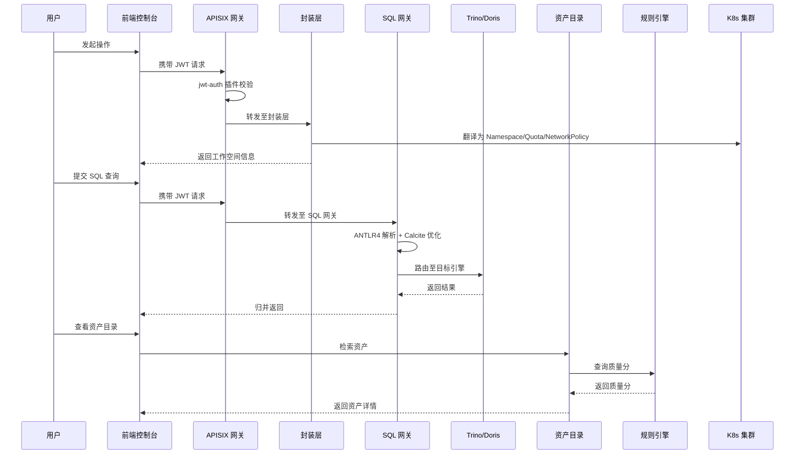
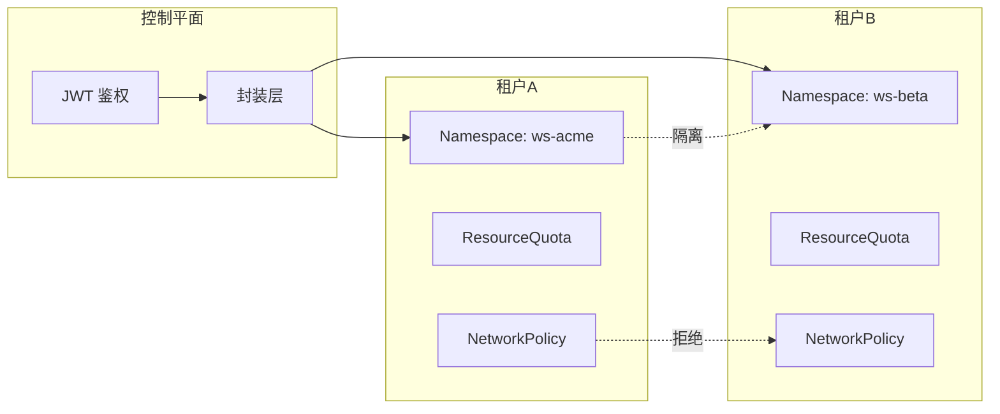
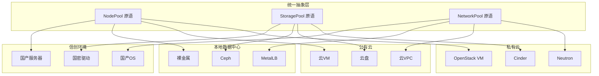

# 架构概览

> 数据引擎大数据平台采用五层 + 一横切层的架构设计，自底向上依次为 L0 基础设施层、L2 引擎层、L3 治理层、L4 开发与分析层、L5 产品层，X 横切层贯穿全部层级。

## 架构总览图

```mermaid
graph TB
    subgraph L5[L5 多租户产品层]
        L51[L5.1 统一控制台]
        L52[L5.2 运营后台]
        L53[L5.3 行业应用模板]
        L54[L5.4 业务线门户]
        L55[L5.5 开放API目录]
        L56[L5.6 数据资产流通]
    end

    subgraph L4[L4 数据开发与分析层]
        L41[L4.1 数据集成 SeaTunnel]
        L42[L4.2 调度编排 DolphinScheduler]
        L43[L4.3 数据开发IDE Theia]
        L44[L4.4 BI可视化 Superset]
        L45[L4.5 智能数据层]
    end

    subgraph L3[L3 数据治理层]
        L31[L3.1 元数据采集]
        L32[L3.2 数据标准]
        L33[L3.3 数据质量]
        L34[L3.4 血缘解析]
        L35[L3.5 资产目录]
        L36[L3.6 主数据]
        L37[L3.7 安全脱敏]
    end

    subgraph L2[L2 大数据引擎层]
        L21[L2.1 统一存储 Iceberg]
        L22[L2.2 批计算 Spark]
        L23[L2.3 流计算 Flink]
        L24[L2.4 交互查询 Trino]
        L25[L2.5 OLAP Doris]
        L26[L2.6 湖仓集一体]
        L27[L2.7 统一SQL网关]
        L28[L2.8 消息流 Kafka]
        L29[L2.9 时序引擎 IoTDB]
        L210[L2.10 多模型引擎]
    end

    subgraph L0[L0 基础设施层]
        L01[L0.1 信创供应]
        L02[L0.2 本地数据中心]
        L03[L0.3 公有云VM]
        L04[L0.4 私有云VM]
        L05[L0.5 跨环境供给抽象]
        L06[L0.6 SKE发行版]
        L07[L0.7 Cilium网络]
        L08[L0.8 容器存储]
        L09[L0.9 可观测基座]
        L011[L0.11 封装层]
        L012[L0.12 弹性调度]
    end

    subgraph X[X 横切能力层]
        X1[X1 统一身份权限]
        X2[X2 安全合规]
        X3[X3 统一运维观测]
        X4[X4 API网关]
    end

    L5 --> L4
    L4 --> L3
    L3 --> L2
    L2 --> L0
    X -.-> L0
    X -.-> L2
    X -.-> L3
    X -.-> L4
    X -.-> L5
```

## 各层职责

### L0 基础设施层

L0 层是平台的运行底座，负责将物理或虚拟资源抽象为统一的 K8s 集群，并通过封装层将客户概念翻译为 K8s 资源。

| 模块 | 职责 | 关键组件 |
| --- | --- | --- |
| L0.1 信创资源供应 | 国产化硬件纳管、IPMI / PXE 引导、国密驱动注入 | infra-provider-xinchang |
| L0.2 本地数据中心供应 | 裸金属纳管、Ceph 集群部署、MetalLB 配置 | infra-provider-baremetal |
| L0.3 公有云 VM 供应 | 云 VM Driver、cloud-init bootstrap、云对象存储密钥管理 | infra-provider-cloud |
| L0.4 私有云 VM 供应 | OpenStack / HuaweiStack / Domestic Driver 适配 | infra-provider-private |
| L0.5 跨环境供给抽象 | NodePool / StoragePool / NetworkPool 三原语与四环境 Driver 抽象 | infra-orchestrator |
| L0.6 SKE 交付底座 | kubeadm/kind 封装的 K8s 底座（内核与 etcd 调优、封装层，无自研 K8s 核心代码） | ske/ |
| L0.7 Cilium 网络 | eBPF 高性能网络、socketLB、多租户网络隔离 | ske/manifests/cilium-values.yaml |
| L0.8 容器存储 | JuiceFS CSI、多环境 CSI 驱动、NVMe 直通、IO_uring 加速 | ske/manifests/ |
| L0.9 可观测基座 | Prometheus + Grafana + Loki + Tempo 统一可观测 | ske/manifests/ |
| L0.11 封装层 | 客户概念到 K8s 资源翻译（Namespace / Quota / NetworkPolicy） | encaps-layer |
| L0.12 弹性调度 | KEDA ScaledObject、Cluster Autoscaler、SKE Scheduler Extender | ske/manifests/hpa-templates.yaml |

### L2 大数据引擎层

L2 层提供湖仓集一体的数据引擎能力，通过统一 SQL 网关对外暴露一个入口。

| 模块 | 职责 | 关键组件 / Chart |
| --- | --- | --- |
| L2.1 统一存储 | Iceberg RestCatalog、StorageDriver 抽象（put / get / list / multipart / presigned） | iceberg-rest, minio, csi-juicefs |
| L2.2 批计算 | Spark 3.5 on K8s、SparkApplication CR 翻译、AQE / DPP 调优 | spark |
| L2.3 流计算 | Flink 1.18 Kubernetes Operator、CDC 连接器、状态后端对象存储 | flink |
| L2.4 交互查询 | Trino 428、Iceberg Connector、ResourceGroup 查询队列、跨源联邦 | trino |
| L2.5 OLAP | Doris 2.0、External Catalog → Iceberg 直查、物化视图、FE / BE 分离弹性 | doris |
| L2.6 湖仓集一体 | "湖 → 仓 → 集"三级数据流转契约 | （架构规范模块） |
| L2.7 统一 SQL 网关 | ANTLR4 解析、Calcite 联邦优化、引擎 Adapter、跨源结果归并 | sql-gateway |
| L2.8 消息流接入 | Kafka 3.6 KRaft 模式、Schema Registry、Topic 多租户隔离 | kafka |
| L2.9 时序引擎 | IoTDB 2.0、ConfigNode / DataNode 分离、冷数据降采样归档 | iotdb |
| L2.10 多模型引擎 | NebulaGraph（图）、Milvus（向量）、Redis（键值）；Elasticsearch（搜索，规划中） | nebula-graph, milvus, redis |

### L3 数据治理层

L3 层提供元数据、标准、质量、血缘、资产目录、主数据、安全脱敏七项治理能力，形成治理闭环。

| 模块 | 职责 | 关键组件 |
| --- | --- | --- |
| L3.1 元数据采集 | 引擎 Hook、定时抽取、SQL 解析、元数据注册与补全 | governance/metadata-collector |
| L3.2 数据标准 | 标准项库、落标校验、标准映射 | rule-engine |
| L3.3 数据质量 | 质量规则 CRUD、规则执行引擎（DqRuleExecutor）、质量分回写 | rule-engine, dqctl |
| L3.4 血缘解析 | 字段级血缘自动采集、图存储、血缘下钻 | governance/lineage-analyzer |
| L3.5 资产目录 | 资产元模型、全文 + 标签 + 分层多维检索、资产登记 / 申请 / 订阅 | catalog |
| L3.6 主数据 | 主数据建模、录入审批、分发、订阅、版本 | （设计文档定义） |
| L3.7 安全脱敏 | 敏感数据识别、分类分级、脱敏函数库、国密 SM2 / SM3 / SM4 | rule-engine (MaskRuleExecutor) |

### L4 数据开发与分析层

L4 层提供数据集成、调度编排、开发 IDE、BI 可视化与智能数据层能力。

| 模块 | 职责 | 关键组件 / Chart |
| --- | --- | --- |
| L4.1 数据集成 | SeaTunnel Zeta 模式 on K8s、Source / Sink 连接器、Transform | seatunnel |
| L4.2 调度编排 | DolphinScheduler、Master / Worker / Alert / API 分离、租户队列隔离 | dolphinscheduler |
| L4.3 数据开发 IDE | Eclipse Theia 二开、SQL / Python LSP、受控终端、按需启停 | theia |
| L4.4 BI 可视化 | Superset + ECharts、SQLAlchemy 数据源对接、行级权限 | superset |
| L4.5.1 标签画像 | 标签管理、人群圈选、画像导出 | tag-engine |
| L4.5.2 机器学习 | MLflow Tracking / Registry / Serving、Spark MLlib 训练 | ml-platform, mlflow |
| L4.5.3 向量库 | Milvus 集合管理、检索 | vector-engine |
| L4.5.4 知识工程 | RAG 切片、向量化、检索增强 | knowledge-engine |
| L4.5.5 LLMOps | 微调、部署、评测闭环 | llmops |
| L4.5.6 大模型网关 | 多模型路由、推理、Token 计量 | llm-gateway |

### L5 多租户产品层

L5 层将平台能力以多租户 SaaS 产品形态对外交付。

| 模块 | 职责 | 关键组件 |
| --- | --- | --- |
| L5.1 统一控制台 | Vue3 前端、14 个核心视图页面、工作空间上下文切换 | frontend/ |
| L5.2 运营后台 | 租户全生命周期管理、套餐 → ResourceQuota 翻译、账单计费、运营看板 | operations |
| L5.3 行业应用模板 | Helm Chart 形式行业模板（DDL + DAG + Dashboard + RBAC） | industry-templates |
| L5.4 业务线门户 | 业务线 → 团队 → 项目组织模型、内部结算 | business-portal |
| L5.5 开放 API 服务目录 | API 发布管理、服务目录、订阅计费 | open-api-catalog |
| L5.6 数据资产流通 | 资产登记 / 上架 / 流通 / 变现 / 分账 | asset-exchange |

### X 横切能力层

X 层贯穿全部层级，提供身份、安全、运维、网关四项横切能力。

| 模块 | 职责 | 关键组件 / Chart |
| --- | --- | --- |
| X1 统一身份权限 | Keycloak Realm、OIDC / OAuth2.1 SSO、国密 CryptoSpiFactory、RBAC / ABAC / UMA | keycloak |
| X2 安全合规 | 等保三级 + 密评 + 数据合规、SecurityFacade 统一封装、证据归档 | （设计文档定义） |
| X3 统一运维观测 | 指标按租户 label 隔离、Loki 按 tenant 分片、Grafana 双视图、Alertmanager 分级路由 | prometheus, grafana, loki, tempo |
| X4 API 网关 | APISIX Ingress Controller、jwt-auth / keycloak-auth 插件链、限流灰度、计量审计 | apisix |

## 组件交互关系

### 关键交互链路

1. **租户创建链路**：前端 → APISIX 网关 → 封装层 → K8s（创建 Namespace + ResourceQuota + NetworkPolicy）→ 资产目录（初始化租户元数据）。
2. **SQL 查询链路**：前端 → APISIX 网关 → SQL 网关（ANTLR4 解析 → Calcite 联邦优化 → 引擎选择）→ 目标引擎（Trino / Doris / Spark / Flink）→ 结果归并 → 前端。
3. **治理闭环链路**：元数据采集器（引擎 Hook）→ 资产目录（注册）→ 规则引擎（质量校验）→ 血缘解析器（血缘采集）→ 资产目录（质量分回写）。
4. **数据开发链路**：前端 → 调度编排（DolphinScheduler）→ 数据集成（SeaTunnel）→ 批 / 流计算（Spark / Flink）→ 统一存储（Iceberg）→ OLAP（Doris）→ BI 可视化（Superset）。

## 多租户隔离机制

数据引擎大数据平台通过三重隔离机制实现租户间完全隔离。

### 隔离层次

| 层次 | 机制 | 说明 |
| --- | --- | --- |
| 资源隔离 | K8s Namespace + ResourceQuota + LimitRange | 每个工作空间对应一个 Namespace，ResourceQuota 限制 CPU / 内存 / 存储上限，LimitRange 限制单 Pod 资源 |
| 网络隔离 | NetworkPolicy | 默认 deny-all，仅显式放行同 Namespace 内通信与白名单流量 |
| 数据隔离 | 引擎层租户标签 + 存储路径隔离 | Iceberg 表路径按 `tenant/<tid>/` 分层，Doris Catalog 按租户隔离，Kafka Topic 命名 `tenant.app.topic.vN` |
| 身份隔离 | JWT token 携带 tenant claim + Keycloak Realm | 请求经 jwt-auth 插件校验后注入 tenant 头，封装层据 tenant 路由至对应 Namespace |
| 可观测隔离 | Prometheus label `tenant=<tid>` + Loki tenant 分片 | 指标与日志按租户标签隔离，Grafana 双视图（平台方全局 + 客户方业务健康） |

## 四环境适配策略

数据引擎大数据平台通过 L0.5 跨环境供给抽象实现一套主代码四环境零改动交付。

### 环境差异对照

| 维度 | 信创 | 本地数据中心 | 公有云 | 私有云 |
| --- | --- | --- | --- | --- |
| 节点供应 | IPMI / PXE 引导国产服务器 | IPMI 纳管裸金属 | 云 VM + cloud-init | OpenStack / HuaweiStack API |
| 存储供应 | 国产 NVMe + JuiceFS | Ceph RBD + JuiceFS | 云对象存储 + 云盘 | Cinder + 私有对象存储 |
| 网络供应 | 国产网卡 + Cilium eBPF | MetalLB + Cilium | 云 VPC + Cilium | Neutron + Cilium |
| Profile 文件 | `ske/profiles/xinchuang.yaml` | `ske/profiles/onprem.yaml` | `ske/profiles/publiccloud.yaml` | `ske/profiles/privatecloud.yaml` |
| 供应 Driver | infra-provider-xinchang | infra-provider-baremetal | infra-provider-cloud | infra-provider-private |

四环境通过统一的 NodePool / StoragePool / NetworkPool 三原语抽象，由 infra-orchestrator 编排，上层封装层与引擎层无需感知环境差异。