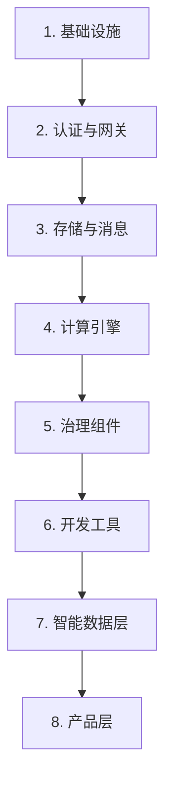

# 部署指南

> 本指南描述数据引擎大数据平台在四环境（信创 / 本地数据中心 / 公有云 / 私有云）下的部署流程。部署以自研 K8s 发行版 SKE 为底座，通过 Helm Chart 编排全部 81 个组件（其中 80 个为骨架级 Chart，生产使用前需补全镜像与探针配置）。

## 前置条件

### 硬件要求

| 环境 | 节点数 | 每节点配置 | 存储 |
| --- | --- | --- | --- |
| 开发 / 测试 | 1 | 8 核 16 GB | 100 GB SSD |
| 生产 - 基础版 | 3 | 16 核 32 GB | 500 GB SSD / 节点 |
| 生产 - 标准版 | 5 | 32 核 64 GB | 1 TB SSD / 节点 |
| 生产 - 旗舰版 | 8+ | 64 核 128 GB | 2 TB NVMe / 节点 |

### 软件要求

| 软件 | 最低版本 | 用途 |
| --- | --- | --- |
| Linux 内核 | 5.15 | eBPF / IO_uring 支持 |
| Docker | 24.0 | 容器运行时（SKE 会替换为 containerd） |
| kubectl | 1.28 | 集群操作 |
| Helm | 3.14 | Chart 部署 |
| bash | 5.0 | 部署脚本执行 |

### 网络要求

- 节点间网络互通，延迟低于 1 ms（同机房）。
- 以下端口放行：6443（K8s API）、10250（kubelet）、2379 / 2380（etcd）、30000-32767（NodePort）。
- 信创环境需放行国密驱动所需端口。

## SKE 集群拉起

SKE（DataEngine Kubernetes Engine）是数据引擎大数据平台自研的 K8s 发行版，基于 kubeadm 二次封装。

### 环境准备

```bash
# 克隆仓库
git clone https://github.com/Levango7/DataEngineBDP.git
cd DataEngineBDP

# WSL2 环境：准备宿主机
sudo bash ske/wsl2/setup-host.sh

# 内核与系统调优
sudo bash ske/ske.sh tune-host
```

### 拉起集群

SKE 支持两条拉起路径：kind（开发测试）与 kubeadm（生产）。

```bash
# 方式一：kind 拉起（开发测试，本地单节点）
sudo bash ske/ske.sh up --target kind --profile local

# 方式二：kubeadm 拉起（生产，多节点）
sudo bash ske/ske.sh up --target wsl2 --profile local

# 方式三：指定环境 Profile
sudo bash ske/ske.sh up --target kubeadm --profile xinchuang    # 信创
sudo bash ske/ske.sh up --target kubeadm --profile onprem       # 本地数据中心
sudo bash ske/ske.sh up --target kubeadm --profile publiccloud  # 公有云
sudo bash ske/ske.sh up --target kubeadm --profile privatecloud # 私有云
```

### 验证集群

```bash
# 检查节点状态
kubectl get nodes -o wide

# 检查系统 Pod
kubectl get pods -n kube-system

# 检查 Cilium 网络
kubectl get pods -n kube-system -l k8s-app=cilium

# 检查存储
kubectl get sc
```

## Helm Chart 部署

数据引擎大数据平台共提供 81 个 Helm Chart（其中 80 个为骨架级，1 个完整实现），位于 `design/deploy/charts/`。

### 部署顺序

Chart 间存在依赖关系，需按以下顺序部署。



### 1. 基础设施 Chart

```bash
# 部署 MinIO 对象存储
helm install minio design/deploy/charts/minio -f design/deploy/values/minio-values.yaml -n shuqing-system --create-namespace

# 部署 PostgreSQL（元数据存储）
helm install postgresql design/deploy/charts/postgresql -f design/deploy/values/postgresql-values.yaml -n shuqing-system

# 部署 Ceph CSI（本地数据中心）
helm install csi-ceph design/deploy/charts/csi-ceph -f design/deploy/values/csi-ceph-values.yaml -n kube-system

# 部署 JuiceFS CSI
helm install csi-juicefs design/deploy/charts/csi-juicefs -f design/deploy/values/csi-juicefs-values.yaml -n kube-system
```

### 2. 认证与网关 Chart

```bash
# 部署 Keycloak
helm install keycloak design/deploy/charts/keycloak -f design/deploy/values/keycloak-values.yaml -n shuqing-system

# 部署 APISIX 网关
helm install apisix design/deploy/charts/apisix -f design/deploy/values/apisix-values.yaml -n shuqing-system
```

### 3. 存储与消息 Chart

```bash
# 部署 Iceberg REST Catalog
helm install iceberg-rest design/deploy/charts/iceberg-rest -n shuqing-system

# 部署 Kafka
helm install kafka design/deploy/charts/kafka -f design/deploy/values/kafka-values.yaml -n shuqing-system

# 部署 ZooKeeper（如需）
helm install zookeeper design/deploy/charts/zookeeper -n shuqing-system
```

### 4. 计算引擎 Chart

```bash
# 部署 Spark
helm install spark design/deploy/charts/spark -f design/deploy/values/spark-values.yaml -n shuqing-system

# 部署 Flink
helm install flink design/deploy/charts/flink -f design/deploy/values/flink-values.yaml -n shuqing-system

# 部署 Trino
helm install trino design/deploy/charts/trino -f design/deploy/values/trino-values.yaml -n shuqing-system

# 部署 Doris
helm install doris design/deploy/charts/doris -f design/deploy/values/doris-values.yaml -n shuqing-system

# 部署 IoTDB
helm install iotdb design/deploy/charts/iotdb -f design/deploy/values/iotdb-values.yaml -n shuqing-system
```

### 5. 治理组件 Chart

```bash
# 部署封装层
helm install encaps-layer design/deploy/charts/encaps-layer -n shuqing-system

# 部署 SQL 网关
helm install sql-gateway design/deploy/charts/sql-gateway -n shuqing-system

# 部署规则引擎
helm install rule-engine design/deploy/charts/rule-engine -n shuqing-system

# 部署资产目录
helm install catalog design/deploy/charts/catalog -n shuqing-system

# 部署元数据采集器
helm install metadata-collector design/deploy/charts/metadata-collector -n shuqing-system

# 部署血缘解析器
helm install lineage-analyzer design/deploy/charts/lineage-analyzer -n shuqing-system
```

### 6. 开发工具 Chart

```bash
# 部署 SeaTunnel
helm install seatunnel design/deploy/charts/seatunnel -f design/deploy/values/seatunnel-values.yaml -n shuqing-system

# 部署 DolphinScheduler
helm install dolphinscheduler design/deploy/charts/dolphinscheduler -f design/deploy/values/dolphinscheduler-values.yaml -n shuqing-system

# 部署 Theia IDE
helm install theia design/deploy/charts/theia -f design/deploy/values/theia-values.yaml -n shuqing-system

# 部署 Superset
helm install superset design/deploy/charts/superset -f design/deploy/values/superset-values.yaml -n shuqing-system
```

### 7. 智能数据层 Chart

```bash
# 部署 Milvus 向量库
helm install milvus design/deploy/charts/milvus -n shuqing-system

# 部署 NebulaGraph 图库
helm install nebula-graph design/deploy/charts/nebula-graph -n shuqing-system

# 部署 Elasticsearch
helm install elasticsearch design/deploy/charts/elasticsearch -n shuqing-system

# 部署 Redis
helm install redis design/deploy/charts/redis -n shuqing-system

# 部署 LLMOps
helm install llmops design/deploy/charts/llmops -n shuqing-system

# 部署大模型网关
helm install llm-gateway design/deploy/charts/llm-gateway -n shuqing-system

# 部署知识工程
helm install knowledge-engine design/deploy/charts/knowledge-engine -n shuqing-system
```

### 8. 可观测 Chart

```bash
# 部署 Prometheus
helm install prometheus design/deploy/charts/prometheus -n shuqing-system

# 部署 Grafana
helm install grafana design/deploy/charts/grafana -n shuqing-system

# 部署 Loki
helm install loki design/deploy/charts/loki -n shuqing-system

# 部署 Tempo
helm install tempo design/deploy/charts/tempo -n shuqing-system
```

## 四环境 Profile 配置

四环境通过 `ske/profiles/` 下的 Profile 文件差异化配置。

| Profile | 文件 | 适用场景 | 关键差异 |
| --- | --- | --- | --- |
| xinchuang | `ske/profiles/xinchuang.yaml` | 信创环境 | 国产 OS / 国密驱动 / 国产网卡 |
| onprem | `ske/profiles/onprem.yaml` | 本地数据中心 | 裸金属 / Ceph / MetalLB |
| publiccloud | `ske/profiles/publiccloud.yaml` | 公有云 | 云 VM / 云盘 / 云 VPC |
| privatecloud | `ske/profiles/privatecloud.yaml` | 私有云 | OpenStack / Cinder / Neutron |

### 切换 Profile

```bash
# 拉起时指定 Profile
sudo bash ske/ske.sh up --target kubeadm --profile xinchuang

# 部署 Chart 时指定 values 覆盖
helm install spark design/deploy/charts/spark \
  -f design/deploy/values/spark-values.yaml \
  -f design/deploy/values/spark-values-xinchuang.yaml \
  -n shuqing-system
```

### 基础 values

所有 Chart 共享 `design/deploy/values-base.yaml` 基础配置，包含镜像仓库、镜像拉取策略、存储类默认值等。环境差异通过环境专属 values 文件覆盖。

## 多租户配置

### 创建租户

通过封装层 API 创建租户，封装层自动翻译为 K8s 资源。

```bash
# 获取管理员 token
ADMIN_TOKEN=$(curl -s -X POST http://keycloak.shuqing-system/realms/master/protocol/openid-connect/token \
  -d "grant_type=password" \
  -d "client_id=admin-cli" \
  -d "username=admin" \
  -d "password=admin" | jq -r .access_token)

# 创建租户
curl -X POST http://apisix.shuqing-system/api/v1/tenants \
  -H "Authorization: Bearer $ADMIN_TOKEN" \
  -H "Content-Type: application/json" \
  -d '{
    "tenantId": "acme",
    "tenantName": "ACME 公司",
    "package": "standard",
    "quota": {
      "cpu": "32",
      "memory": "64Gi",
      "storage": "500Gi"
    }
  }'
```

### 验证租户隔离

```bash
# 检查 Namespace 已创建
kubectl get namespace ws-acme

# 检查 ResourceQuota
kubectl get resourcequota -n ws-acme

# 检查 NetworkPolicy
kubectl get networkpolicy -n ws-acme

# 检查 Namespace 标签
kubectl get namespace ws-acme --show-labels
```

## 平台引导

部署完 Chart 后，执行平台引导脚本初始化运行时。

```bash
# 引导平台运行时（创建 demo 工作空间 + in-cluster MinIO）
bash platform/bootstrap.sh --profile local

# 验证引导结果
kubectl get pods -n ws-demo
kubectl get pods -n shuqing-system
```

## 验证步骤

### 组件健康检查

```bash
# 检查全部自研组件健康
kubectl get pods -n shuqing-system -l app.kubernetes.io/part-of=shuqing

# 逐组件检查
curl http://encaps-layer.shuqing-system/actuator/health
curl http://sql-gateway.shuqing-system/actuator/health
curl http://rule-engine.shuqing-system/actuator/health
curl http://catalog.shuqing-system/health
```

### 端到端 PoC

```bash
# 运行 PoC 验证脚本
bash scripts/poc/run-poc.sh

# 或逐组件验证
bash scripts/poc/verify-encaps.sh
bash scripts/poc/verify-sql-gateway.sh
bash scripts/poc/verify-rule-engine.sh
bash scripts/poc/verify-catalog.sh
```

### 集成测试

```bash
# 运行集成测试（需 docker-compose）
cd tests/integration
docker-compose up -d
pytest -v
docker-compose down
```

### 前端验证

```bash
# 构建前端
cd frontend
npm install
npm run build

# 部署前端（nginx 或 K8s ConfigMap）
kubectl create configmap frontend-dist --from-file=dist/ -n shuqing-system
```

## 故障排查

### SKE 集群拉起失败

| 症状 | 可能原因 | 解决方案 |
| --- | --- | --- |
| 节点 NotReady | Cilium 未就绪 | `kubectl logs -n kube-system -l k8s-app=cilium` 查看日志 |
| etcd 启动失败 | 磁盘 IO 不足 | 检查磁盘性能，确保 etcd 使用独占 SSD |
| scheduler-policy 报错 | 引用不存在的插件 | 检查 `ske/manifests/` 中 scheduler 配置 |
| socketLB.mode 非法 | Cilium 配置错误 | 将 socketLB.mode 改为合法值（police / always / off） |

### Helm 部署失败

| 症状 | 可能原因 | 解决方案 |
| --- | --- | --- |
| ImagePullBackOff | 镜像不存在或仓库不可达 | 检查镜像仓库地址与凭证 |
| Pending | 存储类不存在或容量不足 | `kubectl get sc` 检查存储类，扩容或更换存储类 |
| CrashLoopBackOff | 配置错误或依赖未就绪 | `kubectl logs <pod>` 查看日志，检查依赖组件状态 |

### 多租户隔离失效

| 症状 | 可能原因 | 解决方案 |
| --- | --- | --- |
| 跨租户访问 | NetworkPolicy 未生效 | `kubectl get networkpolicy -n <ns>` 检查策略 |
| 资源超限 | ResourceQuota 未配置 | `kubectl get resourcequota -n <ns>` 检查配额 |
| JWT 校验失败 | Keycloak Realm 配置错误 | 检查 Keycloak Realm 与 jwt-auth 插件配置 |

### 获取帮助

- 查看组件日志：`kubectl logs -n <namespace> <pod-name>`
- 查看事件：`kubectl get events -n <namespace> --sort-by=.lastTimestamp`
- 提交 Issue：https://github.com/Levango7/DataEngineBDP/issues
## 生产环境安全加固清单

生产部署前必须完成以下检查，缺失任一项都可能导致严重的安全风险：

| 检查项 | 操作 | 不做的后果 |
| --- | --- | --- |
| JWT 密钥 | 导出强随机 `JWT_SECRET`（`openssl rand -base64 48`） | 使用可预测的默认密钥，任何人可伪造任意租户 Token |
| IPMI 凭据 | 设置 `IPMI_USERNAME` / `IPMI_PASSWORD`（无默认值，未配置时进程退出） | 裸金属带外管理将使用公知的 `ADMIN/ADMIN` |
| 运营后台 Token | 设置强随机 `ADMIN_TOKEN` | 已 fail-fast 保护，但仍须避免弱 Token |
| dev 占位凭据 | 生产使用 `values-prod.yaml`，替换所有 `REPLACE_WITH_*` | dev 明文密码驻留 Git 仓库，镜面泄露风险 |
| 密钥扫描复查 | 运行一次 `gitleaks detect` 确保无遗留 | 历史上的旧凭据可能仍在历史中，需轮换 |

> 所有密钥均通过环境变量或外部密钥管理（如 Vault / Sealed Secrets / External Secrets）注入，禁止写入版本库。生产环境 `application-prod.yml` 对 JWT 已做无默认值 fail-fast。
